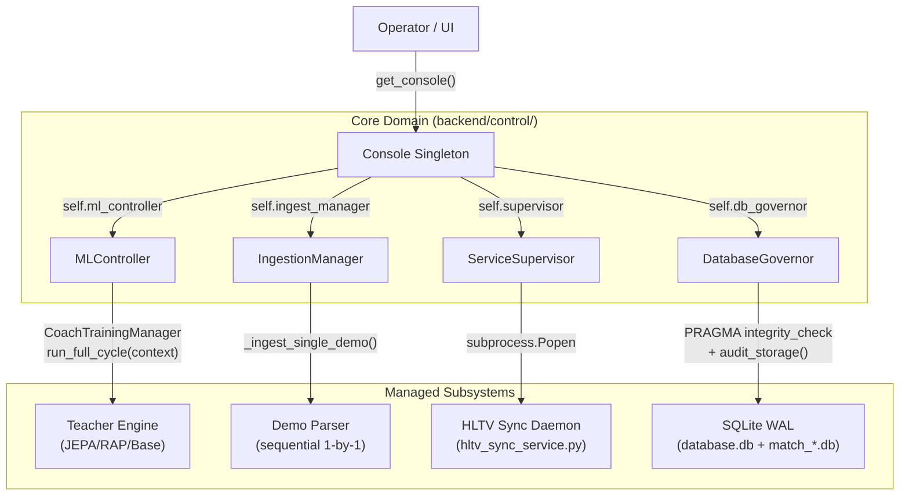
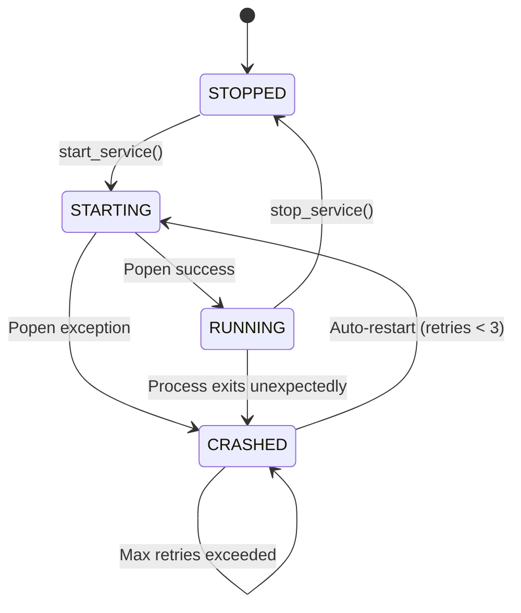
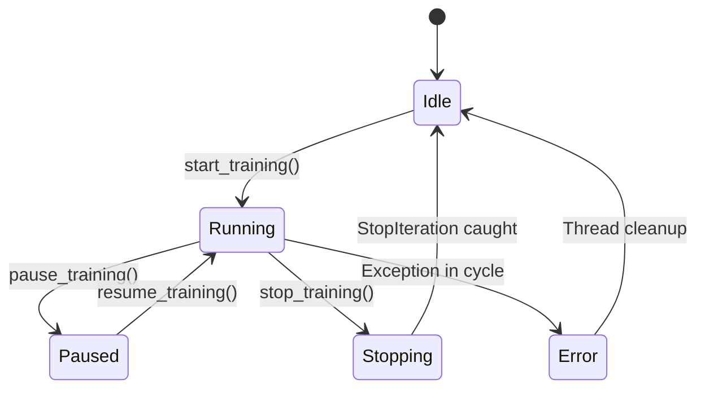
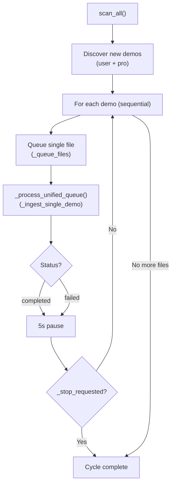

# Unified Control Console: Technical Design Document

## 1. Executive Summary
The Unified Control Console ("The Console") is the authoritative control plane for the Macena CS2 Analyzer. It replaces the earlier collection of loose scripts with a centralized, governed, and API-accessible supervisor. It is responsible for the lifecycle management of all subsystems (ML, Ingestion, Telemetry), database integrity, and operational safety.

**Implementation status:** Phases 1–3 are complete. Phase 4 (REST API wiring) is pending.

**Source files:**

| File | Purpose |
|:---|:---|
| `Programma_CS2_RENAN/backend/control/console.py` | Console singleton, ServiceSupervisor, boot/shutdown |
| `Programma_CS2_RENAN/backend/control/ml_controller.py` | MLController + MLControlContext |
| `Programma_CS2_RENAN/backend/control/ingest_manager.py` | IngestionManager (unified queue processor) |
| `Programma_CS2_RENAN/backend/control/db_governor.py` | DatabaseGovernor (audit, integrity, pruning) |

## 2. Architecture

The Console operates as a **Singleton Supervisor** within the main application process. It currently exposes control via:
1.  **Python API:** Direct access for internal components via `get_console()`.
2.  **REST API:** Endpoints defined in Section 4 (integration pending — Phase 4).
3.  **CLI:** Operator intervention through `console.py` (future).

### 2.1 Component Diagram



### 2.2 Class Structure

#### `Console` (Singleton — `console.py`)

Thread-safe singleton via `__new__` + `_lock`. Entry point for all control operations.

| Attribute | Type | Purpose |
|:---|:---|:---|
| `project_root` | `Path` | Resolved 3 levels up from `__file__` |
| `state` | `SystemState` | IDLE / BUSY / MAINTENANCE / ERROR |
| `supervisor` | `ServiceSupervisor` | Background daemon management |
| `ingest_manager` | `IngestionManager` | Demo ingestion queue |
| `db_governor` | `DatabaseGovernor` | Storage audit and integrity |
| `ml_controller` | `MLController` | Training lifecycle |

| Method | Purpose |
|:---|:---|
| `boot()` | Start Hunter service, audit DBs. Ingestion auto-start is **disabled** (manual control only). |
| `shutdown()` | Graceful stop of all subsystems with 5s polling loop for async propagation. |
| `get_system_status()` | Aggregated health report with per-subsystem error isolation (`_safe_call` pattern). |
| `start_training()` / `stop_training()` / `pause_training()` / `resume_training()` | ML control wrappers delegating to `MLController`. |
| `_audit_databases()` | Verifies Tier 1/2 integrity via `db_governor`. Sets `SystemState.ERROR` on failure. |
| `_compute_state()` | Live state derivation — checks supervisor for crashed services. |
| `_get_baseline_status()` | Temporal baseline health (Proposal 11): stat card count, temporal metric count, mode (temporal/legacy/unavailable). |

**Global accessor:** `get_console() -> Console`

#### `ServiceSupervisor` (`console.py`)

Manages background daemons as subprocesses with auto-restart.

| Feature | Detail |
|:---|:---|
| **Registered services** | `"hunter"` → `hltv_sync_service.py` |
| **Launch** | `subprocess.Popen` with `sys.executable`, PYTHONPATH injection, `CREATE_NO_WINDOW` on Windows |
| **Monitoring** | Dedicated daemon thread per process (`_monitor_process`), reads stdout/stderr via `process.communicate()` |
| **Auto-restart** | Max 3 retries, resets after 1 hour idle. 5s delay between retries via `threading.Timer`. |
| **Stop** | `terminate()` with 5s timeout, then `kill()` |
| **Thread safety** | `threading.Lock` on all service state mutations |



#### `MLController` + `MLControlContext` (`ml_controller.py`)

| Component | Purpose |
|:---|:---|
| `MLControlContext` | Control token passed into `CoachTrainingManager.run_full_cycle(context=...)`. Provides `check_state()` for cooperative interruption. |
| `MLController` | Thread wrapper. Launches training in a daemon thread, tracks running/paused/stopped state. |

**Control points via `MLControlContext.check_state()`:**

| Control | Mechanism |
|:---|:---|
| **Pause/Resume** | Busy-wait loop (`while self._pause_requested: sleep(1)`). Updates `state_manager` with "Paused"/"Running". |
| **Soft Stop** | Raises `StopIteration("ML Operator requested termination.")` — caught by `_run_wrapper`. |
| **Throttle** | `sleep(throttle_factor)` injection. 0.0 = full speed, 1.0 = max delay. |



#### `IngestionManager` (`ingest_manager.py`)

Operator-governed ingestion controller with three modes and strict sequential processing.

| Feature | Detail |
|:---|:---|
| **Modes** | `SINGLE` (one file, stop), `CONTINUOUS` (all files, loop), `TIMED` (interval-based) |
| **Processing** | **Strict sequential**: queue 1 file → ingest → 5s pause → next file |
| **Queue source** | `StorageManager.list_new_demos()` for both user and pro demos |
| **Task tracking** | `IngestionTask` DB model: queued → processing → completed/failed |
| **Progress** | Real-time via `state_manager.update_parsing_progress()` (0–100) |
| **Priority** | `ResourceManager.set_high_priority()` / `set_low_priority()` |
| **Stop** | Cooperative via `_stop_requested` flag, checked between files and between queue items |

| Method | Purpose |
|:---|:---|
| `scan_all(high_priority)` | Universal entry point. Launches `_run_unified_cycle` in daemon thread. |
| `stop()` | Sets `_stop_requested` flag. |
| `set_mode(mode, interval)` | Switch between SINGLE / CONTINUOUS / TIMED modes. |
| `get_status()` | Returns queued/processing/failed counts, current file, mode, progress. |



#### `DatabaseGovernor` (`db_governor.py`)

Authoritative controller for all three database tiers.

| Method | Purpose |
|:---|:---|
| `audit_storage()` | Scans Tier 1/2 (database.db + WAL/SHM), Tier 3 (match_*.db count and total size), HLTV metadata DB. Reports anomalies. |
| `verify_integrity()` | `PRAGMA integrity_check` on monolith DB. Returns `{"monolith": True/False}`. |
| `prune_match_data(match_id)` | Privileged deletion via `MatchDataManager.delete_match()`. Logged as warning. |
| `rebuild_indexes()` | Maintenance `REINDEX` via ORM engine. |

**Anomaly detection:**
- CRITICAL: `database.db` not found (checks both `DB_DIR` and `CORE_DB_DIR`)
- CRITICAL: `hltv_metadata.db` missing with no backup
- WARNING: `hltv_metadata.db` missing but `.bak` exists (restore required)

## 3. State Machines

### 3.1 System State (`SystemState`)

```
IDLE ─── (boot) ──→ IDLE
  │                   │
  │   (DB audit fail) │
  └──→ ERROR ←────────┘
```

The Console sets `SystemState.ERROR` when:
- Monolith DB integrity check fails
- DB audit encounters critical anomalies
- `_compute_state()` detects any crashed service

### 3.2 Service Status (`ServiceStatus`)

```
STOPPED → STARTING → RUNNING → STOPPED  (normal lifecycle)
                  ↓           ↓
               CRASHED ←──────┘
                  ↓
               STARTING  (auto-restart, max 3)
```

## 4. API Contract (FastAPI Extensions — Phase 4, Pending)

The existing `server.py` will be expanded to mount the Console API.

| Endpoint | Method | Purpose |
|:---|:---|:---|
| `/api/console/status` | GET | System-wide health (`get_system_status()`). |
| `/api/console/control/ml` | POST | `{action: "start" | "pause" | "resume" | "stop"}` |
| `/api/console/control/ingest` | POST | `{action: "scan" | "stop", high_priority: bool}` |
| `/api/console/services/{name}` | POST | `{action: "restart" | "stop"}` |
| `/api/console/audit/db` | GET | Storage usage and integrity report (`audit_storage()` + `verify_integrity()`). |

## 5. Implementation Status

### Phase 1: Foundation (Complete)
1.  ~~Create `Programma_CS2_RENAN/backend/control/console.py`.~~
2.  ~~Implement `Console` singleton with thread-safe state management.~~
3.  ~~Implement `ServiceSupervisor` to wrap `hltv_sync_service.py` with auto-restart (max 3, 1hr reset).~~

### Phase 2: Ingestion & DB Governance (Complete)
1.  ~~Implement `IngestionManager` with 3 modes (SINGLE/CONTINUOUS/TIMED) and strict sequential processing.~~
2.  ~~Implement `DatabaseGovernor` with `audit_storage()`, `verify_integrity()`, `prune_match_data()`, and `rebuild_indexes()`.~~
3.  ~~Integrate temporal baseline health reporting (`_get_baseline_status()`).~~

### Phase 3: ML Control (Complete)
1.  ~~Implement `MLControlContext` with `check_state()` cooperative interruption.~~
2.  ~~Implement `MLController` thread wrapper with start/stop/pause/resume.~~
3.  ~~Wire `CoachTrainingManager.run_full_cycle(context=...)` to accept control context.~~

### Phase 4: REST API Integration (Pending)
1.  Wire `server.py` to `Console` via FastAPI endpoints.
2.  Update `main.py` to boot the Console on application start.

## 6. Risks & Mitigation

*   **Risk:** SQLite locking during concurrent Ingestion + Training.
    *   *Mitigation:* Console enforces sequential ingestion (1-by-1 with 5s pause). WAL mode reduces contention.
*   **Risk:** Zombie processes (Hunter daemon).
    *   *Mitigation:* `ServiceSupervisor` monitors via `process.communicate()`, auto-restarts (max 3), and `terminate()`/`kill()` on shutdown.
*   **Risk:** Subsystem crash during `get_system_status()`.
    *   *Mitigation:* Per-subsystem error isolation via `_safe_call()` pattern — one failing subsystem does not block status reporting for others.
*   **Risk:** Deadlock between `ServiceSupervisor._lock` and auto-restart `Timer`.
    *   *Mitigation:* Timer fires 5s after lock release; `start_service` re-acquires lock independently (no nested lock acquisition).
