# Ultimate CS2 Coach — Sistema AI

> **Argomenti:** Spiegazione completa di ogni componente AI, architettura del modello, regime di addestramento, sistema di conoscenza, percorso dati nel progetto, e logica completa del programma (avvio, interfaccia desktop, architettura quad-daemon, pipeline di ingestione, storage, playback tattico, osservabilità e ciclo di vita dell'applicazione).
>
> **Autore:** Renan Augusto Macena

---

### Introduzione di Renan

Questo progetto è il risultato di innumerevoli ore di preparazione, perfezionamento e, soprattutto, ricerca. Counter-Strike è il mio calcio, qualcosa di cui sono appassionato da tutta la vita, come la musica. In questo gioco ho ormai più di 10 mila ore e ci gioco dal 2004, ho sempre desiderato una guida professionale, come quella dei veri giocatori professionisti, per capire come appare realmente quando qualcuno si allena nel modo giusto, e gioca nel modo giusto sapendo cosa è giusto o sbagliato e non solo supponendolo. A questo punto la mia fiducia è legata alla mia conoscenza del gioco, ma è ancora lontana dal livello a cui vorrei giocare. Immagino che molte persone come me, in questo gioco o forse in altri, si sentano allo stesso modo: sanno di avere esperienza e conoscenza di ciò che stanno facendo, ma si rendono conto che i giocatori professionisti sono così tanto più abili e rifiniti che persino anni di esperienza non possono eguagliare una frazione di ciò che questi professionisti offrono.

Questo progetto tenta di "dare vita", utilizzando tecniche avanzate, a un coach definitivo per Counter-Strike, uno che capisca il gioco, valuti dozzine di aspetti con chiarezza e giudizio raffinato, assimili e diventi più intelligente col passare del tempo.. Il mio obiettivo finale è farlo ingerire, elaborare e imparare da tutte le partite pro di sempre, non tutti i playoff, oltre ad essere irrealistico per le dimensioni e il tempo di elaborazione, sarebbe inutile poiché il mio obiettivo è avere questo coach definitivo basato sul meglio del meglio. Il modello per il giocatore "a bassa abilità" sarà sempre l'utente, lui o lei non avrà mai demo e partite da cui questo coach possa imparare; invece, questo è un metodo di approccio completamente diverso, poiché il coach utilizzerà il suo modello di alta qualità per confrontarlo con il modello dell'utente, mostrando quanto l'utente sia realmente lontano dal livello di un giocatore professionista e, cosa più importante, adattando gli insegnamenti per aiutare l'utente a raggiungere il livello pro, adattandosi a ogni diverso stile di gioco: se sono un awper, lentamente ma inesorabilmente questo coach mi insegnerà come diventare un awper professionista, e questo vale per ogni ruolo nel gioco in cui un utente voglia diventare un professionista.

E ora con la passione che sto sviluppando per la programmazione, capendo tutta questa roba complicata sulla gestione del database, SQL, modelli di machine learning, Python, e quanto possa essere elegante, da tutti questi passaggi tecnici di implementazione, regolazione e creazione di API, e capendo cos'è quella .dll che ho visto per tutta la vita dentro le cartelle del gioco, capendo a cosa servono quei framework come Kivy per creare la grafica, imparando cosa significa realmente creare software, ho dovuto imparare ad andare su Linux (non sono decisamente un professionista, e se non avessi seguito le stesse istruzioni che ho creato mentre facevo ricerche e continuavo a lavorare su questo progetto, non ci sarei riuscito) per capire come costruire il programma, come renderlo cross-platform. Da Linux, ho costruito la versione APK (devo finire di lavorare anche su quella), e ho almeno capito i concetti più importanti della Compilazione, poi ho finito la build desktop su Windows e ho fatto tutto il resto, compilazione e packaging. In breve, spingersi al limite per capire, sfidare se stessi così tanto, su così tanti aspetti diversi che devi o assimilare non solo qualcosa ma anche le specifiche e il quadro complesso di tutto, o non arriverai da nessuna parte.

Ho usato strumenti, come Claude CLI sul terminale windows e linux, per aiutarmi a organizzare il codice e correggere gli errori di sintassi. Ho creato una cartella nella cartella del progetto contenente una "Tool Suite" composta da script Python che ho aiutato a creare e che hanno una tonnellata di funzioni utili, dal debug alla modifica di valori, regole, funzioni, stringhe a livello globale o locale del progetto in modo che da un singolo input all'interno di quello strumento, io possa cambiare tutto ciò che voglio "ovunque", persino cambiare le cose sulla dashboard grafica con gli input. Non dormo da circa venti giorni consecutivi (dal 24 dicembre 2025), sì, ma penso che ne valga la pena, e so bene che questo è solo un allenamento alla fine che ho capito come fare da solo dall'inizio alla fine, quindi ci sono certamente errori in giro. Se possa essere davvero utile, davvero funzionale, ecc., ecc., e molte altre belle cose, non lo so. Non voglio sopravvalutare quello che sto facendo. Lo sto facendo, ma ci ho messo davvero molto impegno.

Spero che qualcosa lì dentro possa essere utile.

---

## Indice

1. [Riepilogo esecutivo](#1-executive-summary)
2. [Panoramica dell&#39;architettura di sistema](#2-system-architecture-overview)
3. [Sottosistema 1 — Core della rete neurale (](#3-subsystem-1--neural-network-core)`backend/nn/`)
4. [Sottosistema 2 — Modello di coach RAP (](#4-subsystem-2--rap-coach-model)`backend/nn/rap_coach/`)
5. [Sottosistema 3 — Servizi di coaching (](#5-subsystem-3--coaching-services)`backend/services/`)
6. [Sottosistema 4 — Conoscenza e recupero (](#6-subsystem-4--knowledge--retrieval)`backend/knowledge/`)
7. [Sottosistema 5 — Motori di analisi (](#7-subsystem-5--analysis-engines)`backend/analysis/`)
8. [Sottosistema 6 — Elaborazione e feature engineering (](#8-subsystem-6--processing--feature-engineering)`backend/processing/`)
9. [Schema del database e ciclo di vita dei dati](#9-database-schema--data-lifecycle)
10. [Regime di formazione e Controllo di maturità](#10-training-regime--maturity-gating)
11. [Catalogo delle funzioni di perdita](#11-loss-functions-catalogue)
12. [Logica completa del programma — Dal lancio al consiglio](#12-logica-completa-del-programma--dal-lancio-al-consiglio)

---

## 1. Riepilogo esecutivo

CS2 Ultimate è un **sistema di coaching basato su IA ibrido** per Counter-Strike 2 (CS2). Combina modelli di deep learning (JEPA, VL-JEPA, LSTM+MoE, un'architettura RAP a 7 componenti (Percezione, Memoria LTC+Hopfield, Strategia, Pedagogia, Attribuzione Causale, Testa di Posizionamento + Comunicazione esterna), un Neural Role Classification Head), un Coach Introspection Observatory, un Retrieval-Augmented Generation (RAG), la banca dati delle esperienze COPER, la ricerca basata sulla teoria dei giochi, la modellazione bayesiana delle credenze e un'architettura Quad-Daemon (Hunter, Digester, Teacher, Pulse) in una pipeline unificata che:

1. **Ingerisce** file demo professionali e utente, estraendo statistiche di stato a livello di tick e di partita.
2. **Addestra** più modelli di reti neurali attraverso un programma a fasi con limiti di maturità (a 3 livelli: CALIBRAZIONE → APPRENDIMENTO → MATURO). 3. **Inferisce** consigli di allenamento fondendo le previsioni di apprendimento automatico con conoscenze tattiche recuperate semanticamente tramite una catena di fallback a 4 livelli (COPER → Ibrido → RAG → Base).
3. **Spiega** il suo ragionamento tramite attribuzione causale, narrazioni basate su template, confronti tra giocatori professionisti e un'opzionale rifinitura LLM (Ollama).

Il sistema contiene **≈ oltre 54.000 righe di Python** distribuite su oltre 288 file sorgente, che si estendono su sei sottosistemi logici AI, un Osservatorio di addestramento, un'architettura Quad-Daemon per l'automazione in background, un'interfaccia desktop Kivy con pattern MVVM e un sistema completo di ingestione, storage e reporting documentati di seguito.

> **Analogia:** Immagina di avere un allenatore robot super intelligente che guarda le tue partite di calcio in video. Innanzitutto, **guarda** centinaia di partite professionistiche e le tue, prendendo appunti su ogni singola mossa (questa è la parte di "ingestione", gestita dal daemon Hunter che scansiona le cartelle e dal daemon Digester che elabora i file). Poi, **studia** quegli appunti e impara cosa fanno i grandi giocatori in modo diverso dai principianti, come uno studente che affronta i vari livelli scolastici (CALIBRARE è l'asilo, APPRENDERE è la scuola media, MATURARE è il diploma) — questo lo fa il daemon Teacher in background. Quando è il momento di darti un consiglio, non si limita a tirare a indovinare: controlla il suo **quaderno di suggerimenti**, la sua **memoria delle sessioni di allenamento passate** e cosa farebbero i **professionisti** nella tua esatta situazione, scegliendo la fonte di cui si fida di più. Infine, **spiega** perché ti sta dicendo di fare qualcosa, non solo "fai questo", ma "fai questo *perché* continui a essere colto alla sprovvista". È come avere un allenatore che ha visto ogni partita professionistica mai giocata, ricorda ogni sessione di allenamento che hai fatto e può spiegarti esattamente perché dovresti cambiare strategia. Nel frattempo, l'interfaccia desktop Kivy ti mostra tutto in tempo reale: una mappa tattica 2D con il tuo "fantasma" ottimale, grafici radar delle tue abilità, e una dashboard che ti dice esattamente a che punto è il tuo allenatore nel suo processo di apprendimento. Il daemon Pulse assicura che il sistema sia sempre vigile con un battito cardiaco costante.

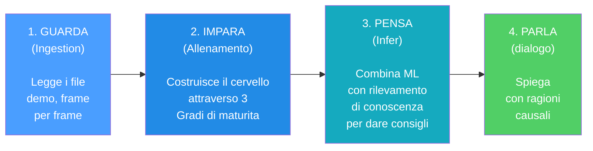

> 288+ source files · 54,000+ lines · 6 AI subsystems + Observatory + Quad-Daemon + Desktop UI

---

## 2. Panoramica dell'architettura del sistema

Il sistema è suddiviso in **6 sottosistemi principali** che lavorano insieme come i reparti di un'azienda. Ogni sottosistema ha un compito specifico e i dati fluiscono tra di essi in una pipeline ben definita.

> **Analogia :** Pensa all'intero sistema come a una **grande fabbrica con 6 reparti**. Il primo reparto (Ingestione) è la **sala posta**: riceve le registrazioni grezze delle partite e le ordina. Il secondo reparto (Elaborazione) è l'**officina**: analizza le registrazioni e misura tutto ciò che contiene. Il terzo reparto (Formazione) è la **scuola**: istruisce il cervello dell'IA mostrandogli migliaia di esempi. Il quarto reparto (Conoscenza) è la **biblioteca**: memorizza suggerimenti, consigli passati e conoscenze specialistiche in modo che l'allenatore possa consultarle. Il quinto reparto (Inferenza) è il **cervello**: combina ciò che l'IA ha imparato con ciò che la biblioteca conosce per creare consigli. Il sesto dipartimento (Analisi) è la **squadra investigativa**: conduce indagini speciali come "questo giocatore è in difficoltà?" o "era una buona posizione?". Tutti e sei i dipartimenti lavorano insieme affinché l'allenatore possa fornire consigli intelligenti e personalizzati.

```mermaid
graph TB
    subgraph Acquisizione
        DEMO["File .dem"] --> PARSER["Parser Demo<br/>(demoparser2)"]
        HLTV["Crawler HLTV"] --> PRO_DB["DB Giocatori Pro"]
        CSV["CSV Esterni"] --> EXT_DB["Migratore CSV"]
    end

    subgraph Elaborazione
        PARSER --> FE["Ingegneria delle Feature<br/>(feature_base, kast, rating, feature_ruolo)"]
        PARSER --> TF["Fabbrica Tensori<br/>(mappa, vista, raster movimento)"]
        FE --> VEC["Vettorizzatore Unificato<br/>(FeatureExtractor 25-dim)"]
        VEC --> SR["Ricostruttore di Stato"]
        TF --> SR
    end

    subgraph Addestramento
        SR --> JEPA["Pre-Addestramento JEPA<br/>(Auto-Supervisionato InfoNCE)"]
        SR --> VLJEPA["VL-JEPA<br/>(Allineamento Visione-Linguaggio)"]
        FE --> MLP["AdvancedCoachNN<br/>(LSTM + MoE, 3 esperti)"]
        SR --> RAP["Addestramento RAP Coach<br/>(Architettura 7 Componenti)"]
        EXT_DB --> ROLE_HEAD["NeuralRoleHead<br/>(MLP 5→32→16→5)"]
        JEPA --> COACH_MGR["Gestore Coach<br/>(Gating Maturità 3 Livelli)"]
        VLJEPA --> COACH_MGR
        MLP --> COACH_MGR
        RAP --> COACH_MGR
        ROLE_HEAD --> COACH_MGR
    end

    subgraph Osservatorio["Osservatorio (Introspezione Addestramento)"]
        COACH_MGR --> OBS_CB["Registro Callback<br/>(Architettura Plugin)"]
        OBS_CB --> OBS_TB["TensorBoard<br/>(9+ scalari, istogrammi)"]
        OBS_CB --> OBS_MAT["Osservatorio Maturità<br/>(5 segnali → convinzione)"]
        OBS_CB --> OBS_EMB["Proiettore Embedding<br/>(spazio credenze UMAP)"]
    end

    subgraph Conoscenza
        RAG["Base Conoscenza RAG<br/>(Sentence-BERT 384-dim)"]
        EB["Banca Esperienze<br/>(Framework COPER)"]
        KG["Grafo della Conoscenza<br/>(Triple SQLite)"]
    end

    subgraph Analisi
        GT["Expectiminimax<br/>Albero di Gioco - profondità 3"]
        BM["Stimatore Bayesiano<br/>Probabilità Morte"]
        DI["Indice Inganno<br/>3 sotto-metriche"]
        RC["Classificatore Ruoli<br/>6 ruoli + Consenso Neurale"]
        WP["Predittore Probabilità<br/>Vittoria - 12 feature"]
        MOM["Tracker Momentum<br/>Rilevamento Tilt/Hot"]
        ENT["Analizzatore Entropia<br/>Impatto utilità Shannon"]
        BS["Rilevatore Punti Ciechi"]
        UE["Utilità ed Economia<br/>Ottimizzatore acquisti"]
    end

    subgraph Inferenza
        COACH_MGR --> HE["Servizio Coaching 4 Livelli<br/>(COPER, Ibrido, RAG, Base)"]
        RAG --> HE
        EB --> HE
        KG --> HE
        PRO_DB --> PB["Ponte Pro / Risolutore Token"]
        PB --> HE
        GT --> HE
        BM --> HE
        DI --> HE
        RC --> HE
        HE --> OLLAMA["OllamaCoachWriter<br/>(Rifinitura NL Opzionale)"]
        HE --> EXP["Livello Spiegabilità"]
    end

    EXP --> UI["GUI Kivy"]

    style JEPA fill:#4a9eff,color:#fff
    style VLJEPA fill:#3b8ae6,color:#fff
    style RAP fill:#ff6b6b,color:#fff
    style ROLE_HEAD fill:#cc5de8,color:#fff
    style HE fill:#51cf66,color:#fff
    style RAG fill:#ffd43b,color:#000
    style OBS_TB fill:#868e96,color:#fff
    style OBS_MAT fill:#868e96,color:#fff
    style OBS_EMB fill:#868e96,color:#fff
```

**Spiegazione Diagramma:** Questo grande diagramma è come una **mappa del tesoro** che mostra come le informazioni viaggiano attraverso il sistema. Il viaggio inizia in alto a sinistra con le registrazioni grezze del gioco (file `.dem`, dati HLTV, file CSV): pensateli come **ingredienti grezzi** che arrivano in cucina. Questi ingredienti passano attraverso la sezione Elaborazione dove vengono **tagliati, misurati e preparati** (vengono estratte le caratteristiche, creati i vettori). Poi raggiungono la sezione Formazione dove cinque diversi "chef" (JEPA, VL-JEPA, AdvancedCoachNN, RAP e NeuralRoleHead) imparano ciascuno il proprio stile di cucina. L'Osservatorio è l'**ispettore del controllo qualità** che osserva ogni sessione di formazione, verificando se gli chef stanno migliorando, sono in stallo o sono in preda al panico. La sezione Conoscenza è come lo **scaffale del ricettario**: contiene suggerimenti (RAG), successi culinari passati (COPER) e relazioni tra gli ingredienti (Grafico della Conoscenza). La sezione Inferenza è dove lo **capo chef** combina tutto – competenze acquisite, libri di ricette e tecniche da chef professionista – per creare il piatto finale: consigli di coaching. La sezione Analisi è come avere dei **critici gastronomici** che valutano qualità specifiche: "È troppo piccante?" (momentum), "È creativo?" (indice di inganno), "Hanno dimenticato un ingrediente?" (punti ciechi). Dietro le quinte, l'**architettura Quad-Daemon** (Hunter, Digester, Teacher, Pulse) lavora instancabilmente come il personale di cucina automatizzato: scansiona nuovi ingredienti, li prepara e aggiorna le competenze degli chef senza mai fermarsi. Tutto scorre verso il basso e verso destra fino a raggiungere l'interfaccia grafica di Kivy, il **piatto** dove l'utente vede il risultato finale.

### Riepilogo flusso dei dati

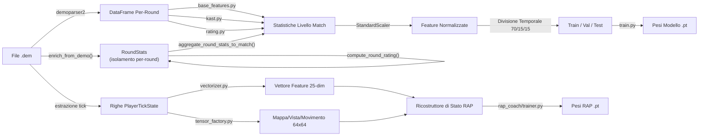

**Spiegazione diagramma:** Questo diagramma mostra le **due linee di montaggio parallele** all'interno del reparto di elaborazione. Immaginate la registrazione di una partita (file `.dem`) come un **lungo filmato**. La **linea di montaggio superiore** guarda il filmato e scrive statistiche riassuntive, come una pagella per ogni partita (uccisioni, morti, danni, ecc.). Queste pagelle vengono normalizzate (messe sulla stessa scala, come se tutte le temperature fossero convertite in gradi Celsius), divise in gruppi di studio (70% per l'apprendimento, 15% per i quiz, 15% per gli esami finali) e utilizzate per allenare il modello di allenamento di base. La **linea di montaggio inferiore** è più dettagliata: esamina il filmato **fotogramma per fotogramma** (ogni "ticchettio" del cronometro di gioco), misurando 25 informazioni su ciascun giocatore in ogni momento (posizione, salute, cosa vedono, economia, ecc.) e creando "istantanee" di 64x64 pixel della mappa. Sia i numeri che le immagini vengono inseriti nel RAP Coach's State Reconstructor, che li combina in un quadro completo di "cosa stava succedendo in questo preciso momento" - ed è da questo che impara il modello avanzato RAP Coach.

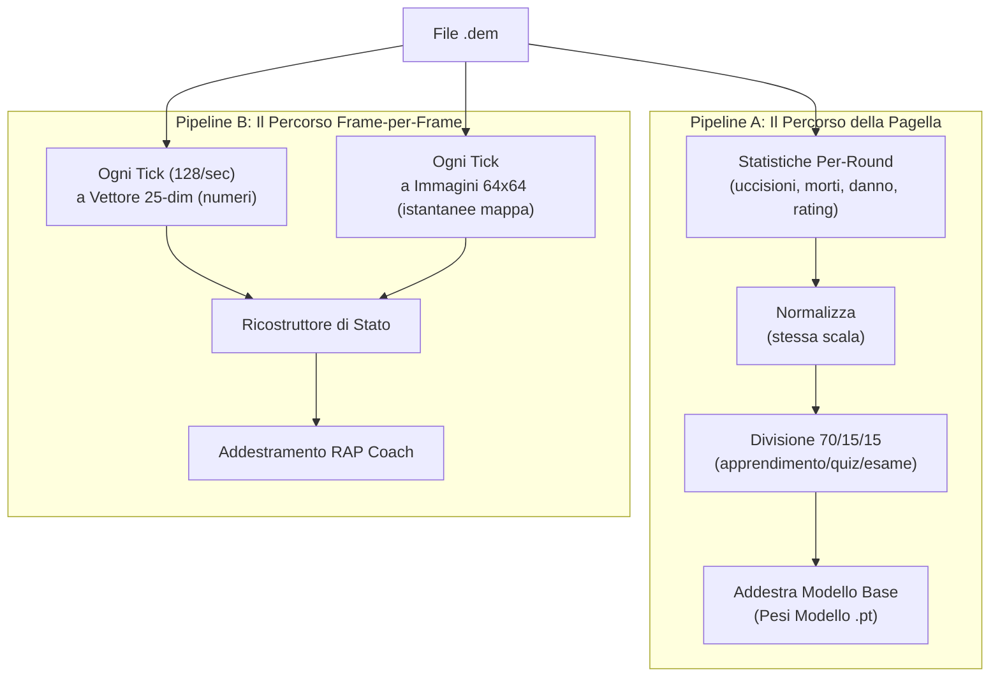

---

## 3. Sottosistema 1 — Nucleo della rete neurale

**Cartella nel programma:** `backend/nn/`
**File chiave:** `model.py`, `jepa_model.py`, `jepa_train.py`, `jepa_trainer.py`, `coach_manager.py`, `training_orchestrator.py`, `config.py`, `factory.py`, `persistence.py`, `role_head.py`, `training_callbacks.py`, `tensorboard_callback.py`, `maturity_observatory.py`, `embedding_projector.py`

Questo sottosistema contiene tutti i modelli di rete neurale, il "cervello" del sistema di coaching. Include cinque distinte architetture di modelli, un gestore di training, un Osservatorio di Introspezione del Coach e utilità per la creazione e la persistenza dei modelli.

> **Analogia:** Questo è il **reparto cervello** della fabbrica. Contiene cinque diversi tipi di cervelli (AdvancedCoachNN, JEPA, VL-JEPA, RAP Coach e NeuralRoleHead), ognuno strutturato in modo diverso e specializzato in ambiti diversi, come ad esempio un cervello matematico, uno linguistico, uno creativo, uno per le competenze interpersonali e uno per l'identificazione dei ruoli, tutti in sinergia. Il Training Manager è come il **preside della scuola**: decide quale cervello può studiare cosa e quando, e tiene traccia dei voti di tutti. L'**Osservatorio** è l'ufficio di controllo qualità della scuola: monitora la "pagella" di ogni cervello durante la formazione, individuando segnali di confusione, panico, crescita o padronanza.

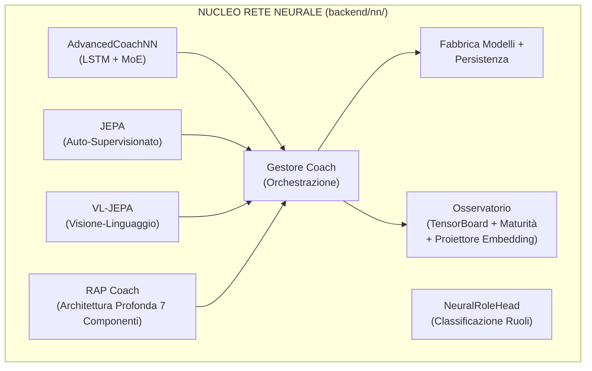

### -AdvancedCoachNN (LSTM + Mix di Esperti)

Definito in `model.py`, questo è il fondamento del coaching supervisionato.

| Componente                       | Dettaglio                                                                                                                                                                                                               |
| -------------------------------- | ----------------------------------------------------------------------------------------------------------------------------------------------------------------------------------------------------------------------- |
| **Dimensione di input**    | 25 funzionalità (`METADATA_DIM` da vectorizer.py)                                                                                                                                                                    |
| **Config**                 | Dataclass `CoachNNConfig`: `input_dim=25`, `output_dim=25` (default), `hidden_dim=128`, `num_experts=3`, `num_lstm_layers=2`, `dropout=0.2`, `use_layer_norm=True`                                      |
| **Livelli nascosti**       | LSTM a 2 livelli (128 nascosti,`batch_first=True`, dropout=0.2) con `LayerNorm` post-LSTM                                                                                                                           |
| **Testa dell'esperto**     | 3 esperti lineari paralleli (configurabili), softmax-gated tramite una rete di gate appresa                                                                                                                             |
| **Output**                 | Somma pesata degli output degli esperti → vettore del punteggio di coaching. Output_dim predefinito = METADATA_DIM (25) in `CoachNNConfig`; sovrascritto a OUTPUT_DIM (4) quando istanziato tramite `ModelFactory` |
| **Bias di ruolo**          | Parametro `role_id` opzionale: `gate_weights = (gate_weights + role_bias) / 2.0` — orienta la selezione degli esperti verso conoscenze specifiche del ruolo                                                        |
| **Validazione dell'input** | `_validate_input_dim()` rimodella automaticamente 1D → `unsqueeze(0).unsqueeze(0)` e 2D → `unsqueeze(0)` per la robustezza                                                                                      |

> **Analogia:** Questo modello è come una **giuria di 3 giudici** a un talent show. Innanzitutto, l'LSTM legge i dati di gioco del giocatore come se stesse leggendo una storia: capisce cosa è successo passo dopo passo, ricordando i momenti importanti (è proprio questo che gli LSTM sanno fare bene: la memoria). Dopo aver letto l'intera storia, riassume tutto in un'unica "opinione" (128 numeri). Quindi, tre diversi giudici esperti esaminano quell'opinione e assegnano ciascuno il proprio punteggio. Ma non tutti i giudici sono ugualmente bravi in ogni tipo di performance: un esperto di danza è più bravo a giudicare la danza, un esperto di canto a cantare. Quindi una **rete di controllo** (come un moderatore) decide quanto fidarsi di ciascun giudice: "Per questo giocatore, il Giudice 1 è rilevante al 60%, il Giudice 2 al 30%, il Giudice 3 al 10%". Il punteggio finale è una combinazione ponderata delle opinioni di tutti e tre i giudici.

Ogni modulo esperto in AdvancedCoachNN: `Linear(128→128) → LayerNorm(128) → ReLU → Linear(128→output_dim)`.

> **Nota:** `_create_expert()` di JEPA omette LayerNorm — solo `Linear → ReLU → Linear`. Si tratta di una scelta progettuale deliberata: gli esperti JEPA operano su incorporamenti latenti già normalizzati, mentre gli esperti AdvancedCoachNN elaborano output LSTM grezzi che traggono vantaggio dalla normalizzazione per esperto.

**Passaggio in avanti (pseudo forward pass):**

```
h, _ = LSTM(x) # x: [batch, seq_len, 25]
h = LayerNorm(h[:, -1, :]) # prendi l'ultimo timestep → [batch, 128]
gate_weights = softmax(W_gate · h) # [batch, 3]
expert_outputs = [E_i(h) for i in 1..3]
output = tanh(Σ gate_weights_i × expert_outputs_i)
```

> **Analogia:** Ecco la ricetta passo passo: (1) L'LSTM legge le 25 misurazioni del giocatore in più timestep, come se leggesse le pagine di un diario. (2) Sceglie il riassunto dell'ultima pagina, ovvero la comprensione più recente. (3) Un "moderatore" esamina tale riepilogo e decide quanto fidarsi di ciascuno dei 3 esperti (questi pesi di fiducia sommati danno sempre il 100%). (4) Ogni esperto assegna i propri punteggi di coaching. (5) Il risultato finale è il risultato dei punteggi degli esperti mescolati insieme in base a quanto il moderatore si fida di ciascuno, compressi in un intervallo da -1 a +1 dalla funzione tanh (come una valutazione su una curva).

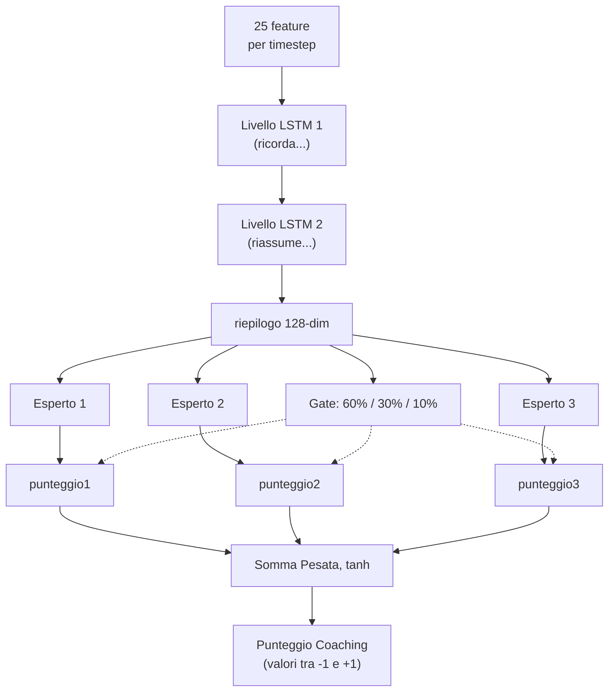

### -Modello di coaching JEPA (Architettura predittiva con integrazione congiunta)

Definito in `jepa_model.py`. Un modello di **pre-allenamento auto-supervisionato** ispirato all'I-JEPA di Yann LeCun, adattato per dati CS2 sequenziali.

> **Analogia:** JEPA è la fase di **"impara guardando"** dell'allenatore, proprio come si può imparare molto sul basket semplicemente guardando le partite NBA, anche prima che qualcuno te ne insegni le regole. Invece di aver bisogno di qualcuno che etichetti ogni giocata come "buona" o "cattiva" (apprendimento supervisionato), JEPA si auto-apprende giocando a un gioco di indovinelli: "Ho visto cosa è successo nel primo tempo di questo round... posso prevedere cosa succederà dopo?". Se indovina correttamente, sta costruendo una buona comprensione dei pattern CS2. Se indovina male, si adatta. Questo si chiama **apprendimento auto-supervisionato**: il modello crea i propri "compiti" a partire dai dati stessi.

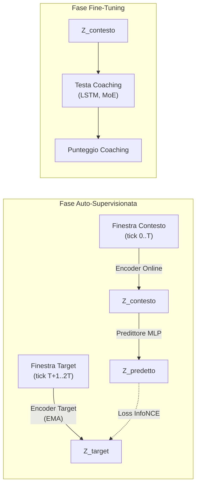

> **Spiegazione diagramma:** La fase di auto-supervisione funziona così: immagina di guardare un film e di premere pausa a metà scena. L'**Online Encoder** guarda la prima metà e crea un riassunto ("ecco cosa ho capito finora"). L'**Target Encoder** (una copia leggermente più vecchia dello stesso cervello, aggiornata lentamente) guarda la seconda metà e crea il proprio riassunto. Quindi un **Predictor** cerca di indovinare il riassunto della seconda metà usando solo il riassunto della prima metà. L'**InfoNCE Loss** è come un insegnante che controlla: "La tua previsione corrisponde a ciò che è realmente accaduto? Ed è sufficientemente diversa dalle ipotesi casuali?". Nella fase di Fine-Tuning, una volta che il modello ha acquisito una buona capacità di previsione, aggiungiamo una **Testa di Coaching** in cima: ora la comprensione acquisita guardando può essere utilizzata per fornire punteggi di coaching effettivi.

**Dettagli dell'architettura:**

| Modulo                        | Parametri                                                                                               |
| ----------------------------- | ------------------------------------------------------------------------------------------------------- |
| **Codificatore online** | Linear(input_dim, 512) → LayerNorm → GELU → Dropout(0.1) → Linear(512, latent_dim=256) → LayerNorm |
| **Codificatore target** | Strutturalmente identico; aggiornato tramite media mobile esponenziale (τ = 0.996)                     |
| **Predictor**           | Linear(256, 512) → LayerNorm → GELU → Dropout(0.1) → Linear(512, 256)                               |
| **Coaching Head**       | LSTM(256, hidden_dim, 2 layers, dropout=0.2) → 3 esperti MoE → output controllato                     |

> **Analogia:** L'**Online Encoder** è come uno studente: trasforma i dati grezzi di gioco in un'"essenza" di 256 numeri (un riassunto compatto). L'**Target Encoder** è come il fratello maggiore dello studente che si aggiorna lentamente (EMA significa "avvicinarsi alle conoscenze del fratello minore, ma solo un pochino ogni giorno" - il 99,6% rimane invariato, solo lo 0,4% si aggiorna). Questo obiettivo lento impedisce al sistema di collassare in una soluzione banale (come prevedere sempre "tutto è uguale"). Il **Predictor** è un ponte che cerca di tradurre "ciò che ho visto" in "ciò che penso accadrà". La **Coaching Head** è l'accessorio finale che converte la comprensione in un consiglio effettivo, come passare da "Capisco il basket" a "dovresti passare di più".

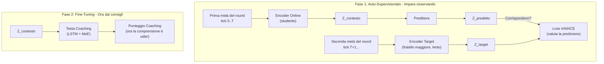

**Procedura di pre-addestramento** (`jepa_trainer.py`):

1. Carica le sequenze di `PlayerTickState` dai file SQLite demo professionali.
2. Divide ogni sequenza in finestre di contesto e target.
3. Codifica il contesto tramite il codificatore online + predittore, codifica il target tramite il codificatore del target (EMA).
4. Riduce al minimo la **perdita di contrasto di InfoNCE** utilizzando negativi in batch con similarità del coseno e temperatura τ=0,07.
5. Dopo ogni batch, esegue l'aggiornamento EMA: `θ_target ← τ·θ_target + (1−τ)·θ_online`.
6. **Monitoraggio della deriva**: Traccia gli oggetti DriftReport; attiva il riaddestramento automatico se la deriva > 2,5σ.

> **Analogia:** La ricetta dell'allenamento è questa: (1) Carica le registrazioni di giocatori professionisti, fotogramma per fotogramma. (2) Per ogni registrazione, dividila in "cosa è successo prima" e "cosa è successo dopo". (3) Due codificatori esaminano ciascuna metà in modo indipendente. (4) Il sistema verifica: "La mia previsione di 'cosa è successo dopo' si è avvicinata alla risposta effettiva e non a risposte sbagliate casuali?" — questo è InfoNCE, come un test a risposta multipla in cui il modello deve scegliere la risposta giusta tra molte risposte sbagliate. (5) Il codificatore del fratello maggiore assorbe lentamente le conoscenze del fratello minore (solo lo 0,4% per passaggio). (6) Se i dati iniziano a sembrare molto diversi da quelli su cui il modello si è allenato (deriva > 2,5 deviazioni standard), scatta un campanello d'allarme: "Il meta del gioco è cambiato: è ora di riqualificarsi!"

**Decodifica Selettiva** (`forward_selective`): salta l'intero passaggio in avanti se la distanza del coseno tra l'embedding corrente e quello precedente è inferiore a una soglia (`skip_threshold=0.05`). Utilizza `1.0 - F.cosine_similarity()` come metrica di distanza e, durante l'operazione di salto, restituisce l'output precedente memorizzato nella cache. Questo consente un'efficace inferenza in tempo reale con salto dinamico dei frame: durante i momenti di gioco statici (i giocatori mantengono gli angoli), la maggior parte dei frame viene saltata completamente.

> **Analogia:** La decodifica selettiva è come una telecamera di sicurezza con **rilevamento del movimento**. Invece di registrare 24 ore su 24, 7 giorni su 7 (elaborando ogni singolo frame), si attiva solo quando qualcosa cambia effettivamente. Se due frame consecutivi sono quasi identici (distanza < 0.05 — in pratica "non è successo nulla"), il modello salta completamente il calcolo. Questo consente di risparmiare un'enorme quantità di potenza di elaborazione nei momenti lenti (come quando i giocatori mantengono gli angoli e aspettano), pur continuando a catturare ogni azione importante.

### -CoachTrainingManager (Orchestrazione)

Definito in `coach_manager.py` (663 righe). Questo è il **cervello del processo di formazione**, che gestisce un rigoroso **ciclo di formazione a 3 livelli, basato sulla maturità**, suddiviso in 4 fasi:

> **Analogia adatta ai bambini:** CoachTrainingManager è come il **preside** che decide la classe di ogni studente e quali materie può seguire. Uno studente nuovo di zecca (CALIBRAZIONE) può frequentare solo corsi introduttivi. Uno studente che ha superato un numero sufficiente di corsi (APPRENDIMENTO) può frequentare corsi avanzati. E uno studente dell'ultimo anno (MATURE) ha accesso a tutto. Il preside impone anche una regola: "Non puoi iniziare alcun corso finché non hai partecipato ad almeno 10 sessioni di orientamento". Questo impedisce al sistema di provare a insegnare quando non ha praticamente dati da cui imparare.

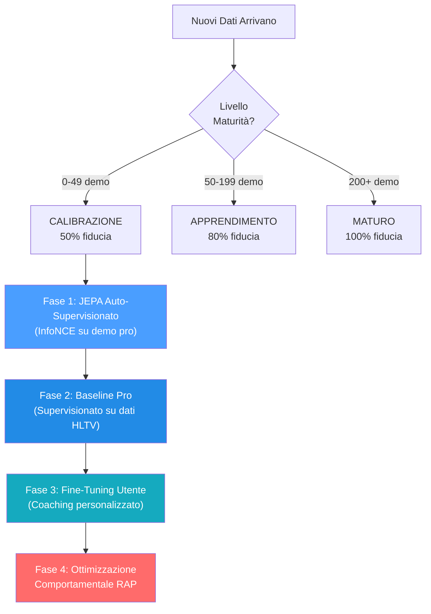

> **Spiegazione diagramma:** Pensate alle 4 fasi come agli **anni scolastici**: la Fase 1 (JEPA) è come **guardare un filmato di una partita**: lo studente guarda centinaia di partite professionistiche e impara gli schemi senza che nessuno li valuti. La Fase 2 (Pro Baseline) è come **studiare da un libro di testo**: ora un insegnante dice "ecco come si gioca bene" e lo studente studia per adeguarsi. La Fase 3 (Perfezionamento dell'utente) è come **lezioni private**: il sistema si adatta specificamente allo stile e ai punti deboli di QUESTO giocatore. La Fase 4 (RAP) è come un **corso di strategia avanzata**: il coach RAP completo a 7 componenti interviene con teoria dei giochi, posizionamento e ragionamento causale. Non è possibile accedere alla Fase 4 finché non si sono completate le Fasi 1-3, proprio come non si può studiare analisi matematica prima di algebra.

**Livelli di maturità e moltiplicatori di fiducia:**

| Livello       | Conteggio demo | Moltiplicatore di fiducia | Funzionalità sbloccate                                 |
| ------------- | -------------- | ------------------------- | ------------------------------------------------------- |
| CALIBRAZIONE  | 0–49          | 0,50                      | Euristica di base, pre-addestramento JEPA               |
| APPRENDIMENTO | 50–199        | 0,80                      | Confronto base professionale, ottimizzazione utente     |
| MATURO        | 200+           | 1,00                      | Coach RAP completo, teoria dei giochi, analisi completa |

> **Analogia:** Il moltiplicatore di fiducia è come un **punteggio di fiducia**. Quando il coach è nuovo (CALIBRAZIONE), si fida dei propri consigli solo al 50%: sa che potrebbero sbagliarsi, quindi è cauto. Dopo aver studiato più di 50 demo (APPRENDIMENTO), si fida di se stesso all'80%. Dopo più di 200 demo (MATURO), è completamente sicuro: il 100%. È come un meteorologo: un meteorologo alle prime armi potrebbe dire "Sono sicuro al 50% che pioverà", ma uno esperto con decenni di dati alle spalle dice "Sono sicuro al 100%". L'allenatore non finge mai di sapere più di quanto non sappia in realtà.

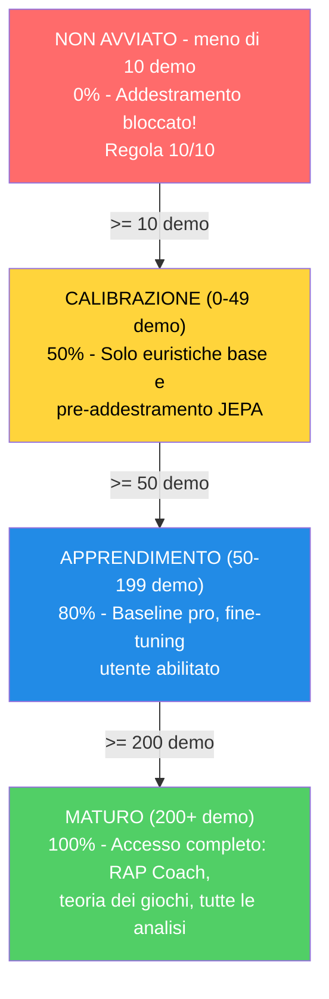

**Prerequisiti (Regola 10/10):** Richiede ≥10 demo professionali OPPURE (≥10 demo utente + account Steam/FACEIT connesso) prima di iniziare qualsiasi allenamento.

Il manager utilizza un **contratto di allenamento** rigoroso con 25 funzionalità (corrispondenti a `METADATA_DIM`).

> **Problema risolto (ex G-10):** `coach_manager.py` ora definisce `TRAINING_FEATURES` con i nomi canonici corretti per tutti i 25 indici, allineati perfettamente con `vectorizer.py`. L'asserzione `len(TRAINING_FEATURES) == METADATA_DIM` è valida e tutti i nomi sono aggiornati. Inoltre, `MATCH_AGGREGATE_FEATURES` definisce le 25 feature aggregate a livello di partita: `["avg_kills", "avg_deaths", "avg_adr", "avg_hs", "avg_kast", "kill_std", "adr_std", "kd_ratio", "impact_rounds", "accuracy", "econ_rating", "rating", "opening_duel_win_pct", "clutch_win_pct", "trade_kill_ratio", "flash_assists", "positional_aggression_score", "kpr", "dpr", "rating_impact", "rating_survival", "he_damage_per_round", "smokes_per_round", "unused_utility_per_round", "thrusmoke_kill_pct"]`. Entrambe le liste sono validate a runtime: se una delle due ha una lunghezza diversa da `METADATA_DIM`, il modulo solleva `ValueError` al momento dell'importazione.

```
health, armor, has_helmet, has_defuser, equipment_value,
is_crouching, is_scoped, is_blinded,
enemies_visible,
pos_x, pos_y, pos_z,
view_yaw_sin, view_yaw_cos, view_pitch,
z_penalty, kast_estimate, map_id, round_phase,
weapon_class, time_in_round, bomb_planted,
teammates_alive, enemies_alive, team_economy
```

> **Analogia:** Queste 25 caratteristiche sono come una **lista di controllo di 25 domande** che l'allenatore pone a un giocatore in ogni singolo momento di una partita: "Quanto sei in salute? Hai un'armatura? Un casco? Un kit di disinnesco? Quanto costa il tuo equipaggiamento? Sei accovacciato? Usi un mirino? Sei accecato? Quanti nemici riesci a vedere? Dove ti trovi (coordinate x, y, z)? In che direzione stai guardando (suddiviso in sin/cos per evitare stranezze angolari)? Sei al piano sbagliato di una mappa multilivello? Come ti sei comportato (KAST)? Di che mappa si tratta? È un round per pistola, eco, forza o full buy? Che tipo di arma stai usando? Quanto tempo è passato nel round? La bomba è stata piantata? Quanti compagni di squadra sono ancora vivi? Quanti nemici sono vivi? Qual è l'economia media della tua squadra?" Le ultime 6 domande (indici 19-24) forniscono al modello una consapevolezza tattica del contesto di gioco — queste feature hanno valore predefinito 0.0 durante l'addestramento dal database e vengono popolate dal contesto DemoFrame al momento dell'inferenza. Ogni modello nel sistema parla esattamente lo stesso "linguaggio da 25 domande" — questo è il contratto di addestramento. Se una qualsiasi parte del sistema utilizzasse domande diverse, le risposte non corrisponderebbero e tutto si interromperebbe.

**Indici target:** `[0, 2, 4, 11]` = `[avg_kills, avg_adr, avg_kast, rating]` — il modello prevede delta di miglioramento per queste 4 metriche aggregate a livello di partita.

> **Analogia:** Delle 25 feature aggregate a livello di partita, il modello si concentra sulla previsione di miglioramenti solo per 4: **media uccisioni** (stai ottenendo più eliminazioni?), **media ADR** (stai infliggendo più danni per round?), **media KAST** (stai contribuendo più spesso ai round?) e **rating** (il tuo punteggio complessivo sta migliorando?). Questi 4 sono stati scelti perché catturano le metriche di prestazione aggregate più significative secondo lo standard HLTV 2.0: le uccisioni misurano l'output offensivo, l'ADR misura l'impatto in termini di danni, il KAST misura la consistenza di contributo, e il rating è la metrica composita che li sintetizza tutti. È come un allenatore di basket che tiene traccia di centinaia di statistiche ma concentra il feedback su: punti segnati, assist, rimbalzi e la valutazione PER — i 4 aspetti più rilevanti per il miglioramento complessivo.

### -TrainingOrchestrator

Definito in `training_orchestrator.py`. Ciclo di epoche unificato, convalida, arresto anticipato e checkpoint per i modelli JEPA e RAP.

| Parametro      | Predefinito | Scopo                                                                        |
| -------------- | ----------- | ---------------------------------------------------------------------------- |
| `model_type` | "jepa"      | Percorsi verso il trainer JEPA, VL-JEPA o RAP                                |
| `max_epochs` | 100         | Limite massimo di allenamento                                                |
| `patience`   | 10          | Pazienza nell'arresto anticipato                                             |
| `batch_size` | 32          | Campioni per batch                                                           |
| `callbacks`  | `None`    | Elenco di istanze di `TrainingCallback` per l'integrazione con Observatory |

L'orchestrator si integra con Observatory tramite `CallbackRegistry`. Attiva eventi del ciclo di vita in **5 punti**: `on_train_start` (prima della prima epoca), `on_epoch_start` (inizio di ogni epoca), `on_batch_end` (dopo ogni batch di addestramento, include output di perdita e trainer), `on_epoch_end` (dopo la convalida, include modello e perdite), `on_train_end` (dopo il completamento dell'addestramento o l'interruzione anticipata). Quando non vengono registrate callback, tutte le chiamate `fire()` sono operazioni senza costi. Gli errori di callback vengono rilevati e registrati, senza mai causare l'arresto anomalo del ciclo di addestramento.

> **Analogia:** TrainingOrchestrator è come un **allenatore di palestra con un cronometro e un commentatore sportivo in diretta**. Il trainer esegue il ciclo: "Esegui un passaggio completo su tutti i dati (epoca), controlla i punteggi del quiz (validazione) e, se non hai migliorato in 10 tentativi (pazienza), fermati: hai finito, non ha senso sovrallenarsi". Salva anche la versione migliore del modello su disco (checkpoint), come quando si salvano i progressi di gioco. La nuova aggiunta è il **commentatore in diretta** (callback): se qualcuno sta ascoltando, il trainer annuncia "Addestramento iniziato!", "Epoca 5 in corso!", "Batch 12 completato, perdita 0,03!", "Epoca 5 terminata, val_loss migliorato!", "Addestramento completato!". Questi annunci alimentano la registrazione TensorBoard, il monitoraggio della maturità e le proiezioni di incorporamento dell'Osservatorio. Se nessuno sta ascoltando, il commentatore rimane in silenzio, senza alcun sovraccarico.

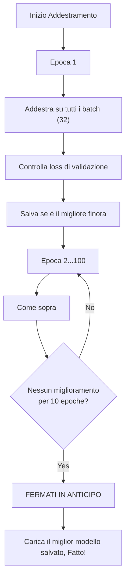

### -ModelFactory e Persistenza

**ModelFactory** (`factory.py`) fornisce un'istanziazione unificata del modello:

| Tipo Costante                    | Classe Modello          | Nome Checkpoint      | Impostazioni predefinite di fabbrica                   |
| -------------------------------- | ----------------------- | -------------------- | ------------------------------------------------------ |
| `TYPE_LEGACY` ("default")      | `TeacherRefinementNN` | `"latest"`         | `input_dim=METADATA_DIM(25)`, `output_dim=4`, `hidden_dim=64` |
| `TYPE_JEPA` ("jepa")           | `JEPACoachingModel`   | `"jepa_brain"`     | `input_dim=METADATA_DIM(25)`, `output_dim=4`       |
| `TYPE_VL_JEPA` ("vl-jepa")     | `VLJEPACoachingModel` | `"vl_jepa_brain"`  | `input_dim=METADATA_DIM(25)`, `output_dim=4`       |
| `TYPE_RAP` ("rap")             | `RAPCoachModel`       | `"rap_coach"`      | `metadata_dim=METADATA_DIM(25)`, `output_dim=10`   |
| `TYPE_ROLE_HEAD` ("role_head") | `NeuralRoleHead`      | `"role_head"`      | `input_dim=5`, `hidden_dim=32`, `output_dim=5`     |

> **Nota:** il valore `hidden_dim=64` della factory per i modelli legacy è diverso dal valore predefinito `hidden_dim=128` di `CoachNNConfig`. La factory sovrascrive il valore predefinito della configurazione quando si istanziano i modelli tramite `get_model()`.

> **Analogia:** La ModelFactory è come una **fabbrica di giocattoli** che può costruire cinque diversi tipi di robot. Gli dici "Voglio un robot JEPA" o "Mi serve un robot role_head" e lui sa esattamente quali parti usare e come assemblarlo. Ogni robot ha un'etichetta con il nome (nome del checkpoint) in modo da poterlo trovare in seguito sullo scaffale. Invece di ricordare come è costruito ogni robot, ti basta dire alla fabbrica "costruiscimi un jepa" e lei si occuperà di tutto.

**Persistenza** (`persistence.py`): Salva/carica con `weights_only=True` (sicurezza), catena di fallback elegante (specifica dell'utente → globale → salta), gestione delle dimensioni non corrispondenti.

> **Analogia:** La persistenza è come **salvare i progressi di un videogioco**. Dopo l'addestramento, lo "stato cerebrale" del modello (tutti i pesi appresi) viene salvato in un file `.pt`. Quando riavvii l'app, carica il cervello salvato invece di ripartire da zero. Il flag `weights_only=True` è una misura di sicurezza, come caricare solo i file di salvataggio creati da te, non quelli casuali presi da internet che potrebbero contenere virus. La catena di fallback significa: "Per prima cosa, prova a caricare il TUO cervello salvato personale. Se non esiste, prova quello predefinito. Se nemmeno quello esiste, ricomincia da capo". E se la forma del cervello cambia (ad esempio aggiungendo nuove funzionalità), gestisce la discrepanza in modo fluido invece di bloccarsi.

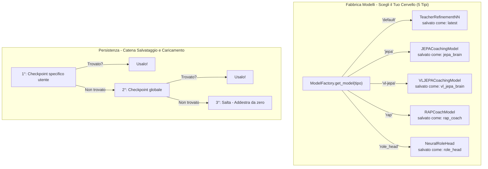

### -Configurazione (`config.py`)

```python
INPUT_DIM = METADATA_DIM = 25 # Vettore canonico a 25 dimensioni (era 19, era legacy 12)
OUTPUT_DIM = 4 # Predefinito (sovrascritto per modello: RAP usa 10)
BATCH_SIZE = 32
LEARNING_RATE = 0,001
EPOCHS = 50
```

> **Nota:** `INPUT_DIM` non è definito direttamente in `config.py` ma è importato da `feature_engineering/__init__.py` dove `METADATA_DIM = 25`. Il commento nel codice sorgente specifica: "Canonical 25-dim feature vector (was 19, was legacy 12)".

> **Analogia:** Questa è la **pagina delle impostazioni** per il cervello dell'IA. Proprio come un videogioco ha impostazioni per volume, luminosità e difficoltà, la rete neurale ha impostazioni per quante feature leggere (25), quanti punteggi produrre (4 per il modello base, 10 per RAP), quanti esempi studiare contemporaneamente (32 — la dimensione del batch), quanto velocemente apprende (0,001 — la velocità di apprendimento, come il selettore di velocità su un tapis roulant) e quante volte rivedere tutti i dati (50 epoche). Queste impostazioni sono scelte con cura: un apprendimento troppo rapido fa sì che il modello "vada oltre" e non si stabilizzi mai; troppo lento, ci vuole un'eternità.

**Gestione dispositivi:** `get_device()` restituisce CUDA se disponibile, per poi passare alla CPU. Dimensionamento batch basato sull'intensità: Alto=128, Medio=32, Basso=8.

> **Analogia:** Il gestore dispositivi verifica: "Ho un motore turbo (GPU/CUDA) disponibile o devo usare il motore standard (CPU)?". Una GPU può elaborare i dati da 10 a 100 volte più velocemente di una CPU per il calcolo delle reti neurali. Se si dispone di una scheda grafica per videogiochi (come una GTX 1650), il sistema la utilizza. In caso contrario, passa alla CPU, che è più lenta ma comunque funzionante. Anche il dimensionamento batch si adatta: con un motore turbo, è possibile gestire 128 esempi contemporaneamente; con il motore standard, solo 8 alla volta, come un camion delle consegne rispetto a una bicicletta per il trasporto dei pacchi.

### -NeuralRoleHead (MLP per la classificazione dei ruoli)

Definito in `role_head.py` (~309 righe). Un MLP leggero che prevede le probabilità di ruolo dei giocatori in base a 5 parametri di stile di gioco, operando come **opinione secondaria** insieme all'euristica `RoleClassifier`. La logica di consenso in `role_classifier.py` unisce entrambe le opinioni per produrre la classificazione finale.

> **Analogia:** NeuralRoleHead è come un **quiz a sorpresa**: pone solo 5 domande su come giochi ("Quanto spesso sopravvivi ai round?", "Quanto spesso ottieni la prima uccisione?", "Quanto spesso le tue morti vengono scambiate?", "Quanto sei influente?", "Quanto sei aggressivo?") e indovina istantaneamente il tuo ruolo in meno di un millisecondo. Funziona insieme al normale classificatore di ruoli (che utilizza regole di soglia), come due insegnanti che valutano lo stesso studente in modo indipendente, per poi confrontare le loro valutazioni. Se entrambi sono d'accordo, la fiducia aumenta. In caso di disaccordo, l'opinione neurale vince se è chiaramente più sicura.

**Architettura:**

```
Input (5 caratteristiche) → Linear(5, 32) → LayerNorm(32) → ReLU
→ Linear(32, 16) → ReLU
→ Linear(16, 5) → Softmax → 5 probabilità di ruolo
```

~750 parametri apprendibili. Costo di calcolo minimo, adatto per l'inferenza per partita.

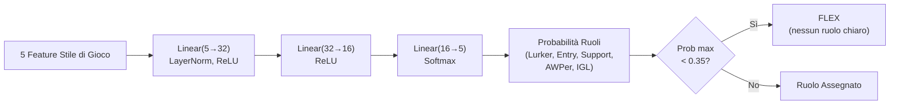

**Caratteristiche di input (5 dimensioni):**

| \# | Caratteristica   | Sorgente                            | Intervallo | Significato                                                       |
| -- | ---------------- | ----------------------------------- | ---------- | ----------------------------------------------------------------- |
| 0  | TAPD             | `rounds_survived / rounds_played` | [0, 1]     | Tasso di sopravvivenza — più alto = più passivo/di supporto    |
| 1  | OAP              | `entry_frags / rounds_played`     | [0, 1]     | Aggressività iniziale — più alta = fragger in entrata          |
| 2  | PODT             | `was_traded_ratio`                | [0, 1]     | Percentuale di morti scambiate — più alta = scambiate/innescate |
| 3  | rating_impact    | `impact_rating` o HLTV 2.0        | float      | Impatto complessivo sui round                                     |
| 4  | aggression_score | `positional_aggression_score`     | float      | Tendenza alla posizione avanzata                                  |

**Ruoli di output (softmax a 5 dimensioni):**

| Indice | Ruolo         | Descrizione                                          |
| ------ | ------------- | ---------------------------------------------------- |
| 0      | LURKER        | Si nasconde dietro le linee nemiche                  |
| 1      | ENTRY_FRAGGER | Primo ad entrare, affronta i duelli iniziali         |
| 2      | SUPPORT       | Ancoraggio del sito, utilizzo delle utilità, scambi |
| 3      | AWPER         | Specialista cecchino                                 |
| 4      | IGL           | Leader in gioco, responsabile tattico                |

**Soglia FLEX:** Se `max(probabilità) < 0,35`, il giocatore è classificato come **FLEX** (versatile, nessun ruolo dominante). Questo impedisce al modello di forzare un ruolo quando il giocatore è davvero un generalista.

**Dettagli addestramento:**

| Aspetto                               | Valore                                                                                                  |
| ------------------------------------- | ------------------------------------------------------------------------------------------------------- |
| **Sconfitta**                   | `KLDivLoss(reduction="batchmean")` sulle previsioni log-softmax rispetto ai target soft label         |
| **Smussamento delle etichette** | ε = 0,02 (impedisce log(0), aggiunge la regolarizzazione)                                              |
| **Ottimizzatore**               | AdamW (lr=1e-3, weight_decay=1e-4)                                                                      |
| **Arresto anticipato**          | Pazienza = 15 epoche sulla perdita di convalida                                                         |
| **Epoche massime**              | 200                                                                                                     |
| **Suddivisione Train/Val**      | 80/20 casuale (dati trasversali, non sequenziali)                                                       |
| **Campioni minimi**             | 20 (dalla tabella `Ext_PlayerPlaystyle`)                                                              |
| **Fonte dati**                  | `cs2_playstyle_roles_2024.csv` → Tabella DB `Ext_PlayerPlaystyle`                                  |
| **Normalizzazione**             | Media/std per funzionalità calcolata al momento dell'addestramento, salvata in `role_head_norm.json` |

**Consenso con classificatore euristico** (`role_classifier.py`):

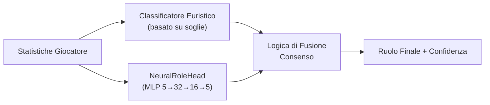

- **Entrambi d'accordo** → fiducia aumentata di +0,10
- **In disaccordo, margine neurale > 0,1** → vince l'opinione neurale
- **In disaccordo, margine neurale ≤ 0,1** → vince l'opinione euristica
- **Neural non disponibile** (nessun checkpoint o norm_stats) → solo euristica
- **Protezione cold-start** → restituisce FLEX con 0% di confidenza se le soglie non sono state apprese

### -Coach Introspection Observatory

**File:** `training_callbacks.py`, `tensorboard_callback.py`, `maturity_observatory.py`, `embedding_projector.py`

L'Osservatorio è un'**architettura di plugin a 4 livelli** che strumenta il ciclo di addestramento senza modificare il codice di addestramento principale. Monitora i segnali neurali dell'allenatore durante l'allenamento e li traduce in stati di maturità interpretabili dall'uomo, consentendo a sviluppatori e operatori di capire se il modello è confuso, in fase di apprendimento o pronto per la produzione.

> **Analogia:** L'Osservatorio è come un **sistema di pagelle per il cervello dell'allenatore**. Mentre l'allenatore studia (allenamento), l'Osservatorio verifica costantemente: "Questo cervello è confuso (DUBBIO)? Ha semplicemente dimenticato tutto ciò che ha imparato (CRISI)? Sta diventando più intelligente (APPRENDIMENTO)? Sta prendendo decisioni giuste con sicurezza (CONVINZIONE)? È completamente maturo (MATURO)?" È come avere un consulente scolastico che controlla i voti, la coerenza nei compiti, i punteggi dei test e il comportamento dello studente, e scrive un rapporto di sintesi dopo ogni lezione. Se la penna del consulente si rompe (errore di callback), questi si limita a scrollare le spalle e ad andare avanti: lo studente continua a studiare senza interruzioni.

**Architettura a 4 livelli:**

| Livello                  | File                        | Scopo                                  | Output chiave                                                                         |
| ------------------------ | --------------------------- | -------------------------------------- | ------------------------------------------------------------------------------------- |
| 1.**Callback ABC** | `training_callbacks.py`   | Interfaccia plugin + registro dispatch | `TrainingCallback` ABC, `CallbackRegistry.fire()`                                 |
| 2.**TensorBoard**  | `tensorboard_callback.py` | Registrazione scalare + istogramma     | Oltre 9 segnali scalari, istogrammi parametri/grad, istogrammi gate/credenza/concetto |
| 3.**Maturità**    | `maturity_observatory.py` | Macchina a stati di convinzione        | 5 segnali →`conviction_index` → 5 stati di maturità                              |
| 4.**Embedding**    | `embedding_projector.py`  | Proiezione credenza/concetto UMAP      | Figure UMAP 2D interattive (degrado graduale se umap-learn non è installato)         |

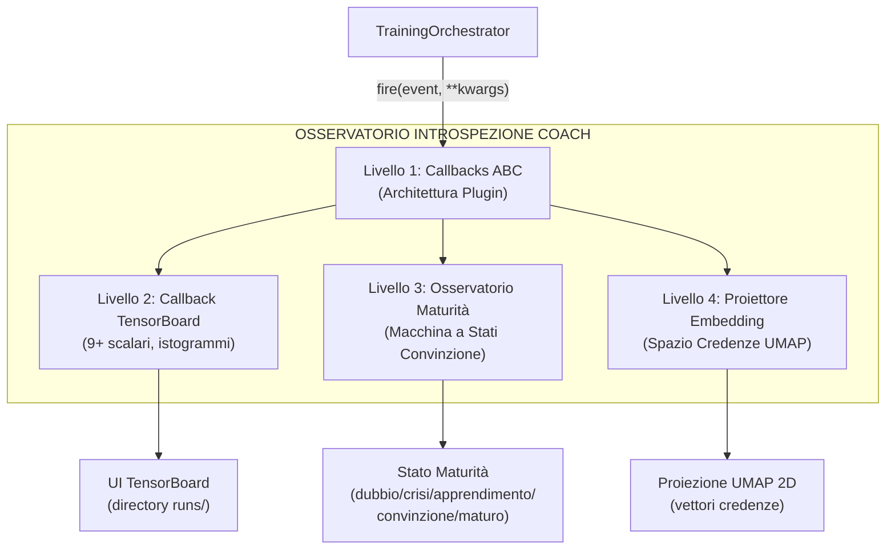

**Maturity State Machine:**

Il `MaturityObservatory` calcola un **indice di convinzione** composito da 5 segnali neurali, lo livella con EMA (α=0,3) e classifica il modello in uno dei 5 stati di maturità:

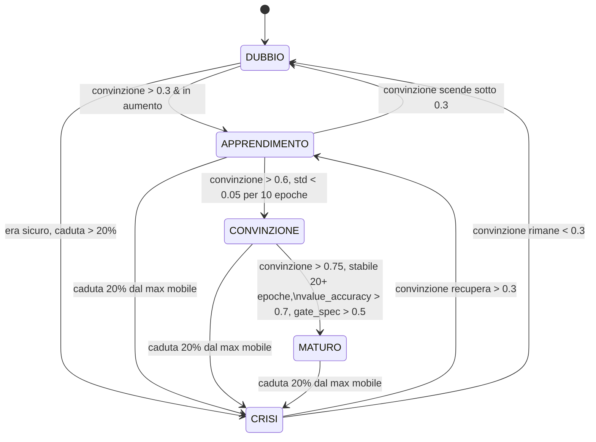

**5 Segnali di Maturità:**

| Segnale                 | Peso | Intervallo | Cosa Misura                                                                     | Fonte                                        |
| ----------------------- | ---- | ---------- | ------------------------------------------------------------------------------- | -------------------------------------------- |
| `belief_entropy`      | 0,25 | [0, 1]     | Entropia di Shannon del vettore di credenza a 64 dim (più basso = più sicuro) | `model._last_belief_batch`                 |
| `gate_specialization` | 0,25 | [0, 1]     | `1 - mean_gate_activation` (più alto = esperti più specializzati)           | `SuperpositionLayer.get_gate_statistics()` |
| `concept_focus`       | 0,20 | [0, 1]     | `1 - entropy(concept_embedding_norms)` (entropia più bassa = focalizzato)    | `model.concept_embeddings`                 |
| `value_accuracy`      | 0,20 | [0, 1]     | `1 - (val_loss / initial_val_loss)` (più alto = migliore calibrazione)       | Ciclo di convalida                           |
| `role_stability`      | 0,10 | [0, 1]     | Coerenza della convinzione nelle epoche recenti (`1 - std*5`)                 | Cronologia autoreferenziale                  |

**Formula di convinzione:**

```
indice_convinzione = 0,25 × (1 - entropia_credenza)
+ 0,25 × specializzazione_gate
+ 0,20 × focus_concetto
+ 0,20 × accuratezza_valore
+ 0,10 × stabilità_ruolo

punteggio_maturità = EMA(indice_convinzione, α=0,3)
```

**Soglie di stato:**

| Stato                   | Condizione                                                                                                  |
| ----------------------- | ----------------------------------------------------------------------------------------------------------- |
| **DUBBIO**        | `conviction < 0,3`                                                                                        |
| **CRISI**         | `conviction` scende > 20% dal massimo mobile entro 5 epoche                                               |
| **APPRENDIMENTO** | `conviction ∈ [0,3, 0,6]` e in aumento                                                                   |
| **CONVICTION**    | `conviction > 0,6`, stabile (`std < 0,05` su 10 epoche)                                                 |
| **MATURE**        | `conviction > 0,75`, stabile per oltre 20 epoche, `value_accuracy > 0,7`, `gate_specialization > 0,5` |

**Garanzie di progettazione:**

- **Impatto zero se disabilitato:** Quando non vengono registrate callback, tutte le chiamate `CallbackRegistry.fire()` sono no-op. Nessuna allocazione di memoria, nessun overhead di calcolo. - **Isolamento degli errori:** Ogni callback è sottoposto individualmente a try/except-wrapping. Un errore di scrittura di TensorBoard o di calcolo UMAP non causa mai l'arresto anomalo del ciclo di training: l'errore viene registrato e il training continua.
- **Componibile:** È possibile aggiungere nuove callback sottoclassando `TrainingCallback` e registrandosi con `CallbackRegistry.add()`. Non è necessario modificare il codice di training.

**Integrazione CLI:** Avviato tramite `run_full_training_cycle.py` con i flag:

- `--no-tensorboard` — disabilita il callback di TensorBoard
- `--tb-logdir <percorso>` — imposta la directory di log di TensorBoard (predefinito: `runs/`)
- `--umap-interval <N>` — proiezione UMAP ogni N epoche (predefinito: 10)

  ---

  ## 4. Sottosistema 2 — Modello RAP Coach

  **Directory:** `backend/nn/rap_coach/`
  **File:** `model.py`, `perception.py`, `memory.py`, `strategy.py`, `pedagogy.py`, `communication.py`, `skill_model.py`, `trainer.py`, `chronovisor_scanner.py`

  Il RAP (Reasoning, Adaptation, Pedagogy) Coach è un'**architettura profonda con 6 componenti neurali apprendibili + 1 livello di comunicazione esterna**, appositamente progettata per il coaching CS2 in condizioni di osservabilità parziale (condizioni POMDP). La classe `RAPCoachModel` contiene Percezione (`RAPPerception`), Memoria (`RAPMemory` con LTC+Hopfield), Strategia (`RAPStrategy`), Pedagogia (`RAPPedagogy` con Value Critic e Skill Adapter), Attribuzione Causale (`CausalAttributor`) e una Testa di Posizionamento (`nn.Linear(256→3)`), tutti apprendibili. Il livello di Comunicazione (`communication.py`) opera esternamente come selettore di template di post-elaborazione. Il forward pass produce 6 output: `advice_probs`, `belief_state`, `value_estimate`, `gate_weights`, `optimal_pos` e `attribution`.


  > **Analogia:** L'allenatore RAP è il **cervello più avanzato** del sistema: immaginalo come un edificio di 7 piani in cui ogni piano ha un compito specifico. Il piano 1 (Percezione) è costituito dagli **occhi**: osserva le immagini della mappa, la visuale del giocatore e gli schemi di movimento. Il piano 2 (Memoria) è l'**ippocampo**: ricorda cosa è successo prima nel round e lo collega a round simili precedenti tramite rete LTC + Hopfield. Il piano 3 (Strategia) è la **stanza decisionale**: decide quali consigli dare tramite 4 esperti MoE. Il piano 4 (Pedagogia) è l'**ufficio dell'insegnante**: stima il valore della situazione con il Value Critic. Il piano 5 (Attribuzione Causale) è il **detective**: capisce PERCHÉ qualcosa è andato storto, suddividendo la colpa in 5 categorie. Il piano 6 (Posizionamento) è il **GPS**: calcola dove avrebbe dovuto trovarsi il giocatore con un `nn.Linear(256→3)` che predice `(dx, dy, dz)`. Il piano 7 (Comunicazione) è il **portavoce**: traduce tutto in semplici consigli leggibili, operando come post-elaborazione esterna. La parte "POMDP" significa che l'allenatore deve lavorare con **informazioni incomplete**: non può vedere l'intera mappa, proprio come un giocatore. È come allenare una squadra di calcio dagli spalti quando metà campo è coperto dalla nebbia.
  >

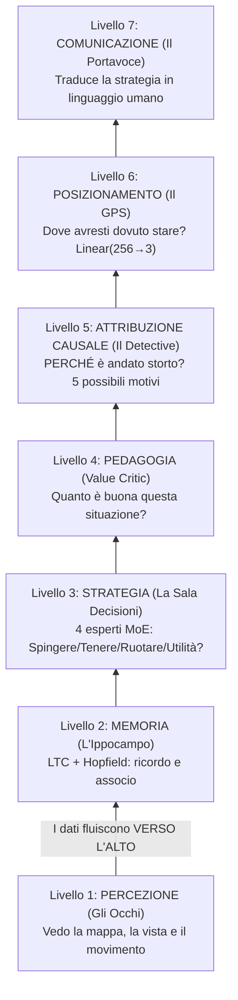

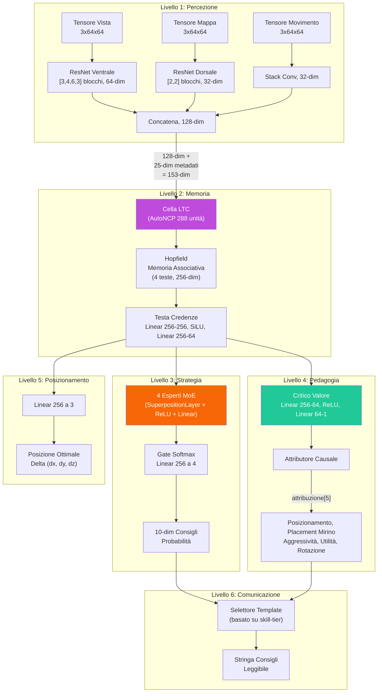

### -Livello di percezione (`perception.py`)

Un front-end **convoluzionale a tre flussi** che elabora gli input visivi:

| Input                                | Forma         | Backbone                                                | Output Dim       |
| ------------------------------------ | ------------- | ------------------------------------------------------- | ---------------- |
| **Tensore di visualizzazione** | `3×64×64` | Flusso ventrale ResNet: [3,4,6,3] blocchi, 3→64 canali | **64-dim** |
| **Tensore di mappa**           | `3×64×64` | Flusso dorsale ResNet: [2,2] blocchi, 3→32 canali      | **32-dim** |
| **Tensore di movimento**       | `3×64×64` | Conv(3→16→32) + MaxPool + AdaptiveAvgPool             | **32-dim** |

I tre vettori di caratteristiche sono concatenati in un singolo **embedding di percezione a 128 dimensioni** (64 + 32 + 32).

> **Analogia:** Il Livello di Percezione è come i **tre diversi paia di occhiali** dell'allenatore. La prima coppia (tensore di vista / flusso ventrale) mostra **ciò che il giocatore vede** – la sua prospettiva in prima persona, elaborata attraverso una ResNet profonda a 15 blocchi che estrae 64 caratteristiche importanti dall'immagine. La seconda coppia (tensore di mappa / flusso dorsale) mostra il **radar/minimappa aerea** – dove si trovano tutti – elaborato attraverso una rete più semplice a 4 blocchi in 32 caratteristiche. La terza coppia (tensore di movimento) mostra **chi si sta muovendo e con quale velocità** – come la sfocatura del movimento in una foto – elaborata in altre 32 caratteristiche. Quindi tutte e tre le viste vengono **incollate insieme** in un unico riepilogo di 128 numeri: "Ecco tutto ciò che riesco a vedere in questo momento". Questo processo trae ispirazione dal modo in cui il cervello umano elabora la vista: il flusso ventrale riconosce "cosa" sono le cose, mentre il flusso dorsale traccia "dove" si trovano le cose.

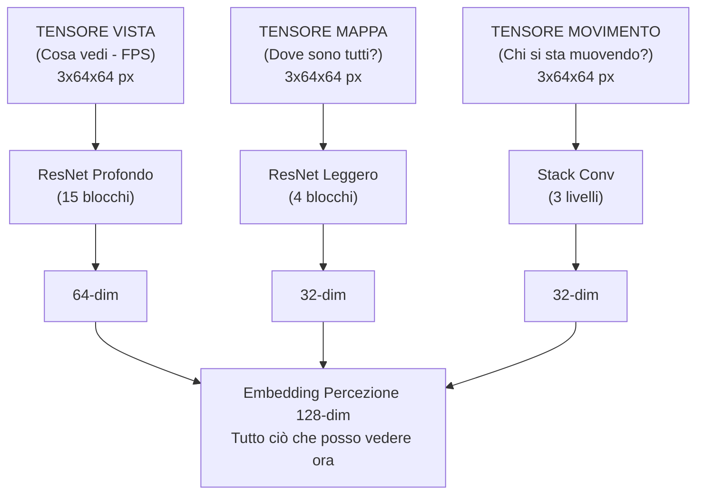

I blocchi ResNet utilizzano **scorciatoie di identità** con downsample apprendibile (Conv1×1 + BatchNorm) quando stride ≠ 1 o il conteggio dei canali cambia. **44 livelli di conversione** su tutti e tre i flussi:

| Flusso                     | Configurazione blocco                | Blocchi | Conv/Blocco | Conversioni scorciatoie | Totale       |
| -------------------------- | ------------------------------------ | ------- | ----------- | ----------------------- | ------------ |
| **Vista (Ventrale)** | `[3,4,6,3]` → 1 + 15 = 16 blocchi | 16      | 2           | 1 (primo blocco)        | **33** |
| **Mappa (Dorsale)**  | `[2,2]` → 1 + 3 = 4 blocchi       | 4       | 2           | 1 (primo blocco)        | **9**  |
| **Movimento**        | Stack di conversione (2 livelli)     | —      | —          | —                      | **2**  |
| **Totale**           |                                      |         |             |                         | **44** |

> **Come funziona** `_make_resnet_stack`: Crea 1 blocco iniziale con `stride=2` (per il downsampling spaziale), quindi `sum(num_blocks) - 1` blocchi aggiuntivi con `stride=1`. Ogni `ResNetBlock` ha 2 livelli Conv2d (kernel 3×3). Il primo blocco riceve anche una scorciatoia Conv1×1 perché i canali di input (3) sono diversi dai canali di output (64 o 32).

> **Analogia:** Le scorciatoie di identità sono come gli **ascensori di un edificio**: consentono alle informazioni di saltare i piani e di passare direttamente dai livelli iniziali a quelli successivi. Senza di esse, le informazioni dovrebbero salire 70 rampe di scale (70 livelli convoluzionali) e, una volta raggiunta la cima, il segnale originale sarebbe così sbiadito che la rete non potrebbe apprendere. Le scorciatoie garantiscono che anche in una rete molto profonda, i gradienti (i segnali di apprendimento) possano fluire in modo efficiente. Questo è lo stesso trucco che ha reso possibile il moderno deep learning, inventato da Kaiming He nel 2015.

### -Livello di memoria (`memory.py`) — LTC + Hopfield

Questa parte affronta la sfida fondamentale che il CS2 coach è un **Processo decisionale di Markov parzialmente osservabile** (POMDP).

> **Analogia:** POMDP è un modo elegante per dire **"non puoi vedere tutto".** In CS2, non sai dove si trovano tutti i nemici: vedi solo ciò che hai di fronte. È come giocare a scacchi con una coperta su metà della scacchiera. Il compito del Livello di memoria è **ricordare e indovinare**: tiene traccia di ciò che è accaduto in precedenza nel round e usa quella memoria per riempire gli spazi vuoti su ciò che non può vedere. Dispone di due strumenti speciali per questo: una rete LTC (memoria a breve termine che si adatta alla velocità del gioco) e una rete Hopfield (ricerca di pattern a lungo termine che dice "questa situazione mi ricorda qualcosa che ho già visto").

**Rete a costante di tempo liquida (LTC) con cablaggio AutoNCP:**

- Input: 153 dim (128 percezione + 25 metadati)
- Unità NCP: 288 (hidden_dim 256 + 32 interneuroni)
- Output: stato nascosto a 256 dim
- Utilizza la libreria `ncps` con pattern di connettività sparsi, simili a quelli del cervello
- Adatta la risoluzione temporale al ritmo del gioco (impostazioni lente vs. scontri a fuoco rapidi)

> **Analogia:** La rete LTC è come un **cervello vivo e respirante**: a differenza delle normali reti neurali che elaborano il tempo a intervalli fissi (come un orologio che ticchetta ogni secondo), la LTC adatta la sua velocità a ciò che accade. Durante una lenta preparazione (i giocatori camminano silenziosamente), l'elaborazione avviene al rallentatore. Durante uno scontro a fuoco veloce, accelera, come il battito cardiaco accelerato quando si è eccitati. Il "cablaggio AutoNCP" fa sì che le connessioni tra i neuroni siano sparse e strutturate come in un vero cervello: non tutto si collega a tutto il resto. Questo è più efficiente e biologicamente più realistico.

**Memoria associativa di Hopfield:**

- Input/Output: 256-dim
- Teste: 4
- Utilizza `hflayers.Hopfield` come **memoria indirizzabile tramite contenuto** per il recupero dei round prototipo

> **Analogia:** La memoria di Hopfield è come un **album fotografico di giocate famose**. Durante l'allenamento, memorizza i "round prototipo" – schemi classici come "una perfetta ripresa del sito B in Inferno" o "una corsa fallita nel fumo in Dust2". Quando arriva un nuovo momento di gioco, la rete di Hopfield chiede: "Questo mi ricorda qualche foto nel mio album?" Se trova una corrispondenza, recupera il ricordo associato, come un detective della polizia che sfoglia le foto segnaletiche e dice: "Ho già visto questa faccia!". Ha 4 "teste" (teste di attenzione) in modo da poter cercare 4 diversi tipi di schemi contemporaneamente.

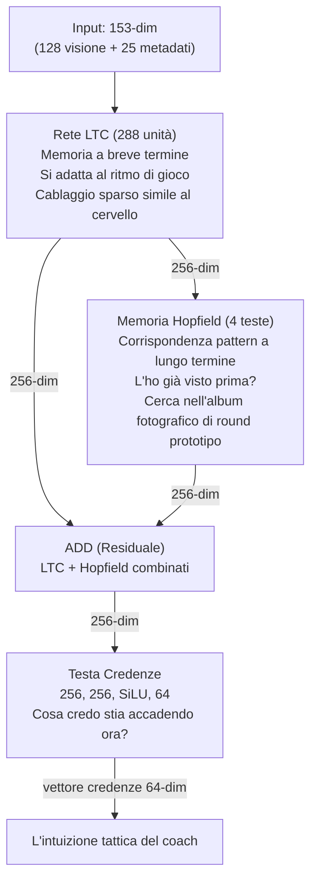

**Combinazione residua:** `combined_state = ltc_out + hopfield_out`

> **Analogia:** La combinazione residua è come **chiedere a due consulenti e sommare le loro opinioni**. Il LTC dice "in base a quanto appena accaduto, penso X". L'Hopfield dice "in base al mio ricordo di situazioni simili, penso Y". Invece di sceglierne una, il sistema somma entrambe le opinioni: in questo modo, sia gli eventi recenti che gli schemi storici contribuiscono alla comprensione finale.

**Testo di convinzione:** `Lineare(256→256) → SiLU → Lineare(256→64)` — produce un vettore di convinzione a 64 dimensioni che codifica la comprensione tattica latente dell'allenatore.

**Passaggio in avanti:**

```python
ltc_out, hidden = self.ltc(x, hidden) # x: [B, seq, 153] → [B, seq, 256]
mem_out = self.hopfield(ltc_out) # [B, seq, 256]
combined_state = ltc_out + mem_out # Residuo
belief = self.belief_head(combined_state) # [B, seq, 64]
return combined_state, belief, hidden
```

### -Livello Strategia (`strategy.py`) — Sovrapposizione + MoE

Implementa **SuperpositionLayer** combinato con un mix di esperti contestualizzati:

> **Analogia:** Il Livello Strategia è come una **sala di guerra con 4 generali specializzati**, ognuno esperto in un diverso tipo di situazione. Un generale è bravo nelle spinte aggressive, un altro nelle prese difensive, un altro nelle giocate di utilità e un altro ancora nelle rotazioni. Un "guardiano" (il "gate" softmax) ascolta la situazione attuale e decide quanto fidarsi di ciascun generale: "Siamo in un round eco su Dust2? Il Generale 2 (specialista difensivo) ottiene il 60% del potere, il Generale 4 (utilità) il 30% e gli altri si dividono il resto". Il **Livello di Superposizione** è l'ingrediente segreto: consente a ciascun generale di adattare il proprio pensiero in base al contesto di gioco attuale (mappa, economia, fazione) utilizzando un meccanismo di controllo intelligente.

**SuperpositionLayers** (`layers/superposition.py`): controllo dipendente dal contesto dove `output = F.linear(x, weight, bias) * sigmoid(context_gate(context))`. Un vettore di gate sigmoide condizionato sul contesto **25-dim** (METADATA_DIM completo) maschera selettivamente gli output degli esperti. La perdita di sparsità L1 (`context_gate_l1_weight = 1e-4`) incoraggia un gating sparso e interpretabile. Osservabile: le statistiche del gate (media, standard, sparsità, active_ratio) possono essere tracciate.

> **Nota:** `RAPStrategy.__init__` utilizza `context_dim=25` (METADATA_DIM). La rete di gate è `Linear(hidden_dim=256, num_experts=4) → Softmax(dim=-1)`.

> **Analogia:** Il livello di sovrapposizione è come un **interruttore dimmer per ogni neurone**. Invece di avere ogni neurone sempre completamente acceso, un gate dipendente dal contesto (controllato dalle 25 caratteristiche dei metadati) può attenuare o aumentare la luminosità di ciascuno di essi. Se il contesto dice "questo è un round eco", alcuni neuroni vengono attenuati (non sono rilevanti per i round eco), mentre altri vengono aumentati. La perdita di sparsità L1 è come dire al sistema: "Cerca di usare il minor numero possibile di neuroni: più semplice è la tua spiegazione, meglio è". Questo rende il modello più interpretabile: puoi effettivamente vedere quali gate si attivano in quali situazioni.

```mermaid
flowchart TB
    IN["stato nascosto 256-dim"]
    IN --> E1["Esperto 1<br/>SuperPos, ReLU, Linear"]
    IN --> E2["Esperto 2<br/>SuperPos, ReLU, Linear"]
    IN --> E3["Esperto 3<br/>SuperPos, ReLU, Linear"]
    IN --> E4["Esperto 4<br/>SuperPos, ReLU, Linear"]
    CTX["contesto 25-dim"] -.->|"modula"| E1
    CTX -.->|"modula"| E2
    CTX -.->|"modula"| E3
    CTX -.->|"modula"| E4
    E1 --> GATE["Gate (softmax - somma a 1.0)<br/>0.35 / 0.40 / 0.15 / 0.10"]
    E2 --> GATE
    E3 --> GATE
    E4 --> GATE
    GATE --> OUT["Somma pesata a 10-dim<br/>probabilità consigli"]
```

**4 Moduli Esperti:** Ogni esperto è un `ModuleDict`: `SuperpositionLayer(256→128, context_dim=25) → ReLU → Linear(128→10)`.

**Gate Network:** `Linear(256→4) → Softmax`.

**Output:** Distribuzione di probabilità di consulenza a 10 dimensioni e vettore dei pesi di gate a 4 dimensioni.

### -Livello Pedagogico (`pedagogy.py`) — Valore + Attribuzione

Due sottomoduli:

1. **Value Critic:** `Linear(256→64) → ReLU → Linear(64→1)`. Stima V(s) per l'apprendimento con differenze temporali. **Skill Adapter:** `Linear(10 skill_buckets → 256)` consente stime di valore condizionate dalle abilità.

> **Analogia:** Il Value Critic è come un **commentatore sportivo** che, in qualsiasi momento durante una partita, può dire "In questo momento, questa squadra ha un vantaggio del 72%". Stima V(s) — il "valore" dello stato attuale della partita. L'**Skill Adapter** adatta questa stima in base al livello di abilità del giocatore: un principiante nella stessa posizione di un professionista affronta probabilità molto diverse, quindi la previsione del valore dovrebbe riflettere questo.

1. **CausalAttributor:** Produce un vettore di attribuzione a 5 dimensioni che mappa i concetti di allenamento:

| Indice | Concetto                            | Segnale meccanico                          |
| ------ | ----------------------------------- | ------------------------------------------ |
| 0      | **Posizionamento**            | norm(position_delta)                       |
| 1      | **Posizionamento del mirino** | norm(view_delta)                           |
| 2      | **Aggressione**               | 0,5 × position_delta                      |
| 3      | **Utilità**                  | sigmoid(hidden.mean()) — segnale dinamico |
| 4      | **Rotazione**                 | 0,8 × position_delta                      |

Fusione: `attribuzione = context_weights × mechanical_errors` dove context_weights deriva da `Lineare(256→32) → ReLU → Lineare(32→5) → Sigmoide`.

> **Analogia:** L'attributore causale è il modo in cui l'allenatore risponde alla domanda **"PERCHÉ è andato storto?"** Invece di dire semplicemente "sei morto", suddivide la colpa in 5 categorie, come una pagella scolastica con 5 materie. "Sei morto perché: 45% posizionamento errato, 30% utilizzo inadeguato delle utilità, 15% posizionamento errato del mirino, 5% troppo aggressivo, 5% rotazione errata." Lo fa combinando due segnali: (1) ciò che lo stato nascosto della rete neurale ritiene importante (context_weights, l'intuizione del cervello) e (2) errori meccanici misurabili (quanto lontano dalla posizione ottimale, quanto errato era l'angolo di visione). Moltiplicandoli insieme si ottiene un'attribuzione di colpa basata sia sui dati che sull'intuizione.

```mermaid
flowchart TB
    NH["Stato nascosto neurale"] --> CW["Pesi Contesto (intuizione appresa)<br/>0.45, 0.10, 0.05, 0.30, 0.10"]
    ME["Errori meccanici"] --> ES["Segnali Errore (fatti misurabili)<br/>distanza dalla pos ottimale, errore angolo vista,<br/>livello aggressività, segnale uso utilità,<br/>distanza rotazione"]
    CW -->|moltiplica| AV["vettore attribuzione"]
    ES -->|moltiplica| AV
    AV --> OUT["Posizionamento: 45%, Mirino: 10%,<br/>Aggressività: 5%, Utilità: 30%, Rotazione: 10%"]
    OUT --> VERDICT["Sei morto principalmente a causa di<br/>CATTIVO POSIZIONAMENTO e SCARSO USO UTILITÀ"]
    style VERDICT fill:#ff6b6b,color:#fff
```

### -Modello latente delle abilità (`skill_model.py`)

Scompone le statistiche grezze in 5 assi delle abilità utilizzando la normalizzazione statistica rispetto alle linee di base dei professionisti:

| Asse delle abilità      | Statistiche di input                                                    | Normalizzazione                       |
| ------------------------ | ----------------------------------------------------------------------- | ------------------------------------- |
| **Meccaniche**     | Precisione, avg_hs                                                      | Punteggio Z (μ=pro_mean, σ=pro_std) |
| **Posizionamento** | Valutazione_sopravvivenza, valutazione_kast                             | Punteggio Z                           |
| **Utilità**       | Utility_blind_time, Utility_nemici_accecati                             | Punteggio Z                           |
| **Tempistica**     | Percentuale_vittorie_duello_apertura, Punteggio_aggressione_posizionale | Punteggio Z                           |
| **Decisione**      | Percentuale_vittorie_clutch, Impatto_valutazione                        | Punteggio Z                           |

> **Analogia:** Il modello di abilità crea una **pagella di 5 materie** per ogni giocatore. Ogni materia (Meccanica, Posizionamento, Utilità, Tempismo, Decisione) viene valutata confrontando il giocatore con i professionisti. Il punteggio Z è come chiedere: "Quanto è sopra o sotto la media della classe questo studente?". Un punteggio Z pari a 0 significa "esattamente nella media tra i professionisti". Un punteggio Z pari a -2 significa "molto al di sotto della media - necessita di un duro lavoro". Un punteggio Z pari a +1 significa "sopra la media - sta andando bene". Il sistema converte quindi i punteggi Z in percentili (la percentuale di professionisti in cui sei migliore) e li associa a un livello curriculare da 1 a 10, come i voti scolastici. Uno studente di livello 1 riceve un allenamento adatto ai principianti; uno studente di livello 10 riceve un'analisi tattica avanzata.

```mermaid
flowchart TB
    subgraph INPUT["Statistiche Giocatore vs Baseline Pro"]
        A["precisione: 0.18 vs pro 0.22, z=-0.80, 21%"]
        B["hs_medio: 0.45 vs pro 0.52, z=-0.70, 24%"]
    end
    INPUT --> AVG["Asse meccanica: media 22.5%, Liv 3"]
    subgraph CARD["Pagella 5 Assi"]
        M["MECCANICA<br/>Liv 3"]
        P["POSIZIONAMENTO<br/>Liv 5"]
        U["UTILITÀ<br/>Liv 7"]
        T["TEMPISMO<br/>Liv 4"]
        D["DECISIONI<br/>Liv 6"]
    end
    AVG --> CARD
    CARD --> ENC["Codificato come tensore one-hot<br/>Alimentato all'Adattatore Skill del Livello Pedagogia"]
    style M fill:#ff6b6b,color:#fff
    style P fill:#ffd43b,color:#000
    style U fill:#51cf66,color:#fff
    style T fill:#ff9f43,color:#fff
    style D fill:#4a9eff,color:#fff
```

I punteggi Z vengono convertiti in percentili tramite l'**approssimazione logistica** `1/(1+exp(-1,702z))` (approssimazione CDF rapida), quindi il percentile medio viene mappato a un **livello curriculare** (1–10) tramite `int(avg_skill * 9) + 1`, fissato a [1, 10]. Il livello viene codificato come un tensore one-hot (10-dim) tramite `SkillLatentModel.get_skill_tensor()` per l'adattatore di competenze del livello pedagogico.

### -RAP Trainer (`trainer.py`)

Orchestra il ciclo di addestramento con una **funzione di perdita composita**:

```
L_totale = L_strategia + 0,5 × L_valore + L_sparsità + L_posizione
```

> **Analogia:** La perdita totale è come una **pagella con 4 voti**, ognuno dei quali misura un aspetto diverso delle prestazioni del modello. Il modello cerca di rendere TUTTI e quattro i voti il più bassi possibile (nell'apprendimento automatico, una perdita minore = prestazioni migliori). I pesi (1,0, 0,5, 1e-4, 1,0) indicano l'importance di ogni materia: Strategia e Posizione sono materie a punteggio pieno, Valore è mezzo credito e Scarsità è un credito extra. Il modello non può semplicemente superare una materia e bocciare le altre: deve bilanciarle tutte e quattro.

| Termine di perdita | Formula                                                   | Peso | Scopo                                                            |
| ------------------ | --------------------------------------------------------- | ---- | ---------------------------------------------------------------- |
| `L_strategy`     | `MSELoss(advice_probs, target_strat)`                   | 1.0  | Raccomandazione tattica corretta                                 |
| `L_value`        | `MSELoss(V(s), true_advantage)`                         | 0.5  | Stima accurata del vantaggio                                     |
| `L_sparsity`     | `model.compute_sparsity_loss()` — L1 sui pesi dei gate | 1e-4 | Specializzazione esperta                                         |
| `L_position`     | `MSE(pred_xy, true_xy) + 2.0 × MSE(pred_z, true_z)`    | 1.0  | Posizionamento ottimale,**penalità rigorosa sull'asse Z** |

> **Nota:** Il moltiplicatore 2× sull'asse Z esiste perché gli errori di posizionamento verticale (ad esempio, un livello sbagliato su Nuke/Vertigo) sono tatticamente catastrofici: rappresentano errori di piano sbagliato che nessuna correzione orizzontale può correggere.

> **Analogia:** La penalità sull'asse Z è come un **allarme antincendio per errori di piano sbagliato**. Nelle mappe di CS2 come Nuke (che ha due piani) o Vertigo (un grattacielo), dire a un giocatore di andare al piano sbagliato è un disastro: è come dire a qualcuno di andare in cucina quando intendevi la soffitta. Essere leggermente fuori posizione orizzontale (X/Y) è come essere qualche passo a sinistra o a destra: non eccezionale, ma risolvibile. Essere al piano sbagliato (Z) è come essere in una stanza completamente diversa. Ecco perché gli errori verticali vengono puniti 2 volte più duramente durante l'addestramento: il modello impara rapidamente a "NON suggerire MAI il piano sbagliato".

```mermaid
flowchart LR
    subgraph LOSS["L_totale = L_strategia + 0.5xL_valore + L_sparsità + L_posizione"]
        S["Strategia<br/>Peso: 1<br/><br/>Hai dato<br/>il consiglio giusto?"]
        V["Valore<br/>Peso: 0.5<br/><br/>Hai stimato<br/>il vantaggio corretto?"]
        SP["Sparsità<br/>Peso: 0.0001<br/><br/>Hai usato<br/>pochi esperti?<br/>(semplice = meglio)"]
        P["Posizione<br/>Peso: 1<br/><br/>Hai trovato<br/>il punto giusto?<br/>XY + 2Z"]
    end
    LOSS --> GOAL["Obiettivo: minimizzare TUTTI e quattro, coaching migliore!"]
```

**Output per fase di addestramento:** `{loss, sparsity_ratio, loss_pos, z_error}`.

### -Riepilogo del passaggio in avanti di RAPCoachModel

```python
def forward(view_frame, map_frame, motion_diff, metadata, skill_vec=None):
z_spatial = self.perception(view_frame, map_frame, motion_diff) # [B, 128]
z_spatial_seq = z_spatial.unsqueeze(1).repeat(1, seq_len, 1)
lstm_in = cat([z_spatial_seq, metadata], dim=2) # [B, seq, 153]
hidden_seq, belief, _ = self.memory(lstm_in) # [B, seq, 256], [B, seq, 64]
last_hidden = hidden_seq[:, -1, :]
prediction, gate_weights = self.strategy(last_hidden, context) # [B, 10], [B, 4]
value_v = self.pedagogy(last_hidden, skill_vec) # [B, 1]
optimal_pos = self.position_head(last_hidden) # [B, 3]
attribution = self.attributor.diagnose(last_hidden, optimal_pos) # [B, 5]
return {
"advice_probs": prediction, # [B, 10]
"belief_state": belief, # [B, seq, 64]
"value_estimate": value_v, # [B, 1]
"gate_weights": gate_weights, # [B, 4]
"optimal_pos": optimal_pos, # [B, 3]
"attribution": attribution # [B, 5]
}
```

> **Analogia:** Questa è la **ricetta completa** di come pensa il RAP Coach, passo dopo passo: (1) **Occhi** — il livello Percezione esamina la vista, la mappa e le immagini in movimento e crea un riepilogo di 128 numeri di ciò che vede. (2) Questo riepilogo visivo viene combinato con 25 numeri di metadati (salute, posizione, economia, ecc.) per formare una descrizione di 153 numeri. (3) **Memoria** — la memoria LTC + Hopfield elabora la descrizione nel tempo, producendo uno stato nascosto di 256 numeri e un vettore di credenze di 64 numeri ("cosa penso stia accadendo"). (4) **Strategia** — 4 esperti esaminano lo stato nascosto e producono 10 probabilità di consiglio ("40% di probabilità che tu debba spingere, 30% di tenere premuto, ecc."). (5) **Insegnante** — il livello pedagogico stima "quanto è buona questa situazione?" (valore). (6) **GPS** — la testa di posizione prevede dove dovresti muoverti (coordinate 3D). (7) **Colpa** — l'attributore capisce perché le cose sono andate male (5 categorie). Tutti e 6 gli output vengono restituiti insieme come un dizionario: l'analisi completa dell'allenamento per un momento di gioco.

```mermaid
flowchart LR
    subgraph INPUTS["INGRESSI"]
        VIEW["Immagine vista"]
        MAP["Immagine mappa"]
        MOT["Img movimento"]
        META["Metadati (25-dim)"]
    end
    subgraph PROCESSING["ELABORAZIONE"]
        VIEW --> PERC["Percezione<br/>(occhi), 128-dim"]
        MAP --> PERC
        MOT --> PERC
        PERC --> CONCAT["128 + 25 = 153-dim"]
        META --> CONCAT
        CONCAT --> MEM["Memoria<br/>(cervello), 256-dim"]
    end
    subgraph OUTPUTS["USCITE"]
        MEM --> STRAT["Strategia, advice_probs [10]<br/>cosa fare"]
        MEM --> PED["Pedagogia, value_estimate [1]<br/>quanto è buona?"]
        MEM --> POS["Posizione, optimal_pos [3]<br/>dove stare"]
        MEM --> ATTR["Attribuzione, attribution [5]<br/>perché è importante"]
        MEM --> BEL["belief_state [64]<br/>cosa penso"]
        MEM --> GATE["gate_weights [4]<br/>quale esperto ha parlato?"]
    end
```

### -ChronovisorScanner (`chronovisor_scanner.py`)

Un **modulo di elaborazione del segnale** che identifica i momenti critici nelle partite analizzando i delta di vantaggio temporale:

> **Analogia:** Il Chronovisor è come un **rilevatore di momenti salienti**: osserva un'intera partita e individua automaticamente i momenti più emozionanti o importanti. Funziona monitorando il vantaggio della squadra nel tempo (come un grafico del prezzo di un'azione) e cercando picchi o crolli improvvisi. Un picco improvviso significa "è appena successo qualcosa di grandioso" (una giocata decisiva, un'esecuzione perfetta). Un crollo improvviso significa "qualcosa è andato terribilmente storto" (un push fallito, essere colti di sorpresa). Invece di guardare l'intera partita di 45 minuti, il giocatore può passare direttamente a questi 5-10 momenti critici.

1. Utilizza il modello RAP addestrato per prevedere V(s) per ogni tick window.
2. Calcola i delta utilizzando un **ritardo di 64 tick**: `deltas = values[LAG:] - values[:-LAG]`.
3. Rileva i **picchi** in cui `|delta| > 0,15` (soglia di variazione del vantaggio del 15%).
4. Cerca il picco all'interno di una **finestra di 192 tick**, mantenendo la coerenza del segno.
5. La **soppressione non massima** impedisce rilevamenti duplicati.
6. Classifica ogni picco come **"gioco"** (gradiente positivo, vantaggio acquisito) o **"errore"** (negativo, vantaggio perso).
7. Restituisce istanze della classe di dati `CriticalMoment` con `(match_id, start_tick, peak_tick, end_tick, severity [0-1], type, description)`.

> **Analogia:** Ecco la procedura passo dopo passo: (1) Il modello RAP osserva ogni momento e assegna un "punteggio di vantaggio" (come un cardiofrequenzimetro). (2) Confronta ogni momento con ciò che è accaduto 64 tick prima (circa mezzo secondo) - "le cose sono migliorate o peggiorate?" (3) Se il cambiamento supera il 15%, si tratta di un evento significativo - come un picco di frequenza cardiaca. (4) Ingrandisce una finestra di 192 tick attorno al picco per trovare il momento di picco esatto. (5) Filtra i rilevamenti duplicati - se due picchi sono troppo vicini tra loro, mantiene solo quello più grande. (6) Etichetta ogni picco: "gioco" (hai fatto qualcosa di eccezionale) o "errore" (hai commesso un errore). (7) Confeziona tutto in una scheda di valutazione ordinata per ogni momento critico, con punteggi di gravità da 0 (minore) a 1 (che cambia il gioco).

```mermaid
flowchart LR
    subgraph TIMELINE["Vantaggio nel tempo V(s)"]
        R1["Inizio round<br/>V = 0.5"] --> SPIKE1["GIOCATA!<br/>V = 1.0<br/>(picco vantaggio)"]
        SPIKE1 --> MID["V = 0.7"]
        MID --> SPIKE2["GIOCATA!<br/>V = 0.7<br/>(secondo picco)"]
        SPIKE2 --> DROP["ERRORE!<br/>V = 0.0<br/>(crollo vantaggio)"]
    end
    SPIKE1 --> CM1["Momento Critico 1<br/>(giocata)"]
    SPIKE2 --> CM2["Momento Critico 2<br/>(giocata)"]
    DROP --> CM3["Momento Critico 3<br/>(errore)"]
    style SPIKE1 fill:#51cf66,color:#fff
    style SPIKE2 fill:#51cf66,color:#fff
    style DROP fill:#ff6b6b,color:#fff
```

### -GhostEngine (`inference/ghost_engine.py`)

Inferenza in tempo reale per il "Ghost" — overlay della posizione ottimale del giocatore.

**Pipeline:** tick_data → FeatureExtractor.extract() → TensorFactory (view/map/motion) → RAPCoachModel → optimal_pos delta → scala di 500,0 → coordinate globali `(ghost_x, ghost_y)`.

> **Analogia:** Il Ghost Engine è come un **ologramma "migliore te"** sullo schermo. In ogni momento durante la riproduzione, chiede al RAP Coach: "Data questa situazione esatta, dove DOVREBBE trovarsi il giocatore?" La risposta è un piccolo delta di posizione (ad esempio "5 pixel a destra e 3 pixel in alto"), che viene ridimensionato alle coordinate reali della mappa. Il risultato è un giocatore "fantasma" trasparente visualizzato sulla mappa tattica, che mostra la posizione ottimale. È come avere un motore di gioco che mostra "la mossa migliore" come un pezzo trasparente che fluttua sulla scacchiera. Se il fantasma è lontano da dove ti trovavi effettivamente, sai di essere in una brutta posizione. Se è vicino, ti sei posizionato bene.

```mermaid
flowchart TB
    IN["Dati tick corrente"]
    IN --> FE["FeatureExtractor.extract()<br/>vettore 25-dim"]
    FE --> TF["TensorFactory<br/>immagini vista/mappa/movimento 64x64"]
    TF --> RAP["RAPCoachModel.forward()"]
    RAP --> DELTA["delta optimal_pos (dx, dy, dz)<br/>numeri piccoli"]
    DELTA -->|"x 500.0<br/>(scala a coordinate mondo)"| GHOST["(ghost_x, ghost_y)<br/>dove DOVRESTI essere"]
    GHOST --> RENDER["Renderizzato come giocatore trasparente<br/>sulla mappa tattica<br/>Il fantasma mostra la posizione ottimale"]
```

**Fallback graduale:** Restituisce `(0.0, 0.0)` in caso di eccezione. Utilizza pesi casuali in caso di checkpoint mancante.

> **Analogia:** Il fallback è come un GPS che dice "Non so dove dovresti andare" invece di mandare la tua auto contro un muro. Se qualcosa va storto – il modello non è caricato, i dati sono corrotti o CUDA esaurisce la memoria – il Ghost Engine restituisce silenziosamente (0,0) invece di mandare in crash l'applicazione. Se non esiste ancora un modello addestrato, utilizza pesi casuali (essenzialmente per ipotesi), il che produce posizioni fantasma prive di significato, ma almeno non si blocca. Questa filosofia del "mai crash, degrada sempre in modo graduale" permea l'intero sistema.

---
