## 5. Sottosistema 3 — Servizi di Coaching

**cartella nella repo:** `backend/services/`
**File:** `coaching_service.py`, `ollama_writer.py`, `analysis_orchestrator.py`

Questo sottosistema è il **centro decisionale**: prende tutto ciò che le reti neurali e i sistemi di conoscenza hanno prodotto e lo sintetizza in veri e propri consigli di coaching per il giocatore.

> **Analogia:** Se il nucleo della rete neurale (Sezione 3) è il cervello e il coach RAP (Sezione 4) è il medico specialista, allora il sottosistema dei Servizi di Coaching è la **receptionist e la reception** dell'ospedale. Prende i referti del medico, le note dell'infermiere e i risultati di laboratorio e li trasforma in un rapporto chiaro per il paziente. Ha anche un piano di riserva per ogni scenario: se lo specialista non è disponibile, ti indirizza a un medico di base; se il medico di base è assente, ti consegna un opuscolo; e se tutto il resto fallisce, almeno ti fornisce i tuoi parametri vitali di base. Il paziente (giocatore) se ne va SEMPRE con qualcosa di utile, mai a mani vuote.

### -CoachingService (`coaching_service.py`)

Il **motore di sintesi centrale** che implementa una **catena di fallback di coaching a 4 livelli** con degradazione graduale:

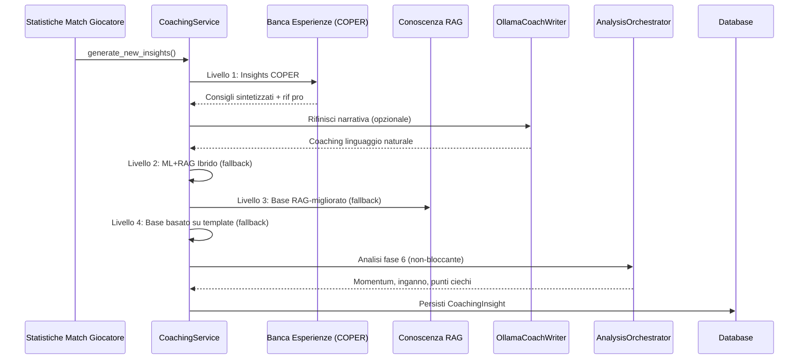

> **Spiegazione Diagramma:** Segui le frecce dall'alto verso il basso: questo è il "processo di pensiero" dell'allenatore in ordine: (1) Arrivano i dati della partita. (2) L'allenatore chiede prima all'Experience Bank: "Abbiamo già visto questa situazione? Cosa ha funzionato?". (3) Se la risposta sembra troppo robotica, la invia facoltativamente a Ollama (un programmatore di intelligenza artificiale locale) per renderla più naturale. (4) Se l'Experience Bank non dispone di dati sufficienti, ricorre alla modalità ibrida (previsioni ML + conoscenza RAG combinate). (5) Se anche i modelli ML non sono disponibili, ricorre solo a RAG (cercando suggerimenti pertinenti). (6) Se anche RAG fallisce, utilizza semplici modelli statistici ("Il tuo rapporto K/D è 0,8, sotto la media"). (7) Nel frattempo, in background, 7 motori di analisi eseguono indagini speciali attraverso 5 pipeline (momentum, inganno, entropia, strategia+punti ciechi, distanza ingaggio). (8) Tutto viene salvato nel database per riferimento futuro.

**Catena di fallback a 4 livelli:**

| Livello              | Metodo                          | Fiducia | Quando utilizzato                                |
| -------------------- | ------------------------------- | ------- | ------------------------------------------------ |
| 1.**COPER**    | `_generate_coper_insights()`  | Massima | Predefinita — sintesi basata sull'esperienza    |
| 2.**Ibrido**   | `_generate_hybrid_insights()` | Alta    | Se COPER non ha esperienza sufficiente           |
| 3.**RAG Base** | `_enhance_with_rag()`         | Media   | Se i modelli ML non sono disponibili             |
| 4.**Template** | Modello statistico di base      | Bassa   | Ultima risorsa — restituisce sempre*qualcosa* |

> **Analogia:** Il fallback a 4 livelli è come **ordinare del cibo al ristorante**. Il Livello 1 (COPER) è la specialità dello chef: il piatto migliore e più personalizzato, creato in base all'esperienza. Il Livello 2 (Ibrido) è il menu standard: ottimo cibo, ma non così personalizzato. Il Livello 3 (RAG Base) è il menu per bambini: più semplice, ma comunque nutriente. Il Livello 4 (Modello) è pane e acqua: base, ma non uscirai mai affamato. La garanzia principale è: **il giocatore riceve sempre consigli di allenamento**, qualunque cosa accada. Il sistema non ti dice mai "Mi dispiace, non ho niente per te".

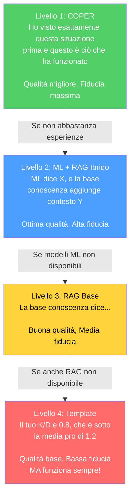

**Progettazione chiave:** Non restituisce mai zero insight. L'analisi di Fase 6 è non bloccante (incapsulata in try-catch, registrata in modo non fatale).

> **Correzione G-08 (Coaching Fallback):** In precedenza, il metodo `_generate_coper_insights()` non riceveva i parametri `deviations` e `rounds_played` dal chiamante, causando un fallback silenzioso ai template di base. Dopo la rimediazione, `generate_new_insights()` ora passa esplicitamente entrambi i parametri (`deviations=deviations, rounds_played=rounds_played`) al handler COPER, garantendo che il Livello 1 COPER possa generare insight contestuali basati sulle deviazioni statistiche reali del giocatore rispetto alla baseline pro. Senza questa correzione, il sistema avrebbe sempre degradato al Livello 4 (template) anche quando i dati COPER erano disponibili.

**Arricchimento della baseline temporale (Proposta 11):** Il servizio di coaching ora integra confronti pro ponderati nel tempo tramite due nuovi metodi:

- `_get_temporal_baseline(map_name)` — recupera una baseline pro ponderata in base a `TemporalBaselineDecay` (emivita = 90 giorni) invece di medie statiche
- `_baseline_context_note(deviations, map_name)` — genera una descrizione in linguaggio naturale ("In base ai dati pro recenti ponderati in base alla recenza, il tuo ADR è inferiore del 12% rispetto alla meta media attuale su de_mirage") per l'arricchimento COPER

Questo garantisce che gli insight di coaching riflettano la **meta media attuale** anziché medie storiche obsolete. Se i dati temporali non sono sufficienti (< 10 schede statistiche), il servizio ricorre alla funzione legacy `get_pro_baseline()` in modo trasparente.

> **Analogia:** In precedenza, l'allenatore ti confrontava con un'**istantanea** di statistiche professionali di mesi fa. Ora utilizza una **media in tempo reale e aggiornata** in cui le prestazioni professionali recenti contano più di quelle vecchie, come una valutazione su una curva in cui i punteggi dei test della settimana scorsa contano più di quelli dell'anno scorso. Se la media della classe in "ADR" è aumentata questo mese, lo vedrai immediatamente riflesso nei tuoi consigli di allenamento.

**Inferenza della fase del round** (`_infer_round_phase`): Valore dell'attrezzatura → classificazione della fase del round:

| Valore dell'attrezzatura | Fase del round |
| ------------------------ | -------------- |
| < $1.500                 | `pistol`     |
| $1.500 – $2.999         | `eco`        |
| $ 3.000 – $ 3.999     | `force`      |
| ≥ $ 4.000               | `full_buy`   |

**Classificazione dell'intervallo di salute** (`_health_to_range`): Utilizzato per l'hashing del contesto COPER: `"full"` (≥80), `"damaged"` (40–79), `"critical"` (<40).

### -OllamaCoachWriter (`ollama_writer.py`)

Trasforma le informazioni di coaching strutturate in linguaggio naturale tramite LLM locale (Ollama).

- **Singleton** tramite factory `get_ollama_writer()`
- **Funzionalità contrassegnata:** impostazione `USE_OLLAMA_COACHING` (predefinita: False)
- **Degradazione graduale:** restituisce il testo originale se Ollama non è disponibile
- **Prompt di sistema:** tono da esperto di coaching CS2, <100 parole, fattibile, incoraggiante

> **Analogia:** OllamaCoachWriter è come un **traduttore** che prende statistiche aride e le trasforma in consigli motivanti. Senza di esso, l'allenatore potrebbe dire: "deviazione media: -0,07, punteggio z: -1,4, categoria: meccanica". Con questo, l'allenatore dice: "La tua percentuale di tiri alla testa è leggermente inferiore alla media dei professionisti. Prova a concentrarti sul posizionamento del mirino: tienilo all'altezza della testa in curva". Esegue un modello di intelligenza artificiale locale (Ollama) sul tuo computer: non serve internet, né dati vengono inviati al cloud. Se Ollama non è installato, il sistema utilizza semplicemente il testo originale: nessun crash, nessun errore, solo una formulazione leggermente meno curata.

### -AnalysisOrchestrator (`analysis_orchestrator.py`)

Sintetizza l'analisi avanzata di Fase 6 istanziando 7 motori e orchestrando 5 pipeline di analisi:

**Input:** Dati di tick della partita, eventi, statistiche dei giocatori
**Output:** `MatchAnalysis` con oggetti `RoundAnalysis` per round contenenti:

- `momentum_score` (tilt/striscia vincente)
- `deception_score` (sofisticatezza tattica)
- `utility_entropy` (misurazione dell'efficacia)
- `blind_spots` (lacune strategiche)
- `strategy_rec` (raccomandazione dell'albero di gioco)
- `engagement_range` (analisi distanza di ingaggio)

**Motori istanziati:** `belief_estimator`, `deception_analyzer`, `momentum_tracker`, `entropy_analyzer`, `game_tree`, `blind_spot_detector`, `engagement_analyzer` (7 motori). Il `belief_estimator` è istanziato ma attualmente non invocato direttamente come pipeline separata.

> **Analogia:** AnalysisOrchestrator è come una **squadra di 7 detective specializzati**, ognuno dei quali indaga su un aspetto diverso del tuo gameplay. *Detective Momentum* verifica se sei in una fase di successo o in difficoltà. *Detective Deception* verifica se sei prevedibile o subdolo. *Detective Entropy* verifica se la tua utilità (granate) è efficace. *Detective Blind Spots* verifica se continui a commettere lo stesso errore. *Detective Strategy* verifica se stai prendendo le decisioni giuste. *Detective Death Probability* verifica quanto sono rischiose le tue posizioni. *Detective Engagement Range* verifica a quali distanze combatti meglio. Tutti questi controlli funzionano in background (non bloccanti), quindi anche se un detective fallisce, gli altri segnalano comunque le loro scoperte.

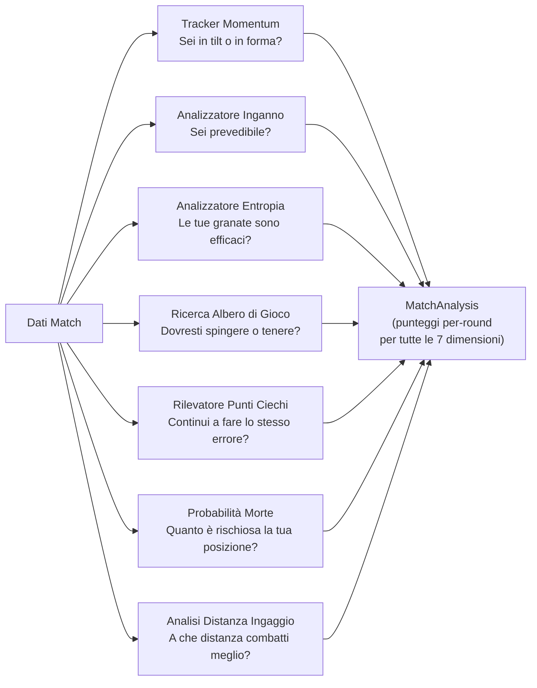

## 6. Sottosistema 4 — Conoscenza e Recupero

**cartella nella repo:** `backend/knowledge/`
**File:** `rag_knowledge.py`, `experience_bank.py`

Questo sottosistema è la **biblioteca e il diario** dell'allenatore: memorizza le conoscenze tattiche (come un libro di testo) e le esperienze di allenamento passate (come un diario di ciò che ha funzionato e di ciò che non ha funzionato).

> **Analogia:** Immagina di avere due modi per studiare per un esame. Il primo è un **libro di testo** (RAG Knowledge Base) — contiene tutti i suggerimenti CS2 organizzati per argomento: "obiettivo", "posizionamento", "utilità", ecc. Puoi cercarli ponendo domande in inglese semplice e il sistema trova le pagine più pertinenti. Il secondo è il tuo **diario personale** (Experience Bank) — registra ogni sessione di allenamento che hai svolto, i consigli che ti sono stati dati e se sei effettivamente migliorato in seguito. Col tempo, il diario diventa più intelligente: i consigli che hanno funzionato vengono evidenziati, mentre quelli che non hanno funzionato vengono eliminati. Insieme, il libro di testo e il diario forniscono all'allenatore sia **conoscenza generale** che **esperienza personale** da cui attingere.

### -Knowledge Base RAG (`rag_knowledge.py`)

Implementa una pipeline di **generazione aumentata dal recupero** utilizzando la ricerca per similarità vettoriale densa:

| Componente                          | Dettaglio                                                                                                                                            |
| ----------------------------------- | ---------------------------------------------------------------------------------------------------------------------------------------------------- |
| **Modello di incorporamento** | `sentence-transformers/all-MiniLM-L6-v2` (vettori a 384 dimensioni)                                                                                |
| **Fallback**                  | Incorporamenti basati su hash se Sentence-BERT non è disponibile                                                                                    |
| **Archiviazione**             | Tabella SQLite `TacticalKnowledge` (embedding memorizzato come array float codificato in JSON)                                                     |
| **Recupero**                  | Similarità del coseno tramite `scipy.spatial.distance.cosine`                                                                                     |
| **Top-k**                     | Configurabile, predefinito k=5                                                                                                                       |
| **Versioning**                | `CURRENT_VERSION = "v2"`; incorporamenti obsoleti ricalcolati al momento del rilascio della versione                                               |
| **Categorie**                 | 11: obiettivo, posizionamento, utilità, movimento, economia, strategia, posizionamento del mirino, comunicazione, mentale, senso del gioco, trading |

> **Analogia:** RAG funziona come un **motore di ricerca intelligente per il cervello dell'allenatore**. Quando l'allenatore ha bisogno di consigli sul posizionamento su Dust2 come CT AWPer, non cerca per parole chiave come Google. Invece, converte la domanda in un "vettore di significato" di 384 numeri e trova suggerimenti memorizzati i cui vettori di significato puntano nella stessa direzione (somiglianza del coseno). È come se ogni libro in una biblioteca avesse una coordinata GPS che ne rappresenta l'argomento e, invece di cercare per titolo, si fornissero le coordinate GPS e si trovassero i 5 libri più vicini. Il moltiplicatore di rilevanza 1,2x è come dire "i libri dello stesso scaffale (stessa mappa/lato/tipo di arrotondamento) ottengono punti bonus". Il filtro di deduplicazione (soglia 0,85) impedisce di restituire 5 copie sostanzialmente dello stesso suggerimento.

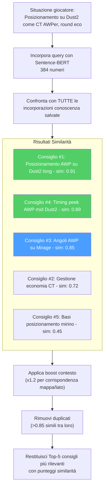

**Costruzione query:** query dinamiche in linguaggio naturale da statistiche giocatore, mappa, lato, ruolo. Gli elementi che corrispondono al contesto ottengono un moltiplicatore di rilevanza 1,2x. La deduplicazione filtra gli elementi con una similarità >0,85 rispetto ai risultati già selezionati.

### -Banca Esperienza (`experience_bank.py`) — Framework COPER

Implementa il framework **Osservazione–Previsione–Esperienza–Recupero Contestuale (COPER)**:

> **Analogia:** COPER è il **diario personale dell'allenatore con superpoteri**. Ogni volta che l'allenatore dà un consiglio durante una partita, scrive una voce di diario: "In Dust2, round eco lato T, il giocatore era nei tunnel B con 60 HP e un Deagle. Gli ho detto di mantenere l'angolazione. Sono sopravvissuti e hanno ottenuto 2 uccisioni. Questo consiglio HA FUNZIONATO!" Più tardi, quando si presenta una situazione simile, l'allenatore sfoglia il suo diario e trova quella voce. Ma è ancora più intelligente: controlla anche cosa hanno fatto i giocatori professionisti in situazioni simili, cerca degli schemi ("Questo giocatore continua ad avere difficoltà nei round eco sul lato T") e adatta la fiducia in base alla data di convalida del consiglio.

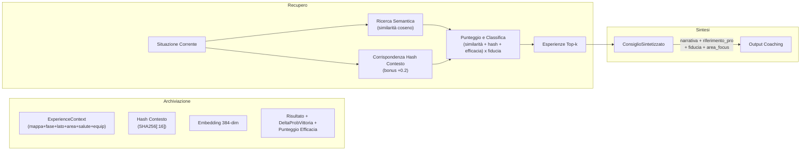

**Strategia di doppio recupero:**

1. **Esperienze utente:** Situazioni passate tratte dalla cronologia di gioco dell'utente.
2. **Esperienze professionali:** Come i professionisti hanno gestito situazioni analoghe.
3. **Analisi dei pattern:** Identifica debolezze ricorrenti, tendenze di miglioramento, correlazioni contestuali.

> **Analogia:** Il doppio recupero è come studiare per un esame utilizzando **sia i tuoi test passati che le risposte del genio della classe**. I tuoi test passati mostrano ciò in cui hai difficoltà personalmente. Le risposte del genio della classe mostrano l'approccio ideale. L'analisi dei pattern è come se il tuo insegnante esaminasse tutti i tuoi test e dicesse: "Ho notato che perdi sempre punti sullo stesso tipo di domanda: concentriamoci su quello".

**Ciclo di feedback (basato su EMA):**

- Ogni esperienza tiene traccia di `outcome_validated`, `effectiveness_score`, `times_advice_given`, `times_advice_followed`
- Le corrispondenze di follow-up aggiornano l'efficacia: `new_score = 0,7 × old_score + 0,3 × outcome_value`
- Esperienze obsolete (>90 giorni senza convalida): la fiducia diminuisce del 10%
- Il monitoraggio dell'utilizzo incrementa `usage_count` a ogni recupero

> **Analogia:** Il ciclo di feedback è il modo in cui l'allenatore **impara dai propri consigli**. Dopo aver fornito un consiglio, verifica: "Il giocatore ha effettivamente fatto quello che gli ho suggerito? Le sue prestazioni sono migliorate?". La formula EMA (0,7 vecchie + 0,3 nuove) significa che l'allenatore si fida della sua esperienza a lungo termine più di qualsiasi singolo risultato, come la valutazione di un ristorante che si basa su centinaia di recensioni, non solo sull'ultima. Se un consiglio non viene convalidato entro 90 giorni, perde il 10% di affidabilità, come una previsione meteorologica che diventa meno affidabile man mano che si procede nel futuro. Questo crea un sistema che si auto-migliora: i buoni consigli diventano più affidabili nel tempo, mentre quelli cattivi vengono gradualmente eliminati.

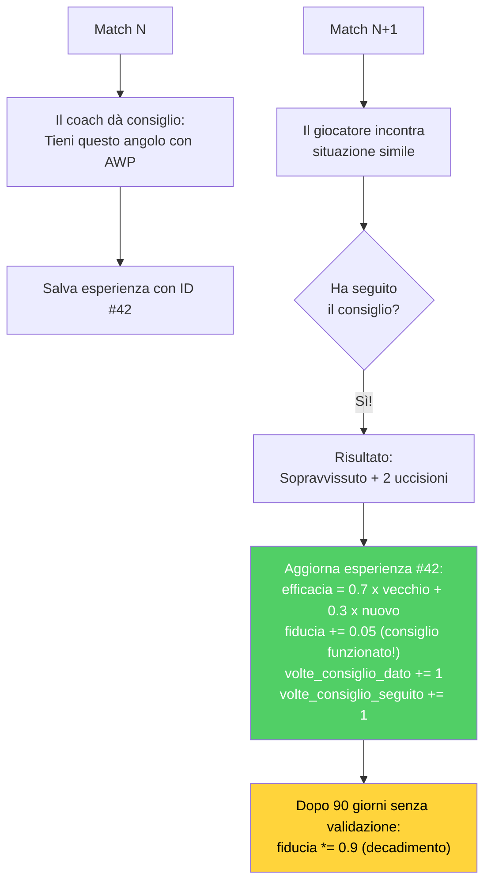

**Estrazione dell'esperienza dalle demo:** Raggruppa gli eventi per tick, identifica le uccisioni/morti dei giocatori, crea il contesto a partire da un'istantanea del tick, deduce l'azione (scoped_hold, crouch_peek, pushed, held_angle), determina l'esito.

### -Knowledge Graph

Un **grafo entità-relazione** leggero memorizzato in SQLite (tabelle `kg_entities`, `kg_relations`). Supporta `query_subgraph(entity_name)` a 1 salto per il ragionamento multi-salto, al fine di integrare la similarità semantica.

> **Analogia:** Il Knowledge Graph è come una **rete di fatti connessi**. Invece di memorizzare suggerimenti come paragrafi isolati, collega concetti: "Fumo → blocchi → visione", "AWP → richiede → angoli lunghi", "Sito Dust2 B → si collega a → tunnel". Quando il coach cerca "posizionamento AWP", il Knowledge Graph può seguire le connessioni: "AWP necessita di angoli lunghi → Dust2 ha angoli lunghi in A lungo e a metà → quelle posizioni si collegano al sito A". Questa capacità di "seguire le connessioni" (chiamata ragionamento multi-hop) aiuta il coach a trarre inferenze logiche che la ricerca testuale pura potrebbe non cogliere.

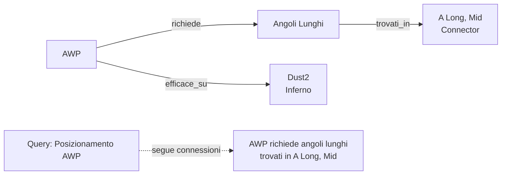

---

## 7. Sottosistema 5 — Motori di analisi

**cartella nella repo:** `backend/analysis/`
**10 file, ~2.100 righe di codice di produzione**

Questo sottosistema contiene **9 motori di analisi specializzati**, ognuno progettato per indagare una diversa dimensione del gameplay. Funzionano come analisi di Fase 6, fornendo approfondimenti che vanno oltre ciò che le sole reti neurali possono offrire.

> **Analogia:** Pensate a questi 9 motori di analisi come a un **team di 9 diversi scienziati sportivi**, ognuno con la propria specializzazione. Uno scienziato studia le vostre meccaniche di tiro, un altro le vostre capacità decisionali sotto pressione, un altro ancora la vostra capacità di essere imprevedibili e così via. Ogni scienziato produce la propria mini-pagella e insieme dipingono un quadro completo dei vostri punti di forza e di debolezza. Nessuno scienziato da solo vede tutto, ma insieme coprono tutti gli aspetti importanti del gioco competitivo in CS2.

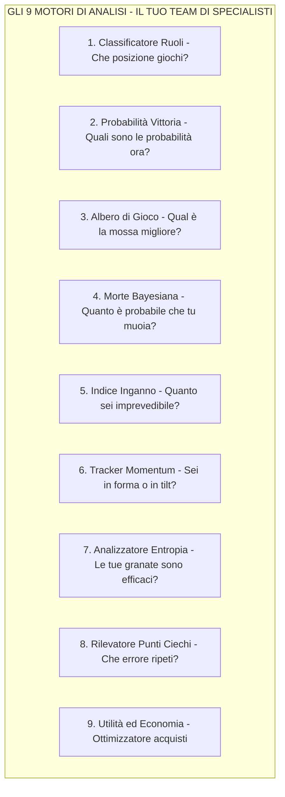

### -Classificatore di Ruoli (`role_classifier.py`, ~400 righe)

Assegna uno dei 6 ruoli utilizzando **soglie statistiche apprese**:

| Ruolo                   | Segnale Primario                                          | Segnale Secondario |
| ----------------------- | --------------------------------------------------------- | ------------------ |
| **AWPer**         | Rapporto uccisioni AWP vs soglia                          | —                 |
| **Entry Fragger** | Tasso di ingresso + bonus alla prima morte (0,3×)        | —                 |
| **Supporto**      | Tasso di assistenza + bonus danni da utilità (max 0,3×) | —                 |
| **IGL**           | Tasso di sopravvivenza + bonus bilanciamento KD           | —                 |
| **Lurker**        | Rapporto uccisioni in solitaria vs soglia                 | —                 |
| **Flex**          | Ripiegamento quando la fiducia è bassa                   | —                 |

> **Analogia:** Il Classificatore di Ruoli è come un **talent scout** che osserva il tuo stile di gioco e capisce in quale posizione ti trovi naturalmente. Se ottieni molte uccisioni AWP, probabilmente sei un AWPer. Se sei sempre il primo a morire (ma ottieni anche uccisioni iniziali), probabilmente sei un Entry Fragger. Se usi molti flash e aiuti i tuoi compagni di squadra, sei un Supporto. Se nessuno sa esattamente cosa fai meglio, sei classificato come Flex, un generalista. Le soglie non sono codificate; vengono apprese dai dati di veri giocatori professionisti (quale percentuale di uccisioni ottiene un vero AWPer con l'AWP?).

**Protezione per avvio "da zero":** `RoleThresholdStore` richiede ≥10 campioni e ≥3 soglie valide per uscire dall'avvio "da zero". Restituisce `(FLEX, 0.0)` se in avvio da zero. Le soglie vengono **mantenute nel database** tramite `persist_to_db()` e `load_from_db()` — completamente implementate, non come stub.

> **Analogia:** La protezione all'avvio a freddo è come un **nuovo insegnante che dice "Non conosco ancora abbastanza bene i miei studenti".** Finché il sistema non ha visto almeno 10 giocatori professionisti e appreso almeno 3 soglie di ruolo valide, si rifiuta di classificare nessuno, restituendo invece "Flex" con una probabilità dello 0%. Questo evita l'imbarazzante errore di chiamare qualcuno "AWPer" quando il sistema ha visto solo 2 esempi di come si presenta un AWPer.

**Audit del bilanciamento del team** (`audit_team_balance()`): rileva più AWPer (ALTA), Entry mancante (ALTA), Supporto mancante (MEDIA), nessuna diversità (CRITICA), più Lurker (MEDIA).

### -Predittore di Probabilità di Vittoria (`win_probability.py`, ~250 righe)

Rete neurale a 12 funzioni che stima P(round_win | game_state):

> **Analogia:** Il predittore di Probabilità di Vittoria è come un **tabellone segnapunti in tempo reale in una partita di basket** che mostra "La squadra di casa ha il 72% di probabilità di vincere". Considera 12 fattori relativi al momento attuale – quanti soldi ha ciascuna squadra, quanti giocatori sono ancora vivi, se la bomba è stata piazzata, quanto tempo rimane – e ne prevede le probabilità. Utilizza una piccola rete neurale (molto più piccola del RAP Coach) perché deve essere veloce, aggiornandosi ogni pochi secondi durante l'analisi in tempo reale.

**Architettura:** `Lineare(12, 64) → ReLU → Dropout → Lineare(64, 32) → ReLU → Lineare(32, 1) → Sigmoide`.

**12 Caratteristiche:**

| \# | Caratteristica                    | Normalizzazione          |
| -- | --------------------------------- | ------------------------ |
| 1  | economia_team                     | /16000                   |
| 2  | economia_nemico                   | /16000                   |
| 3  | differenziale economia            | (squadra−nemico)/16000  |
| 4  | giocatori_vivi                    | /5                       |
| 5  | nemici_vivi                       | /5                       |
| 6  | differenziale conteggio giocatori | (vivi−nemico)/5         |
| 7  | utilità\_rimanente               | /10                      |
| 8  | percentuale_controllo_mappa       | [0, 1]                   |
| 9  | tempo_rimanente                   | /115                     |
| 10 | bomba_piantata                    | binario                  |
| 11 | is_ct                             | binario                  |
| 12 | rapporto valore equipaggiamento   | min(squadra/nemico, 2)/2 |

**Override euristici:** 3+ vantaggio → limite minimo all'85%, 3+ svantaggio → limite massimo al 15%, 0 vivi → 0%, aggiustamenti bomba piazzata (T: ×1,2, CT: ×0,85), limiti economici di ±8000$.

> **Analogia:** Gli override euristici sono **barriere di sicurezza basate sul buon senso**. Anche se la rete neurale si blocca e prevede una probabilità di vittoria del 50% quando l'intera squadra è morta, la barra di sicurezza dice "No — 0 giocatori vivi = 0% di probabilità. Punto." Allo stesso modo, se hai 3 giocatori in più in vita rispetto al nemico, la regola di sicurezza recita: "Hai ALMENO l'85% di probabilità di vincere, indipendentemente da ciò che pensa la rete neurale". Queste regole codificano le conoscenze di gioco più basilari che non dovrebbero mai essere violate, fungendo da controllo di sanità mentale sulle previsioni dell'IA.

### -Albero di gioco Expectiminimax (`game_tree.py`, ~445 righe)

Implementa la **ricerca expectiminimax** con modellazione adattiva dell'avversario:

> **Analogia:** L'albero di gioco è come un **motore di scacchi per CS2**. Chiede: "Se spingo, cosa potrebbe fare il nemico? E se lo fa, qual è la mia risposta migliore?". Costruisce un albero di possibilità profondo 3 livelli: la tua mossa, la probabile risposta del nemico e la tua contro-risposta. A differenza degli scacchi tradizionali, CS2 ha la casualità (potresti sbagliare un tiro, il nemico potrebbe ruotare), quindi usa "expectiminimax", il che significa che tiene conto delle probabilità a ogni passaggio. Il risultato è una classifica in cui "Spingere è la migliore, Tenere è la seconda, Ruotare è la terza, Utilità è la quarta" con un punteggio di affidabilità per ciascuna opzione.

- **Azioni:** spingi, tieni premuto, ruota, usa_utilità
- **Modello avversario:** Priorita' economiche (eco/forza/acquisto completo), aggiustamenti laterali, aggiustamenti del vantaggio, pressione temporale
- **Profondità:** 3 livelli (max → probabilità → min)
- **Budget nodo:** 1000 (impedisce l'esplosione)
- **Valutazione foglia:** `WinProbabilityPredictor` (caricamento lazy)
- **Apprendimento avversario:** Aggiornamento EMA incrementale (α limitato a 0,5)

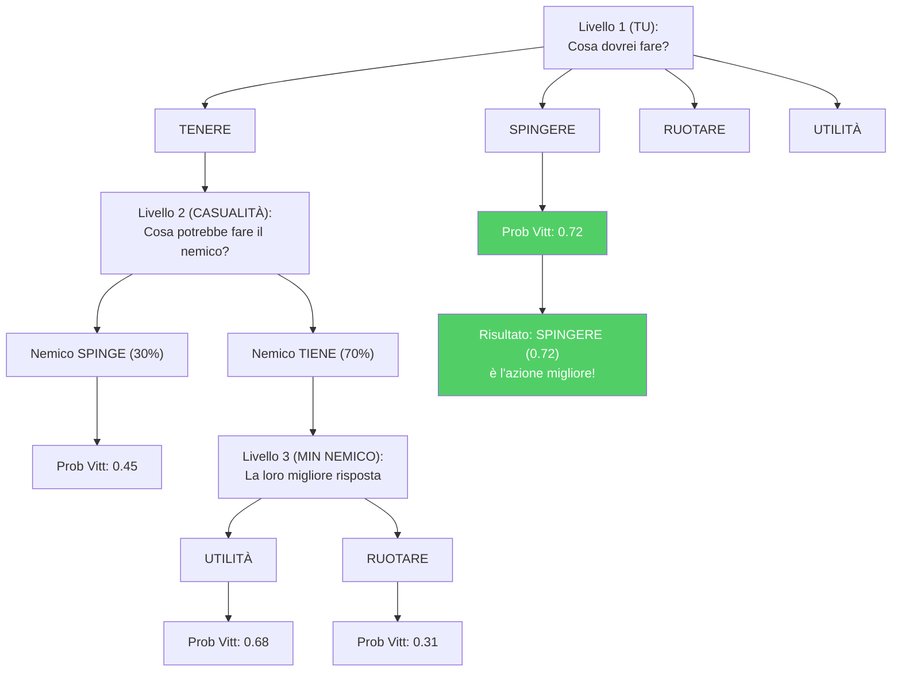

### -Stimatore Bayesiano di Morte (`belief_model.py`, ~150 righe)

Modelli P(morte | credenza, HP, armatura, classe_arma):

> **Analogia:** La Stimatore di Morte è come un **indicatore di pericolo** che risponde a queste domande: "Data la tua posizione, il tuo stato di salute, l'arma del nemico e cosa pensiamo stia facendo, quanto è probabile che tu muoia nei prossimi secondi?". Utilizza statistiche bayesiane, un modo elegante per dire "inizia con un'ipotesi, poi aggiornala con le prove". L'ipotesi iniziale si basa sui PV: se hai la salute al massimo, la probabilità di morire è di circa il 35%; se hai pochi PV, la probabilità sale all'80%. Poi si adatta in base a ciò che sa: "Ma il nemico ha un AWP (più pericoloso di ×1,4) e la minaccia è recente (nessun decadimento)". Questo fornisce una probabilità finale che l'allenatore usa per decidere se consigliare un gioco aggressivo o difensivo.

- **Antecedente:** Tassi di mortalità per fascia HP (pieno ≥80: 0,35, danneggiato 40-79: 0,55, critico <40: 0,80)
- **Fattori di probabilità:** Livello di minaccia (con decadimento esponenziale exp(−0,1 × età)), riduzione dell'armatura (0,75×), moltiplicatori delle armi (AWP: 1,4×, Fucile: 1,0×, Mitragliatrice: 0,75×, Pistola: 0,6×, Coltello: 0,3×)
- **Posteriore:** Combinazione logistica nello spazio log-odds
- **Calibrazione:** `calibrate(historical_rounds)` apprende le priorità empiriche (≥10 campioni per fascia)

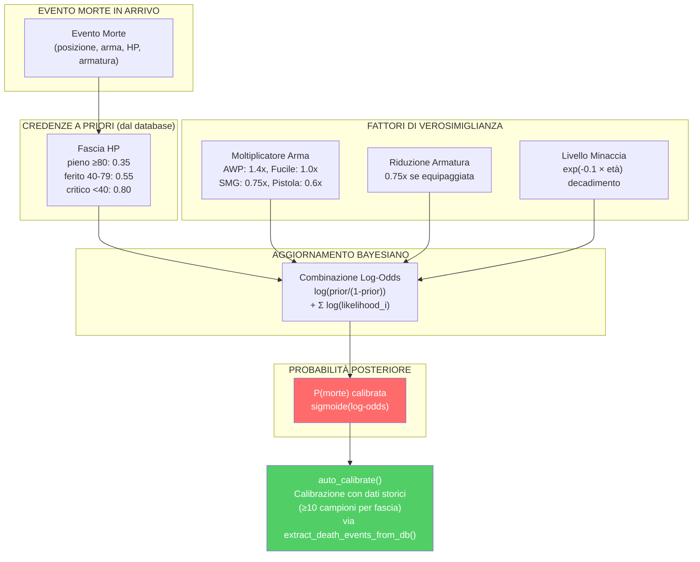

> **Nota sulla calibrazione (G-07):** Lo Stimatore Bayesiano di Morte è ora un **componente live** grazie al cablaggio completato durante la rimediazione. La funzione `extract_death_events_from_db()` nel Session Engine estrae automaticamente gli eventi di morte dal database e li passa ad `auto_calibrate()`, permettendo al modello di affinare le sue probabilità a priori sulla base dei dati reali accumulati. Questo ciclo di feedback trasforma lo stimatore da un modello statico a un sistema che si auto-calibra con l'esperienza.

### -Indice di Inganno (`deception_index.py`, ~220 righe)

Quantifica l'inganno tattico tramite tre sottometriche:

> **Analogia:** L'Indice di Inganno misura quanto un giocatore sia **astuto e imprevedibile**. In CS2, essere prevedibili è pericoloso: se il nemico sa che guardi sempre dalla stessa angolazione, mirerà in anticipo. L'Indice di Inganno è come un **punteggio poker face**: un punteggio alto significa che sei difficile da interpretare (buono), un punteggio basso significa che sei trasparente (cattivo). Misura tre cose: (1) Lanci falsi flash per indurre le reazioni? (2) Fingi le prese del sito cambiando improvvisamente direzione? (3) Alterni camminata e corsa per confondere i nemici sulla tua posizione?

| Sottometrica                           | Peso | Metodo di rilevamento                                                                                                |
| -------------------------------------- | ---- | -------------------------------------------------------------------------------------------------------------------- |
| **Frequenza di falsi flash**     | 0,25 | Flash che non accecano i nemici —`bait_rate = 1 - effettivo/totale`                                               |
| **Frequenza di finta rotazione** | 0,40 | Cambiamenti di direzione >108° rilevati tramite campionamento della velocità angolare (20 intervalli di posizione) |
| **Punteggio di inganno sonoro**  | 0,35 | Inverso del rapporto di accovacciamento —`1,0 - rapporto_accovacciamento × 2,0`                                  |

Composito: `DI = 0,25·fake_flash + 0,40·rotation_feint + 0,35·sound_deception`, fissato a [0, 1].

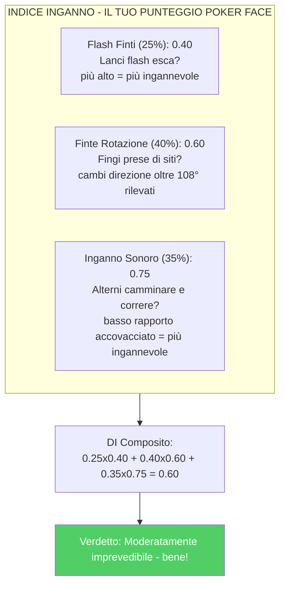

### - Momentum Tracker ([momentum.py](http://momentum.py), \~160 righe)

Modella il momentum psicologico come un moltiplicatore di prestazioni che decresce nel tempo:

> **Analogia:** il Momentum Tracker è come un anello dell'umore per il tuo gameplay. Quando vinci diversi round di fila, sei "in forma" - stai giocando con sicurezza, prendendo rischi più intelligenti e il tuo moltiplicatore di momentum supera 1,2. Quando perdi diversi round di fila, potresti essere "in tilt" - frustrato, commetti errori e il tuo moltiplicatore scende sotto 0,85. Il tracker tiene conto del fatto che il momentum svanisce nel tempo (vincere 3 round fa conta meno che vincere l'ultimo round) e si azzera all'intervallo (quando cambi campo). È come monitorare la "corsa" di una squadra di basket: un parziale di 10-0 crea momentum che influisce sulle prestazioni.

- Serie di vittorie: moltiplicatore = 1,0 + 0,05 × lunghezza della serie × decadimento
- Serie di sconfitte: moltiplicatore = 1,0 − 0,04 × lunghezza della serie × decadimento
- Decadimento: exp(−0,15 × gap_rounds)
- Limiti: \[0,7, 1,4\]
- Rilevamento inclinazione: moltiplicatore < 0,85
- Rilevamento hot: moltiplicatore > 1,2
- Reset di mezzo switch: Round 13 (MR12) e 16 (MR13)

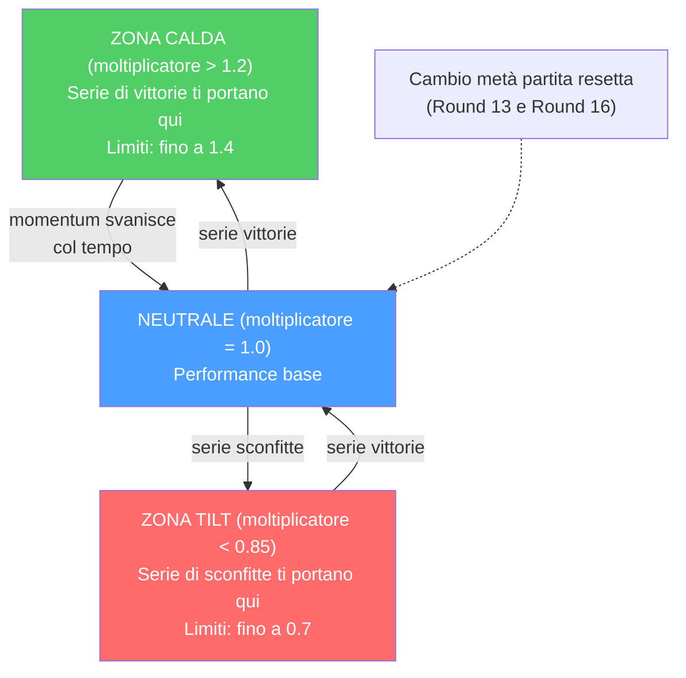

### -Analizzatore di Entropia (`entropy_analysis.py`, ~145 righe)

Misura l'efficacia dell'utilità tramite la **riduzione di entropia di Shannon** delle posizioni nemiche:

> **Analogia:** L'entropia è una misura dell'**incertezza**: maggiore è l'entropia, maggiore è l'incertezza sulla posizione dei nemici. L'Analizzatore di Entropia chiede: "Prima di lanciare quel fumo, i nemici potevano trovarsi in 100 possibili posizioni (alta entropia). Dopo il fumo, potevano trovarsi solo in 30 posizioni (bassa entropia). Il tuo fumo ha ridotto l'incertezza del 70%, il che significa che è stato un fumo efficace!" È come giocare a nascondino: se stai perquisendo un'intera casa, ci sono molti nascondigli (alta entropia). Se chiudi la cucina e il bagno, ci sono meno nascondigli (bassa entropia). Una buona granata riduce il numero di posti di cui devi preoccuparti.

- Discretizza le posizioni in una griglia 32×32
- Calcola `H = −Σ p(cell) × log₂(p(cell))`
- Impatto di utilità = `H_pre − H_post` (positivo = informazione ottenuta)
- Riduzioni massime di entropia: Smoke 2,5 bit, Molotov 2,0, Flash 1,8, HE 1,5

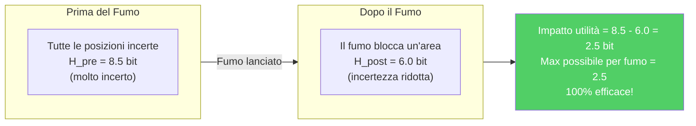

### -Rilevatore di Punti Ciechi (`blind_spots.py`, ~210 righe)

Identifica decisioni ricorrenti non ottimali rispetto alle raccomandazioni dell'albero di gioco:

> **Analogia:** Il Rilevatore di Punti Ciechi è come un **istruttore di guida** che si accorge che dimentichi sempre di controllare gli specchietti prima di cambiare corsia. Confronta ciò che hai effettivamente fatto in ogni round con ciò che l'albero di gioco ha indicato come azione ottimale. Se continui a spingere quando dovresti tenere, o continui a tenere quando dovresti ruotare, segnala questo come un "punto cieco", un errore ricorrente di cui potresti non essere nemmeno consapevole. Più spesso si verifica un errore E maggiore è il suo impatto, maggiore è la sua priorità. Quindi genera un piano di allenamento specifico: "Tendi a spingere nelle situazioni post-atterraggio quando è meglio tenere. Esercitati nel posizionamento passivo post-atterraggio."

- Confronta le azioni reali dei giocatori con le azioni ottimali di `ExpectiminimaxSearch`
- Classifica le situazioni (post-impianto, frizione, eco, round avanzato, vantaggio numerico)
- Priorità = `frequenza × impact_rating`
- Genera piani di allenamento in linguaggio naturale per i punti ciechi principali

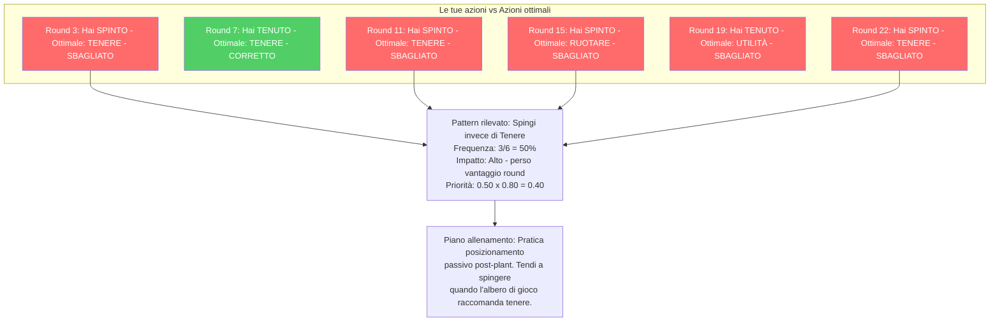

### -Analizzatore distanza di ingaggio (`engagement_range.py`, ~427 righe)

Analizza le distanze di uccisione per costruire **profili di ingaggio** specifici per ruolo e posizione:

> **Analogia:** L'Analizzatore di Engagement Range è come un **analista sportivo che studia dove un giocatore segna i gol**. Un centravanti segna principalmente da dentro l'area (ravvicinata), un centrocampista da media distanza e un difensore da lontano su calci piazzati. Allo stesso modo, un AWPer dovrebbe ottenere più uccisioni a lunga distanza, mentre un Entry Fragger dovrebbe eccellere nel combattimento ravvicinato. Se il tuo profilo di distanza non corrisponde al tuo ruolo, il coach ti dice "Stai combattendo troppo da vicino per un AWPer" o "Non sfrutti abbastanza le linee di vista lunghe".

**Componenti principali:**

| Componente | Scopo |
|---|---|
| `NamedPositionRegistry` | Registro di callout per mappa (es. "A Site", "Window", "Banana") con coordinate 3D e raggio |
| `EngagementRangeAnalyzer` | Calcolo distanza euclidea killer-vittima, classificazione e confronto con baseline pro |
| `EngagementProfile` | Distribuzione % per fascia: close (<500u), medium (500-1500u), long (1500-3000u), extreme (>3000u) |

**Baseline pro per ruolo:**

| Ruolo | Close | Medium | Long | Extreme |
|---|---|---|---|---|
| AWPer | 10% | 30% | 45% | 15% |
| Entry Fragger | 40% | 40% | 15% | 5% |
| Supporto | 25% | 45% | 25% | 5% |
| Lurker | 35% | 35% | 20% | 10% |
| IGL/Flex | 25% | 40% | 25% | 10% |

**Soglia di deviazione:** Una differenza >15% rispetto alla baseline del ruolo genera un'osservazione di coaching (es. "Più uccisioni ravvicinate del tipico AWPer — considera angoli più lunghi").

**Mappe supportate:** de_mirage, de_inferno, de_dust2, de_anubis, de_nuke, de_ancient, de_overpass, de_vertigo, de_train (espandibile via JSON).

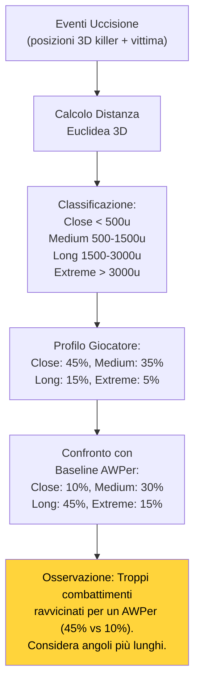

### -Analizzatore di utilità ed economia (`utility_economy.py`, ~370 righe)

**Analizzatore di utilità:** Punteggio di efficacia per tipo rispetto alle basi dei professionisti (Molotov: 35 danni/lancio, Flash: 1,2 nemici/flash, ecc.)

**Ottimizzatore di economia:** Consigli di acquisto basati su soglie economiche ($5000 acquisto completo, $2000 forza, <$2000 economia), contesto del round, differenziale di punteggio e bonus di sconfitta.

> **Analogia:** L'**Analizzatore di utilità** è come una **pagella delle granate**: controlla se le tue molotov stanno infliggendo lo stesso danno di quelle di un professionista (35 danni per lancio è il parametro di riferimento), se le tue granate accecanti stanno accecando abbastanza nemici (i professionisti infliggono in media 1,2 nemici per flash) e così via. **Economy Optimizer** è come un **consulente finanziario per CS2**: ti dice quando spendere molto (acquisto completo: oltre $5000), quando risparmiare (eco: meno di $2000) e quando correre un rischio calcolato (acquisto forzato: $2000-$5000). Considera anche il quadro generale: "Il punteggio è 12-10 e stai perdendo: forse un acquisto forzato vale il rischio".

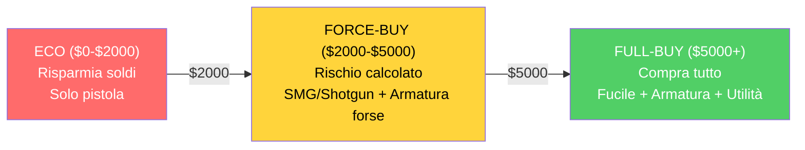

---

## 8. Sottosistema 6 — Elaborazione e Feature Engineering

**Directory:** `backend/processing/`

Questo sottosistema gestisce tutta la **preparazione dei dati**, trasformando le registrazioni grezze del gioco nei formati numerici precisi di cui le reti neurali hanno bisogno per l'addestramento e l'inferenza.

> **Analogia:** Questa è la **stazione di preparazione** della fabbrica. Prima che gli chef (reti neurali) possano cucinare, gli ingredienti (dati grezzi del gioco) devono essere lavati, sbucciati, tagliati e misurati. L'Estrattore di Feature è il capo cuoco che si assicura che tutto venga tagliato esattamente della stessa dimensione ogni volta. La Fabbrica dei Tensori crea "foto di cibo" perfette dello stato del gioco. La Pipeline dei Dati è il lavapiatti e l'organizzatore che pulisce i dati errati e ordina tutto in pile per l'addestramento/test. Senza questa stazione di preparazione, gli chef riceverebbero ingredienti grezzi e incoerenti e produrrebbero cibo pessimo.

### -Estrattore di Feature Unificato (`vectorizer.py`)

L'**unica fonte di verità** per i vettori di feature a livello di tick. Sia l'addestramento (`RAPStateReconstructor`) che l'inferenza (`GhostEngine`) DEVONO utilizzare questa classe.

> **Analogia:** L'Estrattore di Feature è il **traduttore universale** del sistema. Prende dati complessi e disordinati sullo stato del gioco (la posizione di un giocatore nello spazio 3D, la salute, le armi, ciò che vede, ecc.) e li traduce esattamente in 25 numeri precisi, ciascuno scalato per adattarsi tra -1 e 1 (o 0 e 1). Immaginatelo come convertire ogni misura di una ricetta nella stessa unità: invece di mescolare tazze, cucchiai, grammi e litri, tutto viene convertito in millilitri. In questo modo, ogni parte del sistema parla lo stesso "linguaggio a 25 numeri". Se l'addestramento utilizza un traduttore e l'inferenza ne utilizza uno diverso, i risultati sarebbero spazzatura, quindi esiste un SOLO traduttore, condiviso ovunque.

**Contratto vettoriale di feature a 25 dimensioni:**

| Indice | Feature             | Normalizzazione                          | Intervallo |
| ------ | ------------------- | ---------------------------------------- | ---------- |
| 0      | `health`          | `/100`                                 | [0, 1]     |
| 1      | `armor`           | `/100`                                 | [0, 1]     |
| 2      | `has_helmet`      | binario                                  | {0, 1}     |
| 3      | `has_defuser`     | binario                                  | {0, 1}     |
| 4      | `equipment_value` | `/10000`                               | [0, 1]     |
| 5      | `is_crouching`    | binario                                  | {0, 1}     |
| 6      | `is_scoped`       | binario                                  | {0, 1}     |
| 7      | `is_blinded`      | binario                                  | {0, 1}     |
| 8      | `enemies_visible` | `/5` (bloccato)                        | [0, 1]     |
| 9      | `pos_x`           | `/4096`                                | [−1, 1]   |
| 10     | `pos_y`           | `/4096`                                | [−1, 1]   |
| 11     | `pos_z`           | `/1024`                                | [−1, 1]   |
| 12     | `view_yaw_sin`    | `sin(yaw_rad)`                         | [−1, 1]   |
| 13     | `view_yaw_cos`    | `cos(yaw_rad)`                         | [−1, 1]   |
| 14     | `view_pitch`      | `/90`                                  | [−1, 1]   |
| 15     | `z_penalty`       | `compute_z_penalty()`                  | [0, 1]     |
| 16     | `kast_estimate`   | KAST da statistiche o 0,70 predefinito   | [0, 1]     |
| 17     | `map_id`          | Codifica deterministica basata su hash   | [0, 1]     |
| 18     | `round_phase`     | 0=pistola, 0,33=eco, 0,66=forza, 1=pieno | [0, 1]     |
| 19     | `weapon_class`    | Mappatura classi arma (0-1)              | [0, 1]     |
| 20     | `time_in_round`   | `/115` (secondi nel round)               | [0, 1]     |
| 21     | `bomb_planted`    | binario                                  | {0, 1}     |
| 22     | `teammates_alive` | `/4` (compagni vivi)                     | [0, 1]     |
| 23     | `enemies_alive`   | `/5` (nemici vivi)                       | [0, 1]     |
| 24     | `team_economy`    | `/16000` (media soldi team)              | [0, 1]     |

**Decisioni progettuali:**

- **Codifica ciclica dell'imbardata** (sin/cos agli indici 12-13) elimina la discontinuità di ±180°
- **Penalità Z** (indice 15) quantifica il rischio di livello errato per mappe multilivello
- **Integrazione del contesto tattico** (indici 19-24) fornisce al modello consapevolezza della situazione di gioco
- **Catena di fallback della stima KAST:** valore esplicito → calcolo dalle statistiche → valore predefinito 0,70
- **Codifica dell'identità della mappa:** l'hash deterministico consente l'apprendimento specifico della mappa
- **HeuristicConfig** (`base_features.py`) consente di sovrascrivere tutti i limiti di normalizzazione tramite JSON

> **Spiegazione delle decisioni progettuali:** La **codifica ciclica dell'imbardata** (sin/cos) risolve un problema insidioso: se si codifica la direzione in cui un giocatore guarda come un singolo angolo, guardare a sinistra (-179°) e guardare a destra (+179°) sembrano molto distanti matematica, anche se sono quasi nella stessa direzione. Usando seno e coseno, la matematica capisce correttamente che sono vicini, come avvolgere un righello in un cerchio in modo che 0° e 360° si tocchino. La **penalità Z** è un "allarme piano sbagliato": su mappe multilivello come Nuke, trovarsi al piano sbagliato è un disastro, quindi il modello traccia esplicitamente questo rischio. L'**integrazione tattica** (economia, vivi, tempo) permette al coach di capire se una giocata aggressiva è corretta in base al tempo rimasto o al vantaggio numerico.

### -Valutazione HLTV 2.0 (`rating.py`)

Il **modulo di valutazione unificato** che previene l'inferenza-distorsione nell'addestramento:

```
R = (R_kill + R_survival + R_kast + R_impact + R_damage) / 5

dove:
R_kill = KPR / 0,679
R_survival = (1 − DPR) / 0,317
R_kast = KAST / 0,70
R_impact = (2,13·KPR + 0,42·ADR/100) / 1,0
R_damage = ADR / 73,3
```

> **Analogia:** La valutazione HLTV 2.0 è come una **media dei voti (GPA)** per i giocatori di CS2. Invece di calcolare la media dei voti di Matematica, Inglese, Scienze, Storia e Arte, calcola la media di cinque "materie" di CS2: Tasso di uccisioni, Tasso di sopravvivenza, KAST (la frequenza con cui hai contribuito), Impatto (l'impatto delle tue uccisioni) e Danno (l'entità totale dei danni inflitti). Ogni materia è normalizzata dalla media dei professionisti (come una valutazione su una curva): se i professionisti hanno una media di 0,679 uccisioni a round, ottenere 0,679 KPR ti dà una "B" (1,0). Ottenere di più ti dà una "A+" e ottenerne di meno ti dà una "C". Il fatto che sia l'allenamento che l'inferenza utilizzino esattamente la stessa formula impedisce la "distorsione tra addestramento e inferenza", ovvero assicurarsi che la stessa griglia di valutazione venga utilizzata sia per i test di pratica che per l'esame finale.

Utilizzato da: demo_parser.py (analisi), base_features.py (aggregazione), coaching_service.py (insight).

### -Tensor Factory (`tensor_factory.py`)

Converte i dati tick grezzi in tensori di immagini 64x64 per il livello di percezione RAP:

| Tensor              | Canali    | Contenuto                                                                                        |
| ------------------- | --------- | ------------------------------------------------------------------------------------------------ |
| **Mappa**     | 3 (R/G/B) | R: posizione del giocatore, G: compagni di squadra (α-blended), B: nemici (α-blended)          |
| **Vista**     | 3         | **Ch0:** maschera FOV corrente (90° predefinito, mascheramento trigonometrico); **Ch1:** zona di pericolo (= 1 − FOV accumulato sugli ultimi 8 tick), le aree mai controllate sono potenziali posizioni nemiche; **Ch2:** zona sicura (= 1 − FOV corrente − zona di pericolo), l'area tra la vista attuale e le zone inesplorate |
| **Movimento** | 2 o 3     | Mappe di calore di velocità/accelerazione (gocce 2D sfocate gaussiane)                          |

> **Correzione G-02 (Zona di Pericolo):** In precedenza, il tensore vista aveva 3 canali identici (placeholder). Dopo la rimediazione, i 3 canali codificano informazioni tattiche distinte: il **FOV corrente** mostra ciò che il giocatore vede adesso, la **zona di pericolo** accumula la storia FOV degli ultimi 8 tick (~125ms a 64 Hz) e inverte il risultato per identificare le aree mai controllate — dove i nemici potrebbero nascondersi — e la **zona sicura** rappresenta l'area intermedia tra vista attuale e zone inesplorate. Il calcolo della zona di pericolo usa `np.maximum(accumulated_fov, tick_fov)` per ogni tick storico, poi `danger_zone = 1.0 − accumulated_fov`. Questo fornisce al modello RAP una consapevolezza spaziale della copertura visiva, trasformando il tensore vista da un semplice input statico a un **indicatore tattico temporale**.

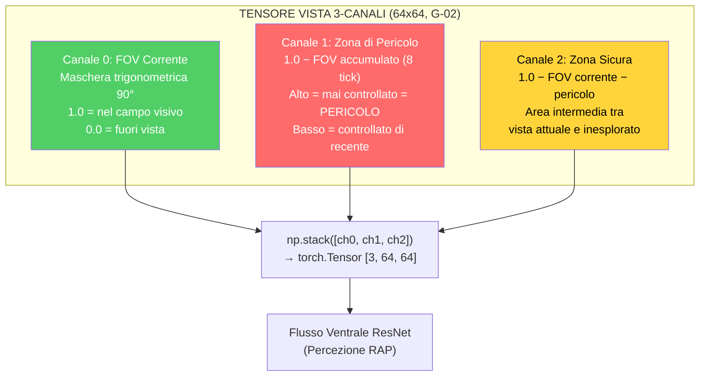

> **Analogia:** Tensor Factory crea **piccoli dipinti da 64x64 pixel** della situazione di gioco che l'allenatore RAP può osservare. Il **tensore mappa** è come un dipinto a volo d'uccello: il giocatore è un punto rosso, i compagni di squadra sono punti verdi, i nemici sono punti blu. Il **tensore vista** è lo stesso dipinto, ma con tutto ciò che si trova al di fuori del campo visivo di 90° del giocatore cancellato: è come indossare dei paraocchi, quindi il modello vede solo ciò che il giocatore poteva effettivamente vedere. Il **tensore movimento** è come una fotografia a lunga esposizione: i giocatori in rapido movimento lasciano scie luminose, i giocatori fermi sono invisibili. Insieme, questi tre "dipinti" offrono all'allenatore RAP una comprensione visiva completa di ogni momento.

### -Heatmap Engine (`heatmap_engine.py`)

Mappe di occupazione gaussiane ad alte prestazioni per la visualizzazione tattica:

- Generazione di dati thread-safe (`generate_heatmap_data()`)
- Creazione di texture solo nel thread principale (OpenGL)
- Heatmap differenziali con rilevamento di hotspot per l'allenamento posizionale

> **Analogia:** Il motore Heatmap crea **mappe di calore**, simili alle mappe meteorologiche che si vedono in TV, ma per le posizioni dei giocatori. Le aree in cui si trova il giocatore spesso si illuminano di rosso, mentre le aree che non visita mai sono di un blu freddo. La heatmap "differenziale" mostra la differenza tra le TUE posizioni e quelle dei PRO: se un punto si illumina di rosso, ci stai troppo tempo rispetto ai professionisti; se si illumina di blu, non ci vai mai, ma i professionisti sì. Questa visualizzazione mostra immediatamente "passi troppo tempo in A e non abbastanza tempo a ruotare a centrocampo".

### -Data Pipeline (`data_pipeline.py`)

`ProDataPipeline` gestisce la preparazione dei dati ML-ready:

1. **Recupera** tutti i `PlayerMatchStats` dal database
2. **Pulisce** i valori anomali (`avg_adr < 400`, `avg_kills < 3.0`)
3. **Ridimensiona** tramite `StandardScaler`
4. **Suddivide** temporalmente (70/15/15) con ordinamento cronologico per gruppo (pro/utente)
5. **Mantieni** la colonna `dataset_split` sul posto

> **Analogia:** Data Pipeline è come un **ufficio ammissioni scolastico** che prepara i fascicoli degli studenti per le lezioni. Per prima cosa, **estrae tutti i file** dal database. Quindi **rimuove gli imbroglioni**, ovvero chiunque abbia statistiche incredibilmente alte (un ADR superiore a 400 significa che probabilmente hanno usato hack o che i dati sono corrotti). Successivamente, **standardizza i voti** in modo che tutto sia sulla stessa scala. Quindi **ordina gli studenti cronologicamente** e assegna il 70% alla "classe di apprendimento" (formazione), il 15% alla "classe di quiz" (validazione) e il 15% alla "classe di esame finale" (test). La suddivisione temporale è fondamentale: significa che il modello non vede mai dati "futuri" durante l'addestramento, impedendo imbrogli dovuti ai viaggi nel tempo.

### -Generatore di statistiche per round (`round_stats_builder.py`)

Collega gli eventi demo grezzi al **livello di isolamento per round** (`RoundStats` in `db_models.py`), impedendo la contaminazione statistica tra round e consentendo analisi dettagliate del coaching per round.

> **Analogia:** Invece di darti un voto per l'intero test, questo modulo valuta **ogni singola domanda individualmente** (statistiche per round), quindi ne calcola la media per la pagella finale (statistiche a livello di partita). Un brutto terzo round non abbassa silenziosamente il tuo punteggio del quindicesimo round: ogni round è indipendente. È come un insegnante che scrive commenti dettagliati su ogni problema dei compiti invece di assegnare solo un voto in lettere.

**Funzioni chiave:**

| Funzione                                             | Scopo                                                                                                                               |
| :--------------------------------------------------- | ----------------------------------------------------------------------------------------------------------------------------------- |
| `build_round_stats(parser, demo_name)`             | Analizza gli eventi round_end, player_death, player_hurt, player_blind e costruisce le statistiche per round                        |
| `enrich_from_demo(demo_path, demo_name)`           | Arricchimento completo: uccisioni noscope/cieche, conteggio flash/fumo, assist flash, uccisioni con scambio, analisi delle utilità |
| `aggregate_round_stats_to_match(round_stats_list)` | Elabora le statistiche a livello di round → PlayerMatchStats a livello di partita                                                  |
| `compute_round_rating(round_stats)`                | Valutazione HLTV 2.0 per round utilizzando il modulo di valutazione unificato                                                       |

**Pipeline di arricchimento:**

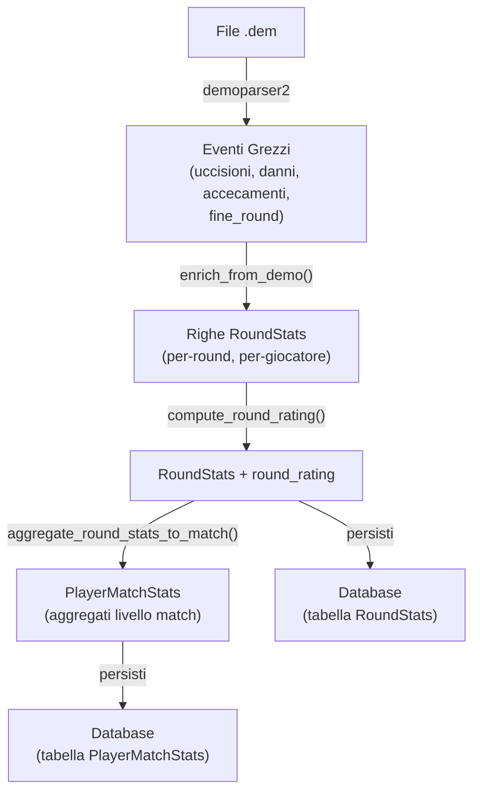

**Campi di arricchimento uccisioni** aggiunti da `enrich_from_demo()`:

| Campo               | Metodo di rilevamento                                                               |
| ------------------- | ----------------------------------------------------------------------------------- |
| `noscope_kills`   | Uccidi dove AWP/Scout/SSG è equipaggiato ma `is_scoped=False`                    |
| `blind_kills`     | Uccidi dove `attacker_blinded=True` al momento della morte                        |
| `flash_assists`   | Uccidi entro 128 tick (2 s) da un nemico colpito da un flash dalla stessa squadra   |
| `thrusmoke_kills` | Uccidi attraverso granata fumogena (dai flag dell'evento demo)                      |
| `wallbang_kills`  | Uccidi attraverso la penetrazione del muro (dai flag dell'evento demo)              |
| `trade_kills`     | Uccidi entro 5 s dalla morte di un compagno di squadra per mano dello stesso nemico |

**Integrazione con le pipeline di ingestione:** Sia `user_ingest.py` che `pro_ingest.py` ora chiamano `enrich_from_demo()` dopo l'analisi della demo e rendono persistenti gli oggetti `RoundStats` risultanti nel database. Questo garantisce che ogni demo ingerita, utente o professionista, produca dati granulari a livello di round.

### -Decadimento della baseline temporale (`pro_baseline.py`)

La classe `TemporalBaselineDecay` integra (non sostituisce) la funzione `get_pro_baseline()` esistente con una media ponderata nel tempo, garantendo che i confronti tra i coach riflettano l'**attuale meta CS2** piuttosto che le obsolete medie storiche.

> **Analogia:** I punteggi dei vecchi esami contano meno di quelli recenti nel calcolo della media della classe. Le statistiche di un giocatore professionista di 6 mesi fa sono "sbiadite" (meno importanti) rispetto alle statistiche della settimana scorsa. In questo modo, se il meta del gioco cambia, ad esempio l'utilizzo di AWP diminuisce dopo una patch di bilanciamento, la baseline si aggiorna automaticamente senza necessità di ricalibrazione manuale.

**Formula di decadimento:**

```
weight(age_days) = max(MIN_WEIGHT, exp(-ln(2) × age_days / HALF_LIFE))
```

| Parametro                | Valore | Significato                                                         |
| ------------------------ | ------ | ------------------------------------------------------------------- |
| `HALF_LIFE_DAYS`       | 90     | Il peso si dimezza ogni 90 giorni                                   |
| `MIN_WEIGHT`           | 0,1    | Soglia minima: dati molto vecchi contribuiscono ancora per il 10%   |
| `META_SHIFT_THRESHOLD` | 0,05   | Una variazione del 5% tra le epoche segnala un cambiamento del meta |

**Metodi chiave:**

| Metodo                                    | Scopo                                                                                   |
| ----------------------------------------- | --------------------------------------------------------------------------------------- |
| `compute_weight(stat_date)`             | Peso di decadimento esponenziale per una singola scheda statistica                      |
| `compute_weighted_baseline(stat_cards)` | Media/std ponderata nel tempo su tutti i record ProPlayerStatCard                       |
| `get_temporal_baseline(map_name)`       | Pipeline completa: recupero schede → peso → unione con i valori predefiniti legacy    |
| `detect_meta_shift(old, new)`           | Segnala le metriche che hanno subito uno scostamento ≥ 5% tra le epoche di riferimento |

**Punti di integrazione:**

- **CoachingService:** `_get_temporal_baseline()` lo utilizza per l'arricchimento COPER
- **Teacher Daemon:** `_check_meta_shift()` viene eseguito dopo ogni ciclo di riaddestramento, registrando le metriche che hanno subito uno scostamento

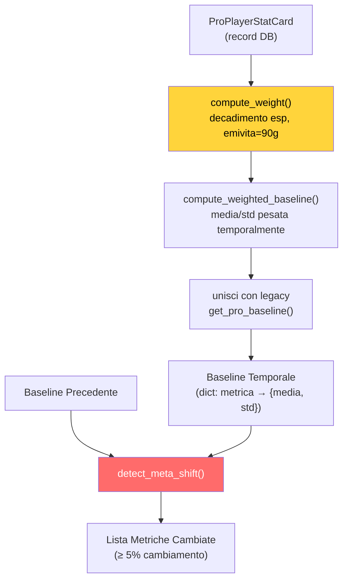

### -Validazione (`validation/`)

- [**drift.py**](http://drift.py)**:** Rilevamento della deriva nella distribuzione dei dati con oggetti DriftReport
- [**schema.py**](http://schema.py)**:** Validazione dello schema per i record del database
- [**sanity.py**](http://sanity.py)** / dem\_[validator.py](http://validator.py):** Controlli di integrità dei dati e dei file demo

> **Analogia:** Il sottosistema di convalida è l'**ispettore del controllo qualità** in fabbrica. Il rilevamento della deriva verifica: "I dati che riceviamo oggi sono simili a quelli su cui ci siamo formati o le cose sono cambiate?" (come controllare se la ricetta di un biscotto ha ancora lo stesso sapore del lotto del mese scorso). Controlli di convalida dello schema: "Ogni record del database ha tutti i campi obbligatori nel formato corretto?" (come assicurarsi che ogni modulo sia compilato completamente). I controlli di integrità verificano che i file demo siano reali, completi e non corrotti (come scuotere una scatola per assicurarsi che non sia vuota prima di spedirla).

---
