## 9. Schema del database e ciclo di vita dei dati

Il progetto utilizza **SQLModel** (Pydantic + SQLAlchemy) con SQLite (modalità WAL). 20 tabelle SQLModel principali:

> **Analogia:** Il database è l'**archivio** del sistema: ogni informazione ha un cassetto e una cartella specifici. SQLite in modalità WAL consente a più programmi di leggere l'archivio contemporaneamente senza bloccarsi a vicenda (come una biblioteca dove molte persone possono leggere libri diversi contemporaneamente). SQLModel combina Pydantic (per la convalida dei dati: "assicurati che il campo età sia effettivamente un numero") con SQLAlchemy (per le operazioni sul database: "salva questo nella tabella giusta"). Le oltre 20 tabelle sono organizzate come l'archivio scolastico: profili degli studenti, punteggi dei test, appunti di classe, valutazioni degli insegnanti e libri della biblioteca.


> **Spiegazione del diagramma ER:** Ogni riquadro rappresenta un **tipo di record** nel database. `PlayerMatchStats` è come una **pagella** per ogni giocatore in ogni partita (quante uccisioni, morti, la loro valutazione, ecc.). `PlayerTickState` è come un **diario fotogramma per fotogramma**: 128 voci al secondo che registrano esattamente dove si trovava il giocatore, quanto era in salute, in che direzione stava guardando. `RoundStats` è la **scomposizione per domanda**: valutazioni individuali per ogni round (uccisioni, morti, danni, uccisioni noscope, assist flash, valutazione del round), consentendo analisi dettagliate. `CoachingExperience` è il **diario** dell'allenatore: ogni momento di allenamento, se i consigli hanno funzionato e quanto sono stati efficaci. `CoachingInsight` è il **consiglio effettivo** fornito al giocatore. `TacticalKnowledge` è il **libro di testo**: suggerimenti e strategie che l'allenatore può consultare. `RoleThresholdRecord` è la **rubrica di valutazione**, ovvero le soglie apprese per classificare i ruoli dei giocatori. `CalibrationSnapshot` è il **registro di controllo dello strumento**, che registra quando il modello di credenza è stato ricalibrato e con quanti campioni. `Ext_PlayerPlaystyle` è il **report di scouting esterno**, ovvero le metriche dello stile di gioco ricavate dai dati CSV utilizzati per addestrare NeuralRoleHead. `ServiceNotification` è il **sistema di interfono**, ovvero i messaggi di errore ed evento provenienti dai daemon in background mostrati nell'interfaccia utente. Le linee tra le tabelle mostrano le relazioni: ogni record di partita è collegato al profilo di un giocatore, le esperienze di allenamento sono collegate a partite specifiche e RoundStats è collegato a PlayerMatchStats tramite demo_name.

**Ciclo di vita dei dati:**

| Fase                                | Tabelle scritte                                                                   | Volume                                 |
| ----------------------------------- | --------------------------------------------------------------------------------- | -------------------------------------- |
| Inserimento demo                    | `PlayerMatchStats`, `PlayerTickState`, `MatchMetadata`                      | ~100.000 tick/partita                  |
| Arricchimento round                 | `RoundStats` (isolamento per round, per giocatore)                              | ~30 righe/partita (round × giocatori) |
| Scansione HLTV                      | `ProPlayer`, `ProTeam`, `ProPlayerStatCard`                                 | ~500 giocatori                         |
| Importazione CSV                    | Tabelle esterne tramite `csv_migrator.py`                                       | ~10.000 righe                          |
| Dati sullo stile di gioco           | `Ext_PlayerPlaystyle` (da CSV per NeuralRoleHead)                               | ~300+ giocatori                        |
| Progettazione delle feature         | `PlayerMatchStats.dataset_split` aggiornato                                     | Sul posto                              |
| Popolazione RAG                     | `TacticalKnowledge`                                                             | ~200 articoli                          |
| Estrazione dell'esperienza          | `CoachingExperience`                                                            | ~1.000 per partita                     |
| Output di coaching                  | `CoachingInsight`                                                               | ~5-20 per partita                      |
| Apprendimento delle soglie di ruolo | `RoleThresholdRecord`                                                           | 9 soglie                               |
| Calibrazione delle convinzioni      | `CalibrationSnapshot` (dopo il riaddestramento)                                 | 1 per ogni calibrazione eseguita       |
| Telemetria di sistema               | `CoachState`, `ServiceNotification`, `IngestionTask`                        | Continuo                               |
| Backup                              | Automatizzato tramite `BackupManager` (7 rotazioni giornaliere + 4 settimanali) | Copia completa del database            |

> **Analogia:** Il ciclo di vita dei dati mostra **come le informazioni fluiscono attraverso il sistema nel tempo**, come il tracciamento di un pacco dalla fabbrica alla consegna. Prima arrivano le registrazioni delle partite (100.000 punti dati per partita!). Poi le statistiche dei giocatori professionisti vengono estratte da HLTV (come scaricare un almanacco sportivo). Vengono importati file CSV esterni (come ottenere dati storici). L'IA elabora tutto, genera consigli per gli allenatori, apprende le soglie di ruolo e registra costantemente lo stato di salute del sistema. I backup vengono eseguiti automaticamente: 7 copie giornaliere e 4 copie settimanali, come se salvassi i tuoi compiti sia sul computer che su un'unità USB, per ogni evenienza.

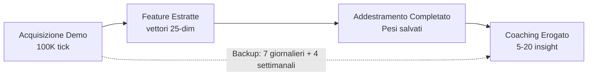

## 10. Regime di formazione e limiti di maturità

> **Analogia:** Il regime di formazione è il **curriculum scolastico completo**, dalla scuola materna al diploma. Uno studente (il modello di intelligenza artificiale) inizia con zero conoscenze e apprende gradualmente attraverso 4 fasi, sbloccando corsi più avanzati man mano che si dimostra all'altezza. I limiti di maturità sono come i **requisiti di valutazione**: non puoi sostenere l'esame di Fisica AP (Ottimizzazione RAP) finché non hai superato Matematica di base (Pre-Formazione JEPA), Algebra (Baseline Pro) e Pre-Calcolo (Fine-Tuning Utente). Ogni limite verifica: "Hai studiato abbastanza demo per essere pronto per il livello successivo?"

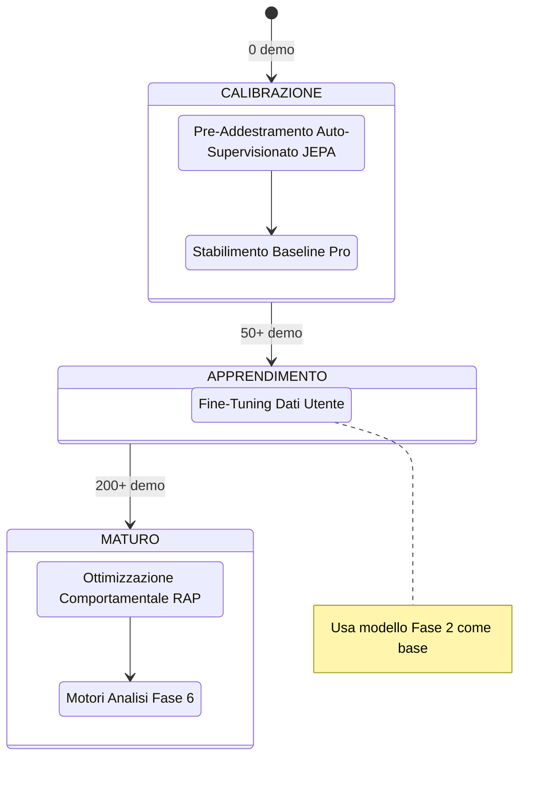

**Requisiti dati per fase:**

| Fase                       | Dati minimi               | Tipo di addestramento          | Perdita primaria                           |
| -------------------------- | ------------------------- | ------------------------------ | ------------------------------------------ |
| 1\. Pre-addestramento JEPA | 10 demo pro               | Auto-supervisionato (InfoNCE)  | Contrastivo con negativi in batch          |
| 2\. Baseline pro           | 50 corrispondenze pro     | Supervisionato                 | MSE(pred, pro_stats)                       |
| 3\. Ottimizzazione utente  | 50 corrispondenze utente  | Supervisionato (trasferimento) | MSE(pred, user_stats)                      |
| 4\. Ottimizzazione RAP     | 200 corrispondenze totali | Multi-task                     | Strategia + Valore + Sparsità + Posizione |

> **Analogia:** La fase 1 è come **guardare programmi di cucina**: il modello apprende i pattern semplicemente osservando (auto-supervisionato, senza bisogno di etichette). La fase 2 è come **una scuola di cucina con un libro di testo**: "Ecco come fa un professionista la pasta" (supervisionata con dati professionali). La fase 3 è come **cucinare per la tua famiglia**: "La tua famiglia preferisce il piccante, quindi adattiamo la ricetta" (affinando i dati degli utenti). La fase 4 è un **addestramento da chef provetto**: imparare a bilanciare contemporaneamente sapore, presentazione, tempi e nutrizione (multi-task: strategia + valore + parsimonia + posizione). Hai bisogno di almeno 10 programmi di cucina per iniziare, 50 ricette da imparare e 200 piatti in totale preparati prima di diplomarti.

```mermaid
flowchart LR
P1["Fase 1: GUARDA E IMPARA (oltre 10 demo pro)<br/>Auto-supervisionato: Prevedi cosa succederà dopo<br/>Sconfitta: Contrasto InfoNCE"]
P1 --> P2["Fase 2: STUDIA IL LIBRO DI TESTO (oltre 50 partite pro)<br/>Supervisionato: Raggiungi lo standard pro<br/>Sconfitta: MSE(pred, pro_stats)"]
P2 --> P3["Fase 3: PERSONALIZZA (oltre 50 partite utente)<br/>Trasferisci l'apprendimento: Adattati a QUESTO utente<br/>Sconfitta: MSE(pred, user_stats)"]
P3 --> P4["Fase 4: MASTER CLASS (oltre 200 partite totali)<br/>Multi-task: Strategia + Valore + Sparsity<br/>+ Posizione (con penalità Z)<br/>Coach RAP completo attivato!"]

stile P1 riempimento:#4a9eff,colore:#fff
stile P2 riempimento:#228be6,colore:#fff
stile P3 riempimento:#15aabf,colore:#fff
stile P4 riempimento:#ff6b6b,colore:#fff
```

**Trigger di riaddestramento:** Il demone Teacher monitora la crescita del numero di demo professionali; attiva il riaddestramento quando `count ≥ last_count × 1,10`.

> **Analogia:** Il trigger di riaddestramento è come una **scuola che aggiorna il suo curriculum quando arrivano abbastanza nuovi libri di testo**. Il demone Teacher (un processo in background) controlla costantemente: "Quante demo professionali abbiamo ora?". Quando il numero cresce del 10% o più dall'ultimo addestramento, dice: "Abbiamo abbastanza nuovo materiale: è ora di riqualificare il modello in modo che rimanga al passo con l'evoluzione del meta professionale."

---

## 11. Catalogo delle funzioni di perdita

> **Analogia:** Le funzioni di perdita sono i **punteggi dei test** che l'IA cerca di minimizzare. Ogni modello ha il suo tipo di test. Un punteggio più basso significa una prestazione migliore, l'opposto dei voti scolastici! Pensa a ogni funzione di perdita come a una domanda specifica del test: "Quanto era vicina la tua previsione alla risposta corretta?" (MSE), "Hai scelto la risposta corretta tra più opzioni?" (InfoNCE/BCE), "Hai utilizzato troppe risorse?" (Scarsità). La tabella seguente è simile al **calendario completo dell'esame**: ogni test, per ogni modello, con la formula di valutazione esatta.

| Modello                   | Nome della perdita        | Formula                                                                                                                         | Scopo                                                                  |
| ------------------------- | ------------------------- | ------------------------------------------------------------------------------------------------------------------------------- | ---------------------------------------------------------------------- |
| **JEPA**            | InfoNCE Contrastive       | `−log(exp(sim(pred, target)/τ) / Σ exp(sim(pred, neg_i)/τ))`, τ=0.07, `F.normalize` prima della similarità del coseno | Allineamento delle previsioni di contesto con gli embedding del target |
| **JEPA**            | Ottimizzazione            | `MSE(coaching_head(Z_ctx), y_true)`                                                                                           | Punteggio di coaching supervisionato                                   |
| **AdvancedCoachNN** | Supervisionato            | `MSELoss(MoE_output, y_true)`                                                                                                 | Allenamento a livello di partita                                       |
| **RAP**             | Strategia                 | `MSELoss(advice_probs, target_strat)`                                                                                         | Raccomandazione tattica corretta                                       |
| **RAP**             | Valore                    | `0,5 × MSE(V(s), true_advantage)`                                                                                            | Stima accurata del vantaggio                                           |
| **RAP**             | Sparsità                 | `L1(gate_weights)`                                                                                                            | Specializzazione esperta                                               |
| **RAP**             | Posizione                 | `MSE(xy) + 2× MSE(z)`                                                                                                        | Posizionamento ottimale con penalità sull'asse Z                      |
| **WinProb**         | Previsione                | `BCEWithLogitsLoss(pred, risultato)`                                                                                          | Previsione dell'esito del round                                        |
| **NeuralRoleHead**  | KL-Divergence             | `KLDivLoss(log_softmax(pred), target)` con smoothing delle etichette ε=0,02                                                  | Corrispondenza della distribuzione di probabilità del ruolo           |
| **VL-JEPA**         | Allineamento dei concetti | `BCE(concept_logits, concept_labels)` + `VICReg(concept_diversity)`                                                         | Fondamenti del concetto di linguaggio visivo                           |

> **Analogia per le funzioni di perdita delle chiavi:** **InfoNCE** è come un test a risposta multipla: "Ecco 32 possibili risposte: qual è quella corretta?" Il modello ottiene un punteggio più alto per aver scelto quello giusto E per esserne sicuro. L'**MSE** (Errore Quadratico Medio) è come misurare la distanza della tua freccetta dal centro del bersaglio: più vicino = minore perdita. L'**BCE** (Entropia Incrociata Binaria) è come un quiz vero/falso: "La tua squadra ha vinto? Sì o no?". La **Perdita di Sparsità** è come un insegnante che dice "Usa meno parole nel tuo tema": incoraggia il modello ad attivare meno esperti, rendendolo più efficiente e interpretabile. La **Perdita di Posizione con penalità Z 2x** è come dire "mancare a sinistra o a destra è grave, ma cadere da un dirupo (dal piano sbagliato) è due volte peggio". La **KL-Divergence** è come confrontare due classifiche: "La tua classifica dei ruoli corrisponde a quella reale?" — misura quanto la distribuzione predetta si discosta da quella target.

---

## 12. Logica Completa del Programma — Dal Lancio al Consiglio

Questo capitolo documenta la **logica completa** di Macena CS2 Analyzer, dal momento in cui l'utente lancia l'applicazione fino a quando riceve i consigli di coaching. A differenza dei capitoli precedenti che si concentrano sui sottosistemi AI, qui viene spiegato come **ogni componente del programma** lavora insieme: l'interfaccia desktop, l'architettura quad-daemon, la pipeline di ingestione, il sistema di storage, il playback tattico, l'osservabilità e il ciclo di vita dell'applicazione.

> **Analogia:** Se i capitoli 1-11 descrivono i **singoli organi** di un corpo umano (cervello, cuore, polmoni, fegato), questo capitolo descrive il **corpo intero in azione**: come si sveglia al mattino, come respira, cammina, mangia, pensa e parla. Capire gli organi è essenziale, ma capire come lavorano insieme è ciò che dà vita al sistema. Immaginate Macena CS2 Analyzer come una **piccola città**: ha un municipio (il processo principale Kivy), una centrale operativa sotterranea (il Session Engine con i suoi 4 daemon), un archivio comunale (il database SQLite), un ufficio postale (la pipeline di ingestione), una scuola (il sistema di addestramento ML), una biblioteca (il sistema di conoscenza RAG/COPER), un ospedale (il servizio di coaching) e un sistema di monitoraggio della salute pubblica (l'osservabilità). Questo capitolo vi guida attraverso ogni edificio e mostra come i cittadini (i dati) si muovono da un luogo all'altro.

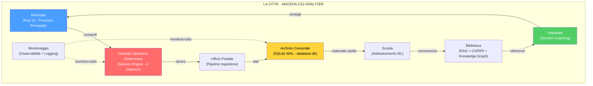

---

### 12.1 Punto di Ingresso e Sequenza di Avvio (`main.py`)

**File:** `Programma_CS2_RENAN/main.py`

Quando l'utente lancia l'applicazione, `main.py` orchestra una **sequenza di avvio a 9 fasi** rigorosamente ordinata. Ogni fase deve completarsi con successo prima che la successiva possa iniziare. Se una fase critica fallisce, l'applicazione termina con un messaggio esplicito — mai silenziosamente.

> **Analogia:** L'avvio del programma è come la **checklist di pre-volo di un aereo**. Prima che l'aereo possa decollare, il pilota (main.py) deve completare una serie di controlli in ordine: verificare l'integrità della fusoliera (audit RASP), impostare gli strumenti (configurazione percorsi), controllare il carburante (migrazione database), accendere i motori (inizializzazione Kivy), caricare i passeggeri (registrazione schermate), attivare il pilota automatico (lancio daemon) e infine decollare (mostrare l'interfaccia). Se un controllo fallisce — ad esempio il carburante è insufficiente (database corrotto) — il volo viene cancellato, non si prova a decollare sperando che vada bene.

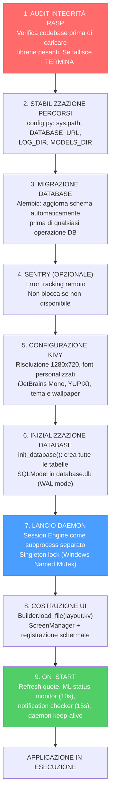

**Dettagli delle fasi critiche:**

| Fase | Componente | Cosa fa | Conseguenza del fallimento |
| ---- | ---------- | ------- | -------------------------- |
| 1 | `integrity.py` (RASP) | Verifica hash dei file sorgente contro il manifesto | Terminazione immediata — possibile manomissione |
| 2 | `config.py` | Stabilizza `sys.path`, definisce tutte le costanti di percorso | Errori di importazione in cascata |
| 3 | `db_migrate.py` | Esegue migrazioni Alembic pendenti | Schema incompatibile — crash su operazioni DB |
| 5 | Kivy `Config` | Imposta `KIVY_NO_CONSOLELOG`, registra font, carica `.kv` | UI non renderizzabile |
| 6 | `database.py` | `create_all()` su engine SQLite con `check_same_thread=False` | Nessuna persistenza possibile |
| 7 | `lifecycle.py` | Lancia subprocess con PYTHONPATH corretto, verifica mutex | Nessuna automazione in background |

> **Analogia:** Le conseguenze del fallimento sono disposte come **tessere del domino**: se la fase 2 (percorsi) fallisce, le fasi 3-9 cadranno tutte perché nessuna sa dove trovare il database, i modelli o i log. Se la fase 6 (database) fallisce, le fasi 7-9 funzioneranno apparentemente ma non potranno salvare né recuperare nulla — come un ristorante che ha aperto i battenti ma si è dimenticato di accendere i fornelli.

---

### 12.2 Gestione del Ciclo di Vita (`lifecycle.py`)

**File:** `Programma_CS2_RENAN/core/lifecycle.py`

L'`AppLifecycleManager` è un **Singleton** che gestisce il ciclo di vita dell'intera applicazione: dalla garanzia che esista una sola istanza attiva, al lancio del subprocess daemon, fino allo shutdown coordinato.

> **Analogia:** Il Lifecycle Manager è come il **direttore di un teatro**. Prima dello spettacolo, verifica che non ci siano altri spettacoli in corso nella stessa sala (Single Instance Lock). Poi assume il regista (Session Engine daemon) che lavorerà dietro le quinte. Durante lo spettacolo, il direttore è sempre presente in caso di emergenza. Alla fine, il direttore si assicura che tutti lascino il teatro in ordine: prima il regista termina il suo lavoro, poi le luci si spengono, poi le porte si chiudono.

**Meccanismi principali:**

| Meccanismo | Implementazione | Scopo |
| ---------- | --------------- | ----- |
| **Single Instance Lock** | Windows Named Mutex / file lock su Linux | Impedisce istanze multiple (corruzione DB) |
| **Lancio Daemon** | `subprocess.Popen(session_engine.py)` con PYTHONPATH | Processo separato per lavoro pesante |
| **Rilevamento Morte Genitore** | Il daemon monitora EOF su `stdin` | Se il processo principale muore, il daemon si arresta |
| **Shutdown Graceful** | Invio "STOP" via stdin → daemon termina entro 5s | Nessuna perdita di dati o task zombie |

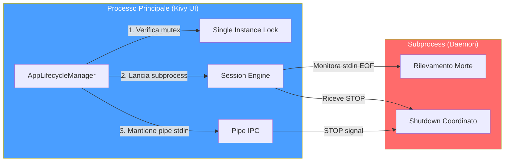

> **Analogia:** La pipe `stdin` è come un **filo telefonico** tra il direttore e il regista. Finché il filo è collegato, il regista sa che il direttore è ancora presente. Se il filo si spezza improvvisamente (EOF — il processo principale crasha), il regista capisce che lo spettacolo è finito e chiude tutto in modo ordinato. Se il direttore vuole terminare normalmente, invia il messaggio "STOP" attraverso il filo e aspetta che il regista confermi di aver terminato.

---

### 12.3 Sistema di Configurazione (`config.py`)

**File:** `Programma_CS2_RENAN/core/config.py`

Il sistema utilizza **tre livelli di configurazione**, ciascuno con un diverso livello di persistenza e sicurezza:

> **Analogia:** I tre livelli di configurazione sono come i **tre strati di un'armatura medievale**. Lo strato interno (hardcoded) è l'armatura di base che non cambia mai — le fondamenta del sistema. Lo strato intermedio (JSON) è la cotta di maglia personalizzabile — l'utente può regolarla come preferisce. Lo strato esterno (Keyring) è il casco con la visiera — protegge i segreti più preziosi (chiavi API) in una cassaforte del sistema operativo, inaccessibile a occhi indiscreti.

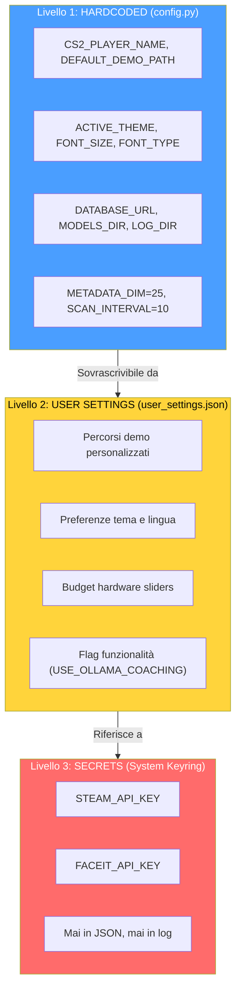

**Architettura dei percorsi:**

Il sistema gestisce percorsi con un'attenzione particolare alla **portabilità Windows/Linux**. Il cuore è `BRAIN_DATA_ROOT`: una directory configurabile dall'utente che contiene modelli, log e dati derivati. Se non esiste, il sistema ricade sulla cartella del progetto.

| Percorso | Contenuto | Configurabile |
| -------- | --------- | ------------- |
| `DATABASE_URL` | Database monolite principale (`database.db`) | No — sempre nella cartella del progetto |
| `BRAIN_DATA_ROOT` | Radice per dati derivati (modelli, log) | Sì — via `user_settings.json` |
| `MODELS_DIR` | Checkpoint dei modelli `.pt` | Derivato da `BRAIN_DATA_ROOT` |
| `LOG_DIR` | File di log dell'applicazione | Derivato da `BRAIN_DATA_ROOT` |
| `MATCH_DATA_PATH` | Database per-match (`match_XXXX.db`) | Derivato da `BRAIN_DATA_ROOT` |
| `DEFAULT_DEMO_PATH` | Cartella demo dell'utente | Sì — via UI Settings |
| `PRO_DEMO_PATH` | Cartella demo professionali | Sì — via UI Settings |

> **Analogia:** `BRAIN_DATA_ROOT` è come l'**indirizzo di casa del cervello** dell'allenatore. Puoi spostarlo su un disco più grande (SSD esterno) semplicemente cambiando l'indirizzo, e tutto il resto — modelli, log, dati delle partite — seguirà automaticamente. Il database principale (`database.db`), invece, è come il **registro comunale**: rimane sempre nello stesso posto per ragioni di integrità.

---

### 12.4 Motore di Sessione — Architettura Quad-Daemon (`session_engine.py`)

**File:** `Programma_CS2_RENAN/core/session_engine.py`

Il Session Engine è il **cuore pulsante** dell'automazione del sistema. Vive come subprocess separato e ospita **4 daemon thread** che lavorano in parallelo, ciascuno con una responsabilità ben definita. Questo design separa completamente il lavoro pesante (parsing demo, addestramento ML) dall'interfaccia utente, garantendo che la GUI Kivy rimanga sempre reattiva.

> **Analogia:** Il Session Engine è come una **centrale nucleare sotterranea** che alimenta l'intera città. Ha 4 reattori (daemon), ciascuno che produce un diverso tipo di energia. Il Reattore 1 (Hunter) è lo **scanner radar**: scansiona costantemente l'orizzonte cercando nuove demo da processare. Il Reattore 2 (Digester) è la **raffineria**: prende le demo grezze e le trasforma in dati strutturati. Il Reattore 3 (Teacher) è il **laboratorio di ricerca**: usa i dati raffinati per addestrare il cervello dell'allenatore. Il Reattore 4 (Pulse) è il **sistema di monitoraggio cardiaco**: emette un battito ogni 5 secondi per confermare che la centrale è viva. Se la città in superficie (GUI Kivy) viene distrutta da un terremoto (crash), la centrale rileva la perdita di comunicazione e si spegne in modo sicuro.

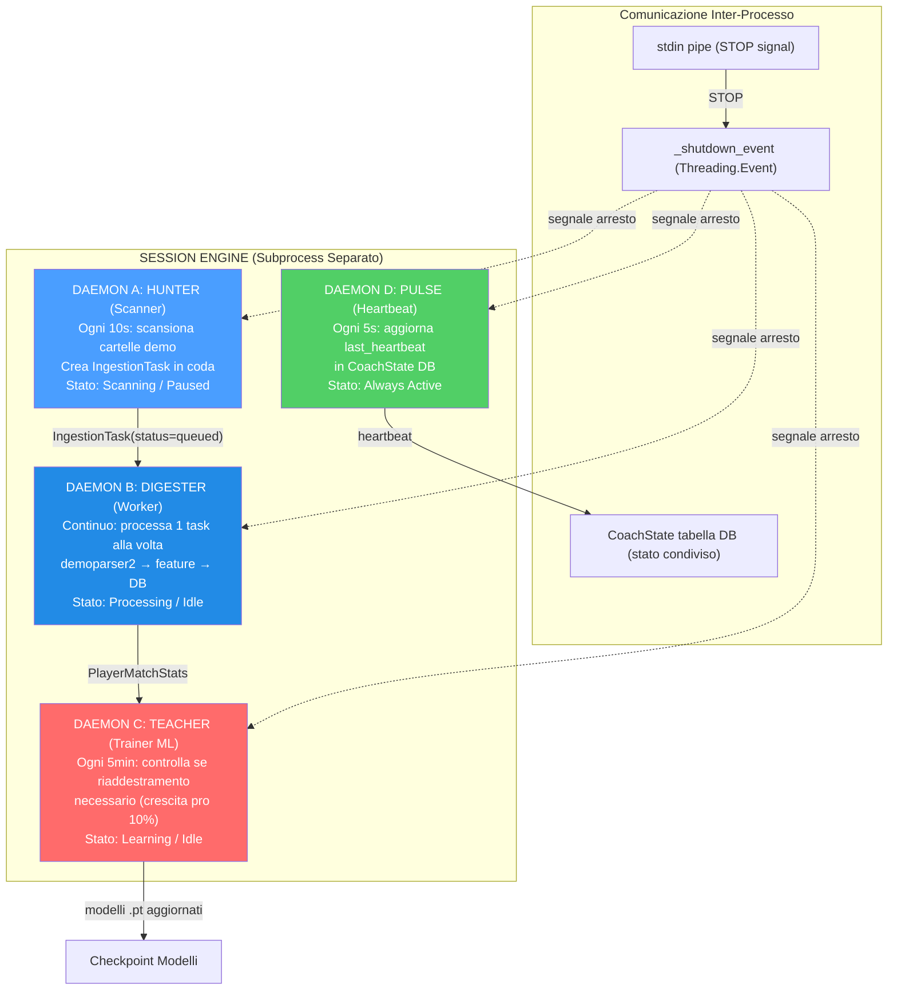

**Ciclo di vita di ogni daemon:**

| Daemon | Intervallo | Lavoro per ciclo | Trigger |
| ------ | ---------- | ---------------- | ------- |
| **Hunter** | 10 secondi | Scansiona cartelle pro e utente, crea `IngestionTask` per nuovi `.dem` | Sempre attivo (se stato = Scanning) |
| **Digester** | Continuo | Preleva 1 task dalla coda, esegue parsing completo | `_work_available_event` (segnalato da Hunter) |
| **Teacher** | 300 secondi (5 min) | Controlla crescita sample pro; se ≥10% → `run_full_cycle()` | `pro_count >= last_count × 1.10` |
| **Pulse** | 5 secondi | Aggiorna `CoachState.last_heartbeat` nel database | Sempre attivo |

> **Analogia del Digester:** Il Digester è come un **lavapiatti instancabile**: prende un piatto sporco (demo grezza) dalla pila, lo lava accuratamente (parsing con demoparser2, estrazione feature, calcolo rating HLTV 2.0, arricchimento RoundStats), lo asciuga (normalizzazione), lo ripone nello scaffale giusto (salva in database) e poi prende il piatto successivo. Non prende mai 2 piatti alla volta — uno alla volta, per evitare errori. Se la pila è vuota, aspetta pazientemente (sleep 2s + `_work_available_event`) finché qualcuno non porta nuovi piatti sporchi.

> **Analogia del Teacher:** Il Teacher è come un **professore universitario che aggiorna i suoi corsi**. Ogni 5 minuti controlla: "Sono arrivati abbastanza nuovi articoli scientifici (demo pro)?" Se il numero è cresciuto del 10% dall'ultimo aggiornamento, dice: "È ora di riscrivere le dispense!" e lancia un ciclo completo di addestramento. Dopo l'addestramento, esegue anche un controllo meta-shift: "La media dei professionisti è cambiata? Il meta del gioco si è spostato?" — garantendo che il coaching rimanga sempre attuale.

**Sequenza di shutdown:**

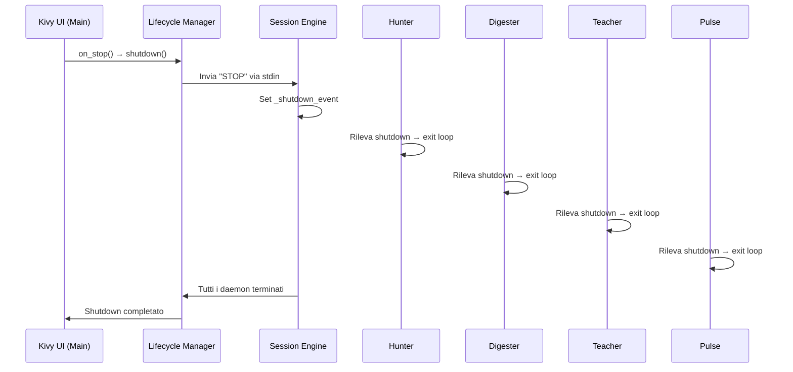

**Zombie Task Cleanup:** All'avvio, il Session Engine cerca task con `status="processing"` rimasti da un crash precedente e li resetta a `status="queued"`, consentendo il ripristino automatico senza perdita di dati.

**Backup Automatico:** All'avvio del Session Engine, `BackupManager.should_run_auto_backup()` verifica se è necessario un backup e, in caso affermativo, crea un checkpoint con etichetta `"startup_auto"`. Il backup segue una rotazione di 7 copie giornaliere + 4 settimanali.

---

### 12.5 Interfaccia Desktop (`apps/desktop_app/`)

**Directory:** `Programma_CS2_RENAN/apps/desktop_app/`
**File chiave:** `layout.kv`, `wizard_screen.py`, `player_sidebar.py`, `tactical_viewer_screen.py`, `tactical_viewmodels.py`, `tactical_map.py`, `timeline.py`, `widgets.py`, `help_screen.py`, `ghost_pixel.py`

L'interfaccia desktop è costruita con **Kivy + KivyMD** e segue il pattern **MVVM** (Model-View-ViewModel). Lo `ScreenManager` gestisce la navigazione tra le schermate con transizioni `FadeTransition`.

> **Analogia:** L'interfaccia desktop è come un **cruscotto di un'auto sportiva**. Il cruscotto (ScreenManager) ha diverse modalità di visualizzazione che puoi selezionare: la vista "Viaggio" (Home — dashboard generale), la vista "Navigazione" (Tactical Viewer — mappa 2D), la vista "Diagnostica" (Coach — analisi dettagliata), la vista "Impostazioni" (Settings — personalizzazione). Ogni vista ha i suoi indicatori specializzati. Il pattern MVVM garantisce che il "motore" (ViewModel) e il "display" (View) siano separati: se cambi il design del cruscotto, il motore continua a funzionare identicamente, e viceversa.

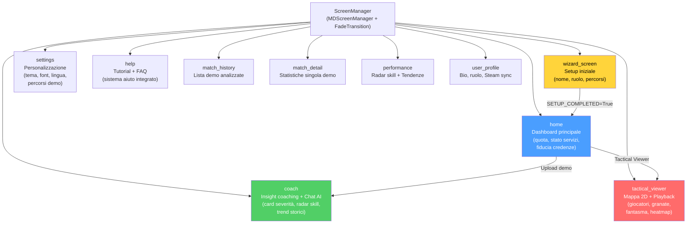

**Schermate principali:**

| Schermata | Ruolo | Componenti chiave |
| --------- | ----- | ----------------- |
| **Wizard** | Prima configurazione | Nome giocatore, ruolo, percorsi cartelle demo |
| **Home** | Dashboard | Quota mensile (X/10), stato servizi (verde/rosso), fiducia credenze (0-1), task attivi, contatore partite processate |
| **Coach** | Insight coaching | Card colorate per severità, radar skill multi-dimensionale, trend storici, chat AI (Ollama/Claude), task attivi |
| **Tactical Viewer** | Riproduzione tattica | Mappa 2D con giocatori/granate/fantasma, timeline con marcatori eventi, sidebar giocatori CT/T, controlli velocità (0.25x→8x) |
| **Settings** | Personalizzazione | Tema (CS2/CSGO/CS1.6), font, dimensione testo, lingua, percorsi demo, wallpaper |
| **Help** | Supporto utente | Tutorial interattivo, FAQ, troubleshooting |

> **Analogia della Home Screen:** La Home è come la **plancia di comando di una nave spaziale**. L'indicatore di quota ("5/10 demo questo mese") è il **misuratore di carburante**. Lo stato del servizio (verde/rosso) è il **pannello dei sistemi vitali**: verde = tutti i sistemi operativi, rosso = allarme. La fiducia delle credenze (0.0-1.0) è il **livello di stabilità dell'IA**: 0.0 = l'IA non sa nulla, 1.0 = l'IA è sicura delle sue analisi. Il contatore delle partite processate è l'**odometro**: quanta strada ha percorso il sistema.

**Pattern MVVM nel Tactical Viewer:**

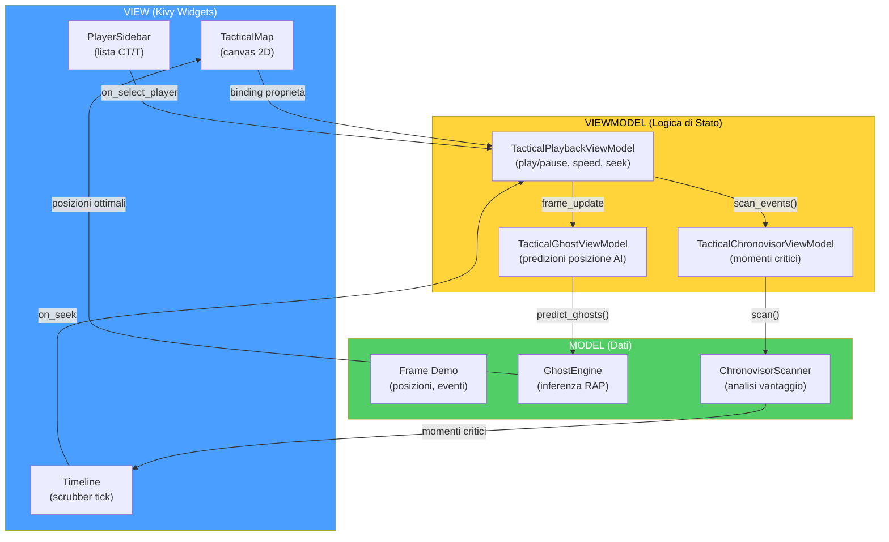

> **Analogia MVVM:** Il pattern MVVM è come un **giornale televisivo**: il **Modello** è il giornalista sul campo che raccoglie i fatti (dati demo, inferenza AI). Il **ViewModel** è il redattore che organizza le notizie e decide cosa è importante (stato di riproduzione, velocità, selezione). La **View** è il presentatore che legge le notizie al pubblico (rendering su schermo Kivy). Il giornalista non sa come viene presentata la notizia. Il presentatore non sa come è stata raccolta. Il redattore è il ponte tra i due. Se cambi il presentatore (nuovo design UI), la notizia rimane la stessa.

---

### 12.6 Pipeline di Ingestione (`ingestion/`)

**Directory:** `Programma_CS2_RENAN/ingestion/`
**File chiave:** `demo_loader.py`, `steam_locator.py`, `integrity.py`, `registry/`, `pipelines/user_ingest.py`, `pipelines/pro_ingest.py`

La pipeline di ingestione è il **percorso completo** che un file `.dem` compie dal filesystem fino a diventare insight di coaching nel database. È orchestrata dal daemon Hunter (scoperta) e dal daemon Digester (elaborazione).

> **Analogia:** La pipeline di ingestione è come il **percorso di una lettera attraverso l'ufficio postale**. (1) Il postino (Hunter) raccoglie la lettera (file .dem) dalla cassetta postale (cartella demo). (2) L'ufficio smistamento (DemoLoader) apre la busta e ne estrae il contenuto (parsing con demoparser2). (3) L'archivista (FeatureExtractor) misura e cataloga ogni dettaglio (25 feature per tick). (4) Lo storico (RoundStatsBuilder) scrive un riassunto per capitolo (statistiche per round). (5) Il bibliotecario (data_pipeline) classifica e ordina il materiale (normalizzazione, split dataset). (6) Il medico (CoachingService) esamina tutto e scrive una diagnosi (insight di coaching). (7) Infine, tutto viene archiviato (persistenza in database) per consultazione futura.

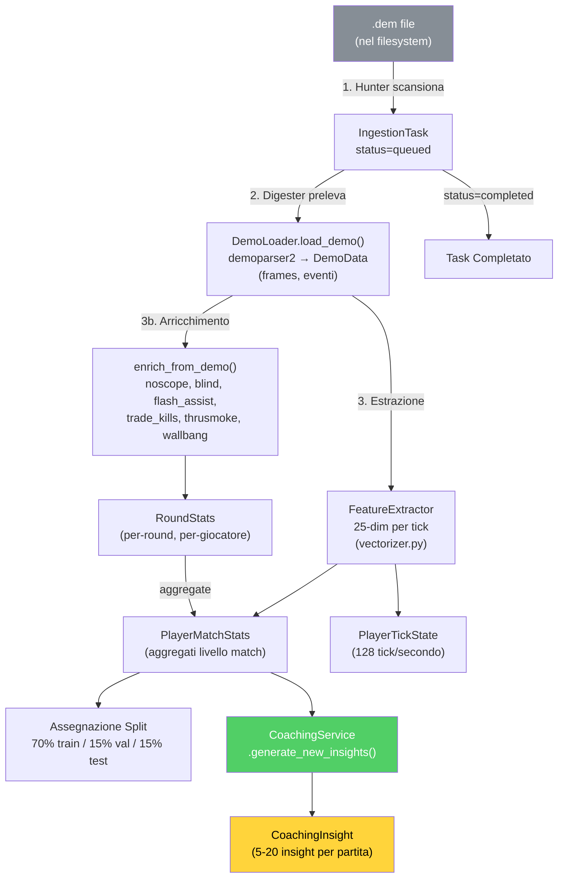

**Componenti specifici:**

| Componente | File | Ruolo |
| ---------- | ---- | ----- |
| **DemoLoader** | `demo_loader.py` | Wrappa `demoparser2`, estrae frame e eventi dal file `.dem` |
| **SteamLocator** | `steam_locator.py` | Localizza automaticamente la cartella demo di CS2 via registro Steam / libraryfolders.vdf |
| **IntegrityChecker** | `integrity.py` | Verifica che i file demo siano validi, completi e non corrotti prima del parsing |
| **UserIngestPipeline** | `pipelines/user_ingest.py` | Pipeline completa per demo utente: parse → enrich → stats → coaching |
| **ProIngestPipeline** | `pipelines/pro_ingest.py` | Pipeline per demo professionali: parse → enrich → stats (senza coaching) |
| **Registry** | `registry/registry.py` | Traccia tutte le demo processate, previene duplicati |

> **Analogia dello SteamLocator:** Lo SteamLocator è come un **segugio che fiuta la cartella di CS2** nel tuo computer. Sa che Steam memorizza le sue librerie in posti specifici (registro Windows, `libraryfolders.vdf` su Linux/Mac), e segue le tracce fino alla cartella `csgo/replays` dove vengono salvate le demo. Se non riesce a trovarla automaticamente, chiede all'utente di indicare il percorso manualmente — ma nella maggior parte dei casi, la trova da solo.

---

### 12.7 Console di Controllo Unificata (`backend/control/`)

**File:** `Programma_CS2_RENAN/backend/control/console.py`, `ingest_manager.py`, `db_governor.py`, `ml_controller.py`

La Console è un **Singleton** che funge da punto di coordinamento centrale per tutti i sottosistemi backend. È il "quadro di comando" attraverso cui ogni parte del sistema può essere controllata.

> **Analogia:** La Console è come la **torre di controllo di un aeroporto**. Ha 4 schermi: uno per il radar (ServiceSupervisor — monitora i servizi in esecuzione), uno per le piste (IngestionManager — coordina l'arrivo delle demo), uno per la manutenzione (DatabaseGovernor — verifica l'integrità dello storage) e uno per l'addestramento dei piloti (MLController — gestisce il ciclo di vita dell'apprendimento automatico). Il controllore del traffico aereo (Console Singleton) coordina tutto da un'unica postazione.

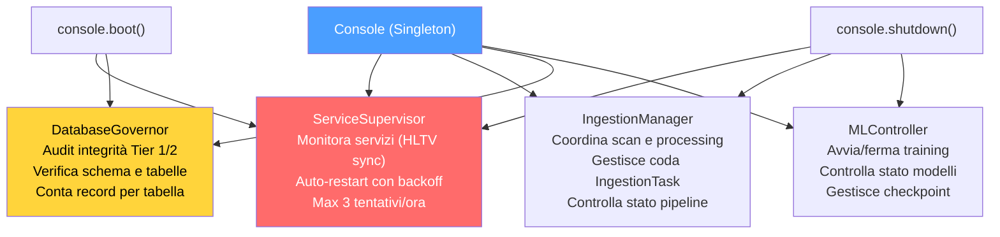

**Sequenza di boot della Console:**

1. `ServiceSupervisor` avvia il servizio "hunter" (HLTV sync) come processo monitorato
2. `DatabaseGovernor` esegue un audit di integrità: verifica tutte le tabelle, conta record, controlla schema
3. `MLController` resta in stato di attesa — il training è gestito dal daemon Teacher
4. `IngestionManager` resta idle — il lavoro attivo è gestito dai daemon Hunter/Digester

---

### 12.8 Onboarding e Flusso Nuovo Utente

**File:** `Programma_CS2_RENAN/backend/onboarding/new_user_flow.py`

L'`OnboardingManager` guida i nuovi utenti attraverso una **progressione a 3 fasi** che si adatta automaticamente alla quantità di dati disponibili.

> **Analogia:** L'onboarding è come il **tutorial di un videogioco RPG**. Quando inizi una nuova partita (nessuna demo caricata), il gioco ti guida passo passo: "Benvenuto, avventuriero! Carica la tua prima demo per iniziare." Dopo 1-2 demo, il sistema dice: "Buon inizio! Caricane altre N per sbloccare l'analisi stabile." Dopo 3+ demo, il sistema annuncia: "Il tuo coach è pronto! Le analisi personalizzate sono ora attive." Ogni fase sblocca gradualmente le funzionalità del programma, impedendo al sistema di mostrare risultati inaffidabili quando non ha abbastanza dati.

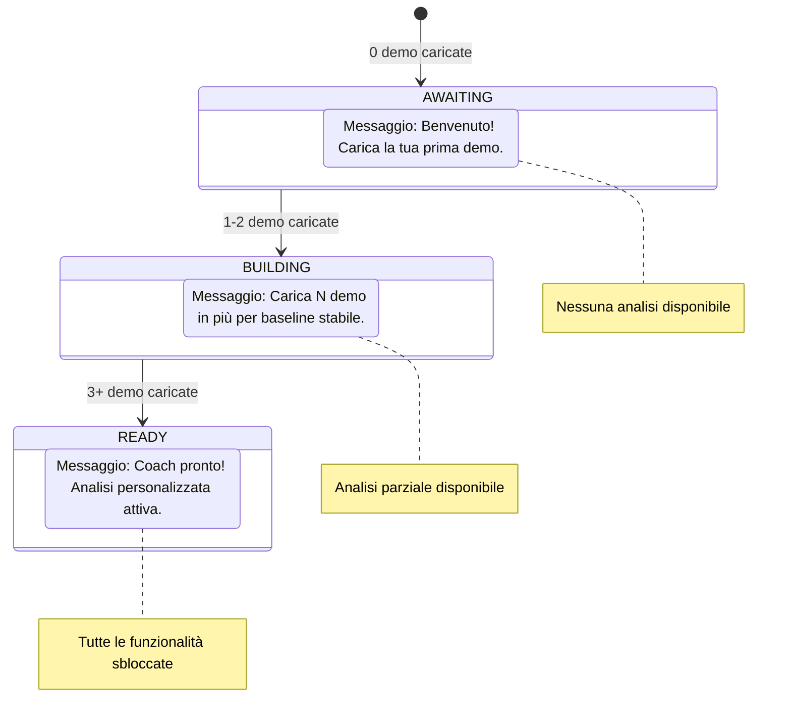

**Wizard Screen (Prima Configurazione):**

Alla prima esecuzione (`SETUP_COMPLETED = False`), l'utente viene guidato attraverso il Wizard:

1. **Nome giocatore** — Il nome che apparirà nelle analisi
2. **Ruolo preferito** — Entry Fragger, AWPer, Lurker, Support o IGL
3. **Percorsi cartelle demo** — Dove il sistema cerca automaticamente le demo
4. Al completamento: `SETUP_COMPLETED = True`, redirect alla Home

**Cache delle quote (Task 2.16.1):** Il conteggio demo è cachato per 60 secondi per evitare query DB ripetute. `invalidate_cache()` viene chiamato dopo ogni nuovo upload, garantendo che la UI mostri sempre il conteggio corretto senza sovraccaricare il database.

---

### 12.9 Architettura di Storage (`backend/storage/`)

**Directory:** `Programma_CS2_RENAN/backend/storage/`
**File chiave:** `database.py`, `db_models.py`, `match_data_manager.py`, `storage_manager.py`, `maintenance.py`, `state_manager.py`, `stat_aggregator.py`, `backup.py`

Il sistema di storage utilizza un'architettura a **tier multipli** basata su SQLite in modalità WAL (Write-Ahead Logging), che consente letture e scritture concorrenti senza blocchi.

> **Analogia:** L'architettura di storage è come un **sistema bibliotecario a 3 piani**. Il **piano terra** (Tier 1/2, `database.db`) contiene il catalogo generale, le schede di tutti i lettori (giocatori), le recensioni dei critici (insight di coaching) e il registro dei prestiti (task di ingestione) — tutto in un unico grande schedario sempre disponibile. Il **primo piano** (Tier 3, `match_XXXX.db`) contiene i manoscritti originali completi (dati tick-per-tick delle partite) — ciascuno in una scatola separata per evitare che lo schedario del piano terra diventi troppo pesante. Il **seminterrato** (Tier 4, archivio opzionale) contiene le scatole vecchie che non servono spesso ma non vuoi buttare via. La modalità WAL è come avere una **porta girevole**: molte persone possono entrare a leggere contemporaneamente, e qualcuno può scrivere senza bloccare l'ingresso.

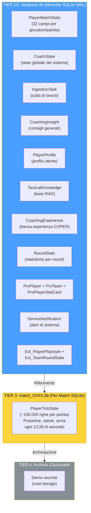

**Le 20 tabelle SQLModel:**

| # | Tabella | Categoria | Descrizione |
| - | ------- | --------- | ----------- |
| 1 | `PlayerMatchStats` | Core | Statistiche aggregate per giocatore/partita (32 campi) |
| 2 | `PlayerTickState` | Core | Stato per-tick (128 Hz), archiviato in DB separati |
| 3 | `PlayerProfile` | Utente | Profilo utente (nome, ruolo, Steam ID, quota mensile) |
| 4 | `RoundStats` | Core | Statistiche isolate per round (uccisioni, valutazione, arricchimento) |
| 5 | `CoachingInsight` | Coaching | Consigli generati dal servizio di coaching |
| 6 | `CoachingExperience` | Coaching | Banca esperienze COPER (contesto, esito, efficacia) |
| 7 | `IngestionTask` | Sistema | Coda di lavoro per il daemon Digester |
| 8 | `CoachState` | Sistema | Stato globale (training metrics, heartbeat, status) |
| 9 | `ServiceNotification` | Sistema | Messaggi di errore/evento dei daemon → UI |
| 10 | `TacticalKnowledge` | Conoscenza | Base RAG (embedding 384-dim in JSON) |
| 11 | `ProPlayer` | Pro | Profili giocatori professionisti |
| 12 | `ProTeam` | Pro | Metadata squadre professionali |
| 13 | `ProPlayerStatCard` | Pro | Statistiche stagionali per giocatore pro |
| 14 | `HLTVDownload` | Pro | Tracking demo pro scaricate |
| 15 | `Ext_PlayerPlaystyle` | Esterno | Dati stile di gioco da CSV (per NeuralRoleHead) |
| 16 | `Ext_TeamRoundStats` | Esterno | Statistiche torneo esterne |
| 17 | `MatchResult` | Partite | Esiti delle partite |
| 18 | `MapVeto` | Partite | Storico selezione mappe |
| 19 | `DatasetSplit` | Enum | Categorie split (train/val/test) |
| 20 | `CoachStatus` | Enum | Stati del coach (Paused/Training/Idle/Error) |

**Connection Pooling e Concorrenza:**

| Parametro | Valore | Scopo |
| --------- | ------ | ----- |
| `check_same_thread` | `False` | Consente accesso multi-thread |
| `timeout` | 30 secondi | Busy timeout per contesa WAL |
| `pool_size` | 20 | Connessioni persistenti |
| WAL mode | Abilitato | Letture concorrenti illimitate |

---

### 12.10 Motore di Playback e Viewer Tattico

**File:** `Programma_CS2_RENAN/core/playback.py`, `playback_engine.py`, `apps/desktop_app/tactical_viewer_screen.py`, `tactical_map.py`, `timeline.py`, `player_sidebar.py`

Il sistema di playback tattico consente all'utente di **rivivere le proprie partite** su una mappa 2D interattiva, con overlay AI (posizione fantasma ottimale), marcatori eventi (uccisioni, piazzamenti bomba) e controlli di riproduzione completi.

> **Analogia:** Il Tactical Viewer è come un **sistema di replay sportivo di livello professionistico**. Immagina di poter guardare le tue partite di calcio dalla prospettiva di un drone aereo, con la possibilità di rallentare, accelerare, mettere in pausa, e con un assistente AI che ti mostra "dove avresti dovuto trovarti" come un'ombra trasparente sul campo. Inoltre, una timeline intelligente evidenzia automaticamente i momenti chiave: "Minuto 23:15 — hai perso il vantaggio qui" (marcatore rosso) o "Minuto 34:02 — giocata eccellente!" (marcatore verde). Puoi cliccare su qualsiasi marcatore e il replay salta direttamente a quel momento.

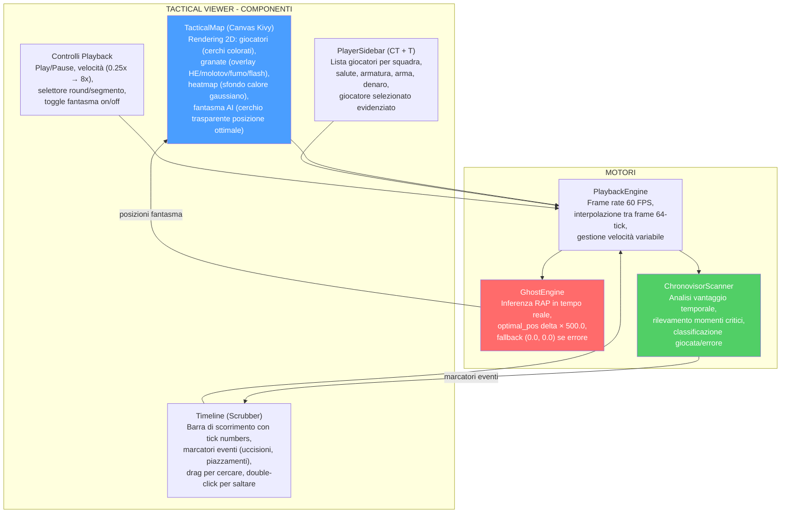

**Flusso di caricamento del viewer (One-Click):**

1. L'utente clicca "Tactical Viewer" dalla Home
2. Se nessuna demo è caricata → `trigger_viewer_picker()` apre il file picker automaticamente
3. L'utente seleziona un file `.dem`
4. Appare un dialogo "Ricostruzione Dinamica 2D in Corso..."
5. Un thread in background esegue `_execute_viewer_parse(path)` → `DemoLoader.load_demo()`
6. Al completamento: dismissione dialogo, caricamento frame in PlaybackEngine
7. La mappa viene renderizzata con i giocatori al frame 0

---

### 12.11 Dati Spaziali e Gestione Mappe

**File:** `Programma_CS2_RENAN/core/spatial_data.py`, `spatial_engine.py`, `data/map_config.json`

Il sistema di gestione mappe traduce le **coordinate mondo di CS2** (valori tipici: -2000 a +2000 su X/Y) in **coordinate pixel** sulla texture della mappa (0.0 a 1.0 normalizzato), e viceversa.

> **Analogia:** La gestione mappe è come un **sistema GPS per il mondo di CS2**. Ogni mappa ha la sua "proiezione cartografica": un punto di origine (angolo in alto a sinistra), una scala (quante unità di gioco per pixel) e, per mappe multilivello come Nuke, un **separatore di piani** (z_cutoff = -495 per Nuke). Il GPS sa che se la tua coordinata Z è sopra -495, sei al piano superiore, altrimenti al piano inferiore. Questa informazione è cruciale per il GhostEngine e per il rendering corretto sulla mappa tattica.

```mermaid
flowchart LR
    WORLD["Coordinate Mondo CS2<br/>(pos_x=-1200, pos_y=800, pos_z=100)"]
    WORLD -->|"MapMetadata.world_to_radar()"| NORM["Coordinate Normalizzate<br/>(0.35, 0.62)"]
    NORM -->|"× dimensione texture"| PIXEL["Coordinate Pixel<br/>(224px, 397px)"]
    PIXEL -->|"rendering su canvas"| MAP["Punto sulla Mappa 2D"]

    MAP -->|"click utente"| PIXEL2["Pixel Cliccato"]
    PIXEL2 -->|"MapMetadata.radar_to_world()"| WORLD2["Coordinate Mondo<br/>(per query AI)"]

    style WORLD fill:#ff6b6b,color:#fff
    style NORM fill:#ffd43b,color:#000
    style MAP fill:#51cf66,color:#fff
```

**MapMetadata** (dataclass immutabile per ogni mappa):

| Campo | Esempio (Dust2) | Scopo |
| ----- | ---------------- | ----- |
| `pos_x` | -2476 | X dell'angolo in alto a sinistra in unità mondo |
| `pos_y` | 3239 | Y dell'angolo in alto a sinistra in unità mondo |
| `scale` | 4.4 | Unità di gioco per pixel della texture |
| `z_cutoff` | `None` | Separatore di livello (solo mappe multilivello) |
| `level` | `"single"` | Tipo: "single", "upper", "lower" |

**Mappe multilivello supportate:**

| Mappa | z_cutoff | Livelli | Note |
| ----- | -------- | ------- | ---- |
| **Nuke** | -495 | upper / lower | Due plant site su piani diversi |
| **Vertigo** | 11700 | upper / lower | Grattacielo con due aree giocabili |
| Tutte le altre | `None` | single | Mappe a livello singolo |

---

### 12.12 Osservabilità e Logging

**File:** `Programma_CS2_RENAN/observability/logger_setup.py`
**File correlati:** `backend/storage/state_manager.py`, `backend/services/telemetry_client.py`

Il sistema di osservabilità garantisce che ogni evento significativo sia **tracciabile, strutturato e persistente**.

> **Analogia:** L'osservabilità è come il **sistema di telecamere di sicurezza e registri di un edificio**. Il logging strutturato (`get_logger()`) è la telecamera che registra tutto con timestamp e etichette ("chi ha fatto cosa, dove e quando"). Lo StateManager è la **lavagna nella hall** che mostra lo stato attuale di ogni piano (daemon): "Piano 1 (Hunter): Scanning. Piano 2 (Digester): Idle. Piano 3 (Teacher): Learning." Le ServiceNotification sono gli **annunci interfono** che informano i residenti (l'utente) di eventi importanti o errori.

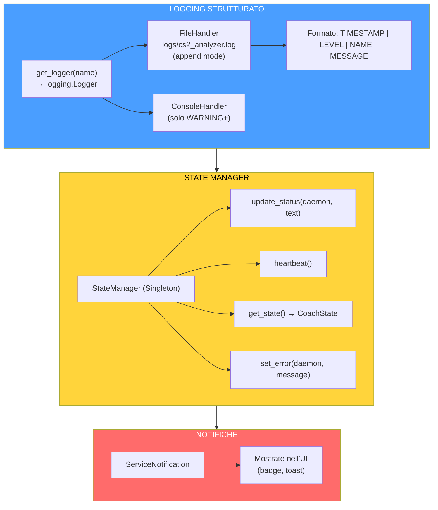

**Daemon monitorati dallo StateManager:**

| Daemon | Campo in CoachState | Valori tipici |
| ------ | ------------------- | ------------- |
| Hunter (scanner) | `ingest_status` | "Scanning", "Paused", "Error" |
| Digester (worker) | `hltv_status` | "Processing", "Idle", "Error" |
| Teacher (trainer) | `ml_status` | "Learning", "Idle", "Error" |
| Globale | `status` | "Paused", "Training", "Idle", "Error" |

**Metriche di training esposte in CoachState:** `current_epoch`, `total_epochs`, `train_loss`, `val_loss`, `eta_seconds`, `belief_confidence`, `system_load_cpu`, `system_load_mem`.

> **Analogia:** Le metriche di training sono come il **pannello strumenti di un'auto durante una corsa**: l'epoca corrente è il **contachilometri** (a che punto sei), la train_loss è il **consumo di carburante** (più basso = più efficiente), la val_loss è il **cronometro del giro** (il tuo tempo sulla pista di test), e l'ETA è il **GPS** che stima quanto manca alla destinazione. L'utente può vedere tutto questo in tempo reale sulla Home screen, aggiornato ogni 10 secondi.

---

### 12.13 Reporting e Visualizzazione

**File:** `Programma_CS2_RENAN/reporting/visualizer.py`, `report_generator.py`
**File correlati:** `backend/processing/heatmap_engine.py`

Il sistema di reporting trasforma i dati grezzi in **visualizzazioni comprensibili** per l'utente.

> **Analogia:** Il sistema di reporting è come un **grafico designer** che prende numeri aridi e li trasforma in poster colorati e infografiche. Il **Visualizer** crea grafici radar (pentagoni che mostrano le tue 5 abilità rispetto ai pro), grafici di tendenza (come stai migliorando nel tempo) e tabelle di confronto. L'**HeatmapEngine** crea mappe di calore (dove stai troppo vs. dove dovresti stare). Il **ReportGenerator** assembla tutto in un documento PDF completo, come un referto medico che il "paziente" (giocatore) può studiare con calma.

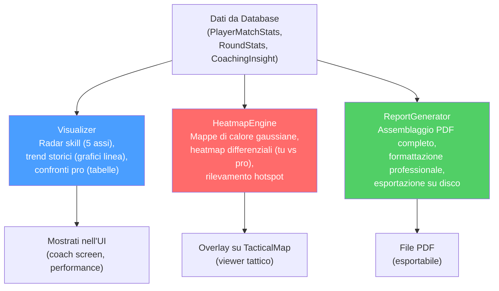

**HeatmapEngine — Dettagli tecnici:**

| Caratteristica | Dettaglio |
| -------------- | --------- |
| **Thread-safety** | `generate_heatmap_data()` gira in thread separato (non blocca UI) |
| **Texture creation** | Solo nel thread principale (requisito OpenGL Kivy) |
| **Tipo** | Occupazione gaussiana 2D (blur kernel parametrico) |
| **Differenziale** | Sottrae heatmap pro da heatmap utente → rosso (troppo tempo), blu (troppo poco) |
| **Hotspot** | Identifica cluster di posizione per training posizionale |

---

### 12.14 Gestione Quote e Limiti

Il sistema implementa un meccanismo di **quota mensile** per prevenire l'abuso delle risorse di elaborazione e garantire una distribuzione equa del carico.

> **Analogia:** Il sistema di quote è come un **abbonamento in palestra con sessioni limitate**. Ogni mese hai 10 sessioni (demo) disponibili. Ogni volta che carichi una demo, il contatore diminuisce. All'inizio del mese successivo, il contatore si resetta. Inoltre, c'è un limite totale a vita di 100 demo: come un diario che ha solo 100 pagine. Queste limitazioni garantiscono che il sistema non venga sovraccaricato da utenti che caricano centinaia di demo alla volta, e che il database non cresca in modo incontrollato.

| Limite | Valore | Enforcement |
| ------ | ------ | ----------- |
| **MAX_DEMOS_PER_MONTH** | 10 | `StorageManager.can_user_upload()` |
| **MAX_TOTAL_DEMOS** | 100 | `StorageManager.can_user_upload()` |
| **MIN_DEMOS_FOR_COACHING** | 10 | Soglia per coaching personalizzato completo |
| **Reset mensile** | Automatico | `PlayerProfile.last_upload_month` vs. mese corrente |

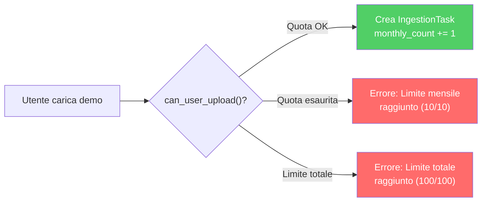

---

### 12.15 Tolleranza ai Guasti e Recupero

Il sistema è progettato per **non perdere mai dati** e **riprendersi automaticamente** da quasi tutti i tipi di fallimento.

> **Analogia:** La tolleranza ai guasti è come un **sistema di sicurezza in una centrale nucleare**: ci sono multipli livelli di protezione, ciascuno indipendente dagli altri. Se un livello fallisce, il successivo si attiva. (1) Il **Zombie Task Cleanup** è come il turno di notte che ripulisce gli strumenti dimenticati: se il turno precedente (sessione precedente) ha lasciato task in stato "processing" a causa di un crash, il turno successivo li resetta e li ricomincia. (2) Il **Backup Automatico** è come la cassaforte ignifuga: anche se l'intero edificio brucia, i documenti nella cassaforte sopravvivono. (3) Il **Service Supervisor** è come il guardiano che riavvia i generatori di emergenza se si spengono. (4) Il **Connection Pooling** è come avere riserve di chiavi: se una serratura si blocca, ce ne sono altre 19 disponibili.

```mermaid
flowchart TB
    subgraph RECOVERY["MECCANISMI DI TOLLERANZA AI GUASTI"]
        ZTC["Zombie Task Cleanup<br/>All'avvio: task 'processing'<br/>→ reset a 'queued'<br/>Ripristino automatico senza perdita"]
        BAK["Backup Automatico<br/>All'avvio: checkpoint 'startup_auto'<br/>Rotazione: 7 giornalieri + 4 settimanali<br/>Copia completa database"]
        SUP["Service Supervisor<br/>Monitora servizi esterni<br/>Auto-restart con backoff esponenziale<br/>Max 3 tentativi/ora"]
        POOL["Connection Pooling<br/>20 connessioni persistenti<br/>Timeout 30s per contesa WAL<br/>Health checks automatici"]
        GRACE["Degradazione Graduale<br/>Coaching: 4 livelli fallback<br/>GhostEngine: (0,0) se errore<br/>Ogni servizio ha un piano B"]
    end

    style ZTC fill:#4a9eff,color:#fff
    style BAK fill:#51cf66,color:#fff
    style SUP fill:#ffd43b,color:#000
    style GRACE fill:#ff6b6b,color:#fff
```

**Matrice di fallimento e recupero:**

| Scenario di fallimento | Meccanismo di recupero | Perdita di dati |
| ---------------------- | ---------------------- | --------------- |
| Crash dell'applicazione durante parsing | Zombie Task Cleanup al riavvio | Nessuna — task ricominciato |
| Corruzione database | Restore da backup automatico più recente | Massimo 24 ore di dati |
| Servizio HLTV non raggiungibile | Retry con backoff esponenziale, max 3/ora | Nessuna — dati pro ritardati |
| Modello ML non caricabile | Fallback a pesi casuali (GhostEngine) o coaching base | Nessuna — qualità degradata |
| RAM insufficiente durante training | Early stopping automatico, checkpoint salvato | Nessuna — ultimo checkpoint valido |
| Disco pieno | Database Governor rileva e notifica via ServiceNotification | Prevenzione — nessun dato scritto |

---

### 12.16 Viaggio Completo dell'Utente — 4 Flussi Principali

Questa sezione descrive i **4 flussi principali** che un utente attraversa durante l'uso di Macena CS2 Analyzer.

#### Flusso 1: Upload e Analisi di una Demo

> **Analogia:** Questo flusso è come **portare un campione di sangue in laboratorio**: lo consegni al banco accettazione (upload), il tecnico lo prepara (parsing), il chimico lo analizza (feature extraction), il medico legge i risultati (coaching service) e ti viene consegnato il referto (insight nella UI). Tutto avviene in modo automatico una volta consegnato il campione.

```mermaid
sequenceDiagram
    participant U as Utente
    participant UI as Kivy UI
    participant H as Hunter Daemon
    participant D as Digester Daemon
    participant CS as CoachingService
    participant DB as Database

    U->>UI: Seleziona file .dem
    UI->>DB: Crea IngestionTask(status=queued)
    Note over H: Ciclo scan ogni 10s
    H->>DB: Trova nuovo task
    H->>D: Segnala _work_available
    D->>D: DemoLoader.load_demo()
    D->>D: FeatureExtractor.extract()
    D->>D: enrich_from_demo()
    D->>DB: Salva PlayerMatchStats + RoundStats
    D->>CS: generate_new_insights()
    CS->>CS: COPER → Ibrido → RAG → Base
    CS->>DB: Salva CoachingInsight (5-20)
    D->>DB: status = completed
    Note over UI: Polling ogni 10s
    UI->>DB: Leggi nuovi insight
    UI->>U: Mostra card coaching colorate
```

#### Flusso 2: Visualizzazione Tattica

> **Analogia:** Questo flusso è come **guardare una partita registrata al moviola** con un commentatore AI. Carichi il video (demo), il sistema lo decodifica, e poi puoi navigare avanti e indietro, rallentare, accelerare, e vedere dove il commentatore pensa che avresti dovuto posizionarti.

```mermaid
sequenceDiagram
    participant U as Utente
    participant TV as TacticalViewerScreen
    participant PBE as PlaybackEngine
    participant GE as GhostEngine
    participant TM as TacticalMap

    U->>TV: Apri Tactical Viewer
    TV->>TV: File picker automatico
    U->>TV: Seleziona .dem
    TV->>TV: Thread: DemoLoader.load_demo()
    Note over TV: Dialog: Ricostruzione 2D...
    TV->>PBE: Carica frame
    TV->>TM: Imposta mappa + texture
    U->>PBE: Play / Seek / Velocità
    loop Ogni frame (60 FPS)
        PBE->>TM: Aggiorna posizioni giocatori
        PBE->>GE: predict_ghosts(frame)
        GE->>TM: Posizioni fantasma ottimali
        TM->>TM: Rendering canvas 2D
    end
```

#### Flusso 3: Riaddestramento ML Automatico

> **Analogia:** Questo flusso è completamente **automatico**, come il pilota automatico di un aereo. L'utente non deve fare nulla: il sistema monitora costantemente la quantità di dati disponibili e, quando ce ne sono abbastanza di nuovi, riaddestra automaticamente il modello per mantenerlo aggiornato con il meta corrente.

```mermaid
sequenceDiagram
    participant T as Teacher Daemon
    participant DB as Database
    participant CM as CoachTrainingManager
    participant FS as Filesystem

    loop Ogni 5 minuti
        T->>DB: pro_count = COUNT(is_pro=True)
        T->>DB: last_count = CoachState.last_trained_sample_count
        alt pro_count >= last_count × 1.10
            T->>CM: run_full_cycle()
            CM->>CM: Fase 1: JEPA Pre-Training
            CM->>CM: Fase 2: Pro Baseline
            CM->>CM: Fase 3: User Fine-Tuning
            CM->>CM: Fase 4: RAP Optimization
            CM->>FS: Salva checkpoint .pt
            CM->>DB: Aggiorna CoachState
            T->>T: _check_meta_shift()
        else Non abbastanza dati nuovi
            T->>T: Sleep 5 minuti
        end
    end
```

#### Flusso 4: Chat AI con il Coach

> **Analogia:** La chat è come avere un **colloquio privato con il tuo allenatore**. Puoi fargli domande specifiche ("Cosa dovrei migliorare su Dust2?"), e lui consulta la sua base di conoscenza, le tue statistiche e i riferimenti pro per darti una risposta personalizzata. Se Ollama è installato localmente, la risposta suona naturale e motivante. Se non è disponibile, il sistema usa comunque la base di conoscenza RAG per fornire risposte utili.

```mermaid
flowchart TB
    USER["Utente scrive domanda<br/>nella chat panel"]
    USER --> CVM["CoachingChatViewModel<br/>(lazy-loaded al primo toggle)"]
    CVM --> CHECK{"Ollama<br/>disponibile?"}
    CHECK -->|"Sì"| OLLAMA["OllamaCoachWriter<br/>LLM locale, <100 parole<br/>tono coaching, incoraggiante"]
    CHECK -->|"No"| RAG["Risposta RAG<br/>Ricerca semantica<br/>nella base conoscenza"]
    OLLAMA --> STREAM["Risposta streaming<br/>nella chat bubble"]
    RAG --> STATIC["Risposta strutturata<br/>con riferimenti"]
    STREAM --> UI["Mostrata nell'UI<br/>(bolle chat utente vs AI)"]
    STATIC --> UI

    style OLLAMA fill:#51cf66,color:#fff
    style RAG fill:#ffd43b,color:#000
```

---

### Riepilogo Architetturale

Macena CS2 Analyzer è un'applicazione **stratificata e modulare** organizzata su 5 livelli architetturali con 3 processi separati.

> **Analogia:** L'architettura è come una **torta a 5 strati**, dove ogni strato ha un ruolo preciso e comunica solo con gli strati immediatamente adiacenti. Lo strato superiore (Presentazione) è la glassa: ciò che l'utente vede e tocca. Lo strato successivo (Applicazione) è la farcitura: combina ingredienti da varie fonti. Lo strato centrale (Dominio) è il pan di Spagna: la sostanza vera e propria del sistema. Lo strato inferiore (Persistenza) è il piatto: supporta tutto e non cambia mai forma. Lo strato di base (Infrastruttura) è il tavolo: il fondamento silenzioso su cui tutto poggia.

```mermaid
flowchart TB
    subgraph L1["LIVELLO 1: PRESENTAZIONE"]
        KIVY["Kivy + KivyMD<br/>ScreenManager, Widget, Canvas<br/>Layout KV, Font, Tema"]
        MVVM["Pattern MVVM<br/>ViewModel per ogni schermata<br/>Binding proprietà bidirezionale"]
    end
    subgraph L2["LIVELLO 2: APPLICAZIONE"]
        COACHING["Servizio Coaching<br/>(4 livelli fallback)"]
        ONBOARD["Onboarding Manager"]
        VIS["Servizio Visualizzazione"]
        CHAT["Chat AI (Ollama)"]
    end
    subgraph L3["LIVELLO 3: DOMINIO"]
        INGEST["Ingestione (Demo → Stats)"]
        ML["ML (JEPA, RAP, MoE)"]
        ANALYSIS["Analisi (9 motori)"]
        KNOWLEDGE["Conoscenza (RAG, COPER, KG)"]
    end
    subgraph L4["LIVELLO 4: PERSISTENZA"]
        SQLITE["SQLite WAL<br/>(database.db + match_XXXX.db)"]
        FILES["Filesystem<br/>(checkpoint .pt, log, demo)"]
    end
    subgraph L5["LIVELLO 5: INFRASTRUTTURA"]
        LIFECYCLE["Lifecycle Manager"]
        SESSION["Session Engine (4 Daemon)"]
        CONFIG["Configurazione (3 livelli)"]
        LOGGING["Osservabilità + Logging"]
    end

    L1 --> L2
    L2 --> L3
    L3 --> L4
    L5 -->|"supporta tutti i livelli"| L1
    L5 --> L2
    L5 --> L3
    L5 --> L4

    style L1 fill:#4a9eff,color:#fff
    style L2 fill:#228be6,color:#fff
    style L3 fill:#15aabf,color:#fff
    style L4 fill:#ffd43b,color:#000
    style L5 fill:#868e96,color:#fff
```

**I 3 processi dell'applicazione:**

| Processo | Tipo | Responsabilità | Comunicazione |
| -------- | ---- | -------------- | ------------- |
| **Main** | Kivy GUI | Interfaccia utente, rendering, interazione | Polling DB ogni 10-15s |
| **Daemon** | Subprocess (Session Engine) | Hunter, Digester, Teacher, Pulse | stdin pipe (IPC) + DB condiviso |
| **Servizi Opzionali** | Processi esterni | HLTV sync, Ollama LLM locale | HTTP/API + supervisione Console |

**Flussi dati principali:**

```mermaid
flowchart LR
    FILE[".dem File"] -->|"Hunter → Queue"| QUEUE["IngestionTask"]
    QUEUE -->|"Digester → Parse"| STATS["PlayerMatchStats"]
    STATS -->|"Teacher → Train"| MODEL["RAP Coach .pt"]
    STATS -->|"CoachingService"| INSIGHT["CoachingInsight"]
    MODEL -->|"GhostEngine"| GHOST["Posizione Fantasma"]
    INSIGHT -->|"UI Polling"| DISPLAY["Mostrato all'Utente"]
    GHOST --> DISPLAY

    style FILE fill:#868e96,color:#fff
    style MODEL fill:#ff6b6b,color:#fff
    style INSIGHT fill:#51cf66,color:#fff
    style DISPLAY fill:#4a9eff,color:#fff
```

---

### Punti di Forza dell'Architettura

1. **Contratto di funzionalità unificato a 25 dimensioni** — `METADATA_DIM = 25` impone la parità di addestramento/inferenza a livello di sistema.
2. **Gating di maturità a 3 livelli** — Previene l'implementazione prematura del modello con dati insufficienti.
3. **Fallback di coaching a 4 livelli** — COPER → Ibrido → RAG → Base garantisce sempre la fornitura di insight.
4. **Diversità multi-modello** — JEPA, VL-JEPA, LSTM+MoE, RAP e NeuralRoleHead contribuiscono a bias induttivi complementari.
5. **Suddivisione temporale** — Previene la perdita di dati garantendo l'ordinamento cronologico.
6. **Ciclo di feedback COPER** — Monitoraggio dell'efficacia basato su EMA con decadimento dell'esperienza obsoleta.
7. **Suite di analisi di Fase 6** — 9 motori di analisi (ruolo, probabilità di vittoria, albero di gioco, convinzione, inganno, momentum, entropia, punti ciechi, distanza di ingaggio).
8. **Persistenza della soglia** — Le soglie di ruolo sopravvivono ai riavvii tramite la tabella DB `RoleThresholdRecord`.
9. **Euristica configurabile** — `HeuristicConfig` esternalizza i limiti di normalizzazione in JSON.
10. **Polishing LLM** — Integrazione opzionale con Ollama per narrazioni di coaching in linguaggio naturale.
11. **Training Observatory** — Introspezione a 4 livelli (Callback, TensorBoard, Maturity State Machine, Embedding Projector) con impatto zero quando disabilitato e callback isolate dagli errori.
12. **Neural Role Consensus** — Doppia classificazione euristica + NeuralRoleHead MLP con protezione cold-start, che garantisce un'assegnazione dei ruoli affidabile anche con dati parziali.
13. **Per-Round Statistical Isolation** — Il modello `RoundStats` impedisce la contaminazione tra round, consentendo un coaching granulare a livello di round e valutazioni HLTV 2.0 per round.
14. **Architettura Quad-Daemon** — Separazione completa tra GUI e lavoro pesante, con shutdown coordinato e zombie task cleanup automatico.
15. **Degradazione graduale pervasiva** — Ogni componente ha un piano di fallback: il sistema non crasha mai, degrada sempre in modo controllato.

```mermaid
flowchart TB
    subgraph PILLARS["PUNTI DI FORZA ARCHITETTURALI - I 15 PILASTRI"]
        P1["1. Contratto unificato 25-dim - Tutti parlano la stessa lingua"]
        P2["2. Gate maturità 3 livelli - Nessun rilascio prematuro"]
        P3["3. Fallback coaching 4 livelli - Mai a mani vuote"]
        P4["4. Diversità multi-modello - 5 cervelli > 1 cervello"]
        P5["5. Divisione temporale - Nessun imbroglio viaggi nel tempo"]
        P6["6. Loop feedback COPER - Impara dai propri consigli"]
        P7["7. Analisi Fase 6 (8 mot.) - 8 detective specializzati"]
        P8["8. Persistenza soglie - Sopravvive ai riavvii"]
        P9["9. Euristiche configurabili - Override via JSON"]
        P10["10. Rifinitura LLM (Ollama) - Consigli suonano naturali"]
        P11["11. Osservatorio Addestramento - Pagella per il cervello"]
        P12["12. Consenso Neurale Ruoli - Due insegnanti confrontano note"]
        P13["13. Isolamento Per-Round - Valuta ogni domanda, non solo il test"]
        P14["14. Architettura Quad-Daemon - GUI reattiva, lavoro pesante in background"]
        P15["15. Degradazione Graduale - Il sistema non crasha mai"]
    end
```

---

**Fine documento — Guida completa di Macena CS2 Analyzer**

Totale file sorgente analizzati: **288+**
Totale righe di codice Python verificate: **≈ 54.000+**
Sottosistemi AI coperti: **6 + Osservatorio** (NN Core, RAP Coach, Servizi di Coaching, Conoscenza, Analisi, Elaborazione, Osservatorio)
Sottosistemi programma coperti: **8** (Avvio, Lifecycle, Configurazione, Session Engine, UI Desktop, Ingestione, Storage, Osservabilità)
Modelli documentati: **6** (AdvancedCoachNN/TeacherRefinementNN, JEPA, VL-JEPA, RAPCoachModel, NeuralRoleHead, WinProbabilityNN)
Motori di analisi documentati: **8** (Ruolo, WinProb, GameTree, Credenza, Inganno, Momentum, Entropia, Punti Ciechi)
Tabelle di database documentate: **20**
Schermate UI documentate: **10** (Wizard, Home, Coach, Tactical Viewer, Settings, Help, Match History, Match Detail, Performance, User Profile)
Daemon documentati: **4** (Hunter, Digester, Teacher, Pulse)

**Autore:** Renan Augusto Macena
