# Ultimate CS2 Coach — Sistema AI

> **Argomenti:** Spiegazione completa di ogni componente AI, architettura del modello, regime di addestramento, sistema di conoscenza, percorso dati nel progetto, e logica completa del programma (avvio, interfaccia desktop, architettura quad-daemon, pipeline di ingestione, storage, playback tattico, osservabilità e ciclo di vita dell'applicazione).
>
> **Autore:** Renan Augusto Macena

---

### Introduzione di Renan

Questo progetto è il risultato di innumerevoli ore di preparazione, perfezionamento e, soprattutto, ricerca. Counter-Strike è il mio calcio, qualcosa di cui sono appassionato da tutta la vita, come la musica. In questo gioco ho ormai più di 10 mila ore e ci gioco dal 2004, ho sempre desiderato una guida professionale, come quella dei veri giocatori professionisti, per capire come appare realmente quando qualcuno si allena nel modo giusto, e gioca nel modo giusto sapendo cosa è giusto o sbagliato e non solo supponendolo. A questo punto la mia fiducia è legata alla mia conoscenza del gioco, ma è ancora lontana dal livello a cui vorrei giocare. Immagino che molte persone come me, in questo gioco o forse in altri, si sentano allo stesso modo: sanno di avere esperienza e conoscenza di ciò che stanno facendo, ma si rendono conto che i giocatori professionisti sono così tanto più abili e rifiniti che persino anni di esperienza non possono eguagliare una frazione di ciò che questi professionisti offrono.

Questo progetto tenta di "dare vita", utilizzando tecniche avanzate, a un coach definitivo per Counter-Strike, uno che capisca il gioco, valuti dozzine di aspetti con chiarezza e giudizio raffinato, assimili e diventi più intelligente col passare del tempo.. Il mio obiettivo finale è farlo ingerire, elaborare e imparare da tutte le partite pro di sempre, non tutti i playoff, oltre ad essere irrealistico per le dimensioni e il tempo di elaborazione, sarebbe inutile poiché il mio obiettivo è avere questo coach definitivo basato sul meglio del meglio. Il modello per il giocatore "a bassa abilità" sarà sempre l'utente, lui o lei non avrà mai demo e partite da cui questo coach possa imparare; invece, questo è un metodo di approccio completamente diverso, poiché il coach utilizzerà il suo modello di alta qualità per confrontarlo con il modello dell'utente, mostrando quanto l'utente sia realmente lontano dal livello di un giocatore professionista e, cosa più importante, adattando gli insegnamenti per aiutare l'utente a raggiungere il livello pro, adattandosi a ogni diverso stile di gioco: se sono un awper, lentamente ma inesorabilmente questo coach mi insegnerà come diventare un awper professionista, e questo vale per ogni ruolo nel gioco in cui un utente voglia diventare un professionista.

E ora con la passione che sto sviluppando per la programmazione, capendo tutta questa roba complicata sulla gestione del database, SQL, modelli di machine learning, Python, e quanto possa essere elegante, da tutti questi passaggi tecnici di implementazione, regolazione e creazione di API, e capendo cos'è quella .dll che ho visto per tutta la vita dentro le cartelle del gioco, capendo a cosa servono quei framework come Kivy per creare la grafica, imparando cosa significa realmente creare software, ho dovuto imparare ad andare su Linux (non sono decisamente un professionista, e se non avessi seguito le stesse istruzioni che ho creato mentre facevo ricerche e continuavo a lavorare su questo progetto, non ci sarei riuscito) per capire come costruire il programma, come renderlo cross-platform. Da Linux, ho costruito la versione APK (devo finire di lavorare anche su quella), e ho almeno capito i concetti più importanti della Compilazione, poi ho finito la build desktop su Windows e ho fatto tutto il resto, compilazione e packaging. In breve, spingersi al limite per capire, sfidare se stessi così tanto, su così tanti aspetti diversi che devi o assimilare non solo qualcosa ma anche le specifiche e il quadro complesso di tutto, o non arriverai da nessuna parte.

Ho usato strumenti, come Claude CLI sul terminale windows e linux, per aiutarmi a organizzare il codice e correggere gli errori di sintassi. Ho creato una cartella nella cartella del progetto contenente una "Tool Suite" composta da script Python che ho aiutato a creare e che hanno una tonnellata di funzioni utili, dal debug alla modifica di valori, regole, funzioni, stringhe a livello globale o locale del progetto in modo che da un singolo input all'interno di quello strumento, io possa cambiare tutto ciò che voglio "ovunque", persino cambiare le cose sulla dashboard grafica con gli input. Non dormo da circa venti giorni consecutivi (dal 24 dicembre 2025), sì, ma penso che ne valga la pena, e so bene che questo è solo un allenamento alla fine che ho capito come fare da solo dall'inizio alla fine, quindi ci sono certamente errori in giro. Se possa essere davvero utile, davvero funzionale, ecc., ecc., e molte altre belle cose, non lo so. Non voglio sopravvalutare quello che sto facendo. Lo sto facendo, ma ci ho messo davvero molto impegno.

Spero che qualcosa lì dentro possa essere utile.

---

## Indice

**Parte 1 — Cervello e Sensi (questo documento)**

1. [Riepilogo esecutivo](#1-executive-summary)
2. [Panoramica dell'architettura di sistema](#2-system-architecture-overview)
   - Principio NO-WALLHACK e Contratto 25-dim
3. [Sottosistema 1 — Core della rete neurale (`backend/nn/`)](#3-subsystem-1--neural-network-core)
   - AdvancedCoachNN (LSTM + MoE)
   - JEPA (Auto-Supervisionato InfoNCE)
   - **VL-JEPA** (Visione-Linguaggio, 16 Concetti di Coaching, ConceptLabeler)
   - JEPATrainer (Addestramento + Monitoraggio Deriva)
   - Pipeline Standalone (jepa_train.py)
   - SuperpositionLayer (Gating Contestuale, Osservabilità Avanzata, Inizializzazione Kaiming)
   - Modulo EMA
   - CoachTrainingManager, TrainingOrchestrator, ModelFactory, Config
   - NeuralRoleHead (Classificazione Ruoli MLP)
   - Coach Introspection Observatory (MaturityObservatory — Macchina a 5 Stati)
4. [Sottosistema 2 — Modello di coach RAP (`backend/nn/experimental/rap_coach/`)](#4-subsystem-2--rap-coach-model)
   - RAPCoachModel (Input Visivi Duali: per-timestep e statici)
   - ChronovisorScanner (Rilevamento Momenti Critici Multi-Scala)
   - GhostEngine (Pipeline Inferenza 4-Tensori con PlayerKnowledge)
5. [Sottosistema 1B — Sorgenti Dati (`backend/data_sources/`)](#5-sottosistema-1b--sorgenti-dati)
   - Demo Parser + Demo Format Adapter
   - Event Registry (Schema CS2 Events)
   - Trade Kill Detector
   - Steam API + Steam Demo Finder
   - Modulo HLTV (stat_fetcher, FlareSolverr, Docker, Rate Limiter)
   - FACEIT API + Integration
   - FrameBuffer (Buffer Circolare per Estrazione HUD)
   - TensorFactory — Fabbrica dei Tensori (Percezione Player-POV NO-WALLHACK)
   - Indice Vettoriale FAISS (Ricerca Semantica ad Alta Velocità)

**Parte 2** — Servizi, Analisi, Knowledge, Processing, Database, Training, Loss Functions

**Parte 3** — Logica Programma, UI, Ingestion, Tools, Tests, Build, Remediation

---

## 1. Riepilogo esecutivo

CS2 Ultimate è un **sistema di coaching basato su IA ibrido** per Counter-Strike 2 (CS2). Combina modelli di deep learning (JEPA, VL-JEPA, LSTM+MoE, un'architettura RAP a 7 componenti (Percezione, Memoria LTC+Hopfield, Strategia, Pedagogia, Attribuzione Causale, Testa di Posizionamento + Comunicazione esterna), un Neural Role Classification Head), un Coach Introspection Observatory, un Retrieval-Augmented Generation (RAG), la banca dati delle esperienze COPER, la ricerca basata sulla teoria dei giochi, la modellazione bayesiana delle credenze e un'architettura Quad-Daemon (Hunter, Digester, Teacher, Pulse) in una pipeline unificata che:

1. **Ingerisce** file demo professionali e utente, estraendo statistiche di stato a livello di tick e di partita.
2. **Addestra** più modelli di reti neurali attraverso un programma a fasi con limiti di maturità (a 3 livelli: CALIBRAZIONE → APPRENDIMENTO → MATURO). 3. **Inferisce** consigli di allenamento fondendo le previsioni di apprendimento automatico con conoscenze tattiche recuperate semanticamente tramite una catena di fallback a 4 livelli (COPER → Ibrido → RAG → Base).
3. **Spiega** il suo ragionamento tramite attribuzione causale, narrazioni basate su template, confronti tra giocatori professionisti e un'opzionale rifinitura LLM (Ollama).

Il sistema contiene **≈ 75.800+ righe di Python** distribuite su 1.249 file sorgente (334 `.py` sotto `Programma_CS2_RENAN/`), che si estendono su **otto sottosistemi logici AI** (NN Core con VL-JEPA, RAP Coach, Coaching Services, Knowledge & Retrieval, Analysis Engines, Processing & Feature Engineering, Sorgenti Dati, Motori di Coaching), un Osservatorio di addestramento, un modulo di Controllo (Console, DB Governor, Ingest Manager, ML Controller), un'architettura Quad-Daemon per l'automazione in background, un'interfaccia desktop Kivy con 13 schermi e pattern MVVM, un sistema completo di ingestione (con sottosistema HLTV dedicato: HLTVApiService, CircuitBreaker, RateLimiter), storage e reporting, una **Tools Suite** con 35 script di validazione e diagnostica (Goliath Hospital, Brain Verification, headless validator, Ultimate ML Coach Debugger), un'architettura tri-database specializzata con 20 tabelle SQLModel nel monolite più database per-match separati, e una **Test Suite** con 73 file di test organizzati in 6 categorie: analysis/theory, coaching/training, ML/models, data/storage, UI/playback, integration/misc. Il progetto ha attraversato un processo di **rimediazione sistematica in 12 fasi** che ha risolto 370+ problemi di qualità del codice, correttezza ML, sicurezza e architettura, inclusa l'eliminazione di label leakage nell'addestramento (G-01), l'implementazione della zona di pericolo visiva nel tensore vista (G-02), la calibrazione automatica dello stimatore bayesiano (G-07), e la correzione del fallback del coaching COPER (G-08).

> **Analogia:** Immagina di avere un allenatore robot super intelligente che guarda le tue partite di calcio in video. Innanzitutto, **guarda** centinaia di partite professionistiche e le tue, prendendo appunti su ogni singola mossa (questa è la parte di "ingestione", gestita dal daemon Hunter che scansiona le cartelle e dal daemon Digester che elabora i file). Poi, **studia** quegli appunti e impara cosa fanno i grandi giocatori in modo diverso dai principianti, come uno studente che affronta i vari livelli scolastici (CALIBRARE è l'asilo, APPRENDERE è la scuola media, MATURARE è il diploma) — questo lo fa il daemon Teacher in background. Quando è il momento di darti un consiglio, non si limita a tirare a indovinare: controlla il suo **quaderno di suggerimenti**, la sua **memoria delle sessioni di allenamento passate** e cosa farebbero i **professionisti** nella tua esatta situazione, scegliendo la fonte di cui si fida di più. Infine, **spiega** perché ti sta dicendo di fare qualcosa, non solo "fai questo", ma "fai questo *perché* continui a essere colto alla sprovvista". È come avere un allenatore che ha visto ogni partita professionistica mai giocata, ricorda ogni sessione di allenamento che hai fatto e può spiegarti esattamente perché dovresti cambiare strategia. Nel frattempo, l'interfaccia desktop Kivy ti mostra tutto in tempo reale: una mappa tattica 2D con il tuo "fantasma" ottimale, grafici radar delle tue abilità, e una dashboard che ti dice esattamente a che punto è il tuo allenatore nel suo processo di apprendimento. Il daemon Pulse assicura che il sistema sia sempre vigile con un battito cardiaco costante.

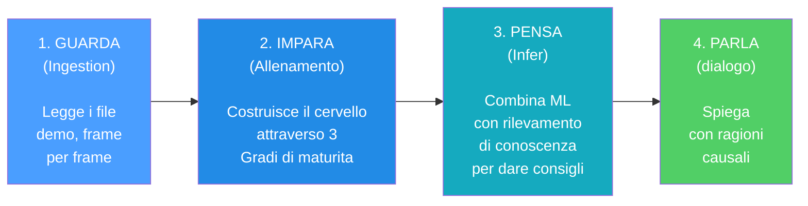

> 1,249 source files · 75,800+ lines · 334 .py files · 8 AI subsystems + Observatory + Control Module + Quad-Daemon + Desktop UI (13 screens) + 35 Tools · 73 test files · 20 SQLModel tables · Architettura tri-database (database.db + knowledge_base.db + hltv_metadata.db) · Indicizzazione vettoriale FAISS (IndexFlatIP 384-dim) · Internazionalizzazione i18n (EN/IT/PT) · Accessibilità WCAG 1.4.1 (theme.py) · 10 rapporti di audit comprensivi (incl. revisione letteratura 140KB, 30 articoli peer-reviewed) · 368 problemi risolti in 12 fasi di rimediazione sistematica

---

## 2. Panoramica dell'architettura del sistema

Il sistema è suddiviso in **6 sottosistemi principali** che lavorano insieme come i reparti di un'azienda. Ogni sottosistema ha un compito specifico e i dati fluiscono tra di essi in una pipeline ben definita.

> **Analogia :** Pensa all'intero sistema come a una **grande fabbrica con 6 reparti**. Il primo reparto (Ingestione) è la **sala posta**: riceve le registrazioni grezze delle partite e le ordina. Il secondo reparto (Elaborazione) è l'**officina**: analizza le registrazioni e misura tutto ciò che contiene. Il terzo reparto (Formazione) è la **scuola**: istruisce il cervello dell'IA mostrandogli migliaia di esempi. Il quarto reparto (Conoscenza) è la **biblioteca**: memorizza suggerimenti, consigli passati e conoscenze specialistiche in modo che l'allenatore possa consultarle. Il quinto reparto (Inferenza) è il **cervello**: combina ciò che l'IA ha imparato con ciò che la biblioteca conosce per creare consigli. Il sesto dipartimento (Analisi) è la **squadra investigativa**: conduce indagini speciali come "questo giocatore è in difficoltà?" o "era una buona posizione?". Tutti e sei i dipartimenti lavorano insieme affinché l'allenatore possa fornire consigli intelligenti e personalizzati.

```mermaid
graph TB
    subgraph Acquisizione["Acquisizione (Sorgenti Dati)"]
        DEMO["File .dem"] --> FMT_ADAPT["Format Adapter<br/>(magic bytes, validazione)"]
        FMT_ADAPT --> PARSER["Parser Demo<br/>(demoparser2)"]
        PARSER --> TRADE_DET["Trade Kill Detector<br/>(192 tick window)"]
        HLTV["Crawler HLTV<br/>(CircuitBreaker, RateLimiter)"] --> PRO_DB["DB Giocatori Pro"]
        CSV["CSV Esterni"] --> EXT_DB["Migratore CSV"]
        STEAM_API["Steam Web API<br/>(retry + backoff)"] --> STEAM_PROFILE["Profilo Giocatore"]
        STEAM_FIND["Steam Demo Finder<br/>(cross-platform)"] --> DEMO
        FACEIT_API["FACEIT API<br/>(rate limited 10/min)"] --> FACEIT_DATA["Elo + Level"]
        EVTREG["Event Registry<br/>(Schema CS2)"] -.-> PARSER
    end

    subgraph Elaborazione
        PARSER --> FE["Ingegneria delle Feature<br/>(feature_base, kast, rating, feature_ruolo)"]
        PARSER --> TF["Fabbrica Tensori<br/>(mappa, vista, raster movimento)"]
        FE --> VEC["Vettorizzatore Unificato<br/>(FeatureExtractor 25-dim)"]
        VEC --> SR["Ricostruttore di Stato"]
        PARSER --> PK["PlayerKnowledge<br/>(NO-WALLHACK)"]
        PK --> TF
        TF --> SR
        FB["FrameBuffer<br/>(ring buffer 30 frame,<br/>estrazione HUD)"] -.-> TF
    end

    subgraph Addestramento
        SR --> JEPA["Pre-Addestramento JEPA<br/>(Auto-Supervisionato InfoNCE)"]
        SR --> VLJEPA["VL-JEPA<br/>(Allineamento Visione-Linguaggio)"]
        FE --> MLP["AdvancedCoachNN<br/>(LSTM + MoE, 3 esperti)"]
        SR --> RAP["Addestramento RAP Coach<br/>(Architettura 7 Componenti)"]
        EXT_DB --> ROLE_HEAD["NeuralRoleHead<br/>(MLP 5→32→16→5)"]
        JEPA --> COACH_MGR["Gestore Coach<br/>(Gating Maturità 3 Livelli)"]
        VLJEPA --> COACH_MGR
        MLP --> COACH_MGR
        RAP --> COACH_MGR
        ROLE_HEAD --> COACH_MGR
    end

    subgraph Osservatorio["Osservatorio (Introspezione Addestramento)"]
        COACH_MGR --> OBS_CB["Registro Callback<br/>(Architettura Plugin)"]
        OBS_CB --> OBS_TB["TensorBoard<br/>(9+ scalari, istogrammi)"]
        OBS_CB --> OBS_MAT["Osservatorio Maturità<br/>(5 segnali → convinzione)"]
        OBS_CB --> OBS_EMB["Proiettore Embedding<br/>(spazio credenze UMAP)"]
    end

    subgraph Conoscenza
        RAG["Base Conoscenza RAG<br/>(Sentence-BERT 384-dim)"]
        FAISS_IDX["Indice FAISS<br/>(IndexFlatIP 384-dim,<br/>ricerca sub-lineare)"]
        EB["Banca Esperienze<br/>(Framework COPER)"]
        KG["Grafo della Conoscenza<br/>(entità + relazioni SQLite)"]
        RAG --> FAISS_IDX
    end

    subgraph Analisi["Analisi (10 Motori)"]
        GT["Expectiminimax<br/>Albero di Gioco - profondità 3"]
        BM["Stimatore Bayesiano<br/>Probabilità Morte +<br/>Calibratore Adattivo"]
        DI["Indice Inganno<br/>3 sotto-metriche"]
        RC["Classificatore Ruoli<br/>6 ruoli + Consenso Neurale"]
        WP["Predittore Probabilità<br/>Vittoria - 12 feature NN"]
        MOM["Tracker Momentum<br/>Rilevamento Tilt/Hot"]
        ENT["Analizzatore Entropia<br/>Impatto utilità Shannon"]
        BS["Rilevatore Punti Ciechi"]
        UE["Utilità ed Economia<br/>Ottimizzatore acquisti"]
        ER["Analizzatore Ingaggio<br/>50+ posizioni 8 mappe"]
    end

    subgraph Coaching_Engines["Motori di Coaching"]
        CE_CORR["CorrectionEngine<br/>(top-3 correzioni pesate)"]
        CE_HYBRID["HybridEngine<br/>(ML Z-score + RAG)"]
        CE_EXPLAIN["ExplainabilityGenerator<br/>(5 assi + template)"]
        CE_LONG["LongitudinalEngine<br/>(Trend-aware coaching)"]
        CE_CORR --> CE_HYBRID --> CE_EXPLAIN
    end

    subgraph Inferenza
        COACH_MGR --> HE["Servizio Coaching 4 Livelli<br/>(COPER, Ibrido, RAG, Base)"]
        RAG --> HE
        EB --> HE
        KG --> HE
        PRO_DB --> PB["Ponte Pro / Risolutore Token"]
        PB --> HE
        GT --> HE
        BM --> HE
        DI --> HE
        RC --> HE
        CE_EXPLAIN --> HE
        FACEIT_DATA --> PB
        STEAM_PROFILE --> PB
        HE --> OLLAMA["OllamaCoachWriter<br/>(Rifinitura NL Opzionale)"]
        HE --> EXP["Livello Spiegabilità"]
    end

    subgraph Controllo["Modulo di Controllo"]
        CTRL_CONSOLE["Console di Sistema<br/>(TUI Rich, CLI)"]
        CTRL_DB["DB Governor<br/>(WAL audit, Tier 1-3)"]
        CTRL_INGEST["Ingest Manager<br/>(Thread-safe, 30min re-scan)"]
        CTRL_ML["ML Controller<br/>(Throttle, Stop)"]
    end

    subgraph Progresso["Progress & Trend"]
        PROG_LONG["Longitudinal Analysis<br/>(slope, volatility, confidence)"]
        PROG_TREND["Trend Analysis<br/>(numpy polyfit)"]
        PROG_LONG --> CE_LONG
    end

    EXP --> UI["GUI Kivy"]

    subgraph Piattaforma["Piattaforma & Accessibilità"]
        I18N["i18n<br/>(en.json, it.json, pt.json)"]
        THEME["theme.py<br/>(WCAG 1.4.1,<br/>rating_color + rating_label)"]
        PLAT["platform_utils.py<br/>(rilevamento drive<br/>cross-platform)"]
    end
    I18N --> UI
    THEME --> UI

    style JEPA fill:#4a9eff,color:#fff
    style VLJEPA fill:#3b8ae6,color:#fff
    style RAP fill:#ff6b6b,color:#fff
    style ROLE_HEAD fill:#cc5de8,color:#fff
    style HE fill:#51cf66,color:#fff
    style RAG fill:#ffd43b,color:#000
    style OBS_TB fill:#868e96,color:#fff
    style OBS_MAT fill:#868e96,color:#fff
    style OBS_EMB fill:#868e96,color:#fff
```

**Spiegazione Diagramma:** Questo grande diagramma è come una **mappa del tesoro** che mostra come le informazioni viaggiano attraverso il sistema. Il viaggio inizia in alto a sinistra con le registrazioni grezze del gioco (file `.dem`, dati HLTV, file CSV): pensateli come **ingredienti grezzi** che arrivano in cucina. Questi ingredienti passano attraverso la sezione Elaborazione dove vengono **tagliati, misurati e preparati** (vengono estratte le caratteristiche, creati i vettori). Poi raggiungono la sezione Formazione dove cinque diversi "chef" (JEPA, VL-JEPA, AdvancedCoachNN, RAP e NeuralRoleHead) imparano ciascuno il proprio stile di cucina. L'Osservatorio è l'**ispettore del controllo qualità** che osserva ogni sessione di formazione, verificando se gli chef stanno migliorando, sono in stallo o sono in preda al panico. La sezione Conoscenza è come lo **scaffale del ricettario**: contiene suggerimenti (RAG), successi culinari passati (COPER) e relazioni tra gli ingredienti (Grafico della Conoscenza). La sezione Inferenza è dove lo **capo chef** combina tutto – competenze acquisite, libri di ricette e tecniche da chef professionista – per creare il piatto finale: consigli di coaching. La sezione Analisi è come avere dei **critici gastronomici** che valutano qualità specifiche: "È troppo piccante?" (momentum), "È creativo?" (indice di inganno), "Hanno dimenticato un ingrediente?" (punti ciechi). Dietro le quinte, l'**architettura Quad-Daemon** (Hunter, Digester, Teacher, Pulse) lavora instancabilmente come il personale di cucina automatizzato: scansiona nuovi ingredienti, li prepara e aggiorna le competenze degli chef senza mai fermarsi. Tutto scorre verso il basso e verso destra fino a raggiungere l'interfaccia grafica di Kivy, il **piatto** dove l'utente vede il risultato finale.

### Riepilogo flusso dei dati

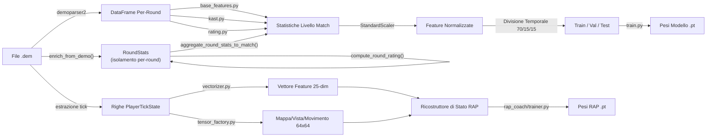

**Spiegazione diagramma:** Questo diagramma mostra le **due linee di montaggio parallele** all'interno del reparto di elaborazione. Immaginate la registrazione di una partita (file `.dem`) come un **lungo filmato**. La **linea di montaggio superiore** guarda il filmato e scrive statistiche riassuntive, come una pagella per ogni partita (uccisioni, morti, danni, ecc.). Queste pagelle vengono normalizzate (messe sulla stessa scala, come se tutte le temperature fossero convertite in gradi Celsius), divise in gruppi di studio (70% per l'apprendimento, 15% per i quiz, 15% per gli esami finali) e utilizzate per allenare il modello di allenamento di base. La **linea di montaggio inferiore** è più dettagliata: esamina il filmato **fotogramma per fotogramma** (ogni "ticchettio" del cronometro di gioco), misurando 25 informazioni su ciascun giocatore in ogni momento (posizione, salute, cosa vedono, economia, ecc.) e creando "istantanee" di 64x64 pixel della mappa. Sia i numeri che le immagini vengono inseriti nel RAP Coach's State Reconstructor, che li combina in un quadro completo di "cosa stava succedendo in questo preciso momento" - ed è da questo che impara il modello avanzato RAP Coach.

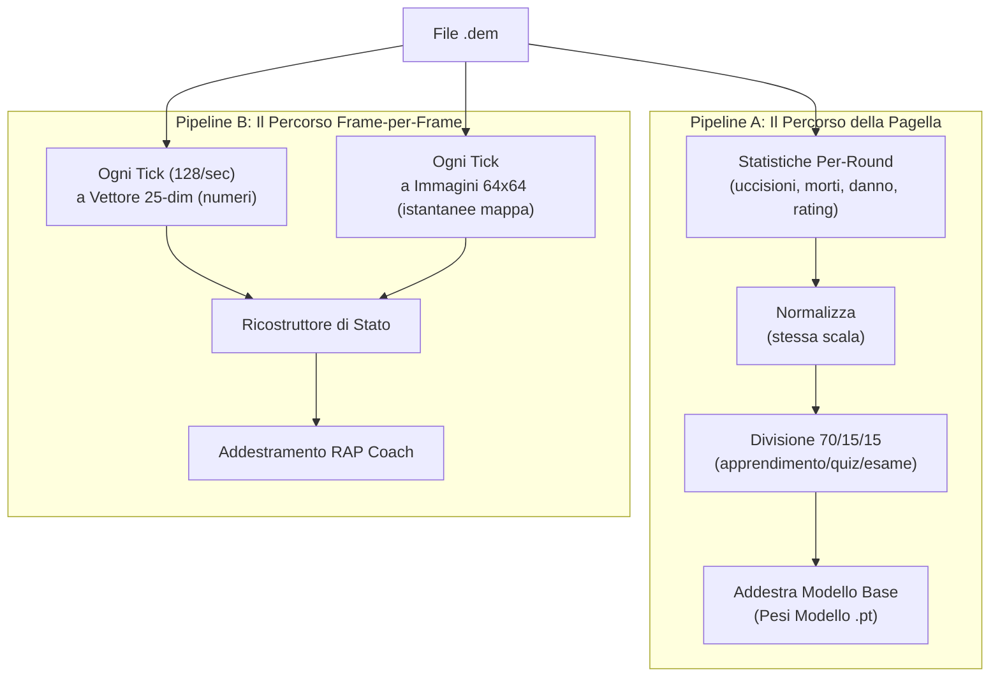

### Principio NO-WALLHACK e Contratto 25-dim

Due invarianti architetturali fondamentali attraversano l'intero sistema:

**1. Principio NO-WALLHACK:** Il coach AI **vede solo ciò che il giocatore legittimamente conosce**. Quando il modulo `PlayerKnowledge` è disponibile, i tensori generati dalla `TensorFactory` codificano esclusivamente informazioni legittime: compagni di squadra (sempre visibili), nemici in posizioni "last-known" (con decadimento temporale, τ = 2.5s), utilità propria e osservata. Nessuna informazione "wallhack" (posizioni nemiche reali non visibili) entra mai nel sistema di percezione. Quando `PlayerKnowledge` è `None`, il sistema ricade su una modalità legacy con tensori semplificati.

> **Analogia:** Il principio NO-WALLHACK è come un **esame di guida dove l'istruttore vede solo ciò che l'allievo vede**. L'istruttore non ha accesso a una telecamera esterna che mostra tutti gli ostacoli nascosti — deve valutare le decisioni dell'allievo basandosi solo sulle informazioni effettivamente disponibili all'allievo. Se l'allievo ha commesso un errore perché non poteva vedere un ostacolo dietro una curva, l'istruttore non lo punisce per questo. Allo stesso modo, il coach AI valuta il posizionamento del giocatore solo in base a ciò che il giocatore poteva ragionevolmente sapere in quel momento.

**2. Contratto 25-dim (`FeatureExtractor`):** Il `FeatureExtractor` in `vectorizer.py` definisce il vettore di feature canonico a 25 dimensioni (`METADATA_DIM = 25`) usato da **tutti** i modelli (AdvancedCoachNN, JEPA, VL-JEPA, RAP Coach) sia in addestramento che in inferenza. Qualsiasi modifica al vettore di feature avviene **esclusivamente** nel `FeatureExtractor` — nessun altro modulo può definire feature proprie. Questo garantisce coerenza dimensionale end-to-end.

```
 0: health/100      1: armor/100       2: has_helmet      3: has_defuser
 4: equip/10000     5: is_crouching    6: is_scoped       7: is_blinded
 8: enemies_vis     9: pos_x/±extent  10: pos_y/±extent  11: pos_z/1024
12: view_x_sin     13: view_x_cos     14: view_y/90      15: z_penalty
16: kast_est       17: map_id         18: round_phase
19: weapon_class   20: time_in_round/115  21: bomb_planted
22: teammates_alive/4  23: enemies_alive/5  24: team_economy/16000
```

> **Analogia:** Il contratto 25-dim è come una **lingua franca** parlata da tutti nel sistema. Ogni modello, ogni pipeline di addestramento, ogni motore di inferenza "parla" esattamente la stessa lingua con 25 parole. Se un modulo iniziasse a usare 26 parole o un ordine diverso, la comunicazione si interromperebbe. Il `FeatureExtractor` è il **dizionario ufficiale** — la sola autorità per la definizione e l'ordine delle feature.

---

## 3. Sottosistema 1 — Nucleo della rete neurale

**Cartella nel programma:** `backend/nn/`
**File chiave:** `model.py`, `jepa_model.py`, `jepa_train.py`, `jepa_trainer.py`, `coach_manager.py`, `training_orchestrator.py`, `config.py`, `factory.py`, `persistence.py`, `role_head.py`, `training_callbacks.py`, `tensorboard_callback.py`, `maturity_observatory.py`, `embedding_projector.py`

Questo sottosistema contiene tutti i modelli di rete neurale, il "cervello" del sistema di coaching. Include cinque distinte architetture di modelli, un gestore di training, un Osservatorio di Introspezione del Coach e utilità per la creazione e la persistenza dei modelli.

> **Analogia:** Questo è il **reparto cervello** della fabbrica. Contiene cinque diversi tipi di cervelli (AdvancedCoachNN, JEPA, VL-JEPA, RAP Coach e NeuralRoleHead), ognuno strutturato in modo diverso e specializzato in ambiti diversi, come ad esempio un cervello matematico, uno linguistico, uno creativo, uno per le competenze interpersonali e uno per l'identificazione dei ruoli, tutti in sinergia. Il Training Manager è come il **preside della scuola**: decide quale cervello può studiare cosa e quando, e tiene traccia dei voti di tutti. L'**Osservatorio** è l'ufficio di controllo qualità della scuola: monitora la "pagella" di ogni cervello durante la formazione, individuando segnali di confusione, panico, crescita o padronanza.

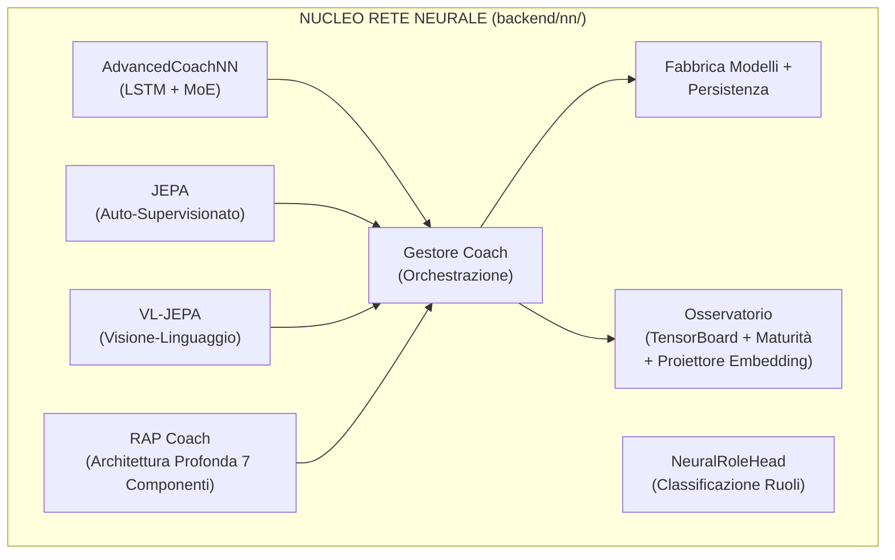

### -AdvancedCoachNN (LSTM + Mix di Esperti)

Definito in `model.py`, questo è il fondamento del coaching supervisionato.

| Componente                       | Dettaglio                                                                                                                                                                                                               |
| -------------------------------- | ----------------------------------------------------------------------------------------------------------------------------------------------------------------------------------------------------------------------- |
| **Dimensione di input**    | 25 funzionalità (`METADATA_DIM` da vectorizer.py)                                                                                                                                                                    |
| **Config**                 | Dataclass `CoachNNConfig`: `input_dim=25`, `output_dim=25` (default), `hidden_dim=128`, `num_experts=3`, `num_lstm_layers=2`, `dropout=0.2`, `use_layer_norm=True`                                      |
| **Livelli nascosti**       | LSTM a 2 livelli (128 nascosti,`batch_first=True`, dropout=0.2) con `LayerNorm` post-LSTM                                                                                                                           |
| **Testa dell'esperto**     | 3 esperti lineari paralleli (configurabili), softmax-gated tramite una rete di gate appresa                                                                                                                             |
| **Output**                 | Somma pesata degli output degli esperti → vettore del punteggio di coaching. Output_dim = METADATA_DIM (25) sia in `CoachNNConfig` che quando istanziato tramite `ModelFactory` (corretto in P1-08: `OUTPUT_DIM = METADATA_DIM = 25` in `config.py`) |
| **Bias di ruolo**          | Parametro `role_id` opzionale: `gate_weights = (gate_weights + role_bias) / 2.0` — orienta la selezione degli esperti verso conoscenze specifiche del ruolo                                                        |
| **Validazione dell'input** | `_validate_input_dim()` rimodella automaticamente 1D → `unsqueeze(0).unsqueeze(0)` e 2D → `unsqueeze(0)` per la robustezza                                                                                      |

> **Analogia:** Questo modello è come una **giuria di 3 giudici** a un talent show. Innanzitutto, l'LSTM legge i dati di gioco del giocatore come se stesse leggendo una storia: capisce cosa è successo passo dopo passo, ricordando i momenti importanti (è proprio questo che gli LSTM sanno fare bene: la memoria). Dopo aver letto l'intera storia, riassume tutto in un'unica "opinione" (128 numeri). Quindi, tre diversi giudici esperti esaminano quell'opinione e assegnano ciascuno il proprio punteggio. Ma non tutti i giudici sono ugualmente bravi in ogni tipo di performance: un esperto di danza è più bravo a giudicare la danza, un esperto di canto a cantare. Quindi una **rete di controllo** (come un moderatore) decide quanto fidarsi di ciascun giudice: "Per questo giocatore, il Giudice 1 è rilevante al 60%, il Giudice 2 al 30%, il Giudice 3 al 10%". Il punteggio finale è una combinazione ponderata delle opinioni di tutti e tre i giudici.

Ogni modulo esperto in AdvancedCoachNN: `Linear(128→128) → LayerNorm(128) → ReLU → Linear(128→output_dim)`.

> **Nota:** `_create_expert()` di JEPA omette LayerNorm — solo `Linear → ReLU → Linear`. Si tratta di una scelta progettuale deliberata: gli esperti JEPA operano su incorporamenti latenti già normalizzati, mentre gli esperti AdvancedCoachNN elaborano output LSTM grezzi che traggono vantaggio dalla normalizzazione per esperto.

**Passaggio in avanti (pseudo forward pass):**

```
h, _ = LSTM(x) # x: [batch, seq_len, 25]
h = LayerNorm(h[:, -1, :]) # prendi l'ultimo timestep → [batch, 128]
gate_weights = softmax(W_gate · h) # [batch, 3]
expert_outputs = [E_i(h) for i in 1..3]
output = tanh(Σ gate_weights_i × expert_outputs_i)
```

> **Analogia:** Ecco la ricetta passo passo: (1) L'LSTM legge le 25 misurazioni del giocatore in più timestep, come se leggesse le pagine di un diario. (2) Sceglie il riassunto dell'ultima pagina, ovvero la comprensione più recente. (3) Un "moderatore" esamina tale riepilogo e decide quanto fidarsi di ciascuno dei 3 esperti (questi pesi di fiducia sommati danno sempre il 100%). (4) Ogni esperto assegna i propri punteggi di coaching. (5) Il risultato finale è il risultato dei punteggi degli esperti mescolati insieme in base a quanto il moderatore si fida di ciascuno, compressi in un intervallo da -1 a +1 dalla funzione tanh (come una valutazione su una curva).

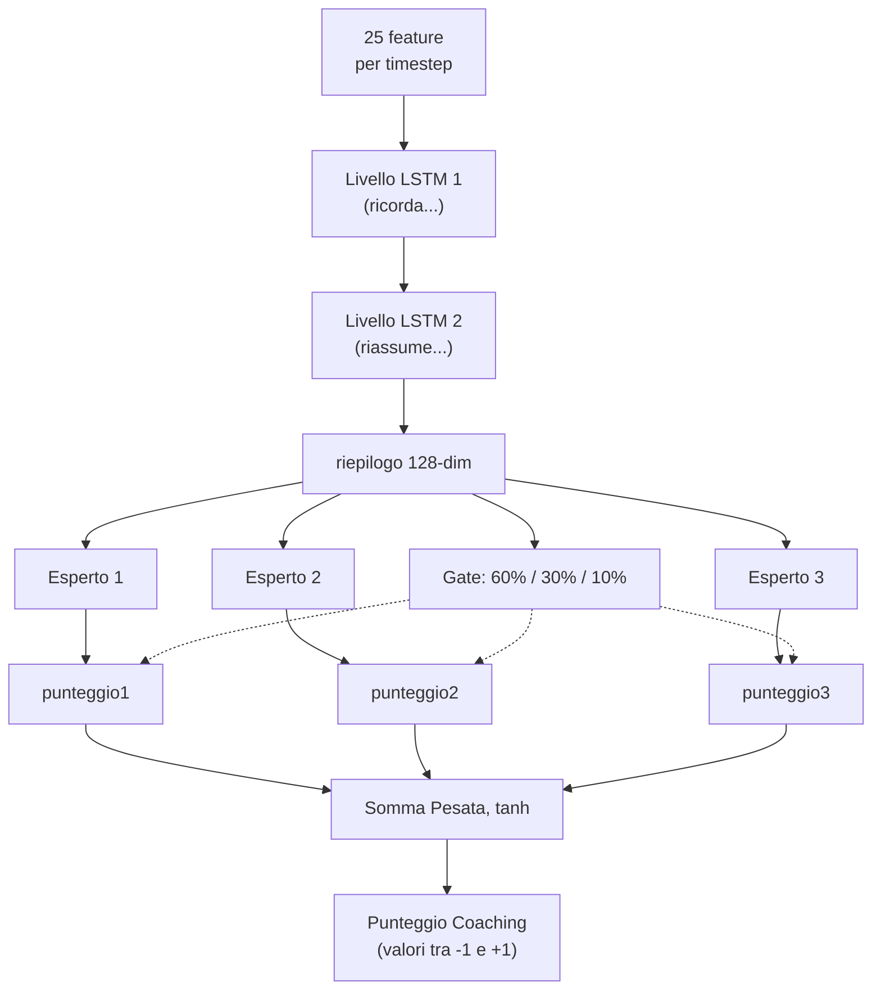

### -Modello di coaching JEPA (Architettura predittiva con integrazione congiunta)

Definito in `jepa_model.py`. Un modello di **pre-allenamento auto-supervisionato** ispirato all'I-JEPA di Yann LeCun, adattato per dati CS2 sequenziali.

> **Analogia:** JEPA è la fase di **"impara guardando"** dell'allenatore, proprio come si può imparare molto sul basket semplicemente guardando le partite NBA, anche prima che qualcuno te ne insegni le regole. Invece di aver bisogno di qualcuno che etichetti ogni giocata come "buona" o "cattiva" (apprendimento supervisionato), JEPA si auto-apprende giocando a un gioco di indovinelli: "Ho visto cosa è successo nel primo tempo di questo round... posso prevedere cosa succederà dopo?". Se indovina correttamente, sta costruendo una buona comprensione dei pattern CS2. Se indovina male, si adatta. Questo si chiama **apprendimento auto-supervisionato**: il modello crea i propri "compiti" a partire dai dati stessi.

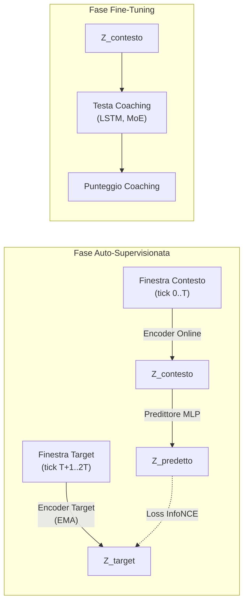

> **Spiegazione diagramma:** La fase di auto-supervisione funziona così: immagina di guardare un film e di premere pausa a metà scena. L'**Online Encoder** guarda la prima metà e crea un riassunto ("ecco cosa ho capito finora"). L'**Target Encoder** (una copia leggermente più vecchia dello stesso cervello, aggiornata lentamente) guarda la seconda metà e crea il proprio riassunto. Quindi un **Predictor** cerca di indovinare il riassunto della seconda metà usando solo il riassunto della prima metà. L'**InfoNCE Loss** è come un insegnante che controlla: "La tua previsione corrisponde a ciò che è realmente accaduto? Ed è sufficientemente diversa dalle ipotesi casuali?". Nella fase di Fine-Tuning, una volta che il modello ha acquisito una buona capacità di previsione, aggiungiamo una **Testa di Coaching** in cima: ora la comprensione acquisita guardando può essere utilizzata per fornire punteggi di coaching effettivi.

**Dettagli dell'architettura:**

| Modulo                        | Parametri                                                                                               |
| ----------------------------- | ------------------------------------------------------------------------------------------------------- |
| **Codificatore online** | Linear(input_dim, 512) → LayerNorm → GELU → Dropout(0.1) → Linear(512, latent_dim=256) → LayerNorm |
| **Codificatore target** | Strutturalmente identico; aggiornato tramite media mobile esponenziale (τ = 0.996). `EMA.state_dict()` restituisce tensori **clonati** per prevenire aliasing (un bug precedente permetteva la modifica accidentale dei pesi target attraverso riferimenti condivisi) |
| **Predictor**           | Linear(256, 512) → LayerNorm → GELU → Dropout(0.1) → Linear(512, 256)                               |
| **Coaching Head**       | LSTM(256, hidden_dim, 2 layers, dropout=0.2) → 3 esperti MoE → output controllato                     |

> **Analogia:** L'**Online Encoder** è come uno studente: trasforma i dati grezzi di gioco in un'"essenza" di 256 numeri (un riassunto compatto). L'**Target Encoder** è come il fratello maggiore dello studente che si aggiorna lentamente (EMA significa "avvicinarsi alle conoscenze del fratello minore, ma solo un pochino ogni giorno" - il 99,6% rimane invariato, solo lo 0,4% si aggiorna). Questo obiettivo lento impedisce al sistema di collassare in una soluzione banale (come prevedere sempre "tutto è uguale"). Il **Predictor** è un ponte che cerca di tradurre "ciò che ho visto" in "ciò che penso accadrà". La **Coaching Head** è l'accessorio finale che converte la comprensione in un consiglio effettivo, come passare da "Capisco il basket" a "dovresti passare di più".

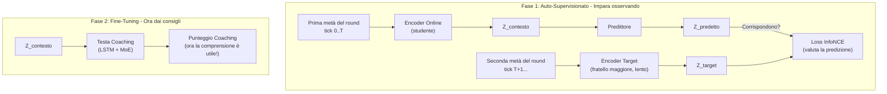

**Procedura di pre-addestramento** (`jepa_trainer.py`):

1. Carica le sequenze di `PlayerTickState` dai file SQLite demo professionali.
2. Divide ogni sequenza in finestre di contesto e target.
3. Codifica il contesto tramite il codificatore online + predittore, codifica il target tramite il codificatore del target (EMA).
4. Riduce al minimo la **perdita di contrasto di InfoNCE** utilizzando negativi in batch con similarità del coseno e temperatura τ=0,07.
5. Dopo ogni batch, esegue l'aggiornamento EMA: `θ_target ← τ·θ_target + (1−τ)·θ_online`.
6. **Monitoraggio della deriva**: Traccia gli oggetti DriftReport; attiva il riaddestramento automatico se la deriva > 2,5σ.
7. **Etichette basate sull'esito (Correzione G-01):** Il `ConceptLabeler` nell'addestramento VL-JEPA ora genera etichette dai dati `RoundStats` (esiti per round: uccisioni, morti, danni, sopravvivenza) anziché da feature a livello di tick. Questo elimina il **label leakage** — il problema precedente in cui le etichette dei concetti venivano derivate dalle stesse feature usate come input, permettendo al modello di "barare" durante l'addestramento senza apprendere effettivamente i pattern. Il metodo `label_from_round_stats(rs)` produce un vettore di 16 etichette di concetto basate su esiti misurabili. Se i dati `RoundStats` non sono disponibili, il sistema ricade sull'euristica legacy con un avviso di log una tantum.

> **Analogia:** La ricetta dell'allenamento è questa: (1) Carica le registrazioni di giocatori professionisti, fotogramma per fotogramma. (2) Per ogni registrazione, dividila in "cosa è successo prima" e "cosa è successo dopo". (3) Due codificatori esaminano ciascuna metà in modo indipendente. (4) Il sistema verifica: "La mia previsione di 'cosa è successo dopo' si è avvicinata alla risposta effettiva e non a risposte sbagliate casuali?" — questo è InfoNCE, come un test a risposta multipla in cui il modello deve scegliere la risposta giusta tra molte risposte sbagliate. (5) Il codificatore del fratello maggiore assorbe lentamente le conoscenze del fratello minore (solo lo 0,4% per passaggio). (6) Se i dati iniziano a sembrare molto diversi da quelli su cui il modello si è allenato (deriva > 2,5 deviazioni standard), scatta un campanello d'allarme: "Il meta del gioco è cambiato: è ora di riqualificarsi!"

**Decodifica Selettiva** (`forward_selective`): salta l'intero passaggio in avanti se la distanza del coseno tra l'embedding corrente e quello precedente è inferiore a una soglia (`skip_threshold=0.05`). Utilizza `1.0 - F.cosine_similarity()` come metrica di distanza e, durante l'operazione di salto, restituisce l'output precedente memorizzato nella cache. Questo consente un'efficace inferenza in tempo reale con salto dinamico dei frame: durante i momenti di gioco statici (i giocatori mantengono gli angoli), la maggior parte dei frame viene saltata completamente.

> **Analogia:** La decodifica selettiva è come una telecamera di sicurezza con **rilevamento del movimento**. Invece di registrare 24 ore su 24, 7 giorni su 7 (elaborando ogni singolo frame), si attiva solo quando qualcosa cambia effettivamente. Se due frame consecutivi sono quasi identici (distanza < 0.05 — in pratica "non è successo nulla"), il modello salta completamente il calcolo. Questo consente di risparmiare un'enorme quantità di potenza di elaborazione nei momenti lenti (come quando i giocatori mantengono gli angoli e aspettano), pur continuando a catturare ogni azione importante.

### -VL-JEPA: Architettura di Allineamento Visione-Linguaggio con Concetti di Coaching

Definito nella seconda metà di `jepa_model.py` (righe 355-963). Il VL-JEPA (**Vision-Language JEPA**) è un'**estensione fondamentale** del JEPACoachingModel che aggiunge un **meccanismo di allineamento tra embedding latenti e concetti di coaching interpretabili**. Ispirato al VL-JEPA di Meta FAIR (2026), mappa le rappresentazioni latenti in uno spazio concettuale strutturato con 16 concetti di coaching predefiniti.

> **Analogia:** Se JEPA è un allenatore che "capisce" il gioco osservandolo (apprendimento auto-supervisionato), VL-JEPA è lo stesso allenatore che ha anche imparato il **vocabolario specifico del coaching**. Non solo capisce i pattern del gioco, ma sa etichettarli con concetti come "posizionamento aggressivo", "economia inefficiente" o "scambio reattivo". È come la differenza tra un critico cinematografico che "sente" quando un film funziona e uno che sa articolare il perché: "la fotografia è eccellente, il ritmo è lento nel secondo atto, il colpo di scena è prevedibile". Il VL-JEPA traduce la comprensione latente in linguaggio di coaching specifico.

#### Tassonomia dei 16 Concetti di Coaching

Il sistema definisce `NUM_COACHING_CONCEPTS = 16` concetti organizzati in **5 dimensioni tattiche**:

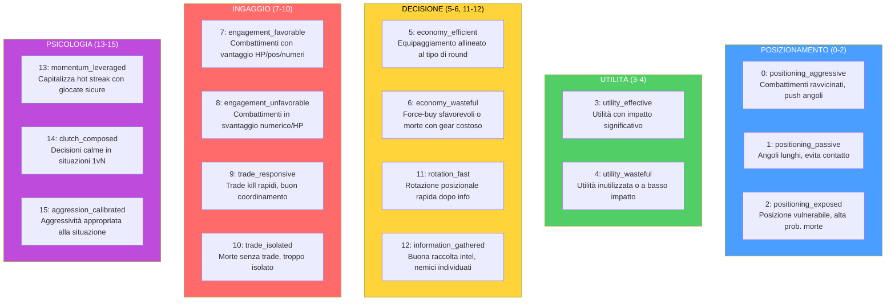

Ogni concetto è definito come un `CoachingConcept` dataclass immutabile con `(id, name, dimension, description)`. La lista globale `COACHING_CONCEPTS` e `CONCEPT_NAMES` sono le sorgenti di verità per tutto il sistema.

> **Analogia:** I 16 concetti sono come le **16 materie di una pagella scolastica del coaching**. Invece di un voto unico "sei bravo/cattivo", il VL-JEPA valuta il giocatore su 16 aspetti specifici: "In posizionamento aggressivo sei al 80%, in economia efficiente al 45%, in reattività allo scambio al 70%". Le 5 dimensioni sono i "dipartimenti" della scuola: Posizionamento, Utilità, Decisione, Ingaggio e Psicologia. Un giocatore può eccellere in una dimensione e avere lacune in un'altra — proprio come uno studente può avere ottimi voti in matematica ma scarsi in letteratura.

#### Architettura VLJEPACoachingModel

`VLJEPACoachingModel` eredita da `JEPACoachingModel` e aggiunge 3 componenti:

| Componente | Parametri | Scopo |
|---|---|---|
| **concept_embeddings** | `nn.Embedding(16, latent_dim=256)` | 16 prototipi di concetto appresi nello spazio latente |
| **concept_projector** | `Linear(256→256) → GELU → Linear(256→256)` | Proietta embedding encoder nello spazio allineato ai concetti |
| **concept_temperature** | `nn.Parameter(0.07)`, clamped `[0.01, 1.0]` | Temperatura appresa per scaling della similarità coseno |

Tutti i percorsi forward del genitore (`forward`, `forward_coaching`, `forward_selective`, `forward_jepa_pretrain`) sono **preservati immutati** via ereditarietà. Il nuovo percorso `forward_vl()` aggiunge l'allineamento concettuale.

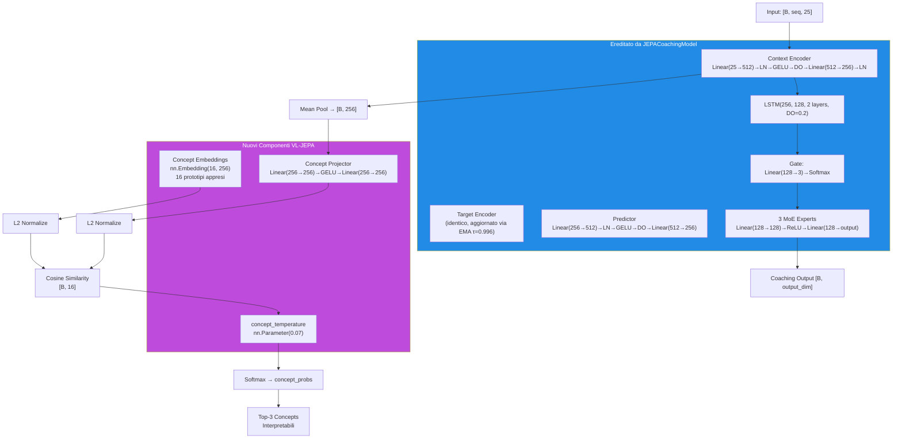

> **Analogia:** L'architettura VL-JEPA è come aggiungere un **traduttore simultaneo** a un analista che già capisce il gioco. Il `concept_projector` è l'interprete che prende la comprensione latente dell'encoder (256 numeri astratti) e la traduce nello "spazio dei concetti". I `concept_embeddings` sono come 16 **cartelli segnaletici** nello spazio latente: ognuno rappresenta un concetto di coaching e ha una posizione fissa (appresa durante l'addestramento). Il `concept_temperature` controlla quanto "netta" deve essere la classificazione: una temperatura bassa (0.01) rende le decisioni binarie ("è questo concetto o non lo è"), una temperatura alta (1.0) le rende morbide ("potrebbe essere diversi concetti contemporaneamente"). Il sistema calcola la distanza coseno tra la proiezione del giocatore e ciascun cartello, e i concetti più vicini vengono attivati.

#### Percorso Forward VL-JEPA (`forward_vl`)

```
1. Encode:        embeddings = context_encoder(x)                    # [B, seq, 256]
2. Pool:          latent = embeddings.mean(dim=1)                    # [B, 256]
3. Project:       projected = L2_normalize(concept_projector(latent)) # [B, 256]
4. Similarity:    logits = projected @ concept_embs_norm.T            # [B, 16]
5. Temperature:   probs = softmax(logits / clamp(temp, 0.01, 1.0))   # [B, 16]
6. Coaching:      coaching_output = forward_coaching(x, role_id)      # [B, output_dim]
7. Decode:        top_concepts = top-k(probs, k=3)                   # interpretabili
```

**Output `forward_vl()`:** Dizionario con 5 chiavi:

| Chiave | Forma | Contenuto |
|---|---|---|
| `concept_probs` | `[B, 16]` | Probabilità softmax per ogni concetto |
| `concept_logits` | `[B, 16]` | Punteggi di similarità grezzi (pre-softmax) |
| `top_concepts` | `List[tuple]` | `[(nome_concetto, probabilità), ...]` per il primo campione |
| `coaching_output` | `[B, output_dim]` | Predizione coaching standard (via genitore) |
| `latent` | `[B, 256]` | Embedding latente pooled dell'encoder |

**Percorso leggero — `get_concept_activations()`:** Forward solo concettuale senza testa di coaching né LSTM. Utilizza `torch.no_grad()` per efficienza massima durante l'inferenza.

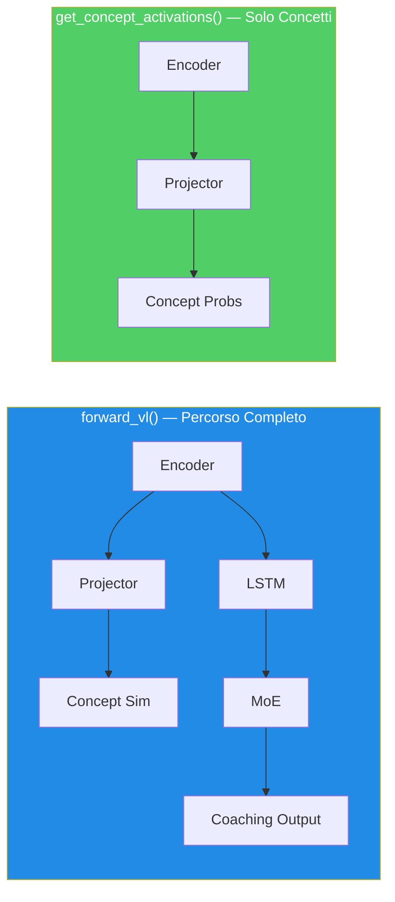

#### ConceptLabeler: Due Modalità di Etichettatura

La classe `ConceptLabeler` genera **etichette soft multi-label** (`[0, 1]^16`) per l'addestramento VL-JEPA. Supporta due modalità:

**Modalità 1 — Basata su Esiti (preferita, correzione G-01):** `label_from_round_stats(round_stats)` genera etichette da dati di **esito del round** (uccisioni, morti, danni, sopravvivenza, trade kill, utilità, equipaggiamento, round vinto). Questi dati sono **ortogonali** al vettore di input a 25 dim, eliminando il label leakage.

| Concetto | Segnale di Esito Usato |
|---|---|
| `positioning_aggressive` (0) | `opening_kill=True` → 0.8, kills≥2+survived → 0.6 |
| `positioning_passive` (1) | survived, no opening, damage<60 → 0.7 |
| `positioning_exposed` (2) | `opening_death=True` → 0.8, deaths>0+damage<40 → 0.6 |
| `utility_effective` (3) | utility_total>80 + round_won → 0.5+util/300 |
| `utility_wasteful` (4) | zero utility → 0.5, utility+lost → 0.4 |
| `economy_efficient` (5) | eco win (equip<2000) → 0.9, normal win → 0.7 |
| `economy_wasteful` (6) | high equip+loss → 0.4+equip/16000 |
| `engagement_favorable` (7) | multi-kill+survived → 0.5+kills×0.15 |
| `engagement_unfavorable` (8) | deaths+no kills+low dmg → 0.7 |
| `trade_responsive` (9) | trade_kills>0 → 0.6+tk×0.2 |
| `trade_isolated` (10) | died, not traded, no trade kills → 0.7 |
| `rotation_fast` (11) | assists≥1+round_won → 0.6+assists×0.1 |
| `information_gathered` (12) | flashes≥2+survived → 0.6 |
| `momentum_leveraged` (13) | rating>1.5 → rating/2.5, kills≥3 → 0.7 |
| `clutch_composed` (14) | kills≥2+survived+won → 0.6 |
| `aggression_calibrated` (15) | efficiency = kills×1000/equip → min(eff×0.5, 1.0) |

**Modalità 2 — Euristica Legacy (fallback con label leakage):** `label_tick(features)` genera etichette direttamente dal vettore di feature a 25 dim. Questo crea **label leakage** perché il modello può "barare" ricostruendo le feature di input anziché imparare pattern latenti. Usato solo quando `RoundStats` non è disponibile, con un avviso di log una tantum.

> **Analogia G-01:** Il label leakage è come un **esame in cui le risposte sono scritte sul retro del foglio delle domande**. Nella modalità euristica, le etichette dei concetti sono derivate dalle stesse 25 feature che il modello vede come input — il modello può semplicemente "copiare le risposte" senza capire nulla. Nella modalità basata su esiti, le etichette vengono da dati diversi (cosa è SUCCESSO nel round: uccisioni, morti, vittoria) — il modello deve effettivamente capire la relazione tra le feature di input e gli esiti per ottenere buoni punteggi. È la differenza tra studiare per capire e studiare per copiare.

**`label_batch(features_batch)`:** Wrapper che gestisce batch 2D `[B, 25]` e 3D `[B, seq_len, 25]` (media delle etichette sulla sequenza per input 3D).

**Riferimento indici feature (METADATA_DIM=25):**

```
 0: health/100      1: armor/100       2: has_helmet      3: has_defuser
 4: equip/10000     5: is_crouching    6: is_scoped       7: is_blinded
 8: enemies_vis     9: pos_x/4096     10: pos_y/4096     11: pos_z/1024
12: view_x_sin     13: view_x_cos     14: view_y/90      15: z_penalty
16: kast_est       17: map_id         18: round_phase
19: weapon_class   20: time_in_round/115  21: bomb_planted
22: teammates_alive/4  23: enemies_alive/5  24: team_economy/16000
```

#### Funzioni di Perdita VL-JEPA

**1. `jepa_contrastive_loss()` — InfoNCE (già documentata sopra)**

Formula: `-log(exp(sim(pred, target)/τ) / (exp(sim(pred, target)/τ) + Σ exp(sim(pred, neg_i)/τ)))` con τ=0.07.

**2. `vl_jepa_concept_loss()` — Allineamento Concetti + Diversità VICReg**

```python
concept_loss = BCE_with_logits(concept_logits, concept_labels)  # Multi-label
diversity_loss = -std(L2_normalize(concept_embeddings), dim=0).mean()  # VICReg
total = alpha * concept_loss + beta * diversity_loss
```

| Termine | Formula | Peso Default | Scopo |
|---|---|---|---|
| `concept_loss` | `F.binary_cross_entropy_with_logits(logits, labels)` | α = 0.5 | Allinea embedding ai concetti corretti |
| `diversity_loss` | `-std_per_dim(L2_norm(concept_embs)).mean()` | β = 0.1 | Impedisce il collasso degli embedding di concetto |

> **Analogia:** La `concept_loss` è come **verificare che lo studente associ correttamente i termini alle definizioni** — "posizionamento aggressivo" deve attivarsi quando il giocatore è effettivamente aggressivo. La `diversity_loss` è ispirata a VICReg (Variance-Invariance-Covariance Regularization): impedisce che tutti i 16 prototipi di concetto collassino nello stesso punto dello spazio latente. È come assicurarsi che i 16 cartelli segnaletici nel museo siano **tutti in posizioni diverse** — se due cartelli sono nello stesso posto, non servono a distinguere i concetti. La diversità viene misurata come la deviazione standard degli embedding normalizzati lungo ogni dimensione: una std alta significa che i concetti sono ben separati.

**Perdita totale nel training step VL-JEPA (`train_step_vl`):**

```
L_total = L_infonce + α × L_concept + β × L_diversity
```

Dove `L_infonce` è la perdita contrastiva standard JEPA e `(α × L_concept + β × L_diversity)` è il termine di allineamento concettuale.

#### Flusso Dimensionale Completo JEPA / VL-JEPA

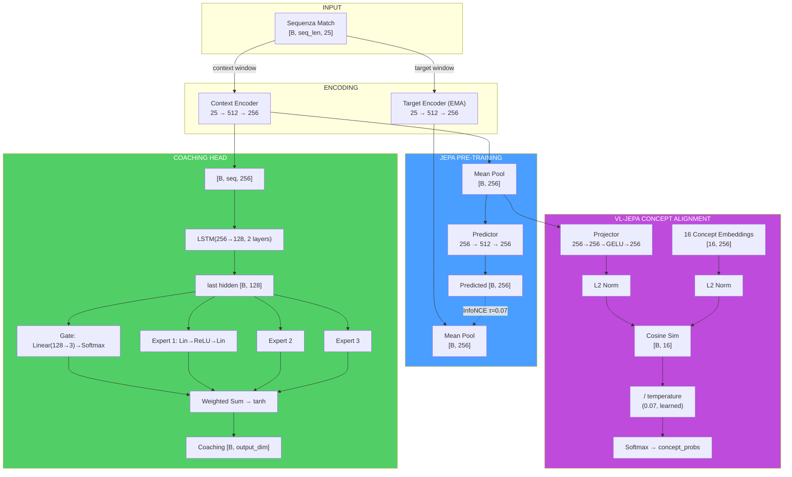

> **Analogia del flusso dimensionale:** Immagina il percorso dei dati come un viaggio di **traduzione multilingue**: i dati grezzi del gioco (25 numeri) sono come un testo in "linguaggio del gioco". L'encoder li traduce in "linguaggio latente" (256 numeri) — una rappresentazione compressa ma ricca. Da qui, il percorso si biforca: il **ramo JEPA** (auto-supervisione) verifica se il traduttore capisce la sequenza temporale, il **ramo Coaching** (LSTM+MoE) produce consigli pratici, e il **ramo VL** (concetti) traduce dal "linguaggio latente" al "linguaggio del coaching" (16 concetti interpretabili). Ogni ramo serve uno scopo diverso, ma tutti partono dalla stessa traduzione di base.

#### JEPATrainer: Addestramento con Monitoraggio Deriva

Definito in `jepa_trainer.py` (276 righe). Gestisce sia l'addestramento JEPA standard che VL-JEPA, con riaddestramento automatico basato sulla deriva.

| Parametro | Default | Scopo |
|---|---|---|
| **Optimizer** | AdamW (lr=1e-4, weight_decay=1e-4) | Ottimizzazione con decadimento dei pesi |
| **Scheduler** | CosineAnnealingLR (T_max=100) | Decadimento ciclico del learning rate |
| **DriftMonitor** | z_threshold=2.5 | Rileva drift delle feature oltre 2.5σ |
| **drift_history** | `List[DriftReport]` | Storico dei report di drift |

**Ciclo di addestramento — `train_step(x_context, x_target, negatives)`:**

1. Forward pass JEPA: `pred, target = model.forward_jepa_pretrain(context, target)`
2. **Auto-detect negativi grezzi:** Se `negatives.shape[-1] ≠ latent_dim`, i negativi sono feature grezze → vengono auto-codificati via `target_encoder` con `torch.no_grad()` (reshape `[B*N, 1, D]` → expand → encode → mean pool → reshape)
3. Loss InfoNCE su embedding normalizzati
4. Backward + optimizer step
5. **Aggiornamento EMA target encoder** (deve avvenire DOPO `optimizer.step()`)

**Training step VL-JEPA — `train_step_vl()`:** Estende `train_step` con:

1. Forward pass JEPA standard (InfoNCE)
2. Forward VL: `model.forward_vl(x_context)` → concept_logits
3. **Generazione etichette (preferenza G-01):** Se `round_stats` è disponibile → `label_from_round_stats()` (no leakage). Altrimenti → `label_batch()` (euristica legacy con avviso una tantum)
4. Concept loss + diversity loss: `vl_jepa_concept_loss(logits, labels, embeddings, α, β)`
5. Loss totale: `L_infonce + L_concept_total`
6. Backward + optimize + EMA update

**Output:** `{total_loss, infonce_loss, concept_loss, diversity_loss}`.

**Monitoraggio deriva — `check_val_drift(val_df, reference_stats)`:**

- Utilizza `DriftMonitor` dalla pipeline di validazione
- Calcola z-score per ogni feature del validation set rispetto alle statistiche di riferimento
- Se `max_z_score > 2.5`, il report segna `is_drifted=True`
- `should_retrain(drift_history, window=5)` → se la maggioranza delle ultime 5 finestre mostra drift, attiva il flag `_needs_full_retrain`

**Riaddestramento automatico — `retrain_if_needed(full_dataloader, device, epochs=10)`:**

- Se il flag `_needs_full_retrain` è attivo, resetta il scheduler e riesegue `epochs` epoche complete
- Dopo il riaddestramento, cancella il flag e lo storico drift
- Restituisce `True/False` per indicare se il riaddestramento è avvenuto

> **Analogia:** Il sistema di monitoraggio della deriva è come un **termometro automatico per le condizioni del meta-gioco**. Se i dati dei nuovi giocatori sono molto diversi da quelli su cui il modello si è allenato (ad esempio, un aggiornamento importante del gioco ha cambiato le meccaniche), il termometro rileva la "febbre" (drift > 2.5σ). Se la febbre persiste per 5 controlli consecutivi, il sistema prescrive una "cura completa" — riaddestramento totale. Questo impedisce al modello di dare consigli basati su un meta-gioco obsoleto.

#### Pipeline di Addestramento Standalone (`jepa_train.py`)

Script standalone per pre-addestramento e fine-tuning JEPA, eseguibile da CLI:

```bash
python -m Programma_CS2_RENAN.backend.nn.jepa_train --mode pretrain
python -m Programma_CS2_RENAN.backend.nn.jepa_train --mode finetune --model-path models/jepa_model.pt
```

**`JEPAPretrainDataset`:** Dataset PyTorch per il pre-addestramento:

| Parametro | Default | Descrizione |
|---|---|---|
| `context_len` | 10 | Lunghezza finestra contesto (tick) |
| `target_len` | 10 | Lunghezza finestra target (tick) |
| `match_sequences` | `List[np.ndarray]` | Sequenze di match `[num_rounds, METADATA_DIM]` |

Per ogni campione, seleziona un punto di partenza casuale nella sequenza e restituisce `{"context": [context_len, 25], "target": [target_len, 25]}`.

> **Nota (F3-25):** Il punto di partenza usa `np.random.randint()` con stato globale non seedato → finestre non riproducibili tra run. Per addestramento deterministico, usare `worker_init_fn` o un `Generator` dedicato nel `DataLoader`.

**`load_pro_demo_sequences(limit=100)`:** Carica sequenze demo professionali dal database. Estrae 12 feature aggregate a livello di match da `PlayerMatchStats`, paddate a `METADATA_DIM` con zeri.

> **⚠️ Avvertimento Critico (F3-08):** Lo script standalone usa `np.tile(features, (20, 1))` per creare 20 frame identici da un singolo vettore aggregato. Questo rende il pre-addestramento JEPA **un'operazione identità** — il modello impara semplicemente a copiare l'input, non le dinamiche temporali. Il `TrainingOrchestrator` nel percorso di produzione **non è affetto** da questo problema e usa dati per-tick reali.

**`train_jepa_pretrain()`:** 50 epoche, batch_size=16, lr=1e-4, 8 negativi in-batch. L'optimizer include SOLO `context_encoder` e `predictor` — il `target_encoder` è aggiornato esclusivamente via EMA.

**`train_jepa_finetune()`:** 30 epoche, batch_size=16, lr=1e-3, weight_decay=1e-3. Congela gli encoder e ottimizza solo LSTM + MoE + Gate.

**Persistenza:** `save_jepa_model()` salva `{model_state_dict, is_pretrained}`. `load_jepa_model()` carica con `weights_only=True` (sicurezza).

#### SuperpositionLayer — Gating Contestuale (`layers/superposition.py`)

Modulo standalone che implementa un livello lineare con **gating dipendente dal contesto**, usato all'interno del RAP Coach Strategy Layer.

```python
class SuperpositionLayer(nn.Module):
    def __init__(self, in_features, out_features, context_dim=METADATA_DIM):
        self.weight = nn.Parameter(empty(out_features, in_features))
        nn.init.kaiming_uniform_(self.weight, a=math.sqrt(5))  # P1-09: Kaiming init
        self.bias = nn.Parameter(zeros(out_features))
        self.context_gate = nn.Linear(context_dim, out_features)  # Superposition Controller

    def forward(self, x, context):
        gate = sigmoid(self.context_gate(context))  # [B, out_features]
        self._last_gate_live = gate                  # Con gradiente (per sparsity loss)
        self._last_gate_activations = gate.detach()  # Copia detached (per osservabilità)
        out = F.linear(x, self.weight, self.bias)
        return out * gate  # Modulazione contestuale
```

**Meccanismo:** L'output di ogni neurone viene moltiplicato per un gate sigmoide condizionato sulle feature di contesto (25-dim). Questo permette al modello di "accendere" o "spegnere" neuroni dinamicamente in base alla situazione di gioco.

**Inizializzazione Kaiming (P1-09):** I pesi vengono inizializzati con `kaiming_uniform_` (distribuzione Kaiming He, 2015) anziché `torch.randn()`. Questa inizializzazione garantisce che la varianza dei pesi sia proporzionale al fan-in del livello, prevenendo la scomparsa o l'esplosione dei gradienti nelle reti profonde. Il parametro `a=math.sqrt(5)` è il valore standard per livelli lineari in PyTorch.

**Design dual-tensor (NN-24):** Il gate sigmoide viene memorizzato in **due copie separate** durante ogni forward pass:

| Tensore | Gradiente | Scopo |
|---|---|---|
| `_last_gate_live` | **Sì** (mantiene il grafo computazionale) | Usato da `gate_sparsity_loss()` per backpropagation — il gradiente fluisce attraverso il gate verso `context_gate` |
| `_last_gate_activations` | **No** (detached) | Usato da `get_gate_statistics()` per osservabilità — nessun costo di memoria per il grafo |

Questa separazione risolve il conflitto tra la necessità di gradienti (per la loss di sparsità) e la necessità di osservabilità leggera (per logging e TensorBoard).

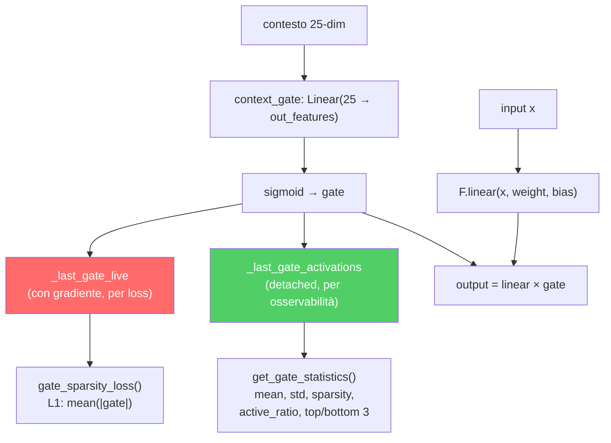

**Osservabilità integrata:**

| Metodo | Ritorno | Descrizione |
|---|---|---|
| `get_gate_activations()` | `Tensor` o `None` | Ultime attivazioni del gate (`_last_gate_activations`, detached) |
| `get_gate_statistics()` | `Dict[str, float]` | Statistiche complete del gate (vedi tabella sotto) |
| `gate_sparsity_loss()` | `Tensor` | Perdita L1 `mean(|_last_gate_live|)` per specializzazione degli esperti |
| `enable_tracing(interval)` | — | Log dettagliato del gate ogni `interval` passi |
| `disable_tracing()` | — | Ripristina intervallo di logging a 100 |

**Campi di `get_gate_statistics()`:**

| Campo | Tipo | Significato |
|---|---|---|
| `mean_activation` | float | Media delle attivazioni del gate nel batch |
| `std_activation` | float | Deviazione standard delle attivazioni |
| `sparsity` | float | Frazione di dimensioni con media < 0.1 (più alto = più sparso) |
| `active_ratio` | float | Frazione di dimensioni con media > 0.5 (più alto = più attivo) |
| `top_3_dims` | List[int] | Le 3 dimensioni del gate più attive |
| `bottom_3_dims` | List[int] | Le 3 dimensioni del gate meno attive |

**Log periodico durante addestramento:** Ogni 100 forward pass (configurabile via `enable_tracing(interval)`), logga via logger strutturato: dimensioni attive (gate_mean > 0.5), dimensioni sparse (gate_mean < 0.1) e media complessiva.

> **Analogia:** Il SuperpositionLayer è come un **mixer audio con 256 canali** dove ogni slider è controllato automaticamente in base alla "scena" attuale. In un round eco, certi canali vengono abbassati (le feature relative al full-buy sono irrilevanti). In un retake post-plant, altri canali vengono alzati. Il `gate_sparsity_loss` è come un fonico che dice: "Usa il minor numero possibile di canali alla volta — se riesci a ottenere lo stesso suono con 50 canali invece di 200, il mix sarà più pulito e interpretabile". L'inizializzazione Kaiming è come **accordare lo strumento prima di suonare** — senza una buona accordatura iniziale, anche il musicista più bravo produrrà note stonate. Il design dual-tensor è come avere **due copie del mix**: una "live" che il fonico può regolare (con gradienti), e una "registrata" che il critico può analizzare a posteriori (senza disturbare la performance in corso).

#### Modulo EMA Standalone

L'aggiornamento **Exponential Moving Average** del target encoder è implementato direttamente in `JEPACoachingModel.update_target_encoder(momentum=0.996)`:

```python
with torch.no_grad():
    for param_q, param_k in zip(context_encoder.parameters(), target_encoder.parameters()):
        param_k.data = param_k.data * momentum + param_q.data * (1.0 - momentum)
```

**Invarianti:**
- L'aggiornamento EMA avviene **sempre dopo** `optimizer.step()` — mai prima, altrimenti i gradienti non sono ancora applicati
- Il target encoder **non riceve mai gradienti** diretti — solo aggiornamenti EMA
- Il momentum 0.996 significa che il target encoder "assorbe" solo lo 0.4% dei pesi dell'encoder online a ogni passo — aggiornamento molto conservativo
- `state_dict()` del modello restituisce tensori **clonati** per prevenire aliasing accidentale

> **Analogia:** L'EMA è come un **mentore che impara lentamente dall'allievo**. L'allievo (context encoder) impara velocemente dai dati e cambia molto a ogni lezione. Il mentore (target encoder) osserva l'allievo e aggiorna le proprie conoscenze molto lentamente — solo lo 0.4% per lezione. Questo impedisce al mentore di "dimenticare" ciò che sapeva prima, creando un obiettivo stabile per l'apprendimento. Senza EMA, entrambi i cervelli cambierebbero troppo velocemente e il sistema potrebbe "collassare" — un fenomeno noto come mode collapse dove entrambi gli encoder producono lo stesso output indipendentemente dall'input.

### -CoachTrainingManager (Orchestrazione)

Definito in `coach_manager.py` (663 righe). Questo è il **cervello del processo di formazione**, che gestisce un rigoroso **ciclo di formazione a 3 livelli, basato sulla maturità**, suddiviso in 4 fasi:

> **Analogia adatta ai bambini:** CoachTrainingManager è come il **preside** che decide la classe di ogni studente e quali materie può seguire. Uno studente nuovo di zecca (CALIBRAZIONE) può frequentare solo corsi introduttivi. Uno studente che ha superato un numero sufficiente di corsi (APPRENDIMENTO) può frequentare corsi avanzati. E uno studente dell'ultimo anno (MATURE) ha accesso a tutto. Il preside impone anche una regola: "Non puoi iniziare alcun corso finché non hai partecipato ad almeno 10 sessioni di orientamento". Questo impedisce al sistema di provare a insegnare quando non ha praticamente dati da cui imparare.

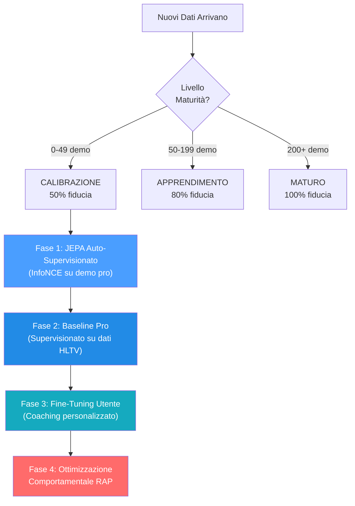

> **Spiegazione diagramma:** Pensate alle 4 fasi come agli **anni scolastici**: la Fase 1 (JEPA) è come **guardare un filmato di una partita**: lo studente guarda centinaia di partite professionistiche e impara gli schemi senza che nessuno li valuti. La Fase 2 (Pro Baseline) è come **studiare da un libro di testo**: ora un insegnante dice "ecco come si gioca bene" e lo studente studia per adeguarsi. La Fase 3 (Perfezionamento dell'utente) è come **lezioni private**: il sistema si adatta specificamente allo stile e ai punti deboli di QUESTO giocatore. La Fase 4 (RAP) è come un **corso di strategia avanzata**: il coach RAP completo a 7 componenti interviene con teoria dei giochi, posizionamento e ragionamento causale. Non è possibile accedere alla Fase 4 finché non si sono completate le Fasi 1-3, proprio come non si può studiare analisi matematica prima di algebra.

**Livelli di maturità e moltiplicatori di fiducia:**

| Livello       | Conteggio demo | Moltiplicatore di fiducia | Funzionalità sbloccate                                 |
| ------------- | -------------- | ------------------------- | ------------------------------------------------------- |
| CALIBRAZIONE  | 0–49          | 0,50                      | Euristica di base, pre-addestramento JEPA               |
| APPRENDIMENTO | 50–199        | 0,80                      | Confronto base professionale, ottimizzazione utente     |
| MATURO        | 200+           | 1,00                      | Coach RAP completo, teoria dei giochi, analisi completa |

> **Analogia:** Il moltiplicatore di fiducia è come un **punteggio di fiducia**. Quando il coach è nuovo (CALIBRAZIONE), si fida dei propri consigli solo al 50%: sa che potrebbero sbagliarsi, quindi è cauto. Dopo aver studiato più di 50 demo (APPRENDIMENTO), si fida di se stesso all'80%. Dopo più di 200 demo (MATURO), è completamente sicuro: il 100%. È come un meteorologo: un meteorologo alle prime armi potrebbe dire "Sono sicuro al 50% che pioverà", ma uno esperto con decenni di dati alle spalle dice "Sono sicuro al 100%". L'allenatore non finge mai di sapere più di quanto non sappia in realtà.

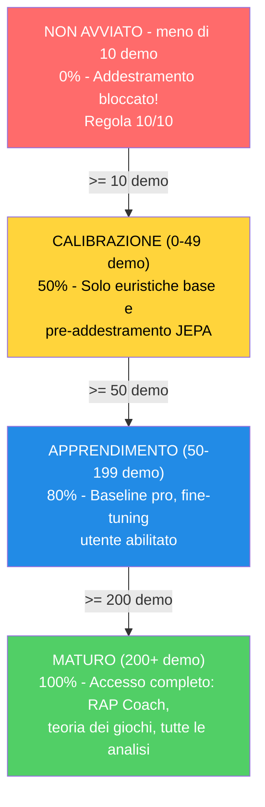

**Prerequisiti (Regola 10/10):** Richiede ≥10 demo professionali OPPURE (≥10 demo utente + account Steam/FACEIT connesso) prima di iniziare qualsiasi allenamento.

Il manager utilizza un **contratto di allenamento** rigoroso con 25 funzionalità (corrispondenti a `METADATA_DIM`).

> **Problema risolto (ex G-10):** `coach_manager.py` ora definisce `TRAINING_FEATURES` con i nomi canonici corretti per tutti i 25 indici, allineati perfettamente con `vectorizer.py`. L'asserzione `len(TRAINING_FEATURES) == METADATA_DIM` è valida e tutti i nomi sono aggiornati. Inoltre, `MATCH_AGGREGATE_FEATURES` definisce le 25 feature aggregate a livello di partita: `["avg_kills", "avg_deaths", "avg_adr", "avg_hs", "avg_kast", "kill_std", "adr_std", "kd_ratio", "impact_rounds", "accuracy", "econ_rating", "rating", "opening_duel_win_pct", "clutch_win_pct", "trade_kill_ratio", "flash_assists", "positional_aggression_score", "kpr", "dpr", "rating_impact", "rating_survival", "he_damage_per_round", "smokes_per_round", "unused_utility_per_round", "thrusmoke_kill_pct"]`. Entrambe le liste sono validate a runtime: se una delle due ha una lunghezza diversa da `METADATA_DIM`, il modulo solleva `ValueError` al momento dell'importazione.

```
health, armor, has_helmet, has_defuser, equipment_value,
is_crouching, is_scoped, is_blinded,
enemies_visible,
pos_x, pos_y, pos_z,
view_yaw_sin, view_yaw_cos, view_pitch,
z_penalty, kast_estimate, map_id, round_phase,
weapon_class, time_in_round, bomb_planted,
teammates_alive, enemies_alive, team_economy
```

> **Analogia:** Queste 25 caratteristiche sono come una **lista di controllo di 25 domande** che l'allenatore pone a un giocatore in ogni singolo momento di una partita: "Quanto sei in salute? Hai un'armatura? Un casco? Un kit di disinnesco? Quanto costa il tuo equipaggiamento? Sei accovacciato? Usi un mirino? Sei accecato? Quanti nemici riesci a vedere? Dove ti trovi (coordinate x, y, z)? In che direzione stai guardando (suddiviso in sin/cos per evitare stranezze angolari)? Sei al piano sbagliato di una mappa multilivello? Come ti sei comportato (KAST)? Di che mappa si tratta? È un round per pistola, eco, forza o full buy? Che tipo di arma stai usando? Quanto tempo è passato nel round? La bomba è stata piantata? Quanti compagni di squadra sono ancora vivi? Quanti nemici sono vivi? Qual è l'economia media della tua squadra?" Le ultime 6 domande (indici 19-24) forniscono al modello una consapevolezza tattica del contesto di gioco — queste feature hanno valore predefinito 0.0 durante l'addestramento dal database e vengono popolate dal contesto DemoFrame al momento dell'inferenza. Ogni modello nel sistema parla esattamente lo stesso "linguaggio da 25 domande" — questo è il contratto di addestramento. Se una qualsiasi parte del sistema utilizzasse domande diverse, le risposte non corrisponderebbero e tutto si interromperebbe.

**Indici target:** `[0, 2, 4, 11]` = `[avg_kills, avg_adr, avg_kast, rating]` — il modello prevede delta di miglioramento per queste 4 metriche aggregate a livello di partita.

> **Analogia:** Delle 25 feature aggregate a livello di partita, il modello si concentra sulla previsione di miglioramenti solo per 4: **media uccisioni** (stai ottenendo più eliminazioni?), **media ADR** (stai infliggendo più danni per round?), **media KAST** (stai contribuendo più spesso ai round?) e **rating** (il tuo punteggio complessivo sta migliorando?). Questi 4 sono stati scelti perché catturano le metriche di prestazione aggregate più significative secondo lo standard HLTV 2.0: le uccisioni misurano l'output offensivo, l'ADR misura l'impatto in termini di danni, il KAST misura la consistenza di contributo, e il rating è la metrica composita che li sintetizza tutti. È come un allenatore di basket che tiene traccia di centinaia di statistiche ma concentra il feedback su: punti segnati, assist, rimbalzi e la valutazione PER — i 4 aspetti più rilevanti per il miglioramento complessivo.

### -TrainingOrchestrator

Definito in `training_orchestrator.py`. Ciclo di epoche unificato, convalida, arresto anticipato e checkpoint per i modelli JEPA e RAP.

| Parametro      | Predefinito | Scopo                                                                        |
| -------------- | ----------- | ---------------------------------------------------------------------------- |
| `model_type` | "jepa"      | Percorsi verso il trainer JEPA, VL-JEPA o RAP                                |
| `max_epochs` | 100         | Limite massimo di allenamento                                                |
| `patience`   | 10          | Pazienza nell'arresto anticipato                                             |
| `batch_size` | 32          | Campioni per batch                                                           |
| `callbacks`  | `None`    | Elenco di istanze di `TrainingCallback` per l'integrazione con Observatory |

L'orchestrator si integra con Observatory tramite `CallbackRegistry`. Attiva eventi del ciclo di vita in **5 punti**: `on_train_start` (prima della prima epoca), `on_epoch_start` (inizio di ogni epoca), `on_batch_end` (dopo ogni batch di addestramento, include output di perdita e trainer), `on_epoch_end` (dopo la convalida, include modello e perdite), `on_train_end` (dopo il completamento dell'addestramento o l'interruzione anticipata). Quando non vengono registrate callback, tutte le chiamate `fire()` sono operazioni senza costi. Gli errori di callback vengono rilevati e registrati, senza mai causare l'arresto anomalo del ciclo di addestramento.

> **Analogia:** TrainingOrchestrator è come un **allenatore di palestra con un cronometro e un commentatore sportivo in diretta**. Il trainer esegue il ciclo: "Esegui un passaggio completo su tutti i dati (epoca), controlla i punteggi del quiz (validazione) e, se non hai migliorato in 10 tentativi (pazienza), fermati: hai finito, non ha senso sovrallenarsi". Salva anche la versione migliore del modello su disco (checkpoint), come quando si salvano i progressi di gioco. La nuova aggiunta è il **commentatore in diretta** (callback): se qualcuno sta ascoltando, il trainer annuncia "Addestramento iniziato!", "Epoca 5 in corso!", "Batch 12 completato, perdita 0,03!", "Epoca 5 terminata, val_loss migliorato!", "Addestramento completato!". Questi annunci alimentano la registrazione TensorBoard, il monitoraggio della maturità e le proiezioni di incorporamento dell'Osservatorio. Se nessuno sta ascoltando, il commentatore rimane in silenzio, senza alcun sovraccarico.

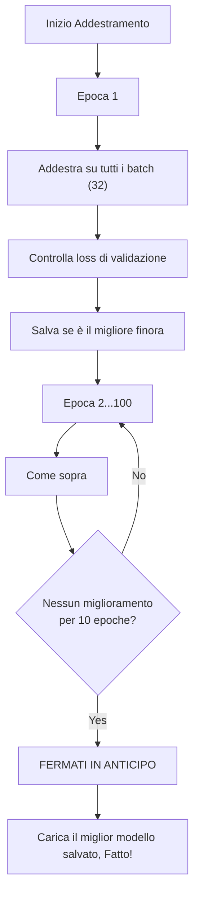

### -ModelFactory e Persistenza

**ModelFactory** (`factory.py`) fornisce un'istanziazione unificata del modello:

| Tipo Costante                    | Classe Modello          | Nome Checkpoint      | Impostazioni predefinite di fabbrica                   |
| -------------------------------- | ----------------------- | -------------------- | ------------------------------------------------------ |
| `TYPE_LEGACY` ("default")      | `TeacherRefinementNN` | `"latest"`         | `input_dim=METADATA_DIM(25)`, `output_dim=OUTPUT_DIM(25)`, `hidden_dim=HIDDEN_DIM(128)` |
| `TYPE_JEPA` ("jepa")           | `JEPACoachingModel`   | `"jepa_brain"`     | `input_dim=METADATA_DIM(25)`, `output_dim=OUTPUT_DIM(25)`       |
| `TYPE_VL_JEPA` ("vl-jepa")     | `VLJEPACoachingModel` | `"vl_jepa_brain"`  | `input_dim=METADATA_DIM(25)`, `output_dim=OUTPUT_DIM(25)`       |
| `TYPE_RAP` ("rap")             | `RAPCoachModel`       | `"rap_coach"`      | `metadata_dim=METADATA_DIM(25)`, `output_dim=10`   |
| `TYPE_ROLE_HEAD` ("role_head") | `NeuralRoleHead`      | `"role_head"`      | `input_dim=5`, `hidden_dim=32`, `output_dim=5`     |

> **Nota (P1-08):** In una versione precedente, la factory utilizzava `output_dim=4` e `hidden_dim=64` per i modelli legacy, creando un disallineamento con `CoachNNConfig`. Questo è stato corretto: ora `OUTPUT_DIM = METADATA_DIM = 25` e `HIDDEN_DIM = 128` sono allineati sia in `config.py` che in `factory.py`. Il modello RAP mantiene `output_dim=10` (10 probabilità di consiglio). Il modello RAP viene importato dal percorso canonico `backend/nn/experimental/rap_coach/model.py` (il vecchio `backend/nn/rap_coach/model.py` è uno shim di reindirizzamento).
>
> **StaleCheckpointError:** Se le dimensioni di un checkpoint salvato non corrispondono alla configurazione corrente del modello (ad esempio dopo un aggiornamento da `output_dim=4` a `output_dim=25`), il sistema solleva `StaleCheckpointError` anziché caricare silenziosamente pesi incompatibili, prevenendo corruzioni silenziose.

> **Analogia:** La ModelFactory è come una **fabbrica di giocattoli** che può costruire cinque diversi tipi di robot. Gli dici "Voglio un robot JEPA" o "Mi serve un robot role_head" e lui sa esattamente quali parti usare e come assemblarlo. Ogni robot ha un'etichetta con il nome (nome del checkpoint) in modo da poterlo trovare in seguito sullo scaffale. Invece di ricordare come è costruito ogni robot, ti basta dire alla fabbrica "costruiscimi un jepa" e lei si occuperà di tutto.

**Persistenza** (`persistence.py`): Salva/carica con `weights_only=True` (sicurezza), catena di fallback elegante (specifica dell'utente → globale → salta), gestione delle dimensioni non corrispondenti.

> **Analogia:** La persistenza è come **salvare i progressi di un videogioco**. Dopo l'addestramento, lo "stato cerebrale" del modello (tutti i pesi appresi) viene salvato in un file `.pt`. Quando riavvii l'app, carica il cervello salvato invece di ripartire da zero. Il flag `weights_only=True` è una misura di sicurezza, come caricare solo i file di salvataggio creati da te, non quelli casuali presi da internet che potrebbero contenere virus. La catena di fallback significa: "Per prima cosa, prova a caricare il TUO cervello salvato personale. Se non esiste, prova quello predefinito. Se nemmeno quello esiste, ricomincia da capo". E se la forma del cervello cambia (ad esempio aggiungendo nuove funzionalità), gestisce la discrepanza in modo fluido invece di bloccarsi.

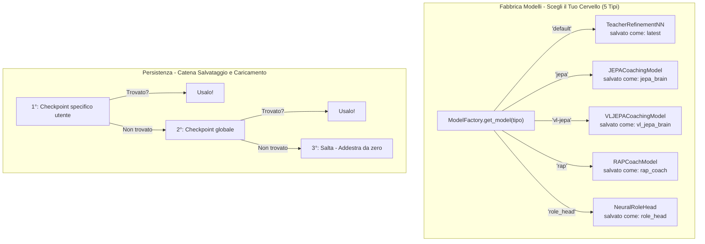

### -Configurazione (`config.py`)

```python
GLOBAL_SEED = 42                    # Riproducibilità globale (AR-6, P1-02)
INPUT_DIM = METADATA_DIM = 25      # Vettore canonico a 25 dimensioni (era 19, era legacy 12)
OUTPUT_DIM = METADATA_DIM = 25     # P1-08: Allineato con METADATA_DIM (era 4, conflitto corretto)
HIDDEN_DIM = 128                   # Dimensione nascosta per AdvancedCoachNN / TeacherRefinementNN
BATCH_SIZE = 32
LEARNING_RATE = 0.001
EPOCHS = 50
RAP_POSITION_SCALE = 500.0         # P9-01: Fattore di scala per delta posizione ([-1,1] → unità mondo)
```

> **Nota:** `INPUT_DIM` è importato da `feature_engineering/__init__.py` dove `METADATA_DIM = 25`. `OUTPUT_DIM` è ora allineato a `METADATA_DIM = 25` (correzione P1-08 — precedentemente era 4, creando un conflitto con il modello). `RAP_POSITION_SCALE = 500.0` è il fattore canonico per convertire gli output normalizzati del modello RAP in spostamenti nelle unità mondo CS2.

> **Analogia:** Questa è la **pagina delle impostazioni** per il cervello dell'IA. Proprio come un videogioco ha impostazioni per volume, luminosità e difficoltà, la rete neurale ha impostazioni per quante feature leggere (25), quanti punteggi produrre (25 per il modello base — uno per ogni feature — e 10 per RAP), quanti esempi studiare contemporaneamente (32 — la dimensione del batch), quanto velocemente apprende (0.001 — la velocità di apprendimento, come il selettore di velocità su un tapis roulant) e quante volte rivedere tutti i dati (50 epoche). Il `GLOBAL_SEED = 42` garantisce che ogni esecuzione di addestramento sia riproducibile — stesso seme, stessi risultati — tramite `set_global_seed()` che imposta random, numpy, torch e CUDA. Queste impostazioni sono scelte con cura: un apprendimento troppo rapido fa sì che il modello "vada oltre" e non si stabilizzi mai; troppo lento, ci vuole un'eternità.

**Gestione dispositivi:** `get_device()` implementa una **selezione GPU intelligente a 3 livelli**:

1. **Override utente:** Se configurato `CUDA_DEVICE` (es. "cuda:0" o "cpu"), usa quello
2. **GPU discreta automatica:** `_select_best_cuda_device()` enumera tutti i dispositivi CUDA e seleziona quello con più VRAM, **penalizzando le GPU integrate** (Intel UHD, Iris) tramite keyword matching. Su sistemi multi-GPU (es. Intel UHD + NVIDIA GTX 1650), la GPU discreta vince sempre
3. **Fallback CPU:** Se nessuna GPU CUDA è disponibile

Dimensionamento batch basato sull'intensità ML: `Alto=128`, `Medio=32`, `Basso=8`. Il ritardo di throttling tra batch si adatta: `Alto=0.0s`, `Medio=0.05s`, `Basso=0.2s`.

> **Analogia:** Il gestore dispositivi verifica: "Ho un motore turbo (GPU/CUDA) disponibile o devo usare il motore standard (CPU)?". La nuova logica di selezione è come un **concierge di noleggio auto** che, quando ci sono più auto disponibili (multiple GPU), sceglie automaticamente quella più potente e ignora le utilitarie. Se hai una GTX 1650 e una Intel UHD integrata, il sistema sa che la GTX è la "sportiva" e la sceglie. In caso contrario, passa alla CPU, che è più lenta ma comunque funzionante.

### -NeuralRoleHead (MLP per la classificazione dei ruoli)

Definito in `role_head.py` (~309 righe). Un MLP leggero che prevede le probabilità di ruolo dei giocatori in base a 5 parametri di stile di gioco, operando come **opinione secondaria** insieme all'euristica `RoleClassifier`. La logica di consenso in `role_classifier.py` unisce entrambe le opinioni per produrre la classificazione finale.

> **Analogia:** NeuralRoleHead è come un **quiz a sorpresa**: pone solo 5 domande su come giochi ("Quanto spesso sopravvivi ai round?", "Quanto spesso ottieni la prima uccisione?", "Quanto spesso le tue morti vengono scambiate?", "Quanto sei influente?", "Quanto sei aggressivo?") e indovina istantaneamente il tuo ruolo in meno di un millisecondo. Funziona insieme al normale classificatore di ruoli (che utilizza regole di soglia), come due insegnanti che valutano lo stesso studente in modo indipendente, per poi confrontare le loro valutazioni. Se entrambi sono d'accordo, la fiducia aumenta. In caso di disaccordo, l'opinione neurale vince se è chiaramente più sicura.

**Architettura:**

```
Input (5 caratteristiche) → Linear(5, 32) → LayerNorm(32) → ReLU
→ Linear(32, 16) → ReLU
→ Linear(16, 5) → Softmax → 5 probabilità di ruolo
```

~750 parametri apprendibili. Costo di calcolo minimo, adatto per l'inferenza per partita.

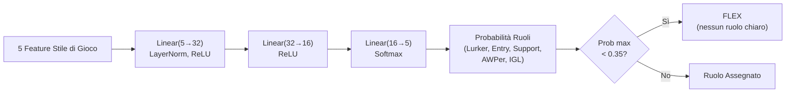

**Caratteristiche di input (5 dimensioni):**

| \# | Caratteristica   | Sorgente                            | Intervallo | Significato                                                       |
| -- | ---------------- | ----------------------------------- | ---------- | ----------------------------------------------------------------- |
| 0  | TAPD             | `rounds_survived / rounds_played` | [0, 1]     | Tasso di sopravvivenza — più alto = più passivo/di supporto    |
| 1  | OAP              | `entry_frags / rounds_played`     | [0, 1]     | Aggressività iniziale — più alta = fragger in entrata          |
| 2  | PODT             | `was_traded_ratio`                | [0, 1]     | Percentuale di morti scambiate — più alta = scambiate/innescate |
| 3  | rating_impact    | `impact_rating` o HLTV 2.0        | float      | Impatto complessivo sui round                                     |
| 4  | aggression_score | `positional_aggression_score`     | float      | Tendenza alla posizione avanzata                                  |

**Ruoli di output (softmax a 5 dimensioni):**

| Indice | Ruolo         | Descrizione                                          |
| ------ | ------------- | ---------------------------------------------------- |
| 0      | LURKER        | Si nasconde dietro le linee nemiche                  |
| 1      | ENTRY_FRAGGER | Primo ad entrare, affronta i duelli iniziali         |
| 2      | SUPPORT       | Ancoraggio del sito, utilizzo delle utilità, scambi |
| 3      | AWPER         | Specialista cecchino                                 |
| 4      | IGL           | Leader in gioco, responsabile tattico                |

**Soglia FLEX:** Se `max(probabilità) < 0,35`, il giocatore è classificato come **FLEX** (versatile, nessun ruolo dominante). Questo impedisce al modello di forzare un ruolo quando il giocatore è davvero un generalista.

**Dettagli addestramento:**

| Aspetto                               | Valore                                                                                                  |
| ------------------------------------- | ------------------------------------------------------------------------------------------------------- |
| **Sconfitta**                   | `KLDivLoss(reduction="batchmean")` sulle previsioni log-softmax rispetto ai target soft label         |
| **Smussamento delle etichette** | ε = 0,02 (impedisce log(0), aggiunge la regolarizzazione)                                              |
| **Ottimizzatore**               | AdamW (lr=1e-3, weight_decay=1e-4)                                                                      |
| **Arresto anticipato**          | Pazienza = 15 epoche sulla perdita di convalida                                                         |
| **Epoche massime**              | 200                                                                                                     |
| **Suddivisione Train/Val**      | 80/20 casuale (dati trasversali, non sequenziali)                                                       |
| **Campioni minimi**             | 20 (dalla tabella `Ext_PlayerPlaystyle`)                                                              |
| **Fonte dati**                  | `cs2_playstyle_roles_2024.csv` → Tabella DB `Ext_PlayerPlaystyle`                                  |
| **Normalizzazione**             | Media/std per funzionalità calcolata al momento dell'addestramento, salvata in `role_head_norm.json` |

**Consenso con classificatore euristico** (`role_classifier.py`):

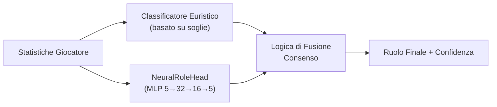

- **Entrambi d'accordo** → fiducia aumentata di +0,10
- **In disaccordo, margine neurale > 0,1** → vince l'opinione neurale
- **In disaccordo, margine neurale ≤ 0,1** → vince l'opinione euristica
- **Neural non disponibile** (nessun checkpoint o norm_stats) → solo euristica
- **Protezione cold-start** → restituisce FLEX con 0% di confidenza se le soglie non sono state apprese

### -Coach Introspection Observatory

**File:** `training_callbacks.py`, `tensorboard_callback.py`, `maturity_observatory.py`, `embedding_projector.py`

L'Osservatorio è un'**architettura di plugin a 4 livelli** che strumenta il ciclo di addestramento senza modificare il codice di addestramento principale. Monitora i segnali neurali dell'allenatore durante l'allenamento e li traduce in stati di maturità interpretabili dall'uomo, consentendo a sviluppatori e operatori di capire se il modello è confuso, in fase di apprendimento o pronto per la produzione.

> **Analogia:** L'Osservatorio è come un **sistema di pagelle per il cervello dell'allenatore**. Mentre l'allenatore studia (allenamento), l'Osservatorio verifica costantemente: "Questo cervello è confuso (DUBBIO)? Ha semplicemente dimenticato tutto ciò che ha imparato (CRISI)? Sta diventando più intelligente (APPRENDIMENTO)? Sta prendendo decisioni giuste con sicurezza (CONVINZIONE)? È completamente maturo (MATURO)?" È come avere un consulente scolastico che controlla i voti, la coerenza nei compiti, i punteggi dei test e il comportamento dello studente, e scrive un rapporto di sintesi dopo ogni lezione. Se la penna del consulente si rompe (errore di callback), questi si limita a scrollare le spalle e ad andare avanti: lo studente continua a studiare senza interruzioni.

**Architettura a 4 livelli:**

| Livello                  | File                        | Scopo                                  | Output chiave                                                                         |
| ------------------------ | --------------------------- | -------------------------------------- | ------------------------------------------------------------------------------------- |
| 1.**Callback ABC** | `training_callbacks.py`   | Interfaccia plugin + registro dispatch | `TrainingCallback` ABC, `CallbackRegistry.fire()`                                 |
| 2.**TensorBoard**  | `tensorboard_callback.py` | Registrazione scalare + istogramma     | Oltre 9 segnali scalari, istogrammi parametri/grad, istogrammi gate/credenza/concetto |
| 3.**Maturità**    | `maturity_observatory.py` | Macchina a stati di convinzione        | 5 segnali →`conviction_index` → 5 stati di maturità                              |
| 4.**Embedding**    | `embedding_projector.py`  | Proiezione credenza/concetto UMAP      | Figure UMAP 2D interattive (degrado graduale se umap-learn non è installato)         |

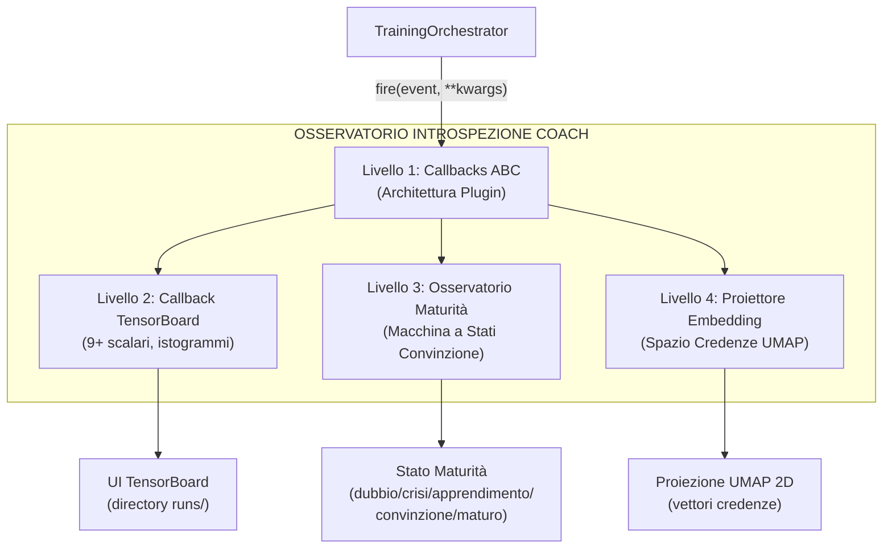

**Maturity State Machine:**

Il `MaturityObservatory` calcola un **indice di convinzione** composito da 5 segnali neurali, lo livella con EMA (α=0,3) e classifica il modello in uno dei 5 stati di maturità:

```mermaid
stateDiagram-v2
    [*] --> DUBBIO
    DUBBIO --> APPRENDIMENTO : convinzione > 0.3 & in aumento
    DUBBIO --> CRISI : era sicuro, caduta > 20%
    APPRENDIMENTO --> CONVINZIONE : convinzione > 0.6, std < 0.05 per 10 epoche
    APPRENDIMENTO --> DUBBIO : convinzione scende sotto 0.3
    APPRENDIMENTO --> CRISI : caduta 20% dal max mobile
    CONVINZIONE --> MATURO : convinzione > 0.75, stabile 20+ epoche,\nvalue_accuracy > 0.7, gate_spec > 0.5
    CONVINZIONE --> CRISI : caduta 20% dal max mobile
    MATURO --> CRISI : caduta 20% dal max mobile
    CRISI --> APPRENDIMENTO : convinzione recupera > 0.3
    CRISI --> DUBBIO : convinzione rimane < 0.3
```

**5 Segnali di Maturità:**

| Segnale                 | Peso | Intervallo | Cosa Misura                                                                     | Fonte                                        |
| ----------------------- | ---- | ---------- | ------------------------------------------------------------------------------- | -------------------------------------------- |
| `belief_entropy`      | 0,25 | [0, 1]     | Entropia di Shannon del vettore di credenza a 64 dim (più basso = più sicuro) | `model._last_belief_batch`                 |
| `gate_specialization` | 0,25 | [0, 1]     | `1 - mean_gate_activation` (più alto = esperti più specializzati)           | `SuperpositionLayer.get_gate_statistics()` |
| `concept_focus`       | 0,20 | [0, 1]     | `1 - entropy(concept_embedding_norms)` (entropia più bassa = focalizzato)    | `model.concept_embeddings`                 |
| `value_accuracy`      | 0,20 | [0, 1]     | `1 - (val_loss / initial_val_loss)` (più alto = migliore calibrazione)       | Ciclo di convalida                           |
| `role_stability`      | 0,10 | [0, 1]     | Coerenza della convinzione nelle epoche recenti (`1 - std*5`)                 | Cronologia autoreferenziale                  |

**Formula di convinzione:**

```
indice_convinzione = 0,25 × (1 - entropia_credenza)
+ 0,25 × specializzazione_gate
+ 0,20 × focus_concetto
+ 0,20 × accuratezza_valore
+ 0,10 × stabilità_ruolo

punteggio_maturità = EMA(indice_convinzione, α=0,3)
```

**Soglie di stato:**

| Stato                   | Condizione                                                                                                  |
| ----------------------- | ----------------------------------------------------------------------------------------------------------- |
| **DUBBIO**        | `conviction < 0,3`                                                                                        |
| **CRISI**         | `conviction` scende > 20% dal massimo mobile entro 5 epoche                                               |
| **APPRENDIMENTO** | `conviction ∈ [0,3, 0,6]` e in aumento                                                                   |
| **CONVICTION**    | `conviction > 0,6`, stabile (`std < 0,05` su 10 epoche)                                                 |
| **MATURE**        | `conviction > 0,75`, stabile per oltre 20 epoche, `value_accuracy > 0,7`, `gate_specialization > 0,5` |

**`MaturitySnapshot` dataclass:** Ogni epoca, l'Osservatorio produce un'istantanea immutabile:

| Campo | Tipo | Descrizione |
|---|---|---|
| `epoch` | int | Numero dell'epoca |
| `timestamp` | datetime | Momento della registrazione |
| `belief_entropy` | float | Entropia di Shannon del vettore credenze |
| `gate_specialization` | float | Specializzazione degli esperti |
| `concept_focus` | float | Focalizzazione sui concetti di coaching |
| `value_accuracy` | float | Accuratezza delle predizioni di valore |
| `role_stability` | float | Stabilità della classificazione dei ruoli |
| `conviction_index` | float | Indice composito pesato |
| `maturity_score` | float | Punteggio EMA livellato (α=0.3) |
| `state` | str | Stato corrente (DUBBIO/CRISI/APPRENDIMENTO/CONVINZIONE/MATURO) |

**Estrazione dei 5 segnali neurali — come vengono calcolati:**

| Segnale | Metodo | Fonte dati | Calcolo |
|---|---|---|---|
| `belief_entropy` | `_compute_belief_entropy()` | `model._last_belief_batch` | softmax(belief) → Shannon entropy / log(dim) → 1 - normalizzata |
| `gate_specialization` | `_compute_gate_specialization()` | `strategy.superposition.get_gate_statistics()` | `1 - mean_activation` (più alto = esperti più specializzati) |
| `concept_focus` | `_compute_concept_focus()` | `model.concept_embeddings.weight` | norme L2 → softmax → `1 - entropy` (più basso = più focalizzato) |
| `value_accuracy` | `_compute_value_accuracy()` | Ciclo di validazione | `1 - (val_loss / initial_val_loss)`, clamped [0, 1] |
| `role_stability` | `_compute_role_stability()` | Cronologia recente | `1 - std(ultimi 10 conviction_index) × 5`, clamped [0, 1] |

**API pubblica:** `current_state` (proprietà → stringa stato), `current_conviction` (proprietà → float), `get_timeline()` (→ lista di `MaturitySnapshot` per esportazione/grafici).

**Integrazione TensorBoard:** Ogni `on_epoch_end()` registra **7 scalari** su TensorBoard:

```
maturity/belief_entropy, maturity/gate_specialization, maturity/concept_focus,
maturity/value_accuracy, maturity/role_stability,
maturity/conviction_index, maturity/maturity_score
```

Più un log testuale dello stato corrente via logger strutturato.

> **Analogia estesa:** Ogni segnale misura un aspetto diverso della "salute mentale" del modello. L'`entropia delle credenze` è come chiedere "Il tuo cervello è sicuro o confuso?". La `specializzazione del gate` è "I tuoi esperti hanno ruoli chiari o fanno tutti la stessa cosa?". Il `focus sui concetti` è "Stai usando i 16 vocaboli di coaching in modo distinto o li confondi?". L'`accuratezza del valore` è "Le tue stime di vantaggio corrispondono alla realtà?". La `stabilità dei ruoli` è "Cambi continuamente idea o sei coerente?". L'indice di convinzione combina tutto questo in un unico "voto di salute" e l'EMA lo livella per evitare oscillazioni — come un medico che non si allarma per un singolo battito anomalo ma guarda la tendenza.

**Garanzie di progettazione:**

- **Impatto zero se disabilitato:** Quando non vengono registrate callback, tutte le chiamate `CallbackRegistry.fire()` sono no-op. Nessuna allocazione di memoria, nessun overhead di calcolo.
- **Isolamento degli errori:** Ogni callback è sottoposto individualmente a try/except-wrapping. Un errore di scrittura di TensorBoard o di calcolo UMAP non causa mai l'arresto anomalo del ciclo di training: l'errore viene registrato e il training continua.
- **Componibile:** È possibile aggiungere nuove callback sottoclassando `TrainingCallback` e registrandosi con `CallbackRegistry.add()`. Non è necessario modificare il codice di training.

**Integrazione CLI:** Avviato tramite `run_full_training_cycle.py` con i flag:

- `--no-tensorboard` — disabilita il callback di TensorBoard
- `--tb-logdir <percorso>` — imposta la directory di log di TensorBoard (predefinito: `runs/`)
- `--umap-interval <N>` — proiezione UMAP ogni N epoche (predefinito: 10)

  ---

  ## 4. Sottosistema 2 — Modello RAP Coach

  **Directory canonico:** `backend/nn/experimental/rap_coach/` (il vecchio percorso `backend/nn/rap_coach/` è uno shim di reindirizzamento)
  **File:** `model.py`, `perception.py`, `memory.py`, `strategy.py`, `pedagogy.py`, `communication.py`, `skill_model.py`, `trainer.py`, `chronovisor_scanner.py`

  Il RAP (Reasoning, Adaptation, Pedagogy) Coach è un'**architettura profonda con 6 componenti neurali apprendibili + 1 livello di comunicazione esterna**, appositamente progettata per il coaching CS2 in condizioni di osservabilità parziale (condizioni POMDP). La classe `RAPCoachModel` contiene Percezione (`RAPPerception`), Memoria (`RAPMemory` con LTC+Hopfield), Strategia (`RAPStrategy`), Pedagogia (`RAPPedagogy` con Value Critic e Skill Adapter), Attribuzione Causale (`CausalAttributor`) e una Testa di Posizionamento (`nn.Linear(256→3)`), tutti apprendibili. Il livello di Comunicazione (`communication.py`) opera esternamente come selettore di template di post-elaborazione. Il forward pass produce 6 output: `advice_probs`, `belief_state`, `value_estimate`, `gate_weights`, `optimal_pos` e `attribution`.


  > **Analogia:** L'allenatore RAP è il **cervello più avanzato** del sistema: immaginalo come un edificio di 7 piani in cui ogni piano ha un compito specifico. Il piano 1 (Percezione) è costituito dagli **occhi**: osserva le immagini della mappa, la visuale del giocatore e gli schemi di movimento. Il piano 2 (Memoria) è l'**ippocampo**: ricorda cosa è successo prima nel round e lo collega a round simili precedenti tramite rete LTC + Hopfield. Il piano 3 (Strategia) è la **stanza decisionale**: decide quali consigli dare tramite 4 esperti MoE. Il piano 4 (Pedagogia) è l'**ufficio dell'insegnante**: stima il valore della situazione con il Value Critic. Il piano 5 (Attribuzione Causale) è il **detective**: capisce PERCHÉ qualcosa è andato storto, suddividendo la colpa in 5 categorie. Il piano 6 (Posizionamento) è il **GPS**: calcola dove avrebbe dovuto trovarsi il giocatore con un `nn.Linear(256→3)` che predice `(dx, dy, dz)`. Il piano 7 (Comunicazione) è il **portavoce**: traduce tutto in semplici consigli leggibili, operando come post-elaborazione esterna. La parte "POMDP" significa che l'allenatore deve lavorare con **informazioni incomplete**: non può vedere l'intera mappa, proprio come un giocatore. È come allenare una squadra di calcio dagli spalti quando metà campo è coperto dalla nebbia.
  >

```mermaid
flowchart BT
    L1["Livello 1: PERCEZIONE (Gli Occhi)<br/>Vedo la mappa, la vista e il movimento"]
    L2["Livello 2: MEMORIA (L'Ippocampo)<br/>LTC + Hopfield: ricordo e associo"]
    L3["Livello 3: STRATEGIA (La Sala Decisioni)<br/>4 esperti MoE: Spingere/Tenere/Ruotare/Utilità?"]
    L4["Livello 4: PEDAGOGIA (Value Critic)<br/>Quanto è buona questa situazione?"]
    L5["Livello 5: ATTRIBUZIONE CAUSALE (Il Detective)<br/>PERCHÉ è andato storto? 5 possibili motivi"]
    L6["Livello 6: POSIZIONAMENTO (Il GPS)<br/>Dove avresti dovuto stare? Linear(256→3)"]
    L7["Livello 7: COMUNICAZIONE (Il Portavoce)<br/>Traduce la strategia in linguaggio umano"]
    L1 -->|"I dati fluiscono VERSO L'ALTO"| L2 --> L3 --> L4 --> L5 --> L6 --> L7
```

```mermaid
graph TB
    subgraph L1P["Livello 1: Percezione"]
        VIEW["Tensore Vista<br/>3x64x64"] --> RN1["ResNet Ventrale<br/>[1,2,2,1] blocchi, 64-dim"]
        MAP["Tensore Mappa<br/>3x64x64"] --> RN2["ResNet Dorsale<br/>[2,2] blocchi, 32-dim"]
        MOTION["Tensore Movimento<br/>3x64x64"] --> CONV["Stack Conv, 32-dim"]
        RN1 --> CAT["Concatena, 128-dim"]
        RN2 --> CAT
        CONV --> CAT
    end
    CAT --> |"128-dim +<br/>25-dim metadati<br/>= 153-dim"| MEM
    subgraph L2M["Livello 2: Memoria"]
        MEM["Cella LTC<br/>(AutoNCP 288 unità)"] --> HOP["Hopfield<br/>Memoria Associativa<br/>(4 teste, 256-dim)"]
        HOP --> BELIEF["Testa Credenze<br/>Linear 256-256, SiLU, Linear 256-64"]
    end
    BELIEF --> STRAT
    subgraph L3S["Livello 3: Strategia"]
        STRAT["4 Esperti MoE<br/>(SuperpositionLayer + ReLU + Linear)"] --> GATE["Gate Softmax<br/>Linear 256 a 4"]
        GATE --> ADV["10-dim Consigli<br/>Probabilità"]
    end
    BELIEF --> PED
    subgraph L4P["Livello 4: Pedagogia"]
        PED["Critico Valore<br/>Linear 256-64, ReLU, Linear 64-1"] --> ATTR["Attributore Causale"]
        ATTR --> |"attribuzione[5]"| CONCEPTS["Posizionamento, Placement Mirino<br/>Aggressività, Utilità, Rotazione"]
    end
    BELIEF --> POS
    subgraph L5PO["Livello 5: Posizionamento"]
        POS["Linear 256 a 3"] --> XYZ["Posizione Ottimale<br/>Delta (dx, dy, dz)"]
    end
    subgraph L6C["Livello 6: Comunicazione"]
        ADV --> COMM["Selettore Template<br/>(basato su skill-tier)"]
        CONCEPTS --> COMM
        COMM --> MSG["Stringa Consigli<br/>Leggibile"]
    end
    style MEM fill:#be4bdb,color:#fff
    style STRAT fill:#f76707,color:#fff
    style PED fill:#20c997,color:#fff
```

### -Livello di percezione (`perception.py`)

Un front-end **convoluzionale a tre flussi** che elabora gli input visivi:

| Input                                | Forma         | Backbone                                                | Output Dim       |
| ------------------------------------ | ------------- | ------------------------------------------------------- | ---------------- |
| **Tensore di visualizzazione** | `3×64×64` | Flusso ventrale ResNet: [1,2,2,1] blocchi, 3→64 canali | **64-dim** |
| **Tensore di mappa**           | `3×64×64` | Flusso dorsale ResNet: [2,2] blocchi, 3→32 canali      | **32-dim** |
| **Tensore di movimento**       | `3×64×64` | Conv(3→16→32) + MaxPool + AdaptiveAvgPool             | **32-dim** |

I tre vettori di caratteristiche sono concatenati in un singolo **embedding di percezione a 128 dimensioni** (64 + 32 + 32).

> **Analogia:** Il Livello di Percezione è come i **tre diversi paia di occhiali** dell'allenatore. La prima coppia (tensore di vista / flusso ventrale) mostra **ciò che il giocatore vede** – la sua prospettiva in prima persona, elaborata attraverso una ResNet leggera a 5 blocchi (configurazione `[1,2,2,1]`, calibrata per input 64×64) che estrae 64 caratteristiche importanti dall'immagine. La seconda coppia (tensore di mappa / flusso dorsale) mostra il **radar/minimappa aerea** – dove si trovano tutti – elaborato attraverso una rete più semplice a 3 blocchi in 32 caratteristiche. La terza coppia (tensore di movimento) mostra **chi si sta muovendo e con quale velocità** – come la sfocatura del movimento in una foto – elaborata in altre 32 caratteristiche. Quindi tutte e tre le viste vengono **incollate insieme** in un unico riepilogo di 128 numeri: "Ecco tutto ciò che riesco a vedere in questo momento". Questo processo trae ispirazione dal modo in cui il cervello umano elabora la vista: il flusso ventrale riconosce "cosa" sono le cose, mentre il flusso dorsale traccia "dove" si trovano le cose.

```mermaid
flowchart TB
    VIEW["TENSORE VISTA<br/>(Cosa vedi - FPS)<br/>3x64x64 px"] --> RND["ResNet Leggero<br/>(5 blocchi [1,2,2,1])"]
    MAP["TENSORE MAPPA<br/>(Dove sono tutti?)<br/>3x64x64 px"] --> RNL["ResNet Leggero<br/>(4 blocchi)"]
    MOTION["TENSORE MOVIMENTO<br/>(Chi si sta muovendo?)<br/>3x64x64 px"] --> CS["Stack Conv<br/>(3 livelli)"]
    RND --> D64["64-dim"]
    RNL --> D32A["32-dim"]
    CS --> D32B["32-dim"]
    D64 --> PE["Embedding Percezione 128-dim<br/>Tutto ciò che posso vedere ora"]
    D32A --> PE
    D32B --> PE
```

I blocchi ResNet utilizzano **scorciatoie di identità** con downsample apprendibile (Conv1×1 + BatchNorm) quando stride ≠ 1 o il conteggio dei canali cambia. **24 livelli di convoluzione** su tutti e tre i flussi:

| Flusso                     | Configurazione blocco                | Blocchi | Conv/Blocco | Conversioni scorciatoie | Totale       |
| -------------------------- | ------------------------------------ | ------- | ----------- | ----------------------- | ------------ |
| **Vista (Ventrale)** | `[1,2,2,1]` → 1 + 5 = 6 blocchi  | 6       | 2           | 1 (primo blocco)        | **13** |
| **Mappa (Dorsale)**  | `[2,2]` → 1 + 3 = 4 blocchi       | 4       | 2           | 1 (primo blocco)        | **9**  |
| **Movimento**        | Stack di conversione (2 livelli)     | —      | —          | —                      | **2**  |
| **Totale**           |                                      |         |             |                         | **24** |

> **Come funziona** `_make_resnet_stack`: Crea 1 blocco iniziale con `stride=2` (per il downsampling spaziale), quindi `sum(num_blocks) - 1` blocchi aggiuntivi con `stride=1`. Ogni `ResNetBlock` ha 2 livelli Conv2d (kernel 3×3). Il primo blocco riceve anche una scorciatoia Conv1×1 perché i canali di input (3) sono diversi dai canali di output (64 o 32).

> **Nota sulla scelta architettonica (F3-29):** La configurazione originale `[3,4,6,3]` (15 blocchi, 33 conv nel flusso ventrale) era progettata per input 224×224 (la dimensione standard di ImageNet). Per input 64×64 come quelli utilizzati in questo progetto, le feature map collasserebbero spazialmente dopo il primo blocco stride-2, rendendo i blocchi successivi ridondanti. La configurazione `[1,2,2,1]` (5 blocchi effettivi) è calibrata specificamente per la risoluzione di training 64×64, con `AdaptiveAvgPool2d` che gestisce qualsiasi risoluzione spaziale residua. Eventuali checkpoint precedenti vengono automaticamente rilevati come `_stale_checkpoint` da `load_nn()`.

> **Analogia:** Le scorciatoie di identità sono come gli **ascensori di un edificio**: consentono alle informazioni di saltare i piani e di passare direttamente dai livelli iniziali a quelli successivi. Senza di esse, le informazioni dovrebbero salire molte rampe di scale e, una volta raggiunta la cima, il segnale originale sarebbe così sbiadito che la rete non potrebbe apprendere. Le scorciatoie garantiscono che anche in una rete profonda, i gradienti (i segnali di apprendimento) possano fluire in modo efficiente. Questo è lo stesso trucco che ha reso possibile il moderno deep learning, inventato da Kaiming He nel 2015. La scelta di una rete più compatta (`[1,2,2,1]` anziché `[3,4,6,3]`) è come scegliere un edificio di 6 piani anziché 16 quando il terreno disponibile (64×64 pixel) è piccolo: meno piani significano meno ascensori necessari, ma il trasporto rimane ugualmente efficiente.

### -Livello di memoria (`memory.py`) — LTC + Hopfield

Questa parte affronta la sfida fondamentale che il CS2 coach è un **Processo decisionale di Markov parzialmente osservabile** (POMDP).

> **Analogia:** POMDP è un modo elegante per dire **"non puoi vedere tutto".** In CS2, non sai dove si trovano tutti i nemici: vedi solo ciò che hai di fronte. È come giocare a scacchi con una coperta su metà della scacchiera. Il compito del Livello di memoria è **ricordare e indovinare**: tiene traccia di ciò che è accaduto in precedenza nel round e usa quella memoria per riempire gli spazi vuoti su ciò che non può vedere. Dispone di due strumenti speciali per questo: una rete LTC (memoria a breve termine che si adatta alla velocità del gioco) e una rete Hopfield (ricerca di pattern a lungo termine che dice "questa situazione mi ricorda qualcosa che ho già visto").

**Rete a costante di tempo liquida (LTC) con cablaggio AutoNCP:**

- Input: 153 dim (128 percezione + 25 metadati)
- Unità NCP: 288 (hidden_dim 256 + 32 interneuroni)
- Output: stato nascosto a 256 dim
- Utilizza la libreria `ncps` con pattern di connettività sparsi, simili a quelli del cervello
- Adatta la risoluzione temporale al ritmo del gioco (impostazioni lente vs. scontri a fuoco rapidi)

> **Analogia:** La rete LTC è come un **cervello vivo e respirante**: a differenza delle normali reti neurali che elaborano il tempo a intervalli fissi (come un orologio che ticchetta ogni secondo), la LTC adatta la sua velocità a ciò che accade. Durante una lenta preparazione (i giocatori camminano silenziosamente), l'elaborazione avviene al rallentatore. Durante uno scontro a fuoco veloce, accelera, come il battito cardiaco accelerato quando si è eccitati. Il "cablaggio AutoNCP" fa sì che le connessioni tra i neuroni siano sparse e strutturate come in un vero cervello: non tutto si collega a tutto il resto. Questo è più efficiente e biologicamente più realistico.

**Memoria associativa di Hopfield:**

- Input/Output: 256-dim
- Teste: 4
- Utilizza `hflayers.Hopfield` come **memoria indirizzabile tramite contenuto** per il recupero dei round prototipo

> **Analogia:** La memoria di Hopfield è come un **album fotografico di giocate famose**. Durante l'allenamento, memorizza i "round prototipo" – schemi classici come "una perfetta ripresa del sito B in Inferno" o "una corsa fallita nel fumo in Dust2". Quando arriva un nuovo momento di gioco, la rete di Hopfield chiede: "Questo mi ricorda qualche foto nel mio album?" Se trova una corrispondenza, recupera il ricordo associato, come un detective della polizia che sfoglia le foto segnaletiche e dice: "Ho già visto questa faccia!". Ha 4 "teste" (teste di attenzione) in modo da poter cercare 4 diversi tipi di schemi contemporaneamente.

```mermaid
flowchart TB
    IN["Input: 153-dim<br/>(128 visione + 25 metadati)"]
    IN --> LTC["Rete LTC (288 unità)<br/>Memoria a breve termine<br/>Si adatta al ritmo di gioco<br/>Cablaggio sparso simile al cervello"]
    LTC -->|"256-dim"| HOP["Memoria Hopfield (4 teste)<br/>Corrispondenza pattern a lungo termine<br/>L'ho già visto prima?<br/>Cerca nell'album fotografico di round prototipo"]
    LTC -->|"256-dim"| ADD["ADD (Residuale)<br/>LTC + Hopfield combinati"]
    HOP -->|"256-dim"| ADD
    ADD -->|"256-dim"| BH["Testa Credenze<br/>256, 256, SiLU, 64<br/>Cosa credo stia accadendo ora?"]
    BH -->|"vettore credenze 64-dim"| OUT["L'intuizione tattica del coach"]
```

**Combinazione residua:** `combined_state = ltc_out + hopfield_out`

> **Analogia:** La combinazione residua è come **chiedere a due consulenti e sommare le loro opinioni**. Il LTC dice "in base a quanto appena accaduto, penso X". L'Hopfield dice "in base al mio ricordo di situazioni simili, penso Y". Invece di sceglierne una, il sistema somma entrambe le opinioni: in questo modo, sia gli eventi recenti che gli schemi storici contribuiscono alla comprensione finale.

**Testo di convinzione:** `Lineare(256→256) → SiLU → Lineare(256→64)` — produce un vettore di convinzione a 64 dimensioni che codifica la comprensione tattica latente dell'allenatore.

**Passaggio in avanti:**

```python
ltc_out, hidden = self.ltc(x, hidden) # x: [B, seq, 153] → [B, seq, 256]
mem_out = self.hopfield(ltc_out) # [B, seq, 256]
combined_state = ltc_out + mem_out # Residuo
belief = self.belief_head(combined_state) # [B, seq, 64]
return combined_state, belief, hidden
```

### -Livello Strategia (`strategy.py`) — Sovrapposizione + MoE

Implementa **SuperpositionLayer** combinato con un mix di esperti contestualizzati:

> **Analogia:** Il Livello Strategia è come una **sala di guerra con 4 generali specializzati**, ognuno esperto in un diverso tipo di situazione. Un generale è bravo nelle spinte aggressive, un altro nelle prese difensive, un altro nelle giocate di utilità e un altro ancora nelle rotazioni. Un "guardiano" (il "gate" softmax) ascolta la situazione attuale e decide quanto fidarsi di ciascun generale: "Siamo in un round eco su Dust2? Il Generale 2 (specialista difensivo) ottiene il 60% del potere, il Generale 4 (utilità) il 30% e gli altri si dividono il resto". Il **Livello di Superposizione** è l'ingrediente segreto: consente a ciascun generale di adattare il proprio pensiero in base al contesto di gioco attuale (mappa, economia, fazione) utilizzando un meccanismo di controllo intelligente.

**SuperpositionLayers** (`layers/superposition.py`): controllo dipendente dal contesto dove `output = F.linear(x, weight, bias) * sigmoid(context_gate(context))`. Un vettore di gate sigmoide condizionato sul contesto **25-dim** (METADATA_DIM completo) maschera selettivamente gli output degli esperti. La perdita di sparsità L1 (`context_gate_l1_weight = 1e-4`) incoraggia un gating sparso e interpretabile. Osservabile: le statistiche del gate (media, standard, sparsità, active_ratio) possono essere tracciate.

> **Nota:** `RAPStrategy.__init__` utilizza `context_dim=25` (METADATA_DIM). La rete di gate è `Linear(hidden_dim=256, num_experts=4) → Softmax(dim=-1)`.

> **Analogia:** Il livello di sovrapposizione è come un **interruttore dimmer per ogni neurone**. Invece di avere ogni neurone sempre completamente acceso, un gate dipendente dal contesto (controllato dalle 25 caratteristiche dei metadati) può attenuare o aumentare la luminosità di ciascuno di essi. Se il contesto dice "questo è un round eco", alcuni neuroni vengono attenuati (non sono rilevanti per i round eco), mentre altri vengono aumentati. La perdita di sparsità L1 è come dire al sistema: "Cerca di usare il minor numero possibile di neuroni: più semplice è la tua spiegazione, meglio è". Questo rende il modello più interpretabile: puoi effettivamente vedere quali gate si attivano in quali situazioni.

```mermaid
flowchart TB
    IN["stato nascosto 256-dim"]
    IN --> E1["Esperto 1<br/>SuperPos, ReLU, Linear"]
    IN --> E2["Esperto 2<br/>SuperPos, ReLU, Linear"]
    IN --> E3["Esperto 3<br/>SuperPos, ReLU, Linear"]
    IN --> E4["Esperto 4<br/>SuperPos, ReLU, Linear"]
    CTX["contesto 25-dim"] -.->|"modula"| E1
    CTX -.->|"modula"| E2
    CTX -.->|"modula"| E3
    CTX -.->|"modula"| E4
    E1 --> GATE["Gate (softmax - somma a 1.0)<br/>0.35 / 0.40 / 0.15 / 0.10"]
    E2 --> GATE
    E3 --> GATE
    E4 --> GATE
    GATE --> OUT["Somma pesata a 10-dim<br/>probabilità consigli"]
```

**4 Moduli Esperti:** Ogni esperto è un `ModuleDict`: `SuperpositionLayer(256→128, context_dim=25) → ReLU → Linear(128→10)`.

**Gate Network:** `Linear(256→4) → Softmax`.

**Output:** Distribuzione di probabilità di consulenza a 10 dimensioni e vettore dei pesi di gate a 4 dimensioni.

### -Livello Pedagogico (`pedagogy.py`) — Valore + Attribuzione

Due sottomoduli:

1. **Value Critic:** `Linear(256→64) → ReLU → Linear(64→1)`. Stima V(s) per l'apprendimento con differenze temporali. **Skill Adapter:** `Linear(10 skill_buckets → 256)` consente stime di valore condizionate dalle abilità.

> **Analogia:** Il Value Critic è come un **commentatore sportivo** che, in qualsiasi momento durante una partita, può dire "In questo momento, questa squadra ha un vantaggio del 72%". Stima V(s) — il "valore" dello stato attuale della partita. L'**Skill Adapter** adatta questa stima in base al livello di abilità del giocatore: un principiante nella stessa posizione di un professionista affronta probabilità molto diverse, quindi la previsione del valore dovrebbe riflettere questo.

1. **CausalAttributor:** Produce un vettore di attribuzione a 5 dimensioni che mappa i concetti di allenamento:

| Indice | Concetto                            | Segnale meccanico                          |
| ------ | ----------------------------------- | ------------------------------------------ |
| 0      | **Posizionamento**            | norm(position_delta)                       |
| 1      | **Posizionamento del mirino** | norm(view_delta)                           |
| 2      | **Aggressione**               | 0,5 × position_delta                      |
| 3      | **Utilità**                  | sigmoid(hidden.mean()) — segnale dinamico |
| 4      | **Rotazione**                 | 0,8 × position_delta                      |

Fusione: `attribuzione = context_weights × mechanical_errors` dove context_weights deriva da `Lineare(256→32) → ReLU → Lineare(32→5) → Sigmoide`.

> **Analogia:** L'attributore causale è il modo in cui l'allenatore risponde alla domanda **"PERCHÉ è andato storto?"** Invece di dire semplicemente "sei morto", suddivide la colpa in 5 categorie, come una pagella scolastica con 5 materie. "Sei morto perché: 45% posizionamento errato, 30% utilizzo inadeguato delle utilità, 15% posizionamento errato del mirino, 5% troppo aggressivo, 5% rotazione errata." Lo fa combinando due segnali: (1) ciò che lo stato nascosto della rete neurale ritiene importante (context_weights, l'intuizione del cervello) e (2) errori meccanici misurabili (quanto lontano dalla posizione ottimale, quanto errato era l'angolo di visione). Moltiplicandoli insieme si ottiene un'attribuzione di colpa basata sia sui dati che sull'intuizione.

```mermaid
flowchart TB
    NH["Stato nascosto neurale"] --> CW["Pesi Contesto (intuizione appresa)<br/>0.45, 0.10, 0.05, 0.30, 0.10"]
    ME["Errori meccanici"] --> ES["Segnali Errore (fatti misurabili)<br/>distanza dalla pos ottimale, errore angolo vista,<br/>livello aggressività, segnale uso utilità,<br/>distanza rotazione"]
    CW -->|moltiplica| AV["vettore attribuzione"]
    ES -->|moltiplica| AV
    AV --> OUT["Posizionamento: 45%, Mirino: 10%,<br/>Aggressività: 5%, Utilità: 30%, Rotazione: 10%"]
    OUT --> VERDICT["Sei morto principalmente a causa di<br/>CATTIVO POSIZIONAMENTO e SCARSO USO UTILITÀ"]
    style VERDICT fill:#ff6b6b,color:#fff
```

### -Modello latente delle abilità (`skill_model.py`)

Scompone le statistiche grezze in 5 assi delle abilità utilizzando la normalizzazione statistica rispetto alle linee di base dei professionisti:

| Asse delle abilità      | Statistiche di input                                                    | Normalizzazione                       |
| ------------------------ | ----------------------------------------------------------------------- | ------------------------------------- |
| **Meccaniche**     | Precisione, avg_hs                                                      | Punteggio Z (μ=pro_mean, σ=pro_std) |
| **Posizionamento** | Valutazione_sopravvivenza, valutazione_kast                             | Punteggio Z                           |
| **Utilità**       | Utility_blind_time, Utility_nemici_accecati                             | Punteggio Z                           |
| **Tempistica**     | Percentuale_vittorie_duello_apertura, Punteggio_aggressione_posizionale | Punteggio Z                           |
| **Decisione**      | Percentuale_vittorie_clutch, Impatto_valutazione                        | Punteggio Z                           |

> **Analogia:** Il modello di abilità crea una **pagella di 5 materie** per ogni giocatore. Ogni materia (Meccanica, Posizionamento, Utilità, Tempismo, Decisione) viene valutata confrontando il giocatore con i professionisti. Il punteggio Z è come chiedere: "Quanto è sopra o sotto la media della classe questo studente?". Un punteggio Z pari a 0 significa "esattamente nella media tra i professionisti". Un punteggio Z pari a -2 significa "molto al di sotto della media - necessita di un duro lavoro". Un punteggio Z pari a +1 significa "sopra la media - sta andando bene". Il sistema converte quindi i punteggi Z in percentili (la percentuale di professionisti in cui sei migliore) e li associa a un livello curriculare da 1 a 10, come i voti scolastici. Uno studente di livello 1 riceve un allenamento adatto ai principianti; uno studente di livello 10 riceve un'analisi tattica avanzata.

```mermaid
flowchart TB
    subgraph INPUT["Statistiche Giocatore vs Baseline Pro"]
        A["precisione: 0.18 vs pro 0.22, z=-0.80, 21%"]
        B["hs_medio: 0.45 vs pro 0.52, z=-0.70, 24%"]
    end
    INPUT --> AVG["Asse meccanica: media 22.5%, Liv 3"]
    subgraph CARD["Pagella 5 Assi"]
        M["MECCANICA<br/>Liv 3"]
        P["POSIZIONAMENTO<br/>Liv 5"]
        U["UTILITÀ<br/>Liv 7"]
        T["TEMPISMO<br/>Liv 4"]
        D["DECISIONI<br/>Liv 6"]
    end
    AVG --> CARD
    CARD --> ENC["Codificato come tensore one-hot<br/>Alimentato all'Adattatore Skill del Livello Pedagogia"]
    style M fill:#ff6b6b,color:#fff
    style P fill:#ffd43b,color:#000
    style U fill:#51cf66,color:#fff
    style T fill:#ff9f43,color:#fff
    style D fill:#4a9eff,color:#fff
```

I punteggi Z vengono convertiti in percentili tramite l'**approssimazione logistica** `1/(1+exp(-1,702z))` (approssimazione CDF rapida), quindi il percentile medio viene mappato a un **livello curriculare** (1–10) tramite `int(avg_skill * 9) + 1`, fissato a [1, 10]. Il livello viene codificato come un tensore one-hot (10-dim) tramite `SkillLatentModel.get_skill_tensor()` per l'adattatore di competenze del livello pedagogico.

### -RAP Trainer (`trainer.py`)

Orchestra il ciclo di addestramento con una **funzione di perdita composita**:

```
L_totale = L_strategia + 0,5 × L_valore + L_sparsità + L_posizione
```

> **Analogia:** La perdita totale è come una **pagella con 4 voti**, ognuno dei quali misura un aspetto diverso delle prestazioni del modello. Il modello cerca di rendere TUTTI e quattro i voti il più bassi possibile (nell'apprendimento automatico, una perdita minore = prestazioni migliori). I pesi (1,0, 0,5, 1e-4, 1,0) indicano l'importance di ogni materia: Strategia e Posizione sono materie a punteggio pieno, Valore è mezzo credito e Scarsità è un credito extra. Il modello non può semplicemente superare una materia e bocciare le altre: deve bilanciarle tutte e quattro.

| Termine di perdita | Formula                                                   | Peso | Scopo                                                            |
| ------------------ | --------------------------------------------------------- | ---- | ---------------------------------------------------------------- |
| `L_strategy`     | `MSELoss(advice_probs, target_strat)`                   | 1.0  | Raccomandazione tattica corretta                                 |
| `L_value`        | `MSELoss(V(s), true_advantage)`                         | 0.5  | Stima accurata del vantaggio                                     |
| `L_sparsity`     | `model.compute_sparsity_loss(gate_weights)` — L1 sui pesi dei gate (parametro esplicito, thread-safe) | 1e-4 | Specializzazione esperta                                         |
| `L_position`     | `MSE(pred_xy, true_xy) + 2.0 × MSE(pred_z, true_z)`    | 1.0  | Posizionamento ottimale,**penalità rigorosa sull'asse Z** |

> **Nota:** Il moltiplicatore 2× sull'asse Z esiste perché gli errori di posizionamento verticale (ad esempio, un livello sbagliato su Nuke/Vertigo) sono tatticamente catastrofici: rappresentano errori di piano sbagliato che nessuna correzione orizzontale può correggere.

> **Analogia:** La penalità sull'asse Z è come un **allarme antincendio per errori di piano sbagliato**. Nelle mappe di CS2 come Nuke (che ha due piani) o Vertigo (un grattacielo), dire a un giocatore di andare al piano sbagliato è un disastro: è come dire a qualcuno di andare in cucina quando intendevi la soffitta. Essere leggermente fuori posizione orizzontale (X/Y) è come essere qualche passo a sinistra o a destra: non eccezionale, ma risolvibile. Essere al piano sbagliato (Z) è come essere in una stanza completamente diversa. Ecco perché gli errori verticali vengono puniti 2 volte più duramente durante l'addestramento: il modello impara rapidamente a "NON suggerire MAI il piano sbagliato".

```mermaid
flowchart LR
    subgraph LOSS["L_totale = L_strategia + 0.5xL_valore + L_sparsità + L_posizione"]
        S["Strategia<br/>Peso: 1<br/><br/>Hai dato<br/>il consiglio giusto?"]
        V["Valore<br/>Peso: 0.5<br/><br/>Hai stimato<br/>il vantaggio corretto?"]
        SP["Sparsità<br/>Peso: 0.0001<br/><br/>Hai usato<br/>pochi esperti?<br/>(semplice = meglio)"]
        P["Posizione<br/>Peso: 1<br/><br/>Hai trovato<br/>il punto giusto?<br/>XY + 2Z"]
    end
    LOSS --> GOAL["Obiettivo: minimizzare TUTTI e quattro, coaching migliore!"]
```

**Output per fase di addestramento:** `{loss, sparsity_ratio, loss_pos, z_error}`.

### -Riepilogo del passaggio in avanti di RAPCoachModel

**Fix NN-39 — Input Visivi Duali:** Il passaggio in avanti gestisce due formati di input visivo attraverso un controllo dimensionale esplicito:

| Formato Input | Shape | Quando si usa | Comportamento |
|---|---|---|---|
| **Per-timestep** | `[B, T, C, H, W]` (5-dim) | Addestramento con sequenze temporali | Ogni timestep elaborato individualmente dalla CNN |
| **Statico** | `[B, C, H, W]` (4-dim) | Inferenza in tempo reale (GhostEngine) | Singolo frame espanso su tutti i timestep |

> **Analogia NN-39:** Immagina di mostrare un filmato al coach. Nel formato **per-timestep**, il coach guarda ogni fotogramma uno per uno, analizzandoli separatamente e costruendo una comprensione che evolve nel tempo — come un arbitro che rivede un'azione al rallentatore, fotogramma per fotogramma. Nel formato **statico**, il coach vede una singola fotografia della situazione e assume che la scena sia rimasta invariata per tutta la durata — come quando si analizza una posizione da una screenshot. Il fix NN-39 garantisce che entrambe le situazioni producano lo stesso formato di output (`[B, T, 128]`), così il resto del cervello (memoria, strategia, pedagogia) funziona identicamente in entrambi i casi.

```python
def forward(view_frame, map_frame, motion_diff, metadata, skill_vec=None):
    batch_size, seq_len, _ = metadata.shape

    # NN-39 fix: supporta input visivo per-timestep [B,T,C,H,W] e statico [B,C,H,W]
    if view_frame.dim() == 5:
        # Per-timestep — elabora ogni timestep attraverso la CNN separatamente
        z_frames = []
        for t in range(view_frame.shape[1]):
            z_t = self.perception(view_frame[:, t], map_frame[:, t], motion_diff[:, t])
            z_frames.append(z_t)
        z_spatial_seq = torch.stack(z_frames, dim=1)      # [B, T, 128]
    else:
        # Statico — singolo frame espanso su tutti i timestep
        z_spatial = self.perception(view_frame, map_frame, motion_diff)  # [B, 128]
        z_spatial_seq = z_spatial.unsqueeze(1).expand(-1, seq_len, -1)   # [B, T, 128]

    lstm_in = cat([z_spatial_seq, metadata], dim=2)        # [B, seq, 153]
    hidden_seq, belief, _ = self.memory(lstm_in)           # [B, seq, 256], [B, seq, 64]
    last_hidden = hidden_seq[:, -1, :]
    prediction, gate_weights = self.strategy(last_hidden, context)  # [B, 10], [B, 4]
    value_v = self.pedagogy(last_hidden, skill_vec)        # [B, 1]
    optimal_pos = self.position_head(last_hidden)          # [B, 3]
    attribution = self.attributor.diagnose(last_hidden, optimal_pos) # [B, 5]
    return {
        "advice_probs": prediction,      # [B, 10]
        "belief_state": belief,          # [B, seq, 64]
        "value_estimate": value_v,       # [B, 1]
        "gate_weights": gate_weights,    # [B, 4]
        "optimal_pos": optimal_pos,      # [B, 3]
        "attribution": attribution       # [B, 5]
    }
```

> **Analogia:** Questa è la **ricetta completa** di come pensa il RAP Coach, passo dopo passo: (1) **Occhi** — il livello Percezione esamina la vista, la mappa e le immagini in movimento e crea un riepilogo di 128 numeri di ciò che vede. Il fix NN-39 permette due modalità: se riceve un filmato (5-dim), elabora ogni fotogramma separatamente; se riceve una foto (4-dim), la replica su tutti i timestep. (2) Questo riepilogo visivo viene combinato con 25 numeri di metadati (salute, posizione, economia, ecc.) per formare una descrizione di 153 numeri. (3) **Memoria** — la memoria LTC + Hopfield elabora la descrizione nel tempo, producendo uno stato nascosto di 256 numeri e un vettore di credenze di 64 numeri ("cosa penso stia accadendo"). (4) **Strategia** — 4 esperti esaminano lo stato nascosto e producono 10 probabilità di consiglio ("40% di probabilità che tu debba spingere, 30% di tenere premuto, ecc."). (5) **Insegnante** — il livello pedagogico stima "quanto è buona questa situazione?" (valore). (6) **GPS** — la testa di posizione prevede dove dovresti muoverti (coordinate 3D). (7) **Colpa** — l'attributore capisce perché le cose sono andate male (5 categorie). Tutti e 6 gli output vengono restituiti insieme come un dizionario: l'analisi completa dell'allenamento per un momento di gioco.

```mermaid
flowchart LR
    subgraph INPUTS["INGRESSI"]
        VIEW["Immagine vista"]
        MAP["Immagine mappa"]
        MOT["Img movimento"]
        META["Metadati (25-dim)"]
    end
    subgraph PROCESSING["ELABORAZIONE"]
        VIEW --> PERC["Percezione<br/>(occhi), 128-dim"]
        MAP --> PERC
        MOT --> PERC
        PERC --> CONCAT["128 + 25 = 153-dim"]
        META --> CONCAT
        CONCAT --> MEM["Memoria<br/>(cervello), 256-dim"]
    end
    subgraph OUTPUTS["USCITE"]
        MEM --> STRAT["Strategia, advice_probs [10]<br/>cosa fare"]
        MEM --> PED["Pedagogia, value_estimate [1]<br/>quanto è buona?"]
        MEM --> POS["Posizione, optimal_pos [3]<br/>dove stare"]
        MEM --> ATTR["Attribuzione, attribution [5]<br/>perché è importante"]
        MEM --> BEL["belief_state [64]<br/>cosa penso"]
        MEM --> GATE["gate_weights [4]<br/>quale esperto ha parlato?"]
    end
```

### -ChronovisorScanner (`chronovisor_scanner.py`)

Un **modulo di elaborazione del segnale multi-scala** che identifica i momenti critici nelle partite analizzando i delta di vantaggio temporale su **3 livelli di risoluzione** (micro, standard, macro):

> **Analogia:** Il Chronovisor è come un **rilevatore di momenti salienti con 3 lenti di ingrandimento**. La lente **micro** (sotto-secondo) cattura decisioni istantanee negli scontri a fuoco — come un arbitro che rivede un'azione al rallentatore. La lente **standard** (livello ingaggio) individua i momenti critici come giocate decisive o errori fatali — come il replay principale della partita. La lente **macro** (strategica) rileva cambiamenti di strategia che si sviluppano su 5-10 secondi — come l'analisi tattica del commentatore. Funziona monitorando il vantaggio della squadra nel tempo (come un grafico del prezzo di un'azione) e cercando picchi o crolli improvvisi a ciascuna scala. Invece di guardare l'intera partita di 45 minuti, il giocatore può passare direttamente ai momenti critici più significativi.

**Configurazione Multi-Scala (`ANALYSIS_SCALES`):**

| Scala | Window (tick) | Lag | Soglia | Descrizione |
| ----- | ------------- | --- | ------ | ----------- |
| **Micro** | 64 | 16 | 0.10 | Decisioni di ingaggio sotto-secondo |
| **Standard** | 192 | 64 | 0.15 | Momenti critici a livello di ingaggio |
| **Macro** | 640 | 128 | 0.20 | Rilevamento cambiamenti strategici (5-10 secondi) |

> **Analogia della multi-scala:** Le tre scale sono come **tre diversi zoom su Google Maps**: la scala micro è il livello strada (puoi vedere ogni dettaglio di un incrocio), la scala standard è il livello quartiere (vedi la struttura generale della zona), la scala macro è il livello città (vedi come i quartieri si collegano tra loro). Un giocatore può avere una micro-decisione sbagliata (un peek troppo lento) che non appare nelle scale più grandi, o un cambiamento strategico macro (rotazione tardiva) che non è visibile nella micro-analisi. Utilizzando tutte e tre contemporaneamente, il coach cattura sia gli errori istantanei che le scelte strategiche errate.

**Pipeline di rilevamento (per ciascuna scala):**

1. Utilizza il modello RAP addestrato per prevedere V(s) per ogni tick window.
2. Calcola i delta utilizzando il lag configurato per la scala: `deltas = values[LAG:] - values[:-LAG]`.
3. Rileva i **picchi** in cui `|delta| > soglia` (variabile per scala: 0.10/0.15/0.20).
4. Cerca il picco all'interno della finestra configurata, mantenendo la coerenza del segno.
5. La **soppressione non massima** impedisce rilevamenti duplicati.
6. Classifica ogni picco come **"gioco"** (gradiente positivo, vantaggio acquisito) o **"errore"** (negativo, vantaggio perso).
7. Restituisce istanze della classe di dati `CriticalMoment` con `(match_id, start_tick, peak_tick, end_tick, severity [0-1], type, description, scale)`.

> **Analogia della pipeline:** Ecco la procedura passo dopo passo: (1) Il modello RAP osserva ogni momento e assegna un "punteggio di vantaggio" (come un cardiofrequenzimetro). (2) Per ciascuna delle 3 scale, confronta ogni momento con ciò che è accaduto N tick prima (16, 64 o 128 tick a seconda della scala) — "le cose sono migliorate o peggiorate?" (3) Se il cambiamento supera la soglia della scala, si tratta di un evento significativo — come un picco di frequenza cardiaca. (4) Ingrandisce la finestra attorno al picco per trovare il momento di picco esatto. (5) Filtra i rilevamenti duplicati — se due picchi sono troppo vicini tra loro, mantiene solo quello più grande. (6) Etichetta ogni picco: "gioco" (hai fatto qualcosa di eccezionale) o "errore" (hai commesso un errore). (7) Confeziona tutto in una scheda di valutazione ordinata per ogni momento critico, con punteggi di gravità da 0 (minore) a 1 (che cambia il gioco) e la scala di rilevamento (micro/standard/macro).

```mermaid
flowchart LR
    subgraph TIMELINE["Vantaggio nel tempo V(s)"]
        R1["Inizio round<br/>V = 0.5"] --> SPIKE1["GIOCATA!<br/>V = 1.0<br/>(picco vantaggio)"]
        SPIKE1 --> MID["V = 0.7"]
        MID --> SPIKE2["GIOCATA!<br/>V = 0.7<br/>(secondo picco)"]
        SPIKE2 --> DROP["ERRORE!<br/>V = 0.0<br/>(crollo vantaggio)"]
    end
    SPIKE1 --> CM1["Momento Critico 1<br/>(giocata)"]
    SPIKE2 --> CM2["Momento Critico 2<br/>(giocata)"]
    DROP --> CM3["Momento Critico 3<br/>(errore)"]
    style SPIKE1 fill:#51cf66,color:#fff
    style SPIKE2 fill:#51cf66,color:#fff
    style DROP fill:#ff6b6b,color:#fff
```

### -GhostEngine (`inference/ghost_engine.py`)

Inferenza in tempo reale per il "Ghost" — overlay della posizione ottimale del giocatore. Il GhostEngine rappresenta il **punto finale** dell'intera catena neurale: è dove il RAP Coach Model produce output visibili all'utente sotto forma di un "giocatore fantasma" sulla mappa tattica.

> **Analogia:** Il Ghost Engine è come un **ologramma "migliore te"** sullo schermo. In ogni momento durante la riproduzione, chiede al RAP Coach: "Data questa situazione esatta, dove DOVREBBE trovarsi il giocatore?" La risposta è un piccolo delta di posizione (ad esempio "5 pixel a destra e 3 pixel in alto"), che viene ridimensionato alle coordinate reali della mappa. Il risultato è un giocatore "fantasma" trasparente visualizzato sulla mappa tattica, che mostra la posizione ottimale. Se il fantasma è lontano da dove ti trovavi effettivamente, sai di essere in una brutta posizione. Se è vicino, ti sei posizionato bene.

**Pipeline di Inferenza 4-Tensori con PlayerKnowledge:**

La pipeline di inferenza opera in 5 fasi sequenziali per ogni tick di riproduzione:

**Fase 1 — Caricamento Modello (`_load_brain()`)**
- Verifica `USE_RAP_MODEL` da configurazione (interruttore generale)
- `ModelFactory.get_model(ModelFactory.TYPE_RAP)` — istanzia il modello RAP
- `load_nn(checkpoint_name, model)` — carica i pesi dal checkpoint su disco
- `model.to(device)` → `model.eval()` — sposta su GPU/CPU e attiva modalità inferenza
- In caso di fallimento: `model = None`, `is_trained = False` — disabilita previsioni

**Fase 2 — Costruzione Tensori di Input**

| Tensore | Metodo | Shape Output | Contenuto |
|---|---|---|---|
| **Map** | `tensor_factory.generate_map_tensor(ticks, map_name, knowledge)` | `[1, 3, 64, 64]` | Posizioni compagni, nemici visibili, utilità + bomba |
| **View** | `tensor_factory.generate_view_tensor(ticks, map_name, knowledge)` | `[1, 3, 64, 64]` | Maschera FOV 90°, entità visibili, zone utilità |
| **Motion** | `tensor_factory.generate_motion_tensor(ticks, map_name)` | `[1, 3, 64, 64]` | Traiettoria 32 tick, campo velocità, delta mirino |
| **Metadata** | `FeatureExtractor.extract(tick_data, map_name, context)` | `[1, 1, 25]` | Vettore canonico 25-dim (salute, posizione, economia, ecc.) |

Il **ponte PlayerKnowledge** (`_build_knowledge_from_game_state()`) filtra i dati secondo il principio NO-WALLHACK: solo le informazioni legittimamente disponibili al giocatore (compagni, nemici visibili, ultime posizioni note con decadimento) vengono codificate nei tensori mappa e vista. Se la costruzione della conoscenza fallisce, il sistema degrada alla modalità legacy (tensori vuoti).

**Fase 3 — Inferenza Neurale**
```python
with torch.no_grad():
    out = self.model(view_frame=view_t, map_frame=map_t,
                     motion_diff=motion_t, metadata=meta_t)
```
`torch.no_grad()` disabilita il calcolo dei gradienti (solo inferenza, nessun addestramento).

**Fase 4 — Decodifica e Scala Posizione**
```python
optimal_delta = out["optimal_pos"].cpu().numpy()[0]    # [dx, dy, dz]
ghost_x = current_x + (optimal_delta[0] * RAP_POSITION_SCALE)  # × 500.0
ghost_y = current_y + (optimal_delta[1] * RAP_POSITION_SCALE)  # × 500.0
return (ghost_x, ghost_y)
```
Il modello produce un delta normalizzato in [-1, 1] che viene scalato a coordinate mondo tramite `RAP_POSITION_SCALE = 500.0` (da `config.py`). La costante è condivisa tra GhostEngine e overlay per garantire coerenza.

**Fase 5 — Fallback Graduale (5 modalità)**

| Modalità Fallback | Condizione | Comportamento |
|---|---|---|
| **Modello disabilitato** | `USE_RAP_MODEL=False` | Skip caricamento, ritorna `(0.0, 0.0)` |
| **Checkpoint mancante** | Addestramento non completato | `model = None`, previsioni disabilitate |
| **Nome mappa mancante** | Nessun contesto spaziale | Ritorna `(0.0, 0.0)` immediatamente |
| **Errore PlayerKnowledge** | Costruzione conoscenza fallita | Degrada a tensori legacy (tutti zeri) |
| **Errore di inferenza** | RuntimeError / CUDA OOM | Log errore, ritorna `(0.0, 0.0)` |

> **Analogia del fallback:** Il fallback è come un GPS con 5 livelli di sicurezza: (1) "Modalità offline — non ho mappe caricate", (2) "Non ho mai imparato a navigare questa zona", (3) "Non so nemmeno in quale città siamo", (4) "So dove siamo ma non posso vedere intorno a noi — guido a memoria", (5) "Si è rotto qualcosa — ti dico semplicemente di restare dove sei". In ogni caso, il GPS **non manda mai l'auto contro un muro** — la risposta peggiore possibile è "resta fermo" (`(0.0, 0.0)`), che è infinitamente meglio di un crash dell'applicazione.

```mermaid
flowchart TB
    subgraph INIT["Fase 1: Inizializzazione"]
        CFG["USE_RAP_MODEL?"] -->|Sì| LOAD["ModelFactory.get_model(TYPE_RAP)<br/>+ load_nn(checkpoint)"]
        CFG -->|No| SKIP["model = None<br/>Previsioni disabilitate"]
    end
    subgraph BUILD["Fase 2: Costruzione Tensori"]
        TD["tick_data + game_state"]
        TD --> PK["PlayerKnowledgeBuilder<br/>(ponte NO-WALLHACK)"]
        PK --> MAP_T["generate_map_tensor()<br/>[1, 3, 64, 64]"]
        PK --> VIEW_T["generate_view_tensor()<br/>[1, 3, 64, 64]"]
        TD --> MOT_T["generate_motion_tensor()<br/>[1, 3, 64, 64]"]
        TD --> META_T["FeatureExtractor.extract()<br/>[1, 1, 25]"]
    end
    subgraph INFER["Fase 3-4: Inferenza + Scala"]
        LOAD --> FWD["torch.no_grad()<br/>model.forward(view, map, motion, meta)"]
        MAP_T --> FWD
        VIEW_T --> FWD
        MOT_T --> FWD
        META_T --> FWD
        FWD --> DELTA["optimal_pos delta (dx, dy)"]
        DELTA -->|"× RAP_POSITION_SCALE<br/>(500.0)"| GHOST["(ghost_x, ghost_y)<br/>Posizione fantasma"]
    end
    subgraph FALLBACK["Fase 5: Fallback"]
        ERR["Qualsiasi errore"] --> SAFE["(0.0, 0.0)<br/>Mai crash"]
    end
    GHOST --> RENDER["Overlay sulla mappa tattica"]

    style SAFE fill:#ff6b6b,color:#fff
    style GHOST fill:#51cf66,color:#fff
    style PK fill:#ffd43b,color:#000
```

---

## 5. Sottosistema 1B — Sorgenti Dati

**Cartella nel programma:** `backend/data_sources/`
**File:** `demo_parser.py`, `demo_format_adapter.py`, `event_registry.py`, `trade_kill_detector.py`, `hltv_scraper.py`, `hltv_metadata.py`, `steam_api.py`, `steam_demo_finder.py`, `faceit_api.py`, `faceit_integration.py`, `__init__.py`

Il sottosistema Sorgenti Dati è il **punto di ingresso di tutti i dati esterni** nel sistema. Raccoglie informazioni da 5 fonti distinte: file demo CS2, statistiche HLTV, profili Steam, dati FACEIT e registry eventi di gioco.

> **Analogia:** Le Sorgenti Dati sono come i **5 sensi** del coach AI. L'occhio principale (demo parser) guarda le registrazioni delle partite frame per frame. L'orecchio (HLTV scraper) ascolta le notizie dal mondo professionistico. Il tatto (Steam API) sente il profilo e la storia del giocatore. Il gusto (FACEIT) assaggia il livello competitivo del giocatore. Il sesto senso (event registry) cataloga sistematicamente ogni tipo di evento che il gioco può produrre. Senza questi sensi, il coach sarebbe cieco e sordo — incapace di imparare qualsiasi cosa.

```mermaid
flowchart TB
    subgraph SOURCES["5 SORGENTI DATI"]
        DEMO["File .dem<br/>(Demo Parser)"]
        HLTV["HLTV.org<br/>(Scraper + Metadata)"]
        STEAM["Steam Web API<br/>(Profili + Demo Finder)"]
        FACEIT["FACEIT API<br/>(Elo + Match History)"]
        EVENTS["Event Registry<br/>(Schema CS2 Events)"]
    end
    subgraph ADAPT["LIVELLO DI ADATTAMENTO"]
        FMT["Demo Format Adapter<br/>(Magic bytes, validazione)"]
        TRADE["Trade Kill Detector<br/>(Finestra 192 tick)"]
    end
    DEMO --> FMT
    FMT --> PARSED["DataFrame Per-Round<br/>+ PlayerTickState"]
    PARSED --> TRADE
    HLTV --> PRO_DB["Pro Player Database<br/>(Rating 2.0, Stats)"]
    STEAM --> PROFILE["Profilo Giocatore<br/>(SteamID, Avatar, Ore)"]
    STEAM --> AUTO_DEMO["Auto-Discovery Demo<br/>(Cross-platform)"]
    FACEIT --> ELO["FACEIT Elo/Level<br/>(Ranking competitivo)"]
    EVENTS --> SCHEMA["Schema Canonico<br/>(Copertura eventi)"]

    PARSED --> PIPELINE["Pipeline Elaborazione"]
    TRADE --> PIPELINE
    PRO_DB --> PIPELINE
    PROFILE --> PIPELINE
    ELO --> PIPELINE
    AUTO_DEMO --> INGEST["Pipeline Ingestione"]

    style SOURCES fill:#4a9eff,color:#fff
    style ADAPT fill:#ffd43b,color:#000
```

### -Demo Parser (`demo_parser.py`)

Wrapper robusto attorno alla libreria `demoparser2` per l'estrazione di statistiche da file demo CS2.

**Baseline HLTV 2.0** — costanti di normalizzazione per il calcolo del rating:

| Costante | Valore | Significato |
|---|---|---|
| `RATING_BASELINE_KPR` | 0.679 | Media pro: uccisioni per round |
| `RATING_BASELINE_SURVIVAL` | 0.317 | Media pro: tasso di sopravvivenza |
| `RATING_BASELINE_KAST` | 0.70 | Media pro: Kill/Assist/Survive/Trade % |
| `RATING_BASELINE_ADR` | 73.3 | Media pro: danno medio per round |
| `RATING_BASELINE_ECON` | 85.0 | Media pro: efficienza economica |

**`parse_demo(demo_path, target_player=None)`:** Entry point principale. Validazione di esistenza file, parsing eventi `round_end` per contare i round, poi estrazione statistica completa via `_extract_stats_with_full_fields()`. Restituisce `pd.DataFrame` vuoto in caso di qualsiasi errore (fail-safe).

**`_extract_stats_with_full_fields(parser, total_rounds, target_player)`:** Calcola tutte le 25 feature aggregate obbligatorie per il database:
- Statistiche base: `avg_kills`, `avg_deaths`, `avg_adr`, `kd_ratio`
- Varianza: `kill_std`, `adr_std` (via `_compute_per_round_variance`)
- Statistiche avanzate: `avg_hs`, `accuracy`, `impact_rounds`, `econ_rating`
- Rating HLTV 2.0 approssimato (approssimazione hand-tuned, non formula ufficiale)

> **Analogia:** Il Demo Parser è come un **cronista sportivo esperto** che guarda la registrazione di una partita e compila una pagella dettagliata per ogni giocatore. Non si limita a contare le uccisioni: calcola il danno per round, la percentuale di headshot, l'efficienza economica e persino quanto sono consistenti le prestazioni (deviazione standard). Se la registrazione è corrotta o mancano dati, il cronista scrive "nessun dato disponibile" invece di inventare numeri — è la politica di tolleranza zero alla fabbricazione di dati del progetto.

### -Demo Format Adapter (`demo_format_adapter.py`)

Livello di resilienza per la gestione di versioni diverse del formato demo CS2.

**Costanti di validazione:**

| Costante | Valore | Descrizione |
|---|---|---|
| `DEMO_MAGIC_V2` | `b"PBDEMS2\x00"` | Magic bytes CS2 (Source 2 Protobuf) |
| `DEMO_MAGIC_LEGACY` | `b"HL2DEMO\x00"` | Magic bytes CS:GO legacy (non supportato) |
| `MIN_DEMO_SIZE` | 1,024 bytes (1 KB) | File più piccoli sono corrotti |
| `MAX_DEMO_SIZE` | 5 × 1024³ (5 GB) | Cap di sicurezza |

**Dataclass:**
- `FormatVersion(name, magic, description, supported)` — specifica una versione nota del formato
- `ProtoChange(date, description, affected_events, migration_notes)` — record di un cambiamento protobuf noto

**`FORMAT_VERSIONS`:** Dizionario con due formati conosciuti (`cs2_protobuf` supportato, `csgo_legacy` non supportato).

**`PROTO_CHANGELOG`:** Lista cronologica dei cambiamenti noti al formato protobuf CS2 (per resilienza ai futuri aggiornamenti).

**`DemoFormatAdapter.validate_demo(path)`:** Validazione a 3 fasi: (1) esistenza e dimensioni entro bounds, (2) lettura magic bytes per identificazione formato, (3) verifica supporto del formato rilevato.

> **Analogia:** Il Demo Format Adapter è come un **doganiere all'aeroporto** che controlla ogni "pacco" (file demo) prima di farlo entrare nel sistema. Controlla: (1) "Il pacco è della giusta dimensione?" (non troppo piccolo = corrotto, non troppo grande = potenziale bomba), (2) "Ha il timbro giusto?" (magic bytes PBDEMS2 = CS2, HL2DEMO = CS:GO vecchio), (3) "Accettiamo pacchi da questo paese?" (CS2 sì, CS:GO no). Se qualcosa non quadra, il pacco viene respinto con un messaggio chiaro sul motivo. Questo impedisce a file corrotti o del formato sbagliato di entrare nella pipeline e causare errori misteriosi a valle.

### -Event Registry (`event_registry.py`)

Registro canonico di **tutti gli eventi di gioco CS2** derivato dai dump SteamDatabase.

**`GameEventSpec`** dataclass con 7 campi: `name`, `category` (round/combat/utility/economy/movement/meta), `fields` (dict campo→tipo), `priority` (critical/standard/optional), `implemented` (bool), `handler_path` (opzionale), `notes`.

**Categorie di eventi registrati:**

| Categoria | Eventi | Priorità Critica | Implementati |
|---|---|---|---|
| **Round** | `round_end`, `round_start`, `round_freeze_end`, `round_mvp`, `begin_new_match` | `round_end` | 1/5 |
| **Combat** | `player_death`, `player_hurt`, `player_blind`, etc. | `player_death` | parziale |
| **Utility** | `flashbang_detonate`, `hegrenade_detonate`, `smokegrenade_expired`, etc. | — | parziale |
| **Economy** | `item_purchase`, `bomb_planted`, `bomb_defused`, etc. | `bomb_planted/defused` | parziale |
| **Movement** | `player_footstep`, `player_jump`, etc. | — | no |
| **Meta** | `player_connect`, `player_disconnect`, etc. | — | no |

**Funzioni di utility:** `get_implemented_events()` → lista eventi implementati. `get_coverage_report()` → rapporto copertura per categoria.

> **Nota (F6-33):** I `handler_path` non sono validati a runtime — se i moduli gestori vengono spostati, i riferimenti diventano silenziosamente obsoleti. Aggiungere validazione `hasattr/callable` al dispatch degli eventi se l'affidabilità è critica.

> **Analogia:** L'Event Registry è come un **catalogo enciclopedico di tutti i segnali che il gioco può emettere**. Ogni segnale è classificato per categoria (combattimento, round, utilità, economia, movimento, meta), priorità (critico/standard/opzionale) e stato di implementazione. È come un catalogo di un museo: ogni opera d'arte ha una scheda con titolo, sala, artista e se è attualmente esposta. Questo permette al team di sapere esattamente quali eventi il sistema gestisce e quali mancano, pianificando l'espansione in modo sistematico.

### -Trade Kill Detector (`trade_kill_detector.py`)

Identifica i **trade kill** — uccisioni di ritorsione entro una finestra temporale — dalle sequenze di morte nel demo.

**Costante:** `TRADE_WINDOW_TICKS = 192` (3 secondi a 64 tick/sec, il tickrate standard CS2).

**`TradeKillResult`** dataclass:
- `total_kills`, `trade_kills`, `players_traded`, `trade_details`
- Proprietà calcolate: `trade_kill_ratio`, `was_traded_ratio`

**Algoritmo (derivato da cstat-main):** Per ogni uccisione K al tick T: guarda indietro nel tempo per uccisioni effettuate dalla vittima. Se la vittima ha ucciso un compagno di squadra dell'uccisore di K entro `TRADE_WINDOW_TICKS`, segna K come trade kill e la vittima originale come "was traded".

**`build_team_roster(parser)`:** Costruisce mappatura `player_name → team_num` dai tick iniziali della partita (usa il 10° percentile dei tick per stabilità dell'assegnazione).

**`get_round_boundaries(parser)`:** Estrae i tick di confine tra round dall'evento `round_end`.

> **Analogia:** Il Trade Kill Detector è come un **analista di replay sportivo** che rivede ogni eliminazione e chiede: "Qualcuno ha vendicato questo giocatore entro 3 secondi?" Se sì, la morte è stata "scambiata" — significa che la squadra ha reagito velocemente. Un alto rapporto di trade kill indica un buon coordinamento di squadra; un basso rapporto indica giocatori isolati che muoiono senza supporto. Questa metrica è uno degli indicatori più importanti nel CS2 professionistico per valutare la disciplina posizionale e la comunicazione della squadra.

### -Steam API (`steam_api.py`)

Client per la Steam Web API con retry e backoff esponenziale.

**Costanti:** `MAX_RETRIES = 3`, `BACKOFF_DELAYS = [1, 2, 4]` secondi.

**`_request_with_retry(url, params, timeout=5)`:** Wrapper HTTP GET con 3 tentativi per errori di connessione/timeout. Non effettua retry su errori HTTP 4xx/5xx (li propaga al chiamante).

**Funzioni principali:**
- `resolve_vanity_url(vanity_url, api_key)` → risolve un URL personalizzato Steam a un SteamID a 64 bit
- `fetch_steam_profile(steam_id, api_key)` → recupera profilo giocatore (nome, avatar, ore di gioco). Auto-risolve vanity URL se l'input non è numerico

### -Steam Demo Finder (`steam_demo_finder.py`)

Auto-discovery delle demo CS2 dall'installazione Steam locale.

**`SteamDemoFinder`** classe con strategia di rilevamento a 3 livelli:

| Priorità | Metodo | Piattaforma |
|---|---|---|
| 1 | Registry Windows (`winreg`) | Windows |
| 2 | Percorsi comuni (generati dinamicamente per ogni drive) | Windows/Linux/macOS |
| 3 | Variabili d'ambiente | Tutte |

**Rilevamento drive dinamico (Windows):** Usa `windll.kernel32.GetLogicalDrives()` per enumerare tutti i drive disponibili, poi cerca `Program Files (x86)/Steam`, `Program Files/Steam`, `Steam` su ogni drive.

**`SteamNotFoundError`:** Eccezione specifica quando l'installazione Steam non può essere localizzata.

> **Nota (F6-11):** La scoperta del percorso Steam è duplicata in `ingestion/steam_locator.py` (primario). Questo modulo è supplementare (scansiona directory replay). Consolidamento differito; assicurare stessa precedenza dei percorsi quando si modifica la risoluzione.

### -Modulo HLTV (`backend/data_sources/hltv/`)

Il sottosistema HLTV è composto da 5 moduli specializzati che collaborano per estrarre statistiche professionistiche dal sito HLTV.org, superando le protezioni anti-scraping di Cloudflare:

> **Analogia:** Il modulo HLTV è come una **squadra di spionaggio ben organizzata** che raccoglie informazioni sui migliori giocatori del mondo. Il `stat_fetcher` è l'agente sul campo che sa dove trovare i dati. Il `docker_manager` prepara il veicolo blindato (FlareSolverr) per superare i posti di blocco (Cloudflare). Il `flaresolverr_client` è il conducente specializzato. Il `rate_limiter` è il cronometrista che assicura che la squadra non attiri attenzione muovendosi troppo velocemente. I `selectors` sono la mappa che indica esattamente dove trovare ogni informazione sulla pagina.

**`HLTVStatFetcher`** (`stat_fetcher.py`) — Orchestratore principale dello scraping:

| Metodo | Descrizione |
|---|---|
| `fetch_top_players()` | Scraping pagina Top 50 giocatori → lista URL profili |
| `fetch_and_save_player(url)` | Fetch completo statistiche giocatore + salvataggio DB |
| `_fetch_player_stats(url)` | Deep-crawl: pagina principale + sotto-pagine (clutch, multikill, carriera) |
| `_parse_overview(soup)` | Parsing statistiche principali (rating, KPR, ADR, ecc.) |
| `_parse_trait_sections(soup)` | Parsing sezioni Firepower, Entrying, Utility |
| `_parse_clutches(soup)` | Parsing vittorie clutch 1v1/1v2/1v3 |
| `_parse_multikills(soup)` | Parsing conteggi 3K/4K/5K |
| `_parse_career(soup)` | Parsing storico rating per anno |

**Statistiche estratte e salvate in `ProPlayerStatCard`:**

| Categoria | Statistiche |
|---|---|
| **Core** | `rating_2_0`, `kpr` (Kill/Round), `dpr` (Death/Round), `adr` (Damage/Round) |
| **Efficienza** | `kast` (Kill/Assist/Survival/Trade %), `headshot_pct`, `impact` |
| **Apertura** | `opening_kill_ratio`, `opening_duel_win_pct` |
| **Tratti (JSON)** | Firepower (kpr_win, adr_win), Entrying (traded_deaths_pct), Utility (flash_assists) |
| **Approfondimenti (JSON)** | Clutch (1on1/1on2/1on3), Multikill (3k/4k/5k), Carriera (rating per periodo) |

**`RateLimiter`** (`rate_limit.py`) — Rate limiting a 4 livelli con jitter anti-rilevamento:

| Livello | Ritardo Min–Max | Caso d'uso |
|---|---|---|
| **micro** | 2.0s – 3.5s | Richieste consecutive rapide |
| **standard** | 4.0s – 8.0s | Navigazione tra profili giocatore |
| **heavy** | 10.0s – 20.0s | Transizioni tra sezioni (principale → clutch → multikill → carriera) |
| **backoff** | 45.0s – 90.0s | Sospetto blocco o fallimento (degradazione graduale) |

> **Nota (F6-25):** Il jitter (`random.uniform(-0.5, 0.5)`) è **intenzionalmente non seminato** — un jitter deterministico verrebbe rilevato dai sistemi anti-scraping come pattern artificiale. Il pavimento minimo di 2.0s è sempre applicato.

**`DockerManager`** (`docker_manager.py`) — Gestione container FlareSolverr con strategia di avvio a cascata:
1. **Fast path:** Ritorna `True` se già in salute (health check su `http://localhost:8191/`)
2. **Docker start:** Tenta `docker start flaresolverr` (timeout 15s)
3. **Docker Compose fallback:** Tenta `docker-compose up -d` (timeout 60s)
4. **Health polling:** Verifica disponibilità ogni 3s per max 45s

**`FlareSolverrClient`** (`flaresolverr_client.py`) — Bypass automatico di Cloudflare JavaScript challenges. Tutte le richieste HTTP sono instradate attraverso FlareSolverr su `http://localhost:8191/`. L'HTML risolto viene passato a BeautifulSoup per il parsing.

**`selectors`** (`selectors.py`) — Selettori CSS per lo scraping delle pagine HLTV, centralizzati per manutenibilità.

```mermaid
flowchart LR
    subgraph FETCH["Pipeline HLTV"]
        URL["URL Giocatore<br/>hltv.org/stats/..."]
        URL --> FLARE["FlareSolverr<br/>(Docker container)<br/>Bypass Cloudflare"]
        FLARE --> HTML["HTML Risolto"]
        HTML --> BS["BeautifulSoup<br/>(selettori CSS)"]
        BS --> STATS["Statistiche Estratte<br/>rating, kpr, adr, kast..."]
    end
    subgraph RATE["Rate Limiter"]
        MICRO["micro: 2-3.5s"]
        STD["standard: 4-8s"]
        HEAVY["heavy: 10-20s"]
        BACK["backoff: 45-90s"]
    end
    subgraph SAVE["Persistenza"]
        STATS --> DB["ProPlayer + ProPlayerStatCard<br/>(hltv_metadata.db)"]
    end
    RATE -.->|"controlla ritmo"| FETCH

    style FLARE fill:#ffd43b,color:#000
    style DB fill:#4a9eff,color:#fff
```

> **Nota architetturale:** Il sottosistema HLTV completo (con `HLTVApiService`, `CircuitBreaker`, `BrowserManager`, `CacheProxy`, `collectors`) risiede in `ingestion/hltv/` ed è documentato in Part 3. I file in `data_sources/hltv/` sono l'implementazione a basso livello dello scraping e del rate limiting.

**`hltv_scraper.py` / `hltv_metadata.py`** (entry point in `data_sources/`):
- `run_hltv_sync_cycle(limit=20)` — Orchestratore del ciclo di sincronizzazione che importa `HLTVApiService` dalla pipeline completa
- `hltv_metadata.py` — Script di debug per salvataggio pagine via Playwright (validazione selettori CSS)

### -FACEIT API e Integrazione (`faceit_api.py`, `faceit_integration.py`)

**`faceit_api.py`:** Funzione singola `fetch_faceit_data(nickname)` che recupera Elo e Level FACEIT per un dato nickname. Richiede `FACEIT_API_KEY` dalla configurazione. Restituisce `{faceit_id, faceit_elo, faceit_level}` o dizionario vuoto in caso di errore.

**`faceit_integration.py`:** Client FACEIT completo con rate limiting:

| Parametro | Valore | Descrizione |
|---|---|---|
| `BASE_URL` | `https://open.faceit.com/data/v4` | Endpoint API FACEIT v4 |
| `RATE_LIMIT_DELAY` | 6 secondi | 10 req/min = 1 req ogni 6s (tier gratuito) |

**`FACEITIntegration`** classe con:
- `_rate_limited_request(endpoint, params)` — richieste con rate limiting automatico e backoff esponenziale su 429
- Gestione match history e download demo
- Eccezione dedicata `FACEITAPIError`

> **Analogia:** FACEIT è come un **consulente esterno** che fornisce al coach una seconda opinione sul livello del giocatore. Mentre il sistema HLTV fornisce dati sui professionisti, FACEIT fornisce il ranking competitivo del giocatore utente (Elo e Level da 1 a 10). Il rate limiting è come un **appuntamento con il consulente**: non puoi chiamare più di 10 volte al minuto, altrimenti il consulente si rifiuta di rispondere (errore 429). Il sistema rispetta automaticamente questo limite, aspettando il tempo necessario tra una richiesta e l'altra.

### -FrameBuffer — Buffer Circolare per Estrazione HUD (`backend/processing/cv_framebuffer.py`)

Il **FrameBuffer** è un buffer circolare thread-safe per la cattura e l'analisi dei frame dello schermo di gioco. Funziona come la "retina" del sistema: cattura frame dallo schermo, li memorizza in un anello di dimensione fissa e permette l'estrazione delle regioni HUD (Head-Up Display) per l'analisi visiva.

> **Analogia:** Il FrameBuffer è come un **registratore a nastro circolare** in una sala di sorveglianza. La telecamera (lo schermo di gioco) registra continuamente, ma il nastro ha solo spazio per 30 fotogrammi — quando è pieno, i nuovi fotogrammi sovrascrivono i più vecchi. Il guardiano (il sistema di analisi) può in qualsiasi momento chiedere "mostrami gli ultimi N fotogrammi" o "ingrandisci la zona del minimap in questo fotogramma". La cosa importante è che il registratore non si blocca mai: anche se il guardiano sta analizzando un fotogramma, la telecamera continua a registrare senza interruzioni grazie a un lucchetto (lock) che coordina gli accessi.

**Configurazione:**

| Parametro | Default | Descrizione |
|---|---|---|
| `resolution` | `(1920, 1080)` | Risoluzione target dei frame |
| `buffer_size` | `30` | Capacità del buffer circolare (frame) |

**Operazioni principali:**
- `capture_frame(source)` — Ingerisce frame da file o array numpy → BGR→RGB, uint8, resize → push nel buffer circolare
- `get_latest(count=1)` — Recupera gli N frame più recenti (dal più nuovo al più vecchio)
- `extract_hud_elements(frame)` — Estrae tutte le regioni HUD in un dizionario

**Regioni HUD (riferimento 1920×1080):**

| Regione | Coordinate | Posizione | Contenuto |
|---|---|---|---|
| **Minimap** | `(0, 0, 320, 320)` | Alto-sinistra | Radar CS2 (posizioni giocatori) |
| **Kill Feed** | `(1520, 0, 1920, 300)` | Alto-destra | Feed uccisioni ed eventi |
| **Scoreboard** | `(760, 0, 1160, 60)` | Alto-centro | Punteggio squadre |

**Adattamento risoluzione** (`_scale_region()`): Le coordinate sono definite per la risoluzione di riferimento 1920×1080. Per risoluzioni diverse, vengono scalate proporzionalmente: `sx = larghezza_frame / 1920`, `sy = altezza_frame / 1080`. Questo rende il sistema **agnostico alla risoluzione** — funziona identicamente su monitor 1080p, 1440p o 4K.

**Thread-safety:** Un `threading.Lock()` protegge tutte le operazioni di lettura e scrittura sul buffer. L'indice di scrittura (`_write_index`) avanza circolarmente modulo `buffer_size`, garantendo O(1) per inserimento e recupero.

```mermaid
flowchart LR
    subgraph INPUT["Cattura"]
        SCR["Schermo/File"]
        SCR --> BGR["BGR → RGB<br/>uint8"]
        BGR --> RESIZE["Resize a<br/>1920×1080"]
    end
    subgraph RING["Buffer Circolare (30 slot)"]
        S1["Frame 28"]
        S2["Frame 29"]
        S3["Frame 0<br/>(più vecchio)"]
        S4["..."]
    end
    RESIZE -->|"Lock"| RING
    subgraph HUD["Estrazione HUD"]
        RING --> MINI["Minimap<br/>(0,0)→(320,320)"]
        RING --> KILL["Kill Feed<br/>(1520,0)→(1920,300)"]
        RING --> SCORE["Scoreboard<br/>(760,0)→(1160,60)"]
    end

    style RING fill:#4a9eff,color:#fff
```

### -TensorFactory — Fabbrica dei Tensori (`backend/processing/tensor_factory.py`)

La **TensorFactory** è il **sistema percettivo** del RAP Coach: converte lo stato di gioco grezzo in 3 tensori-immagine che il modello neurale può "vedere". Ogni tensore è un'immagine a 3 canali che codifica una diversa dimensione della situazione tattica: **mappa** (dove sono tutti), **vista** (cosa può vedere il giocatore) e **movimento** (come si sta muovendo).

> **Analogia:** La TensorFactory è come un **pittore di mappe tattiche militari** che riceve rapporti radio e disegna tre mappe separate per il comandante (il modello RAP). La prima mappa (**mappa tattica**) mostra le posizioni di alleati e nemici conosciuti. La seconda mappa (**mappa di visibilità**) mostra cosa il soldato può effettivamente vedere dal suo punto di vista — il cono di 90° davanti a lui. La terza mappa (**mappa di movimento**) mostra il percorso recente del soldato, la sua velocità e la direzione del suo mirino. Crucialmente, il pittore segue una regola ferrea: **non disegna mai la posizione di nemici che il soldato non ha visto** (principio NO-WALLHACK). Se un nemico è dietro un muro, non appare sulla mappa — esattamente come nella realtà del giocatore.

**Configurazioni:**

| Parametro | `TensorConfig` (Inferenza) | `TrainingTensorConfig` (Addestramento) |
|---|---|---|
| `map_resolution` | 128 × 128 | 64 × 64 |
| `view_resolution` | 224 × 224 | 64 × 64 |
| `sigma` (blur gaussiano) | 3.0 | 3.0 |
| `fov_degrees` | 90° | 90° |
| `view_distance` | 2000.0 unità mondo | 2000.0 unità mondo |

> **Nota (F2-02):** `TrainingTensorConfig` riduce la risoluzione da 128/224 a 64/64, ottenendo un **risparmio di memoria di ~12×**. Il contratto `AdaptiveAvgPool2d` nella RAPPerception produce 128-dim indipendentemente dalla risoluzione di input, ma questa garanzia è implicita — un'asserzione a runtime è raccomandata.

**Costanti di rasterizzazione:**

| Costante | Valore | Scopo |
|---|---|---|
| `OWN_POSITION_INTENSITY` | 1.5 | Luminosità marcatore posizione propria |
| `ENTITY_TEAMMATE_DIMMING` | 0.7 | Compagni renderizzati più scuri dei nemici |
| `ENTITY_MIN_INTENSITY` | 0.2 | Intensità minima entità visibile |
| `ENEMY_MIN_INTENSITY` | 0.3 | Intensità minima nemico visibile |
| `BOMB_MARKER_RADIUS` | 50.0 | Raggio cerchio bomba (unità mondo) |
| `BOMB_MARKER_INTENSITY` | 0.8 | Opacità cerchio bomba |
| `TRAJECTORY_WINDOW` | 32 tick | Finestra traiettoria (~0.5s a 64 Hz) |
| `VELOCITY_FALLOFF_RADIUS` | 20.0 | Celle griglia per sfumatura radiale velocità |
| `MAX_SPEED_UNITS_PER_TICK` | 4.0 | Velocità massima CS2 (64 tick/s) |
| `MAX_YAW_DELTA_DEG` | 45.0 | Soglia flick per rilevamento mira |

**I 3 Rasterizzatori:**

**1. Rasterizzatore Mappa** — `generate_map_tensor(ticks, map_name, knowledge)` → `Tensor(3, res, res)`

| Canale | Modalità Player-POV (con PlayerKnowledge) | Modalità Legacy (senza knowledge) |
|---|---|---|
| **Ch0** | Compagni (sempre noti) + posizione propria (intensità 1.5) | Posizioni nemici |
| **Ch1** | Nemici visibili (piena intensità) + ultimi nemici noti (decadimento esponenziale) | Posizioni compagni |
| **Ch2** | Zone utilità (fumo/molotov) + overlay bomba | Posizione giocatore |

**2. Rasterizzatore Vista** — `generate_view_tensor(ticks, map_name, knowledge)` → `Tensor(3, res, res)`

| Canale | Modalità Player-POV | Modalità Legacy |
|---|---|---|
| **Ch0** | Maschera FOV (cono geometrico 90° dalla direzione di sguardo) | Maschera FOV |
| **Ch1** | Entità visibili: compagni (dimmed ×0.7) + nemici visibili (intensità pesata per distanza) | Zona pericolo (aree NON coperte da FOV accumulato, capped a 8 tick) |
| **Ch2** | Zone utilità attive (cerchi fumo/molotov in unità mondo) | Zona sicura (recentemente visibile ma non in FOV corrente) |

**3. Codificatore Movimento** — `generate_motion_tensor(ticks, map_name)` → `Tensor(3, res, res)`

| Canale | Contenuto |
|---|---|
| **Ch0** | Traiettoria ultimi 32 tick — intensità ∝ recenza (più nuovo = 1.0, più vecchio → 0) |
| **Ch1** | Campo velocità — gradiente radiale dal giocatore, modulato dalla velocità corrente [0, 1] |
| **Ch2** | Movimento mirino — magnitudine delta yaw come blob gaussiano sulla posizione giocatore |

> **Nota (F2-03):** Le demo a 128 tick/s comprimono la velocità nella metà inferiore dell'intervallo [0, 1]; normalizzazione consapevole del tick-rate in attesa di implementazione.

**Integrazione NO-WALLHACK:** Quando `PlayerKnowledge` è fornita, i rasterizzatori mappa e vista codificano **solo lo stato visibile al giocatore**. Le posizioni nemiche dell'ultimo avvistamento decadono esponenzialmente nel tempo. Le zone utilità sono visibili solo se nel FOV o note dal radar. Quando `knowledge=None`, il sistema degrada alla modalità legacy per retrocompatibilità.

**Metodi helper:**
- `_world_to_grid(x, y, meta, resolution)` — Conversione coordinate mondo → griglia. **Nota C-03:** Singolo Y-flip (`meta.pos_y - y`) per evitare doppia inversione
- `_normalize(arr)` — Normalizzazione a [0, 1]. **Nota M-10:** `arr / max(max_val, 1.0)` per prevenire amplificazione del rumore in canali sparsi
- `_generate_fov_mask(player_x, player_y, yaw, meta, resolution)` — Maschera conica 90° dalla direzione di sguardo, limitata per distanza (approssimazione 2D top-down)

**Accesso Singleton:** `get_tensor_factory()` — double-checked locking, thread-safe.

```mermaid
flowchart TB
    subgraph INPUT["Stato di Gioco"]
        TICKS["tick_data<br/>(posizioni, salute, economia)"]
        MAP["map_name<br/>(metadati spaziali)"]
        PK["PlayerKnowledge<br/>(NO-WALLHACK)"]
    end
    subgraph FACTORY["TensorFactory — 3 Rasterizzatori"]
        TICKS --> RMAP["Rasterizzatore MAPPA<br/>Ch0: compagni + sé<br/>Ch1: nemici visibili<br/>Ch2: utilità + bomba"]
        TICKS --> RVIEW["Rasterizzatore VISTA<br/>Ch0: maschera FOV 90°<br/>Ch1: entità visibili<br/>Ch2: zone utilità"]
        TICKS --> RMOT["Codificatore MOVIMENTO<br/>Ch0: traiettoria 32 tick<br/>Ch1: campo velocità<br/>Ch2: delta mirino"]
        PK -.->|"filtra visibilità"| RMAP
        PK -.->|"filtra visibilità"| RVIEW
        MAP --> RMAP
        MAP --> RVIEW
        MAP --> RMOT
    end
    subgraph OUTPUT["Tensori Output"]
        RMAP --> T1["map_tensor<br/>[3, 64, 64]"]
        RVIEW --> T2["view_tensor<br/>[3, 64, 64]"]
        RMOT --> T3["motion_tensor<br/>[3, 64, 64]"]
    end
    T1 --> RAP["RAPCoachModel"]
    T2 --> RAP
    T3 --> RAP

    style PK fill:#ffd43b,color:#000
    style FACTORY fill:#e8f4f8
```

### -Indice Vettoriale FAISS (`backend/knowledge/vector_index.py`)

Il **VectorIndexManager** fornisce ricerca semantica ad alta velocità per il sistema di conoscenza RAG (Retrieval-Augmented Generation) del coach. Utilizza FAISS (Facebook AI Similarity Search) con `IndexFlatIP` su vettori L2-normalizzati, ottenendo efficacemente una **ricerca per similarità coseno** in tempo sub-lineare.

> **Analogia:** L'indice FAISS è come il **sistema di ricerca della biblioteca** del coach. Invece di sfogliare ogni libro (conoscenza tattica) o ogni appunto (esperienza di coaching) uno per uno per trovare quello rilevante alla situazione corrente, il bibliotecario (FAISS) ha creato un **indice per concetti**: quando il coach chiede "qual è la strategia migliore per un retake B su Mirage con 2 giocatori?", l'indice trova istantaneamente i 5 documenti più simili a questa domanda, senza dover leggere tutti i 10.000 documenti nella biblioteca. Il trucco è che ogni documento e ogni domanda vengono convertiti in un vettore di 384 numeri (embedding), e FAISS confronta questi vettori tramite **prodotto interno** (equivalente alla similarità coseno dopo normalizzazione L2).

**Indici Duali:**

| Indice | Sorgente DB | Contenuto |
|---|---|---|
| `"knowledge"` | Tabella `TacticalKnowledge` | Embedding conoscenza tattica (strategie, posizioni, utilità) |
| `"experience"` | Tabella `CoachingExperience` | Embedding esperienze di coaching (feedback, correzioni, consigli) |

**Tipo di indice:** `faiss.IndexFlatIP` (Inner Product) su vettori L2-normalizzati. Poiché `cos(a, b) = a·b / (||a|| × ||b||)`, normalizzando i vettori a norma unitaria, il prodotto interno **equivale esattamente** alla similarità coseno. Intervallo risultante: [0, 1] dove 1 = identico.

**API pubblica:**

| Metodo | Descrizione |
|---|---|
| `search(index_name, query_vec, k)` | Ricerca i k vettori più simili. Lazy rebuild se dirty. Ritorna `List[(db_id, similarity)]` |
| `rebuild_from_db(index_name)` | Ricostruzione completa dell'indice dalla tabella DB. Thread-safe. Ritorna conteggio vettori |
| `mark_dirty(index_name)` | Marca l'indice per ricostruzione lazy (al prossimo `search()`) |
| `index_size(index_name)` | Ritorna `index.ntotal` o 0 se non costruito |

**Persistenza su disco:**
- Formato: `{persist_dir}/{index_name}.faiss` + `{index_name}_ids.npy`
- Salvataggio: `faiss.write_index()` + `np.save()`
- Caricamento: automatico in `__init__` via `faiss.read_index()` + `np.load()`
- Directory default: `~/.cs2analyzer/indexes/`

**Thread-safety:** Un singolo `threading.Lock()` protegge tutte le operazioni di lettura/scrittura sugli indici, i flag dirty e le operazioni di rebuild. FAISS `IndexFlatIP` è thread-safe per letture concorrenti.

**Ricostruzione lazy (`mark_dirty()`):** Quando nuovi dati vengono inseriti nelle tabelle Knowledge o Experience, l'indice viene marcato come "dirty" anziché ricostruito immediatamente. La ricostruzione avviene solo al prossimo `search()`, evitando rebuild multipli durante inserimenti batch.

**Normalizzazione vettoriale:**
```
norms = ||embedding||₂ per riga
normalized = embedding / max(norms, 1e-8)    # stabilità numerica
IndexFlatIP.add(normalized)
```

**Fallback graduale:** Se `faiss-cpu` non è installato, il singleton `get_vector_index_manager()` ritorna `None` e il sistema degrada automaticamente alla ricerca brute-force (più lenta ma funzionalmente equivalente). Questo permette al programma di funzionare anche su sistemi dove FAISS non è disponibile.

**Over-fetching:** Per gestire scenari di post-filtraggio, la ricerca recupera `k × OVERFETCH_KNOWLEDGE` (10×) o `k × OVERFETCH_EXPERIENCE` (20×) risultati, poi filtra e ritorna solo i top-k effettivi.

---
