# Ultimate CS2 Coach — Part 1A: The Brain

> **Topics:** Complete neural architecture, training regime, deep learning models (JEPA, VL-JEPA, LSTM+MoE), Coach Introspection Observatory, 25-dim contract, NO-WALLHACK principle, and system architecture overview (startup, Qt/PySide6 desktop interface, quad-daemon architecture, general pipeline).
>
> **Author:** Renan Augusto Macena

---

### Introduction by Renan

This project is the result of countless hours of preparation, refinement, and above all, research. Counter-Strike is my football, something I have been passionate about my whole life, like music. By now I have more than 10 thousand hours in this game and I have been playing since 2004, I have always wanted a professional guide, like that of real professional players, to understand what it truly looks like when someone trains the right way, and plays the right way knowing what is right or wrong and not just guessing it. At this point my confidence is tied to my knowledge of the game, but it is still far from the level I would like to play at. I imagine many people like me, in this game or perhaps in others, feel the same way: they know they have experience and knowledge of what they are doing, but they realize that professional players are so much more skilled and refined that even years of experience cannot match a fraction of what these professionals offer.

This project attempts to "bring to life", using advanced techniques, a definitive coach for Counter-Strike, one that understands the game, evaluates dozens of aspects with clarity and refined judgment, absorbs and becomes smarter over time.. My ultimate goal is to have it ingest, process and learn from all pro matches ever, not all playoffs, besides being unrealistic for the size and processing time, it would be useless since my goal is to have this definitive coach based on the best of the best. The model for the "low-skill" player will always be the user, he or she will never have demos and matches from which this coach can learn; instead, this is a completely different approach method, since the coach will use its high-quality model to compare with the user's model, showing how far the user really is from the level of a professional player and, more importantly, adapting the teachings to help the user reach the pro level, adapting to each different play style: if I am an awper, slowly but surely this coach will teach me how to become a pro awper, and this applies to every role in the game in which a user wants to become a professional.

And now with the passion I am developing for programming, understanding all this complicated stuff about database management, SQL, machine learning models, Python, and how elegant it can be, from all these technical steps of implementation, tuning, and API creation, and understanding what that .dll is that I have seen my whole life inside game folders, understanding what those frameworks like Kivy are for to create the graphics, learning what it really means to create software, I had to learn to go on Linux (I am definitely not a professional, and if I had not followed the same instructions I created while researching and continuing to work on this project, I would not have made it) to understand how to build the program, how to make it cross-platform. From Linux, I built the APK version (I still have to finish working on that one too), and at least understood the most important concepts of Compilation, then I finished the desktop build on Windows and I did everything else, compilation and packaging. In short, pushing yourself to the limit to understand, challenging yourself so much, on so many different aspects that you have to either absorb not just something but also the specifications and the complex picture of everything, or you will get nowhere.

I used tools, like Claude CLI on the windows and linux terminal, to help me organize the code and fix syntax errors. I created a folder in the project folder containing a "Tool Suite" made up of Python scripts that I helped create and that have a ton of useful functions, from debugging to modifying values, rules, functions, strings at the global or local level of the project so that from a single input inside that tool, I can change whatever I want "anywhere", even change things on the graphical dashboard with inputs. I have not been sleeping for about twenty consecutive days (since December 24th, 2025), yes, but I think it is worth it, and I know well that this is only a training in the end that I figured out how to do on my own from beginning to end, so there are certainly mistakes around. Whether it can really be useful, really functional, etc., etc., and many other nice things, I do not know. I do not want to overstate what I am doing. I am doing it, but I have really put a lot of effort into it.

I hope something in there can be useful.

> *Note: The UI framework was later migrated from Kivy to Qt/PySide6 (March 2026), as documented in Part 3.*

---

## Table of Contents

**Part 1A — The Brain: Neural Architecture and Training (this document)**

1. [Executive Summary](#1-executive-summary)
2. [System Architecture Overview](#2-system-architecture-overview)
   - NO-WALLHACK Principle and 25-dim Contract
3. [Subsystem 1 — Neural Network Core (`backend/nn/`)](#3-subsystem-1--neural-network-core)
   - AdvancedCoachNN (LSTM + MoE)
   - JEPA (Self-Supervised InfoNCE)
   - **VL-JEPA** (Vision-Language, 16 Coaching Concepts, ConceptLabeler)
   - JEPATrainer (Training + Drift Monitoring)
   - Standalone Pipeline (jepa_train.py)
   - SuperpositionLayer (Contextual Gating, Advanced Observability, Kaiming Initialization)
   - EMA Module
   - CoachTrainingManager, TrainingOrchestrator, ModelFactory, Config
   - NeuralRoleHead (MLP Role Classification)
   - Coach Introspection Observatory (MaturityObservatory — 5-State Machine)

**Part 1B** — The Senses and the Specialist: RAP Coach Model (7-component architecture, ChronovisorScanner, GhostEngine), Data Sources (Demo Parser, HLTV, Steam, FACEIT, TensorFactory, FAISS)

**Part 2** — Sections 5-13: Coaching Services, Coaching Engines, Knowledge and Retrieval, Analysis Engines (11), Processing and Feature Engineering, Control Module, Progress and Trends, Database and Storage (Tri-Tier), Training and Orchestration Pipeline, Loss Functions

**Part 3** — Program Logic, UI, Ingestion, Tools, Tests, Build, Remediation

---

## 1. Executive Summary

CS2 Ultimate is a **hybrid AI-based coaching system** for Counter-Strike 2 (CS2). It combines deep learning models (JEPA, VL-JEPA, LSTM+MoE, a 7-component RAP architecture (Perception, LTC+Hopfield Memory, Strategy, Pedagogy, Causal Attribution, Positioning Head + external Communication), a Neural Role Classification Head), a Coach Introspection Observatory, a Retrieval-Augmented Generation (RAG), the COPER experience bank, game-theoretic search, Bayesian belief modeling, and a Quad-Daemon architecture (Hunter, Digester, Teacher, Pulse) into a unified pipeline that:

1. **Ingests** professional and user demo files, extracting tick-level and match-level state statistics.
2. **Trains** multiple neural network models through a phased program with maturity gates (3 levels: CALIBRATION → LEARNING → MATURE). 3. **Infers** training advice by fusing machine learning predictions with tactical knowledge retrieved semantically via a 4-tier fallback chain (COPER → Hybrid → RAG → Baseline).
3. **Explains** its reasoning through causal attribution, template-based narratives, professional player comparisons, and an optional LLM refinement (Ollama).

The system contains **≈ 103,600 lines of Python** spread across 411 `.py` files under `Programma_CS2_RENAN/`, extending over **eight logical AI subsystems** (NN Core with VL-JEPA, RAP Coach + RAP Lite, Coaching Services, Knowledge & Retrieval, Analysis Engines (11), Processing & Feature Engineering, Data Sources, Coaching Engines), a training Observatory, a Control module (Console with REST API, DB Governor, Ingest Manager, ML Controller), a Quad-Daemon architecture for background automation (Hunter, Digester, Teacher, Pulse), a Qt/PySide6 desktop interface with 15 screens and MVVM patterns (migrated from Kivy in March 2026), a complete ingestion system (with a dedicated HLTV subsystem: HLTVApiService, CircuitBreaker, RateLimiter), storage and reporting, a **Tools Suite** with 41 Python validation and diagnostic scripts (29 root + 12 in the package — Goliath Hospital, headless validator, Ultimate ML Coach Debugger, validate_coaching_pipeline, ingest_pro_demos, dead_code_detector, dev_health, rebuild_monolith, tick_census), a specialized tri-database architecture with 18 SQLModel tables in the monolith (+ 3 in the separate HLTV database + 3 in the per-match databases = 24 total), and a **Test Suite** with 99 test files organized into 6 categories: analysis/theory, coaching/training, ML/models, data/storage, UI/playback, integration/misc. The project has gone through a systematic **13-phase remediation process** that resolved 412+ issues of code quality, ML correctness, security, and architecture, including the elimination of label leakage in training (G-01), implementation of the visual danger zone in the view tensor (G-02), automatic calibration of the Bayesian estimator (G-07), and correction of the COPER coaching fallback (G-08), followed by a **second remediation wave** that resolved an additional 162 issues (31 HIGH + 131 MEDIUM) related to thread safety, schema drift, Qt lifecycle, and observability hardening, and a **third wave** (April 2026) that addressed 40+ additional issues including type safety (SA-14–SA-27), dependency pinning (DEP-1), checkpoint security (CTF-1/2), DataLineage audit trail (DL-1), and UI/UX fixes (UX-1/2/3). The end-to-end pipeline was completed on March 12, 2026: 11 professional demos ingested, 17.3M tick rows, 6.4GB database, pre-trained JEPA (train loss 0.9506, val loss 1.8248). April 2026 update: 156 per-match databases, fully trained AdvancedCoachNN (`latest.pt`), HLTV database populated with **161 real professional players** (32 teams, 156 stat cards), HybridCoachingEngine enhanced with automatic reference pro selection by name in coaching feedback, **Coach Book v4** expanded to **502 entries** of tactical knowledge in 8 JSON files (7 maps + general) with 13 categories, **CoachingDialogueEngine** for multi-turn coaching with per-player and per-round drill-down, **MovementQualityAnalyzer** (11th analysis engine), **EloAugmentedPredictor** for win probability with Elo features, **PlusMinus rating metric**, COPER enhancements (TrueSkill uncertainty, CRUD semantics, prioritized replay), bombsite-relative position encoding, demo prioritization by coaching variance with quality scoring via Huber model, and **CS2 Coach Bench** 200-question evaluation benchmark.

> **Analogy:** Imagine you have a super-intelligent robot coach who watches your soccer games on video. First, it **watches** hundreds of professional games and yours, taking notes on every single move (this is the "ingestion" part, handled by the Hunter daemon that scans folders and the Digester daemon that processes files). Then, it **studies** those notes and learns what great players do differently from beginners, like a student progressing through school grades (CALIBRATE is kindergarten, LEARN is middle school, MATURE is graduation) — this is done by the Teacher daemon in the background. When it is time to give you advice, it does not just guess: it checks its **tips notebook**, its **memory of past training sessions**, and what the **professionals** would do in your exact situation, picking the source it trusts most. Finally, it **explains** why it is telling you to do something, not just "do this", but "do this *because* you keep getting caught off guard". It is like having a coach who has seen every professional game ever played, remembers every training session you have done, and can explain exactly why you should change strategy. Meanwhile, the Qt/PySide6 desktop interface shows you everything in real time: a 2D tactical map with your optimal "ghost", radar charts of your skills, and a dashboard that tells you exactly where your coach is in its learning process. The Pulse daemon ensures the system is always alert with a steady heartbeat.

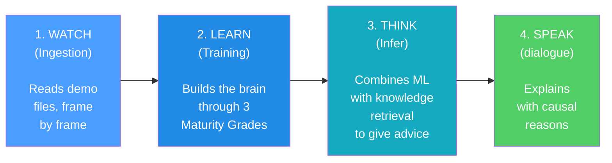

> 406 .py files · 102,000+ lines · 8 AI subsystems + Observatory + Control Module (REST API) + Quad-Daemon + Qt/PySide6 Desktop UI (15 screens) + 41 Tools (29 root + 12 inner) · 94 test files · 21 SQLModel tables (monolith) + 3 per-match · Tri-database architecture (database.db + hltv_metadata.db + per-match database) · FAISS vector indexing (IndexFlatIP 384-dim) · i18n Internationalization (EN/IT/PT) · WCAG 1.4.1 Accessibility (theme.py) · 12 comprehensive audit reports (incl. 140KB literature review, 30 peer-reviewed articles) · 610+ issues resolved (412 in 13 phases + 162 in second wave + 40+ in third wave) · End-to-end pipeline completed (156 per-match DB · JEPA + AdvancedCoachNN trained · 161 real HLTV players, 32 teams, 156 stat cards · Coach Book v4: 502 entries, 8 files, 13 categories · CS2 Coach Bench: 200 questions)

---

## 2. System Architecture Overview

The system is divided into **6 main subsystems** that work together like the departments of a company. Each subsystem has a specific task and the data flows between them in a well-defined pipeline.

> **Analogy:** Think of the whole system as a **big factory with 6 departments**. The first department (Ingestion) is the **mail room**: it receives the raw game recordings and sorts them. The second department (Processing) is the **workshop**: it analyzes the recordings and measures everything in them. The third department (Training) is the **school**: it teaches the AI's brain by showing it thousands of examples. The fourth department (Knowledge) is the **library**: it stores tips, past advice, and specialist knowledge so the coach can consult them. The fifth department (Inference) is the **brain**: it combines what the AI has learned with what the library knows to create advice. The sixth department (Analysis) is the **investigation team**: it conducts special inquiries like "is this player struggling?" or "was that a good position?". All six departments work together so the coach can provide intelligent and personalized advice.

```mermaid
graph TB
    subgraph Acquisition["Acquisition (Data Sources)"]
        DEMO[".dem Files"] --> FMT_ADAPT["Format Adapter<br/>(magic bytes, validation)"]
        FMT_ADAPT --> PARSER["Demo Parser<br/>(demoparser2)"]
        PARSER --> TRADE_DET["Trade Kill Detector<br/>(192 tick window)"]
        HLTV["HLTV Crawler<br/>(CircuitBreaker, RateLimiter)"] --> PRO_DB["Pro Player DB"]
        CSV["External CSV"] --> EXT_DB["CSV Migrator"]
        STEAM_API["Steam Web API<br/>(retry + backoff)"] --> STEAM_PROFILE["Player Profile"]
        STEAM_FIND["Steam Demo Finder<br/>(cross-platform)"] --> DEMO
        FACEIT_API["FACEIT API<br/>(rate limited 10/min)"] --> FACEIT_DATA["Elo + Level"]
        EVTREG["Event Registry<br/>(CS2 Schema)"] -.-> PARSER
    end

    subgraph Processing
        PARSER --> FE["Feature Engineering<br/>(feature_base, kast, rating, role_features)"]
        PARSER --> TF["Tensor Factory<br/>(map, view, motion raster)"]
        FE --> VEC["Unified Vectorizer<br/>(FeatureExtractor 25-dim)"]
        VEC --> SR["State Reconstructor"]
        PARSER --> PK["PlayerKnowledge<br/>(NO-WALLHACK)"]
        PK --> TF
        TF --> SR
        FB["FrameBuffer<br/>(30-frame ring buffer,<br/>HUD extraction)"] -.-> TF
    end

    subgraph Training
        SR --> JEPA["JEPA Pre-Training<br/>(Self-Supervised InfoNCE)"]
        SR --> VLJEPA["VL-JEPA<br/>(Vision-Language Alignment)"]
        FE --> MLP["AdvancedCoachNN<br/>(LSTM + MoE, 3 experts)"]
        SR --> RAP["RAP Coach Training<br/>(7-Component Architecture)"]
        EXT_DB --> ROLE_HEAD["NeuralRoleHead<br/>(MLP 5→32→16→5)"]
        JEPA --> COACH_MGR["Coach Manager<br/>(3-Level Maturity Gating)"]
        VLJEPA --> COACH_MGR
        MLP --> COACH_MGR
        RAP --> COACH_MGR
        ROLE_HEAD --> COACH_MGR
    end

    subgraph Observatory["Observatory (Training Introspection)"]
        COACH_MGR --> OBS_CB["Callback Registry<br/>(Plugin Architecture)"]
        OBS_CB --> OBS_TB["TensorBoard<br/>(9+ scalars, histograms)"]
        OBS_CB --> OBS_MAT["Maturity Observatory<br/>(5 signals → conviction)"]
        OBS_CB --> OBS_EMB["Embedding Projector<br/>(UMAP belief space)"]
    end

    subgraph Knowledge
        RAG["RAG Knowledge Base<br/>(Sentence-BERT 384-dim)"]
        FAISS_IDX["FAISS Index<br/>(IndexFlatIP 384-dim,<br/>sub-linear search)"]
        EB["Experience Bank<br/>(COPER Framework)"]
        KG["Knowledge Graph<br/>(entities + SQLite relations)"]
        RAG --> FAISS_IDX
    end

    subgraph Analysis["Analysis (11 Engines)"]
        GT["Expectiminimax<br/>Game Tree - depth 3"]
        BM["Bayesian Estimator<br/>Death Probability +<br/>Adaptive Calibrator"]
        DI["Deception Index<br/>3 sub-metrics"]
        RC["Role Classifier<br/>6 roles + Neural Consensus"]
        WP["Win Probability<br/>Predictor - NN + EloAugmented"]
        MOM["Momentum Tracker<br/>Tilt/Hot Detection"]
        ENT["Entropy Analyzer<br/>Shannon utility impact"]
        BS["Blind Spot Detector"]
        UE["Utility and Economy<br/>Purchase Optimizer"]
        ER["Engagement Analyzer<br/>50+ positions 8 maps"]
        MQ["Movement Quality<br/>Trajectory + economy analysis"]
    end

    subgraph Coaching_Engines["Coaching Engines"]
        CE_CORR["CorrectionEngine<br/>(weighted top-3 corrections)"]
        CE_HYBRID["HybridEngine<br/>(ML Z-score + RAG)"]
        CE_EXPLAIN["ExplainabilityGenerator<br/>(5 axes + templates)"]
        CE_LONG["LongitudinalEngine<br/>(Trend-aware coaching)"]
        CE_CORR --> CE_HYBRID --> CE_EXPLAIN
    end

    subgraph Inference
        COACH_MGR --> HE["4-Tier Coaching Service<br/>(COPER, Hybrid, RAG, Baseline)"]
        RAG --> HE
        EB --> HE
        KG --> HE
        PRO_DB --> PB["Pro Bridge / Token Resolver"]
        PB --> HE
        GT --> HE
        BM --> HE
        DI --> HE
        RC --> HE
        CE_EXPLAIN --> HE
        FACEIT_DATA --> PB
        STEAM_PROFILE --> PB
        HE --> OLLAMA["OllamaCoachWriter<br/>(Optional NL Refinement)"]
        HE --> DLG["CoachingDialogueEngine<br/>(Multi-turn, drill-down)"]
        HE --> EXP["Explainability Layer"]
    end

    subgraph Control["Control Module"]
        CTRL_CONSOLE["System Console<br/>(Rich TUI, CLI, REST API)"]
        CTRL_DB["DB Governor<br/>(WAL audit, Tier 1-3)"]
        CTRL_INGEST["Ingest Manager<br/>(Thread-safe, 30min re-scan)"]
        CTRL_ML["ML Controller<br/>(Throttle, Stop)"]
    end

    subgraph Progress["Progress & Trend"]
        PROG_LONG["Longitudinal Analysis<br/>(slope, volatility, confidence)"]
        PROG_TREND["Trend Analysis<br/>(numpy polyfit)"]
        PROG_LONG --> CE_LONG
    end

    EXP --> UI["Qt/PySide6 GUI"]

    subgraph Platform["Platform & Accessibility"]
        I18N["i18n<br/>(en.json, it.json, pt.json)"]
        THEME["theme.py<br/>(WCAG 1.4.1,<br/>rating_color + rating_label)"]
        PLAT["platform_utils.py<br/>(cross-platform<br/>drive detection)"]
    end
    I18N --> UI
    THEME --> UI

    style JEPA fill:#4a9eff,color:#fff
    style VLJEPA fill:#3b8ae6,color:#fff
    style RAP fill:#ff6b6b,color:#fff
    style ROLE_HEAD fill:#cc5de8,color:#fff
    style HE fill:#51cf66,color:#fff
    style RAG fill:#ffd43b,color:#000
    style OBS_TB fill:#868e96,color:#fff
    style OBS_MAT fill:#868e96,color:#fff
    style OBS_EMB fill:#868e96,color:#fff
```

**Diagram explanation:** This big diagram is like a **treasure map** that shows how information travels through the system. The journey starts top left with the raw game recordings (`.dem` files, HLTV data, CSV files): think of them as **raw ingredients** arriving in the kitchen. These ingredients pass through the Processing section where they are **chopped, measured, and prepared** (features are extracted, vectors are created). Then they reach the Training section where five different "chefs" (JEPA, VL-JEPA, AdvancedCoachNN, RAP, and NeuralRoleHead) each learn their own cooking style. The Observatory is the **quality control inspector** that watches every training session, checking whether the chefs are improving, stalling, or panicking. The Knowledge section is like the **cookbook shelf**: it contains tips (RAG), past cooking successes (COPER), and relationships between ingredients (Knowledge Graph). The Inference section is where the **head chef** combines everything — acquired skills, recipe books, and pro chef techniques — to create the final dish: coaching advice. The Analysis section is like having **food critics** evaluating specific qualities: "Is it too spicy?" (momentum), "Is it creative?" (deception index), "Did they forget an ingredient?" (blind spots). Behind the scenes, the **Quad-Daemon architecture** (Hunter, Digester, Teacher, Pulse) works tirelessly like the automated kitchen staff: it scans new ingredients, prepares them, and updates the chefs' skills without ever stopping. Everything flows down and to the right until it reaches the Qt/PySide6 graphical interface, the **plate** where the user sees the final result.

### Data flow summary

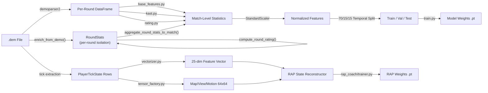

**Diagram explanation:** This diagram shows the **two parallel assembly lines** inside the processing department. Think of a match recording (`.dem` file) as a **long movie**. The **upper assembly line** watches the movie and writes summary statistics, like a report card for each match (kills, deaths, damage, etc.). These report cards are normalized (put on the same scale, like converting all temperatures to Celsius), split into study groups (70% for learning, 15% for quizzes, 15% for final exams), and used to train the basic training model. The **lower assembly line** is more detailed: it examines the movie **frame by frame** (every "tick" of the game clock), measuring 25 pieces of information about each player at every moment (position, health, what they see, economy, etc.) and creating 64x64 pixel "snapshots" of the map. Both numbers and images are fed into the RAP Coach's State Reconstructor, which combines them into a complete "what was happening at this precise moment" picture — and this is what the advanced RAP Coach model learns from.

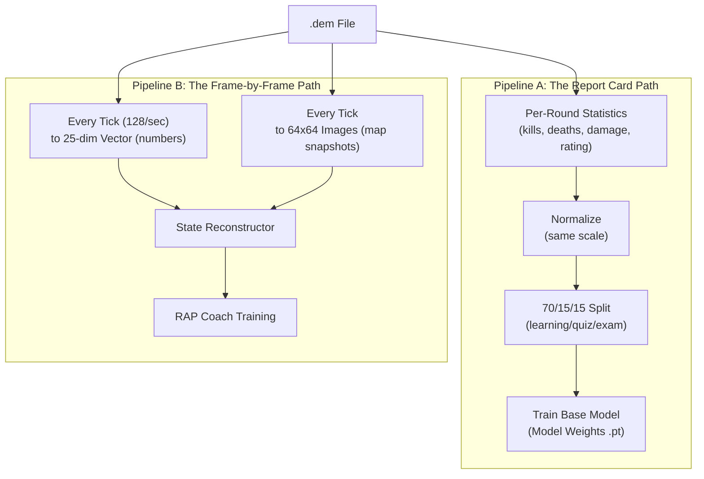

### NO-WALLHACK Principle and 25-dim Contract

Two fundamental architectural invariants run through the entire system:

**1. NO-WALLHACK Principle:** The AI coach **sees only what the player legitimately knows**. When the `PlayerKnowledge` module is available, the tensors generated by the `TensorFactory` encode exclusively legitimate information: teammates (always visible), enemies in "last-known" positions (with temporal decay, τ = 2.5s), own and observed utility. No "wallhack" information (real enemy positions that are not visible) ever enters the perception system. When `PlayerKnowledge` is `None`, the system falls back to a legacy mode with simplified tensors.

> **Analogy:** The NO-WALLHACK principle is like a **driving exam where the instructor sees only what the student sees**. The instructor has no access to an external camera showing all the hidden obstacles — they have to evaluate the student's decisions based only on the information actually available to the student. If the student made a mistake because they could not see an obstacle behind a curve, the instructor does not punish them for it. Similarly, the AI coach evaluates the player's positioning only based on what the player could reasonably know at that moment.

**2. 25-dim Contract (`FeatureExtractor`):** The `FeatureExtractor` in `vectorizer.py` defines the canonical 25-dimensional feature vector (`METADATA_DIM = 25`) used by **all** models (AdvancedCoachNN, JEPA, VL-JEPA, RAP Coach) both in training and inference. Any change to the feature vector happens **exclusively** in the `FeatureExtractor` — no other module may define its own features. This guarantees end-to-end dimensional consistency.

```
 0: health/100      1: armor/100       2: has_helmet      3: has_defuser
 4: equip/10000     5: is_crouching    6: is_scoped       7: is_blinded
 8: enemies_vis     9: pos_x/4096     10: pos_y/4096     11: pos_z/1024
12: view_x_sin     13: view_x_cos     14: view_y/90      15: z_penalty
16: kast_est       17: map_id         18: round_phase
19: weapon_class   20: time_in_round/115  21: bomb_planted
22: teammates_alive/4  23: enemies_alive/5  24: team_economy/16000

Position normalization: `np.clip(pos_x / cfg.pos_xy_extent, -1.0, 1.0)` where
`pos_xy_extent=4096.0` (default, configurable per map). The clip to [-1,1] protects
against out-of-range coordinates that would produce features > 1.0 in non-normalized
modules.
```

> **Analogy:** The 25-dim contract is like a **lingua franca** spoken by everyone in the system. Every model, every training pipeline, every inference engine "speaks" exactly the same language with 25 words. If a module started using 26 words or a different order, communication would break down. The `FeatureExtractor` is the **official dictionary** — the sole authority for the definition and order of features.

---

## 3. Subsystem 1 — Neural Network Core

**Program folder:** `backend/nn/`
**Key files:** `model.py`, `jepa_model.py`, `jepa_train.py`, `jepa_trainer.py`, `coach_manager.py`, `training_orchestrator.py`, `config.py`, `factory.py`, `persistence.py`, `role_head.py`, `training_callbacks.py`, `tensorboard_callback.py`, `maturity_observatory.py`, `embedding_projector.py`, `dataset.py`, `data_quality.py`, `evaluate.py`, `train_pipeline.py`, `training_monitor.py`, `early_stopping.py`, `ema.py`, `training_controller.py`, `win_probability_trainer.py`, `training_config.py`

This subsystem contains all the neural network models, the "brain" of the coaching system. It includes six distinct model architectures (AdvancedCoachNN, JEPA, VL-JEPA, RAP Coach, RAP Lite, NeuralRoleHead), a training manager, a Coach Introspection Observatory, and utilities for model creation and persistence.

> **Analogy:** This is the **brain department** of the factory. It contains six different kinds of brains (AdvancedCoachNN, JEPA, VL-JEPA, RAP Coach, RAP Lite, and NeuralRoleHead), each structured differently and specialized in different fields, such as a math brain, a language brain, a creative brain, one for interpersonal skills, a portable one that works anywhere, and one for role identification, all working in synergy. The Training Manager is like the **school principal**: decides which brain can study what and when, and keeps track of everyone's grades. The **Observatory** is the school's quality control office: it monitors every brain's "report card" during training, spotting signs of confusion, panic, growth, or mastery.

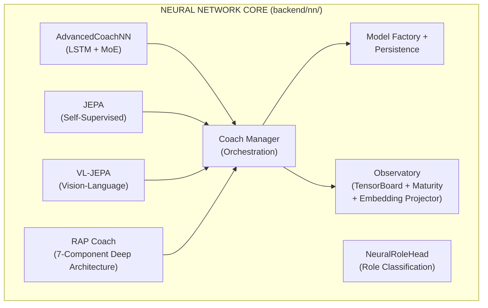

### -AdvancedCoachNN (LSTM + Mixture of Experts)

Defined in `model.py`, this is the foundation of supervised coaching.

| Component                      | Detail                                                                                                                                                                                                               |
| ------------------------------ | ----------------------------------------------------------------------------------------------------------------------------------------------------------------------------------------------------------------------- |
| **Input dimension**      | 25 features (`METADATA_DIM` from vectorizer.py)                                                                                                                                                                      |
| **Config**               | `CoachNNConfig` dataclass: `input_dim=25`, `output_dim=METADATA_DIM` (default 25, but overridden to `OUTPUT_DIM=10` by `ModelFactory`), `hidden_dim=128`, `num_experts=3`, `num_lstm_layers=2`, `dropout=0.2`, `use_layer_norm=True`                                      |
| **Hidden layers**        | 2-layer LSTM (128 hidden, `batch_first=True`, dropout=0.2) with `LayerNorm` post-LSTM                                                                                                                           |
| **Expert head**          | 3 parallel linear experts (configurable), softmax-gated via a learned gating network                                                                                                                             |
| **Output**               | Weighted sum of expert outputs → 10-dimensional coaching score vector. The `CoachNNConfig` defines `output_dim=METADATA_DIM` (25) as default, but `ModelFactory` overrides with `OUTPUT_DIM=10` in production. The alias `TeacherRefinementNN = AdvancedCoachNN` is kept for backward compatibility |
| **Role bias**            | Optional `role_id` parameter: `gate_weights = (gate_weights + role_bias) / 2.0` — biases expert selection toward role-specific knowledge                                                        |
| **Input validation**     | `_validate_input_dim()` automatically reshapes 1D → `unsqueeze(0).unsqueeze(0)` and 2D → `unsqueeze(0)` for robustness                                                                                      |

> **Analogy:** This model is like a **jury of 3 judges** at a talent show. First, the LSTM reads the player's gameplay data like reading a story: it understands what happened step by step, remembering the important moments (this is exactly what LSTMs are good at: memory). After reading the whole story, it summarizes everything into a single "opinion" (128 numbers). Then, three different expert judges examine that opinion and each assign their own score. But not all judges are equally good at every type of performance: a dance expert is better at judging dance, a singing expert at singing. So a **gating network** (like a moderator) decides how much to trust each judge: "For this player, Judge 1 is 60% relevant, Judge 2 is 30%, Judge 3 is 10%". The final score is a weighted combination of all three judges' opinions.

Each expert module in AdvancedCoachNN: `Linear(128→128) → LayerNorm(128) → ReLU → Linear(128→output_dim)`.

> **Note:** JEPA's `_create_expert()` omits LayerNorm — only `Linear → ReLU → Linear`. This is a deliberate design choice: JEPA experts operate on already normalized latent embeddings, while AdvancedCoachNN experts process raw LSTM outputs that benefit from per-expert normalization.

**Forward pass (pseudo forward pass):**

```
h, _ = LSTM(x) # x: [batch, seq_len, 25]
h = LayerNorm(h[:, -1, :]) # take the last timestep → [batch, 128]
gate_weights = softmax(W_gate · h) # [batch, 3]
expert_outputs = [E_i(h) for i in 1..3]
output = tanh(Σ gate_weights_i × expert_outputs_i)
```

> **Analogy:** Here is the step-by-step recipe: (1) The LSTM reads the player's 25 measurements across multiple timesteps, like reading pages of a diary. (2) It picks the summary of the last page, i.e., the most recent understanding. (3) A "moderator" examines that summary and decides how much to trust each of the 3 experts (these trust weights always add up to 100%). (4) Each expert assigns its own coaching scores. (5) The final result is the experts' scores mixed together based on how much the moderator trusts each, squashed into a range from -1 to +1 by the tanh function (like a grade on a curve).

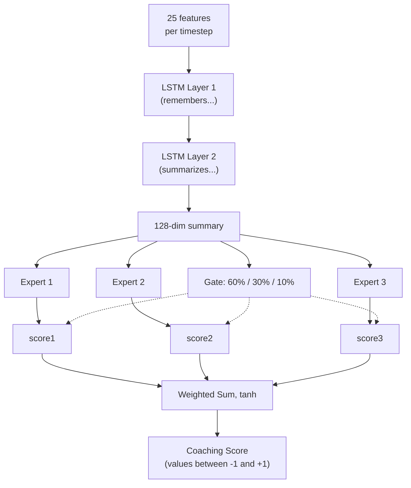

### -JEPA Coaching Model (Joint Embedding Predictive Architecture)

Defined in `jepa_model.py`. A **self-supervised pre-training model** inspired by Yann LeCun's I-JEPA, adapted for sequential CS2 data.

> **Analogy:** JEPA is the coach's **"learn by watching"** phase, just as you can learn a lot about basketball simply by watching NBA games, even before anyone teaches you the rules. Instead of needing someone to label each play as "good" or "bad" (supervised learning), JEPA self-teaches by playing a guessing game: "I saw what happened in the first half of this round... can I predict what will happen next?". If it guesses correctly, it is building a good understanding of CS2 patterns. If it guesses wrong, it adjusts. This is called **self-supervised learning**: the model creates its own "homework" from the data itself.

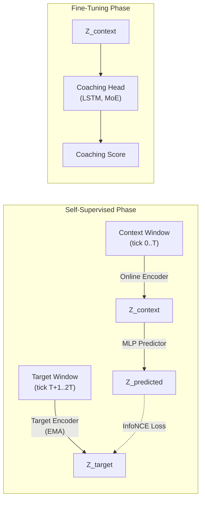

> **Diagram explanation:** The self-supervised phase works like this: imagine watching a movie and pressing pause halfway through a scene. The **Online Encoder** looks at the first half and creates a summary ("here is what I have understood so far"). The **Target Encoder** (a slightly older copy of the same brain, slowly updated) looks at the second half and creates its own summary. Then a **Predictor** tries to guess the summary of the second half using only the summary of the first half. The **InfoNCE Loss** is like a teacher checking: "Does your prediction match what actually happened? And is it different enough from random guesses?". In the Fine-Tuning phase, once the model has acquired good predictive capability, we add a **Coaching Head** on top: now the understanding gained by watching can be used to provide actual coaching scores.

**Architecture details:**

| Module                       | Parameters                                                                                               |
| ---------------------------- | ------------------------------------------------------------------------------------------------------- |
| **Online encoder**     | Linear(input_dim, 512) → LayerNorm → GELU → Dropout(0.1) → Linear(512, latent_dim=256) → LayerNorm |
| **Target encoder**     | Structurally identical; updated via exponential moving average (τ = 0.996). `EMA.state_dict()` returns **cloned** tensors to prevent aliasing (a previous bug allowed accidental modification of target weights through shared references) |
| **Predictor**          | Linear(256, 512) → LayerNorm → GELU → Dropout(0.1) → Linear(512, 256)                               |
| **Coaching Head**      | LSTM(256, hidden_dim, 2 layers, dropout=0.2) → 3 MoE experts → gated output                     |

> **Analogy:** The **Online Encoder** is like a student: it transforms raw game data into an "essence" of 256 numbers (a compact summary). The **Target Encoder** is like the student's older brother who updates slowly (EMA means "move toward the younger brother's knowledge, but just a tiny bit each day" — 99.6% stays unchanged, only 0.4% is updated). This slow target prevents the system from collapsing into a trivial solution (like always predicting "everything is the same"). The **Predictor** is a bridge that tries to translate "what I have seen" into "what I think will happen". The **Coaching Head** is the final accessory that converts understanding into actual advice, like going from "I understand basketball" to "you should pass more".

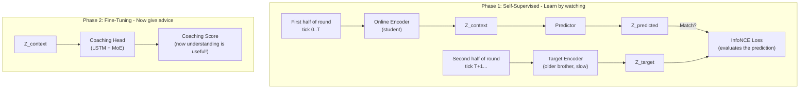

**Pre-training procedure** (`jepa_trainer.py`):

1. Loads `PlayerTickState` sequences from professional demo SQLite files.
2. Splits each sequence into context and target windows.
3. Encodes the context via the online encoder + predictor, encodes the target via the target encoder (EMA).
4. Minimizes the **InfoNCE contrastive loss** using in-batch negatives with cosine similarity and temperature τ=0.07.
5. After each batch, performs the EMA update: `θ_target ← τ·θ_target + (1−τ)·θ_online`.
6. **Drift monitoring**: Tracks DriftReport objects; triggers automatic retraining if drift > 2.5σ.
7. **Outcome-based labels (Fix G-01):** The `ConceptLabeler` in VL-JEPA training now generates labels from `RoundStats` data (per-round outcomes: kills, deaths, damage, survival) instead of tick-level features. This eliminates **label leakage** — the previous problem where concept labels were derived from the same features used as input, allowing the model to "cheat" during training without actually learning the patterns. The `label_from_round_stats(rs)` method produces a vector of 16 concept labels based on measurable outcomes. If `RoundStats` data is not available, the system falls back to the legacy heuristic with a one-time log warning.

> **Analogy:** The training recipe is this: (1) Load recordings from professional players, frame by frame. (2) For each recording, split it into "what happened before" and "what happened after". (3) Two encoders look at each half independently. (4) The system checks: "Did my prediction of 'what happened after' match the actual answer, and not random wrong answers?" — this is InfoNCE, like a multiple-choice test where the model has to pick the right answer among many wrong ones. (5) The older brother's encoder slowly absorbs the younger brother's knowledge (only 0.4% per step). (6) If the data starts to look very different from what the model trained on (drift > 2.5 standard deviations), an alarm goes off: "The game's meta has changed — time to retrain!"

**Selective Decoding** (`forward_selective`): skips the entire forward pass if the cosine distance between the current and previous embedding is below a threshold (`skip_threshold=0.05`). Uses `1.0 - F.cosine_similarity()` as distance metric and, during the skip operation, returns the previously cached output. This allows efficient real-time inference with dynamic frame skipping: during static gameplay moments (players holding angles), most frames are skipped entirely.

> **Analogy:** Selective decoding is like a security camera with **motion detection**. Instead of recording 24/7 (processing every single frame), it only activates when something actually changes. If two consecutive frames are nearly identical (distance < 0.05 — essentially "nothing has happened"), the model skips the computation entirely. This saves a massive amount of processing power during slow moments (like when players hold angles and wait), while still capturing every important action.

### -VL-JEPA: Vision-Language Alignment Architecture with Coaching Concepts

Defined in the second half of `jepa_model.py`. VL-JEPA (**Vision-Language JEPA**) is a **foundational extension** of the JEPACoachingModel that adds an **alignment mechanism between latent embeddings and interpretable coaching concepts**. Inspired by Meta FAIR's VL-JEPA (2026), it maps latent representations into a structured concept space with 16 predefined coaching concepts.

> **Analogy:** If JEPA is a coach who "understands" the game by watching it (self-supervised learning), VL-JEPA is the same coach who has also learned the **specific vocabulary of coaching**. It not only understands game patterns, but can label them with concepts like "aggressive positioning", "inefficient economy", or "reactive trade". It is like the difference between a film critic who "feels" when a movie works and one who can articulate why: "the cinematography is excellent, the pacing is slow in the second act, the plot twist is predictable". VL-JEPA translates latent understanding into specific coaching language.

#### Taxonomy of the 16 Coaching Concepts

The system defines `NUM_COACHING_CONCEPTS = 16` concepts organized into **5 tactical dimensions**:

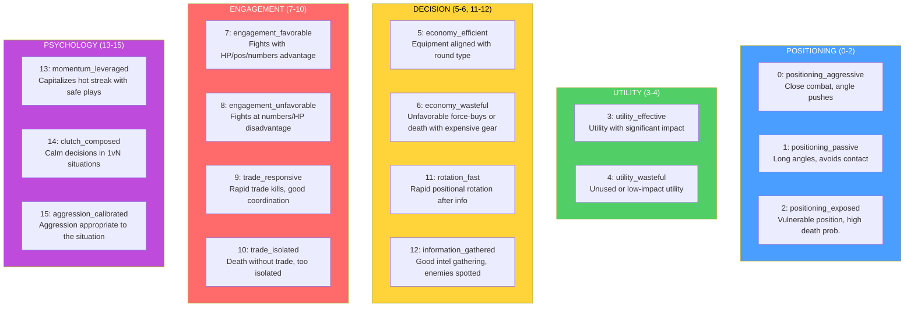

Each concept is defined as an immutable `CoachingConcept` dataclass with `(id, name, dimension, description)`. The global list `COACHING_CONCEPTS` and `CONCEPT_NAMES` are the sources of truth for the whole system.

> **Analogy:** The 16 concepts are like the **16 subjects on a coaching school report card**. Instead of a single "you are good/bad" grade, VL-JEPA evaluates the player on 16 specific aspects: "In aggressive positioning you are at 80%, in efficient economy at 45%, in trade responsiveness at 70%". The 5 dimensions are the "departments" of the school: Positioning, Utility, Decision, Engagement, and Psychology. A player can excel in one dimension and have gaps in another — just as a student may have excellent grades in math but poor ones in literature.

#### VLJEPACoachingModel Architecture

`VLJEPACoachingModel` inherits from `JEPACoachingModel` and adds 3 components:

| Component | Parameters | Purpose |
|---|---|---|
| **concept_embeddings** | `nn.Embedding(16, latent_dim=256)` | 16 concept prototypes learned in latent space |
| **concept_projector** | `Linear(256→256) → GELU → Linear(256→256)` | Projects encoder embedding into concept-aligned space |
| **concept_temperature** | `nn.Parameter(0.07)`, clamped `[0.01, 1.0]` | Learned temperature for cosine similarity scaling |

All parent forward paths (`forward`, `forward_coaching`, `forward_selective`, `forward_jepa_pretrain`) are **preserved unchanged** via inheritance. The new `forward_vl()` path adds concept alignment.

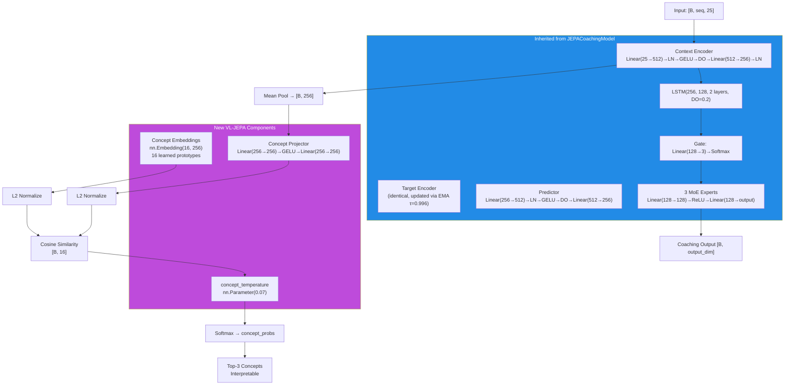

> **Analogy:** The VL-JEPA architecture is like adding a **simultaneous translator** to an analyst who already understands the game. The `concept_projector` is the interpreter that takes the encoder's latent understanding (256 abstract numbers) and translates it into the "concept space". The `concept_embeddings` are like 16 **signposts** in latent space: each represents a coaching concept and has a fixed position (learned during training). The `concept_temperature` controls how "sharp" the classification must be: a low temperature (0.01) makes decisions binary ("it is either this concept or it is not"), a high temperature (1.0) makes them soft ("it could be several concepts simultaneously"). The system computes the cosine distance between the player's projection and each signpost, and the nearest concepts are activated.

#### VL-JEPA Forward Path (`forward_vl`)

```
1. Encode:        embeddings = context_encoder(x)                    # [B, seq, 256]
2. Pool:          latent = embeddings.mean(dim=1)                    # [B, 256]
3. Project:       projected = L2_normalize(concept_projector(latent)) # [B, 256]
4. Similarity:    logits = projected @ concept_embs_norm.T            # [B, 16]
5. Temperature:   probs = softmax(logits / clamp(temp, 0.01, 1.0))   # [B, 16]
6. Coaching:      coaching_output = forward_coaching(x, role_id)      # [B, output_dim]
7. Decode:        top_concepts = top-k(probs, k=3)                   # interpretable
```

**Output `forward_vl()`:** Dictionary with 5 keys:

| Key | Shape | Content |
|---|---|---|
| `concept_probs` | `[B, 16]` | Softmax probability for each concept |
| `concept_logits` | `[B, 16]` | Raw similarity scores (pre-softmax) |
| `top_concepts` | `List[tuple]` | `[(concept_name, probability), ...]` for the first sample |
| `coaching_output` | `[B, output_dim]` | Standard coaching prediction (via parent) |
| `latent` | `[B, 256]` | Pooled latent embedding from encoder |

**Lightweight path — `get_concept_activations()`:** Concept-only forward without coaching head or LSTM. Uses `torch.no_grad()` for maximum efficiency during inference.

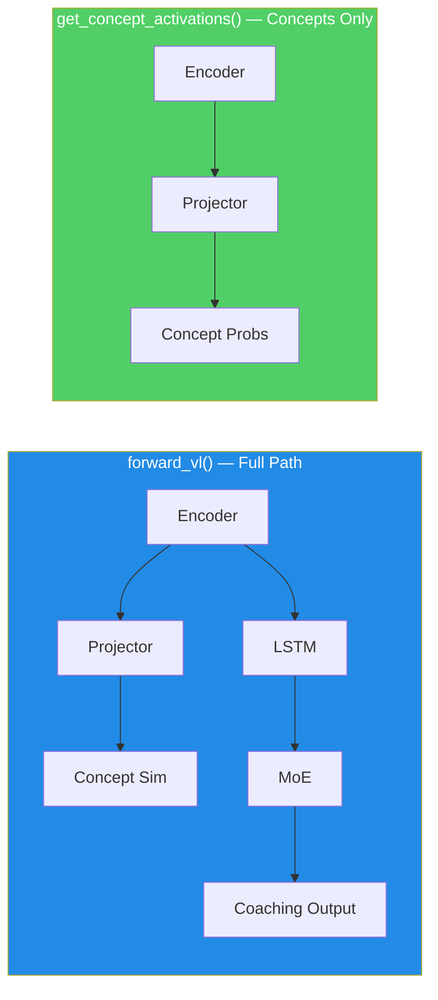

#### ConceptLabeler: Two Labeling Modes

The `ConceptLabeler` class generates **soft multi-label labels** (`[0, 1]^16`) for VL-JEPA training. It supports two modes:

**Mode 1 — Outcome-based (preferred, G-01 fix):** `label_from_round_stats(round_stats)` generates labels from **round outcome** data (kills, deaths, damage, survival, trade kill, utility, equipment, round won). These data are **orthogonal** to the 25-dim input vector, eliminating label leakage.

| Concept | Outcome Signal Used |
|---|---|
| `positioning_aggressive` (0) | `opening_kill=True` → 0.8, kills≥2+survived → 0.6 |
| `positioning_passive` (1) | survived, no opening, damage<60 → 0.7 |
| `positioning_exposed` (2) | `opening_death=True` → 0.8, deaths>0+damage<40 → 0.6 |
| `utility_effective` (3) | utility_total>80 + round_won → 0.5+util/300 |
| `utility_wasteful` (4) | zero utility → 0.5, utility+lost → 0.4 |
| `economy_efficient` (5) | eco win (equip<2000) → 0.9, normal win → 0.7 |
| `economy_wasteful` (6) | high equip+loss → 0.4+equip/16000 |
| `engagement_favorable` (7) | multi-kill+survived → 0.5+kills×0.15 |
| `engagement_unfavorable` (8) | deaths+no kills+low dmg → 0.7 |
| `trade_responsive` (9) | trade_kills>0 → 0.6+tk×0.2 |
| `trade_isolated` (10) | died, not traded, no trade kills → 0.7 |
| `rotation_fast` (11) | assists≥1+round_won → 0.6+assists×0.1 |
| `information_gathered` (12) | flashes≥2+survived → 0.6 |
| `momentum_leveraged` (13) | rating>1.5 → rating/2.5, kills≥3 → 0.7 |
| `clutch_composed` (14) | kills≥2+survived+won → 0.6 |
| `aggression_calibrated` (15) | efficiency = kills×1000/equip → min(eff×0.5, 1.0) |

**Mode 2 — Legacy heuristic (fallback with label leakage):** `label_tick(features)` generates labels directly from the 25-dim feature vector. This creates **label leakage** because the model can "cheat" by reconstructing the input features instead of learning latent patterns. Used only when `RoundStats` is not available, with a one-time log warning.

> **Analogy G-01:** Label leakage is like an **exam where the answers are written on the back of the question sheet**. In heuristic mode, the concept labels are derived from the same 25 features the model sees as input — the model can just "copy the answers" without understanding anything. In outcome-based mode, the labels come from different data (what HAPPENED in the round: kills, deaths, victory) — the model must actually understand the relationship between input features and outcomes to score well. It is the difference between studying to understand and studying to copy.

**`label_batch(features_batch)`:** Wrapper that handles 2D batches `[B, 25]` and 3D batches `[B, seq_len, 25]` (mean of labels over the sequence for 3D input).

**Feature index reference (METADATA_DIM=25):**

```
 0: health/100      1: armor/100       2: has_helmet      3: has_defuser
 4: equip/10000     5: is_crouching    6: is_scoped       7: is_blinded
 8: enemies_vis     9: pos_x/4096     10: pos_y/4096     11: pos_z/1024
12: view_x_sin     13: view_x_cos     14: view_y/90      15: z_penalty
16: kast_est       17: map_id         18: round_phase
19: weapon_class   20: time_in_round/115  21: bomb_planted
22: teammates_alive/4  23: enemies_alive/5  24: team_economy/16000
```

#### VL-JEPA Loss Functions

**1. `jepa_contrastive_loss()` — InfoNCE (already documented above)**

Formula: `-log(exp(sim(pred, target)/τ) / (exp(sim(pred, target)/τ) + Σ exp(sim(pred, neg_i)/τ)))` with τ=0.07. The PyTorch implementation uses an efficient trick: it concatenates the positive similarity and the negative similarities into a logits vector `[pos_sim, neg_sim_1, ..., neg_sim_N]` and applies `F.cross_entropy(logits, labels=0)` — where label `0` indicates that the first element (the positive similarity) is the correct class. This is mathematically equivalent to the InfoNCE formula but leverages PyTorch's numerically stable internal `log_softmax`.

**2. `vl_jepa_concept_loss()` — Concept Alignment + VICReg Diversity**

```python
concept_loss = BCE_with_logits(concept_logits, concept_labels)  # Multi-label
diversity_loss = -std(L2_normalize(concept_embeddings), dim=0).mean()  # VICReg
total = alpha * concept_loss + beta * diversity_loss
```

| Term | Formula | Default Weight | Purpose |
|---|---|---|---|
| `concept_loss` | `F.binary_cross_entropy_with_logits(logits, labels)` | α = 0.5 | Aligns embedding with correct concepts |
| `diversity_loss` | `-std_per_dim(L2_norm(concept_embs)).mean()` | β = 0.1 | Prevents collapse of concept embeddings |

> **Analogy:** The `concept_loss` is like **verifying that the student correctly associates terms with definitions** — "aggressive positioning" must activate when the player is actually aggressive. The `diversity_loss` is inspired by VICReg (Variance-Invariance-Covariance Regularization): it prevents all 16 concept prototypes from collapsing to the same point in latent space. It is like ensuring that the 16 signposts in the museum are **all in different positions** — if two signposts are in the same place, they do not help distinguish the concepts. Diversity is measured as the standard deviation of normalized embeddings along each dimension: a high std means the concepts are well separated.

**Total loss in the VL-JEPA training step (`train_step_vl`):**

```
L_total = L_infonce + α × L_concept + β × L_diversity
```

Where `L_infonce` is the standard JEPA contrastive loss and `(α × L_concept + β × L_diversity)` is the concept alignment term.

#### Complete JEPA / VL-JEPA Dimensional Flow

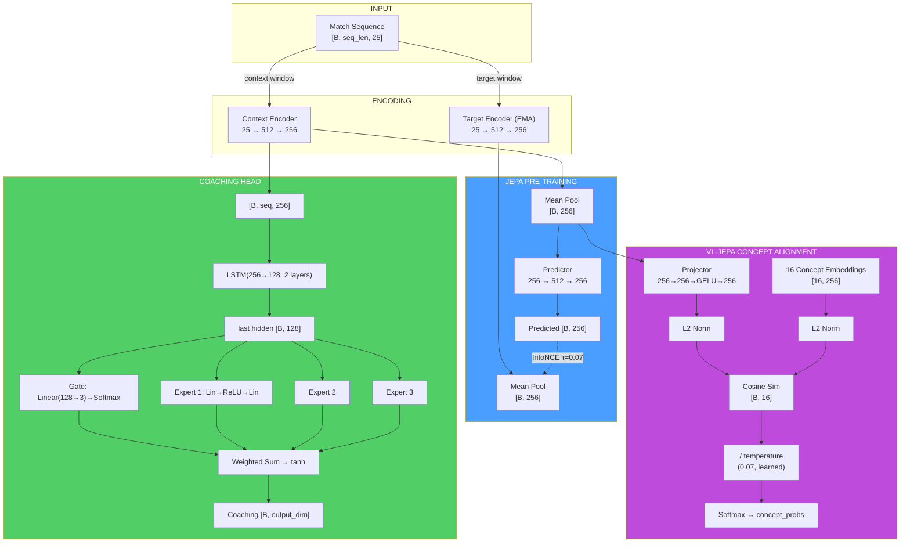

> **Dimensional flow analogy:** Imagine the data path as a **multilingual translation journey**: the raw game data (25 numbers) is like a text in "game language". The encoder translates it into "latent language" (256 numbers) — a compressed but rich representation. From here, the path forks: the **JEPA branch** (self-supervision) verifies whether the translator understands the temporal sequence, the **Coaching branch** (LSTM+MoE) produces practical advice, and the **VL branch** (concepts) translates from "latent language" to "coaching language" (16 interpretable concepts). Each branch serves a different purpose, but all start from the same base translation.

#### JEPATrainer: Training with Drift Monitoring

Defined in `jepa_trainer.py`. Manages both standard JEPA training and VL-JEPA, with automatic drift-based retraining.

| Parameter | Default | Purpose |
|---|---|---|
| **Optimizer** | AdamW (lr=1e-4, weight_decay=1e-4) | Optimization with weight decay |
| **Scheduler** | CosineAnnealingLR (T_max=100) | Cyclic learning rate decay |
| **DriftMonitor** | z_threshold=2.5 | Detects feature drift beyond 2.5σ |
| **drift_history** | `List[DriftReport]` | Drift report history |

**Shared negative encoding — `encode_raw_negatives(negatives, seq_len)` (NN-H-02):**

Shared method that encodes raw negatives (feature space) into the latent space. When the orchestrator sends negatives from the cross-match pool (dimension `METADATA_DIM`), these must be transformed into latent embeddings for contrastive loss computation. The method: reshape `[B*N, 1, D]` → expand by `seq_len` → encode via `target_encoder` with `torch.no_grad()` → mean pool → reshape `[B, N, latent_dim]`. This logic was previously duplicated between trainer and orchestrator; centralization (NN-H-02) prevents misalignments.

**Training cycle — `train_step(x_context, x_target, negatives)`:**

1. JEPA forward pass: `pred, target = model.forward_jepa_pretrain(context, target)`
2. **Auto-detect raw negatives:** If `negatives.shape[-1] ≠ latent_dim`, the negatives are raw features → they are auto-encoded via `encode_raw_negatives()` (NN-H-02)
3. InfoNCE loss on normalized embeddings
4. Backward + optimizer step
5. **EMA update of target encoder** (must happen AFTER `optimizer.step()`)
6. **Embedding diversity monitoring (P9-02):** Computes the mean variance of latent dimensions. If `variance < 0.01`, emits a warning of potential embedding collapse — the model is converging to a degenerate representation where all inputs produce the same vector

**Degenerate batch guard (NN-JT-01):** In in-batch negatives mode, if `batch_size < 2` the batch is skipped — it is not possible to build negatives excluding self from a batch of a single element. This prevents errors in negative indexing during the initial training phases with limited data.

**VL-JEPA training step — `train_step_vl()`:** Extends `train_step` with:

1. Standard JEPA forward pass (InfoNCE)
2. VL forward: `model.forward_vl(x_context)` → concept_logits
3. **Label generation (G-01 preference):** If `round_stats` is available → `label_from_round_stats()` (no leakage). Otherwise → `label_batch()` (legacy heuristic with one-time warning)
4. Concept loss + diversity loss: `vl_jepa_concept_loss(logits, labels, embeddings, α, β)`
5. Total loss: `L_infonce + L_concept_total`
6. Backward + optimize + EMA update

**Output:** `{total_loss, infonce_loss, concept_loss, diversity_loss}`.

**Drift monitoring — `check_val_drift(val_df, reference_stats)`:**

- Uses `DriftMonitor` from the validation pipeline
- Computes z-score for each feature of the validation set relative to reference statistics
- If `max_z_score > 2.5`, the report flags `is_drifted=True`
- `should_retrain(drift_history, window=5)` → if the majority of the last 5 windows show drift, triggers the `_needs_full_retrain` flag

**Automatic retraining — `retrain_if_needed(full_dataloader, device, epochs=10)`:**

- If the `_needs_full_retrain` flag is active, resets the scheduler and reruns `epochs` full epochs
- After retraining, clears the flag and the drift history
- Returns `True/False` to indicate whether retraining occurred

> **Analogy:** The drift monitoring system is like an **automatic thermometer for meta-game conditions**. If the new players' data is very different from what the model trained on (for example, a major game update changed the mechanics), the thermometer detects the "fever" (drift > 2.5σ). If the fever persists for 5 consecutive checks, the system prescribes a "full cure" — complete retraining. This prevents the model from giving advice based on an obsolete meta-game.

#### Standalone Training Pipeline (`jepa_train.py`)

Standalone script for JEPA pre-training and fine-tuning, executable from CLI:

```bash
python -m Programma_CS2_RENAN.backend.nn.jepa_train --mode pretrain
python -m Programma_CS2_RENAN.backend.nn.jepa_train --mode finetune --model-path models/jepa_model.pt
```

**`JEPAPretrainDataset`:** PyTorch Dataset for pre-training:

| Parameter | Default | Description |
|---|---|---|
| `context_len` | 10 | Context window length (ticks) |
| `target_len` | 10 | Target window length (ticks) |
| `match_sequences` | `List[np.ndarray]` | Match sequences `[num_rounds, METADATA_DIM]` |

For each sample, it selects a random starting point in the sequence and returns `{"context": [context_len, 25], "target": [target_len, 25]}`.

> **Note (F3-25):** The starting point uses `np.random.randint()` with non-seeded global state → windows not reproducible across runs. For deterministic training, use `worker_init_fn` or a dedicated `Generator` in the `DataLoader`.

**`_roundstats_to_features(rs: RoundStats)` → `List[float]`:** Extracts a **16-feature** vector from a single `RoundStats` row: `[kills, deaths, damage_dealt/100, headshot_kills, assists, trade_kills, was_traded, opening_kill, opening_death, he_damage/100, molotov_damage/100, flashes_thrown, smokes_thrown, equipment_value/5000, round_rating, side_CT]`. The vector is then padded to `METADATA_DIM` (25) with zeros.

> **Exclusion of `round_won` (P-RSB-03):** The `round_won` field is **deliberately excluded** from the feature vector. Including it would cause data leakage: the model would see the round's outcome in the input data, allowing it to trivially predict outcomes from the result itself. `round_won` is correctly used as a **label** in `label_from_round_stats()` (jepa_model.py), where it generates supervision labels for the VL-JEPA branch.

**`_MIN_ROUNDS_FOR_SEQUENCE = 6`:** Minimum round requirement to build a valid training sequence. Matches with fewer than 6 rounds do not provide enough temporal context to learn meaningful tactical patterns and are silently discarded.

**`load_pro_demo_sequences(limit=100)`:** Loads professional demo sequences from the database. Uses `_roundstats_to_features()` to extract real per-round features from `RoundStats`, with a fallback to 12 match-level aggregate features from `PlayerMatchStats` (padded to `METADATA_DIM` with zeros) only when `RoundStats` is not available.

> **Critical Warning (F3-08):** In the match-aggregate fallback path, the script uses `np.tile(features, (20, 1))` to create 20 identical frames from a single aggregated vector. This makes JEPA pre-training **an identity operation** — the model simply learns to copy the input, not temporal dynamics. The primary path with real `RoundStats` and the `TrainingOrchestrator` in the production path **are not affected** by this issue and use real per-round/per-tick data.

**`train_jepa_pretrain()`:** 50 epochs, batch_size=16, lr=1e-4, 8 in-batch negatives. The optimizer includes ONLY `context_encoder` and `predictor` — the `target_encoder` is updated exclusively via EMA.

**`train_jepa_finetune()`:** 30 epochs, batch_size=16, lr=1e-3, weight_decay=1e-3. Freezes the encoders and optimizes only LSTM + MoE + Gate.

**Persistence:** `save_jepa_model()` saves `{model_state_dict, is_pretrained}`. `load_jepa_model()` loads with `weights_only=True` (security).

#### SuperpositionLayer — Contextual Gating (`layers/superposition.py`)

Standalone module that implements a linear layer with **context-dependent gating**, used within the RAP Coach Strategy Layer.

```python
class SuperpositionLayer(nn.Module):
    def __init__(self, in_features, out_features, context_dim=METADATA_DIM):
        self.weight = nn.Parameter(empty(out_features, in_features))
        nn.init.kaiming_uniform_(self.weight, a=math.sqrt(5))  # P1-09: Kaiming init
        self.bias = nn.Parameter(zeros(out_features))
        self.context_gate = nn.Linear(context_dim, out_features)  # Superposition Controller

    def forward(self, x, context):
        gate = sigmoid(self.context_gate(context))  # [B, out_features]
        self._last_gate_live = gate                  # With gradient (for sparsity loss)
        self._last_gate_activations = gate.detach()  # Detached copy (for observability)
        out = F.linear(x, self.weight, self.bias)
        return out * gate  # Contextual modulation
```

**Mechanism:** Each neuron's output is multiplied by a sigmoid gate conditioned on context features (25-dim). This allows the model to dynamically "turn on" or "turn off" neurons depending on the game situation.

**Kaiming initialization (P1-09):** Weights are initialized with `kaiming_uniform_` (Kaiming He distribution, 2015) instead of `torch.randn()`. This initialization ensures that weight variance is proportional to the layer's fan-in, preventing vanishing or exploding gradients in deep networks. The `a=math.sqrt(5)` parameter is the standard value for linear layers in PyTorch.

**Dual-tensor design (NN-24):** The sigmoid gate is stored in **two separate copies** during each forward pass:

| Tensor | Gradient | Purpose |
|---|---|---|
| `_last_gate_live` | **Yes** (preserves computational graph) | Used by `gate_sparsity_loss()` for backpropagation — the gradient flows through the gate into `context_gate` |
| `_last_gate_activations` | **No** (detached) | Used by `get_gate_statistics()` for observability — no memory cost for the graph |

This separation resolves the conflict between the need for gradients (for sparsity loss) and the need for lightweight observability (for logging and TensorBoard).

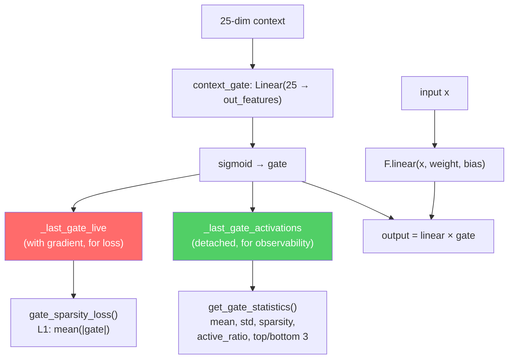

**Integrated observability:**

| Method | Returns | Description |
|---|---|---|
| `get_gate_activations()` | `Tensor` or `None` | Latest gate activations (`_last_gate_activations`, detached) |
| `get_gate_statistics()` | `Dict[str, float]` | Full gate statistics (see table below) |
| `gate_sparsity_loss()` | `Tensor` | L1 loss `mean(|_last_gate_live|)` for expert specialization |
| `enable_tracing(interval)` | — | Detailed gate logging every `interval` steps |
| `disable_tracing()` | — | Restores logging interval to 100 |

**Fields of `get_gate_statistics()`:**

| Field | Type | Meaning |
|---|---|---|
| `mean_activation` | float | Mean of gate activations in the batch |
| `std_activation` | float | Standard deviation of activations |
| `sparsity` | float | Fraction of dimensions with mean < 0.1 (higher = sparser) |
| `active_ratio` | float | Fraction of dimensions with mean > 0.5 (higher = more active) |
| `top_3_dims` | List[int] | The 3 most active gate dimensions |
| `bottom_3_dims` | List[int] | The 3 least active gate dimensions |

**Periodic logging during training:** Every 100 forward passes (configurable via `enable_tracing(interval)`), logs via structured logger: active dimensions (gate_mean > 0.5), sparse dimensions (gate_mean < 0.1), and overall mean.

> **Analogy:** The SuperpositionLayer is like a **256-channel audio mixer** where each slider is automatically controlled based on the current "scene". In an eco round, certain channels are turned down (features related to full-buy are irrelevant). In a post-plant retake, other channels are turned up. The `gate_sparsity_loss` is like a sound engineer saying: "Use as few channels as possible at once — if you can get the same sound with 50 channels instead of 200, the mix will be cleaner and more interpretable". Kaiming initialization is like **tuning the instrument before playing** — without good initial tuning, even the best musician will produce off-key notes. The dual-tensor design is like having **two copies of the mix**: a "live" one the engineer can adjust (with gradients), and a "recorded" one the critic can analyze after the fact (without disturbing the live performance).

#### Standalone EMA Module

The **Exponential Moving Average** update of the target encoder is implemented directly in `JEPACoachingModel.update_target_encoder(momentum=0.996)`:

```python
with torch.no_grad():
    for param_q, param_k in zip(context_encoder.parameters(), target_encoder.parameters()):
        param_k.data = param_k.data * momentum + param_q.data * (1.0 - momentum)
```

**Invariants:**
- The EMA update **always happens after** `optimizer.step()` — never before, otherwise gradients are not yet applied
- The target encoder **never receives direct gradients** — only EMA updates
- The momentum 0.996 means the target encoder "absorbs" only 0.4% of the online encoder's weights at each step — a very conservative update
- `state_dict()` of the model returns **cloned** tensors (`.clone()`) to prevent accidental aliasing — a real bug fixed during audit where `state_dict()` returned direct references to the model tensors instead of copies, causing corruption when the caller modified the dictionary

> **Analogy:** EMA is like a **mentor who learns slowly from the student**. The student (context encoder) learns fast from the data and changes a lot each lesson. The mentor (target encoder) watches the student and updates their own knowledge very slowly — only 0.4% per lesson. This prevents the mentor from "forgetting" what they knew before, creating a stable target for learning. Without EMA, both brains would change too fast and the system could "collapse" — a phenomenon known as mode collapse where both encoders produce the same output regardless of input.

### -CoachTrainingManager (Orchestration)

Defined in `coach_manager.py`. This is the **brain of the training process**, which manages a rigorous **3-level, maturity-based training cycle**, divided into 4 phases:

> **Kid-friendly analogy:** CoachTrainingManager is like the **principal** who decides each student's class and which subjects they can take. A brand-new student (CALIBRATION) can only attend introductory courses. A student who has passed enough courses (LEARNING) can attend advanced courses. And a final-year student (MATURE) has access to everything. The principal also enforces a rule: "You cannot start any course until you have attended at least 10 orientation sessions". This prevents the system from trying to teach when it has almost no data to learn from.

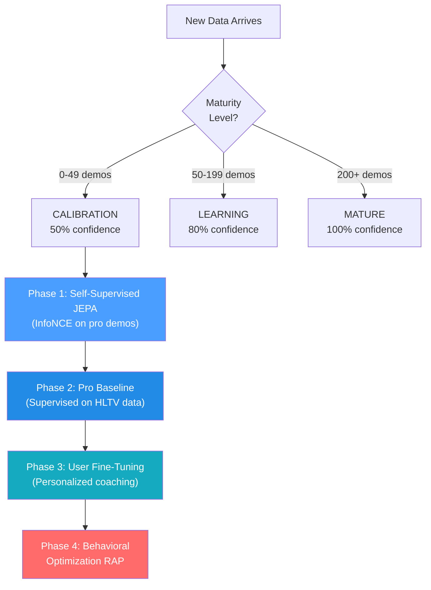

> **Diagram explanation:** Think of the 4 phases as **school years**: Phase 1 (JEPA) is like **watching game film**: the student watches hundreds of pro games and learns the patterns without anyone grading them. Phase 2 (Pro Baseline) is like **studying from a textbook**: now a teacher says "here is how you play well" and the student studies to match. Phase 3 (User fine-tuning) is like **private lessons**: the system adapts specifically to THIS player's style and weaknesses. Phase 4 (RAP) is like an **advanced strategy course**: the full 7-component RAP coach steps in with game theory, positioning, and causal reasoning. You cannot access Phase 4 until Phases 1-3 are complete, just like you cannot study calculus before algebra.

**Maturity levels and confidence multipliers:**

| Level         | Demo Count     | Confidence Multiplier    | Unlocked Features                                       |
| ------------- | -------------- | ------------------------- | ------------------------------------------------------- |
| CALIBRATION   | 0–49           | 0.50                      | Basic heuristics, JEPA pre-training                     |
| LEARNING      | 50–199         | 0.80                      | Pro baseline comparison, user fine-tuning               |
| MATURE        | 200+           | 1.00                      | Full RAP Coach, game theory, full analysis              |

> **Analogy:** The confidence multiplier is like a **trust score**. When the coach is new (CALIBRATION), it only trusts its own advice 50%: it knows it might be wrong, so it is cautious. After studying more than 50 demos (LEARNING), it trusts itself 80%. After more than 200 demos (MATURE), it is fully confident: 100%. It is like a weather forecaster: a novice forecaster might say "I am 50% sure it will rain", but an experienced one with decades of data says "I am 100% sure". The coach never pretends to know more than it actually does.

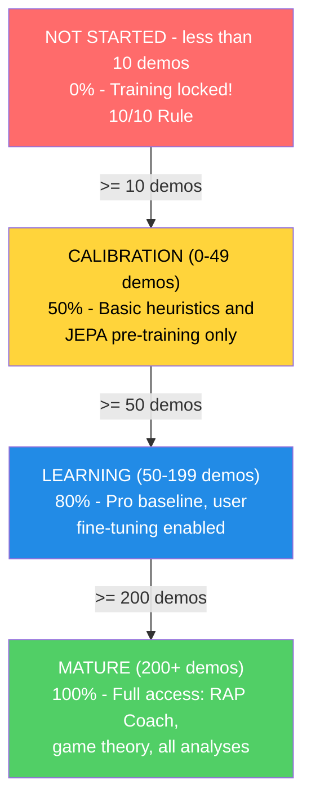

**Prerequisites (10/10 Rule):** Requires ≥10 professional demos OR (≥10 user demos + connected Steam/FACEIT account) before starting any training.

The manager uses a rigorous **training contract** with 25 features (matching `METADATA_DIM`).

> **Issue resolved (ex G-10):** `coach_manager.py` now defines `TRAINING_FEATURES` with canonical names correct for all 25 indices, perfectly aligned with `vectorizer.py`. The assertion `len(TRAINING_FEATURES) == METADATA_DIM` is valid and all names are up to date. In addition, `MATCH_AGGREGATE_FEATURES` defines the 25 match-level aggregate features: `["avg_kills", "avg_deaths", "avg_adr", "avg_hs", "avg_kast", "kill_std", "adr_std", "kd_ratio", "impact_rounds", "accuracy", "econ_rating", "rating", "opening_duel_win_pct", "clutch_win_pct", "trade_kill_ratio", "flash_assists", "positional_aggression_score", "kpr", "dpr", "rating_impact", "rating_survival", "he_damage_per_round", "smokes_per_round", "unused_utility_per_round", "thrusmoke_kill_pct"]`. Both lists are validated at runtime: if either has a length different from `METADATA_DIM`, the module raises `ValueError` at import time.

```
health, armor, has_helmet, has_defuser, equipment_value,
is_crouching, is_scoped, is_blinded,
enemies_visible,
pos_x, pos_y, pos_z,
view_yaw_sin, view_yaw_cos, view_pitch,
z_penalty, kast_estimate, map_id, round_phase,
weapon_class, time_in_round, bomb_planted,
teammates_alive, enemies_alive, team_economy
```

> **Analogy:** These 25 features are like a **25-question checklist** the coach asks a player at every single moment of a match: "How healthy are you? Do you have armor? A helmet? A defuse kit? How much does your equipment cost? Are you crouching? Are you scoped? Are you flashed? How many enemies can you see? Where are you located (x, y, z coordinates)? In which direction are you looking (split into sin/cos to avoid angular weirdness)? Are you on the wrong floor of a multi-level map? How have you been performing (KAST)? Which map is it? Is it a pistol, eco, force, or full buy round? What type of weapon are you using? How much time has passed in the round? Has the bomb been planted? How many teammates are still alive? How many enemies are alive? What is your team's average economy?" The last 6 questions (indices 19-24) give the model tactical awareness of the game context — these features have a default value of 0.0 during training from the database and are populated from the DemoFrame context at inference time. Every model in the system speaks exactly the same "25-question language" — this is the training contract. If any part of the system used different questions, the answers would not match and everything would break.

**Target indices:** `TARGET_INDICES = list(range(OUTPUT_DIM))` = `[0, 1, 2, 3, 4, 5, 6, 7, 8, 9]` — the model predicts improvement deltas for the first **10 match-level aggregate metrics**: `[avg_kills, avg_deaths, avg_adr, avg_hs, avg_kast, kill_std, adr_std, kd_ratio, impact_rounds, accuracy]`.

> **Analogy:** Of the 25 match-level aggregate features, the model focuses on predicting improvements for the first 10: **average kills** (are you getting more eliminations?), **average deaths** (are you dying less?), **average ADR** (are you dealing more damage per round?), **average HS%** (is your headshot aim improving?), **average KAST** (are you contributing to rounds more often?), **kill and ADR variance** (are you more consistent?), **K/D ratio** (is the balance positive?), **impact rounds** (are you influencing more critical rounds?), and **accuracy** (are your shots hitting the target?). These 10 metrics cover the most actionable performance dimensions per the HLTV 2.0 standard: offensive output, survival, damage impact, consistency (low variance = reliable player), and mechanical accuracy. The remaining 15 aggregate features (economy, composite rating, advanced stats) are used as contextual input but are not direct prediction targets — the model uses them to understand the situation but does not suggest specific improvements on them. It is like a basketball coach who tracks hundreds of statistics but focuses feedback on the 10 fundamentals: points scored, assists, rebounds, field goal percentage, turnovers, steals, blocks, plus-minus, efficiency, and minutes played.

### -TrainingOrchestrator

Defined in `training_orchestrator.py`. Unified epoch cycle, validation, early stopping, and checkpoints for JEPA, VL-JEPA, RAP, and RAP Lite models.

| Parameter      | Default     | Purpose                                                                      |
| -------------- | ----------- | ---------------------------------------------------------------------------- |
| `model_type` | "jepa"      | Routes to JEPA, VL-JEPA, RAP, or RAP Lite trainer                            |
| `max_epochs` | 100         | Maximum training limit                                                       |
| `patience`   | 10          | Early stopping patience                                                      |
| `batch_size` | 32          | Samples per batch                                                            |
| `callbacks`  | `None`      | List of `TrainingCallback` instances for Observatory integration             |

The orchestrator integrates with the Observatory via `CallbackRegistry`. It fires lifecycle events at **5 points**: `on_train_start` (before the first epoch), `on_epoch_start` (beginning of each epoch), `on_batch_end` (after each training batch, includes loss output and trainer), `on_epoch_end` (after validation, includes model and losses), `on_train_end` (after training completion or early stopping). When no callbacks are registered, all `fire()` calls are zero-cost operations. Callback errors are caught and logged, never causing the training loop to crash.

**Cross-match negative pool (NN-H-03):** The orchestrator maintains a pool of feature vectors from previous batches (`_neg_pool`, max 500 vectors). Contrastive negatives are sampled from this pool instead of from the current batch, ensuring negatives come from **different matches** and not from the same temporal context/target sequence. When the pool is still empty (warm-up), the system falls back to in-batch sampling. This avoids false negatives: two ticks from the same gameplay action would be too similar to serve as useful negatives.

**Pre-training quality gate (P3-D):** Before starting any training, the orchestrator executes `run_pre_training_quality_check()`. If the quality report fails (insufficient data, anomalous distributions, missing features), training is **aborted** with an explanatory error log. This prevents wasting GPU on data that would produce a useless model.

> **Analogy:** TrainingOrchestrator is like a **gym coach with a stopwatch and a live sports commentator**. The trainer runs the loop: "Do one complete pass over all the data (epoch), check the quiz scores (validation), and if you have not improved in 10 tries (patience), stop: you are done, there is no point overtraining". It also saves the best version of the model to disk (checkpoint), like saving game progress. The new addition is the **live commentator** (callback): if someone is listening, the trainer announces "Training started!", "Epoch 5 in progress!", "Batch 12 done, loss 0.03!", "Epoch 5 finished, val_loss improved!", "Training completed!". These announcements feed TensorBoard logging, maturity monitoring, and the Observatory's embedding projections. If no one is listening, the commentator stays silent, with no overhead.

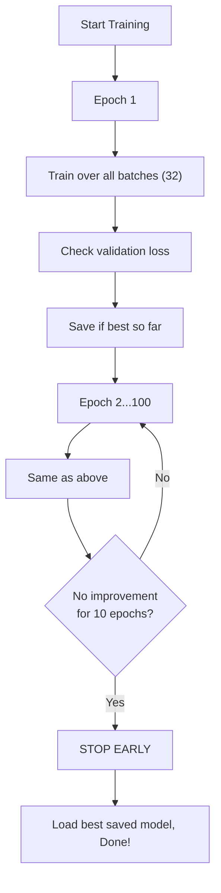

### -ModelFactory and Persistence

**ModelFactory** (`factory.py`) provides unified model instantiation:

| Type Constant                    | Model Class             | Checkpoint Name      | Factory Defaults                                      |
| -------------------------------- | ----------------------- | -------------------- | ------------------------------------------------------ |
| `TYPE_LEGACY` ("default")      | `TeacherRefinementNN`   | `"latest"`           | `input_dim=METADATA_DIM(25)`, `output_dim=OUTPUT_DIM(10)`, `hidden_dim=HIDDEN_DIM(128)` |
| `TYPE_JEPA` ("jepa")           | `JEPACoachingModel`     | `"jepa_brain"`       | `input_dim=METADATA_DIM(25)`, `output_dim=OUTPUT_DIM(10)`       |
| `TYPE_VL_JEPA` ("vl-jepa")     | `VLJEPACoachingModel`   | `"vl_jepa_brain"`    | `input_dim=METADATA_DIM(25)`, `output_dim=OUTPUT_DIM(10)`       |
| `TYPE_RAP` ("rap")             | `RAPCoachModel`         | `"rap_coach"`        | `metadata_dim=METADATA_DIM(25)`, `output_dim=10`   |
| `TYPE_RAP_LITE` ("rap-lite")   | `RAPCoachModel`         | `"rap_lite_coach"`   | `metadata_dim=METADATA_DIM(25)`, `output_dim=10`, `use_lite_memory=True` |
| `TYPE_ROLE_HEAD` ("role_head") | `NeuralRoleHead`        | `"role_head"`        | `input_dim=5`, `hidden_dim=32`, `output_dim=5`     |

> **Note (P1-08):** In a previous version, the factory used `output_dim=4` and `hidden_dim=64` for legacy models, creating a mismatch with `CoachNNConfig`. This has been fixed: now all coaching models (Legacy, JEPA, VL-JEPA) use `OUTPUT_DIM = 10` — the first 10 core aggregate features on which the model predicts delta adjustments. `HIDDEN_DIM = 128` is aligned in both `config.py` and `factory.py`. The RAP and RAP Lite models share the same `RAPCoachModel` class, but RAP Lite activates `use_lite_memory=True`, replacing LTC-Hopfield memory with a pure-PyTorch LSTM fallback (useful when `ncps`/`hflayers` dependencies are not available). The RAP model is imported from the canonical path `backend/nn/experimental/rap_coach/model.py` (the old `backend/nn/rap_coach/model.py` is a redirection shim).
>
> **StaleCheckpointError:** If the dimensions of a saved checkpoint do not match the current model configuration (for example after an upgrade from `output_dim=4` to `output_dim=10`), the system raises `StaleCheckpointError` instead of silently loading incompatible weights, preventing silent corruption.

> **Analogy:** ModelFactory is like a **toy factory** that can build six different types of robots. You tell it "I want a JEPA robot" or "I need a role_head robot" and it knows exactly which parts to use and how to assemble it. RAP Lite is like the "portable" version of the RAP robot — same external features, but with a simpler internal engine (LSTM instead of LTC+Hopfield) that runs anywhere without special components. Each robot has a label with its name (checkpoint name) so you can find it later on the shelf. Instead of remembering how each robot is built, you just tell the factory "build me a jepa" and it takes care of everything.

**Persistence** (`persistence.py`): Save/load with `weights_only=True` (security), graceful fallback chain (user-specific → global → skip), mismatched size handling.

> **Analogy:** Persistence is like **saving video game progress**. After training, the model's "brain state" (all learned weights) is saved to a `.pt` file. When you restart the app, it loads the saved brain instead of starting from scratch. The `weights_only=True` flag is a safety measure, like only loading save files you created, not random ones from the internet that might contain viruses. The fallback chain means: "First, try to load YOUR personal saved brain. If it does not exist, try the default one. If even that does not exist, start from scratch". And if the brain's shape changes (for example by adding new features), it handles the discrepancy smoothly instead of crashing.

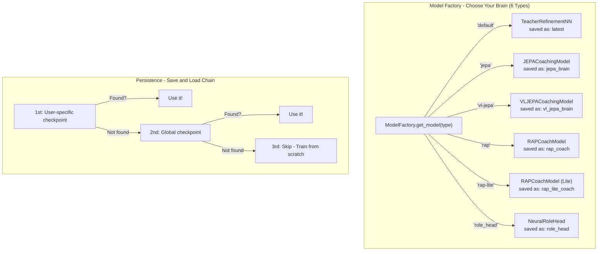

### -Configuration (`config.py`)

```python
GLOBAL_SEED = 42                    # Global reproducibility (AR-6, P1-02)
INPUT_DIM = METADATA_DIM = 25      # Canonical 25-dim vector (was 19, was legacy 12)
OUTPUT_DIM = 10                    # First 10 core features the model predicts adjustments for
HIDDEN_DIM = 128                   # Hidden size for AdvancedCoachNN / TeacherRefinementNN
BATCH_SIZE = 32
LEARNING_RATE = 0.001
EPOCHS = 50
RAP_POSITION_SCALE = 500.0         # P9-01: Scale factor for position delta ([-1,1] → world units)
```

> **Note:** `INPUT_DIM` is imported from `feature_engineering/__init__.py` where `METADATA_DIM = 25`. `OUTPUT_DIM = 10` defines the number of features on which the model produces adjustment predictions — the first 10 match aggregate features (avg_kills, avg_deaths, avg_adr, avg_hs, avg_kast, kill_std, adr_std, kd_ratio, impact_rounds, accuracy). This design choice focuses the model's predictive capacity on the most actionable performance metrics, rather than trying to predict all 25 features (many of which are contextual and not directly improvable by the player). `RAP_POSITION_SCALE = 500.0` is the canonical factor to convert the RAP model's normalized outputs (in the [-1, 1] range) into displacements in CS2 world units.
>
> **Architectural note:** The `CoachNNConfig` dataclass in `model.py` defines `output_dim = METADATA_DIM` (25) as default, but `ModelFactory` always overrides this value with `OUTPUT_DIM = 10` during instantiation. The effective output_dim in production for all models (Legacy, JEPA, VL-JEPA, RAP, RAP Lite) is therefore **10**, not 25. Historically, `OUTPUT_DIM` was 4 (4 selected metrics), then raised to 10 to cover the most relevant aggregate features.

> **Analogy:** This is the **settings page** for the AI brain. Just as a video game has settings for volume, brightness, and difficulty, the neural network has settings for how many features to read (25), how many scores to produce (10 — the most important performance metrics on which the model can suggest improvements), how many examples to study at once (32 — the batch size), how fast it learns (0.001 — the learning speed, like the speed dial on a treadmill), and how many times to revisit all the data (50 epochs). `GLOBAL_SEED = 42` ensures that every training run is reproducible — same seed, same results — via `set_global_seed()` which sets random, numpy, torch, and CUDA. These settings are carefully chosen: learning too fast makes the model "overshoot" and never stabilize; too slow, it takes forever.

**Device management:** `get_device()` implements a **3-tier smart GPU selection**:

1. **User override:** If `CUDA_DEVICE` is configured (e.g. "cuda:0" or "cpu"), use it
2. **Automatic discrete GPU:** `_select_best_cuda_device()` enumerates all CUDA devices and selects the one with the most VRAM, **penalizing integrated GPUs** (Intel UHD, Iris) via keyword matching. On multi-GPU systems (e.g. Intel UHD + NVIDIA GTX 1650), the discrete GPU always wins
3. **CPU fallback:** If no CUDA GPU is available

Batch sizing based on ML intensity: `High=128`, `Medium=32`, `Low=8`. The throttling delay between batches adapts: `High=0.0s`, `Medium=0.05s`, `Low=0.2s`.

> **Analogy:** The device manager checks: "Do I have a turbo engine (GPU/CUDA) available or do I have to use the standard engine (CPU)?". The new selection logic is like a **car rental concierge** that, when multiple cars are available (multiple GPUs), automatically picks the most powerful one and ignores the economy cars. If you have a GTX 1650 and an integrated Intel UHD, the system knows the GTX is the "sports car" and picks it. Otherwise, it falls back to CPU, which is slower but still functional.

### -NeuralRoleHead (MLP for Role Classification)

Defined in `role_head.py`. A lightweight MLP that predicts player role probabilities based on 5 playstyle parameters, operating as a **second opinion** alongside the heuristic `RoleClassifier`. The consensus logic in `role_classifier.py` merges both opinions to produce the final classification.

> **Analogy:** NeuralRoleHead is like a **surprise quiz**: it asks only 5 questions about how you play ("How often do you survive rounds?", "How often do you get the first kill?", "How often are your deaths traded?", "How impactful are you?", "How aggressive are you?") and instantly guesses your role in less than a millisecond. It works alongside the regular role classifier (which uses threshold rules), like two teachers independently evaluating the same student, then comparing their assessments. If they agree, confidence goes up. If they disagree, the neural opinion wins if it is clearly more confident.

**Architecture:**

```
Input (5 features) → Linear(5, 32) → LayerNorm(32) → ReLU
→ Linear(32, 16) → ReLU
→ Linear(16, 5) → Softmax → 5 role probabilities
```

~750 learnable parameters. Minimal compute cost, suitable for per-match inference.

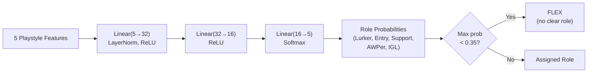

**Input features (5 dimensions):**

| \# | Feature          | Source                              | Range     | Meaning                                                           |
| -- | ---------------- | ----------------------------------- | --------- | ----------------------------------------------------------------- |
| 0  | TAPD             | `rounds_survived / rounds_played`   | [0, 1]    | Survival rate — higher = more passive/support                    |
| 1  | OAP              | `entry_frags / rounds_played`       | [0, 1]    | Opening aggression — higher = entry fragger                      |
| 2  | PODT             | `was_traded_ratio`                  | [0, 1]    | Traded-death percentage — higher = traded/baited                 |
| 3  | rating_impact    | `impact_rating` or HLTV 2.0         | float     | Overall round impact                                              |
| 4  | aggression_score | `positional_aggression_score`       | float     | Tendency for advanced positioning                                 |

**Output roles (5-dim softmax):**

| Index | Role          | Description                                          |
| ----- | ------------- | ---------------------------------------------------- |
| 0     | LURKER        | Hides behind enemy lines                             |
| 1     | ENTRY_FRAGGER | First to enter, takes opening duels                  |
| 2     | SUPPORT       | Site anchor, utility usage, trades                   |
| 3     | AWPER         | Sniper specialist                                    |
| 4     | IGL           | In-game leader, tactical director                    |

**FLEX threshold:** If `max(probabilities) < 0.35`, the player is classified as **FLEX** (versatile, no dominant role). This prevents the model from forcing a role when the player is really a generalist.

**Training details:**

| Aspect                                | Value                                                                                                   |
| ------------------------------------- | ------------------------------------------------------------------------------------------------------- |
| **Loss**                        | `KLDivLoss(reduction="batchmean")` on log-softmax predictions against soft label targets              |
| **Label smoothing**             | ε = 0.02 (prevents log(0), adds regularization)                                                        |
| **Optimizer**                   | AdamW (lr=1e-3, weight_decay=1e-4)                                                                      |
| **Early stopping**              | Patience = 15 epochs on validation loss                                                                 |
| **Max epochs**                  | 200                                                                                                     |
| **Train/Val split**             | 80/20 random (cross-sectional data, not sequential)                                                     |
| **Minimum samples**             | 20 (from the `Ext_PlayerPlaystyle` table)                                                             |
| **Data source**                 | `cs2_playstyle_roles_2024.csv` → `Ext_PlayerPlaystyle` DB table                                     |
| **Normalization**               | Mean/std per feature computed at training time, saved to `role_head_norm.json`                        |

**Consensus with heuristic classifier** (`role_classifier.py`):

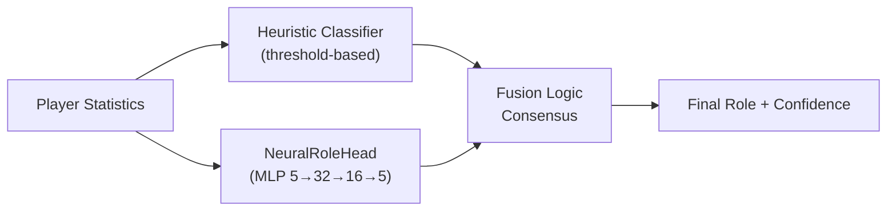

- **Both agree** → confidence boosted by +0.10
- **Disagree, neural margin > 0.1** → neural opinion wins
- **Disagree, neural margin ≤ 0.1** → heuristic opinion wins
- **Neural unavailable** (no checkpoint or norm_stats) → heuristic only
- **Cold-start protection** → returns FLEX with 0% confidence if thresholds have not been learned

### -Coach Introspection Observatory

**Files:** `training_callbacks.py`, `tensorboard_callback.py`, `maturity_observatory.py`, `embedding_projector.py`

The Observatory is a **4-tier plugin architecture** that instruments the training loop without modifying the core training code. It monitors the coach's neural signals during training and translates them into human-interpretable maturity states, enabling developers and operators to understand whether the model is confused, learning, or production-ready.

> **Analogy:** The Observatory is like a **report card system for the coach's brain**. While the coach studies (training), the Observatory constantly checks: "Is this brain confused (DOUBT)? Has it just forgotten everything it learned (CRISIS)? Is it getting smarter (LEARNING)? Is it making confident decisions (CONVICTION)? Is it fully mature (MATURE)?" It is like having a school counselor who checks grades, consistency in assignments, test scores, and the student's behavior, and writes a summary report after every lesson. If the counselor's pen breaks (callback error), they just shrug and move on: the student keeps studying without interruption.

**4-tier architecture:**

| Tier                      | File                        | Purpose                                | Key Output                                                                             |
| ------------------------- | --------------------------- | -------------------------------------- | ------------------------------------------------------------------------------------- |
| 1. **Callback ABC**       | `training_callbacks.py`     | Plugin interface + dispatch registry   | `TrainingCallback` ABC, `CallbackRegistry.fire()`                                     |
| 2. **TensorBoard**        | `tensorboard_callback.py`   | Scalar + histogram logging             | 9+ scalar signals, parameter/grad histograms, gate/belief/concept histograms          |
| 3. **Maturity**           | `maturity_observatory.py`   | Conviction state machine               | 5 signals → `conviction_index` → 5 maturity states                                    |
| 4. **Embedding**          | `embedding_projector.py`    | UMAP belief/concept projection         | Interactive 2D UMAP figures (graceful degradation if umap-learn is not installed)     |

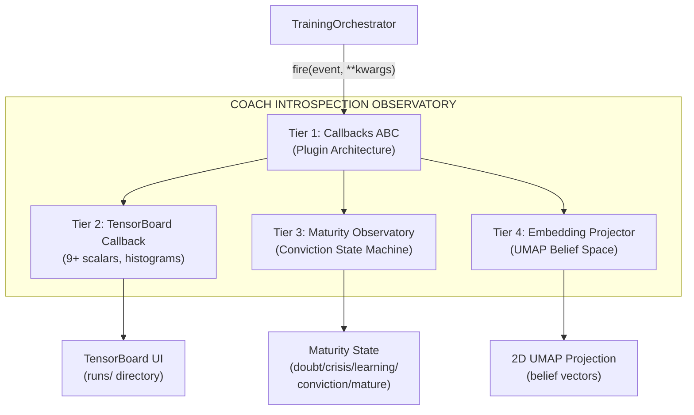

**Maturity State Machine:**

The `MaturityObservatory` computes a **composite conviction index** from 5 neural signals, smooths it with EMA (α=0.3), and classifies the model into one of 5 maturity states:

```mermaid
stateDiagram-v2
    [*] --> DOUBT
    DOUBT --> LEARNING : conviction > 0.3 & increasing
    DOUBT --> CRISIS : was confident, drop > 20%
    LEARNING --> CONVICTION : conviction > 0.6, std < 0.05 for 10 epochs
    LEARNING --> DOUBT : conviction falls below 0.3
    LEARNING --> CRISIS : 20% drop from rolling max
    CONVICTION --> MATURE : conviction > 0.75, stable 20+ epochs,\nvalue_accuracy > 0.7, gate_spec > 0.5
    CONVICTION --> CRISIS : 20% drop from rolling max
    MATURE --> CRISIS : 20% drop from rolling max
    CRISIS --> LEARNING : conviction recovers > 0.3
    CRISIS --> DOUBT : conviction stays < 0.3
```

**5 Maturity Signals:**

| Signal                  | Weight | Range      | What It Measures                                                                | Source                                        |
| ----------------------- | ------ | ---------- | ------------------------------------------------------------------------------- | -------------------------------------------- |
| `belief_entropy`        | 0.25   | [0, 1]     | Shannon entropy of the 64-dim belief vector (lower = more confident)           | `model._last_belief_batch`                   |
| `gate_specialization`   | 0.25   | [0, 1]     | `1 - mean_gate_activation` (higher = more specialized experts)                 | `SuperpositionLayer.get_gate_statistics()`   |
| `concept_focus`         | 0.20   | [0, 1]     | `1 - entropy(concept_embedding_norms)` (lower entropy = focused)                | `model.concept_embeddings`                   |
| `value_accuracy`        | 0.20   | [0, 1]     | `1 - (val_loss / initial_val_loss)` (higher = better calibration)              | Validation loop                              |
| `role_stability`        | 0.10   | [0, 1]     | Conviction consistency across recent epochs (`1 - std*5`)                     | Self-referential history                     |

**Conviction formula:**

```
conviction_index = 0.25 × (1 - belief_entropy)
+ 0.25 × gate_specialization
+ 0.20 × concept_focus
+ 0.20 × value_accuracy
+ 0.10 × role_stability

maturity_score = EMA(conviction_index, α=0.3)
```

**State thresholds:**

| State                   | Condition                                                                                                   |
| ----------------------- | ----------------------------------------------------------------------------------------------------------- |
| **DOUBT**               | `conviction < 0.3`                                                                                          |
| **CRISIS**              | `conviction` drops > 20% from rolling maximum within 5 epochs                                               |
| **LEARNING**            | `conviction ∈ [0.3, 0.6]` and increasing                                                                    |
| **CONVICTION**          | `conviction > 0.6`, stable (`std < 0.05` over 10 epochs)                                                    |
| **MATURE**              | `conviction > 0.75`, stable for 20+ epochs, `value_accuracy > 0.7`, `gate_specialization > 0.5`             |

**`MaturitySnapshot` dataclass:** Every epoch, the Observatory produces an immutable snapshot:

| Field | Type | Description |
|---|---|---|
| `epoch` | int | Epoch number |
| `timestamp` | datetime | Time of recording |
| `belief_entropy` | float | Shannon entropy of the belief vector |
| `gate_specialization` | float | Expert specialization |
| `concept_focus` | float | Focus on coaching concepts |
| `value_accuracy` | float | Value prediction accuracy |
| `role_stability` | float | Role classification stability |
| `conviction_index` | float | Weighted composite index |
| `maturity_score` | float | EMA-smoothed score (α=0.3) |
| `state` | str | Current state (DOUBT/CRISIS/LEARNING/CONVICTION/MATURE) |

**Extraction of the 5 neural signals — how they are computed:**

| Signal | Method | Data Source | Computation |
|---|---|---|---|
| `belief_entropy` | `_compute_belief_entropy()` | `model._last_belief_batch` | softmax(belief) → Shannon entropy / log(dim) → 1 - normalized |
| `gate_specialization` | `_compute_gate_specialization()` | `strategy.superposition.get_gate_statistics()` | `1 - mean_activation` (higher = more specialized experts) |
| `concept_focus` | `_compute_concept_focus()` | `model.concept_embeddings.weight` | L2 norms → softmax → `1 - entropy` (lower = more focused) |
| `value_accuracy` | `_compute_value_accuracy()` | Validation cycle | `1 - (val_loss / initial_val_loss)`, clamped [0, 1] |
| `role_stability` | `_compute_role_stability()` | Recent history | `1 - std(last 10 conviction_index) × 5`, clamped [0, 1] |

**Public API:** `current_state` (property → state string), `current_conviction` (property → float), `get_timeline()` (→ list of `MaturitySnapshot` for export/plots).

**TensorBoard integration:** Each `on_epoch_end()` logs **7 scalars** to TensorBoard:

```
maturity/belief_entropy, maturity/gate_specialization, maturity/concept_focus,
maturity/value_accuracy, maturity/role_stability,
maturity/conviction_index, maturity/maturity_score
```

Plus a text log of the current state via structured logger.

> **Extended analogy:** Each signal measures a different aspect of the model's "mental health". The `belief entropy` is like asking "Is your brain confident or confused?". The `gate specialization` is "Do your experts have clear roles or are they all doing the same thing?". The `concept focus` is "Are you using the 16 coaching vocabularies distinctly or are you mixing them up?". The `value accuracy` is "Do your advantage estimates match reality?". The `role stability` is "Do you keep changing your mind or are you consistent?". The conviction index combines all this into a single "health grade" and the EMA smooths it to avoid oscillations — like a doctor who does not get alarmed by a single abnormal heartbeat but looks at the trend.

**Design guarantees:**

- **Zero impact if disabled:** When no callbacks are registered, all `CallbackRegistry.fire()` calls are no-ops. No memory allocation, no compute overhead.
- **Error isolation:** Each callback is individually try/except-wrapped. A TensorBoard write error or a UMAP computation error never causes the training loop to crash: the error is logged and training continues.
- **Composable:** New callbacks can be added by subclassing `TrainingCallback` and registering with `CallbackRegistry.add()`. No need to modify the training code.

**CLI integration:** Started via `run_full_training_cycle.py` with the flags:

- `--no-tensorboard` — disables the TensorBoard callback
- `--tb-logdir <path>` — sets the TensorBoard log directory (default: `runs/`)
- `--umap-interval <N>` — UMAP projection every N epochs (default: 10)

---

## Part 1A Summary — The Brain

Part 1A documented the **cognitive core** of the coaching system — the entire neural network subsystem that constitutes the coach's "brain":

| Component | Role | Key Details |
|---|---|---|
| **AdvancedCoachNN** | Supervised baseline coaching | 2-layer LSTM + 3 MoE experts, 25-dim input, 10-dim output |
| **JEPA** | Self-supervised pre-training | Online/target encoder (EMA τ=0.996), InfoNCE contrastive |
| **VL-JEPA** | Vision-language alignment | 16 coaching concepts across 5 tactical dimensions |
| **SuperpositionLayer** | Contextual gating | 25-dim context-dependent modulation with integrated observability |
| **CoachTrainingManager** | Training orchestration | 3 maturity levels (CALIBRATION→LEARNING→MATURE) |
| **TrainingOrchestrator** | Unified epoch cycle | Early stopping, checkpoints, callbacks, cross-match negative pool, quality gate |
| **ModelFactory** | Model instantiation | 6 model types (+ RAP Lite) with persistence and fallback |
| **NeuralRoleHead** | Role classification | MLP 5→32→16→5, consensus with heuristic |
| **MaturityObservatory** | Training introspection | 5 signals → conviction index → 5 maturity states |

> **Analogy:** If the coaching system were a **human being**, Part 1A described its brain — the neural networks that learn, the maturity assessment system that decides when the brain is ready to give advice, and the factory that builds and saves each kind of brain. But a brain alone is not enough: it needs **eyes and ears** to perceive the world and a **medical specialist** for in-depth diagnosis. **Part 1B** documents exactly that.

```mermaid
flowchart LR
    subgraph PART1A["PART 1A — The Brain (this document)"]
        NN["NN Core<br/>(JEPA, VL-JEPA,<br/>AdvancedCoachNN)"]
        OBS["Observatory<br/>(TensorBoard + Maturity<br/>+ Embedding)"]
        FACTORY["ModelFactory +<br/>Persistence"]
    end
    subgraph PART1B["PART 1B — The Senses and the Specialist"]
        RAP["RAP Coach<br/>(7 components +<br/>ChronovisorScanner +<br/>GhostEngine)"]
        DS["Data Sources<br/>(Demo, HLTV, Steam,<br/>FACEIT, TensorFactory,<br/>FrameBuffer, FAISS)"]
    end
    subgraph PART2["PART 2 — Services and Infrastructure"]
        SVC["Coaching Services<br/>(4-tier fallback)"]
        ANL["Analysis Engines<br/>(11 specialists)"]
        KB["Knowledge<br/>(RAG + COPER)"]
        DB["Database<br/>(Tri-Tier SQLite)"]
    end

    DS --> NN
    DS --> RAP
    NN --> SVC
    RAP --> SVC
    OBS --> NN
    FACTORY --> NN
    ANL --> SVC
    KB --> SVC
    SVC --> DB

    style PART1A fill:#e8f4f8
    style PART1B fill:#fff3e0
    style PART2 fill:#f0f8e8
```

> **Continued in Part 1B** — *The Senses and the Specialist: RAP Coach Model, ChronovisorScanner, GhostEngine, Data Sources (Demo Parser, HLTV, Steam, FACEIT, TensorFactory, FrameBuffer, FAISS, Round Context)*
