# Ultimate CS2 Coach - Parte 1A: O Cerebro

> **Topicos:** Arquitetura neural completa, regime de treinamento, modelos de deep learning (JEPA, VL-JEPA, LSTM+MoE), Observatorio de Introspeccao do Coach, contrato 25-dim, principio NO-WALLHACK, e panorama da arquitetura de sistema (inicializacao, interface desktop Qt/PySide6, arquitetura quad-daemon, pipeline geral).
>
> **Autor:** Renan Augusto Macena

---

### Introducao de Renan

Este projeto e o resultado de incontaveis horas de preparacao, aperfeicoamento e, sobretudo, pesquisa. Counter-Strike e o meu futebol, algo pelo qual sou apaixonado a vida toda, como a musica. Neste jogo eu ja tenho mais de 10 mil horas e jogo desde 2004, sempre desejei uma orientacao profissional, como a dos jogadores profissionais de verdade, para entender como realmente parece quando alguem treina do jeito certo, e joga do jeito certo sabendo o que e certo ou errado e nao apenas supondo. Neste ponto a minha confianca esta ligada ao meu conhecimento do jogo, mas ainda esta longe do nivel em que eu gostaria de jogar. Imagino que muitas pessoas como eu, neste jogo ou talvez em outros, se sintam do mesmo jeito: sabem que tem experiencia e conhecimento do que estao fazendo, mas percebem que os jogadores profissionais sao tao mais habilidosos e refinados que nem mesmo anos de experiencia podem igualar uma fracao do que esses profissionais oferecem.

Este projeto tenta "dar vida", usando tecnicas avancadas, a um coach definitivo para Counter-Strike, que entenda o jogo, avalie dezenas de aspectos com clareza e julgamento refinado, assimile e se torne mais inteligente com o passar do tempo.. Meu objetivo final e faze-lo ingerir, processar e aprender de todas as partidas pro de sempre, nao todos os playoffs, alem de ser irrealista pelo tamanho e tempo de processamento, seria inutil pois o meu objetivo e ter este coach definitivo baseado no melhor do melhor. O modelo para o jogador "de baixa habilidade" sera sempre o usuario, ele ou ela nunca tera demos e partidas das quais este coach possa aprender; em vez disso, este e um metodo de abordagem completamente diferente, ja que o coach utilizara seu modelo de alta qualidade para compara-lo com o modelo do usuario, mostrando o quanto o usuario esta realmente distante do nivel de um jogador profissional e, mais importante, adaptando os ensinamentos para ajudar o usuario a alcancar o nivel pro, adaptando-se a cada estilo diferente de jogo: se eu sou um awper, lentamente mas inexoravelmente este coach me ensinara como me tornar um awper profissional, e isso vale para cada papel no jogo em que um usuario queira se tornar um profissional.

E agora com a paixao que estou desenvolvendo pela programacao, entendendo toda essa coisa complicada sobre gerenciamento de banco de dados, SQL, modelos de machine learning, Python, e o quao elegante pode ser, de todos esses passos tecnicos de implementacao, ajuste e criacao de APIs, e entendendo o que e aquela .dll que eu vi a vida toda dentro das pastas do jogo, entendendo para que servem aqueles frameworks como Kivy para criar a parte grafica, aprendendo o que realmente significa criar software, tive que aprender a ir para o Linux (definitivamente nao sou um profissional, e se eu nao tivesse seguido as mesmas instrucoes que criei enquanto pesquisava e continuava trabalhando neste projeto, nao teria conseguido) para entender como construir o programa, como torna-lo cross-platform. Do Linux, construi a versao APK (tenho que terminar de trabalhar nela tambem), e pelo menos entendi os conceitos mais importantes da Compilacao, depois terminei a build desktop no Windows e fiz todo o resto, compilacao e empacotamento. Em resumo, se empurrar ao limite para entender, desafiar-se tanto, em tantos aspectos diferentes que voce precisa ou assimilar nao apenas algo mas tambem as especificidades e o quadro complexo de tudo, ou nao chegara a lugar nenhum.

Usei ferramentas, como Claude CLI no terminal windows e linux, para me ajudar a organizar o codigo e corrigir os erros de sintaxe. Criei uma pasta na pasta do projeto contendo uma "Tool Suite" composta por scripts Python que ajudei a criar e que tem uma tonelada de funcoes uteis, do debug a modificacao de valores, regras, funcoes, strings em nivel global ou local do projeto de modo que a partir de uma unica entrada dentro daquela ferramenta, eu possa mudar tudo o que quiser "em qualquer lugar", ate mesmo mudar coisas no dashboard grafico com os inputs. Nao durmo ha cerca de vinte dias consecutivos (desde 24 de dezembro de 2025), sim, mas acho que vale a pena, e sei bem que este e apenas um treinamento no final que eu entendi como fazer sozinho do inicio ao fim, entao certamente ha erros por ai. Se pode ser realmente util, realmente funcional, etc., etc., e muitas outras coisas bonitas, nao sei. Nao quero superestimar o que estou fazendo. Estou fazendo, mas coloquei muito esforco mesmo.

Espero que algo ali dentro possa ser util.

> *Nota: O framework UI foi posteriormente migrado de Kivy para Qt/PySide6 (marco de 2026), como documentado na Parte 3.*

---

## Indice

**Parte 1A - O Cerebro: Arquitetura Neural e Treinamento (este documento)**

1. [Resumo executivo](#1-resumo-executivo)
2. [Panorama da arquitetura de sistema](#2-panorama-da-arquitetura-do-sistema)
   - Principio NO-WALLHACK e Contrato 25-dim
3. [Subsistema 1 - Nucleo da rede neural (`backend/nn/`)](#3-subsistema-1--nucleo-da-rede-neural)
   - AdvancedCoachNN (LSTM + MoE)
   - JEPA (Auto-Supervisionado InfoNCE)
   - **VL-JEPA** (Visao-Linguagem, 16 Conceitos de Coaching, ConceptLabeler)
   - JEPATrainer (Treinamento + Monitoramento Drift)
   - Pipeline Standalone (jepa_train.py)
   - SuperpositionLayer (Gating Contextual, Observabilidade Avancada, Inicializacao Kaiming)
   - Modulo EMA
   - CoachTrainingManager, TrainingOrchestrator, ModelFactory, Config
   - NeuralRoleHead (Classificacao de Papeis MLP)
   - Coach Introspection Observatory (MaturityObservatory - Maquina de 5 Estados)

**Parte 1B** - Os Sentidos e o Especialista: Modelo RAP Coach (arquitetura 7 componentes, ChronovisorScanner, GhostEngine), Fontes de Dados (Demo Parser, HLTV, Steam, FACEIT, TensorFactory, FAISS)

**Parte 2** - Secoes 5-13: Servicos de Coaching, Coaching Engines, Conhecimento e Recuperacao, Motores de Analise (11), Processamento e Feature Engineering, Modulo de Controle, Progresso e Tendencias, Banco de Dados e Storage (Tri-Tier), Pipeline de Treinamento e Orquestracao, Funcoes de Perda

**Parte 3** - Logica do Programa, UI, Ingestao, Tools, Tests, Build, Remediacao

---

## 1. Resumo executivo

CS2 Ultimate e um **sistema de coaching baseado em IA hibrido** para Counter-Strike 2 (CS2). Combina modelos de deep learning (JEPA, VL-JEPA, LSTM+MoE, uma arquitetura RAP de 7 componentes (Percepcao, Memoria LTC+Hopfield, Estrategia, Pedagogia, Atribuicao Causal, Cabeca de Posicionamento + Comunicacao externa), um Neural Role Classification Head), um Coach Introspection Observatory, um Retrieval-Augmented Generation (RAG), o banco de experiencias COPER, a busca baseada em teoria dos jogos, a modelagem bayesiana das crencas e uma arquitetura Quad-Daemon (Hunter, Digester, Teacher, Pulse) em uma pipeline unificada que:

1. **Ingere** arquivos demo profissionais e de usuario, extraindo estatisticas de estado em nivel de tick e de partida.
2. **Treina** varios modelos de redes neurais atraves de um programa em fases com limites de maturidade (em 3 niveis: CALIBRACAO -> APRENDIZADO -> MADURO). 3. **Infere** conselhos de treinamento fundindo as previsoes de machine learning com conhecimentos taticos recuperados semanticamente atraves de uma cadeia de fallback de 4 niveis (COPER -> Hibrido -> RAG -> Base).
3. **Explica** seu raciocinio atraves de atribuicao causal, narrativas baseadas em template, comparacoes entre jogadores profissionais e um refinamento LLM opcional (Ollama).

O sistema contem **~103.600 linhas de Python** distribuidas em 411 arquivos `.py` sob `Programma_CS2_RENAN/`, que se estendem por **oito subsistemas logicos de IA** (NN Core com VL-JEPA, RAP Coach + RAP Lite, Coaching Services, Knowledge & Retrieval, Analysis Engines (11), Processing & Feature Engineering, Fontes de Dados, Motores de Coaching), um Observatorio de treinamento, um modulo de Controle (Console com REST API, DB Governor, Ingest Manager, ML Controller), uma arquitetura Quad-Daemon para automacao em background (Hunter, Digester, Teacher, Pulse), uma interface desktop Qt/PySide6 com 15 telas e pattern MVVM (migrada de Kivy em marco de 2026), um sistema completo de ingestao (com subsistema HLTV dedicado: HLTVApiService, CircuitBreaker, RateLimiter), storage e reporting, uma **Tools Suite** com 41 scripts Python de validacao e diagnostico (29 root + 12 no pacote - Goliath Hospital, headless validator, Ultimate ML Coach Debugger, validate_coaching_pipeline, ingest_pro_demos, dead_code_detector, dev_health, rebuild_monolith, tick_census), uma arquitetura tri-database especializada com 18 tabelas SQLModel no monolito (+ 3 no banco HLTV separado + 3 nos bancos por-match = 24 totais), e uma **Test Suite** com 99 arquivos de teste organizados em 6 categorias: analysis/theory, coaching/training, ML/models, data/storage, UI/playback, integration/misc. O projeto passou por um processo de **remediacao sistematica em 13 fases** que resolveu 412+ problemas de qualidade do codigo, correcao ML, seguranca e arquitetura, incluindo a eliminacao de label leakage no treinamento (G-01), a implementacao da zona de perigo visual no tensor de visao (G-02), a calibracao automatica do estimador bayesiano (G-07), e a correcao do fallback do coaching COPER (G-08), seguida por uma **segunda onda de remediacao** que resolveu mais 162 problemas (31 HIGH + 131 MEDIUM) relacionados a thread safety, schema drift, Qt lifecycle, e hardening de observabilidade, e uma **terceira onda** (abril de 2026) que enderecou 40+ problemas adicionais incluindo type safety (SA-14 a SA-27), dependency pinning (DEP-1), checkpoint security (CTF-1/2), DataLineage audit trail (DL-1), e correcoes UI/UX (UX-1/2/3). A pipeline end-to-end foi completada em 12 de marco de 2026: 11 demos profissionais ingeridas, 17.3M linhas de tick, 6.4GB de banco de dados, JEPA pre-treinado (train loss 0.9506, val loss 1.8248). Atualizacao abril 2026: 156 bancos de dados por-match, AdvancedCoachNN completamente treinado (`latest.pt`), banco HLTV populado com **161 jogadores profissionais reais** (32 times, 156 stat cards), HybridCoachingEngine potencializado com selecao automatica do pro de referencia por nome nos feedbacks de coaching, **Coach Book v4** expandido para **502 entradas** de conhecimento tatico em 8 arquivos JSON (7 mapas + geral) com 13 categorias, **CoachingDialogueEngine** para coaching multi-turno com drill-down por-jogador e por-round, **MovementQualityAnalyzer** (11o motor de analise), **EloAugmentedPredictor** para probabilidade de vitoria com feature Elo, **PlusMinus rating metric**, potencializacoes COPER (incerteza TrueSkill, semantica CRUD, replay priorizado), codificacao posicao relativa ao bombsite, priorizacao de demos por variancia de coaching com scoring de qualidade via modelo Huber, e **CS2 Coach Bench** benchmark de avaliacao com 200 perguntas.

> **Analogia:** Imagine que voce tem um treinador robo super inteligente que assiste as suas partidas de futebol em video. Primeiramente, ele **observa** centenas de partidas profissionais e as suas, anotando cada movimento (essa e a parte de "ingestao", gerenciada pelo daemon Hunter que escaneia as pastas e pelo daemon Digester que processa os arquivos). Depois, ele **estuda** essas anotacoes e aprende o que os grandes jogadores fazem de forma diferente dos iniciantes, como um estudante que enfrenta os varios niveis escolares (CALIBRAR e o jardim de infancia, APRENDER e o ensino fundamental, AMADURECER e o diploma) - isso o daemon Teacher faz em background. Quando chega a hora de te dar um conselho, ele nao se limita a chutar: consulta seu **caderno de sugestoes**, sua **memoria das sessoes de treinamento passadas** e o que os **profissionais** fariam na sua exata situacao, escolhendo a fonte de que mais confia. Finalmente, **explica** por que esta te dizendo para fazer algo, nao apenas "faca isso", mas "faca isso *porque* voce continua sendo pego de surpresa". E como ter um treinador que viu cada partida profissional ja jogada, lembra de cada sessao de treinamento que voce fez e pode te explicar exatamente por que voce deveria mudar de estrategia. Enquanto isso, a interface desktop Qt/PySide6 mostra tudo em tempo real: um mapa tatico 2D com o seu "fantasma" otimo, graficos radar das suas habilidades, e um dashboard que te diz exatamente em que ponto esta o seu treinador no processo de aprendizado. O daemon Pulse garante que o sistema esteja sempre vigilante com um batimento cardiaco constante.

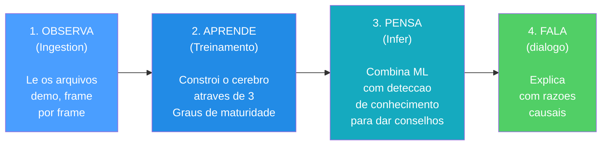

> 406 .py files - 102.000+ lines - 8 AI subsystems + Observatory + Control Module (REST API) + Quad-Daemon + Desktop UI Qt/PySide6 (15 screens) + 41 Tools (29 root + 12 inner) - 94 test files - 21 tabelas SQLModel (monolito) + 3 per-match - Arquitetura tri-database (database.db + hltv_metadata.db + banco per-match) - Indexacao vetorial FAISS (IndexFlatIP 384-dim) - Internacionalizacao i18n (EN/IT/PT) - Acessibilidade WCAG 1.4.1 (theme.py) - 12 relatorios de auditoria abrangentes (incl. revisao de literatura 140KB, 30 artigos peer-reviewed) - 610+ problemas resolvidos (412 em 13 fases + 162 em segunda onda + 40+ em terceira onda) - Pipeline end-to-end completada (156 per-match DB - JEPA + AdvancedCoachNN treinados - 161 jogadores HLTV reais, 32 times, 156 stat cards - Coach Book v4: 502 entradas, 8 arquivos, 13 categorias - CS2 Coach Bench: 200 perguntas)

---

## 2. Panorama da arquitetura do sistema

O sistema e dividido em **6 subsistemas principais** que trabalham juntos como os departamentos de uma empresa. Cada subsistema tem uma tarefa especifica e os dados fluem entre eles em uma pipeline bem definida.

> **Analogia :** Pense no sistema inteiro como uma **grande fabrica com 6 departamentos**. O primeiro departamento (Ingestao) e a **sala de correio**: recebe as gravacoes brutas das partidas e as organiza. O segundo departamento (Processamento) e a **oficina**: analisa as gravacoes e mede tudo o que contem. O terceiro departamento (Formacao) e a **escola**: instrui o cerebro da IA mostrando-lhe milhares de exemplos. O quarto departamento (Conhecimento) e a **biblioteca**: armazena sugestoes, conselhos passados e conhecimentos especializados para que o treinador possa consulta-los. O quinto departamento (Inferencia) e o **cerebro**: combina o que a IA aprendeu com o que a biblioteca conhece para criar conselhos. O sexto departamento (Analise) e a **equipe investigativa**: conduz investigacoes especiais como "este jogador esta em dificuldade?" ou "era uma boa posicao?". Todos os seis departamentos trabalham juntos para que o treinador possa fornecer conselhos inteligentes e personalizados.

```mermaid
graph TB
    subgraph Aquisicao["Aquisicao (Fontes de Dados)"]
        DEMO["Arquivo .dem"] --> FMT_ADAPT["Format Adapter<br/>(magic bytes, validacao)"]
        FMT_ADAPT --> PARSER["Parser Demo<br/>(demoparser2)"]
        PARSER --> TRADE_DET["Trade Kill Detector<br/>(janela 192 tick)"]
        HLTV["Crawler HLTV<br/>(CircuitBreaker, RateLimiter)"] --> PRO_DB["DB Jogadores Pro"]
        CSV["CSV Externos"] --> EXT_DB["Migrador CSV"]
        STEAM_API["Steam Web API<br/>(retry + backoff)"] --> STEAM_PROFILE["Perfil Jogador"]
        STEAM_FIND["Steam Demo Finder<br/>(cross-platform)"] --> DEMO
        FACEIT_API["FACEIT API<br/>(rate limited 10/min)"] --> FACEIT_DATA["Elo + Level"]
        EVTREG["Event Registry<br/>(Schema CS2)"] -.-> PARSER
    end

    subgraph Processamento
        PARSER --> FE["Engenharia de Features<br/>(feature_base, kast, rating, feature_role)"]
        PARSER --> TF["Fabrica de Tensores<br/>(mapa, visao, raster movimento)"]
        FE --> VEC["Vetorizador Unificado<br/>(FeatureExtractor 25-dim)"]
        VEC --> SR["Reconstrutor de Estado"]
        PARSER --> PK["PlayerKnowledge<br/>(NO-WALLHACK)"]
        PK --> TF
        TF --> SR
        FB["FrameBuffer<br/>(ring buffer 30 frames,<br/>extracao HUD)"] -.-> TF
    end

    subgraph Treinamento
        SR --> JEPA["Pre-Treinamento JEPA<br/>(Auto-Supervisionado InfoNCE)"]
        SR --> VLJEPA["VL-JEPA<br/>(Alinhamento Visao-Linguagem)"]
        FE --> MLP["AdvancedCoachNN<br/>(LSTM + MoE, 3 especialistas)"]
        SR --> RAP["Treinamento RAP Coach<br/>(Arquitetura 7 Componentes)"]
        EXT_DB --> ROLE_HEAD["NeuralRoleHead<br/>(MLP 5->32->16->5)"]
        JEPA --> COACH_MGR["Gerenciador Coach<br/>(Gating Maturidade 3 Niveis)"]
        VLJEPA --> COACH_MGR
        MLP --> COACH_MGR
        RAP --> COACH_MGR
        ROLE_HEAD --> COACH_MGR
    end

    subgraph Observatorio["Observatorio (Introspeccao Treinamento)"]
        COACH_MGR --> OBS_CB["Registro Callback<br/>(Arquitetura Plugin)"]
        OBS_CB --> OBS_TB["TensorBoard<br/>(9+ escalares, histogramas)"]
        OBS_CB --> OBS_MAT["Observatorio Maturidade<br/>(5 sinais -> conviccao)"]
        OBS_CB --> OBS_EMB["Projetor Embedding<br/>(espaco crencas UMAP)"]
    end

    subgraph Conhecimento
        RAG["Base Conhecimento RAG<br/>(Sentence-BERT 384-dim)"]
        FAISS_IDX["Indice FAISS<br/>(IndexFlatIP 384-dim,<br/>busca sub-linear)"]
        EB["Banco Experiencias<br/>(Framework COPER)"]
        KG["Grafo do Conhecimento<br/>(entidades + relacoes SQLite)"]
        RAG --> FAISS_IDX
    end

    subgraph Analise["Analise (11 Motores)"]
        GT["Expectiminimax<br/>Arvore de Jogo - profundidade 3"]
        BM["Estimador Bayesiano<br/>Probabilidade Morte +<br/>Calibrador Adaptativo"]
        DI["Indice Engano<br/>3 sub-metricas"]
        RC["Classificador Papeis<br/>6 papeis + Consenso Neural"]
        WP["Preditor Probabilidade<br/>Vitoria - NN + EloAugmented"]
        MOM["Rastreador Momentum<br/>Deteccao Tilt/Hot"]
        ENT["Analisador Entropia<br/>Impacto utilidade Shannon"]
        BS["Detector Pontos Cegos"]
        UE["Utilidade e Economia<br/>Otimizador compras"]
        ER["Analisador Engajamento<br/>50+ posicoes 8 mapas"]
        MQ["Qualidade Movimento<br/>Analise trajetoria + economia"]
    end

    subgraph Coaching_Engines["Motores de Coaching"]
        CE_CORR["CorrectionEngine<br/>(top-3 correcoes ponderadas)"]
        CE_HYBRID["HybridEngine<br/>(ML Z-score + RAG)"]
        CE_EXPLAIN["ExplainabilityGenerator<br/>(5 eixos + template)"]
        CE_LONG["LongitudinalEngine<br/>(Trend-aware coaching)"]
        CE_CORR --> CE_HYBRID --> CE_EXPLAIN
    end

    subgraph Inferencia
        COACH_MGR --> HE["Servico Coaching 4 Niveis<br/>(COPER, Hibrido, RAG, Base)"]
        RAG --> HE
        EB --> HE
        KG --> HE
        PRO_DB --> PB["Ponte Pro / Resolvedor Token"]
        PB --> HE
        GT --> HE
        BM --> HE
        DI --> HE
        RC --> HE
        CE_EXPLAIN --> HE
        FACEIT_DATA --> PB
        STEAM_PROFILE --> PB
        HE --> OLLAMA["OllamaCoachWriter<br/>(Refinamento NL Opcional)"]
        HE --> DLG["CoachingDialogueEngine<br/>(Multi-turno, drill-down)"]
        HE --> EXP["Camada Explicabilidade"]
    end

    subgraph Controle["Modulo de Controle"]
        CTRL_CONSOLE["Console de Sistema<br/>(TUI Rich, CLI, REST API)"]
        CTRL_DB["DB Governor<br/>(WAL audit, Tier 1-3)"]
        CTRL_INGEST["Ingest Manager<br/>(Thread-safe, 30min re-scan)"]
        CTRL_ML["ML Controller<br/>(Throttle, Stop)"]
    end

    subgraph Progresso["Progress & Trend"]
        PROG_LONG["Longitudinal Analysis<br/>(slope, volatility, confidence)"]
        PROG_TREND["Trend Analysis<br/>(numpy polyfit)"]
        PROG_LONG --> CE_LONG
    end

    EXP --> UI["GUI Qt/PySide6"]

    subgraph Plataforma["Plataforma e Acessibilidade"]
        I18N["i18n<br/>(en.json, it.json, pt.json)"]
        THEME["theme.py<br/>(WCAG 1.4.1,<br/>rating_color + rating_label)"]
        PLAT["platform_utils.py<br/>(deteccao drive<br/>cross-platform)"]
    end
    I18N --> UI
    THEME --> UI

    style JEPA fill:#4a9eff,color:#fff
    style VLJEPA fill:#3b8ae6,color:#fff
    style RAP fill:#ff6b6b,color:#fff
    style ROLE_HEAD fill:#cc5de8,color:#fff
    style HE fill:#51cf66,color:#fff
    style RAG fill:#ffd43b,color:#000
    style OBS_TB fill:#868e96,color:#fff
    style OBS_MAT fill:#868e96,color:#fff
    style OBS_EMB fill:#868e96,color:#fff
```

**Explicacao do Diagrama:** Este grande diagrama e como um **mapa do tesouro** que mostra como as informacoes viajam atraves do sistema. A jornada comeca em cima a esquerda com as gravacoes brutas do jogo (arquivos `.dem`, dados HLTV, arquivos CSV): pense neles como **ingredientes brutos** que chegam a cozinha. Esses ingredientes passam pela secao Processamento onde sao **cortados, medidos e preparados** (as caracteristicas sao extraidas, os vetores sao criados). Depois alcancam a secao Formacao onde cinco diferentes "chefs" (JEPA, VL-JEPA, AdvancedCoachNN, RAP e NeuralRoleHead) aprendem cada um seu proprio estilo de culinaria. O Observatorio e o **inspetor do controle de qualidade** que observa cada sessao de formacao, verificando se os chefs estao melhorando, estagnados ou em panico. A secao Conhecimento e como a **estante do livro de receitas**: contem sugestoes (RAG), sucessos culinarios passados (COPER) e relacoes entre os ingredientes (Grafico do Conhecimento). A secao Inferencia e onde o **chef principal** combina tudo - competencias adquiridas, livros de receitas e tecnicas de chef profissional - para criar o prato final: conselhos de coaching. A secao Analise e como ter **criticos gastronomicos** que avaliam qualidades especificas: "Esta muito picante?" (momentum), "E criativo?" (indice de engano), "Esqueceram um ingrediente?" (pontos cegos). Nos bastidores, a **arquitetura Quad-Daemon** (Hunter, Digester, Teacher, Pulse) trabalha incansavelmente como a equipe de cozinha automatizada: escaneia novos ingredientes, os prepara e atualiza as competencias dos chefs sem nunca parar. Tudo flui para baixo e para direita ate alcancar a interface grafica Qt/PySide6, o **prato** onde o usuario ve o resultado final.

### Resumo do fluxo de dados

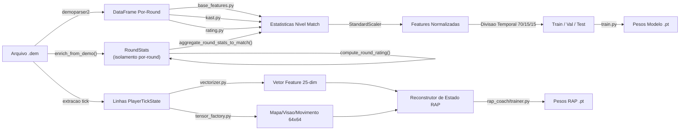

**Explicacao do diagrama:** Este diagrama mostra as **duas linhas de montagem paralelas** dentro do departamento de processamento. Imagine a gravacao de uma partida (arquivo `.dem`) como um **longo filme**. A **linha de montagem superior** assiste o filme e escreve estatisticas resumidas, como um boletim para cada partida (abates, mortes, danos, etc.). Esses boletins sao normalizados (colocados na mesma escala, como se todas as temperaturas fossem convertidas em graus Celsius), divididos em grupos de estudo (70% para aprendizado, 15% para quizzes, 15% para exames finais) e usados para treinar o modelo de treinamento de base. A **linha de montagem inferior** e mais detalhada: examina o filme **quadro por quadro** (cada "tique" do cronometro do jogo), medindo 25 informacoes sobre cada jogador em cada momento (posicao, saude, o que veem, economia, etc.) e criando "snapshots" de 64x64 pixels do mapa. Tanto os numeros quanto as imagens sao inseridos no State Reconstructor do RAP Coach, que os combina em um quadro completo de "o que estava acontecendo neste momento preciso" - e e disso que o modelo avancado RAP Coach aprende.

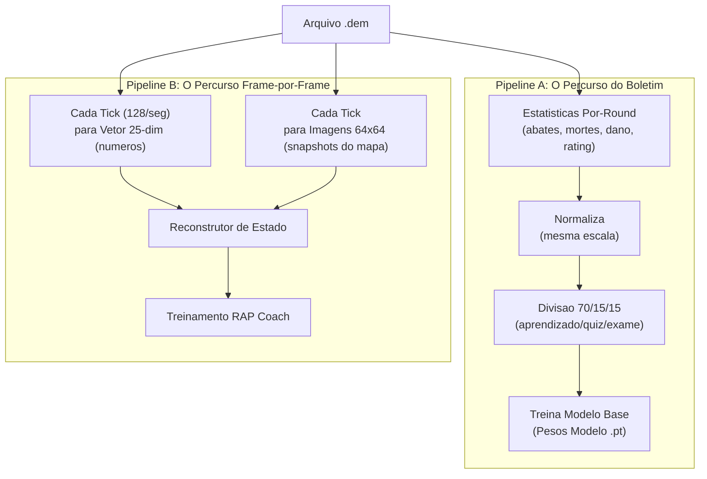

### Principio NO-WALLHACK e Contrato 25-dim

Dois invariantes arquiteturais fundamentais atravessam o sistema inteiro:

**1. Principio NO-WALLHACK:** O coach IA **ve apenas o que o jogador legitimamente conhece**. Quando o modulo `PlayerKnowledge` esta disponivel, os tensores gerados pela `TensorFactory` codificam exclusivamente informacoes legitimas: companheiros de equipe (sempre visiveis), inimigos em posicoes "last-known" (com decaimento temporal, tau = 2.5s), utilidade propria e observada. Nenhuma informacao "wallhack" (posicoes inimigas reais nao visiveis) entra jamais no sistema de percepcao. Quando `PlayerKnowledge` e `None`, o sistema recai em um modo legacy com tensores simplificados.

> **Analogia:** O principio NO-WALLHACK e como um **exame de direcao onde o instrutor ve apenas o que o aluno ve**. O instrutor nao tem acesso a uma camera externa que mostra todos os obstaculos ocultos - deve avaliar as decisoes do aluno baseando-se apenas nas informacoes efetivamente disponiveis ao aluno. Se o aluno cometeu um erro porque nao podia ver um obstaculo atras de uma curva, o instrutor nao o pune por isso. Da mesma forma, o coach IA avalia o posicionamento do jogador apenas com base no que o jogador podia razoavelmente saber naquele momento.

**2. Contrato 25-dim (`FeatureExtractor`):** O `FeatureExtractor` em `vectorizer.py` define o vetor de feature canonico de 25 dimensoes (`METADATA_DIM = 25`) usado por **todos** os modelos (AdvancedCoachNN, JEPA, VL-JEPA, RAP Coach) tanto em treinamento quanto em inferencia. Qualquer modificacao no vetor de features ocorre **exclusivamente** no `FeatureExtractor` - nenhum outro modulo pode definir features proprias. Isso garante coerencia dimensional end-to-end.

```
 0: health/100      1: armor/100       2: has_helmet      3: has_defuser
 4: equip/10000     5: is_crouching    6: is_scoped       7: is_blinded
 8: enemies_vis     9: pos_x/4096     10: pos_y/4096     11: pos_z/1024
12: view_x_sin     13: view_x_cos     14: view_y/90      15: z_penalty
16: kast_est       17: map_id         18: round_phase
19: weapon_class   20: time_in_round/115  21: bomb_planted
22: teammates_alive/4  23: enemies_alive/5  24: team_economy/16000

Normalizacao posicao: `np.clip(pos_x / cfg.pos_xy_extent, -1.0, 1.0)` onde
`pos_xy_extent=4096.0` (default, configuravel por mapa). O clip em [-1,1] protege
de coordenadas fora do intervalo que produziriam features > 1.0 em modulos nao normalizados.
```

> **Analogia:** O contrato 25-dim e como uma **lingua franca** falada por todos no sistema. Cada modelo, cada pipeline de treinamento, cada motor de inferencia "fala" exatamente a mesma lingua com 25 palavras. Se um modulo comecasse a usar 26 palavras ou uma ordem diferente, a comunicacao se interromperia. O `FeatureExtractor` e o **dicionario oficial** - a unica autoridade para a definicao e a ordem das features.

---

## 3. Subsistema 1 - Nucleo da rede neural

**Pasta no programa:** `backend/nn/`
**Arquivos-chave:** `model.py`, `jepa_model.py`, `jepa_train.py`, `jepa_trainer.py`, `coach_manager.py`, `training_orchestrator.py`, `config.py`, `factory.py`, `persistence.py`, `role_head.py`, `training_callbacks.py`, `tensorboard_callback.py`, `maturity_observatory.py`, `embedding_projector.py`, `dataset.py`, `data_quality.py`, `evaluate.py`, `train_pipeline.py`, `training_monitor.py`, `early_stopping.py`, `ema.py`, `training_controller.py`, `win_probability_trainer.py`, `training_config.py`

Este subsistema contem todos os modelos de rede neural, o "cerebro" do sistema de coaching. Inclui seis arquiteturas distintas de modelos (AdvancedCoachNN, JEPA, VL-JEPA, RAP Coach, RAP Lite, NeuralRoleHead), um gerenciador de training, um Observatorio de Introspeccao do Coach e utilitarios para a criacao e persistencia dos modelos.

> **Analogia:** Este e o **departamento cerebro** da fabrica. Contem seis diferentes tipos de cerebros (AdvancedCoachNN, JEPA, VL-JEPA, RAP Coach, RAP Lite e NeuralRoleHead), cada um estruturado de forma diferente e especializado em ambitos diferentes, como por exemplo um cerebro matematico, um linguistico, um criativo, um para competencias interpessoais, um portatil que funciona em qualquer lugar e um para a identificacao dos papeis, todos em sinergia. O Training Manager e como o **diretor da escola**: decide qual cerebro pode estudar o que e quando, e mantem o controle das notas de todos. O **Observatorio** e o escritorio de controle de qualidade da escola: monitora o "boletim" de cada cerebro durante a formacao, identificando sinais de confusao, panico, crescimento ou dominio.

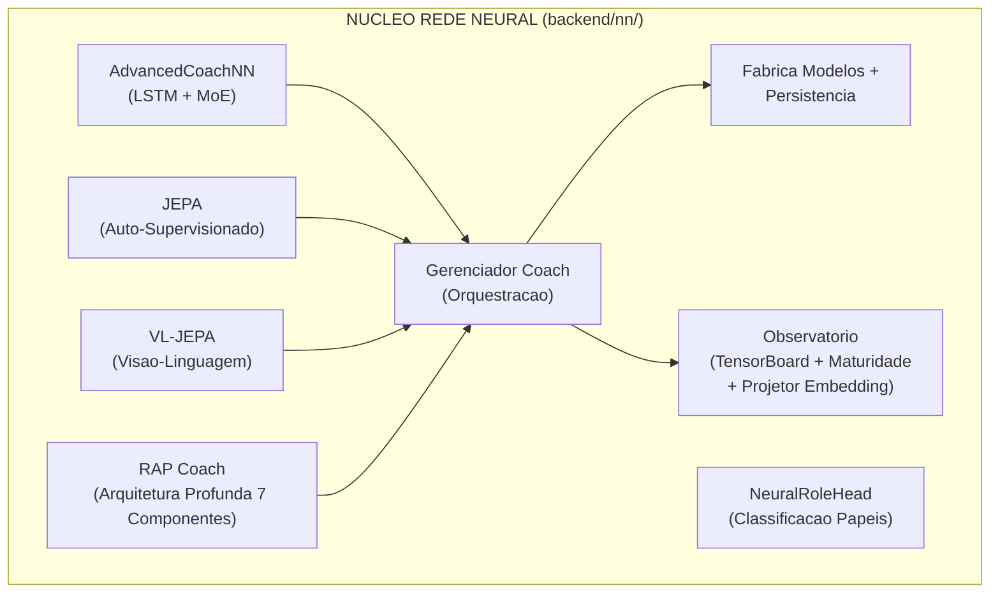

### -AdvancedCoachNN (LSTM + Mistura de Especialistas)

Definido em `model.py`, este e o fundamento do coaching supervisionado.

| Componente                       | Detalhe                                                                                                                                                                                                               |
| -------------------------------- | ----------------------------------------------------------------------------------------------------------------------------------------------------------------------------------------------------------------------- |
| **Dimensao de input**    | 25 funcionalidades (`METADATA_DIM` de vectorizer.py)                                                                                                                                                                    |
| **Config**                 | Dataclass `CoachNNConfig`: `input_dim=25`, `output_dim=METADATA_DIM` (default 25, mas sobrescrito para `OUTPUT_DIM=10` pela `ModelFactory`), `hidden_dim=128`, `num_experts=3`, `num_lstm_layers=2`, `dropout=0.2`, `use_layer_norm=True`                                      |
| **Camadas ocultas**       | LSTM de 2 camadas (128 ocultas,`batch_first=True`, dropout=0.2) com `LayerNorm` pos-LSTM                                                                                                                           |
| **Cabeca dos especialistas**     | 3 especialistas lineares paralelos (configuraveis), softmax-gated atraves de uma rede de gate aprendida                                                                                                                             |
| **Output**                 | Soma ponderada dos outputs dos especialistas -> vetor do score de coaching de 10 dimensoes. A `CoachNNConfig` define `output_dim=METADATA_DIM` (25) como default, mas a `ModelFactory` sobrescreve com `OUTPUT_DIM=10` em producao. O alias `TeacherRefinementNN = AdvancedCoachNN` e mantido para retrocompatibilidade |
| **Bias de papel**          | Parametro `role_id` opcional: `gate_weights = (gate_weights + role_bias) / 2.0` - orienta a selecao dos especialistas para conhecimentos especificos do papel                                                        |
| **Validacao do input** | `_validate_input_dim()` redimensiona automaticamente 1D -> `unsqueeze(0).unsqueeze(0)` e 2D -> `unsqueeze(0)` para robustez                                                                                      |

> **Analogia:** Este modelo e como um **juri de 3 juizes** em um show de talentos. Primeiramente, o LSTM le os dados de jogo do jogador como se estivesse lendo uma historia: entende o que aconteceu passo a passo, lembrando dos momentos importantes (e exatamente isso que os LSTMs sabem fazer bem: memoria). Depois de ler a historia inteira, resume tudo em uma unica "opiniao" (128 numeros). Entao, tres diferentes juizes especialistas examinam essa opiniao e cada um atribui sua propria nota. Mas nem todos os juizes sao igualmente bons em cada tipo de performance: um especialista em danca e melhor em julgar danca, um especialista em canto em cantar. Entao uma **rede de controle** (como um moderador) decide o quanto confiar em cada juiz: "Para este jogador, o Juiz 1 e relevante em 60%, o Juiz 2 em 30%, o Juiz 3 em 10%". A nota final e uma combinacao ponderada das opinioes dos tres juizes.

Cada modulo especialista em AdvancedCoachNN: `Linear(128->128) -> LayerNorm(128) -> ReLU -> Linear(128->output_dim)`.

> **Nota:** `_create_expert()` do JEPA omite LayerNorm - apenas `Linear -> ReLU -> Linear`. Trata-se de uma escolha de design deliberada: os especialistas JEPA operam em embeddings latentes ja normalizados, enquanto os especialistas AdvancedCoachNN processam outputs LSTM brutos que se beneficiam da normalizacao por especialista.

**Passagem em avanco (pseudo forward pass):**

```
h, _ = LSTM(x) # x: [batch, seq_len, 25]
h = LayerNorm(h[:, -1, :]) # pega o ultimo timestep -> [batch, 128]
gate_weights = softmax(W_gate . h) # [batch, 3]
expert_outputs = [E_i(h) for i in 1..3]
output = tanh(Sigma gate_weights_i x expert_outputs_i)
```

> **Analogia:** Eis a receita passo a passo: (1) O LSTM le as 25 medicoes do jogador em varios timesteps, como se lesse as paginas de um diario. (2) Escolhe o resumo da ultima pagina, ou seja, a compreensao mais recente. (3) Um "moderador" examina esse resumo e decide o quanto confiar em cada um dos 3 especialistas (esses pesos de confianca somados sempre dao 100%). (4) Cada especialista atribui seus proprios scores de coaching. (5) O resultado final e o resultado dos scores dos especialistas misturados juntos com base no quanto o moderador confia em cada um, comprimidos em um intervalo de -1 a +1 pela funcao tanh (como uma avaliacao em uma curva).

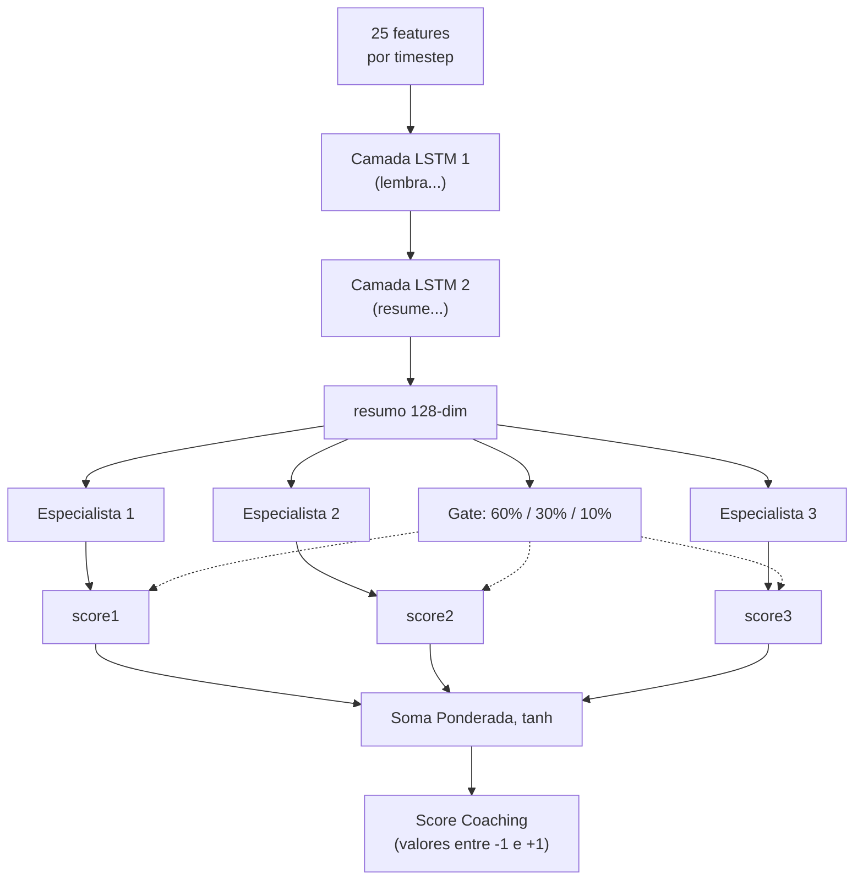

### -Modelo de coaching JEPA (Arquitetura preditiva com integracao conjunta)

Definido em `jepa_model.py`. Um modelo de **pre-treinamento auto-supervisionado** inspirado no I-JEPA de Yann LeCun, adaptado para dados CS2 sequenciais.

> **Analogia:** JEPA e a fase de **"aprende observando"** do treinador, assim como e possivel aprender muito sobre basquete apenas assistindo as partidas da NBA, mesmo antes que alguem te ensine as regras. Em vez de precisar que alguem rotule cada jogada como "boa" ou "ruim" (aprendizado supervisionado), JEPA se auto-aprende jogando um jogo de adivinhacao: "Eu vi o que aconteceu no primeiro tempo deste round... posso prever o que vai acontecer depois?". Se adivinha corretamente, esta construindo um bom entendimento dos patterns CS2. Se adivinha errado, se adapta. Isso se chama **aprendizado auto-supervisionado**: o modelo cria suas proprias "tarefas" a partir dos dados em si.

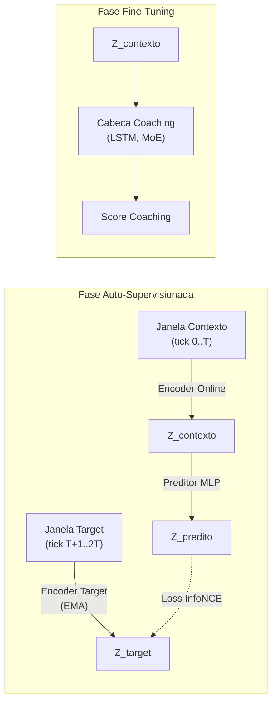

> **Explicacao do diagrama:** A fase de auto-supervisao funciona assim: imagine assistir a um filme e apertar pause no meio da cena. O **Online Encoder** olha a primeira metade e cria um resumo ("eis o que entendi ate agora"). O **Target Encoder** (uma copia levemente mais velha do mesmo cerebro, atualizada lentamente) olha a segunda metade e cria seu proprio resumo. Entao um **Predictor** tenta adivinhar o resumo da segunda metade usando apenas o resumo da primeira metade. O **InfoNCE Loss** e como um professor que verifica: "Sua predicao corresponde ao que realmente aconteceu? E e suficientemente diferente das suposicoes aleatorias?". Na fase de Fine-Tuning, uma vez que o modelo adquiriu uma boa capacidade de predicao, adicionamos uma **Cabeca de Coaching** em cima: agora a compreensao adquirida observando pode ser utilizada para fornecer scores de coaching efetivos.

**Detalhes da arquitetura:**

| Modulo                        | Parametros                                                                                               |
| ----------------------------- | ------------------------------------------------------------------------------------------------------- |
| **Codificador online** | Linear(input_dim, 512) -> LayerNorm -> GELU -> Dropout(0.1) -> Linear(512, latent_dim=256) -> LayerNorm |
| **Codificador target** | Estruturalmente identico; atualizado via media movel exponencial (tau = 0.996). `EMA.state_dict()` retorna tensores **clonados** para prevenir aliasing (um bug anterior permitia a modificacao acidental dos pesos target atraves de referencias compartilhadas) |
| **Predictor**           | Linear(256, 512) -> LayerNorm -> GELU -> Dropout(0.1) -> Linear(512, 256)                               |
| **Coaching Head**       | LSTM(256, hidden_dim, 2 layers, dropout=0.2) -> 3 especialistas MoE -> output controlado                     |

> **Analogia:** O **Online Encoder** e como um estudante: transforma os dados brutos de jogo em uma "essencia" de 256 numeros (um resumo compacto). O **Target Encoder** e como o irmao mais velho do estudante que se atualiza lentamente (EMA significa "aproximar-se dos conhecimentos do irmao mais novo, mas apenas um pouquinho a cada dia" - 99,6% permanece inalterado, apenas 0,4% se atualiza). Esse alvo lento impede que o sistema colapse em uma solucao banal (como prever sempre "tudo e igual"). O **Predictor** e uma ponte que tenta traduzir "o que eu vi" em "o que eu acho que vai acontecer". A **Coaching Head** e o acessorio final que converte a compreensao em um conselho efetivo, como passar de "Entendo o basquete" para "voce deveria passar mais".

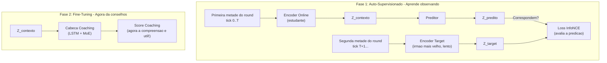

**Procedimento de pre-treinamento** (`jepa_trainer.py`):

1. Carrega as sequencias de `PlayerTickState` dos arquivos SQLite de demos profissionais.
2. Divide cada sequencia em janelas de contexto e target.
3. Codifica o contexto atraves do codificador online + preditor, codifica o target atraves do codificador do target (EMA).
4. Minimiza a **perda de contraste de InfoNCE** utilizando negativos em batch com similaridade do cosseno e temperatura tau=0,07.
5. Depois de cada batch, executa o update EMA: `theta_target <- tau.theta_target + (1-tau).theta_online`.
6. **Monitoramento do drift**: Rastreia os objetos DriftReport; ativa o retreinamento automatico se o drift > 2,5 sigma.
7. **Rotulos baseados em resultado (Correcao G-01):** O `ConceptLabeler` no treinamento VL-JEPA agora gera rotulos a partir dos dados `RoundStats` (resultados por round: abates, mortes, danos, sobrevivencia) em vez de features em nivel de tick. Isso elimina o **label leakage** - o problema anterior em que os rotulos dos conceitos eram derivados das mesmas features usadas como input, permitindo que o modelo "trapaceasse" durante o treinamento sem realmente aprender os patterns. O metodo `label_from_round_stats(rs)` produz um vetor de 16 rotulos de conceito baseados em resultados mensuraveis. Se os dados `RoundStats` nao estiverem disponiveis, o sistema recai na heuristica legacy com um aviso de log uma unica vez.

> **Analogia:** A receita do treinamento e esta: (1) Carrega as gravacoes de jogadores profissionais, quadro a quadro. (2) Para cada gravacao, divide em "o que aconteceu antes" e "o que aconteceu depois". (3) Dois codificadores examinam cada metade de forma independente. (4) O sistema verifica: "Minha predicao de 'o que aconteceu depois' se aproximou da resposta efetiva e nao de respostas erradas aleatorias?" - isso e InfoNCE, como um teste de multipla escolha em que o modelo deve escolher a resposta certa entre muitas respostas erradas. (5) O codificador do irmao mais velho absorve lentamente os conhecimentos do irmao mais novo (apenas 0,4% por passagem). (6) Se os dados comecam a parecer muito diferentes daqueles em que o modelo foi treinado (drift > 2,5 desvios padrao), toca um sino de alarme: "O meta do jogo mudou - e hora de requalificar!"

**Decodificacao Seletiva** (`forward_selective`): pula a passagem em avanco inteira se a distancia do cosseno entre o embedding atual e o anterior for inferior a um limite (`skip_threshold=0.05`). Utiliza `1.0 - F.cosine_similarity()` como metrica de distancia e, durante a operacao de salto, retorna o output anterior memorizado na cache. Isso permite uma inferencia eficaz em tempo real com salto dinamico dos frames: durante os momentos de jogo estaticos (os jogadores mantem os angulos), a maioria dos frames e pulada completamente.

> **Analogia:** A decodificacao seletiva e como uma camera de seguranca com **deteccao de movimento**. Em vez de gravar 24 horas por dia, 7 dias por semana (processando cada frame), ela so ativa quando algo efetivamente muda. Se dois frames consecutivos sao quase identicos (distancia < 0.05 - na pratica "nao aconteceu nada"), o modelo pula o calculo completamente. Isso permite economizar uma enorme quantidade de potencia de processamento nos momentos lentos (como quando os jogadores mantem os angulos e aguardam), continuando a capturar cada acao importante.

### -VL-JEPA: Arquitetura de Alinhamento Visao-Linguagem com Conceitos de Coaching

Definido na segunda metade de `jepa_model.py`. O VL-JEPA (**Vision-Language JEPA**) e uma **extensao fundamental** do JEPACoachingModel que adiciona um **mecanismo de alinhamento entre embeddings latentes e conceitos de coaching interpretaveis**. Inspirado no VL-JEPA de Meta FAIR (2026), mapeia as representacoes latentes em um espaco conceitual estruturado com 16 conceitos de coaching predefinidos.

> **Analogia:** Se JEPA e um treinador que "entende" o jogo observando-o (aprendizado auto-supervisionado), VL-JEPA e o mesmo treinador que tambem aprendeu o **vocabulario especifico do coaching**. Nao apenas entende os patterns do jogo, mas sabe rotula-los com conceitos como "posicionamento agressivo", "economia ineficiente" ou "troca reativa". E como a diferenca entre um critico de cinema que "sente" quando um filme funciona e um que sabe articular o porque: "a fotografia e excelente, o ritmo e lento no segundo ato, a reviravolta e previsivel". O VL-JEPA traduz a compreensao latente em linguagem de coaching especifica.

#### Taxonomia dos 16 Conceitos de Coaching

O sistema define `NUM_COACHING_CONCEPTS = 16` conceitos organizados em **5 dimensoes taticas**:

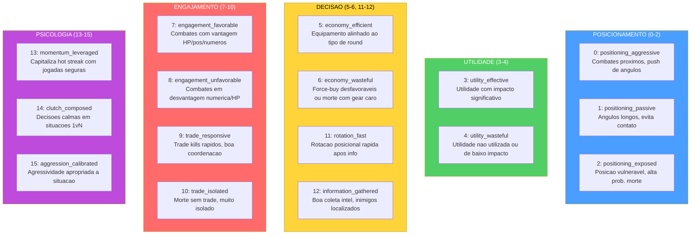

Cada conceito e definido como um `CoachingConcept` dataclass imutavel com `(id, name, dimension, description)`. A lista global `COACHING_CONCEPTS` e `CONCEPT_NAMES` sao as fontes de verdade para todo o sistema.

> **Analogia:** Os 16 conceitos sao como as **16 materias de um boletim escolar do coaching**. Em vez de uma nota unica "voce e bom/ruim", o VL-JEPA avalia o jogador em 16 aspectos especificos: "Em posicionamento agressivo voce esta em 80%, em economia eficiente em 45%, em reatividade a troca em 70%". As 5 dimensoes sao os "departamentos" da escola: Posicionamento, Utilidade, Decisao, Engajamento e Psicologia. Um jogador pode se destacar em uma dimensao e ter lacunas em outra - exatamente como um estudante pode ter otimas notas em matematica mas notas baixas em literatura.

#### Arquitetura VLJEPACoachingModel

`VLJEPACoachingModel` herda de `JEPACoachingModel` e adiciona 3 componentes:

| Componente | Parametros | Proposito |
|---|---|---|
| **concept_embeddings** | `nn.Embedding(16, latent_dim=256)` | 16 prototipos de conceito aprendidos no espaco latente |
| **concept_projector** | `Linear(256->256) -> GELU -> Linear(256->256)` | Projeta embeddings encoder no espaco alinhado aos conceitos |
| **concept_temperature** | `nn.Parameter(0.07)`, clamped `[0.01, 1.0]` | Temperatura aprendida para scaling da similaridade cosseno |

Todos os caminhos forward do pai (`forward`, `forward_coaching`, `forward_selective`, `forward_jepa_pretrain`) sao **preservados intactos** via heranca. O novo caminho `forward_vl()` adiciona o alinhamento conceitual.

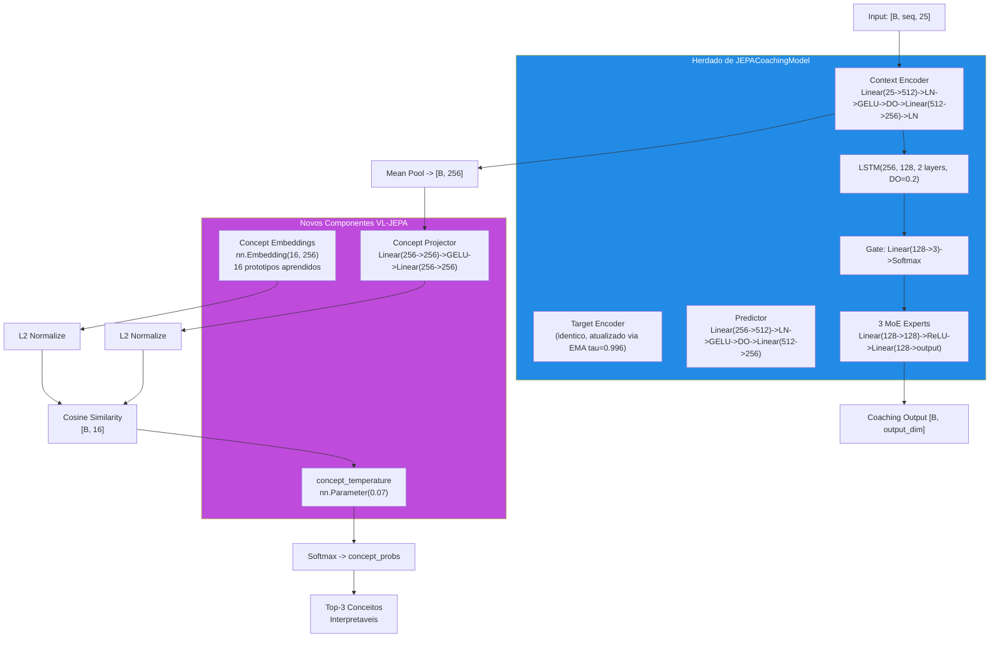

> **Analogia:** A arquitetura VL-JEPA e como adicionar um **tradutor simultaneo** a um analista que ja entende o jogo. O `concept_projector` e o interprete que pega a compreensao latente do encoder (256 numeros abstratos) e a traduz no "espaco dos conceitos". Os `concept_embeddings` sao como 16 **placas sinalizadoras** no espaco latente: cada um representa um conceito de coaching e tem uma posicao fixa (aprendida durante o treinamento). O `concept_temperature` controla o quao "nitida" deve ser a classificacao: uma temperatura baixa (0.01) torna as decisoes binarias ("e este conceito ou nao e"), uma temperatura alta (1.0) as torna suaves ("poderia ser varios conceitos ao mesmo tempo"). O sistema calcula a distancia cosseno entre a projecao do jogador e cada placa, e os conceitos mais proximos sao ativados.

#### Caminho Forward VL-JEPA (`forward_vl`)

```
1. Encode:        embeddings = context_encoder(x)                    # [B, seq, 256]
2. Pool:          latent = embeddings.mean(dim=1)                    # [B, 256]
3. Project:       projected = L2_normalize(concept_projector(latent)) # [B, 256]
4. Similarity:    logits = projected @ concept_embs_norm.T            # [B, 16]
5. Temperature:   probs = softmax(logits / clamp(temp, 0.01, 1.0))   # [B, 16]
6. Coaching:      coaching_output = forward_coaching(x, role_id)      # [B, output_dim]
7. Decode:        top_concepts = top-k(probs, k=3)                   # interpretaveis
```

**Output `forward_vl()`:** Dicionario com 5 chaves:

| Chave | Forma | Conteudo |
|---|---|---|
| `concept_probs` | `[B, 16]` | Probabilidades softmax para cada conceito |
| `concept_logits` | `[B, 16]` | Scores de similaridade brutos (pre-softmax) |
| `top_concepts` | `List[tuple]` | `[(nome_conceito, probabilidade), ...]` para a primeira amostra |
| `coaching_output` | `[B, output_dim]` | Predicao coaching padrao (via pai) |
| `latent` | `[B, 256]` | Embedding latente pooled do encoder |

**Caminho leve - `get_concept_activations()`:** Forward apenas conceitual sem cabeca de coaching nem LSTM. Utiliza `torch.no_grad()` para eficiencia maxima durante a inferencia.

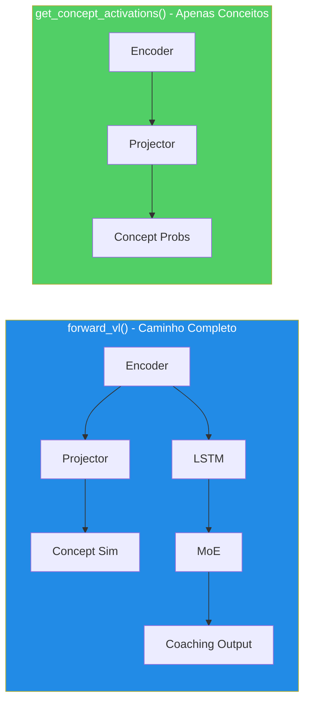

#### ConceptLabeler: Dois Modos de Rotulagem

A classe `ConceptLabeler` gera **rotulos soft multi-label** (`[0, 1]^16`) para o treinamento VL-JEPA. Suporta dois modos:

**Modo 1 - Baseado em Resultado (preferido, correcao G-01):** `label_from_round_stats(round_stats)` gera rotulos a partir de dados de **resultado do round** (abates, mortes, danos, sobrevivencia, trade kill, utilidade, equipamento, round vencido). Esses dados sao **ortogonais** ao vetor de input de 25 dim, eliminando o label leakage.

| Conceito | Sinal de Resultado Usado |
|---|---|
| `positioning_aggressive` (0) | `opening_kill=True` -> 0.8, kills>=2+survived -> 0.6 |
| `positioning_passive` (1) | survived, no opening, damage<60 -> 0.7 |
| `positioning_exposed` (2) | `opening_death=True` -> 0.8, deaths>0+damage<40 -> 0.6 |
| `utility_effective` (3) | utility_total>80 + round_won -> 0.5+util/300 |
| `utility_wasteful` (4) | zero utility -> 0.5, utility+lost -> 0.4 |
| `economy_efficient` (5) | eco win (equip<2000) -> 0.9, normal win -> 0.7 |
| `economy_wasteful` (6) | high equip+loss -> 0.4+equip/16000 |
| `engagement_favorable` (7) | multi-kill+survived -> 0.5+kills x 0.15 |
| `engagement_unfavorable` (8) | deaths+no kills+low dmg -> 0.7 |
| `trade_responsive` (9) | trade_kills>0 -> 0.6+tk x 0.2 |
| `trade_isolated` (10) | died, not traded, no trade kills -> 0.7 |
| `rotation_fast` (11) | assists>=1+round_won -> 0.6+assists x 0.1 |
| `information_gathered` (12) | flashes>=2+survived -> 0.6 |
| `momentum_leveraged` (13) | rating>1.5 -> rating/2.5, kills>=3 -> 0.7 |
| `clutch_composed` (14) | kills>=2+survived+won -> 0.6 |
| `aggression_calibrated` (15) | efficiency = kills x 1000/equip -> min(eff x 0.5, 1.0) |

**Modo 2 - Heuristica Legacy (fallback com label leakage):** `label_tick(features)` gera rotulos diretamente do vetor de features de 25 dim. Isso cria **label leakage** porque o modelo pode "trapacear" reconstruindo as features de input em vez de aprender patterns latentes. Usado apenas quando `RoundStats` nao esta disponivel, com um aviso de log uma unica vez.

> **Analogia G-01:** O label leakage e como um **exame em que as respostas estao escritas no verso da folha de questoes**. No modo heuristica, os rotulos dos conceitos sao derivados das mesmas 25 features que o modelo ve como input - o modelo pode simplesmente "copiar as respostas" sem entender nada. No modo baseado em resultado, os rotulos vem de dados diferentes (o que ACONTECEU no round: abates, mortes, vitoria) - o modelo deve efetivamente entender a relacao entre as features de input e os resultados para obter bons scores. E a diferenca entre estudar para entender e estudar para copiar.

**`label_batch(features_batch)`:** Wrapper que gerencia batches 2D `[B, 25]` e 3D `[B, seq_len, 25]` (media dos rotulos sobre a sequencia para input 3D).

**Referencia indices feature (METADATA_DIM=25):**

```
 0: health/100      1: armor/100       2: has_helmet      3: has_defuser
 4: equip/10000     5: is_crouching    6: is_scoped       7: is_blinded
 8: enemies_vis     9: pos_x/4096     10: pos_y/4096     11: pos_z/1024
12: view_x_sin     13: view_x_cos     14: view_y/90      15: z_penalty
16: kast_est       17: map_id         18: round_phase
19: weapon_class   20: time_in_round/115  21: bomb_planted
22: teammates_alive/4  23: enemies_alive/5  24: team_economy/16000
```

#### Funcoes de Perda VL-JEPA

**1. `jepa_contrastive_loss()` - InfoNCE (ja documentada acima)**

Formula: `-log(exp(sim(pred, target)/tau) / (exp(sim(pred, target)/tau) + Sigma exp(sim(pred, neg_i)/tau)))` com tau=0.07. A implementacao PyTorch utiliza um truque eficiente: concatena a similaridade positiva e as similaridades negativas em um vetor de logits `[pos_sim, neg_sim_1, ..., neg_sim_N]` e aplica `F.cross_entropy(logits, labels=0)` - onde o rotulo `0` indica que o primeiro elemento (a similaridade positiva) e a classe correta. Isso e matematicamente equivalente a formula InfoNCE mas explora a numericamente estavel `log_softmax` interna de PyTorch.

**2. `vl_jepa_concept_loss()` - Alinhamento Conceitos + Diversidade VICReg**

```python
concept_loss = BCE_with_logits(concept_logits, concept_labels)  # Multi-label
diversity_loss = -std(L2_normalize(concept_embeddings), dim=0).mean()  # VICReg
total = alpha * concept_loss + beta * diversity_loss
```

| Termo | Formula | Peso Default | Proposito |
|---|---|---|---|
| `concept_loss` | `F.binary_cross_entropy_with_logits(logits, labels)` | alpha = 0.5 | Alinha embeddings aos conceitos corretos |
| `diversity_loss` | `-std_per_dim(L2_norm(concept_embs)).mean()` | beta = 0.1 | Impede o colapso dos embeddings de conceito |

> **Analogia:** A `concept_loss` e como **verificar se o estudante associa corretamente os termos as definicoes** - "posicionamento agressivo" deve ativar quando o jogador e efetivamente agressivo. A `diversity_loss` e inspirada em VICReg (Variance-Invariance-Covariance Regularization): impede que todos os 16 prototipos de conceito colapsem no mesmo ponto do espaco latente. E como assegurar-se de que as 16 placas sinalizadoras no museu estejam **todas em posicoes diferentes** - se duas placas estao no mesmo lugar, nao servem para distinguir os conceitos. A diversidade e medida como o desvio padrao dos embeddings normalizados ao longo de cada dimensao: um desvio padrao alto significa que os conceitos estao bem separados.

**Perda total no training step VL-JEPA (`train_step_vl`):**

```
L_total = L_infonce + alpha x L_concept + beta x L_diversity
```

Onde `L_infonce` e a perda contrastiva padrao JEPA e `(alpha x L_concept + beta x L_diversity)` e o termo de alinhamento conceitual.

#### Fluxo Dimensional Completo JEPA / VL-JEPA

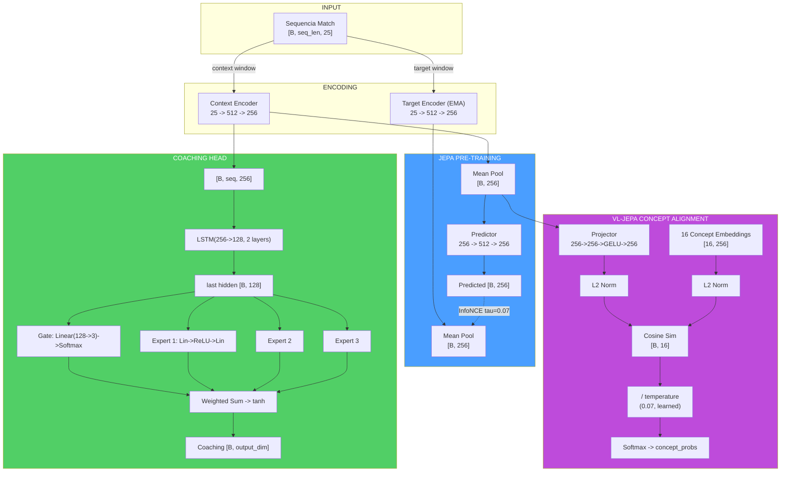

> **Analogia do fluxo dimensional:** Imagine o percurso dos dados como uma jornada de **traducao multilingue**: os dados brutos do jogo (25 numeros) sao como um texto em "linguagem do jogo". O encoder os traduz em "linguagem latente" (256 numeros) - uma representacao comprimida mas rica. A partir daqui, o percurso se bifurca: o **ramo JEPA** (auto-supervisao) verifica se o tradutor entende a sequencia temporal, o **ramo Coaching** (LSTM+MoE) produz conselhos praticos, e o **ramo VL** (conceitos) traduz da "linguagem latente" para a "linguagem do coaching" (16 conceitos interpretaveis). Cada ramo serve a um proposito diferente, mas todos partem da mesma traducao de base.

#### JEPATrainer: Treinamento com Monitoramento Drift

Definido em `jepa_trainer.py`. Gerencia tanto o treinamento JEPA padrao quanto VL-JEPA, com retreinamento automatico baseado no drift.

| Parametro | Default | Proposito |
|---|---|---|
| **Optimizer** | AdamW (lr=1e-4, weight_decay=1e-4) | Otimizacao com decaimento dos pesos |
| **Scheduler** | CosineAnnealingLR (T_max=100) | Decaimento ciclico do learning rate |
| **DriftMonitor** | z_threshold=2.5 | Detecta drift das features alem de 2.5 sigma |
| **drift_history** | `List[DriftReport]` | Historico dos reports de drift |

**Codificacao de negativos compartilhada - `encode_raw_negatives(negatives, seq_len)` (NN-H-02):**

Metodo compartilhado que codifica negativos brutos (feature space) no espaco latente. Quando o orchestrator envia negativos do cross-match pool (dimensao `METADATA_DIM`), esses devem ser transformados em embeddings latentes para o calculo da loss contrastiva. O metodo: reshape `[B*N, 1, D]` -> expand por `seq_len` -> encode via `target_encoder` com `torch.no_grad()` -> mean pool -> reshape `[B, N, latent_dim]`. Essa logica estava anteriormente duplicada entre trainer e orchestrator; a centralizacao (NN-H-02) previne desalinhamentos.

**Ciclo de treinamento - `train_step(x_context, x_target, negatives)`:**

1. Forward pass JEPA: `pred, target = model.forward_jepa_pretrain(context, target)`
2. **Auto-detect negativos brutos:** Se `negatives.shape[-1] != latent_dim`, os negativos sao features brutas -> sao auto-codificados via `encode_raw_negatives()` (NN-H-02)
3. Loss InfoNCE em embeddings normalizados
4. Backward + optimizer step
5. **Atualizacao EMA target encoder** (deve ocorrer DEPOIS de `optimizer.step()`)
6. **Monitoramento diversidade embedding (P9-02):** Calcula a variancia media das dimensoes latentes. Se `variance < 0.01`, emite um warning de potencial colapso dos embeddings - o modelo esta convergindo para uma representacao degenerada onde todos os inputs produzem o mesmo vetor

**Guarda batch degenerado (NN-JT-01):** Em modo in-batch negatives, se `batch_size < 2` o batch e pulado - nao e possivel construir negativos excluindo a si mesmo de um batch de um unico elemento. Isso previne erros na indexacao dos negativos durante as fases iniciais do treinamento com poucos dados.

**Training step VL-JEPA - `train_step_vl()`:** Estende `train_step` com:

1. Forward pass JEPA padrao (InfoNCE)
2. Forward VL: `model.forward_vl(x_context)` -> concept_logits
3. **Geracao de rotulos (preferencia G-01):** Se `round_stats` estiver disponivel -> `label_from_round_stats()` (no leakage). Caso contrario -> `label_batch()` (heuristica legacy com aviso uma unica vez)
4. Concept loss + diversity loss: `vl_jepa_concept_loss(logits, labels, embeddings, alpha, beta)`
5. Loss total: `L_infonce + L_concept_total`
6. Backward + optimize + EMA update

**Output:** `{total_loss, infonce_loss, concept_loss, diversity_loss}`.

**Monitoramento drift - `check_val_drift(val_df, reference_stats)`:**

- Utiliza `DriftMonitor` da pipeline de validacao
- Calcula z-score para cada feature do validation set em relacao as estatisticas de referencia
- Se `max_z_score > 2.5`, o report marca `is_drifted=True`
- `should_retrain(drift_history, window=5)` -> se a maioria das ultimas 5 janelas mostra drift, ativa o flag `_needs_full_retrain`

**Retreinamento automatico - `retrain_if_needed(full_dataloader, device, epochs=10)`:**

- Se o flag `_needs_full_retrain` estiver ativo, reseta o scheduler e reexecuta `epochs` epocas completas
- Depois do retreinamento, cancela o flag e o historico drift
- Retorna `True/False` para indicar se o retreinamento ocorreu

> **Analogia:** O sistema de monitoramento do drift e como um **termometro automatico para as condicoes do meta-jogo**. Se os dados dos novos jogadores forem muito diferentes daqueles em que o modelo foi treinado (por exemplo, uma atualizacao importante do jogo mudou as mecanicas), o termometro detecta a "febre" (drift > 2.5 sigma). Se a febre persistir por 5 controles consecutivos, o sistema prescreve uma "cura completa" - retreinamento total. Isso impede que o modelo de conselhos baseados em um meta-jogo obsoleto.

#### Pipeline de Treinamento Standalone (`jepa_train.py`)

Script standalone para pre-treinamento e fine-tuning JEPA, executavel via CLI:

```bash
python -m Programma_CS2_RENAN.backend.nn.jepa_train --mode pretrain
python -m Programma_CS2_RENAN.backend.nn.jepa_train --mode finetune --model-path models/jepa_model.pt
```

**`JEPAPretrainDataset`:** Dataset PyTorch para o pre-treinamento:

| Parametro | Default | Descricao |
|---|---|---|
| `context_len` | 10 | Comprimento janela contexto (tick) |
| `target_len` | 10 | Comprimento janela target (tick) |
| `match_sequences` | `List[np.ndarray]` | Sequencias de match `[num_rounds, METADATA_DIM]` |

Para cada amostra, seleciona um ponto de partida aleatorio na sequencia e retorna `{"context": [context_len, 25], "target": [target_len, 25]}`.

> **Nota (F3-25):** O ponto de partida usa `np.random.randint()` com estado global nao seedado -> janelas nao reprodutiveis entre runs. Para treinamento deterministico, usar `worker_init_fn` ou um `Generator` dedicado no `DataLoader`.

**`_roundstats_to_features(rs: RoundStats)` -> `List[float]`:** Extrai um vetor de **16 features** de uma unica linha `RoundStats`: `[kills, deaths, damage_dealt/100, headshot_kills, assists, trade_kills, was_traded, opening_kill, opening_death, he_damage/100, molotov_damage/100, flashes_thrown, smokes_thrown, equipment_value/5000, round_rating, side_CT]`. O vetor e entao padded para `METADATA_DIM` (25) com zeros.

> **Exclusao `round_won` (P-RSB-03):** O campo `round_won` e **deliberadamente excluido** do vetor feature. Inclui-lo causaria data leakage: o modelo veria o resultado do round nos dados de input, permitindo-lhe predizer banalmente os resultados a partir do proprio resultado. `round_won` e corretamente utilizado como **label** em `label_from_round_stats()` (jepa_model.py), onde gera os rotulos de supervisao para o ramo VL-JEPA.

**`_MIN_ROUNDS_FOR_SEQUENCE = 6`:** Requisito minimo de rounds para construir uma sequencia de treinamento valida. Partidas com menos de 6 rounds nao fornecem contexto temporal suficiente para aprender patterns taticos significativos e sao descartadas silenciosamente.

**`load_pro_demo_sequences(limit=100)`:** Carrega sequencias demo profissionais do banco de dados. Utiliza `_roundstats_to_features()` para extrair features reais por-round de `RoundStats`, com fallback para 12 features agregadas em nivel de match de `PlayerMatchStats` (padded para `METADATA_DIM` com zeros) apenas quando `RoundStats` nao estiver disponivel.

> **Aviso Critico (F3-08):** No caminho de fallback match-aggregate, o script usa `np.tile(features, (20, 1))` para criar 20 frames identicos a partir de um unico vetor agregado. Isso torna o pre-treinamento JEPA **uma operacao identidade** - o modelo aprende simplesmente a copiar o input, nao as dinamicas temporais. O caminho primario com `RoundStats` reais e o `TrainingOrchestrator` no caminho de producao **nao sao afetados** por esse problema e usam dados por-round/por-tick reais.

**`train_jepa_pretrain()`:** 50 epocas, batch_size=16, lr=1e-4, 8 negativos in-batch. O optimizer inclui SOMENTE `context_encoder` e `predictor` - o `target_encoder` e atualizado exclusivamente via EMA.

**`train_jepa_finetune()`:** 30 epocas, batch_size=16, lr=1e-3, weight_decay=1e-3. Congela os encoders e otimiza apenas LSTM + MoE + Gate.

**Persistencia:** `save_jepa_model()` salva `{model_state_dict, is_pretrained}`. `load_jepa_model()` carrega com `weights_only=True` (seguranca).

#### SuperpositionLayer - Gating Contextual (`layers/superposition.py`)

Modulo standalone que implementa uma camada linear com **gating dependente do contexto**, usado dentro do RAP Coach Strategy Layer.

```python
class SuperpositionLayer(nn.Module):
    def __init__(self, in_features, out_features, context_dim=METADATA_DIM):
        self.weight = nn.Parameter(empty(out_features, in_features))
        nn.init.kaiming_uniform_(self.weight, a=math.sqrt(5))  # P1-09: Kaiming init
        self.bias = nn.Parameter(zeros(out_features))
        self.context_gate = nn.Linear(context_dim, out_features)  # Superposition Controller

    def forward(self, x, context):
        gate = sigmoid(self.context_gate(context))  # [B, out_features]
        self._last_gate_live = gate                  # Com gradiente (para sparsity loss)
        self._last_gate_activations = gate.detach()  # Copia detached (para observabilidade)
        out = F.linear(x, self.weight, self.bias)
        return out * gate  # Modulacao contextual
```

**Mecanismo:** O output de cada neuronio e multiplicado por um gate sigmoide condicionado nas features de contexto (25-dim). Isso permite ao modelo "acender" ou "apagar" neuronios dinamicamente com base na situacao de jogo.

**Inicializacao Kaiming (P1-09):** Os pesos sao inicializados com `kaiming_uniform_` (distribuicao Kaiming He, 2015) em vez de `torch.randn()`. Essa inicializacao garante que a variancia dos pesos seja proporcional ao fan-in da camada, prevenindo o desaparecimento ou a explosao dos gradientes nas redes profundas. O parametro `a=math.sqrt(5)` e o valor padrao para camadas lineares em PyTorch.

**Design dual-tensor (NN-24):** O gate sigmoide e memorizado em **duas copias separadas** durante cada forward pass:

| Tensor | Gradiente | Proposito |
|---|---|---|
| `_last_gate_live` | **Sim** (mantem o grafo computacional) | Usado por `gate_sparsity_loss()` para backpropagation - o gradiente flui atraves do gate para `context_gate` |
| `_last_gate_activations` | **Nao** (detached) | Usado por `get_gate_statistics()` para observabilidade - nenhum custo de memoria para o grafo |

Essa separacao resolve o conflito entre a necessidade de gradientes (para a loss de sparsidade) e a necessidade de observabilidade leve (para logging e TensorBoard).

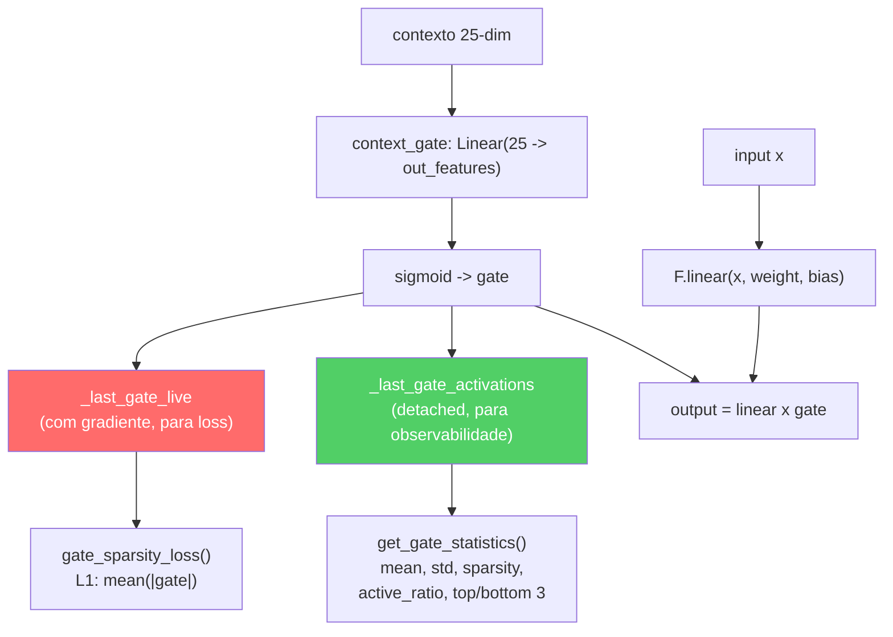

**Observabilidade integrada:**

| Metodo | Retorno | Descricao |
|---|---|---|
| `get_gate_activations()` | `Tensor` ou `None` | Ultimas ativacoes do gate (`_last_gate_activations`, detached) |
| `get_gate_statistics()` | `Dict[str, float]` | Estatisticas completas do gate (veja tabela abaixo) |
| `gate_sparsity_loss()` | `Tensor` | Perda L1 `mean(|_last_gate_live|)` para especializacao dos especialistas |
| `enable_tracing(interval)` | - | Log detalhado do gate a cada `interval` passos |
| `disable_tracing()` | - | Restaura intervalo de logging para 100 |

**Campos de `get_gate_statistics()`:**

| Campo | Tipo | Significado |
|---|---|---|
| `mean_activation` | float | Media das ativacoes do gate no batch |
| `std_activation` | float | Desvio padrao das ativacoes |
| `sparsity` | float | Fracao de dimensoes com media < 0.1 (mais alto = mais esparso) |
| `active_ratio` | float | Fracao de dimensoes com media > 0.5 (mais alto = mais ativo) |
| `top_3_dims` | List[int] | As 3 dimensoes do gate mais ativas |
| `bottom_3_dims` | List[int] | As 3 dimensoes do gate menos ativas |

**Log periodico durante treinamento:** A cada 100 forward pass (configuravel via `enable_tracing(interval)`), logga via logger estruturado: dimensoes ativas (gate_mean > 0.5), dimensoes esparsas (gate_mean < 0.1) e media geral.

> **Analogia:** O SuperpositionLayer e como um **mixer de audio com 256 canais** onde cada slider e controlado automaticamente com base na "cena" atual. Em um round eco, certos canais sao abaixados (as features relativas ao full-buy sao irrelevantes). Em um retake post-plant, outros canais sao levantados. O `gate_sparsity_loss` e como um sonoplasta que diz: "Use o menor numero possivel de canais de cada vez - se voce consegue obter o mesmo som com 50 canais em vez de 200, o mix sera mais limpo e interpretavel". A inicializacao Kaiming e como **afinar o instrumento antes de tocar** - sem uma boa afinacao inicial, ate o musico mais talentoso produzira notas desafinadas. O design dual-tensor e como ter **duas copias do mix**: uma "live" que o sonoplasta pode regular (com gradientes), e uma "gravada" que o critico pode analisar a posteriori (sem perturbar a performance em curso).

#### Modulo EMA Standalone

A atualizacao **Exponential Moving Average** do target encoder e implementada diretamente em `JEPACoachingModel.update_target_encoder(momentum=0.996)`:

```python
with torch.no_grad():
    for param_q, param_k in zip(context_encoder.parameters(), target_encoder.parameters()):
        param_k.data = param_k.data * momentum + param_q.data * (1.0 - momentum)
```

**Invariantes:**
- A atualizacao EMA ocorre **sempre depois** de `optimizer.step()` - nunca antes, caso contrario os gradientes ainda nao estao aplicados
- O target encoder **nunca recebe gradientes** diretos - apenas atualizacoes EMA
- O momentum 0.996 significa que o target encoder "absorve" apenas 0,4% dos pesos do encoder online a cada passo - atualizacao muito conservadora
- `state_dict()` do modelo retorna tensores **clonados** (`.clone()`) para prevenir aliasing acidental - um bug real corrigido durante o audit onde `state_dict()` retornava referencias diretas aos tensores do modelo em vez de copias, causando corrupcao quando o chamador modificava o dicionario

> **Analogia:** O EMA e como um **mentor que aprende lentamente com o aluno**. O aluno (context encoder) aprende rapidamente com os dados e muda muito a cada licao. O mentor (target encoder) observa o aluno e atualiza seus proprios conhecimentos muito lentamente - apenas 0,4% por licao. Isso impede que o mentor "esqueca" o que sabia antes, criando um alvo estavel para o aprendizado. Sem EMA, ambos os cerebros mudariam rapido demais e o sistema poderia "colapsar" - um fenomeno conhecido como mode collapse onde ambos os encoders produzem o mesmo output independentemente do input.

### -CoachTrainingManager (Orquestracao)

Definido em `coach_manager.py`. Este e o **cerebro do processo de formacao**, que gerencia um rigoroso **ciclo de formacao de 3 niveis, baseado na maturidade**, dividido em 4 fases:

> **Analogia apropriada para criancas:** CoachTrainingManager e como o **diretor** que decide a classe de cada aluno e quais materias pode seguir. Um aluno novinho em folha (CALIBRACAO) pode frequentar apenas cursos introdutorios. Um aluno que passou em um numero suficiente de cursos (APRENDIZADO) pode frequentar cursos avancados. E um aluno do ultimo ano (MATURE) tem acesso a tudo. O diretor tambem impoe uma regra: "Voce nao pode iniciar nenhum curso ate ter participado de pelo menos 10 sessoes de orientacao". Isso impede que o sistema tente ensinar quando praticamente nao tem dados para aprender.

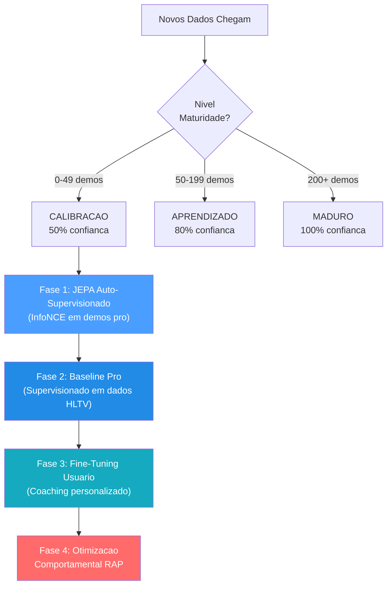

> **Explicacao do diagrama:** Pense nas 4 fases como os **anos escolares**: a Fase 1 (JEPA) e como **assistir a um filme de uma partida**: o aluno assiste centenas de partidas profissionais e aprende os esquemas sem que ninguem os avalie. A Fase 2 (Pro Baseline) e como **estudar por um livro didatico**: agora um professor diz "eis como se joga bem" e o aluno estuda para se adequar. A Fase 3 (Aperfeicoamento do usuario) e como **aulas particulares**: o sistema se adapta especificamente ao estilo e aos pontos fracos DESTE jogador. A Fase 4 (RAP) e como um **curso de estrategia avancada**: o coach RAP completo de 7 componentes intervem com teoria dos jogos, posicionamento e raciocinio causal. Nao e possivel acessar a Fase 4 ate ter completado as Fases 1-3, exatamente como nao se pode estudar calculo antes de algebra.

**Niveis de maturidade e multiplicadores de confianca:**

| Nivel       | Contagem demos | Multiplicador de confianca | Funcionalidades desbloqueadas                                 |
| ------------- | -------------- | ------------------------- | ------------------------------------------------------- |
| CALIBRACAO  | 0-49          | 0,50                      | Heuristica de base, pre-treinamento JEPA               |
| APRENDIZADO | 50-199        | 0,80                      | Comparacao base profissional, otimizacao usuario     |
| MADURO        | 200+           | 1,00                      | Coach RAP completo, teoria dos jogos, analise completa |

> **Analogia:** O multiplicador de confianca e como um **score de confianca**. Quando o coach e novo (CALIBRACAO), confia nos proprios conselhos apenas em 50%: sabe que podem estar errados, entao e cauteloso. Depois de ter estudado mais de 50 demos (APRENDIZADO), confia em si mesmo em 80%. Depois de mais de 200 demos (MADURO), esta completamente seguro: 100%. E como um meteorologista: um meteorologista iniciante poderia dizer "Tenho certeza em 50% que vai chover", mas um experiente com decadas de dados atras de si diz "Tenho certeza em 100%". O treinador nunca finge saber mais do que realmente sabe.

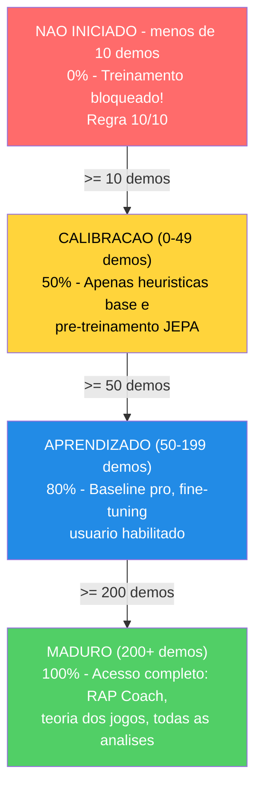

**Pre-requisitos (Regra 10/10):** Requer >=10 demos profissionais OU (>=10 demos usuario + conta Steam/FACEIT conectada) antes de iniciar qualquer treinamento.

O manager utiliza um **contrato de treinamento** rigoroso com 25 funcionalidades (correspondentes a `METADATA_DIM`).

> **Problema resolvido (ex G-10):** `coach_manager.py` agora define `TRAINING_FEATURES` com os nomes canonicos corretos para todos os 25 indices, alinhados perfeitamente com `vectorizer.py`. A assercao `len(TRAINING_FEATURES) == METADATA_DIM` e valida e todos os nomes estao atualizados. Alem disso, `MATCH_AGGREGATE_FEATURES` define as 25 features agregadas em nivel de partida: `["avg_kills", "avg_deaths", "avg_adr", "avg_hs", "avg_kast", "kill_std", "adr_std", "kd_ratio", "impact_rounds", "accuracy", "econ_rating", "rating", "opening_duel_win_pct", "clutch_win_pct", "trade_kill_ratio", "flash_assists", "positional_aggression_score", "kpr", "dpr", "rating_impact", "rating_survival", "he_damage_per_round", "smokes_per_round", "unused_utility_per_round", "thrusmoke_kill_pct"]`. Ambas as listas sao validadas em runtime: se uma das duas tiver um comprimento diferente de `METADATA_DIM`, o modulo levanta `ValueError` no momento da importacao.

```
health, armor, has_helmet, has_defuser, equipment_value,
is_crouching, is_scoped, is_blinded,
enemies_visible,
pos_x, pos_y, pos_z,
view_yaw_sin, view_yaw_cos, view_pitch,
z_penalty, kast_estimate, map_id, round_phase,
weapon_class, time_in_round, bomb_planted,
teammates_alive, enemies_alive, team_economy
```

> **Analogia:** Essas 25 caracteristicas sao como uma **lista de verificacao de 25 perguntas** que o treinador faz a um jogador em cada momento de uma partida: "Quao saudavel voce esta? Tem uma armadura? Um capacete? Um kit de disarme? Quanto custa seu equipamento? Esta agachado? Usa uma mira? Esta cego? Quantos inimigos consegue ver? Onde voce esta (coordenadas x, y, z)? Em que direcao esta olhando (dividido em sin/cos para evitar estranhezas angulares)? Esta no andar errado de um mapa multiniveis? Como se comportou (KAST)? De que mapa se trata? E um round de pistola, eco, forca ou full buy? Que tipo de arma esta usando? Quanto tempo se passou no round? A bomba foi plantada? Quantos companheiros de equipe ainda estao vivos? Quantos inimigos estao vivos? Qual e a economia media da sua equipe?" As ultimas 6 perguntas (indices 19-24) fornecem ao modelo uma consciencia tatica do contexto de jogo - essas features tem valor predefinido 0.0 durante o treinamento do banco de dados e sao populadas pelo contexto DemoFrame no momento da inferencia. Cada modelo no sistema fala exatamente o mesmo "linguagem de 25 perguntas" - este e o contrato de treinamento. Se alguma parte do sistema utilizasse perguntas diferentes, as respostas nao corresponderiam e tudo se interromperia.

**Indices target:** `TARGET_INDICES = list(range(OUTPUT_DIM))` = `[0, 1, 2, 3, 4, 5, 6, 7, 8, 9]` - o modelo preve deltas de melhoria para as primeiras **10 metricas agregadas** em nivel de partida: `[avg_kills, avg_deaths, avg_adr, avg_hs, avg_kast, kill_std, adr_std, kd_ratio, impact_rounds, accuracy]`.

> **Analogia:** Das 25 features agregadas em nivel de partida, o modelo se concentra na previsao de melhorias para as primeiras 10: **media abates** (voce esta conseguindo mais eliminacoes?), **media mortes** (voce esta morrendo menos?), **media ADR** (voce esta infligindo mais danos por round?), **media HS%** (sua mira na cabeca esta melhorando?), **media KAST** (voce esta contribuindo mais frequentemente para os rounds?), **variancia abates e ADR** (voce e mais consistente?), **razao K/D** (o saldo e positivo?), **rounds de impacto** (voce esta influenciando mais rounds criticos?) e **precisao** (seus tiros acertam?). Essas 10 metricas cobrem as dimensoes de desempenho mais acionaveis segundo o padrao HLTV 2.0: o output ofensivo, a sobrevivencia, o impacto nos danos, a consistencia (variancia baixa = jogador confiavel), e a precisao mecanica. As 15 features agregadas restantes (economia, rating composto, estatisticas avancadas) sao usadas como input contextual mas nao sao targets diretos de predicao - o modelo as usa para entender a situacao mas nao sugere melhorias especificas sobre elas. E como um treinador de basquete que acompanha centenas de estatisticas mas concentra o feedback nos 10 fundamentos: pontos marcados, assists, rebotes, percentual do campo, bolas perdidas, bolas roubadas, bloqueios, plus-minus, eficiencia e minutos jogados.

### -TrainingOrchestrator

Definido em `training_orchestrator.py`. Ciclo de epocas unificado, validacao, parada antecipada e checkpoint para os modelos JEPA, VL-JEPA, RAP e RAP Lite.

| Parametro      | Predefinido | Proposito                                                                        |
| -------------- | ----------- | ---------------------------------------------------------------------------- |
| `model_type` | "jepa"      | Caminhos para o trainer JEPA, VL-JEPA, RAP ou RAP Lite                      |
| `max_epochs` | 100         | Limite maximo de treinamento                                                |
| `patience`   | 10          | Paciencia na parada antecipada                                             |
| `batch_size` | 32          | Amostras por batch                                                           |
| `callbacks`  | `None`    | Lista de instancias de `TrainingCallback` para a integracao com Observatory |

O orchestrator se integra com Observatory atraves de `CallbackRegistry`. Dispara eventos do ciclo de vida em **5 pontos**: `on_train_start` (antes da primeira epoca), `on_epoch_start` (inicio de cada epoca), `on_batch_end` (depois de cada batch de treinamento, inclui outputs de perda e trainer), `on_epoch_end` (depois da validacao, inclui modelo e perdas), `on_train_end` (depois da conclusao do treinamento ou interrupcao antecipada). Quando nenhuma callback e registrada, todas as chamadas `fire()` sao operacoes sem custo. Os erros de callback sao detectados e registrados, sem nunca causar o travamento do ciclo de treinamento.

**Pool negativos cross-match (NN-H-03):** O orchestrator mantem um pool de feature vectors de batches anteriores (`_neg_pool`, max 500 vetores). Os negativos contrastivos sao amostrados deste pool em vez do batch atual, garantindo que os negativos venham de **partidas diferentes** e nao da mesma sequencia temporal de contexto/target. Quando o pool ainda esta vazio (warm-up), o sistema recai em in-batch sampling. Isso evita falsos negativos: dois ticks da mesma acao de jogo seriam muito similares para serem negativos uteis.

**Gate de qualidade pre-treinamento (P3-D):** Antes de iniciar qualquer treinamento, o orchestrator executa `run_pre_training_quality_check()`. Se o report de qualidade nao passar (dados insuficientes, distribuicoes anomalas, features ausentes), o treinamento e **abortado** com um log de erro explicativo. Isso impede de desperdicar GPU em dados que produziriam um modelo inutil.

> **Analogia:** TrainingOrchestrator e como um **treinador de academia com um cronometro e um comentarista esportivo ao vivo**. O trainer executa o ciclo: "Execute uma passagem completa em todos os dados (epoca), verifique os scores do quiz (validacao) e, se nao melhorou em 10 tentativas (paciencia), pare: voce terminou, nao faz sentido supertreinar". Salva tambem a versao melhor do modelo em disco (checkpoint), como quando se salvam os progressos de jogo. A nova adicao e o **comentarista ao vivo** (callback): se alguem estiver ouvindo, o trainer anuncia "Treinamento iniciado!", "Epoca 5 em curso!", "Batch 12 completado, perda 0,03!", "Epoca 5 terminada, val_loss melhorou!", "Treinamento concluido!". Esses anuncios alimentam a gravacao TensorBoard, o monitoramento da maturidade e as projecoes de embedding do Observatorio. Se ninguem estiver ouvindo, o comentarista permanece em silencio, sem nenhum overhead.

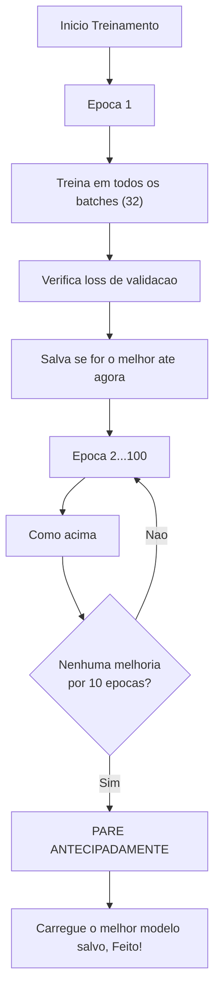

### -ModelFactory e Persistencia

**ModelFactory** (`factory.py`) fornece uma instanciacao unificada do modelo:

| Tipo Constante                    | Classe Modelo          | Nome Checkpoint      | Configuracoes predefinidas de fabrica                   |
| -------------------------------- | ----------------------- | -------------------- | ------------------------------------------------------ |
| `TYPE_LEGACY` ("default")      | `TeacherRefinementNN` | `"latest"`         | `input_dim=METADATA_DIM(25)`, `output_dim=OUTPUT_DIM(10)`, `hidden_dim=HIDDEN_DIM(128)` |
| `TYPE_JEPA` ("jepa")           | `JEPACoachingModel`   | `"jepa_brain"`     | `input_dim=METADATA_DIM(25)`, `output_dim=OUTPUT_DIM(10)`       |
| `TYPE_VL_JEPA` ("vl-jepa")     | `VLJEPACoachingModel` | `"vl_jepa_brain"`  | `input_dim=METADATA_DIM(25)`, `output_dim=OUTPUT_DIM(10)`       |
| `TYPE_RAP` ("rap")             | `RAPCoachModel`       | `"rap_coach"`      | `metadata_dim=METADATA_DIM(25)`, `output_dim=10`   |
| `TYPE_RAP_LITE` ("rap-lite")   | `RAPCoachModel`       | `"rap_lite_coach"` | `metadata_dim=METADATA_DIM(25)`, `output_dim=10`, `use_lite_memory=True` |
| `TYPE_ROLE_HEAD` ("role_head") | `NeuralRoleHead`      | `"role_head"`      | `input_dim=5`, `hidden_dim=32`, `output_dim=5`     |

> **Nota (P1-08):** Em uma versao anterior, a factory utilizava `output_dim=4` e `hidden_dim=64` para os modelos legacy, criando um desalinhamento com `CoachNNConfig`. Isso foi corrigido: agora todos os modelos de coaching (Legacy, JEPA, VL-JEPA) utilizam `OUTPUT_DIM = 10` - as primeiras 10 features core agregadas sobre as quais o modelo preve ajustes delta. `HIDDEN_DIM = 128` esta alinhado tanto em `config.py` quanto em `factory.py`. O modelo RAP e RAP Lite compartilham a mesma classe `RAPCoachModel`, mas RAP Lite ativa `use_lite_memory=True`, substituindo a memoria LTC-Hopfield com um fallback LSTM puro em PyTorch (util quando as dependencias `ncps`/`hflayers` nao estao disponiveis). O modelo RAP e importado do caminho canonico `backend/nn/experimental/rap_coach/model.py` (o antigo `backend/nn/rap_coach/model.py` e um shim de redirecionamento).
>
> **StaleCheckpointError:** Se as dimensoes de um checkpoint salvo nao corresponderem a configuracao atual do modelo (por exemplo, depois de uma atualizacao de `output_dim=4` para `output_dim=10`), o sistema levanta `StaleCheckpointError` em vez de carregar silenciosamente pesos incompativeis, prevenindo corrupcoes silenciosas.

> **Analogia:** A ModelFactory e como uma **fabrica de brinquedos** que pode construir seis diferentes tipos de robos. Voce diz "Quero um robo JEPA" ou "Preciso de um robo role_head" e ela sabe exatamente quais pecas usar e como monta-lo. O RAP Lite e como a versao "portatil" do robo RAP - mesmas funcionalidades externas, mas com um motor interno mais simples (LSTM em vez de LTC+Hopfield) que funciona em qualquer lugar sem componentes especiais. Cada robo tem uma etiqueta com o nome (nome do checkpoint) para que se possa encontra-lo depois na prateleira. Em vez de lembrar de como e construido cada robo, basta voce dizer a fabrica "construa-me um jepa" e ela cuidara de tudo.

**Persistencia** (`persistence.py`): Salva/carrega com `weights_only=True` (seguranca), cadeia de fallback elegante (especifica do usuario -> global -> pula), gerenciamento das dimensoes nao correspondentes.

> **Analogia:** A persistencia e como **salvar os progressos de um videogame**. Depois do treinamento, o "estado cerebral" do modelo (todos os pesos aprendidos) e salvo em um arquivo `.pt`. Quando voce reinicia o app, carrega o cerebro salvo em vez de recomecar do zero. O flag `weights_only=True` e uma medida de seguranca, como carregar apenas os arquivos de save criados por voce, nao os aleatorios pegos da internet que podem conter virus. A cadeia de fallback significa: "Primeiramente, tente carregar o SEU cerebro salvo pessoal. Se nao existir, tente o predefinido. Se nem esse existir, comece do zero". E se a forma do cerebro mudar (por exemplo adicionando novas funcionalidades), gerencia a discrepancia de forma fluida em vez de travar.

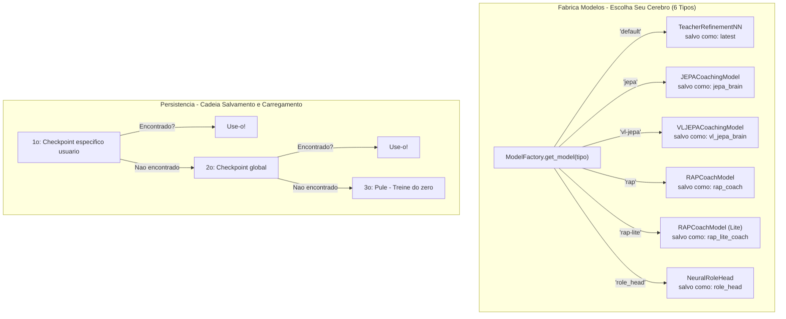

### -Configuracao (`config.py`)

```python
GLOBAL_SEED = 42                    # Reprodutibilidade global (AR-6, P1-02)
INPUT_DIM = METADATA_DIM = 25      # Vetor canonico de 25 dimensoes (era 19, era legacy 12)
OUTPUT_DIM = 10                    # As primeiras 10 features core sobre as quais o modelo preve ajustes
HIDDEN_DIM = 128                   # Dimensao oculta para AdvancedCoachNN / TeacherRefinementNN
BATCH_SIZE = 32
LEARNING_RATE = 0.001
EPOCHS = 50
RAP_POSITION_SCALE = 500.0         # P9-01: Fator de escala para delta posicao ([-1,1] -> unidades mundo)
```

> **Nota:** `INPUT_DIM` e importado de `feature_engineering/__init__.py` onde `METADATA_DIM = 25`. `OUTPUT_DIM = 10` define o numero de features sobre as quais o modelo produz predicoes de ajuste - as primeiras 10 features agregadas de match (avg_kills, avg_deaths, avg_adr, avg_hs, avg_kast, kill_std, adr_std, kd_ratio, impact_rounds, accuracy). Essa escolha de design concentra a capacidade preditiva do modelo nas metricas de desempenho mais acionaveis, em vez de tentar prever todas as 25 features (muitas das quais sao contextuais e nao diretamente melhoraveis pelo jogador). `RAP_POSITION_SCALE = 500.0` e o fator canonico para converter os outputs normalizados do modelo RAP (no intervalo [-1, 1]) em deslocamentos nas unidades mundo CS2.
>
> **Nota arquitetural:** A `CoachNNConfig` dataclass em `model.py` define `output_dim = METADATA_DIM` (25) como default, mas a `ModelFactory` sempre sobrescreve esse valor com `OUTPUT_DIM = 10` durante a instanciacao. O output_dim efetivo em producao para todos os modelos (Legacy, JEPA, VL-JEPA, RAP, RAP Lite) e portanto **10**, nao 25. Historicamente, `OUTPUT_DIM` era 4 (4 metricas selecionadas), depois foi elevado para 10 para cobrir as features agregadas mais relevantes.

> **Analogia:** Esta e a **pagina das configuracoes** para o cerebro da IA. Assim como um videogame tem configuracoes para volume, brilho e dificuldade, a rede neural tem configuracoes para quantas features ler (25), quantos scores produzir (10 - as metricas de desempenho mais importantes sobre as quais o modelo pode sugerir melhorias), quantos exemplos estudar ao mesmo tempo (32 - a dimensao do batch), quao rapido aprende (0.001 - a velocidade de aprendizado, como o seletor de velocidade em uma esteira ergometrica) e quantas vezes revisar todos os dados (50 epocas). O `GLOBAL_SEED = 42` garante que cada execucao de treinamento seja reprodutivel - mesma semente, mesmos resultados - atraves de `set_global_seed()` que define random, numpy, torch e CUDA. Essas configuracoes sao escolhidas com cuidado: um aprendizado rapido demais faz com que o modelo "ultrapasse" e nunca se estabilize; lento demais, leva uma eternidade.

**Gerenciamento de dispositivos:** `get_device()` implementa uma **selecao GPU inteligente de 3 niveis**:

1. **Override usuario:** Se configurado `CUDA_DEVICE` (ex. "cuda:0" ou "cpu"), usa esse
2. **GPU discreta automatica:** `_select_best_cuda_device()` enumera todos os dispositivos CUDA e seleciona aquele com mais VRAM, **penalizando as GPUs integradas** (Intel UHD, Iris) atraves de keyword matching. Em sistemas multi-GPU (ex. Intel UHD + NVIDIA GTX 1650), a GPU discreta vence sempre
3. **Fallback CPU:** Se nenhuma GPU CUDA estiver disponivel

Dimensionamento batch baseado na intensidade ML: `Alto=128`, `Medio=32`, `Baixo=8`. O atraso de throttling entre batches se adapta: `Alto=0.0s`, `Medio=0.05s`, `Baixo=0.2s`.

> **Analogia:** O gerenciador dispositivos verifica: "Tenho um motor turbo (GPU/CUDA) disponivel ou preciso usar o motor padrao (CPU)?". A nova logica de selecao e como um **concierge de locacao de carros** que, quando ha varios carros disponiveis (multiplas GPUs), escolhe automaticamente o mais potente e ignora os utilitarios. Se voce tem uma GTX 1650 e uma Intel UHD integrada, o sistema sabe que a GTX e a "esportiva" e a escolhe. Caso contrario, passa para a CPU, que e mais lenta mas ainda funcional.

### -NeuralRoleHead (MLP para a classificacao dos papeis)

Definido em `role_head.py`. Um MLP leve que preve as probabilidades de papel dos jogadores com base em 5 parametros de estilo de jogo, operando como **opiniao secundaria** junto com a heuristica `RoleClassifier`. A logica de consenso em `role_classifier.py` une ambas as opinioes para produzir a classificacao final.

> **Analogia:** NeuralRoleHead e como um **quiz surpresa**: faz apenas 5 perguntas sobre como voce joga ("Com que frequencia voce sobrevive aos rounds?", "Com que frequencia voce consegue a primeira morte?", "Com que frequencia suas mortes sao trocadas?", "Quao influente voce e?", "Quao agressivo voce e?") e adivinha instantaneamente seu papel em menos de um milissegundo. Funciona junto com o classificador de papeis normal (que utiliza regras de threshold), como dois professores que avaliam o mesmo aluno de forma independente, para depois comparar suas avaliacoes. Se ambos concordam, a confianca aumenta. Em caso de desacordo, a opiniao neural vence se ela for claramente mais segura.

**Arquitetura:**

```
Input (5 caracteristicas) -> Linear(5, 32) -> LayerNorm(32) -> ReLU
-> Linear(32, 16) -> ReLU
-> Linear(16, 5) -> Softmax -> 5 probabilidades de papel
```

~750 parametros aprendiveis. Custo de calculo minimo, adequado para a inferencia por partida.

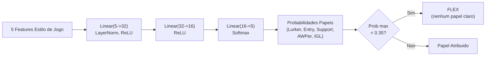

**Caracteristicas de input (5 dimensoes):**

| \# | Caracteristica   | Fonte                            | Intervalo | Significado                                                       |
| -- | ---------------- | ----------------------------------- | ---------- | ----------------------------------------------------------------- |
| 0  | TAPD             | `rounds_survived / rounds_played` | [0, 1]     | Taxa de sobrevivencia - mais alta = mais passivo/de suporte    |
| 1  | OAP              | `entry_frags / rounds_played`     | [0, 1]     | Agressividade inicial - mais alta = fragger em entrada          |
| 2  | PODT             | `was_traded_ratio`                | [0, 1]     | Percentual de mortes trocadas - mais alta = trocadas/iniciadas |
| 3  | rating_impact    | `impact_rating` ou HLTV 2.0        | float      | Impacto geral nos rounds                                     |
| 4  | aggression_score | `positional_aggression_score`     | float      | Tendencia para posicao avancada                                  |

**Papeis de output (softmax de 5 dimensoes):**

| Indice | Papel         | Descricao                                          |
| ------ | ------------- | ---------------------------------------------------- |
| 0      | LURKER        | Se esconde atras das linhas inimigas                  |
| 1      | ENTRY_FRAGGER | Primeiro a entrar, enfrenta os duelos iniciais         |
| 2      | SUPPORT       | Ancoragem do site, uso das utilidades, trocas |
| 3      | AWPER         | Especialista sniper                                 |
| 4      | IGL           | Lider em jogo, responsavel tatico                |

**Threshold FLEX:** Se `max(probabilidades) < 0,35`, o jogador e classificado como **FLEX** (versatil, nenhum papel dominante). Isso impede o modelo de forcar um papel quando o jogador e realmente um generalista.

**Detalhes treinamento:**

| Aspecto                               | Valor                                                                                                  |
| ------------------------------------- | ------------------------------------------------------------------------------------------------------- |
| **Perda**                   | `KLDivLoss(reduction="batchmean")` nas previsoes log-softmax em relacao aos targets soft label         |
| **Suavizacao dos rotulos** | epsilon = 0,02 (impede log(0), adiciona a regularizacao)                                              |
| **Otimizador**               | AdamW (lr=1e-3, weight_decay=1e-4)                                                                      |
| **Parada antecipada**          | Paciencia = 15 epocas sobre a perda de validacao                                                         |
| **Epocas maximas**              | 200                                                                                                     |
| **Divisao Train/Val**      | 80/20 aleatorio (dados transversais, nao sequenciais)                                                       |
| **Amostras minimas**             | 20 (da tabela `Ext_PlayerPlaystyle`)                                                              |
| **Fonte dados**                  | `cs2_playstyle_roles_2024.csv` -> Tabela DB `Ext_PlayerPlaystyle`                                  |
| **Normalizacao**             | Media/std por funcionalidade calculada no momento do treinamento, salva em `role_head_norm.json` |

**Consenso com classificador heuristico** (`role_classifier.py`):

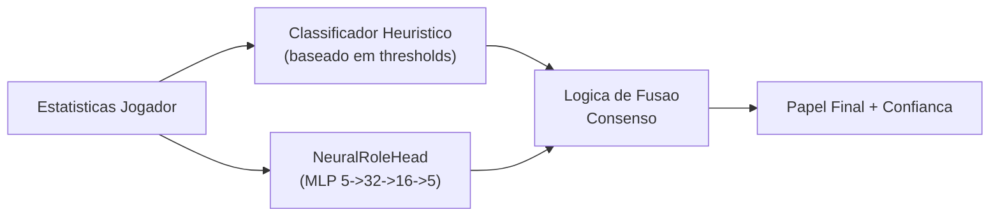

- **Ambos concordam** -> confianca aumentada em +0,10
- **Em desacordo, margem neural > 0,1** -> vence a opiniao neural
- **Em desacordo, margem neural <= 0,1** -> vence a opiniao heuristica
- **Neural nao disponivel** (nenhum checkpoint ou norm_stats) -> apenas heuristica
- **Protecao cold-start** -> retorna FLEX com 0% de confianca se os thresholds nao foram aprendidos

### -Coach Introspection Observatory

**Arquivos:** `training_callbacks.py`, `tensorboard_callback.py`, `maturity_observatory.py`, `embedding_projector.py`

O Observatorio e uma **arquitetura de plugin de 4 niveis** que instrumentaliza o ciclo de treinamento sem modificar o codigo de treinamento principal. Monitora os sinais neurais do treinador durante o treinamento e os traduz em estados de maturidade interpretaveis pelo humano, permitindo a desenvolvedores e operadores entender se o modelo esta confuso, em fase de aprendizado ou pronto para a producao.

> **Analogia:** O Observatorio e como um **sistema de boletins para o cerebro do treinador**. Enquanto o treinador estuda (treinamento), o Observatorio verifica constantemente: "Este cerebro esta confuso (DUVIDA)? Simplesmente esqueceu tudo o que aprendeu (CRISE)? Esta ficando mais inteligente (APRENDIZADO)? Esta tomando decisoes certas com seguranca (CONVICCAO)? Esta completamente maduro (MADURO)?" E como ter um conselheiro escolar que verifica as notas, a coerencia nos trabalhos, os scores dos testes e o comportamento do aluno, e escreve um relatorio de sintese depois de cada aula. Se a caneta do conselheiro quebrar (erro de callback), ele simplesmente encolhe os ombros e vai adiante: o aluno continua a estudar sem interrupcoes.

**Arquitetura de 4 niveis:**

| Nivel                  | Arquivo                        | Proposito                                  | Output chave                                                                         |
| ------------------------ | --------------------------- | -------------------------------------- | ------------------------------------------------------------------------------------- |
| 1.**Callback ABC** | `training_callbacks.py`   | Interface plugin + registro dispatch | `TrainingCallback` ABC, `CallbackRegistry.fire()`                                 |
| 2.**TensorBoard**  | `tensorboard_callback.py` | Registro escalar + histograma     | Mais de 9 sinais escalares, histogramas parametros/grad, histogramas gate/crencas/conceito |
| 3.**Maturidade**    | `maturity_observatory.py` | Maquina de estados de conviccao        | 5 sinais ->`conviction_index` -> 5 estados de maturidade                              |
| 4.**Embedding**    | `embedding_projector.py`  | Projecao crenca/conceito UMAP      | Figuras UMAP 2D interativas (degradacao gradual se umap-learn nao estiver instalado)         |

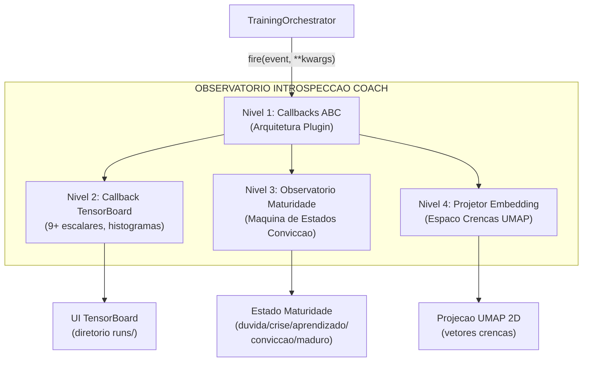

**Maturity State Machine:**

O `MaturityObservatory` calcula um **indice de conviccao** composto de 5 sinais neurais, o suaviza com EMA (alpha=0,3) e classifica o modelo em um dos 5 estados de maturidade:

```mermaid
stateDiagram-v2
    [*] --> DUVIDA
    DUVIDA --> APRENDIZADO : conviccao > 0.3 e em aumento
    DUVIDA --> CRISE : era seguro, queda > 20%
    APRENDIZADO --> CONVICCAO : conviccao > 0.6, std < 0.05 por 10 epocas
    APRENDIZADO --> DUVIDA : conviccao cai abaixo 0.3
    APRENDIZADO --> CRISE : queda 20% do max movel
    CONVICCAO --> MADURO : conviccao > 0.75, estavel 20+ epocas,\nvalue_accuracy > 0.7, gate_spec > 0.5
    CONVICCAO --> CRISE : queda 20% do max movel
    MADURO --> CRISE : queda 20% do max movel
    CRISE --> APRENDIZADO : conviccao recupera > 0.3
    CRISE --> DUVIDA : conviccao permanece < 0.3
```

**5 Sinais de Maturidade:**

| Sinal                 | Peso | Intervalo | O Que Mede                                                                     | Fonte                                        |
| ----------------------- | ---- | ---------- | ------------------------------------------------------------------------------- | -------------------------------------------- |
| `belief_entropy`      | 0,25 | [0, 1]     | Entropia de Shannon do vetor de crenca de 64 dim (mais baixo = mais seguro) | `model._last_belief_batch`                 |
| `gate_specialization` | 0,25 | [0, 1]     | `1 - mean_gate_activation` (mais alto = especialistas mais especializados)           | `SuperpositionLayer.get_gate_statistics()` |
| `concept_focus`       | 0,20 | [0, 1]     | `1 - entropy(concept_embedding_norms)` (entropia mais baixa = focalizado)    | `model.concept_embeddings`                 |
| `value_accuracy`      | 0,20 | [0, 1]     | `1 - (val_loss / initial_val_loss)` (mais alto = melhor calibracao)       | Ciclo de validacao                           |
| `role_stability`      | 0,10 | [0, 1]     | Coerencia da conviccao nas epocas recentes (`1 - std*5`)                 | Historico autorreferencial                  |

**Formula de conviccao:**

```
indice_conviccao = 0,25 x (1 - entropia_crenca)
+ 0,25 x especializacao_gate
+ 0,20 x focus_conceito
+ 0,20 x acuracia_valor
+ 0,10 x estabilidade_papel

score_maturidade = EMA(indice_conviccao, alpha=0,3)
```

**Thresholds de estado:**

| Estado                   | Condicao                                                                                                  |
| ----------------------- | ----------------------------------------------------------------------------------------------------------- |
| **DUVIDA**        | `conviction < 0,3`                                                                                        |
| **CRISE**         | `conviction` cai > 20% do maximo movel dentro de 5 epocas                                               |
| **APRENDIZADO** | `conviction em [0,3, 0,6]` e em aumento                                                                   |
| **CONVICTION**    | `conviction > 0,6`, estavel (`std < 0,05` em 10 epocas)                                                 |
| **MATURE**        | `conviction > 0,75`, estavel por mais de 20 epocas, `value_accuracy > 0,7`, `gate_specialization > 0,5` |

**`MaturitySnapshot` dataclass:** A cada epoca, o Observatorio produz um snapshot imutavel:

| Campo | Tipo | Descricao |
|---|---|---|
| `epoch` | int | Numero da epoca |
| `timestamp` | datetime | Momento da gravacao |
| `belief_entropy` | float | Entropia de Shannon do vetor crencas |
| `gate_specialization` | float | Especializacao dos especialistas |
| `concept_focus` | float | Focalizacao nos conceitos de coaching |
| `value_accuracy` | float | Acuracia das predicoes de valor |
| `role_stability` | float | Estabilidade da classificacao dos papeis |
| `conviction_index` | float | Indice composto ponderado |
| `maturity_score` | float | Score EMA suavizado (alpha=0.3) |
| `state` | str | Estado atual (DUVIDA/CRISE/APRENDIZADO/CONVICCAO/MADURO) |

**Extracao dos 5 sinais neurais - como sao calculados:**

| Sinal | Metodo | Fonte de dados | Calculo |
|---|---|---|---|
| `belief_entropy` | `_compute_belief_entropy()` | `model._last_belief_batch` | softmax(belief) -> Shannon entropy / log(dim) -> 1 - normalizada |
| `gate_specialization` | `_compute_gate_specialization()` | `strategy.superposition.get_gate_statistics()` | `1 - mean_activation` (mais alto = especialistas mais especializados) |
| `concept_focus` | `_compute_concept_focus()` | `model.concept_embeddings.weight` | normas L2 -> softmax -> `1 - entropy` (mais baixo = mais focalizado) |
| `value_accuracy` | `_compute_value_accuracy()` | Ciclo de validacao | `1 - (val_loss / initial_val_loss)`, clamped [0, 1] |
| `role_stability` | `_compute_role_stability()` | Historico recente | `1 - std(ultimos 10 conviction_index) x 5`, clamped [0, 1] |

**API publica:** `current_state` (propriedade -> string estado), `current_conviction` (propriedade -> float), `get_timeline()` (-> lista de `MaturitySnapshot` para exportacao/graficos).

**Integracao TensorBoard:** Cada `on_epoch_end()` registra **7 escalares** em TensorBoard:

```
maturity/belief_entropy, maturity/gate_specialization, maturity/concept_focus,
maturity/value_accuracy, maturity/role_stability,
maturity/conviction_index, maturity/maturity_score
```

Mais um log textual do estado atual via logger estruturado.

> **Analogia estendida:** Cada sinal mede um aspecto diferente da "saude mental" do modelo. A `entropia das crencas` e como perguntar "Seu cerebro esta seguro ou confuso?". A `especializacao do gate` e "Seus especialistas tem papeis claros ou fazem todos a mesma coisa?". O `focus nos conceitos` e "Voce esta usando os 16 vocabulos de coaching de forma distinta ou os confunde?". A `acuracia do valor` e "Suas estimativas de vantagem correspondem a realidade?". A `estabilidade dos papeis` e "Voce muda continuamente de ideia ou e coerente?". O indice de conviccao combina tudo isso em uma unica "nota de saude" e o EMA o suaviza para evitar oscilacoes - como um medico que nao se alarma com um unico batimento anomalo mas observa a tendencia.

**Garantias de design:**

- **Impacto zero se desabilitado:** Quando nenhuma callback e registrada, todas as chamadas `CallbackRegistry.fire()` sao no-op. Nenhuma alocacao de memoria, nenhum overhead de calculo.
- **Isolamento dos erros:** Cada callback e submetida individualmente a try/except-wrapping. Um erro de escrita de TensorBoard ou de calculo UMAP nunca causa o travamento do ciclo de training: o erro e registrado e o training continua.
- **Componivel:** E possivel adicionar novas callbacks subclassificando `TrainingCallback` e registrando-se com `CallbackRegistry.add()`. Nao e necessario modificar o codigo de training.

**Integracao CLI:** Iniciado atraves de `run_full_training_cycle.py` com os flags:

- `--no-tensorboard` - desabilita o callback de TensorBoard
- `--tb-logdir <caminho>` - define o diretorio de log de TensorBoard (predefinido: `runs/`)
- `--umap-interval <N>` - projecao UMAP a cada N epocas (predefinido: 10)

---

## Resumo da Parte 1A - O Cerebro

A Parte 1A documentou o **nucleo cognitivo** do sistema de coaching - todo o subsistema de redes neurais que constitui o "cerebro" do coach:

| Componente | Papel | Detalhes Chave |
|---|---|---|
| **AdvancedCoachNN** | Coaching supervisionado base | LSTM de 2 camadas + 3 especialistas MoE, input 25-dim, output 10-dim |
| **JEPA** | Pre-treinamento auto-supervisionado | Encoder online/target (EMA tau=0.996), InfoNCE contrastivo |
| **VL-JEPA** | Alinhamento visao-linguagem | 16 conceitos de coaching em 5 dimensoes taticas |
| **SuperpositionLayer** | Gating contextual | Modulacao dependente do contexto 25-dim com observabilidade integrada |
| **CoachTrainingManager** | Orquestracao treinamento | 3 niveis de maturidade (CALIBRACAO->APRENDIZADO->MADURO) |
| **TrainingOrchestrator** | Ciclo de epocas unificado | Early stopping, checkpoint, callback, pool negativos cross-match, quality gate |
| **ModelFactory** | Instanciacao modelos | 6 tipos de modelo (+ RAP Lite) com persistencia e fallback |
| **NeuralRoleHead** | Classificacao papeis | MLP 5->32->16->5, consenso com heuristica |
| **MaturityObservatory** | Introspeccao treinamento | 5 sinais -> indice de conviccao -> 5 estados de maturidade |

> **Analogia:** Se o sistema de coaching fosse um **ser humano**, a Parte 1A descreveu seu cerebro - as redes neurais que aprendem, o sistema de avaliacao da maturidade que decide quando o cerebro esta pronto para dar conselhos, e a fabrica que constroi e salva cada tipo de cerebro. Mas um cerebro sozinho nao basta: precisa de **olhos e ouvidos** para perceber o mundo e de um **especialista medico** para diagnosticos aprofundados. A **Parte 1B** documenta exatamente isso.

```mermaid
flowchart LR
    subgraph PARTE1A["PARTE 1A - O Cerebro (este documento)"]
        NN["Core NN<br/>(JEPA, VL-JEPA,<br/>AdvancedCoachNN)"]
        OBS["Observatorio<br/>(TensorBoard + Maturidade<br/>+ Embedding)"]
        FACTORY["ModelFactory +<br/>Persistencia"]
    end
    subgraph PARTE1B["PARTE 1B - Os Sentidos e o Especialista"]
        RAP["RAP Coach<br/>(7 componentes +<br/>ChronovisorScanner +<br/>GhostEngine)"]
        DS["Fontes de Dados<br/>(Demo, HLTV, Steam,<br/>FACEIT, TensorFactory,<br/>FrameBuffer, FAISS)"]
    end
    subgraph PARTE2["PARTE 2 - Servicos e Infraestrutura"]
        SVC["Servicos de Coaching<br/>(fallback 4 niveis)"]
        ANL["Motores de Analise<br/>(11 especialistas)"]
        KB["Conhecimento<br/>(RAG + COPER)"]
        DB["Banco de Dados<br/>(Tri-Tier SQLite)"]
    end

    DS --> NN
    DS --> RAP
    NN --> SVC
    RAP --> SVC
    OBS --> NN
    FACTORY --> NN
    ANL --> SVC
    KB --> SVC
    SVC --> DB

    style PARTE1A fill:#e8f4f8
    style PARTE1B fill:#fff3e0
    style PARTE2 fill:#f0f8e8
```

> **Continua na Parte 1B** - *Os Sentidos e o Especialista: RAP Coach Model, ChronovisorScanner, GhostEngine, Fontes de Dados (Demo Parser, HLTV, Steam, FACEIT, TensorFactory, FrameBuffer, FAISS, Round Context)*
