# Ultimate CS2 Coach — Part 1B: The Senses and the Specialist

> **Topics:** RAP Coach Model (7-component architecture: Perception, LTC+Hopfield Memory, Strategy, Pedagogy, Causal Attribution, Positioning, Communication), ChronovisorScanner (multi-scale critical moment detection), GhostEngine (4-tensor inference pipeline), and all external data sources (Demo Parser, HLTV, Steam, FACEIT, TensorFactory, FrameBuffer, FAISS, Round Context).
>
> **Author:** Renan Augusto Macena

---

> This document is the continuation of **Part 1A** — *The Brain: Neural Architecture and Training*, which documents the neural network models (JEPA, VL-JEPA, AdvancedCoachNN), the 3-level maturity training system, the Coach Introspection Observatory, and the system's architectural foundations (NO-WALLHACK principle, 25-dim contract).

## Table of Contents

**Part 1B — The Senses and the Specialist (this document)**

4. [Subsystem 2 — RAP Coach Model (`backend/nn/experimental/rap_coach/`)](#4-subsystem-2--rap-coach-model)
   - RAPCoachModel (Dual Visual Inputs: per-timestep and static)
   - Perception Layer (3-stream ResNet)
   - Memory Layer (LTC + Hopfield)
   - Strategy Layer (SuperpositionLayer + MoE)
   - Pedagogy Layer (Value Critic + Causal Attribution)
   - Latent Skill Model
   - RAP Trainer (Composite Loss Function)
   - ChronovisorScanner (Multi-Scale Critical Moment Detection)
   - GhostEngine (4-Tensor Inference Pipeline with PlayerKnowledge)
5. [Subsystem 1B — Data Sources (`backend/data_sources/`)](#5-subsystem-1b--data-sources)
   - Demo Parser + Demo Format Adapter
   - Event Registry (CS2 Events Schema)
   - Trade Kill Detector
   - Steam API + Steam Demo Finder
   - HLTV Module (stat_fetcher, FlareSolverr, Docker, Rate Limiter)
   - FACEIT API + Integration
   - FrameBuffer (Circular Buffer for HUD Extraction)
   - TensorFactory — Tensor Factory (Player-POV Perception NO-WALLHACK)
   - FAISS Vector Index (High-Speed Semantic Search)
   - Round Context (Temporal Grid)

**Part 1A** — The Brain: Neural Network Core (JEPA, VL-JEPA, AdvancedCoachNN, SuperpositionLayer, EMA, CoachTrainingManager, TrainingOrchestrator, ModelFactory, NeuralRoleHead, MaturityObservatory)

**Part 2** — Sections 5-13: Coaching Services, Coaching Engines, Knowledge and Retrieval, Analysis Engines (11), Processing and Feature Engineering, Control Module, Progress and Trends, Database and Storage (Tri-Tier), Training and Orchestration Pipeline, Loss Functions

**Part 3** — Program Logic, UI, Ingestion, Tools, Tests, Build, Remediation

---

## 4. Subsystem 2 — RAP Coach Model

**Canonical directory:** `backend/nn/experimental/rap_coach/` (the old path `backend/nn/rap_coach/` is a redirection shim)
  **Files:** `model.py`, `perception.py`, `memory.py`, `strategy.py`, `pedagogy.py`, `communication.py`, `skill_model.py`, `trainer.py`, `chronovisor_scanner.py`

  The RAP (Reasoning, Adaptation, Pedagogy) Coach is a **deep architecture with 6 learnable neural components + 1 external communication layer**, specifically designed for CS2 coaching under partial observability conditions (POMDP conditions). The `RAPCoachModel` class contains Perception (`RAPPerception`), Memory (`RAPMemory` with LTC+Hopfield), Strategy (`RAPStrategy`), Pedagogy (`RAPPedagogy` with Value Critic and Skill Adapter), Causal Attribution (`CausalAttributor`) and a Positioning Head (`nn.Linear(256→3)`), all learnable. The Communication layer (`communication.py`) operates externally as a post-processing template selector. The forward pass produces 6 outputs: `advice_probs`, `belief_state`, `value_estimate`, `gate_weights`, `optimal_pos` and `attribution`.


  >

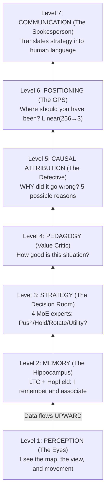

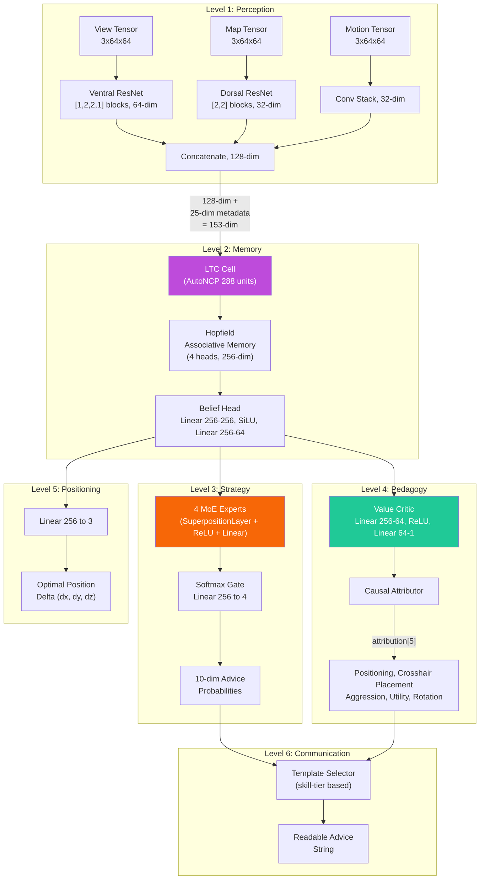

### -Perception Layer (`perception.py`)

A **three-stream convolutional** front-end that processes the visual inputs:

| Input                                | Shape         | Backbone                                                | Output Dim       |
| ------------------------------------ | ------------- | ------------------------------------------------------- | ---------------- |
| **View tensor**                      | `3×64×64`     | Ventral stream ResNet: [1,2,2,1] blocks, 3→64 channels  | **64-dim**       |
| **Map tensor**                       | `3×64×64`     | Dorsal stream ResNet: [2,2] blocks, 3→32 channels       | **32-dim**       |
| **Motion tensor**                    | `3×64×64`     | Conv(3→16→32) + MaxPool + AdaptiveAvgPool               | **32-dim**       |

The three feature vectors are concatenated into a single **128-dimensional perception embedding** (64 + 32 + 32).

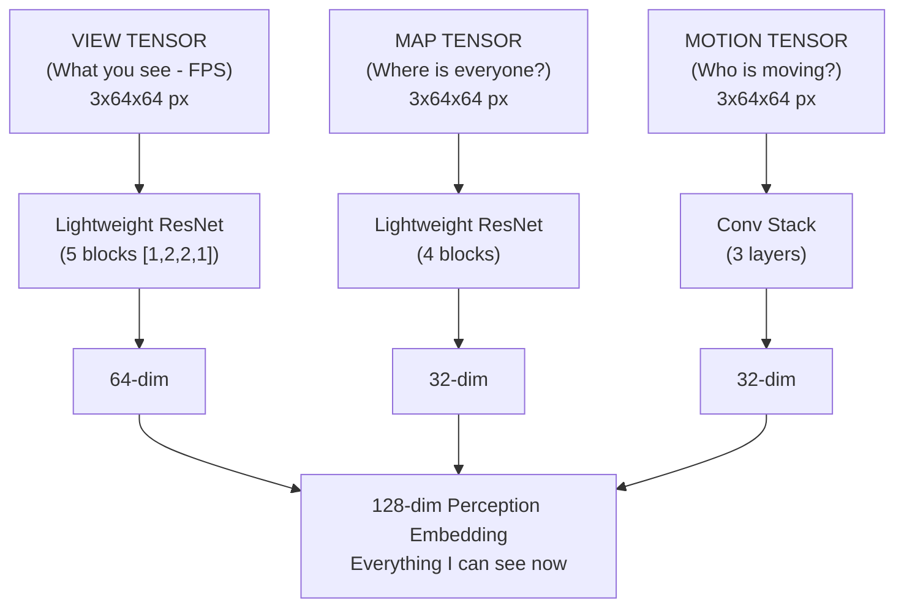

The ResNet blocks use **identity shortcuts** with learnable downsample (Conv1×1 + BatchNorm) when stride ≠ 1 or the channel count changes. **24 convolution layers** across all three streams:

| Stream                     | Block configuration                  | Blocks  | Conv/Block  | Shortcut convs          | Total        |
| -------------------------- | ------------------------------------ | ------- | ----------- | ----------------------- | ------------ |
| **View (Ventral)**         | `[1,2,2,1]` → 1 + 5 = 6 blocks       | 6       | 2           | 1 (first block)         | **13**       |
| **Map (Dorsal)**           | `[2,2]` → 1 + 3 = 4 blocks           | 4       | 2           | 1 (first block)         | **9**        |
| **Motion**                 | Conv stack (2 layers)                | —       | —           | —                       | **2**        |
| **Total**                  |                                      |         |             |                         | **24**       |

> **How `_make_resnet_stack` works:** It creates 1 initial block with `stride=2` (for spatial downsampling), then `sum(num_blocks) - 1` additional blocks with `stride=1`. Each `ResNetBlock` has 2 Conv2d layers (3×3 kernel). The first block also receives a Conv1×1 shortcut because the input channels (3) differ from the output channels (64 or 32).

> **Note on architectural choice (F3-29):** The original configuration `[3,4,6,3]` (15 blocks, 33 conv in the ventral stream) was designed for 224×224 inputs (ImageNet's standard size). For 64×64 inputs as used in this project, the feature maps would collapse spatially after the first stride-2 block, making subsequent blocks redundant. The `[1,2,2,1]` configuration (5 effective blocks) is specifically calibrated for the 64×64 training resolution, with `AdaptiveAvgPool2d` handling any residual spatial resolution. Any previous checkpoints are automatically detected as `_stale_checkpoint` by `load_nn()`.

### -Memory Layer (`memory.py`) — LTC + Hopfield

This part addresses the fundamental challenge that the CS2 coach is a **Partially Observable Markov Decision Process** (POMDP).

**Liquid Time-Constant (LTC) network with AutoNCP wiring:**

- Input: 153 dim (128 perception + 25 metadata)
- NCP units: **512** (`hidden_dim * 2` = 256 × 2) — a 2:1 ratio that guarantees enough inter-neurons for sparse AutoNCP wiring
- Output: 256-dim hidden state
- Uses the `ncps` library with sparse connectivity patterns, similar to those of the brain
- Adapts temporal resolution to the pace of the game (slow setups vs. fast firefights)
- Deterministic seeding (NN-MEM-02): numpy + torch RNG seeded at 42 during AutoNCP wiring creation, with restoration of the original RNG state after initialization — guarantees checkpoint portability across different runs

**Hopfield associative memory:**

- Input/Output: 256-dim
- Heads: 4
- Uses `hflayers.Hopfield` as **content-addressable memory** for prototype round retrieval

**Hopfield activation delay (NN-MEM-01 + RAP-M-04):**

The Hopfield network **does not activate immediately** during training. The memorized patterns start from random initialization (`torch.randn * 0.02`) and the attention would be nearly uniform across all slots, adding noise rather than signal. For this reason:

- `_training_forward_count` counts the forward passes during training
- `_hopfield_trained` (boolean flag) remains `False` until ≥2 training forward passes
- Before activation, the forward pass returns `torch.zeros_like(ltc_out)` instead of the Hopfield output
- After ≥2 forwards (ensuring that at least one backward + optimizer.step has shaped the patterns), Hopfield activates and contributes to the combined_state
- Loading a checkpoint (`load_state_dict`) sets `_hopfield_trained = True` immediately, assuming the model has already been trained

**RAPMemoryLite — Pure LSTM fallback:**

Lightweight replacement module for `RAPMemory`, used when the `ncps`/`hflayers` dependencies are not available or when a more portable model is desired:

- Standard PyTorch LSTM: `nn.LSTM(153, 256, batch_first=True)`
- Same I/O contract: Input `[B, T, 153]` → Output `(combined_state [B, T, 256], belief [B, T, 64], hidden)`
- Same belief head: `Linear(256→256) → SiLU → Linear(256→64)`
- No RNG seeding needed (no AutoNCP)
- No Hopfield training delay (no memorized patterns)
- Instantiated via `ModelFactory.TYPE_RAP_LITE` ("rap-lite") with `use_lite_memory=True`

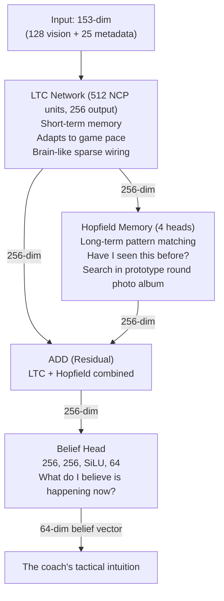

**Residual combination:** `combined_state = ltc_out + hopfield_out`

**Belief head:** `Linear(256→256) → SiLU → Linear(256→64)` — produces a 64-dimensional belief vector that encodes the coach's latent tactical understanding.

**Forward pass:**

```python
ltc_out, hidden = self.ltc(x, hidden) # x: [B, seq, 153] → [B, seq, 256]
mem_out = self.hopfield(ltc_out) # [B, seq, 256]
combined_state = ltc_out + mem_out # Residual
belief = self.belief_head(combined_state) # [B, seq, 64]
return combined_state, belief, hidden
```

### -Strategy Layer (`strategy.py`) — Superposition + MoE

Implements **SuperpositionLayer** combined with a context-conditioned mixture of experts:

**SuperpositionLayers** (`layers/superposition.py`): context-dependent gating where `output = F.linear(x, weight, bias) * sigmoid(context_gate(context))`. A sigmoid gate vector conditioned on the **25-dim** context (full METADATA_DIM) selectively masks the expert outputs. The L1 sparsity loss (`context_gate_l1_weight = 1e-4`) encourages sparse and interpretable gating. Observable: gate statistics (mean, std, sparsity, active_ratio) can be tracked.

> **Note:** `RAPStrategy.__init__` uses `context_dim=25` (METADATA_DIM). The gate network is `Linear(hidden_dim=256, num_experts=4) → Softmax(dim=-1)`.

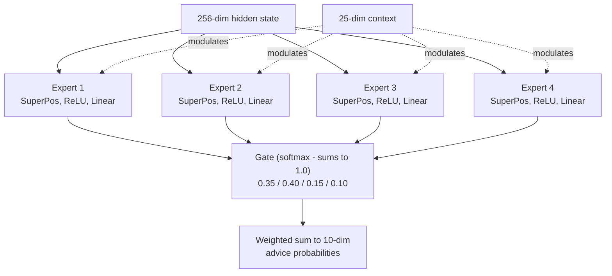

**4 Expert Modules:** Each expert is a `ModuleDict`: `SuperpositionLayer(256→128, context_dim=25) → ReLU → Linear(128→10)`.

**Gate Network:** `Linear(256→4) → Softmax`.

**Output:** 10-dimensional advice probability distribution and 4-dimensional gate weights vector.

### -Pedagogy Layer (`pedagogy.py`) — Value + Attribution

Two submodules:

1. **Value Critic:** `Linear(256→64) → ReLU → Linear(64→1)`. Estimates V(s) for temporal-difference learning. **Skill Adapter:** `Linear(10 skill_buckets → 256)` enables skill-conditioned value estimates.

1. **CausalAttributor:** Produces a 5-dimensional attribution vector that maps training concepts:

| Index  | Concept                             | Mechanical signal                          |
| ------ | ----------------------------------- | ------------------------------------------ |
| 0      | **Positioning**                     | norm(position_delta)                       |
| 1      | **Crosshair placement**             | norm(view_delta)                           |
| 2      | **Aggression**                      | 0.5 × position_delta                       |
| 3      | **Utility**                         | `sigmoid(hidden.mean())` — **learned and context-dependent** signal: produces high activation when the network detects situations where utility use was relevant, low when tactical context makes utility secondary. It is not a static placeholder, but a non-linear function of the hidden state that adapts during training |
| 4      | **Rotation**                        | 0.8 × position_delta                       |

Fusion: `attribution = context_weights × mechanical_errors` where context_weights derives from `Linear(256→32) → ReLU → Linear(32→5) → Sigmoid`.

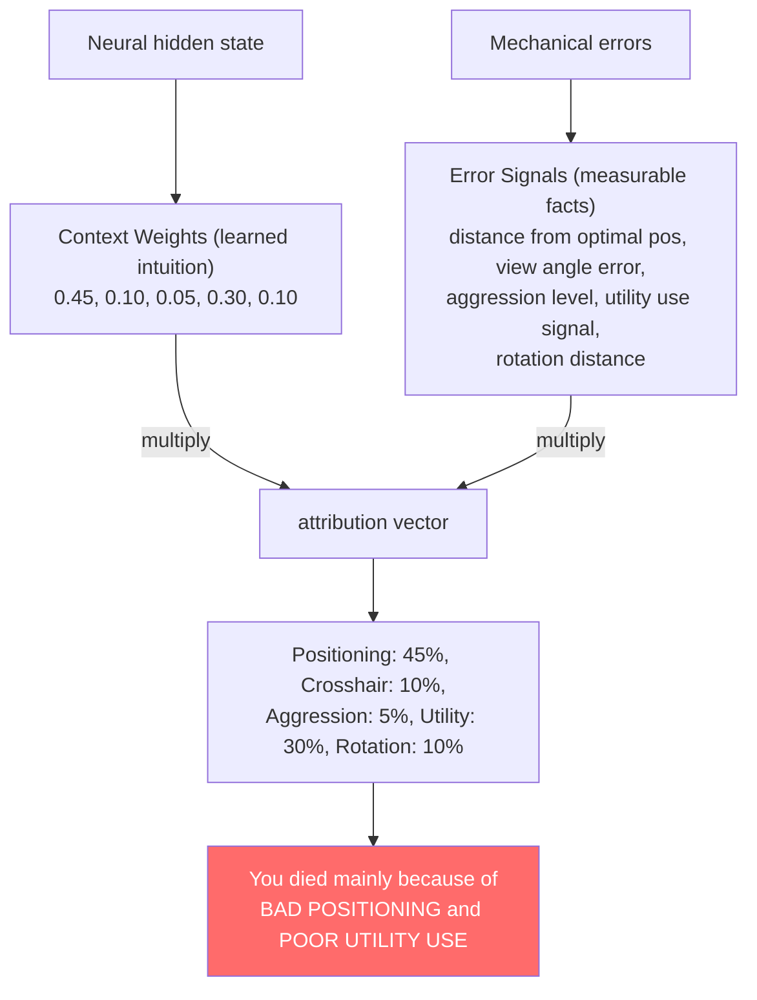

### -Latent Skill Model (`skill_model.py`)

Decomposes raw statistics into 5 skill axes using statistical normalization against professional baselines:

| Skill Axis               | Input statistics                                                        | Normalization                         |
| ------------------------ | ----------------------------------------------------------------------- | ------------------------------------- |
| **Mechanics**            | Accuracy, avg_hs                                                        | Z-score (μ=pro_mean, σ=pro_std)       |
| **Positioning**          | Survival_rating, kast_rating                                            | Z-score                               |
| **Utility**              | Utility_blind_time, Utility_enemies_flashed                             | Z-score                               |
| **Timing**               | Opening_duel_win_pct, Positional_aggression_score                       | Z-score                               |
| **Decision**             | Clutch_win_pct, Impact_rating                                           | Z-score                               |

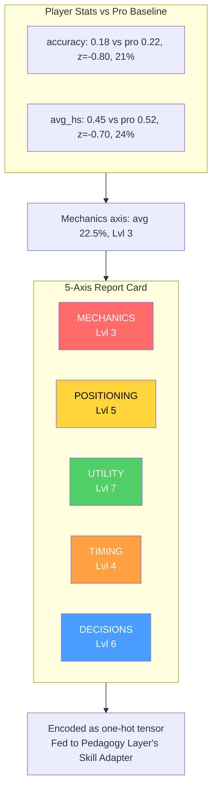

The Z-scores are converted to percentiles via the **logistic approximation** `1/(1+exp(-1.702z))` (fast CDF approximation), then the mean percentile is mapped to a **curriculum level** (1–10) via `int(avg_skill * 9) + 1`, clamped to [1, 10]. The level is encoded as a one-hot tensor (10-dim) via `SkillLatentModel.get_skill_tensor()` for the Pedagogy Layer's Skill Adapter.

### -RAP Trainer (`trainer.py`)

Orchestrates the training loop with a **composite loss function**:

```
L_total = L_strategy + 0.5 × L_value + L_sparsity + L_position
```

| Loss term          | Formula                                                   | Weight | Purpose                                                          |
| ------------------ | --------------------------------------------------------- | ------ | ---------------------------------------------------------------- |
| `L_strategy`       | `MSELoss(advice_probs, target_strat)`                     | 1.0    | Correct tactical recommendation                                  |
| `L_value`          | `MSELoss(V(s), true_advantage)`                           | 0.5    | Accurate advantage estimation                                    |
| `L_sparsity`       | `model.compute_sparsity_loss(gate_weights)` — L1 on gate weights (explicit parameter, thread-safe) | 1e-4 | Expert specialization                                            |
| `L_position`       | `MSE(pred_xy, true_xy) + 2.0 × MSE(pred_z, true_z)`       | 1.0    | Optimal positioning, **strict penalty on the Z-axis**            |

> **Note:** The 2× multiplier on the Z-axis exists because vertical positioning errors (e.g., a wrong floor on Nuke/Vertigo) are tactically catastrophic: they represent wrong-floor errors that no horizontal correction can fix.


**Output per training step:** `{loss, sparsity_ratio, loss_pos, z_error}`.

### -RAPCoachModel Forward Pass Summary

**Signature:** `forward(view_frame, map_frame, motion_diff, metadata, skill_vec=None, hidden_state=None)` — the `hidden_state` parameter (NN-40) allows passing the recurrent memory state from one call to the next, enabling **continuous inference** without cold-start: the GhostEngine can maintain memory between consecutive ticks rather than starting from scratch at every evaluation.

**NN-39 Fix — Dual Visual Inputs:** The forward pass handles two formats of visual input through an explicit dimensional check:

| Input Format | Shape | When used | Behavior |
|---|---|---|---|
| **Per-timestep** | `[B, T, C, H, W]` (5-dim) | Training with temporal sequences | Each timestep processed individually by the CNN |
| **Static** | `[B, C, H, W]` (4-dim) | Real-time inference (GhostEngine) | Single frame expanded across all timesteps |

```python
def forward(view_frame, map_frame, motion_diff, metadata, skill_vec=None):
    batch_size, seq_len, _ = metadata.shape

    # NN-39 fix: supports per-timestep visual input [B,T,C,H,W] and static [B,C,H,W]
    if view_frame.dim() == 5:
        # Per-timestep — process each timestep through the CNN separately
        z_frames = []
        for t in range(view_frame.shape[1]):
            z_t = self.perception(view_frame[:, t], map_frame[:, t], motion_diff[:, t])
            z_frames.append(z_t)
        z_spatial_seq = torch.stack(z_frames, dim=1)      # [B, T, 128]
    else:
        # Static — single frame expanded across all timesteps
        z_spatial = self.perception(view_frame, map_frame, motion_diff)  # [B, 128]
        z_spatial_seq = z_spatial.unsqueeze(1).expand(-1, seq_len, -1)   # [B, T, 128]

    lstm_in = cat([z_spatial_seq, metadata], dim=2)        # [B, seq, 153]
    hidden_seq, belief, new_hidden = self.memory(lstm_in, hidden=hidden_state)  # [B, seq, 256], [B, seq, 64]
    last_hidden = hidden_seq[:, -1, :]
    prediction, gate_weights = self.strategy(last_hidden, context)  # [B, 10], [B, 4]
    value_v = self.pedagogy(last_hidden, skill_vec)        # [B, 1]
    optimal_pos = self.position_head(last_hidden)          # [B, 3]
    attribution = self.attributor.diagnose(last_hidden, optimal_pos) # [B, 5]
    return {
        "advice_probs": prediction,      # [B, 10]
        "belief_state": belief,          # [B, seq, 64]
        "value_estimate": value_v,       # [B, 1]
        "gate_weights": gate_weights,    # [B, 4]
        "optimal_pos": optimal_pos,      # [B, 3]
        "attribution": attribution,      # [B, 5]
        "hidden_state": new_hidden,      # NN-40: recurrent state for continuous inference
    }
```

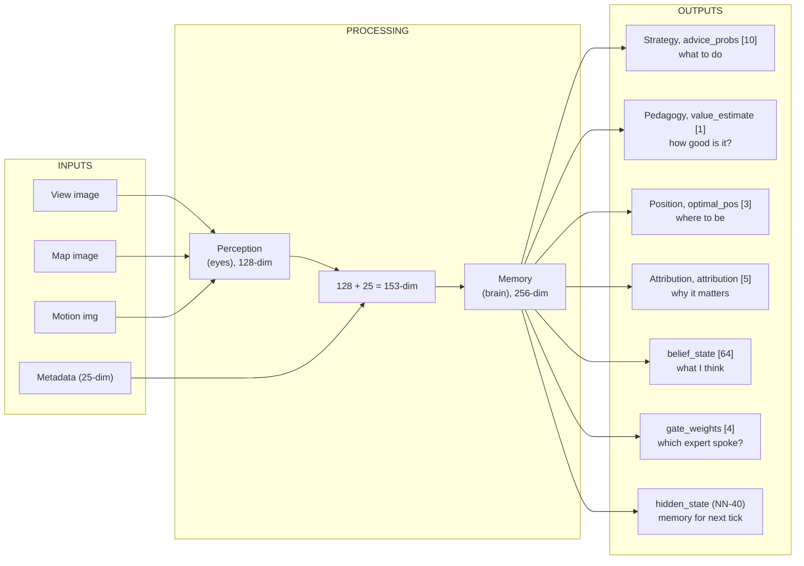

### -ChronovisorScanner (`chronovisor_scanner.py`)

A **multi-scale signal processing module** that identifies critical moments in matches by analyzing temporal advantage deltas at **3 resolution levels** (micro, standard, macro):

**Multi-Scale Configuration (`ANALYSIS_SCALES`):**

| Scale | Window (ticks) | Lag | Threshold | Description |
| ----- | -------------- | --- | --------- | ----------- |
| **Micro** | 64 | 16 | 0.10 | Sub-second engagement decisions |
| **Standard** | 192 | 64 | 0.15 | Engagement-level critical moments |
| **Macro** | 640 | 128 | 0.20 | Strategic shift detection (5-10 seconds) |

**Detection pipeline (for each scale):**

1. Uses the trained RAP model to predict V(s) for each tick window.
2. Computes deltas using the lag configured for the scale: `deltas = values[LAG:] - values[:-LAG]`.
3. Detects **spikes** where `|delta| > threshold` (variable per scale: 0.10/0.15/0.20).
4. Searches for the peak within the configured window, maintaining sign consistency.
5. **Non-maximum suppression** prevents duplicate detections.
6. Classifies each peak as **"play"** (positive gradient, advantage gained) or **"error"** (negative, advantage lost).
7. Returns instances of the `CriticalMoment` dataclass with `(match_id, start_tick, peak_tick, end_tick, severity [0-1], type, description, scale)`.

**Tick safety limit (F3-21):** `_MAX_TICKS_PER_SCAN = 50,000` — matches with more than 50K ticks (possible with extended overtime or very long matches) are **truncated** with a warning (NN-CV-02) rather than saturating RAM. The system fetches `_MAX_TICKS_PER_SCAN + 1` ticks to detect truncation and warns that critical moments in the late match phase may be lost.

**Cross-scale deduplication:** When the same moment is detected at different scales (e.g., a critical peek visible in both micro and standard scales), deduplication prioritizes **micro > standard > macro** (the finer scale wins). `MIN_GAP_TICKS = 64` (~1 second) defines the minimum distance between two moments: if two spikes are closer than 64 ticks, they are considered the same event and only the finer-scale one is kept.

**Severity labels:** Severity (0-1) is automatically classified for the `MatchVisualizer`:
- `severity > 0.3` → **"critical"** (game-changing moment)
- `severity > 0.15` → **"significant"** (relevant moment)
- otherwise → **"notable"** (noteworthy moment)

**`ScanResult` dataclass:** Structured return type that distinguishes success from failure:

| Field | Type | Description |
|---|---|---|
| `critical_moments` | `List[CriticalMoment]` | Detected critical moments |
| `success` | `bool` | True if the scan completed (even with 0 moments) |
| `error_message` | `Optional[str]` | Error detail if `success=False` |
| `model_loaded` | `bool` | Whether the RAP model was available |
| `ticks_analyzed` | `int` | Number of ticks actually analyzed |

Utility properties: `is_empty_success` (successful scan but no critical moments found), `is_failure` (failed scan — model not loaded, DB error, etc.).

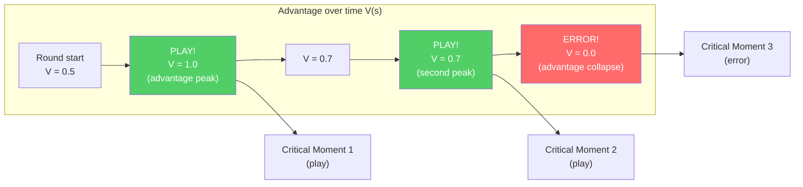

### -GhostEngine (`inference/ghost_engine.py`)

Real-time inference for the "Ghost" — overlay of the player's optimal position. The GhostEngine represents the **endpoint** of the entire neural chain: it is where the RAP Coach Model produces outputs visible to the user in the form of a "ghost player" on the tactical map.

**4-Tensor Inference Pipeline with PlayerKnowledge:**

The inference pipeline operates in 5 sequential phases for each playback tick:

**Phase 1 — Model Loading (`_load_brain()`)**
- Verifies `USE_RAP_MODEL` from configuration (master switch)
- `ModelFactory.get_model(ModelFactory.TYPE_RAP)` — instantiates the RAP model
- `load_nn(checkpoint_name, model)` — loads the weights from the checkpoint on disk
- `model.to(device)` → `model.eval()` — moves to GPU/CPU and activates inference mode
- On failure: `model = None`, `is_trained = False` — disables predictions

**Phase 2 — Input Tensor Construction**

| Tensor | Method | Output Shape | Content |
|---|---|---|---|
| **Map** | `tensor_factory.generate_map_tensor(ticks, map_name, knowledge)` | `[1, 3, 64, 64]` | Teammates positions, visible enemies, utility + bomb |
| **View** | `tensor_factory.generate_view_tensor(ticks, map_name, knowledge)` | `[1, 3, 64, 64]` | 90° FOV mask, visible entities, utility zones |
| **Motion** | `tensor_factory.generate_motion_tensor(ticks, map_name)` | `[1, 3, 64, 64]` | 32-tick trajectory, velocity field, crosshair delta |
| **Metadata** | `FeatureExtractor.extract(tick_data, map_name, context)` | `[1, 1, 25]` | Canonical 25-dim vector (health, position, economy, etc.) |

The **PlayerKnowledge bridge** (`_build_knowledge_from_game_state()`) filters data according to the NO-WALLHACK principle: only information legitimately available to the player (teammates, visible enemies, last known positions with decay) is encoded in the map and view tensors. If knowledge construction fails, the system degrades to legacy mode (empty tensors).

**Phase 2b — POV Mode (R4-04-01):**

| Mode | Condition | Behavior |
|---|---|---|
| **POV Mode** | `USE_POV_TENSORS=True` + `game_state` provided | Builds `PlayerKnowledge` from the game state → POV tensors with dedicated channel semantics |
| **Legacy Mode** | `USE_POV_TENSORS=False` (default) | Standard tensors aligned with training data |

> **Warning (R4-04-01):** POV tensors use different channel semantics (Ch0=teammates, Ch1=last-known enemies) compared to standard training data (Ch0=enemies, Ch1=teammates). Using POV tensors with a model trained in legacy mode will produce **unreliable** results. POV mode is only valid if the model was trained with POV data.

**Phase 3 — Neural Inference**
```python
with torch.no_grad():
    out = self.model(view_frame=view_t, map_frame=map_t,
                     motion_diff=motion_t, metadata=meta_t,
                     hidden_state=self._last_hidden)  # NN-40: persistent state
self._last_hidden = out["hidden_state"]  # Keep for next tick
```
`torch.no_grad()` disables gradient computation (inference only, no training). The `hidden_state` parameter (NN-40) allows maintaining the recurrent memory state between consecutive ticks, avoiding cold-start at each evaluation.

**Phase 4 — Decoding and Position Scaling**
```python
optimal_delta = out["optimal_pos"].cpu().numpy()[0]    # [dx, dy, dz]
ghost_x = current_x + (optimal_delta[0] * RAP_POSITION_SCALE)  # × 500.0
ghost_y = current_y + (optimal_delta[1] * RAP_POSITION_SCALE)  # × 500.0
return (ghost_x, ghost_y)
```
The model produces a delta normalized in [-1, 1] that is scaled to world coordinates via `RAP_POSITION_SCALE = 500.0` (from `config.py`). The constant is shared between GhostEngine and overlay to ensure consistency.

**Phase 5 — Graceful Fallback (5 modes)**

| Fallback Mode | Condition | Behavior |
|---|---|---|
| **Model disabled** | `USE_RAP_MODEL=False` | Skip loading, returns `(0.0, 0.0)` |
| **Missing checkpoint** | Training not completed | `model = None`, predictions disabled |
| **Missing map name** | No spatial context | Returns `(0.0, 0.0)` immediately |
| **PlayerKnowledge error** | Knowledge construction failed | Degrades to legacy tensors (all zeros) |
| **Inference error** | RuntimeError / CUDA OOM | Logs error, returns `(0.0, 0.0)` |

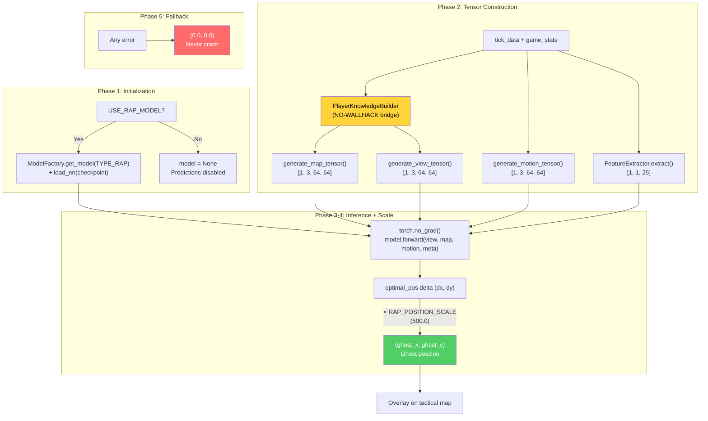

---

## 5. Subsystem 1B — Data Sources

**Program folder:** `backend/data_sources/`
**Files:** `demo_parser.py`, `demo_format_adapter.py`, `event_registry.py`, `trade_kill_detector.py`, `hltv_scraper.py`, `hltv_metadata.py`, `steam_api.py`, `steam_demo_finder.py`, `faceit_api.py`, `faceit_integration.py`, `__init__.py`

The Data Sources subsystem is the **entry point for all external data** into the system. It collects information from 5 distinct sources: CS2 demo files, HLTV statistics, Steam profiles, FACEIT data, and game event registry.

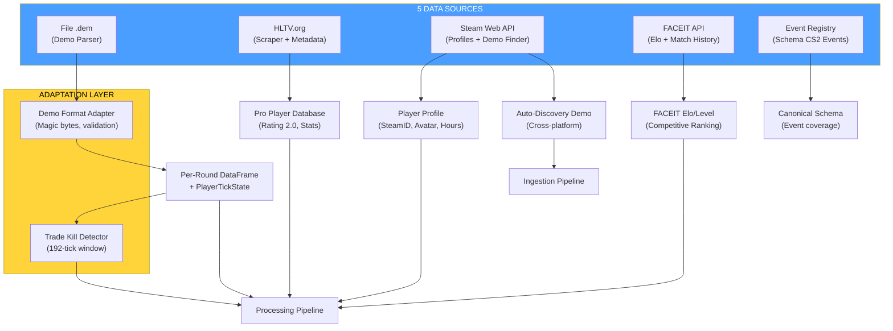

### -Demo Parser (`demo_parser.py`)

Robust wrapper around the `demoparser2` library for extracting statistics from CS2 demo files.

**HLTV 2.0 Baseline** — normalization constants for rating computation:

| Constant | Value | Meaning |
|---|---|---|
| `RATING_BASELINE_KPR` | 0.679 | Pro average: kills per round |
| `RATING_BASELINE_SURVIVAL` | 0.317 | Pro average: survival rate |
| `RATING_BASELINE_KAST` | 0.70 | Pro average: Kill/Assist/Survive/Trade % |
| `RATING_BASELINE_ADR` | 73.3 | Pro average: average damage per round |
| `RATING_BASELINE_ECON` | 85.0 | Pro average: economic efficiency |

**`parse_demo(demo_path, target_player=None)`:** Main entry point. Validation of file existence, parsing of `round_end` events to count rounds, then complete statistical extraction via `_extract_stats_with_full_fields()`. Returns empty `pd.DataFrame` on any error (fail-safe).

**`_extract_stats_with_full_fields(parser, total_rounds, target_player)`:** Computes all 25 mandatory aggregate features for the database:
- Base statistics: `avg_kills`, `avg_deaths`, `avg_adr`, `kd_ratio`
- Variance: `kill_std`, `adr_std` (via `_compute_per_round_variance`)
- Advanced statistics: `avg_hs`, `accuracy`, `impact_rounds`, `econ_rating`
- Approximate HLTV 2.0 rating (hand-tuned approximation, not the official formula)

### -Demo Format Adapter (`demo_format_adapter.py`)

Resilience layer for handling different versions of the CS2 demo format.

**Validation constants:**

| Constant | Value | Description |
|---|---|---|
| `DEMO_MAGIC_V2` | `b"PBDEMS2\x00"` | CS2 magic bytes (Source 2 Protobuf) |
| `DEMO_MAGIC_LEGACY` | `b"HL2DEMO\x00"` | CS:GO legacy magic bytes (not supported) |
| `MIN_DEMO_SIZE` | 10 × 1024² (10 MB) | DS-12: real CS2 demos are 50+ MB, smaller files are certainly corrupted or incomplete |
| `MAX_DEMO_SIZE` | 5 × 1024³ (5 GB) | Safety cap |

**Dataclasses:**
- `FormatVersion(name, magic, description, supported)` — specifies a known version of the format
- `ProtoChange(date, description, affected_events, migration_notes)` — record of a known protobuf change

**`FORMAT_VERSIONS`:** Dictionary with two known formats (`cs2_protobuf` supported, `csgo_legacy` not supported).

**`PROTO_CHANGELOG`:** Chronological list of known CS2 protobuf format changes (for resilience against future updates).

**`DemoFormatAdapter.validate_demo(path)`:** 3-phase validation: (1) existence and size within bounds, (2) reading magic bytes for format identification, (3) verification of support for the detected format.

### -Event Registry (`event_registry.py`)

Canonical registry of **all CS2 game events** derived from SteamDatabase dumps.

**`GameEventSpec`** dataclass with 7 fields: `name`, `category` (round/combat/utility/economy/movement/meta), `fields` (dict field→type), `priority` (critical/standard/optional), `implemented` (bool), `handler_path` (optional), `notes`.

**Registered event categories:**

| Category | Events | Critical Priority | Implemented |
|---|---|---|---|
| **Round** | `round_end`, `round_start`, `round_freeze_end`, `round_mvp`, `begin_new_match` | `round_end` | 1/5 |
| **Combat** | `player_death`, `player_hurt`, `player_blind`, etc. | `player_death` | partial |
| **Utility** | `flashbang_detonate`, `hegrenade_detonate`, `smokegrenade_expired`, etc. | — | partial |
| **Economy** | `item_purchase`, `bomb_planted`, `bomb_defused`, etc. | `bomb_planted/defused` | partial |
| **Movement** | `player_footstep`, `player_jump`, etc. | — | no |
| **Meta** | `player_connect`, `player_disconnect`, etc. | — | no |

**Utility functions:** `get_implemented_events()` → list of implemented events. `get_coverage_report()` → coverage report by category.

> **Note (F6-33):** The `handler_path` fields are not validated at runtime — if the handler modules are moved, references become silently stale. Add `hasattr/callable` validation at event dispatch if reliability is critical.

### -Trade Kill Detector (`trade_kill_detector.py`)

Identifies **trade kills** — retaliation kills within a temporal window — from the death sequences in the demo.

**Constant:** `TRADE_WINDOW_TICKS = 192` (3 seconds at 64 ticks/sec, the standard CS2 tickrate).

**`TradeKillResult`** dataclass:
- `total_kills`, `trade_kills`, `players_traded`, `trade_details`
- Computed properties: `trade_kill_ratio`, `was_traded_ratio`

**Algorithm (derived from cstat-main):** For each kill K at tick T: look back in time for kills made by the victim. If the victim killed a teammate of K's killer within `TRADE_WINDOW_TICKS`, mark K as a trade kill and the original victim as "was traded". **Same-round constraint:** Kills candidate for the trade must belong to the **same round** (identical `round_num`). Cross-round trades are not counted — this is an important tactical distinction because a trade has strategic meaning only within the same round, where it directly influences the numerical economy of the engagement.

**`build_team_roster(parser)`:** Builds `player_name → team_num` mapping from the initial match ticks (uses the 10th percentile of ticks for assignment stability).

**`get_round_boundaries(parser)`:** Extracts the tick boundaries between rounds from the `round_end` event.

### -Steam API (`steam_api.py`)

Client for the Steam Web API with retry and exponential backoff.

**Constants:** `MAX_RETRIES = 3`, `BACKOFF_DELAYS = [1, 2, 4]` seconds.

**`_request_with_retry(url, params, timeout=5)`:** HTTP GET wrapper with 3 attempts for connection/timeout errors. Does not retry on HTTP 4xx/5xx errors (propagates them to the caller).

**Main functions:**
- `resolve_vanity_url(vanity_url, api_key)` → resolves a custom Steam URL to a 64-bit SteamID
- `fetch_steam_profile(steam_id, api_key)` → retrieves player profile (name, avatar, playtime hours). Auto-resolves vanity URL if the input is not numeric

### -Steam Demo Finder (`steam_demo_finder.py`)

Auto-discovery of CS2 demos from the local Steam installation.

**`SteamDemoFinder`** class with 3-level detection strategy:

| Priority | Method | Platform |
|---|---|---|
| 1 | Windows Registry (`winreg`) | Windows |
| 2 | Common paths (dynamically generated for each drive) | Windows/Linux/macOS |
| 3 | Environment variables | All |

**Dynamic drive detection (Windows):** Uses `windll.kernel32.GetLogicalDrives()` to enumerate all available drives, then searches for `Program Files (x86)/Steam`, `Program Files/Steam`, `Steam` on each drive.

**`SteamNotFoundError`:** Specific exception when the Steam installation cannot be located.

> **Note (F6-11):** Steam path discovery is duplicated in `ingestion/steam_locator.py` (primary). This module is supplementary (scans replay directories). Consolidation deferred; ensure same path precedence when modifying resolution.

### -HLTV Module (`backend/data_sources/hltv/`)

The HLTV subsystem is composed of 5 specialized modules that collaborate to extract professional statistics from HLTV.org, bypassing Cloudflare anti-scraping protections:

**`HLTVStatFetcher`** (`stat_fetcher.py`) — Main scraping orchestrator:

| Method | Description |
|---|---|
| `fetch_top_players()` | Scrape Top 50 players page → list of profile URLs |
| `fetch_and_save_player(url)` | Full player statistics fetch + DB save |
| `_fetch_player_stats(url)` | Deep-crawl: main page + sub-pages (clutch, multikill, career) |
| `_parse_overview(soup)` | Parse main statistics (rating, KPR, ADR, etc.) |
| `_parse_trait_sections(soup)` | Parse Firepower, Entrying, Utility sections |
| `_parse_clutches(soup)` | Parse 1v1/1v2/1v3 clutch wins |
| `_parse_multikills(soup)` | Parse 3K/4K/5K counts |
| `_parse_career(soup)` | Parse historical rating by year |

**Statistics extracted and saved in `ProPlayerStatCard`:**

| Category | Statistics |
|---|---|
| **Core** | `rating_2_0`, `kpr` (Kill/Round), `dpr` (Death/Round), `adr` (Damage/Round) |
| **Efficiency** | `kast` (Kill/Assist/Survival/Trade %), `headshot_pct`, `impact` |
| **Opening** | `opening_kill_ratio`, `opening_duel_win_pct` |
| **Traits (JSON)** | Firepower (kpr_win, adr_win), Entrying (traded_deaths_pct), Utility (flash_assists) |
| **Insights (JSON)** | Clutch (1on1/1on2/1on3), Multikill (3k/4k/5k), Career (rating per period) |

**`RateLimiter`** (`rate_limit.py`) — 4-level rate limiting with anti-detection jitter:

| Level | Min–Max Delay | Use case |
|---|---|---|
| **micro** | 2.0s – 3.5s | Fast consecutive requests |
| **standard** | 4.0s – 8.0s | Navigation between player profiles |
| **heavy** | 10.0s – 20.0s | Transitions between sections (main → clutch → multikill → career) |
| **backoff** | 45.0s – 90.0s | Suspected block or failure (graceful degradation) |

> **Note (F6-25):** The jitter (`random.uniform(-0.5, 0.5)`) is **intentionally unseeded** — deterministic jitter would be detected by anti-scraping systems as an artificial pattern. The 2.0s minimum floor is always applied.

**`DockerManager`** (`docker_manager.py`) — FlareSolverr container management with cascading startup strategy:
1. **Fast path:** Returns `True` if already healthy (health check on `http://localhost:8191/`)
2. **Docker start:** Attempts `docker start flaresolverr` (15s timeout)
3. **Docker Compose fallback:** Attempts `docker-compose up -d` (60s timeout)
4. **Health polling:** Verifies availability every 3s for max 45s

**`FlareSolverrClient`** (`flaresolverr_client.py`) — Automatic bypass of Cloudflare JavaScript challenges. All HTTP requests are routed through FlareSolverr on `http://localhost:8191/`. The resolved HTML is passed to BeautifulSoup for parsing.

**`selectors`** (`selectors.py`) — CSS selectors for scraping HLTV pages, centralized for maintainability.

```mermaid
flowchart LR
    subgraph FETCH["HLTV Pipeline"]
        URL["Player URL<br/>hltv.org/stats/..."]
        URL --> FLARE["FlareSolverr<br/>(Docker container)<br/>Cloudflare bypass"]
        FLARE --> HTML["Resolved HTML"]
        HTML --> BS["BeautifulSoup<br/>(CSS selectors)"]
        BS --> STATS["Extracted Statistics<br/>rating, kpr, adr, kast..."]
    end
    subgraph RATE["Rate Limiter"]
        MICRO["micro: 2-3.5s"]
        STD["standard: 4-8s"]
        HEAVY["heavy: 10-20s"]
        BACK["backoff: 45-90s"]
    end
    subgraph SAVE["Persistence"]
        STATS --> DB["ProPlayer + ProPlayerStatCard<br/>(hltv_metadata.db)"]
    end
    RATE -.->|"controls pace"| FETCH

    style FLARE fill:#ffd43b,color:#000
    style DB fill:#4a9eff,color:#fff
```

> **Architectural note:** The complete HLTV subsystem (with `HLTVApiService`, `CircuitBreaker`, `BrowserManager`, `CacheProxy`, `collectors`) resides in `ingestion/hltv/` and is documented in Part 3. The files in `data_sources/hltv/` are the low-level implementation of scraping and rate limiting.

> **HLTV database status (April 2026):** The `hltv_metadata.db` database contains **161 real professional players**, **32 teams**, and **156 stat cards** collected from live scraping of hltv.org via FlareSolverr. The CSS selectors in `selectors.py` are equipped with fallback chains to resist site layout changes. The `HybridCoachingEngine` uses these data for automatic reference pro selection: when generating an analysis, it automatically finds the pro player whose `rating_2_0` is closest to the user's and names them in the feedback ("your ADR is lower than [pro name]'s"), via `_find_best_match_pro()` in `coaching_service.py` and `_get_pro_name()` in `hybrid_engine.py`.

**`hltv_scraper.py` / `hltv_metadata.py`** (entry point in `data_sources/`):
- `run_hltv_sync_cycle(limit=20)` — Sync cycle orchestrator that imports `HLTVApiService` from the full pipeline
- `hltv_metadata.py` — Debug script for page saving via Playwright (CSS selector validation)

### -FACEIT API and Integration (`faceit_api.py`, `faceit_integration.py`)

**`faceit_api.py`:** Single function `fetch_faceit_data(nickname)` that retrieves FACEIT Elo and Level for a given nickname. Requires `FACEIT_API_KEY` from configuration. Returns `{faceit_id, faceit_elo, faceit_level}` or empty dictionary on error.

**`faceit_integration.py`:** Complete FACEIT client with rate limiting:

| Parameter | Value | Description |
|---|---|---|
| `BASE_URL` | `https://open.faceit.com/data/v4` | FACEIT v4 API endpoint |
| `RATE_LIMIT_DELAY` | 6 seconds | 10 req/min = 1 req every 6s (free tier) |

**`FACEITIntegration`** class with:
- `_rate_limited_request(endpoint, params)` — requests with automatic rate limiting and exponential backoff on 429
- Match history management and demo download
- Dedicated exception `FACEITAPIError`

### -FrameBuffer — Circular Buffer for HUD Extraction (`backend/processing/cv_framebuffer.py`)

The **FrameBuffer** is a thread-safe circular buffer for capturing and analyzing game screen frames. It functions as the "retina" of the system: it captures frames from the screen, stores them in a fixed-size ring, and allows the extraction of HUD (Head-Up Display) regions for visual analysis.

**Configuration:**

| Parameter | Default | Description |
|---|---|---|
| `resolution` | `(1920, 1080)` | Target frame resolution |
| `buffer_size` | `30` | Circular buffer capacity (frames) |

**Main operations:**
- `capture_frame(source)` — Ingests frame from file or numpy array → BGR→RGB, uint8, resize → push to circular buffer
- `get_latest(count=1)` — Retrieves the N most recent frames (newest to oldest)
- `extract_hud_elements(frame)` — Extracts all HUD regions into a dictionary

**HUD Regions (1920×1080 reference):**

| Region | Coordinates | Position | Content |
|---|---|---|---|
| **Minimap** | `(0, 0, 320, 320)` | Top-left | CS2 radar (player positions) |
| **Kill Feed** | `(1520, 0, 1920, 300)` | Top-right | Kill feed and events |
| **Scoreboard** | `(760, 0, 1160, 60)` | Top-center | Team score |

**Resolution adaptation** (`_scale_region()`): Coordinates are defined for the 1920×1080 reference resolution. For different resolutions, they are scaled proportionally: `sx = frame_width / 1920`, `sy = frame_height / 1080`. This makes the system **resolution-agnostic** — it works identically on 1080p, 1440p, or 4K monitors.

**Thread-safety:** A `threading.Lock()` protects all read and write operations on the buffer. The write index (`_write_index`) advances circularly modulo `buffer_size`, guaranteeing O(1) for insertion and retrieval.

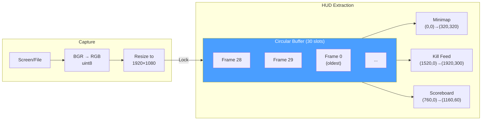

### -TensorFactory — Tensor Factory (`backend/processing/tensor_factory.py`)

The **TensorFactory** is the **perceptual system** of the RAP Coach: it converts raw game state into 3 image-tensors that the neural model can "see". Each tensor is a 3-channel image encoding a different dimension of the tactical situation: **map** (where everyone is), **view** (what the player can see), and **motion** (how they are moving).

**Configurations:**

| Parameter | `TensorConfig` (Inference) | `TrainingTensorConfig` (Training) |
|---|---|---|
| `map_resolution` | 128 × 128 | 64 × 64 |
| `view_resolution` | 224 × 224 | 64 × 64 |
| `sigma` (Gaussian blur) | 3.0 | 3.0 |
| `fov_degrees` | 90° | 90° |
| `view_distance` | 2000.0 world units | 2000.0 world units |

> **Note (F2-02):** `TrainingTensorConfig` reduces resolution from 128/224 to 64/64, achieving a **memory saving of ~12×**. The `AdaptiveAvgPool2d` contract in RAPPerception produces 128-dim regardless of input resolution, but this guarantee is implicit — a runtime assertion is recommended.

**Rasterization constants:**

| Constant | Value | Purpose |
|---|---|---|
| `OWN_POSITION_INTENSITY` | 1.5 | Brightness of own position marker |
| `ENTITY_TEAMMATE_DIMMING` | 0.7 | Teammates rendered darker than enemies |
| `ENTITY_MIN_INTENSITY` | 0.2 | Minimum intensity of visible entity |
| `ENEMY_MIN_INTENSITY` | 0.3 | Minimum intensity of visible enemy |
| `BOMB_MARKER_RADIUS` | 50.0 | Bomb circle radius (world units) |
| `BOMB_MARKER_INTENSITY` | 0.8 | Bomb circle opacity |
| `TRAJECTORY_WINDOW` | 32 ticks | Trajectory window (~0.5s at 64 Hz) |
| `VELOCITY_FALLOFF_RADIUS` | 20.0 | Grid cells for radial velocity fade |
| `MAX_SPEED_UNITS_PER_TICK` | 4.0 | CS2 maximum speed (64 ticks/s) |
| `MAX_YAW_DELTA_DEG` | 45.0 | Flick threshold for aim detection |

**The 3 Rasterizers:**

**1. Map Rasterizer** — `generate_map_tensor(ticks, map_name, knowledge)` → `Tensor(3, res, res)`

| Channel | Player-POV Mode (with PlayerKnowledge) | Legacy Mode (no knowledge) |
|---|---|---|
| **Ch0** | Teammates (always known) + own position (intensity 1.5) | Enemy positions |
| **Ch1** | Visible enemies (full intensity) + last-known enemies (exponential decay) | Teammate positions |
| **Ch2** | Utility zones (smoke/molotov) + bomb overlay | Player position |

**2. View Rasterizer** — `generate_view_tensor(ticks, map_name, knowledge)` → `Tensor(3, res, res)`

| Channel | Player-POV Mode | Legacy Mode |
|---|---|---|
| **Ch0** | FOV mask (geometric 90° cone from gaze direction) | FOV mask |
| **Ch1** | Visible entities: teammates (dimmed ×0.7) + visible enemies (intensity weighted by distance) | Danger zone (areas NOT covered by accumulated FOV, capped at 8 ticks) |
| **Ch2** | Active utility zones (smoke/molotov circles in world units) | Safe zone (recently visible but not in current FOV) |

**3. Motion Encoder** — `generate_motion_tensor(ticks, map_name)` → `Tensor(3, res, res)`

| Channel | Content |
|---|---|
| **Ch0** | Trajectory of last 32 ticks — intensity ∝ recency (newest = 1.0, oldest → 0) |
| **Ch1** | Velocity field — radial gradient from player, modulated by current speed [0, 1] |
| **Ch2** | Crosshair movement — yaw delta magnitude as Gaussian blob at player position |

> **Note (F2-03):** 128 tick/s demos compress velocity in the lower half of the [0, 1] range; tick-rate aware normalization pending implementation.

**NO-WALLHACK integration:** When `PlayerKnowledge` is provided, the map and view rasterizers encode **only the state visible to the player**. Last-seen enemy positions decay exponentially over time. Utility zones are visible only if in FOV or known from radar. When `knowledge=None`, the system degrades to legacy mode for backward compatibility.

**Helper methods:**
- `_world_to_grid(x, y, meta, resolution)` — World → grid coordinate conversion. **Note C-03:** Single Y-flip (`meta.pos_y - y`) to avoid double inversion
- `_normalize(arr)` — Normalization to [0, 1]. **Note M-10:** `arr / max(max_val, 1.0)` to prevent noise amplification in sparse channels
- `_generate_fov_mask(player_x, player_y, yaw, meta, resolution)` — 90° conical mask from gaze direction, distance-limited (top-down 2D approximation)

**Singleton access:** `get_tensor_factory()` — double-checked locking, thread-safe.

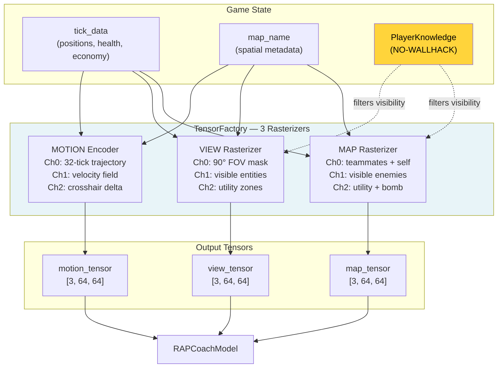

### -FAISS Vector Index (`backend/knowledge/vector_index.py`)

The **VectorIndexManager** provides high-speed semantic search for the coach's RAG (Retrieval-Augmented Generation) knowledge system. It uses FAISS (Facebook AI Similarity Search) with `IndexFlatIP` on L2-normalized vectors, effectively achieving **cosine similarity search** in sub-linear time.

**Dual indexes:**

| Index | DB Source | Content |
|---|---|---|
| `"knowledge"` | `TacticalKnowledge` table | Tactical knowledge embedding (strategies, positions, utility) |
| `"experience"` | `CoachingExperience` table | Coaching experience embedding (feedback, corrections, advice) |

**Index type:** `faiss.IndexFlatIP` (Inner Product) on L2-normalized vectors. Since `cos(a, b) = a·b / (||a|| × ||b||)`, normalizing vectors to unit norm makes the inner product **exactly equivalent** to cosine similarity. Result range: [0, 1] where 1 = identical.

**Public API:**

| Method | Description |
|---|---|
| `search(index_name, query_vec, k)` | Search the k most similar vectors. Lazy rebuild if dirty. Returns `List[(db_id, similarity)]` |
| `rebuild_from_db(index_name)` | Complete index rebuild from DB table. Thread-safe. Returns vector count |
| `mark_dirty(index_name)` | Marks the index for lazy rebuild (at next `search()`) |
| `index_size(index_name)` | Returns `index.ntotal` or 0 if not built |

**Disk persistence:**
- Format: `{persist_dir}/{index_name}.faiss` + `{index_name}_ids.npy`
- Save: `faiss.write_index()` + `np.save()`
- Load: automatic in `__init__` via `faiss.read_index()` + `np.load()`
- Default directory: `~/.cs2analyzer/indexes/`

**Thread-safety:** A single `threading.Lock()` protects all read/write operations on the indexes, dirty flags, and rebuild operations. FAISS `IndexFlatIP` is thread-safe for concurrent reads.

**Lazy rebuild (`mark_dirty()`):** When new data is inserted into the Knowledge or Experience tables, the index is marked as "dirty" rather than rebuilt immediately. The rebuild happens only at the next `search()`, avoiding multiple rebuilds during batch insertions.

**Vector normalization:**
```
norms = ||embedding||₂ per row
normalized = embedding / max(norms, 1e-8)    # numerical stability
IndexFlatIP.add(normalized)
```

**Graceful fallback:** If `faiss-cpu` is not installed, the singleton `get_vector_index_manager()` returns `None` and the system automatically degrades to brute-force search (slower but functionally equivalent). This allows the program to work even on systems where FAISS is not available.

**Over-fetching with explicit constants:** To handle post-filtering scenarios (category, map_name, confidence, outcome), the search retrieves more results than necessary: `k × OVERFETCH_KNOWLEDGE = k × 10` for the Knowledge Base (filter by category + map), `k × OVERFETCH_EXPERIENCE = k × 20` for the Experience Bank (filter by map + confidence + outcome + composite scoring). The 20× multiplier for experiences is double that of knowledge because the filters are more restrictive (4 criteria vs 2), so a wider initial pool is needed to guarantee enough results after filtering.

### -Round Context (`round_context.py`)

The **Round Context** module is the **temporal grid** of the ingestion system: it converts raw ticks from demo files into meaningful "round N, time T seconds" coordinates that every other module can use to contextualize game events.

**Public functions:**

| Function | Input | Output | Complexity |
|---|---|---|---|
| `extract_round_context(demo_path)` | `.dem` file path | DataFrame: `round_number`, `round_start_tick`, `round_end_tick` | O(n) event parsing |
| `extract_bomb_events(demo_path)` | `.dem` file path | DataFrame: `tick`, `event_type` (planted/defused/exploded) | O(n) event parsing |
| `assign_round_to_ticks(df_ticks, round_context, tick_rate)` | Tick DataFrame + round boundaries | DataFrame enriched with `round_number`, `time_in_round` | O(n log m) via `merge_asof` |

**Round boundary construction (`extract_round_context`):**

The module analyzes two types of events from the demo file:
- **`round_freeze_end`** — the tick at which freeze time ends and the action starts (players can move)
- **`round_end`** — the tick at which the round ends (win/loss)

For each round, it pairs the last `round_freeze_end` preceding the corresponding `round_end`. **Fallback:** if no `round_freeze_end` event is found for a given round (possible in corrupted demos or interrupted matches), it uses the previous round's `round_end` as start, logging a warning.

**Bomb event extraction (`extract_bomb_events`):**

Extracts three types of events: `bomb_planted`, `bomb_defused`, and `bomb_exploded`. The addition of `bomb_exploded` (H-07 remediation) makes it possible to distinguish between rounds won by explosion and rounds won by elimination, information critical for post-plant tactical analysis.

**Round assignment to ticks (`assign_round_to_ticks`):**

Uses `pd.merge_asof` with `direction="backward"` for efficient O(n log m) assignment: for each tick, find the last `round_start_tick ≤ tick`. Computes `time_in_round = (tick − round_start_tick) / tick_rate`, clamped to [0.0, 175.0] seconds (maximum duration of a CS2 round). Ticks before the first round (warmup) are assigned to round 1.

> **Note:** Using `merge_asof` instead of a Python loop transforms an O(n × m) operation into O(n log m), fundamental for demos with millions of ticks and 30+ rounds.

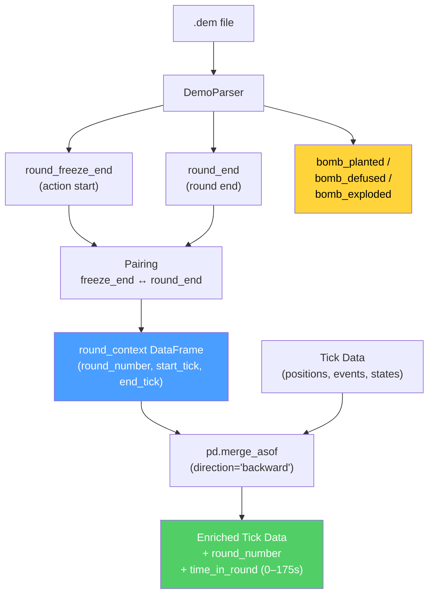

**Error handling:** Each parsing phase is protected by try/except with structured logging. If parsing fails completely or no `round_end` events are found, the function returns an empty DataFrame — downstream modules (e.g., `RoundStatsBuilder`) must handle this case gracefully.

---

---

## Summary of Part 1B — The Senses and the Specialist

Part 1B has documented the **two perceptual and diagnostic pillars** of the coaching system:

| Subsystem | Role | Key Components |
|---|---|---|
| **2. RAP Coach** | The **specialist doctor** — 7-component architecture for complete coaching under POMDP conditions | Perception (3-stream ResNet, 24 conv), Memory (LTC **512** NCP units + Hopfield 4 heads + NN-MEM-01 activation delay + **RAPMemoryLite** LSTM fallback), Strategy (4 MoE experts + SuperpositionLayer), Pedagogy (Value Critic + Skill Adapter), Causal Attribution (5 categories, learned utility signal), Positioning (Linear 256→3), Communication (template), ChronovisorScanner (3 temporal scales + 50K tick safety limit + cross-scale deduplication + structured ScanResult), GhostEngine (4-tensor pipeline with POV mode R4-04-01, hidden_state NN-40, 5-level fallback) |
| **1B. Data Sources** | The **senses** — acquire and structure data from the outside world | Demo Parser (demoparser2 + HLTV 2.0 rating), Demo Format Adapter (PBDEMS2 magic bytes), Event Registry (complete CS2 schema), Trade Kill Detector (192-tick window), Steam API (retry + backoff), Steam Demo Finder (cross-platform), HLTV (FlareSolverr + 4-level rate limiting + CSS selectors with fallback chain — **161 real pro players, 32 teams, 156 stat cards** in hltv_metadata.db), FACEIT API, FrameBuffer (30-frame ring buffer), TensorFactory (3 NO-WALLHACK rasterizers), FAISS (IndexFlatIP 384-dim), Round Context (merge_asof O(n log m)) |

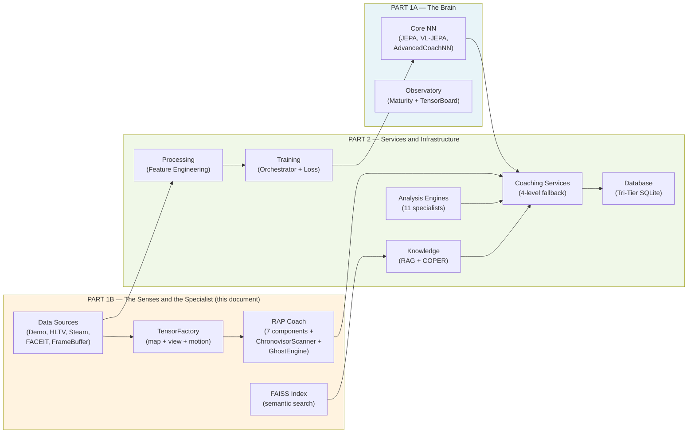

> **Continues in Part 2** — *Coaching Services, Coaching Engines, Knowledge and Retrieval, Analysis Engines (11), Processing and Feature Engineering, Control Module, Progress and Trends, Database and Storage (Tri-Tier), Training and Orchestration Pipeline, Loss Functions*
</content>
</invoke>
