# Ultimate CS2 Coach — Parte 1B: Os Sentidos e o Especialista

> **Topicos:** Modelo RAP Coach (arquitetura de 7 componentes: Percepcao, Memoria LTC+Hopfield, Estrategia, Pedagogia, Atribuicao Causal, Posicionamento, Comunicacao), ChronovisorScanner (deteccao multi-escala de momentos criticos), GhostEngine (pipeline de inferencia 4-tensores), e todas as fontes de dados externas (Demo Parser, HLTV, Steam, FACEIT, TensorFactory, FrameBuffer, FAISS, Round Context).
>
> **Autor:** Renan Augusto Macena

---

> Este documento e a continuacao da **Parte 1A** — *O Cerebro: Arquitetura Neural e Treinamento*, que documenta os modelos de rede neural (JEPA, VL-JEPA, AdvancedCoachNN), o sistema de treinamento de 3 niveis de maturidade, o Observatorio de Introspeccao do Coach, e os fundamentos arquiteturais do sistema (principio NO-WALLHACK, contrato 25-dim).

## Indice

**Parte 1B — Os Sentidos e o Especialista (este documento)**

4. [Subsistema 2 — Modelo RAP Coach (`backend/nn/experimental/rap_coach/`)](#4-subsistema-2--modelo-rap-coach)
   - RAPCoachModel (Entradas Visuais Duais: por-timestep e estaticas)
   - Camada de Percepcao (ResNet de 3 fluxos)
   - Camada de Memoria (LTC + Hopfield)
   - Camada de Estrategia (SuperpositionLayer + MoE)
   - Camada Pedagogica (Value Critic + Atribuicao Causal)
   - Modelo Latente de Habilidades
   - RAP Trainer (Funcao de Perda Composta)
   - ChronovisorScanner (Deteccao Multi-Escala de Momentos Criticos)
   - GhostEngine (Pipeline de Inferencia 4-Tensores com PlayerKnowledge)
5. [Subsistema 1B — Fontes de Dados (`backend/data_sources/`)](#5-subsistema-1b--fontes-de-dados)
   - Demo Parser + Demo Format Adapter
   - Event Registry (Schema de Eventos CS2)
   - Trade Kill Detector
   - Steam API + Steam Demo Finder
   - Modulo HLTV (stat_fetcher, FlareSolverr, Docker, Rate Limiter)
   - FACEIT API + Integration
   - FrameBuffer (Buffer Circular para Extracao de HUD)
   - TensorFactory — Fabrica de Tensores (Percepcao Player-POV NO-WALLHACK)
   - Indice Vetorial FAISS (Busca Semantica de Alta Velocidade)
   - Contexto dos Rounds (Grade Temporal)

**Parte 1A** — O Cerebro: Nucleo da Rede Neural (JEPA, VL-JEPA, AdvancedCoachNN, SuperpositionLayer, EMA, CoachTrainingManager, TrainingOrchestrator, ModelFactory, NeuralRoleHead, MaturityObservatory)

**Parte 2** — Secoes 5-13: Servicos de Coaching, Coaching Engines, Conhecimento e Recuperacao, Motores de Analise (11), Processamento e Feature Engineering, Modulo de Controle, Progresso e Tendencias, Banco de Dados e Storage (Tri-Tier), Pipeline de Treinamento e Orquestracao, Funcoes de Perda

**Parte 3** — Logica do Programa, UI, Ingestao, Tools, Tests, Build, Remediation

---

## 4. Subsistema 2 — Modelo RAP Coach

**Diretorio canonico:** `backend/nn/experimental/rap_coach/` (o caminho antigo `backend/nn/rap_coach/` e um shim de redirecionamento)
  **Arquivos:** `model.py`, `perception.py`, `memory.py`, `strategy.py`, `pedagogy.py`, `communication.py`, `skill_model.py`, `trainer.py`, `chronovisor_scanner.py`

  O RAP (Reasoning, Adaptation, Pedagogy) Coach e uma **arquitetura profunda com 6 componentes neurais aprendiveis + 1 camada de comunicacao externa**, especificamente projetada para coaching CS2 em condicoes de observabilidade parcial (condicoes POMDP). A classe `RAPCoachModel` contem Percepcao (`RAPPerception`), Memoria (`RAPMemory` com LTC+Hopfield), Estrategia (`RAPStrategy`), Pedagogia (`RAPPedagogy` com Value Critic e Skill Adapter), Atribuicao Causal (`CausalAttributor`) e uma Cabeca de Posicionamento (`nn.Linear(256->3)`), todos aprendiveis. A camada de Comunicacao (`communication.py`) opera externamente como seletor de templates de pos-processamento. O forward pass produz 6 saidas: `advice_probs`, `belief_state`, `value_estimate`, `gate_weights`, `optimal_pos` e `attribution`.


  > **Analogia:** O treinador RAP e o **cerebro mais avancado** do sistema: imagine-o como um edificio de 7 andares onde cada andar tem uma tarefa especifica. O andar 1 (Percepcao) e constituido pelos **olhos**: observa as imagens do mapa, a visao do jogador e os padroes de movimento. O andar 2 (Memoria) e o **hipocampo**: lembra o que aconteceu antes no round e conecta-o a rounds similares anteriores via rede LTC + Hopfield. O andar 3 (Estrategia) e a **sala de decisao**: decide quais conselhos dar atraves de 4 especialistas MoE. O andar 4 (Pedagogia) e o **escritorio do professor**: estima o valor da situacao com o Value Critic. O andar 5 (Atribuicao Causal) e o **detetive**: descobre POR QUE algo deu errado, dividindo a culpa em 5 categorias. O andar 6 (Posicionamento) e o **GPS**: calcula onde o jogador deveria ter estado com um `nn.Linear(256->3)` que prediz `(dx, dy, dz)`. O andar 7 (Comunicacao) e o **porta-voz**: traduz tudo em conselhos simples e legiveis, operando como pos-processamento externo. A parte "POMDP" significa que o treinador deve trabalhar com **informacoes incompletas**: nao pode ver o mapa inteiro, assim como um jogador. E como treinar um time de futebol das arquibancadas quando metade do campo esta coberto de neblina.
  >

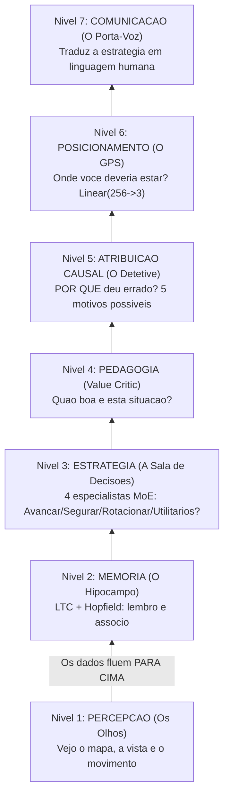

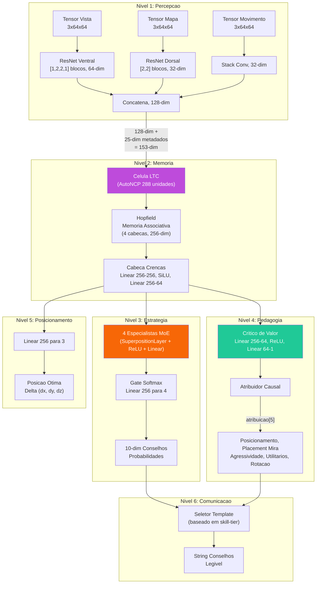

### -Camada de percepcao (`perception.py`)

Um front-end **convolucional de tres fluxos** que processa as entradas visuais:

| Entrada                              | Forma         | Backbone                                                | Dim Saida        |
| ------------------------------------ | ------------- | ------------------------------------------------------- | ---------------- |
| **Tensor de visualizacao**     | `3x64x64` | Fluxo ventral ResNet: [1,2,2,1] blocos, 3->64 canais   | **64-dim** |
| **Tensor de mapa**             | `3x64x64` | Fluxo dorsal ResNet: [2,2] blocos, 3->32 canais        | **32-dim** |
| **Tensor de movimento**        | `3x64x64` | Conv(3->16->32) + MaxPool + AdaptiveAvgPool           | **32-dim** |

Os tres vetores de caracteristicas sao concatenados em um unico **embedding de percepcao de 128 dimensoes** (64 + 32 + 32).

> **Analogia:** A Camada de Percepcao e como os **tres pares diferentes de oculos** do treinador. O primeiro par (tensor de vista / fluxo ventral) mostra **o que o jogador ve** – sua perspectiva em primeira pessoa, processada atraves de uma ResNet leve de 5 blocos (configuracao `[1,2,2,1]`, calibrada para entradas 64x64) que extrai 64 caracteristicas importantes da imagem. O segundo par (tensor de mapa / fluxo dorsal) mostra o **radar/minimapa aereo** – onde todos estao – processado atraves de uma rede mais simples de 3 blocos em 32 caracteristicas. O terceiro par (tensor de movimento) mostra **quem esta se movendo e com que velocidade** – como o borrao de movimento em uma foto – processado em mais 32 caracteristicas. Entao todas as tres vistas sao **coladas juntas** em um unico resumo de 128 numeros: "Aqui esta tudo o que consigo ver neste momento". Este processo inspira-se em como o cerebro humano processa a visao: o fluxo ventral reconhece "o que" as coisas sao, enquanto o fluxo dorsal rastreia "onde" as coisas estao.

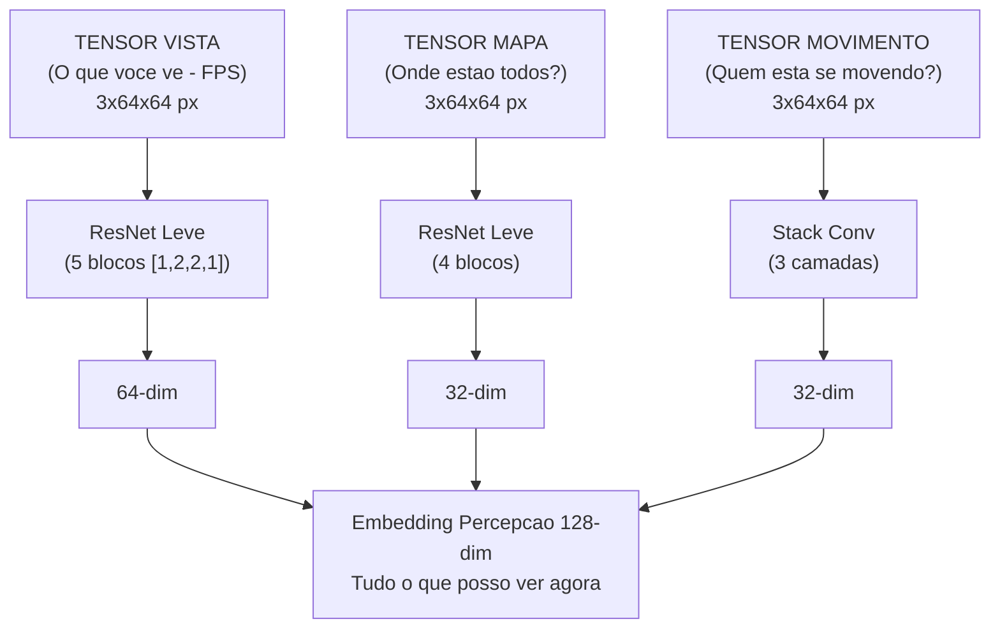

Os blocos ResNet usam **atalhos de identidade** com downsample aprendivel (Conv1x1 + BatchNorm) quando stride != 1 ou o numero de canais muda. **24 camadas de convolucao** em todos os tres fluxos:

| Fluxo                      | Configuracao bloco                   | Blocos  | Conv/Bloco  | Conv atalhos            | Total        |
| -------------------------- | ------------------------------------ | ------- | ----------- | ----------------------- | ------------ |
| **Vista (Ventral)**  | `[1,2,2,1]` -> 1 + 5 = 6 blocos  | 6       | 2           | 1 (primeiro bloco)      | **13** |
| **Mapa (Dorsal)**    | `[2,2]` -> 1 + 3 = 4 blocos       | 4       | 2           | 1 (primeiro bloco)      | **9**  |
| **Movimento**        | Stack de conversao (2 camadas)       | —      | —          | —                      | **2**  |
| **Total**            |                                      |         |             |                         | **24** |

> **Como funciona** `_make_resnet_stack`: Cria 1 bloco inicial com `stride=2` (para downsampling espacial), depois `sum(num_blocks) - 1` blocos adicionais com `stride=1`. Cada `ResNetBlock` tem 2 camadas Conv2d (kernel 3x3). O primeiro bloco tambem recebe um atalho Conv1x1 porque os canais de entrada (3) sao diferentes dos canais de saida (64 ou 32).

> **Nota sobre escolha arquitetonica (F3-29):** A configuracao original `[3,4,6,3]` (15 blocos, 33 conv no fluxo ventral) foi projetada para entradas 224x224 (o tamanho padrao do ImageNet). Para entradas 64x64 como as usadas neste projeto, as feature maps colapsariam espacialmente apos o primeiro bloco stride-2, tornando os blocos subsequentes redundantes. A configuracao `[1,2,2,1]` (5 blocos efetivos) e calibrada especificamente para a resolucao de treinamento 64x64, com `AdaptiveAvgPool2d` lidando com qualquer resolucao espacial residual. Checkpoints anteriores sao automaticamente detectados como `_stale_checkpoint` por `load_nn()`.

> **Analogia:** Os atalhos de identidade sao como os **elevadores de um edificio**: permitem que as informacoes pulem andares e passem diretamente dos niveis iniciais para os posteriores. Sem eles, as informacoes teriam que subir muitos lances de escada e, ao chegar ao topo, o sinal original estaria tao desbotado que a rede nao poderia aprender. Os atalhos garantem que mesmo em uma rede profunda, os gradientes (os sinais de aprendizado) possam fluir de forma eficiente. Este e o mesmo truque que tornou o deep learning moderno possivel, inventado por Kaiming He em 2015. A escolha de uma rede mais compacta (`[1,2,2,1]` ao inves de `[3,4,6,3]`) e como escolher um edificio de 6 andares ao inves de 16 quando o terreno disponivel (64x64 pixels) e pequeno: menos andares significam menos elevadores necessarios, mas o transporte permanece igualmente eficiente.

### -Camada de memoria (`memory.py`) — LTC + Hopfield

Esta parte enfrenta o desafio fundamental de que o coach CS2 e um **Processo de Decisao de Markov parcialmente observavel** (POMDP).

> **Analogia:** POMDP e uma forma elegante de dizer **"voce nao pode ver tudo".** No CS2, voce nao sabe onde todos os inimigos estao: so ve o que esta a sua frente. E como jogar xadrez com um cobertor sobre metade do tabuleiro. A tarefa da Camada de memoria e **lembrar e adivinhar**: mantem o registro do que aconteceu antes no round e usa essa memoria para preencher os espacos vazios sobre o que nao pode ver. Ela dispoe de duas ferramentas especiais para isso: uma rede LTC (memoria de curto prazo que se adapta a velocidade do jogo) e uma rede Hopfield (busca de padroes de longo prazo que diz "esta situacao me lembra algo que ja vi").

**Rede de constante de tempo liquida (LTC) com cabeamento AutoNCP:**

- Entrada: 153 dim (128 percepcao + 25 metadados)
- Unidades NCP: **512** (`hidden_dim * 2` = 256 x 2) — razao 2:1 que garante inter-neuronios suficientes para o cabeamento esparso AutoNCP
- Saida: estado oculto de 256 dim
- Usa a biblioteca `ncps` com padroes de conectividade esparsos, similares aos do cerebro
- Adapta a resolucao temporal ao ritmo do jogo (configuracoes lentas vs. tiroteios rapidos)
- Seeding deterministico (NN-MEM-02): numpy + torch RNG seedados em 42 durante a criacao do wiring AutoNCP, com restauracao do estado RNG original apos a inicializacao — garante portabilidade dos checkpoints entre diferentes execucoes

> **Analogia:** A rede LTC e como um **cerebro vivo e respirante**: diferentemente das redes neurais normais que processam o tempo em intervalos fixos (como um relogio que tique-taqueia a cada segundo), a LTC adapta sua velocidade ao que acontece. Durante uma preparacao lenta (os jogadores caminham silenciosamente), o processamento ocorre em camera lenta. Durante um tiroteio rapido, acelera, como o batimento cardiaco acelerado quando se esta animado. O "cabeamento AutoNCP" faz com que as conexoes entre os neuronios sejam esparsas e estruturadas como em um cerebro real: nem tudo se conecta a todo o resto. Isto e mais eficiente e biologicamente mais realista.

**Memoria associativa de Hopfield:**

- Entrada/Saida: 256-dim
- Cabecas: 4
- Usa `hflayers.Hopfield` como **memoria enderecavel por conteudo** para a recuperacao dos rounds prototipo

> **Analogia:** A memoria de Hopfield e como um **album de fotos de jogadas famosas**. Durante o treinamento, memoriza os "rounds prototipo" – padroes classicos como "uma retomada perfeita do bombsite B em Inferno" ou "uma corrida fracassada na fumaca em Dust2". Quando chega um novo momento de jogo, a rede de Hopfield pergunta: "Isto me lembra alguma foto no meu album?" Se encontrar uma correspondencia, recupera a lembranca associada, como um detetive de policia que folheia as fichas e diz: "Ja vi este rosto antes!". Ela tem 4 "cabecas" (cabecas de atencao) para que possa buscar 4 tipos diferentes de padroes simultaneamente.

**Atraso de ativacao Hopfield (NN-MEM-01 + RAP-M-04):**

A rede de Hopfield **nao se ativa imediatamente** durante o treinamento. Os padroes memorizados partem de inicializacao aleatoria (`torch.randn * 0.02`) e a atencao seria quase uniforme em todos os slots, adicionando ruido em vez de sinal. Por isso:

- `_training_forward_count` conta os passos forward durante o training
- `_hopfield_trained` (flag booleano) permanece `False` ate >=2 forward passes de treinamento
- Antes da ativacao, o forward pass retorna `torch.zeros_like(ltc_out)` no lugar da saida Hopfield
- Apos >=2 forwards (garantindo que pelo menos um backward + optimizer.step tenha modelado os padroes), Hopfield ativa e contribui para o combined_state
- O carregamento de um checkpoint (`load_state_dict`) define `_hopfield_trained = True` imediatamente, assumindo que o modelo ja foi treinado

> **Analogia:** E como um **novo funcionario que observa durante os primeiros 2 dias** antes de poder tomar decisoes. O album de fotos da Hopfield esta vazio no inicio — as fotos estao borradas e aleatorias. Seria prejudicial consultar um album de fotos ilegiveis para tomar decisoes taticas. Apos 2 passos de treinamento, o funcionario viu exemplos suficientes para ter pelo menos algumas fotos significativas no album, e a partir desse momento comeca a contribuir ativamente.

**RAPMemoryLite — Fallback LSTM puro:**

Modulo substituto leve para `RAPMemory`, usado quando as dependencias `ncps`/`hflayers` nao estao disponiveis ou quando se deseja um modelo mais portavel:

- LSTM padrao PyTorch: `nn.LSTM(153, 256, batch_first=True)`
- Mesmo contrato I/O: Entrada `[B, T, 153]` -> Saida `(combined_state [B, T, 256], belief [B, T, 64], hidden)`
- Mesma cabeca de crencas: `Linear(256->256) -> SiLU -> Linear(256->64)`
- Nenhum seeding RNG necessario (sem AutoNCP)
- Nenhum atraso de treinamento Hopfield (sem padroes memorizados)
- Instanciado via `ModelFactory.TYPE_RAP_LITE` ("rap-lite") com `use_lite_memory=True`

> **Analogia:** RAPMemoryLite e como um **gerador de reserva** que funciona com combustivel mais simples. Nao tem o "cerebro liquido" (LTC) que se adapta ao ritmo do jogo, nem o album de fotos (Hopfield) que lembra as jogadas famosas. Usa em vez disso uma memoria LSTM tradicional — menos sofisticada, mas confiavel e funcionando em qualquer lugar sem componentes especiais. E o plano B para quando o laboratorio experimental nao esta acessivel.

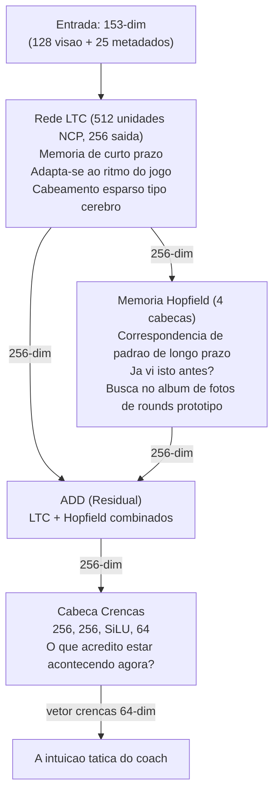

**Combinacao residual:** `combined_state = ltc_out + hopfield_out`

> **Analogia:** A combinacao residual e como **consultar dois consultores e somar suas opinioes**. O LTC diz "com base no que acabou de acontecer, acho X". O Hopfield diz "com base na minha lembranca de situacoes similares, acho Y". Em vez de escolher uma, o sistema soma ambas as opinioes: desta forma, tanto os eventos recentes quanto os padroes historicos contribuem para a compreensao final.

**Cabeca de conviccao:** `Linear(256->256) -> SiLU -> Linear(256->64)` — produz um vetor de conviccao de 64 dimensoes que codifica a compreensao tatica latente do treinador.

**Passo forward:**

```python
ltc_out, hidden = self.ltc(x, hidden) # x: [B, seq, 153] → [B, seq, 256]
mem_out = self.hopfield(ltc_out) # [B, seq, 256]
combined_state = ltc_out + mem_out # Residuo
belief = self.belief_head(combined_state) # [B, seq, 64]
return combined_state, belief, hidden
```

### -Camada Estrategia (`strategy.py`) — Superposicao + MoE

Implementa **SuperpositionLayer** combinado com uma mistura de especialistas contextualizados:

> **Analogia:** A Camada de Estrategia e como uma **sala de guerra com 4 generais especializados**, cada um expert em um tipo diferente de situacao. Um general e bom em avancos agressivos, outro em tomadas defensivas, outro em jogadas de utilitario e ainda outro em rotacoes. Um "guardiao" (o "gate" softmax) escuta a situacao atual e decide o quanto confiar em cada general: "Estamos em um round eco em Dust2? O General 2 (especialista defensivo) recebe 60% do poder, o General 4 (utilitarios) 30% e os outros dividem o resto". A **Camada de Superposicao** e o ingrediente secreto: permite que cada general adapte seu pensamento com base no contexto de jogo atual (mapa, economia, faccao) usando um mecanismo de controle inteligente.

**SuperpositionLayers** (`layers/superposition.py`): controle dependente do contexto onde `output = F.linear(x, weight, bias) * sigmoid(context_gate(context))`. Um vetor de gate sigmoide condicionado no contexto **25-dim** (METADATA_DIM completo) mascara seletivamente as saidas dos especialistas. A perda de esparsidade L1 (`context_gate_l1_weight = 1e-4`) incentiva um gating esparso e interpretavel. Observavel: as estatisticas do gate (media, std, sparsidade, active_ratio) podem ser rastreadas.

> **Nota:** `RAPStrategy.__init__` usa `context_dim=25` (METADATA_DIM). A rede de gate e `Linear(hidden_dim=256, num_experts=4) -> Softmax(dim=-1)`.

> **Analogia:** A camada de superposicao e como um **dimmer para cada neuronio**. Em vez de ter cada neuronio sempre totalmente ligado, um gate dependente do contexto (controlado pelas 25 caracteristicas dos metadados) pode atenuar ou aumentar o brilho de cada um deles. Se o contexto diz "este e um round eco", alguns neuronios sao atenuados (nao sao relevantes para rounds eco), enquanto outros sao aumentados. A perda de esparsidade L1 e como dizer ao sistema: "Tente usar o menor numero possivel de neuronios: quanto mais simples sua explicacao, melhor". Isto torna o modelo mais interpretavel: voce pode realmente ver quais gates sao ativados em quais situacoes.

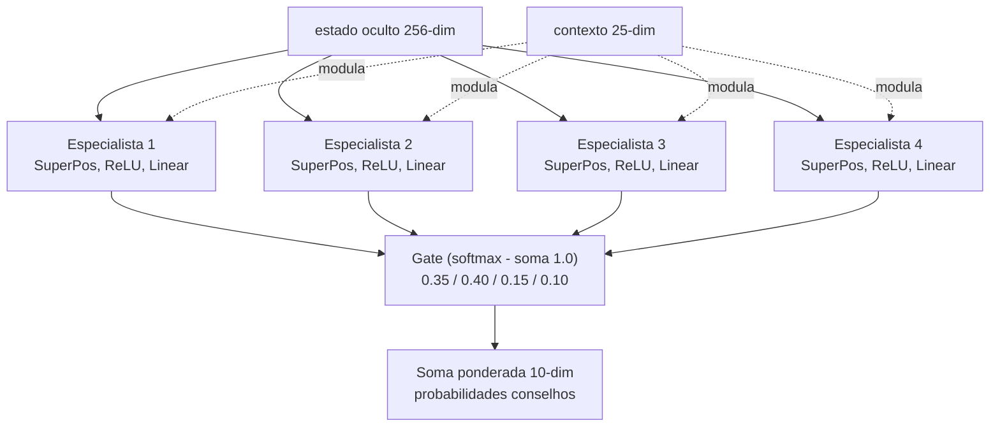

**4 Modulos Especialistas:** Cada especialista e um `ModuleDict`: `SuperpositionLayer(256->128, context_dim=25) -> ReLU -> Linear(128->10)`.

**Gate Network:** `Linear(256->4) -> Softmax`.

**Saida:** Distribuicao de probabilidade de conselhos de 10 dimensoes e vetor de pesos de gate de 4 dimensoes.

### -Camada Pedagogica (`pedagogy.py`) — Valor + Atribuicao

Dois submodulos:

1. **Value Critic:** `Linear(256->64) -> ReLU -> Linear(64->1)`. Estima V(s) para o aprendizado com diferencas temporais. **Skill Adapter:** `Linear(10 skill_buckets -> 256)` permite estimativas de valor condicionadas pelas habilidades.

> **Analogia:** O Value Critic e como um **comentarista esportivo** que, em qualquer momento durante uma partida, pode dizer "Neste momento, este time tem uma vantagem de 72%". Estima V(s) — o "valor" do estado atual da partida. O **Skill Adapter** adapta esta estimativa com base no nivel de habilidade do jogador: um iniciante na mesma posicao de um profissional enfrenta probabilidades muito diferentes, portanto a previsao do valor deve refletir isto.

1. **CausalAttributor:** Produz um vetor de atribuicao de 5 dimensoes que mapeia os conceitos de treinamento:

| Indice | Conceito                            | Sinal mecanico                             |
| ------ | ----------------------------------- | ------------------------------------------ |
| 0      | **Posicionamento**            | norm(position_delta)                       |
| 1      | **Posicionamento da mira**    | norm(view_delta)                           |
| 2      | **Agressao**                  | 0,5 x position_delta                       |
| 3      | **Utilitarios**               | `sigmoid(hidden.mean())` — sinal **aprendido e dependente do contexto**: produz uma ativacao alta quando a rede detecta situacoes onde o uso de utilitarios era relevante, baixa quando o contexto tatico torna os utilitarios secundarios. Nao e um placeholder estatico, mas uma funcao nao-linear do estado oculto que se adapta durante o treinamento |
| 4      | **Rotacao**                   | 0,8 x position_delta                       |

Fusao: `atribuicao = context_weights x mechanical_errors` onde context_weights deriva de `Linear(256->32) -> ReLU -> Linear(32->5) -> Sigmoide`.

> **Analogia:** O atribuidor causal e a forma como o treinador responde a pergunta **"POR QUE deu errado?"** Em vez de simplesmente dizer "voce morreu", divide a culpa em 5 categorias, como um boletim escolar com 5 materias. "Voce morreu porque: 45% posicionamento errado, 30% uso inadequado de utilitarios, 15% posicionamento errado da mira, 5% muito agressivo, 5% rotacao errada." Faz isto combinando dois sinais: (1) o que o estado oculto da rede neural considera importante (context_weights, a intuicao do cerebro) e (2) erros mecanicos mensuraveis (quao longe da posicao otima, quao errado estava o angulo de visao). Multiplicando-os juntos se obtem uma atribuicao de culpa baseada tanto nos dados quanto na intuicao.

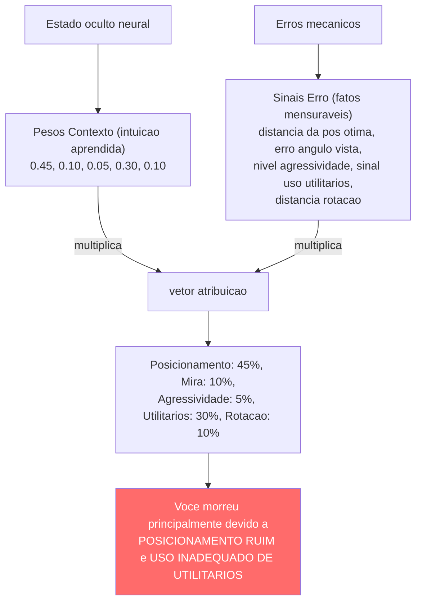

### -Modelo latente das habilidades (`skill_model.py`)

Decompoe as estatisticas brutas em 5 eixos de habilidades usando a normalizacao estatistica em relacao as linhas de base dos profissionais:

| Eixo de habilidades      | Estatisticas de entrada                                                  | Normalizacao                          |
| ------------------------ | ------------------------------------------------------------------------ | ------------------------------------- |
| **Mecanicas**      | Precisao, avg_hs                                                         | Pontuacao Z (mu=pro_mean, sigma=pro_std) |
| **Posicionamento** | Avaliacao_sobrevivencia, avaliacao_kast                                  | Pontuacao Z                           |
| **Utilitarios**    | Utility_blind_time, Utility_inimigos_cegados                             | Pontuacao Z                           |
| **Timing**         | Percentual_vitorias_duelo_abertura, Pontuacao_agressao_posicional        | Pontuacao Z                           |
| **Decisao**        | Percentual_vitorias_clutch, Impacto_avaliacao                            | Pontuacao Z                           |

> **Analogia:** O modelo de habilidade cria um **boletim de 5 materias** para cada jogador. Cada materia (Mecanica, Posicionamento, Utilitarios, Timing, Decisao) e avaliada comparando o jogador com os profissionais. A pontuacao Z e como perguntar: "Quanto acima ou abaixo da media da turma esta este estudante?". Uma pontuacao Z igual a 0 significa "exatamente na media entre os profissionais". Uma pontuacao Z igual a -2 significa "muito abaixo da media - precisa de muito trabalho". Uma pontuacao Z igual a +1 significa "acima da media - esta indo bem". O sistema converte entao as pontuacoes Z em percentis (a porcentagem de profissionais em que voce e melhor) e os associa a um nivel curricular de 1 a 10, como as notas escolares. Um estudante de nivel 1 recebe treinamento adequado a iniciantes; um estudante de nivel 10 recebe analise tatica avancada.

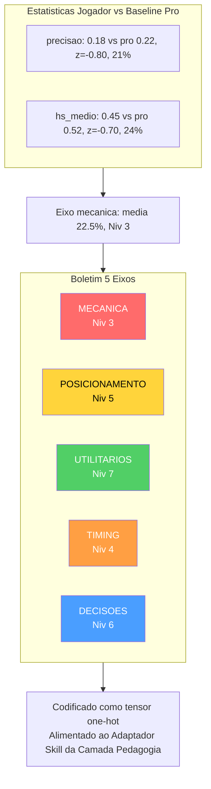

As pontuacoes Z sao convertidas em percentis via a **aproximacao logistica** `1/(1+exp(-1,702z))` (aproximacao CDF rapida), depois o percentil medio e mapeado para um **nivel curricular** (1-10) via `int(avg_skill * 9) + 1`, fixado em [1, 10]. O nivel e codificado como um tensor one-hot (10-dim) via `SkillLatentModel.get_skill_tensor()` para o adaptador de competencias da camada pedagogica.

### -RAP Trainer (`trainer.py`)

Orquestra o ciclo de treinamento com uma **funcao de perda composta**:

```
L_total = L_estrategia + 0,5 x L_valor + L_esparsidade + L_posicao
```

> **Analogia:** A perda total e como um **boletim com 4 notas**, cada uma das quais mede um aspecto diferente do desempenho do modelo. O modelo tenta fazer com que TODAS as quatro notas sejam o mais baixas possivel (no aprendizado de maquina, menor perda = melhor desempenho). Os pesos (1,0, 0,5, 1e-4, 1,0) indicam a importancia de cada materia: Estrategia e Posicao sao materias de pontuacao maxima, Valor e meio credito e Esparsidade e um credito extra. O modelo nao pode simplesmente passar em uma materia e reprovar nas outras: deve equilibrar todas as quatro.

| Termo de perda   | Formula                                                   | Peso | Proposito                                                        |
| ---------------- | --------------------------------------------------------- | ---- | ---------------------------------------------------------------- |
| `L_strategy`   | `MSELoss(advice_probs, target_strat)`                   | 1.0  | Recomendacao tatica correta                                      |
| `L_value`      | `MSELoss(V(s), true_advantage)`                         | 0.5  | Estimativa precisa da vantagem                                   |
| `L_sparsity`   | `model.compute_sparsity_loss(gate_weights)` — L1 nos pesos dos gates (parametro explicito, thread-safe) | 1e-4 | Especializacao de experts                                        |
| `L_position`   | `MSE(pred_xy, true_xy) + 2.0 x MSE(pred_z, true_z)`    | 1.0  | Posicionamento otimo,**penalidade rigorosa no eixo Z** |

> **Nota:** O multiplicador 2x no eixo Z existe porque os erros de posicionamento vertical (por exemplo, um nivel errado em Nuke/Vertigo) sao taticamente catastroficos: representam erros de andar errado que nenhuma correcao horizontal pode corrigir.

> **Analogia:** A penalidade no eixo Z e como um **alarme de incendio para erros de andar errado**. Nos mapas de CS2 como Nuke (que tem dois andares) ou Vertigo (um arranha-ceu), dizer a um jogador para ir ao andar errado e um desastre: e como dizer a alguem para ir a cozinha quando voce queria dizer o soque. Estar ligeiramente fora de posicao horizontal (X/Y) e como estar alguns passos a esquerda ou a direita: nao e excelente, mas e resolvivel. Estar no andar errado (Z) e como estar em uma sala completamente diferente. E por isso que os erros verticais sao punidos 2 vezes mais duramente durante o treinamento: o modelo aprende rapidamente a "NUNCA sugerir o andar errado".

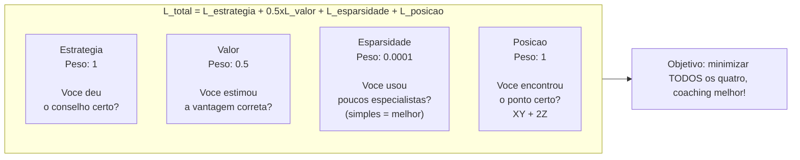

**Saida por fase de treinamento:** `{loss, sparsity_ratio, loss_pos, z_error}`.

### -Resumo do passo forward do RAPCoachModel

**Assinatura:** `forward(view_frame, map_frame, motion_diff, metadata, skill_vec=None, hidden_state=None)` — o parametro `hidden_state` (NN-40) permite passar o estado recorrente da memoria de uma chamada a outra, habilitando **inferencia continua** sem cold-start: o GhostEngine pode manter a memoria entre ticks consecutivos em vez de reiniciar do zero a cada avaliacao.

**Fix NN-39 — Entradas Visuais Duais:** O passo forward gerencia dois formatos de entrada visual atraves de uma verificacao dimensional explicita:

| Formato Entrada | Shape | Quando se usa | Comportamento |
|---|---|---|---|
| **Por-timestep** | `[B, T, C, H, W]` (5-dim) | Treinamento com sequencias temporais | Cada timestep processado individualmente pela CNN |
| **Estatico** | `[B, C, H, W]` (4-dim) | Inferencia em tempo real (GhostEngine) | Frame unico expandido sobre todos os timesteps |

> **Analogia NN-39:** Imagine mostrar um filme ao coach. No formato **por-timestep**, o coach assiste a cada fotograma um por um, analisando-os separadamente e construindo uma compreensao que evolui no tempo — como um arbitro que revisa uma acao em camera lenta, fotograma por fotograma. No formato **estatico**, o coach ve uma unica fotografia da situacao e assume que a cena permaneceu inalterada por toda a duracao — como quando se analisa uma posicao a partir de uma screenshot. O fix NN-39 garante que ambas as situacoes produzam o mesmo formato de saida (`[B, T, 128]`), de modo que o resto do cerebro (memoria, estrategia, pedagogia) funcione identicamente em ambos os casos.

```python
def forward(view_frame, map_frame, motion_diff, metadata, skill_vec=None):
    batch_size, seq_len, _ = metadata.shape

    # NN-39 fix: suporta entrada visual per-timestep [B,T,C,H,W] e estatica [B,C,H,W]
    if view_frame.dim() == 5:
        # Per-timestep — processa cada timestep atraves da CNN separadamente
        z_frames = []
        for t in range(view_frame.shape[1]):
            z_t = self.perception(view_frame[:, t], map_frame[:, t], motion_diff[:, t])
            z_frames.append(z_t)
        z_spatial_seq = torch.stack(z_frames, dim=1)      # [B, T, 128]
    else:
        # Estatico — frame unico expandido sobre todos os timesteps
        z_spatial = self.perception(view_frame, map_frame, motion_diff)  # [B, 128]
        z_spatial_seq = z_spatial.unsqueeze(1).expand(-1, seq_len, -1)   # [B, T, 128]

    lstm_in = cat([z_spatial_seq, metadata], dim=2)        # [B, seq, 153]
    hidden_seq, belief, new_hidden = self.memory(lstm_in, hidden=hidden_state)  # [B, seq, 256], [B, seq, 64]
    last_hidden = hidden_seq[:, -1, :]
    prediction, gate_weights = self.strategy(last_hidden, context)  # [B, 10], [B, 4]
    value_v = self.pedagogy(last_hidden, skill_vec)        # [B, 1]
    optimal_pos = self.position_head(last_hidden)          # [B, 3]
    attribution = self.attributor.diagnose(last_hidden, optimal_pos) # [B, 5]
    return {
        "advice_probs": prediction,      # [B, 10]
        "belief_state": belief,          # [B, seq, 64]
        "value_estimate": value_v,       # [B, 1]
        "gate_weights": gate_weights,    # [B, 4]
        "optimal_pos": optimal_pos,      # [B, 3]
        "attribution": attribution,      # [B, 5]
        "hidden_state": new_hidden,      # NN-40: estado recorrente para inferencia continua
    }
```

> **Analogia:** Esta e a **receita completa** de como o RAP Coach pensa, passo a passo: (1) **Olhos** — a camada Percepcao examina a vista, o mapa e as imagens em movimento e cria um resumo de 128 numeros do que ve. O fix NN-39 permite dois modos: se recebe um filme (5-dim), processa cada fotograma separadamente; se recebe uma foto (4-dim), a replica em todos os timesteps. (2) Este resumo visual e combinado com 25 numeros de metadados (vida, posicao, economia, etc.) para formar uma descricao de 153 numeros. (3) **Memoria** — a memoria LTC + Hopfield processa a descricao ao longo do tempo, produzindo um estado oculto de 256 numeros e um vetor de crencas de 64 numeros ("o que acho que esta acontecendo"). (4) **Estrategia** — 4 especialistas examinam o estado oculto e produzem 10 probabilidades de conselho ("40% de probabilidade de que voce deva avancar, 30% de segurar, etc."). (5) **Professor** — a camada pedagogica estima "quao boa e esta situacao?" (valor). (6) **GPS** — a cabeca de posicao preve onde voce deveria se mover (coordenadas 3D). (7) **Culpa** — o atribuidor descobre por que as coisas deram errado (5 categorias). Todos os **7** outputs sao retornados juntos como um dicionario: a analise completa do treinamento para um momento de jogo. O setimo output, `hidden_state` (NN-40), e o estado recorrente da memoria — permite ao GhostEngine manter a "memoria" entre ticks consecutivos, como um coach que nao esquece o que aconteceu ha 5 segundos quando avalia a posicao atual.

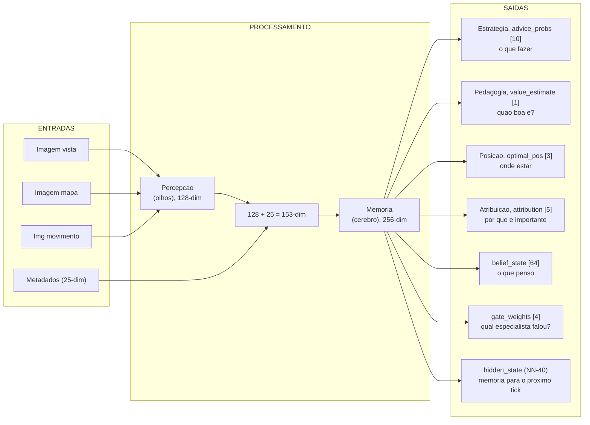

### -ChronovisorScanner (`chronovisor_scanner.py`)

Um **modulo de processamento de sinal multi-escala** que identifica os momentos criticos nas partidas analisando os deltas de vantagem temporal em **3 niveis de resolucao** (micro, standard, macro):

> **Analogia:** O Chronovisor e como um **detector de momentos salientes com 3 lentes de aumento**. A lente **micro** (sub-segundo) captura decisoes instantaneas em tiroteios — como um arbitro que revisa uma acao em camera lenta. A lente **standard** (nivel engajamento) identifica os momentos criticos como jogadas decisivas ou erros fatais — como o replay principal da partida. A lente **macro** (estrategica) detecta mudancas de estrategia que se desenvolvem em 5-10 segundos — como a analise tatica do comentarista. Funciona monitorando a vantagem do time ao longo do tempo (como um grafico do preco de uma acao) e buscando picos ou quedas abruptas em cada escala. Em vez de assistir a partida inteira de 45 minutos, o jogador pode ir diretamente aos momentos criticos mais significativos.

**Configuracao Multi-Escala (`ANALYSIS_SCALES`):**

| Escala | Window (ticks) | Lag | Limiar | Descricao |
| ------ | -------------- | --- | ------ | --------- |
| **Micro** | 64 | 16 | 0.10 | Decisoes de engajamento sub-segundo |
| **Standard** | 192 | 64 | 0.15 | Momentos criticos a nivel de engajamento |
| **Macro** | 640 | 128 | 0.20 | Deteccao de mudancas estrategicas (5-10 segundos) |

> **Analogia multi-escala:** As tres escalas sao como **tres zooms diferentes no Google Maps**: a escala micro e o nivel de rua (voce pode ver cada detalhe de um cruzamento), a escala standard e o nivel de bairro (voce ve a estrutura geral da zona), a escala macro e o nivel da cidade (voce ve como os bairros se conectam entre si). Um jogador pode ter uma micro-decisao ruim (um peek muito lento) que nao aparece nas escalas maiores, ou uma mudanca estrategica macro (rotacao tardia) que nao e visivel na micro-analise. Usando as tres simultaneamente, o coach captura tanto os erros instantaneos quanto as escolhas estrategicas erradas.

**Pipeline de deteccao (para cada escala):**

1. Usa o modelo RAP treinado para prever V(s) para cada tick window.
2. Calcula os deltas usando o lag configurado para a escala: `deltas = values[LAG:] - values[:-LAG]`.
3. Detecta os **picos** onde `|delta| > limiar` (variavel por escala: 0.10/0.15/0.20).
4. Busca o pico dentro da janela configurada, mantendo a coerencia do sinal.
5. A **supressao nao maxima** impede deteccoes duplicadas.
6. Classifica cada pico como **"jogada"** (gradiente positivo, vantagem adquirida) ou **"erro"** (negativo, vantagem perdida).
7. Retorna instancias da dataclass `CriticalMoment` com `(match_id, start_tick, peak_tick, end_tick, severity [0-1], type, description, scale)`.

**Limite de seguranca de tick (F3-21):** `_MAX_TICKS_PER_SCAN = 50.000` — partidas com mais de 50K ticks (possivel com overtimes estendidos ou matches muito longos) sao **truncadas** com um warning (NN-CV-02) em vez de saturar a RAM. O sistema coleta `_MAX_TICKS_PER_SCAN + 1` ticks para detectar a truncagem e avisa que os momentos criticos da fase final da partida podem ser perdidos.

**Deduplicacao cross-escala:** Quando o mesmo momento e detectado em escalas diferentes (ex: um peek critico visivel tanto na escala micro quanto na standard), a deduplicacao prioriza **micro > standard > macro** (a escala mais fina vence). `MIN_GAP_TICKS = 64` (~1 segundo) define a distancia minima entre dois momentos: se dois picos estao mais proximos que 64 ticks, sao considerados o mesmo evento e apenas o de escala mais fina e mantido.

**Rotulos de severidade:** A severidade (0-1) e classificada automaticamente para o `MatchVisualizer`:
- `severity > 0.3` -> **"critical"** (momento que muda a partida)
- `severity > 0.15` -> **"significant"** (momento relevante)
- caso contrario -> **"notable"** (momento digno de nota)

**`ScanResult` dataclass:** Tipo de retorno estruturado que distingue sucesso de falha:

| Campo | Tipo | Descricao |
|---|---|---|
| `critical_moments` | `List[CriticalMoment]` | Momentos criticos detectados |
| `success` | `bool` | True se o scan foi concluido (mesmo com 0 momentos) |
| `error_message` | `Optional[str]` | Detalhe de erro se `success=False` |
| `model_loaded` | `bool` | Se o modelo RAP estava disponivel |
| `ticks_analyzed` | `int` | Numero de ticks efetivamente analisados |

Propriedades utilitarias: `is_empty_success` (scan bem-sucedido mas nenhum momento critico encontrado), `is_failure` (scan falhou — modelo nao carregado, erro de DB, etc.).

> **Analogia pipeline:** Aqui esta o procedimento passo a passo: (1) O modelo RAP observa cada momento e atribui uma "pontuacao de vantagem" (como um monitor cardiaco). (2) Para cada uma das 3 escalas, compara cada momento com o que aconteceu N ticks antes (16, 64 ou 128 ticks dependendo da escala) — "as coisas melhoraram ou pioraram?" (3) Se a mudanca excede o limiar da escala, trata-se de um evento significativo — como um pico de frequencia cardiaca. (4) Amplia a janela ao redor do pico para encontrar o momento de pico exato. (5) Filtra deteccoes duplicadas — se dois picos estao muito proximos, mantem apenas o maior. (6) Rotula cada pico: "jogada" (voce fez algo excepcional) ou "erro" (voce cometeu um erro). (7) Empacota tudo em uma ficha de avaliacao ordenada para cada momento critico, com pontuacoes de gravidade de 0 (menor) a 1 (que muda o jogo) e a escala de deteccao (micro/standard/macro).

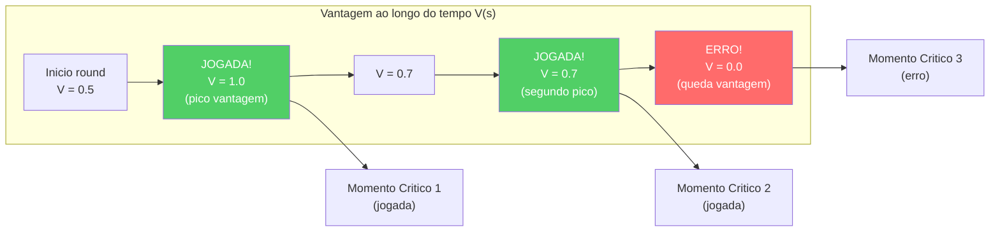

### -GhostEngine (`inference/ghost_engine.py`)

Inferencia em tempo real para o "Ghost" — overlay da posicao otima do jogador. O GhostEngine representa o **ponto final** de toda a cadeia neural: e onde o RAP Coach Model produz saidas visiveis ao usuario sob a forma de um "jogador fantasma" no mapa tatico.

> **Analogia:** O Ghost Engine e como um **holograma "melhor voce"** na tela. Em cada momento durante a reproducao, pergunta ao RAP Coach: "Dada esta situacao exata, onde o jogador DEVERIA estar?" A resposta e um pequeno delta de posicao (por exemplo "5 pixels a direita e 3 pixels acima"), que e redimensionado para as coordenadas reais do mapa. O resultado e um jogador "fantasma" transparente exibido no mapa tatico, mostrando a posicao otima. Se o fantasma esta longe de onde voce estava efetivamente, voce sabe que esta em uma posicao ruim. Se esta proximo, voce se posicionou bem.

**Pipeline de Inferencia 4-Tensores com PlayerKnowledge:**

A pipeline de inferencia opera em 5 fases sequenciais para cada tick de reproducao:

**Fase 1 — Carregamento do Modelo (`_load_brain()`)**
- Verifica `USE_RAP_MODEL` da configuracao (interruptor geral)
- `ModelFactory.get_model(ModelFactory.TYPE_RAP)` — instancia o modelo RAP
- `load_nn(checkpoint_name, model)` — carrega os pesos do checkpoint do disco
- `model.to(device)` -> `model.eval()` — move para GPU/CPU e ativa modo de inferencia
- Em caso de falha: `model = None`, `is_trained = False` — desabilita previsoes

**Fase 2 — Construcao de Tensores de Entrada**

| Tensor | Metodo | Shape Saida | Conteudo |
|---|---|---|---|
| **Map** | `tensor_factory.generate_map_tensor(ticks, map_name, knowledge)` | `[1, 3, 64, 64]` | Posicoes companheiros, inimigos visiveis, utilitarios + bomba |
| **View** | `tensor_factory.generate_view_tensor(ticks, map_name, knowledge)` | `[1, 3, 64, 64]` | Mascara FOV 90 graus, entidades visiveis, zonas utilitarios |
| **Motion** | `tensor_factory.generate_motion_tensor(ticks, map_name)` | `[1, 3, 64, 64]` | Trajetoria 32 ticks, campo velocidade, delta mira |
| **Metadata** | `FeatureExtractor.extract(tick_data, map_name, context)` | `[1, 1, 25]` | Vetor canonico 25-dim (vida, posicao, economia, etc.) |

A **ponte PlayerKnowledge** (`_build_knowledge_from_game_state()`) filtra os dados segundo o principio NO-WALLHACK: apenas as informacoes legitimamente disponiveis ao jogador (companheiros, inimigos visiveis, ultimas posicoes conhecidas com decaimento) sao codificadas nos tensores mapa e vista. Se a construcao do conhecimento falha, o sistema degrada ao modo legacy (tensores vazios).

**Fase 2b — Modo POV (R4-04-01):**

| Modo | Condicao | Comportamento |
|---|---|---|
| **POV Mode** | `USE_POV_TENSORS=True` + `game_state` fornecido | Constroi `PlayerKnowledge` do game state -> tensores POV com semantica de canal dedicada |
| **Legacy Mode** | `USE_POV_TENSORS=False` (default) | Tensores standard alinhados com os dados de treinamento |

> **Atencao (R4-04-01):** Os tensores POV usam uma semantica dos canais diferente (Ch0=companheiros, Ch1=inimigos ultimos conhecidos) em relacao aos dados de treinamento standard (Ch0=inimigos, Ch1=companheiros). Usar tensores POV com um modelo treinado em modo legacy produzira resultados **nao confiaveis**. O modo POV e valido apenas se o modelo foi treinado com dados POV.

**Fase 3 — Inferencia Neural**
```python
with torch.no_grad():
    out = self.model(view_frame=view_t, map_frame=map_t,
                     motion_diff=motion_t, metadata=meta_t,
                     hidden_state=self._last_hidden)  # NN-40: estado persistente
self._last_hidden = out["hidden_state"]  # Mantem para o proximo tick
```
`torch.no_grad()` desabilita o calculo de gradientes (apenas inferencia, nenhum treinamento). O parametro `hidden_state` (NN-40) permite manter o estado recorrente da memoria entre ticks consecutivos, evitando o cold-start a cada avaliacao.

**Fase 4 — Decodificacao e Escala de Posicao**
```python
optimal_delta = out["optimal_pos"].cpu().numpy()[0]    # [dx, dy, dz]
ghost_x = current_x + (optimal_delta[0] * RAP_POSITION_SCALE)  # x 500.0
ghost_y = current_y + (optimal_delta[1] * RAP_POSITION_SCALE)  # x 500.0
return (ghost_x, ghost_y)
```
O modelo produz um delta normalizado em [-1, 1] que e escalado para coordenadas mundo via `RAP_POSITION_SCALE = 500.0` (de `config.py`). A constante e compartilhada entre GhostEngine e overlay para garantir coerencia.

**Fase 5 — Fallback Gradual (5 modos)**

| Modo Fallback | Condicao | Comportamento |
|---|---|---|
| **Modelo desabilitado** | `USE_RAP_MODEL=False` | Skip carregamento, retorna `(0.0, 0.0)` |
| **Checkpoint ausente** | Treinamento nao concluido | `model = None`, previsoes desabilitadas |
| **Nome do mapa ausente** | Nenhum contexto espacial | Retorna `(0.0, 0.0)` imediatamente |
| **Erro PlayerKnowledge** | Construcao conhecimento falhou | Degrada para tensores legacy (todos zeros) |
| **Erro de inferencia** | RuntimeError / CUDA OOM | Log erro, retorna `(0.0, 0.0)` |

> **Analogia fallback:** O fallback e como um GPS com 5 niveis de seguranca: (1) "Modo offline — nao tenho mapas carregados", (2) "Nunca aprendi a navegar nesta zona", (3) "Nem sei em qual cidade estamos", (4) "Sei onde estamos mas nao posso ver ao redor — dirijo de memoria", (5) "Algo quebrou — simplesmente digo para voce ficar onde esta". Em qualquer caso, o GPS **nunca manda o carro contra uma parede** — a pior resposta possivel e "fique parado" (`(0.0, 0.0)`), que e infinitamente melhor que um crash da aplicacao.

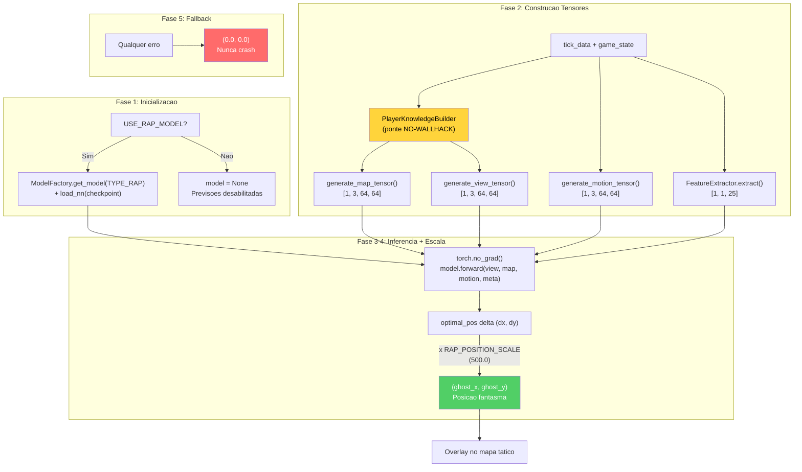

---

## 5. Subsistema 1B — Fontes de Dados

**Pasta no programa:** `backend/data_sources/`
**Arquivos:** `demo_parser.py`, `demo_format_adapter.py`, `event_registry.py`, `trade_kill_detector.py`, `hltv_scraper.py`, `hltv_metadata.py`, `steam_api.py`, `steam_demo_finder.py`, `faceit_api.py`, `faceit_integration.py`, `__init__.py`

O subsistema Fontes de Dados e o **ponto de entrada de todos os dados externos** no sistema. Coleta informacoes de 5 fontes distintas: arquivos demo CS2, estatisticas HLTV, perfis Steam, dados FACEIT e registry de eventos do jogo.

> **Analogia:** As Fontes de Dados sao como os **5 sentidos** do coach AI. O olho principal (demo parser) observa as gravacoes das partidas quadro por quadro. O ouvido (HLTV scraper) escuta as noticias do mundo profissional. O tato (Steam API) sente o perfil e a historia do jogador. O paladar (FACEIT) prova o nivel competitivo do jogador. O sexto sentido (event registry) cataloga sistematicamente cada tipo de evento que o jogo pode produzir. Sem esses sentidos, o coach estaria cego e surdo — incapaz de aprender qualquer coisa.

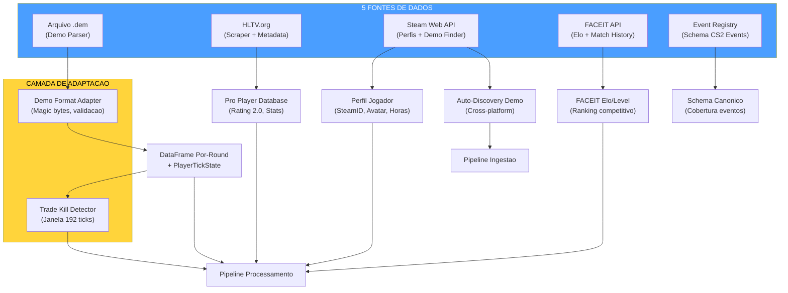

### -Demo Parser (`demo_parser.py`)

Wrapper robusto em torno da biblioteca `demoparser2` para a extracao de estatisticas de arquivos demo CS2.

**Baseline HLTV 2.0** — constantes de normalizacao para o calculo de rating:

| Constante | Valor | Significado |
|---|---|---|
| `RATING_BASELINE_KPR` | 0.679 | Media pro: kills por round |
| `RATING_BASELINE_SURVIVAL` | 0.317 | Media pro: taxa de sobrevivencia |
| `RATING_BASELINE_KAST` | 0.70 | Media pro: Kill/Assist/Survive/Trade % |
| `RATING_BASELINE_ADR` | 73.3 | Media pro: dano medio por round |
| `RATING_BASELINE_ECON` | 85.0 | Media pro: eficiencia economica |

**`parse_demo(demo_path, target_player=None)`:** Entry point principal. Validacao de existencia do arquivo, parsing de eventos `round_end` para contar os rounds, depois extracao estatistica completa via `_extract_stats_with_full_fields()`. Retorna `pd.DataFrame` vazio em caso de qualquer erro (fail-safe).

**`_extract_stats_with_full_fields(parser, total_rounds, target_player)`:** Calcula todas as 25 features agregadas obrigatorias para o banco de dados:
- Estatisticas base: `avg_kills`, `avg_deaths`, `avg_adr`, `kd_ratio`
- Variancia: `kill_std`, `adr_std` (via `_compute_per_round_variance`)
- Estatisticas avancadas: `avg_hs`, `accuracy`, `impact_rounds`, `econ_rating`
- Rating HLTV 2.0 aproximado (aproximacao hand-tuned, nao formula oficial)

> **Analogia:** O Demo Parser e como um **cronista esportivo experiente** que assiste a gravacao de uma partida e compila um boletim detalhado para cada jogador. Nao se limita a contar kills: calcula o dano por round, a porcentagem de headshots, a eficiencia economica e ate quao consistentes sao as performances (desvio padrao). Se a gravacao esta corrompida ou faltam dados, o cronista escreve "nenhum dado disponivel" em vez de inventar numeros — e a politica de tolerancia zero a fabricacao de dados do projeto.

### -Demo Format Adapter (`demo_format_adapter.py`)

Camada de resiliencia para o tratamento de versoes diferentes do formato demo CS2.

**Constantes de validacao:**

| Constante | Valor | Descricao |
|---|---|---|
| `DEMO_MAGIC_V2` | `b"PBDEMS2\x00"` | Magic bytes CS2 (Source 2 Protobuf) |
| `DEMO_MAGIC_LEGACY` | `b"HL2DEMO\x00"` | Magic bytes CS:GO legacy (nao suportado) |
| `MIN_DEMO_SIZE` | 10 x 1024^2 (10 MB) | DS-12: demos CS2 reais sao 50+ MB, arquivos menores sao certamente corrompidos ou incompletos |
| `MAX_DEMO_SIZE` | 5 x 1024^3 (5 GB) | Cap de seguranca |

**Dataclass:**
- `FormatVersion(name, magic, description, supported)` — especifica uma versao conhecida do formato
- `ProtoChange(date, description, affected_events, migration_notes)` — registro de uma mudanca protobuf conhecida

**`FORMAT_VERSIONS`:** Dicionario com dois formatos conhecidos (`cs2_protobuf` suportado, `csgo_legacy` nao suportado).

**`PROTO_CHANGELOG`:** Lista cronologica das mudancas conhecidas no formato protobuf CS2 (para resiliencia a futuras atualizacoes).

**`DemoFormatAdapter.validate_demo(path)`:** Validacao em 3 fases: (1) existencia e tamanho dentro dos bounds, (2) leitura magic bytes para identificacao do formato, (3) verificacao do suporte do formato detectado.

> **Analogia:** O Demo Format Adapter e como um **agente alfandegario no aeroporto** que controla cada "pacote" (arquivo demo) antes de deixa-lo entrar no sistema. Verifica: (1) "O pacote e do tamanho certo?" (nao pequeno demais = corrompido, nao grande demais = potencial bomba), (2) "Tem o carimbo certo?" (magic bytes PBDEMS2 = CS2, HL2DEMO = CS:GO antigo), (3) "Aceitamos pacotes deste pais?" (CS2 sim, CS:GO nao). Se algo nao esta certo, o pacote e rejeitado com uma mensagem clara sobre o motivo. Isto impede que arquivos corrompidos ou do formato errado entrem no pipeline e causem erros misteriosos a jusante.

### -Event Registry (`event_registry.py`)

Registro canonico de **todos os eventos de jogo CS2** derivado dos dumps SteamDatabase.

**`GameEventSpec`** dataclass com 7 campos: `name`, `category` (round/combat/utility/economy/movement/meta), `fields` (dict campo->tipo), `priority` (critical/standard/optional), `implemented` (bool), `handler_path` (opcional), `notes`.

**Categorias de eventos registrados:**

| Categoria | Eventos | Prioridade Critica | Implementados |
|---|---|---|---|
| **Round** | `round_end`, `round_start`, `round_freeze_end`, `round_mvp`, `begin_new_match` | `round_end` | 1/5 |
| **Combat** | `player_death`, `player_hurt`, `player_blind`, etc. | `player_death` | parcial |
| **Utility** | `flashbang_detonate`, `hegrenade_detonate`, `smokegrenade_expired`, etc. | — | parcial |
| **Economy** | `item_purchase`, `bomb_planted`, `bomb_defused`, etc. | `bomb_planted/defused` | parcial |
| **Movement** | `player_footstep`, `player_jump`, etc. | — | nao |
| **Meta** | `player_connect`, `player_disconnect`, etc. | — | nao |

**Funcoes utilitarias:** `get_implemented_events()` -> lista de eventos implementados. `get_coverage_report()` -> relatorio de cobertura por categoria.

> **Nota (F6-33):** Os `handler_path` nao sao validados em runtime — se os modulos handlers sao movidos, as referencias tornam-se silenciosamente obsoletas. Adicionar validacao `hasattr/callable` ao dispatch dos eventos se a confiabilidade for critica.

> **Analogia:** O Event Registry e como um **catalogo enciclopedico de todos os sinais que o jogo pode emitir**. Cada sinal e classificado por categoria (combate, round, utilitarios, economia, movimento, meta), prioridade (critico/standard/opcional) e estado de implementacao. E como um catalogo de um museu: cada obra de arte tem uma ficha com titulo, sala, artista e se esta atualmente exposta. Isto permite a equipe saber exatamente quais eventos o sistema gerencia e quais faltam, planejando a expansao de forma sistematica.

### -Trade Kill Detector (`trade_kill_detector.py`)

Identifica os **trade kills** — kills de retaliacao dentro de uma janela temporal — das sequencias de morte no demo.

**Constante:** `TRADE_WINDOW_TICKS = 192` (3 segundos a 64 ticks/s, o tickrate padrao CS2).

**`TradeKillResult`** dataclass:
- `total_kills`, `trade_kills`, `players_traded`, `trade_details`
- Propriedades calculadas: `trade_kill_ratio`, `was_traded_ratio`

**Algoritmo (derivado de cstat-main):** Para cada kill K no tick T: olha para tras no tempo procurando kills efetuadas pela vitima. Se a vitima matou um companheiro de equipe do killer de K dentro de `TRADE_WINDOW_TICKS`, marca K como trade kill e a vitima original como "was traded". **Restricao same-round:** As kills candidatas ao trade devem pertencer ao **mesmo round** (`round_num` identico). Os trades cross-round nao sao contabilizados — esta e uma distincao tatica importante porque um trade tem significado estrategico apenas dentro do mesmo round, onde influencia diretamente a economia numerica do confronto.

**`build_team_roster(parser)`:** Constroi mapeamento `player_name -> team_num` dos ticks iniciais da partida (usa o 10 percentil dos ticks para estabilidade da atribuicao).

**`get_round_boundaries(parser)`:** Extrai os ticks de limite entre rounds do evento `round_end`.

> **Analogia:** O Trade Kill Detector e como um **analista de replay esportivo** que revisa cada eliminacao e pergunta: "Alguem vingou este jogador dentro de 3 segundos?" Se sim, a morte foi "trocada" — significa que a equipe reagiu rapidamente. Uma alta taxa de trade kill indica uma boa coordenacao de equipe; uma taxa baixa indica jogadores isolados que morrem sem suporte. Esta metrica e um dos indicadores mais importantes no CS2 profissional para avaliar a disciplina posicional e a comunicacao da equipe.

### -Steam API (`steam_api.py`)

Cliente para a Steam Web API com retry e backoff exponencial.

**Constantes:** `MAX_RETRIES = 3`, `BACKOFF_DELAYS = [1, 2, 4]` segundos.

**`_request_with_retry(url, params, timeout=5)`:** Wrapper HTTP GET com 3 tentativas para erros de conexao/timeout. Nao efetua retry em erros HTTP 4xx/5xx (propaga ao chamador).

**Funcoes principais:**
- `resolve_vanity_url(vanity_url, api_key)` -> resolve um URL personalizado Steam para um SteamID de 64 bits
- `fetch_steam_profile(steam_id, api_key)` -> recupera perfil do jogador (nome, avatar, horas de jogo). Auto-resolve vanity URL se a entrada nao for numerica

### -Steam Demo Finder (`steam_demo_finder.py`)

Auto-discovery das demos CS2 da instalacao Steam local.

**`SteamDemoFinder`** classe com estrategia de deteccao em 3 niveis:

| Prioridade | Metodo | Plataforma |
|---|---|---|
| 1 | Registry Windows (`winreg`) | Windows |
| 2 | Caminhos comuns (gerados dinamicamente para cada drive) | Windows/Linux/macOS |
| 3 | Variaveis de ambiente | Todas |

**Deteccao dinamica de drive (Windows):** Usa `windll.kernel32.GetLogicalDrives()` para enumerar todos os drives disponiveis, depois busca `Program Files (x86)/Steam`, `Program Files/Steam`, `Steam` em cada drive.

**`SteamNotFoundError`:** Excecao especifica quando a instalacao Steam nao pode ser localizada.

> **Nota (F6-11):** A descoberta do caminho Steam e duplicada em `ingestion/steam_locator.py` (primario). Este modulo e suplementar (varre diretorios replay). Consolidacao adiada; assegurar mesma precedencia dos caminhos ao modificar a resolucao.

### -Modulo HLTV (`backend/data_sources/hltv/`)

O subsistema HLTV e composto por 5 modulos especializados que colaboram para extrair estatisticas profissionais do site HLTV.org, superando as protecoes anti-scraping do Cloudflare:

> **Analogia:** O modulo HLTV e como um **time de espionagem bem organizado** que coleta informacoes sobre os melhores jogadores do mundo. O `stat_fetcher` e o agente no campo que sabe onde encontrar os dados. O `docker_manager` prepara o veiculo blindado (FlareSolverr) para superar os postos de bloqueio (Cloudflare). O `flaresolverr_client` e o motorista especializado. O `rate_limiter` e o cronometrista que garante que o time nao atraia atencao movendo-se muito rapido. Os `selectors` sao o mapa que indica exatamente onde encontrar cada informacao na pagina.

**`HLTVStatFetcher`** (`stat_fetcher.py`) — Orquestrador principal do scraping:

| Metodo | Descricao |
|---|---|
| `fetch_top_players()` | Scraping pagina Top 50 jogadores -> lista URLs de perfis |
| `fetch_and_save_player(url)` | Fetch completo estatisticas jogador + salvamento DB |
| `_fetch_player_stats(url)` | Deep-crawl: pagina principal + sub-paginas (clutch, multikill, carreira) |
| `_parse_overview(soup)` | Parsing estatisticas principais (rating, KPR, ADR, etc.) |
| `_parse_trait_sections(soup)` | Parsing secoes Firepower, Entrying, Utility |
| `_parse_clutches(soup)` | Parsing vitorias clutch 1v1/1v2/1v3 |
| `_parse_multikills(soup)` | Parsing contagens 3K/4K/5K |
| `_parse_career(soup)` | Parsing historico rating por ano |

**Estatisticas extraidas e salvas em `ProPlayerStatCard`:**

| Categoria | Estatisticas |
|---|---|
| **Core** | `rating_2_0`, `kpr` (Kill/Round), `dpr` (Death/Round), `adr` (Damage/Round) |
| **Eficiencia** | `kast` (Kill/Assist/Survival/Trade %), `headshot_pct`, `impact` |
| **Abertura** | `opening_kill_ratio`, `opening_duel_win_pct` |
| **Tracos (JSON)** | Firepower (kpr_win, adr_win), Entrying (traded_deaths_pct), Utility (flash_assists) |
| **Aprofundamentos (JSON)** | Clutch (1on1/1on2/1on3), Multikill (3k/4k/5k), Carreira (rating por periodo) |

**`RateLimiter`** (`rate_limit.py`) — Rate limiting em 4 niveis com jitter anti-deteccao:

| Nivel | Atraso Min-Max | Caso de uso |
|---|---|---|
| **micro** | 2.0s – 3.5s | Requisicoes consecutivas rapidas |
| **standard** | 4.0s – 8.0s | Navegacao entre perfis de jogador |
| **heavy** | 10.0s – 20.0s | Transicoes entre secoes (principal -> clutch -> multikill -> carreira) |
| **backoff** | 45.0s – 90.0s | Suspeita de bloqueio ou falha (degradacao gradual) |

> **Nota (F6-25):** O jitter (`random.uniform(-0.5, 0.5)`) e **intencionalmente nao seedado** — um jitter deterministico seria detectado pelos sistemas anti-scraping como padrao artificial. O piso minimo de 2.0s e sempre aplicado.

**`DockerManager`** (`docker_manager.py`) — Gerenciamento de containers FlareSolverr com estrategia de inicializacao em cascata:
1. **Fast path:** Retorna `True` se ja em bom estado (health check em `http://localhost:8191/`)
2. **Docker start:** Tenta `docker start flaresolverr` (timeout 15s)
3. **Docker Compose fallback:** Tenta `docker-compose up -d` (timeout 60s)
4. **Health polling:** Verifica disponibilidade a cada 3s por no maximo 45s

**`FlareSolverrClient`** (`flaresolverr_client.py`) — Bypass automatico de Cloudflare JavaScript challenges. Todas as requisicoes HTTP sao roteadas atraves de FlareSolverr em `http://localhost:8191/`. O HTML resolvido e passado ao BeautifulSoup para o parsing.

**`selectors`** (`selectors.py`) — Seletores CSS para o scraping das paginas HLTV, centralizados para manutenibilidade.

```mermaid
flowchart LR
    subgraph FETCH["Pipeline HLTV"]
        URL["URL Jogador<br/>hltv.org/stats/..."]
        URL --> FLARE["FlareSolverr<br/>(Docker container)<br/>Bypass Cloudflare"]
        FLARE --> HTML["HTML Resolvido"]
        HTML --> BS["BeautifulSoup<br/>(seletores CSS)"]
        BS --> STATS["Estatisticas Extraidas<br/>rating, kpr, adr, kast..."]
    end
    subgraph RATE["Rate Limiter"]
        MICRO["micro: 2-3.5s"]
        STD["standard: 4-8s"]
        HEAVY["heavy: 10-20s"]
        BACK["backoff: 45-90s"]
    end
    subgraph SAVE["Persistencia"]
        STATS --> DB["ProPlayer + ProPlayerStatCard<br/>(hltv_metadata.db)"]
    end
    RATE -.->|"controla ritmo"| FETCH

    style FLARE fill:#ffd43b,color:#000
    style DB fill:#4a9eff,color:#fff
```

> **Nota arquitetural:** O subsistema HLTV completo (com `HLTVApiService`, `CircuitBreaker`, `BrowserManager`, `CacheProxy`, `collectors`) reside em `ingestion/hltv/` e e documentado na Parte 3. Os arquivos em `data_sources/hltv/` sao a implementacao de baixo nivel do scraping e do rate limiting.

> **Estado do banco de dados HLTV (abril 2026):** O banco de dados `hltv_metadata.db` contem **161 jogadores profissionais reais**, **32 times** e **156 stat cards** coletados do scraping live de hltv.org via FlareSolverr. Os seletores CSS em `selectors.py` sao dotados de cadeias de fallback para resistir as mudancas de layout do site. O `HybridCoachingEngine` usa esses dados para a selecao automatica do pro de referencia: quando gera uma analise, encontra automaticamente o jogador pro cujo `rating_2_0` e mais proximo ao do usuario e o cita nos feedbacks ("seu ADR e inferior ao de [nome pro]"), via `_find_best_match_pro()` em `coaching_service.py` e `_get_pro_name()` em `hybrid_engine.py`.

**`hltv_scraper.py` / `hltv_metadata.py`** (entry points em `data_sources/`):
- `run_hltv_sync_cycle(limit=20)` — Orquestrador do ciclo de sincronizacao que importa `HLTVApiService` do pipeline completo
- `hltv_metadata.py` — Script de debug para salvamento de paginas via Playwright (validacao seletores CSS)

### -FACEIT API e Integracao (`faceit_api.py`, `faceit_integration.py`)

**`faceit_api.py`:** Funcao unica `fetch_faceit_data(nickname)` que recupera Elo e Level FACEIT para um dado nickname. Requer `FACEIT_API_KEY` da configuracao. Retorna `{faceit_id, faceit_elo, faceit_level}` ou dicionario vazio em caso de erro.

**`faceit_integration.py`:** Cliente FACEIT completo com rate limiting:

| Parametro | Valor | Descricao |
|---|---|---|
| `BASE_URL` | `https://open.faceit.com/data/v4` | Endpoint API FACEIT v4 |
| `RATE_LIMIT_DELAY` | 6 segundos | 10 req/min = 1 req a cada 6s (tier gratuito) |

**`FACEITIntegration`** classe com:
- `_rate_limited_request(endpoint, params)` — requisicoes com rate limiting automatico e backoff exponencial em 429
- Gerenciamento de match history e download de demos
- Excecao dedicada `FACEITAPIError`

> **Analogia:** FACEIT e como um **consultor externo** que fornece ao coach uma segunda opiniao sobre o nivel do jogador. Enquanto o sistema HLTV fornece dados sobre os profissionais, FACEIT fornece o ranking competitivo do jogador usuario (Elo e Level de 1 a 10). O rate limiting e como um **agendamento com o consultor**: voce nao pode ligar mais de 10 vezes por minuto, caso contrario o consultor se recusa a responder (erro 429). O sistema respeita automaticamente este limite, esperando o tempo necessario entre uma requisicao e outra.

### -FrameBuffer — Buffer Circular para Extracao de HUD (`backend/processing/cv_framebuffer.py`)

O **FrameBuffer** e um buffer circular thread-safe para a captura e analise dos frames da tela do jogo. Funciona como a "retina" do sistema: captura frames da tela, os armazena em um anel de tamanho fixo e permite a extracao das regioes HUD (Head-Up Display) para a analise visual.

> **Analogia:** O FrameBuffer e como um **gravador de fita circular** em uma sala de vigilancia. A camera (a tela do jogo) grava continuamente, mas a fita tem espaco apenas para 30 fotogramas — quando esta cheia, os novos fotogramas sobrescrevem os mais antigos. O guardiao (o sistema de analise) pode a qualquer momento pedir "mostre-me os ultimos N fotogramas" ou "amplie a zona do minimap neste fotograma". O importante e que o gravador nunca trava: mesmo se o guardiao esta analisando um fotograma, a camera continua a gravar sem interrupcoes gracas a um cadeado (lock) que coordena os acessos.

**Configuracao:**

| Parametro | Default | Descricao |
|---|---|---|
| `resolution` | `(1920, 1080)` | Resolucao alvo dos frames |
| `buffer_size` | `30` | Capacidade do buffer circular (frames) |

**Operacoes principais:**
- `capture_frame(source)` — Ingere frame de arquivo ou array numpy -> BGR->RGB, uint8, resize -> push no buffer circular
- `get_latest(count=1)` — Recupera os N frames mais recentes (do mais novo ao mais antigo)
- `extract_hud_elements(frame)` — Extrai todas as regioes HUD em um dicionario

**Regioes HUD (referencia 1920x1080):**

| Regiao | Coordenadas | Posicao | Conteudo |
|---|---|---|---|
| **Minimap** | `(0, 0, 320, 320)` | Superior-esquerda | Radar CS2 (posicoes jogadores) |
| **Kill Feed** | `(1520, 0, 1920, 300)` | Superior-direita | Feed de kills e eventos |
| **Scoreboard** | `(760, 0, 1160, 60)` | Superior-centro | Placar times |

**Adaptacao de resolucao** (`_scale_region()`): As coordenadas sao definidas para a resolucao de referencia 1920x1080. Para resolucoes diferentes, sao escaladas proporcionalmente: `sx = largura_frame / 1920`, `sy = altura_frame / 1080`. Isto torna o sistema **agnostico a resolucao** — funciona identicamente em monitores 1080p, 1440p ou 4K.

**Thread-safety:** Um `threading.Lock()` protege todas as operacoes de leitura e escrita no buffer. O indice de escrita (`_write_index`) avanca circularmente modulo `buffer_size`, garantindo O(1) para insercao e recuperacao.

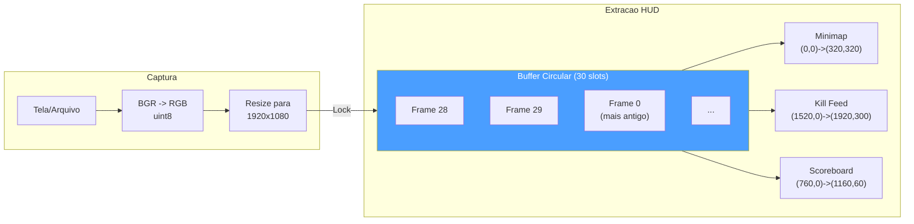

### -TensorFactory — Fabrica de Tensores (`backend/processing/tensor_factory.py`)

A **TensorFactory** e o **sistema perceptivo** do RAP Coach: converte o estado de jogo bruto em 3 tensores-imagem que o modelo neural pode "ver". Cada tensor e uma imagem de 3 canais que codifica uma dimensao diferente da situacao tatica: **mapa** (onde todos estao), **vista** (o que o jogador pode ver) e **movimento** (como esta se movendo).

> **Analogia:** A TensorFactory e como um **pintor de mapas taticos militares** que recebe relatorios de radio e desenha tres mapas separados para o comandante (o modelo RAP). O primeiro mapa (**mapa tatico**) mostra as posicoes de aliados e inimigos conhecidos. O segundo mapa (**mapa de visibilidade**) mostra o que o soldado pode efetivamente ver do seu ponto de vista — o cone de 90 graus a sua frente. O terceiro mapa (**mapa de movimento**) mostra o caminho recente do soldado, sua velocidade e a direcao da sua mira. Crucialmente, o pintor segue uma regra rigida: **nunca desenha a posicao de inimigos que o soldado nao viu** (principio NO-WALLHACK). Se um inimigo esta atras de uma parede, nao aparece no mapa — exatamente como na realidade do jogador.

**Configuracoes:**

| Parametro | `TensorConfig` (Inferencia) | `TrainingTensorConfig` (Treinamento) |
|---|---|---|
| `map_resolution` | 128 x 128 | 64 x 64 |
| `view_resolution` | 224 x 224 | 64 x 64 |
| `sigma` (blur gaussiano) | 3.0 | 3.0 |
| `fov_degrees` | 90 graus | 90 graus |
| `view_distance` | 2000.0 unidades mundo | 2000.0 unidades mundo |

> **Nota (F2-02):** `TrainingTensorConfig` reduz a resolucao de 128/224 para 64/64, obtendo uma **economia de memoria de ~12x**. O contrato `AdaptiveAvgPool2d` na RAPPerception produz 128-dim independentemente da resolucao de entrada, mas esta garantia e implicita — uma assercao em runtime e recomendada.

**Constantes de rasterizacao:**

| Constante | Valor | Proposito |
|---|---|---|
| `OWN_POSITION_INTENSITY` | 1.5 | Brilho marcador posicao propria |
| `ENTITY_TEAMMATE_DIMMING` | 0.7 | Companheiros renderizados mais escuros que inimigos |
| `ENTITY_MIN_INTENSITY` | 0.2 | Intensidade minima entidade visivel |
| `ENEMY_MIN_INTENSITY` | 0.3 | Intensidade minima inimigo visivel |
| `BOMB_MARKER_RADIUS` | 50.0 | Raio circulo bomba (unidades mundo) |
| `BOMB_MARKER_INTENSITY` | 0.8 | Opacidade circulo bomba |
| `TRAJECTORY_WINDOW` | 32 ticks | Janela trajetoria (~0.5s a 64 Hz) |
| `VELOCITY_FALLOFF_RADIUS` | 20.0 | Celulas grid para gradiente radial velocidade |
| `MAX_SPEED_UNITS_PER_TICK` | 4.0 | Velocidade maxima CS2 (64 ticks/s) |
| `MAX_YAW_DELTA_DEG` | 45.0 | Limiar flick para deteccao de mira |

**Os 3 Rasterizadores:**

**1. Rasterizador Mapa** — `generate_map_tensor(ticks, map_name, knowledge)` -> `Tensor(3, res, res)`

| Canal | Modo Player-POV (com PlayerKnowledge) | Modo Legacy (sem knowledge) |
|---|---|---|
| **Ch0** | Companheiros (sempre conhecidos) + posicao propria (intensidade 1.5) | Posicoes inimigos |
| **Ch1** | Inimigos visiveis (intensidade total) + ultimos inimigos conhecidos (decaimento exponencial) | Posicoes companheiros |
| **Ch2** | Zonas utilitarios (fumaca/molotov) + overlay bomba | Posicao jogador |

**2. Rasterizador Vista** — `generate_view_tensor(ticks, map_name, knowledge)` -> `Tensor(3, res, res)`

| Canal | Modo Player-POV | Modo Legacy |
|---|---|---|
| **Ch0** | Mascara FOV (cone geometrico 90 graus da direcao de olhar) | Mascara FOV |
| **Ch1** | Entidades visiveis: companheiros (dimmed x0.7) + inimigos visiveis (intensidade ponderada por distancia) | Zona perigo (areas NAO cobertas por FOV acumulado, capped em 8 ticks) |
| **Ch2** | Zonas utilitarios ativos (circulos fumaca/molotov em unidades mundo) | Zona segura (recentemente visivel mas nao em FOV corrente) |

**3. Codificador Movimento** — `generate_motion_tensor(ticks, map_name)` -> `Tensor(3, res, res)`

| Canal | Conteudo |
|---|---|
| **Ch0** | Trajetoria ultimos 32 ticks — intensidade proporcional a recencia (mais novo = 1.0, mais antigo -> 0) |
| **Ch1** | Campo velocidade — gradiente radial do jogador, modulado pela velocidade corrente [0, 1] |
| **Ch2** | Movimento de mira — magnitude delta yaw como blob gaussiano na posicao do jogador |

> **Nota (F2-03):** Demos a 128 ticks/s comprimem a velocidade na metade inferior do intervalo [0, 1]; normalizacao consciente do tick-rate aguardando implementacao.

**Integracao NO-WALLHACK:** Quando `PlayerKnowledge` e fornecida, os rasterizadores mapa e vista codificam **apenas o estado visivel ao jogador**. As posicoes inimigas do ultimo avistamento decaem exponencialmente no tempo. As zonas utilitarios sao visiveis apenas se no FOV ou conhecidas pelo radar. Quando `knowledge=None`, o sistema degrada ao modo legacy para retrocompatibilidade.

**Metodos helper:**
- `_world_to_grid(x, y, meta, resolution)` — Conversao coordenadas mundo -> grid. **Nota C-03:** Unico Y-flip (`meta.pos_y - y`) para evitar dupla inversao
- `_normalize(arr)` — Normalizacao para [0, 1]. **Nota M-10:** `arr / max(max_val, 1.0)` para prevenir amplificacao do ruido em canais esparsos
- `_generate_fov_mask(player_x, player_y, yaw, meta, resolution)` — Mascara conica 90 graus da direcao de olhar, limitada por distancia (aproximacao 2D top-down)

**Acesso Singleton:** `get_tensor_factory()` — double-checked locking, thread-safe.

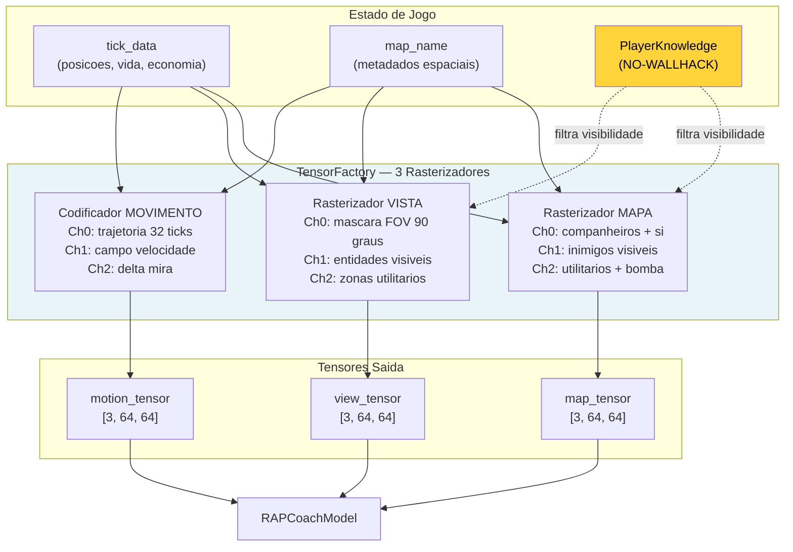

### -Indice Vetorial FAISS (`backend/knowledge/vector_index.py`)

O **VectorIndexManager** fornece busca semantica de alta velocidade para o sistema de conhecimento RAG (Retrieval-Augmented Generation) do coach. Usa FAISS (Facebook AI Similarity Search) com `IndexFlatIP` sobre vetores L2-normalizados, obtendo efetivamente uma **busca por similaridade cosseno** em tempo sublinear.

> **Analogia:** O indice FAISS e como o **sistema de busca da biblioteca** do coach. Em vez de folhear cada livro (conhecimento tatico) ou cada anotacao (experiencia de coaching) um por um para encontrar aquele relevante a situacao atual, o bibliotecario (FAISS) criou um **indice por conceitos**: quando o coach pergunta "qual e a melhor estrategia para um retake B em Mirage com 2 jogadores?", o indice encontra instantaneamente os 5 documentos mais similares a esta pergunta, sem ter que ler todos os 10.000 documentos da biblioteca. O truque e que cada documento e cada pergunta sao convertidos em um vetor de 384 numeros (embedding), e FAISS compara esses vetores via **produto interno** (equivalente a similaridade cosseno apos normalizacao L2).

**Indices Duais:**

| Indice | Fonte DB | Conteudo |
|---|---|---|
| `"knowledge"` | Tabela `TacticalKnowledge` | Embedding conhecimento tatico (estrategias, posicoes, utilitarios) |
| `"experience"` | Tabela `CoachingExperience` | Embedding experiencias de coaching (feedback, correcoes, conselhos) |

**Tipo de indice:** `faiss.IndexFlatIP` (Inner Product) sobre vetores L2-normalizados. Como `cos(a, b) = a.b / (||a|| x ||b||)`, normalizando os vetores a norma unitaria, o produto interno **equivale exatamente** a similaridade cosseno. Intervalo resultante: [0, 1] onde 1 = identico.

**API publica:**

| Metodo | Descricao |
|---|---|
| `search(index_name, query_vec, k)` | Busca os k vetores mais similares. Lazy rebuild se dirty. Retorna `List[(db_id, similarity)]` |
| `rebuild_from_db(index_name)` | Reconstrucao completa do indice da tabela DB. Thread-safe. Retorna contagem de vetores |
| `mark_dirty(index_name)` | Marca o indice para reconstrucao lazy (no proximo `search()`) |
| `index_size(index_name)` | Retorna `index.ntotal` ou 0 se nao construido |

**Persistencia em disco:**
- Formato: `{persist_dir}/{index_name}.faiss` + `{index_name}_ids.npy`
- Salvamento: `faiss.write_index()` + `np.save()`
- Carregamento: automatico em `__init__` via `faiss.read_index()` + `np.load()`
- Diretorio default: `~/.cs2analyzer/indexes/`

**Thread-safety:** Um unico `threading.Lock()` protege todas as operacoes de leitura/escrita sobre os indices, os flags dirty e as operacoes de rebuild. FAISS `IndexFlatIP` e thread-safe para leituras concorrentes.

**Reconstrucao lazy (`mark_dirty()`):** Quando novos dados sao inseridos nas tabelas Knowledge ou Experience, o indice e marcado como "dirty" em vez de reconstruido imediatamente. A reconstrucao ocorre apenas no proximo `search()`, evitando rebuilds multiplos durante insercoes batch.

**Normalizacao vetorial:**
```
norms = ||embedding||_2 por linha
normalized = embedding / max(norms, 1e-8)    # estabilidade numerica
IndexFlatIP.add(normalized)
```

**Fallback gradual:** Se `faiss-cpu` nao esta instalado, o singleton `get_vector_index_manager()` retorna `None` e o sistema degrada automaticamente para busca brute-force (mais lenta mas funcionalmente equivalente). Isto permite ao programa funcionar mesmo em sistemas onde FAISS nao esta disponivel.

**Over-fetching com constantes explicitas:** Para gerenciar cenarios de pos-filtragem (category, map_name, confidence, outcome), a busca recupera mais resultados que o necessario: `k x OVERFETCH_KNOWLEDGE = k x 10` para a Knowledge Base (filtro por categoria + mapa), `k x OVERFETCH_EXPERIENCE = k x 20` para o Experience Bank (filtro por mapa + confidence + outcome + scoring composito). O multiplicador 20x para as experiencias e o dobro em relacao ao conhecimento porque os filtros sao mais restritivos (4 criterios vs 2), portanto serve um pool inicial mais amplo para garantir resultados suficientes apos a filtragem.

### -Contexto dos Rounds (`round_context.py`)

O modulo **Round Context** e a **grade temporal** do sistema de ingestao: converte os ticks brutos dos arquivos demo em coordenadas significativas "round N, tempo T segundos" que cada outro modulo pode usar para contextualizar os eventos de jogo.

> **Analogia:** O Round Context e como o **assistente do cronometrista** em uma partida de futebol. O cronometrista (DemoParser) mede o tempo em milissegundos absolutos desde o inicio da gravacao, mas o assistente traduz esses milissegundos em informacoes uteis: "Este evento aconteceu aos 23 minutos do segundo tempo". Sem o assistente, cada analista teria que fazer esta conversao sozinho, arriscando erros e incoerencias. O Round Context faz o mesmo para CS2: converte ticks absolutos em "Round 7, 42 segundos do inicio da acao", permitindo a todos os motores de analise trabalhar com coordenadas temporais coerentes e significativas.

**Funcoes publicas:**

| Funcao | Entrada | Saida | Complexidade |
|---|---|---|---|
| `extract_round_context(demo_path)` | Caminho arquivo `.dem` | DataFrame: `round_number`, `round_start_tick`, `round_end_tick` | O(n) parsing de eventos |
| `extract_bomb_events(demo_path)` | Caminho arquivo `.dem` | DataFrame: `tick`, `event_type` (planted/defused/exploded) | O(n) parsing de eventos |
| `assign_round_to_ticks(df_ticks, round_context, tick_rate)` | DataFrame ticks + limites rounds | DataFrame enriquecido com `round_number`, `time_in_round` | O(n log m) via `merge_asof` |

**Construcao dos limites de round (`extract_round_context`):**

O modulo analisa dois tipos de eventos do arquivo demo:
- **`round_freeze_end`** — o tick em que termina o freeze time e comeca a acao (os jogadores podem se mover)
- **`round_end`** — o tick em que o round termina (vitoria/derrota)

Para cada round, combina o ultimo `round_freeze_end` que precede o `round_end` correspondente. **Fallback:** se nao e encontrado um evento `round_freeze_end` para um dado round (possivel em demos corrompidos ou partidas interrompidas), usa o `round_end` do round anterior como inicio, registrando um warning no log.

**Extracao de eventos de bomba (`extract_bomb_events`):**

Extrai tres tipos de eventos: `bomb_planted`, `bomb_defused` e `bomb_exploded`. A adicao de `bomb_exploded` (remediacao H-07) permite distinguir entre rounds ganhos por explosao e rounds ganhos por eliminacao, uma informacao critica para a analise tatica pos-plant.

**Atribuicao de round aos ticks (`assign_round_to_ticks`):**

Usa `pd.merge_asof` com `direction="backward"` para uma atribuicao eficiente O(n log m): para cada tick, encontra o ultimo `round_start_tick <= tick`. Calcula `time_in_round = (tick - round_start_tick) / tick_rate`, limitado a [0.0, 175.0] segundos (duracao maxima de um round CS2). Os ticks antes do primeiro round (warmup) sao atribuidos ao round 1.

> **Nota:** O uso de `merge_asof` no lugar de um loop Python transforma uma operacao O(n x m) em O(n log m), fundamental para demos com milhoes de ticks e 30+ rounds.

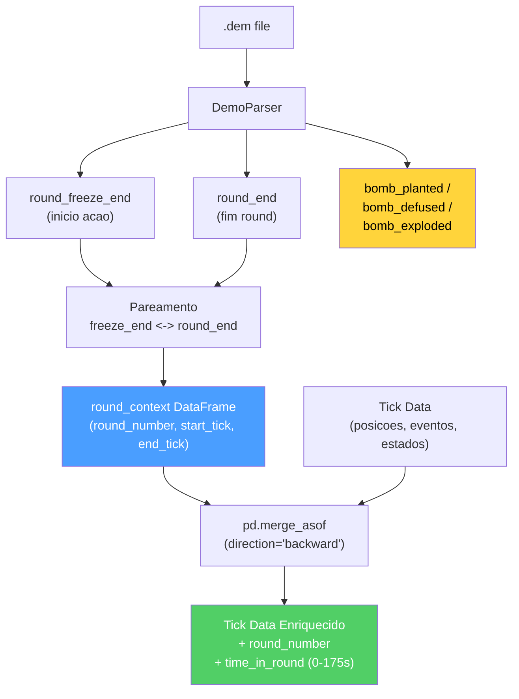

**Gerenciamento de erros:** Cada fase de parsing e protegida por try/except com logging estruturado. Se o parsing falha completamente ou nao sao encontrados eventos `round_end`, a funcao retorna um DataFrame vazio — os modulos a jusante (ex: `RoundStatsBuilder`) devem gerenciar este caso gracefully.

---

---

## Resumo da Parte 1B — Os Sentidos e o Especialista

A Parte 1B documentou os **dois pilares perceptivos e diagnosticos** do sistema de coaching:

| Subsistema | Papel | Componentes Chave |
|---|---|---|
| **2. RAP Coach** | O **medico especialista** — arquitetura de 7 componentes para coaching completo em condicoes POMDP | Percepcao (ResNet de 3 fluxos, 24 conv), Memoria (LTC **512** unidades NCP + Hopfield 4 cabecas + atraso de ativacao NN-MEM-01 + **RAPMemoryLite** fallback LSTM), Estrategia (4 especialistas MoE + SuperpositionLayer), Pedagogia (Value Critic + Skill Adapter), Atribuicao Causal (5 categorias, sinal utilitarios aprendido), Posicionamento (Linear 256->3), Comunicacao (template), ChronovisorScanner (3 escalas temporais + 50K ticks safety limit + deduplicacao cross-escala + ScanResult estruturado), GhostEngine (pipeline 4-tensores com POV mode R4-04-01, hidden_state NN-40, fallback em 5 niveis) |
| **1B. Fontes de Dados** | Os **sentidos** — adquirem e estruturam dados do mundo externo | Demo Parser (demoparser2 + HLTV 2.0 rating), Demo Format Adapter (magic bytes PBDEMS2), Event Registry (schema CS2 completo), Trade Kill Detector (janela 192 ticks), Steam API (retry + backoff), Steam Demo Finder (cross-platform), HLTV (FlareSolverr + rate limiting 4 niveis + seletores CSS com fallback chain — **161 jogadores pro reais, 32 times, 156 stat cards** em hltv_metadata.db), FACEIT API, FrameBuffer (ring buffer 30 frames), TensorFactory (3 rasterizadores NO-WALLHACK), FAISS (IndexFlatIP 384-dim), Round Context (merge_asof O(n log m)) |

> **Analogia final:** Se o sistema de coaching fosse um **ser humano**, a Parte 1A descreveu seu cerebro (as redes neurais que aprendem e o sistema de maturidade que decide quando estao prontas), e a Parte 1B descreveu seus olhos e ouvidos (as fontes de dados que adquirem informacoes do mundo externo), seu sistema nervoso especializado (o RAP Coach que integra percepcao, memoria e decisao), e seu sistema de comunicacao (que traduz a compreensao em conselhos legiveis). Mas um cerebro com sentidos sozinhos nao basta: precisa de um **corpo** para agir. A **Parte 2** documenta esse corpo — os servicos que sintetizam os conselhos, os motores de analise que investigam cada aspecto do gameplay, os sistemas de conhecimento que armazenam a sabedoria acumulada, o pipeline de processamento que prepara os dados, o banco de dados que preserva tudo, e o pipeline de treinamento que ensina aos modelos.

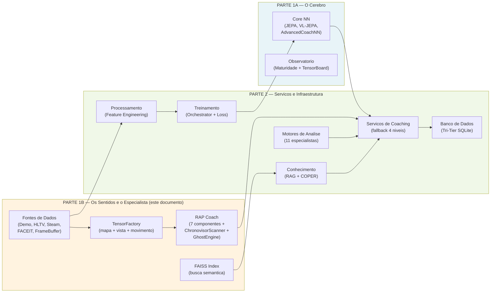

> **Continua na Parte 2** — *Servicos de Coaching, Coaching Engines, Conhecimento e Recuperacao, Motores de Analise (11), Processamento e Feature Engineering, Modulo de Controle, Progresso e Tendencias, Banco de Dados e Storage (Tri-Tier), Pipeline de Treinamento e Orquestracao, Funcoes de Perda*
