# Ultimate CS2 Coach — Parte 1B: I Sensi e lo Specialista

> **Argomenti:** Modello RAP Coach (architettura 7 componenti: Percezione, Memoria LTC+Hopfield, Strategia, Pedagogia, Attribuzione Causale, Posizionamento, Comunicazione), ChronovisorScanner (rilevamento momenti critici multi-scala), GhostEngine (pipeline inferenza 4-tensori), e tutte le sorgenti dati esterne (Demo Parser, HLTV, Steam, FACEIT, TensorFactory, FrameBuffer, FAISS, Round Context).
>
> **Autore:** Renan Augusto Macena

---

> Questo documento è la continuazione della **Parte 1A** — *Il Cervello: Architettura Neurale e Addestramento*, che documenta i modelli di rete neurale (JEPA, VL-JEPA, AdvancedCoachNN), il sistema di addestramento a 3 livelli di maturità, l'Osservatorio di Introspezione del Coach, e i fondamenti architetturali del sistema (principio NO-WALLHACK, contratto 25-dim).

## Indice

**Parte 1B — I Sensi e lo Specialista (questo documento)**

4. [Sottosistema 2 — Modello RAP Coach (`backend/nn/experimental/rap_coach/`)](#4-sottosistema-2--modello-rap-coach)
   - RAPCoachModel (Input Visivi Duali: per-timestep e statici)
   - Livello di Percezione (ResNet a 3 flussi)
   - Livello di Memoria (LTC + Hopfield)
   - Livello Strategia (SuperpositionLayer + MoE)
   - Livello Pedagogico (Value Critic + Attribuzione Causale)
   - Modello Latente delle Abilità
   - RAP Trainer (Funzione di Perdita Composita)
   - ChronovisorScanner (Rilevamento Momenti Critici Multi-Scala)
   - GhostEngine (Pipeline Inferenza 4-Tensori con PlayerKnowledge)
5. [Sottosistema 1B — Sorgenti Dati (`backend/data_sources/`)](#5-sottosistema-1b--sorgenti-dati)
   - Demo Parser + Demo Format Adapter
   - Event Registry (Schema CS2 Events)
   - Trade Kill Detector
   - Steam API + Steam Demo Finder
   - Modulo HLTV (stat_fetcher, FlareSolverr, Docker, Rate Limiter)
   - FACEIT API + Integration
   - FrameBuffer (Buffer Circolare per Estrazione HUD)
   - TensorFactory — Fabbrica dei Tensori (Percezione Player-POV NO-WALLHACK)
   - Indice Vettoriale FAISS (Ricerca Semantica ad Alta Velocità)
   - Contesto dei Round (Griglia Temporale)

**Parte 1A** — Il Cervello: Core della Rete Neurale (JEPA, VL-JEPA, AdvancedCoachNN, SuperpositionLayer, EMA, CoachTrainingManager, TrainingOrchestrator, ModelFactory, NeuralRoleHead, MaturityObservatory)

**Parte 2** — Sezioni 5-13: Servizi di Coaching, Coaching Engines, Conoscenza e Recupero, Motori di Analisi (11), Elaborazione e Feature Engineering, Modulo di Controllo, Progresso e Tendenze, Database e Storage (Tri-Tier), Pipeline di Addestramento e Orchestrazione, Funzioni di Perdita

**Parte 3** — Logica Programma, UI, Ingestion, Tools, Tests, Build, Remediation

---

## 4. Sottosistema 2 — Modello RAP Coach

**Directory canonico:** `backend/nn/experimental/rap_coach/` (il vecchio percorso `backend/nn/rap_coach/` è uno shim di reindirizzamento)
  **File:** `model.py`, `perception.py`, `memory.py`, `strategy.py`, `pedagogy.py`, `communication.py`, `skill_model.py`, `trainer.py`, `chronovisor_scanner.py`

  Il RAP (Reasoning, Adaptation, Pedagogy) Coach è un'**architettura profonda con 6 componenti neurali apprendibili + 1 livello di comunicazione esterna**, appositamente progettata per il coaching CS2 in condizioni di osservabilità parziale (condizioni POMDP). La classe `RAPCoachModel` contiene Percezione (`RAPPerception`), Memoria (`RAPMemory` con LTC+Hopfield), Strategia (`RAPStrategy`), Pedagogia (`RAPPedagogy` con Value Critic e Skill Adapter), Attribuzione Causale (`CausalAttributor`) e una Testa di Posizionamento (`nn.Linear(256→3)`), tutti apprendibili. Il livello di Comunicazione (`communication.py`) opera esternamente come selettore di template di post-elaborazione. Il forward pass produce 6 output: `advice_probs`, `belief_state`, `value_estimate`, `gate_weights`, `optimal_pos` e `attribution`.


  > **Analogia:** L'allenatore RAP è il **cervello più avanzato** del sistema: immaginalo come un edificio di 7 piani in cui ogni piano ha un compito specifico. Il piano 1 (Percezione) è costituito dagli **occhi**: osserva le immagini della mappa, la visuale del giocatore e gli schemi di movimento. Il piano 2 (Memoria) è l'**ippocampo**: ricorda cosa è successo prima nel round e lo collega a round simili precedenti tramite rete LTC + Hopfield. Il piano 3 (Strategia) è la **stanza decisionale**: decide quali consigli dare tramite 4 esperti MoE. Il piano 4 (Pedagogia) è l'**ufficio dell'insegnante**: stima il valore della situazione con il Value Critic. Il piano 5 (Attribuzione Causale) è il **detective**: capisce PERCHÉ qualcosa è andato storto, suddividendo la colpa in 5 categorie. Il piano 6 (Posizionamento) è il **GPS**: calcola dove avrebbe dovuto trovarsi il giocatore con un `nn.Linear(256→3)` che predice `(dx, dy, dz)`. Il piano 7 (Comunicazione) è il **portavoce**: traduce tutto in semplici consigli leggibili, operando come post-elaborazione esterna. La parte "POMDP" significa che l'allenatore deve lavorare con **informazioni incomplete**: non può vedere l'intera mappa, proprio come un giocatore. È come allenare una squadra di calcio dagli spalti quando metà campo è coperto dalla nebbia.
  >

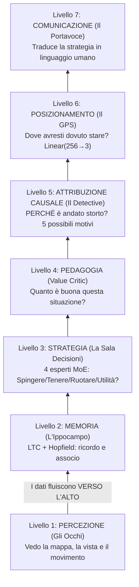

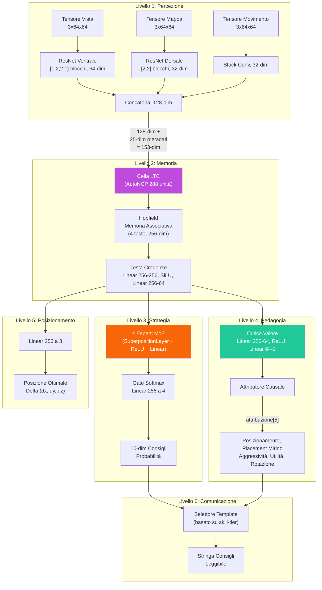

### -Livello di percezione (`perception.py`)

Un front-end **convoluzionale a tre flussi** che elabora gli input visivi:

| Input                                | Forma         | Backbone                                                | Output Dim       |
| ------------------------------------ | ------------- | ------------------------------------------------------- | ---------------- |
| **Tensore di visualizzazione** | `3×64×64` | Flusso ventrale ResNet: [1,2,2,1] blocchi, 3→64 canali | **64-dim** |
| **Tensore di mappa**           | `3×64×64` | Flusso dorsale ResNet: [2,2] blocchi, 3→32 canali      | **32-dim** |
| **Tensore di movimento**       | `3×64×64` | Conv(3→16→32) + MaxPool + AdaptiveAvgPool             | **32-dim** |

I tre vettori di caratteristiche sono concatenati in un singolo **embedding di percezione a 128 dimensioni** (64 + 32 + 32).

> **Analogia:** Il Livello di Percezione è come i **tre diversi paia di occhiali** dell'allenatore. La prima coppia (tensore di vista / flusso ventrale) mostra **ciò che il giocatore vede** – la sua prospettiva in prima persona, elaborata attraverso una ResNet leggera a 5 blocchi (configurazione `[1,2,2,1]`, calibrata per input 64×64) che estrae 64 caratteristiche importanti dall'immagine. La seconda coppia (tensore di mappa / flusso dorsale) mostra il **radar/minimappa aerea** – dove si trovano tutti – elaborato attraverso una rete più semplice a 3 blocchi in 32 caratteristiche. La terza coppia (tensore di movimento) mostra **chi si sta muovendo e con quale velocità** – come la sfocatura del movimento in una foto – elaborata in altre 32 caratteristiche. Quindi tutte e tre le viste vengono **incollate insieme** in un unico riepilogo di 128 numeri: "Ecco tutto ciò che riesco a vedere in questo momento". Questo processo trae ispirazione dal modo in cui il cervello umano elabora la vista: il flusso ventrale riconosce "cosa" sono le cose, mentre il flusso dorsale traccia "dove" si trovano le cose.

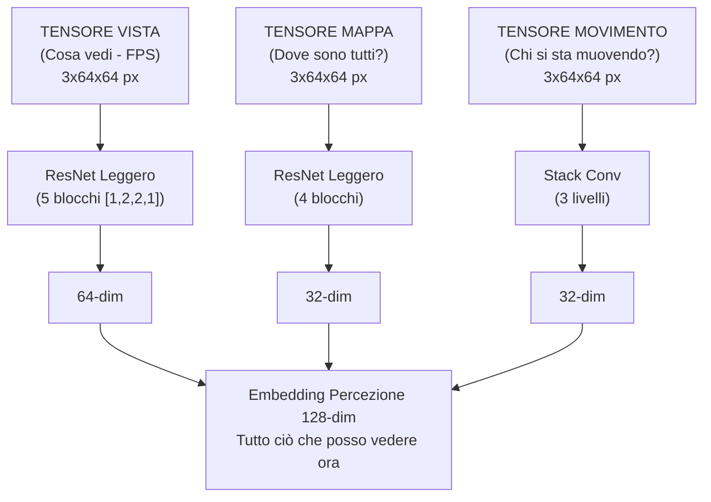

I blocchi ResNet utilizzano **scorciatoie di identità** con downsample apprendibile (Conv1×1 + BatchNorm) quando stride ≠ 1 o il conteggio dei canali cambia. **24 livelli di convoluzione** su tutti e tre i flussi:

| Flusso                     | Configurazione blocco                | Blocchi | Conv/Blocco | Conversioni scorciatoie | Totale       |
| -------------------------- | ------------------------------------ | ------- | ----------- | ----------------------- | ------------ |
| **Vista (Ventrale)** | `[1,2,2,1]` → 1 + 5 = 6 blocchi  | 6       | 2           | 1 (primo blocco)        | **13** |
| **Mappa (Dorsale)**  | `[2,2]` → 1 + 3 = 4 blocchi       | 4       | 2           | 1 (primo blocco)        | **9**  |
| **Movimento**        | Stack di conversione (2 livelli)     | —      | —          | —                      | **2**  |
| **Totale**           |                                      |         |             |                         | **24** |

> **Come funziona** `_make_resnet_stack`: Crea 1 blocco iniziale con `stride=2` (per il downsampling spaziale), quindi `sum(num_blocks) - 1` blocchi aggiuntivi con `stride=1`. Ogni `ResNetBlock` ha 2 livelli Conv2d (kernel 3×3). Il primo blocco riceve anche una scorciatoia Conv1×1 perché i canali di input (3) sono diversi dai canali di output (64 o 32).

> **Nota sulla scelta architettonica (F3-29):** La configurazione originale `[3,4,6,3]` (15 blocchi, 33 conv nel flusso ventrale) era progettata per input 224×224 (la dimensione standard di ImageNet). Per input 64×64 come quelli utilizzati in questo progetto, le feature map collasserebbero spazialmente dopo il primo blocco stride-2, rendendo i blocchi successivi ridondanti. La configurazione `[1,2,2,1]` (5 blocchi effettivi) è calibrata specificamente per la risoluzione di training 64×64, con `AdaptiveAvgPool2d` che gestisce qualsiasi risoluzione spaziale residua. Eventuali checkpoint precedenti vengono automaticamente rilevati come `_stale_checkpoint` da `load_nn()`.

> **Analogia:** Le scorciatoie di identità sono come gli **ascensori di un edificio**: consentono alle informazioni di saltare i piani e di passare direttamente dai livelli iniziali a quelli successivi. Senza di esse, le informazioni dovrebbero salire molte rampe di scale e, una volta raggiunta la cima, il segnale originale sarebbe così sbiadito che la rete non potrebbe apprendere. Le scorciatoie garantiscono che anche in una rete profonda, i gradienti (i segnali di apprendimento) possano fluire in modo efficiente. Questo è lo stesso trucco che ha reso possibile il moderno deep learning, inventato da Kaiming He nel 2015. La scelta di una rete più compatta (`[1,2,2,1]` anziché `[3,4,6,3]`) è come scegliere un edificio di 6 piani anziché 16 quando il terreno disponibile (64×64 pixel) è piccolo: meno piani significano meno ascensori necessari, ma il trasporto rimane ugualmente efficiente.

### -Livello di memoria (`memory.py`) — LTC + Hopfield

Questa parte affronta la sfida fondamentale che il CS2 coach è un **Processo decisionale di Markov parzialmente osservabile** (POMDP).

> **Analogia:** POMDP è un modo elegante per dire **"non puoi vedere tutto".** In CS2, non sai dove si trovano tutti i nemici: vedi solo ciò che hai di fronte. È come giocare a scacchi con una coperta su metà della scacchiera. Il compito del Livello di memoria è **ricordare e indovinare**: tiene traccia di ciò che è accaduto in precedenza nel round e usa quella memoria per riempire gli spazi vuoti su ciò che non può vedere. Dispone di due strumenti speciali per questo: una rete LTC (memoria a breve termine che si adatta alla velocità del gioco) e una rete Hopfield (ricerca di pattern a lungo termine che dice "questa situazione mi ricorda qualcosa che ho già visto").

**Rete a costante di tempo liquida (LTC) con cablaggio AutoNCP:**

- Input: 153 dim (128 percezione + 25 metadati)
- Unità NCP: **512** (`hidden_dim * 2` = 256 × 2) — rapporto 2:1 che garantisce abbastanza inter-neuroni per il cablaggio sparso AutoNCP
- Output: stato nascosto a 256 dim
- Utilizza la libreria `ncps` con pattern di connettività sparsi, simili a quelli del cervello
- Adatta la risoluzione temporale al ritmo del gioco (impostazioni lente vs. scontri a fuoco rapidi)
- Seeding deterministico (NN-MEM-02): numpy + torch RNG seedati a 42 durante la creazione del wiring AutoNCP, con ripristino dello stato RNG originale dopo l'inizializzazione — garantisce portabilità dei checkpoint tra diverse esecuzioni

> **Analogia:** La rete LTC è come un **cervello vivo e respirante**: a differenza delle normali reti neurali che elaborano il tempo a intervalli fissi (come un orologio che ticchetta ogni secondo), la LTC adatta la sua velocità a ciò che accade. Durante una lenta preparazione (i giocatori camminano silenziosamente), l'elaborazione avviene al rallentatore. Durante uno scontro a fuoco veloce, accelera, come il battito cardiaco accelerato quando si è eccitati. Il "cablaggio AutoNCP" fa sì che le connessioni tra i neuroni siano sparse e strutturate come in un vero cervello: non tutto si collega a tutto il resto. Questo è più efficiente e biologicamente più realistico.

**Memoria associativa di Hopfield:**

- Input/Output: 256-dim
- Teste: 4
- Utilizza `hflayers.Hopfield` come **memoria indirizzabile tramite contenuto** per il recupero dei round prototipo

> **Analogia:** La memoria di Hopfield è come un **album fotografico di giocate famose**. Durante l'allenamento, memorizza i "round prototipo" – schemi classici come "una perfetta ripresa del sito B in Inferno" o "una corsa fallita nel fumo in Dust2". Quando arriva un nuovo momento di gioco, la rete di Hopfield chiede: "Questo mi ricorda qualche foto nel mio album?" Se trova una corrispondenza, recupera il ricordo associato, come un detective della polizia che sfoglia le foto segnaletiche e dice: "Ho già visto questa faccia!". Ha 4 "teste" (teste di attenzione) in modo da poter cercare 4 diversi tipi di schemi contemporaneamente.

**Ritardo di attivazione Hopfield (NN-MEM-01 + RAP-M-04):**

La rete di Hopfield **non si attiva immediatamente** durante l'addestramento. I pattern memorizzati partono da inizializzazione casuale (`torch.randn * 0.02`) e l'attenzione sarebbe quasi uniforme su tutti gli slot, aggiungendo rumore anziché segnale. Per questo motivo:

- `_training_forward_count` conta i passaggi forward durante il training
- `_hopfield_trained` (flag booleano) rimane `False` fino a ≥2 forward pass di addestramento
- Prima dell'attivazione, il forward pass restituisce `torch.zeros_like(ltc_out)` al posto dell'output Hopfield
- Dopo ≥2 forward (garantendo almeno un backward + optimizer.step abbia modellato i pattern), Hopfield si attiva e contribuisce al combined_state
- Il caricamento di un checkpoint (`load_state_dict`) imposta `_hopfield_trained = True` immediatamente, assumendo che il modello sia già stato addestrato

> **Analogia:** È come un **nuovo dipendente che osserva per i primi 2 giorni** prima di poter prendere decisioni. L'album fotografico della Hopfield è vuoto all'inizio — le foto sono sfocate e casuali. Sarebbe dannoso consultare un album di foto illeggibili per prendere decisioni tattiche. Dopo 2 passaggi di addestramento, il dipendente ha visto abbastanza esempi da avere almeno qualche foto significativa nell'album, e da quel momento inizia a contribuire attivamente.

**RAPMemoryLite — Fallback LSTM puro:**

Modulo sostitutivo leggero per `RAPMemory`, utilizzato quando le dipendenze `ncps`/`hflayers` non sono disponibili o quando si desidera un modello più portabile:

- LSTM standard PyTorch: `nn.LSTM(153, 256, batch_first=True)`
- Stesso contratto I/O: Input `[B, T, 153]` → Output `(combined_state [B, T, 256], belief [B, T, 64], hidden)`
- Stessa testa di credenze: `Linear(256→256) → SiLU → Linear(256→64)`
- Nessun seeding RNG necessario (niente AutoNCP)
- Nessun Hopfield training delay (niente pattern memorizzati)
- Istanziato via `ModelFactory.TYPE_RAP_LITE` ("rap-lite") con `use_lite_memory=True`

> **Analogia:** RAPMemoryLite è come un **generatore di riserva** che funziona con carburante più semplice. Non ha il "cervello liquido" (LTC) che si adatta al ritmo del gioco, né l'album fotografico (Hopfield) che ricorda le giocate famose. Usa invece una memoria LSTM tradizionale — meno sofisticata, ma affidabile e funzionante ovunque senza componenti speciali. È il piano B per quando il laboratorio sperimentale non è accessibile.

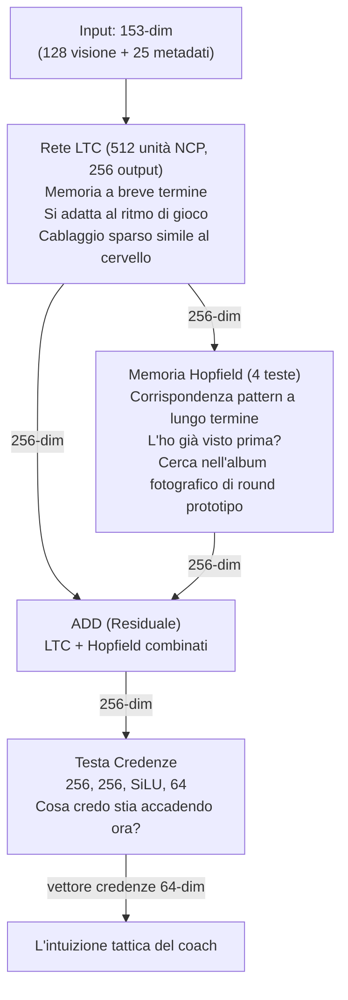

**Combinazione residua:** `combined_state = ltc_out + hopfield_out`

> **Analogia:** La combinazione residua è come **chiedere a due consulenti e sommare le loro opinioni**. Il LTC dice "in base a quanto appena accaduto, penso X". L'Hopfield dice "in base al mio ricordo di situazioni simili, penso Y". Invece di sceglierne una, il sistema somma entrambe le opinioni: in questo modo, sia gli eventi recenti che gli schemi storici contribuiscono alla comprensione finale.

**Testo di convinzione:** `Lineare(256→256) → SiLU → Lineare(256→64)` — produce un vettore di convinzione a 64 dimensioni che codifica la comprensione tattica latente dell'allenatore.

**Passaggio in avanti:**

```python
ltc_out, hidden = self.ltc(x, hidden) # x: [B, seq, 153] → [B, seq, 256]
mem_out = self.hopfield(ltc_out) # [B, seq, 256]
combined_state = ltc_out + mem_out # Residuo
belief = self.belief_head(combined_state) # [B, seq, 64]
return combined_state, belief, hidden
```

### -Livello Strategia (`strategy.py`) — Sovrapposizione + MoE

Implementa **SuperpositionLayer** combinato con un mix di esperti contestualizzati:

> **Analogia:** Il Livello Strategia è come una **sala di guerra con 4 generali specializzati**, ognuno esperto in un diverso tipo di situazione. Un generale è bravo nelle spinte aggressive, un altro nelle prese difensive, un altro nelle giocate di utilità e un altro ancora nelle rotazioni. Un "guardiano" (il "gate" softmax) ascolta la situazione attuale e decide quanto fidarsi di ciascun generale: "Siamo in un round eco su Dust2? Il Generale 2 (specialista difensivo) ottiene il 60% del potere, il Generale 4 (utilità) il 30% e gli altri si dividono il resto". Il **Livello di Superposizione** è l'ingrediente segreto: consente a ciascun generale di adattare il proprio pensiero in base al contesto di gioco attuale (mappa, economia, fazione) utilizzando un meccanismo di controllo intelligente.

**SuperpositionLayers** (`layers/superposition.py`): controllo dipendente dal contesto dove `output = F.linear(x, weight, bias) * sigmoid(context_gate(context))`. Un vettore di gate sigmoide condizionato sul contesto **25-dim** (METADATA_DIM completo) maschera selettivamente gli output degli esperti. La perdita di sparsità L1 (`context_gate_l1_weight = 1e-4`) incoraggia un gating sparso e interpretabile. Osservabile: le statistiche del gate (media, standard, sparsità, active_ratio) possono essere tracciate.

> **Nota:** `RAPStrategy.__init__` utilizza `context_dim=25` (METADATA_DIM). La rete di gate è `Linear(hidden_dim=256, num_experts=4) → Softmax(dim=-1)`.

> **Analogia:** Il livello di sovrapposizione è come un **interruttore dimmer per ogni neurone**. Invece di avere ogni neurone sempre completamente acceso, un gate dipendente dal contesto (controllato dalle 25 caratteristiche dei metadati) può attenuare o aumentare la luminosità di ciascuno di essi. Se il contesto dice "questo è un round eco", alcuni neuroni vengono attenuati (non sono rilevanti per i round eco), mentre altri vengono aumentati. La perdita di sparsità L1 è come dire al sistema: "Cerca di usare il minor numero possibile di neuroni: più semplice è la tua spiegazione, meglio è". Questo rende il modello più interpretabile: puoi effettivamente vedere quali gate si attivano in quali situazioni.

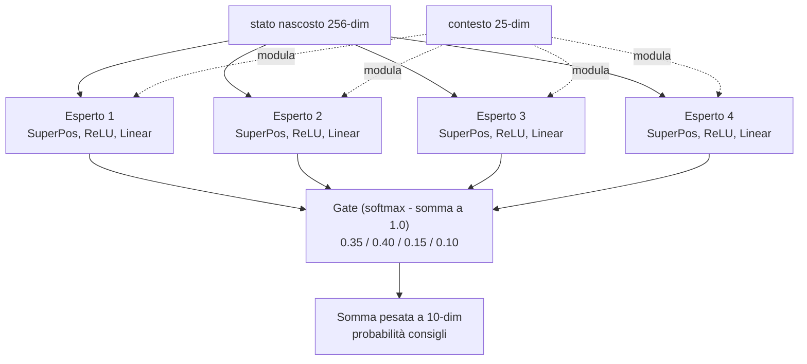

**4 Moduli Esperti:** Ogni esperto è un `ModuleDict`: `SuperpositionLayer(256→128, context_dim=25) → ReLU → Linear(128→10)`.

**Gate Network:** `Linear(256→4) → Softmax`.

**Output:** Distribuzione di probabilità di consulenza a 10 dimensioni e vettore dei pesi di gate a 4 dimensioni.

### -Livello Pedagogico (`pedagogy.py`) — Valore + Attribuzione

Due sottomoduli:

1. **Value Critic:** `Linear(256→64) → ReLU → Linear(64→1)`. Stima V(s) per l'apprendimento con differenze temporali. **Skill Adapter:** `Linear(10 skill_buckets → 256)` consente stime di valore condizionate dalle abilità.

> **Analogia:** Il Value Critic è come un **commentatore sportivo** che, in qualsiasi momento durante una partita, può dire "In questo momento, questa squadra ha un vantaggio del 72%". Stima V(s) — il "valore" dello stato attuale della partita. L'**Skill Adapter** adatta questa stima in base al livello di abilità del giocatore: un principiante nella stessa posizione di un professionista affronta probabilità molto diverse, quindi la previsione del valore dovrebbe riflettere questo.

1. **CausalAttributor:** Produce un vettore di attribuzione a 5 dimensioni che mappa i concetti di allenamento:

| Indice | Concetto                            | Segnale meccanico                          |
| ------ | ----------------------------------- | ------------------------------------------ |
| 0      | **Posizionamento**            | norm(position_delta)                       |
| 1      | **Posizionamento del mirino** | norm(view_delta)                           |
| 2      | **Aggressione**               | 0,5 × position_delta                      |
| 3      | **Utilità**                  | `sigmoid(hidden.mean())` — segnale **appreso e dipendente dal contesto**: produce un'attivazione alta quando la rete rileva situazioni dove l'uso dell'utilità era rilevante, bassa quando il contesto tattico rende l'utilità secondaria. Non è un placeholder statico, ma una funzione non-lineare dello stato nascosto che si adatta durante l'addestramento |
| 4      | **Rotazione**                 | 0,8 × position_delta                      |

Fusione: `attribuzione = context_weights × mechanical_errors` dove context_weights deriva da `Lineare(256→32) → ReLU → Lineare(32→5) → Sigmoide`.

> **Analogia:** L'attributore causale è il modo in cui l'allenatore risponde alla domanda **"PERCHÉ è andato storto?"** Invece di dire semplicemente "sei morto", suddivide la colpa in 5 categorie, come una pagella scolastica con 5 materie. "Sei morto perché: 45% posizionamento errato, 30% utilizzo inadeguato delle utilità, 15% posizionamento errato del mirino, 5% troppo aggressivo, 5% rotazione errata." Lo fa combinando due segnali: (1) ciò che lo stato nascosto della rete neurale ritiene importante (context_weights, l'intuizione del cervello) e (2) errori meccanici misurabili (quanto lontano dalla posizione ottimale, quanto errato era l'angolo di visione). Moltiplicandoli insieme si ottiene un'attribuzione di colpa basata sia sui dati che sull'intuizione.

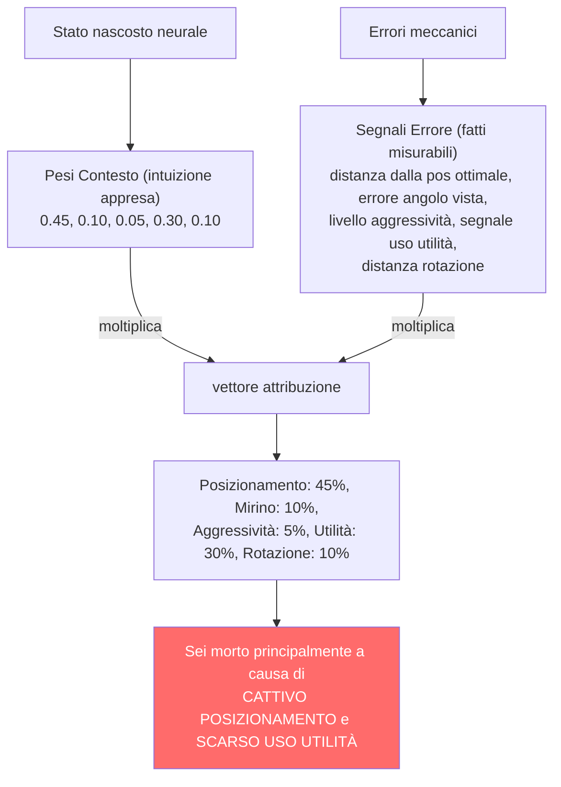

### -Modello latente delle abilità (`skill_model.py`)

Scompone le statistiche grezze in 5 assi delle abilità utilizzando la normalizzazione statistica rispetto alle linee di base dei professionisti:

| Asse delle abilità      | Statistiche di input                                                    | Normalizzazione                       |
| ------------------------ | ----------------------------------------------------------------------- | ------------------------------------- |
| **Meccaniche**     | Precisione, avg_hs                                                      | Punteggio Z (μ=pro_mean, σ=pro_std) |
| **Posizionamento** | Valutazione_sopravvivenza, valutazione_kast                             | Punteggio Z                           |
| **Utilità**       | Utility_blind_time, Utility_nemici_accecati                             | Punteggio Z                           |
| **Tempistica**     | Percentuale_vittorie_duello_apertura, Punteggio_aggressione_posizionale | Punteggio Z                           |
| **Decisione**      | Percentuale_vittorie_clutch, Impatto_valutazione                        | Punteggio Z                           |

> **Analogia:** Il modello di abilità crea una **pagella di 5 materie** per ogni giocatore. Ogni materia (Meccanica, Posizionamento, Utilità, Tempismo, Decisione) viene valutata confrontando il giocatore con i professionisti. Il punteggio Z è come chiedere: "Quanto è sopra o sotto la media della classe questo studente?". Un punteggio Z pari a 0 significa "esattamente nella media tra i professionisti". Un punteggio Z pari a -2 significa "molto al di sotto della media - necessita di un duro lavoro". Un punteggio Z pari a +1 significa "sopra la media - sta andando bene". Il sistema converte quindi i punteggi Z in percentili (la percentuale di professionisti in cui sei migliore) e li associa a un livello curriculare da 1 a 10, come i voti scolastici. Uno studente di livello 1 riceve un allenamento adatto ai principianti; uno studente di livello 10 riceve un'analisi tattica avanzata.

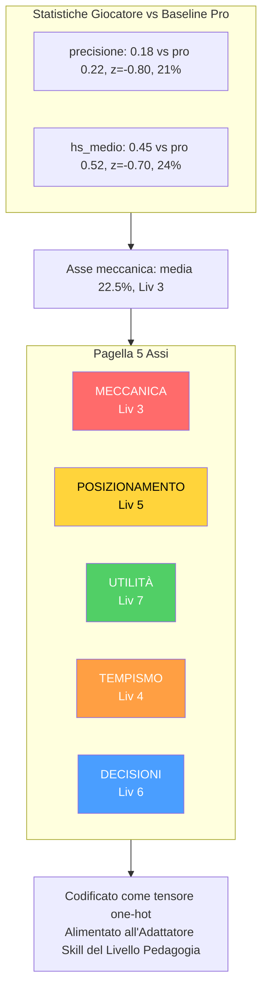

I punteggi Z vengono convertiti in percentili tramite l'**approssimazione logistica** `1/(1+exp(-1,702z))` (approssimazione CDF rapida), quindi il percentile medio viene mappato a un **livello curriculare** (1–10) tramite `int(avg_skill * 9) + 1`, fissato a [1, 10]. Il livello viene codificato come un tensore one-hot (10-dim) tramite `SkillLatentModel.get_skill_tensor()` per l'adattatore di competenze del livello pedagogico.

### -RAP Trainer (`trainer.py`)

Orchestra il ciclo di addestramento con una **funzione di perdita composita**:

```
L_totale = L_strategia + 0,5 × L_valore + L_sparsità + L_posizione
```

> **Analogia:** La perdita totale è come una **pagella con 4 voti**, ognuno dei quali misura un aspetto diverso delle prestazioni del modello. Il modello cerca di rendere TUTTI e quattro i voti il più bassi possibile (nell'apprendimento automatico, una perdita minore = prestazioni migliori). I pesi (1,0, 0,5, 1e-4, 1,0) indicano l'importance di ogni materia: Strategia e Posizione sono materie a punteggio pieno, Valore è mezzo credito e Scarsità è un credito extra. Il modello non può semplicemente superare una materia e bocciare le altre: deve bilanciarle tutte e quattro.

| Termine di perdita | Formula                                                   | Peso | Scopo                                                            |
| ------------------ | --------------------------------------------------------- | ---- | ---------------------------------------------------------------- |
| `L_strategy`     | `MSELoss(advice_probs, target_strat)`                   | 1.0  | Raccomandazione tattica corretta                                 |
| `L_value`        | `MSELoss(V(s), true_advantage)`                         | 0.5  | Stima accurata del vantaggio                                     |
| `L_sparsity`     | `model.compute_sparsity_loss(gate_weights)` — L1 sui pesi dei gate (parametro esplicito, thread-safe) | 1e-4 | Specializzazione esperta                                         |
| `L_position`     | `MSE(pred_xy, true_xy) + 2.0 × MSE(pred_z, true_z)`    | 1.0  | Posizionamento ottimale,**penalità rigorosa sull'asse Z** |

> **Nota:** Il moltiplicatore 2× sull'asse Z esiste perché gli errori di posizionamento verticale (ad esempio, un livello sbagliato su Nuke/Vertigo) sono tatticamente catastrofici: rappresentano errori di piano sbagliato che nessuna correzione orizzontale può correggere.

> **Analogia:** La penalità sull'asse Z è come un **allarme antincendio per errori di piano sbagliato**. Nelle mappe di CS2 come Nuke (che ha due piani) o Vertigo (un grattacielo), dire a un giocatore di andare al piano sbagliato è un disastro: è come dire a qualcuno di andare in cucina quando intendevi la soffitta. Essere leggermente fuori posizione orizzontale (X/Y) è come essere qualche passo a sinistra o a destra: non eccezionale, ma risolvibile. Essere al piano sbagliato (Z) è come essere in una stanza completamente diversa. Ecco perché gli errori verticali vengono puniti 2 volte più duramente durante l'addestramento: il modello impara rapidamente a "NON suggerire MAI il piano sbagliato".

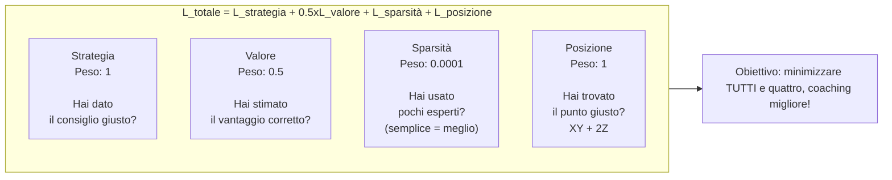

**Output per fase di addestramento:** `{loss, sparsity_ratio, loss_pos, z_error}`.

### -Riepilogo del passaggio in avanti di RAPCoachModel

**Firma:** `forward(view_frame, map_frame, motion_diff, metadata, skill_vec=None, hidden_state=None)` — il parametro `hidden_state` (NN-40) permette di passare lo stato ricorrente della memoria da una chiamata all'altra, abilitando **inferenza continua** senza cold-start: il GhostEngine può mantenere la memoria tra tick consecutivi anziché ripartire da zero ad ogni valutazione.

**Fix NN-39 — Input Visivi Duali:** Il passaggio in avanti gestisce due formati di input visivo attraverso un controllo dimensionale esplicito:

| Formato Input | Shape | Quando si usa | Comportamento |
|---|---|---|---|
| **Per-timestep** | `[B, T, C, H, W]` (5-dim) | Addestramento con sequenze temporali | Ogni timestep elaborato individualmente dalla CNN |
| **Statico** | `[B, C, H, W]` (4-dim) | Inferenza in tempo reale (GhostEngine) | Singolo frame espanso su tutti i timestep |

> **Analogia NN-39:** Immagina di mostrare un filmato al coach. Nel formato **per-timestep**, il coach guarda ogni fotogramma uno per uno, analizzandoli separatamente e costruendo una comprensione che evolve nel tempo — come un arbitro che rivede un'azione al rallentatore, fotogramma per fotogramma. Nel formato **statico**, il coach vede una singola fotografia della situazione e assume che la scena sia rimasta invariata per tutta la durata — come quando si analizza una posizione da una screenshot. Il fix NN-39 garantisce che entrambe le situazioni producano lo stesso formato di output (`[B, T, 128]`), così il resto del cervello (memoria, strategia, pedagogia) funziona identicamente in entrambi i casi.

```python
def forward(view_frame, map_frame, motion_diff, metadata, skill_vec=None):
    batch_size, seq_len, _ = metadata.shape

    # NN-39 fix: supporta input visivo per-timestep [B,T,C,H,W] e statico [B,C,H,W]
    if view_frame.dim() == 5:
        # Per-timestep — elabora ogni timestep attraverso la CNN separatamente
        z_frames = []
        for t in range(view_frame.shape[1]):
            z_t = self.perception(view_frame[:, t], map_frame[:, t], motion_diff[:, t])
            z_frames.append(z_t)
        z_spatial_seq = torch.stack(z_frames, dim=1)      # [B, T, 128]
    else:
        # Statico — singolo frame espanso su tutti i timestep
        z_spatial = self.perception(view_frame, map_frame, motion_diff)  # [B, 128]
        z_spatial_seq = z_spatial.unsqueeze(1).expand(-1, seq_len, -1)   # [B, T, 128]

    lstm_in = cat([z_spatial_seq, metadata], dim=2)        # [B, seq, 153]
    hidden_seq, belief, new_hidden = self.memory(lstm_in, hidden=hidden_state)  # [B, seq, 256], [B, seq, 64]
    last_hidden = hidden_seq[:, -1, :]
    prediction, gate_weights = self.strategy(last_hidden, context)  # [B, 10], [B, 4]
    value_v = self.pedagogy(last_hidden, skill_vec)        # [B, 1]
    optimal_pos = self.position_head(last_hidden)          # [B, 3]
    attribution = self.attributor.diagnose(last_hidden, optimal_pos) # [B, 5]
    return {
        "advice_probs": prediction,      # [B, 10]
        "belief_state": belief,          # [B, seq, 64]
        "value_estimate": value_v,       # [B, 1]
        "gate_weights": gate_weights,    # [B, 4]
        "optimal_pos": optimal_pos,      # [B, 3]
        "attribution": attribution,      # [B, 5]
        "hidden_state": new_hidden,      # NN-40: stato ricorrente per inferenza continua
    }
```

> **Analogia:** Questa è la **ricetta completa** di come pensa il RAP Coach, passo dopo passo: (1) **Occhi** — il livello Percezione esamina la vista, la mappa e le immagini in movimento e crea un riepilogo di 128 numeri di ciò che vede. Il fix NN-39 permette due modalità: se riceve un filmato (5-dim), elabora ogni fotogramma separatamente; se riceve una foto (4-dim), la replica su tutti i timestep. (2) Questo riepilogo visivo viene combinato con 25 numeri di metadati (salute, posizione, economia, ecc.) per formare una descrizione di 153 numeri. (3) **Memoria** — la memoria LTC + Hopfield elabora la descrizione nel tempo, producendo uno stato nascosto di 256 numeri e un vettore di credenze di 64 numeri ("cosa penso stia accadendo"). (4) **Strategia** — 4 esperti esaminano lo stato nascosto e producono 10 probabilità di consiglio ("40% di probabilità che tu debba spingere, 30% di tenere premuto, ecc."). (5) **Insegnante** — il livello pedagogico stima "quanto è buona questa situazione?" (valore). (6) **GPS** — la testa di posizione prevede dove dovresti muoverti (coordinate 3D). (7) **Colpa** — l'attributore capisce perché le cose sono andate male (5 categorie). Tutti e **7** gli output vengono restituiti insieme come un dizionario: l'analisi completa dell'allenamento per un momento di gioco. Il settimo output, `hidden_state` (NN-40), è lo stato ricorrente della memoria — permette al GhostEngine di mantenere la "memoria" tra tick consecutivi, come un coach che non dimentica cosa è successo 5 secondi fa quando valuta la posizione attuale.

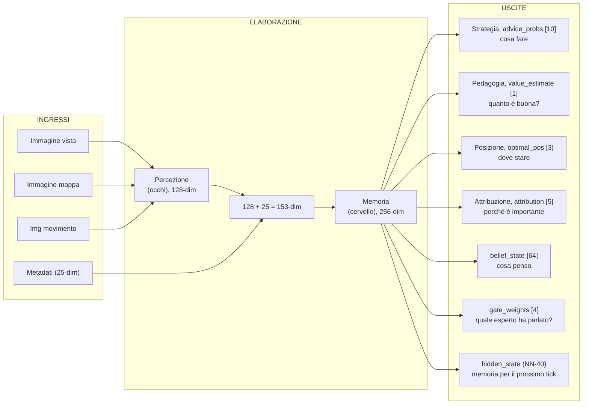

### -ChronovisorScanner (`chronovisor_scanner.py`)

Un **modulo di elaborazione del segnale multi-scala** che identifica i momenti critici nelle partite analizzando i delta di vantaggio temporale su **3 livelli di risoluzione** (micro, standard, macro):

> **Analogia:** Il Chronovisor è come un **rilevatore di momenti salienti con 3 lenti di ingrandimento**. La lente **micro** (sotto-secondo) cattura decisioni istantanee negli scontri a fuoco — come un arbitro che rivede un'azione al rallentatore. La lente **standard** (livello ingaggio) individua i momenti critici come giocate decisive o errori fatali — come il replay principale della partita. La lente **macro** (strategica) rileva cambiamenti di strategia che si sviluppano su 5-10 secondi — come l'analisi tattica del commentatore. Funziona monitorando il vantaggio della squadra nel tempo (come un grafico del prezzo di un'azione) e cercando picchi o crolli improvvisi a ciascuna scala. Invece di guardare l'intera partita di 45 minuti, il giocatore può passare direttamente ai momenti critici più significativi.

**Configurazione Multi-Scala (`ANALYSIS_SCALES`):**

| Scala | Window (tick) | Lag | Soglia | Descrizione |
| ----- | ------------- | --- | ------ | ----------- |
| **Micro** | 64 | 16 | 0.10 | Decisioni di ingaggio sotto-secondo |
| **Standard** | 192 | 64 | 0.15 | Momenti critici a livello di ingaggio |
| **Macro** | 640 | 128 | 0.20 | Rilevamento cambiamenti strategici (5-10 secondi) |

> **Analogia della multi-scala:** Le tre scale sono come **tre diversi zoom su Google Maps**: la scala micro è il livello strada (puoi vedere ogni dettaglio di un incrocio), la scala standard è il livello quartiere (vedi la struttura generale della zona), la scala macro è il livello città (vedi come i quartieri si collegano tra loro). Un giocatore può avere una micro-decisione sbagliata (un peek troppo lento) che non appare nelle scale più grandi, o un cambiamento strategico macro (rotazione tardiva) che non è visibile nella micro-analisi. Utilizzando tutte e tre contemporaneamente, il coach cattura sia gli errori istantanei che le scelte strategiche errate.

**Pipeline di rilevamento (per ciascuna scala):**

1. Utilizza il modello RAP addestrato per prevedere V(s) per ogni tick window.
2. Calcola i delta utilizzando il lag configurato per la scala: `deltas = values[LAG:] - values[:-LAG]`.
3. Rileva i **picchi** in cui `|delta| > soglia` (variabile per scala: 0.10/0.15/0.20).
4. Cerca il picco all'interno della finestra configurata, mantenendo la coerenza del segno.
5. La **soppressione non massima** impedisce rilevamenti duplicati.
6. Classifica ogni picco come **"gioco"** (gradiente positivo, vantaggio acquisito) o **"errore"** (negativo, vantaggio perso).
7. Restituisce istanze della classe di dati `CriticalMoment` con `(match_id, start_tick, peak_tick, end_tick, severity [0-1], type, description, scale)`.

**Limite di sicurezza tick (F3-21):** `_MAX_TICKS_PER_SCAN = 50.000` — le partite con più di 50K tick (possibile con overtime estesi o match molto lunghi) vengono **troncate** con un warning (NN-CV-02) anziché saturare la RAM. Il sistema preleva `_MAX_TICKS_PER_SCAN + 1` tick per rilevare la troncatura e avvisa che i momenti critici della fase finale della partita potrebbero essere persi.

**Deduplicazione cross-scala:** Quando lo stesso momento viene rilevato a scale diverse (es. un peek critico visibile sia nella scala micro che standard), la deduplicazione assegna priorità **micro > standard > macro** (la scala più fine vince). `MIN_GAP_TICKS = 64` (~1 secondo) definisce la distanza minima tra due momenti: se due picchi sono più vicini di 64 tick, vengono considerati lo stesso evento e viene mantenuto solo quello a scala più fine.

**Etichette di severità:** La severità (0-1) viene classificata automaticamente per il `MatchVisualizer`:
- `severity > 0.3` → **"critical"** (momento che cambia la partita)
- `severity > 0.15` → **"significant"** (momento rilevante)
- altrimenti → **"notable"** (momento degno di nota)

**`ScanResult` dataclass:** Tipo di ritorno strutturato che distingue successo da fallimento:

| Campo | Tipo | Descrizione |
|---|---|---|
| `critical_moments` | `List[CriticalMoment]` | Momenti critici rilevati |
| `success` | `bool` | True se la scansione è completata (anche con 0 momenti) |
| `error_message` | `Optional[str]` | Dettaglio errore se `success=False` |
| `model_loaded` | `bool` | Se il modello RAP era disponibile |
| `ticks_analyzed` | `int` | Numero di tick effettivamente analizzati |

Proprietà di utilità: `is_empty_success` (scansione riuscita ma nessun momento critico trovato), `is_failure` (scansione fallita — modello non caricato, errore DB, ecc.).

> **Analogia della pipeline:** Ecco la procedura passo dopo passo: (1) Il modello RAP osserva ogni momento e assegna un "punteggio di vantaggio" (come un cardiofrequenzimetro). (2) Per ciascuna delle 3 scale, confronta ogni momento con ciò che è accaduto N tick prima (16, 64 o 128 tick a seconda della scala) — "le cose sono migliorate o peggiorate?" (3) Se il cambiamento supera la soglia della scala, si tratta di un evento significativo — come un picco di frequenza cardiaca. (4) Ingrandisce la finestra attorno al picco per trovare il momento di picco esatto. (5) Filtra i rilevamenti duplicati — se due picchi sono troppo vicini tra loro, mantiene solo quello più grande. (6) Etichetta ogni picco: "gioco" (hai fatto qualcosa di eccezionale) o "errore" (hai commesso un errore). (7) Confeziona tutto in una scheda di valutazione ordinata per ogni momento critico, con punteggi di gravità da 0 (minore) a 1 (che cambia il gioco) e la scala di rilevamento (micro/standard/macro).

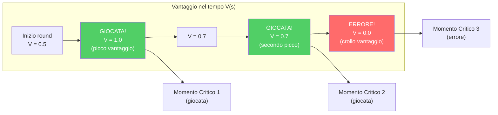

### -GhostEngine (`inference/ghost_engine.py`)

Inferenza in tempo reale per il "Ghost" — overlay della posizione ottimale del giocatore. Il GhostEngine rappresenta il **punto finale** dell'intera catena neurale: è dove il RAP Coach Model produce output visibili all'utente sotto forma di un "giocatore fantasma" sulla mappa tattica.

> **Analogia:** Il Ghost Engine è come un **ologramma "migliore te"** sullo schermo. In ogni momento durante la riproduzione, chiede al RAP Coach: "Data questa situazione esatta, dove DOVREBBE trovarsi il giocatore?" La risposta è un piccolo delta di posizione (ad esempio "5 pixel a destra e 3 pixel in alto"), che viene ridimensionato alle coordinate reali della mappa. Il risultato è un giocatore "fantasma" trasparente visualizzato sulla mappa tattica, che mostra la posizione ottimale. Se il fantasma è lontano da dove ti trovavi effettivamente, sai di essere in una brutta posizione. Se è vicino, ti sei posizionato bene.

**Pipeline di Inferenza 4-Tensori con PlayerKnowledge:**

La pipeline di inferenza opera in 5 fasi sequenziali per ogni tick di riproduzione:

**Fase 1 — Caricamento Modello (`_load_brain()`)**
- Verifica `USE_RAP_MODEL` da configurazione (interruttore generale)
- `ModelFactory.get_model(ModelFactory.TYPE_RAP)` — istanzia il modello RAP
- `load_nn(checkpoint_name, model)` — carica i pesi dal checkpoint su disco
- `model.to(device)` → `model.eval()` — sposta su GPU/CPU e attiva modalità inferenza
- In caso di fallimento: `model = None`, `is_trained = False` — disabilita previsioni

**Fase 2 — Costruzione Tensori di Input**

| Tensore | Metodo | Shape Output | Contenuto |
|---|---|---|---|
| **Map** | `tensor_factory.generate_map_tensor(ticks, map_name, knowledge)` | `[1, 3, 64, 64]` | Posizioni compagni, nemici visibili, utilità + bomba |
| **View** | `tensor_factory.generate_view_tensor(ticks, map_name, knowledge)` | `[1, 3, 64, 64]` | Maschera FOV 90°, entità visibili, zone utilità |
| **Motion** | `tensor_factory.generate_motion_tensor(ticks, map_name)` | `[1, 3, 64, 64]` | Traiettoria 32 tick, campo velocità, delta mirino |
| **Metadata** | `FeatureExtractor.extract(tick_data, map_name, context)` | `[1, 1, 25]` | Vettore canonico 25-dim (salute, posizione, economia, ecc.) |

Il **ponte PlayerKnowledge** (`_build_knowledge_from_game_state()`) filtra i dati secondo il principio NO-WALLHACK: solo le informazioni legittimamente disponibili al giocatore (compagni, nemici visibili, ultime posizioni note con decadimento) vengono codificate nei tensori mappa e vista. Se la costruzione della conoscenza fallisce, il sistema degrada alla modalità legacy (tensori vuoti).

**Fase 2b — Modalità POV (R4-04-01):**

| Modalità | Condizione | Comportamento |
|---|---|---|
| **POV Mode** | `USE_POV_TENSORS=True` + `game_state` fornito | Costruisce `PlayerKnowledge` dal game state → tensori POV con semantica canale dedicata |
| **Legacy Mode** | `USE_POV_TENSORS=False` (default) | Tensori standard allineati con i dati di addestramento |

> **Attenzione (R4-04-01):** I tensori POV utilizzano una semantica dei canali diversa (Ch0=compagni, Ch1=nemici ultimi noti) rispetto ai dati di addestramento standard (Ch0=nemici, Ch1=compagni). Usare tensori POV con un modello addestrato in modalità legacy produrrà risultati **inaffidabili**. La modalità POV è valida solo se il modello è stato addestrato con dati POV.

**Fase 3 — Inferenza Neurale**
```python
with torch.no_grad():
    out = self.model(view_frame=view_t, map_frame=map_t,
                     motion_diff=motion_t, metadata=meta_t,
                     hidden_state=self._last_hidden)  # NN-40: stato persistente
self._last_hidden = out["hidden_state"]  # Mantieni per il prossimo tick
```
`torch.no_grad()` disabilita il calcolo dei gradienti (solo inferenza, nessun addestramento). Il parametro `hidden_state` (NN-40) permette di mantenere lo stato ricorrente della memoria tra tick consecutivi, evitando il cold-start ad ogni valutazione.

**Fase 4 — Decodifica e Scala Posizione**
```python
optimal_delta = out["optimal_pos"].cpu().numpy()[0]    # [dx, dy, dz]
ghost_x = current_x + (optimal_delta[0] * RAP_POSITION_SCALE)  # × 500.0
ghost_y = current_y + (optimal_delta[1] * RAP_POSITION_SCALE)  # × 500.0
return (ghost_x, ghost_y)
```
Il modello produce un delta normalizzato in [-1, 1] che viene scalato a coordinate mondo tramite `RAP_POSITION_SCALE = 500.0` (da `config.py`). La costante è condivisa tra GhostEngine e overlay per garantire coerenza.

**Fase 5 — Fallback Graduale (5 modalità)**

| Modalità Fallback | Condizione | Comportamento |
|---|---|---|
| **Modello disabilitato** | `USE_RAP_MODEL=False` | Skip caricamento, ritorna `(0.0, 0.0)` |
| **Checkpoint mancante** | Addestramento non completato | `model = None`, previsioni disabilitate |
| **Nome mappa mancante** | Nessun contesto spaziale | Ritorna `(0.0, 0.0)` immediatamente |
| **Errore PlayerKnowledge** | Costruzione conoscenza fallita | Degrada a tensori legacy (tutti zeri) |
| **Errore di inferenza** | RuntimeError / CUDA OOM | Log errore, ritorna `(0.0, 0.0)` |

> **Analogia del fallback:** Il fallback è come un GPS con 5 livelli di sicurezza: (1) "Modalità offline — non ho mappe caricate", (2) "Non ho mai imparato a navigare questa zona", (3) "Non so nemmeno in quale città siamo", (4) "So dove siamo ma non posso vedere intorno a noi — guido a memoria", (5) "Si è rotto qualcosa — ti dico semplicemente di restare dove sei". In ogni caso, il GPS **non manda mai l'auto contro un muro** — la risposta peggiore possibile è "resta fermo" (`(0.0, 0.0)`), che è infinitamente meglio di un crash dell'applicazione.

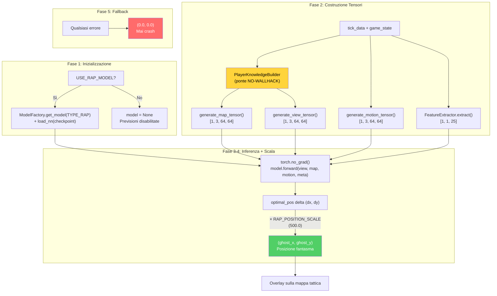

---

## 5. Sottosistema 1B — Sorgenti Dati

**Cartella nel programma:** `backend/data_sources/`
**File:** `demo_parser.py`, `demo_format_adapter.py`, `event_registry.py`, `trade_kill_detector.py`, `hltv_scraper.py`, `hltv_metadata.py`, `steam_api.py`, `steam_demo_finder.py`, `faceit_api.py`, `faceit_integration.py`, `__init__.py`

Il sottosistema Sorgenti Dati è il **punto di ingresso di tutti i dati esterni** nel sistema. Raccoglie informazioni da 5 fonti distinte: file demo CS2, statistiche HLTV, profili Steam, dati FACEIT e registry eventi di gioco.

> **Analogia:** Le Sorgenti Dati sono come i **5 sensi** del coach AI. L'occhio principale (demo parser) guarda le registrazioni delle partite frame per frame. L'orecchio (HLTV scraper) ascolta le notizie dal mondo professionistico. Il tatto (Steam API) sente il profilo e la storia del giocatore. Il gusto (FACEIT) assaggia il livello competitivo del giocatore. Il sesto senso (event registry) cataloga sistematicamente ogni tipo di evento che il gioco può produrre. Senza questi sensi, il coach sarebbe cieco e sordo — incapace di imparare qualsiasi cosa.

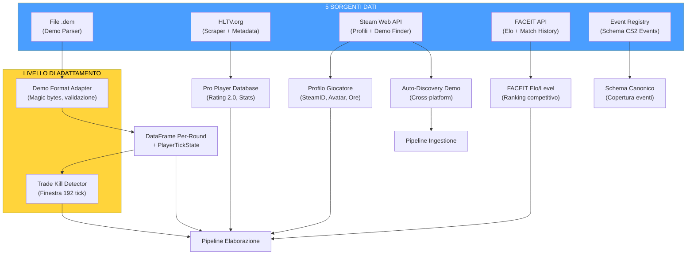

### -Demo Parser (`demo_parser.py`)

Wrapper robusto attorno alla libreria `demoparser2` per l'estrazione di statistiche da file demo CS2.

**Baseline HLTV 2.0** — costanti di normalizzazione per il calcolo del rating:

| Costante | Valore | Significato |
|---|---|---|
| `RATING_BASELINE_KPR` | 0.679 | Media pro: uccisioni per round |
| `RATING_BASELINE_SURVIVAL` | 0.317 | Media pro: tasso di sopravvivenza |
| `RATING_BASELINE_KAST` | 0.70 | Media pro: Kill/Assist/Survive/Trade % |
| `RATING_BASELINE_ADR` | 73.3 | Media pro: danno medio per round |
| `RATING_BASELINE_ECON` | 85.0 | Media pro: efficienza economica |

**`parse_demo(demo_path, target_player=None)`:** Entry point principale. Validazione di esistenza file, parsing eventi `round_end` per contare i round, poi estrazione statistica completa via `_extract_stats_with_full_fields()`. Restituisce `pd.DataFrame` vuoto in caso di qualsiasi errore (fail-safe).

**`_extract_stats_with_full_fields(parser, total_rounds, target_player)`:** Calcola tutte le 25 feature aggregate obbligatorie per il database:
- Statistiche base: `avg_kills`, `avg_deaths`, `avg_adr`, `kd_ratio`
- Varianza: `kill_std`, `adr_std` (via `_compute_per_round_variance`)
- Statistiche avanzate: `avg_hs`, `accuracy`, `impact_rounds`, `econ_rating`
- Rating HLTV 2.0 approssimato (approssimazione hand-tuned, non formula ufficiale)

> **Analogia:** Il Demo Parser è come un **cronista sportivo esperto** che guarda la registrazione di una partita e compila una pagella dettagliata per ogni giocatore. Non si limita a contare le uccisioni: calcola il danno per round, la percentuale di headshot, l'efficienza economica e persino quanto sono consistenti le prestazioni (deviazione standard). Se la registrazione è corrotta o mancano dati, il cronista scrive "nessun dato disponibile" invece di inventare numeri — è la politica di tolleranza zero alla fabbricazione di dati del progetto.

### -Demo Format Adapter (`demo_format_adapter.py`)

Livello di resilienza per la gestione di versioni diverse del formato demo CS2.

**Costanti di validazione:**

| Costante | Valore | Descrizione |
|---|---|---|
| `DEMO_MAGIC_V2` | `b"PBDEMS2\x00"` | Magic bytes CS2 (Source 2 Protobuf) |
| `DEMO_MAGIC_LEGACY` | `b"HL2DEMO\x00"` | Magic bytes CS:GO legacy (non supportato) |
| `MIN_DEMO_SIZE` | 10 × 1024² (10 MB) | DS-12: demo CS2 reali sono 50+ MB, file più piccoli sono certamente corrotti o incompleti |
| `MAX_DEMO_SIZE` | 5 × 1024³ (5 GB) | Cap di sicurezza |

**Dataclass:**
- `FormatVersion(name, magic, description, supported)` — specifica una versione nota del formato
- `ProtoChange(date, description, affected_events, migration_notes)` — record di un cambiamento protobuf noto

**`FORMAT_VERSIONS`:** Dizionario con due formati conosciuti (`cs2_protobuf` supportato, `csgo_legacy` non supportato).

**`PROTO_CHANGELOG`:** Lista cronologica dei cambiamenti noti al formato protobuf CS2 (per resilienza ai futuri aggiornamenti).

**`DemoFormatAdapter.validate_demo(path)`:** Validazione a 3 fasi: (1) esistenza e dimensioni entro bounds, (2) lettura magic bytes per identificazione formato, (3) verifica supporto del formato rilevato.

> **Analogia:** Il Demo Format Adapter è come un **doganiere all'aeroporto** che controlla ogni "pacco" (file demo) prima di farlo entrare nel sistema. Controlla: (1) "Il pacco è della giusta dimensione?" (non troppo piccolo = corrotto, non troppo grande = potenziale bomba), (2) "Ha il timbro giusto?" (magic bytes PBDEMS2 = CS2, HL2DEMO = CS:GO vecchio), (3) "Accettiamo pacchi da questo paese?" (CS2 sì, CS:GO no). Se qualcosa non quadra, il pacco viene respinto con un messaggio chiaro sul motivo. Questo impedisce a file corrotti o del formato sbagliato di entrare nella pipeline e causare errori misteriosi a valle.

### -Event Registry (`event_registry.py`)

Registro canonico di **tutti gli eventi di gioco CS2** derivato dai dump SteamDatabase.

**`GameEventSpec`** dataclass con 7 campi: `name`, `category` (round/combat/utility/economy/movement/meta), `fields` (dict campo→tipo), `priority` (critical/standard/optional), `implemented` (bool), `handler_path` (opzionale), `notes`.

**Categorie di eventi registrati:**

| Categoria | Eventi | Priorità Critica | Implementati |
|---|---|---|---|
| **Round** | `round_end`, `round_start`, `round_freeze_end`, `round_mvp`, `begin_new_match` | `round_end` | 1/5 |
| **Combat** | `player_death`, `player_hurt`, `player_blind`, etc. | `player_death` | parziale |
| **Utility** | `flashbang_detonate`, `hegrenade_detonate`, `smokegrenade_expired`, etc. | — | parziale |
| **Economy** | `item_purchase`, `bomb_planted`, `bomb_defused`, etc. | `bomb_planted/defused` | parziale |
| **Movement** | `player_footstep`, `player_jump`, etc. | — | no |
| **Meta** | `player_connect`, `player_disconnect`, etc. | — | no |

**Funzioni di utility:** `get_implemented_events()` → lista eventi implementati. `get_coverage_report()` → rapporto copertura per categoria.

> **Nota (F6-33):** I `handler_path` non sono validati a runtime — se i moduli gestori vengono spostati, i riferimenti diventano silenziosamente obsoleti. Aggiungere validazione `hasattr/callable` al dispatch degli eventi se l'affidabilità è critica.

> **Analogia:** L'Event Registry è come un **catalogo enciclopedico di tutti i segnali che il gioco può emettere**. Ogni segnale è classificato per categoria (combattimento, round, utilità, economia, movimento, meta), priorità (critico/standard/opzionale) e stato di implementazione. È come un catalogo di un museo: ogni opera d'arte ha una scheda con titolo, sala, artista e se è attualmente esposta. Questo permette al team di sapere esattamente quali eventi il sistema gestisce e quali mancano, pianificando l'espansione in modo sistematico.

### -Trade Kill Detector (`trade_kill_detector.py`)

Identifica i **trade kill** — uccisioni di ritorsione entro una finestra temporale — dalle sequenze di morte nel demo.

**Costante:** `TRADE_WINDOW_TICKS = 192` (3 secondi a 64 tick/sec, il tickrate standard CS2).

**`TradeKillResult`** dataclass:
- `total_kills`, `trade_kills`, `players_traded`, `trade_details`
- Proprietà calcolate: `trade_kill_ratio`, `was_traded_ratio`

**Algoritmo (derivato da cstat-main):** Per ogni uccisione K al tick T: guarda indietro nel tempo per uccisioni effettuate dalla vittima. Se la vittima ha ucciso un compagno di squadra dell'uccisore di K entro `TRADE_WINDOW_TICKS`, segna K come trade kill e la vittima originale come "was traded". **Vincolo same-round:** Le uccisioni candidate per il trade devono appartenere allo **stesso round** (`round_num` identico). I trade cross-round non vengono conteggiati — questa è una distinzione tattica importante perché un trade ha significato strategico solo all'interno dello stesso round, dove influenza direttamente l'economia numerica dello scontro.

**`build_team_roster(parser)`:** Costruisce mappatura `player_name → team_num` dai tick iniziali della partita (usa il 10° percentile dei tick per stabilità dell'assegnazione).

**`get_round_boundaries(parser)`:** Estrae i tick di confine tra round dall'evento `round_end`.

> **Analogia:** Il Trade Kill Detector è come un **analista di replay sportivo** che rivede ogni eliminazione e chiede: "Qualcuno ha vendicato questo giocatore entro 3 secondi?" Se sì, la morte è stata "scambiata" — significa che la squadra ha reagito velocemente. Un alto rapporto di trade kill indica un buon coordinamento di squadra; un basso rapporto indica giocatori isolati che muoiono senza supporto. Questa metrica è uno degli indicatori più importanti nel CS2 professionistico per valutare la disciplina posizionale e la comunicazione della squadra.

### -Steam API (`steam_api.py`)

Client per la Steam Web API con retry e backoff esponenziale.

**Costanti:** `MAX_RETRIES = 3`, `BACKOFF_DELAYS = [1, 2, 4]` secondi.

**`_request_with_retry(url, params, timeout=5)`:** Wrapper HTTP GET con 3 tentativi per errori di connessione/timeout. Non effettua retry su errori HTTP 4xx/5xx (li propaga al chiamante).

**Funzioni principali:**
- `resolve_vanity_url(vanity_url, api_key)` → risolve un URL personalizzato Steam a un SteamID a 64 bit
- `fetch_steam_profile(steam_id, api_key)` → recupera profilo giocatore (nome, avatar, ore di gioco). Auto-risolve vanity URL se l'input non è numerico

### -Steam Demo Finder (`steam_demo_finder.py`)

Auto-discovery delle demo CS2 dall'installazione Steam locale.

**`SteamDemoFinder`** classe con strategia di rilevamento a 3 livelli:

| Priorità | Metodo | Piattaforma |
|---|---|---|
| 1 | Registry Windows (`winreg`) | Windows |
| 2 | Percorsi comuni (generati dinamicamente per ogni drive) | Windows/Linux/macOS |
| 3 | Variabili d'ambiente | Tutte |

**Rilevamento drive dinamico (Windows):** Usa `windll.kernel32.GetLogicalDrives()` per enumerare tutti i drive disponibili, poi cerca `Program Files (x86)/Steam`, `Program Files/Steam`, `Steam` su ogni drive.

**`SteamNotFoundError`:** Eccezione specifica quando l'installazione Steam non può essere localizzata.

> **Nota (F6-11):** La scoperta del percorso Steam è duplicata in `ingestion/steam_locator.py` (primario). Questo modulo è supplementare (scansiona directory replay). Consolidamento differito; assicurare stessa precedenza dei percorsi quando si modifica la risoluzione.

### -Modulo HLTV (`backend/data_sources/hltv/`)

Il sottosistema HLTV è composto da 5 moduli specializzati che collaborano per estrarre statistiche professionistiche dal sito HLTV.org, superando le protezioni anti-scraping di Cloudflare:

> **Analogia:** Il modulo HLTV è come una **squadra di spionaggio ben organizzata** che raccoglie informazioni sui migliori giocatori del mondo. Il `stat_fetcher` è l'agente sul campo che sa dove trovare i dati. Il `docker_manager` prepara il veicolo blindato (FlareSolverr) per superare i posti di blocco (Cloudflare). Il `flaresolverr_client` è il conducente specializzato. Il `rate_limiter` è il cronometrista che assicura che la squadra non attiri attenzione muovendosi troppo velocemente. I `selectors` sono la mappa che indica esattamente dove trovare ogni informazione sulla pagina.

**`HLTVStatFetcher`** (`stat_fetcher.py`) — Orchestratore principale dello scraping:

| Metodo | Descrizione |
|---|---|
| `fetch_top_players()` | Scraping pagina Top 50 giocatori → lista URL profili |
| `fetch_and_save_player(url)` | Fetch completo statistiche giocatore + salvataggio DB |
| `_fetch_player_stats(url)` | Deep-crawl: pagina principale + sotto-pagine (clutch, multikill, carriera) |
| `_parse_overview(soup)` | Parsing statistiche principali (rating, KPR, ADR, ecc.) |
| `_parse_trait_sections(soup)` | Parsing sezioni Firepower, Entrying, Utility |
| `_parse_clutches(soup)` | Parsing vittorie clutch 1v1/1v2/1v3 |
| `_parse_multikills(soup)` | Parsing conteggi 3K/4K/5K |
| `_parse_career(soup)` | Parsing storico rating per anno |

**Statistiche estratte e salvate in `ProPlayerStatCard`:**

| Categoria | Statistiche |
|---|---|
| **Core** | `rating_2_0`, `kpr` (Kill/Round), `dpr` (Death/Round), `adr` (Damage/Round) |
| **Efficienza** | `kast` (Kill/Assist/Survival/Trade %), `headshot_pct`, `impact` |
| **Apertura** | `opening_kill_ratio`, `opening_duel_win_pct` |
| **Tratti (JSON)** | Firepower (kpr_win, adr_win), Entrying (traded_deaths_pct), Utility (flash_assists) |
| **Approfondimenti (JSON)** | Clutch (1on1/1on2/1on3), Multikill (3k/4k/5k), Carriera (rating per periodo) |

**`RateLimiter`** (`rate_limit.py`) — Rate limiting a 4 livelli con jitter anti-rilevamento:

| Livello | Ritardo Min–Max | Caso d'uso |
|---|---|---|
| **micro** | 2.0s – 3.5s | Richieste consecutive rapide |
| **standard** | 4.0s – 8.0s | Navigazione tra profili giocatore |
| **heavy** | 10.0s – 20.0s | Transizioni tra sezioni (principale → clutch → multikill → carriera) |
| **backoff** | 45.0s – 90.0s | Sospetto blocco o fallimento (degradazione graduale) |

> **Nota (F6-25):** Il jitter (`random.uniform(-0.5, 0.5)`) è **intenzionalmente non seminato** — un jitter deterministico verrebbe rilevato dai sistemi anti-scraping come pattern artificiale. Il pavimento minimo di 2.0s è sempre applicato.

**`DockerManager`** (`docker_manager.py`) — Gestione container FlareSolverr con strategia di avvio a cascata:
1. **Fast path:** Ritorna `True` se già in salute (health check su `http://localhost:8191/`)
2. **Docker start:** Tenta `docker start flaresolverr` (timeout 15s)
3. **Docker Compose fallback:** Tenta `docker-compose up -d` (timeout 60s)
4. **Health polling:** Verifica disponibilità ogni 3s per max 45s

**`FlareSolverrClient`** (`flaresolverr_client.py`) — Bypass automatico di Cloudflare JavaScript challenges. Tutte le richieste HTTP sono instradate attraverso FlareSolverr su `http://localhost:8191/`. L'HTML risolto viene passato a BeautifulSoup per il parsing.

**`selectors`** (`selectors.py`) — Selettori CSS per lo scraping delle pagine HLTV, centralizzati per manutenibilità.

```mermaid
flowchart LR
    subgraph FETCH["Pipeline HLTV"]
        URL["URL Giocatore<br/>hltv.org/stats/..."]
        URL --> FLARE["FlareSolverr<br/>(Docker container)<br/>Bypass Cloudflare"]
        FLARE --> HTML["HTML Risolto"]
        HTML --> BS["BeautifulSoup<br/>(selettori CSS)"]
        BS --> STATS["Statistiche Estratte<br/>rating, kpr, adr, kast..."]
    end
    subgraph RATE["Rate Limiter"]
        MICRO["micro: 2-3.5s"]
        STD["standard: 4-8s"]
        HEAVY["heavy: 10-20s"]
        BACK["backoff: 45-90s"]
    end
    subgraph SAVE["Persistenza"]
        STATS --> DB["ProPlayer + ProPlayerStatCard<br/>(hltv_metadata.db)"]
    end
    RATE -.->|"controlla ritmo"| FETCH

    style FLARE fill:#ffd43b,color:#000
    style DB fill:#4a9eff,color:#fff
```

> **Nota architetturale:** Il sottosistema HLTV completo (con `HLTVApiService`, `CircuitBreaker`, `BrowserManager`, `CacheProxy`, `collectors`) risiede in `ingestion/hltv/` ed è documentato in Part 3. I file in `data_sources/hltv/` sono l'implementazione a basso livello dello scraping e del rate limiting.

> **Stato del database HLTV (aprile 2026):** Il database `hltv_metadata.db` contiene **161 giocatori professionisti reali**, **32 team** e **156 stat card** raccolti dallo scraping live di hltv.org tramite FlareSolverr. I selettori CSS in `selectors.py` sono dotati di catene di fallback per resistere ai cambiamenti di layout del sito. Il `HybridCoachingEngine` utilizza questi dati per la selezione automatica del pro di riferimento: quando genera un'analisi, trova automaticamente il giocatore pro il cui `rating_2_0` è più vicino a quello dell'utente e lo nomina nei feedback ("la tua ADR è inferiore a quella di [nome pro]"), via `_find_best_match_pro()` in `coaching_service.py` e `_get_pro_name()` in `hybrid_engine.py`.

**`hltv_scraper.py` / `hltv_metadata.py`** (entry point in `data_sources/`):
- `run_hltv_sync_cycle(limit=20)` — Orchestratore del ciclo di sincronizzazione che importa `HLTVApiService` dalla pipeline completa
- `hltv_metadata.py` — Script di debug per salvataggio pagine via Playwright (validazione selettori CSS)

### -FACEIT API e Integrazione (`faceit_api.py`, `faceit_integration.py`)

**`faceit_api.py`:** Funzione singola `fetch_faceit_data(nickname)` che recupera Elo e Level FACEIT per un dato nickname. Richiede `FACEIT_API_KEY` dalla configurazione. Restituisce `{faceit_id, faceit_elo, faceit_level}` o dizionario vuoto in caso di errore.

**`faceit_integration.py`:** Client FACEIT completo con rate limiting:

| Parametro | Valore | Descrizione |
|---|---|---|
| `BASE_URL` | `https://open.faceit.com/data/v4` | Endpoint API FACEIT v4 |
| `RATE_LIMIT_DELAY` | 6 secondi | 10 req/min = 1 req ogni 6s (tier gratuito) |

**`FACEITIntegration`** classe con:
- `_rate_limited_request(endpoint, params)` — richieste con rate limiting automatico e backoff esponenziale su 429
- Gestione match history e download demo
- Eccezione dedicata `FACEITAPIError`

> **Analogia:** FACEIT è come un **consulente esterno** che fornisce al coach una seconda opinione sul livello del giocatore. Mentre il sistema HLTV fornisce dati sui professionisti, FACEIT fornisce il ranking competitivo del giocatore utente (Elo e Level da 1 a 10). Il rate limiting è come un **appuntamento con il consulente**: non puoi chiamare più di 10 volte al minuto, altrimenti il consulente si rifiuta di rispondere (errore 429). Il sistema rispetta automaticamente questo limite, aspettando il tempo necessario tra una richiesta e l'altra.

### -FrameBuffer — Buffer Circolare per Estrazione HUD (`backend/processing/cv_framebuffer.py`)

Il **FrameBuffer** è un buffer circolare thread-safe per la cattura e l'analisi dei frame dello schermo di gioco. Funziona come la "retina" del sistema: cattura frame dallo schermo, li memorizza in un anello di dimensione fissa e permette l'estrazione delle regioni HUD (Head-Up Display) per l'analisi visiva.

> **Analogia:** Il FrameBuffer è come un **registratore a nastro circolare** in una sala di sorveglianza. La telecamera (lo schermo di gioco) registra continuamente, ma il nastro ha solo spazio per 30 fotogrammi — quando è pieno, i nuovi fotogrammi sovrascrivono i più vecchi. Il guardiano (il sistema di analisi) può in qualsiasi momento chiedere "mostrami gli ultimi N fotogrammi" o "ingrandisci la zona del minimap in questo fotogramma". La cosa importante è che il registratore non si blocca mai: anche se il guardiano sta analizzando un fotogramma, la telecamera continua a registrare senza interruzioni grazie a un lucchetto (lock) che coordina gli accessi.

**Configurazione:**

| Parametro | Default | Descrizione |
|---|---|---|
| `resolution` | `(1920, 1080)` | Risoluzione target dei frame |
| `buffer_size` | `30` | Capacità del buffer circolare (frame) |

**Operazioni principali:**
- `capture_frame(source)` — Ingerisce frame da file o array numpy → BGR→RGB, uint8, resize → push nel buffer circolare
- `get_latest(count=1)` — Recupera gli N frame più recenti (dal più nuovo al più vecchio)
- `extract_hud_elements(frame)` — Estrae tutte le regioni HUD in un dizionario

**Regioni HUD (riferimento 1920×1080):**

| Regione | Coordinate | Posizione | Contenuto |
|---|---|---|---|
| **Minimap** | `(0, 0, 320, 320)` | Alto-sinistra | Radar CS2 (posizioni giocatori) |
| **Kill Feed** | `(1520, 0, 1920, 300)` | Alto-destra | Feed uccisioni ed eventi |
| **Scoreboard** | `(760, 0, 1160, 60)` | Alto-centro | Punteggio squadre |

**Adattamento risoluzione** (`_scale_region()`): Le coordinate sono definite per la risoluzione di riferimento 1920×1080. Per risoluzioni diverse, vengono scalate proporzionalmente: `sx = larghezza_frame / 1920`, `sy = altezza_frame / 1080`. Questo rende il sistema **agnostico alla risoluzione** — funziona identicamente su monitor 1080p, 1440p o 4K.

**Thread-safety:** Un `threading.Lock()` protegge tutte le operazioni di lettura e scrittura sul buffer. L'indice di scrittura (`_write_index`) avanza circolarmente modulo `buffer_size`, garantendo O(1) per inserimento e recupero.

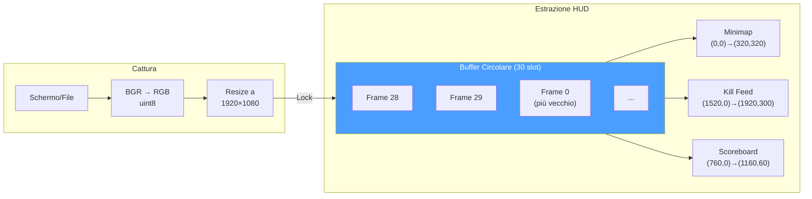

### -TensorFactory — Fabbrica dei Tensori (`backend/processing/tensor_factory.py`)

La **TensorFactory** è il **sistema percettivo** del RAP Coach: converte lo stato di gioco grezzo in 3 tensori-immagine che il modello neurale può "vedere". Ogni tensore è un'immagine a 3 canali che codifica una diversa dimensione della situazione tattica: **mappa** (dove sono tutti), **vista** (cosa può vedere il giocatore) e **movimento** (come si sta muovendo).

> **Analogia:** La TensorFactory è come un **pittore di mappe tattiche militari** che riceve rapporti radio e disegna tre mappe separate per il comandante (il modello RAP). La prima mappa (**mappa tattica**) mostra le posizioni di alleati e nemici conosciuti. La seconda mappa (**mappa di visibilità**) mostra cosa il soldato può effettivamente vedere dal suo punto di vista — il cono di 90° davanti a lui. La terza mappa (**mappa di movimento**) mostra il percorso recente del soldato, la sua velocità e la direzione del suo mirino. Crucialmente, il pittore segue una regola ferrea: **non disegna mai la posizione di nemici che il soldato non ha visto** (principio NO-WALLHACK). Se un nemico è dietro un muro, non appare sulla mappa — esattamente come nella realtà del giocatore.

**Configurazioni:**

| Parametro | `TensorConfig` (Inferenza) | `TrainingTensorConfig` (Addestramento) |
|---|---|---|
| `map_resolution` | 128 × 128 | 64 × 64 |
| `view_resolution` | 224 × 224 | 64 × 64 |
| `sigma` (blur gaussiano) | 3.0 | 3.0 |
| `fov_degrees` | 90° | 90° |
| `view_distance` | 2000.0 unità mondo | 2000.0 unità mondo |

> **Nota (F2-02):** `TrainingTensorConfig` riduce la risoluzione da 128/224 a 64/64, ottenendo un **risparmio di memoria di ~12×**. Il contratto `AdaptiveAvgPool2d` nella RAPPerception produce 128-dim indipendentemente dalla risoluzione di input, ma questa garanzia è implicita — un'asserzione a runtime è raccomandata.

**Costanti di rasterizzazione:**

| Costante | Valore | Scopo |
|---|---|---|
| `OWN_POSITION_INTENSITY` | 1.5 | Luminosità marcatore posizione propria |
| `ENTITY_TEAMMATE_DIMMING` | 0.7 | Compagni renderizzati più scuri dei nemici |
| `ENTITY_MIN_INTENSITY` | 0.2 | Intensità minima entità visibile |
| `ENEMY_MIN_INTENSITY` | 0.3 | Intensità minima nemico visibile |
| `BOMB_MARKER_RADIUS` | 50.0 | Raggio cerchio bomba (unità mondo) |
| `BOMB_MARKER_INTENSITY` | 0.8 | Opacità cerchio bomba |
| `TRAJECTORY_WINDOW` | 32 tick | Finestra traiettoria (~0.5s a 64 Hz) |
| `VELOCITY_FALLOFF_RADIUS` | 20.0 | Celle griglia per sfumatura radiale velocità |
| `MAX_SPEED_UNITS_PER_TICK` | 4.0 | Velocità massima CS2 (64 tick/s) |
| `MAX_YAW_DELTA_DEG` | 45.0 | Soglia flick per rilevamento mira |

**I 3 Rasterizzatori:**

**1. Rasterizzatore Mappa** — `generate_map_tensor(ticks, map_name, knowledge)` → `Tensor(3, res, res)`

| Canale | Modalità Player-POV (con PlayerKnowledge) | Modalità Legacy (senza knowledge) |
|---|---|---|
| **Ch0** | Compagni (sempre noti) + posizione propria (intensità 1.5) | Posizioni nemici |
| **Ch1** | Nemici visibili (piena intensità) + ultimi nemici noti (decadimento esponenziale) | Posizioni compagni |
| **Ch2** | Zone utilità (fumo/molotov) + overlay bomba | Posizione giocatore |

**2. Rasterizzatore Vista** — `generate_view_tensor(ticks, map_name, knowledge)` → `Tensor(3, res, res)`

| Canale | Modalità Player-POV | Modalità Legacy |
|---|---|---|
| **Ch0** | Maschera FOV (cono geometrico 90° dalla direzione di sguardo) | Maschera FOV |
| **Ch1** | Entità visibili: compagni (dimmed ×0.7) + nemici visibili (intensità pesata per distanza) | Zona pericolo (aree NON coperte da FOV accumulato, capped a 8 tick) |
| **Ch2** | Zone utilità attive (cerchi fumo/molotov in unità mondo) | Zona sicura (recentemente visibile ma non in FOV corrente) |

**3. Codificatore Movimento** — `generate_motion_tensor(ticks, map_name)` → `Tensor(3, res, res)`

| Canale | Contenuto |
|---|---|
| **Ch0** | Traiettoria ultimi 32 tick — intensità ∝ recenza (più nuovo = 1.0, più vecchio → 0) |
| **Ch1** | Campo velocità — gradiente radiale dal giocatore, modulato dalla velocità corrente [0, 1] |
| **Ch2** | Movimento mirino — magnitudine delta yaw come blob gaussiano sulla posizione giocatore |

> **Nota (F2-03):** Le demo a 128 tick/s comprimono la velocità nella metà inferiore dell'intervallo [0, 1]; normalizzazione consapevole del tick-rate in attesa di implementazione.

**Integrazione NO-WALLHACK:** Quando `PlayerKnowledge` è fornita, i rasterizzatori mappa e vista codificano **solo lo stato visibile al giocatore**. Le posizioni nemiche dell'ultimo avvistamento decadono esponenzialmente nel tempo. Le zone utilità sono visibili solo se nel FOV o note dal radar. Quando `knowledge=None`, il sistema degrada alla modalità legacy per retrocompatibilità.

**Metodi helper:**
- `_world_to_grid(x, y, meta, resolution)` — Conversione coordinate mondo → griglia. **Nota C-03:** Singolo Y-flip (`meta.pos_y - y`) per evitare doppia inversione
- `_normalize(arr)` — Normalizzazione a [0, 1]. **Nota M-10:** `arr / max(max_val, 1.0)` per prevenire amplificazione del rumore in canali sparsi
- `_generate_fov_mask(player_x, player_y, yaw, meta, resolution)` — Maschera conica 90° dalla direzione di sguardo, limitata per distanza (approssimazione 2D top-down)

**Accesso Singleton:** `get_tensor_factory()` — double-checked locking, thread-safe.

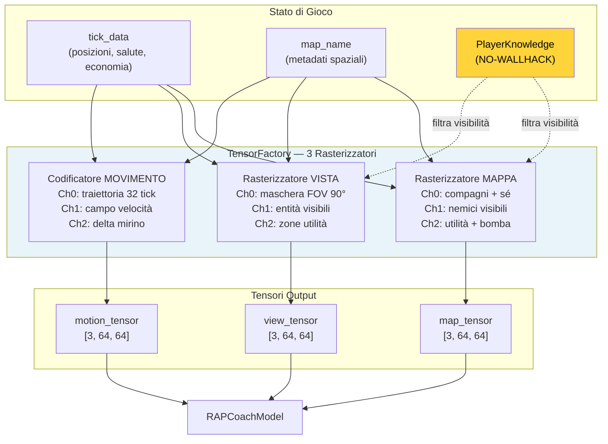

### -Indice Vettoriale FAISS (`backend/knowledge/vector_index.py`)

Il **VectorIndexManager** fornisce ricerca semantica ad alta velocità per il sistema di conoscenza RAG (Retrieval-Augmented Generation) del coach. Utilizza FAISS (Facebook AI Similarity Search) con `IndexFlatIP` su vettori L2-normalizzati, ottenendo efficacemente una **ricerca per similarità coseno** in tempo sub-lineare.

> **Analogia:** L'indice FAISS è come il **sistema di ricerca della biblioteca** del coach. Invece di sfogliare ogni libro (conoscenza tattica) o ogni appunto (esperienza di coaching) uno per uno per trovare quello rilevante alla situazione corrente, il bibliotecario (FAISS) ha creato un **indice per concetti**: quando il coach chiede "qual è la strategia migliore per un retake B su Mirage con 2 giocatori?", l'indice trova istantaneamente i 5 documenti più simili a questa domanda, senza dover leggere tutti i 10.000 documenti nella biblioteca. Il trucco è che ogni documento e ogni domanda vengono convertiti in un vettore di 384 numeri (embedding), e FAISS confronta questi vettori tramite **prodotto interno** (equivalente alla similarità coseno dopo normalizzazione L2).

**Indici Duali:**

| Indice | Sorgente DB | Contenuto |
|---|---|---|
| `"knowledge"` | Tabella `TacticalKnowledge` | Embedding conoscenza tattica (strategie, posizioni, utilità) |
| `"experience"` | Tabella `CoachingExperience` | Embedding esperienze di coaching (feedback, correzioni, consigli) |

**Tipo di indice:** `faiss.IndexFlatIP` (Inner Product) su vettori L2-normalizzati. Poiché `cos(a, b) = a·b / (||a|| × ||b||)`, normalizzando i vettori a norma unitaria, il prodotto interno **equivale esattamente** alla similarità coseno. Intervallo risultante: [0, 1] dove 1 = identico.

**API pubblica:**

| Metodo | Descrizione |
|---|---|
| `search(index_name, query_vec, k)` | Ricerca i k vettori più simili. Lazy rebuild se dirty. Ritorna `List[(db_id, similarity)]` |
| `rebuild_from_db(index_name)` | Ricostruzione completa dell'indice dalla tabella DB. Thread-safe. Ritorna conteggio vettori |
| `mark_dirty(index_name)` | Marca l'indice per ricostruzione lazy (al prossimo `search()`) |
| `index_size(index_name)` | Ritorna `index.ntotal` o 0 se non costruito |

**Persistenza su disco:**
- Formato: `{persist_dir}/{index_name}.faiss` + `{index_name}_ids.npy`
- Salvataggio: `faiss.write_index()` + `np.save()`
- Caricamento: automatico in `__init__` via `faiss.read_index()` + `np.load()`
- Directory default: `~/.cs2analyzer/indexes/`

**Thread-safety:** Un singolo `threading.Lock()` protegge tutte le operazioni di lettura/scrittura sugli indici, i flag dirty e le operazioni di rebuild. FAISS `IndexFlatIP` è thread-safe per letture concorrenti.

**Ricostruzione lazy (`mark_dirty()`):** Quando nuovi dati vengono inseriti nelle tabelle Knowledge o Experience, l'indice viene marcato come "dirty" anziché ricostruito immediatamente. La ricostruzione avviene solo al prossimo `search()`, evitando rebuild multipli durante inserimenti batch.

**Normalizzazione vettoriale:**
```
norms = ||embedding||₂ per riga
normalized = embedding / max(norms, 1e-8)    # stabilità numerica
IndexFlatIP.add(normalized)
```

**Fallback graduale:** Se `faiss-cpu` non è installato, il singleton `get_vector_index_manager()` ritorna `None` e il sistema degrada automaticamente alla ricerca brute-force (più lenta ma funzionalmente equivalente). Questo permette al programma di funzionare anche su sistemi dove FAISS non è disponibile.

**Over-fetching con costanti esplicite:** Per gestire scenari di post-filtraggio (category, map_name, confidence, outcome), la ricerca recupera più risultati del necessario: `k × OVERFETCH_KNOWLEDGE = k × 10` per la Knowledge Base (filtro per categoria + mappa), `k × OVERFETCH_EXPERIENCE = k × 20` per l'Experience Bank (filtro per mappa + confidence + outcome + scoring composito). Il moltiplicatore 20× per le esperienze è doppio rispetto alla conoscenza perché i filtri sono più restrittivi (4 criteri vs 2), quindi serve un pool iniziale più ampio per garantire abbastanza risultati dopo il filtraggio.

### -Contesto dei Round (`round_context.py`)

Il modulo **Round Context** è la **griglia temporale** del sistema di ingestione: converte i tick grezzi dei file demo in coordinate significative "round N, tempo T secondi" che ogni altro modulo può utilizzare per contestualizzare gli eventi di gioco.

> **Analogia:** Il Round Context è come l'**assistente del cronometrista** in una partita di calcio. Il cronometrista (DemoParser) misura il tempo in millisecondi assoluti dall'inizio della registrazione, ma l'assistente traduce quei millisecondi in informazioni utili: "Questo evento è successo al 23° minuto del secondo tempo". Senza l'assistente, ogni analista dovrebbe fare questa conversione da solo, rischiando errori e incoerenze. Il Round Context fa lo stesso per CS2: converte tick assoluti in "Round 7, 42 secondi dall'inizio dell'azione", permettendo a tutti i motori di analisi di lavorare con coordinate temporali coerenti e significative.

**Funzioni pubbliche:**

| Funzione | Input | Output | Complessità |
|---|---|---|---|
| `extract_round_context(demo_path)` | Percorso file `.dem` | DataFrame: `round_number`, `round_start_tick`, `round_end_tick` | O(n) parsing eventi |
| `extract_bomb_events(demo_path)` | Percorso file `.dem` | DataFrame: `tick`, `event_type` (planted/defused/exploded) | O(n) parsing eventi |
| `assign_round_to_ticks(df_ticks, round_context, tick_rate)` | DataFrame tick + confini round | DataFrame arricchito con `round_number`, `time_in_round` | O(n log m) via `merge_asof` |

**Costruzione dei confini di round (`extract_round_context`):**

Il modulo analizza due tipi di eventi dal file demo:
- **`round_freeze_end`** — il tick in cui termina il freeze time e inizia l'azione (i giocatori possono muoversi)
- **`round_end`** — il tick in cui il round termina (vittoria/sconfitta)

Per ogni round, accoppia l'ultimo `round_freeze_end` che precede il `round_end` corrispondente. **Fallback:** se non viene trovato un evento `round_freeze_end` per un dato round (possibile in demo corrotti o partite interrotte), utilizza il `round_end` del round precedente come inizio, registrando un warning nel log.

**Estrazione eventi bomba (`extract_bomb_events`):**

Estrae tre tipi di eventi: `bomb_planted`, `bomb_defused` e `bomb_exploded`. L'aggiunta di `bomb_exploded` (rimediazione H-07) permette di distinguere tra round vinti per esplosione e round vinti per eliminazione, un'informazione critica per l'analisi tattica post-plant.

**Assegnazione round ai tick (`assign_round_to_ticks`):**

Utilizza `pd.merge_asof` con `direction="backward"` per un'assegnazione efficiente O(n log m): per ogni tick, trova l'ultimo `round_start_tick ≤ tick`. Calcola `time_in_round = (tick − round_start_tick) / tick_rate`, limitato a [0.0, 175.0] secondi (durata massima di un round CS2). I tick prima del primo round (warmup) vengono assegnati al round 1.

> **Nota:** L'uso di `merge_asof` al posto di un loop Python trasforma un'operazione O(n × m) in O(n log m), fondamentale per demo con milioni di tick e 30+ round.

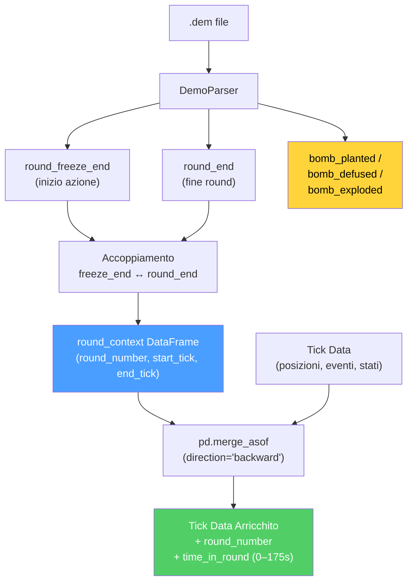

**Gestione errori:** Ogni fase di parsing è protetta da try/except con logging strutturato. Se il parsing fallisce completamente o non vengono trovati eventi `round_end`, la funzione restituisce un DataFrame vuoto — i moduli a valle (es. `RoundStatsBuilder`) devono gestire questo caso gracefully.

---

---

## Riepilogo della Parte 1B — I Sensi e lo Specialista

La Parte 1B ha documentato i **due pilastri percettivi e diagnostici** del sistema di coaching:

| Sottosistema | Ruolo | Componenti Chiave |
|---|---|---|
| **2. RAP Coach** | Il **medico specialista** — architettura a 7 componenti per coaching completo in condizioni POMDP | Percezione (ResNet a 3 flussi, 24 conv), Memoria (LTC **512** unità NCP + Hopfield 4 teste + ritardo attivazione NN-MEM-01 + **RAPMemoryLite** fallback LSTM), Strategia (4 esperti MoE + SuperpositionLayer), Pedagogia (Value Critic + Skill Adapter), Attribuzione Causale (5 categorie, segnale utilità appreso), Posizionamento (Linear 256→3), Comunicazione (template), ChronovisorScanner (3 scale temporali + 50K tick safety limit + deduplicazione cross-scala + ScanResult strutturato), GhostEngine (pipeline 4-tensori con POV mode R4-04-01, hidden_state NN-40, fallback a 5 livelli) |
| **1B. Sorgenti Dati** | I **sensi** — acquisiscono e strutturano dati dal mondo esterno | Demo Parser (demoparser2 + HLTV 2.0 rating), Demo Format Adapter (magic bytes PBDEMS2), Event Registry (schema CS2 completo), Trade Kill Detector (finestra 192 tick), Steam API (retry + backoff), Steam Demo Finder (cross-platform), HLTV (FlareSolverr + rate limiting 4 livelli + selettori CSS con fallback chain — **161 giocatori pro reali, 32 team, 156 stat card** in hltv_metadata.db), FACEIT API, FrameBuffer (ring buffer 30 frame), TensorFactory (3 rasterizzatori NO-WALLHACK), FAISS (IndexFlatIP 384-dim), Round Context (merge_asof O(n log m)) |

> **Analogia finale:** Se il sistema di coaching fosse un **essere umano**, la Parte 1A ha descritto il suo cervello (le reti neurali che imparano e il sistema di maturità che decide quando sono pronte), e la Parte 1B ha descritto i suoi occhi e orecchie (le sorgenti dati che acquisiscono informazioni dal mondo esterno), il suo sistema nervoso specializzato (il RAP Coach che integra percezione, memoria e decisione), e il suo sistema di comunicazione (che traduce la comprensione in consigli leggibili). Ma un cervello con sensi da solo non basta: ha bisogno di un **corpo** per agire. La **Parte 2** documenta quel corpo — i servizi che sintetizzano i consigli, i motori di analisi che investigano ogni aspetto del gameplay, i sistemi di conoscenza che memorizzano la saggezza accumulata, la pipeline di elaborazione che prepara i dati, il database che preserva tutto, e la pipeline di addestramento che insegna ai modelli.

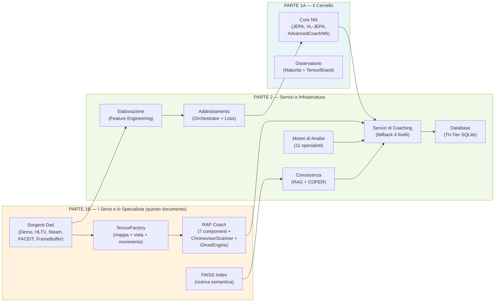

> **Continua nella Parte 2** — *Servizi di Coaching, Coaching Engines, Conoscenza e Recupero, Motori di Analisi (11), Elaborazione e Feature Engineering, Modulo di Controllo, Progresso e Tendenze, Database e Storage (Tri-Tier), Pipeline di Addestramento e Orchestrazione, Funzioni di Perdita*
