# Ultimate CS2 Coach — Part 2: Services, Analysis, Knowledge, Control, Progress, and Database

> **Topics:** Coaching Services (4-mode pipeline: COPER/Hybrid/RAG/Base, Ollama LLM), Coaching Engines (10 game-theoretic and statistical analysis engines), Knowledge and Retrieval (RAG + COPER Experience Bank), Analysis Engines (Bayesian belief model, expectiminimax, momentum, roles, deception index, entropy, engagement range, utility economy, win probability), Processing and Feature Engineering (25-dim canonical vector, professional baselines), Control Module (lifecycle daemon, ingestion queue, ML control), Progress and Trends (longitudinal tracking), Database and Storage (three-tier SQLite WAL schema), Training and Orchestration Pipeline, Loss Functions.
>
> **Author:** Renan Augusto Macena

---

> This document is the continuation of **Part 1B** — *The Senses and the Specialist*, which covers the RAP Coach model and all external data sources. Part 2 documents the coaching services that consume those neural outputs and turn them into actionable advice, together with the analysis engines, the tactical knowledge, and the storage and training infrastructure.

---

## Table of Contents

**Part 2 — Services, Analysis, and Database (this document)**

5. [Subsystem 3 — Coaching Services (`backend/services/`)](#5-subsystem-3--coaching-services)
   - CoachingService (4-mode pipeline)
   - OllamaWriter (LLM refinement)
   - AnalysisOrchestrator
5B. [Subsystem 3B — Coaching Engines (`backend/coaching/`)](#5b-subsystem-3b--coaching-engines)
6. [Subsystem 4 — Knowledge and Retrieval (`backend/knowledge/`)](#6-subsystem-4--knowledge-and-retrieval)
   - RAG Knowledge (retrieval for coaching patterns)
   - COPER Experience Bank (storage and retrieval of experiences)
7. [Subsystem 5 — Analysis Engines (`backend/analysis/`)](#7-subsystem-5--analysis-engines)
   - Bayesian Belief Model
   - Game Tree (expectiminimax)
   - Momentum, Role Classifier, Deception Index, Entropy Analysis
   - Engagement Range, Utility Economy, Win Probability, Blind Spots
8. [Subsystem 6 — Processing and Feature Engineering (`backend/processing/`)](#8-subsystem-6--processing-and-feature-engineering)
   - Vectorizer (canonical METADATA_DIM=25 contract)
   - TensorFactory (vision/map tensor construction)
   - Professional baselines and meta drift detection
   - Heatmap, validation
9. [Subsystem 7 — Control Module (`backend/control/`)](#9-subsystem-7--control-module)
10. [Subsystem 8 — Progress and Trends (`backend/progress/`)](#10-subsystem-8--progress-and-trends)
11. [Subsystem 9 — Database and Storage (`backend/storage/`)](#11-subsystem-9--database-and-storage)
12. [Training and Orchestration Pipeline](#12-training-and-orchestration-pipeline)
13. [Loss Functions — Implementation Detail](#13-loss-functions--implementation-detail)

---

## 5. Subsystem 3 — Coaching Services

**Folder in the repo:** `backend/services/`
**Files:** `coaching_service.py`, `ollama_writer.py`, `analysis_orchestrator.py`

This subsystem is the **decision-making hub**: it takes everything the neural networks and knowledge systems produced and synthesizes it into actual coaching advice for the player.

> **Analogy:** If the neural network core (Section 3) is the brain and the RAP coach (Section 4) is the specialist doctor, then the Coaching Services subsystem is the **hospital receptionist and the front desk**. It takes the doctor's reports, the nurse's notes, and the lab results and turns them into a clear report for the patient. It also has a backup plan for every scenario: if the specialist is unavailable, it refers you to a general practitioner; if the GP is out, it hands you a pamphlet; and if everything else fails, at least it gives you your baseline vitals. The patient (player) ALWAYS leaves with something useful, never empty-handed.

### -CoachingService (`coaching_service.py`)

The **central synthesis engine** that implements a **4-tier coaching fallback chain** with graceful degradation:

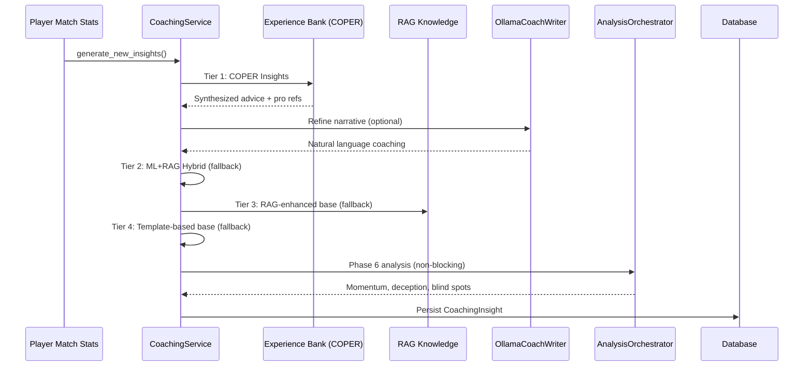

> **Diagram Explanation:** Follow the arrows from top to bottom: this is the coach's "thought process" in order: (1) Match data arrives. (2) The coach first asks the Experience Bank: "Have we seen this situation before? What worked?". (3) If the answer sounds too robotic, it is optionally sent to Ollama (a local AI writer) to make it more natural. (4) If the Experience Bank has not enough data, it falls back to hybrid mode (ML predictions + RAG knowledge combined). (5) If even the ML models are unavailable, it falls back to RAG only (searching for relevant tips). (6) If even RAG fails, it uses simple statistical templates ("Your K/D ratio is 0.8, below average"). (7) Meanwhile, in the background, 7 analysis engines run special investigations across 5 pipelines (momentum, deception, entropy, strategy+blind spots, engagement range). (8) Everything is saved to the database for future reference.

**4-tier fallback chain:**

| Tier            | Method                          | Confidence | When used                                          |
| --------------- | ------------------------------- | ---------- | -------------------------------------------------- |
| 1. **COPER**    | `_generate_coper_insights()`    | Maximum    | Default — experience-based synthesis               |
| 2. **Hybrid**   | `_generate_hybrid_insights()`   | High       | If COPER lacks enough experience                   |
| 3. **Base RAG** | `_enhance_with_rag()`           | Medium     | If the ML models are unavailable                   |
| 4. **Template** | Basic statistical template      | Low        | Last resort — always returns *something*           |

> **Analogy:** The 4-tier fallback is like **ordering food at a restaurant**. Tier 1 (COPER) is the chef's special: the best, most personalized dish, crafted from experience. Tier 2 (Hybrid) is the standard menu: great food, but not as customized. Tier 3 (Base RAG) is the kids' menu: simpler, but still nourishing. Tier 4 (Template) is bread and water: basic, but you will never leave hungry. The key guarantee is: **the player always receives coaching advice**, no matter what. The system never tells you "Sorry, I have nothing for you".

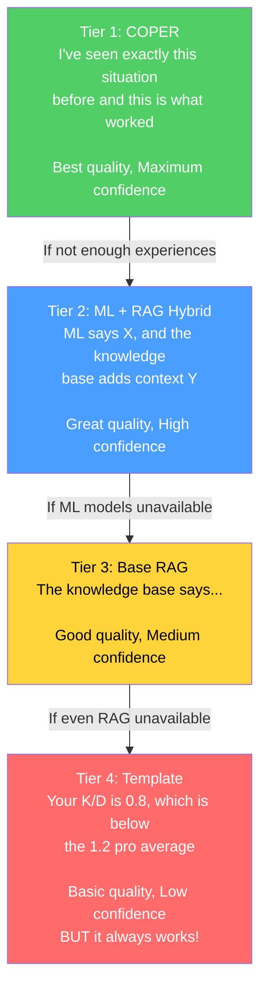

**Key design:** It never returns zero insights. The Phase 6 analysis is non-blocking (wrapped in try-catch, logged non-fatally).

> **Fix G-08 (Coaching Fallback):** Previously, the `_generate_coper_insights()` method did not receive the `deviations` and `rounds_played` parameters from the caller, causing a silent fallback to basic templates. After remediation, `generate_new_insights()` now explicitly passes both parameters (`deviations=deviations, rounds_played=rounds_played`) to the COPER handler, ensuring that Tier 1 COPER can generate contextual insights based on the player's real statistical deviations against the pro baseline. Without this fix, the system would always degrade to Tier 4 (template) even when COPER data was available.

**Temporal baseline enrichment (Proposal 11):** The coaching service now integrates time-weighted pro comparisons via two new methods:

- `_get_temporal_baseline(map_name)` — retrieves a pro baseline weighted according to `TemporalBaselineDecay` (half-life = 90 days) instead of static averages
- `_baseline_context_note(deviations, map_name)` — generates a natural-language description ("Based on recent pro data weighted by recency, your ADR is 12% below the current average meta on de_mirage") for COPER enrichment

This ensures coaching insights reflect the **current average meta** rather than outdated historical averages. If temporal data is insufficient (< 10 stat cards), the service transparently falls back to the legacy `get_pro_baseline()` function.

> **Analogy:** Previously, the coach compared you against a **snapshot** of professional statistics from months ago. Now it uses a **real-time, updated average** where recent professional performances count more than old ones, like a curved grade where last week's test scores count more than last year's. If the class average on "ADR" went up this month, you'll see it immediately reflected in your coaching advice.

**Round phase inference** (`_infer_round_phase`): Equipment value → round phase classification:

| Equipment value          | Round phase    |
| ------------------------ | -------------- |
| < $1,500                 | `pistol`       |
| $1,500 – $2,999          | `eco`          |
| $3,000 – $3,999          | `force`        |
| ≥ $4,000                 | `full_buy`     |

**Health range classification** (`_health_to_range`): Used for COPER context hashing: `"full"` (≥80), `"damaged"` (40–79), `"critical"` (<40).

### -OllamaCoachWriter (`ollama_writer.py`)

Turns structured coaching information into natural language via a local LLM (Ollama).

- **Singleton** via the `get_ollama_writer()` factory
- **Feature-flagged:** `USE_OLLAMA_COACHING` setting (default: False)
- **Graceful degradation:** returns the original text if Ollama is unavailable
- **System prompt:** CS2 coaching expert tone, <100 words, actionable, encouraging

> **Analogy:** OllamaCoachWriter is like a **translator** that takes dry statistics and turns them into motivating advice. Without it, the coach might say: "mean deviation: -0.07, z-score: -1.4, category: mechanics". With it, the coach says: "Your headshot percentage is slightly below the pro average. Try focusing on crosshair placement — keep it at head height when clearing corners". It runs a local AI model (Ollama) on your computer: no internet needed, no data sent to the cloud. If Ollama is not installed, the system simply uses the original text: no crash, no error, just slightly less polished phrasing.

### -AnalysisOrchestrator (`analysis_orchestrator.py`)

Synthesizes the advanced Phase 6 analysis by instantiating 7 engines and orchestrating 5 analysis pipelines:

**Input:** match tick data, events, player stats
**Output:** `MatchAnalysis` with `RoundAnalysis` objects per round containing:

- `momentum_score` (tilt/win streak)
- `deception_score` (tactical sophistication)
- `utility_entropy` (effectiveness measurement)
- `blind_spots` (strategic gaps)
- `strategy_rec` (game tree recommendation)
- `engagement_range` (engagement distance analysis)

**Engines instantiated:** `belief_estimator`, `deception_analyzer`, `momentum_tracker`, `entropy_analyzer`, `game_tree`, `blind_spot_detector`, `engagement_analyzer` (7 engines). The `belief_estimator` is instantiated but is not currently invoked directly as a separate pipeline.

> **Analogy:** AnalysisOrchestrator is like a **team of 7 specialized detectives**, each investigating a different aspect of your gameplay. *Detective Momentum* checks whether you are on a successful streak or struggling. *Detective Deception* checks whether you are predictable or sneaky. *Detective Entropy* checks whether your utility (grenades) is effective. *Detective Blind Spots* checks whether you keep making the same mistake. *Detective Strategy* checks whether you are making the right decisions. *Detective Death Probability* checks how risky your positions are. *Detective Engagement Range* checks at which distances you fight best. All of these checks run in the background (non-blocking), so even if one detective fails, the others still report their findings.

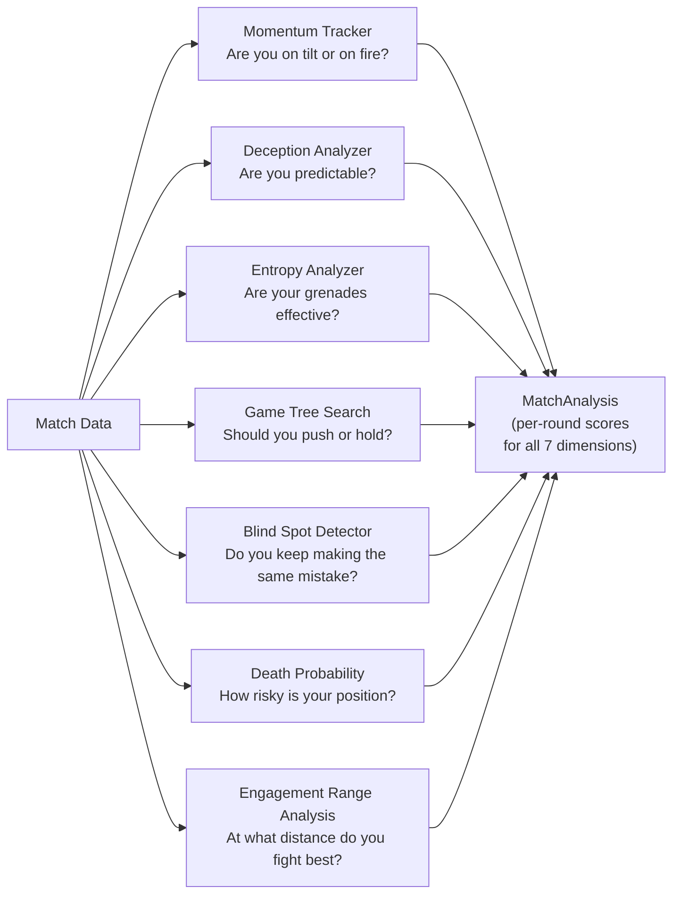

### -Additional Services (Not previously documented)

Beyond the three main services (CoachingService, OllamaCoachWriter, AnalysisOrchestrator), the `backend/services/` directory contains **7 additional services** that complete the coaching ecosystem:

> **Analogy:** If CoachingService is the **hospital director**, the additional services are the **specialized departments**: there is the dialogue department (interactive coaching), the lessons department (structured training), the language lab (LLM), the imaging department (visualizations), the records office (profiles), the analysis department (coordination), and the telemetry system (remote monitoring).

#### CoachingDialogueEngine (`coaching_dialogue.py`)

Multi-turn dialogue engine with RAG and Experience Bank augmentation. Evolves the single-shot OllamaCoachWriter into an **interactive session** where players can ask follow-up questions about their performance.

| Component | Detail |
|---|---|
| **Intent classification** | Keyword-based: 7 categories (positioning, utility, economy, aim, player_query, round_query, match_query) + general fallback |
| **Sliding context window** | `MAX_CONTEXT_TURNS = 6` (12 messages: 6 user + 6 assistant) |
| **Retrieval augmentation** | RAG top-3 + Experience Bank top-3, injected into the user message |
| **Player entity detection** | Integration with `PlayerLookupService` to detect mentions of professional players in the user message and inject "VERIFIED PLAYER DATA" blocks into the LLM context |
| **Offline fallback** | Template-based with RAG-only when Ollama is unavailable |
| **Singleton** | `get_dialogue_engine()` — module-level factory |
| **Anti-hallucination (WR-78/79)** | System prompt with rules: "use ONLY verified data", provenance markers ("pro data" vs "user data"), never fabricate tactical narratives |

**Response pipeline:**

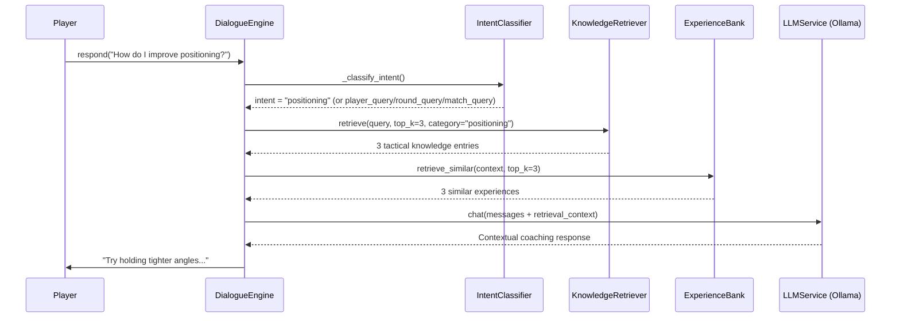

**Session management:** `start_session(player_name, demo_name)` → load context from DB (last 5 insights, primary focus area) → generate opening message via LLM → `respond(user_message)` for subsequent turns → `clear_session()` for reset.

**History safety (F5-06):** The user message is added to history only *after* a valid response is obtained from the LLM, avoiding inconsistent states on exceptions.

#### LessonGenerator (`lesson_generator.py`)

Structured educational lesson generator starting from demo analysis:

| Threshold | Constant | Value | Use |
|---|---|---|---|
| Strong ADR | `_ADR_STRONG_THRESHOLD` | 75.0 | Identifies strengths |
| Weak ADR | `_ADR_WEAK_THRESHOLD` | 60.0 | Identifies areas for improvement |
| Strong HS% | `_HS_STRONG_THRESHOLD` | 0.40 | Above-average precision |
| Weak HS% | `_HS_WEAK_THRESHOLD` | 0.35 | Below-average precision |
| Above-average rating | `_RATING_ABOVE_AVG` | 1.0 | Positive performance |
| Strong KAST | `_KAST_STRONG_THRESHOLD` | 0.70 | Consistent contribution |
| Death ratio | `_DEATH_RATIO_WARNING` | 1.5× | deaths > kills × 1.5 = warning |

**Generated lesson structure:**

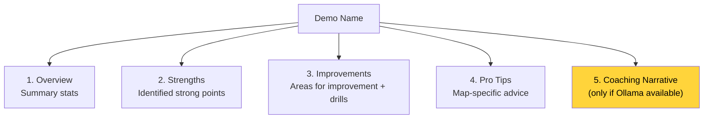

**Map-specific Pro Tips:** Internal database with tips for mirage, inferno, dust2, ancient, nuke. Falls back to generic advice for unsupported maps.

#### LLMService (`llm_service.py`)

Ollama integration service for local LLM inference:

| Parameter | Value | Description |
|---|---|---|
| `OLLAMA_URL` | `http://localhost:11434` | Ollama endpoint (env: `OLLAMA_URL`) |
| `DEFAULT_MODEL` | `llama3.1:8b` | 8B general-purpose model (env: `OLLAMA_MODEL`) |
| `_AVAILABILITY_TTL` | 60s | Availability cache |
| `temperature` | 0.7 | Response creativity |
| `top_p` | 0.9 | Nucleus sampling |
| `num_predict` | 500 | Response length limit |

**Supported APIs:**

| Method | Ollama endpoint | Use |
|---|---|---|
| `generate(prompt)` | `/api/generate` | Single-shot generation |
| `chat(messages)` | `/api/chat` | Multi-turn conversation |
| `generate_lesson(insights)` | `/api/generate` | Lessons from RAP insights |
| `explain_round_decision(round_data)` | `/api/generate` | Single-round explanation |
| `generate_pro_tip(context)` | `/api/generate` | Contextual tip |

**Auto-discovery model:** If the configured model is not available, it automatically uses the first installed model. Singleton via `get_llm_service()`.

#### VisualizationService (`visualization_service.py`)

Generates Matplotlib radar charts for User vs Pro comparisons:

- `generate_performance_radar(user_stats, pro_stats, output_path)` → PNG file with radar overlay
- `plot_comparison_v2(p1_name, p2_name, p1_stats, p2_stats)` → `io.BytesIO` PNG buffer
- Features compared: avg_kills, avg_adr, avg_hs, avg_kast, accuracy
- Rendering wrapped in try/except (F5-19) to handle empty stats or missing matplotlib backend

#### ProfileService (`profile_service.py`)

External profile synchronization orchestrator:

- `fetch_steam_stats(steam_id)` → nickname, avatar, CS2 playtime (hours)
- `fetch_faceit_stats(nickname)` → faceit_elo, faceit_level, faceit_id
- `sync_all_external_data(steam_id, faceit_name)` → upsert to `PlayerProfile` in DB
- API keys loaded from environment/keyring (F5-22), never hardcoded

#### AnalysisService (`analysis_service.py`)

Analysis coordination service with drift detection:

- `analyze_latest_performance(player_name)` → latest stats from the DB
- `get_pro_comparison(player_name, pro_name)` → side-by-side comparison
- `check_for_drift(player_name)` → `detect_feature_drift()` on the last 100 matches

#### TelemetryClient (`telemetry_client.py`)

Async client for sending metrics to a central server:

- Protocol: `httpx.Client` → `POST /api/ingest/telemetry`
- Configurable URL: `CS2_TELEMETRY_URL` (default: `http://127.0.0.1:8000`)
- Graceful fallback if httpx is not installed (optional feature)
- **Anti-fabrication compliant:** no synthetic data in the self-test

#### PlayerLookupService (`player_lookup.py`)

Professional player lookup service that prevents LLM hallucination by injecting verified data into the coaching dialogue context:

> **Analogy:** The PlayerLookupService is like a **fact-checking archivist** who verifies facts before the coach speaks. When a player asks "Tell me about s1mple", the archivist goes to check the real medical files (HLTV + Monolith database) and hands the coach a verified card: "Here is the real data on s1mple: rating 1.29, Natus Vincere team, etc.". The coach is obligated to use ONLY this verified data — it cannot invent statistics. Without the archivist, the LLM could "hallucinate" plausible but false statistics.

| Component | Detail |
|---|---|
| **3-tier matching** | Exact (case-insensitive) → Fuzzy (SequenceMatcher ≥ 0.75) → Pattern (nickname regex) |
| **Nickname cache** | TTL 60s, loads all `ProPlayer.nickname` from the HLTV DB at startup |
| **Stop-word filter** | 89 common English words filtered to avoid false positives |
| **Output** | `ProPlayerProfile` dataclass: nickname, hltv_id, real_name, country, team, HLTV statistics (rating, KPR, ADR, KAST), performance from local demos |
| **Integration** | `CoachingDialogueEngine` → `detect_player_mentions()` → `lookup_player()` → `format_player_context()` → "VERIFIED PLAYER DATA" block injected into the LLM context |
| **Singleton** | `get_player_lookup_service()` |

**Anti-hallucination pipeline:**

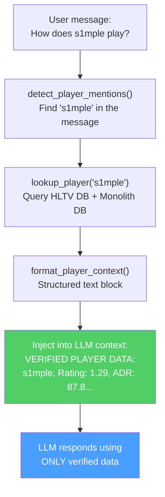

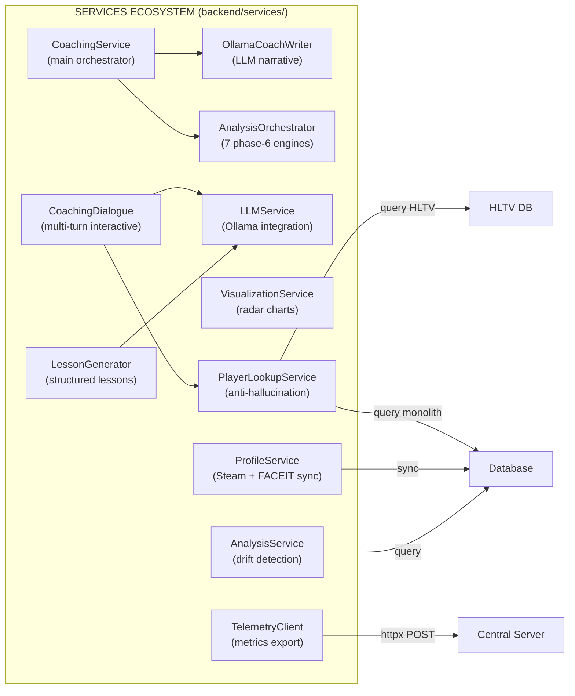

---

## 5B. Subsystem 3B — Coaching Engines

**Folder in the repo:** `backend/coaching/`
**Files:** 7 modules

This subsystem contains the **coaching decision engines** that transform raw statistical deviations into prioritized and contextualized advice. Unlike the Services (Section 5), which orchestrate and present, the Coaching Engines contain the coach's **reasoning logic**.

> **Analogy:** If the Coaching Services (Section 5) are the **hospital reception desk**, the Coaching Engines are the **specialist doctors in their offices**. The `CorrectionEngine` is the general practitioner who weighs symptoms and decides which 3 are most urgent. The `HybridCoachingEngine` is the chief physician who synthesizes ML and encyclopedic knowledge to formulate complete diagnoses. The `ExplanationGenerator` is the specialist who translates medical jargon into words the patient can understand. The `ProBridge` is the consultant who brings in reports from other hospitals (HLTV data) and makes them compatible with the local system. The `LongitudinalEngine` is the epidemiologist who studies trends over time.

### -HybridCoachingEngine (`hybrid_engine.py`)

The **decision-making heart** of coaching: synthesizes ML predictions with RAG knowledge to generate unified, deduplicated insights.

**5-stage pipeline:**

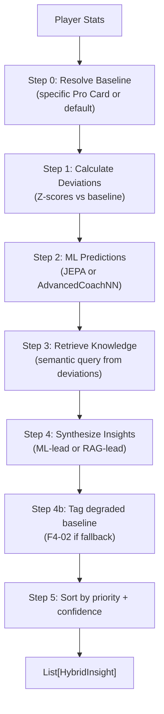

**Classes and dataclasses:**

| Type | Name | Description |
|---|---|---|
| `Enum` | `InsightPriority` | CRITICAL (\|Z\|>2.5, conf>0.8), HIGH (\|Z\|>2.0, conf>0.6), MEDIUM (\|Z\|>1.0, conf>0.4), LOW |
| `dataclass` | `HybridInsight` | title, message, priority, confidence, feature, ml_z_score, knowledge_refs, pro_examples, tick_range, demo_name |

**Confidence formula:**

```
base_confidence = |z_score|/3.0 × 0.6 + knowledge_effectiveness × 0.4
confidence = base_confidence × MetaDriftEngine.get_meta_confidence_adjustment()
```

Where `knowledge_effectiveness = min(1.0, mean(usage_count) / 100)`.

**Synthesis strategy:**

| Condition | Strategy |
|---|---|
| \|Z\| > 2 (high ML confidence) | Lead with ML, support with RAG |
| \|Z\| < 1 (low ML confidence) | Lead with RAG |
| 1 ≤ \|Z\| ≤ 2 | Balanced approach |
| No significant deviation | Knowledge-only insight (LOW priority) |

**TASK 2.7.1 — Reference Clip:** Each `HybridInsight` can include `tick_range: (start, end)` and `demo_name` to allow the UI to jump directly to the evidence in the demo file.

**Baseline fallback (F4-02):** If `get_pro_baseline()` fails, uses hardcoded static values and marks all insights with `baseline_quality=degraded` in the message.

### -CorrectionEngine (`correction_engine.py`)

Generates the **top-3 weighted corrections** from Z-score deviations:

| Constant | Value | Use |
|---|---|---|
| `CONFIDENCE_ROUNDS_CEILING` | 300 | Confidence scaling: `min(1.0, rounds / 300)` |

**Importance weights (DEFAULT_IMPORTANCE):**

| Feature | Weight |
|---|---|
| `avg_kast` | 1.5 |
| `avg_adr` | 1.5 |
| `accuracy` | 1.4 |
| `impact_rounds` | 1.3 |
| `avg_hs` | 1.2 |
| `econ_rating` | 1.1 |
| `positional_aggression_score` | 1.0 |

**Pipeline:** `deviations` → apply confidence scaling × rounds_played → optional `apply_nn_refinement()` → sort by `|weighted_z| × importance` → return top 3.

**User override:** Weights are overridable via `get_setting("COACH_WEIGHT_OVERRIDES")`.

### -ExplanationGenerator (`explainability.py`)

Translates RL latent signals into **understandable narratives** organized along the 5 skill axes (`SkillAxes`):

| Axis | Negative Template | Action Template |
|---|---|---|
| MECHANICS | "Your {feature} is {delta}% below professional standards..." | "Focus on crosshair height when clearing corners..." |
| POSITIONING | "Positioning at {location} was suboptimal..." | "Try holding a tighter angle at {location}..." |
| UTILITY | "Utility timing with {weapon} was suboptimal..." | "Wait for a clear sound cue before deploying..." |
| TIMING | "Engagement timing is lagging behind..." | "Coordinate with teammates to trade-frag..." |
| DECISION | "Decision efficiency is {delta}% lower..." | "In clutch scenarios, prioritize the round objective..." |

**"Silence is a Valid Action" principle:**

| Threshold | Constant | Value | Behavior |
|---|---|---|---|
| Silence | `SILENCE_THRESHOLD` | 0.2 | \|delta\| < 0.2 → no feedback (silence) |
| High severity | `SEVERITY_HIGH_BOUNDARY` | 1.5 | \|delta\| > 1.5 → "High" |
| Medium severity | `SEVERITY_MEDIUM_BOUNDARY` | 0.8 | \|delta\| > 0.8 → "Medium" |

**Complexity filter:** For `skill_level < 3` (beginners), negative narratives are simplified to the suggested action alone, avoiding cognitive overload.

### -NNRefinement (`nn_refinement.py`)

Applies neural-network weight adjustments to pre-computed corrections:

```
refined_z = weighted_z × (1 + nn_adjustments["{feature}_weight"])
```

Lightweight module that scales corrections from the `CorrectionEngine` using weights learned by the ML model, allowing the neural system to influence advice prioritization.

### -ProBridge (`pro_bridge.py`)

**Translation layer** that assimilates HLTV Player Cards into the coach's cognitive model:

| Class | Responsibility |
|---|---|
| `PlayerCardAssimilator` | Converts `ProPlayerStatCard` → coach-compatible baseline |
| `get_pro_baseline_for_coach()` | Direct factory function |

**Legacy constant:** `ESTIMATED_ROUNDS_PER_MATCH = 24.0` — present in the code but **no longer used** for KPR/DPR conversion after the P3-02 fix.

**Metric mapping:**

| HLTV metric | Coach metric | Transformation |
|---|---|---|
| `card.kpr` | `avg_kills` | **direct** (P3-02: NOT multiplied by 24) |
| `card.dpr` | `avg_deaths` | **direct** (P3-02: NOT multiplied by 24) |
| `card.adr` | `avg_adr` | direct |
| `card.kast` | `avg_kast` | V-2: defensive normalization (`/100` if `kast > 1.0`, otherwise direct) |
| `card.impact` | `impact_rounds` | direct |
| `card.rating_2_0` | `rating` | direct |
| `detailed_stats.headshot_pct` | `avg_hs` | V-2: defensive normalization (`/100` if `> 1.0`, default 0.45) |
| `detailed_stats.total_opening_kills` | `entry_rate` | `/100` (heuristic) |
| `detailed_stats.utility_damage_per_round` | `utility_damage` | direct (default 45.0) |

> **Fix P3-02 — KPR/DPR scale:** The previous code multiplied `kpr × 24` and `dpr × 24`, producing total kills/deaths per match (values 15-20) instead of per-round values (0.6-0.8). This made all comparison z-scores invalid since the user stats extracted by `base_features.py` and `pro_baseline.py` are already on a per-round scale. After remediation, `get_coach_baseline()` uses the per-round rates directly.
>
> **Fix V-2 — Legacy defensive normalization:** Older HLTV records in the database may contain percentage values (e.g. `kast=72.0` instead of `kast=0.72`). Conditional normalization (`/100 if > 1.0`) transparently handles both formats.

**Archetype classification:** `get_player_archetype()` → Star Fragger (impact>1.3), Support Anchor (kast>0.75), Sniper Specialist (AWP kills>40%), All-Rounder (default).

### -PlayerTokenResolver (`token_resolver.py`)

Resolves **static tokens** (Card) for dynamic comparison:

- `get_player_token(player_name)` → token dict with identity, core_metrics, tactical_baselines, granular_data, metadata
- `compare_performance_to_token(match_stats, token)` → `Correction Delta` with deltas for rating, adr, kast, accuracy_vs_hs, and an `is_underperforming` flag (rating < 85% of the pro)

**Token structure:**

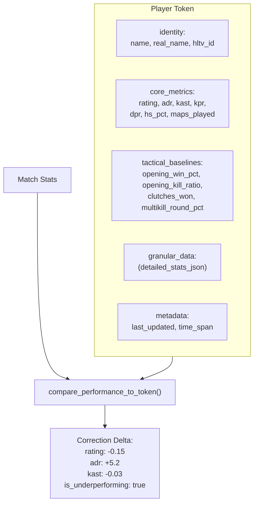

### -LongitudinalEngine (`longitudinal_engine.py`)

Generates trend-aware insights by comparing performance trajectories over time with NN stability signals:

- **Input:** `List[FeatureTrend]` (from the progress module) + `nn_signals` (from the training pipeline)
- **Confidence filter:** Only trends with `confidence ≥ 0.6`
- **Output:** Max 3 insights, categorized as:
  - **Regression:** slope < 0 → severity "Medium" (or "High" if `nn_signals.stability_warning` is active)
  - **Improvement:** slope > 0 → severity "Positive", focus "Reinforcement"

> **Analogy:** The LongitudinalEngine is like a **chart of grades over time**. It does not just look at the score on the last exam — it looks at the whole trajectory: "Your math grades have been dropping for 3 months" (regression) or "Your accuracy is improving steadily" (improvement). If the neural system is unstable (`stability_warning`), the doctor raises the alarm level: "This drop may be more serious than it looks".

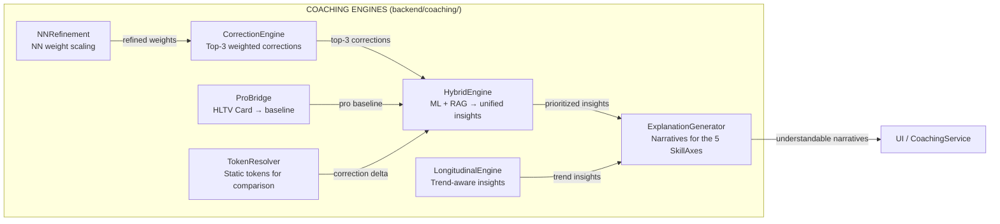

---

## 6. Subsystem 4 — Knowledge and Retrieval

**Folder in the repo:** `backend/knowledge/`
**Files:** `rag_knowledge.py`, `experience_bank.py`

This subsystem is the coach's **library and diary**: it stores tactical knowledge (like a textbook) and past training experiences (like a diary of what worked and what did not).

> **Analogy:** Imagine you had two ways to study for an exam. The first is a **textbook** (RAG Knowledge Base) — it contains every CS2 tip organized by topic: "aim", "positioning", "utility", etc. You can search it by asking questions in plain English and the system finds the most relevant pages. The second is your **personal diary** (Experience Bank) — it records every training session you have done, the advice you received, and whether you actually improved afterwards. Over time, the diary becomes smarter: advice that worked gets highlighted, advice that did not is phased out. Together, the textbook and the diary give the coach both **general knowledge** and **personal experience** to draw from.

### -RAG Knowledge Base (`rag_knowledge.py`)

Implements a **retrieval-augmented generation** pipeline using dense vector similarity search:

| Component                          | Detail                                                                                                                                               |
| ---------------------------------- | ---------------------------------------------------------------------------------------------------------------------------------------------------- |
| **Embedding model**                | `sentence-transformers/all-MiniLM-L6-v2` (384-dimensional vectors)                                                                                   |
| **Fallback**                       | Hash-based embeddings if Sentence-BERT is unavailable                                                                                                |
| **Storage**                        | `TacticalKnowledge` SQLite table (embedding stored as a JSON-encoded float array)                                                                    |
| **Retrieval**                      | Cosine similarity via `scipy.spatial.distance.cosine`                                                                                                |
| **Top-k**                          | Configurable, default k=5                                                                                                                            |
| **Versioning**                     | `CURRENT_VERSION = "v3"` (2026-04, Coach Book refactor, Premier S4 active duty alignment); stale v2 embeddings automatically recomputed via `trigger_reembedding()` |
| **Categories**                     | 14: aim, positioning, utility, movement, economy, strategy, crosshair placement, communication, mental, game sense, trading, **mid_round**, **retakes_post_plant**, **aim_and_duels** |

> **Analogy:** RAG works like a **smart search engine for the coach's brain**. When the coach needs positioning advice on Dust2 as a CT AWPer, it does not search by keywords like Google. Instead, it converts the question into a "meaning vector" of 384 numbers and finds stored tips whose meaning vectors point in the same direction (cosine similarity). It is as if every book in a library had a GPS coordinate representing its topic, and instead of searching by title you provided GPS coordinates and found the 5 nearest books. The 1.2x relevance multiplier is like saying "books from the same shelf (same map/side/round type) get bonus points". The deduplication filter (threshold 0.85) prevents returning 5 near-identical copies of the same tip.
>
> **Fix M-07 — Zero-norm vector rejection:** `VectorIndex.search()` validates the query vector norm before the search. If the norm is zero (typically due to an empty fallback embedding or corrupted input), the method returns `None` with a log warning instead of propagating a division-by-zero error in cosine similarity. This protects the RAG pipeline from degenerate queries without interrupting the coaching flow.

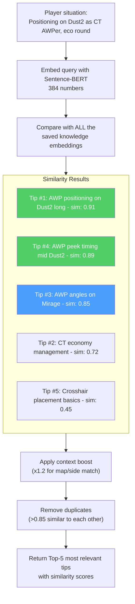

**Query construction:** natural-language dynamic queries from player stats, map, side, role. Elements matching the context get a 1.2x relevance multiplier. Deduplication filters elements with > 0.85 similarity against already-selected results.

### -Experience Bank (`experience_bank.py`) — COPER Framework (KT-01 Enhanced)

Implements the **Contextual Observation–Prediction–Experience–Retrieval (COPER)** framework with CRUD semantics, prioritized replay, and TrueSkill integration:

> **Analogy:** COPER is the **coach's personal diary with superpowers**. Every time the coach gives advice during a match, it writes a diary entry: "On Dust2, eco round T side, the player was in B tunnels with 60 HP and a Deagle. I told them to hold the angle. They survived and got 2 kills. This advice WORKED!" Later, when a similar situation comes up, the coach flips through the diary and finds that entry. But it is even smarter: it also checks what professional players did in similar situations, looks for patterns ("This player keeps struggling in eco rounds on T side"), and adapts confidence based on the advice's validation date.

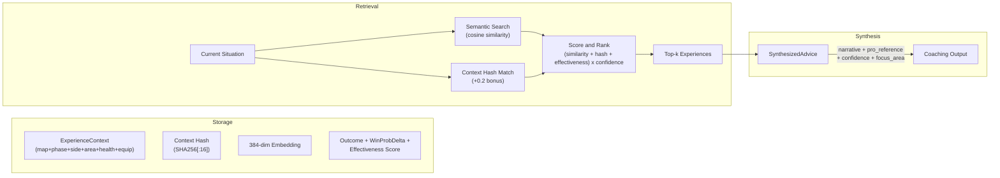

**Dual retrieval strategy:**

1. **User experiences:** Past situations drawn from the user's game history.
2. **Pro experiences:** How the pros handled analogous situations.
3. **Pattern analysis:** Identifies recurring weaknesses, improvement trends, contextual correlations.

> **Analogy:** Dual retrieval is like studying for an exam using **both your past tests and the class genius's answers**. Your past tests show what you personally struggle with. The class genius's answers show the ideal approach. Pattern analysis is like your teacher reviewing all of your tests and saying: "I noticed you always lose points on the same type of question — let's focus on that".

**Feedback loop (EMA-based):**

- Each experience tracks `outcome_validated`, `effectiveness_score`, `times_advice_given`, `times_advice_followed`
- Follow-up matches update effectiveness: `new_score = 0.7 × old_score + 0.3 × outcome_value`
- Stale experiences (>90 days without validation): confidence decreases by 10%
- Usage tracking increments `usage_count` on every retrieval

> **Analogy:** The feedback loop is how the coach **learns from its own advice**. After giving advice, it checks: "Did the player actually do what I suggested? Did their performance improve?". The EMA formula (0.7 old + 0.3 new) means the coach trusts its long-term experience more than any single outcome, like a restaurant rating based on hundreds of reviews, not just the latest one. If a piece of advice is not validated within 90 days, it loses 10% confidence, like a weather forecast becoming less reliable the further out it is. This creates a self-improving system: good advice becomes more reliable over time, while bad advice is gradually phased out.

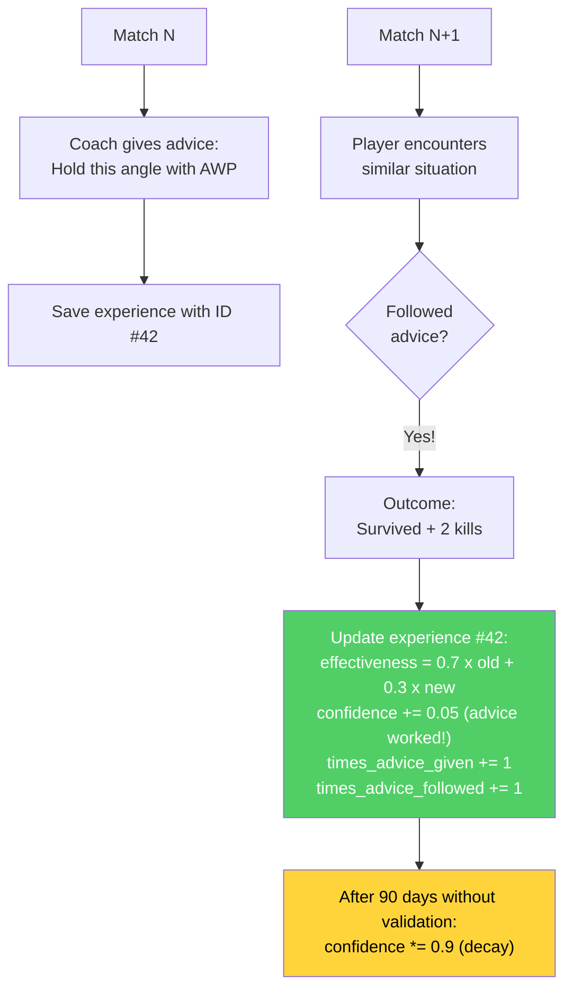

**Experience extraction from demos:** Groups events by tick, identifies player kills/deaths, creates context from a tick snapshot, infers the action (scoped_hold, crouch_peek, pushed, held_angle), determines the outcome.

**KT-01 enhancements — CRUD semantics and prioritized replay:**

| Constant | Value | Purpose |
|---|---|---|
| `DUPLICATE_SIMILARITY_THRESHOLD` | 0.9 | Cosine similarity for duplicate detection |
| `CRUD_EMA_FACTOR` | 0.3 | EMA weight for effectiveness merge on UPDATE |
| `REPLAY_ALPHA` | 0.6 | Replay priority exponent (lower = more uniform) |
| `REPLAY_GATE` | 0.4 | Minimum confidence to be eligible for replay |
| `_MIN_EFFECTIVENESS_TRIALS` | 5 | Minimum trials before effectiveness affects retrieval |

**CRUD decision on insertion:**

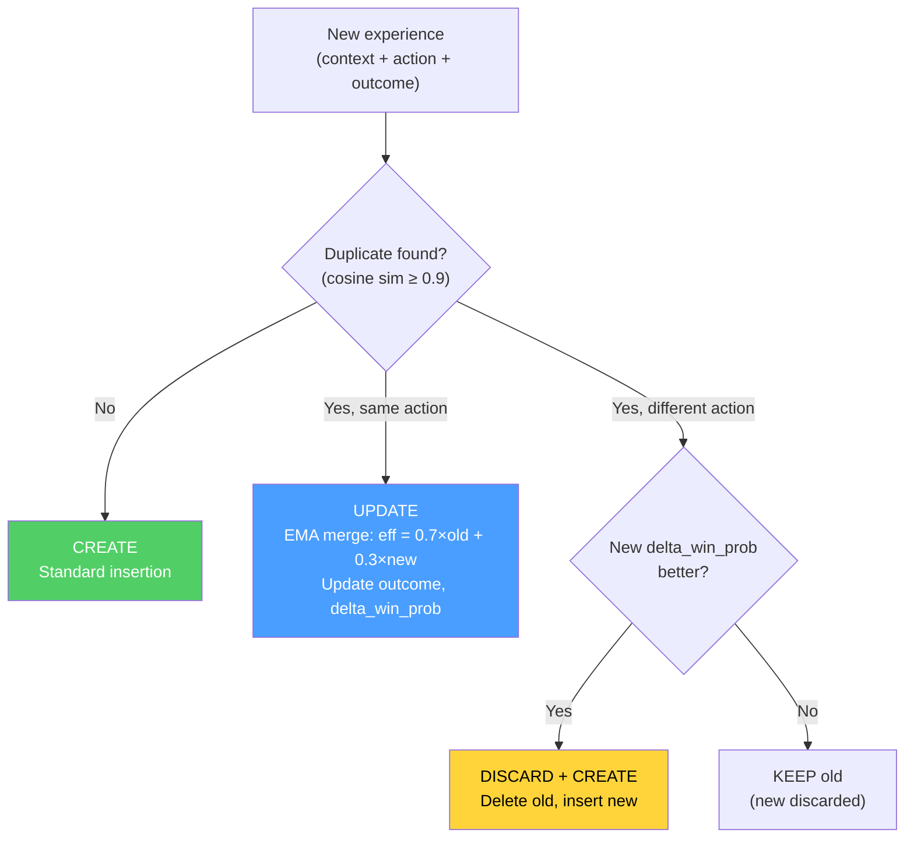

> **CRUD analogy:** Previously, the coach's diary always added a new entry, even if it was almost identical to a previous one. With KT-01, the diary became smart: (1) **If the same situation produced the same advice**, it updates the existing entry with a weighted average of outcomes (UPDATE). (2) **If the same situation suggests a different, better piece of advice**, it replaces the old entry (DISCARD+CREATE). (3) **If the new advice is worse**, it silently discards it (KEEP). This prevents unbounded growth of the diary while keeping only the most useful experiences.

**Prioritized replay (KT-01):** Experiences are sampled for replay with probability proportional to `priority^REPLAY_ALPHA`, where `priority = effectiveness_score × confidence_score`. Only experiences with `confidence_score ≥ REPLAY_GATE` are eligible. This balances exploitation (effective experiences) with exploration (less tested experiences).

**TrueSkill integration (KT-01):** `mu_skill` and `sigma_skill` fields for Bayesian tracking of player competence in the specific situation. TrueSkill priors influence the weight of the experience in retrieval: experiences with high uncertainty (`sigma` high) are penalized relative to those with a stable signal.

**Embedding compression:** 384-dim embeddings are now encoded as `base64(float32)` instead of a JSON array, achieving 4× compression on database storage space without loss of precision.

**Pro reference linking:** Each experience can include `pro_player_name`, `pro_match_id`, `source_demo` to link directly to how a specific professional handled an analogous situation.

### -Knowledge Graph

A lightweight **entity-relation graph** stored in SQLite (`kg_entities`, `kg_relations` tables). Supports `query_subgraph(entity_name)` at 1 hop for multi-hop reasoning to complement semantic similarity.

> **Analogy:** The Knowledge Graph is like a **network of connected facts**. Instead of storing tips as isolated paragraphs, it links concepts: "Smoke → blocks → vision", "AWP → requires → long angles", "Dust2 B site → connects to → tunnels". When the coach searches for "AWP positioning", the Knowledge Graph can follow the connections: "AWP needs long angles → Dust2 has long angles at A long and mid → those positions connect to A site". This "connection-following" ability (called multi-hop reasoning) helps the coach draw logical inferences that pure textual search might miss.

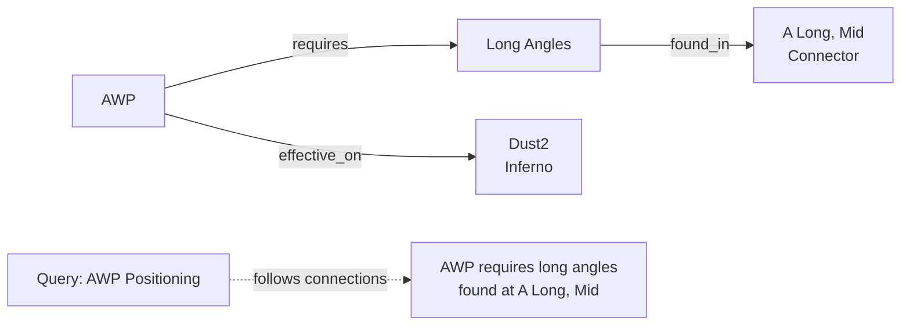

### -Knowledge Base Initialization (`init_knowledge_base.py`)

Orchestration script that populates the RAG database with tactical knowledge from two sources:

1. **Manual knowledge:** Loading from JSON files (`data/tactical_knowledge.json`) with manually curated tips per category and map
2. **Automatic mining:** Invocation of `ProDemoMiner.mine_all_pro_demos()` to extract tactical patterns from professional demos

After loading, it generates a report per category and map using aggregate COUNT queries (without loading every record into memory).

### -ProDemoMiner (`pro_demo_miner.py`)

Extracts tactical knowledge from professional demos using pattern detection:

| Class | Lines | Description |
|---|---|---|
| `ProDemoMiner` | ~180 | Pattern extraction from match metadata (map, team, success rate) |
| `AdvancedProDemoMiner(ABC)` | ~60 | Abstract base (F5-05) for demo parsing with demoparser2 |

**Quality thresholds:**

| Constant | Value | Meaning |
|---|---|---|
| `MIN_SUCCESS_RATE` | 0.70 | Pattern accepted only if success ≥70% |
| `MIN_SAMPLE_SIZE` | 5 | At least 5 occurrences for a valid pattern |

**Supported maps:** mirage, dust2, inferno, nuke, overpass, vertigo, ancient, anubis.

**Types of knowledge generated:**
- Map-specific knowledge (positioning, utility, rotations)
- Team-specific knowledge (strategies, tendencies, styles)
- Successful-execution knowledge (patterns with ≥70% rate)

### -Round Utils (`round_utils.py`)

Shared utility for round economic phase classification, extracted to eliminate duplication between the knowledge and services layers:

| Equipment Value | Phase | Constant |
|---|---|---|
| < $1,500 | `pistol` | `_PISTOL_MAX_EQUIP` |
| $1,500 – $2,999 | `eco` | `_ECO_MAX_EQUIP` |
| $3,000 – $3,999 | `force` | `_FORCE_MAX_EQUIP` |
| ≥ $4,000 | `full_buy` | — |

---

## 7. Subsystem 5 — Analysis Engines

**Folder in the repo:** `backend/analysis/`
**11 files, ~2,600 lines of production code**

This subsystem contains **11 specialized analysis engines**, each designed to investigate a different dimension of gameplay. They run as Phase 6 analyses, providing insights that go beyond what neural networks alone can offer.

> **Analogy:** Think of these 11 analysis engines as a **team of 11 different sports scientists**, each with their own specialization. One scientist studies your shooting mechanics, another your decision-making under pressure, another your ability to be unpredictable, and so on. Each scientist produces their own mini-report, and together they paint a complete picture of your strengths and weaknesses. No single scientist sees everything, but together they cover every important aspect of competitive CS2.

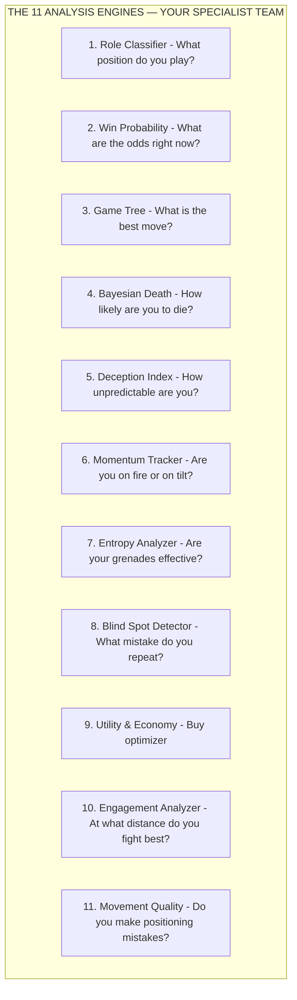

### -Role Classifier (`role_classifier.py`)

Assigns one of 6 roles using **learned statistical thresholds**:

| Role                   | Primary signal                                            | Secondary signal |
| ---------------------- | --------------------------------------------------------- | ---------------- |
| **AWPer**              | AWP kill ratio vs threshold                               | —                |
| **Entry Fragger**      | Entry rate + first-death bonus (0.3×)                     | —                |
| **Support**            | Assist rate + utility damage bonus (max 0.3×)             | —                |
| **IGL**                | Survival rate + KD balance bonus                          | —                |
| **Lurker**             | Solo kill ratio vs threshold                              | —                |
| **Flex**               | Fallback when confidence is low                           | —                |

> **Analogy:** The Role Classifier is like a **talent scout** who watches your playstyle and figures out which position you naturally fit. If you get lots of AWP kills, you are probably an AWPer. If you are always the first to die (but you also get opening kills), you are probably an Entry Fragger. If you use a lot of flashes and help your teammates, you are a Support. If nobody knows exactly what you do best, you are classified as Flex, a generalist. The thresholds are not hardcoded; they are learned from real professional player data (what percentage of kills does a real AWPer actually get with the AWP?).

**Cold-start protection:** `RoleThresholdStore` requires ≥10 samples and ≥3 valid thresholds to exit cold-start. Returns `(FLEX, 0.0)` if in cold-start. Thresholds are **persisted in the database** via `persist_to_db()` and `load_from_db()` — fully implemented, not stubs.

> **Analogy:** Cold-start protection is like a **new teacher saying "I don't know my students well enough yet".** Until the system has seen at least 10 professional players and learned at least 3 valid role thresholds, it refuses to classify anyone, returning "Flex" with 0% probability. This avoids the embarrassing mistake of calling someone an "AWPer" when the system has seen only 2 examples of what an AWPer looks like.

**Team balance audit** (`audit_team_balance()`): detects multiple AWPers (HIGH), missing Entry (HIGH), missing Support (MEDIUM), no diversity (CRITICAL), multiple Lurkers (MEDIUM).

### -Win Probability Predictor (`win_probability.py`)

12-feature neural network that estimates P(round_win | game_state):

> **Analogy:** The Win Probability predictor is like a **real-time scoreboard in a basketball game** that shows "The home team has a 72% chance of winning". It considers 12 factors about the current moment — how much money each team has, how many players are still alive, whether the bomb is planted, how much time is left — and predicts the odds. It uses a small neural network (much smaller than the RAP Coach) because it needs to be fast, updating every few seconds during live analysis.

**Architecture:** `Linear(12, 64) → ReLU → Dropout(0.2) → Linear(64, 32) → ReLU → Dropout(0.1) → Linear(32, 1) → Sigmoid`.

**12 Features:**

| \# | Feature                     | Normalization              |
| -- | --------------------------- | -------------------------- |
| 1  | team_economy                | /16000                     |
| 2  | enemy_economy               | /16000                     |
| 3  | economy differential        | (team−enemy)/16000         |
| 4  | players_alive               | /5                         |
| 5  | enemies_alive               | /5                         |
| 6  | player count differential   | (alive−enemy)/5            |
| 7  | utility_remaining           | /5                         |
| 8  | map_control_pct             | [0, 1]                     |
| 9  | time_remaining              | /115                       |
| 10 | bomb_planted                | binary                     |
| 11 | is_ct                       | binary                     |
| 12 | equipment value ratio       | min(team/enemy, 2)/2       |

**Heuristic overrides:** 3+ advantage → floor at 85%, 3+ disadvantage → ceiling at 15%, 0 alive → 0%, planted-bomb adjustments (T: +0.10, CT: −0.10) — additive on base probability, economic caps of ±$8000.

> **Analogy:** The heuristic overrides are **common-sense safety rails**. Even if the neural network glitches and predicts a 50% win probability when the whole team is dead, the safety bar says "No — 0 players alive = 0% chance. Period." Similarly, if you have 3 more alive players than the enemy, the safety rule reads: "You have AT LEAST an 85% chance of winning, regardless of what the neural network thinks". These rules encode the most basic game knowledge that should never be violated, acting as a sanity check on AI predictions.
>
> **Note A-12 — Cross-load guard:** This 12-feature predictor (`WinProbabilityNN`) is a *separate and incompatible* model from the 9-feature `WinProbabilityTrainerNN` described in Section 12. The checkpoints are not interchangeable: at load time, the `state_dict` dimensionality is validated and, on mismatch, the model is re-initialized from scratch with a log warning.

**Elo-Augmented Predictor (KT-07):**

The `EloAugmentedPredictor` wraps the base `WinProbabilityNN` with an optional Elo system to leverage match history:

> **Analogy:** Elo integration is like adding **player reputation** to the prediction. If you know that team A won 80% of recent matches, your prediction should reflect that even before the round starts. Elo captures this "accumulated reputation" that the 12-feature model cannot see because it only looks at the current round state.

| Constant | Value | Description |
|---|---|---|
| `_ELO_INITIAL` | 1500.0 | Initial Elo for players with no history |
| `_ELO_K_FACTOR` | 32.0 | Base K-factor for update magnitude |
| `_ELO_RECENCY_HALF_LIFE` | 20 matches | A match's weight halves every 20 matches |

**Elo update formula with recency weight:**

```
new_elo = old_elo + K × w × (S - E)

where:
  S = actual score (1 for win, 0 for loss)
  E = expected score = 1 / (1 + 10^((opp_elo - elo) / 400))
  w = recency weight = 2^((match_index - N + 1) / half_life)
```

The recency weight (adapted from Glickman, 1999) ensures that recent matches contribute more to the final rating. A match from 20 matches ago contributes half of the K-factor compared to the latest match.

**NN + Elo blending:**

```
final_prob = (1 - α) × nn_prob + α × elo_prob    (α = 0.15 default)
```

`compute_elo_differential(team_histories, enemy_histories)` computes the average Elo differential between the two teams, normalized by 400 (one Elo "class"), and converts it to probability via the standard logistic formula. The blend is conservative (α = 0.15) because Elo only captures historical information, while the NN sees the current round state.

**Note:** Elo is an **optional augmentation** — the base 12-feature architecture of `WinProbabilityNN` remains unchanged. If history is unavailable, the predictor falls back to pure NN probability.

### -Expectiminimax Game Tree (`game_tree.py`)

Implements **expectiminimax search** with adaptive opponent modeling:

> **Analogy:** The Game Tree is like a **chess engine for CS2**. It asks: "If I push, what might the enemy do? And if they do, what is my best response?". It builds a tree of possibilities 3 levels deep: your move, the enemy's likely response, and your counter-response. Unlike traditional chess, CS2 has randomness (you might miss a shot, the enemy might rotate), so it uses "expectiminimax", meaning it accounts for probabilities at each step. The result is a ranking like "Push is best, Hold is second, Rotate is third, Utility is fourth" with a confidence score for each option.

- **Actions:** push, hold, rotate, use_utility
- **Opponent model:** Economic priorities (eco/force/full buy), side adjustments, advantage adjustments, time pressure
- **Depth:** 3 levels (max → chance → min)
- **Node budget:** 1000 (prevents explosion)
- **Leaf evaluation:** `WinProbabilityPredictor` (lazy load)
- **Opponent learning:** Incremental EMA update (α clipped at 0.5)

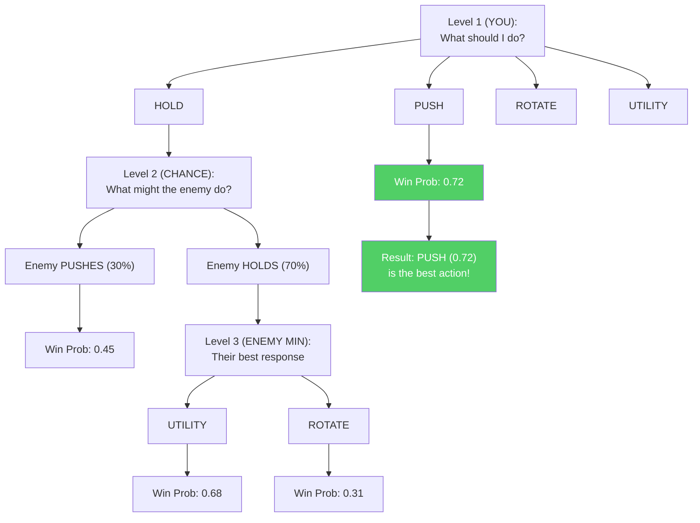

### -Bayesian Death Estimator (`belief_model.py`)

Models P(death | belief, HP, armor, weapon_class):

> **Analogy:** The Death Estimator is like a **danger indicator** that answers these questions: "Given your position, your health state, the enemy's weapon, and what we think they are doing, how likely are you to die in the next few seconds?". It uses Bayesian statistics — a fancy way of saying "start with a hypothesis, then update it with evidence". The initial hypothesis is based on HP: if you have full health, the chance of dying is about 35%; if you have low HP, the chance goes up to 80%. Then it adjusts based on what it knows: "But the enemy has an AWP (1.4× more dangerous) and the threat is recent (no decay)". This produces a final probability that the coach uses to decide whether to recommend aggressive or defensive play.

- **Prior:** Death rates per HP band (full ≥80: 0.35, damaged 40-79: 0.55, critical <40: 0.80)
- **Likelihood factors:** Threat level (with exponential decay exp(−0.1 × age)), armor reduction (0.75×), weapon multipliers (AWP: 1.4×, Rifle: 1.0×, SMG: 0.75×, Pistol: 0.6×, Knife: 0.3×)
- **Posterior:** Logistic combination in log-odds space
- **Calibration:** `calibrate(historical_rounds)` learns empirical priors (≥10 samples per band)

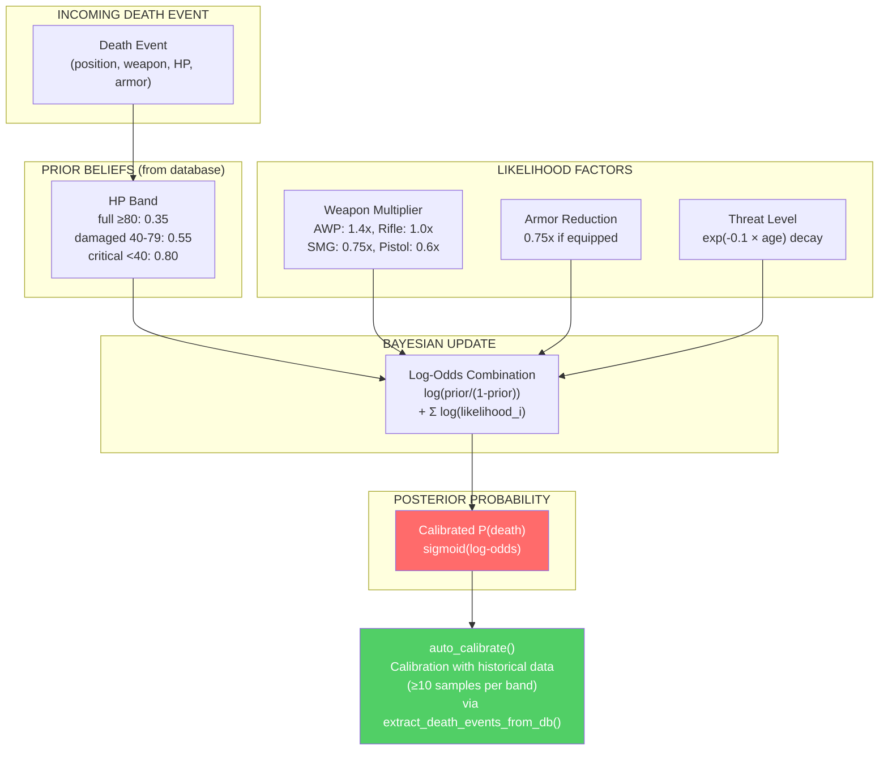

> **Calibration note (G-07):** The Bayesian Death Estimator is now a **live component** thanks to the wiring completed during remediation. The `extract_death_events_from_db()` function in the Session Engine automatically extracts death events from the database and passes them to `auto_calibrate()`, allowing the model to refine its priors based on real accumulated data. This feedback loop turns the estimator from a static model into a self-calibrating system driven by experience.

### -Deception Index (`deception_index.py`)

Quantifies tactical deception via three sub-metrics:

> **Analogy:** The Deception Index measures how **sneaky and unpredictable** a player is. In CS2, being predictable is dangerous: if the enemy knows you always peek from the same angle, they will pre-aim. The Deception Index is like a **poker-face score**: a high score means you are hard to read (good), a low score means you are transparent (bad). It measures three things: (1) Do you throw fake flashes to bait reactions? (2) Do you fake site takes by suddenly changing direction? (3) Do you alternate walking and running to confuse enemies about your position?

| Sub-metric                          | Weight | Detection method                                                                                                       |
| ----------------------------------- | ------ | ---------------------------------------------------------------------------------------------------------------------- |
| **Fake-flash frequency**            | 0.25   | Flashes that do not blind enemies — `bait_rate = 1 - effective/total`                                                  |
| **Rotation-feint frequency**        | 0.40   | Direction changes >108° detected via angular velocity sampling (20 position intervals)                                 |
| **Sound-deception score**           | 0.35   | Inverse of crouch ratio — `1.0 - crouch_ratio × 2.0`                                                                   |

Composite: `DI = 0.25·fake_flash + 0.40·rotation_feint + 0.35·sound_deception`, clamped to [0, 1].

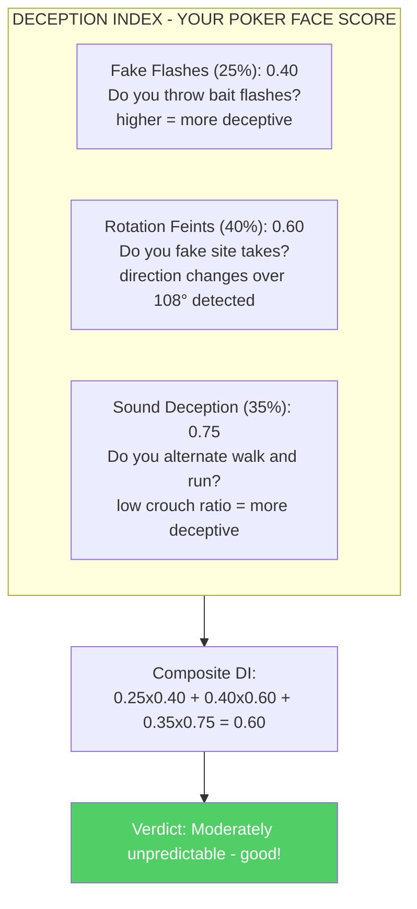

### -Momentum Tracker (`momentum.py`)

Models psychological momentum as a performance multiplier that decays over time:

> **Analogy:** The Momentum Tracker is like a mood ring for your gameplay. When you win several rounds in a row, you are "hot" — playing with confidence, taking smarter risks, and your momentum multiplier exceeds 1.2. When you lose several rounds in a row, you might be "on tilt" — frustrated, making mistakes, and your multiplier drops below 0.85. The tracker accounts for the fact that momentum fades over time (winning 3 rounds ago matters less than winning the last round) and resets at halftime (when you switch sides). It is like tracking a basketball team's "run": a 10-0 run builds momentum that affects performance.

- Winning streak: multiplier = 1.0 + 0.05 × streak length × decay
- Losing streak: multiplier = 1.0 − 0.04 × streak length × decay
- Decay: exp(−0.15 × gap_rounds)
- Bounds: [0.7, 1.4]
- Tilt detection: multiplier < 0.85
- Hot detection: multiplier > 1.2
- Mid-switch reset: Round 13 (MR12) and 16 (MR13)

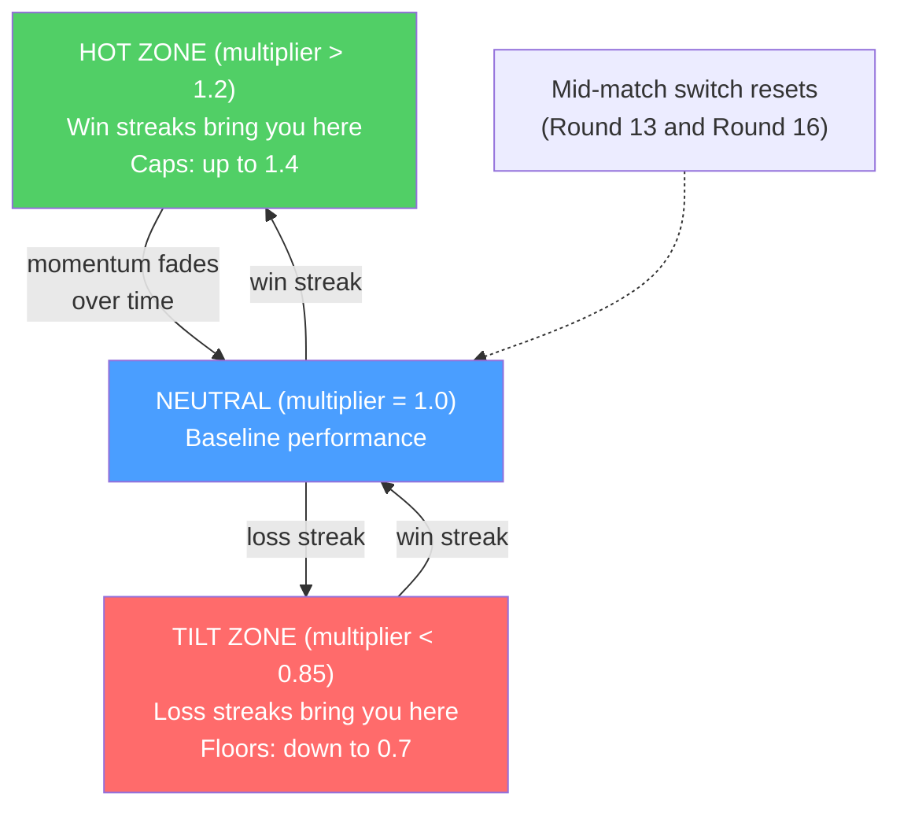

### -Entropy Analyzer (`entropy_analysis.py`)

Measures utility effectiveness via **Shannon entropy reduction** of enemy positions:

> **Analogy:** Entropy is a measure of **uncertainty**: the higher the entropy, the greater the uncertainty about enemy positions. The Entropy Analyzer asks: "Before throwing that smoke, enemies could be in 100 possible positions (high entropy). After the smoke, they could only be in 30 positions (low entropy). Your smoke reduced uncertainty by 70%, meaning it was an effective smoke!". It is like playing hide-and-seek: if you are searching an entire house, there are many hiding spots (high entropy). If you close off the kitchen and the bathroom, there are fewer hiding spots (low entropy). A good grenade reduces the number of places you have to worry about.

- Discretizes positions into a 32×32 grid
- Computes `H = −Σ p(cell) × log₂(p(cell))`
- Utility impact = `H_pre − H_post` (positive = information gained)
- Maximum entropy reductions: Smoke 2.5 bits, Molotov 2.0, Flash 1.8, HE 1.5

```mermaid
flowchart LR
    subgraph BEFORE["Before Smoke"]
        B["All positions uncertain<br/>H_pre = 8.5 bits<br/>(very uncertain)"]
    end
    subgraph AFTER["After Smoke"]
        A["The smoke blocks an area<br/>H_post = 6.0 bits<br/>(uncertainty reduced)"]
    end
    BEFORE -->|"Smoke thrown"| AFTER
    AFTER --> IMPACT["Utility impact = 8.5 - 6.0 = 2.5 bits<br/>Max possible for smoke = 2.5<br/>100% effective!"]
    style IMPACT fill:#51cf66,color:#fff
```

### -Blind Spot Detector (`blind_spots.py`)

Identifies recurring suboptimal decisions relative to the game tree's recommendations:

> **Analogy:** The Blind Spot Detector is like a **driving instructor** who notices that you always forget to check the mirrors before changing lanes. It compares what you actually did in each round with what the game tree indicated as the optimal action. If you keep pushing when you should hold, or keep holding when you should rotate, it flags that as a "blind spot", a recurring mistake you might not even be aware of. The more often a mistake occurs AND the bigger its impact, the higher its priority. Then it generates a specific training plan: "You tend to push in post-plant situations when holding is better. Practice passive post-plant positioning."

- Compares real player actions with the optimal actions of `ExpectiminimaxSearch`
- Classifies situations (post-plant, clutch, eco, late round, numerical advantage)
- Priority = `frequency × impact_rating`
- Generates natural-language training plans for the top blind spots

```mermaid
flowchart TB
    subgraph COMPARE["Your actions vs Optimal actions"]
        R3["Round 3: You PUSHED - Optimal: HOLD - WRONG"]
        R7["Round 7: You HELD - Optimal: HOLD - CORRECT"]
        R11["Round 11: You PUSHED - Optimal: HOLD - WRONG"]
        R15["Round 15: You PUSHED - Optimal: ROTATE - WRONG"]
        R19["Round 19: You HELD - Optimal: UTILITY - WRONG"]
        R22["Round 22: You PUSHED - Optimal: HOLD - WRONG"]
    end
    R3 --> PATTERN["Pattern detected: Push instead of Hold<br/>Frequency: 3/6 = 50%<br/>Impact: High - lost round advantage<br/>Priority: 0.50 x 0.80 = 0.40"]
    R11 --> PATTERN
    R15 --> PATTERN
    R22 --> PATTERN
    PATTERN --> PLAN["Training plan: Practice passive<br/>post-plant positioning. You tend to push<br/>when the game tree recommends holding."]
    style R3 fill:#ff6b6b,color:#fff
    style R11 fill:#ff6b6b,color:#fff
    style R15 fill:#ff6b6b,color:#fff
    style R19 fill:#ff6b6b,color:#fff
    style R22 fill:#ff6b6b,color:#fff
    style R7 fill:#51cf66,color:#fff
```

### -Engagement Range Analyzer (`engagement_range.py`)

Analyzes kill distances to build role- and position-specific **engagement profiles**:

> **Analogy:** The Engagement Range Analyzer is like a **sports analyst who studies where a player scores goals**. A striker scores mostly from inside the box (close-range), a midfielder from mid-range, and a defender from long-range on set pieces. Similarly, an AWPer should get more kills at long range, while an Entry Fragger should excel at close combat. If your distance profile does not match your role, the coach tells you "You are fighting too close for an AWPer" or "You are not exploiting long sightlines enough".

**Core components:**

| Component | Purpose |
|---|---|
| `NamedPositionRegistry` | Registry of per-map callouts (e.g. "A Site", "Window", "Banana") with 3D coordinates and radius |
| `EngagementRangeAnalyzer` | Euclidean killer-victim distance calculation, classification, and comparison against pro baselines |
| `EngagementProfile` | Distribution % per band: close (<500u), medium (500-1500u), long (1500-3000u), extreme (>3000u) |

**Pro baselines by role:**

| Role | Close | Medium | Long | Extreme |
|---|---|---|---|---|
| AWPer | 10% | 30% | 45% | 15% |
| Entry Fragger | 40% | 40% | 15% | 5% |
| Support | 25% | 45% | 25% | 5% |
| Lurker | 35% | 35% | 20% | 10% |
| IGL/Flex | 25% | 40% | 25% | 10% |

**Deviation threshold:** A >15% difference from the role baseline generates a coaching observation (e.g. "More close kills than typical for an AWPer — consider longer angles").

**Supported maps:** de_mirage, de_inferno, de_dust2, de_anubis, de_nuke, de_ancient, de_overpass, de_vertigo, de_train (not in the current Active Duty pool, supported for historical/workshop demos) — extendable via JSON.

```mermaid
flowchart TB
    KILLS["Kill Events<br/>(3D killer + victim positions)"]
    KILLS --> DIST["3D Euclidean<br/>Distance Calculation"]
    DIST --> CLASS["Classification:<br/>Close < 500u<br/>Medium 500-1500u<br/>Long 1500-3000u<br/>Extreme > 3000u"]
    CLASS --> PROF["Player profile:<br/>Close: 45%, Medium: 35%<br/>Long: 15%, Extreme: 5%"]
    PROF --> CMP["Comparison against<br/>AWPer baseline:<br/>Close: 10%, Medium: 30%<br/>Long: 45%, Extreme: 15%"]
    CMP --> OBS["Observation: Too much close<br/>combat for an AWPer (45% vs 10%).<br/>Consider longer angles."]
    style OBS fill:#ffd43b,color:#000
```

### -Utility and Economy Analyzer (`utility_economy.py`)

**Utility analyzer:** Effectiveness score per type vs pro baselines (Molotov: 35 damage/throw, Flash: 1.2 enemies/flash, etc.)

**Economy optimizer:** Buy advice based on economic thresholds ($5000 full buy, $2000 force, <$2000 eco), round context, score differential, and loss bonus.

> **Analogy:** The **Utility analyzer** is like a **grenade report card**: it checks whether your molotovs deal the same damage as a pro's (35 damage per throw is the benchmark), whether your flashbangs blind enough enemies (pros average 1.2 enemies per flash), and so on. **Economy Optimizer** is like a **financial advisor for CS2**: it tells you when to spend big (full buy: $5000+), when to save (eco: less than $2000), and when to take a calculated risk (force buy: $2000-$5000). It also takes the bigger picture into account: "Score is 12-10 and you are losing — maybe a force buy is worth the risk".

```mermaid
flowchart LR
    ECO["ECO ($0-$2000)<br/>Save money<br/>Pistols only"]
    FORCE["FORCE-BUY ($2000-$5000)<br/>Calculated risk<br/>SMG/Shotgun + Armor maybe"]
    FULL["FULL-BUY ($5000+)<br/>Buy everything<br/>Rifle + Armor + Utility"]
    ECO -->|"$2000"| FORCE
    FORCE -->|"$5000"| FULL
    style ECO fill:#ff6b6b,color:#fff
    style FORCE fill:#ffd43b,color:#000
    style FULL fill:#51cf66,color:#fff
```

### -Movement Quality Analyzer (`movement_quality.py`)

Detects 4 common positioning mistakes based on the MLMove paper (SIGGRAPH 2024, Stanford/Activision/NVIDIA):

> **Analogy:** The Movement Quality Analyzer is like a **soccer coach reviewing game footage in slow motion**. It does not only look at where you died — it analyzes your movement moment by moment: "You were in a dominant high-ground position and abandoned it for no reason — mistake #1. Your teammate was killed and you made a suicidal solo push — mistake #3. In another situation, your teammate created an opening but you did not move to support them — mistake #4." Each mistake is classified by type, severity, round, and exact position on the map (callout).

**4 types of mistakes detected:**

| # | Type | Detection condition | Description |
|---|---|---|---|
| 1 | `high_ground_abandoned` | Descent ≥100 units without combat context | High ground abandoned without need |
| 2 | `position_abandoned` | Position held ≥3s left without new enemy info | Consolidated position abandoned |
| 3 | `over_aggressive_trade` | Solo push after teammate death with <2 teammates left | Too aggressive trading |
| 4 | `over_passive_support` | Idle when a teammate creates an opening + numerical advantage | Too passive support |

**Key thresholds:**

| Constant | Value | Meaning |
|---|---|---|
| `_ESTABLISHED_HOLD_TICKS` | 384 (3s) | Minimum time for "established position" |
| `_HIGH_GROUND_DROP` | 100.0 units | Minimum descent to flag high ground |
| `_TRADE_WINDOW_TICKS` | 640 (5s) | Time window for trade analysis |
| `_AUDIO_RANGE_DISTANCE` | 1500.0 units | Maximum distance for "within audio range" |
| `_MOVEMENT_THRESHOLD` | 300.0 units | Minimum displacement to count as "moved" |
| `_COMBAT_PROXIMITY_TICKS` | 64 (~0.5s) | Ticks around a kill/death event for "in combat" context |

**Output dataclasses:**

- `MovementMistake`: type, round, tick, time in round, description, callout (map position), severity [0-1]
- `MovementMetrics`: map_coverage_score, high_ground_utilization, position_stability, total_rounds_analyzed, mistakes list + `mistakes_per_round` property

**Public API:**

| Method | Input | Output |
|---|---|---|
| `analyze_round_ticks(ticks, map_name, player, round)` | Ticks for a round | `List[MovementMistake]` |
| `analyze_match_ticks(all_ticks, map_name, player)` | All match ticks | `MovementMetrics` (aggregated) |
| `get_movement_quality_analyzer()` | — | `MovementQualityAnalyzer` singleton |

**ADDITIVE:** Does NOT modify METADATA_DIM=25. Movement metrics are computed as features derived from existing tick data, stored in analysis results.

```mermaid
flowchart TB
    TICKS["Tick Data<br/>(3D per-tick positions)"] --> HOLD["Detect consolidated<br/>positions (≥3s)"]
    TICKS --> HG["Detect high ground<br/>(relative elevation)"]
    TICKS --> TEAM["Detect team events<br/>(teammate deaths/kills)"]
    HOLD --> ABN["Position abandoned<br/>without new info?"]
    HG --> DROP["High ground abandoned<br/>without combat?"]
    TEAM --> AGG["Solo push after<br/>teammate death? (aggressive)"]
    TEAM --> PAS["Idle during<br/>teammate opening? (passive)"]
    ABN --> MM["MovementMetrics<br/>+ MovementMistake list"]
    DROP --> MM
    AGG --> MM
    PAS --> MM
    style MM fill:#51cf66,color:#fff
```

### Summary of the 11 Analysis Engines

| # | Engine | File | Input | Output | Complexity |
|---|---|---|---|---|---|
| 1 | Role Classifier | `role_classifier.py` | PlayerMatchStats | Role (6 classes) + confidence | O(n) features |
| 2 | Win Probability | `win_probability.py` | 12 round state features | P(CT win) ∈ [0,1] | O(1) forward pass |
| 3 | Game Tree | `game_tree.py` | Round state + actions | Optimal node (minimax) | O(b^d) branching |
| 4 | Bayesian Death | `belief_model.py` | Position + time + round | P(death) + risk factors | O(n) prior update |
| 5 | Deception Index | `deception_index.py` | Round history + positions | Unpredictability score [0,1] | O(n×m) pattern match |
| 6 | Momentum Tracker | `momentum.py` | Round sequence | hot/cold/neutral state | O(n) sliding window |
| 7 | Entropy Analyzer | `entropy_analysis.py` | Utility damage per type | Effectiveness score vs pro | O(k) per utility type |
| 8 | Blind Spot Detector | `blind_spots.py` | Death positions + angles | Repeated patterns | O(n²) clustering |
| 9 | Utility & Economy | `utility_economy.py` | Round economy + utility | Buy advice + rating | O(1) threshold check |
| 10 | Engagement Analyzer | `engagement_range.py` | 3D kill events | Distance profile (4 bands) | O(n) Euclidean dist |
| 11 | Movement Quality | `movement_quality.py` | 3D per-round tick data | MovementMetrics (4 mistake types) | O(n) per-tick scan |

---

## 8. Subsystem 6 — Processing and Feature Engineering

**Directory:** `backend/processing/`

This subsystem handles all **data preparation**, transforming raw game recordings into the precise numerical formats the neural networks need for training and inference.

> **Analogy:** This is the factory's **prep station**. Before the chefs (neural networks) can cook, the ingredients (raw game data) must be washed, peeled, cut, and measured. The Feature Extractor is the head cook who ensures everything is cut to exactly the same size every time. The Tensor Factory creates perfect "food photos" of the game state. The Data Pipeline is the dishwasher and organizer that cleans up bad data and sorts everything into piles for training/testing. Without this prep station, the chefs would receive inconsistent raw ingredients and produce terrible food.

### -Unified Feature Extractor (`vectorizer.py`)

The **single source of truth** for tick-level feature vectors. Both training (`RAPStateReconstructor`) and inference (`GhostEngine`) MUST use this class.

> **Analogy:** The Feature Extractor is the system's **universal translator**. It takes complex, messy game state data (a player's position in 3D space, health, weapons, what they see, etc.) and translates it into exactly 25 precise numbers, each scaled to fit between -1 and 1 (or 0 and 1). Think of it as converting every recipe measurement into the same unit: instead of mixing cups, spoons, grams, and liters, everything is converted to milliliters. This way every part of the system speaks the same "25-number language". If training used one translator and inference used a different one, the results would be garbage — so there is only ONE translator, shared everywhere.

**25-dimensional feature vector contract:**

| Index  | Feature               | Normalization                              | Range      |
| ------ | --------------------- | ------------------------------------------ | ---------- |
| 0      | `health`              | `/100`                                     | [0, 1]     |
| 1      | `armor`               | `/100`                                     | [0, 1]     |
| 2      | `has_helmet`          | binary                                     | {0, 1}     |
| 3      | `has_defuser`         | binary                                     | {0, 1}     |
| 4      | `equipment_value`     | `/10000`                                   | [0, 1]     |
| 5      | `is_crouching`        | binary                                     | {0, 1}     |
| 6      | `is_scoped`           | binary                                     | {0, 1}     |
| 7      | `is_blinded`          | binary                                     | {0, 1}     |
| 8      | `enemies_visible`     | `/5` (clipped)                             | [0, 1]     |
| 9      | `pos_x`               | `/4096`                                    | [−1, 1]    |
| 10     | `pos_y`               | `/4096`                                    | [−1, 1]    |
| 11     | `pos_z`               | `/1024`                                    | [−1, 1]    |
| 12     | `view_yaw_sin`        | `sin(yaw_rad)`                             | [−1, 1]    |
| 13     | `view_yaw_cos`        | `cos(yaw_rad)`                             | [−1, 1]    |
| 14     | `view_pitch`          | `/90`                                      | [−1, 1]    |
| 15     | `z_penalty`           | `compute_z_penalty()`                      | [0, 1]     |
| 16     | `kast_estimate`       | KAST from stats or 0.70 default            | [0, 1]     |
| 17     | `map_id`              | Deterministic hash-based encoding          | [0, 1]     |
| 18     | `round_phase`         | 0=pistol, 0.33=eco, 0.66=force, 1=full     | [0, 1]     |
| 19     | `weapon_class`        | Weapon class mapping (0-1)                 | [0, 1]     |
| 20     | `time_in_round`       | `/115` (seconds in round)                  | [0, 1]     |
| 21     | `bomb_planted`        | binary                                     | {0, 1}     |
| 22     | `teammates_alive`     | `/4` (alive teammates)                     | [0, 1]     |
| 23     | `enemies_alive`       | `/5` (alive enemies)                       | [0, 1]     |
| 24     | `team_economy`        | `/16000` (average team money)              | [0, 1]     |

**Design decisions:**

- **Cyclical yaw encoding** (sin/cos at indices 12-13) eliminates the ±180° discontinuity
- **Z penalty** (index 15) quantifies wrong-level risk for multilevel maps
- **Tactical context integration** (indices 19-24) gives the model game-situation awareness
- **KAST estimate fallback chain:** explicit value → stats-based computation → 0.70 default
- **Map identity encoding:** deterministic hash enables map-specific learning
- **HeuristicConfig** (`base_features.py`) allows overriding all normalization bounds via JSON

> **Design decisions explained:** The **cyclical yaw encoding** (sin/cos) solves a sneaky problem: if you encode the direction a player looks as a single angle, looking left (-179°) and looking right (+179°) appear mathematically very distant, even though they are almost the same direction. Using sine and cosine, the math correctly understands they are close — like wrapping a ruler into a circle so 0° and 360° touch. The **Z penalty** is a "wrong-floor alarm": on multilevel maps like Nuke, being on the wrong floor is a disaster, so the model tracks that risk explicitly. **Tactical integration** (economy, alive counts, time) lets the coach know whether an aggressive play is correct given the remaining time or numerical advantage.

### -HLTV 2.0 Rating (`rating.py`)

The **unified rating module** that prevents training-inference skew:

```
R = (R_kill + R_survival + R_kast + R_impact + R_damage) / 5

where:
R_kill = KPR / 0.679
R_survival = (1 − DPR) / 0.317
R_kast = KAST / 0.70
R_impact = (2.13·KPR + 0.42·ADR/100) / 1.0
R_damage = ADR / 73.3
```

> **Analogy:** The HLTV 2.0 rating is like a **GPA** for CS2 players. Instead of averaging grades in Math, English, Science, History, and Art, it averages five CS2 "subjects": Kill rate, Survival rate, KAST (how often you contributed), Impact (how much your kills mattered), and Damage (total damage dealt). Each subject is normalized by the pro average (like grading on a curve): if pros average 0.679 kills per round, getting 0.679 KPR gives you a "B" (1.0). Getting more gives you an "A+"; getting less gives you a "C". The fact that both training and inference use the exact same formula prevents "training-inference skew" — making sure the same grading rubric is used for practice tests and the final exam.

Used by: demo_parser.py (analysis), base_features.py (aggregation), coaching_service.py (insights).

### -PlusMinus and Role-Adjusted Rating Metrics (`rating.py`) — KT-06

Complementary module to the HLTV 2.0 rating that provides two additional metrics designed to capture aspects Rating 2.0 overlooks:

> **Analogy:** If the HLTV 2.0 Rating is a student's **GPA** (overall average), PlusMinus is a basketball player's **plus-minus** (+/-, how much the team gains when you are on the floor), and Role-Adjusted Rating is like a **grade adjusted for course difficulty**: an 85 in Advanced Physics counts more than a 90 in Intro to Music. A support with 0.85 K/D is not worse than an entry fragger with 1.10 K/D — they are simply doing a different job. This module captures exactly that.

**PlusMinus:**

```
PlusMinus = (kills - deaths) / max(rounds_played, 1) + team_contribution_bonus
```

| Component | Formula | Typical range |
|---|---|---|
| Net frag differential | `(kills - deaths) / rounds` | [-1.0, +1.0] |
| Team contribution bonus | `_TEAM_CONTRIBUTION_SCALE × (team_win_rate - 0.5)` | [-0.05, +0.05] |
| `_TEAM_CONTRIBUTION_SCALE` | 0.10 | — |

The team-contribution bonus rewards players on winning teams and penalizes those on losing teams, analogous to +/- in basketball/hockey.

**Role-Adjusted Rating (Bayesian):**

Applies role-specific Bayesian priors so that AWPers are not penalized for lower KAST and supports are not penalized for lower K/D:

| Role | K/D Prior | KAST Prior | ADR Prior | Weight |
|---|---|---|---|---|
| AWPer | 1.15 | 0.68 | 75.0 | 5.0 |
| Entry | 0.95 | 0.72 | 80.0 | 5.0 |
| Support | 0.90 | 0.78 | 65.0 | 5.0 |
| Lurker | 1.05 | 0.70 | 72.0 | 5.0 |
| IGL | 0.88 | 0.74 | 68.0 | 5.0 |

Priors calibrated from the average data of HLTV top-30 teams (2024-2025 season). Composite formula:

```
adj_metric = (n × observed + weight × prior) / (n + weight)
role_adjusted_rating = 0.40 × adj_kd + 0.35 × adj_kast + 0.25 × adj_adr_norm
```

Where `adj_adr_norm = adj_adr / 120` normalizes ADR to [0, 1]. The framework is inspired by TrueSkill (Herbrich et al., NeurIPS 2006) — when the sample is small (low `n`), the prior dominates; when the sample is large, the observed data dominates.

```mermaid
flowchart TB
    STATS["Player Stats<br/>(kills, deaths, adr, kast)"] --> PM["compute_plus_minus()<br/>Net frag/round + team bonus"]
    STATS --> RA["compute_role_adjusted_rating()<br/>Role-specific Bayesian prior"]
    ROLE["Detected role<br/>(from RoleClassifier)"] --> RA
    PM --> OUT["Complementary metrics:<br/>PlusMinus: +0.35<br/>Role-Adjusted: 1.12"]
    RA --> OUT
    style OUT fill:#51cf66,color:#fff
```

### -Tensor Factory (`tensor_factory.py`)

Converts raw tick data into 64x64 image tensors for the RAP perception layer:

| Tensor              | Channels    | Content                                                                                        |
| ------------------- | ----------- | ---------------------------------------------------------------------------------------------- |
| **Map**             | 3 (R/G/B)   | R: player position, G: teammates (α-blended), B: enemies (α-blended)                           |
| **View**            | 3           | **Ch0:** current FOV mask (90° default, trigonometric masking); **Ch1:** danger zone (= 1 − FOV accumulated over the last 8 ticks), areas never checked are potential enemy positions; **Ch2:** safe zone (= 1 − current FOV − danger zone), the area between current view and unexplored zones |
| **Motion**          | 2 or 3      | Velocity/acceleration heatmaps (Gaussian-blurred 2D blobs)                                     |

> **Fix G-02 (Danger Zone):** Previously the view tensor had 3 identical channels (placeholder). After remediation, the 3 channels encode distinct tactical information: the **current FOV** shows what the player sees now, the **danger zone** accumulates the FOV history of the last 8 ticks (~125ms at 64 Hz) and inverts the result to identify areas never checked — where enemies could hide — and the **safe zone** represents the intermediate area between current view and unexplored zones. The danger zone calculation uses `np.maximum(accumulated_fov, tick_fov)` for each historical tick, then `danger_zone = 1.0 − accumulated_fov`. This gives the RAP model spatial awareness of visual coverage, turning the view tensor from a simple static input into a **temporal tactical indicator**.

```mermaid
flowchart TB
    subgraph VIEW_TENSOR["3-CHANNEL VIEW TENSOR (64x64, G-02)"]
        CH0["Channel 0: Current FOV<br/>90° trigonometric mask<br/>1.0 = in field of view<br/>0.0 = out of sight"]
        CH1["Channel 1: Danger Zone<br/>1.0 − accumulated FOV (8 ticks)<br/>High = never checked = DANGER<br/>Low = recently checked"]
        CH2["Channel 2: Safe Zone<br/>1.0 − current FOV − danger<br/>Intermediate area between<br/>current view and unexplored"]
    end
    CH0 --> STACK["np.stack([ch0, ch1, ch2])<br/>→ torch.Tensor [3, 64, 64]"]
    CH1 --> STACK
    CH2 --> STACK
    STACK --> PERC["Ventral ResNet stream<br/>(RAP Perception)"]
    style CH0 fill:#51cf66,color:#fff
    style CH1 fill:#ff6b6b,color:#fff
    style CH2 fill:#ffd43b,color:#000
```

> **Analogy:** Tensor Factory creates **tiny 64x64 pixel paintings** of the game situation that the RAP coach can look at. The **map tensor** is like a bird's-eye painting: the player is a red dot, teammates are green dots, enemies are blue dots. The **view tensor** is the same painting, but with everything outside the player's 90° field of view erased — like wearing blinders, so the model only sees what the player could actually see. The **motion tensor** is like a long-exposure photograph: fast-moving players leave bright streaks, still players are invisible. Together, these three "paintings" give the RAP coach a complete visual understanding of every moment.

### -Heatmap Engine (`heatmap_engine.py`)

High-performance Gaussian occupancy maps for tactical visualization:

- Thread-safe data generation (`generate_heatmap_data()`)
- Texture creation on the main thread only (OpenGL)
- Differential heatmaps with hotspot detection for positional training

> **Analogy:** The Heatmap Engine creates **heat maps**, similar to the weather maps you see on TV, but for player positions. Areas where the player often is light up red, while areas they never visit are cold blue. The "differential" heatmap shows the difference between YOUR positions and PRO positions: if a spot lights up red, you spend too much time there compared to pros; if it lights up blue, you never go there but pros do. This visualization immediately shows "you spend too much time at A and not enough rotating to mid".

### -Data Pipeline (`data_pipeline.py`)

`ProDataPipeline` manages ML-ready data preparation:

1. **Fetches** all `PlayerMatchStats` from the database
2. **Cleans** outliers (`avg_adr < 400`, `avg_kills < 3.0`)
3. **Scales** via `StandardScaler`
4. **Splits** temporally (70/15/15) with chronological ordering per group (pro/user)
5. **Keeps** the `dataset_split` column in place

> **Analogy:** Data Pipeline is like a **school admissions office** preparing student files for classes. First it **pulls all files** from the database. Then it **removes the cheaters**, i.e. anyone with unbelievably high stats (an ADR above 400 means they probably used hacks or the data is corrupted). Next it **standardizes the grades** so everything is on the same scale. Then it **sorts students chronologically** and assigns 70% to the "learning class" (training), 15% to the "quiz class" (validation), and 15% to the "final exam class" (test). The temporal split is crucial: it means the model never sees "future" data during training, preventing cheating through time travel.

### -Demo Quality Scorer (`demo_quality.py`) — KT-09

Evaluates the quality of ingested demo data using robust statistical methods based on **Huber's contamination model** (1981):

> **Analogy:** The Demo Quality Scorer is like a **health inspector for data**. Before letting food (a demo) into the kitchen (training pipeline), the inspector examines it: "Is this ingredient fresh? (enough tick coverage?) Is it complete? (do all fields have values?) Does it look strange? (suspiciously high or low stats?)". If the inspection fails, the ingredient is marked as "to be reviewed" or "to be discarded" — never used directly in the kitchen without a check.

| Component | Weight | Method |
|---|---|---|
| **Tick coverage** | 45% | `tick_count / _EXPECTED_TICKS_PER_DEMO` (1.6M) |
| **Feature completeness** | 35% | Fraction of non-zero values across health, armor, pos_x/y/z, equipment_value |
| **Outlier penalty** | 20% | IQR detection on avg_kills, avg_deaths, avg_adr, kd_ratio, avg_kast |

**Outlier detection (Tukey's IQR method):**

| Severity | IQR multiplier | Meaning |
|---|---|---|
| Moderate | 1.5× | Unusual stats — to review |
| Extreme | 3.0× | Highly suspicious stats — probable corruption |

**Quality classification:**

| Score | Recommendation | Conditions |
|---|---|---|
| ≥ 0.7 | `"use"` | Sufficient quality + no extreme flags |
| ≥ 0.4 | `"review"` | Uncertain quality — manual review recommended |
| < 0.4 | `"skip"` | Insufficient quality — excluded from training |

The robustness of the IQR method guarantees a 25% breakdown point (Huber's epsilon-contamination model): up to 25% of the data can be corrupt without invalidating the detection.

### -Demo Prioritizer (`demo_prioritizer.py`) — KT-09

Ranks available demos by expected coaching value, inspired by **Active Learning** principles (Settles, 2009):

> **Analogy:** The Demo Prioritizer is like a **teacher choosing which homework to grade first**. Instead of grading in chronological order, the teacher briefly looks at each assignment and decides: "This one looks easy — my mental model understands it well (low variance). This other one looks strange — I am not sure how to grade it (high variance). I will grade the strange one first, because I will learn more from it!". In ML terms: demos where the model is most uncertain are the ones that provide the most learning signal.

**Two ranking strategies:**

| Strategy | Condition | Method | Metric |
|---|---|---|---|
| **Variance** (primary) | JEPA model loaded | Variance of latent-space predictions on demo ticks | High variance = high coaching value |
| **Diversity** (fallback) | No model available | Composite score: 40% unique players + 30% completeness + 30% player rarity | Maximize distribution coverage |

**Constants:**

| Constant | Value | Purpose |
|---|---|---|
| `_MIN_TICKS_FOR_VARIANCE` | 64 | Minimum ticks for meaningful variance |
| `_MAX_TICKS_SAMPLE` | 2048 | Sampling cap to avoid OOM |

### -Bombsite-Relative Encoding (`bombsite_encoding.py`) — KT-10

Encodes positions relative to bombsites to obtain **approximate equivariance** under CT/T symmetry:

> **Analogy:** Instead of describing your position with absolute coordinates ("I am at x=1200, y=800"), bombsite-relative encoding describes it as "I am 400 units from A site and 1200 units from B site". This is more tactically informative: knowing how close you are to an objective is more useful than raw coordinates. Additionally, by flipping the sign for T vs CT side, the model understands that "near A site" has opposite tactical meanings for attackers and defenders.

**Bombsite coordinates for 9 maps** (from DDS radar textures + community callouts):

de_dust2, de_mirage, de_inferno, de_nuke, de_overpass, de_anubis, de_vertigo, de_ancient, de_train.

**Key functions:**

| Function | Output | Description |
|---|---|---|
| `get_bombsite_distances(pos_x, pos_y, map)` | `(dist_A, dist_B)` | Euclidean distances to bombsite centers |
| `normalize_position_equivariant(pos_x, pos_y, map, side)` | `[-1, 1]` | Signed differential: CT positive, T negated |
| `compute_site_proximity(pos_x, pos_y, map)` | `(site, dist_norm)` | Closest site + normalized distance |

**Equivariant design:** For CS2's discrete symmetry (|G| = 2, CT vs T), the encoding is trivially cheap: just negate the output for the opposite side. This allows the model to learn that "being near A site as CT" (defense) has opposite semantics to "being near A site as T" (attack).

**ADDITIVE:** Does NOT modify METADATA_DIM=25. Bombsite-relative features are computed as derived values that can optionally replace pos_x/pos_y in the feature vector via a config flag, or be used as supplemental context in coaching analysis.

### -Per-Round Stats Generator (`round_stats_builder.py`)

Bridges raw demo events to the **per-round isolation layer** (`RoundStats` in `db_models.py`), preventing statistical contamination between rounds and enabling detailed per-round coaching analysis.

> **Analogy:** Instead of giving you one grade for the entire test, this module grades **each individual question** (per-round stats), then averages them for the final report card (match-level stats). A bad third round does not silently drag down your fifteenth round score: every round is independent. It is like a teacher writing detailed comments on every problem of a homework rather than just assigning a letter grade.

**Key functions:**

| Function                                             | Purpose                                                                                                                              |
| :--------------------------------------------------- | :----------------------------------------------------------------------------------------------------------------------------------- |
| `build_round_stats(parser, demo_name)`               | Parses round_end, player_death, player_hurt, player_blind events and builds per-round stats                                          |
| `enrich_from_demo(demo_path, demo_name)`             | Full enrichment: noscope/blind kills, flash/smoke counts, flash assists, trade kills, utility analysis                               |
| `aggregate_round_stats_to_match(round_stats_list)`   | Processes round-level stats → match-level PlayerMatchStats                                                                           |
| `compute_round_rating(round_stats)`                  | HLTV 2.0 per-round rating using the unified rating module                                                                            |

**Enrichment pipeline:**

```mermaid
flowchart TB
    DEM[".dem File"] -->|demoparser2| EVT["Raw Events<br/>(kills, damage, blinds,<br/>round_end)"]
    EVT -->|"enrich_from_demo()"| RS["RoundStats rows<br/>(per-round, per-player)"]
    RS -->|"compute_round_rating()"| RS2["RoundStats + round_rating"]
    RS2 -->|"aggregate_round_stats_to_match()"| PMS["PlayerMatchStats<br/>(match-level aggregates)"]
    RS2 -->|persist| DB["Database<br/>(RoundStats table)"]
    PMS -->|persist| DB2["Database<br/>(PlayerMatchStats table)"]
```

**Kill enrichment fields** added by `enrich_from_demo()`:

| Field               | Detection method                                                                          |
| ------------------- | ----------------------------------------------------------------------------------------- |
| `noscope_kills`     | Kills where AWP/Scout/SSG is equipped but `is_scoped=False`                               |
| `blind_kills`       | Kills where `attacker_blinded=True` at the moment of death                                |
| `flash_assists`     | Kills within 128 ticks (2s) of an enemy being flashed by the same team                    |
| `thrusmoke_kills`   | Kills through a smoke grenade (from demo event flags)                                     |
| `wallbang_kills`    | Kills through wall penetration (from demo event flags)                                    |
| `trade_kills`       | Kills within 5s of a teammate's death at the hands of the same enemy                      |

**Integration with ingestion pipelines:** Both `user_ingest.py` and `pro_ingest.py` now call `enrich_from_demo()` after demo parsing and persist the resulting `RoundStats` objects to the database. This ensures every ingested demo, user or pro, produces granular per-round data.

### -Temporal Baseline Decay (`pro_baseline.py`)

The `TemporalBaselineDecay` class complements (it does not replace) the existing `get_pro_baseline()` function with a time-weighted average, ensuring that coach comparisons reflect the **current CS2 meta** rather than stale historical averages.

> **Analogy:** Old exam scores count for less than recent ones when computing the class average. A professional player's stats from 6 months ago are "faded" (less important) relative to last week's stats. This way, if the game meta changes — for example, AWP usage drops after a balance patch — the baseline updates automatically without manual recalibration.

**Decay formula:**

```
weight(age_days) = max(MIN_WEIGHT, exp(-ln(2) × age_days / HALF_LIFE))
```

| Parameter                | Value | Meaning                                                                         |
| ------------------------ | ----- | ------------------------------------------------------------------------------- |
| `HALF_LIFE_DAYS`         | 90    | Weight halves every 90 days                                                     |
| `MIN_WEIGHT`             | 0.1   | Minimum threshold: very old data still contributes 10%                          |
| `META_SHIFT_THRESHOLD`   | 0.05  | A 5% variation between epochs signals a meta shift                              |

**Key methods:**

| Method                                    | Purpose                                                                                    |
| ----------------------------------------- | ------------------------------------------------------------------------------------------ |
| `compute_weight(stat_date)`               | Exponential decay weight for a single stat card                                            |
| `compute_weighted_baseline(stat_cards)`   | Time-weighted mean/std across all ProPlayerStatCard records                                |
| `get_temporal_baseline(map_name)`         | Complete pipeline: fetch cards → weight → merge with legacy defaults                       |
| `detect_meta_shift(old, new)`             | Flags metrics that have drifted by ≥ 5% between reference epochs                           |

**Integration points:**

- **CoachingService:** `_get_temporal_baseline()` uses it for COPER enrichment
- **Teacher Daemon:** `_check_meta_shift()` runs after every retraining cycle, logging drifted metrics

```mermaid
flowchart TB
    CARDS["ProPlayerStatCard<br/>(DB records)"] --> WEIGHT["compute_weight()<br/>exponential decay, half-life=90d"]
    WEIGHT --> WB["compute_weighted_baseline()<br/>time-weighted mean/std"]
    WB --> MERGE["merge with legacy<br/>get_pro_baseline()"]
    MERGE --> OUT["Temporal Baseline<br/>(dict: metric → {mean, std})"]
    OLD["Previous Baseline"] --> SHIFT["detect_meta_shift()"]
    OUT --> SHIFT
    SHIFT --> FLAG["List of Shifted Metrics<br/>(≥ 5% change)"]
    style WEIGHT fill:#ffd43b,color:#000
    style SHIFT fill:#ff6b6b,color:#fff
```

### -Validation (`validation/`)

- [**drift.py**](http://drift.py)**:** Data distribution drift detection with DriftReport objects
- [**schema.py**](http://schema.py)**:** Schema validation for database records
- [**sanity.py**](http://sanity.py)** / dem\_[validator.py](http://validator.py):** Data and demo-file integrity checks

> **Analogy:** The validation subsystem is the factory's **quality control inspector**. Drift detection checks: "Is the data we are receiving today similar to the data we trained on, or have things changed?" (like checking whether a cookie recipe still tastes like last month's batch). Schema validation checks: "Does every database record have all required fields in the correct format?" (like making sure every form is completely filled out). Integrity checks verify that demo files are real, complete, and uncorrupted (like shaking a box to make sure it is not empty before shipping).

**Quantitative coverage:** The project includes **1,515+ tests** distributed across 94 test files and **319+ headless validator checks** organized across 24+ validation phases. This coverage spans DB schema integrity, embedding vector consistency, training pipeline correctness, and end-to-end validation of coaching flows.

### -PlayerKnowledge — NO-WALLHACK Perception System (`player_knowledge.py`)

**Player-POV** perception model that reconstructs what a player legitimately knows at every tick, without wallhack information. This is the foundation for ethically correct coaching: the coach sees only what the player saw.

> **Analogy:** PlayerKnowledge is like the **fog-of-war rules** in a strategy game. In an RTS, you cannot see the enemy until they enter your field of view. Similarly, this system guarantees that the coach does not "cheat" by using information the player could not have: it sees only enemies in the FOV, remembers the last known positions with temporal decay (like human memory fading), and infers sound positions within realistic distances.

**Perception dataclasses:**

| Dataclass | Fields | Description |
|---|---|---|
| `VisibleEntity` | position, distance, is_teammate, health, weapon | Entity visible in the FOV |
| `LastKnownEnemy` | position, tick_seen, confidence | Enemy position from memory (decay) |
| `HeardEvent` | position, distance, direction_rad, event_type | Perceived sound event |
| `UtilityZone` | position, radius, utility_type, team | Active utility zone |
| `PlayerKnowledge` | own_state, visible_entities, last_known, heard_events, utility_zones | Complete output |

**Sensory constants:**

| Constant | Value | CS2 meaning |
|---|---|---|
| `FOV_DEGREES` | 90.0 | CS2 horizontal field of view |
| `HEARING_RANGE_GUNFIRE` | 2000.0 | Max distance for gunfire perception (world units) |
| `HEARING_RANGE_FOOTSTEP` | 1000.0 | Max distance for footstep perception |
| `MEMORY_DECAY_TAU` | 160 | Memory half-life: 2.5s at 64 tick/s |
| `MEMORY_CUTOFF_TICKS` | 320 | Memory cutoff: 5 seconds max |
| `SMOKE_RADIUS` | 200.0 | Smoke zone radius |
| `MOLOTOV_RADIUS` | 100.0 | Molotov zone radius |

**Perception pipeline:**

```mermaid
flowchart TB
    TICK["Tick Data<br/>(all players)"] --> VIS["Visibility Check<br/>90° FOV + enemies_visible count"]
    TICK --> MEM["Enemy Memory<br/>Last known positions<br/>decay τ=160, cutoff=320 ticks"]
    TICK --> SND["Sound Inference<br/>Gunfire 2000u, Footsteps 1000u<br/>direction in radians"]
    TICK --> UTL["Utility Zones<br/>Smoke 200u, Molotov 100u"]
    VIS --> PK["PlayerKnowledge<br/>(NO-WALLHACK output)"]
    MEM --> PK
    SND --> PK
    UTL --> PK
    PK --> COACH["Coach / RAP Model<br/>(fair coaching)"]
```

**FOV check:** `_is_in_fov()` uses trigonometry (atan2 + angle_diff) to determine whether a target falls within the player's horizontal field of view. Only enemies confirmed visible (from the demo's `enemies_visible` counter) are included.

### -RAPStateReconstructor (`state_reconstructor.py`)

**Vision Bridge Phase 1:** Converts sequences of `PlayerTickState` from the DB into perception tensors for the RAP-Coach model:

- **Metadata:** METADATA_DIM (25) vector from the unified `FeatureExtractor`
- **Perception:** view/map/motion tensors from `TensorFactory`
- **Player-POV:** Optional mode via the `knowledge` parameter (PlayerKnowledge)
- **Windowing:** Temporal windows of `sequence_length=32` ticks with 50% overlap

### -ConnectMapContext (`connect_map_context.py`)

Z-aware spatial features for multilevel maps (Task 2.17.1):

| Constant | Value | Use |
|---|---|---|
| `Z_LEVEL_THRESHOLD` | 200 | Separation between levels (world units) |
| `Z_PENALTY_FACTOR` | 2.0× | Cross-level distance multiplier |

**Output:** A 6-feature normalized spatial vector [0,1]: distance to bombsite A/B, distance to T/CT spawn, distance to mid, Z penalty. Distances computed with `distance_with_z_penalty()` to penalize cross-level paths on Nuke/Vertigo.

### -CVFrameBuffer (`cv_framebuffer.py`)

Thread-safe ring buffer for RGB frames (Task 2.24.2) with HUD region extraction:

| Region | Coordinates (1920×1080) | Content |
|---|---|---|
| `MINIMAP_REGION` | (0, 0, 320, 320) | Minimap (top-left) |
| `KILL_FEED_REGION` | (1520, 0, 1920, 300) | Kill feed (top-right) |
| `SCOREBOARD_REGION` | (760, 0, 1160, 60) | Scoreboard (top-center) |

**Dynamic resolution scaling:** All regions scale automatically relative to `REFERENCE_RESOLUTION = (1920, 1080)` to support different resolutions. BGR→RGB conversion is integrated into the `capture_frame()` method.

### -EliteAnalytics (`external_analytics.py`)

Loads and analyzes CSV reference datasets (top 100 players, match stats, tournament data):

- **7 datasets:** top100, top100_core, match_stats, player_stats, kills_processed, historical_stats, tournament_stats
- **Z-score computation:** `_calc_z_scores()` compares user vs historical mean for ADR, deaths, kills, rating, HS%
- **Tournament Z-score:** `_calc_tournament_z()` compares vs tournament baseline for accuracy, econ_rating, utility_value
- **Graceful degradation:** `is_healthy()` = True if ≥1 dataset was loaded successfully

### -MetaDriftEngine (`meta_drift.py`)

**Pillar 2 Phase 3 — Meta-Drift Surveillance:**

Compares pro positions from the last 30 days vs historical to detect meta shifts:

```mermaid
flowchart LR
    STAT["Statistical Drift<br/>(rating mean shift)"] -->|"40%"| COEFF["Drift Coefficient"]
    SPATIAL["Spatial Drift<br/>(position centroid shift)"] -->|"60%"| COEFF
    COEFF --> ADJ["Confidence Adjustment<br/>1.0 = stable<br/>< 1.0 = meta shifting"]
```

**Integration:** `HybridCoachingEngine._calculate_confidence()` calls `MetaDriftEngine.get_meta_confidence_adjustment()` to penalize insight confidence when the meta is unstable.

### -NicknameResolver (`nickname_resolver.py`)

**Task 2.18.2:** Resolves in-game demo nicknames to HLTV ProPlayer IDs with 3-tier matching:

| Tier | Method | Example |
|---|---|---|
| 1. Exact | Case-insensitive match | "s1mple" → ProPlayer.hltv_id |
| 2. Substring | Nickname contained in demo name | "FaZe_ropz" contains "ropz" |
| 3. Fuzzy | SequenceMatcher ≥ 0.8 threshold | "s1mpl3" ≈ "s1mple" |

Handles team tags and clan prefixes. O(n) complexity per query, acceptable for <1,000 pros in the DB.

### -ProBaseline (`pro_baseline.py`)

**Task 2.18.1:** Pro baseline system with map-specific support and a 3-tier fallback chain:

```mermaid
flowchart TB
    REQ["get_pro_baseline(map_name)"] --> DB{"DB has<br/>ProPlayerStatCard?"}
    DB -->|"Yes"| DBBL["Baseline from DB<br/>(aggregated by map)"]
    DB -->|"No"| CSV{"CSV dataset<br/>available?"}
    CSV -->|"Yes"| CSVBL["Baseline from CSV"]
    CSV -->|"No"| HARD["HARD_DEFAULT_BASELINE<br/>(16 hardcoded metrics)"]
    DBBL --> OUT["dict: metric → {mean, std}"]
    CSVBL --> OUT
    HARD --> OUT
```

**HARD_DEFAULT_BASELINE** (16 metrics with mean + std):

| Metric | Mean | Std |
|---|---|---|
| rating | 1.06 | 0.15 |
| kpr | 0.68 | 0.12 |
| dpr | 0.62 | 0.10 |
| adr | 77.8 | 12.0 |
| kast | 0.70 | 0.06 |
| hs_pct | 0.45 | 0.10 |
| impact | 1.05 | 0.20 |
| opening_kill_ratio | 1.05 | 0.30 |
| clutch_win_pct | 0.15 | 0.08 |
| ... | ... | ... |

**`calculate_deviations(player_stats, baseline)`** — Computes the Z-score for each feature: `z = (player_value - mean) / std`. Handles both flat baselines (legacy) and structured baselines (dict with mean/std).

### -RoleThresholdStore (`role_thresholds.py`)

**Anti-mock principle:** All role thresholds learn exclusively from real pro data (HLTV, demos, ML):

| Statistic | Description | Cold-Start Default |
|---|---|---|
| `awp_kill_ratio` | % of kills with AWP | — |
| `entry_rate` | Entry frag rate | — |
| `assist_rate` | Assist rate | — |
| `survival_rate` | Survival rate | — |
| `solo_kill_rate` | Solo kill rate | — |
| `first_death_rate` | First death rate | — |
| `utility_damage_rate` | Utility damage per round | — |
| `clutch_rate` | Clutch win rate | — |
| `trade_rate` | Trade kill rate | — |

**Cold-start protection:**

| Requirement | Value | Meaning |
|---|---|---|
| `MIN_SAMPLES_FOR_VALIDITY` | 10 | Minimum samples for a valid threshold |
| Minimum valid thresholds | 3 | Required to exit cold-start |
| Cold-start output | `(FLEX, 0.0)` | Generic role, 0% confidence |

**Persistence:** `persist_to_db()` / `load_from_db()` — learned thresholds survive restarts. `validate_consistency()` verifies internal consistency (e.g. entry_rate cannot be negative).

> **Analogy:** RoleThresholdStore is like a **doctor who refuses to diagnose** until enough patients have been seen. "I cannot tell you whether you are an AWPer because I have only seen 2 AWPers in my career. Come back when I have enough experience." Each threshold is learned from the percentile of real pro data, not invented. If the data changes (new meta), the thresholds update automatically.

---

## 9. Subsystem 7 — Control Module

**Folder in the repo:** `backend/control/`
**Files:** 4 modules

This subsystem is the system's **control tower**: it supervises background services, governs the databases, manages demo ingestion, and controls the ML training lifecycle.

> **Analogy:** If the whole system is an **airport**, the Control Module is the **control tower**. The Console is the chief controller who sees every screen. The ServiceSupervisor is the gate manager who starts and stops flights (services). The DatabaseGovernor is the safety inspector who checks that the runways (databases) are intact. The IngestionManager is the baggage handler who processes luggage (demos) in order. The MLController is the maintenance chief who can start, stop, or pause aircraft maintenance (training).

### -Console (`console.py`) — Singleton

The **Unified Control Console**: central authority for ML, Ingestion, and System State.

| Component | Role |
|---|---|
| `ServiceSupervisor` | Background-daemon supervisor (PID, liveness, auto-restart) |
| `IngestionManager` | Operator-governed demo ingestion controller |
| `DatabaseGovernor` | Tier 1/2/3 database integrity controller |
| `MLController` | ML training lifecycle supervisor |

**Boot sequence:**

```mermaid
sequenceDiagram
    participant C as Console
    participant SV as ServiceSupervisor
    participant DG as DatabaseGovernor
    participant IM as IngestionManager
    C->>C: __init__() [Singleton with lock]
    C->>SV: Initialize (project_root)
    C->>DG: Initialize (db_manager, match_manager)
    C->>IM: Initialize (queue processor)
    Note over C: boot()
    C->>SV: start_service("hunter") [if HLTV sync enabled]
    C->>DG: _audit_databases() [verify Tier 1/2]
    C->>DG: verify_integrity() [SELECT 1 liveness probe]
    Note over C: System operational
```

**State caches:**

| Cache | TTL | Content |
|---|---|---|
| `_baseline_cache` | 60s | Temporal baseline state (stat_cards count, mode) |
| `_training_data_cache` | 120s | Demo progress (pro/user processed, on disk, trained_on) |

**Graceful shutdown:** `shutdown()` → stops hunter → stops ingestion → stops ML training → waits up to 5s for confirmation → logs warning on timeout.

> **Fix M-08 — Settings file validation:** `load_user_settings()` validates the JSON structure on load: checks that the payload is a `dict` (not a list or primitive type), logs a detailed error if the structure is invalid, and applies a graceful fallback to default values. This prevents a corrupted or tampered `settings.json` file from causing cascading crashes in the configuration module.
>
> **Fix C-09 — Early bootstrap:** Bootstrap phases prior to logger initialization use `print()` for diagnostic messages. This avoids the `NameError` that occurred when code tried to call `logger.info()` before the logger was configured.

**Health report aggregation:** `get_system_status()` → timestamp, state, services, teacher, ml_controller, ingestion, storage, baseline, training_data. Each subsystem is isolated with `_safe_call()` — an error in one subsystem does not prevent reporting on the others.

### -ServiceSupervisor (`console.py`, internal class)

Authoritative manager for background daemons with auto-restart:

| Constant | Value | Description |
|---|---|---|
| `_MAX_RETRIES` | 3 | Max auto-restarts before giving up |
| `_RETRY_RESET_WINDOW_S` | 3600 (1h) | Retry counter reset window |
| `_RESTART_DELAY_S` | 5.0 | Delay between restart attempts |

**Service lifecycle:**

```mermaid
stateDiagram-v2
    [*] --> STOPPED
    STOPPED --> STARTING: start_service()
    STARTING --> RUNNING: Process started (PID)
    RUNNING --> CRASHED: Process exited
    RUNNING --> STOPPED: stop_service() [terminate → kill timeout 5s]
    CRASHED --> STARTING: Auto-restart (≤3 attempts/1h)
    CRASHED --> CRASHED: Max retries exceeded
```

**Managed services:** Currently only `hunter` (HLTV sync daemon: `hltv_sync_service.py`). Architecture extensible to additional daemons.

### -DatabaseGovernor (`db_governor.py`)

Authoritative controller for Tier 1, 2, and 3 databases:

| Method | Purpose |
|---|---|
| `audit_storage()` | Computes monolith + WAL + SHM size, counts Tier 3 matches, detects anomalies |
| `verify_integrity(full=False)` | Lightweight: `SELECT 1`; Full: `PRAGMA quick_check` (slow on large DBs) |
| `prune_match_data(match_id)` | Privileged deletion of match telemetry data |
| `rebuild_indexes()` | Maintenance: `REINDEX` via the ORM engine |

**Anomalies detected:**
- `CRITICAL: Monolith database.db not found!`
- `CRITICAL: hltv_metadata.db missing and no backup found.`
- `WARNING: hltv_metadata.db missing, but .bak exists. Restore required.`

**Tier Architecture:**

| Tier | Database | Content |
|---|---|---|
| Tier 1 | `database.db` (monolith) | Players, insights, profiles, models, knowledge base |
| Tier 2 | `hltv_metadata.db` | HLTV metadata, ProPlayer, ProPlayerStatCard |
| Tier 3 | `match_*.db` (per-match) | Tick-by-tick telemetry data per match |

### -IngestionManager (`ingest_manager.py`)

Demo ingestion controller with 3 operating modes:

| Mode | Behavior |
|---|---|
| `SINGLE` | Process one demo and stop |
| `CONTINUOUS` | Immediate re-scan, 30s pause if no file is found |
| `TIMED` | Re-scan every N minutes (default 30) |

**Unified cycle:**

```mermaid
flowchart TB
    START["scan_all()"] --> DISC["DISCOVERY PHASE<br/>list_new_demos(is_pro=False)<br/>list_new_demos(is_pro=True)"]
    DISC --> PROC["PROCESSING PHASE<br/>Sequential, one-by-one<br/>_queue_files() → _process_unified_queue()"]
    PROC --> MODE{"Mode?"}
    MODE -->|SINGLE| STOP["Stop"]
    MODE -->|TIMED| WAIT["Event.wait(interval × 60)<br/>F5-35: event-based, no polling"]
    MODE -->|CONTINUOUS| PAUSE["Event.wait(30s)<br/>if no file"]
    WAIT -->|"timeout or stop"| DISC
    PAUSE --> DISC
```

**Stop signal (F5-35):** `threading.Event()` for non-blocking stop — eliminates the 1-second polling in wait loops.

**StateManager integration:** Real-time parsing progress (0-100%) exposed via `state_manager.update_parsing_progress()`.

### -MLController (`ml_controller.py`)

Supervisor of the ML lifecycle with real-time intervention:

| Class | Responsibility |
|---|---|
| `MLControlContext` | Control token passed to ML loops |
| `MLController` | Thread-safe supervisor for training |

**MLControlContext — Operator commands:**

| Method | Effect |
|---|---|
| `check_state()` | Blocks if pause is active (F5-15 event-based), raises `TrainingStopRequested` if stop |
| `request_stop()` | Soft-stop at the next safe checkpoint |
| `request_pause()` | Blocks `check_state()` via `_resume_event.clear()` |
| `request_resume()` | Unblocks via `_resume_event.set()` |
| `set_throttle(value)` | 0.0 = full speed, 1.0 = max delay |

**Pipeline:** `start_training()` → daemon thread → `CoachTrainingManager.run_full_cycle(context=self.context)` → `TrainingStopRequested` caught for graceful stop → `set_error()` on crash.

> **Analogy:** MLController is like the **control panel of a nuclear reactor**. The operator can start the reactor (training), pause it for inspection, resume, or execute an emergency stop. The `check_state()` that every ML loop must call is like the control rods: the loop automatically stops at the next safe point when the operator pulls the lever.

### Inter-Daemon Coordination

The Control Module orchestrates the system's 4 daemons (Hunter, Digester, Teacher, Pulse) through communication channels based on shared state (`CoachState`) and event-based signals:

```mermaid
stateDiagram-v2
    state SYSTEM {
        [*] --> BOOT
        BOOT --> IDLE: Console.boot() completed
        IDLE --> HUNTING: Hunter activated (HLTV sync)
        IDLE --> INGESTING: Demos found
        IDLE --> TRAINING: Sufficient data + quota OK

        HUNTING --> IDLE: Sync completed
        HUNTING --> ERROR: Network / Rate limit

        INGESTING --> TRAINING: Demos processed → training trigger
        INGESTING --> IDLE: No new demos

        TRAINING --> IDLE: Completed / Early stop
        TRAINING --> PAUSED: Operator pause
        PAUSED --> TRAINING: Operator resume
        TRAINING --> ERROR: Crash / OOM

        ERROR --> IDLE: Auto-recovery (≤3 retries)
        ERROR --> FATAL: Max retries exceeded
    }
```

---

## 10. Subsystem 8 — Progress and Trends

**Folder in the repo:** `backend/progress/`
**Files:** 2 modules

Lightweight subsystem dedicated to tracking **performance trajectories** over time.

### -FeatureTrend (`longitudinal.py`)

Minimal dataclass representing the trend of a single feature:

| Field | Type | Description |
|---|---|---|
| `feature` | str | Feature name (e.g. "avg_adr") |
| `slope` | float | Linear regression slope (positive = improvement) |
| `volatility` | float | Standard deviation of values (stability) |
| `confidence` | float | min(1.0, num_samples / 30) — requires 30+ matches for full confidence |

### -TrendAnalysis (`trend_analysis.py`)

`compute_trend(values)` — Computes slope, volatility, and confidence from a series of values:

- **Slope:** Linear coefficient via `np.polyfit(x, y, 1)[0]`
- **Volatility:** `np.std(values)`
- **Confidence:** Scales linearly with sample count, full confidence at 30+

**Integration:** The results of `compute_trend()` feed `FeatureTrend` → `LongitudinalEngine.generate_longitudinal_coaching()` → trend-aware insights in coaching.

```mermaid
flowchart LR
    HIST["Match History<br/>(feature values over time)"] --> CT["compute_trend()<br/>slope + volatility + confidence"]
    CT --> FT["FeatureTrend<br/>dataclass"]
    FT --> LE["LongitudinalEngine<br/>(coaching/longitudinal_engine.py)"]
    LE --> INS["Insight:<br/>Regression or Improvement"]
```

---

## 11. Subsystem 9 — Database and Storage

**Folder in the repo:** `backend/storage/`
**Files:** 10 modules

This subsystem is the **permanent storage system** for the entire project: every piece of data — from match statistics to trained models, from coaching experiences to professional player profiles — is saved, protected, versioned, and made available through this infrastructure.

> **Analogy:** If the entire coaching system is a **hospital**, the Storage subsystem is the **central archive and the medical-records system**. There are three separate archives (Tier 1, 2, 3) to prevent whoever consults patient records (database.db) from blocking whoever archives specialist doctor statistics (hltv_metadata.db) or the person recording the surveillance cameras (match_*.db per-match). The `DatabaseManager` is the head archivist who manages the cabinet keys, the `BackupManager` is the security officer who makes nightly copies of everything, and the `MatchDataManager` is the technician who manages the camera room where each recording has its own dedicated tape. No data is ever lost: there are daily and weekly copies, integrity checks, and a migration system that updates the archives when the file format changes.

**Tri-Database architecture:**

```mermaid
flowchart TB
    subgraph TIER1["Tier 1 — database.db (Application Core)"]
        PMS["PlayerMatchStats<br/>(match stats)"]
        PTS["PlayerTickState<br/>(per-tick states)"]
        RS["RoundStats<br/>(per-round stats)"]
        CS["CoachState<br/>(singleton, id=1)"]
        CI["CoachingInsight"]
        IT["IngestionTask"]
        PP["PlayerProfile"]
        SN["ServiceNotification"]
        CALIB["CalibrationSnapshot"]
        RTR["RoleThresholdRecord"]
    end
    subgraph TIER2["Tier 2 — hltv_metadata.db (Pro Data)"]
        PRO["ProPlayer"]
        TEAM["ProTeam"]
        STAT["ProPlayerStatCard"]
    end
    subgraph TIER3["Tier 3 — match_*.db (Per-Match)"]
        MTS["MatchTickState<br/>(40+ fields per tick)"]
        MES["MatchEventState"]
        MM["MatchMetadata"]
    end
    TIER1 -->|"pro_player_id reference<br/>(logical, no cross-DB FK)"| TIER2
    TIER2 -->|"baseline for comparison"| TIER1
    TIER3 -->|"detailed telemetry<br/>per match"| TIER1

    style TIER1 fill:#4a9eff,color:#fff
    style TIER2 fill:#ffd43b,color:#000
    style TIER3 fill:#51cf66,color:#fff
```

> **Diagram Explanation:** The three databases are physically separated: Tier 1 contains the application's core data (17 tables), Tier 2 the professional data scraped from HLTV (3 tables), and Tier 3 the per-match telemetry data in individual SQLite files. The separation avoids WAL contention: ingestion writes (Tier 1) do not block HLTV reads (Tier 2) or telemetry recording (Tier 3). Cross-database references are **logical** (not real FKs) since SQLite does not support cross-file FKs.

### -Data Models (`db_models.py`)

The **genetic code** of the whole system: defines every table, constraint, index, and validator through SQLModel (Pydantic + SQLAlchemy). Two enums and 20+ models organized per tier.

> **Analogy:** `db_models.py` is like the **architectural blueprint of a building**: it specifies every room (table), door sizes (field types), locks (CHECK and UNIQUE constraints), and the building's index (database indexes). If anyone tries to put a negative value for `avg_kills`, the blueprint rejects it before it is even written — like an architect refusing to build a room with negative height.

**Integrity enums:**

| Enum | Values | Use |
|---|---|---|
| `DatasetSplit` | `TRAIN`, `VAL`, `TEST`, `UNASSIGNED` | ML split in `PlayerMatchStats` |
| `CoachStatus` | `Paused`, `Training`, `Idle`, `Error` | ML pipeline state in `CoachState` |

**Safety constant:** `MAX_GAME_STATE_JSON_BYTES = 16,384` (16 KB) — cap for `game_state_json` in `CoachingExperience`, validated by a Pydantic `@field_validator`. Prevents unbounded DB growth from oversized state snapshots.

**Model catalog (Tier 1 — `database.db`):**

| Model | Key Fields | Constraints / Indexes | Purpose |
|---|---|---|---|
| `PlayerMatchStats` | 40+ fields: kills, ADR, rating, HLTV 2.0 components, trade metrics, utility breakdown | `UNIQUE(demo_name, player_name)`, `CHECK(avg_kills≥0)`, `CHECK(0≤rating≤5.0)` | Aggregated per-match stats per player |
| `PlayerTickState` | pos_x/y/z, view_x/y, health, armor, weapon, enemies_visible, round context | `INDEX(demo_name, tick)`, `INDEX(player_name, demo_name)` (P2-05) | Per-tick player state for ML training |
| `PlayerProfile` | player_name (unique), bio, role, profile_pic_path | `UNIQUE(player_name)` | User profile with role and bio |
| `Ext_TeamRoundStats` | equipment_value, damage, kills, deaths, accuracy | `INDEX(match_id)`, `INDEX(map_name)` | Round stats from external CSVs (tournaments) |
| `Ext_PlayerPlaystyle` | 6 role probabilities, aggregate metrics, user config (social, specs, cfg) | `UNIQUE(steam_id)` | Playstyle data + user profile (conflated table, future split candidate) |
| `CoachingInsight` | title, severity, message, focus_area, user_id | `INDEX(player_name)`, `INDEX(demo_name)` | System-generated coaching feedback |
| `IngestionTask` | demo_path (unique), status, retry_count, error_message | `UNIQUE(demo_path)`, `INDEX(status)`, R2-05: auto-refresh `updated_at` | Demo ingestion queue with retry tracking |
| `TacticalKnowledge` | title, description, category, situation, embedding (384-dim JSON) | `INDEX(title)`, `INDEX(category)`, `INDEX(map_name)` | RAG knowledge base for tactical coaching |
| `CoachState` | status, daemon tracking (3 daemons), epoch/loss, heartbeat, resource limits | `CHECK(id=1)` singleton (P2-01) | ML pipeline state for the GUI — exactly 1 row |
| `ServiceNotification` | daemon, severity, message, is_read | `INDEX(daemon)`, `INDEX(is_read)` | Error/event notification queue for the UI |
| `RoundStats` | kills, deaths, assists, damage, utility, economy, round_won, round_rating | `INDEX(demo_name, player_name)`, `INDEX(demo_name, round_number)` (P2-05) | Per-round per-player stats isolation |
| `CalibrationSnapshot` | calibration_type, parameters_json, sample_count, source | `INDEX(calibration_type)` | Bayesian model calibration history |
| `RoleThresholdRecord` | stat_name (unique), value, sample_count, source | `UNIQUE(stat_name)` | Role thresholds learned from pro data |

**Match and pro models (cross-tier):**

| Model | Tier | Key Fields | Purpose |
|---|---|---|---|
| `MatchResult` | Tier 1 | match_id (PK), team_a/b, winner, event_name | Match metadata |
| `MapVeto` | Tier 1 | match_id (FK), map_name, action (pick/ban) | Map vetoes |
| `CoachingExperience` | Tier 1 | context_hash, map/phase/side, game_state_json (16KB cap), action, outcome, embedding, effectiveness_score, feedback loop fields | COPER experience bank with semantic search and feedback loop |
| `ProTeam` | Tier 2 | hltv_id (unique), name, world_rank | Professional teams |
| `ProPlayer` | Tier 2 | hltv_id (unique), nickname, team_id (FK→ProTeam) | Professional players |
| `ProPlayerStatCard` | Tier 2 | player_id (FK), rating_2_0, kpr, adr, kast, detailed_stats_json | HLTV stat cards with granular data |

> **Architectural note:** `PlayerMatchStats.pro_player_id` is a **logical** reference (not a real FK) to `ProPlayer.hltv_id` because they live in separate databases. SQLite does not support cross-file FKs — the join is performed at the application level.

> **Note (P2-01):** The `CHECK(id=1)` constraint on `CoachState` ensures exactly one row exists in the database, turning it into a persistent singleton. Any attempt to insert a second row fails at the database level, not just at the application level.

### -DatabaseManager (`database.py`)

The **archive keeper**: manages SQLite connections with mandatory WAL mode, physically separating the monolith database (Tier 1) from the HLTV database (Tier 2).

> **Analogy:** The DatabaseManager is like the **custodian of a building with two separate archives**. One is the main archive (database.db) where all patient records are kept, and the other is the external-consultant archive (hltv_metadata.db) where files on foreign specialist doctors are kept. The custodian has an iron rule: every time someone opens an archive, the lock must be set to "WAL" (Write-Ahead Logging) mode, which allows multiple people to read simultaneously while only one writes. If the lock jams, the custodian waits up to 30 seconds before declaring failure.

**Two classes, two databases:**

| Class | Database | Tables | Engine |
|---|---|---|---|
| `DatabaseManager` | `database.db` | 17 tables (`_MONOLITH_TABLES`) | `pool_size=1`, `max_overflow=4` |
| `HLTVDatabaseManager` | `hltv_metadata.db` | 3 tables (`_HLTV_TABLES`) | `pool_size=1`, `max_overflow=4` |

**SQLite PRAGMAs (applied to every connection via `@event.listens_for`):**

| PRAGMA | Value | Purpose |
|---|---|---|
| `journal_mode` | `WAL` | Concurrent reads + single writer |
| `synchronous` | `NORMAL` | Balance performance/durability |
| `busy_timeout` | `30000` (30s) | WAL-lock contention timeout |

**Public API:**

| Method | Description |
|---|---|
| `create_db_and_tables()` | Creates schema in the monolith (only `_MONOLITH_TABLES`, not all SQLModel tables) |
| `get_session()` | Transactional context manager: auto-commit on success, auto-rollback on exception |
| `upsert(model_instance)` | Atomic upsert; special handling for `PlayerMatchStats` (lookup by demo_name + player_name) |
| `get(model_class, pk)` | Read by primary key |

**Singleton:** `get_db_manager()` and `get_hltv_db_manager()` with double-checked locking (identical pattern). Prevents duplicate engine creation during imports from multiple threads.

**Table isolation (critical):** The explicit `_MONOLITH_TABLES` list prevents per-match models (`MatchTickState`, `MatchEventState`, `MatchMetadata`) from being created in the monolith database if their modules are imported before `create_db_and_tables()`. Without this guard, every globally registered SQLModel would be created in `database.db`.

> **HLTV reconciliation note:** `HLTVDatabaseManager._reconcile_stale_schema()` detects missing columns in existing HLTV tables (updated schema but old DB) and recreates the affected tables via `DROP TABLE` + `CREATE TABLE`, operating as an emergency destructive migration — acceptable because HLTV data is re-downloadable.

### -MatchDataManager (`match_data_manager.py`)

The project's **security-camera system**: every match gets its own dedicated SQLite file (`match_{id}.db`) containing tick-by-tick telemetry — up to **1.7 million rows per match**.

> **Analogy:** The MatchDataManager is like a **video surveillance system where every camera records to its own dedicated tape**. Instead of recording all cameras onto the same tape (which would become huge and impossible to search), every camera (match) has its own drawer (.db file). If you want to review Match #42, you only open drawer #42 — the other 500 matches are untouched. Delete a match? Delete the file. Analyze two matches in parallel? Open two drawers simultaneously, neither blocks the other. The system also keeps an LRU cache of 50 open drawers for speed — the 50 most recently consulted stay open, the others are automatically closed.

**3 per-match models (Tier 3):**

| Model | Fields | Purpose |
|---|---|---|
| `MatchTickState` | 40+ fields: position, state, equipment, visibility, round context, match cumulatives | Player state at every tick (128 Hz) |
| `MatchEventState` | tick, event_type, player/victim info, position, weapon, damage, entity_id | Game events for Player-POV reconstruction |
| `MatchMetadata` | match_id, demo_name, map_name, tick/round/player count, team names/scores | Metadata for access without the monolith DB |

> **Note (C-08):** `MatchEventState.entity_id` uses `-1` as the sentinel value (not `0`) to distinguish "ID not populated by parser" from "real entity ID = 0", preventing incorrect smoke/molotov coupling.

**LRU cache (M-18):**

```mermaid
flowchart LR
    REQ["Request match_id=42"] --> CHECK{"Engine in the<br/>LRU cache?"}
    CHECK -->|"Yes"| MTE["move_to_end(42)<br/>(mark recently used)"]
    CHECK -->|"No"| SIZE{"Cache full?<br/>(≥ 50 engines)"}
    SIZE -->|"Yes"| EVICT["popitem(last=False)<br/>Evict LRU engine<br/>.dispose()"]
    SIZE -->|"No"| CREATE["Create engine for<br/>match_42.db"]
    EVICT --> CREATE
    CREATE --> PRAGMA["Apply WAL +<br/>busy_timeout"]
    PRAGMA --> TABLES["create_all(tables=<br/>_MATCH_TABLES)"]
    TABLES --> R203["R2-03: Verify<br/>created tables"]
    R203 --> CACHE["Add to cache<br/>_engines[42] = engine"]
    MTE --> USE["Use engine"]
    CACHE --> USE

    style EVICT fill:#ff6b6b,color:#fff
    style R203 fill:#ffd43b,color:#000
```

> **Note (R2-03):** The `tables=_MATCH_TABLES` filter in `create_all()` is **critical**. Without it, SQLModel would create all ~20 global tables in every per-match file. A defensive post-creation check verifies that only the 3 expected tables exist in the DB, logging a warning if unexpected tables appear.

**Public API:**

| Method | Description |
|---|---|
| `get_match_session(match_id)` | Transactional context manager for a specific match |
| `store_tick_batch(match_id, ticks)` | Batch insert of `MatchTickState` — returns count |
| `store_metadata(match_id, metadata)` | Upsert match metadata |
| `get_ticks_for_round(match_id, round)` | Query ticks for a specific round |
| `get_player_ticks(match_id, player, start, end)` | Tick window for player + interval |
| `get_all_players_at_tick(match_id, tick)` | Snapshot of all players at a tick |
| `get_all_players_tick_window(match_id, start, end)` | Tick window for all players (RAP training) |

### -BackupManager (`backup_manager.py`)

The **data security officer**: creates non-blocking backup copies via `VACUUM INTO` and manages them with a rotation policy.

> **Analogy:** The BackupManager is like a **bank backup system**. Every night (or on demand), the system makes a copy of the vault (database) into a secondary safe. The copy is made with a special technique (`VACUUM INTO`) that does not block ongoing operations — it is like photocopying a book without taking it off the shelf. After the copy, the system verifies that the photocopy is readable (`PRAGMA quick_check`). If the check fails, the copy is destroyed. Old copies are deleted with a rotation policy: 7 daily copies + 4 weekly copies. This balances safety and disk space.
>
> **Fix H-02 — DB handle leak:** `_verify_integrity()` uses a `try/finally` block to guarantee closing the `sqlite3` connection even on error. The PRAGMA used is `quick_check` (not `integrity_check`) to reduce verification time on large databases — `quick_check` skips index validation, which is sufficient to verify the structural integrity of backup pages.

**Backup pipeline:**

```mermaid
flowchart TB
    TRIGGER["should_run_auto_backup()<br/>Check: does a backup exist for today?"]
    TRIGGER -->|"No backup today"| VACUUM["VACUUM INTO<br/>'backup_{label}_{timestamp}.db'"]
    VACUUM --> EXISTS{"File created?"}
    EXISTS -->|"No"| FAIL["Error: missing file"]
    EXISTS -->|"Yes"| INTEG["PRAGMA quick_check<br/>on the copy"]
    INTEG -->|"ok"| LOG["Log: Backup Successful<br/>(size MB)"]
    INTEG -->|"Failed"| DEL["Delete corrupted backup"]
    LOG --> PRUNE["_prune_backups()"]
    subgraph RETENTION["Rotation Policy"]
        KEEP1["Always: latest backup"]
        KEEP2["Keep: 7 daily<br/>(1 per day, last 7 days)"]
        KEEP3["Keep: 4 weekly<br/>(1 per week, last 4 weeks)"]
        PRUNE_OLD["Delete: all others"]
    end
    PRUNE --> RETENTION

    style VACUUM fill:#4a9eff,color:#fff
    style INTEG fill:#ffd43b,color:#000
    style PRUNE_OLD fill:#ff6b6b,color:#fff
```

**Path safety:** The backup label is validated with the regex `^[a-zA-Z0-9_\-]+$`, and the resolved path is checked to prevent path traversal attacks. The path is escaped for SQL injection (`'` → `''`).

### -StorageManager (`storage_manager.py`)

Manager for **local storage** of CS2 demos: ingestion folders, post-processing archive, and disk quotas.

| Feature | Detail |
|---|---|
| **Ingestion folder** | Configurable path (`DEFAULT_DEMO_PATH`), fallback to in-project `data/` |
| **Archive** | `datasets/user_archive/` and `datasets/pro_archive/` in the "Brain Root" |
| **Quotas** | `MAX_DEMOS_PER_MONTH` and `MAX_TOTAL_DEMOS_PER_USER` from config |
| **Disk quota** | `LOCAL_QUOTA_GB` (default 10 GB), verified before archiving |
| **Discovery** | `list_new_demos(is_pro)` — scans for `.dem` not yet processed in `PRO_DEMO_PATH` or `DEFAULT_DEMO_PATH` |

### -StateManager (`state_manager.py`)

**Centralized DAO** for the `CoachState` singleton: thread-safe interface between daemons and the GUI.

> **Analogy:** The StateManager is like the **airport arrivals board**: every daemon (Hunter, Digester, Teacher) updates its own status on the board, and the GUI reads it to show the user what is happening. A `threading.Lock()` prevents two daemons from writing to the same field simultaneously, corrupting the display.

| Method | Description |
|---|---|
| `get_state()` | Retrieves the singleton (creates it if missing, P0-04 lock) |
| `update_status(daemon, status, detail)` | Updates the status of a specific daemon (hunter/digester/teacher/global) |
| `update_training_progress(epoch, total, train_loss, val_loss, eta)` | Real-time training progress for the GUI |
| `update_parsing_progress(progress)` | Demo parsing progress bar (0.0–100.0) |
| `push_notification(daemon, severity, message)` | Inserts a `ServiceNotification` into the queue for the UI |
| `get_unread_notifications(limit)` | Retrieves unread notifications for display |

### -Additional Storage Services

**`stat_aggregator.py`** — HLTV spider data persistence: `persist_player_card(card_data, player_hltv_id)` converts data extracted by the spider into a `ProPlayerStatCard` and saves it to the HLTV database. `persist_team(team_data)` saves/updates a `ProTeam`.

**`db_migrate.py`** — Alembic migration orchestration: `ensure_database_current()` is called at application startup to auto-upgrade the schema. Compares `current_rev` vs `head_rev` and, if different, executes `alembic.command.upgrade(cfg, "head")`. If `alembic.ini` does not exist (development without Alembic), returns `True` silently.

**`maintenance.py`** — Database maintenance: `prune_old_metadata(days=90)` deletes old records in batches of 500 (`SQLITE_MAX_VARIABLE_NUMBER` safety), avoiding DELETE queries with thousands of parameters that SQLite would reject.

**`remote_file_server.py`** — Remote backup and file-management service: supports synchronization with an external drive or cloud backup.

```mermaid
flowchart TB
    subgraph STORAGE["STORAGE ECOSYSTEM (backend/storage/)"]
        DBM["DatabaseManager<br/>(WAL, pool_size=1)"]
        HLTV_DBM["HLTVDatabaseManager<br/>(separate database)"]
        MDM["MatchDataManager<br/>(Tier 3, LRU cache 50)"]
        BM["BackupManager<br/>(VACUUM INTO, 7d+4w)"]
        SM["StorageManager<br/>(demo folders, quotas)"]
        STM["StateManager<br/>(CoachState singleton)"]
        MODELS["db_models.py<br/>(20+ SQLModel tables)"]
        MIG["db_migrate.py<br/>(Alembic auto-upgrade)"]
    end
    MODELS -->|"schema"| DBM
    MODELS -->|"schema"| HLTV_DBM
    DBM --> BM
    DBM --> STM
    MIG -->|"auto-upgrade"| DBM
    SM -->|"demo paths"| MDM

    style STORAGE fill:#e8f4f8
```

---

## 12. Training and Orchestration Pipeline

> **Analogy:** If the neural models (Sections 1-2) are the orchestra's instruments, the `TrainingOrchestrator` is the **conductor** who decides when to start, controls the tempo of each performance, corrects the off-notes (early stopping), and finally records the best performance to disk (checkpoint). Without the conductor, the instruments would only produce chaos.

The training subsystem has three distinct responsibilities:

1. **Orchestration** — Full lifecycle: data loading → epochs → checkpoint → early stopping
2. **Tensor Preparation** — Conversion of raw ticks from the database into model-ready tensor batches
3. **Target Computation** — Generation of training labels: advantage function (continuous) and tactical role (10 classes)

```mermaid
flowchart TB
    subgraph ORCH["ORCHESTRATOR (training_orchestrator.py)"]
        INIT["__init__<br/>model_type dispatch"]
        RUN["run_training()<br/>complete cycle"]
        FETCH["_fetch_batches()<br/>train/val split"]
        PREP["_prepare_tensor_batch()<br/>JEPA vs RAP routing"]
        EPOCH["_run_epoch()<br/>train/eval loop"]
        CHECK["Checkpoint<br/>best + latest"]
        ES["Early Stopping<br/>patience counter"]
        CB["CallbackRegistry<br/>6 lifecycle events"]
    end

    INIT --> RUN
    RUN --> FETCH
    FETCH --> EPOCH
    EPOCH --> PREP
    EPOCH --> CHECK
    CHECK --> ES
    RUN --> CB

    subgraph TARGETS["TARGET COMPUTATION"]
        ADV["_compute_advantage()<br/>4-component [0,1]"]
        ROLE["_classify_tactical_role()<br/>10 classes"]
        RS["_fetch_round_stats_for_batch()<br/>G-01 concept labels"]
    end

    PREP --> ADV
    PREP --> ROLE
    PREP --> RS

    style ORCH fill:#e8f4f8
    style TARGETS fill:#fff3e0
```

### -TrainingOrchestrator (training_orchestrator.py)

The central class of the training pipeline. Handles JEPA, VL-JEPA, and RAP from a unified entry point, with dispatch based on `model_type`.

**Constructor and configuration:**

| Parameter | Default | Description |
|---|---|---|
| `model_type` | `"jepa"` | Routing: `"jepa"` → JEPATrainer, `"vl-jepa"` → JEPATrainer (VL mode), `"rap"` → RAPTrainer |
| `max_epochs` | 100 | Upper bound on epochs |
| `patience` | 10 | Epochs without improvement before early stopping |
| `batch_size` | 32 | Samples per batch |
| `callbacks` | `CallbackRegistry()` | Plugin system for TensorBoard, logging, etc. |

Notable constructor details:
- **Deterministic RNG** (F3-02): `np.random.default_rng(seed=42)` for JEPA negative sampling — guarantees reproducibility
- **Fallback counters** (F3-11): `_total_samples` and `_total_fallbacks` track the aggregate zero-tensor rate over the entire cycle
- **RAP gated**: The RAP model requires `USE_RAP_MODEL=True` in settings — if disabled, `ValueError` is raised immediately
- **Learning rate**: JEPA 1e-4, RAP 5e-5 (more conservative for multi-task)

#### Lifecycle: `run_training()`

The main method executes 6 sequential phases:

```mermaid
stateDiagram-v2
    [*] --> Init: ModelFactory.get_model()
    Init --> Resume: load_nn() try
    Resume --> Fresh: FileNotFoundError / StaleCheckpointError
    Resume --> DataFetch: success
    Fresh --> DataFetch
    DataFetch --> Abort: no train_data
    DataFetch --> EpochLoop: train + val ready
    EpochLoop --> Checkpoint: val_loss < best
    EpochLoop --> PatienceInc: val_loss >= best
    Checkpoint --> NextEpoch
    PatienceInc --> EarlyStop: patience >= threshold
    PatienceInc --> NextEpoch: patience < threshold
    NextEpoch --> EpochLoop
    EarlyStop --> Report
    EpochLoop --> Report: max_epochs reached
    Report --> [*]
```

1. **Init**: `ModelFactory.get_model(type)` instantiates the model, then attempts `load_nn()` to resume from an existing checkpoint. Handles 3 exceptions: `FileNotFoundError` (first training), `StaleCheckpointError` (architecture changed), and generic (corruption)
2. **Data Fetch**: `_fetch_batches(is_train=True/False)` with train/val split
3. **Epoch Loop**: For each epoch, `_run_epoch()` in train mode and then eval. The `context.check_state()` call allows cooperative interruption (TrainingStopRequested)
4. **Checkpoint**: Double save — `model_name` (best) and `model_name_latest` (always). Only the best is saved when `val_loss` improves
5. **Early Stopping**: The `patience_counter` is incremented on every epoch without improvement
6. **Report**: `on_train_end` callback with final metrics + log of the F3-11 fallback rate

#### Data Preparation: `_fetch_batches()`

Retrieves ticks from the database via the manager, respecting the train/val split:

- Calls `manager._fetch_jepa_ticks(is_pro, split)` for all model types (RAP included — RAP-specific data pipeline not yet implemented, with an explicit warning)
- **Temporal order preserved** — no shuffling, because the models are sequential
- Batching into batches of size `self.batch_size`

#### Tensor Routing: `_prepare_tensor_batch()`

The most critical method: converts `PlayerTickState` objects from the database into PyTorch tensor dictionaries.

**JEPA flow (context/target/negatives):**

| Tensor | Shape | Construction |
|---|---|---|
| `context` | `(1, 10, METADATA_DIM)` | First 10 ticks of the batch, padding if < 10 |
| `target` | `(1, METADATA_DIM)` | Mean of the last tick (next-item prediction) |
| `negatives` | `(1, 5, METADATA_DIM)` | 5 random samples from the batch (deterministic RNG) |

Requires at least 5 real samples for the contrastive negatives — if the batch is too small, it returns `None` (skip).

> **Fix G-01:** For VL-JEPA, `_fetch_round_stats_for_batch()` is also called to provide concept labels based on real round outcomes (eliminates label leakage from heuristic labeling).

**RAP flow (full Player-POV):**

The RAP path is significantly more complex — delegated to `_prepare_rap_batch()`:

```mermaid
flowchart TB
    INPUT["raw_items<br/>(PlayerTickState list)"]
    FE["FeatureExtractor.extract_batch()<br/>→ metadata tensor"]
    LOOP["For each sample"]
    MATCH{"match_id<br/>available?"}
    BUILD["_build_sample_knowledge()<br/>PlayerKnowledgeBuilder"]
    FALLBACK["Zero-init<br/>(no POV data)"]
    TF["TensorFactory<br/>map/view/motion 64×64"]
    ADV["_compute_advantage()"]
    ROLE["_classify_tactical_role()"]
    FILTER{"F3-11: fallback_count > 0?"}
    DROP["Drop zero-tensor samples"]
    STACK["torch.stack()<br/>→ batch dict"]

    INPUT --> FE --> LOOP
    LOOP --> MATCH
    MATCH -->|yes| BUILD
    MATCH -->|no| FALLBACK
    BUILD --> TF
    FALLBACK --> TF
    TF --> ADV
    TF --> ROLE
    ADV --> FILTER
    ROLE --> FILTER
    FILTER -->|yes| DROP --> STACK
    FILTER -->|no| STACK

    style BUILD fill:#51cf66,color:#000
    style FALLBACK fill:#ff6b6b,color:#fff
    style FILTER fill:#ffd43b,color:#000
```

For each sample in the batch:

1. **match_id resolution** → query the `MatchDataManager` for all players at the tick
2. **PlayerKnowledgeBuilder** → NO-WALLHACK sensory model (visibility, sound, utility)
3. **TensorFactory** → 64×64 map/view/motion tensors (training resolution)
4. **Target computation** → advantage [0,1] + tactical role (10 classes)

**Per-batch cache** (4 dictionaries) avoids redundant queries on the same match/tick:

| Cache | Key | Value |
|---|---|---|
| `_all_players_cache` | `(match_id, tick)` | Player list at the tick |
| `_window_cache` | `(match_id, tick)` | 320-tick history for enemy memory |
| `_event_cache` | `(match_id, tick)` | Events in the interval [-320, +64] |
| `_metadata_cache` | `match_id` | Match metadata (map, etc.) |

> **Fix F3-11:** Samples with zero-tensor fallback are **discarded** (not used for training). The aggregate rate is tracked and, if it exceeds 10%, a warning is emitted. If the entire batch is fallback, it is skipped completely.
>
> **Fix H-03 — Removal of silent batch swallowing:** The RAP training and validation loops no longer contain the `except (KeyError, TypeError): continue` block that silently masked errors in the data. Now `train_step()` must return a `dict` with the `'loss'` key, or an explicit `ValueError` is raised. This ensures structural errors in batches are detected immediately instead of being ignored, improving the training pipeline's diagnosability.

#### Advantage Function: `_compute_advantage()`

Continuous [0, 1] formula that replaces the binary win/lose target (G-04):

```
advantage = 0.4 × alive_diff + 0.2 × hp_ratio + 0.2 × equip_ratio + 0.2 × bomb_factor
```

| Component | Weight | Computation | Range |
|---|---|---|---|
| `alive_diff` | 0.4 | `(team_alive - enemy_alive + 5) / 10` | [0, 1] |
| `hp_ratio` | 0.2 | `team_hp / (team_hp + enemy_hp)` | [0, 1] |
| `equip_ratio` | 0.2 | `team_equip / (team_equip + enemy_equip)` | [0, 1] |
| `bomb_factor` | 0.2 | Planted: T=0.7, CT=0.3 / Not planted: 0.5 | {0.3, 0.5, 0.7} |

The `alive_diff` has the largest weight (0.4) because numerical superiority is the single most predictive factor in CS2. The `(diff + 5) / 10` normalization maps the range [-5, +5] (5v0 → 0v5) into [0, 1].

#### Tactical Role Classification: `_classify_tactical_role()`

Assigns one of 10 tactical roles to each tick based on heuristics informed by `PlayerKnowledge`:

| Index | Role | Condition |
|---|---|---|
| 0 | Site Take | T default (no special condition) |
| 1 | Rotation | — (reserved) |
| 2 | Entry Frag | Enemies visible + distance < 800u |
| 3 | Support | T + average team distance < 500u + ≥2 teammates |
| 4 | Anchor | CT + crouched |
| 5 | Lurk | Average distance from team > 1500u + no enemy visible |
| 6 | Retake | CT + bomb planted |
| 7 | Save | Equipment < $1500 (maximum priority) |
| 8 | Aggressive Push | Enemies visible + distance ≥ 800u |
| 9 | Passive Hold | CT default (without knowledge) |

The priority chain is: Save → Retake → Lurk → Entry Frag → Aggressive Push → Anchor/Passive Hold → Support → Site Take. Without `PlayerKnowledge`, it falls back to team-based defaults (CT → Passive Hold, T → Site Take).

#### Map Resolution: `_resolve_map_name()`

3-tier fallback chain to determine the map of every sample:

1. **Match metadata DB** → `MatchDataManager.get_metadata(match_id).map_name`
2. **Regex on demo_name** → searches for known map names (mirage, inferno, dust2, etc.)
3. **Static fallback** → `"de_mirage"` (most played map)

#### Contrastive Validation (Evaluation)

During validation, the JEPA loss computation requires an extra step for negatives:

1. Raw negatives `[batch, n_neg, feat_dim]` → flatten to `[batch*n_neg, feat_dim]`
2. Encode via `target_encoder` → `[batch*n_neg, latent_dim]`
3. Reshape to `[batch, n_neg, latent_dim]`
4. Compute `jepa_contrastive_loss(pred, target, neg_latent)`

For RAP, validation uses `trainer.criterion_val` (MSE on value_estimate vs target_val).

### -JEPATrainer (jepa_trainer.py)

The specialized trainer for the JEPA architecture. Manages self-supervised pre-training, drift monitoring, and the VL-JEPA triple-loss protocol.

> **Analogy:** If the Orchestrator is the conductor, the `JEPATrainer` is the **first violin** — it performs the most delicate technical work (InfoNCE, EMA update, drift detection) while the conductor controls the tempo and decides when to stop.

**Constructor:**

| Parameter | Default | Detail |
|---|---|---|
| `lr` | 1e-4 | Learning rate for AdamW |
| `weight_decay` | 1e-4 | L2 regularization |
| `drift_threshold` | 2.5 | z-score threshold for DriftMonitor |

- **NN-36**: `target_encoder` parameters are **excluded** from the optimizer — they are updated only via EMA (Exponential Moving Average), never by direct gradients
- **KT-05**: `concept` layer parameters receive a **0.05× LR multiplier** (5% of the base learning rate) via separate parameter groups in the optimizer. This prevents collapse of concept embeddings during VL-JEPA training (per VL-JEPA paper, Section 4.6, Assran et al.)
- **Scheduler**: `CosineAnnealingLR` with `T_max=100`, stepped once per epoch

**EMA Momentum Schedule (J-6):**

```
τ(t) = 1 - (1 - τ_base) · (cos(πt/T) + 1) / 2
```

With `τ_base = 0.996`, momentum starts at 0.996 (fast target encoder tracking) and converges to 1.0 (target encoder frozen) during training. This cosine schedule, adapted from Assran et al. (CVPR 2023, Section 3.2), allows the target encoder to quickly track the online encoder in the early phases and then stabilize to provide consistent targets in the advanced phase of training.

**Two training-step modes:**

```mermaid
flowchart LR
    subgraph JEPA["train_step() — Base JEPA"]
        FWD1["forward_jepa_pretrain()"]
        NEG1["Auto-encode negatives<br/>(if dim mismatch)"]
        L1["jepa_contrastive_loss()"]
        OPT1["backward + step"]
        EMA1["update_target_encoder()"]
        DIV1["_log_embedding_diversity()"]
    end

    subgraph VL["train_step_vl() — VL-JEPA"]
        FWD2["forward_jepa_pretrain()"]
        VL2["forward_vl() → concept_logits"]
        LAB["ConceptLabeler<br/>(G-01: RoundStats preferred)"]
        L2["InfoNCE + concept_loss<br/>+ diversity_loss"]
        OPT2["backward + step"]
        EMA2["update_target_encoder()"]
    end

    style JEPA fill:#e8f4f8
    style VL fill:#fff3e0
```

**`train_step()` (base JEPA):**
1. Forward → `pred_embedding`, `target_embedding`
2. Auto-detect raw negatives (dim mismatch with `pred_embedding`) → encode via `target_encoder`
3. `jepa_contrastive_loss(pred, target, negatives)` — InfoNCE
4. Backward + optimizer step
5. EMA update of the target encoder
6. **P9-02**: Embedding variance monitoring — warning if < 0.01 (collapse risk)

**`train_step_vl()` (VL-JEPA):**

Three loss components:

| Loss | Weight | Function |
|---|---|---|
| InfoNCE | 1.0 | Contrastive self-supervised |
| Concept alignment | α = 0.5 | Alignment of concepts to labels |
| Diversity regularization | β = 0.1 | Prevents concept collapse |

> **Fix G-01:** Concept labels are preferably generated by `ConceptLabeler.label_from_round_stats(rs)` using real round outcome data. Only as a fallback is heuristic labeling used (with a warning logged only once).

**Drift system (Task 2.19.3):**

- `check_val_drift(val_df, reference_stats)` → `DriftMonitor.check_drift()` with z-threshold 2.5
- `should_retrain(history, window=5)` → True if drift persists in the last 5 epochs
- `retrain_if_needed()` → full retraining cycle with the scheduler reset

### -RAPTrainer (rap_coach/trainer.py)

The multi-task trainer for the RAP Coach model. Manages 4 loss components simultaneously.

> **Analogy:** The RAPTrainer is like a **driving instructor** who simultaneously evaluates route choice (strategy), risk assessment (value), driving style (sparsity), and parking (positioning) — all in a single lesson.

**Loss composition:**

```mermaid
flowchart TB
    FWD["model(view, map, motion, metadata)"]
    STRAT["Strategy Loss<br/>MSE(advice_probs, target_strat)"]
    VAL["Value Loss<br/>0.5 × MSE(value_estimate, target_val)"]
    SPAR["Sparsity Loss<br/>compute_sparsity_loss(gate_weights)"]
    POS["Position Loss<br/>MSE + Z-penalty 2.0×"]

    FWD --> STRAT
    FWD --> VAL
    FWD --> SPAR
    FWD --> POS

    TOTAL["total = strat + 0.5·val + sparsity + pos"]
    STRAT --> TOTAL
    VAL --> TOTAL
    SPAR --> TOTAL
    POS --> TOTAL

    style STRAT fill:#4a9eff,color:#fff
    style VAL fill:#51cf66,color:#000
    style SPAR fill:#ffd43b,color:#000
    style POS fill:#ff6b6b,color:#fff
```

| Loss | Weight | Criterion | Target |
|---|---|---|---|
| Strategy | 1.0 | MSE | `target_strat` (one-hot tactical role, 10 classes) |
| Value | 0.5 | MSE | `target_val` (advantage [0,1]) |
| Sparsity | 1.0 | L1 on gate weights | Interpretability: gate weights → ~0 |
| Position | 1.0 | MSE + Z×2.0 | `target_pos` delta (optional) |

**Task 2.17.1 — Z-axis penalty:** `compute_position_loss()` applies a 2× weight on Z-axis error (verticality), because in CS2 elevation errors (e.g. enemy on a stairway vs ground floor) are tactically critical.

**F3-07:** `gate_weights` are passed explicitly to `compute_sparsity_loss()` instead of read from the model instance — ensuring thread safety.

### -Training Entry Point (train.py)

Entry-point module that provides the `train_nn()` function with automatic dispatch and standalone functions.

**`train_nn(X, y, X_val, y_val, model, config_name, context)`:**

| config_name | Path | Pipeline |
|---|---|---|
| `"jepa"` | `_train_jepa_self_supervised()` | Self-supervised, InfoNCE, 5-epoch prototype |
| other | `_execute_validated_loop()` | Supervised, MSE, standard DataLoader |

**Helper functions:**

| Function | Responsibility |
|---|---|
| `_prepare_splits(X, y)` | Train/val split 80/20 with `random_state=42`. Rejects if < 20 samples (P1-04) |
| `_train_jepa_self_supervised()` | JEPA prototype: `SelfSupervisedDataset`, context_len=10, prediction_len=5, clip_grad=1.0 |
| `_execute_validated_loop()` | Supervised loop with `EarlyStopping(patience=10)`, configurable throttling |
| `run_training()` | Standalone entry: uses `CoachTrainingManager` to fetch pro data |

> **Note P1-02:** All paths call `set_global_seed()` before training to guarantee reproducibility. The global seed is configured in the `config.py` module.

### -WinProbabilityTrainer (win_probability_trainer.py)

Module dedicated to the win-probability model — the simplest network in the ecosystem.

**`WinProbabilityTrainerNN` architecture:**

```
Input(9) → Linear(32) → ReLU → Linear(16) → ReLU → Linear(1) → Sigmoid
```

**9 input features:**

| # | Feature | Type |
|---|---|---|
| 1 | `ct_alive` | Alive CT players |
| 2 | `t_alive` | Alive T players |
| 3 | `ct_health` | CT total HP |
| 4 | `t_health` | T total HP |
| 5 | `ct_armor` | CT total armor |
| 6 | `t_armor` | T total armor |
| 7 | `ct_eqp` | CT equipment value |
| 8 | `t_eqp` | T equipment value |
| 9 | `bomb_planted` | Bomb planted (0/1) |

**Training:**
- Loss: **BCELoss** (Binary Cross-Entropy — output is a probability [0,1])
- Optimizer: Adam (lr=0.001) — not AdamW, simpler for this network
- Early stopping: patience=10, min_delta=1e-4
- Target: `did_ct_win` (binary)
- Split: 80/20 with `random_state=42`
- Minimum samples: 20 (AR-6)
- Saving: `torch.save(state_dict, model_path)` — direct persistence, not via `save_nn()`

**`predict_win_prob(model, state_dict)`** — Single inference: builds the tensor from the 9 features and returns the CT-win probability as a float.

> **Note A-12 — Distinct architectures:** This `WinProbabilityTrainerNN` (9 features, offline training) is a *separate and incompatible* model from the 12-feature `WinProbabilityNN` described in Section 7. The former is trained on aggregated demo data; the latter operates in real time during live analysis. The checkpoints are not interchangeable.

### -Training Utilities

The following modules provide the support infrastructure for the training cycle — configuration, control, monitoring, datasets, and early stopping.

**`training_config.py`** — Centralized dataclasses for hyperparameters:

| Dataclass | Key parameters | Use |
|---|---|---|
| `TrainingConfig` | `base_lr=1e-4`, `max_epochs=100`, `patience=10`, `batch_size=1`, `gradient_clip=1.0`, `ema_decay=0.999` | Base configuration for all models |
| `JEPATrainingConfig` | Extends TrainingConfig + `latent_dim=256`, `contrastive_temperature=0.07`, `momentum_target=0.996`, `pretraining_epochs=50` | Specific to JEPA self-supervised |

**`training_controller.py`** — Gatekeeper that decides **whether** a new demo should be used for training:

- **Monthly quota**: `MAX_DEMOS_PER_MONTH = 10` — counts `PlayerMatchStats` processed in the last 30 days
- **Diversity score**: Compares the new demo with the last 5 matches via cosine similarity over 6 normalized features (kills, deaths, ADR, HS%, utility, opening duels). If `diversity < 0.3`, the demo is rejected
- Returns a `TrainingDecision(should_train, reason, diversity_score)` — the caller decides whether to proceed

**`training_monitor.py`** — Persists metrics in JSON for real-time monitoring and post-training analysis. Tracks: epochs, train_loss, val_loss, learning_rate, best_val_loss, state (in progress / early stopped / completed).

**`early_stopping.py`** — Callable early-stopping implementation:

```python
stopper = EarlyStopping(patience=10, min_delta=1e-4)
if stopper(val_loss):  # True = stop training
    break
```

Logic: if `val_loss < best_loss - min_delta`, reset the counter. Otherwise increment. When `counter >= patience`, it returns `True`. Used by all trainers (JEPA, RAP, Legacy, WinProb).

**`dataset.py`** — Two PyTorch Datasets:

| Dataset | Input | Output | Use |
|---|---|---|---|
| `ProPerformanceDataset` | `(X, y)` tensors | `(x[i], y[i])` tuples | Legacy supervised training |
| `SelfSupervisedDataset` | `X` sequential | `(context, target)` sliding windows | JEPA self-supervised |

The `SelfSupervisedDataset` uses a **sliding window**: `context_len=10` ticks as input, `prediction_len=5` ticks as target. The total number of samples is `len(X) - context_len - prediction_len`. Raises `ValueError` if data is insufficient (F3-34).

### -Callback System (training_callbacks.py + tensorboard_callback.py)

Two-layer plugin architecture for training observability, without modifying the main loop.

> **Analogy:** The callback system is like the **sensors of a race car** — oil thermometer, tire pressure, G-force — that collect data without ever interfering with driving. The driver (orchestrator) races, the sensors (callbacks) record.

**Layer 1 — `training_callbacks.py`:**

`TrainingCallback` (ABC) defines 7 lifecycle hooks:

| Hook | When | Parameters |
|---|---|---|
| `on_train_start` | Before the first epoch | model, config dict |
| `on_epoch_start` | Start of every epoch | epoch |
| `on_batch_end` | After every training batch | batch_idx, loss, outputs dict |
| `on_epoch_end` | End of every epoch | epoch, train_loss, val_loss, model, optimizer |
| `on_validation_end` | After the validation pass | epoch, val_loss, model |
| `on_train_end` | After completion | model, final_metrics dict |
| `close` | Release resources | — |

> **Note F3-31:** No method is `@abstractmethod` — an opt-in pattern where subclasses implement only the hooks they need. All base methods are no-ops.

`CallbackRegistry` is the dispatcher: `fire(event, **kwargs)` calls the corresponding hook on every registered callback. Errors in callbacks are captured and logged — **they never crash training**.

**Layer 2 — `tensorboard_callback.py`:**

```mermaid
flowchart LR
    subgraph HOOKS["Lifecycle Events"]
        TS["on_train_start"]
        BE["on_batch_end"]
        EE["on_epoch_end"]
        TE["on_train_end"]
    end

    subgraph TB["TensorBoard Writer"]
        SCALARS["Scalars<br/>loss, lr, RAP metrics,<br/>JEPA losses, gate stats"]
        HIST["Histograms<br/>params, grads, belief,<br/>gates, concept norms"]
        LAYOUT["Custom Layout<br/>4 dashboard sections"]
    end

    TS --> LAYOUT
    BE --> SCALARS
    EE --> SCALARS
    EE --> HIST
    TE --> SCALARS

    style HOOKS fill:#e8f4f8
    style TB fill:#fff3e0
```

Signals recorded per model type:

| Category | Metrics | Type |
|---|---|---|
| Core | `loss/train`, `loss/val`, `loss/gap`, `loss/batch` | Scalars per-epoch/batch |
| RAP | `rap/sparsity_ratio`, `rap/z_axis_error`, `rap/loss_position` | Scalars per-batch |
| JEPA | `jepa/infonce_loss`, `jepa/concept_loss`, `jepa/diversity_loss` | Scalars per-batch |
| Gates | `gates/mean_activation`, `gates/sparsity`, `gates/active_ratio` | Scalars per-batch |
| Diagnostics | `params/*`, `grads/*`, `belief/vector`, `concepts/embedding_norms`, `gates/activations` | Histograms per-epoch |

4 custom dashboards: **Coach Vital Signs**, **RAP Coach Internals**, **JEPA Self-Supervised**, **Superposition Gates**.

Graceful import: if `tensorboard` is not installed, the callback becomes a complete no-op (`_TB_AVAILABLE = False`).

---

## 13. Loss Functions — Implementation Detail

> **Analogy:** Loss functions are the **pain nervous system** of neural models — without them, the model would never know whether it is getting better or worse. Each loss type is specialized: acute pain (contrastive) for JEPA, diffuse pain (multi-task MSE) for RAP, and binary pain (BCE) for win probability.

### Catalog of Loss Functions

```mermaid
flowchart TB
    subgraph JEPA_LOSS["JEPA Loss Stack"]
        INFONCE["jepa_contrastive_loss()<br/>InfoNCE + temperature 0.07"]
        CONCEPT["vl_jepa_concept_loss()<br/>BCE + VICReg diversity"]
    end

    subgraph RAP_LOSS["RAP Loss Stack"]
        STRAT["MSE(advice_probs, target_strat)<br/>Strategy"]
        VAL2["0.5 × MSE(value_estimate, target_val)<br/>Value"]
        SPARSE["L1(gate_weights) × λ<br/>Sparsity"]
        POS2["MSE(δpos) + 2.0× MSE(δz)<br/>Position"]
    end

    subgraph OTHER["Other Losses"]
        BCE["BCELoss<br/>Win Probability"]
        MSE_LEGACY["MSELoss<br/>Legacy TeacherRefinement"]
    end

    style JEPA_LOSS fill:#4a9eff,color:#fff
    style RAP_LOSS fill:#51cf66,color:#000
    style OTHER fill:#ffd43b,color:#000
```

### -jepa_contrastive_loss() — InfoNCE

**File:** `jepa_model.py:326` | **Signature:** `(pred, target, negatives, temperature=0.07) → scalar`

InfoNCE formula (Noise Contrastive Estimation):

```
L = -log( exp(sim(pred, target) / τ) / (exp(sim(pred, target) / τ) + Σ exp(sim(pred, neg_i) / τ)) )
```

Steps:
1. **L2 normalization** of pred, target, negatives (cosine similarity space)
2. **Positive similarity**: `pos_sim = (pred · target) / τ` with `τ = 0.07`
3. **Negative similarities**: `neg_sim = bmm(negatives, pred)` / τ
4. **Cross-entropy**: concat `[pos_sim, neg_sim]` → `F.cross_entropy` with labels=0 (the positive is always index 0)

The temperature `τ = 0.07` is low, which makes the loss **sensitive to small differences** — appropriate for CS2 embeddings where consecutive ticks are very similar.

### -vl_jepa_concept_loss() — Concept Alignment

**File:** `jepa_model.py:913` | **Signature:** `(concept_logits, concept_labels, concept_embeddings, α=0.5, β=0.1) → (total, concept, diversity)`

Two components:

| Component | Formula | Weight | Purpose |
|---|---|---|---|
| Concept alignment | `BCE_with_logits(logits, labels)` | α = 0.5 | Multi-label: each concept activated independently |
| Diversity (VICReg) | `-mean(std(emb_norm, dim=0))` | β = 0.1 | Prevents collapse: penalizes low variance of concept embeddings |

The 16 coaching concepts (`COACHING_CONCEPTS`) cover: positioning (aggressive/passive/exposed), economy (eco/force/full), timing (trade/rotate/patience), utility (flash/smoke/molotov), and communication (info/callout).

### -compute_sparsity_loss() — RAP Gate Sparsity

**File:** `rap_coach/model.py:105` | **Signature:** `(gate_weights) → scalar`

```
L_sparsity = λ × mean(|gate_weights|)
```

L1 norm on `ContextGate` (SuperpositionLayer) weights. The goal is that most gates are close to 0, with a few strong activations — this makes the model **interpretable** (which inputs really influence the decision?).

> **Note F3-07:** `gate_weights` is passed as an explicit parameter instead of read from `self._last_gate_weights` — preventing race conditions in multi-threaded environments.

### -RAP Position Loss — Z-axis Penalty

**File:** `rap_coach/trainer.py:89` | **Signature:** `(pred_delta, target_delta) → (loss, z_error)`

```
L_pos = MSE(Δx) + MSE(Δy) + 2.0 × MSE(Δz)
```

The 2× weight on the Z axis reflects the critical importance of verticality in CS2: confusing the ground floor with the first floor (e.g. Nuke, Vertigo) leads to completely wrong tactical decisions.

### -Legacy and Win Probability Losses

- **TeacherRefinementNN**: standard `MSELoss` on supervised predictions (train.py)
- **WinProbabilityNN**: `BCELoss` for the sigmoid output [0,1] → CT-win probability

---
