# Ultimate CS2 Coach — Parte 2: Servicos, Analise, Conhecimento, Controle, Progresso e Banco de Dados

> **Topicos:** Servicos de Coaching (pipeline 4-modos: COPER/Hibrido/RAG/Base, Ollama LLM), Motores de Coaching (10 motores de analise game-theoretic e estatistica), Conhecimento e Recuperacao (RAG + Experience Bank COPER), Motores de analise (belief model bayesiano, expectiminimax, momentum, papeis, deception index, entropia, engagement range, utility economy, win probability), Processamento e Feature Engineering (vetor canonico 25-dim, baselines profissionais), Modulo de Controle (lifecycle daemon, fila de ingestao, controle ML), Progresso e Tendencias (tracking longitudinal), Banco de Dados e Storage (schema SQLite WAL three-tier), Pipeline de Treinamento e Orquestracao, Funcoes de Perda.
>
> **Autor:** Renan Augusto Macena

---

> Este documento e a continuacao da **Parte 1B** — *Os Sentidos e o Especialista*, que cobre o modelo RAP Coach e todas as fontes de dados externas. A Parte 2 documenta os servicos de coaching que consomem essas saidas neurais e as transformam em conselhos acionaveis, junto com os motores de analise, o conhecimento tatico e a infraestrutura de storage e treinamento.

---

## Indice

**Parte 2 — Servicos, Analise e Banco de Dados (este documento)**

5. [Subsistema 3 — Servicos de Coaching (`backend/services/`)](#5-subsistema-3--servicos-de-coaching)
   - CoachingService (pipeline 4-modos)
   - OllamaWriter (refinamento LLM)
   - AnalysisOrchestrator
5B. [Subsistema 3B — Motores de Coaching (`backend/coaching/`)](#5b-subsistema-3b--motores-de-coaching)
6. [Subsistema 4 — Conhecimento e Recuperacao (`backend/knowledge/`)](#6-subsistema-4--conhecimento-e-recuperacao)
   - RAG Knowledge (retrieval por padroes de coaching)
   - Experience Bank COPER (storage e retrieval de experiencias)
7. [Subsistema 5 — Motores de analise (`backend/analysis/`)](#7-subsistema-5--motores-de-analise)
   - Belief Model bayesiano
   - Game Tree (expectiminimax)
   - Momentum, Role Classifier, Deception Index, Entropy Analysis
   - Engagement Range, Utility Economy, Win Probability, Blind Spots
8. [Subsistema 6 — Processamento e Feature Engineering (`backend/processing/`)](#8-subsistema-6--processamento-e-feature-engineering)
   - Vectorizer (contrato canonico METADATA_DIM=25)
   - TensorFactory (construcao tensor visao/mapa)
   - Baselines profissionais e meta drift detection
   - Heatmap, validacao
9. [Subsistema 7 — Modulo de Controle (`backend/control/`)](#9-subsistema-7--modulo-de-controle)
10. [Subsistema 8 — Progresso e Tendencias (`backend/progress/`)](#10-subsistema-8--progresso-e-tendencias)
11. [Subsistema 9 — Banco de Dados e Storage (`backend/storage/`)](#11-subsistema-9--banco-de-dados-e-storage)
12. [Pipeline de Treinamento e Orquestracao](#12-pipeline-de-treinamento-e-orquestracao)
13. [Funcoes de Perda — Detalhe Implementativo](#13-funcoes-de-perda--detalhe-implementativo)

---

## 5. Subsistema 3 — Servicos de Coaching

**Pasta no repo:** `backend/services/`
**Arquivos:** `coaching_service.py`, `ollama_writer.py`, `analysis_orchestrator.py`

Este subsistema e o **centro decisional**: pega tudo o que as redes neurais e os sistemas de conhecimento produziram e o sintetiza em verdadeiros conselhos de coaching para o jogador.

> **Analogia:** Se o nucleo da rede neural (Secao 3) e o cerebro e o coach RAP (Secao 4) e o medico especialista, entao o subsistema dos Servicos de Coaching e a **recepcionista e a recepcao** do hospital. Pega os relatorios do medico, as notas do enfermeiro e os resultados de laboratorio e os transforma em um relatorio claro para o paciente. Tambem tem um plano de reserva para cada cenario: se o especialista nao esta disponivel, te direciona a um medico clinico geral; se o clinico esta ausente, te entrega um folheto; e se tudo o mais falhar, ao menos te fornece seus parametros vitais basicos. O paciente (jogador) sai SEMPRE com algo util, nunca de maos vazias.

### -CoachingService (`coaching_service.py`)

O **motor de sintese central** que implementa uma **cadeia de fallback de coaching de 4 niveis** com degradacao gradual:

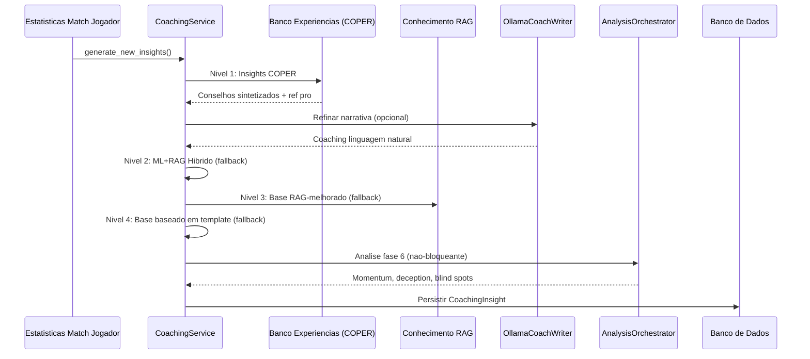

> **Explicacao Diagrama:** Siga as setas de cima para baixo: este e o "processo de pensamento" do treinador em ordem: (1) Chegam os dados da partida. (2) O treinador pergunta primeiro ao Experience Bank: "Ja vimos esta situacao? O que funcionou?". (3) Se a resposta parece robotica demais, a envia opcionalmente ao Ollama (um programador de inteligencia artificial local) para torna-la mais natural. (4) Se o Experience Bank nao dispoe de dados suficientes, recorre ao modo hibrido (previsoes ML + conhecimento RAG combinados). (5) Se tambem os modelos ML nao estao disponiveis, recorre so a RAG (buscando sugestoes pertinentes). (6) Se tambem RAG falha, usa simples modelos estatisticos ("Seu ratio K/D e 0,8, abaixo da media"). (7) Enquanto isso, em background, 7 motores de analise executam investigacoes especiais atraves de 5 pipelines (momentum, deception, entropia, estrategia+blind spots, distancia engajamento). (8) Tudo e salvo no banco de dados para referencia futura.

**Cadeia de fallback de 4 niveis:**

| Nivel                | Metodo                          | Confianca | Quando utilizado                                |
| -------------------- | ------------------------------- | --------- | ----------------------------------------------- |
| 1.**COPER**    | `_generate_coper_insights()`  | Maxima | Padrao — sintese baseada na experiencia    |
| 2.**Hibrido**   | `_generate_hybrid_insights()` | Alta    | Se COPER nao tem experiencia suficiente           |
| 3.**RAG Base** | `_enhance_with_rag()`         | Media   | Se os modelos ML nao estao disponiveis             |
| 4.**Template** | Modelo estatistico de base      | Baixa   | Ultimo recurso — retorna sempre*algo* |

> **Analogia:** O fallback de 4 niveis e como **pedir comida em um restaurante**. O Nivel 1 (COPER) e a especialidade do chef: o prato melhor e mais personalizado, criado com base na experiencia. O Nivel 2 (Hibrido) e o menu padrao: otima comida, mas nao tao personalizada. O Nivel 3 (RAG Base) e o menu infantil: mais simples, mas ainda assim nutritivo. O Nivel 4 (Modelo) e pao e agua: basico, mas voce nunca sairia com fome. A garantia principal e: **o jogador recebe sempre conselhos de treinamento**, independentemente do que aconteca. O sistema nunca te diz "Desculpe, nao tenho nada para voce".

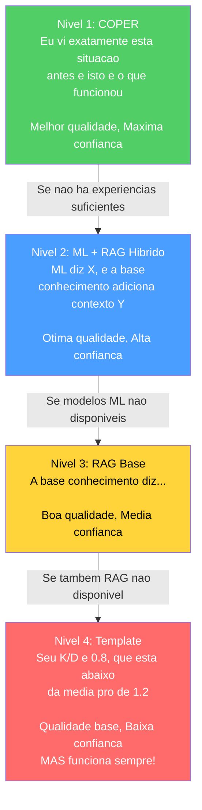

**Design chave:** Nunca retorna zero insights. A analise de Fase 6 e nao bloqueante (encapsulada em try-catch, registrada de forma nao fatal).

> **Correcao G-08 (Coaching Fallback):** Anteriormente, o metodo `_generate_coper_insights()` nao recebia os parametros `deviations` e `rounds_played` do chamador, causando um fallback silencioso aos templates base. Apos a remediacao, `generate_new_insights()` agora passa explicitamente ambos os parametros (`deviations=deviations, rounds_played=rounds_played`) ao handler COPER, garantindo que o Nivel 1 COPER possa gerar insights contextuais baseados nos desvios estatisticos reais do jogador em relacao a baseline pro. Sem esta correcao, o sistema sempre degradaria ao Nivel 4 (template) mesmo quando os dados COPER estivessem disponiveis.

**Enriquecimento da baseline temporal (Proposta 11):** O servico de coaching agora integra comparacoes pro ponderadas no tempo atraves de dois novos metodos:

- `_get_temporal_baseline(map_name)` — recupera uma baseline pro ponderada com base em `TemporalBaselineDecay` (meia-vida = 90 dias) ao inves de medias estaticas
- `_baseline_context_note(deviations, map_name)` — gera uma descricao em linguagem natural ("Com base nos dados pro recentes ponderados pela recencia, seu ADR e inferior em 12% em relacao a meta media atual em de_mirage") para o enriquecimento COPER

Isto garante que os insights de coaching reflitam a **meta media atual** em vez de medias historicas obsoletas. Se os dados temporais nao sao suficientes (< 10 stat cards), o servico recorre a funcao legacy `get_pro_baseline()` de forma transparente.

> **Analogia:** Anteriormente, o treinador te comparava a uma **snapshot** de estatisticas profissionais de meses atras. Agora usa uma **media em tempo real e atualizada** onde o desempenho profissional recente conta mais do que o antigo, como uma avaliacao em curva onde as notas de teste da semana passada contam mais do que as do ano passado. Se a media da classe em "ADR" aumentou este mes, voce vera isso imediatamente refletido em seus conselhos de treinamento.

**Inferencia da fase do round** (`_infer_round_phase`): Valor do equipamento -> classificacao da fase do round:

| Valor do equipamento    | Fase do round  |
| ------------------------ | -------------- |
| < $1.500                 | `pistol`     |
| $1.500 - $2.999         | `eco`        |
| $ 3.000 - $ 3.999     | `force`      |
| >= $ 4.000               | `full_buy`   |

**Classificacao do intervalo de saude** (`_health_to_range`): Usado para o hashing do contexto COPER: `"full"` (>=80), `"damaged"` (40-79), `"critical"` (<40).

### -OllamaCoachWriter (`ollama_writer.py`)

Transforma as informacoes de coaching estruturadas em linguagem natural atraves de LLM local (Ollama).

- **Singleton** via factory `get_ollama_writer()`
- **Funcionalidade sinalizada:** configuracao `USE_OLLAMA_COACHING` (padrao: False)
- **Degradacao graciosa:** retorna o texto original se Ollama nao esta disponivel
- **Prompt de sistema:** tom de especialista de coaching CS2, <100 palavras, acionavel, encorajador

> **Analogia:** OllamaCoachWriter e como um **tradutor** que pega estatisticas aridas e as transforma em conselhos motivadores. Sem ele, o treinador poderia dizer: "desvio medio: -0,07, z-score: -1,4, categoria: mecanica". Com ele, o treinador diz: "Sua porcentagem de tiros na cabeca esta ligeiramente abaixo da media dos profissionais. Tente se concentrar no posicionamento da mira: mantenha-a na altura da cabeca em curvas". Executa um modelo de inteligencia artificial local (Ollama) em seu computador: nao precisa de internet, nem dados sao enviados a nuvem. Se Ollama nao esta instalado, o sistema simplesmente usa o texto original: nenhum crash, nenhum erro, apenas uma formulacao ligeiramente menos refinada.

### -AnalysisOrchestrator (`analysis_orchestrator.py`)

Sintetiza a analise avancada de Fase 6 instanciando 7 motores e orquestrando 5 pipelines de analise:

**Input:** Dados de tick da partida, eventos, estatisticas dos jogadores
**Output:** `MatchAnalysis` com objetos `RoundAnalysis` por round contendo:

- `momentum_score` (tilt/sequencia vencedora)
- `deception_score` (sofisticacao tatica)
- `utility_entropy` (medicao da eficacia)
- `blind_spots` (lacunas estrategicas)
- `strategy_rec` (recomendacao da arvore de jogo)
- `engagement_range` (analise distancia de engajamento)

**Motores instanciados:** `belief_estimator`, `deception_analyzer`, `momentum_tracker`, `entropy_analyzer`, `game_tree`, `blind_spot_detector`, `engagement_analyzer` (7 motores). O `belief_estimator` e instanciado mas atualmente nao invocado diretamente como pipeline separado.

> **Analogia:** AnalysisOrchestrator e como um **time de 7 detetives especializados**, cada um dos quais investiga um aspecto diferente do seu gameplay. *Detetive Momentum* verifica se voce esta numa fase de sucesso ou em dificuldade. *Detetive Deception* verifica se voce e previsivel ou astuto. *Detetive Entropy* verifica se sua utility (granadas) e eficaz. *Detetive Blind Spots* verifica se voce continua cometendo o mesmo erro. *Detetive Strategy* verifica se voce esta tomando as decisoes certas. *Detetive Death Probability* verifica quao arriscadas sao suas posicoes. *Detetive Engagement Range* verifica a que distancias voce combate melhor. Todos esses controles funcionam em background (nao bloqueantes), entao mesmo se um detetive falha, os outros sinalizam igualmente suas descobertas.

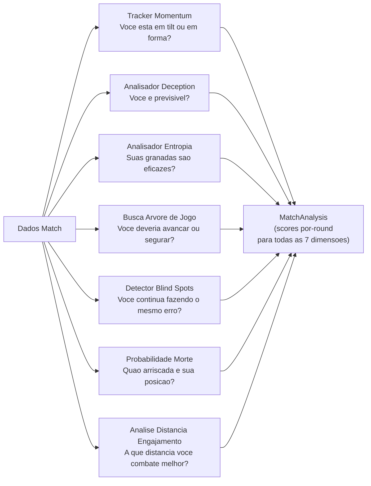

### -Servicos Adicionais (Nao documentados anteriormente)

Alem dos tres servicos principais (CoachingService, OllamaCoachWriter, AnalysisOrchestrator), o diretorio `backend/services/` contem **7 servicos adicionais** que completam o ecossistema de coaching:

> **Analogia:** Se CoachingService e o **diretor do hospital**, os servicos adicionais sao os **departamentos especializados**: ha o departamento de dialogo (coaching interativo), o departamento licoes (formacao estruturada), o laboratorio linguistico (LLM), o departamento imagem (visualizacoes), o registro civil (perfis), o departamento analise (coordenacao) e o sistema de telemetria (monitoramento remoto).

#### CoachingDialogueEngine (`coaching_dialogue.py`)

Motor de dialogo multi-turno com augmentacao RAG e Experience Bank. Evolui o single-shot OllamaCoachWriter em uma **sessao interativa** onde os jogadores podem fazer perguntas follow-up sobre seus desempenhos.

| Componente | Detalhe |
|---|---|
| **Classificacao intent** | Keyword-based: 7 categorias (positioning, utility, economy, aim, player_query, round_query, match_query) + general fallback |
| **Contexto sliding window** | `MAX_CONTEXT_TURNS = 6` (12 mensagens: 6 user + 6 assistant) |
| **Retrieval augmentation** | RAG top-3 + Experience Bank top-3, injetados na mensagem do usuario |
| **Player entity detection** | Integracao com `PlayerLookupService` para detectar mencoes de jogadores profissionais na mensagem do usuario e injetar blocos "VERIFIED PLAYER DATA" no contexto LLM |
| **Fallback offline** | Template-based com RAG-only quando Ollama nao esta disponivel |
| **Singleton** | `get_dialogue_engine()` — factory module-level |
| **Anti-hallucination (WR-78/79)** | System prompt com regras: "use ONLY verified data", provenance markers ("pro data" vs "user data"), nunca fabricar narrativas taticas |

**Pipeline de resposta:**

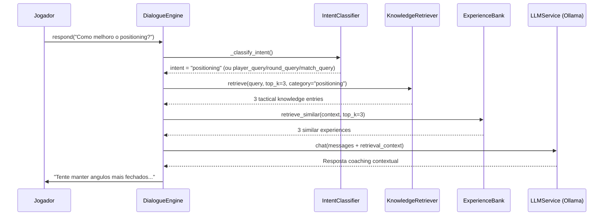

**Gestao sessao:** `start_session(player_name, demo_name)` -> carrega contexto do DB (ultimos 5 insights, area de foco primaria) -> gera mensagem de abertura via LLM -> `respond(user_message)` para turnos subsequentes -> `clear_session()` para reset.

**Seguranca do historico (F5-06):** A mensagem do usuario e adicionada ao historico apenas *apos* obter uma resposta valida do LLM, evitando estados inconsistentes em caso de excecao.

#### LessonGenerator (`lesson_generator.py`)

Gerador de licoes educacionais estruturadas a partir da analise das demos:

| Limiar | Constante | Valor | Uso |
|---|---|---|---|
| ADR forte | `_ADR_STRONG_THRESHOLD` | 75.0 | Identifica pontos fortes |
| ADR fraco | `_ADR_WEAK_THRESHOLD` | 60.0 | Identifica areas de melhoria |
| HS% forte | `_HS_STRONG_THRESHOLD` | 0.40 | Precisao acima da media |
| HS% fraco | `_HS_WEAK_THRESHOLD` | 0.35 | Precisao abaixo da media |
| Rating acima da media | `_RATING_ABOVE_AVG` | 1.0 | Desempenho positivo |
| KAST forte | `_KAST_STRONG_THRESHOLD` | 0.70 | Contribuicao consistente |
| Ratio mortes | `_DEATH_RATIO_WARNING` | 1.5x | deaths > kills x 1.5 = warning |

**Estrutura licao gerada:**

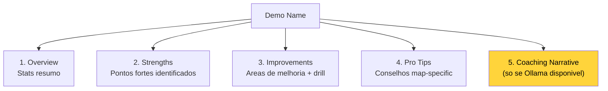

**Pro Tips map-specific:** Banco interno com conselhos para mirage, inferno, dust2, ancient, nuke. Fallback a conselhos gerais para mapas nao cobertos.

#### LLMService (`llm_service.py`)

Servico de integracao Ollama para inferencia LLM local:

| Parametro | Valor | Descricao |
|---|---|---|
| `OLLAMA_URL` | `http://localhost:11434` | Endpoint Ollama (env: `OLLAMA_URL`) |
| `DEFAULT_MODEL` | `llama3.1:8b` | Modelo 8B general-purpose (env: `OLLAMA_MODEL`) |
| `_AVAILABILITY_TTL` | 60s | Cache de disponibilidade |
| `temperature` | 0.7 | Criatividade das respostas |
| `top_p` | 0.9 | Nucleus sampling |
| `num_predict` | 500 | Limite comprimento resposta |

**APIs suportadas:**

| Metodo | Endpoint Ollama | Uso |
|---|---|---|
| `generate(prompt)` | `/api/generate` | Geracao single-shot |
| `chat(messages)` | `/api/chat` | Conversacao multi-turno |
| `generate_lesson(insights)` | `/api/generate` | Licoes de insights RAP |
| `explain_round_decision(round_data)` | `/api/generate` | Explicacao round singular |
| `generate_pro_tip(context)` | `/api/generate` | Tip contextual |

**Auto-discovery modelo:** Se o modelo configurado nao esta disponivel, usa automaticamente o primeiro modelo instalado. Singleton via `get_llm_service()`.

#### VisualizationService (`visualization_service.py`)

Gera graficos radar Matplotlib para comparacao User vs Pro:

- `generate_performance_radar(user_stats, pro_stats, output_path)` -> arquivo PNG com radar overlay
- `plot_comparison_v2(p1_name, p2_name, p1_stats, p2_stats)` -> `io.BytesIO` buffer PNG
- Features comparadas: avg_kills, avg_adr, avg_hs, avg_kast, accuracy
- Renderizacao wrappada em try/except (F5-19) para gerenciar stats vazias ou backend matplotlib ausente

#### ProfileService (`profile_service.py`)

Orquestrador de sincronizacao perfis externos:

- `fetch_steam_stats(steam_id)` -> nickname, avatar, playtime CS2 (horas)
- `fetch_faceit_stats(nickname)` -> faceit_elo, faceit_level, faceit_id
- `sync_all_external_data(steam_id, faceit_name)` -> upsert em `PlayerProfile` no DB
- Chaves API carregadas de environment/keyring (F5-22), nunca hardcoded

#### AnalysisService (`analysis_service.py`)

Servico de coordenacao analise com drift detection:

- `analyze_latest_performance(player_name)` -> ultimas stats do DB
- `get_pro_comparison(player_name, pro_name)` -> comparacao side-by-side
- `check_for_drift(player_name)` -> `detect_feature_drift()` nas ultimas 100 partidas

#### TelemetryClient (`telemetry_client.py`)

Cliente async para envio de metricas a servidor central:

- Protocolo: `httpx.Client` -> `POST /api/ingest/telemetry`
- URL configuravel: `CS2_TELEMETRY_URL` (default: `http://127.0.0.1:8000`)
- Fallback graceful se httpx nao instalado (feature opcional)
- **Anti-fabrication compliant:** nenhum dado sintetico no self-test

#### PlayerLookupService (`player_lookup.py`)

Servico de busca jogadores profissionais que previne a alucinacao LLM injetando dados verificados no contexto do dialogo de coaching:

> **Analogia:** O PlayerLookupService e como um **arquivista que verifica os fatos** antes que o treinador fale. Quando um jogador pergunta "Fale-me sobre s1mple", o arquivista vai verificar nos prontuarios reais (banco HLTV + Monolith) e entrega uma ficha verificada ao treinador: "Eis os dados reais sobre s1mple: rating 1.29, time Natus Vincere, etc.". O treinador e obrigado a usar SOMENTE estes dados verificados, nao pode inventar estatisticas. Sem o arquivista, o LLM poderia "alucinar" estatisticas plausiveis mas falsas.

| Componente | Detalhe |
|---|---|
| **Matching em 3 niveis** | Exato (case-insensitive) -> Fuzzy (SequenceMatcher >= 0.75) -> Pattern (regex nickname) |
| **Cache nickname** | TTL 60s, carrega todos os `ProPlayer.nickname` do DB HLTV na inicializacao |
| **Stop-word filter** | 89 palavras comuns inglesas filtradas para evitar falsos positivos |
| **Output** | `ProPlayerProfile` dataclass: nickname, hltv_id, real_name, country, team, estatisticas HLTV (rating, KPR, ADR, KAST), performance de demos locais |
| **Integracao** | `CoachingDialogueEngine` -> `detect_player_mentions()` -> `lookup_player()` -> `format_player_context()` -> bloco "VERIFIED PLAYER DATA" injetado no contexto LLM |
| **Singleton** | `get_player_lookup_service()` |

**Pipeline anti-alucinacao:**

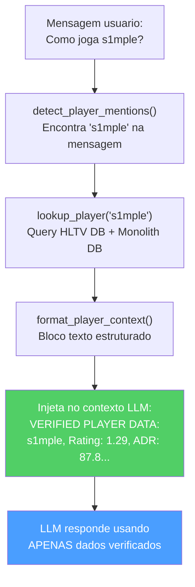

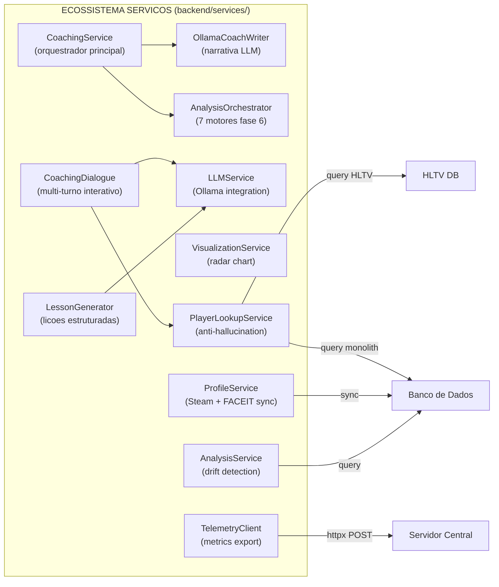

---

## 5B. Subsistema 3B — Motores de Coaching

**Pasta no repo:** `backend/coaching/`
**Arquivos:** 7 modulos

Este subsistema contem os **motores decisionais de coaching** que transformam desvios estatisticos brutos em conselhos priorizados e contextualizados. Diferente dos Servicos (Secao 5) que orquestram e apresentam, os Motores de Coaching contem a **logica de raciocinio** do treinador.

> **Analogia:** Se os Servicos de Coaching (Secao 5) sao a **recepcao do hospital**, os Motores de Coaching sao os **medicos especialistas em seus consultorios**. O `CorrectionEngine` e o medico clinico geral que pondera os sintomas e decide quais 3 sao os mais urgentes. O `HybridCoachingEngine` e o chefe que sintetiza ML e conhecimento enciclopedico para formular diagnosticos completos. O `ExplanationGenerator` e o especialista que traduz o jargao medico em palavras compreensiveis ao paciente. O `ProBridge` e o consultor que traz os relatorios de outros hospitais (dados HLTV) e os torna compativeis com o sistema local. O `LongitudinalEngine` e o epidemiologista que estuda as tendencias no tempo.

### -HybridCoachingEngine (`hybrid_engine.py`)

O **coracao decisional** do coaching: sintetiza predicoes ML com conhecimento RAG para gerar insights unificados e deduplicados.

**Pipeline de 5 estagios:**

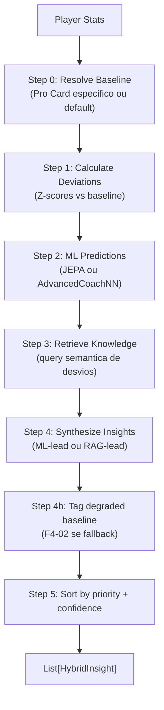

**Classes e dataclass:**

| Tipo | Nome | Descricao |
|---|---|---|
| `Enum` | `InsightPriority` | CRITICAL (\|Z\|>2.5, conf>0.8), HIGH (\|Z\|>2.0, conf>0.6), MEDIUM (\|Z\|>1.0, conf>0.4), LOW |
| `dataclass` | `HybridInsight` | title, message, priority, confidence, feature, ml_z_score, knowledge_refs, pro_examples, tick_range, demo_name |

**Formula de confianca:**

```
base_confidence = |z_score|/3.0 x 0.6 + knowledge_effectiveness x 0.4
confidence = base_confidence x MetaDriftEngine.get_meta_confidence_adjustment()
```

Onde `knowledge_effectiveness = min(1.0, mean(usage_count) / 100)`.

**Estrategia de sintese:**

| Condicao | Estrategia |
|---|---|
| \|Z\| > 2 (alta confianca ML) | Lead com ML, suporte com RAG |
| \|Z\| < 1 (baixa confianca ML) | Lead com RAG |
| 1 <= \|Z\| <= 2 | Abordagem balanceada |
| Nenhum desvio significativo | Insight knowledge-only (prioridade LOW) |

**TASK 2.7.1 — Reference Clip:** Cada `HybridInsight` pode incluir `tick_range: (start, end)` e `demo_name` para permitir a UI pular diretamente para a evidencia no arquivo demo.

**Fallback baseline (F4-02):** Se `get_pro_baseline()` falha, usa valores estaticos hardcoded e marca todos os insights com `baseline_quality=degraded` na mensagem.

### -CorrectionEngine (`correction_engine.py`)

Gera as **top-3 correcoes ponderadas** de desvios Z-score:

| Constante | Valor | Uso |
|---|---|---|
| `CONFIDENCE_ROUNDS_CEILING` | 300 | Scaling confianca: `min(1.0, rounds / 300)` |

**Pesos de importancia (DEFAULT_IMPORTANCE):**

| Feature | Peso |
|---|---|
| `avg_kast` | 1.5 |
| `avg_adr` | 1.5 |
| `accuracy` | 1.4 |
| `impact_rounds` | 1.3 |
| `avg_hs` | 1.2 |
| `econ_rating` | 1.1 |
| `positional_aggression_score` | 1.0 |

**Pipeline:** `deviations` -> aplica confidence scaling x rounds_played -> opcional `apply_nn_refinement()` -> sort por `|weighted_z| x importance` -> retorna top 3.

**Override usuario:** Os pesos sao sobrescrevedoveis via `get_setting("COACH_WEIGHT_OVERRIDES")`.

### -ExplanationGenerator (`explainability.py`)

Traduz sinais latentes RL em **narrativas compreensiveis** organizadas pelos 5 eixos de competencia (`SkillAxes`):

| Eixo | Template Negativo | Template Acao |
|---|---|---|
| MECHANICS | "Your {feature} is {delta}% below professional standards..." | "Focus on crosshair height when clearing corners..." |
| POSITIONING | "Positioning at {location} was suboptimal..." | "Try holding a tighter angle at {location}..." |
| UTILITY | "Utility timing with {weapon} was suboptimal..." | "Wait for a clear sound cue before deploying..." |
| TIMING | "Engagement timing is lagging behind..." | "Coordinate with teammates to trade-frag..." |
| DECISION | "Decision efficiency is {delta}% lower..." | "In clutch scenarios, prioritize the round objective..." |

**Principio "Silence is a Valid Action":**

| Limiar | Constante | Valor | Comportamento |
|---|---|---|---|
| Silencio | `SILENCE_THRESHOLD` | 0.2 | \|delta\| < 0.2 -> nenhum feedback (silencio) |
| Severidade alta | `SEVERITY_HIGH_BOUNDARY` | 1.5 | \|delta\| > 1.5 -> "High" |
| Severidade media | `SEVERITY_MEDIUM_BOUNDARY` | 0.8 | \|delta\| > 0.8 -> "Medium" |

**Filtro de complexidade:** Para `skill_level < 3` (iniciantes), as narrativas negativas sao simplificadas a apenas a acao sugerida, evitando sobrecarga cognitiva.

### -NNRefinement (`nn_refinement.py`)

Aplica ajustes de peso da rede neural as correcoes pre-calculadas:

```
refined_z = weighted_z x (1 + nn_adjustments["{feature}_weight"])
```

Modulo leve que escala as correcoes do `CorrectionEngine` usando pesos aprendidos do modelo ML, permitindo ao sistema neural influenciar a priorizacao dos conselhos.

### -ProBridge (`pro_bridge.py`)

**Layer de traducao** que assimila Player Card HLTV no modelo cognitivo do coach:

| Classe | Responsabilidade |
|---|---|
| `PlayerCardAssimilator` | Converte `ProPlayerStatCard` -> baseline coach-compatible |
| `get_pro_baseline_for_coach()` | Factory function direto |

**Constante legacy:** `ESTIMATED_ROUNDS_PER_MATCH = 24.0` — presente no codigo mas **nao mais utilizada** para a conversao KPR/DPR apos a correcao P3-02.

**Mapeamento metricas:**

| Metrica HLTV | Metrica Coach | Transformacao |
|---|---|---|
| `card.kpr` | `avg_kills` | **direto** (P3-02: NAO multiplicado por 24) |
| `card.dpr` | `avg_deaths` | **direto** (P3-02: NAO multiplicado por 24) |
| `card.adr` | `avg_adr` | direto |
| `card.kast` | `avg_kast` | V-2: normalizacao defensiva (`/100` se `kast > 1.0`, senao direto) |
| `card.impact` | `impact_rounds` | direto |
| `card.rating_2_0` | `rating` | direto |
| `detailed_stats.headshot_pct` | `avg_hs` | V-2: normalizacao defensiva (`/100` se `> 1.0`, default 0.45) |
| `detailed_stats.total_opening_kills` | `entry_rate` | `/100` (heuristica) |
| `detailed_stats.utility_damage_per_round` | `utility_damage` | direto (default 45.0) |

> **Correcao P3-02 — Escala KPR/DPR:** O codigo anterior multiplicava `kpr x 24` e `dpr x 24`, produzindo kills/deaths totais por partida (valores 15-20) ao inves de valores por-round (0.6-0.8). Isto tornava todos os z-scores de comparacao invalidos pois as estatisticas do usuario extraidas de `base_features.py` e `pro_baseline.py` ja estao em escala por-round. Apos a remediacao, `get_coach_baseline()` usa diretamente as taxas por-round.
>
> **Correcao V-2 — Normalizacao defensiva legacy:** Os registros HLTV mais antigos no banco de dados poderiam conter valores percentuais (ex: `kast=72.0` ao inves de `kast=0.72`). A normalizacao condicional (`/100 se > 1.0`) gerencia ambos os formatos de forma transparente.

**Classificacao arquetipo:** `get_player_archetype()` -> Star Fragger (impact>1.3), Support Anchor (kast>0.75), Sniper Specialist (AWP kills>40%), All-Rounder (default).

### -PlayerTokenResolver (`token_resolver.py`)

Resolve **tokens estaticos** (Card) para a comparacao dinamica:

- `get_player_token(player_name)` -> token dict com identity, core_metrics, tactical_baselines, granular_data, metadata
- `compare_performance_to_token(match_stats, token)` -> `Correction Delta` com deltas por rating, adr, kast, accuracy_vs_hs e flag `is_underperforming` (rating < 85% do pro)

**Estrutura Token:**

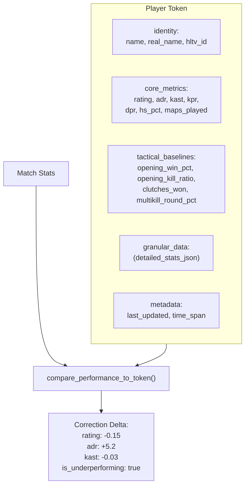

### -LongitudinalEngine (`longitudinal_engine.py`)

Gera insights trend-aware comparando trajetorias de desempenho no tempo com sinais de estabilidade NN:

- **Input:** `List[FeatureTrend]` (do modulo progress) + `nn_signals` (do training pipeline)
- **Filtro confianca:** Apenas trends com `confidence >= 0.6`
- **Output:** Max 3 insights, categorizados como:
  - **Regression:** slope < 0 -> severidade "Medium" (ou "High" se `nn_signals.stability_warning` ativo)
  - **Improvement:** slope > 0 -> severidade "Positive", focus "Reinforcement"

> **Analogia:** O LongitudinalEngine e como um **grafico das notas no tempo**. Nao olha apenas a nota da ultima prova, mas toda a trajetoria: "Suas notas em matematica estao em queda ha 3 meses" (regressao) ou "Sua precisao esta melhorando constantemente" (melhoria). Se o sistema neural e instavel (`stability_warning`), o medico aumenta o nivel de alerta: "Esta queda pode ser mais seria do que parece".

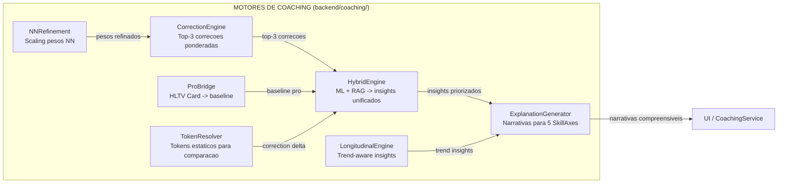

---

## 6. Subsistema 4 — Conhecimento e Recuperacao

**pasta no repo:** `backend/knowledge/`
**Arquivos:** `rag_knowledge.py`, `experience_bank.py`

Este subsistema e a **biblioteca e o diario** do treinador: memoriza os conhecimentos taticos (como um livro de texto) e as experiencias de treinamento passadas (como um diario do que funcionou e do que nao funcionou).

> **Analogia:** Imagine ter dois modos de estudar para uma prova. O primeiro e um **livro de texto** (RAG Knowledge Base) — contem todas as sugestoes CS2 organizadas por topico: "mira", "posicionamento", "utility", etc. Voce pode busca-las fazendo perguntas em ingles simples e o sistema encontra as paginas mais pertinentes. O segundo e seu **diario pessoal** (Experience Bank) — registra cada sessao de treinamento que voce fez, os conselhos que te foram dados e se voce efetivamente melhorou depois. Com o tempo, o diario se torna mais inteligente: os conselhos que funcionaram sao destacados, enquanto aqueles que nao funcionaram sao eliminados. Juntos, o livro de texto e o diario fornecem ao treinador tanto **conhecimento geral** quanto **experiencia pessoal** para extrair.

### -Knowledge Base RAG (`rag_knowledge.py`)

Implementa uma pipeline de **retrieval augmented generation** usando a busca por similaridade vetorial densa:

| Componente                          | Detalhe                                                                                                                                            |
| ----------------------------------- | ---------------------------------------------------------------------------------------------------------------------------------------------------- |
| **Modelo de embedding** | `sentence-transformers/all-MiniLM-L6-v2` (vetores de 384 dimensoes)                                                                                |
| **Fallback**                  | Embeddings baseados em hash se Sentence-BERT nao esta disponivel                                                                                    |
| **Armazenamento**             | Tabela SQLite `TacticalKnowledge` (embedding memorizado como array float codificado em JSON)                                                     |
| **Retrieval**                  | Similaridade do cosseno via `scipy.spatial.distance.cosine`                                                                                     |
| **Top-k**                     | Configuravel, padrao k=5                                                                                                                       |
| **Versioning**                | `CURRENT_VERSION = "v3"` (2026-04, Coach Book refactor, Premier S4 active duty alignment); embeddings obsoletos v2 recalculados automaticamente via `trigger_reembedding()` |
| **Categorias**                 | 14: objetivo, posicionamento, utility, movimento, economia, estrategia, posicionamento da mira, comunicacao, mental, senso do jogo, trading, **mid_round**, **retakes_post_plant**, **aim_and_duels** |

> **Analogia:** RAG funciona como um **motor de busca inteligente para o cerebro do treinador**. Quando o treinador precisa de conselhos sobre o posicionamento em Dust2 como CT AWPer, nao busca por palavras-chave como Google. Em vez disso, converte a pergunta em um "vetor de significado" de 384 numeros e encontra sugestoes memorizadas cujos vetores de significado apontam na mesma direcao (similaridade do cosseno). E como se cada livro em uma biblioteca tivesse uma coordenada GPS que representa seu topico e, ao inves de buscar por titulo, se fornecessem as coordenadas GPS e se encontrassem os 5 livros mais proximos. O multiplicador de relevancia 1,2x e como dizer "os livros da mesma prateleira (mesmo mapa/lado/tipo de round) obtem pontos bonus". O filtro de deduplicacao (limiar 0,85) impede de retornar 5 copias substancialmente da mesma sugestao.
>
> **Correcao M-07 — Rejeicao vetor norma-zero:** `VectorIndex.search()` valida a norma do vetor query antes da busca. Se a norma e zero (tipicamente devido a um embedding fallback vazio ou a um input corrompido), o metodo retorna `None` com um warning no log ao inves de propagar um erro de divisao por zero na similaridade do cosseno. Isto protege o pipeline RAG de queries degeneradas sem interromper o fluxo de coaching.

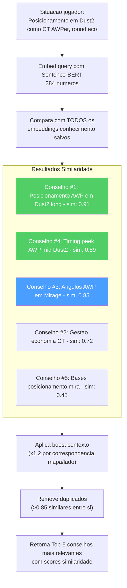

**Construcao query:** queries dinamicas em linguagem natural a partir de estatisticas jogador, mapa, lado, papel. Os elementos que correspondem ao contexto obtem um multiplicador de relevancia 1,2x. A deduplicacao filtra os elementos com uma similaridade >0,85 em relacao aos resultados ja selecionados.

### -Banca Experiencia (`experience_bank.py`) — Framework COPER (KT-01 Enhanced)

Implementa o framework **Observacao-Previsao-Experiencia-Recuperacao Contextual (COPER)** com semantica CRUD, replay priorizado e integracao TrueSkill:

> **Analogia:** COPER e o **diario pessoal do treinador com superpoderes**. Cada vez que o treinador da um conselho durante uma partida, escreve uma entrada de diario: "Em Dust2, round eco lado T, o jogador estava nos tuneis B com 60 HP e uma Deagle. Eu disse a ele para manter o angulo. Ele sobreviveu e conseguiu 2 kills. Este conselho FUNCIONOU!" Mais tarde, quando se apresenta uma situacao similar, o treinador folheia seu diario e encontra aquela entrada. Mas e ainda mais inteligente: verifica tambem o que os jogadores profissionais fizeram em situacoes similares, busca padroes ("Este jogador continua tendo dificuldade em rounds eco no lado T") e adapta a confianca com base na data de validacao do conselho.

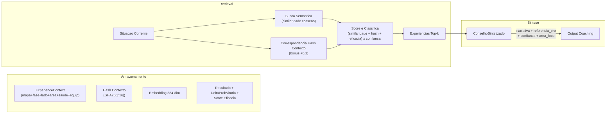

**Estrategia de duplo retrieval:**

1. **Experiencias usuario:** Situacoes passadas tiradas do historico de jogo do usuario.
2. **Experiencias profissionais:** Como os profissionais gerenciaram situacoes analogas.
3. **Analise dos padroes:** Identifica fraquezas recorrentes, tendencias de melhoria, correlacoes contextuais.

> **Analogia:** O duplo retrieval e como estudar para uma prova usando **tanto seus testes passados quanto as respostas do genio da classe**. Seus testes passados mostram aquilo em que voce tem dificuldade pessoalmente. As respostas do genio da classe mostram a abordagem ideal. A analise dos padroes e como se seu professor examinasse todos os seus testes e dissesse: "Notei que voce sempre perde pontos no mesmo tipo de questao: vamos nos concentrar nisso".

**Ciclo de feedback (baseado em EMA):**

- Cada experiencia rastreia `outcome_validated`, `effectiveness_score`, `times_advice_given`, `times_advice_followed`
- As correspondencias de follow-up atualizam a eficacia: `new_score = 0,7 x old_score + 0,3 x outcome_value`
- Experiencias obsoletas (>90 dias sem validacao): a confianca diminui em 10%
- O monitoramento do uso incrementa `usage_count` a cada retrieval

> **Analogia:** O ciclo de feedback e o modo como o treinador **aprende dos proprios conselhos**. Apos fornecer um conselho, verifica: "O jogador efetivamente fez o que eu sugeri? Seu desempenho melhorou?". A formula EMA (0,7 velhas + 0,3 novas) significa que o treinador confia em sua experiencia a longo prazo mais do que em qualquer resultado unico, como a avaliacao de um restaurante que se baseia em centenas de resenhas, nao apenas na ultima. Se um conselho nao e validado dentro de 90 dias, perde 10% de confiabilidade, como uma previsao meteorologica que se torna menos confiavel ao avancar no futuro. Isto cria um sistema que se auto-melhora: os bons conselhos se tornam mais confiaveis no tempo, enquanto os ruins sao gradualmente eliminados.

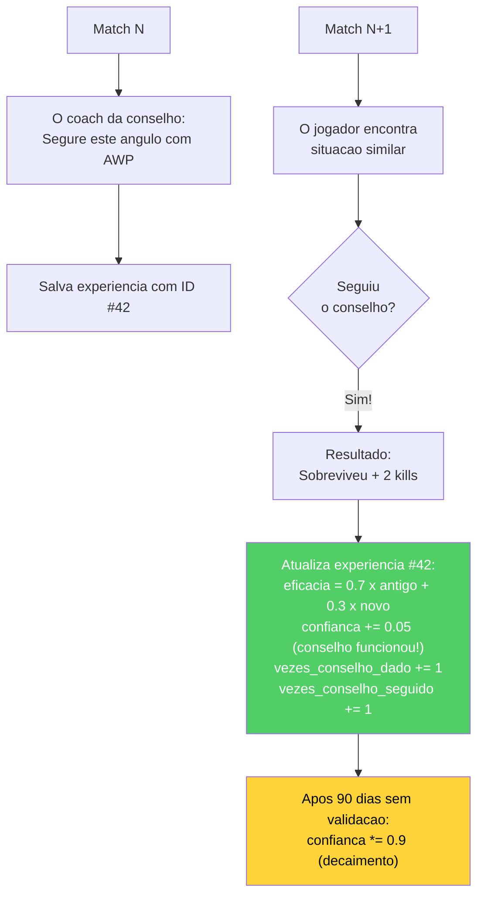

**Extracao da experiencia das demos:** Agrupa os eventos por tick, identifica as kills/mortes dos jogadores, cria o contexto a partir de uma snapshot do tick, infere a acao (scoped_hold, crouch_peek, pushed, held_angle), determina o resultado.

**Melhorias KT-01 — Semantica CRUD e Replay Priorizado:**

| Constante | Valor | Proposito |
|---|---|---|
| `DUPLICATE_SIMILARITY_THRESHOLD` | 0.9 | Similaridade cosseno para deteccao duplicados |
| `CRUD_EMA_FACTOR` | 0.3 | Peso EMA para merge effectiveness em UPDATE |
| `REPLAY_ALPHA` | 0.6 | Expoente prioridade replay (mais baixo = mais uniforme) |
| `REPLAY_GATE` | 0.4 | Confianca minima para ser elegivel ao replay |
| `_MIN_EFFECTIVENESS_TRIALS` | 5 | Trials minimos antes que effectiveness influencie o retrieval |

**Decisao CRUD no momento da insercao:**

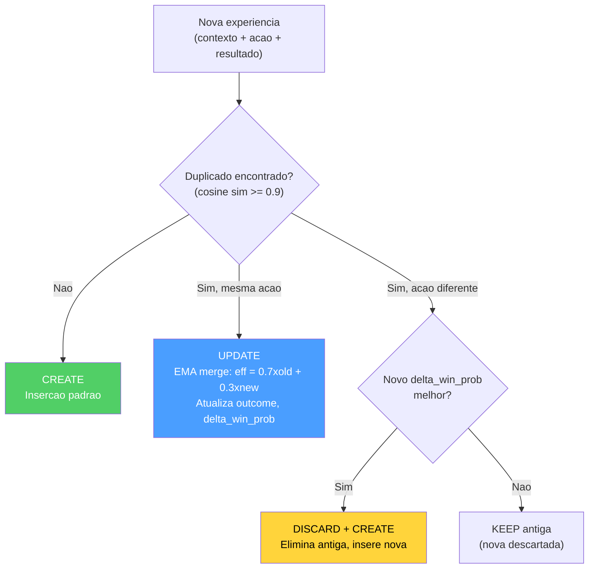

> **Analogia CRUD:** Anteriormente, o diario do treinador sempre adicionava uma nova entrada, mesmo se era quase identica a uma anterior. Com KT-01, o diario se tornou inteligente: (1) **Se a mesma situacao produziu o mesmo conselho**, atualiza a entrada existente com uma media ponderada dos resultados (UPDATE). (2) **Se a mesma situacao sugere um conselho diferente e melhor**, substitui a antiga entrada (DISCARD+CREATE). (3) **Se o novo conselho e pior**, o descarta silenciosamente (KEEP). Isto previne o crescimento ilimitado do diario mantendo apenas as experiencias mais uteis.

**Replay Priorizado (KT-01):** As experiencias sao amostradas para o replay com probabilidade proporcional a `priority^REPLAY_ALPHA`, onde `priority = effectiveness_score x confidence_score`. Apenas experiencias com `confidence_score >= REPLAY_GATE` sao elegiveis. Isto balanca exploitation (experiencias eficazes) com exploration (experiencias menos testadas).

**Integracao TrueSkill (KT-01):** Campos `mu_skill` e `sigma_skill` para tracking bayesiano da competencia do jogador na situacao especifica. Os priors TrueSkill influenciam o peso da experiencia no retrieval: experiencias com alta incerteza (`sigma` alto) sao penalizadas em relacao aquelas com sinal estavel.

**Compressao Embedding:** Os embeddings 384-dim agora sao codificados como `base64(float32)` ao inves de JSON array, obtendo uma compressao 4x no espaco de armazenamento no banco de dados sem perda de precisao.

**Linking Referencia Pro:** Cada experiencia pode incluir `pro_player_name`, `pro_match_id`, `source_demo` para conectar diretamente a como um profissional especifico gerenciou uma situacao analoga.

### -Knowledge Graph

Um **grafo entidade-relacao** leve memorizado em SQLite (tabelas `kg_entities`, `kg_relations`). Suporta `query_subgraph(entity_name)` a 1 hop para o raciocinio multi-hop, a fim de integrar a similaridade semantica.

> **Analogia:** O Knowledge Graph e como uma **rede de fatos conectados**. Ao inves de memorizar sugestoes como paragrafos isolados, conecta conceitos: "Fumo -> bloqueia -> visao", "AWP -> requer -> angulos longos", "Site Dust2 B -> conecta-se a -> tuneis". Quando o coach busca "posicionamento AWP", o Knowledge Graph pode seguir as conexoes: "AWP precisa de angulos longos -> Dust2 tem angulos longos em A long e em mid -> aquelas posicoes se conectam ao site A". Esta capacidade de "seguir as conexoes" (chamada raciocinio multi-hop) ajuda o coach a extrair inferencias logicas que a busca textual pura poderia nao captar.

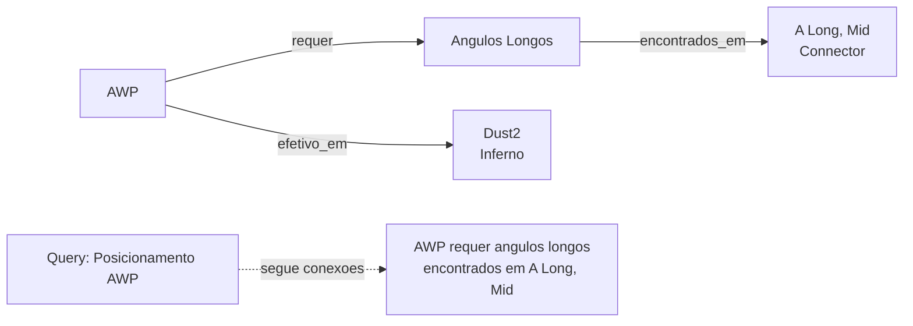

### -Inicializacao Knowledge Base (`init_knowledge_base.py`)

Script de orquestracao que popula o banco de dados RAG com conhecimento tatico de duas fontes:

1. **Conhecimento manual:** Carregamento de arquivo JSON (`data/tactical_knowledge.json`) com sugestoes curadas manualmente por categoria e mapa
2. **Mining automatico:** Invocacao de `ProDemoMiner.mine_all_pro_demos()` para extrair padroes taticos das demos profissionais

Apos o carregamento, gera um relatorio por categoria e mapa usando queries COUNT agregadas (sem carregar todos os records em memoria).

### -ProDemoMiner (`pro_demo_miner.py`)

Extrai conhecimento tatico das demos profissionais usando pattern detection:

| Classe | Linhas | Descricao |
|---|---|---|
| `ProDemoMiner` | ~180 | Extracao padroes de metadados match (map, team, success rate) |
| `AdvancedProDemoMiner(ABC)` | ~60 | Base abstrata (F5-05) para parsing demo com demoparser2 |

**Limiares de qualidade:**

| Constante | Valor | Significado |
|---|---|---|
| `MIN_SUCCESS_RATE` | 0.70 | Padrao aceito apenas se sucesso >=70% |
| `MIN_SAMPLE_SIZE` | 5 | Minimo 5 ocorrencias para padrao valido |

**Mapas suportados:** mirage, dust2, inferno, nuke, overpass, vertigo, ancient, anubis.

**Tipologias de conhecimento gerado:**
- Conhecimento especifico por mapa (posicionamento, utility, rotacoes)
- Conhecimento especifico por team (estrategias, tendencias, estilos)
- Conhecimento por execucoes de sucesso (padroes com taxa >=70%)

### -Round Utils (`round_utils.py`)

Utility compartilhada para classificacao fase economica do round, extraida para eliminar duplicacao entre os layers knowledge e services:

| Valor Equipamento | Fase | Constante |
|---|---|---|
| < $1.500 | `pistol` | `_PISTOL_MAX_EQUIP` |
| $1.500 - $2.999 | `eco` | `_ECO_MAX_EQUIP` |
| $3.000 - $3.999 | `force` | `_FORCE_MAX_EQUIP` |
| >= $4.000 | `full_buy` | — |

---

## 7. Subsistema 5 — Motores de analise

**pasta no repo:** `backend/analysis/`
**11 arquivos, ~2.600 linhas de codigo de producao**

Este subsistema contem **11 motores de analise especializados**, cada um projetado para investigar uma dimensao diferente do gameplay. Funcionam como analise de Fase 6, fornecendo aprofundamentos que vao alem do que so as redes neurais podem oferecer.

> **Analogia:** Pensem nestes 11 motores de analise como um **time de 11 cientistas esportivos diferentes**, cada um com sua especializacao. Um cientista estuda suas mecanicas de tiro, outro suas capacidades decisionais sob pressao, outro ainda sua capacidade de ser imprevisivel e assim por diante. Cada cientista produz seu proprio mini-boletim e juntos pintam um quadro completo dos seus pontos fortes e fracos. Nenhum cientista sozinho ve tudo, mas juntos cobrem todos os aspectos importantes do jogo competitivo no CS2.

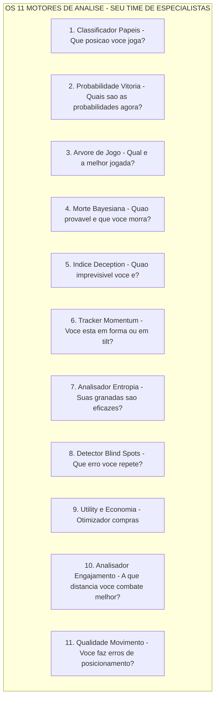

### -Classificador de Papeis (`role_classifier.py`)

Atribui um dos 6 papeis usando **limiares estatisticos aprendidos**:

| Papel                   | Sinal Primario                                            | Sinal Secundario   |
| ----------------------- | --------------------------------------------------------- | ------------------ |
| **AWPer**         | Ratio kills AWP vs limiar                                  | —                 |
| **Entry Fragger** | Taxa de entry + bonus a primeira morte (0,3x)            | —                 |
| **Support**      | Taxa de assistencia + bonus dano de utility (max 0,3x)   | —                 |
| **IGL**           | Taxa de sobrevivencia + bonus balanceamento KD            | —                 |
| **Lurker**        | Ratio kills em solitario vs limiar                        | —                 |
| **Flex**          | Fallback quando a confianca e baixa                       | —                 |

> **Analogia:** O Classificador de Papeis e como um **olheiro de talentos** que observa seu estilo de jogo e entende em que posicao voce se encontra naturalmente. Se voce obtem muitas kills AWP, provavelmente voce e um AWPer. Se voce sempre e o primeiro a morrer (mas obtem tambem entry kills), provavelmente voce e um Entry Fragger. Se voce usa muitos flashes e ajuda seus colegas de time, voce e um Support. Se ninguem sabe exatamente o que voce faz melhor, voce e classificado como Flex, um generalista. Os limiares nao sao codificados; sao aprendidos dos dados de verdadeiros jogadores profissionais (qual percentual de kills obtem um verdadeiro AWPer com a AWP?).

**Protecao para cold-start:** `RoleThresholdStore` requer >=10 amostras e >=3 limiares validos para sair do cold-start. Retorna `(FLEX, 0.0)` se em cold-start. Os limiares sao **mantidos no banco de dados** via `persist_to_db()` e `load_from_db()` — completamente implementados, nao como stub.

> **Analogia:** A protecao do cold-start e como um **novo professor que diz "Ainda nao conheco meus alunos bem o suficiente".** Ate que o sistema nao tenha visto pelo menos 10 jogadores profissionais e aprendido pelo menos 3 limiares de papel validos, se recusa a classificar alguem, retornando em seu lugar "Flex" com uma probabilidade de 0%. Isto evita o embaracoso erro de chamar alguem "AWPer" quando o sistema viu apenas 2 exemplos de como se apresenta um AWPer.

**Audit do balanceamento do team** (`audit_team_balance()`): detecta multiplos AWPers (ALTA), Entry faltando (ALTA), Support faltando (MEDIA), nenhuma diversidade (CRITICA), multiplos Lurkers (MEDIA).

### -Preditor de Probabilidade de Vitoria (`win_probability.py`)

Rede neural de 12 funcoes que estima P(round_win | game_state):

> **Analogia:** O preditor de Probabilidade de Vitoria e como um **placar em tempo real em uma partida de basquete** que mostra "A equipe de casa tem 72% de probabilidade de vencer". Considera 12 fatores relativos ao momento atual — quanto dinheiro tem cada equipe, quantos jogadores ainda estao vivos, se a bomba foi plantada, quanto tempo resta — e preve as probabilidades. Usa uma pequena rede neural (muito menor que o RAP Coach) porque deve ser rapida, atualizando-se a cada poucos segundos durante a analise em tempo real.

**Arquitetura:** `Linear(12, 64) -> ReLU -> Dropout(0,2) -> Linear(64, 32) -> ReLU -> Dropout(0,1) -> Linear(32, 1) -> Sigmoid`.

**12 Features:**

| \# | Feature                           | Normalizacao             |
| -- | --------------------------------- | ------------------------ |
| 1  | economia_team                     | /16000                   |
| 2  | economia_inimigo                  | /16000                   |
| 3  | diferencial economia              | (equipe-inimigo)/16000  |
| 4  | jogadores_vivos                   | /5                       |
| 5  | inimigos_vivos                    | /5                       |
| 6  | diferencial contagem jogadores    | (vivos-inimigo)/5         |
| 7  | utility\_restante                | /5                       |
| 8  | percentual_controle_mapa          | [0, 1]                   |
| 9  | tempo_restante                    | /115                     |
| 10 | bomba_plantada                    | binario                  |
| 11 | is_ct                             | binario                  |
| 12 | ratio valor equipamento           | min(equipe/inimigo, 2)/2 |

**Overrides heuristicos:** 3+ vantagem -> limite minimo em 85%, 3+ desvantagem -> limite maximo em 15%, 0 vivos -> 0%, ajustes bomba plantada (T: +0,10, CT: -0,10) — aditivos sobre a probabilidade base, limites economicos de ±8000$.

> **Analogia:** Os overrides heuristicos sao **grades de seguranca baseadas no bom senso**. Mesmo se a rede neural trava e preve uma probabilidade de vitoria de 50% quando toda a equipe esta morta, a barra de seguranca diz "Nao — 0 jogadores vivos = 0% de probabilidade. Ponto." Igualmente, se voce tem 3 jogadores a mais vivos em relacao ao inimigo, a regra de seguranca reza: "Voce tem AO MENOS 85% de probabilidade de vencer, independentemente do que pensa a rede neural". Estas regras codificam os conhecimentos de jogo mais basilares que nunca deveriam ser violados, funcionando como um sanity check sobre as predicoes da IA.
>
> **Nota A-12 — Guard cross-load:** Este preditor de 12 features (`WinProbabilityNN`) e um modelo *separado e incompativel* em relacao ao `WinProbabilityTrainerNN` de 9 features descrito na Secao 12. Os checkpoints nao sao intercambiaveis: ao carregar e validada a dimensionalidade do `state_dict` e, em caso de mismatch, o modelo e reinicializado do zero com um warning no log.

**Preditor Aumentado com Elo (KT-07):**

O `EloAugmentedPredictor` envolve o `WinProbabilityNN` base com um sistema Elo opcional para aproveitar o historico das partidas:

> **Analogia:** A integracao Elo e como adicionar a **reputacao do jogador** a previsao. Se voce sabe que a equipe A venceu 80% das partidas recentes, sua previsao deveria refletir isso mesmo antes que o round comece. O Elo captura esta "reputacao acumulada" que o modelo de 12 features nao pode ver porque olha apenas o estado corrente do round.

| Constante | Valor | Descricao |
|---|---|---|
| `_ELO_INITIAL` | 1500.0 | Elo inicial para jogadores sem historico |
| `_ELO_K_FACTOR` | 32.0 | Fator K base para a magnitude das atualizacoes |
| `_ELO_RECENCY_HALF_LIFE` | 20 partidas | O peso de uma partida diminui pela metade a cada 20 partidas |

**Formula de atualizacao Elo com peso de recencia:**

```
new_elo = old_elo + K x w x (S - E)

onde:
  S = score efetivo (1 para vitoria, 0 para derrota)
  E = score esperado = 1 / (1 + 10^((opp_elo - elo) / 400))
  w = peso recencia = 2^((match_index - N + 1) / half_life)
```

O peso de recencia (adaptado de Glickman, 1999) garante que as partidas recentes contribuam mais ao rating final. Uma partida de 20 matches atras contribui metade do K-factor em relacao a ultima partida.

**Blending NN + Elo:**

```
final_prob = (1 - alpha) x nn_prob + alpha x elo_prob    (alpha = 0.15 default)
```

O `compute_elo_differential(team_histories, enemy_histories)` calcula o diferencial Elo medio entre as duas equipes, normalizado por 400 (uma "classe" Elo), e o converte em probabilidade atraves da formula logistica standard. O blending e conservativo (alpha = 0.15) porque o Elo captura apenas informacao historica, enquanto a NN ve o estado corrente do round.

**Nota:** O Elo e uma **augmentacao opcional** — a arquitetura base de 12 features do `WinProbabilityNN` permanece inalterada. Se o historico nao esta disponivel, o preditor volta a probabilidade NN pura.

### -Arvore de jogo Expectiminimax (`game_tree.py`)

Implementa a **busca expectiminimax** com modelagem adaptiva do adversario:

> **Analogia:** A arvore de jogo e como um **motor de xadrez para CS2**. Pergunta: "Se eu avanco, o que poderia fazer o inimigo? E se ele faz isso, qual e minha melhor resposta?". Constroi uma arvore de possibilidades profunda 3 niveis: sua jogada, a provavel resposta do inimigo e sua contra-resposta. Diferente do xadrez tradicional, CS2 tem aleatoriedade (voce poderia errar um tiro, o inimigo poderia rotacionar), entao usa "expectiminimax", o que significa que leva em conta as probabilidades em cada passagem. O resultado e uma classificacao onde "Avancar e a melhor, Segurar e a segunda, Rotacionar e a terceira, Utility e a quarta" com um score de confiabilidade para cada opcao.

- **Acoes:** avancar, segurar, rotacionar, usar_utility
- **Modelo adversario:** Prioridades economicas (eco/force/full buy), ajustes laterais, ajustes da vantagem, pressao temporal
- **Profundidade:** 3 niveis (max -> probabilidade -> min)
- **Budget no:** 1000 (impede a explosao)
- **Avaliacao folha:** `WinProbabilityPredictor` (carregamento lazy)
- **Aprendizado adversario:** Atualizacao EMA incremental (alpha limitado a 0,5)

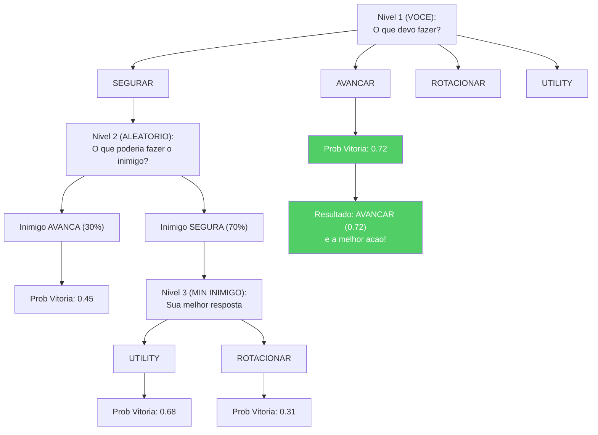

### -Estimador Bayesiano de Morte (`belief_model.py`)

Modela P(morte | crenca, HP, armadura, classe_arma):

> **Analogia:** O Estimador de Morte e como um **indicador de perigo** que responde a estas perguntas: "Dada sua posicao, seu estado de saude, a arma do inimigo e o que pensamos que esta fazendo, quao provavel e que voce morra nos proximos segundos?". Usa estatisticas bayesianas, um modo elegante de dizer "comece com uma hipotese, depois atualize-a com as evidencias". A hipotese inicial se baseia nos PV: se voce tem saude no maximo, a probabilidade de morrer e de cerca de 35%; se voce tem poucos PV, a probabilidade sobe a 80%. Depois se adapta com base no que sabe: "Mas o inimigo tem uma AWP (mais perigosa em x1,4) e a ameaca e recente (sem decaimento)". Isto fornece uma probabilidade final que o treinador usa para decidir se aconselhar uma jogada agressiva ou defensiva.

- **Antecedente:** Taxas de mortalidade por faixa HP (cheio >=80: 0,35, danificado 40-79: 0,55, critico <40: 0,80)
- **Fatores de verossimilhanca:** Nivel de ameaca (com decaimento exponencial exp(-0,1 x idade)), reducao da armadura (0,75x), multiplicadores das armas (AWP: 1,4x, Rifle: 1,0x, Metralhadora: 0,75x, Pistola: 0,6x, Faca: 0,3x)
- **Posterior:** Combinacao logistica no espaco log-odds
- **Calibracao:** `calibrate(historical_rounds)` aprende as prioridades empiricas (>=10 amostras por faixa)

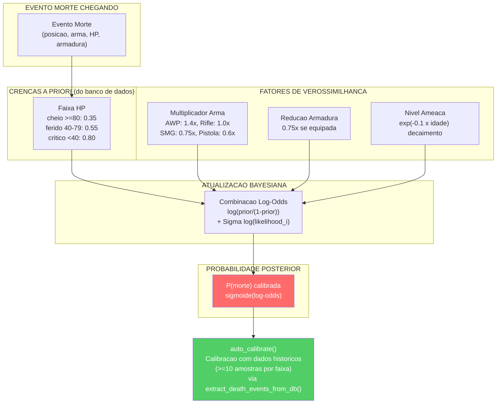

> **Nota sobre a calibracao (G-07):** O Estimador Bayesiano de Morte e agora um **componente live** gracas ao wiring completado durante a remediacao. A funcao `extract_death_events_from_db()` no Session Engine extrai automaticamente os eventos de morte do banco de dados e os passa a `auto_calibrate()`, permitindo ao modelo refinar suas probabilidades a priori com base nos dados reais acumulados. Este ciclo de feedback transforma o estimador de um modelo estatico a um sistema que se auto-calibra com a experiencia.

### -Indice de Deception (`deception_index.py`)

Quantifica a deception tatica atraves de tres sub-metricas:

> **Analogia:** O Indice de Deception mede quanto um jogador e **astuto e imprevisivel**. No CS2, ser previsivel e perigoso: se o inimigo sabe que voce sempre olha pelo mesmo angulo, mirara antecipadamente. O Indice de Deception e como um **score de poker face**: um score alto significa que voce e dificil de interpretar (bom), um score baixo significa que voce e transparente (ruim). Mede tres coisas: (1) Lanca flashes falsos para induzir as reacoes? (2) Finge tomadas do site mudando subitamente de direcao? (3) Alterna caminhada e corrida para confundir os inimigos sobre sua posicao?

| Sub-metrica                            | Peso | Metodo de deteccao                                                                                                   |
| -------------------------------------- | ---- | -------------------------------------------------------------------------------------------------------------------- |
| **Frequencia de falsos flash**   | 0,25 | Flashes que nao cegam inimigos —`bait_rate = 1 - efetivo/total`                                               |
| **Frequencia de finta rotacao**  | 0,40 | Mudancas de direcao >108° detectadas atraves de amostragem da velocidade angular (20 intervalos de posicao) |
| **Score de deception sonora**    | 0,35 | Inverso do ratio de agachamento —`1,0 - ratio_agachamento x 2,0`                                  |

Composito: `DI = 0,25·fake_flash + 0,40·rotation_feint + 0,35·sound_deception`, fixado em [0, 1].

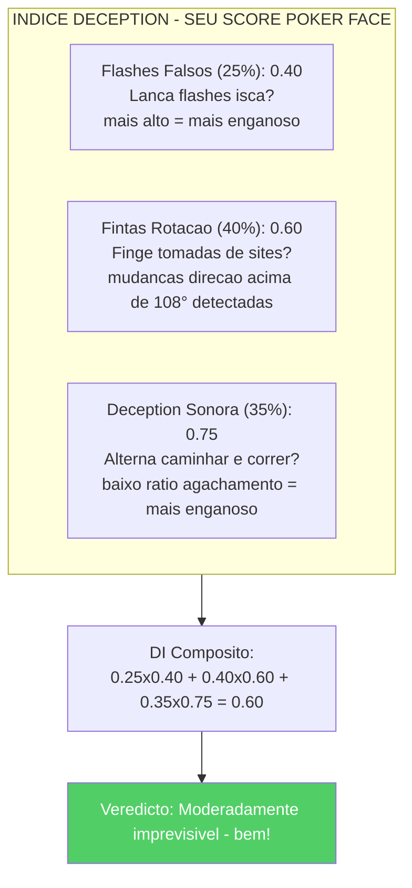

### - Momentum Tracker (`momentum.py`)

Modela o momentum psicologico como um multiplicador de desempenho que decresce no tempo:

> **Analogia:** o Momentum Tracker e como um anel de humor para seu gameplay. Quando voce vence varios rounds em sequencia, voce esta "em forma" - esta jogando com seguranca, tomando riscos mais inteligentes e seu multiplicador de momentum supera 1,2. Quando voce perde varios rounds em sequencia, poderia estar "em tilt" - frustrado, comete erros e seu multiplicador desce abaixo de 0,85. O tracker leva em conta que o momentum se dissipa no tempo (vencer 3 rounds atras conta menos do que vencer o ultimo round) e se zera no intervalo (quando voce troca de lado). E como monitorar a "run" de um time de basquete: um parcial de 10-0 cria momentum que influencia o desempenho.

- Sequencias de vitorias: multiplicador = 1,0 + 0,05 x comprimento da sequencia x decaimento
- Sequencias de derrotas: multiplicador = 1,0 - 0,04 x comprimento da sequencia x decaimento
- Decaimento: exp(-0,15 x gap_rounds)
- Limites: \[0,7, 1,4\]
- Deteccao tilt: multiplicador < 0,85
- Deteccao hot: multiplicador > 1,2
- Reset de metade: Round 13 (MR12) e 16 (MR13)

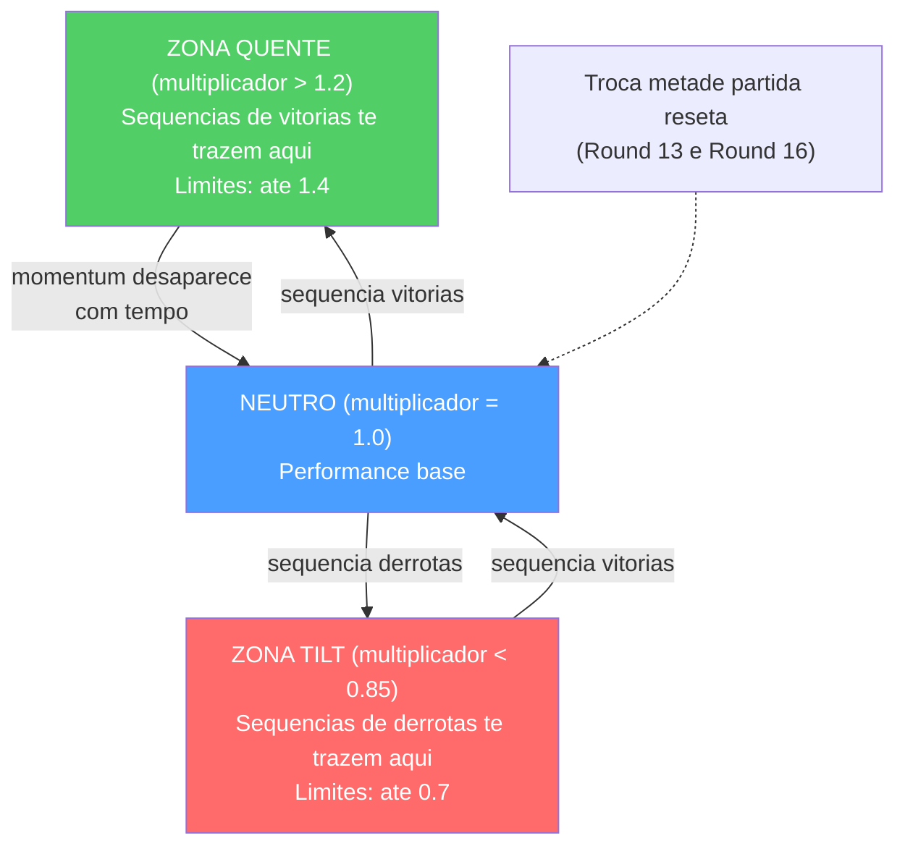

### -Analisador de Entropia (`entropy_analysis.py`)

Mede a eficacia da utility atraves da **reducao de entropia de Shannon** das posicoes inimigas:

> **Analogia:** A entropia e uma medida da **incerteza**: maior e a entropia, maior e a incerteza sobre a posicao dos inimigos. O Analisador de Entropia pergunta: "Antes de lancar aquele fumo, os inimigos poderiam estar em 100 possiveis posicoes (alta entropia). Apos o fumo, poderiam estar apenas em 30 posicoes (baixa entropia). Seu fumo reduziu a incerteza em 70%, o que significa que foi um fumo eficaz!" E como jogar esconde-esconde: se voce esta procurando em uma casa inteira, ha muitos esconderijos (alta entropia). Se voce fecha a cozinha e o banheiro, ha menos esconderijos (baixa entropia). Uma boa granada reduz o numero de lugares com que voce deve se preocupar.

- Discretiza as posicoes em uma grade 32x32
- Calcula `H = -Sigma p(cell) x log2(p(cell))`
- Impacto de utility = `H_pre - H_post` (positivo = informacao obtida)
- Reducoes maximas de entropia: Smoke 2,5 bits, Molotov 2,0, Flash 1,8, HE 1,5

```mermaid
flowchart LR
    subgraph BEFORE["Antes do Fumo"]
        B["Todas as posicoes incertas<br/>H_pre = 8.5 bits<br/>(muito incerto)"]
    end
    subgraph AFTER["Depois do Fumo"]
        A["O fumo bloqueia uma area<br/>H_post = 6.0 bits<br/>(incerteza reduzida)"]
    end
    BEFORE -->|"Fumo lancado"| AFTER
    AFTER --> IMPACT["Impacto utility = 8.5 - 6.0 = 2.5 bits<br/>Max possivel para fumo = 2.5<br/>100% eficaz!"]
    style IMPACT fill:#51cf66,color:#fff
```

### -Detector de Blind Spots (`blind_spots.py`)

Identifica decisoes recorrentes nao otimas em relacao as recomendacoes da arvore de jogo:

> **Analogia:** O Detector de Blind Spots e como um **instrutor de direcao** que percebe que voce sempre esquece de verificar os espelhos antes de mudar de faixa. Compara o que voce fez efetivamente em cada round com o que a arvore de jogo indicou como acao otima. Se voce continua avancando quando deveria segurar, ou continua segurando quando deveria rotacionar, sinaliza isto como um "blind spot", um erro recorrente do qual voce poderia nem mesmo estar consciente. Mais frequentemente se verifica um erro E maior e seu impacto, maior e sua prioridade. Entao gera um plano de treinamento especifico: "Voce tende a avancar nas situacoes post-plant quando e melhor segurar. Pratique o posicionamento passivo post-plant."

- Compara as acoes reais dos jogadores com as acoes otimas de `ExpectiminimaxSearch`
- Classifica as situacoes (post-plant, clutch, eco, round avancado, vantagem numerica)
- Prioridade = `frequencia x impact_rating`
- Gera planos de treinamento em linguagem natural para os blind spots principais

```mermaid
flowchart TB
    subgraph COMPARE["Suas acoes vs Acoes otimas"]
        R3["Round 3: Voce AVANCOU - Otimo: SEGURAR - ERRADO"]
        R7["Round 7: Voce SEGUROU - Otimo: SEGURAR - CORRETO"]
        R11["Round 11: Voce AVANCOU - Otimo: SEGURAR - ERRADO"]
        R15["Round 15: Voce AVANCOU - Otimo: ROTACIONAR - ERRADO"]
        R19["Round 19: Voce SEGUROU - Otimo: UTILITY - ERRADO"]
        R22["Round 22: Voce AVANCOU - Otimo: SEGURAR - ERRADO"]
    end
    R3 --> PATTERN["Padrao detectado: Avanca em vez de Segurar<br/>Frequencia: 3/6 = 50%<br/>Impacto: Alto - perdeu vantagem round<br/>Prioridade: 0.50 x 0.80 = 0.40"]
    R11 --> PATTERN
    R15 --> PATTERN
    R22 --> PATTERN
    PATTERN --> PLAN["Plano treinamento: Pratique posicionamento<br/>passivo post-plant. Voce tende a avancar<br/>quando a arvore de jogo recomenda segurar."]
    style R3 fill:#ff6b6b,color:#fff
    style R11 fill:#ff6b6b,color:#fff
    style R15 fill:#ff6b6b,color:#fff
    style R19 fill:#ff6b6b,color:#fff
    style R22 fill:#ff6b6b,color:#fff
    style R7 fill:#51cf66,color:#fff
```

### -Analisador distancia de engajamento (`engagement_range.py`)

Analisa as distancias de kill para construir **perfis de engajamento** especificos por papel e posicao:

> **Analogia:** O Analisador de Engagement Range e como um **analista esportivo que estuda onde um jogador faz os gols**. Um centroavante marca principalmente de dentro da area (curta), um meio-campista de media distancia e um defensor de longe em bolas paradas. Analogamente, um AWPer deveria obter mais kills a longa distancia, enquanto um Entry Fragger deveria se destacar no combate curto. Se seu perfil de distancia nao corresponde ao seu papel, o coach te diz "Voce esta combatendo muito de perto para um AWPer" ou "Voce nao aproveita o suficiente as linhas de visao longas".

**Componentes principais:**

| Componente | Proposito |
|---|---|
| `NamedPositionRegistry` | Registro de callouts por mapa (ex: "A Site", "Window", "Banana") com coordenadas 3D e raio |
| `EngagementRangeAnalyzer` | Calculo distancia euclidiana killer-vitima, classificacao e comparacao com baseline pro |
| `EngagementProfile` | Distribuicao % por faixa: close (<500u), medium (500-1500u), long (1500-3000u), extreme (>3000u) |

**Baseline pro por papel:**

| Papel | Close | Medium | Long | Extreme |
|---|---|---|---|---|
| AWPer | 10% | 30% | 45% | 15% |
| Entry Fragger | 40% | 40% | 15% | 5% |
| Support | 25% | 45% | 25% | 5% |
| Lurker | 35% | 35% | 20% | 10% |
| IGL/Flex | 25% | 40% | 25% | 10% |

**Limiar de desvio:** Uma diferenca >15% em relacao a baseline do papel gera uma observacao de coaching (ex: "Mais kills curtos do que o tipico AWPer — considere angulos mais longos").

**Mapas suportados:** de_mirage, de_inferno, de_dust2, de_anubis, de_nuke, de_ancient, de_overpass, de_vertigo, de_train (nao no Active Duty pool atual, suportada para demos historicas/workshop) — expansivel via JSON.

```mermaid
flowchart TB
    KILLS["Eventos Kill<br/>(posicoes 3D killer + vitima)"]
    KILLS --> DIST["Calculo Distancia<br/>Euclidiana 3D"]
    DIST --> CLASS["Classificacao:<br/>Close < 500u<br/>Medium 500-1500u<br/>Long 1500-3000u<br/>Extreme > 3000u"]
    CLASS --> PROF["Perfil Jogador:<br/>Close: 45%, Medium: 35%<br/>Long: 15%, Extreme: 5%"]
    PROF --> CMP["Comparacao com<br/>Baseline AWPer:<br/>Close: 10%, Medium: 30%<br/>Long: 45%, Extreme: 15%"]
    CMP --> OBS["Observacao: Combates muito<br/>curtos para um AWPer (45% vs 10%).<br/>Considere angulos mais longos."]
    style OBS fill:#ffd43b,color:#000
```

### -Analisador de utility e economia (`utility_economy.py`)

**Analisador de utility:** Score de eficacia por tipo em relacao as bases dos profissionais (Molotov: 35 dano/lancamento, Flash: 1,2 inimigos/flash, etc.)

**Otimizador de economia:** Conselhos de compra baseados em limiares economicos ($5000 full buy, $2000 force, <$2000 economia), contexto do round, diferencial de score e bonus de derrota.

> **Analogia:** O **Analisador de utility** e como um **boletim das granadas**: verifica se suas molotovs estao infligindo o mesmo dano das de um profissional (35 dano por lancamento e o parametro de referencia), se suas granadas cegantes estao cegando inimigos suficientes (os profissionais cegam em media 1,2 inimigos por flash) e assim por diante. **Economy Optimizer** e como um **consultor financeiro para CS2**: te diz quando gastar muito (full buy: acima de $5000), quando economizar (eco: menos de $2000) e quando correr um risco calculado (force buy: $2000-$5000). Considera tambem o quadro geral: "O score e 12-10 e voce esta perdendo: talvez um force buy valha o risco".

```mermaid
flowchart LR
    ECO["ECO ($0-$2000)<br/>Economiza dinheiro<br/>Apenas pistola"]
    FORCE["FORCE-BUY ($2000-$5000)<br/>Risco calculado<br/>SMG/Shotgun + Armadura talvez"]
    FULL["FULL-BUY ($5000+)<br/>Compra tudo<br/>Rifle + Armadura + Utility"]
    ECO -->|"$2000"| FORCE
    FORCE -->|"$5000"| FULL
    style ECO fill:#ff6b6b,color:#fff
    style FORCE fill:#ffd43b,color:#000
    style FULL fill:#51cf66,color:#fff
```

### -Analisador Qualidade Movimento (`movement_quality.py`)

Detecta 4 erros comuns de posicionamento baseando-se no paper MLMove (SIGGRAPH 2024, Stanford/Activision/NVIDIA):

> **Analogia:** O Analisador de Qualidade Movimento e como um **treinador de futebol que revisa as gravacoes do jogo em camera lenta**. Nao olha apenas onde voce morreu, mas analisa seus movimentos momento por momento: "Voce estava em uma posicao elevada dominante e a abandonou sem motivo — erro #1. Seu colega de time foi morto e voce fez um push solitario suicida — erro #3. Em outra situacao, seu colega criou uma abertura mas voce nao se moveu para apoia-lo — erro #4." Cada erro e classificado por tipo, gravidade, round e posicao exata no mapa (callout).

**4 Tipologias de erro detectadas:**

| # | Tipo | Condicao de deteccao | Descricao |
|---|---|---|---|
| 1 | `high_ground_abandoned` | Descida >=100 unidades sem contexto de combate | Abandono high ground sem necessidade |
| 2 | `position_abandoned` | Posicao mantida >=3s deixada sem novas infos inimigas | Abandono posicao consolidada |
| 3 | `over_aggressive_trade` | Push solitario apos morte teammate com <2 colegas restantes | Trading muito agressivo |
| 4 | `over_passive_support` | Imovel quando teammate cria abertura + vantagem numerica | Suporte muito passivo |

**Limiares chave:**

| Constante | Valor | Significado |
|---|---|---|
| `_ESTABLISHED_HOLD_TICKS` | 384 (3s) | Tempo minimo para "posicao consolidada" |
| `_HIGH_GROUND_DROP` | 100.0 unidades | Descida minima para flag high ground |
| `_TRADE_WINDOW_TICKS` | 640 (5s) | Janela temporal para analise trade |
| `_AUDIO_RANGE_DISTANCE` | 1500.0 unidades | Distancia maxima para "dentro do alcance audio" |
| `_MOVEMENT_THRESHOLD` | 300.0 unidades | Deslocamento minimo para contar como "movido" |
| `_COMBAT_PROXIMITY_TICKS` | 64 (~0.5s) | Ticks ao redor de um evento kill/death para contexto "em combate" |

**Dataclass de output:**

- `MovementMistake`: tipo, round, tick, tempo no round, descricao, callout (posicao mapa), severidade [0-1]
- `MovementMetrics`: map_coverage_score, high_ground_utilization, position_stability, total_rounds_analyzed, lista mistakes + propriedade `mistakes_per_round`

**API publica:**

| Metodo | Input | Output |
|---|---|---|
| `analyze_round_ticks(ticks, map_name, player, round)` | Ticks de um round | `List[MovementMistake]` |
| `analyze_match_ticks(all_ticks, map_name, player)` | Todos os ticks da partida | `MovementMetrics` (agregado) |
| `get_movement_quality_analyzer()` | — | Singleton `MovementQualityAnalyzer` |

**ADDITIVE:** NAO modifica METADATA_DIM=25. As metricas de movimento sao calculadas como features derivadas dos dados tick existentes, memorizadas nos resultados de analise.

```mermaid
flowchart TB
    TICKS["Tick Data<br/>(posicoes 3D por-tick)"] --> HOLD["Detect posicoes<br/>consolidadas (>=3s)"]
    TICKS --> HG["Detect high ground<br/>(elevacao relativa)"]
    TICKS --> TEAM["Detect eventos team<br/>(mortes/kills colegas)"]
    HOLD --> ABN["Posicao abandonada<br/>sem novas infos?"]
    HG --> DROP["High ground abandonado<br/>sem combate?"]
    TEAM --> AGG["Push solitario apos<br/>morte colega? (agressivo)"]
    TEAM --> PAS["Imovel durante<br/>abertura colega? (passivo)"]
    ABN --> MM["MovementMetrics<br/>+ lista MovementMistake"]
    DROP --> MM
    AGG --> MM
    PAS --> MM
    style MM fill:#51cf66,color:#fff
```

### Resumo dos 11 Motores de Analise

| # | Motor | Arquivo | Input | Output | Complexidade |
|---|---|---|---|---|---|
| 1 | Classificador Papeis | `role_classifier.py` | PlayerMatchStats | Papel (6 classes) + confianca | O(n) features |
| 2 | Probabilidade Vitoria | `win_probability.py` | 12 features estado round | P(CT win) in [0,1] | O(1) forward pass |
| 3 | Arvore de Jogo | `game_tree.py` | Estado round + acoes | No otimo (minimax) | O(b^d) branching |
| 4 | Morte Bayesiana | `belief_model.py` | Posicao + tempo + round | P(morte) + fatores risco | O(n) prior update |
| 5 | Indice Deception | `deception_index.py` | Historico round + posicoes | Score imprevisibilidade [0,1] | O(nxm) pattern match |
| 6 | Tracker Momentum | `momentum.py` | Sequencia round | Estado hot/cold/neutral | O(n) sliding window |
| 7 | Analisador Entropia | `entropy_analysis.py` | Danos utility por tipo | Score eficacia vs pro | O(k) por tipo utility |
| 8 | Detector Blind Spots | `blind_spots.py` | Posicoes morte + angulos | Padroes repetidos | O(n²) clustering |
| 9 | Utility e Economia | `utility_economy.py` | Economia round + utility | Conselho compra + rating | O(1) threshold check |
| 10 | Analisador Engajamento | `engagement_range.py` | Kill events 3D | Perfil distancia (4 faixas) | O(n) euclidean dist |
| 11 | Qualidade Movimento | `movement_quality.py` | Tick data 3D por-round | MovementMetrics (4 tipos erro) | O(n) por-tick scan |

---

## 8. Subsistema 6 — Processamento e Feature Engineering

**Diretorio:** `backend/processing/`

Este subsistema gerencia toda a **preparacao dos dados**, transformando as gravacoes brutas do jogo nos formatos numericos precisos de que as redes neurais precisam para o treinamento e a inferencia.

> **Analogia:** Esta e a **estacao de preparacao** da fabrica. Antes que os chefs (redes neurais) possam cozinhar, os ingredientes (dados brutos do jogo) devem ser lavados, descascados, cortados e medidos. O Extrator de Features e o chef que se certifica que tudo seja cortado exatamente do mesmo tamanho cada vez. A Fabrica dos Tensores cria "fotos de comida" perfeitas do estado do jogo. A Pipeline dos Dados e o lavador de pratos e o organizador que limpa os dados errados e ordena tudo em pilhas para o treinamento/teste. Sem esta estacao de preparacao, os chefs receberiam ingredientes crus e inconsistentes e produziriam comida pessima.

### -Extrator de Feature Unificado (`vectorizer.py`)

A **unica fonte de verdade** para os vetores de features em nivel de tick. Tanto o treinamento (`RAPStateReconstructor`) quanto a inferencia (`GhostEngine`) DEVEM usar esta classe.

> **Analogia:** O Extrator de Features e o **tradutor universal** do sistema. Pega dados complexos e desordenados sobre o estado do jogo (a posicao de um jogador no espaco 3D, a saude, as armas, o que ve, etc.) e os traduz exatamente em 25 numeros precisos, cada um escalado para se encaixar entre -1 e 1 (ou 0 e 1). Imaginem isto como converter cada medida de uma receita na mesma unidade: ao inves de misturar xicaras, colheres, gramas e litros, tudo e convertido em mililitros. Desta forma, cada parte do sistema fala a mesma "linguagem de 25 numeros". Se o treinamento usa um tradutor e a inferencia usa um diferente, os resultados seriam lixo, entao existe SO UM tradutor, compartilhado em todos os lugares.

**Contrato vetorial de features de 25 dimensoes:**

| Indice | Feature             | Normalizacao                             | Intervalo  |
| ------ | ------------------- | ---------------------------------------- | ---------- |
| 0      | `health`          | `/100`                                 | [0, 1]     |
| 1      | `armor`           | `/100`                                 | [0, 1]     |
| 2      | `has_helmet`      | binario                                  | {0, 1}     |
| 3      | `has_defuser`     | binario                                  | {0, 1}     |
| 4      | `equipment_value` | `/10000`                               | [0, 1]     |
| 5      | `is_crouching`    | binario                                  | {0, 1}     |
| 6      | `is_scoped`       | binario                                  | {0, 1}     |
| 7      | `is_blinded`      | binario                                  | {0, 1}     |
| 8      | `enemies_visible` | `/5` (limitado)                        | [0, 1]     |
| 9      | `pos_x`           | `/4096`                                | [-1, 1]   |
| 10     | `pos_y`           | `/4096`                                | [-1, 1]   |
| 11     | `pos_z`           | `/1024`                                | [-1, 1]   |
| 12     | `view_yaw_sin`    | `sin(yaw_rad)`                         | [-1, 1]   |
| 13     | `view_yaw_cos`    | `cos(yaw_rad)`                         | [-1, 1]   |
| 14     | `view_pitch`      | `/90`                                  | [-1, 1]   |
| 15     | `z_penalty`       | `compute_z_penalty()`                  | [0, 1]     |
| 16     | `kast_estimate`   | KAST das estatisticas ou 0,70 padrao     | [0, 1]     |
| 17     | `map_id`          | Codificacao deterministica baseada em hash | [0, 1]     |
| 18     | `round_phase`     | 0=pistola, 0,33=eco, 0,66=force, 1=full  | [0, 1]     |
| 19     | `weapon_class`    | Mapeamento classes arma (0-1)             | [0, 1]     |
| 20     | `time_in_round`   | `/115` (segundos no round)               | [0, 1]     |
| 21     | `bomb_planted`    | binario                                  | {0, 1}     |
| 22     | `teammates_alive` | `/4` (colegas vivos)                     | [0, 1]     |
| 23     | `enemies_alive`   | `/5` (inimigos vivos)                    | [0, 1]     |
| 24     | `team_economy`    | `/16000` (media dinheiro team)           | [0, 1]     |

**Decisoes de design:**

- **Codificacao ciclica do yaw** (sin/cos nos indices 12-13) elimina a descontinuidade de ±180°
- **Penalidade Z** (indice 15) quantifica o risco de nivel errado para mapas multi-nivel
- **Integracao do contexto tatico** (indices 19-24) fornece ao modelo conhecimento da situacao de jogo
- **Cadeia de fallback da estimativa KAST:** valor explicito -> calculo das estatisticas -> valor padrao 0,70
- **Codificacao da identidade do mapa:** o hash deterministico permite o aprendizado especifico do mapa
- **HeuristicConfig** (`base_features.py`) permite sobrescrever todos os limites de normalizacao via JSON

> **Explicacao das decisoes de design:** A **codificacao ciclica do yaw** (sin/cos) resolve um problema insidioso: se voce codifica a direcao em que um jogador olha como um unico angulo, olhar para a esquerda (-179°) e olhar para a direita (+179°) parecem muito distantes matematicamente, mesmo se sao quase na mesma direcao. Usando seno e cosseno, a matematica entende corretamente que sao proximos, como enrolar uma regua em um circulo para que 0° e 360° se toquem. A **penalidade Z** e um "alarme de andar errado": em mapas multi-nivel como Nuke, estar no andar errado e um desastre, entao o modelo rastreia explicitamente este risco. A **integracao tatica** (economia, vivos, tempo) permite ao coach entender se uma jogada agressiva e correta com base no tempo restante ou na vantagem numerica.

### -Rating HLTV 2.0 (`rating.py`)

O **modulo de rating unificado** que previne a inferencia-distorcao no treinamento:

```
R = (R_kill + R_survival + R_kast + R_impact + R_damage) / 5

onde:
R_kill = KPR / 0,679
R_survival = (1 - DPR) / 0,317
R_kast = KAST / 0,70
R_impact = (2,13·KPR + 0,42·ADR/100) / 1,0
R_damage = ADR / 73,3
```

> **Analogia:** O rating HLTV 2.0 e como uma **media dos votos (GPA)** para os jogadores de CS2. Ao inves de calcular a media das notas de Matematica, Ingles, Ciencias, Historia e Arte, calcula a media de cinco "materias" de CS2: Taxa de kills, Taxa de sobrevivencia, KAST (a frequencia com que voce contribuiu), Impacto (o impacto das suas kills) e Dano (a magnitude total dos danos infligidos). Cada materia e normalizada pela media dos profissionais (como uma avaliacao em curva): se os profissionais tem uma media de 0,679 kills por round, obter 0,679 KPR te da um "B" (1,0). Obter mais te da um "A+" e obter menos te da um "C". O fato de que tanto o treinamento quanto a inferencia usam exatamente a mesma formula impede a "distorcao entre treinamento e inferencia", ou seja, certificar-se que a mesma grade de avaliacao seja usada tanto para as provas de pratica quanto para a prova final.

Usado por: demo_parser.py (analise), base_features.py (agregacao), coaching_service.py (insights).

### -Metricas PlusMinus e Rating Role-Adjusted (`rating.py`) — KT-06

Modulo complementar ao rating HLTV 2.0 que fornece duas metricas adicionais projetadas para capturar aspectos que o Rating 2.0 negligencia:

> **Analogia:** Se o Rating HLTV 2.0 e o **GPA** de um estudante (media global), PlusMinus e a **diferenca pontos** de um jogador de basquete (+/-, quanto a equipe ganha quando voce esta em quadra) e o Rating Role-Adjusted e como uma **nota ajustada pela dificuldade do curso**: um 85 em Fisica Avancada conta mais do que um 90 em Introducao a Musica. Um support com 0.85 K/D nao e pior do que um entry fragger com 1.10 K/D — esta simplesmente fazendo um trabalho diferente. Este modulo captura exatamente isto.

**PlusMinus:**

```
PlusMinus = (kills - deaths) / max(rounds_played, 1) + team_contribution_bonus
```

| Componente | Formula | Range tipico |
|---|---|---|
| Net frag differential | `(kills - deaths) / rounds` | [-1.0, +1.0] |
| Team contribution bonus | `_TEAM_CONTRIBUTION_SCALE x (team_win_rate - 0.5)` | [-0.05, +0.05] |
| `_TEAM_CONTRIBUTION_SCALE` | 0.10 | — |

O bonus de contribuicao team premia os jogadores nas equipes vencedoras e penaliza aqueles nas equipes perdedoras, analogamente ao +/- no basquete/hoquei.

**Rating Role-Adjusted (Bayesian):**

Aplica priors bayesianos especificos por papel para que AWPers nao sejam penalizados por KAST inferior e supports nao sejam penalizados por K/D inferior:

| Papel | K/D Prior | KAST Prior | ADR Prior | Weight |
|---|---|---|---|---|
| AWPer | 1.15 | 0.68 | 75.0 | 5.0 |
| Entry | 0.95 | 0.72 | 80.0 | 5.0 |
| Support | 0.90 | 0.78 | 65.0 | 5.0 |
| Lurker | 1.05 | 0.70 | 72.0 | 5.0 |
| IGL | 0.88 | 0.74 | 68.0 | 5.0 |

Priors calibrados de dados medios dos teams top-30 HLTV (temporada 2024-2025). Formula composta:

```
adj_metric = (n x observed + weight x prior) / (n + weight)
role_adjusted_rating = 0.40 x adj_kd + 0.35 x adj_kast + 0.25 x adj_adr_norm
```

Onde `adj_adr_norm = adj_adr / 120` normaliza o ADR em [0, 1]. O framework e inspirado em TrueSkill (Herbrich et al., NeurIPS 2006) — quando a amostra e pequena (`n` baixo), o prior domina; quando a amostra e grande, os dados observados dominam.

```mermaid
flowchart TB
    STATS["Player Stats<br/>(kills, deaths, adr, kast)"] --> PM["compute_plus_minus()<br/>Net frag/round + team bonus"]
    STATS --> RA["compute_role_adjusted_rating()<br/>Prior bayesiano por papel"]
    ROLE["Papel detectado<br/>(de RoleClassifier)"] --> RA
    PM --> OUT["Metricas complementares:<br/>PlusMinus: +0.35<br/>Role-Adjusted: 1.12"]
    RA --> OUT
    style OUT fill:#51cf66,color:#fff
```

### -Tensor Factory (`tensor_factory.py`)

Converte os dados tick brutos em tensores de imagens 64x64 para o nivel de percepcao RAP:

| Tensor              | Canais    | Conteudo                                                                                        |
| ------------------- | --------- | ------------------------------------------------------------------------------------------------ |
| **Mapa**     | 3 (R/G/B) | R: posicao do jogador, G: colegas de equipe (alpha-blended), B: inimigos (alpha-blended)       |
| **Vista**     | 3         | **Ch0:** mascara FOV corrente (90° padrao, mascaramento trigonometrico); **Ch1:** zona de perigo (= 1 - FOV acumulado nos ultimos 8 ticks), as areas nunca verificadas sao potenciais posicoes inimigas; **Ch2:** zona segura (= 1 - FOV corrente - zona de perigo), a area entre a vista atual e as zonas inexploradas |
| **Movimento** | 2 ou 3     | Mapas de calor de velocidade/aceleracao (gotas 2D desfocadas gaussianas)                       |

> **Correcao G-02 (Zona de Perigo):** Anteriormente, o tensor vista tinha 3 canais identicos (placeholder). Apos a remediacao, os 3 canais codificam informacoes taticas distintas: o **FOV corrente** mostra o que o jogador ve agora, a **zona de perigo** acumula a historia FOV dos ultimos 8 ticks (~125ms a 64 Hz) e inverte o resultado para identificar as areas nunca verificadas — onde os inimigos poderiam estar escondidos — e a **zona segura** representa a area intermediaria entre a vista atual e as zonas inexploradas. O calculo da zona de perigo usa `np.maximum(accumulated_fov, tick_fov)` para cada tick historico, depois `danger_zone = 1.0 - accumulated_fov`. Isto fornece ao modelo RAP uma conscientizacao espacial da cobertura visual, transformando o tensor vista de um simples input estatico a um **indicador tatico temporal**.

```mermaid
flowchart TB
    subgraph VIEW_TENSOR["TENSOR VISTA 3-CANAIS (64x64, G-02)"]
        CH0["Canal 0: FOV Corrente<br/>Mascara trigonometrica 90°<br/>1.0 = no campo visual<br/>0.0 = fora da vista"]
        CH1["Canal 1: Zona de Perigo<br/>1.0 - FOV acumulado (8 ticks)<br/>Alto = nunca verificado = PERIGO<br/>Baixo = verificado recentemente"]
        CH2["Canal 2: Zona Segura<br/>1.0 - FOV corrente - perigo<br/>Area intermediaria entre<br/>vista atual e inexplorado"]
    end
    CH0 --> STACK["np.stack([ch0, ch1, ch2])<br/>-> torch.Tensor [3, 64, 64]"]
    CH1 --> STACK
    CH2 --> STACK
    STACK --> PERC["Fluxo Ventral ResNet<br/>(Percepcao RAP)"]
    style CH0 fill:#51cf66,color:#fff
    style CH1 fill:#ff6b6b,color:#fff
    style CH2 fill:#ffd43b,color:#000
```

> **Analogia:** Tensor Factory cria **pequenas pinturas de 64x64 pixels** da situacao de jogo que o treinador RAP pode observar. O **tensor mapa** e como uma pintura a voo de passaro: o jogador e um ponto vermelho, os colegas de equipe sao pontos verdes, os inimigos sao pontos azuis. O **tensor vista** e a mesma pintura, mas com tudo o que se encontra fora do campo visual de 90° do jogador apagado: e como usar antolhos, entao o modelo ve apenas o que o jogador podia efetivamente ver. O **tensor movimento** e como uma fotografia a longa exposicao: os jogadores em movimento rapido deixam rastros luminosos, os jogadores parados sao invisiveis. Juntos, estes tres "pinturas" oferecem ao treinador RAP uma compreensao visual completa de cada momento.

### -Heatmap Engine (`heatmap_engine.py`)

Mapas de ocupacao gaussianas de alto desempenho para a visualizacao tatica:

- Geracao de dados thread-safe (`generate_heatmap_data()`)
- Criacao de textura apenas no thread principal (OpenGL)
- Heatmaps diferenciais com deteccao de hotspots para o treinamento posicional

> **Analogia:** O motor Heatmap cria **mapas de calor**, similares aos mapas meteorologicos que se veem na TV, mas para as posicoes dos jogadores. As areas em que o jogador esta frequentemente se iluminam de vermelho, enquanto as areas que nunca visita sao de um azul frio. O heatmap "diferencial" mostra a diferenca entre as SUAS posicoes e aquelas dos PROS: se um ponto se ilumina de vermelho, voce passa muito tempo ali em relacao aos profissionais; se se ilumina de azul, voce nunca vai la, mas os profissionais sim. Esta visualizacao mostra imediatamente "voce passa muito tempo em A e nao o suficiente rotacionando para o meio-campo".

### -Data Pipeline (`data_pipeline.py`)

`ProDataPipeline` gerencia a preparacao dos dados ML-ready:

1. **Recupera** todos os `PlayerMatchStats` do banco de dados
2. **Limpa** os valores anomalos (`avg_adr < 400`, `avg_kills < 3.0`)
3. **Redimensiona** via `StandardScaler`
4. **Divide** temporalmente (70/15/15) com ordenamento cronologico por grupo (pro/usuario)
5. **Mantenha** a coluna `dataset_split` no lugar

> **Analogia:** Data Pipeline e como um **escritorio de admissoes escolares** que prepara os dossies dos estudantes para as aulas. Primeiro, **extrai todos os arquivos** do banco de dados. Em seguida, **remove os trapaceiros**, ou seja, qualquer um que tenha estatisticas incrivelmente altas (um ADR superior a 400 significa que provavelmente usaram hacks ou que os dados estao corrompidos). A seguir, **padroniza as notas** para que tudo esteja na mesma escala. Depois **ordena os estudantes cronologicamente** e atribui 70% a "classe de aprendizado" (treinamento), 15% a "classe de quiz" (validacao) e 15% a "classe de exame final" (teste). A divisao temporal e fundamental: significa que o modelo nunca ve dados "futuros" durante o treinamento, impedindo trapacas devido a viagens no tempo.

### -Scorer Qualidade Demo (`demo_quality.py`) — KT-09

Avalia a qualidade dos dados das demos ingeridas usando metodos estatisticos robustos baseados no **modelo de contaminacao de Huber** (1981):

> **Analogia:** O Scorer de Qualidade Demo e como um **inspetor sanitario para os dados**. Antes de permitir a um alimento (demo) entrar na cozinha (pipeline de treinamento), o inspetor o examina: "Este ingrediente e fresco? (cobertura tick suficiente?) E completo? (todos os campos tem valores?) Tem um aspecto estranho? (estatisticas suspeitamente altas ou baixas?)". Se a inspecao falha, o ingrediente e marcado como "a revisar" ou "a descartar" — nunca usado diretamente na cozinha sem verificacao.

| Componente | Peso | Metodo |
|---|---|---|
| **Cobertura Tick** | 45% | `tick_count / _EXPECTED_TICKS_PER_DEMO` (1.6M) |
| **Completude Feature** | 35% | Fracao de valores nao-zero em health, armor, pos_x/y/z, equipment_value |
| **Penalidade Outlier** | 20% | Deteccao IQR em avg_kills, avg_deaths, avg_adr, kd_ratio, avg_kast |

**Deteccao outlier (metodo IQR de Tukey):**

| Severidade | Multiplicador IQR | Significado |
|---|---|---|
| Moderada | 1.5x | Estatisticas incomuns — a revisar |
| Extrema | 3.0x | Estatisticas altamente suspeitas — provavel corrupcao |

**Classificacao qualidade:**

| Score | Recomendacao | Condicoes |
|---|---|---|
| >= 0.7 | `"use"` | Qualidade suficiente + nenhum flag extremo |
| >= 0.4 | `"review"` | Qualidade incerta — revisao manual aconselhada |
| < 0.4 | `"skip"` | Qualidade insuficiente — excluido do treinamento |

A robustez do metodo IQR garante um breakdown point de 25% (modelo epsilon-contamination de Huber): ate 25% dos dados pode ser corrompido sem invalidar a deteccao.

### -Priorizador Demo (`demo_prioritizer.py`) — KT-09

Classifica as demos disponiveis por valor de coaching esperado, inspirado nos principios de **Active Learning** (Settles, 2009):

> **Analogia:** O Priorizador Demo e como um **professor que escolhe quais tarefas corrigir primeiro**. Ao inves de corrigir em ordem cronologica, o professor olha brevemente cada tarefa e decide: "Esta parece facil — meu modelo mental a entende bem (baixa variancia). Esta outra parece estranha — nao tenho certeza de como avalia-la (alta variancia). Corrigirei a estranha primeiro, porque aprenderei mais dela!" Em termos ML: as demos onde o modelo esta mais incerto sao aquelas que fornecem mais sinal de aprendizado.

**Duas estrategias de ranking:**

| Estrategia | Condicao | Metodo | Metrica |
|---|---|---|---|
| **Variancia** (primaria) | Modelo JEPA carregado | Variancia predicoes latent-space nos ticks da demo | Alta variancia = alto valor coaching |
| **Diversidade** (fallback) | Nenhum modelo disponivel | Score composto: 40% jogadores unicos + 30% completude + 30% raridade jogador | Maximiza cobertura distribuicao |

**Constantes:**

| Constante | Valor | Proposito |
|---|---|---|
| `_MIN_TICKS_FOR_VARIANCE` | 64 | Ticks minimos para variancia significativa |
| `_MAX_TICKS_SAMPLE` | 2048 | Limite amostragem para evitar OOM |

### -Codificacao Bombsite-Relativa (`bombsite_encoding.py`) — KT-10

Codifica posicoes relativas aos bombsites para obter **equivariancia aproximada** sob a simetria CT/T:

> **Analogia:** Ao inves de descrever sua posicao com coordenadas absolutas ("estou em x=1200, y=800"), a codificacao bombsite-relativa a descreve como "estou a 400 unidades do site A e 1200 unidades do site B". Isto e mais informativo taticamente: saber quao proximo voce esta de um objetivo e mais util do que saber as coordenadas brutas. Alem disso, invertendo o sinal para lado T vs CT, o modelo entende que "proximo do site A" tem significados taticos opostos para atacantes e defensores.

**Coordenadas bombsite para 9 mapas** (de texturas radar DDS + callouts da comunidade):

de_dust2, de_mirage, de_inferno, de_nuke, de_overpass, de_anubis, de_vertigo, de_ancient, de_train.

**Funcoes chave:**

| Funcao | Output | Descricao |
|---|---|---|
| `get_bombsite_distances(pos_x, pos_y, map)` | `(dist_A, dist_B)` | Distancias euclidianas aos centros dos bombsites |
| `normalize_position_equivariant(pos_x, pos_y, map, side)` | `[-1, 1]` | Diferencial assinado: CT positivo, T negado |
| `compute_site_proximity(pos_x, pos_y, map)` | `(site, dist_norm)` | Site mais proximo + distancia normalizada |

**Design equivariante:** Para a simetria discreta de CS2 (|G| = 2, CT vs T), a codificacao e trivialmente economica: basta negar o output para o lado oposto. Isto permite ao modelo aprender que "estar proximo do site A como CT" (defesa) tem semantica oposta a "estar proximo do site A como T" (ataque).

**ADDITIVE:** NAO modifica METADATA_DIM=25. As features bombsite-relativas sao calculadas como valores derivados que podem opcionalmente substituir pos_x/pos_y no vetor feature atraves de flag de configuracao, ou ser usadas como contexto suplementar na analise de coaching.

### -Gerador de estatisticas por round (`round_stats_builder.py`)

Conecta os eventos demo brutos ao **nivel de isolamento por round** (`RoundStats` em `db_models.py`), impedindo a contaminacao estatistica entre rounds e permitindo analises detalhadas do coaching por round.

> **Analogia:** Ao inves de te dar uma nota para a prova inteira, este modulo avalia **cada questao individualmente** (estatisticas por round), depois calcula a media para o boletim final (estatisticas em nivel de partida). Um terceiro round ruim nao abaixa silenciosamente seu score do decimo-quinto round: cada round e independente. E como um professor que escreve comentarios detalhados em cada problema da tarefa ao inves de atribuir apenas uma nota em letras.

**Funcoes chave:**

| Funcao                                               | Proposito                                                                                                                           |
| :--------------------------------------------------- | ----------------------------------------------------------------------------------------------------------------------------------- |
| `build_round_stats(parser, demo_name)`             | Analisa os eventos round_end, player_death, player_hurt, player_blind e constroi as estatisticas por round                          |
| `enrich_from_demo(demo_path, demo_name)`           | Enriquecimento completo: kills noscope/cegos, contagem flash/smoke, assist flash, kills com troca, analise das utilities           |
| `aggregate_round_stats_to_match(round_stats_list)` | Processa as estatisticas em nivel de round -> PlayerMatchStats em nivel de partida                                                  |
| `compute_round_rating(round_stats)`                | Rating HLTV 2.0 por round usando o modulo de rating unificado                                                                       |

**Pipeline de enriquecimento:**

```mermaid
flowchart TB
    DEM["Arquivo .dem"] -->|demoparser2| EVT["Eventos Brutos<br/>(kills, danos, cegamentos,<br/>fim_round)"]
    EVT -->|"enrich_from_demo()"| RS["Linhas RoundStats<br/>(por-round, por-jogador)"]
    RS -->|"compute_round_rating()"| RS2["RoundStats + round_rating"]
    RS2 -->|"aggregate_round_stats_to_match()"| PMS["PlayerMatchStats<br/>(agregados nivel match)"]
    RS2 -->|persiste| DB["Banco de Dados<br/>(tabela RoundStats)"]
    PMS -->|persiste| DB2["Banco de Dados<br/>(tabela PlayerMatchStats)"]
```

**Campos de enriquecimento kills** adicionados por `enrich_from_demo()`:

| Campo               | Metodo de deteccao                                                                |
| ------------------- | --------------------------------------------------------------------------------- |
| `noscope_kills`   | Kills onde AWP/Scout/SSG esta equipada mas `is_scoped=False`                      |
| `blind_kills`     | Kills onde `attacker_blinded=True` no momento da morte                            |
| `flash_assists`   | Kills dentro de 128 ticks (2 s) de um inimigo atingido por um flash da mesma equipe |
| `thrusmoke_kills` | Kills atraves de granada fumogena (dos flags do evento demo)                      |
| `wallbang_kills`  | Kills atraves da penetracao do muro (dos flags do evento demo)                    |
| `trade_kills`     | Kills dentro de 5 s da morte de um colega de equipe pelas maos do mesmo inimigo   |

**Integracao com as pipelines de ingestao:** Tanto `user_ingest.py` quanto `pro_ingest.py` agora chamam `enrich_from_demo()` apos a analise da demo e persistem os objetos `RoundStats` resultantes no banco de dados. Isto garante que cada demo ingerida, usuario ou profissional, produza dados granulares em nivel de round.

### -Decaimento da baseline temporal (`pro_baseline.py`)

A classe `TemporalBaselineDecay` integra (nao substitui) a funcao `get_pro_baseline()` existente com uma media ponderada no tempo, garantindo que as comparacoes entre os coaches reflitam a **atual meta CS2** ao inves das medias historicas obsoletas.

> **Analogia:** Os scores das provas antigas contam menos do que aqueles recentes no calculo da media da classe. As estatisticas de um jogador profissional de 6 meses atras sao "desbotadas" (menos importantes) em relacao as estatisticas da semana passada. Desta forma, se a meta do jogo muda, por exemplo o uso de AWP diminui apos uma patch de balanceamento, a baseline se atualiza automaticamente sem necessidade de recalibracao manual.

**Formula de decaimento:**

```
weight(age_days) = max(MIN_WEIGHT, exp(-ln(2) x age_days / HALF_LIFE))
```

| Parametro                | Valor | Significado                                                         |
| ------------------------ | ------ | ------------------------------------------------------------------- |
| `HALF_LIFE_DAYS`       | 90     | O peso se divide pela metade a cada 90 dias                         |
| `MIN_WEIGHT`           | 0,1    | Limiar minimo: dados muito antigos contribuem ainda 10%             |
| `META_SHIFT_THRESHOLD` | 0,05   | Uma variacao de 5% entre as epocas sinaliza uma mudanca da meta     |

**Metodos chave:**

| Metodo                                    | Proposito                                                                               |
| ----------------------------------------- | --------------------------------------------------------------------------------------- |
| `compute_weight(stat_date)`             | Peso de decaimento exponencial para uma unica stat card                                 |
| `compute_weighted_baseline(stat_cards)` | Media/std ponderada no tempo em todos os registros ProPlayerStatCard                    |
| `get_temporal_baseline(map_name)`       | Pipeline completa: recuperacao cards -> peso -> uniao com os valores padrao legacy      |
| `detect_meta_shift(old, new)`           | Sinaliza as metricas que sofreram um desvio >= 5% entre as epocas de referencia         |

**Pontos de integracao:**

- **CoachingService:** `_get_temporal_baseline()` o utiliza para o enriquecimento COPER
- **Teacher Daemon:** `_check_meta_shift()` e executado apos cada ciclo de retreinamento, registrando as metricas que sofreram um desvio

```mermaid
flowchart TB
    CARDS["ProPlayerStatCard<br/>(registros DB)"] --> WEIGHT["compute_weight()<br/>decaimento exp, meia-vida=90d"]
    WEIGHT --> WB["compute_weighted_baseline()<br/>media/std ponderada temporalmente"]
    WB --> MERGE["une com legacy<br/>get_pro_baseline()"]
    MERGE --> OUT["Baseline Temporal<br/>(dict: metrica -> {media, std})"]
    OLD["Baseline Anterior"] --> SHIFT["detect_meta_shift()"]
    OUT --> SHIFT
    SHIFT --> FLAG["Lista Metricas Mudadas<br/>(>= 5% mudanca)"]
    style WEIGHT fill:#ffd43b,color:#000
    style SHIFT fill:#ff6b6b,color:#fff
```

### -Validacao (`validation/`)

- [**drift.py**](http://drift.py)**:** Deteccao do desvio na distribuicao dos dados com objetos DriftReport
- [**schema.py**](http://schema.py)**:** Validacao do schema para os registros do banco de dados
- [**sanity.py**](http://sanity.py)** / dem\_[validator.py](http://validator.py):** Controles de integridade dos dados e dos arquivos demo

> **Analogia:** O subsistema de validacao e o **inspetor do controle qualidade** na fabrica. A deteccao do desvio verifica: "Os dados que recebemos hoje sao similares aqueles nos quais nos treinamos ou as coisas mudaram?" (como verificar se a receita de um biscoito ainda tem o mesmo sabor do lote do mes passado). Controles de validacao do schema: "Cada registro do banco de dados tem todos os campos obrigatorios no formato correto?" (como certificar-se que cada formulario esta preenchido completamente). Os controles de integridade verificam que os arquivos demo sao reais, completos e nao corrompidos (como sacudir uma caixa para certificar-se que nao esta vazia antes de envia-la).

**Cobertura quantitativa:** O projeto compreende **1.515+ testes** distribuidos em 94 arquivos de teste e **319+ controles headless validator** articulados em 24+ fases de validacao. Esta cobertura vai da integridade do schema DB a coerencia dos vetores de embedding, da correcao das pipelines de treinamento a validacao end-to-end dos fluxos de coaching.

### -PlayerKnowledge — Sistema Perceptivo NO-WALLHACK (`player_knowledge.py`)

Modelo de percepcao **Player-POV** que reconstroi o que um jogador legitimamente sabe em cada tick, sem informacoes de wallhack. Este e o fundamento para coaching eticamente correto: o coach ve apenas o que o jogador via.

> **Analogia:** PlayerKnowledge e como as **regras da nevoa de guerra** em um jogo de estrategia. Em um RTS, voce nao pode ver o inimigo ate que entre em seu campo visual. Analogamente, este sistema garante que o coach nao "trapaceie" usando informacoes que o jogador nao podia ter: ve apenas os inimigos no campo visual, lembra as ultimas posicoes conhecidas com decaimento temporal (como a memoria humana que se desbota), e infere posicoes sonoras dentro de distancias realistas.

**Dataclass de percepcao:**

| Dataclass | Campos | Descricao |
|---|---|---|
| `VisibleEntity` | position, distance, is_teammate, health, weapon | Entidade visivel no FOV |
| `LastKnownEnemy` | position, tick_seen, confidence | Posicao inimiga da memoria (decaimento) |
| `HeardEvent` | position, distance, direction_rad, event_type | Evento sonoro percebido |
| `UtilityZone` | position, radius, utility_type, team | Zona utility ativa |
| `PlayerKnowledge` | own_state, visible_entities, last_known, heard_events, utility_zones | Output completo |

**Constantes sensoriais:**

| Constante | Valor | Significado CS2 |
|---|---|---|
| `FOV_DEGREES` | 90.0 | Campo visual horizontal CS2 |
| `HEARING_RANGE_GUNFIRE` | 2000.0 | Distancia maxima percepcao tiros (world units) |
| `HEARING_RANGE_FOOTSTEP` | 1000.0 | Distancia maxima percepcao passos |
| `MEMORY_DECAY_TAU` | 160 | Meia-vida memoria: 2.5s a 64 tick/s |
| `MEMORY_CUTOFF_TICKS` | 320 | Cutoff memoria: 5 segundos max |
| `SMOKE_RADIUS` | 200.0 | Raio zona fumo |
| `MOLOTOV_RADIUS` | 100.0 | Raio zona molotov |

**Pipeline perceptiva:**

```mermaid
flowchart TB
    TICK["Tick Data<br/>(todos os jogadores)"] --> VIS["Visibility Check<br/>FOV 90° + enemies_visible count"]
    TICK --> MEM["Enemy Memory<br/>Last known positions<br/>decay tau=160, cutoff=320 ticks"]
    TICK --> SND["Sound Inference<br/>Gunfire 2000u, Footsteps 1000u<br/>direction in radians"]
    TICK --> UTL["Utility Zones<br/>Smoke 200u, Molotov 100u"]
    VIS --> PK["PlayerKnowledge<br/>(NO-WALLHACK output)"]
    MEM --> PK
    SND --> PK
    UTL --> PK
    PK --> COACH["Coach / RAP Model<br/>(fair coaching)"]
```

**Verificacao FOV:** `_is_in_fov()` usa trigonometria (atan2 + angle_diff) para determinar se um alvo esta dentro do campo visual horizontal do jogador. Apenas os inimigos confirmados visiveis (do contador `enemies_visible` da demo) sao incluidos.

### -RAPStateReconstructor (`state_reconstructor.py`)

**Vision Bridge Phase 1:** Converte sequencias de `PlayerTickState` do DB em tensores de percepcao para o modelo RAP-Coach:

- **Metadados:** Vetor METADATA_DIM (25) do `FeatureExtractor` unificado
- **Percepcao:** Tensores view/map/motion da `TensorFactory`
- **Player-POV:** Modo opcional via parametro `knowledge` (PlayerKnowledge)
- **Windowing:** Janelas temporais de `sequence_length=32` ticks com overlap 50%

### -ConnectMapContext (`connect_map_context.py`)

Features espaciais Z-aware para mapas multi-nivel (Task 2.17.1):

| Constante | Valor | Uso |
|---|---|---|
| `Z_LEVEL_THRESHOLD` | 200 | Separacao entre niveis (world units) |
| `Z_PENALTY_FACTOR` | 2.0x | Multiplicador distancia cross-level |

**Output:** Vetor de 6 features espaciais normalizadas [0,1]: distancia de bombsite A/B, distancia de spawn T/CT, distancia de mid, penalidade Z. Distancias calculadas com `distance_with_z_penalty()` para penalizar percursos cross-level em Nuke/Vertigo.

### -CVFrameBuffer (`cv_framebuffer.py`)

Ring buffer thread-safe para frames RGB (Task 2.24.2) com extracao regioes HUD:

| Regiao | Coordenadas (1920x1080) | Conteudo |
|---|---|---|
| `MINIMAP_REGION` | (0, 0, 320, 320) | Minimapa (top-left) |
| `KILL_FEED_REGION` | (1520, 0, 1920, 300) | Kill feed (top-right) |
| `SCOREBOARD_REGION` | (760, 0, 1160, 60) | Scoreboard (top-center) |

**Dynamic resolution scaling:** Todas as regioes escalam automaticamente em relacao a `REFERENCE_RESOLUTION = (1920, 1080)` para suportar resolucoes diferentes. Conversao BGR->RGB integrada no metodo `capture_frame()`.

### -EliteAnalytics (`external_analytics.py`)

Carrega e analisa datasets CSV de referencia (top 100 jogadores, estatisticas match, dados torneios):

- **7 datasets:** top100, top100_core, match_stats, player_stats, kills_processed, historical_stats, tournament_stats
- **Calculo Z-score:** `_calc_z_scores()` compara usuario vs media historica para ADR, deaths, kills, rating, HS%
- **Z-score torneios:** `_calc_tournament_z()` compara vs baseline tournament para accuracy, econ_rating, utility_value
- **Graceful degradation:** `is_healthy()` = True se >=1 dataset carregado com sucesso

### -MetaDriftEngine (`meta_drift.py`)

**Pillar 2 Phase 3 — Meta-Drift Surveillance:**

Compara posicoes pro dos ultimos 30 dias vs historico para detectar mudancas na meta:

```mermaid
flowchart LR
    STAT["Statistical Drift<br/>(rating mean shift)"] -->|"40%"| COEFF["Drift Coefficient"]
    SPATIAL["Spatial Drift<br/>(position centroid shift)"] -->|"60%"| COEFF
    COEFF --> ADJ["Confidence Adjustment<br/>1.0 = estavel<br/>< 1.0 = meta shifting"]
```

**Integracao:** `HybridCoachingEngine._calculate_confidence()` chama `MetaDriftEngine.get_meta_confidence_adjustment()` para penalizar a confianca dos insights quando a meta e instavel.

### -NicknameResolver (`nickname_resolver.py`)

**Task 2.18.2:** Resolve nicknames in-game das demos em HLTV ProPlayer ID com matching a 3 niveis:

| Nivel | Metodo | Exemplo |
|---|---|---|
| 1. Exato | Case-insensitive match | "s1mple" -> ProPlayer.hltv_id |
| 2. Substring | Nickname contido no nome demo | "FaZe_ropz" contem "ropz" |
| 3. Fuzzy | SequenceMatcher >= 0.8 threshold | "s1mpl3" ~ "s1mple" |

Gerencia tags de team e prefixos clan. Complexidade O(n) por query, aceitavel para <1.000 pros no DB.

### -ProBaseline (`pro_baseline.py`)

**Task 2.18.1:** Sistema de baseline pro com suporte map-specific e cadeia de fallback a 3 niveis:

```mermaid
flowchart TB
    REQ["get_pro_baseline(map_name)"] --> DB{"DB tem<br/>ProPlayerStatCard?"}
    DB -->|"Sim"| DBBL["Baseline de DB<br/>(agregada por mapa)"]
    DB -->|"Nao"| CSV{"CSV dataset<br/>disponivel?"}
    CSV -->|"Sim"| CSVBL["Baseline de CSV"]
    CSV -->|"Nao"| HARD["HARD_DEFAULT_BASELINE<br/>(16 metricas hardcoded)"]
    DBBL --> OUT["dict: metric -> {mean, std}"]
    CSVBL --> OUT
    HARD --> OUT
```

**HARD_DEFAULT_BASELINE** (16 metricas com mean + std):

| Metrica | Mean | Std |
|---|---|---|
| rating | 1.06 | 0.15 |
| kpr | 0.68 | 0.12 |
| dpr | 0.62 | 0.10 |
| adr | 77.8 | 12.0 |
| kast | 0.70 | 0.06 |
| hs_pct | 0.45 | 0.10 |
| impact | 1.05 | 0.20 |
| opening_kill_ratio | 1.05 | 0.30 |
| clutch_win_pct | 0.15 | 0.08 |
| ... | ... | ... |

**`calculate_deviations(player_stats, baseline)`** — Calcula Z-score para cada feature: `z = (player_value - mean) / std`. Gerencia tanto baseline flat (legacy) quanto estruturadas (dict com mean/std).

### -RoleThresholdStore (`role_thresholds.py`)

**Principio anti-mock:** Todos os limiares de papel aprendem exclusivamente de dados pro reais (HLTV, demos, ML):

| Estatistica | Descricao | Cold-Start Default |
|---|---|---|
| `awp_kill_ratio` | % kills com AWP | — |
| `entry_rate` | Taxa de entry frag | — |
| `assist_rate` | Taxa de assistencias | — |
| `survival_rate` | Taxa de sobrevivencia | — |
| `solo_kill_rate` | Taxa kills solitarias | — |
| `first_death_rate` | Taxa primeira morte | — |
| `utility_damage_rate` | Dano utility por round | — |
| `clutch_rate` | Taxa de clutches vencidos | — |
| `trade_rate` | Taxa de trade kill | — |

**Cold-start protection:**

| Requisito | Valor | Significado |
|---|---|---|
| `MIN_SAMPLES_FOR_VALIDITY` | 10 | Minimo amostras para limiar valido |
| Limiares validos minimos | 3 | Para sair do cold-start |
| Cold-start output | `(FLEX, 0.0)` | Papel generico, 0% confianca |

**Persistencia:** `persist_to_db()` / `load_from_db()` — os limiares aprendidos sobrevivem aos reinicios. `validate_consistency()` verifica a coerencia interna (ex: entry_rate nao pode ser negativo).

> **Analogia:** RoleThresholdStore e como um **medico que se recusa a diagnosticar** ate que tenha visto pacientes suficientes. "Nao posso te dizer se voce e um AWPer porque vi apenas 2 AWPers em minha carreira. Volte quando eu tiver experiencia suficiente." Cada limiar e aprendido do percentil dos dados pro reais, nao inventado. Se os dados mudam (nova meta), os limiares se atualizam automaticamente.

---

## 9. Subsistema 7 — Modulo de Controle

**Pasta no repo:** `backend/control/`
**Arquivos:** 4 modulos

Este subsistema e a **torre de controle** do sistema: supervisiona servicos background, governa os bancos de dados, gerencia a ingestao das demos e controla o ciclo de vida do training ML.

> **Analogia:** Se o sistema inteiro e um **aeroporto**, o Modulo de Controle e a **torre de controle**. A Console e o controlador-chefe que ve todas as telas. O ServiceSupervisor e o responsavel pelo gate que inicia e para os voos (servicos). O DatabaseGovernor e o inspetor de seguranca que verifica que as pistas (bancos de dados) estao integras. O IngestionManager e o responsavel pela carga de bagagens que processa as bagagens (demos) em ordem. O MLController e o responsavel pela manutencao que pode iniciar, parar ou pausar a manutencao dos avioes (training).

### -Console (`console.py`) — Singleton

A **Console de Controle Unificada**: autoridade central para ML, Ingestion e System State.

| Componente | Papel |
|---|---|
| `ServiceSupervisor` | Supervisor background daemons (PID, liveness, auto-restart) |
| `IngestionManager` | Controller ingestao demo governado pelo operador |
| `DatabaseGovernor` | Controller integridade banco Tier 1/2/3 |
| `MLController` | Supervisor ciclo de vida ML training |

**Sequencia de boot:**

```mermaid
sequenceDiagram
    participant C as Console
    participant SV as ServiceSupervisor
    participant DG as DatabaseGovernor
    participant IM as IngestionManager
    C->>C: __init__() [Singleton com lock]
    C->>SV: Inicializa (project_root)
    C->>DG: Inicializa (db_manager, match_manager)
    C->>IM: Inicializa (queue processor)
    Note over C: boot()
    C->>SV: start_service("hunter") [se HLTV sync habilitado]
    C->>DG: _audit_databases() [verifica Tier 1/2]
    C->>DG: verify_integrity() [SELECT 1 liveness probe]
    Note over C: Sistema operativo
```

**Cache de estado:**

| Cache | TTL | Conteudo |
|---|---|---|
| `_baseline_cache` | 60s | Estado baseline temporal (stat_cards count, mode) |
| `_training_data_cache` | 120s | Progresso demo (pro/user processed, on disk, trained_on) |

**Shutdown graceful:** `shutdown()` -> para hunter -> para ingestion -> para ML training -> aguarda max 5s por confirmacao -> log warning se timeout.

> **Correcao M-08 — Validacao arquivo settings:** `load_user_settings()` valida a estrutura JSON no carregamento: verifica que o payload e um `dict` (nao uma lista ou um tipo primitivo), loga um erro detalhado se a estrutura e invalida, e aplica um fallback graceful aos valores padrao. Isto impede que um arquivo `settings.json` corrompido ou adulterado cause crashes em cascata no modulo de configuracao.
>
> **Correcao C-09 — Bootstrap antecipado:** As fases de bootstrap antes da inicializacao do logger usam `print()` para as mensagens diagnosticas. Isto evita o `NameError` que se verificava quando o codigo tentava chamar `logger.info()` antes que o logger fosse configurado.

**Agregacao health report:** `get_system_status()` -> timestamp, state, services, teacher, ml_controller, ingestion, storage, baseline, training_data. Cada subsistema e isolado com `_safe_call()` — um erro em um subsistema nao impede o report dos outros.

### -ServiceSupervisor (`console.py`, classe interna)

Gerenciador autoritativo para daemons de background com auto-restart:

| Constante | Valor | Descricao |
|---|---|---|
| `_MAX_RETRIES` | 3 | Max auto-restart antes de desistir |
| `_RETRY_RESET_WINDOW_S` | 3600 (1h) | Janela reset contador retry |
| `_RESTART_DELAY_S` | 5.0 | Delay entre tentativas de restart |

**Ciclo de vida servico:**

```mermaid
stateDiagram-v2
    [*] --> STOPPED
    STOPPED --> STARTING: start_service()
    STARTING --> RUNNING: Process started (PID)
    RUNNING --> CRASHED: Process exited
    RUNNING --> STOPPED: stop_service() [terminate -> kill timeout 5s]
    CRASHED --> STARTING: Auto-restart (<=3 tentativas/1h)
    CRASHED --> CRASHED: Max retries exceeded
```

**Servicos gerenciados:** Atualmente apenas `hunter` (HLTV sync daemon: `hltv_sync_service.py`). Arquitetura extensivel para daemons adicionais.

### -DatabaseGovernor (`db_governor.py`)

Controller autoritativo para Database Tier 1, 2 e 3:

| Metodo | Proposito |
|---|---|
| `audit_storage()` | Calcula tamanho monolith + WAL + SHM, conta matches Tier 3, detecta anomalias |
| `verify_integrity(full=False)` | Lightweight: `SELECT 1`; Full: `PRAGMA quick_check` (lento em DB grandes) |
| `prune_match_data(match_id)` | Cancelamento privilegiado dados telemetria match |
| `rebuild_indexes()` | Manutencao: `REINDEX` via ORM engine |

**Anomalias detectadas:**
- `CRITICAL: Monolith database.db not found!`
- `CRITICAL: hltv_metadata.db missing and no backup found.`
- `WARNING: hltv_metadata.db missing, but .bak exists. Restore required.`

**Tier Architecture:**

| Tier | Database | Conteudo |
|---|---|---|
| Tier 1 | `database.db` (monolith) | Jogadores, insights, perfis, modelos, knowledge base |
| Tier 2 | `hltv_metadata.db` | Metadados HLTV, ProPlayer, ProPlayerStatCard |
| Tier 3 | `match_*.db` (per-match) | Dados telemetria tick-by-tick por partida |

### -IngestionManager (`ingest_manager.py`)

Controller de ingestao demo com 3 modos operativos:

| Modo | Comportamento |
|---|---|
| `SINGLE` | Processa uma demo e para |
| `CONTINUOUS` | Re-scan imediato, pausa 30s se nenhum arquivo encontrado |
| `TIMED` | Re-scan a cada N minutos (default 30) |

**Ciclo unificado:**

```mermaid
flowchart TB
    START["scan_all()"] --> DISC["DISCOVERY PHASE<br/>list_new_demos(is_pro=False)<br/>list_new_demos(is_pro=True)"]
    DISC --> PROC["PROCESSING PHASE<br/>Sequencial, one-by-one<br/>_queue_files() -> _process_unified_queue()"]
    PROC --> MODE{"Modo?"}
    MODE -->|SINGLE| STOP["Stop"]
    MODE -->|TIMED| WAIT["Event.wait(interval x 60)<br/>F5-35: event-based, no polling"]
    MODE -->|CONTINUOUS| PAUSE["Event.wait(30s)<br/>se nenhum arquivo"]
    WAIT -->|"timeout ou stop"| DISC
    PAUSE --> DISC
```

**Sinal de stop (F5-35):** `threading.Event()` para stop nao-bloqueante — elimina o polling a 1 segundo nos wait loops.

**Integracao StateManager:** Progresso parsing em tempo real (0-100%) exposto via `state_manager.update_parsing_progress()`.

### -MLController (`ml_controller.py`)

Supervisor do ciclo de vida ML com intervencao em tempo real:

| Classe | Responsabilidade |
|---|---|
| `MLControlContext` | Token de controle passado aos loops ML |
| `MLController` | Supervisor thread-safe para training |

**MLControlContext — Comandos operador:**

| Metodo | Efeito |
|---|---|
| `check_state()` | Bloqueia se pause ativo (F5-15 event-based), lanca `TrainingStopRequested` se stop |
| `request_stop()` | Soft-stop no proximo checkpoint seguro |
| `request_pause()` | Bloqueia `check_state()` via `_resume_event.clear()` |
| `request_resume()` | Desbloqueia via `_resume_event.set()` |
| `set_throttle(value)` | 0.0 = full speed, 1.0 = max delay |

**Pipeline:** `start_training()` -> thread daemon -> `CoachTrainingManager.run_full_cycle(context=self.context)` -> `TrainingStopRequested` capturada para stop graceful -> `set_error()` para crash.

> **Analogia:** MLController e como o **painel de controle de um reator nuclear**. O operador pode iniciar o reator (training), pausa-lo para inspecao, retomar, ou executar uma parada de emergencia (stop). O `check_state()` que cada loop ML deve chamar e como as barras de controle: o loop se para automaticamente no proximo ponto seguro quando o operador puxa a alavanca.

### Coordenacao Inter-Daemon

O Modulo de Controle orquestra os 4 daemons do sistema (Hunter, Digester, Teacher, Pulse) atraves de canais de comunicacao baseados em estado compartilhado (`CoachState`) e sinais event-based:

```mermaid
stateDiagram-v2
    state SISTEMA {
        [*] --> BOOT
        BOOT --> IDLE: Console.boot() completado
        IDLE --> HUNTING: Hunter ativado (HLTV sync)
        IDLE --> INGESTING: Demos encontradas
        IDLE --> TRAINING: Dados suficientes + quota OK

        HUNTING --> IDLE: Sync completada
        HUNTING --> ERROR: Rede / Rate limit

        INGESTING --> TRAINING: Demos processadas -> trigger training
        INGESTING --> IDLE: Nenhuma nova demo

        TRAINING --> IDLE: Completado / Early stop
        TRAINING --> PAUSED: Operador pausa
        PAUSED --> TRAINING: Operador resume
        TRAINING --> ERROR: Crash / OOM

        ERROR --> IDLE: Auto-recovery (<=3 retry)
        ERROR --> FATAL: Max retry excedidos
    }
```

---

## 10. Subsistema 8 — Progresso e Tendencias

**Pasta no repo:** `backend/progress/`
**Arquivos:** 2 modulos

Subsistema leve dedicado ao rastreamento das **trajetorias de desempenho** no tempo.

### -FeatureTrend (`longitudinal.py`)

Dataclass minimal que representa o trend de uma unica feature:

| Campo | Tipo | Descricao |
|---|---|---|
| `feature` | str | Nome da feature (ex: "avg_adr") |
| `slope` | float | Inclinacao da regressao linear (positivo = melhoria) |
| `volatility` | float | Desvio padrao dos valores (estabilidade) |
| `confidence` | float | min(1.0, num_samples / 30) — requer 30+ partidas para plena confianca |

### -TrendAnalysis (`trend_analysis.py`)

`compute_trend(values)` — Calcula slope, volatility e confidence de uma serie de valores:

- **Slope:** Coeficiente linear via `np.polyfit(x, y, 1)[0]`
- **Volatility:** `np.std(values)`
- **Confidence:** Escala linearmente com o numero de amostras, plena confianca em 30+

**Integracao:** Os resultados de `compute_trend()` alimentam `FeatureTrend` -> `LongitudinalEngine.generate_longitudinal_coaching()` -> insights trend-aware no coaching.

```mermaid
flowchart LR
    HIST["Match History<br/>(valores feature no tempo)"] --> CT["compute_trend()<br/>slope + volatility + confidence"]
    CT --> FT["FeatureTrend<br/>dataclass"]
    FT --> LE["LongitudinalEngine<br/>(coaching/longitudinal_engine.py)"]
    LE --> INS["Insight:<br/>Regressao ou Melhoria"]
```

---

## 11. Subsistema 9 — Banco de Dados e Storage

**Pasta no repo:** `backend/storage/`
**Arquivos:** 10 modulos

Este subsistema e o **sistema de arquivamento permanente** do projeto inteiro: cada dado — das estatisticas de uma partida aos modelos treinados, das experiencias de coaching aos perfis dos jogadores profissionais — e salvo, protegido, versionado e disponibilizado atraves desta infraestrutura.

> **Analogia:** Se o sistema inteiro de coaching e um **hospital**, o subsistema Storage e o **arquivo central e o sistema de prontuarios medicos**. Ha tres arquivos separados (Tier 1, 2, 3) para evitar que quem consulta os prontuarios dos pacientes (database.db) bloqueie quem esta arquivando as estatisticas dos medicos especialistas (hltv_metadata.db) ou quem esta registrando as cameras de vigilancia (match_*.db per-match). O `DatabaseManager` e o arquivista-chefe que gerencia as chaves dos armarios, o `BackupManager` e o responsavel pela seguranca que faz copias noturnas de tudo, e o `MatchDataManager` e o tecnico que gerencia a sala das cameras onde cada gravacao tem sua fita dedicada. Nenhum dado e jamais perdido: ha copias diarias, semanais, verificacoes de integridade e um sistema de migracao que atualiza os arquivos quando o formato dos prontuarios muda.

**Arquitetura Tri-Database:**

```mermaid
flowchart TB
    subgraph TIER1["Tier 1 — database.db (Core Aplicacao)"]
        PMS["PlayerMatchStats<br/>(estatisticas match)"]
        PTS["PlayerTickState<br/>(estados per-tick)"]
        RS["RoundStats<br/>(stats per-round)"]
        CS["CoachState<br/>(singleton, id=1)"]
        CI["CoachingInsight"]
        IT["IngestionTask"]
        PP["PlayerProfile"]
        SN["ServiceNotification"]
        CALIB["CalibrationSnapshot"]
        RTR["RoleThresholdRecord"]
    end
    subgraph TIER2["Tier 2 — hltv_metadata.db (Dados Pro)"]
        PRO["ProPlayer"]
        TEAM["ProTeam"]
        STAT["ProPlayerStatCard"]
    end
    subgraph TIER3["Tier 3 — match_*.db (Per-Match)"]
        MTS["MatchTickState<br/>(40+ campos por tick)"]
        MES["MatchEventState"]
        MM["MatchMetadata"]
    end
    TIER1 -->|"referencia pro_player_id<br/>(logica, no FK cross-DB)"| TIER2
    TIER2 -->|"baseline para comparacao"| TIER1
    TIER3 -->|"telemetria detalhada<br/>por partida individual"| TIER1

    style TIER1 fill:#4a9eff,color:#fff
    style TIER2 fill:#ffd43b,color:#000
    style TIER3 fill:#51cf66,color:#fff
```

> **Explicacao Diagrama:** Os tres bancos de dados sao fisicamente separados: Tier 1 contem os dados core da aplicacao (17 tabelas), Tier 2 os dados profissionais baixados de HLTV (3 tabelas), e Tier 3 os dados de telemetria per-match em arquivos SQLite individuais. A separacao evita contencao WAL: as escritas de ingestao (Tier 1) nao bloqueiam as leituras HLTV (Tier 2) nem o registro de telemetria (Tier 3). As referencias cross-database sao **logicas** (nao FK reais) pois SQLite nao suporta FK cross-file.

### -Modelos de Dados (`db_models.py`)

O **codigo genetico** de todo o sistema: define cada tabela, constraint, indice e validador via SQLModel (Pydantic + SQLAlchemy). Dois enums e 20+ modelos organizados por tier.

> **Analogia:** `db_models.py` e como o **projeto arquitetonico de um edificio**: especifica cada sala (tabela), as dimensoes das portas (tipos dos campos), as fechaduras (constraints CHECK e UNIQUE), e o indice do edificio (indices do banco de dados). Se alguem tenta colocar um valor negativo para `avg_kills`, o projeto o rejeita antes mesmo que seja escrito — como um arquiteto que se recusa a construir uma sala com altura negativa.

**Enum de integridade:**

| Enum | Valores | Uso |
|---|---|---|
| `DatasetSplit` | `TRAIN`, `VAL`, `TEST`, `UNASSIGNED` | Split ML em `PlayerMatchStats` |
| `CoachStatus` | `Paused`, `Training`, `Idle`, `Error` | Estado pipeline ML em `CoachState` |

**Constante de seguranca:** `MAX_GAME_STATE_JSON_BYTES = 16.384` (16 KB) — cap para `game_state_json` em `CoachingExperience`, validado por `@field_validator` Pydantic. Previne crescimento ilimitado do DB de snapshots de estado grandes demais.

**Catalogo dos modelos (Tier 1 — `database.db`):**

| Modelo | Campos Chave | Constraints / Indices | Proposito |
|---|---|---|---|
| `PlayerMatchStats` | 40+ campos: kills, ADR, rating, HLTV 2.0 components, trade metrics, utility breakdown | `UNIQUE(demo_name, player_name)`, `CHECK(avg_kills>=0)`, `CHECK(0<=rating<=5.0)` | Estatisticas agregadas por partida por jogador |
| `PlayerTickState` | pos_x/y/z, view_x/y, health, armor, weapon, enemies_visible, round context | `INDEX(demo_name, tick)`, `INDEX(player_name, demo_name)` (P2-05) | Estado jogador per-tick para treinamento ML |
| `PlayerProfile` | player_name (unique), bio, role, profile_pic_path | `UNIQUE(player_name)` | Perfil usuario com papel e bio |
| `Ext_TeamRoundStats` | equipment_value, damage, kills, deaths, accuracy | `INDEX(match_id)`, `INDEX(map_name)` | Estatisticas round de CSV externos (torneios) |
| `Ext_PlayerPlaystyle` | 6 probabilidades papel, metricas agregadas, config usuario (social, specs, cfg) | `UNIQUE(steam_id)` | Dados playstyle + perfil usuario (tabela conflada, candidata a split futuro) |
| `CoachingInsight` | title, severity, message, focus_area, user_id | `INDEX(player_name)`, `INDEX(demo_name)` | Feedback de coaching gerados pelo sistema |
| `IngestionTask` | demo_path (unique), status, retry_count, error_message | `UNIQUE(demo_path)`, `INDEX(status)`, R2-05: auto-refresh `updated_at` | Fila de ingestao demo com retry tracking |
| `TacticalKnowledge` | title, description, category, situation, embedding (384-dim JSON) | `INDEX(title)`, `INDEX(category)`, `INDEX(map_name)` | Base conhecimento RAG para coaching tatico |
| `CoachState` | status, daemon tracking (3 daemons), epoch/loss, heartbeat, resource limits | `CHECK(id=1)` singleton (P2-01) | Estado pipeline ML para a GUI — exatamente 1 linha |
| `ServiceNotification` | daemon, severity, message, is_read | `INDEX(daemon)`, `INDEX(is_read)` | Fila notificacoes erros/eventos para a UI |
| `RoundStats` | kills, deaths, assists, damage, utility, economy, round_won, round_rating | `INDEX(demo_name, player_name)`, `INDEX(demo_name, round_number)` (P2-05) | Isolamento estatisticas per-round per-jogador |
| `CalibrationSnapshot` | calibration_type, parameters_json, sample_count, source | `INDEX(calibration_type)` | Historico calibracao modelo bayesiano |
| `RoleThresholdRecord` | stat_name (unique), value, sample_count, source | `UNIQUE(stat_name)` | Limiares papel aprendidos de dados pro |

**Modelos de match e pro (cross-tier):**

| Modelo | Tier | Campos Chave | Proposito |
|---|---|---|---|
| `MatchResult` | Tier 1 | match_id (PK), team_a/b, winner, event_name | Metadados match |
| `MapVeto` | Tier 1 | match_id (FK), map_name, action (pick/ban) | Vetos mapas |
| `CoachingExperience` | Tier 1 | context_hash, map/phase/side, game_state_json (16KB cap), action, outcome, embedding, effectiveness_score, feedback loop fields | Banco experiencias COPER com semantic search e feedback loop |
| `ProTeam` | Tier 2 | hltv_id (unique), name, world_rank | Teams profissionais |
| `ProPlayer` | Tier 2 | hltv_id (unique), nickname, team_id (FK->ProTeam) | Jogadores profissionais |
| `ProPlayerStatCard` | Tier 2 | player_id (FK), rating_2_0, kpr, adr, kast, detailed_stats_json | Stat cards HLTV com dados granulares |

> **Nota arquitetural:** `PlayerMatchStats.pro_player_id` e uma referencia **logica** (nao uma FK real) a `ProPlayer.hltv_id` porque residem em bancos de dados separados. SQLite nao suporta FK cross-file — o join e efetuado em nivel aplicativo.

> **Nota (P2-01):** A constraint `CHECK(id=1)` em `CoachState` garante que exista exatamente uma linha no banco de dados, transformando-o em um singleton persistente. Qualquer tentativa de inserir uma segunda linha falha em nivel de banco de dados, nao apenas em nivel aplicativo.

### -DatabaseManager (`database.py`)

O **guardiao do arquivo**: gerencia as conexoes SQLite com WAL mode obrigatorio, separando fisicamente o banco monolito (Tier 1) do banco HLTV (Tier 2).

> **Analogia:** O DatabaseManager e como o **zelador de um edificio com dois arquivos separados**. Um e o arquivo principal (database.db) onde se conservam os prontuarios de todos os pacientes, e o outro e o arquivo dos consultores externos (hltv_metadata.db) onde se conservam as fichas dos medicos especialistas estrangeiros. O zelador tem uma regra rigorosa: cada vez que alguem abre um arquivo, deve configurar a fechadura em modo "WAL" (Write-Ahead Logging), que permite a varias pessoas ler simultaneamente enquanto uma sozinha escreve. Se a fechadura trava, o zelador espera ate 30 segundos antes de declarar falencia.

**Duas classes, dois bancos de dados:**

| Classe | Banco de dados | Tabelas | Engine |
|---|---|---|---|
| `DatabaseManager` | `database.db` | 17 tabelas (`_MONOLITH_TABLES`) | `pool_size=1`, `max_overflow=4` |
| `HLTVDatabaseManager` | `hltv_metadata.db` | 3 tabelas (`_HLTV_TABLES`) | `pool_size=1`, `max_overflow=4` |

**PRAGMA SQLite (aplicados em cada conexao via `@event.listens_for`):**

| PRAGMA | Valor | Proposito |
|---|---|---|
| `journal_mode` | `WAL` | Leituras concorrentes + unica escrita |
| `synchronous` | `NORMAL` | Balanceamento performance/durabilidade |
| `busy_timeout` | `30000` (30s) | Timeout contencao WAL lock |

**API publica:**

| Metodo | Descricao |
|---|---|
| `create_db_and_tables()` | Cria schema no monolito (apenas `_MONOLITH_TABLES`, nao todas as tabelas SQLModel) |
| `get_session()` | Context manager transacional: auto-commit em sucesso, auto-rollback em excecao |
| `upsert(model_instance)` | Upsert atomico; gerenciamento especial para `PlayerMatchStats` (lookup por demo_name + player_name) |
| `get(model_class, pk)` | Leitura por chave primaria |

**Singleton:** `get_db_manager()` e `get_hltv_db_manager()` com double-checked locking (pattern identico). Evita a criacao de engines duplicados durante o import de threads multiplos.

**Isolamento tabelas (critico):** A lista explicita `_MONOLITH_TABLES` impede que os modelos per-match (`MatchTickState`, `MatchEventState`, `MatchMetadata`) sejam criados no banco monolito se seus modulos sao importados antes de `create_db_and_tables()`. Sem esta guarda, cada modelo SQLModel globalmente registrado seria criado em `database.db`.

> **Nota sobre a reconciliacao HLTV:** `HLTVDatabaseManager._reconcile_stale_schema()` detecta colunas faltantes em tabelas HLTV existentes (schema atualizado mas DB antigo) e recria as tabelas interessadas via `DROP TABLE` + `CREATE TABLE`, operando como uma migracao destrutiva de emergencia — aceitavel porque os dados HLTV sao re-baixaveis.

### -MatchDataManager (`match_data_manager.py`)

O **sistema de cameras de seguranca** do projeto: cada partida recebe seu arquivo SQLite dedicado (`match_{id}.db`) contendo a telemetria tick-by-tick — ate **1,7 milhoes de linhas por partida**.

> **Analogia:** O MatchDataManager e como um **sistema de videovigilancia onde cada camera grava em sua fita dedicada**. Ao inves de gravar todas as cameras na mesma fita (que se tornaria enorme e impossivel de buscar), cada camera (partida) tem sua gaveta (arquivo .db). Se voce quer rever a Partida #42, abre apenas a gaveta #42 — as outras 500 partidas nao sao tocadas. Cancelar uma partida? Cancela o arquivo. Analisar duas partidas em paralelo? Abre duas gavetas contemporaneamente, nenhuma bloqueia a outra. O sistema mantem tambem um cache LRU de 50 gavetas abertas para velocidade — as 50 mais recentemente consultadas ficam abertas, as outras sao fechadas automaticamente.

**3 modelos per-match (Tier 3):**

| Modelo | Campos | Proposito |
|---|---|---|
| `MatchTickState` | 40+ campos: posicao, estado, equipamento, visibility, round context, cumulativos match | Estado jogador a cada tick (128 Hz) |
| `MatchEventState` | tick, event_type, player/victim info, position, weapon, damage, entity_id | Eventos de jogo para reconstrucao Player-POV |
| `MatchMetadata` | match_id, demo_name, map_name, tick/round/player count, team names/scores | Metadados para acesso sem DB monolito |

> **Nota (C-08):** `MatchEventState.entity_id` usa `-1` como sentinel (nao `0`) para distinguir "ID nao populado do parser" de "entity ID real = 0", evitando acoplamentos errados fumo/molotov.

**Cache LRU (M-18):**

```mermaid
flowchart LR
    REQ["Requisicao match_id=42"] --> CHECK{"Engine no<br/>cache LRU?"}
    CHECK -->|"Sim"| MTE["move_to_end(42)<br/>(mark recently used)"]
    CHECK -->|"Nao"| SIZE{"Cache cheio?<br/>(>= 50 engines)"}
    SIZE -->|"Sim"| EVICT["popitem(last=False)<br/>Evict LRU engine<br/>.dispose()"]
    SIZE -->|"Nao"| CREATE["Cria engine para<br/>match_42.db"]
    EVICT --> CREATE
    CREATE --> PRAGMA["Aplica WAL +<br/>busy_timeout"]
    PRAGMA --> TABLES["create_all(tables=<br/>_MATCH_TABLES)"]
    TABLES --> R203["R2-03: Verifica<br/>tabelas criadas"]
    R203 --> CACHE["Adiciona ao cache<br/>_engines[42] = engine"]
    MTE --> USE["Usa engine"]
    CACHE --> USE

    style EVICT fill:#ff6b6b,color:#fff
    style R203 fill:#ffd43b,color:#000
```

> **Nota (R2-03):** O filtro `tables=_MATCH_TABLES` no `create_all()` e **critico**. Sem ele, SQLModel criaria todas as ~20 tabelas globais em cada arquivo per-match. Um controle defensivo post-criacao verifica que apenas as 3 tabelas esperadas existam no DB, logando um warning se aparecem tabelas inesperadas.

**API publica:**

| Metodo | Descricao |
|---|---|
| `get_match_session(match_id)` | Context manager transacional para um match especifico |
| `store_tick_batch(match_id, ticks)` | Insercao batch de `MatchTickState` — retorna contagem |
| `store_metadata(match_id, metadata)` | Upsert metadados match |
| `get_ticks_for_round(match_id, round)` | Query ticks por round especifico |
| `get_player_ticks(match_id, player, start, end)` | Janela ticks por jogador + intervalo |
| `get_all_players_at_tick(match_id, tick)` | Snapshot todos os jogadores em um tick |
| `get_all_players_tick_window(match_id, start, end)` | Janela ticks para todos os jogadores (treinamento RAP) |

### -BackupManager (`backup_manager.py`)

O **responsavel pela seguranca dos dados**: cria copias de backup nao-bloqueantes atraves de `VACUUM INTO` e as gerencia com uma politica de rotacao.

> **Analogia:** O BackupManager e como um **sistema de backup de um banco**. Cada noite (ou quando solicitado), o sistema faz uma copia do cofre (banco de dados) em um cofre secundario. A copia e feita com uma tecnica especial (`VACUUM INTO`) que nao bloqueia as operacoes em curso — e como fotocopiar um livro sem tira-lo da prateleira. Apos a copia, o sistema verifica que a fotocopia seja legivel (`PRAGMA quick_check`). Se falha no controle, a copia e destruida. As copias antigas sao eliminadas com uma politica de rotacao: 7 copias diarias + 4 copias semanais. Isto balanca seguranca e espaco em disco.
>
> **Correcao H-02 — DB handle leak:** `_verify_integrity()` utiliza um bloco `try/finally` para garantir o fechamento da conexao `sqlite3` mesmo em caso de erro. O PRAGMA utilizado e `quick_check` (nao `integrity_check`) para reduzir o tempo de verificacao em bancos de dados grandes — `quick_check` omite a validacao dos indices, suficiente para verificar a integridade estrutural das paginas do backup.

**Pipeline de backup:**

```mermaid
flowchart TB
    TRIGGER["should_run_auto_backup()<br/>Verifica: existe backup para hoje?"]
    TRIGGER -->|"Nenhum backup hoje"| VACUUM["VACUUM INTO<br/>'backup_{label}_{timestamp}.db'"]
    VACUUM --> EXISTS{"Arquivo criado?"}
    EXISTS -->|"Nao"| FAIL["Erro: arquivo faltando"]
    EXISTS -->|"Sim"| INTEG["PRAGMA quick_check<br/>na copia"]
    INTEG -->|"ok"| LOG["Log: Backup Successful<br/>(tamanho MB)"]
    INTEG -->|"Falhou"| DEL["Elimina backup corrompido"]
    LOG --> PRUNE["_prune_backups()"]
    subgraph RETENTION["Politica de Rotacao"]
        KEEP1["Sempre: ultimo backup"]
        KEEP2["Mantem: 7 diarios<br/>(1 por dia, ultimos 7 dias)"]
        KEEP3["Mantem: 4 semanais<br/>(1 por semana, ultimas 4 semanas)"]
        PRUNE_OLD["Elimina: todos os outros"]
    end
    PRUNE --> RETENTION

    style VACUUM fill:#4a9eff,color:#fff
    style INTEG fill:#ffd43b,color:#000
    style PRUNE_OLD fill:#ff6b6b,color:#fff
```

**Seguranca path:** O label do backup e validado com regex `^[a-zA-Z0-9_\-]+$` e o path resolvido e verificado para prevenir path traversal attacks. O path e escapado para SQL injection (`'` -> `''`).

### -StorageManager (`storage_manager.py`)

Gerenciador do **storage local** para demos CS2: pastas de ingestao, arquivo post-elaboracao, e quotas disco.

| Funcionalidade | Detalhe |
|---|---|
| **Pasta ingestao** | Path configuravel (`DEFAULT_DEMO_PATH`), fallback a `data/` in-project |
| **Arquivo** | `datasets/user_archive/` e `datasets/pro_archive/` no "Brain Root" |
| **Quotas** | `MAX_DEMOS_PER_MONTH` e `MAX_TOTAL_DEMOS_PER_USER` de config |
| **Quota disco** | `LOCAL_QUOTA_GB` (default 10 GB), verificada antes do arquivamento |
| **Discovery** | `list_new_demos(is_pro)` — busca `.dem` nao ainda processados em `PRO_DEMO_PATH` ou `DEFAULT_DEMO_PATH` |

### -StateManager (`state_manager.py`)

**DAO centralizado** para o singleton `CoachState`: interface thread-safe entre os daemons e a GUI.

> **Analogia:** O StateManager e como o **painel de chegadas do aeroporto**: cada daemon (Hunter, Digester, Teacher) atualiza seu proprio estado no painel, e a GUI o le para mostrar ao usuario o que esta acontecendo. Um `threading.Lock()` impede que dois daemons escrevam contemporaneamente no mesmo campo, corrompendo o display.

| Metodo | Descricao |
|---|---|
| `get_state()` | Recupera o singleton (o cria se nao existe, lock P0-04) |
| `update_status(daemon, status, detail)` | Atualiza estado de um daemon especifico (hunter/digester/teacher/global) |
| `update_training_progress(epoch, total, train_loss, val_loss, eta)` | Progresso real-time treinamento para a GUI |
| `update_parsing_progress(progress)` | Barra de progresso parsing demo (0.0-100.0) |
| `push_notification(daemon, severity, message)` | Insere uma `ServiceNotification` na fila para a UI |
| `get_unread_notifications(limit)` | Recupera notificacoes nao lidas para visualizacao |

### -Servicos Storage Adicionais

**`stat_aggregator.py`** — Persistencia dados spider HLTV: `persist_player_card(card_data, player_hltv_id)` converte os dados extraidos do spider em um `ProPlayerStatCard` e o salva no banco de dados HLTV. `persist_team(team_data)` salva/atualiza um `ProTeam`.

**`db_migrate.py`** — Orquestracao migracoes Alembic: `ensure_database_current()` e chamada no inicio da aplicacao para auto-atualizar o schema. Compara `current_rev` vs `head_rev` e se diferentes executa `alembic.command.upgrade(cfg, "head")`. Se `alembic.ini` nao existe (desenvolvimento sem Alembic), retorna `True` silenciosamente.

**`maintenance.py`** — Manutencao banco de dados: `prune_old_metadata(days=90)` elimina registros antigos em batches de 500 (`SQLITE_MAX_VARIABLE_NUMBER` safety), evitando queries DELETE com milhares de parametros que SQLite rejeitaria.

**`remote_file_server.py`** — Servico de backup remoto e gestao arquivos: suporta sincronizacao com drive externo ou backup cloud.

```mermaid
flowchart TB
    subgraph STORAGE["ECOSSISTEMA STORAGE (backend/storage/)"]
        DBM["DatabaseManager<br/>(WAL, pool_size=1)"]
        HLTV_DBM["HLTVDatabaseManager<br/>(banco separado)"]
        MDM["MatchDataManager<br/>(Tier 3, LRU cache 50)"]
        BM["BackupManager<br/>(VACUUM INTO, 7d+4w)"]
        SM["StorageManager<br/>(demo folders, quotas)"]
        STM["StateManager<br/>(CoachState singleton)"]
        MODELS["db_models.py<br/>(20+ tabelas SQLModel)"]
        MIG["db_migrate.py<br/>(Alembic auto-upgrade)"]
    end
    MODELS -->|"schema"| DBM
    MODELS -->|"schema"| HLTV_DBM
    DBM --> BM
    DBM --> STM
    MIG -->|"auto-upgrade"| DBM
    SM -->|"demo paths"| MDM

    style STORAGE fill:#e8f4f8
```

---

## 12. Pipeline de Treinamento e Orquestracao

> **Analogia:** Se os modelos neurais (Secao 1-2) sao os instrumentos da orquestra, o `TrainingOrchestrator` e o **maestro** que decide quando iniciar, controla o tempo de cada execucao, corrige as desafinacoes (early stopping), e no final registra a performance melhor no disco (checkpoint). Sem ele, os instrumentos produziriam apenas caos.

O subsistema de treinamento tem tres responsabilidades distintas:

1. **Orquestracao** — Ciclo de vida completo: carregamento dados -> epocas -> checkpoint -> parada antecipada
2. **Preparacao Tensores** — Conversao ticks brutos do banco em batches tensoriais prontos para o modelo
3. **Calculo Target** — Geracao de labels de treinamento: funcao vantagem (continua) e papel tatico (10 classes)

```mermaid
flowchart TB
    subgraph ORCH["ORCHESTRATOR (training_orchestrator.py)"]
        INIT["__init__<br/>model_type dispatch"]
        RUN["run_training()<br/>ciclo completo"]
        FETCH["_fetch_batches()<br/>split train/val"]
        PREP["_prepare_tensor_batch()<br/>JEPA vs RAP routing"]
        EPOCH["_run_epoch()<br/>train/eval loop"]
        CHECK["Checkpoint<br/>best + latest"]
        ES["Early Stopping<br/>patience counter"]
        CB["CallbackRegistry<br/>6 eventos lifecycle"]
    end

    INIT --> RUN
    RUN --> FETCH
    FETCH --> EPOCH
    EPOCH --> PREP
    EPOCH --> CHECK
    CHECK --> ES
    RUN --> CB

    subgraph TARGETS["TARGET COMPUTATION"]
        ADV["_compute_advantage()<br/>4-component [0,1]"]
        ROLE["_classify_tactical_role()<br/>10 classes"]
        RS["_fetch_round_stats_for_batch()<br/>G-01 concept labels"]
    end

    PREP --> ADV
    PREP --> ROLE
    PREP --> RS

    style ORCH fill:#e8f4f8
    style TARGETS fill:#fff3e0
```

### -TrainingOrchestrator (training_orchestrator.py)

A classe central da pipeline de treinamento. Gerencia JEPA, VL-JEPA e RAP de um unico ponto de entrada unificado, com dispatch baseado em `model_type`.

**Construtor e Configuracao:**

| Parametro | Default | Descricao |
|---|---|---|
| `model_type` | `"jepa"` | Routing: `"jepa"` -> JEPATrainer, `"vl-jepa"` -> JEPATrainer (VL mode), `"rap"` -> RAPTrainer |
| `max_epochs` | 100 | Limite superior epocas |
| `patience` | 10 | Epocas sem melhoria antes de early stopping |
| `batch_size` | 32 | Amostras por batch |
| `callbacks` | `CallbackRegistry()` | Sistema plugin para TensorBoard, logging, etc. |

Detalhes notaveis do construtor:
- **RNG deterministico** (F3-02): `np.random.default_rng(seed=42)` para a amostragem negativos JEPA — garante reprodutibilidade
- **Contadores fallback** (F3-11): `_total_samples` e `_total_fallbacks` rastreiam a taxa agregada de tensores-zero no ciclo inteiro
- **RAP gated**: O modelo RAP requer `USE_RAP_MODEL=True` nas configuracoes — se desabilitado, `ValueError` imediato
- **Learning rate**: JEPA 1e-4, RAP 5e-5 (mais conservativo para o multi-task)

#### Ciclo de Vida: `run_training()`

O metodo principal executa 6 fases sequenciais:

```mermaid
stateDiagram-v2
    [*] --> Init: ModelFactory.get_model()
    Init --> Resume: load_nn() try
    Resume --> Fresh: FileNotFoundError / StaleCheckpointError
    Resume --> DataFetch: success
    Fresh --> DataFetch
    DataFetch --> Abort: no train_data
    DataFetch --> EpochLoop: train + val ready
    EpochLoop --> Checkpoint: val_loss < best
    EpochLoop --> PatienceInc: val_loss >= best
    Checkpoint --> NextEpoch
    PatienceInc --> EarlyStop: patience >= threshold
    PatienceInc --> NextEpoch: patience < threshold
    NextEpoch --> EpochLoop
    EarlyStop --> Report
    EpochLoop --> Report: max_epochs reached
    Report --> [*]
```

1. **Init**: `ModelFactory.get_model(type)` instancia o modelo, depois tenta `load_nn()` para retomar de checkpoint existente. Gerencia 3 excecoes: `FileNotFoundError` (primeiro treinamento), `StaleCheckpointError` (arquitetura mudada), e generico (corrupcao)
2. **Data Fetch**: `_fetch_batches(is_train=True/False)` com split train/val
3. **Epoch Loop**: Para cada epoca, `_run_epoch()` em modo train e depois eval. O `context.check_state()` permite interrupcao cooperativa (TrainingStopRequested)
4. **Checkpoint**: Duplo salvamento — `model_name` (best) e `model_name_latest` (sempre). Apenas o best e salvo quando `val_loss` melhora
5. **Early Stopping**: Contador `patience_counter` incrementado a cada epoca sem melhoria
6. **Report**: Callback `on_train_end` com metricas finais + log da taxa de fallback F3-11

#### Preparacao Dados: `_fetch_batches()`

Recupera ticks do banco de dados atraves do manager, respeitando o split train/val:

- Chama `manager._fetch_jepa_ticks(is_pro, split)` para todos os tipos de modelo (RAP incluido — pipeline dados RAP-especifica nao ainda implementada, com warning explicito)
- **Ordenamento temporal preservado** — nenhum shuffle, porque os modelos sao sequenciais
- Subdivisao em batches de tamanho `self.batch_size`

#### Routing Tensores: `_prepare_tensor_batch()`

O metodo mais critico: converte objetos `PlayerTickState` do banco de dados em dicionarios de tensores PyTorch.

**Fluxo JEPA (context/target/negatives):**

| Tensor | Shape | Construcao |
|---|---|---|
| `context` | `(1, 10, METADATA_DIM)` | Primeiros 10 ticks do batch, padding se < 10 |
| `target` | `(1, METADATA_DIM)` | Media do ultimo tick (next-item prediction) |
| `negatives` | `(1, 5, METADATA_DIM)` | 5 amostras aleatorias do batch (RNG deterministico) |

Requer pelo menos 5 amostras reais para os negativos contrastivos — se o batch e pequeno demais, retorna `None` (skip).

> **Correcao G-01:** Para VL-JEPA, e tambem chamado `_fetch_round_stats_for_batch()` para fornecer labels conceituais baseadas nos resultados reais dos rounds (elimina label leakage de labeling heuristico).

**Fluxo RAP (Player-POV completo):**

O caminho RAP e significativamente mais complexo — delegado a `_prepare_rap_batch()`:

```mermaid
flowchart TB
    INPUT["raw_items<br/>(PlayerTickState list)"]
    FE["FeatureExtractor.extract_batch()<br/>-> metadata tensor"]
    LOOP["Para cada amostra"]
    MATCH{"match_id<br/>disponivel?"}
    BUILD["_build_sample_knowledge()<br/>PlayerKnowledgeBuilder"]
    FALLBACK["Zero-init<br/>(no POV data)"]
    TF["TensorFactory<br/>map/view/motion 64x64"]
    ADV["_compute_advantage()"]
    ROLE["_classify_tactical_role()"]
    FILTER{"F3-11: fallback_count > 0?"}
    DROP["Drop zero-tensor samples"]
    STACK["torch.stack()<br/>-> batch dict"]

    INPUT --> FE --> LOOP
    LOOP --> MATCH
    MATCH -->|sim| BUILD
    MATCH -->|nao| FALLBACK
    BUILD --> TF
    FALLBACK --> TF
    TF --> ADV
    TF --> ROLE
    ADV --> FILTER
    ROLE --> FILTER
    FILTER -->|sim| DROP --> STACK
    FILTER -->|nao| STACK

    style BUILD fill:#51cf66,color:#000
    style FALLBACK fill:#ff6b6b,color:#fff
    style FILTER fill:#ffd43b,color:#000
```

Para cada amostra no batch:

1. **Resolucao match_id** -> query ao `MatchDataManager` para todos os jogadores no tick
2. **PlayerKnowledgeBuilder** -> modelo sensorial NO-WALLHACK (visibilidade, som, utility)
3. **TensorFactory** -> tensores map/view/motion a 64x64 (resolucao training)
4. **Target computation** -> advantage [0,1] + papel tatico (10 classes)

**Cache per-batch** (4 dicionarios) evitam queries redundantes no mesmo match/tick:

| Cache | Chave | Valor |
|---|---|---|
| `_all_players_cache` | `(match_id, tick)` | Lista jogadores no tick |
| `_window_cache` | `(match_id, tick)` | Historico 320 ticks para enemy memory |
| `_event_cache` | `(match_id, tick)` | Eventos no intervalo [-320, +64] |
| `_metadata_cache` | `match_id` | Metadados match (mapa, etc.) |

> **Correcao F3-11:** As amostras com fallback a zero-tensor sao **descartadas** (nao usadas para training). A taxa agregada e rastreada e se supera 10%, um warning e emitido. Se o batch inteiro e fallback, e pulado completamente.
>
> **Correcao H-03 — Remocao batch swallowing silencioso:** Os loops de training e validacao do RAP nao contem mais o bloco `except (KeyError, TypeError): continue` que mascarava silenciosamente erros nos dados. Agora `train_step()` deve retornar um `dict` com chave `'loss'` ou e levantado um `ValueError` explicito. Isto garante que erros estruturais nos batches sejam detectados imediatamente ao inves de ignorados, melhorando a diagnosticabilidade do pipeline de treinamento.

#### Funcao Vantagem: `_compute_advantage()`

Formula continua [0, 1] que substitui o target binario vencido/perdido (G-04):

```
advantage = 0.4 x alive_diff + 0.2 x hp_ratio + 0.2 x equip_ratio + 0.2 x bomb_factor
```

| Componente | Peso | Calculo | Range |
|---|---|---|---|
| `alive_diff` | 0.4 | `(team_alive - enemy_alive + 5) / 10` | [0, 1] |
| `hp_ratio` | 0.2 | `team_hp / (team_hp + enemy_hp)` | [0, 1] |
| `equip_ratio` | 0.2 | `team_equip / (team_equip + enemy_equip)` | [0, 1] |
| `bomb_factor` | 0.2 | Planted: T=0.7, CT=0.3 / Not planted: 0.5 | {0.3, 0.5, 0.7} |

O `alive_diff` tem o peso maior (0.4) porque a superioridade numerica e o unico fator mais preditivo no CS2. A normalizacao `(diff + 5) / 10` mapeia o range [-5, +5] (5v0 -> 0v5) em [0, 1].

#### Classificacao Papel Tatico: `_classify_tactical_role()`

Atribui um de 10 papeis taticos a cada tick baseando-se em heuristicas informadas do `PlayerKnowledge`:

| Indice | Papel | Condicao |
|---|---|---|
| 0 | Site Take | T default (nenhuma condicao especial) |
| 1 | Rotation | — (reservado) |
| 2 | Entry Frag | Inimigos visiveis + distancia < 800u |
| 3 | Support | T + distancia media team < 500u + >=2 colegas |
| 4 | Anchor | CT + agachado |
| 5 | Lurk | Distancia media do team > 1500u + nenhum inimigo visivel |
| 6 | Retake | CT + bomba plantada |
| 7 | Save | Equipamento < $1500 (prioridade maxima) |
| 8 | Aggressive Push | Inimigos visiveis + distancia >= 800u |
| 9 | Passive Hold | CT default (sem knowledge) |

A cadeia de prioridade e: Save -> Retake -> Lurk -> Entry Frag -> Aggressive Push -> Anchor/Passive Hold -> Support -> Site Take. Sem `PlayerKnowledge`, recai em defaults baseados no team (CT -> Passive Hold, T -> Site Take).

#### Resolucao Mapa: `_resolve_map_name()`

Cadeia de fallback a 3 niveis para determinar o mapa de cada amostra:

1. **Match metadata DB** -> `MatchDataManager.get_metadata(match_id).map_name`
2. **Regex em demo_name** -> busca nomes mapa conhecidos (mirage, inferno, dust2, etc.)
3. **Fallback estatico** -> `"de_mirage"` (mapa mais jogado)

#### Validacao Contrastiva (Evaluation)

Durante a validacao, o calculo da loss JEPA requer uma passagem extra para os negativos:

1. Raw negatives `[batch, n_neg, feat_dim]` -> flatten a `[batch*n_neg, feat_dim]`
2. Encode atraves `target_encoder` -> `[batch*n_neg, latent_dim]`
3. Reshape a `[batch, n_neg, latent_dim]`
4. Calculo `jepa_contrastive_loss(pred, target, neg_latent)`

Para RAP, a validacao usa `trainer.criterion_val` (MSE em value_estimate vs target_val).

### -JEPATrainer (jepa_trainer.py)

O trainer especializado para a arquitetura JEPA. Gerencia pre-training self-supervised, monitoramento drift, e o protocolo VL-JEPA a tripla loss.

> **Analogia:** Se o Orquestrador e o maestro, o `JEPATrainer` e o **primeiro violino** — executa o trabalho tecnico mais delicado (InfoNCE, EMA update, drift detection) enquanto o maestro controla o tempo e decide quando parar.

**Construtor:**

| Parametro | Default | Detalhe |
|---|---|---|
| `lr` | 1e-4 | Learning rate para AdamW |
| `weight_decay` | 1e-4 | Regularizacao L2 |
| `drift_threshold` | 2.5 | Limiar z-score para DriftMonitor |

- **NN-36**: Os parametros do `target_encoder` sao **excluidos** do otimizador — sao atualizados apenas via EMA (Exponential Moving Average), nunca com gradientes diretos
- **KT-05**: Os parametros dos layers `concept` recebem um **multiplicador LR 0.05x** (5% do learning rate base) atraves de grupos de parametros separados no otimizador. Isto previne o collapse das embeddings conceituais durante o training VL-JEPA (por VL-JEPA paper, Section 4.6, Assran et al.)
- **Scheduler**: `CosineAnnealingLR` com `T_max=100`, step uma vez por epoca

**Schedule EMA Momentum (J-6):**

```
tau(t) = 1 - (1 - tau_base) · (cos(pi*t/T) + 1) / 2
```

Com `tau_base = 0.996`, o momentum parte de 0.996 (tracking rapido do target encoder) e converge a 1.0 (target encoder congelado) durante o training. Este schedule cosseno, adaptado de Assran et al. (CVPR 2023, Section 3.2), permite ao target encoder tracejar rapidamente o online encoder nas primeiras fases, depois estabilizar-se para fornecer targets consistentes na fase avancada do treinamento.

**Duas modalidades de training step:**

```mermaid
flowchart LR
    subgraph JEPA["train_step() — JEPA Base"]
        FWD1["forward_jepa_pretrain()"]
        NEG1["Auto-encode negatives<br/>(se dim mismatch)"]
        L1["jepa_contrastive_loss()"]
        OPT1["backward + step"]
        EMA1["update_target_encoder()"]
        DIV1["_log_embedding_diversity()"]
    end

    subgraph VL["train_step_vl() — VL-JEPA"]
        FWD2["forward_jepa_pretrain()"]
        VL2["forward_vl() -> concept_logits"]
        LAB["ConceptLabeler<br/>(G-01: RoundStats preferred)"]
        L2["InfoNCE + concept_loss<br/>+ diversity_loss"]
        OPT2["backward + step"]
        EMA2["update_target_encoder()"]
    end

    style JEPA fill:#e8f4f8
    style VL fill:#fff3e0
```

**`train_step()` (JEPA base):**
1. Forward -> `pred_embedding`, `target_embedding`
2. Auto-detect negativos raw (dim mismatch com `pred_embedding`) -> encode via `target_encoder`
3. `jepa_contrastive_loss(pred, target, negatives)` — InfoNCE
4. Backward + optimizer step
5. EMA update do target encoder
6. **P9-02**: Monitoramento variancia embeddings — warning se < 0.01 (risco collapse)

**`train_step_vl()` (VL-JEPA):**

Tres componentes de loss:

| Loss | Peso | Funcao |
|---|---|---|
| InfoNCE | 1.0 | Contrastive self-supervised |
| Concept alignment | alpha = 0.5 | Alinhamento conceitos a labels |
| Diversity regularization | beta = 0.1 | Previne concept collapse |

> **Correcao G-01:** As labels conceituais sao preferencialmente geradas por `ConceptLabeler.label_from_round_stats(rs)` usando os dados reais de resultado round. Apenas como fallback e usado o labeling heuristico (com warning logged uma vez sozinho).

**Sistema Drift (Task 2.19.3):**

- `check_val_drift(val_df, reference_stats)` -> `DriftMonitor.check_drift()` com z-threshold 2.5
- `should_retrain(history, window=5)` -> True se drift persistente nas ultimas 5 epocas
- `retrain_if_needed()` -> ciclo completo de retreinamento com scheduler resetado

### -RAPTrainer (rap_coach/trainer.py)

O trainer multi-task para o modelo RAP Coach. Gerencia 4 componentes de loss simultaneamente.

> **Analogia:** O RAPTrainer e como um **instrutor de direcao** que avalia contemporaneamente a escolha de percurso (estrategia), a avaliacao do risco (value), o estilo de conducao (sparsidade), e o estacionamento (posicionamento) — tudo em uma unica aula.

**Loss Composition:**

```mermaid
flowchart TB
    FWD["model(view, map, motion, metadata)"]
    STRAT["Strategy Loss<br/>MSE(advice_probs, target_strat)"]
    VAL["Value Loss<br/>0.5 x MSE(value_estimate, target_val)"]
    SPAR["Sparsity Loss<br/>compute_sparsity_loss(gate_weights)"]
    POS["Position Loss<br/>MSE + Z-penalty 2.0x"]

    FWD --> STRAT
    FWD --> VAL
    FWD --> SPAR
    FWD --> POS

    TOTAL["total = strat + 0.5·val + sparsity + pos"]
    STRAT --> TOTAL
    VAL --> TOTAL
    SPAR --> TOTAL
    POS --> TOTAL

    style STRAT fill:#4a9eff,color:#fff
    style VAL fill:#51cf66,color:#000
    style SPAR fill:#ffd43b,color:#000
    style POS fill:#ff6b6b,color:#fff
```

| Loss | Peso | Criterio | Target |
|---|---|---|---|
| Strategy | 1.0 | MSE | `target_strat` (papel tatico one-hot, 10 classes) |
| Value | 0.5 | MSE | `target_val` (advantage [0,1]) |
| Sparsity | 1.0 | L1 em gate weights | Interpretabilidade: pesos gate -> ~0 |
| Position | 1.0 | MSE + Zx2.0 | `target_pos` delta (opcional) |

**Task 2.17.1 — Penalidade Z-axis:** A `compute_position_loss()` aplica um peso 2x no erro eixo Z (verticalidade), porque no CS2 os erros de elevacao (ex: inimigo em uma escada vs andar terreo) sao taticamente criticos.

**F3-07:** Os `gate_weights` sao passados explicitamente a `compute_sparsity_loss()` ao inves de lidos da instancia do modelo — garante thread-safety.

### -Ponto de Entrada Training (train.py)

Modulo entry-point que fornece a funcao `train_nn()` com dispatch automatico e funcoes standalone.

**`train_nn(X, y, X_val, y_val, model, config_name, context)`:**

| config_name | Percurso | Pipeline |
|---|---|---|
| `"jepa"` | `_train_jepa_self_supervised()` | Self-supervised, InfoNCE, 5 epocas prototype |
| outro | `_execute_validated_loop()` | Supervised, MSE, DataLoader standard |

**Funcoes helper:**

| Funcao | Responsabilidade |
|---|---|
| `_prepare_splits(X, y)` | Train/val split 80/20 com `random_state=42`. Rejeita se < 20 amostras (P1-04) |
| `_train_jepa_self_supervised()` | Prototipo JEPA: `SelfSupervisedDataset`, context_len=10, prediction_len=5, clip_grad=1.0 |
| `_execute_validated_loop()` | Loop supervisionado com `EarlyStopping(patience=10)`, throttling configuravel |
| `run_training()` | Standalone entry: usa `CoachTrainingManager` para fetch dados pro |

> **Nota P1-02:** Todos os percursos chamam `set_global_seed()` antes do treinamento para garantir reprodutibilidade. O seed global e configurado no modulo `config.py`.

### -WinProbabilityTrainer (win_probability_trainer.py)

Modulo dedicado ao modelo de probabilidade vitoria — a rede mais simples do ecossistema.

**Arquitetura `WinProbabilityTrainerNN`:**

```
Input(9) -> Linear(32) -> ReLU -> Linear(16) -> ReLU -> Linear(1) -> Sigmoid
```

**9 Features de Input:**

| # | Feature | Tipo |
|---|---|---|
| 1 | `ct_alive` | Jogadores CT vivos |
| 2 | `t_alive` | Jogadores T vivos |
| 3 | `ct_health` | HP total CT |
| 4 | `t_health` | HP total T |
| 5 | `ct_armor` | Armadura total CT |
| 6 | `t_armor` | Armadura total T |
| 7 | `ct_eqp` | Valor equipamento CT |
| 8 | `t_eqp` | Valor equipamento T |
| 9 | `bomb_planted` | Bomba plantada (0/1) |

**Training:**
- Loss: **BCELoss** (Binary Cross-Entropy — output e probabilidade [0,1])
- Optimizer: Adam (lr=0.001) — nao AdamW, mais simples para esta rede
- Early stopping: patience=10, min_delta=1e-4
- Target: `did_ct_win` (binario)
- Split: 80/20 com `random_state=42`
- Minimo amostras: 20 (AR-6)
- Salvamento: `torch.save(state_dict, model_path)` — persistencia direta, nao atraves de `save_nn()`

**`predict_win_prob(model, state_dict)`** — Inferencia singular: constroi o tensor das 9 features e retorna a probabilidade CT-win como float.

> **Nota A-12 — Arquiteturas distintas:** Este `WinProbabilityTrainerNN` (9 features, treinamento offline) e um modelo *separado e incompativel* em relacao ao `WinProbabilityNN` de 12 features descrito na Secao 7. O primeiro e treinado nos dados agregados das demos; o segundo opera em tempo real durante a analise live. Os checkpoints nao sao intercambiaveis.

### -Utilidades de Treinamento

Os seguintes modulos fornecem a infraestrutura de suporte ao ciclo de treinamento — configuracao, controle, monitoramento, dataset, e parada antecipada.

**`training_config.py`** — Dataclass centralizadas para hiperparametros:

| Dataclass | Parametros Chave | Uso |
|---|---|---|
| `TrainingConfig` | `base_lr=1e-4`, `max_epochs=100`, `patience=10`, `batch_size=1`, `gradient_clip=1.0`, `ema_decay=0.999` | Configuracao base para todos os modelos |
| `JEPATrainingConfig` | Estende TrainingConfig + `latent_dim=256`, `contrastive_temperature=0.07`, `momentum_target=0.996`, `pretraining_epochs=50` | Especifica para JEPA self-supervised |

**`training_controller.py`** — Gatekeeper que decide **se** uma nova demo deve ser usada para treinamento:

- **Quota mensal**: `MAX_DEMOS_PER_MONTH = 10` — conta os `PlayerMatchStats` processados nos ultimos 30 dias
- **Score de diversidade**: Compara a nova demo com os ultimos 5 matches via similaridade cosseno em 6 features normalizadas (kills, deaths, ADR, HS%, utility, opening duels). Se `diversity < 0.3`, a demo e rejeitada
- Retorna um `TrainingDecision(should_train, reason, diversity_score)` — o chamador decide se proceder

**`training_monitor.py`** — Persistencia metricas em JSON para monitoramento real-time e analise post-training. Rastreia: epocas, train_loss, val_loss, learning_rate, best_val_loss, estado (in progress / early stopped / completed).

**`early_stopping.py`** — Implementacao callable da parada antecipada:

```python
stopper = EarlyStopping(patience=10, min_delta=1e-4)
if stopper(val_loss):  # True = para o treinamento
    break
```

Logica: se `val_loss < best_loss - min_delta`, reset do contador. Senao incrementa. Quando `counter >= patience`, retorna `True`. Usado por todos os trainers (JEPA, RAP, Legacy, WinProb).

**`dataset.py`** — Dois Datasets PyTorch:

| Dataset | Input | Output | Uso |
|---|---|---|---|
| `ProPerformanceDataset` | `(X, y)` tensors | `(x[i], y[i])` tuple | Training supervisionado Legacy |
| `SelfSupervisedDataset` | `X` sequencial | `(context, target)` janelas deslizantes | JEPA self-supervised |

O `SelfSupervisedDataset` usa uma **janela deslizante**: `context_len=10` ticks como input, `prediction_len=5` ticks como target. O numero total de amostras e `len(X) - context_len - prediction_len`. Levanta `ValueError` se os dados sao insuficientes (F3-34).

### -Sistema de Callback (training_callbacks.py + tensorboard_callback.py)

Arquitetura plugin a dois niveis para a observabilidade do training, sem modificar o loop principal.

> **Analogia:** O sistema de callback e como os **sensores de um carro de corrida** — termometro oleo, pressao pneus, G-force — que coletam dados sem nunca interferir na conducao. O piloto (orquestrador) corre, os sensores (callback) registram.

**Layer 1 — `training_callbacks.py`:**

`TrainingCallback` (ABC) define 7 hooks de lifecycle:

| Hook | Quando | Parametros |
|---|---|---|
| `on_train_start` | Antes da primeira epoca | model, config dict |
| `on_epoch_start` | Inicio de cada epoca | epoch |
| `on_batch_end` | Apos cada batch de training | batch_idx, loss, outputs dict |
| `on_epoch_end` | Fim de cada epoca | epoch, train_loss, val_loss, model, optimizer |
| `on_validation_end` | Apos a passagem de validacao | epoch, val_loss, model |
| `on_train_end` | Apos o completamento | model, final_metrics dict |
| `close` | Liberacao recursos | — |

> **Nota F3-31:** Nenhum metodo e `@abstractmethod` — pattern opt-in onde as subclasses implementam apenas os hooks necessarios. Todos os metodos base sao no-op.

`CallbackRegistry` e o dispatcher: `fire(event, **kwargs)` chama o hook correspondente em cada callback registrado. Erros nos callbacks sao capturados e logados — **nunca travam o training**.

**Layer 2 — `tensorboard_callback.py`:**

```mermaid
flowchart LR
    subgraph HOOKS["Lifecycle Events"]
        TS["on_train_start"]
        BE["on_batch_end"]
        EE["on_epoch_end"]
        TE["on_train_end"]
    end

    subgraph TB["TensorBoard Writer"]
        SCALARS["Scalars<br/>loss, lr, RAP metrics,<br/>JEPA losses, gate stats"]
        HIST["Histograms<br/>params, grads, belief,<br/>gates, concept norms"]
        LAYOUT["Custom Layout<br/>4 dashboard sections"]
    end

    TS --> LAYOUT
    BE --> SCALARS
    EE --> SCALARS
    EE --> HIST
    TE --> SCALARS

    style HOOKS fill:#e8f4f8
    style TB fill:#fff3e0
```

Sinais registrados por tipo de modelo:

| Categoria | Metricas | Tipo |
|---|---|---|
| Core | `loss/train`, `loss/val`, `loss/gap`, `loss/batch` | Scalars per-epoch/batch |
| RAP | `rap/sparsity_ratio`, `rap/z_axis_error`, `rap/loss_position` | Scalars per-batch |
| JEPA | `jepa/infonce_loss`, `jepa/concept_loss`, `jepa/diversity_loss` | Scalars per-batch |
| Gates | `gates/mean_activation`, `gates/sparsity`, `gates/active_ratio` | Scalars per-batch |
| Diagnostica | `params/*`, `grads/*`, `belief/vector`, `concepts/embedding_norms`, `gates/activations` | Histogramas per-epoch |

4 dashboards custom: **Coach Vital Signs**, **RAP Coach Internals**, **JEPA Self-Supervised**, **Superposition Gates**.

Import graceful: se `tensorboard` nao esta instalado, o callback se torna um no-op completo (`_TB_AVAILABLE = False`).

---

## 13. Funcoes de Perda — Detalhe Implementativo

> **Analogia:** As loss functions sao o **sistema nervoso da dor** dos modelos neurais — sem elas, o modelo nao saberia nunca se esta melhorando ou piorando. Cada tipo de loss e especializada: a dor aguda (contrastive) para JEPA, a dor difusa (MSE multi-task) para RAP, e a dor binaria (BCE) para a probabilidade de vitoria.

### Catalogo das Loss Functions

```mermaid
flowchart TB
    subgraph JEPA_LOSS["JEPA Loss Stack"]
        INFONCE["jepa_contrastive_loss()<br/>InfoNCE + temperature 0.07"]
        CONCEPT["vl_jepa_concept_loss()<br/>BCE + VICReg diversity"]
    end

    subgraph RAP_LOSS["RAP Loss Stack"]
        STRAT["MSE(advice_probs, target_strat)<br/>Strategy"]
        VAL2["0.5 x MSE(value_estimate, target_val)<br/>Value"]
        SPARSE["L1(gate_weights) x lambda<br/>Sparsity"]
        POS2["MSE(delta_pos) + 2.0x MSE(delta_z)<br/>Position"]
    end

    subgraph OTHER["Outras Loss"]
        BCE["BCELoss<br/>Win Probability"]
        MSE_LEGACY["MSELoss<br/>Legacy TeacherRefinement"]
    end

    style JEPA_LOSS fill:#4a9eff,color:#fff
    style RAP_LOSS fill:#51cf66,color:#000
    style OTHER fill:#ffd43b,color:#000
```

### -jepa_contrastive_loss() — InfoNCE

**Arquivo:** `jepa_model.py:326` | **Signature:** `(pred, target, negatives, temperature=0.07) -> scalar`

Formula InfoNCE (Noise Contrastive Estimation):

```
L = -log( exp(sim(pred, target) / tau) / (exp(sim(pred, target) / tau) + Sigma exp(sim(pred, neg_i) / tau)) )
```

Passagens:
1. **Normalizacao L2** de pred, target, negatives (cosine similarity space)
2. **Similitude positiva**: `pos_sim = (pred · target) / tau` com `tau = 0.07`
3. **Similitudes negativas**: `neg_sim = bmm(negatives, pred)` / tau
4. **Cross-entropy**: concat `[pos_sim, neg_sim]` -> `F.cross_entropy` com labels=0 (o positivo e sempre o indice 0)

A temperatura `tau = 0.07` e baixa, o que torna a loss **sensivel a pequenas diferencas** — apropriado para os embeddings CS2 onde os ticks consecutivos sao muito similares.

### -vl_jepa_concept_loss() — Alinhamento Conceitual

**Arquivo:** `jepa_model.py:913` | **Signature:** `(concept_logits, concept_labels, concept_embeddings, alpha=0.5, beta=0.1) -> (total, concept, diversity)`

Dois componentes:

| Componente | Formula | Peso | Proposito |
|---|---|---|---|
| Concept alignment | `BCE_with_logits(logits, labels)` | alpha = 0.5 | Multi-label: cada conceito ativado independentemente |
| Diversity (VICReg) | `-mean(std(emb_norm, dim=0))` | beta = 0.1 | Previne collapse: penaliza baixa variancia das embeddings conceituais |

Os 16 conceitos de coaching (`COACHING_CONCEPTS`) cobrem: positioning (agressivo/passivo/exposto), economy (eco/force/full), timing (trade/rotate/patience), utility (flash/smoke/molotov), e communication (info/callout).

### -compute_sparsity_loss() — Sparsidade Gate RAP

**Arquivo:** `rap_coach/model.py:105` | **Signature:** `(gate_weights) -> scalar`

```
L_sparsity = lambda x mean(|gate_weights|)
```

L1 norm nos pesos do `ContextGate` (SuperpositionLayer). O objetivo e que a maioria dos gates esteja proxima de 0, com poucas ativacoes fortes — isto torna o modelo **interpretavel** (quais inputs influenciam realmente a decisao?).

> **Nota F3-07:** Os `gate_weights` sao passados como parametro explicito ao inves de lidos de `self._last_gate_weights` — previne race condition em ambientes multi-thread.

### -Position Loss RAP — Penalidade Z-axis

**Arquivo:** `rap_coach/trainer.py:89` | **Signature:** `(pred_delta, target_delta) -> (loss, z_error)`

```
L_pos = MSE(delta_x) + MSE(delta_y) + 2.0 x MSE(delta_z)
```

O peso 2x no eixo Z reflete a importancia critica da verticalidade no CS2: confundir o andar terreo com o primeiro andar (ex: Nuke, Vertigo) leva a decisoes taticas completamente erradas.

### -Loss Legacy e Win Probability

- **TeacherRefinementNN**: `MSELoss` standard em predicoes supervised (train.py)
- **WinProbabilityNN**: `BCELoss` para output sigmoid [0,1] -> probabilidade CT-win

---
