## 5. Sottosistema 3 — Servizi di Coaching
https://github.com/renanaugustomacena-ux/Counter-Strike-coach-AI
**cartella nella repo:** `backend/services/`
**File:** `coaching_service.py`, `ollama_writer.py`, `analysis_orchestrator.py`

Questo sottosistema è il **centro decisionale**: prende tutto ciò che le reti neurali e i sistemi di conoscenza hanno prodotto e lo sintetizza in veri e propri consigli di coaching per il giocatore.

> **Analogia:** Se il nucleo della rete neurale (Sezione 3) è il cervello e il coach RAP (Sezione 4) è il medico specialista, allora il sottosistema dei Servizi di Coaching è la **receptionist e la reception** dell'ospedale. Prende i referti del medico, le note dell'infermiere e i risultati di laboratorio e li trasforma in un rapporto chiaro per il paziente. Ha anche un piano di riserva per ogni scenario: se lo specialista non è disponibile, ti indirizza a un medico di base; se il medico di base è assente, ti consegna un opuscolo; e se tutto il resto fallisce, almeno ti fornisce i tuoi parametri vitali di base. Il paziente (giocatore) se ne va SEMPRE con qualcosa di utile, mai a mani vuote.

### -CoachingService (`coaching_service.py`)

Il **motore di sintesi centrale** che implementa una **catena di fallback di coaching a 4 livelli** con degradazione graduale:

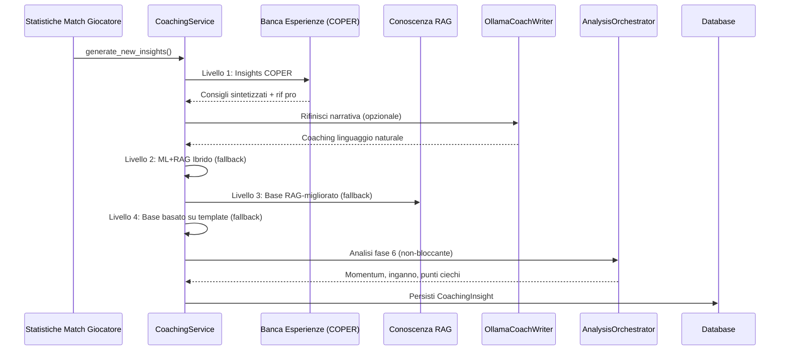

> **Spiegazione Diagramma:** Segui le frecce dall'alto verso il basso: questo è il "processo di pensiero" dell'allenatore in ordine: (1) Arrivano i dati della partita. (2) L'allenatore chiede prima all'Experience Bank: "Abbiamo già visto questa situazione? Cosa ha funzionato?". (3) Se la risposta sembra troppo robotica, la invia facoltativamente a Ollama (un programmatore di intelligenza artificiale locale) per renderla più naturale. (4) Se l'Experience Bank non dispone di dati sufficienti, ricorre alla modalità ibrida (previsioni ML + conoscenza RAG combinate). (5) Se anche i modelli ML non sono disponibili, ricorre solo a RAG (cercando suggerimenti pertinenti). (6) Se anche RAG fallisce, utilizza semplici modelli statistici ("Il tuo rapporto K/D è 0,8, sotto la media"). (7) Nel frattempo, in background, 7 motori di analisi eseguono indagini speciali attraverso 5 pipeline (momentum, inganno, entropia, strategia+punti ciechi, distanza ingaggio). (8) Tutto viene salvato nel database per riferimento futuro.

**Catena di fallback a 4 livelli:**

| Livello              | Metodo                          | Fiducia | Quando utilizzato                                |
| -------------------- | ------------------------------- | ------- | ------------------------------------------------ |
| 1.**COPER**    | `_generate_coper_insights()`  | Massima | Predefinita — sintesi basata sull'esperienza    |
| 2.**Ibrido**   | `_generate_hybrid_insights()` | Alta    | Se COPER non ha esperienza sufficiente           |
| 3.**RAG Base** | `_enhance_with_rag()`         | Media   | Se i modelli ML non sono disponibili             |
| 4.**Template** | Modello statistico di base      | Bassa   | Ultima risorsa — restituisce sempre*qualcosa* |

> **Analogia:** Il fallback a 4 livelli è come **ordinare del cibo al ristorante**. Il Livello 1 (COPER) è la specialità dello chef: il piatto migliore e più personalizzato, creato in base all'esperienza. Il Livello 2 (Ibrido) è il menu standard: ottimo cibo, ma non così personalizzato. Il Livello 3 (RAG Base) è il menu per bambini: più semplice, ma comunque nutriente. Il Livello 4 (Modello) è pane e acqua: base, ma non uscirai mai affamato. La garanzia principale è: **il giocatore riceve sempre consigli di allenamento**, qualunque cosa accada. Il sistema non ti dice mai "Mi dispiace, non ho niente per te".

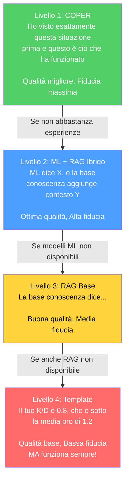

**Progettazione chiave:** Non restituisce mai zero insight. L'analisi di Fase 6 è non bloccante (incapsulata in try-catch, registrata in modo non fatale).

> **Correzione G-08 (Coaching Fallback):** In precedenza, il metodo `_generate_coper_insights()` non riceveva i parametri `deviations` e `rounds_played` dal chiamante, causando un fallback silenzioso ai template di base. Dopo la rimediazione, `generate_new_insights()` ora passa esplicitamente entrambi i parametri (`deviations=deviations, rounds_played=rounds_played`) al handler COPER, garantendo che il Livello 1 COPER possa generare insight contestuali basati sulle deviazioni statistiche reali del giocatore rispetto alla baseline pro. Senza questa correzione, il sistema avrebbe sempre degradato al Livello 4 (template) anche quando i dati COPER erano disponibili.

**Arricchimento della baseline temporale (Proposta 11):** Il servizio di coaching ora integra confronti pro ponderati nel tempo tramite due nuovi metodi:

- `_get_temporal_baseline(map_name)` — recupera una baseline pro ponderata in base a `TemporalBaselineDecay` (emivita = 90 giorni) invece di medie statiche
- `_baseline_context_note(deviations, map_name)` — genera una descrizione in linguaggio naturale ("In base ai dati pro recenti ponderati in base alla recenza, il tuo ADR è inferiore del 12% rispetto alla meta media attuale su de_mirage") per l'arricchimento COPER

Questo garantisce che gli insight di coaching riflettano la **meta media attuale** anziché medie storiche obsolete. Se i dati temporali non sono sufficienti (< 10 schede statistiche), il servizio ricorre alla funzione legacy `get_pro_baseline()` in modo trasparente.

> **Analogia:** In precedenza, l'allenatore ti confrontava con un'**istantanea** di statistiche professionali di mesi fa. Ora utilizza una **media in tempo reale e aggiornata** in cui le prestazioni professionali recenti contano più di quelle vecchie, come una valutazione su una curva in cui i punteggi dei test della settimana scorsa contano più di quelli dell'anno scorso. Se la media della classe in "ADR" è aumentata questo mese, lo vedrai immediatamente riflesso nei tuoi consigli di allenamento.

**Inferenza della fase del round** (`_infer_round_phase`): Valore dell'attrezzatura → classificazione della fase del round:

| Valore dell'attrezzatura | Fase del round |
| ------------------------ | -------------- |
| < $1.500                 | `pistol`     |
| $1.500 – $2.999         | `eco`        |
| $ 3.000 – $ 3.999     | `force`      |
| ≥ $ 4.000               | `full_buy`   |

**Classificazione dell'intervallo di salute** (`_health_to_range`): Utilizzato per l'hashing del contesto COPER: `"full"` (≥80), `"damaged"` (40–79), `"critical"` (<40).

### -OllamaCoachWriter (`ollama_writer.py`)

Trasforma le informazioni di coaching strutturate in linguaggio naturale tramite LLM locale (Ollama).

- **Singleton** tramite factory `get_ollama_writer()`
- **Funzionalità contrassegnata:** impostazione `USE_OLLAMA_COACHING` (predefinita: False)
- **Degradazione graduale:** restituisce il testo originale se Ollama non è disponibile
- **Prompt di sistema:** tono da esperto di coaching CS2, <100 parole, fattibile, incoraggiante

> **Analogia:** OllamaCoachWriter è come un **traduttore** che prende statistiche aride e le trasforma in consigli motivanti. Senza di esso, l'allenatore potrebbe dire: "deviazione media: -0,07, punteggio z: -1,4, categoria: meccanica". Con questo, l'allenatore dice: "La tua percentuale di tiri alla testa è leggermente inferiore alla media dei professionisti. Prova a concentrarti sul posizionamento del mirino: tienilo all'altezza della testa in curva". Esegue un modello di intelligenza artificiale locale (Ollama) sul tuo computer: non serve internet, né dati vengono inviati al cloud. Se Ollama non è installato, il sistema utilizza semplicemente il testo originale: nessun crash, nessun errore, solo una formulazione leggermente meno curata.

### -AnalysisOrchestrator (`analysis_orchestrator.py`)

Sintetizza l'analisi avanzata di Fase 6 istanziando 7 motori e orchestrando 5 pipeline di analisi:

**Input:** Dati di tick della partita, eventi, statistiche dei giocatori
**Output:** `MatchAnalysis` con oggetti `RoundAnalysis` per round contenenti:

- `momentum_score` (tilt/striscia vincente)
- `deception_score` (sofisticatezza tattica)
- `utility_entropy` (misurazione dell'efficacia)
- `blind_spots` (lacune strategiche)
- `strategy_rec` (raccomandazione dell'albero di gioco)
- `engagement_range` (analisi distanza di ingaggio)

**Motori istanziati:** `belief_estimator`, `deception_analyzer`, `momentum_tracker`, `entropy_analyzer`, `game_tree`, `blind_spot_detector`, `engagement_analyzer` (7 motori). Il `belief_estimator` è istanziato ma attualmente non invocato direttamente come pipeline separata.

> **Analogia:** AnalysisOrchestrator è come una **squadra di 7 detective specializzati**, ognuno dei quali indaga su un aspetto diverso del tuo gameplay. *Detective Momentum* verifica se sei in una fase di successo o in difficoltà. *Detective Deception* verifica se sei prevedibile o subdolo. *Detective Entropy* verifica se la tua utilità (granate) è efficace. *Detective Blind Spots* verifica se continui a commettere lo stesso errore. *Detective Strategy* verifica se stai prendendo le decisioni giuste. *Detective Death Probability* verifica quanto sono rischiose le tue posizioni. *Detective Engagement Range* verifica a quali distanze combatti meglio. Tutti questi controlli funzionano in background (non bloccanti), quindi anche se un detective fallisce, gli altri segnalano comunque le loro scoperte.

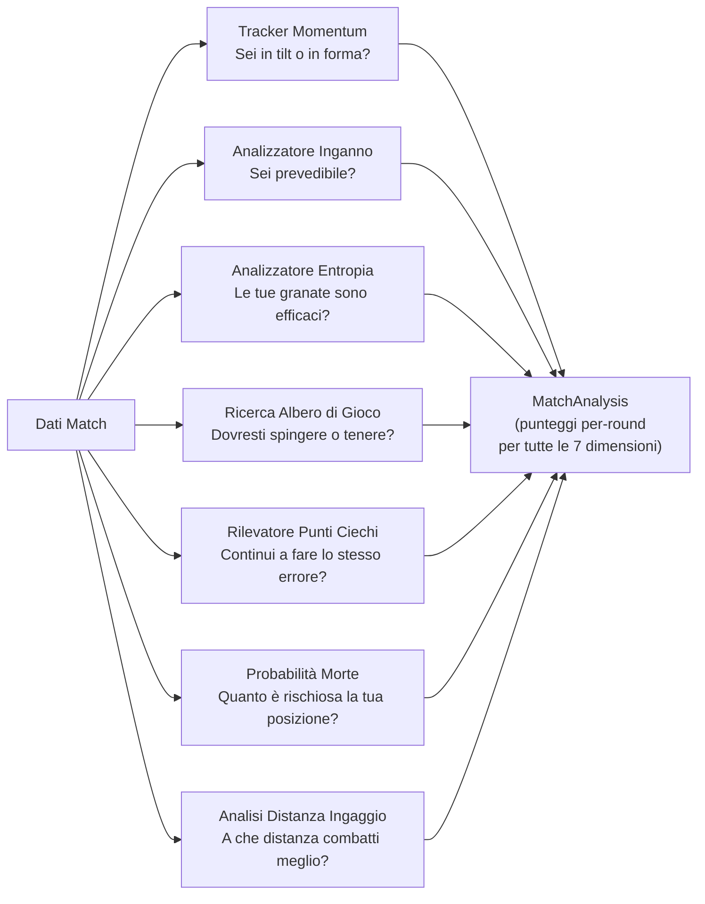

### -Servizi Aggiuntivi (Non documentati in precedenza)

Oltre ai tre servizi principali (CoachingService, OllamaCoachWriter, AnalysisOrchestrator), la directory `backend/services/` contiene **7 servizi aggiuntivi** che completano l'ecosistema di coaching:

> **Analogia:** Se CoachingService è il **direttore dell'ospedale**, i servizi aggiuntivi sono i **reparti specializzati**: c'è il reparto di dialogo (coaching interattivo), il reparto lezioni (formazione strutturata), il laboratorio linguistico (LLM), il reparto imaging (visualizzazioni), l'anagrafe (profili), il reparto analisi (coordinamento) e il sistema di telemetria (monitoraggio remoto).

#### CoachingDialogueEngine (`coaching_dialogue.py`, ~500 righe)

Motore di dialogo multi-turno con augmentazione RAG e Experience Bank. Evolve il single-shot OllamaCoachWriter in una **sessione interattiva** dove i giocatori possono fare domande follow-up sulle loro prestazioni.

| Componente | Dettaglio |
|---|---|
| **Classificazione intent** | Keyword-based: 7 categorie (positioning, utility, economy, aim, player_query, round_query, match_query) + general fallback |
| **Contesto sliding window** | `MAX_CONTEXT_TURNS = 6` (12 messaggi: 6 user + 6 assistant) |
| **Retrieval augmentation** | RAG top-3 + Experience Bank top-3, iniettati nel messaggio utente |
| **Player entity detection** | Integrazione con `PlayerLookupService` per rilevare menzioni di giocatori professionisti nel messaggio utente e iniettare blocchi "VERIFIED PLAYER DATA" nel contesto LLM |
| **Fallback offline** | Template-based con RAG-only quando Ollama non è disponibile |
| **Singleton** | `get_dialogue_engine()` — factory module-level |
| **Anti-hallucination (WR-78/79)** | System prompt con regole: "use ONLY verified data", provenance markers ("pro data" vs "user data"), mai fabbricare narrative tattiche |

**Pipeline di risposta:**

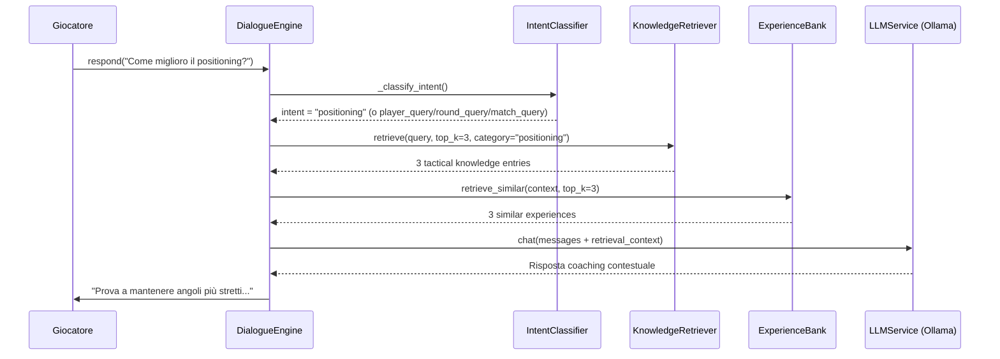

**Gestione sessione:** `start_session(player_name, demo_name)` → carica contesto dal DB (ultimi 5 insight, area focus primaria) → genera messaggio di apertura via LLM → `respond(user_message)` per turni successivi → `clear_session()` per reset.

**Sicurezza dello storico (F5-06):** Il messaggio utente viene aggiunto alla cronologia solo *dopo* aver ottenuto una risposta valida dal LLM, evitando stati inconsistenti in caso di eccezione.

#### LessonGenerator (`lesson_generator.py`, 382 righe)

Generatore di lezioni educative strutturate a partire dall'analisi delle demo:

| Soglia | Costante | Valore | Uso |
|---|---|---|---|
| ADR forte | `_ADR_STRONG_THRESHOLD` | 75.0 | Identifica punti di forza |
| ADR debole | `_ADR_WEAK_THRESHOLD` | 60.0 | Identifica aree di miglioramento |
| HS% forte | `_HS_STRONG_THRESHOLD` | 0.40 | Precisione sopra la media |
| HS% debole | `_HS_WEAK_THRESHOLD` | 0.35 | Precisione sotto la media |
| Rating sopra media | `_RATING_ABOVE_AVG` | 1.0 | Prestazione positiva |
| KAST forte | `_KAST_STRONG_THRESHOLD` | 0.70 | Contributo costante |
| Rapporto morti | `_DEATH_RATIO_WARNING` | 1.5× | deaths > kills × 1.5 = warning |

**Struttura lezione generata:**

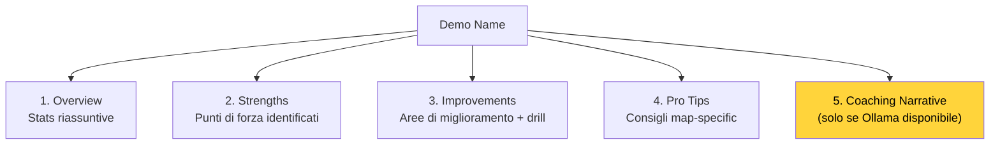

**Pro Tips map-specific:** Database interno con consigli per mirage, inferno, dust2, ancient, nuke. Fallback a consigli generali per mappe non coperte.

#### LLMService (`llm_service.py`, 253 righe)

Servizio di integrazione Ollama per inferenza LLM locale:

| Parametro | Valore | Descrizione |
|---|---|---|
| `OLLAMA_URL` | `http://localhost:11434` | Endpoint Ollama (env: `OLLAMA_URL`) |
| `DEFAULT_MODEL` | `llama3.1:8b` | Modello 8B general-purpose (env: `OLLAMA_MODEL`) |
| `_AVAILABILITY_TTL` | 60s | Cache di disponibilità |
| `temperature` | 0.7 | Creatività delle risposte |
| `top_p` | 0.9 | Nucleus sampling |
| `num_predict` | 500 | Limite lunghezza risposta |

**API supportate:**

| Metodo | Endpoint Ollama | Uso |
|---|---|---|
| `generate(prompt)` | `/api/generate` | Generazione single-shot |
| `chat(messages)` | `/api/chat` | Conversazione multi-turno |
| `generate_lesson(insights)` | `/api/generate` | Lezioni da insight RAP |
| `explain_round_decision(round_data)` | `/api/generate` | Spiegazione round singolo |
| `generate_pro_tip(context)` | `/api/generate` | Tip contestuale |

**Auto-discovery modello:** Se il modello configurato non è disponibile, utilizza automaticamente il primo modello installato. Singleton via `get_llm_service()`.

#### VisualizationService (`visualization_service.py`, 119 righe)

Genera grafici radar Matplotlib per confronto User vs Pro:

- `generate_performance_radar(user_stats, pro_stats, output_path)` → file PNG con radar overlay
- `plot_comparison_v2(p1_name, p2_name, p1_stats, p2_stats)` → `io.BytesIO` buffer PNG
- Feature confrontate: avg_kills, avg_adr, avg_hs, avg_kast, accuracy
- Rendering wrappato in try/except (F5-19) per gestire stats vuote o backend matplotlib assente

#### ProfileService (`profile_service.py`, 127 righe)

Orchestratore di sincronizzazione profili esterni:

- `fetch_steam_stats(steam_id)` → nickname, avatar, playtime CS2 (ore)
- `fetch_faceit_stats(nickname)` → faceit_elo, faceit_level, faceit_id
- `sync_all_external_data(steam_id, faceit_name)` → upsert su `PlayerProfile` in DB
- Chiavi API caricate da environment/keyring (F5-22), mai hardcoded

#### AnalysisService (`analysis_service.py`, 92 righe)

Servizio di coordinamento analisi con drift detection:

- `analyze_latest_performance(player_name)` → ultime stats dal DB
- `get_pro_comparison(player_name, pro_name)` → confronto side-by-side
- `check_for_drift(player_name)` → `detect_feature_drift()` sulle ultime 100 partite

#### TelemetryClient (`telemetry_client.py`, 60 righe)

Client async per invio metriche a server centrale:

- Protocollo: `httpx.Client` → `POST /api/ingest/telemetry`
- URL configurabile: `CS2_TELEMETRY_URL` (default: `http://127.0.0.1:8000`)
- Fallback graceful se httpx non installato (feature opzionale)
- **Anti-fabrication compliant:** nessun dato sintetico nel self-test

#### PlayerLookupService (`player_lookup.py`, 503 righe)

Servizio di ricerca giocatori professionisti che previene l'allucinazione LLM iniettando dati verificati nel contesto del dialogo di coaching:

> **Analogia:** Il PlayerLookupService è come un **archivista che controlla i fatti** prima che l'allenatore parli. Quando un giocatore chiede "Parlami di s1mple", l'archivista va a controllare nelle cartelle cliniche reali (database HLTV + Monolith) e consegna una scheda verificata all'allenatore: "Ecco i dati reali su s1mple: rating 1.29, team Natus Vincere, ecc.". L'allenatore è obbligato a usare SOLO questi dati verificati, non può inventare statistiche. Senza l'archivista, l'LLM potrebbe "allucinare" statistiche plausibili ma false.

| Componente | Dettaglio |
|---|---|
| **Matching a 3 livelli** | Esatto (case-insensitive) → Fuzzy (SequenceMatcher ≥ 0.75) → Pattern (regex nickname) |
| **Cache nickname** | TTL 60s, carica tutti i `ProPlayer.nickname` dal DB HLTV all'avvio |
| **Stop-word filter** | 89 parole comuni inglesi filtrate per evitare falsi positivi |
| **Output** | `ProPlayerProfile` dataclass: nickname, hltv_id, real_name, country, team, statistiche HLTV (rating, KPR, ADR, KAST), performance da demo locali |
| **Integrazione** | `CoachingDialogueEngine` → `detect_player_mentions()` → `lookup_player()` → `format_player_context()` → blocco "VERIFIED PLAYER DATA" iniettato nel contesto LLM |
| **Singleton** | `get_player_lookup_service()` |

**Pipeline anti-allucinazione:**

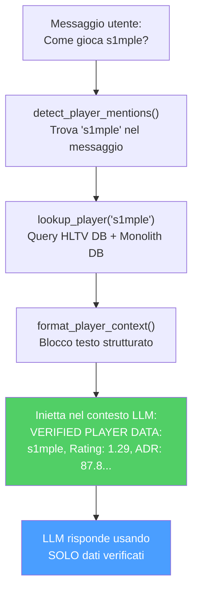

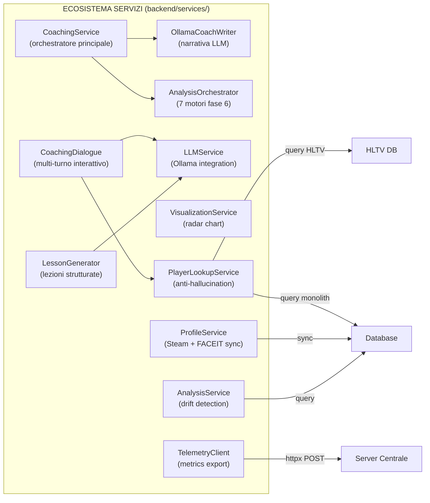

---

## 5B. Sottosistema 3B — Motori di Coaching

**Cartella nella repo:** `backend/coaching/`
**File:** 7 moduli, ~1.100 righe totali

Questo sottosistema contiene i **motori decisionali di coaching** che trasformano deviazioni statistiche grezze in consigli prioritizzati e contestualizzati. A differenza dei Servizi (Sezione 5) che orchestrano e presentano, i Motori di Coaching contengono la **logica di ragionamento** dell'allenatore.

> **Analogia:** Se i Servizi di Coaching (Sezione 5) sono la **reception dell'ospedale**, i Motori di Coaching sono i **medici specialisti nei loro studi**. Il `CorrectionEngine` è il medico di base che pesa i sintomi e decide quali 3 sono i più urgenti. Il `HybridCoachingEngine` è il primario che sintetizza ML e conoscenza enciclopedica per formulare diagnosi complete. L'`ExplanationGenerator` è lo specialista che traduce il gergo medico in parole comprensibili al paziente. Il `ProBridge` è il consulente che porta i referti di altri ospedali (dati HLTV) e li rende compatibili con il sistema locale. Il `LongitudinalEngine` è l'epidemiologo che studia i trend nel tempo.

### -HybridCoachingEngine (`hybrid_engine.py`, 643 righe)

Il **cuore decisionale** del coaching: sintetizza predizioni ML con conoscenza RAG per generare insight unificati e deduplicati.

**Pipeline a 5 stadi:**

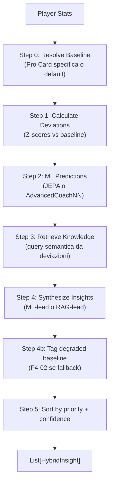

**Classi e dataclass:**

| Tipo | Nome | Descrizione |
|---|---|---|
| `Enum` | `InsightPriority` | CRITICAL (\|Z\|>2.5, conf>0.8), HIGH (\|Z\|>2.0, conf>0.6), MEDIUM (\|Z\|>1.0, conf>0.4), LOW |
| `dataclass` | `HybridInsight` | title, message, priority, confidence, feature, ml_z_score, knowledge_refs, pro_examples, tick_range, demo_name |

**Formula di confidenza:**

```
base_confidence = |z_score|/3.0 × 0.6 + knowledge_effectiveness × 0.4
confidence = base_confidence × MetaDriftEngine.get_meta_confidence_adjustment()
```

Dove `knowledge_effectiveness = min(1.0, mean(usage_count) / 100)`.

**Strategia di sintesi:**

| Condizione | Strategia |
|---|---|
| \|Z\| > 2 (alta confidenza ML) | Lead con ML, supporto con RAG |
| \|Z\| < 1 (bassa confidenza ML) | Lead con RAG |
| 1 ≤ \|Z\| ≤ 2 | Approccio bilanciato |
| Nessuna deviazione significativa | Insight knowledge-only (priorità LOW) |

**TASK 2.7.1 — Reference Clip:** Ogni `HybridInsight` può includere `tick_range: (start, end)` e `demo_name` per permettere alla UI di saltare direttamente all'evidenza nel file demo.

**Fallback baseline (F4-02):** Se `get_pro_baseline()` fallisce, usa valori statici hardcoded e marca tutti gli insight con `baseline_quality=degraded` nel messaggio.

### -CorrectionEngine (`correction_engine.py`, 65 righe)

Genera le **top-3 correzioni pesate** da deviazioni Z-score:

| Costante | Valore | Uso |
|---|---|---|
| `CONFIDENCE_ROUNDS_CEILING` | 300 | Scaling confidenza: `min(1.0, rounds / 300)` |

**Pesi di importanza (DEFAULT_IMPORTANCE):**

| Feature | Peso |
|---|---|
| `avg_kast` | 1.5 |
| `avg_adr` | 1.5 |
| `accuracy` | 1.4 |
| `impact_rounds` | 1.3 |
| `avg_hs` | 1.2 |
| `econ_rating` | 1.1 |
| `positional_aggression_score` | 1.0 |

**Pipeline:** `deviations` → applica confidence scaling × rounds_played → opzionale `apply_nn_refinement()` → sort per `|weighted_z| × importance` → restituisci top 3.

**Override utente:** I pesi sono sovrascrivibili via `get_setting("COACH_WEIGHT_OVERRIDES")`.

### -ExplanationGenerator (`explainability.py`, 95 righe)

Traduce segnali latenti RL in **narrative comprensibili** organizzate per i 5 assi di competenza (`SkillAxes`):

| Asse | Template Negativo | Template Azione |
|---|---|---|
| MECHANICS | "Your {feature} is {delta}% below professional standards..." | "Focus on crosshair height when clearing corners..." |
| POSITIONING | "Positioning at {location} was suboptimal..." | "Try holding a tighter angle at {location}..." |
| UTILITY | "Utility timing with {weapon} was suboptimal..." | "Wait for a clear sound cue before deploying..." |
| TIMING | "Engagement timing is lagging behind..." | "Coordinate with teammates to trade-frag..." |
| DECISION | "Decision efficiency is {delta}% lower..." | "In clutch scenarios, prioritize the round objective..." |

**Principio "Silence is a Valid Action":**

| Soglia | Costante | Valore | Comportamento |
|---|---|---|---|
| Silenzio | `SILENCE_THRESHOLD` | 0.2 | \|delta\| < 0.2 → nessun feedback (silenzio) |
| Severità alta | `SEVERITY_HIGH_BOUNDARY` | 1.5 | \|delta\| > 1.5 → "High" |
| Severità media | `SEVERITY_MEDIUM_BOUNDARY` | 0.8 | \|delta\| > 0.8 → "Medium" |

**Filtro di complessità:** Per `skill_level < 3` (principianti), le narrative negative sono semplificate alla sola azione suggerita, evitando sovraccarico cognitivo.

### -NNRefinement (`nn_refinement.py`, 31 righe)

Applica aggiustamenti di peso dalla rete neurale alle correzioni pre-calcolate:

```
refined_z = weighted_z × (1 + nn_adjustments["{feature}_weight"])
```

Modulo leggero che scala le correzioni dal `CorrectionEngine` usando pesi appresi dal modello ML, permettendo al sistema neurale di influenzare la prioritizzazione dei consigli.

### -ProBridge (`pro_bridge.py`, 115 righe)

**Layer di traduzione** che assimila Player Card HLTV nel modello cognitivo del coach:

| Classe | Responsabilità |
|---|---|
| `PlayerCardAssimilator` | Converte `ProPlayerStatCard` → baseline coach-compatible |
| `get_pro_baseline_for_coach()` | Factory function diretta |

**Costante legacy:** `ESTIMATED_ROUNDS_PER_MATCH = 24.0` — presente nel codice ma **non più utilizzata** per la conversione KPR/DPR dopo la correzione P3-02.

**Mappatura metriche:**

| Metrica HLTV | Metrica Coach | Trasformazione |
|---|---|---|
| `card.kpr` | `avg_kills` | **diretto** (P3-02: NON moltiplicato per 24) |
| `card.dpr` | `avg_deaths` | **diretto** (P3-02: NON moltiplicato per 24) |
| `card.adr` | `avg_adr` | diretto |
| `card.kast` | `avg_kast` | V-2: normalizzazione difensiva (`/100` se `kast > 1.0`, altrimenti diretto) |
| `card.impact` | `impact_rounds` | diretto |
| `card.rating_2_0` | `rating` | diretto |
| `detailed_stats.headshot_pct` | `avg_hs` | V-2: normalizzazione difensiva (`/100` se `> 1.0`, default 0.45) |
| `detailed_stats.total_opening_kills` | `entry_rate` | `/100` (euristica) |
| `detailed_stats.utility_damage_per_round` | `utility_damage` | diretto (default 45.0) |

> **Correzione P3-02 — Scala KPR/DPR:** Il codice precedente moltiplicava `kpr × 24` e `dpr × 24`, producendo uccisioni/morti totali per partita (valori 15-20) anziché valori per-round (0.6-0.8). Questo rendeva tutti gli z-score di confronto invalidi poiché le statistiche utente estratte da `base_features.py` e `pro_baseline.py` sono già in scala per-round. Dopo la rimediazione, `get_coach_baseline()` usa direttamente i tassi per-round.
>
> **Correzione V-2 — Normalizzazione difensiva legacy:** I record HLTV più vecchi nel database potrebbero contenere valori percentuali (es. `kast=72.0` anziché `kast=0.72`). La normalizzazione condizionale (`/100 se > 1.0`) gestisce entrambi i formati in modo trasparente.

**Classificazione archetipo:** `get_player_archetype()` → Star Fragger (impact>1.3), Support Anchor (kast>0.75), Sniper Specialist (AWP kills>40%), All-Rounder (default).

### -PlayerTokenResolver (`token_resolver.py`, 108 righe)

Risolve **token statici** (Card) per il confronto dinamico:

- `get_player_token(player_name)` → token dict con identity, core_metrics, tactical_baselines, granular_data, metadata
- `compare_performance_to_token(match_stats, token)` → `Correction Delta` con deltas per rating, adr, kast, accuracy_vs_hs e flag `is_underperforming` (rating < 85% del pro)

**Struttura Token:**

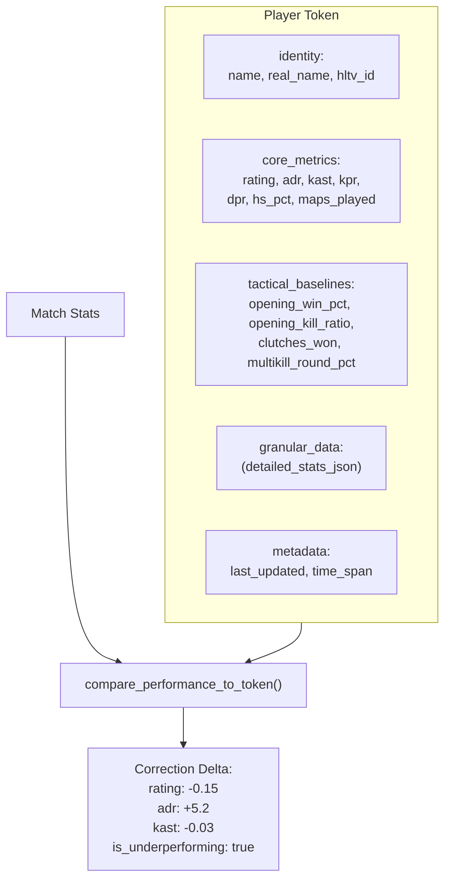

### -LongitudinalEngine (`longitudinal_engine.py`, 49 righe)

Genera insight trend-aware comparando traiettorie di performance nel tempo con segnali di stabilità NN:

- **Input:** `List[FeatureTrend]` (dal modulo progress) + `nn_signals` (dal training pipeline)
- **Filtro confidenza:** Solo trend con `confidence ≥ 0.6`
- **Output:** Max 3 insight, categorizzati come:
  - **Regression:** slope < 0 → severità "Medium" (o "High" se `nn_signals.stability_warning` attivo)
  - **Improvement:** slope > 0 → severità "Positive", focus "Reinforcement"

> **Analogia:** Il LongitudinalEngine è come un **grafico dei voti nel tempo**. Non guarda solo il voto dell'ultimo esame, ma l'intera traiettoria: "I tuoi voti in matematica sono in calo da 3 mesi" (regressione) o "La tua precisione sta migliorando costantemente" (miglioramento). Se il sistema neurale è instabile (`stability_warning`), il medico alza il livello di allerta: "Questo calo potrebbe essere più serio di quanto sembra".

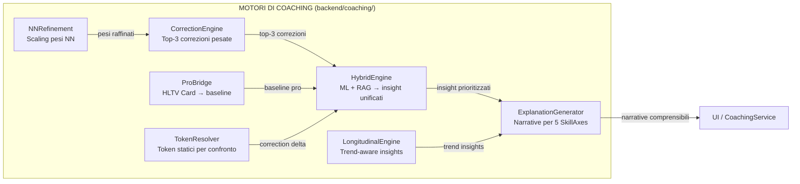

---

## 6. Sottosistema 4 — Conoscenza e Recupero

**cartella nella repo:** `backend/knowledge/`
**File:** `rag_knowledge.py`, `experience_bank.py`

Questo sottosistema è la **biblioteca e il diario** dell'allenatore: memorizza le conoscenze tattiche (come un libro di testo) e le esperienze di allenamento passate (come un diario di ciò che ha funzionato e di ciò che non ha funzionato).

> **Analogia:** Immagina di avere due modi per studiare per un esame. Il primo è un **libro di testo** (RAG Knowledge Base) — contiene tutti i suggerimenti CS2 organizzati per argomento: "obiettivo", "posizionamento", "utilità", ecc. Puoi cercarli ponendo domande in inglese semplice e il sistema trova le pagine più pertinenti. Il secondo è il tuo **diario personale** (Experience Bank) — registra ogni sessione di allenamento che hai svolto, i consigli che ti sono stati dati e se sei effettivamente migliorato in seguito. Col tempo, il diario diventa più intelligente: i consigli che hanno funzionato vengono evidenziati, mentre quelli che non hanno funzionato vengono eliminati. Insieme, il libro di testo e il diario forniscono all'allenatore sia **conoscenza generale** che **esperienza personale** da cui attingere.

### -Knowledge Base RAG (`rag_knowledge.py`)

Implementa una pipeline di **generazione aumentata dal recupero** utilizzando la ricerca per similarità vettoriale densa:

| Componente                          | Dettaglio                                                                                                                                            |
| ----------------------------------- | ---------------------------------------------------------------------------------------------------------------------------------------------------- |
| **Modello di incorporamento** | `sentence-transformers/all-MiniLM-L6-v2` (vettori a 384 dimensioni)                                                                                |
| **Fallback**                  | Incorporamenti basati su hash se Sentence-BERT non è disponibile                                                                                    |
| **Archiviazione**             | Tabella SQLite `TacticalKnowledge` (embedding memorizzato come array float codificato in JSON)                                                     |
| **Recupero**                  | Similarità del coseno tramite `scipy.spatial.distance.cosine`                                                                                     |
| **Top-k**                     | Configurabile, predefinito k=5                                                                                                                       |
| **Versioning**                | `CURRENT_VERSION = "v3"` (2026-04, Coach Book refactor, Premier S4 active duty alignment); incorporamenti obsoleti v2 ricalcolati automaticamente via `trigger_reembedding()` |
| **Categorie**                 | 14: obiettivo, posizionamento, utilità, movimento, economia, strategia, posizionamento del mirino, comunicazione, mentale, senso del gioco, trading, **mid_round**, **retakes_post_plant**, **aim_and_duels** |

> **Analogia:** RAG funziona come un **motore di ricerca intelligente per il cervello dell'allenatore**. Quando l'allenatore ha bisogno di consigli sul posizionamento su Dust2 come CT AWPer, non cerca per parole chiave come Google. Invece, converte la domanda in un "vettore di significato" di 384 numeri e trova suggerimenti memorizzati i cui vettori di significato puntano nella stessa direzione (somiglianza del coseno). È come se ogni libro in una biblioteca avesse una coordinata GPS che ne rappresenta l'argomento e, invece di cercare per titolo, si fornissero le coordinate GPS e si trovassero i 5 libri più vicini. Il moltiplicatore di rilevanza 1,2x è come dire "i libri dello stesso scaffale (stessa mappa/lato/tipo di arrotondamento) ottengono punti bonus". Il filtro di deduplicazione (soglia 0,85) impedisce di restituire 5 copie sostanzialmente dello stesso suggerimento.
>
> **Correzione M-07 — Rifiuto vettore norma-zero:** `VectorIndex.search()` valida la norma del vettore query prima della ricerca. Se la norma è zero (tipicamente dovuto a un embedding fallback vuoto o a un input corrotto), il metodo ritorna `None` con un warning nel log anziché propagare un errore di divisione per zero nella similarità del coseno. Questo protegge il pipeline RAG da query degenerate senza interrompere il flusso di coaching.

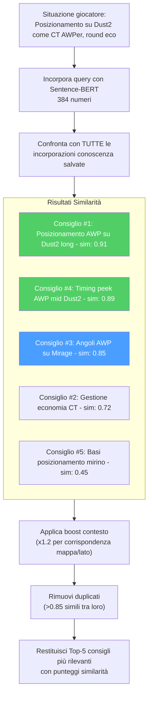

**Costruzione query:** query dinamiche in linguaggio naturale da statistiche giocatore, mappa, lato, ruolo. Gli elementi che corrispondono al contesto ottengono un moltiplicatore di rilevanza 1,2x. La deduplicazione filtra gli elementi con una similarità >0,85 rispetto ai risultati già selezionati.

### -Banca Esperienza (`experience_bank.py`) — Framework COPER (KT-01 Enhanced)

Implementa il framework **Osservazione–Previsione–Esperienza–Recupero Contestuale (COPER)** con semantica CRUD, replay prioritizzato e integrazione TrueSkill:

> **Analogia:** COPER è il **diario personale dell'allenatore con superpoteri**. Ogni volta che l'allenatore dà un consiglio durante una partita, scrive una voce di diario: "In Dust2, round eco lato T, il giocatore era nei tunnel B con 60 HP e un Deagle. Gli ho detto di mantenere l'angolazione. Sono sopravvissuti e hanno ottenuto 2 uccisioni. Questo consiglio HA FUNZIONATO!" Più tardi, quando si presenta una situazione simile, l'allenatore sfoglia il suo diario e trova quella voce. Ma è ancora più intelligente: controlla anche cosa hanno fatto i giocatori professionisti in situazioni simili, cerca degli schemi ("Questo giocatore continua ad avere difficoltà nei round eco sul lato T") e adatta la fiducia in base alla data di convalida del consiglio.

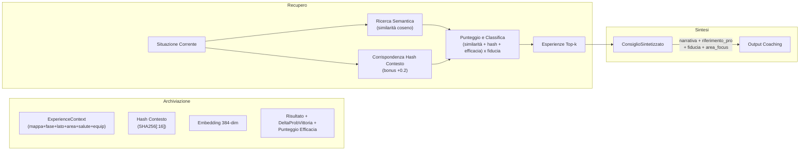

**Strategia di doppio recupero:**

1. **Esperienze utente:** Situazioni passate tratte dalla cronologia di gioco dell'utente.
2. **Esperienze professionali:** Come i professionisti hanno gestito situazioni analoghe.
3. **Analisi dei pattern:** Identifica debolezze ricorrenti, tendenze di miglioramento, correlazioni contestuali.

> **Analogia:** Il doppio recupero è come studiare per un esame utilizzando **sia i tuoi test passati che le risposte del genio della classe**. I tuoi test passati mostrano ciò in cui hai difficoltà personalmente. Le risposte del genio della classe mostrano l'approccio ideale. L'analisi dei pattern è come se il tuo insegnante esaminasse tutti i tuoi test e dicesse: "Ho notato che perdi sempre punti sullo stesso tipo di domanda: concentriamoci su quello".

**Ciclo di feedback (basato su EMA):**

- Ogni esperienza tiene traccia di `outcome_validated`, `effectiveness_score`, `times_advice_given`, `times_advice_followed`
- Le corrispondenze di follow-up aggiornano l'efficacia: `new_score = 0,7 × old_score + 0,3 × outcome_value`
- Esperienze obsolete (>90 giorni senza convalida): la fiducia diminuisce del 10%
- Il monitoraggio dell'utilizzo incrementa `usage_count` a ogni recupero

> **Analogia:** Il ciclo di feedback è il modo in cui l'allenatore **impara dai propri consigli**. Dopo aver fornito un consiglio, verifica: "Il giocatore ha effettivamente fatto quello che gli ho suggerito? Le sue prestazioni sono migliorate?". La formula EMA (0,7 vecchie + 0,3 nuove) significa che l'allenatore si fida della sua esperienza a lungo termine più di qualsiasi singolo risultato, come la valutazione di un ristorante che si basa su centinaia di recensioni, non solo sull'ultima. Se un consiglio non viene convalidato entro 90 giorni, perde il 10% di affidabilità, come una previsione meteorologica che diventa meno affidabile man mano che si procede nel futuro. Questo crea un sistema che si auto-migliora: i buoni consigli diventano più affidabili nel tempo, mentre quelli cattivi vengono gradualmente eliminati.

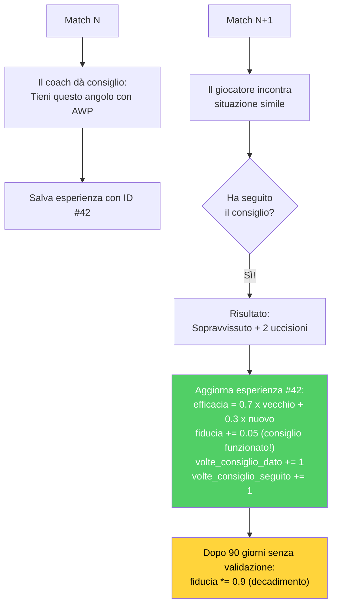

**Estrazione dell'esperienza dalle demo:** Raggruppa gli eventi per tick, identifica le uccisioni/morti dei giocatori, crea il contesto a partire da un'istantanea del tick, deduce l'azione (scoped_hold, crouch_peek, pushed, held_angle), determina l'esito.

**Miglioramenti KT-01 — Semantica CRUD e Replay Prioritizzato:**

| Costante | Valore | Scopo |
|---|---|---|
| `DUPLICATE_SIMILARITY_THRESHOLD` | 0.9 | Similarità coseno per rilevamento duplicati |
| `CRUD_EMA_FACTOR` | 0.3 | Peso EMA per merge effectiveness su UPDATE |
| `REPLAY_ALPHA` | 0.6 | Esponente priorità replay (più basso = più uniforme) |
| `REPLAY_GATE` | 0.4 | Confidenza minima per essere eleggibile al replay |
| `_MIN_EFFECTIVENESS_TRIALS` | 5 | Trial minimi prima che effectiveness influenzi il retrieval |

**Decisione CRUD al momento dell'inserimento:**

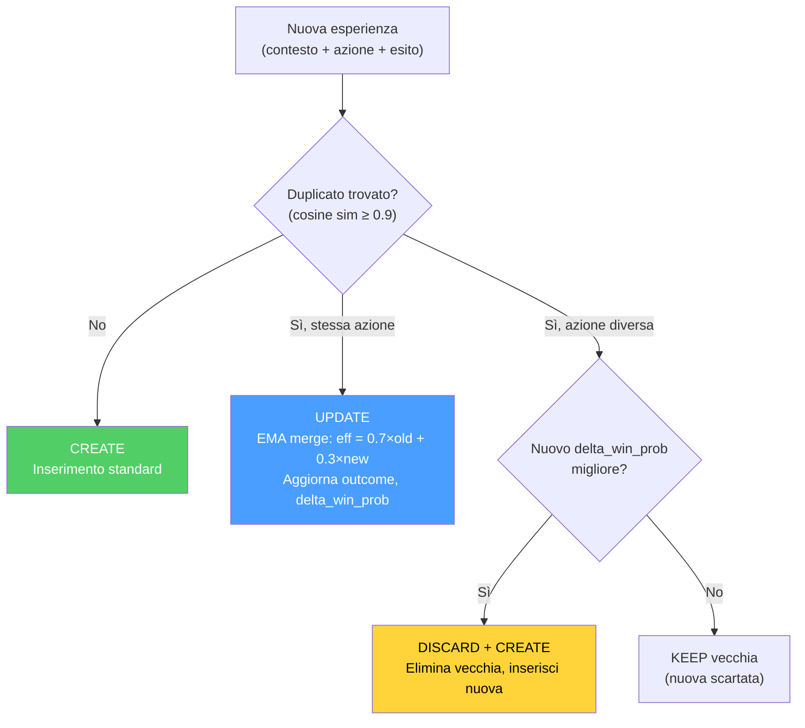

> **Analogia CRUD:** In precedenza, il diario dell'allenatore aggiungeva sempre una nuova voce, anche se era quasi identica a una precedente. Con KT-01, il diario è diventato intelligente: (1) **Se la stessa situazione ha prodotto lo stesso consiglio**, aggiorna la voce esistente con una media ponderata dei risultati (UPDATE). (2) **Se la stessa situazione suggerisce un consiglio diverso e migliore**, sostituisce la vecchia voce (DISCARD+CREATE). (3) **Se il nuovo consiglio è peggiore**, lo scarta silenziosamente (KEEP). Questo previene la crescita illimitata del diario mantenendo solo le esperienze più utili.

**Replay Prioritizzato (KT-01):** Le esperienze vengono campionate per il replay con probabilità proporzionale a `priority^REPLAY_ALPHA`, dove `priority = effectiveness_score × confidence_score`. Solo esperienze con `confidence_score ≥ REPLAY_GATE` sono eleggibili. Questo bilancia exploitation (esperienze efficaci) con exploration (esperienze meno testate).

**Integrazione TrueSkill (KT-01):** Campi `mu_skill` e `sigma_skill` per tracking bayesiano della competenza del giocatore nella situazione specifica. I prior TrueSkill influenzano il peso dell'esperienza nel retrieval: esperienze con alta incertezza (`sigma` alto) sono penalizzate rispetto a quelle con segnale stabile.

**Compressione Embedding:** Gli embedding 384-dim sono ora codificati come `base64(float32)` anziché JSON array, ottenendo una compressione 4× sullo spazio di archiviazione nel database senza perdita di precisione.

**Linking Riferimento Pro:** Ogni esperienza può includere `pro_player_name`, `pro_match_id`, `source_demo` per collegare direttamente a come un professionista specifico ha gestito una situazione analoga.

### -Knowledge Graph

Un **grafo entità-relazione** leggero memorizzato in SQLite (tabelle `kg_entities`, `kg_relations`). Supporta `query_subgraph(entity_name)` a 1 salto per il ragionamento multi-salto, al fine di integrare la similarità semantica.

> **Analogia:** Il Knowledge Graph è come una **rete di fatti connessi**. Invece di memorizzare suggerimenti come paragrafi isolati, collega concetti: "Fumo → blocchi → visione", "AWP → richiede → angoli lunghi", "Sito Dust2 B → si collega a → tunnel". Quando il coach cerca "posizionamento AWP", il Knowledge Graph può seguire le connessioni: "AWP necessita di angoli lunghi → Dust2 ha angoli lunghi in A lungo e a metà → quelle posizioni si collegano al sito A". Questa capacità di "seguire le connessioni" (chiamata ragionamento multi-hop) aiuta il coach a trarre inferenze logiche che la ricerca testuale pura potrebbe non cogliere.

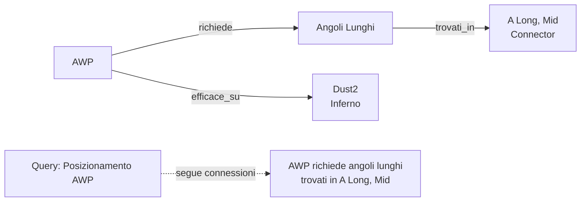

### -Inizializzazione Knowledge Base (`init_knowledge_base.py`, 111 righe)

Script di orchestrazione che popola il database RAG con conoscenza tattica da due fonti:

1. **Conoscenza manuale:** Caricamento da file JSON (`data/tactical_knowledge.json`) con suggerimenti curati manualmente per categoria e mappa
2. **Mining automatico:** Invocazione di `ProDemoMiner.mine_all_pro_demos()` per estrarre pattern tattici dalle demo professionali

Dopo il caricamento, genera un report per categoria e mappa utilizzando query COUNT aggregate (senza caricare tutti i record in memoria).

### -ProDemoMiner (`pro_demo_miner.py`, 277 righe)

Estrae conoscenza tattica dalle demo professionali utilizzando pattern detection:

| Classe | Righe | Descrizione |
|---|---|---|
| `ProDemoMiner` | ~180 | Estrazione pattern da metadati match (map, team, success rate) |
| `AdvancedProDemoMiner(ABC)` | ~60 | Base astratta (F5-05) per parsing demo con demoparser2 |

**Soglie di qualità:**

| Costante | Valore | Significato |
|---|---|---|
| `MIN_SUCCESS_RATE` | 0.70 | Pattern accettato solo se successo ≥70% |
| `MIN_SAMPLE_SIZE` | 5 | Minimo 5 occorrenze per pattern valido |

**Mappe supportate:** mirage, dust2, inferno, nuke, overpass, vertigo, ancient, anubis.

**Tipologie di conoscenza generata:**
- Conoscenza specifica per mappa (posizionamento, utilità, rotazioni)
- Conoscenza specifica per team (strategie, tendenze, stili)
- Conoscenza per esecuzioni di successo (pattern con tasso ≥70%)

### -Round Utils (`round_utils.py`, 35 righe)

Utility condivisa per classificazione fase economica del round, estratta per eliminare duplicazione tra i layer knowledge e services:

| Valore Equipaggiamento | Fase | Costante |
|---|---|---|
| < $1.500 | `pistol` | `_PISTOL_MAX_EQUIP` |
| $1.500 – $2.999 | `eco` | `_ECO_MAX_EQUIP` |
| $3.000 – $3.999 | `force` | `_FORCE_MAX_EQUIP` |
| ≥ $4.000 | `full_buy` | — |

---

## 7. Sottosistema 5 — Motori di analisi

**cartella nella repo:** `backend/analysis/`
**11 file, ~2.600 righe di codice di produzione**

Questo sottosistema contiene **11 motori di analisi specializzati**, ognuno progettato per indagare una diversa dimensione del gameplay. Funzionano come analisi di Fase 6, fornendo approfondimenti che vanno oltre ciò che le sole reti neurali possono offrire.

> **Analogia:** Pensate a questi 11 motori di analisi come a un **team di 11 diversi scienziati sportivi**, ognuno con la propria specializzazione. Uno scienziato studia le vostre meccaniche di tiro, un altro le vostre capacità decisionali sotto pressione, un altro ancora la vostra capacità di essere imprevedibili e così via. Ogni scienziato produce la propria mini-pagella e insieme dipingono un quadro completo dei vostri punti di forza e di debolezza. Nessuno scienziato da solo vede tutto, ma insieme coprono tutti gli aspetti importanti del gioco competitivo in CS2.

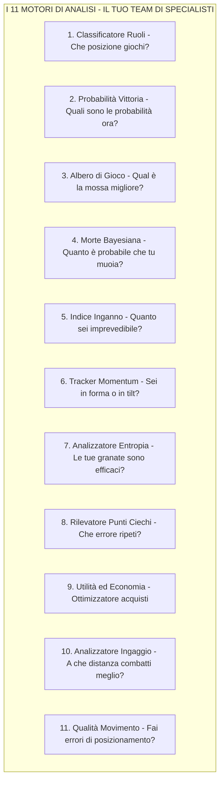

### -Classificatore di Ruoli (`role_classifier.py`, ~400 righe)

Assegna uno dei 6 ruoli utilizzando **soglie statistiche apprese**:

| Ruolo                   | Segnale Primario                                          | Segnale Secondario |
| ----------------------- | --------------------------------------------------------- | ------------------ |
| **AWPer**         | Rapporto uccisioni AWP vs soglia                          | —                 |
| **Entry Fragger** | Tasso di ingresso + bonus alla prima morte (0,3×)        | —                 |
| **Supporto**      | Tasso di assistenza + bonus danni da utilità (max 0,3×) | —                 |
| **IGL**           | Tasso di sopravvivenza + bonus bilanciamento KD           | —                 |
| **Lurker**        | Rapporto uccisioni in solitaria vs soglia                 | —                 |
| **Flex**          | Ripiegamento quando la fiducia è bassa                   | —                 |

> **Analogia:** Il Classificatore di Ruoli è come un **talent scout** che osserva il tuo stile di gioco e capisce in quale posizione ti trovi naturalmente. Se ottieni molte uccisioni AWP, probabilmente sei un AWPer. Se sei sempre il primo a morire (ma ottieni anche uccisioni iniziali), probabilmente sei un Entry Fragger. Se usi molti flash e aiuti i tuoi compagni di squadra, sei un Supporto. Se nessuno sa esattamente cosa fai meglio, sei classificato come Flex, un generalista. Le soglie non sono codificate; vengono apprese dai dati di veri giocatori professionisti (quale percentuale di uccisioni ottiene un vero AWPer con l'AWP?).

**Protezione per avvio "da zero":** `RoleThresholdStore` richiede ≥10 campioni e ≥3 soglie valide per uscire dall'avvio "da zero". Restituisce `(FLEX, 0.0)` se in avvio da zero. Le soglie vengono **mantenute nel database** tramite `persist_to_db()` e `load_from_db()` — completamente implementate, non come stub.

> **Analogia:** La protezione all'avvio a freddo è come un **nuovo insegnante che dice "Non conosco ancora abbastanza bene i miei studenti".** Finché il sistema non ha visto almeno 10 giocatori professionisti e appreso almeno 3 soglie di ruolo valide, si rifiuta di classificare nessuno, restituendo invece "Flex" con una probabilità dello 0%. Questo evita l'imbarazzante errore di chiamare qualcuno "AWPer" quando il sistema ha visto solo 2 esempi di come si presenta un AWPer.

**Audit del bilanciamento del team** (`audit_team_balance()`): rileva più AWPer (ALTA), Entry mancante (ALTA), Supporto mancante (MEDIA), nessuna diversità (CRITICA), più Lurker (MEDIA).

### -Predittore di Probabilità di Vittoria (`win_probability.py`, ~250 righe)

Rete neurale a 12 funzioni che stima P(round_win | game_state):

> **Analogia:** Il predittore di Probabilità di Vittoria è come un **tabellone segnapunti in tempo reale in una partita di basket** che mostra "La squadra di casa ha il 72% di probabilità di vincere". Considera 12 fattori relativi al momento attuale – quanti soldi ha ciascuna squadra, quanti giocatori sono ancora vivi, se la bomba è stata piazzata, quanto tempo rimane – e ne prevede le probabilità. Utilizza una piccola rete neurale (molto più piccola del RAP Coach) perché deve essere veloce, aggiornandosi ogni pochi secondi durante l'analisi in tempo reale.

**Architettura:** `Lineare(12, 64) → ReLU → Dropout(0,2) → Lineare(64, 32) → ReLU → Dropout(0,1) → Lineare(32, 1) → Sigmoide`.

**12 Caratteristiche:**

| \# | Caratteristica                    | Normalizzazione          |
| -- | --------------------------------- | ------------------------ |
| 1  | economia_team                     | /16000                   |
| 2  | economia_nemico                   | /16000                   |
| 3  | differenziale economia            | (squadra−nemico)/16000  |
| 4  | giocatori_vivi                    | /5                       |
| 5  | nemici_vivi                       | /5                       |
| 6  | differenziale conteggio giocatori | (vivi−nemico)/5         |
| 7  | utilità\_rimanente               | /5                       |
| 8  | percentuale_controllo_mappa       | [0, 1]                   |
| 9  | tempo_rimanente                   | /115                     |
| 10 | bomba_piantata                    | binario                  |
| 11 | is_ct                             | binario                  |
| 12 | rapporto valore equipaggiamento   | min(squadra/nemico, 2)/2 |

**Override euristici:** 3+ vantaggio → limite minimo all'85%, 3+ svantaggio → limite massimo al 15%, 0 vivi → 0%, aggiustamenti bomba piazzata (T: +0,10, CT: −0,10) — additivi sulla probabilità base, limiti economici di ±8000$.

> **Analogia:** Gli override euristici sono **barriere di sicurezza basate sul buon senso**. Anche se la rete neurale si blocca e prevede una probabilità di vittoria del 50% quando l'intera squadra è morta, la barra di sicurezza dice "No — 0 giocatori vivi = 0% di probabilità. Punto." Allo stesso modo, se hai 3 giocatori in più in vita rispetto al nemico, la regola di sicurezza recita: "Hai ALMENO l'85% di probabilità di vincere, indipendentemente da ciò che pensa la rete neurale". Queste regole codificano le conoscenze di gioco più basilari che non dovrebbero mai essere violate, fungendo da controllo di sanità mentale sulle previsioni dell'IA.
>
> **Nota A-12 — Guard cross-load:** Questo predittore a 12 feature (`WinProbabilityNN`) è un modello *separato e incompatibile* rispetto al `WinProbabilityTrainerNN` a 9 feature descritto nella Sezione 12. I checkpoint non sono intercambiabili: al caricamento viene validata la dimensionalità del `state_dict` e, in caso di mismatch, il modello viene reinizializzato da zero con un warning nel log.

**Predittore Aumentato con Elo (KT-07):**

L'`EloAugmentedPredictor` avvolge il `WinProbabilityNN` base con un sistema Elo opzionale per sfruttare lo storico delle partite:

> **Analogia:** L'integrazione Elo è come aggiungere la **reputazione del giocatore** alla previsione. Se sai che la squadra A ha vinto 80% delle partite recenti, la tua previsione dovrebbe riflettere questo anche prima che il round inizi. L'Elo cattura questa "reputazione accumulata" che il modello a 12 feature non può vedere perché guarda solo lo stato corrente del round.

| Costante | Valore | Descrizione |
|---|---|---|
| `_ELO_INITIAL` | 1500.0 | Elo iniziale per giocatori senza storico |
| `_ELO_K_FACTOR` | 32.0 | Fattore K base per la magnitudine degli aggiornamenti |
| `_ELO_RECENCY_HALF_LIFE` | 20 partite | Il peso di una partita dimezza ogni 20 partite |

**Formula di aggiornamento Elo con peso di recenza:**

```
new_elo = old_elo + K × w × (S - E)

dove:
  S = punteggio effettivo (1 per vittoria, 0 per sconfitta)
  E = punteggio atteso = 1 / (1 + 10^((opp_elo - elo) / 400))
  w = peso recenza = 2^((match_index - N + 1) / half_life)
```

Il peso di recenza (adattato da Glickman, 1999) garantisce che le partite recenti contribuiscano di più al rating finale. Una partita di 20 match fa contribuisce la metà del K-factor rispetto all'ultima partita.

**Blending NN + Elo:**

```
final_prob = (1 - α) × nn_prob + α × elo_prob    (α = 0.15 default)
```

Il `compute_elo_differential(team_histories, enemy_histories)` calcola il differenziale Elo medio tra le due squadre, normalizzato per 400 (una "classe" Elo), e lo converte in probabilità tramite la formula logistica standard. Il blending è conservativo (α = 0.15) perché l'Elo cattura solo informazione storica, mentre la NN vede lo stato corrente del round.

**Nota:** L'Elo è un'**augmentazione opzionale** — l'architettura base a 12 feature del `WinProbabilityNN` rimane invariata. Se lo storico non è disponibile, il predittore ricade sulla probabilità NN pura.

### -Albero di gioco Expectiminimax (`game_tree.py`, ~445 righe)

Implementa la **ricerca expectiminimax** con modellazione adattiva dell'avversario:

> **Analogia:** L'albero di gioco è come un **motore di scacchi per CS2**. Chiede: "Se spingo, cosa potrebbe fare il nemico? E se lo fa, qual è la mia risposta migliore?". Costruisce un albero di possibilità profondo 3 livelli: la tua mossa, la probabile risposta del nemico e la tua contro-risposta. A differenza degli scacchi tradizionali, CS2 ha la casualità (potresti sbagliare un tiro, il nemico potrebbe ruotare), quindi usa "expectiminimax", il che significa che tiene conto delle probabilità a ogni passaggio. Il risultato è una classifica in cui "Spingere è la migliore, Tenere è la seconda, Ruotare è la terza, Utilità è la quarta" con un punteggio di affidabilità per ciascuna opzione.

- **Azioni:** spingi, tieni premuto, ruota, usa_utilità
- **Modello avversario:** Priorita' economiche (eco/forza/acquisto completo), aggiustamenti laterali, aggiustamenti del vantaggio, pressione temporale
- **Profondità:** 3 livelli (max → probabilità → min)
- **Budget nodo:** 1000 (impedisce l'esplosione)
- **Valutazione foglia:** `WinProbabilityPredictor` (caricamento lazy)
- **Apprendimento avversario:** Aggiornamento EMA incrementale (α limitato a 0,5)

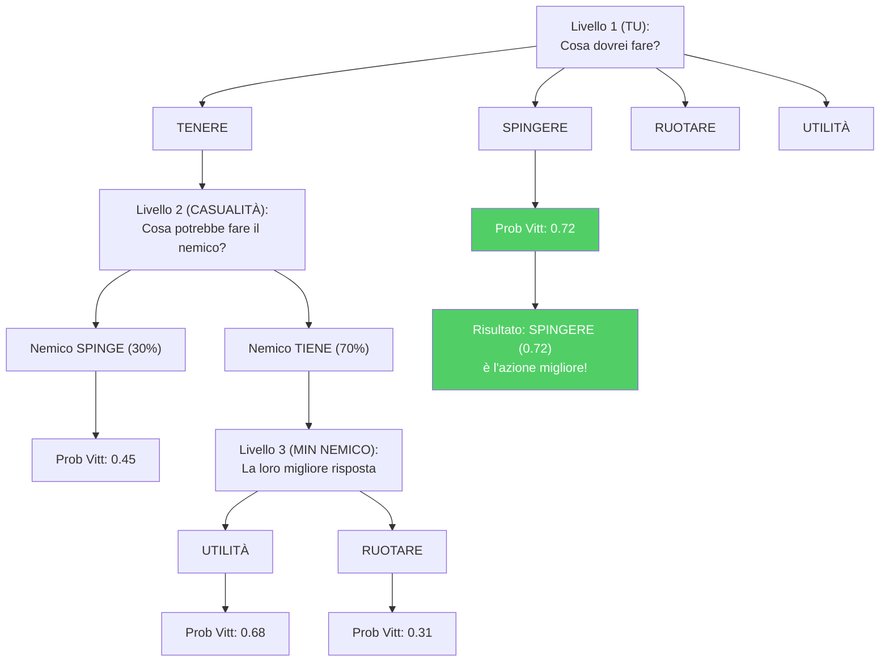

### -Stimatore Bayesiano di Morte (`belief_model.py`, ~486 righe)

Modelli P(morte | credenza, HP, armatura, classe_arma):

> **Analogia:** La Stimatore di Morte è come un **indicatore di pericolo** che risponde a queste domande: "Data la tua posizione, il tuo stato di salute, l'arma del nemico e cosa pensiamo stia facendo, quanto è probabile che tu muoia nei prossimi secondi?". Utilizza statistiche bayesiane, un modo elegante per dire "inizia con un'ipotesi, poi aggiornala con le prove". L'ipotesi iniziale si basa sui PV: se hai la salute al massimo, la probabilità di morire è di circa il 35%; se hai pochi PV, la probabilità sale all'80%. Poi si adatta in base a ciò che sa: "Ma il nemico ha un AWP (più pericoloso di ×1,4) e la minaccia è recente (nessun decadimento)". Questo fornisce una probabilità finale che l'allenatore usa per decidere se consigliare un gioco aggressivo o difensivo.

- **Antecedente:** Tassi di mortalità per fascia HP (pieno ≥80: 0,35, danneggiato 40-79: 0,55, critico <40: 0,80)
- **Fattori di probabilità:** Livello di minaccia (con decadimento esponenziale exp(−0,1 × età)), riduzione dell'armatura (0,75×), moltiplicatori delle armi (AWP: 1,4×, Fucile: 1,0×, Mitragliatrice: 0,75×, Pistola: 0,6×, Coltello: 0,3×)
- **Posteriore:** Combinazione logistica nello spazio log-odds
- **Calibrazione:** `calibrate(historical_rounds)` apprende le priorità empiriche (≥10 campioni per fascia)

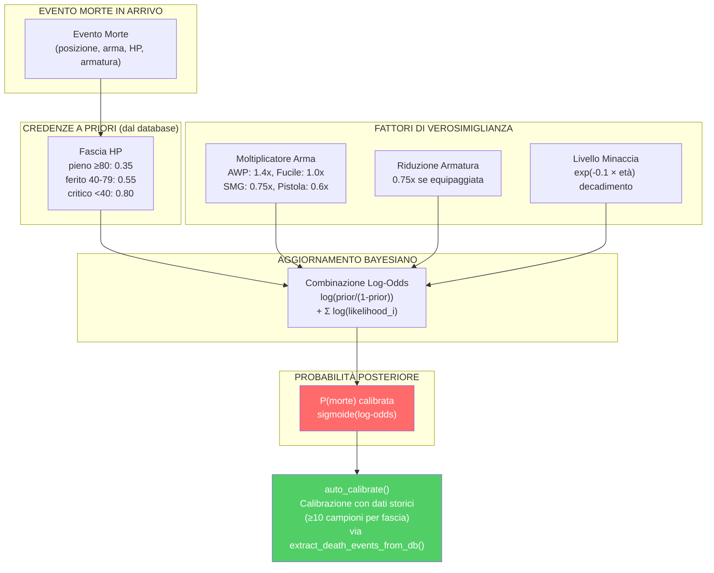

> **Nota sulla calibrazione (G-07):** Lo Stimatore Bayesiano di Morte è ora un **componente live** grazie al cablaggio completato durante la rimediazione. La funzione `extract_death_events_from_db()` nel Session Engine estrae automaticamente gli eventi di morte dal database e li passa ad `auto_calibrate()`, permettendo al modello di affinare le sue probabilità a priori sulla base dei dati reali accumulati. Questo ciclo di feedback trasforma lo stimatore da un modello statico a un sistema che si auto-calibra con l'esperienza.

### -Indice di Inganno (`deception_index.py`, ~220 righe)

Quantifica l'inganno tattico tramite tre sottometriche:

> **Analogia:** L'Indice di Inganno misura quanto un giocatore sia **astuto e imprevedibile**. In CS2, essere prevedibili è pericoloso: se il nemico sa che guardi sempre dalla stessa angolazione, mirerà in anticipo. L'Indice di Inganno è come un **punteggio poker face**: un punteggio alto significa che sei difficile da interpretare (buono), un punteggio basso significa che sei trasparente (cattivo). Misura tre cose: (1) Lanci falsi flash per indurre le reazioni? (2) Fingi le prese del sito cambiando improvvisamente direzione? (3) Alterni camminata e corsa per confondere i nemici sulla tua posizione?

| Sottometrica                           | Peso | Metodo di rilevamento                                                                                                |
| -------------------------------------- | ---- | -------------------------------------------------------------------------------------------------------------------- |
| **Frequenza di falsi flash**     | 0,25 | Flash che non accecano i nemici —`bait_rate = 1 - effettivo/totale`                                               |
| **Frequenza di finta rotazione** | 0,40 | Cambiamenti di direzione >108° rilevati tramite campionamento della velocità angolare (20 intervalli di posizione) |
| **Punteggio di inganno sonoro**  | 0,35 | Inverso del rapporto di accovacciamento —`1,0 - rapporto_accovacciamento × 2,0`                                  |

Composito: `DI = 0,25·fake_flash + 0,40·rotation_feint + 0,35·sound_deception`, fissato a [0, 1].

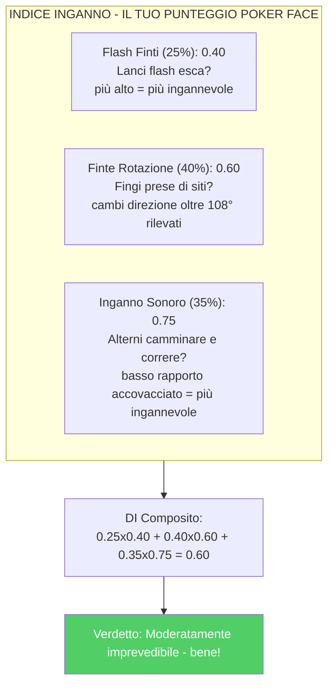

### - Momentum Tracker ([momentum.py](http://momentum.py), \~160 righe)

Modella il momentum psicologico come un moltiplicatore di prestazioni che decresce nel tempo:

> **Analogia:** il Momentum Tracker è come un anello dell'umore per il tuo gameplay. Quando vinci diversi round di fila, sei "in forma" - stai giocando con sicurezza, prendendo rischi più intelligenti e il tuo moltiplicatore di momentum supera 1,2. Quando perdi diversi round di fila, potresti essere "in tilt" - frustrato, commetti errori e il tuo moltiplicatore scende sotto 0,85. Il tracker tiene conto del fatto che il momentum svanisce nel tempo (vincere 3 round fa conta meno che vincere l'ultimo round) e si azzera all'intervallo (quando cambi campo). È come monitorare la "corsa" di una squadra di basket: un parziale di 10-0 crea momentum che influisce sulle prestazioni.

- Serie di vittorie: moltiplicatore = 1,0 + 0,05 × lunghezza della serie × decadimento
- Serie di sconfitte: moltiplicatore = 1,0 − 0,04 × lunghezza della serie × decadimento
- Decadimento: exp(−0,15 × gap_rounds)
- Limiti: \[0,7, 1,4\]
- Rilevamento inclinazione: moltiplicatore < 0,85
- Rilevamento hot: moltiplicatore > 1,2
- Reset di mezzo switch: Round 13 (MR12) e 16 (MR13)

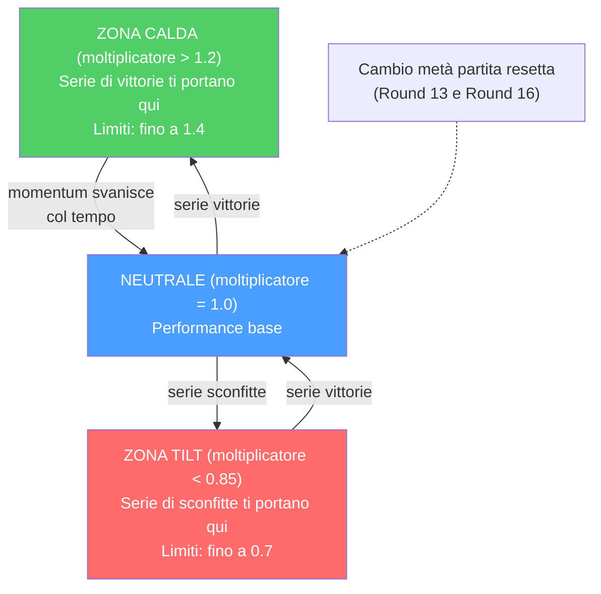

### -Analizzatore di Entropia (`entropy_analysis.py`, ~145 righe)

Misura l'efficacia dell'utilità tramite la **riduzione di entropia di Shannon** delle posizioni nemiche:

> **Analogia:** L'entropia è una misura dell'**incertezza**: maggiore è l'entropia, maggiore è l'incertezza sulla posizione dei nemici. L'Analizzatore di Entropia chiede: "Prima di lanciare quel fumo, i nemici potevano trovarsi in 100 possibili posizioni (alta entropia). Dopo il fumo, potevano trovarsi solo in 30 posizioni (bassa entropia). Il tuo fumo ha ridotto l'incertezza del 70%, il che significa che è stato un fumo efficace!" È come giocare a nascondino: se stai perquisendo un'intera casa, ci sono molti nascondigli (alta entropia). Se chiudi la cucina e il bagno, ci sono meno nascondigli (bassa entropia). Una buona granata riduce il numero di posti di cui devi preoccuparti.

- Discretizza le posizioni in una griglia 32×32
- Calcola `H = −Σ p(cell) × log₂(p(cell))`
- Impatto di utilità = `H_pre − H_post` (positivo = informazione ottenuta)
- Riduzioni massime di entropia: Smoke 2,5 bit, Molotov 2,0, Flash 1,8, HE 1,5

```mermaid
flowchart LR
    subgraph BEFORE["Prima del Fumo"]
        B["Tutte le posizioni incerte<br/>H_pre = 8.5 bit<br/>(molto incerto)"]
    end
    subgraph AFTER["Dopo il Fumo"]
        A["Il fumo blocca un'area<br/>H_post = 6.0 bit<br/>(incertezza ridotta)"]
    end
    BEFORE -->|"Fumo lanciato"| AFTER
    AFTER --> IMPACT["Impatto utilità = 8.5 - 6.0 = 2.5 bit<br/>Max possibile per fumo = 2.5<br/>100% efficace!"]
    style IMPACT fill:#51cf66,color:#fff
```

### -Rilevatore di Punti Ciechi (`blind_spots.py`, ~210 righe)

Identifica decisioni ricorrenti non ottimali rispetto alle raccomandazioni dell'albero di gioco:

> **Analogia:** Il Rilevatore di Punti Ciechi è come un **istruttore di guida** che si accorge che dimentichi sempre di controllare gli specchietti prima di cambiare corsia. Confronta ciò che hai effettivamente fatto in ogni round con ciò che l'albero di gioco ha indicato come azione ottimale. Se continui a spingere quando dovresti tenere, o continui a tenere quando dovresti ruotare, segnala questo come un "punto cieco", un errore ricorrente di cui potresti non essere nemmeno consapevole. Più spesso si verifica un errore E maggiore è il suo impatto, maggiore è la sua priorità. Quindi genera un piano di allenamento specifico: "Tendi a spingere nelle situazioni post-atterraggio quando è meglio tenere. Esercitati nel posizionamento passivo post-atterraggio."

- Confronta le azioni reali dei giocatori con le azioni ottimali di `ExpectiminimaxSearch`
- Classifica le situazioni (post-impianto, frizione, eco, round avanzato, vantaggio numerico)
- Priorità = `frequenza × impact_rating`
- Genera piani di allenamento in linguaggio naturale per i punti ciechi principali

```mermaid
flowchart TB
    subgraph COMPARE["Le tue azioni vs Azioni ottimali"]
        R3["Round 3: Hai SPINTO - Ottimale: TENERE - SBAGLIATO"]
        R7["Round 7: Hai TENUTO - Ottimale: TENERE - CORRETTO"]
        R11["Round 11: Hai SPINTO - Ottimale: TENERE - SBAGLIATO"]
        R15["Round 15: Hai SPINTO - Ottimale: RUOTARE - SBAGLIATO"]
        R19["Round 19: Hai TENUTO - Ottimale: UTILITÀ - SBAGLIATO"]
        R22["Round 22: Hai SPINTO - Ottimale: TENERE - SBAGLIATO"]
    end
    R3 --> PATTERN["Pattern rilevato: Spingi invece di Tenere<br/>Frequenza: 3/6 = 50%<br/>Impatto: Alto - perso vantaggio round<br/>Priorità: 0.50 x 0.80 = 0.40"]
    R11 --> PATTERN
    R15 --> PATTERN
    R22 --> PATTERN
    PATTERN --> PLAN["Piano allenamento: Pratica posizionamento<br/>passivo post-plant. Tendi a spingere<br/>quando l'albero di gioco raccomanda tenere."]
    style R3 fill:#ff6b6b,color:#fff
    style R11 fill:#ff6b6b,color:#fff
    style R15 fill:#ff6b6b,color:#fff
    style R19 fill:#ff6b6b,color:#fff
    style R22 fill:#ff6b6b,color:#fff
    style R7 fill:#51cf66,color:#fff
```

### -Analizzatore distanza di ingaggio (`engagement_range.py`, ~442 righe)

Analizza le distanze di uccisione per costruire **profili di ingaggio** specifici per ruolo e posizione:

> **Analogia:** L'Analizzatore di Engagement Range è come un **analista sportivo che studia dove un giocatore segna i gol**. Un centravanti segna principalmente da dentro l'area (ravvicinata), un centrocampista da media distanza e un difensore da lontano su calci piazzati. Allo stesso modo, un AWPer dovrebbe ottenere più uccisioni a lunga distanza, mentre un Entry Fragger dovrebbe eccellere nel combattimento ravvicinato. Se il tuo profilo di distanza non corrisponde al tuo ruolo, il coach ti dice "Stai combattendo troppo da vicino per un AWPer" o "Non sfrutti abbastanza le linee di vista lunghe".

**Componenti principali:**

| Componente | Scopo |
|---|---|
| `NamedPositionRegistry` | Registro di callout per mappa (es. "A Site", "Window", "Banana") con coordinate 3D e raggio |
| `EngagementRangeAnalyzer` | Calcolo distanza euclidea killer-vittima, classificazione e confronto con baseline pro |
| `EngagementProfile` | Distribuzione % per fascia: close (<500u), medium (500-1500u), long (1500-3000u), extreme (>3000u) |

**Baseline pro per ruolo:**

| Ruolo | Close | Medium | Long | Extreme |
|---|---|---|---|---|
| AWPer | 10% | 30% | 45% | 15% |
| Entry Fragger | 40% | 40% | 15% | 5% |
| Supporto | 25% | 45% | 25% | 5% |
| Lurker | 35% | 35% | 20% | 10% |
| IGL/Flex | 25% | 40% | 25% | 10% |

**Soglia di deviazione:** Una differenza >15% rispetto alla baseline del ruolo genera un'osservazione di coaching (es. "Più uccisioni ravvicinate del tipico AWPer — considera angoli più lunghi").

**Mappe supportate:** de_mirage, de_inferno, de_dust2, de_anubis, de_nuke, de_ancient, de_overpass, de_vertigo, de_train (non nell'Active Duty pool attuale, supportata per demo storiche/workshop) — espandibile via JSON.

```mermaid
flowchart TB
    KILLS["Eventi Uccisione<br/>(posizioni 3D killer + vittima)"]
    KILLS --> DIST["Calcolo Distanza<br/>Euclidea 3D"]
    DIST --> CLASS["Classificazione:<br/>Close < 500u<br/>Medium 500-1500u<br/>Long 1500-3000u<br/>Extreme > 3000u"]
    CLASS --> PROF["Profilo Giocatore:<br/>Close: 45%, Medium: 35%<br/>Long: 15%, Extreme: 5%"]
    PROF --> CMP["Confronto con<br/>Baseline AWPer:<br/>Close: 10%, Medium: 30%<br/>Long: 45%, Extreme: 15%"]
    CMP --> OBS["Osservazione: Troppi combattimenti<br/>ravvicinati per un AWPer (45% vs 10%).<br/>Considera angoli più lunghi."]
    style OBS fill:#ffd43b,color:#000
```

### -Analizzatore di utilità ed economia (`utility_economy.py`, ~370 righe)

**Analizzatore di utilità:** Punteggio di efficacia per tipo rispetto alle basi dei professionisti (Molotov: 35 danni/lancio, Flash: 1,2 nemici/flash, ecc.)

**Ottimizzatore di economia:** Consigli di acquisto basati su soglie economiche ($5000 acquisto completo, $2000 forza, <$2000 economia), contesto del round, differenziale di punteggio e bonus di sconfitta.

> **Analogia:** L'**Analizzatore di utilità** è come una **pagella delle granate**: controlla se le tue molotov stanno infliggendo lo stesso danno di quelle di un professionista (35 danni per lancio è il parametro di riferimento), se le tue granate accecanti stanno accecando abbastanza nemici (i professionisti infliggono in media 1,2 nemici per flash) e così via. **Economy Optimizer** è come un **consulente finanziario per CS2**: ti dice quando spendere molto (acquisto completo: oltre $5000), quando risparmiare (eco: meno di $2000) e quando correre un rischio calcolato (acquisto forzato: $2000-$5000). Considera anche il quadro generale: "Il punteggio è 12-10 e stai perdendo: forse un acquisto forzato vale il rischio".

```mermaid
flowchart LR
    ECO["ECO ($0-$2000)<br/>Risparmia soldi<br/>Solo pistola"]
    FORCE["FORCE-BUY ($2000-$5000)<br/>Rischio calcolato<br/>SMG/Shotgun + Armatura forse"]
    FULL["FULL-BUY ($5000+)<br/>Compra tutto<br/>Fucile + Armatura + Utilità"]
    ECO -->|"$2000"| FORCE
    FORCE -->|"$5000"| FULL
    style ECO fill:#ff6b6b,color:#fff
    style FORCE fill:#ffd43b,color:#000
    style FULL fill:#51cf66,color:#fff
```

### -Analizzatore Qualità Movimento (`movement_quality.py`, ~539 righe)

Rileva 4 errori comuni di posizionamento basandosi sul paper MLMove (SIGGRAPH 2024, Stanford/Activision/NVIDIA):

> **Analogia:** L'Analizzatore di Qualità Movimento è come un **allenatore di calcio che rivede le registrazioni del gioco al rallentatore**. Non guarda solo dove sei morto, ma analizza i tuoi movimenti momento per momento: "Eri in una posizione elevata dominante e l'hai abbandonata senza motivo — errore #1. Il tuo compagno di squadra è stato ucciso e tu hai fatto un push solitario suicida — errore #3. In un'altra situazione, il tuo compagno ha creato un'apertura ma tu non ti sei mosso per supportarlo — errore #4." Ogni errore viene classificato per tipo, gravità, round e posizione esatta sulla mappa (callout).

**4 Tipologie di errore rilevate:**

| # | Tipo | Condizione di rilevamento | Descrizione |
|---|---|---|---|
| 1 | `high_ground_abandoned` | Discesa ≥100 unità senza contesto di combattimento | Abbandono high ground senza necessità |
| 2 | `position_abandoned` | Posizione tenuta ≥3s lasciata senza nuove info nemiche | Abbandono posizione consolidata |
| 3 | `over_aggressive_trade` | Push solitario dopo morte teammate con <2 compagni rimasti | Trading troppo aggressivo |
| 4 | `over_passive_support` | Immobile quando teammate crea apertura + vantaggio numerico | Supporto troppo passivo |

**Soglie chiave:**

| Costante | Valore | Significato |
|---|---|---|
| `_ESTABLISHED_HOLD_TICKS` | 384 (3s) | Tempo minimo per "posizione consolidata" |
| `_HIGH_GROUND_DROP` | 100.0 unità | Discesa minima per flag high ground |
| `_TRADE_WINDOW_TICKS` | 640 (5s) | Finestra temporale per analisi trade |
| `_AUDIO_RANGE_DISTANCE` | 1500.0 unità | Distanza massima per "entro portata audio" |
| `_MOVEMENT_THRESHOLD` | 300.0 unità | Spostamento minimo per contare come "mosso" |
| `_COMBAT_PROXIMITY_TICKS` | 64 (~0.5s) | Tick intorno a un evento kill/death per contesto "in combattimento" |

**Dataclass di output:**

- `MovementMistake`: tipo, round, tick, tempo nel round, descrizione, callout (posizione mappa), severità [0-1]
- `MovementMetrics`: map_coverage_score, high_ground_utilization, position_stability, total_rounds_analyzed, lista mistakes + proprietà `mistakes_per_round`

**API pubblica:**

| Metodo | Input | Output |
|---|---|---|
| `analyze_round_ticks(ticks, map_name, player, round)` | Tick di un round | `List[MovementMistake]` |
| `analyze_match_ticks(all_ticks, map_name, player)` | Tutti i tick della partita | `MovementMetrics` (aggregato) |
| `get_movement_quality_analyzer()` | — | Singleton `MovementQualityAnalyzer` |

**ADDITIVE:** NON modifica METADATA_DIM=25. Le metriche di movimento sono calcolate come feature derivate dai dati tick esistenti, memorizzate nei risultati di analisi.

```mermaid
flowchart TB
    TICKS["Tick Data<br/>(posizioni 3D per-tick)"] --> HOLD["Detect posizioni<br/>consolidate (≥3s)"]
    TICKS --> HG["Detect high ground<br/>(elevazione relativa)"]
    TICKS --> TEAM["Detect eventi team<br/>(morti/kill compagni)"]
    HOLD --> ABN["Posizione abbandonata<br/>senza nuove info?"]
    HG --> DROP["High ground abbandonato<br/>senza combattimento?"]
    TEAM --> AGG["Push solitario dopo<br/>morte compagno? (aggressivo)"]
    TEAM --> PAS["Immobile durante<br/>apertura compagno? (passivo)"]
    ABN --> MM["MovementMetrics<br/>+ lista MovementMistake"]
    DROP --> MM
    AGG --> MM
    PAS --> MM
    style MM fill:#51cf66,color:#fff
```

### Riepilogo degli 11 Motori di Analisi

| # | Motore | File | Input | Output | Complessità |
|---|---|---|---|---|---|
| 1 | Classificatore Ruoli | `role_classifier.py` | PlayerMatchStats | Ruolo (6 classi) + confidenza | O(n) features |
| 2 | Probabilità Vittoria | `win_probability.py` | 12 feature stato round | P(CT win) ∈ [0,1] | O(1) forward pass |
| 3 | Albero di Gioco | `game_tree.py` | Stato round + azioni | Nodo ottimale (minimax) | O(b^d) branching |
| 4 | Morte Bayesiana | `belief_model.py` | Posizione + tempo + round | P(morte) + fattori rischio | O(n) prior update |
| 5 | Indice Inganno | `deception_index.py` | Storico round + posizioni | Score imprevedibilità [0,1] | O(n×m) pattern match |
| 6 | Tracker Momentum | `momentum.py` | Sequenza round | Stato hot/cold/neutral | O(n) sliding window |
| 7 | Analizzatore Entropia | `entropy_analysis.py` | Danni utility per tipo | Score efficacia vs pro | O(k) per tipo utility |
| 8 | Rilevatore Punti Ciechi | `blind_spots.py` | Posizioni morte + angoli | Pattern ripetuti | O(n²) clustering |
| 9 | Utilità ed Economia | `utility_economy.py` | Economia round + utility | Consiglio acquisto + rating | O(1) threshold check |
| 10 | Analizzatore Ingaggio | `engagement_range.py` | Kill events 3D | Profilo distanza (4 fasce) | O(n) euclidean dist |
| 11 | Qualità Movimento | `movement_quality.py` | Tick data 3D per-round | MovementMetrics (4 tipi errore) | O(n) per-tick scan |

---

## 8. Sottosistema 6 — Elaborazione e Feature Engineering

**Directory:** `backend/processing/`

Questo sottosistema gestisce tutta la **preparazione dei dati**, trasformando le registrazioni grezze del gioco nei formati numerici precisi di cui le reti neurali hanno bisogno per l'addestramento e l'inferenza.

> **Analogia:** Questa è la **stazione di preparazione** della fabbrica. Prima che gli chef (reti neurali) possano cucinare, gli ingredienti (dati grezzi del gioco) devono essere lavati, sbucciati, tagliati e misurati. L'Estrattore di Feature è il capo cuoco che si assicura che tutto venga tagliato esattamente della stessa dimensione ogni volta. La Fabbrica dei Tensori crea "foto di cibo" perfette dello stato del gioco. La Pipeline dei Dati è il lavapiatti e l'organizzatore che pulisce i dati errati e ordina tutto in pile per l'addestramento/test. Senza questa stazione di preparazione, gli chef riceverebbero ingredienti grezzi e incoerenti e produrrebbero cibo pessimo.

### -Estrattore di Feature Unificato (`vectorizer.py`)

L'**unica fonte di verità** per i vettori di feature a livello di tick. Sia l'addestramento (`RAPStateReconstructor`) che l'inferenza (`GhostEngine`) DEVONO utilizzare questa classe.

> **Analogia:** L'Estrattore di Feature è il **traduttore universale** del sistema. Prende dati complessi e disordinati sullo stato del gioco (la posizione di un giocatore nello spazio 3D, la salute, le armi, ciò che vede, ecc.) e li traduce esattamente in 25 numeri precisi, ciascuno scalato per adattarsi tra -1 e 1 (o 0 e 1). Immaginatelo come convertire ogni misura di una ricetta nella stessa unità: invece di mescolare tazze, cucchiai, grammi e litri, tutto viene convertito in millilitri. In questo modo, ogni parte del sistema parla lo stesso "linguaggio a 25 numeri". Se l'addestramento utilizza un traduttore e l'inferenza ne utilizza uno diverso, i risultati sarebbero spazzatura, quindi esiste un SOLO traduttore, condiviso ovunque.

**Contratto vettoriale di feature a 25 dimensioni:**

| Indice | Feature             | Normalizzazione                          | Intervallo |
| ------ | ------------------- | ---------------------------------------- | ---------- |
| 0      | `health`          | `/100`                                 | [0, 1]     |
| 1      | `armor`           | `/100`                                 | [0, 1]     |
| 2      | `has_helmet`      | binario                                  | {0, 1}     |
| 3      | `has_defuser`     | binario                                  | {0, 1}     |
| 4      | `equipment_value` | `/10000`                               | [0, 1]     |
| 5      | `is_crouching`    | binario                                  | {0, 1}     |
| 6      | `is_scoped`       | binario                                  | {0, 1}     |
| 7      | `is_blinded`      | binario                                  | {0, 1}     |
| 8      | `enemies_visible` | `/5` (bloccato)                        | [0, 1]     |
| 9      | `pos_x`           | `/4096`                                | [−1, 1]   |
| 10     | `pos_y`           | `/4096`                                | [−1, 1]   |
| 11     | `pos_z`           | `/1024`                                | [−1, 1]   |
| 12     | `view_yaw_sin`    | `sin(yaw_rad)`                         | [−1, 1]   |
| 13     | `view_yaw_cos`    | `cos(yaw_rad)`                         | [−1, 1]   |
| 14     | `view_pitch`      | `/90`                                  | [−1, 1]   |
| 15     | `z_penalty`       | `compute_z_penalty()`                  | [0, 1]     |
| 16     | `kast_estimate`   | KAST da statistiche o 0,70 predefinito   | [0, 1]     |
| 17     | `map_id`          | Codifica deterministica basata su hash   | [0, 1]     |
| 18     | `round_phase`     | 0=pistola, 0,33=eco, 0,66=forza, 1=pieno | [0, 1]     |
| 19     | `weapon_class`    | Mappatura classi arma (0-1)              | [0, 1]     |
| 20     | `time_in_round`   | `/115` (secondi nel round)               | [0, 1]     |
| 21     | `bomb_planted`    | binario                                  | {0, 1}     |
| 22     | `teammates_alive` | `/4` (compagni vivi)                     | [0, 1]     |
| 23     | `enemies_alive`   | `/5` (nemici vivi)                       | [0, 1]     |
| 24     | `team_economy`    | `/16000` (media soldi team)              | [0, 1]     |

**Decisioni progettuali:**

- **Codifica ciclica dell'imbardata** (sin/cos agli indici 12-13) elimina la discontinuità di ±180°
- **Penalità Z** (indice 15) quantifica il rischio di livello errato per mappe multilivello
- **Integrazione del contesto tattico** (indici 19-24) fornisce al modello consapevolezza della situazione di gioco
- **Catena di fallback della stima KAST:** valore esplicito → calcolo dalle statistiche → valore predefinito 0,70
- **Codifica dell'identità della mappa:** l'hash deterministico consente l'apprendimento specifico della mappa
- **HeuristicConfig** (`base_features.py`) consente di sovrascrivere tutti i limiti di normalizzazione tramite JSON

> **Spiegazione delle decisioni progettuali:** La **codifica ciclica dell'imbardata** (sin/cos) risolve un problema insidioso: se si codifica la direzione in cui un giocatore guarda come un singolo angolo, guardare a sinistra (-179°) e guardare a destra (+179°) sembrano molto distanti matematica, anche se sono quasi nella stessa direzione. Usando seno e coseno, la matematica capisce correttamente che sono vicini, come avvolgere un righello in un cerchio in modo che 0° e 360° si tocchino. La **penalità Z** è un "allarme piano sbagliato": su mappe multilivello come Nuke, trovarsi al piano sbagliato è un disastro, quindi il modello traccia esplicitamente questo rischio. L'**integrazione tattica** (economia, vivi, tempo) permette al coach di capire se una giocata aggressiva è corretta in base al tempo rimasto o al vantaggio numerico.

### -Valutazione HLTV 2.0 (`rating.py`)

Il **modulo di valutazione unificato** che previene l'inferenza-distorsione nell'addestramento:

```
R = (R_kill + R_survival + R_kast + R_impact + R_damage) / 5

dove:
R_kill = KPR / 0,679
R_survival = (1 − DPR) / 0,317
R_kast = KAST / 0,70
R_impact = (2,13·KPR + 0,42·ADR/100) / 1,0
R_damage = ADR / 73,3
```

> **Analogia:** La valutazione HLTV 2.0 è come una **media dei voti (GPA)** per i giocatori di CS2. Invece di calcolare la media dei voti di Matematica, Inglese, Scienze, Storia e Arte, calcola la media di cinque "materie" di CS2: Tasso di uccisioni, Tasso di sopravvivenza, KAST (la frequenza con cui hai contribuito), Impatto (l'impatto delle tue uccisioni) e Danno (l'entità totale dei danni inflitti). Ogni materia è normalizzata dalla media dei professionisti (come una valutazione su una curva): se i professionisti hanno una media di 0,679 uccisioni a round, ottenere 0,679 KPR ti dà una "B" (1,0). Ottenere di più ti dà una "A+" e ottenerne di meno ti dà una "C". Il fatto che sia l'allenamento che l'inferenza utilizzino esattamente la stessa formula impedisce la "distorsione tra addestramento e inferenza", ovvero assicurarsi che la stessa griglia di valutazione venga utilizzata sia per i test di pratica che per l'esame finale.

Utilizzato da: demo_parser.py (analisi), base_features.py (aggregazione), coaching_service.py (insight).

### -Metriche PlusMinus e Rating Role-Adjusted (`rating.py`, 231 righe) — KT-06

Modulo complementare alla valutazione HLTV 2.0 che fornisce due metriche aggiuntive progettate per catturare aspetti che il Rating 2.0 trascura:

> **Analogia:** Se il Rating HLTV 2.0 è il **GPA** di uno studente (media complessiva), PlusMinus è la **differenza punti** di un giocatore di basket (+/-, quanto la squadra guadagna quando sei in campo) e il Rating Role-Adjusted è come un **voto aggiustato per la difficoltà del corso**: un 85 in Fisica Avanzata conta più di un 90 in Introduzione alla Musica. Un support con 0.85 K/D non è peggiore di un entry fragger con 1.10 K/D — sta semplicemente facendo un lavoro diverso. Questo modulo cattura esattamente questo.

**PlusMinus:**

```
PlusMinus = (kills - deaths) / max(rounds_played, 1) + team_contribution_bonus
```

| Componente | Formula | Range tipico |
|---|---|---|
| Net frag differential | `(kills - deaths) / rounds` | [-1.0, +1.0] |
| Team contribution bonus | `_TEAM_CONTRIBUTION_SCALE × (team_win_rate - 0.5)` | [-0.05, +0.05] |
| `_TEAM_CONTRIBUTION_SCALE` | 0.10 | — |

Il bonus di contribuzione squadra premia i giocatori nelle squadre vincenti e penalizza quelli nelle squadre perdenti, analogamente al +/- nel basket/hockey.

**Rating Role-Adjusted (Bayesian):**

Applica prior bayesiani specifici per ruolo in modo che AWPer non siano penalizzati per KAST inferiore e support non siano penalizzati per K/D inferiore:

| Ruolo | K/D Prior | KAST Prior | ADR Prior | Weight |
|---|---|---|---|---|
| AWPer | 1.15 | 0.68 | 75.0 | 5.0 |
| Entry | 0.95 | 0.72 | 80.0 | 5.0 |
| Support | 0.90 | 0.78 | 65.0 | 5.0 |
| Lurker | 1.05 | 0.70 | 72.0 | 5.0 |
| IGL | 0.88 | 0.74 | 68.0 | 5.0 |

Prior calibrati dai dati medi dei team top-30 HLTV (stagione 2024-2025). Formula composita:

```
adj_metric = (n × observed + weight × prior) / (n + weight)
role_adjusted_rating = 0.40 × adj_kd + 0.35 × adj_kast + 0.25 × adj_adr_norm
```

Dove `adj_adr_norm = adj_adr / 120` normalizza l'ADR in [0, 1]. Il framework è ispirato a TrueSkill (Herbrich et al., NeurIPS 2006) — quando il campione è piccolo (`n` basso), il prior domina; quando il campione è grande, i dati osservati dominano.

```mermaid
flowchart TB
    STATS["Player Stats<br/>(kills, deaths, adr, kast)"] --> PM["compute_plus_minus()<br/>Net frag/round + team bonus"]
    STATS --> RA["compute_role_adjusted_rating()<br/>Prior bayesiano per ruolo"]
    ROLE["Ruolo rilevato<br/>(da RoleClassifier)"] --> RA
    PM --> OUT["Metriche complementari:<br/>PlusMinus: +0.35<br/>Role-Adjusted: 1.12"]
    RA --> OUT
    style OUT fill:#51cf66,color:#fff
```

### -Tensor Factory (`tensor_factory.py`)

Converte i dati tick grezzi in tensori di immagini 64x64 per il livello di percezione RAP:

| Tensor              | Canali    | Contenuto                                                                                        |
| ------------------- | --------- | ------------------------------------------------------------------------------------------------ |
| **Mappa**     | 3 (R/G/B) | R: posizione del giocatore, G: compagni di squadra (α-blended), B: nemici (α-blended)          |
| **Vista**     | 3         | **Ch0:** maschera FOV corrente (90° predefinito, mascheramento trigonometrico); **Ch1:** zona di pericolo (= 1 − FOV accumulato sugli ultimi 8 tick), le aree mai controllate sono potenziali posizioni nemiche; **Ch2:** zona sicura (= 1 − FOV corrente − zona di pericolo), l'area tra la vista attuale e le zone inesplorate |
| **Movimento** | 2 o 3     | Mappe di calore di velocità/accelerazione (gocce 2D sfocate gaussiane)                          |

> **Correzione G-02 (Zona di Pericolo):** In precedenza, il tensore vista aveva 3 canali identici (placeholder). Dopo la rimediazione, i 3 canali codificano informazioni tattiche distinte: il **FOV corrente** mostra ciò che il giocatore vede adesso, la **zona di pericolo** accumula la storia FOV degli ultimi 8 tick (~125ms a 64 Hz) e inverte il risultato per identificare le aree mai controllate — dove i nemici potrebbero nascondersi — e la **zona sicura** rappresenta l'area intermedia tra vista attuale e zone inesplorate. Il calcolo della zona di pericolo usa `np.maximum(accumulated_fov, tick_fov)` per ogni tick storico, poi `danger_zone = 1.0 − accumulated_fov`. Questo fornisce al modello RAP una consapevolezza spaziale della copertura visiva, trasformando il tensore vista da un semplice input statico a un **indicatore tattico temporale**.

```mermaid
flowchart TB
    subgraph VIEW_TENSOR["TENSORE VISTA 3-CANALI (64x64, G-02)"]
        CH0["Canale 0: FOV Corrente<br/>Maschera trigonometrica 90°<br/>1.0 = nel campo visivo<br/>0.0 = fuori vista"]
        CH1["Canale 1: Zona di Pericolo<br/>1.0 − FOV accumulato (8 tick)<br/>Alto = mai controllato = PERICOLO<br/>Basso = controllato di recente"]
        CH2["Canale 2: Zona Sicura<br/>1.0 − FOV corrente − pericolo<br/>Area intermedia tra<br/>vista attuale e inesplorato"]
    end
    CH0 --> STACK["np.stack([ch0, ch1, ch2])<br/>→ torch.Tensor [3, 64, 64]"]
    CH1 --> STACK
    CH2 --> STACK
    STACK --> PERC["Flusso Ventrale ResNet<br/>(Percezione RAP)"]
    style CH0 fill:#51cf66,color:#fff
    style CH1 fill:#ff6b6b,color:#fff
    style CH2 fill:#ffd43b,color:#000
```

> **Analogia:** Tensor Factory crea **piccoli dipinti da 64x64 pixel** della situazione di gioco che l'allenatore RAP può osservare. Il **tensore mappa** è come un dipinto a volo d'uccello: il giocatore è un punto rosso, i compagni di squadra sono punti verdi, i nemici sono punti blu. Il **tensore vista** è lo stesso dipinto, ma con tutto ciò che si trova al di fuori del campo visivo di 90° del giocatore cancellato: è come indossare dei paraocchi, quindi il modello vede solo ciò che il giocatore poteva effettivamente vedere. Il **tensore movimento** è come una fotografia a lunga esposizione: i giocatori in rapido movimento lasciano scie luminose, i giocatori fermi sono invisibili. Insieme, questi tre "dipinti" offrono all'allenatore RAP una comprensione visiva completa di ogni momento.

### -Heatmap Engine (`heatmap_engine.py`)

Mappe di occupazione gaussiane ad alte prestazioni per la visualizzazione tattica:

- Generazione di dati thread-safe (`generate_heatmap_data()`)
- Creazione di texture solo nel thread principale (OpenGL)
- Heatmap differenziali con rilevamento di hotspot per l'allenamento posizionale

> **Analogia:** Il motore Heatmap crea **mappe di calore**, simili alle mappe meteorologiche che si vedono in TV, ma per le posizioni dei giocatori. Le aree in cui si trova il giocatore spesso si illuminano di rosso, mentre le aree che non visita mai sono di un blu freddo. La heatmap "differenziale" mostra la differenza tra le TUE posizioni e quelle dei PRO: se un punto si illumina di rosso, ci stai troppo tempo rispetto ai professionisti; se si illumina di blu, non ci vai mai, ma i professionisti sì. Questa visualizzazione mostra immediatamente "passi troppo tempo in A e non abbastanza tempo a ruotare a centrocampo".

### -Data Pipeline (`data_pipeline.py`)

`ProDataPipeline` gestisce la preparazione dei dati ML-ready:

1. **Recupera** tutti i `PlayerMatchStats` dal database
2. **Pulisce** i valori anomali (`avg_adr < 400`, `avg_kills < 3.0`)
3. **Ridimensiona** tramite `StandardScaler`
4. **Suddivide** temporalmente (70/15/15) con ordinamento cronologico per gruppo (pro/utente)
5. **Mantieni** la colonna `dataset_split` sul posto

> **Analogia:** Data Pipeline è come un **ufficio ammissioni scolastico** che prepara i fascicoli degli studenti per le lezioni. Per prima cosa, **estrae tutti i file** dal database. Quindi **rimuove gli imbroglioni**, ovvero chiunque abbia statistiche incredibilmente alte (un ADR superiore a 400 significa che probabilmente hanno usato hack o che i dati sono corrotti). Successivamente, **standardizza i voti** in modo che tutto sia sulla stessa scala. Quindi **ordina gli studenti cronologicamente** e assegna il 70% alla "classe di apprendimento" (formazione), il 15% alla "classe di quiz" (validazione) e il 15% alla "classe di esame finale" (test). La suddivisione temporale è fondamentale: significa che il modello non vede mai dati "futuri" durante l'addestramento, impedendo imbrogli dovuti ai viaggi nel tempo.

### -Scorer Qualità Demo (`demo_quality.py`, 409 righe) — KT-09

Valuta la qualità dei dati delle demo ingerite utilizzando metodi statistici robusti basati sul **modello di contaminazione di Huber** (1981):

> **Analogia:** Lo Scorer di Qualità Demo è come un **ispettore sanitario per i dati**. Prima di permettere a un alimento (demo) di entrare nella cucina (pipeline di addestramento), l'ispettore lo esamina: "Questo ingrediente è fresco? (copertura tick sufficiente?) È completo? (tutti i campi hanno valori?) Ha un aspetto strano? (statistiche sospettamente alte o basse?)". Se l'ispezione fallisce, l'ingrediente viene marcato come "da revisionare" o "da scartare" — mai usato direttamente in cucina senza controllo.

| Componente | Peso | Metodo |
|---|---|---|
| **Copertura Tick** | 45% | `tick_count / _EXPECTED_TICKS_PER_DEMO` (1.6M) |
| **Completezza Feature** | 35% | Frazione di valori non-zero in health, armor, pos_x/y/z, equipment_value |
| **Penalità Outlier** | 20% | Rilevamento IQR su avg_kills, avg_deaths, avg_adr, kd_ratio, avg_kast |

**Rilevamento outlier (metodo IQR di Tukey):**

| Severità | Moltiplicatore IQR | Significato |
|---|---|---|
| Moderata | 1.5× | Statistiche insolite — da revisionare |
| Estrema | 3.0× | Statistiche altamente sospette — probabile corruzione |

**Classificazione qualità:**

| Score | Raccomandazione | Condizioni |
|---|---|---|
| ≥ 0.7 | `"use"` | Qualità sufficiente + nessun flag estremo |
| ≥ 0.4 | `"review"` | Qualità incerta — revisione manuale consigliata |
| < 0.4 | `"skip"` | Qualità insufficiente — escluso dall'addestramento |

La robustezza del metodo IQR garantisce un breakdown point del 25% (modello epsilon-contamination di Huber): fino al 25% dei dati può essere corrotto senza invalidare il rilevamento.

### -Prioritizzatore Demo (`demo_prioritizer.py`, 345 righe) — KT-09

Classifica le demo disponibili per valore di coaching atteso, ispirato ai principi di **Active Learning** (Settles, 2009):

> **Analogia:** Il Prioritizzatore Demo è come un **insegnante che sceglie quali compiti correggere per primi**. Invece di correggere in ordine cronologico, l'insegnante guarda brevemente ogni compito e decide: "Questo sembra facile — il mio modello mentale lo capisce bene (bassa varianza). Quest'altro sembra strano — non sono sicuro di come valutarlo (alta varianza). Correggerò quello strano per primo, perché imparerò di più da esso!" In termini ML: le demo dove il modello è più incerto sono quelle che forniscono più segnale di apprendimento.

**Due strategie di ranking:**

| Strategia | Condizione | Metodo | Metrica |
|---|---|---|---|
| **Varianza** (primaria) | Modello JEPA caricato | Varianza predizioni latent-space su tick della demo | Alta varianza = alto valore coaching |
| **Diversità** (fallback) | Nessun modello disponibile | Score composito: 40% giocatori unici + 30% completezza + 30% rarità giocatore | Massimizza copertura distribuzione |

**Costanti:**

| Costante | Valore | Scopo |
|---|---|---|
| `_MIN_TICKS_FOR_VARIANCE` | 64 | Tick minimi per varianza significativa |
| `_MAX_TICKS_SAMPLE` | 2048 | Limite campionamento per evitare OOM |

### -Codifica Bombsite-Relativa (`bombsite_encoding.py`, 193 righe) — KT-10

Codifica posizioni relative ai bombsite per ottenere **equivarianza approssimata** sotto la simmetria CT/T:

> **Analogia:** Invece di descrivere la tua posizione con coordinate assolute ("sono a x=1200, y=800"), la codifica bombsite-relativa la descrive come "sono a 400 unità dal sito A e 1200 unità dal sito B". Questo è più informativo tatticamente: sapere quanto sei vicino a un obiettivo è più utile che sapere le coordinate grezze. Inoltre, invertendo il segno per lato T vs CT, il modello capisce che "vicino al sito A" ha significati tattici opposti per attaccanti e difensori.

**Coordinate bombsite per 9 mappe** (da texture radar DDS + callout della community):

de_dust2, de_mirage, de_inferno, de_nuke, de_overpass, de_anubis, de_vertigo, de_ancient, de_train.

**Funzioni chiave:**

| Funzione | Output | Descrizione |
|---|---|---|
| `get_bombsite_distances(pos_x, pos_y, map)` | `(dist_A, dist_B)` | Distanze euclidee ai centri dei bombsite |
| `normalize_position_equivariant(pos_x, pos_y, map, side)` | `[-1, 1]` | Differenziale firmato: CT positivo, T negato |
| `compute_site_proximity(pos_x, pos_y, map)` | `(site, dist_norm)` | Sito più vicino + distanza normalizzata |

**Design equivariante:** Per la simmetria discreta di CS2 (|G| = 2, CT vs T), la codifica è banalmente economica: basta negare l'output per il lato opposto. Questo permette al modello di apprendere che "essere vicino al sito A come CT" (difesa) ha semantica opposta a "essere vicino al sito A come T" (attacco).

**ADDITIVE:** NON modifica METADATA_DIM=25. Le feature bombsite-relative sono calcolate come valori derivati che possono opzionalmente sostituire pos_x/pos_y nel vettore feature tramite flag di configurazione, o essere usate come contesto supplementare nell'analisi di coaching.

### -Generatore di statistiche per round (`round_stats_builder.py`)

Collega gli eventi demo grezzi al **livello di isolamento per round** (`RoundStats` in `db_models.py`), impedendo la contaminazione statistica tra round e consentendo analisi dettagliate del coaching per round.

> **Analogia:** Invece di darti un voto per l'intero test, questo modulo valuta **ogni singola domanda individualmente** (statistiche per round), quindi ne calcola la media per la pagella finale (statistiche a livello di partita). Un brutto terzo round non abbassa silenziosamente il tuo punteggio del quindicesimo round: ogni round è indipendente. È come un insegnante che scrive commenti dettagliati su ogni problema dei compiti invece di assegnare solo un voto in lettere.

**Funzioni chiave:**

| Funzione                                             | Scopo                                                                                                                               |
| :--------------------------------------------------- | ----------------------------------------------------------------------------------------------------------------------------------- |
| `build_round_stats(parser, demo_name)`             | Analizza gli eventi round_end, player_death, player_hurt, player_blind e costruisce le statistiche per round                        |
| `enrich_from_demo(demo_path, demo_name)`           | Arricchimento completo: uccisioni noscope/cieche, conteggio flash/fumo, assist flash, uccisioni con scambio, analisi delle utilità |
| `aggregate_round_stats_to_match(round_stats_list)` | Elabora le statistiche a livello di round → PlayerMatchStats a livello di partita                                                  |
| `compute_round_rating(round_stats)`                | Valutazione HLTV 2.0 per round utilizzando il modulo di valutazione unificato                                                       |

**Pipeline di arricchimento:**

```mermaid
flowchart TB
    DEM["File .dem"] -->|demoparser2| EVT["Eventi Grezzi<br/>(uccisioni, danni, accecamenti,<br/>fine_round)"]
    EVT -->|"enrich_from_demo()"| RS["Righe RoundStats<br/>(per-round, per-giocatore)"]
    RS -->|"compute_round_rating()"| RS2["RoundStats + round_rating"]
    RS2 -->|"aggregate_round_stats_to_match()"| PMS["PlayerMatchStats<br/>(aggregati livello match)"]
    RS2 -->|persisti| DB["Database<br/>(tabella RoundStats)"]
    PMS -->|persisti| DB2["Database<br/>(tabella PlayerMatchStats)"]
```

**Campi di arricchimento uccisioni** aggiunti da `enrich_from_demo()`:

| Campo               | Metodo di rilevamento                                                               |
| ------------------- | ----------------------------------------------------------------------------------- |
| `noscope_kills`   | Uccidi dove AWP/Scout/SSG è equipaggiato ma `is_scoped=False`                    |
| `blind_kills`     | Uccidi dove `attacker_blinded=True` al momento della morte                        |
| `flash_assists`   | Uccidi entro 128 tick (2 s) da un nemico colpito da un flash dalla stessa squadra   |
| `thrusmoke_kills` | Uccidi attraverso granata fumogena (dai flag dell'evento demo)                      |
| `wallbang_kills`  | Uccidi attraverso la penetrazione del muro (dai flag dell'evento demo)              |
| `trade_kills`     | Uccidi entro 5 s dalla morte di un compagno di squadra per mano dello stesso nemico |

**Integrazione con le pipeline di ingestione:** Sia `user_ingest.py` che `pro_ingest.py` ora chiamano `enrich_from_demo()` dopo l'analisi della demo e rendono persistenti gli oggetti `RoundStats` risultanti nel database. Questo garantisce che ogni demo ingerita, utente o professionista, produca dati granulari a livello di round.

### -Decadimento della baseline temporale (`pro_baseline.py`)

La classe `TemporalBaselineDecay` integra (non sostituisce) la funzione `get_pro_baseline()` esistente con una media ponderata nel tempo, garantendo che i confronti tra i coach riflettano l'**attuale meta CS2** piuttosto che le obsolete medie storiche.

> **Analogia:** I punteggi dei vecchi esami contano meno di quelli recenti nel calcolo della media della classe. Le statistiche di un giocatore professionista di 6 mesi fa sono "sbiadite" (meno importanti) rispetto alle statistiche della settimana scorsa. In questo modo, se il meta del gioco cambia, ad esempio l'utilizzo di AWP diminuisce dopo una patch di bilanciamento, la baseline si aggiorna automaticamente senza necessità di ricalibrazione manuale.

**Formula di decadimento:**

```
weight(age_days) = max(MIN_WEIGHT, exp(-ln(2) × age_days / HALF_LIFE))
```

| Parametro                | Valore | Significato                                                         |
| ------------------------ | ------ | ------------------------------------------------------------------- |
| `HALF_LIFE_DAYS`       | 90     | Il peso si dimezza ogni 90 giorni                                   |
| `MIN_WEIGHT`           | 0,1    | Soglia minima: dati molto vecchi contribuiscono ancora per il 10%   |
| `META_SHIFT_THRESHOLD` | 0,05   | Una variazione del 5% tra le epoche segnala un cambiamento del meta |

**Metodi chiave:**

| Metodo                                    | Scopo                                                                                   |
| ----------------------------------------- | --------------------------------------------------------------------------------------- |
| `compute_weight(stat_date)`             | Peso di decadimento esponenziale per una singola scheda statistica                      |
| `compute_weighted_baseline(stat_cards)` | Media/std ponderata nel tempo su tutti i record ProPlayerStatCard                       |
| `get_temporal_baseline(map_name)`       | Pipeline completa: recupero schede → peso → unione con i valori predefiniti legacy    |
| `detect_meta_shift(old, new)`           | Segnala le metriche che hanno subito uno scostamento ≥ 5% tra le epoche di riferimento |

**Punti di integrazione:**

- **CoachingService:** `_get_temporal_baseline()` lo utilizza per l'arricchimento COPER
- **Teacher Daemon:** `_check_meta_shift()` viene eseguito dopo ogni ciclo di riaddestramento, registrando le metriche che hanno subito uno scostamento

```mermaid
flowchart TB
    CARDS["ProPlayerStatCard<br/>(record DB)"] --> WEIGHT["compute_weight()<br/>decadimento esp, emivita=90g"]
    WEIGHT --> WB["compute_weighted_baseline()<br/>media/std pesata temporalmente"]
    WB --> MERGE["unisci con legacy<br/>get_pro_baseline()"]
    MERGE --> OUT["Baseline Temporale<br/>(dict: metrica → {media, std})"]
    OLD["Baseline Precedente"] --> SHIFT["detect_meta_shift()"]
    OUT --> SHIFT
    SHIFT --> FLAG["Lista Metriche Cambiate<br/>(≥ 5% cambiamento)"]
    style WEIGHT fill:#ffd43b,color:#000
    style SHIFT fill:#ff6b6b,color:#fff
```

### -Validazione (`validation/`)

- [**drift.py**](http://drift.py)**:** Rilevamento della deriva nella distribuzione dei dati con oggetti DriftReport
- [**schema.py**](http://schema.py)**:** Validazione dello schema per i record del database
- [**sanity.py**](http://sanity.py)** / dem\_[validator.py](http://validator.py):** Controlli di integrità dei dati e dei file demo

> **Analogia:** Il sottosistema di convalida è l'**ispettore del controllo qualità** in fabbrica. Il rilevamento della deriva verifica: "I dati che riceviamo oggi sono simili a quelli su cui ci siamo formati o le cose sono cambiate?" (come controllare se la ricetta di un biscotto ha ancora lo stesso sapore del lotto del mese scorso). Controlli di convalida dello schema: "Ogni record del database ha tutti i campi obbligatori nel formato corretto?" (come assicurarsi che ogni modulo sia compilato completamente). I controlli di integrità verificano che i file demo siano reali, completi e non corrotti (come scuotere una scatola per assicurarsi che non sia vuota prima di spedirla).

**Copertura quantitativa:** Il progetto comprende **1.515+ test** distribuiti su 94 file di test e **319+ controlli headless validator** articolati su 24+ fasi di validazione. Questa copertura spazia dall'integrità dello schema DB alla coerenza dei vettori di embedding, dalla correttezza delle pipeline di addestramento alla validazione end-to-end dei flussi di coaching.

### -PlayerKnowledge — Sistema Percettivo NO-WALLHACK (`player_knowledge.py`, 527 righe)

Modello di percezione **Player-POV** che ricostruisce ciò che un giocatore legittimamente sa in ogni tick, senza informazioni da wallhack. Questo è il fondamento per coaching eticamente corretto: il coach vede solo ciò che il giocatore vedeva.

> **Analogia:** PlayerKnowledge è come le **regole della nebbia di guerra** in un gioco di strategia. In un RTS, non puoi vedere il nemico finché non entra nel tuo campo visivo. Allo stesso modo, questo sistema garantisce che il coach non "bari" usando informazioni che il giocatore non poteva avere: vede solo i nemici nel campo visivo, ricorda le ultime posizioni note con decadimento temporale (come la memoria umana che sbiadisce), e inferisce posizioni sonore entro distanze realistiche.

**Dataclass di percezione:**

| Dataclass | Campi | Descrizione |
|---|---|---|
| `VisibleEntity` | position, distance, is_teammate, health, weapon | Entità visibile nel FOV |
| `LastKnownEnemy` | position, tick_seen, confidence | Posizione nemica dalla memoria (decadimento) |
| `HeardEvent` | position, distance, direction_rad, event_type | Evento sonoro percepito |
| `UtilityZone` | position, radius, utility_type, team | Zona utilità attiva |
| `PlayerKnowledge` | own_state, visible_entities, last_known, heard_events, utility_zones | Output completo |

**Costanti sensoriali:**

| Costante | Valore | Significato CS2 |
|---|---|---|
| `FOV_DEGREES` | 90.0 | Campo visivo orizzontale CS2 |
| `HEARING_RANGE_GUNFIRE` | 2000.0 | Distanza massima percezione spari (world units) |
| `HEARING_RANGE_FOOTSTEP` | 1000.0 | Distanza massima percezione passi |
| `MEMORY_DECAY_TAU` | 160 | Emivita memoria: 2.5s a 64 tick/s |
| `MEMORY_CUTOFF_TICKS` | 320 | Cutoff memoria: 5 secondi max |
| `SMOKE_RADIUS` | 200.0 | Raggio zona fumo |
| `MOLOTOV_RADIUS` | 100.0 | Raggio zona molotov |

**Pipeline percettiva:**

```mermaid
flowchart TB
    TICK["Tick Data<br/>(tutti i giocatori)"] --> VIS["Visibility Check<br/>FOV 90° + enemies_visible count"]
    TICK --> MEM["Enemy Memory<br/>Last known positions<br/>decay τ=160, cutoff=320 ticks"]
    TICK --> SND["Sound Inference<br/>Gunfire 2000u, Footsteps 1000u<br/>direction in radians"]
    TICK --> UTL["Utility Zones<br/>Smoke 200u, Molotov 100u"]
    VIS --> PK["PlayerKnowledge<br/>(NO-WALLHACK output)"]
    MEM --> PK
    SND --> PK
    UTL --> PK
    PK --> COACH["Coach / RAP Model<br/>(fair coaching)"]
```

**Verifica FOV:** `_is_in_fov()` usa trigonometria (atan2 + angle_diff) per determinare se un target rientra nel campo visivo orizzontale del giocatore. Solo i nemici confermati visibili (dal contatore `enemies_visible` della demo) vengono inclusi.

### -RAPStateReconstructor (`state_reconstructor.py`, 92 righe)

**Vision Bridge Phase 1:** Converte sequenze di `PlayerTickState` dal DB in tensori di percezione per il modello RAP-Coach:

- **Metadati:** Vettore METADATA_DIM (25) dal `FeatureExtractor` unificato
- **Percezione:** Tensori view/map/motion dalla `TensorFactory`
- **Player-POV:** Modalità opzionale via parametro `knowledge` (PlayerKnowledge)
- **Windowing:** Finestre temporali di `sequence_length=32` tick con overlap 50%

### -ConnectMapContext (`connect_map_context.py`, 116 righe)

Feature spaziali Z-aware per mappe multilivello (Task 2.17.1):

| Costante | Valore | Uso |
|---|---|---|
| `Z_LEVEL_THRESHOLD` | 200 | Separazione tra livelli (world units) |
| `Z_PENALTY_FACTOR` | 2.0× | Moltiplicatore distanza cross-level |

**Output:** Vettore di 6 feature spaziali normalizzate [0,1]: distanza da bombsite A/B, distanza da spawn T/CT, distanza da mid, penalità Z. Distanze calcolate con `distance_with_z_penalty()` per penalizzare percorsi cross-level su Nuke/Vertigo.

### -CVFrameBuffer (`cv_framebuffer.py`, 183 righe)

Ring buffer thread-safe per frame RGB (Task 2.24.2) con estrazione regioni HUD:

| Regione | Coordinate (1920×1080) | Contenuto |
|---|---|---|
| `MINIMAP_REGION` | (0, 0, 320, 320) | Minimappa (top-left) |
| `KILL_FEED_REGION` | (1520, 0, 1920, 300) | Kill feed (top-right) |
| `SCOREBOARD_REGION` | (760, 0, 1160, 60) | Scoreboard (top-center) |

**Dynamic resolution scaling:** Tutte le regioni scalano automaticamente rispetto a `REFERENCE_RESOLUTION = (1920, 1080)` per supportare risoluzioni diverse. Conversione BGR→RGB integrata nel metodo `capture_frame()`.

### -EliteAnalytics (`external_analytics.py`, 159 righe)

Carica e analizza dataset CSV di riferimento (top 100 giocatori, statistiche match, dati tornei):

- **7 dataset:** top100, top100_core, match_stats, player_stats, kills_processed, historical_stats, tournament_stats
- **Calcolo Z-score:** `_calc_z_scores()` confronta utente vs media storica per ADR, deaths, kills, rating, HS%
- **Z-score tornei:** `_calc_tournament_z()` confronta vs baseline tournament per accuracy, econ_rating, utility_value
- **Graceful degradation:** `is_healthy()` = True se ≥1 dataset caricato con successo

### -MetaDriftEngine (`meta_drift.py`, 125 righe)

**Pillar 2 Phase 3 — Meta-Drift Surveillance:**

Confronta posizioni pro degli ultimi 30 giorni vs storico per rilevare cambiamenti nella meta:

```mermaid
flowchart LR
    STAT["Statistical Drift<br/>(rating mean shift)"] -->|"40%"| COEFF["Drift Coefficient"]
    SPATIAL["Spatial Drift<br/>(position centroid shift)"] -->|"60%"| COEFF
    COEFF --> ADJ["Confidence Adjustment<br/>1.0 = stabile<br/>< 1.0 = meta shifting"]
```

**Integrazione:** `HybridCoachingEngine._calculate_confidence()` chiama `MetaDriftEngine.get_meta_confidence_adjustment()` per penalizzare la confidenza degli insight quando la meta è instabile.

### -NicknameResolver (`nickname_resolver.py`, 129 righe)

**Task 2.18.2:** Risolve nickname in-game delle demo in HLTV ProPlayer ID con matching a 3 livelli:

| Livello | Metodo | Esempio |
|---|---|---|
| 1. Esatto | Case-insensitive match | "s1mple" → ProPlayer.hltv_id |
| 2. Sottostringa | Nickname contenuto nel nome demo | "FaZe_ropz" contiene "ropz" |
| 3. Fuzzy | SequenceMatcher ≥ 0.8 threshold | "s1mpl3" ≈ "s1mple" |

Gestisce tag di team e prefissi clan. Complessità O(n) per query, accettabile per <1.000 pro nel DB.

### -ProBaseline (`pro_baseline.py`, 476 righe)

**Task 2.18.1:** Sistema di baseline pro con supporto map-specific e catena di fallback a 3 livelli:

```mermaid
flowchart TB
    REQ["get_pro_baseline(map_name)"] --> DB{"DB ha<br/>ProPlayerStatCard?"}
    DB -->|"Sì"| DBBL["Baseline da DB<br/>(aggregata per mappa)"]
    DB -->|"No"| CSV{"CSV dataset<br/>disponibile?"}
    CSV -->|"Sì"| CSVBL["Baseline da CSV"]
    CSV -->|"No"| HARD["HARD_DEFAULT_BASELINE<br/>(16 metriche hardcoded)"]
    DBBL --> OUT["dict: metric → {mean, std}"]
    CSVBL --> OUT
    HARD --> OUT
```

**HARD_DEFAULT_BASELINE** (16 metriche con mean + std):

| Metrica | Mean | Std |
|---|---|---|
| rating | 1.06 | 0.15 |
| kpr | 0.68 | 0.12 |
| dpr | 0.62 | 0.10 |
| adr | 77.8 | 12.0 |
| kast | 0.70 | 0.06 |
| hs_pct | 0.45 | 0.10 |
| impact | 1.05 | 0.20 |
| opening_kill_ratio | 1.05 | 0.30 |
| clutch_win_pct | 0.15 | 0.08 |
| ... | ... | ... |

**`calculate_deviations(player_stats, baseline)`** — Calcola Z-score per ogni feature: `z = (player_value - mean) / std`. Gestisce sia baseline flat (legacy) che strutturate (dict con mean/std).

### -RoleThresholdStore (`role_thresholds.py`, 268 righe)

**Principio anti-mock:** Tutte le soglie di ruolo apprendono esclusivamente da dati pro reali (HLTV, demo, ML):

| Statistica | Descrizione | Cold-Start Default |
|---|---|---|
| `awp_kill_ratio` | % uccisioni con AWP | — |
| `entry_rate` | Tasso di entry frag | — |
| `assist_rate` | Tasso di assistenze | — |
| `survival_rate` | Tasso di sopravvivenza | — |
| `solo_kill_rate` | Tasso uccisioni solitarie | — |
| `first_death_rate` | Tasso prima morte | — |
| `utility_damage_rate` | Danno utilità per round | — |
| `clutch_rate` | Tasso di clutch vinti | — |
| `trade_rate` | Tasso di trade kill | — |

**Cold-start protection:**

| Requisito | Valore | Significato |
|---|---|---|
| `MIN_SAMPLES_FOR_VALIDITY` | 10 | Minimo campioni per soglia valida |
| Soglie valide minime | 3 | Per uscire dal cold-start |
| Cold-start output | `(FLEX, 0.0)` | Ruolo generico, 0% confidenza |

**Persistenza:** `persist_to_db()` / `load_from_db()` — le soglie apprese sopravvivono ai riavvii. `validate_consistency()` verifica la coerenza interna (es. entry_rate non può essere negativo).

> **Analogia:** RoleThresholdStore è come un **medico che si rifiuta di diagnosticare** finché non ha visto abbastanza pazienti. "Non posso dirti se sei un AWPer perché ho visto solo 2 AWPer nella mia carriera. Torna quando avrò abbastanza esperienza." Ogni soglia è appresa dal percentile dei dati pro reali, non inventata. Se i dati cambiano (nuovo meta), le soglie si aggiornano automaticamente.

---

## 9. Sottosistema 7 — Modulo di Controllo

**Cartella nella repo:** `backend/control/`
**File:** 4 moduli, ~900 righe totali

Questo sottosistema è la **torre di controllo** del sistema: supervisiona servizi background, governa i database, gestisce l'ingestione delle demo e controlla il ciclo di vita del training ML.

> **Analogia:** Se l'intero sistema è un **aeroporto**, il Modulo di Controllo è la **torre di controllo**. La Console è il controllore capo che vede tutti gli schermi. Il ServiceSupervisor è il responsabile del gate che avvia e ferma i voli (servizi). Il DatabaseGovernor è l'ispettore di sicurezza che verifica che le piste (database) siano integre. L'IngestionManager è il responsabile del carico bagagli che processa i bagagli (demo) in ordine. L'MLController è il responsabile della manutenzione che può avviare, fermare o mettere in pausa la manutenzione degli aerei (training).

### -Console (`console.py`, 480 righe) — Singleton

La **Console di Controllo Unificata**: autorità centrale per ML, Ingestion e System State.

| Componente | Ruolo |
|---|---|
| `ServiceSupervisor` | Supervisore background daemons (PID, liveness, auto-restart) |
| `IngestionManager` | Controller ingestione demo governato dall'operatore |
| `DatabaseGovernor` | Controller integrità database Tier 1/2/3 |
| `MLController` | Supervisore ciclo di vita ML training |

**Sequenza di boot:**

```mermaid
sequenceDiagram
    participant C as Console
    participant SV as ServiceSupervisor
    participant DG as DatabaseGovernor
    participant IM as IngestionManager
    C->>C: __init__() [Singleton con lock]
    C->>SV: Inizializza (project_root)
    C->>DG: Inizializza (db_manager, match_manager)
    C->>IM: Inizializza (queue processor)
    Note over C: boot()
    C->>SV: start_service("hunter") [se HLTV sync abilitato]
    C->>DG: _audit_databases() [verifica Tier 1/2]
    C->>DG: verify_integrity() [SELECT 1 liveness probe]
    Note over C: Sistema operativo
```

**Cache di stato:**

| Cache | TTL | Contenuto |
|---|---|---|
| `_baseline_cache` | 60s | Stato baseline temporale (stat_cards count, mode) |
| `_training_data_cache` | 120s | Progresso demo (pro/user processed, on disk, trained_on) |

**Shutdown graceful:** `shutdown()` → ferma hunter → ferma ingestion → ferma ML training → attende max 5s per conferma → log warning se timeout.

> **Correzione M-08 — Validazione file impostazioni:** `load_user_settings()` valida la struttura JSON al caricamento: verifica che il payload sia un `dict` (non una lista o un tipo primitivo), logga un errore dettagliato se la struttura è invalida, e applica un fallback graceful ai valori predefiniti. Questo impedisce che un file `settings.json` corrotto o manomesso provochi crash a cascata nel modulo di configurazione.
>
> **Correzione C-09 — Bootstrap anticipato:** Le fasi di bootstrap precedenti all'inizializzazione del logger utilizzano `print()` per i messaggi diagnostici. Questo evita il `NameError` che si verificava quando il codice tentava di chiamare `logger.info()` prima che il logger fosse stato configurato.

**Aggregazione health report:** `get_system_status()` → timestamp, state, services, teacher, ml_controller, ingestion, storage, baseline, training_data. Ogni sottosistema è isolato con `_safe_call()` — un errore in un sottosistema non impedisce il report degli altri.

### -ServiceSupervisor (`console.py`, classe interna)

Gestore autorevole per daemon di background con auto-restart:

| Costante | Valore | Descrizione |
|---|---|---|
| `_MAX_RETRIES` | 3 | Max auto-restart prima di arrendersi |
| `_RETRY_RESET_WINDOW_S` | 3600 (1h) | Finestra reset contatore retry |
| `_RESTART_DELAY_S` | 5.0 | Delay tra tentativi di restart |

**Ciclo di vita servizio:**

```mermaid
stateDiagram-v2
    [*] --> STOPPED
    STOPPED --> STARTING: start_service()
    STARTING --> RUNNING: Process started (PID)
    RUNNING --> CRASHED: Process exited
    RUNNING --> STOPPED: stop_service() [terminate → kill timeout 5s]
    CRASHED --> STARTING: Auto-restart (≤3 tentativi/1h)
    CRASHED --> CRASHED: Max retries exceeded
```

**Servizi gestiti:** Attualmente solo `hunter` (HLTV sync daemon: `hltv_sync_service.py`). Architettura estensibile per daemon aggiuntivi.

### -DatabaseGovernor (`db_governor.py`, 111 righe)

Controller autorevole per Database Tier 1, 2 e 3:

| Metodo | Scopo |
|---|---|
| `audit_storage()` | Calcola dimensione monolith + WAL + SHM, conta match Tier 3, rileva anomalie |
| `verify_integrity(full=False)` | Lightweight: `SELECT 1`; Full: `PRAGMA quick_check` (lento su DB grandi) |
| `prune_match_data(match_id)` | Cancellazione privilegiata dati telemetria match |
| `rebuild_indexes()` | Manutenzione: `REINDEX` via ORM engine |

**Anomalie rilevate:**
- `CRITICAL: Monolith database.db not found!`
- `CRITICAL: hltv_metadata.db missing and no backup found.`
- `WARNING: hltv_metadata.db missing, but .bak exists. Restore required.`

**Tier Architecture:**

| Tier | Database | Contenuto |
|---|---|---|
| Tier 1 | `database.db` (monolith) | Giocatori, insight, profili, modelli, knowledge base |
| Tier 2 | `hltv_metadata.db` | Metadati HLTV, ProPlayer, ProPlayerStatCard |
| Tier 3 | `match_*.db` (per-match) | Dati telemetria tick-by-tick per partita |

### -IngestionManager (`ingest_manager.py`, 236 righe)

Controller di ingestione demo con 3 modalità operative:

| Modalità | Comportamento |
|---|---|
| `SINGLE` | Processa una demo e si ferma |
| `CONTINUOUS` | Re-scan immediato, pausa 30s se nessun file trovato |
| `TIMED` | Re-scan ogni N minuti (default 30) |

**Ciclo unificato:**

```mermaid
flowchart TB
    START["scan_all()"] --> DISC["DISCOVERY PHASE<br/>list_new_demos(is_pro=False)<br/>list_new_demos(is_pro=True)"]
    DISC --> PROC["PROCESSING PHASE<br/>Sequenziale, one-by-one<br/>_queue_files() → _process_unified_queue()"]
    PROC --> MODE{"Modalità?"}
    MODE -->|SINGLE| STOP["Stop"]
    MODE -->|TIMED| WAIT["Event.wait(interval × 60)<br/>F5-35: event-based, no polling"]
    MODE -->|CONTINUOUS| PAUSE["Event.wait(30s)<br/>se nessun file"]
    WAIT -->|"timeout o stop"| DISC
    PAUSE --> DISC
```

**Segnale di stop (F5-35):** `threading.Event()` per stop non-bloccante — elimina il polling a 1 secondo nelle wait loop.

**Integrazione StateManager:** Progresso parsing in tempo reale (0-100%) esposto via `state_manager.update_parsing_progress()`.

### -MLController (`ml_controller.py`, 121 righe)

Supervisore del ciclo di vita ML con intervento in tempo reale:

| Classe | Responsabilità |
|---|---|
| `MLControlContext` | Token di controllo passato ai loop ML |
| `MLController` | Supervisore thread-safe per training |

**MLControlContext — Comandi operatore:**

| Metodo | Effetto |
|---|---|
| `check_state()` | Blocca se pause attivo (F5-15 event-based), lancia `TrainingStopRequested` se stop |
| `request_stop()` | Soft-stop al prossimo checkpoint sicuro |
| `request_pause()` | Blocca `check_state()` via `_resume_event.clear()` |
| `request_resume()` | Sblocca via `_resume_event.set()` |
| `set_throttle(value)` | 0.0 = full speed, 1.0 = max delay |

**Pipeline:** `start_training()` → thread daemon → `CoachTrainingManager.run_full_cycle(context=self.context)` → `TrainingStopRequested` catturata per stop graceful → `set_error()` per crash.

> **Analogia:** MLController è come il **pannello di controllo di un reattore nucleare**. L'operatore può avviare il reattore (training), metterlo in pausa per ispezione, riprendere, o eseguire un arresto di emergenza (stop). Il `check_state()` che ogni loop ML deve chiamare è come le barre di controllo: il loop si ferma automaticamente al prossimo punto sicuro quando l'operatore tira la leva.

### Coordinamento Inter-Daemon

Il Modulo di Controllo orchestra i 4 daemon del sistema (Hunter, Digester, Teacher, Pulse) attraverso canali di comunicazione basati su stato condiviso (`CoachState`) e segnali event-based:

```mermaid
stateDiagram-v2
    state SISTEMA {
        [*] --> BOOT
        BOOT --> IDLE: Console.boot() completato
        IDLE --> HUNTING: Hunter attivato (HLTV sync)
        IDLE --> INGESTING: Demo trovate
        IDLE --> TRAINING: Dati sufficienti + quota OK

        HUNTING --> IDLE: Sync completata
        HUNTING --> ERROR: Rete / Rate limit

        INGESTING --> TRAINING: Demo processate → trigger training
        INGESTING --> IDLE: Nessun nuovo demo

        TRAINING --> IDLE: Completato / Early stop
        TRAINING --> PAUSED: Operatore pausa
        PAUSED --> TRAINING: Operatore resume
        TRAINING --> ERROR: Crash / OOM

        ERROR --> IDLE: Auto-recovery (≤3 retry)
        ERROR --> FATAL: Max retry superati
    }
```

---

## 10. Sottosistema 8 — Progresso e Tendenze

**Cartella nella repo:** `backend/progress/`
**File:** 2 moduli, 49 righe totali

Sottosistema leggero dedicato al tracciamento delle **traiettorie di performance** nel tempo.

### -FeatureTrend (`longitudinal.py`, 10 righe)

Dataclass minimale che rappresenta il trend di una singola feature:

| Campo | Tipo | Descrizione |
|---|---|---|
| `feature` | str | Nome della feature (es. "avg_adr") |
| `slope` | float | Pendenza della regressione lineare (positivo = miglioramento) |
| `volatility` | float | Deviazione standard dei valori (stabilità) |
| `confidence` | float | min(1.0, num_samples / 30) — richiede 30+ partite per piena fiducia |

### -TrendAnalysis (`trend_analysis.py`, 14 righe)

`compute_trend(values)` — Calcola slope, volatility e confidence da una serie di valori:

- **Slope:** Coefficiente lineare via `np.polyfit(x, y, 1)[0]`
- **Volatility:** `np.std(values)`
- **Confidence:** Scala linearmente con il numero di campioni, piena fiducia a 30+

**Integrazione:** I risultati di `compute_trend()` alimentano `FeatureTrend` → `LongitudinalEngine.generate_longitudinal_coaching()` → insight trend-aware nel coaching.

```mermaid
flowchart LR
    HIST["Match History<br/>(valori feature nel tempo)"] --> CT["compute_trend()<br/>slope + volatility + confidence"]
    CT --> FT["FeatureTrend<br/>dataclass"]
    FT --> LE["LongitudinalEngine<br/>(coaching/longitudinal_engine.py)"]
    LE --> INS["Insight:<br/>Regressione o Miglioramento"]
```

---

## 11. Sottosistema 9 — Database e Storage

**Cartella nella repo:** `backend/storage/`
**File:** 10 moduli, ~2.600 righe totali

Questo sottosistema è il **sistema di archiviazione permanente** dell'intero progetto: ogni dato — dalle statistiche di una partita ai modelli addestrati, dalle esperienze di coaching ai profili dei giocatori professionisti — viene salvato, protetto, versionato e reso disponibile attraverso questa infrastruttura.

> **Analogia:** Se l'intero sistema di coaching è un **ospedale**, il sottosistema Storage è l'**archivio centrale e il sistema di cartelle cliniche**. Ci sono tre archivi separati (Tier 1, 2, 3) per evitare che chi consulta le cartelle dei pazienti (database.db) blocchi chi sta archiviando le statistiche dei medici specialisti (hltv_metadata.db) o chi sta registrando le telecamere di sorveglianza (match_*.db per-match). Il `DatabaseManager` è l'archivista capo che gestisce le chiavi degli armadi, il `BackupManager` è il responsabile della sicurezza che fa copie notturne di tutto, e il `MatchDataManager` è il tecnico che gestisce la sala delle telecamere dove ogni registrazione ha il suo nastro dedicato. Nessun dato viene mai perso: ci sono copie giornaliere, settimanali, verifiche di integrità e un sistema di migrazione che aggiorna gli archivi quando il formato delle cartelle cambia.

**Architettura Tri-Database:**

```mermaid
flowchart TB
    subgraph TIER1["Tier 1 — database.db (Core Applicazione)"]
        PMS["PlayerMatchStats<br/>(statistiche match)"]
        PTS["PlayerTickState<br/>(stati per-tick)"]
        RS["RoundStats<br/>(stats per-round)"]
        CS["CoachState<br/>(singleton, id=1)"]
        CI["CoachingInsight"]
        IT["IngestionTask"]
        PP["PlayerProfile"]
        SN["ServiceNotification"]
        CALIB["CalibrationSnapshot"]
        RTR["RoleThresholdRecord"]
    end
    subgraph TIER2["Tier 2 — hltv_metadata.db (Dati Pro)"]
        PRO["ProPlayer"]
        TEAM["ProTeam"]
        STAT["ProPlayerStatCard"]
    end
    subgraph TIER3["Tier 3 — match_*.db (Per-Match)"]
        MTS["MatchTickState<br/>(40+ campi per tick)"]
        MES["MatchEventState"]
        MM["MatchMetadata"]
    end
    TIER1 -->|"riferimento pro_player_id<br/>(logico, no FK cross-DB)"| TIER2
    TIER2 -->|"baseline per confronto"| TIER1
    TIER3 -->|"telemetria dettagliata<br/>per singola partita"| TIER1

    style TIER1 fill:#4a9eff,color:#fff
    style TIER2 fill:#ffd43b,color:#000
    style TIER3 fill:#51cf66,color:#fff
```

> **Spiegazione Diagramma:** I tre database sono fisicamente separati: Tier 1 contiene i dati core dell'applicazione (17 tabelle), Tier 2 i dati professionali scaricati da HLTV (3 tabelle), e Tier 3 i dati di telemetria per-match in file SQLite individuali. La separazione evita contesa WAL: le scritture di ingestione (Tier 1) non bloccano le letture HLTV (Tier 2) né la registrazione di telemetria (Tier 3). I riferimenti cross-database sono **logici** (non FK reali) poiché SQLite non supporta FK cross-file.

### -Modelli di Dati (`db_models.py`, 604 righe)

Il **codice genetico** di tutto il sistema: definisce ogni tabella, vincolo, indice e validatore tramite SQLModel (Pydantic + SQLAlchemy). Due enum e 20+ modelli organizzati per tier.

> **Analogia:** `db_models.py` è come il **progetto architettonico di un edificio**: specifica ogni stanza (tabella), le dimensioni delle porte (tipi dei campi), le serrature (vincoli CHECK e UNIQUE), e l'indice dell'edificio (indici del database). Se qualcuno prova a mettere un valore negativo per `avg_kills`, il progetto lo rifiuta prima ancora che venga scritto — come un architetto che rifiuta di costruire una stanza con altezza negativa.

**Enum di integrità:**

| Enum | Valori | Uso |
|---|---|---|
| `DatasetSplit` | `TRAIN`, `VAL`, `TEST`, `UNASSIGNED` | Split ML nei `PlayerMatchStats` |
| `CoachStatus` | `Paused`, `Training`, `Idle`, `Error` | Stato pipeline ML nel `CoachState` |

**Costante di sicurezza:** `MAX_GAME_STATE_JSON_BYTES = 16.384` (16 KB) — cap per `game_state_json` in `CoachingExperience`, validato da `@field_validator` Pydantic. Previene crescita illimitata del DB da snapshot di stato troppo grandi.

**Catalogo dei modelli (Tier 1 — `database.db`):**

| Modello | Campi Chiave | Vincoli / Indici | Scopo |
|---|---|---|---|
| `PlayerMatchStats` | 40+ campi: kills, ADR, rating, HLTV 2.0 components, trade metrics, utility breakdown | `UNIQUE(demo_name, player_name)`, `CHECK(avg_kills≥0)`, `CHECK(0≤rating≤5.0)` | Statistiche aggregate per partita per giocatore |
| `PlayerTickState` | pos_x/y/z, view_x/y, health, armor, weapon, enemies_visible, round context | `INDEX(demo_name, tick)`, `INDEX(player_name, demo_name)` (P2-05) | Stato giocatore per-tick per addestramento ML |
| `PlayerProfile` | player_name (unique), bio, role, profile_pic_path | `UNIQUE(player_name)` | Profilo utente con ruolo e bio |
| `Ext_TeamRoundStats` | equipment_value, damage, kills, deaths, accuracy | `INDEX(match_id)`, `INDEX(map_name)` | Statistiche round da CSV esterni (tornei) |
| `Ext_PlayerPlaystyle` | 6 probabilità ruolo, metriche aggregate, config utente (social, specs, cfg) | `UNIQUE(steam_id)` | Dati playstyle + profilo utente (tabella conflata, candidata a split futuro) |
| `CoachingInsight` | title, severity, message, focus_area, user_id | `INDEX(player_name)`, `INDEX(demo_name)` | Feedback di coaching generati dal sistema |
| `IngestionTask` | demo_path (unique), status, retry_count, error_message | `UNIQUE(demo_path)`, `INDEX(status)`, R2-05: auto-refresh `updated_at` | Coda di ingestione demo con retry tracking |
| `TacticalKnowledge` | title, description, category, situation, embedding (384-dim JSON) | `INDEX(title)`, `INDEX(category)`, `INDEX(map_name)` | Base conoscenza RAG per coaching tattico |
| `CoachState` | status, daemon tracking (3 daemon), epoch/loss, heartbeat, resource limits | `CHECK(id=1)` singleton (P2-01) | Stato pipeline ML per la GUI — esattamente 1 riga |
| `ServiceNotification` | daemon, severity, message, is_read | `INDEX(daemon)`, `INDEX(is_read)` | Coda notifiche errori/eventi per la UI |
| `RoundStats` | kills, deaths, assists, damage, utility, economy, round_won, round_rating | `INDEX(demo_name, player_name)`, `INDEX(demo_name, round_number)` (P2-05) | Isolamento statistiche per-round per-giocatore |
| `CalibrationSnapshot` | calibration_type, parameters_json, sample_count, source | `INDEX(calibration_type)` | Storico calibrazione modello bayesiano |
| `RoleThresholdRecord` | stat_name (unique), value, sample_count, source | `UNIQUE(stat_name)` | Soglie ruolo apprese da dati pro |

**Modelli di match e pro (cross-tier):**

| Modello | Tier | Campi Chiave | Scopo |
|---|---|---|---|
| `MatchResult` | Tier 1 | match_id (PK), team_a/b, winner, event_name | Metadati match |
| `MapVeto` | Tier 1 | match_id (FK), map_name, action (pick/ban) | Veti mappe |
| `CoachingExperience` | Tier 1 | context_hash, map/phase/side, game_state_json (16KB cap), action, outcome, embedding, effectiveness_score, feedback loop fields | Banca esperienze COPER con semantic search e feedback loop |
| `ProTeam` | Tier 2 | hltv_id (unique), name, world_rank | Team professionistici |
| `ProPlayer` | Tier 2 | hltv_id (unique), nickname, team_id (FK→ProTeam) | Giocatori professionisti |
| `ProPlayerStatCard` | Tier 2 | player_id (FK), rating_2_0, kpr, adr, kast, detailed_stats_json | Schede statistiche HLTV con dati granulari |

> **Nota architetturale:** `PlayerMatchStats.pro_player_id` è un riferimento **logico** (non una FK reale) a `ProPlayer.hltv_id` perché risiedono in database separati. SQLite non supporta FK cross-file — il join viene effettuato a livello applicativo.

> **Nota (P2-01):** Il vincolo `CHECK(id=1)` su `CoachState` garantisce che esista esattamente una riga nel database, trasformandolo in un singleton persistente. Qualsiasi tentativo di inserire una seconda riga fallisce a livello di database, non solo a livello applicativo.

### -DatabaseManager (`database.py`, 289 righe)

Il **custode dell'archivio**: gestisce le connessioni SQLite con WAL mode obbligatorio, separando fisicamente il database monolite (Tier 1) dal database HLTV (Tier 2).

> **Analogia:** Il DatabaseManager è come il **custode di un edificio con due archivi separati**. Uno è l'archivio principale (database.db) dove si conservano le cartelle cliniche di tutti i pazienti, e l'altro è l'archivio dei consulenti esterni (hltv_metadata.db) dove si conservano le schede dei medici specialisti stranieri. Il custode ha una regola ferrea: ogni volta che qualcuno apre un archivio, deve impostare la serratura in modalità "WAL" (Write-Ahead Logging), che permette a più persone di leggere contemporaneamente mentre una sola scrive. Se la serratura si blocca, il custode aspetta fino a 30 secondi prima di dichiarare fallimento.

**Due classi, due database:**

| Classe | Database | Tabelle | Engine |
|---|---|---|---|
| `DatabaseManager` | `database.db` | 17 tabelle (`_MONOLITH_TABLES`) | `pool_size=1`, `max_overflow=4` |
| `HLTVDatabaseManager` | `hltv_metadata.db` | 3 tabelle (`_HLTV_TABLES`) | `pool_size=1`, `max_overflow=4` |

**PRAGMA SQLite (applicati su ogni connessione via `@event.listens_for`):**

| PRAGMA | Valore | Scopo |
|---|---|---|
| `journal_mode` | `WAL` | Letture concorrenti + singola scrittura |
| `synchronous` | `NORMAL` | Bilanciamento performance/durabilità |
| `busy_timeout` | `30000` (30s) | Timeout contesa WAL lock |

**API pubblica:**

| Metodo | Descrizione |
|---|---|
| `create_db_and_tables()` | Crea schema nel monolite (solo `_MONOLITH_TABLES`, non tutte le tabelle SQLModel) |
| `get_session()` | Context manager transazionale: auto-commit su successo, auto-rollback su eccezione |
| `upsert(model_instance)` | Upsert atomico; gestione speciale per `PlayerMatchStats` (lookup per demo_name + player_name) |
| `get(model_class, pk)` | Lettura per chiave primaria |

**Singleton:** `get_db_manager()` e `get_hltv_db_manager()` con double-checked locking (pattern identico). Evita la creazione di engine duplicati durante l'import da thread multipli.

**Isolamento tabelle (critico):** La lista esplicita `_MONOLITH_TABLES` impedisce che i modelli per-match (`MatchTickState`, `MatchEventState`, `MatchMetadata`) vengano creati nel database monolite se i loro moduli sono importati prima di `create_db_and_tables()`. Senza questa guardia, ogni modello SQLModel globalmente registrato verrebbe creato in `database.db`.

> **Nota sulla riconciliazione HLTV:** `HLTVDatabaseManager._reconcile_stale_schema()` rileva colonne mancanti in tabelle HLTV esistenti (schema aggiornato ma DB vecchio) e ricrea le tabelle interessate tramite `DROP TABLE` + `CREATE TABLE`, operando come una migrazione distruttiva di emergenza — accettabile perché i dati HLTV sono ri-scaricabili.

### -MatchDataManager (`match_data_manager.py`, 748 righe)

Il **sistema di telecamere di sicurezza** del progetto: ogni partita riceve il suo file SQLite dedicato (`match_{id}.db`) contenente la telemetria tick-by-tick — fino a **1,7 milioni di righe per partita**.

> **Analogia:** Il MatchDataManager è come un **sistema di videosorveglianza dove ogni telecamera registra su il suo nastro dedicato**. Invece di registrare tutte le telecamere sullo stesso nastro (che diventerebbe enorme e impossibile da cercare), ogni telecamera (partita) ha il suo cassetto (file .db). Se vuoi rivedere la Partita #42, apri solo il cassetto #42 — le altre 500 partite non vengono toccate. Cancellare una partita? Cancella il file. Analizzare due partite in parallelo? Apri due cassetti contemporaneamente, nessuno blocca l'altro. Il sistema tiene anche una cache LRU di 50 cassetti aperti per velocità — i 50 più recentemente consultati restano aperti, gli altri vengono chiusi automaticamente.

**3 modelli per-match (Tier 3):**

| Modello | Campi | Scopo |
|---|---|---|
| `MatchTickState` | 40+ campi: posizione, stato, equipaggiamento, visibility, round context, cumulativi match | Stato giocatore ad ogni tick (128 Hz) |
| `MatchEventState` | tick, event_type, player/victim info, position, weapon, damage, entity_id | Eventi di gioco per ricostruzione Player-POV |
| `MatchMetadata` | match_id, demo_name, map_name, tick/round/player count, team names/scores | Metadati per accesso senza DB monolite |

> **Nota (C-08):** `MatchEventState.entity_id` usa `-1` come sentinel (non `0`) per distinguere "ID non popolato dal parser" da "entity ID reale = 0", evitando accoppiamenti errati fumo/molotov.

**Cache LRU (M-18):**

```mermaid
flowchart LR
    REQ["Richiesta match_id=42"] --> CHECK{"Engine nella<br/>cache LRU?"}
    CHECK -->|"Sì"| MTE["move_to_end(42)<br/>(mark recently used)"]
    CHECK -->|"No"| SIZE{"Cache piena?<br/>(≥ 50 engines)"}
    SIZE -->|"Sì"| EVICT["popitem(last=False)<br/>Evict LRU engine<br/>.dispose()"]
    SIZE -->|"No"| CREATE["Crea engine per<br/>match_42.db"]
    EVICT --> CREATE
    CREATE --> PRAGMA["Applica WAL +<br/>busy_timeout"]
    PRAGMA --> TABLES["create_all(tables=<br/>_MATCH_TABLES)"]
    TABLES --> R203["R2-03: Verifica<br/>tabelle create"]
    R203 --> CACHE["Aggiungi a cache<br/>_engines[42] = engine"]
    MTE --> USE["Usa engine"]
    CACHE --> USE

    style EVICT fill:#ff6b6b,color:#fff
    style R203 fill:#ffd43b,color:#000
```

> **Nota (R2-03):** Il filtro `tables=_MATCH_TABLES` nel `create_all()` è **critico**. Senza di esso, SQLModel creerebbe tutte le ~20 tabelle globali in ogni file per-match. Un controllo difensivo post-creazione verifica che solo le 3 tabelle attese esistano nel DB, loggando un warning se compaiono tabelle inaspettate.

**API pubblica:**

| Metodo | Descrizione |
|---|---|
| `get_match_session(match_id)` | Context manager transazionale per un match specifico |
| `store_tick_batch(match_id, ticks)` | Inserimento batch di `MatchTickState` — ritorna conteggio |
| `store_metadata(match_id, metadata)` | Upsert metadati match |
| `get_ticks_for_round(match_id, round)` | Query tick per round specifico |
| `get_player_ticks(match_id, player, start, end)` | Finestra tick per giocatore + intervallo |
| `get_all_players_at_tick(match_id, tick)` | Snapshot tutti i giocatori a un tick |
| `get_all_players_tick_window(match_id, start, end)` | Finestra tick per tutti i giocatori (addestramento RAP) |

### -BackupManager (`backup_manager.py`, 220 righe)

Il **responsabile della sicurezza dei dati**: crea copie di backup non-bloccanti tramite `VACUUM INTO` e le gestisce con una politica di rotazione.

> **Analogia:** Il BackupManager è come un **sistema di backup di una banca**. Ogni notte (o quando richiesto), il sistema fa una copia del caveau (database) in una cassaforte secondaria. La copia è fatta con una tecnica speciale (`VACUUM INTO`) che non blocca le operazioni in corso — è come fotocopiare un libro senza toglierlo dallo scaffale. Dopo la copia, il sistema verifica che la fotocopia sia leggibile (`PRAGMA quick_check`). Se fallisce il controllo, la copia viene distrutta. Le copie vecchie vengono eliminate con una politica di rotazione: 7 copie giornaliere + 4 copie settimanali. Questo bilancia sicurezza e spazio su disco.
>
> **Correzione H-02 — DB handle leak:** `_verify_integrity()` utilizza un blocco `try/finally` per garantire la chiusura della connessione `sqlite3` anche in caso di errore. Il PRAGMA utilizzato è `quick_check` (non `integrity_check`) per ridurre il tempo di verifica sui database di grandi dimensioni — `quick_check` omette la validazione degli indici, sufficiente per verificare l'integrità strutturale delle pagine del backup.

**Pipeline di backup:**

```mermaid
flowchart TB
    TRIGGER["should_run_auto_backup()<br/>Controlla: esiste backup per oggi?"]
    TRIGGER -->|"No backup oggi"| VACUUM["VACUUM INTO<br/>'backup_{label}_{timestamp}.db'"]
    VACUUM --> EXISTS{"File creato?"}
    EXISTS -->|"No"| FAIL["Errore: file mancante"]
    EXISTS -->|"Sì"| INTEG["PRAGMA quick_check<br/>sulla copia"]
    INTEG -->|"ok"| LOG["Log: Backup Successful<br/>(dimensione MB)"]
    INTEG -->|"Fallito"| DEL["Elimina backup corrotto"]
    LOG --> PRUNE["_prune_backups()"]
    subgraph RETENTION["Politica di Rotazione"]
        KEEP1["Sempre: ultimo backup"]
        KEEP2["Mantieni: 7 giornalieri<br/>(1 per giorno, ultimi 7 giorni)"]
        KEEP3["Mantieni: 4 settimanali<br/>(1 per settimana, ultime 4 settimane)"]
        PRUNE_OLD["Elimina: tutti gli altri"]
    end
    PRUNE --> RETENTION

    style VACUUM fill:#4a9eff,color:#fff
    style INTEG fill:#ffd43b,color:#000
    style PRUNE_OLD fill:#ff6b6b,color:#fff
```

**Sicurezza path:** Il label del backup viene validato con regex `^[a-zA-Z0-9_\-]+$` e il path risolto viene verificato per prevenire path traversal attacks. Il path viene escapato per SQL injection (`'` → `''`).

### -StorageManager (`storage_manager.py`, 258 righe)

Gestore dello **storage locale** per demo CS2: cartelle di ingestione, archivio post-elaborazione, e quote disco.

| Funzionalità | Dettaglio |
|---|---|
| **Cartella ingestione** | Path configurabile (`DEFAULT_DEMO_PATH`), fallback a `data/` in-project |
| **Archivio** | `datasets/user_archive/` e `datasets/pro_archive/` nel "Brain Root" |
| **Quote** | `MAX_DEMOS_PER_MONTH` e `MAX_TOTAL_DEMOS_PER_USER` da config |
| **Quota disco** | `LOCAL_QUOTA_GB` (default 10 GB), verificata prima dell'archiviazione |
| **Discovery** | `list_new_demos(is_pro)` — cerca `.dem` non ancora elaborati in `PRO_DEMO_PATH` o `DEFAULT_DEMO_PATH` |

### -StateManager (`state_manager.py`, 206 righe)

**DAO centralizzato** per il singleton `CoachState`: interfaccia thread-safe tra i daemon e la GUI.

> **Analogia:** Il StateManager è come il **tabellone degli arrivi all'aeroporto**: ogni daemon (Hunter, Digester, Teacher) aggiorna il proprio stato sul tabellone, e la GUI lo legge per mostrare all'utente cosa sta succedendo. Un `threading.Lock()` impedisce che due daemon scrivano contemporaneamente sullo stesso campo, corrompendo il display.

| Metodo | Descrizione |
|---|---|
| `get_state()` | Recupera il singleton (lo crea se non esiste, lock P0-04) |
| `update_status(daemon, status, detail)` | Aggiorna stato di un daemon specifico (hunter/digester/teacher/global) |
| `update_training_progress(epoch, total, train_loss, val_loss, eta)` | Progresso real-time addestramento per la GUI |
| `update_parsing_progress(progress)` | Barra di progresso parsing demo (0.0–100.0) |
| `push_notification(daemon, severity, message)` | Inserisce una `ServiceNotification` nella coda per la UI |
| `get_unread_notifications(limit)` | Recupera notifiche non lette per visualizzazione |

### -Servizi Storage Aggiuntivi

**`stat_aggregator.py` (99 righe)** — Persistenza dati spider HLTV: `persist_player_card(card_data, player_hltv_id)` converte i dati estratti dallo spider in un `ProPlayerStatCard` e lo salva nel database HLTV. `persist_team(team_data)` salva/aggiorna un `ProTeam`.

**`db_migrate.py` (112 righe)** — Orchestrazione migrazioni Alembic: `ensure_database_current()` viene chiamata all'avvio dell'applicazione per auto-aggiornare lo schema. Confronta `current_rev` vs `head_rev` e se diversi esegue `alembic.command.upgrade(cfg, "head")`. Se `alembic.ini` non esiste (sviluppo senza Alembic), ritorna `True` silenziosamente.

**`maintenance.py` (53 righe)** — Manutenzione database: `prune_old_metadata(days=90)` elimina record vecchi in batch da 500 (`SQLITE_MAX_VARIABLE_NUMBER` safety), evitando query DELETE con migliaia di parametri che SQLite rifiuterebbe.

**`remote_file_server.py` (213 righe)** — Servizio di backup remoto e gestione file: supporta sincronizzazione con drive esterno o backup cloud.

```mermaid
flowchart TB
    subgraph STORAGE["ECOSISTEMA STORAGE (backend/storage/)"]
        DBM["DatabaseManager<br/>(WAL, pool_size=1)"]
        HLTV_DBM["HLTVDatabaseManager<br/>(database separato)"]
        MDM["MatchDataManager<br/>(Tier 3, LRU cache 50)"]
        BM["BackupManager<br/>(VACUUM INTO, 7d+4w)"]
        SM["StorageManager<br/>(demo folders, quote)"]
        STM["StateManager<br/>(CoachState singleton)"]
        MODELS["db_models.py<br/>(20+ tabelle SQLModel)"]
        MIG["db_migrate.py<br/>(Alembic auto-upgrade)"]
    end
    MODELS -->|"schema"| DBM
    MODELS -->|"schema"| HLTV_DBM
    DBM --> BM
    DBM --> STM
    MIG -->|"auto-upgrade"| DBM
    SM -->|"demo paths"| MDM

    style STORAGE fill:#e8f4f8
```

---

## 12. Pipeline di Addestramento e Orchestrazione

> **Analogia:** Se i modelli neurali (Sezione 1-2) sono gli strumenti dell'orchestra, il `TrainingOrchestrator` è il **direttore d'orchestra** che decide quando iniziare, controlla il tempo di ogni esecuzione, corregge le stonature (early stopping), e alla fine registra la performance migliore su disco (checkpoint). Senza di lui, gli strumenti produrrebbero solo caos.

Il sottosistema di addestramento ha tre responsabilità distinte:

1. **Orchestrazione** — Ciclo di vita completo: caricamento dati → epoche → checkpoint → arresto anticipato
2. **Preparazione Tensori** — Conversione tick grezzi dal database in batch tensoriali pronti per il modello
3. **Calcolo Target** — Generazione di etichette di addestramento: funzione vantaggio (continua) e ruolo tattico (10 classi)

```mermaid
flowchart TB
    subgraph ORCH["ORCHESTRATORE (training_orchestrator.py)"]
        INIT["__init__<br/>model_type dispatch"]
        RUN["run_training()<br/>ciclo completo"]
        FETCH["_fetch_batches()<br/>split train/val"]
        PREP["_prepare_tensor_batch()<br/>JEPA vs RAP routing"]
        EPOCH["_run_epoch()<br/>train/eval loop"]
        CHECK["Checkpoint<br/>best + latest"]
        ES["Early Stopping<br/>patience counter"]
        CB["CallbackRegistry<br/>6 eventi lifecycle"]
    end

    INIT --> RUN
    RUN --> FETCH
    FETCH --> EPOCH
    EPOCH --> PREP
    EPOCH --> CHECK
    CHECK --> ES
    RUN --> CB

    subgraph TARGETS["TARGET COMPUTATION"]
        ADV["_compute_advantage()<br/>4-component [0,1]"]
        ROLE["_classify_tactical_role()<br/>10 classi"]
        RS["_fetch_round_stats_for_batch()<br/>G-01 concept labels"]
    end

    PREP --> ADV
    PREP --> ROLE
    PREP --> RS

    style ORCH fill:#e8f4f8
    style TARGETS fill:#fff3e0
```

### -TrainingOrchestrator (training_orchestrator.py, 890 righe)

La classe centrale della pipeline di addestramento. Gestisce JEPA, VL-JEPA e RAP da un punto di ingresso unificato, con dispatch basato su `model_type`.

**Costruttore e Configurazione:**

| Parametro | Default | Descrizione |
|---|---|---|
| `model_type` | `"jepa"` | Routing: `"jepa"` → JEPATrainer, `"vl-jepa"` → JEPATrainer (VL mode), `"rap"` → RAPTrainer |
| `max_epochs` | 100 | Limite superiore epoche |
| `patience` | 10 | Epoche senza miglioramento prima di early stopping |
| `batch_size` | 32 | Campioni per batch |
| `callbacks` | `CallbackRegistry()` | Sistema plugin per TensorBoard, logging, etc. |

Dettagli notevoli del costruttore:
- **RNG deterministico** (F3-02): `np.random.default_rng(seed=42)` per il campionamento negativi JEPA — garantisce riproducibilità
- **Contatori fallback** (F3-11): `_total_samples` e `_total_fallbacks` tracciano il tasso aggregato di tensori-zero nell'intero ciclo
- **RAP gated**: Il modello RAP richiede `USE_RAP_MODEL=True` nelle impostazioni — se disabilitato, `ValueError` immediato
- **Learning rate**: JEPA 1e-4, RAP 5e-5 (più conservativo per il multi-task)

#### Ciclo di Vita: `run_training()`

Il metodo principale esegue 6 fasi sequenziali:

```mermaid
stateDiagram-v2
    [*] --> Init: ModelFactory.get_model()
    Init --> Resume: load_nn() try
    Resume --> Fresh: FileNotFoundError / StaleCheckpointError
    Resume --> DataFetch: success
    Fresh --> DataFetch
    DataFetch --> Abort: no train_data
    DataFetch --> EpochLoop: train + val ready
    EpochLoop --> Checkpoint: val_loss < best
    EpochLoop --> PatienceInc: val_loss >= best
    Checkpoint --> NextEpoch
    PatienceInc --> EarlyStop: patience >= threshold
    PatienceInc --> NextEpoch: patience < threshold
    NextEpoch --> EpochLoop
    EarlyStop --> Report
    EpochLoop --> Report: max_epochs reached
    Report --> [*]
```

1. **Init**: `ModelFactory.get_model(type)` istanzia il modello, poi tenta `load_nn()` per riprendere da checkpoint esistente. Gestisce 3 eccezioni: `FileNotFoundError` (primo addestramento), `StaleCheckpointError` (architettura cambiata), e generico (corruzione)
2. **Data Fetch**: `_fetch_batches(is_train=True/False)` con split train/val
3. **Epoch Loop**: Per ogni epoca, `_run_epoch()` in modalità train e poi eval. Il `context.check_state()` permette interruzione cooperativa (TrainingStopRequested)
4. **Checkpoint**: Doppio salvataggio — `model_name` (best) e `model_name_latest` (sempre). Solo il best viene salvato quando `val_loss` migliora
5. **Early Stopping**: Contatore `patience_counter` incrementato ad ogni epoca senza miglioramento
6. **Report**: Callback `on_train_end` con metriche finali + log del tasso di fallback F3-11

#### Preparazione Dati: `_fetch_batches()`

Recupera tick dal database tramite il manager, rispettando lo split train/val:

- Chiama `manager._fetch_jepa_ticks(is_pro, split)` per tutti i tipi di modello (RAP incluso — pipeline dati RAP-specifica non ancora implementata, con warning esplicito)
- **Ordinamento temporale preservato** — nessuno shuffle, perché i modelli sono sequenziali
- Suddivisione in batch di dimensione `self.batch_size`

#### Routing Tensori: `_prepare_tensor_batch()`

Il metodo più critico: converte oggetti `PlayerTickState` dal database in dizionari di tensori PyTorch.

**Flusso JEPA (context/target/negatives):**

| Tensore | Shape | Costruzione |
|---|---|---|
| `context` | `(1, 10, METADATA_DIM)` | Primi 10 tick del batch, padding se < 10 |
| `target` | `(1, METADATA_DIM)` | Media dell'ultimo tick (next-item prediction) |
| `negatives` | `(1, 5, METADATA_DIM)` | 5 campioni casuali dal batch (RNG deterministico) |

Richiede almeno 5 campioni reali per i negativi contrastivi — se il batch è troppo piccolo, ritorna `None` (skip).

> **Correzione G-01:** Per VL-JEPA, viene anche chiamato `_fetch_round_stats_for_batch()` per fornire etichette concettuali basate sugli esiti reali dei round (elimina label leakage da labeling euristico).

**Flusso RAP (Player-POV completo):**

Il percorso RAP è significativamente più complesso — delegato a `_prepare_rap_batch()`:

```mermaid
flowchart TB
    INPUT["raw_items<br/>(PlayerTickState list)"]
    FE["FeatureExtractor.extract_batch()<br/>→ metadata tensor"]
    LOOP["Per ogni campione"]
    MATCH{"match_id<br/>disponibile?"}
    BUILD["_build_sample_knowledge()<br/>PlayerKnowledgeBuilder"]
    FALLBACK["Zero-init<br/>(no POV data)"]
    TF["TensorFactory<br/>map/view/motion 64×64"]
    ADV["_compute_advantage()"]
    ROLE["_classify_tactical_role()"]
    FILTER{"F3-11: fallback_count > 0?"}
    DROP["Drop zero-tensor samples"]
    STACK["torch.stack()<br/>→ batch dict"]

    INPUT --> FE --> LOOP
    LOOP --> MATCH
    MATCH -->|sì| BUILD
    MATCH -->|no| FALLBACK
    BUILD --> TF
    FALLBACK --> TF
    TF --> ADV
    TF --> ROLE
    ADV --> FILTER
    ROLE --> FILTER
    FILTER -->|sì| DROP --> STACK
    FILTER -->|no| STACK

    style BUILD fill:#51cf66,color:#000
    style FALLBACK fill:#ff6b6b,color:#fff
    style FILTER fill:#ffd43b,color:#000
```

Per ogni campione nel batch:

1. **Risoluzione match_id** → query al `MatchDataManager` per tutti i giocatori al tick
2. **PlayerKnowledgeBuilder** → modello sensoriale NO-WALLHACK (visibilità, suono, utilità)
3. **TensorFactory** → tensori map/view/motion a 64×64 (risoluzione training)
4. **Target computation** → advantage [0,1] + ruolo tattico (10 classi)

**Cache per-batch** (4 dizionari) evitano query ridondanti sullo stesso match/tick:

| Cache | Chiave | Valore |
|---|---|---|
| `_all_players_cache` | `(match_id, tick)` | Lista giocatori al tick |
| `_window_cache` | `(match_id, tick)` | Storico 320 tick per enemy memory |
| `_event_cache` | `(match_id, tick)` | Eventi nell'intervallo [-320, +64] |
| `_metadata_cache` | `match_id` | Metadati match (mappa, etc.) |

> **Correzione F3-11:** I campioni con fallback a zero-tensor vengono **scartati** (non usati per training). Il tasso aggregato viene tracciato e se supera il 10%, un warning viene emesso. Se l'intero batch è fallback, viene saltato completamente.
>
> **Correzione H-03 — Rimozione batch swallowing silenzioso:** I loop di training e validazione del RAP non contengono più il blocco `except (KeyError, TypeError): continue` che mascherava silenziosamente errori nei dati. Ora `train_step()` deve restituire un `dict` con chiave `'loss'` o viene sollevato un `ValueError` esplicito. Questo garantisce che errori strutturali nei batch vengano rilevati immediatamente anziché ignorati, migliorando la diagnosticabilità del pipeline di addestramento.

#### Funzione Vantaggio: `_compute_advantage()`

Formula continua [0, 1] che sostituisce il target binario vinto/perso (G-04):

```
advantage = 0.4 × alive_diff + 0.2 × hp_ratio + 0.2 × equip_ratio + 0.2 × bomb_factor
```

| Componente | Peso | Calcolo | Range |
|---|---|---|---|
| `alive_diff` | 0.4 | `(team_alive - enemy_alive + 5) / 10` | [0, 1] |
| `hp_ratio` | 0.2 | `team_hp / (team_hp + enemy_hp)` | [0, 1] |
| `equip_ratio` | 0.2 | `team_equip / (team_equip + enemy_equip)` | [0, 1] |
| `bomb_factor` | 0.2 | Planted: T=0.7, CT=0.3 / Not planted: 0.5 | {0.3, 0.5, 0.7} |

L'`alive_diff` ha il peso maggiore (0.4) perché la superiorità numerica è il singolo fattore più predittivo nel CS2. La normalizzazione `(diff + 5) / 10` mappa il range [-5, +5] (5v0 → 0v5) in [0, 1].

#### Classificazione Ruolo Tattico: `_classify_tactical_role()`

Assegna uno di 10 ruoli tattici ad ogni tick basandosi su euristiche informate dal `PlayerKnowledge`:

| Indice | Ruolo | Condizione |
|---|---|---|
| 0 | Site Take | T default (nessuna condizione speciale) |
| 1 | Rotation | — (riservato) |
| 2 | Entry Frag | Nemici visibili + distanza < 800u |
| 3 | Support | T + distanza media team < 500u + ≥2 compagni |
| 4 | Anchor | CT + accovacciato |
| 5 | Lurk | Distanza media dal team > 1500u + nessun nemico visibile |
| 6 | Retake | CT + bomba piazzata |
| 7 | Save | Equipaggiamento < $1500 (priorità massima) |
| 8 | Aggressive Push | Nemici visibili + distanza ≥ 800u |
| 9 | Passive Hold | CT default (senza knowledge) |

La catena di priorità è: Save → Retake → Lurk → Entry Frag → Aggressive Push → Anchor/Passive Hold → Support → Site Take. Senza `PlayerKnowledge`, si ricade su default basati sul team (CT → Passive Hold, T → Site Take).

#### Risoluzione Mappa: `_resolve_map_name()`

Catena di fallback a 3 livelli per determinare la mappa di ogni campione:

1. **Match metadata DB** → `MatchDataManager.get_metadata(match_id).map_name`
2. **Regex su demo_name** → cerca nomi mappa noti (mirage, inferno, dust2, etc.)
3. **Fallback statico** → `"de_mirage"` (mappa più giocata)

#### Validazione Contrastiva (Evaluation)

Durante la validazione, il calcolo della loss JEPA richiede un passaggio extra per i negativi:

1. Raw negatives `[batch, n_neg, feat_dim]` → flatten a `[batch*n_neg, feat_dim]`
2. Encode tramite `target_encoder` → `[batch*n_neg, latent_dim]`
3. Reshape a `[batch, n_neg, latent_dim]`
4. Calcolo `jepa_contrastive_loss(pred, target, neg_latent)`

Per RAP, la validazione usa `trainer.criterion_val` (MSE su value_estimate vs target_val).

### -JEPATrainer (jepa_trainer.py, 296 righe)

Il trainer specializzato per l'architettura JEPA. Gestisce pre-training self-supervised, monitoraggio drift, e il protocollo VL-JEPA a tripla loss.

> **Analogia:** Se l'Orchestratore è il direttore d'orchestra, il `JEPATrainer` è il **primo violino** — esegue il lavoro tecnico più delicato (InfoNCE, EMA update, drift detection) mentre il direttore controlla il tempo e decide quando fermarsi.

**Costruttore:**

| Parametro | Default | Dettaglio |
|---|---|---|
| `lr` | 1e-4 | Learning rate per AdamW |
| `weight_decay` | 1e-4 | Regolarizzazione L2 |
| `drift_threshold` | 2.5 | Soglia z-score per DriftMonitor |

- **NN-36**: I parametri del `target_encoder` vengono **esclusi** dall'ottimizzatore — sono aggiornati solo via EMA (Exponential Moving Average), mai con gradienti diretti
- **KT-05**: I parametri dei layer `concept` ricevono un **moltiplicatore LR 0.05×** (5% del learning rate base) tramite gruppi di parametri separati nell'ottimizzatore. Questo previene il collapse delle embedding concettuali durante il training VL-JEPA (per VL-JEPA paper, Section 4.6, Assran et al.)
- **Scheduler**: `CosineAnnealingLR` con `T_max=100`, step una volta per epoca

**Schedule EMA Momentum (J-6):**

```
τ(t) = 1 - (1 - τ_base) · (cos(πt/T) + 1) / 2
```

Con `τ_base = 0.996`, il momentum parte da 0.996 (tracking veloce del target encoder) e converge a 1.0 (target encoder congelato) durante il training. Questo schedule coseno, adattato da Assran et al. (CVPR 2023, Section 3.2), permette al target encoder di tracciare rapidamente l'online encoder nelle prime fasi, poi stabilizzarsi per fornire target consistenti nella fase avanzata dell'addestramento.

**Due modalità di training step:**

```mermaid
flowchart LR
    subgraph JEPA["train_step() — JEPA Base"]
        FWD1["forward_jepa_pretrain()"]
        NEG1["Auto-encode negatives<br/>(se dim mismatch)"]
        L1["jepa_contrastive_loss()"]
        OPT1["backward + step"]
        EMA1["update_target_encoder()"]
        DIV1["_log_embedding_diversity()"]
    end

    subgraph VL["train_step_vl() — VL-JEPA"]
        FWD2["forward_jepa_pretrain()"]
        VL2["forward_vl() → concept_logits"]
        LAB["ConceptLabeler<br/>(G-01: RoundStats preferred)"]
        L2["InfoNCE + concept_loss<br/>+ diversity_loss"]
        OPT2["backward + step"]
        EMA2["update_target_encoder()"]
    end

    style JEPA fill:#e8f4f8
    style VL fill:#fff3e0
```

**`train_step()` (JEPA base):**
1. Forward → `pred_embedding`, `target_embedding`
2. Auto-detect negativi raw (dim mismatch con `pred_embedding`) → encode via `target_encoder`
3. `jepa_contrastive_loss(pred, target, negatives)` — InfoNCE
4. Backward + optimizer step
5. EMA update del target encoder
6. **P9-02**: Monitoraggio varianza embeddings — warning se < 0.01 (rischio collapse)

**`train_step_vl()` (VL-JEPA):**

Tre componenti di loss:

| Loss | Peso | Funzione |
|---|---|---|
| InfoNCE | 1.0 | Contrastive self-supervised |
| Concept alignment | α = 0.5 | Allineamento concetti a etichette |
| Diversity regularization | β = 0.1 | Previene concept collapse |

> **Correzione G-01:** Le etichette concettuali vengono preferibilmente generate da `ConceptLabeler.label_from_round_stats(rs)` usando i dati reali di esito round. Solo come fallback viene usato il labeling euristico (con warning logged una volta sola).

**Sistema Drift (Task 2.19.3):**

- `check_val_drift(val_df, reference_stats)` → `DriftMonitor.check_drift()` con z-threshold 2.5
- `should_retrain(history, window=5)` → True se drift persistente nelle ultime 5 epoche
- `retrain_if_needed()` → ciclo completo di riaddestramento con scheduler resettato

### -RAPTrainer (rap_coach/trainer.py, 110 righe)

Il trainer multi-task per il modello RAP Coach. Gestisce 4 componenti di loss simultaneamente.

> **Analogia:** Il RAPTrainer è come un **insegnante di guida** che valuta contemporaneamente la scelta di percorso (strategia), la valutazione del rischio (value), lo stile di guida (sparsità), e il parcheggio (posizionamento) — tutto in una singola lezione.

**Loss Composition:**

```mermaid
flowchart TB
    FWD["model(view, map, motion, metadata)"]
    STRAT["Strategy Loss<br/>MSE(advice_probs, target_strat)"]
    VAL["Value Loss<br/>0.5 × MSE(value_estimate, target_val)"]
    SPAR["Sparsity Loss<br/>compute_sparsity_loss(gate_weights)"]
    POS["Position Loss<br/>MSE + Z-penalty 2.0×"]

    FWD --> STRAT
    FWD --> VAL
    FWD --> SPAR
    FWD --> POS

    TOTAL["total = strat + 0.5·val + sparsity + pos"]
    STRAT --> TOTAL
    VAL --> TOTAL
    SPAR --> TOTAL
    POS --> TOTAL

    style STRAT fill:#4a9eff,color:#fff
    style VAL fill:#51cf66,color:#000
    style SPAR fill:#ffd43b,color:#000
    style POS fill:#ff6b6b,color:#fff
```

| Loss | Peso | Criterio | Target |
|---|---|---|---|
| Strategy | 1.0 | MSE | `target_strat` (ruolo tattico one-hot, 10 classi) |
| Value | 0.5 | MSE | `target_val` (advantage [0,1]) |
| Sparsity | 1.0 | L1 su gate weights | Interpretabilità: pesi gate → ~0 |
| Position | 1.0 | MSE + Z×2.0 | `target_pos` delta (opzionale) |

**Task 2.17.1 — Penalità Z-axis:** La `compute_position_loss()` applica un peso 2× sull'errore asse Z (verticalità), perché nel CS2 gli errori di elevazione (es. nemico su una scala vs piano terra) sono tatticamente critici.

**F3-07:** I `gate_weights` vengono passati esplicitamente a `compute_sparsity_loss()` anziché letti dall'istanza del modello — garantisce thread-safety.

### -Punto di Ingresso Training (train.py, 275 righe)

Modulo entry-point che fornisce la funzione `train_nn()` con dispatch automatico e funzioni standalone.

**`train_nn(X, y, X_val, y_val, model, config_name, context)`:**

| config_name | Percorso | Pipeline |
|---|---|---|
| `"jepa"` | `_train_jepa_self_supervised()` | Self-supervised, InfoNCE, 5 epoche prototype |
| altro | `_execute_validated_loop()` | Supervised, MSE, DataLoader standard |

**Funzioni helper:**

| Funzione | Responsabilità |
|---|---|
| `_prepare_splits(X, y)` | Train/val split 80/20 con `random_state=42`. Rifiuta se < 20 campioni (P1-04) |
| `_train_jepa_self_supervised()` | Prototipo JEPA: `SelfSupervisedDataset`, context_len=10, prediction_len=5, clip_grad=1.0 |
| `_execute_validated_loop()` | Loop supervisionato con `EarlyStopping(patience=10)`, throttling configurabile |
| `run_training()` | Standalone entry: usa `CoachTrainingManager` per fetch dati pro |

> **Nota P1-02:** Tutti i percorsi chiamano `set_global_seed()` prima dell'addestramento per garantire riproducibilità. Il seed globale è configurato nel modulo `config.py`.

### -WinProbabilityTrainer (win_probability_trainer.py, ~138 righe)

Modulo dedicato al modello di probabilità vittoria — la rete più semplice dell'ecosistema.

**Architettura `WinProbabilityTrainerNN`:**

```
Input(9) → Linear(32) → ReLU → Linear(16) → ReLU → Linear(1) → Sigmoid
```

**9 Feature di Input:**

| # | Feature | Tipo |
|---|---|---|
| 1 | `ct_alive` | Giocatori CT vivi |
| 2 | `t_alive` | Giocatori T vivi |
| 3 | `ct_health` | HP totale CT |
| 4 | `t_health` | HP totale T |
| 5 | `ct_armor` | Armatura totale CT |
| 6 | `t_armor` | Armatura totale T |
| 7 | `ct_eqp` | Valore equipaggiamento CT |
| 8 | `t_eqp` | Valore equipaggiamento T |
| 9 | `bomb_planted` | Bomba piazzata (0/1) |

**Training:**
- Loss: **BCELoss** (Binary Cross-Entropy — output è probabilità [0,1])
- Optimizer: Adam (lr=0.001) — non AdamW, più semplice per questa rete
- Early stopping: patience=10, min_delta=1e-4
- Target: `did_ct_win` (binario)
- Split: 80/20 con `random_state=42`
- Minimo campioni: 20 (AR-6)
- Salvataggio: `torch.save(state_dict, model_path)` — persistenza diretta, non tramite `save_nn()`

**`predict_win_prob(model, state_dict)`** — Inferenza singola: costruisce il tensore dalle 9 feature e ritorna la probabilità CT-win come float.

> **Nota A-12 — Architetture distinte:** Questo `WinProbabilityTrainerNN` (9 feature, addestramento offline) è un modello *separato e incompatibile* rispetto al `WinProbabilityNN` a 12 feature descritto nella Sezione 7. Il primo viene addestrato sui dati aggregati delle demo; il secondo opera in tempo reale durante l'analisi live. I checkpoint non sono intercambiabili.

### -Utilità di Addestramento

I seguenti moduli forniscono l'infrastruttura di supporto al ciclo di addestramento — configurazione, controllo, monitoraggio, dataset, e arresto anticipato.

**`training_config.py` (69 righe)** — Dataclass centralizzate per iperparametri:

| Dataclass | Parametri Chiave | Uso |
|---|---|---|
| `TrainingConfig` | `base_lr=1e-4`, `max_epochs=100`, `patience=10`, `batch_size=1`, `gradient_clip=1.0`, `ema_decay=0.999` | Configurazione base per tutti i modelli |
| `JEPATrainingConfig` | Estende TrainingConfig + `latent_dim=256`, `contrastive_temperature=0.07`, `momentum_target=0.996`, `pretraining_epochs=50` | Specifica per JEPA self-supervised |

**`training_controller.py` (160 righe)** — Gatekeeper che decide **se** un nuovo demo debba essere usato per addestramento:

- **Quota mensile**: `MAX_DEMOS_PER_MONTH = 10` — conta i `PlayerMatchStats` processati negli ultimi 30 giorni
- **Score di diversità**: Confronta il nuovo demo con gli ultimi 5 match via similarità coseno su 6 feature normalizzate (kills, deaths, ADR, HS%, utility, opening duels). Se `diversity < 0.3`, il demo viene rifiutato
- Ritorna un `TrainingDecision(should_train, reason, diversity_score)` — il chiamante decide se procedere

**`training_monitor.py` (123 righe)** — Persistenza metriche in JSON per monitoraggio real-time e analisi post-training. Traccia: epoche, train_loss, val_loss, learning_rate, best_val_loss, stato (in progress / early stopped / completed).

**`early_stopping.py` (86 righe)** — Implementazione callable dell'arresto anticipato:

```python
stopper = EarlyStopping(patience=10, min_delta=1e-4)
if stopper(val_loss):  # True = ferma l'addestramento
    break
```

Logica: se `val_loss < best_loss - min_delta`, reset del contatore. Altrimenti incrementa. Quando `counter >= patience`, ritorna `True`. Usato da tutti i trainer (JEPA, RAP, Legacy, WinProb).

**`dataset.py` (64 righe)** — Due Dataset PyTorch:

| Dataset | Input | Output | Uso |
|---|---|---|---|
| `ProPerformanceDataset` | `(X, y)` tensori | `(x[i], y[i])` tuple | Training supervisionato Legacy |
| `SelfSupervisedDataset` | `X` sequenziale | `(context, target)` finestre scorrevoli | JEPA self-supervised |

Il `SelfSupervisedDataset` usa una **finestra scorrevole**: `context_len=10` tick come input, `prediction_len=5` tick come target. Il numero totale di campioni è `len(X) - context_len - prediction_len`. Solleva `ValueError` se i dati sono insufficienti (F3-34).

### -Sistema di Callback (training_callbacks.py + tensorboard_callback.py)

Architettura plugin a due livelli per l'osservabilità del training, senza modificare il loop principale.

> **Analogia:** Il sistema di callback è come i **sensori di un'auto da corsa** — termometro olio, pressione pneumatici, G-force — che raccolgono dati senza mai interferire con la guida. Il pilota (orchestratore) corre, i sensori (callback) registrano.

**Layer 1 — `training_callbacks.py` (110 righe):**

`TrainingCallback` (ABC) definisce 7 hook di lifecycle:

| Hook | Quando | Parametri |
|---|---|---|
| `on_train_start` | Prima della prima epoca | model, config dict |
| `on_epoch_start` | Inizio di ogni epoca | epoch |
| `on_batch_end` | Dopo ogni batch di training | batch_idx, loss, outputs dict |
| `on_epoch_end` | Fine di ogni epoca | epoch, train_loss, val_loss, model, optimizer |
| `on_validation_end` | Dopo il passaggio di validazione | epoch, val_loss, model |
| `on_train_end` | Dopo il completamento | model, final_metrics dict |
| `close` | Rilascio risorse | — |

> **Nota F3-31:** Nessun metodo è `@abstractmethod` — pattern opt-in dove le sottoclassi implementano solo gli hook necessari. Tutti i metodi base sono no-op.

`CallbackRegistry` è il dispatcher: `fire(event, **kwargs)` chiama l'hook corrispondente su ogni callback registrato. Errori nei callback vengono catturati e loggati — **mai crashano il training**.

**Layer 2 — `tensorboard_callback.py` (228 righe):**

```mermaid
flowchart LR
    subgraph HOOKS["Lifecycle Events"]
        TS["on_train_start"]
        BE["on_batch_end"]
        EE["on_epoch_end"]
        TE["on_train_end"]
    end

    subgraph TB["TensorBoard Writer"]
        SCALARS["Scalars<br/>loss, lr, RAP metrics,<br/>JEPA losses, gate stats"]
        HIST["Histograms<br/>params, grads, belief,<br/>gates, concept norms"]
        LAYOUT["Custom Layout<br/>4 dashboard sections"]
    end

    TS --> LAYOUT
    BE --> SCALARS
    EE --> SCALARS
    EE --> HIST
    TE --> SCALARS

    style HOOKS fill:#e8f4f8
    style TB fill:#fff3e0
```

Segnali registrati per tipo di modello:

| Categoria | Metriche | Tipo |
|---|---|---|
| Core | `loss/train`, `loss/val`, `loss/gap`, `loss/batch` | Scalari per-epoch/batch |
| RAP | `rap/sparsity_ratio`, `rap/z_axis_error`, `rap/loss_position` | Scalari per-batch |
| JEPA | `jepa/infonce_loss`, `jepa/concept_loss`, `jepa/diversity_loss` | Scalari per-batch |
| Gates | `gates/mean_activation`, `gates/sparsity`, `gates/active_ratio` | Scalari per-batch |
| Diagnostica | `params/*`, `grads/*`, `belief/vector`, `concepts/embedding_norms`, `gates/activations` | Istogrammi per-epoch |

4 dashboard custom: **Coach Vital Signs**, **RAP Coach Internals**, **JEPA Self-Supervised**, **Superposition Gates**.

Import graceful: se `tensorboard` non è installato, il callback diventa un no-op completo (`_TB_AVAILABLE = False`).

---

## 13. Funzioni di Perdita — Dettaglio Implementativo

> **Analogia:** Le loss function sono il **sistema nervoso del dolore** dei modelli neurali — senza di esse, il modello non saprebbe mai se sta migliorando o peggiorando. Ogni tipo di loss è specializzata: il dolore acuto (contrastive) per JEPA, il dolore diffuso (MSE multi-task) per RAP, e il dolore binario (BCE) per la probabilità di vittoria.

### Catalogo delle Loss Functions

```mermaid
flowchart TB
    subgraph JEPA_LOSS["JEPA Loss Stack"]
        INFONCE["jepa_contrastive_loss()<br/>InfoNCE + temperature 0.07"]
        CONCEPT["vl_jepa_concept_loss()<br/>BCE + VICReg diversity"]
    end

    subgraph RAP_LOSS["RAP Loss Stack"]
        STRAT["MSE(advice_probs, target_strat)<br/>Strategy"]
        VAL2["0.5 × MSE(value_estimate, target_val)<br/>Value"]
        SPARSE["L1(gate_weights) × λ<br/>Sparsity"]
        POS2["MSE(δpos) + 2.0× MSE(δz)<br/>Position"]
    end

    subgraph OTHER["Altre Loss"]
        BCE["BCELoss<br/>Win Probability"]
        MSE_LEGACY["MSELoss<br/>Legacy TeacherRefinement"]
    end

    style JEPA_LOSS fill:#4a9eff,color:#fff
    style RAP_LOSS fill:#51cf66,color:#000
    style OTHER fill:#ffd43b,color:#000
```

### -jepa_contrastive_loss() — InfoNCE

**File:** `jepa_model.py:326` | **Signature:** `(pred, target, negatives, temperature=0.07) → scalar`

Formula InfoNCE (Noise Contrastive Estimation):

```
L = -log( exp(sim(pred, target) / τ) / (exp(sim(pred, target) / τ) + Σ exp(sim(pred, neg_i) / τ)) )
```

Passaggi:
1. **Normalizzazione L2** di pred, target, negatives (cosine similarity space)
2. **Similitudine positiva**: `pos_sim = (pred · target) / τ` con `τ = 0.07`
3. **Similitudini negative**: `neg_sim = bmm(negatives, pred)` / τ
4. **Cross-entropy**: concat `[pos_sim, neg_sim]` → `F.cross_entropy` con labels=0 (il positivo è sempre l'indice 0)

La temperatura `τ = 0.07` è bassa, il che rende la loss **sensibile a piccole differenze** — appropriato per le embedding CS2 dove i tick consecutivi sono molto simili.

### -vl_jepa_concept_loss() — Allineamento Concettuale

**File:** `jepa_model.py:913` | **Signature:** `(concept_logits, concept_labels, concept_embeddings, α=0.5, β=0.1) → (total, concept, diversity)`

Due componenti:

| Componente | Formula | Peso | Scopo |
|---|---|---|---|
| Concept alignment | `BCE_with_logits(logits, labels)` | α = 0.5 | Multi-label: ogni concetto attivato indipendentemente |
| Diversity (VICReg) | `-mean(std(emb_norm, dim=0))` | β = 0.1 | Previene collapse: penalizza bassa varianza delle embedding concettuali |

I 16 concetti di coaching (`COACHING_CONCEPTS`) coprono: positioning (aggressivo/passivo/esposto), economy (eco/force/full), timing (trade/rotate/patience), utility (flash/smoke/molotov), e communication (info/callout).

### -compute_sparsity_loss() — Sparsità Gate RAP

**File:** `rap_coach/model.py:105` | **Signature:** `(gate_weights) → scalar`

```
L_sparsity = λ × mean(|gate_weights|)
```

L1 norm sui pesi del `ContextGate` (SuperpositionLayer). L'obiettivo è che la maggior parte dei gate sia vicina a 0, con poche attivazioni forti — questo rende il modello **interpretabile** (quali input influenzano davvero la decisione?).

> **Nota F3-07:** I `gate_weights` vengono passati come parametro esplicito anziché letti da `self._last_gate_weights` — previene race condition in ambienti multi-thread.

### -Position Loss RAP — Penalità Z-axis

**File:** `rap_coach/trainer.py:89` | **Signature:** `(pred_delta, target_delta) → (loss, z_error)`

```
L_pos = MSE(Δx) + MSE(Δy) + 2.0 × MSE(Δz)
```

Il peso 2× sull'asse Z riflette l'importanza critica della verticalità nel CS2: confondere il piano terra con il primo piano (es. Nuke, Vertigo) porta a decisioni tattiche completamente errate.

### -Loss Legacy e Win Probability

- **TeacherRefinementNN**: `MSELoss` standard su predizioni supervised (train.py)
- **WinProbabilityNN**: `BCELoss` per output sigmoid [0,1] → probabilità CT-win

---
