# Ultimate CS2 Coach — Part 3: Program, UI, Tools, and Build

> **Topics:** Complete database schema (three-tier storage, SQLite WAL, SQLModel ORM), Training regime and maturity gates (CALIBRATING/LEARNING/MATURE), Loss function catalog, Complete Program Logic (from launch to advice): Session Engine, Digester, Teacher, Hunter, Pulse; Qt/PySide6 desktop interface (13 screens, ViewModels, Qt Signals); Ingestion pipeline (demo and pro); Unified control console; New user onboarding; Storage architecture; Playback engine and tactical viewer; Spatial data and maps; Observability and logging; Reporting; Quotas and limits; Fault tolerance; Complete user journey (4 flows); Tool suite (validation and diagnostics); Test suite; Pre-commit hooks; Build, packaging, deployment; Alembic migrations; HLTV sync service; RASP Guard; MatchVisualizer; Runtime configuration files; Root-level entry points; Glossary.
>
> **Author:** Renan Augusto Macena

---

> This document is the continuation of **Part 2** — *Services, Analysis, and Database*, which covers coaching services, analysis engines, knowledge, and the Database. Part 3 drops down to the program level: how the entire system boots, how the daemons orchestrate, how the desktop interface makes coaching visible, how the code is tested, validated, and deployed.

---

## Table of Contents

**Part 3 — Program, UI, Tools, and Build (this document)**

9. [Database schema and data lifecycle](#9-database-schema-and-data-lifecycle)
10. [Training regime and maturity gates](#10-training-regime-and-maturity-gates)
11. [Loss function catalog](#11-loss-function-catalog)
12. [Complete Program Logic — From Launch to Advice](#12-complete-program-logic--from-launch-to-advice)
    - 12.1 Application startup and bootstrap
    - 12.2 Session Engine and Quad-Daemon
    - 12.3 Digester Daemon and ingestion pipeline
    - 12.4 Teacher Daemon and training orchestrator
    - 12.5 Desktop Interface (Qt/PySide6, 13 screens, ViewModels)
    - 12.6 Ingestion Pipeline (`ingestion/`)
    - 12.7 Unified Control Console (`backend/control/`)
    - 12.8 Onboarding and New User Flow
    - 12.9 Storage Architecture (`backend/storage/`)
    - 12.10 Playback Engine and Tactical Viewer
    - 12.11 Spatial Data and Map Management
    - 12.12 Observability and Logging
    - 12.13 Reporting and Visualization
    - 12.14 Quota and Limit Management
    - 12.15 Fault Tolerance and Recovery
    - 12.16 Complete User Journey — 4 Main Flows
    - 12.17 Tool Suite — Validation and Diagnostics (`tools/`)
    - 12.18 Test Suite Architecture (`tests/`)
    - 12.19 The 12 Phases of Systematic Remediation
    - 12.20 Pre-commit Hooks and Quality Gates
    - 12.21 Build, Packaging, and Deployment
    - 12.22 Alembic Migration System
    - 12.23 Main Ingestion Orchestrator (`run_ingestion.py`)
    - 12.24 HLTV Sync Service and Background Daemon
    - 12.25 RASP Guard — Runtime Code Integrity
    - 12.26 MatchVisualizer — Advanced Rendering
    - 12.27 Runtime Data and Configuration Files
    - 12.28 Root-Level Entry Points
- [Architectural Summary](#architectural-summary)
- [Cross-Part Interconnection Map](#cross-part-interconnection-map)
- [Technical Glossary](#technical-glossary)

---

## 9. Database schema and data lifecycle

The project uses **SQLModel** (Pydantic + SQLAlchemy) with SQLite (WAL mode) and a specialized **three-tier storage architecture**. In total **24 SQLModel tables** (`backend/storage/db_models.py`: 21 monolith+HLTV tables; `backend/storage/match_data_manager.py`: 3 per-match tables) distributed across 3 storage tiers:

1. **`database.db`** — Main monolithic application database (**18 tables**, explicitly listed in `database.py:_MONOLITH_TABLES` lines 54-73). Contains all core tables: player statistics (`PlayerMatchStats`), coach state (`CoachState`), ingestion tasks (`IngestionTask`), coaching insights (`CoachingInsight`), user profiles (`PlayerProfile`), system notifications (`ServiceNotification`), RAG base (`TacticalKnowledge`), COPER experience bank (`CoachingExperience`), match results (`MatchResult`, `MapVeto`), calibrations (`CalibrationSnapshot`), role thresholds (`RoleThresholdRecord`), provenance tracking (`DataLineage`, `DataQualityMetric`), and extended tables for team round (`Ext_TeamRoundStats`) and playstyle (`Ext_PlayerPlaystyle`), plus archival `RoundStats` and `PlayerTickState`.
2. **`hltv_metadata.db`** — Professional metadata database (**3 tables**, `database.py:_HLTV_TABLES` lines 78-82): pro player profiles (`ProPlayer`, `ProTeam`) and stat cards (`ProPlayerStatCard`). Kept separate from the monolith because it is written by a separate process (HLTV sync service) to eliminate WAL contention with the session engine daemons.
3. **`match_data/{id}.db`** — Per-match telemetry database (**3 tables**, defined in `match_data_manager.py`: `MatchTickState`:110, `MatchEventState`:190, `MatchMetadata`:242). Each match has its own dedicated SQLite file containing tick-by-tick data (~100,000 rows per match). Managed by `MatchDataManager`. This separation solves the "Telemetry Cliff" problem — it prevents the monolith database from growing indefinitely with high-frequency data.

This three-tier separation ensures that the session engine's intensive write operations (demo ingestion, ML training → `database.db`) do not contend for WAL locks with HLTV scraping in a separate process (`hltv_metadata.db`), and that high-frequency per-match telemetry does not bloat the monolith (`match_data/{id}.db`).

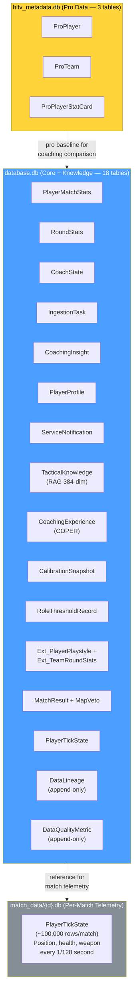

> **Analogy:** The database is the system's **archive**: every piece of information has a specific drawer and folder. The three-tier storage architecture is like having **three specialized archives**: the main archive (game data, tactical knowledge, coaching experiences — all in one large WAL filing cabinet), the professionals' filing cabinet (HLTV data, updated by a separate process to avoid contention), and the **per-match folders** (tick-by-tick telemetry, each in a separate file to prevent the main archive from becoming too heavy). By separating them, the main process can write and read from the general archive while the HLTV service updates the pro filing cabinet, and telemetry data stays isolated per match, without blocking each other. SQLite in WAL mode lets multiple programs read each archive simultaneously. SQLModel combines Pydantic (for data validation: "make sure the age field is actually a number") with SQLAlchemy (for database operations: "save this to the right table"). The 21 tables are organized like a school archive: student profiles, test scores, class notes, teacher evaluations, and library books.

```mermaid
erDiagram
    PlayerMatchStats ||--o{ RoundStats : "demo_name"
    PlayerMatchStats ||--o{ PlayerTickState : "demo_name, player_name"
    PlayerMatchStats ||--o{ CoachingInsight : "player_name, demo_name"
    PlayerMatchStats }o--o| ProPlayer : "pro_player_id → hltv_id"
    ProPlayer }o--|| ProTeam : "team_id → hltv_id"
    ProPlayer ||--o{ ProPlayerStatCard : "player_id → hltv_id"
    MatchResult ||--o{ MapVeto : "match_id"
    MatchResult ||--o{ PlayerTickState : "match_id"
    CoachingExperience }o--o| MatchResult : "pro_match_id → match_id"

    PlayerMatchStats {
        int id PK
        string player_name "indexed"
        string demo_name "unique per player"
        float rating "0.0 - 5.0"
        string dataset_split "train/val/test"
        int pro_player_id FK
        bool is_pro
    }
    RoundStats {
        int id PK
        string demo_name "indexed"
        int round_number "indexed"
        string player_name "indexed"
        int kills
        float round_rating
    }
    PlayerTickState {
        int id PK
        int match_id FK
        int tick "128 Hz"
        string demo_name "indexed"
        string player_name "indexed"
        float pos_x
        float pos_y
    }
    CoachingInsight {
        int id PK
        string player_name "indexed"
        string demo_name "indexed"
        string title
        string severity
        string focus_area
    }
    CoachingExperience {
        int id PK
        string context_hash "indexed"
        string map_name "indexed"
        string action_taken
        string outcome "indexed"
        string embedding "384-dim JSON"
        int pro_match_id FK
        float mu_skill "TrueSkill mu posterior (KT-01)"
        float sigma_skill "TrueSkill sigma uncertainty (KT-01)"
        int times_retrieved "replay priority counter (KT-01)"
        int times_validated "user confirmation count (KT-01)"
    }
    TacticalKnowledge {
        int id PK
        string title "indexed"
        string category "indexed"
        string embedding "384-dim JSON"
        int usage_count
    }
    ProPlayer {
        int id PK
        int hltv_id "unique indexed"
        string nickname "indexed"
        int team_id FK
    }
    ProTeam {
        int id PK
        int hltv_id "unique indexed"
        string name "indexed"
        int world_rank
    }
    ProPlayerStatCard {
        int id PK
        int player_id FK
        float rating_2_0
        float adr
        string time_span
    }
    MatchResult {
        int match_id PK
        string event_name "indexed"
        int team_a_id
        int winner_id
    }
    MapVeto {
        int id PK
        int match_id FK
        string map_name
        string action
    }
    PlayerProfile {
        int id PK
        string player_name "unique indexed"
        string role
        string bio
    }
    CoachState {
        int id PK
        string status "Paused/Training/Idle/Error"
        float belief_confidence
        string detail
    }
    ServiceNotification {
        int id PK
        string daemon "indexed"
        string severity
        string message
    }
    IngestionTask {
        int id PK
        string demo_path "unique indexed"
        string status "queued/processing/completed/failed"
        int retry_count
    }
    Ext_PlayerPlaystyle {
        int id PK
        string player_name "indexed"
        string assigned_role
        float rating_impact
    }
    Ext_TeamRoundStats {
        int id PK
        int match_id "indexed"
        string team_name "indexed"
        string map_name
    }
    CalibrationSnapshot {
        int id PK
        string calibration_type "indexed"
        string parameters_json
        int sample_count
    }
    RoleThresholdRecord {
        int id PK
        string stat_name "unique indexed"
        float value
        int sample_count
    }
    DataLineage {
        int id PK
        string entity_type "indexed"
        int entity_id "indexed"
        string source_demo
        string pipeline_version
        string processing_step
    }
    DataQualityMetric {
        int id PK
        string run_id "indexed"
        string run_type "indexed"
        string metric_name
        float metric_value
        int sample_count
    }
```

> **ER diagram explanation:** Each box represents a **record type** in the database. `PlayerMatchStats` is like a **report card** for each player in each match (how many kills, deaths, their rating, etc.). `PlayerTickState` is like a **frame-by-frame diary**: 128 entries per second recording exactly where the player was, how healthy they were, what direction they were looking. `RoundStats` is the **per-question breakdown**: individual evaluations for each round (kills, deaths, damage, noscope kills, flash assists, round rating), enabling detailed analyses. `CoachingExperience` is the coach's **diary**: every coaching moment, whether the advice worked, and how effective it was. `CoachingInsight` is the **actual advice** given to the player. `TacticalKnowledge` is the **textbook**: tips and strategies the coach can consult. `RoleThresholdRecord` is the **grading rubric**, the learned thresholds for classifying player roles. `CalibrationSnapshot` is the **instrument control log**, recording when the belief model was recalibrated and with how many samples. `Ext_PlayerPlaystyle` is the **external scouting report**, the playstyle metrics derived from CSV data used to train NeuralRoleHead. `ServiceNotification` is the **intercom system**, the error and event messages from background daemons shown in the UI. The lines between tables show relationships: every match record is linked to a player's profile, coaching experiences are linked to specific matches, and RoundStats is linked to PlayerMatchStats via demo_name. `DataLineage` is the **provenance log**: it traces which demo originated each entity and through which pipeline step it was processed (append-only, for full audit trail). `DataQualityMetric` is the **quality metrics panel**: it records numeric quality values for each pipeline run (e.g., percentage of samples discarded, zero-tensor fallback rate), enabling system health monitoring over time.

**Data lifecycle:**

| Phase                                | Tables written                                                                    | Volume                                 |
| ------------------------------------ | --------------------------------------------------------------------------------- | -------------------------------------- |
| Demo ingestion                       | `PlayerMatchStats`, `PlayerTickState`, `MatchMetadata`                            | ~100,000 ticks/match                   |
| Round enrichment                     | `RoundStats` (per-round, per-player isolation)                                    | ~30 rows/match (rounds × players)      |
| HLTV scan                            | `ProPlayer`, `ProTeam`, `ProPlayerStatCard`                                       | ~500 players                           |
| CSV import                           | External tables via `csv_migrator.py`                                             | ~10,000 rows                           |
| Playstyle data                       | `Ext_PlayerPlaystyle` (from CSV for NeuralRoleHead)                               | ~300+ players                          |
| Feature engineering                  | `PlayerMatchStats.dataset_split` updated                                          | In place                               |
| RAG population                       | `TacticalKnowledge`                                                               | ~200 articles                          |
| Experience extraction                | `CoachingExperience`                                                              | ~1,000 per match                       |
| Coaching output                      | `CoachingInsight`                                                                 | ~5-20 per match                        |
| Role threshold learning              | `RoleThresholdRecord`                                                             | 9 thresholds                           |
| Belief calibration                   | `CalibrationSnapshot` (after retraining)                                          | 1 per calibration run                  |
| System telemetry                     | `CoachState`, `ServiceNotification`, `IngestionTask`                              | Continuous                             |
| Provenance tracking                  | `DataLineage` (append-only per processed entity)                                  | ~N rows per ingested demo              |
| Pipeline quality metrics             | `DataQualityMetric` (append-only per pipeline run)                                | ~5-10 metrics per run                  |
| Backup                               | Automated via `BackupManager` (7 daily rotations + 4 weekly)                      | Full database copy                     |

**Indexes and query optimization:**

The most queried tables have strategic indexes to guarantee fast queries:

| Table | Index | Columns | Query type optimized |
| ----- | ----- | ------- | -------------------- |
| `PlayerMatchStats` | `idx_pms_player` | `player_name` | Lookup by player |
| `PlayerMatchStats` | `idx_pms_demo` | `demo_name` | Lookup by match |
| `PlayerMatchStats` | `idx_pms_processed` | `processed_at` | Chronological sort |
| `RoundStats` | `idx_rs_demo_round` | `demo_name, round_number` | Lookup for specific round |
| `IngestionTask` | `idx_it_status` | `status` | Work queue (status=queued) |
| `CoachingInsight` | `idx_ci_player` | `player_name` | Insights per player |
| `TacticalKnowledge` | `idx_tk_category` | `category` | RAG lookup by category |
| `ProPlayer` | `idx_pp_name` | `nickname` | Pro lookup by name |
| `DataLineage` | `idx_dl_entity` | `entity_type, entity_id` | Provenance tracking per entity |
| `DataQualityMetric` | `idx_dqm_run` | `run_id, run_type` | Quality metrics per run |

**Integrity constraints:**

| Constraint | Tables | Enforcement |
| ---------- | ------ | ----------- |
| `player_name` NOT NULL | PlayerMatchStats, RoundStats | Schema-level |
| `demo_name` UNIQUE per player | PlayerMatchStats | Prevents duplicates |
| `status` CHECK IN ('queued', 'processing', 'completed', 'failed') | IngestionTask | Enum enforcement |
| `dataset_split` CHECK IN ('train', 'val', 'test') | PlayerMatchStats | Split validity |
| Foreign key demo_name | RoundStats → PlayerMatchStats | Round-match relationship |

**Key table details:**

**`PlayerMatchStats`** (32 fields) — the most queried table in the system:

The PlayerMatchStats table contains all aggregated per-player, per-match statistics. It is the "report card" for every analyzed match:

| Field | Type | Description |
| ----- | ---- | ----------- |
| `id` | Integer PK | Unique identifier |
| `player_name` | String | Player name (indexed) |
| `demo_name` | String | Demo file name (unique per player) |
| `kills`, `deaths`, `assists` | Integer | Base KDA |
| `adr` | Float | Average Damage per Round |
| `kast` | Float | Kill/Assist/Survive/Trade % |
| `headshot_percentage` | Float | HS% |
| `hltv_rating` | Float | Computed HLTV 2.0 Rating |
| `dataset_split` | String | "train" / "val" / "test" |
| `is_pro` | Boolean | Pro player flag |
| `processed_at` | DateTime | Processing timestamp |
| `map_name` | String | Map played |
| ... | ... | 20+ additional fields for advanced features |

**`TacticalKnowledge`** — the RAG base:

| Field | Type | Description |
| ----- | ---- | ----------- |
| `id` | Integer PK | Identifier |
| `title` | String | Document title (indexed) |
| `description` | String | Description of tactical content |
| `category` | String | "positioning" / "economy" / "utility" / "aim" (indexed) |
| `map_name` | String | Specific map (indexed, optional) |
| `situation` | String | Situational context: "T-side pistol round", "CT retake A site" |
| `pro_example` | String | Reference to pro demo (optional) |
| `embedding` | String | 384-dim JSON vector (sentence-transformers) |
| `created_at` | DateTime | Creation timestamp |
| `usage_count` | Integer | Usage counter |

RAG semantic search works by computing the **cosine similarity** between the user query embedding and the precomputed embeddings of each document. The top-3 results with similarity > 0.5 are used to enrich the coaching context. The `situation` field enables contextual filtering (e.g., "T-side pistol round") before semantic search.

**`CoachingExperience`** — the COPER bank (22+ fields):

| Field | Type | Description |
| ----- | ---- | ----------- |
| `id` | Integer PK | Identifier |
| `context_hash` | String | Hash of game state for fast lookup (indexed) |
| `map_name` | String | Map (indexed) |
| `round_phase` | String | "pistol" / "eco" / "full_buy" / "force" |
| `side` | String | "T" / "CT" |
| `position_area` | String | "A-site" / "Mid" / etc. (indexed, optional) |
| `game_state_json` | String | Full tick snapshot (max 16KB, validated with `field_validator`) |
| `action_taken` | String | "pushed" / "held_angle" / "rotated" / "used_utility" / etc. |
| `outcome` | String | "kill" / "death" / "trade" / "objective" / "survived" (indexed) |
| `delta_win_prob` | Float | Win probability change from this action |
| `confidence` | Float | Reliability/generalizability 0.0-1.0 |
| `usage_count` | Integer | How many times retrieved for coaching |
| `pro_match_id` | Integer FK | Reference to MatchResult (ON DELETE SET NULL) |
| `pro_player_name` | String | Reference pro player name (indexed, optional) |
| `embedding` | String | 384-dim JSON vector for semantic search (optional) |
| `source_demo` | String | Source demo (optional) |
| `created_at` | DateTime | Creation timestamp |
| `outcome_validated` | Boolean | Whether the outcome was validated |
| `effectiveness_score` | Float | Score -1.0 to 1.0 |
| `follow_up_match_id` | Integer | Follow-up match for tracking |
| `times_advice_given` | Integer | How many times the advice was given |
| `times_advice_followed` | Integer | How many times the advice was followed |
| `last_feedback_at` | DateTime | Last feedback received |
| `mu_skill` | Float | TrueSkill μ posterior — experience quality estimate (KT-01) |
| `sigma_skill` | Float | TrueSkill σ uncertainty — quality uncertainty (KT-01) |
| `times_retrieved` | Integer | Replay priority counter — how many times retrieved (KT-01) |
| `times_validated` | Integer | User confirmation counter — how many times validated (KT-01) |

The COPER system uses these experiences to **learn from its own advice**: the `context_hash` field enables fast lookup of similar situations, `outcome` and `delta_win_prob` measure action effectiveness, and the feedback loop (`outcome_validated`, `times_advice_given/followed`, `effectiveness_score`) lets the system prioritize advice that has historically produced positive outcomes. The `game_state_json` field is capped at 16KB to prevent uncontrolled database growth. The TrueSkill `mu_skill`/`sigma_skill` fields (KT-01) provide a Bayesian estimate of experience quality, used for replay prioritization: `confidence_score = mu_skill - κ × sigma_skill`. The `times_retrieved` counter implements replay priority, while `times_validated` tracks user confirmations for semantic CRUD.

> **Analogy:** The data lifecycle shows **how information flows through the system over time**, like tracking a package from factory to delivery. First come the match recordings (100,000 data points per match!). Then pro player stats are scraped from HLTV (like downloading a sports almanac). External CSV files are imported (like obtaining historical data). The AI processes everything, generates coaching advice, learns role thresholds, and constantly records system health. Backups run automatically: 7 daily copies and 4 weekly copies, like saving your homework both on the computer and on a USB drive, just in case.

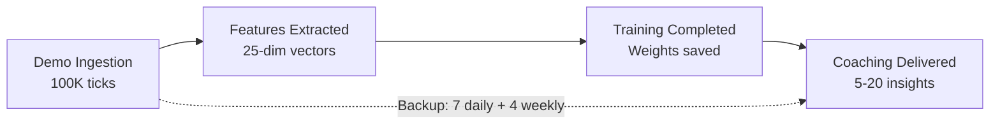

## 10. Training regime and maturity gates

> **Analogy:** The training regime is the **complete school curriculum**, from kindergarten to graduation. A student (the AI model) starts with zero knowledge and gradually learns through 4 phases, unlocking more advanced courses as they prove themselves. Maturity gates are like **grading requirements**: you can't take the AP Physics exam (RAP Optimization) until you've passed Basic Math (JEPA Pre-Training), Algebra (Pro Baseline), and Pre-Calculus (User Fine-Tuning). Each gate checks: "Have you studied enough demos to be ready for the next level?"

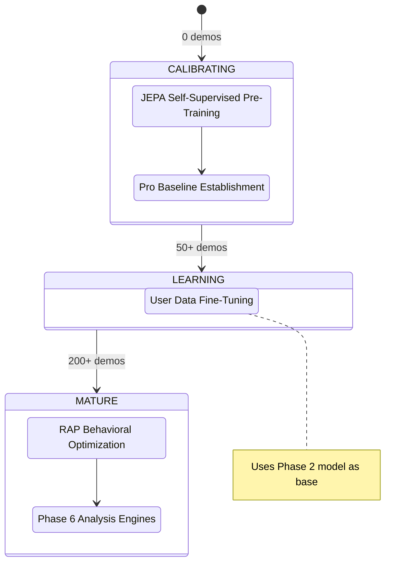

**Data requirements per phase:**

| Phase                       | Minimum data               | Training type                  | Primary loss                                |
| --------------------------- | -------------------------- | ------------------------------ | ------------------------------------------- |
| 1\. JEPA Pre-training       | 10 pro demos               | Self-supervised (InfoNCE)      | Contrastive with in-batch negatives         |
| 2\. Pro baseline            | 50 pro matches             | Supervised                     | MSE(pred, pro_stats)                        |
| 3\. User fine-tuning        | 50 user matches            | Supervised (transfer)          | MSE(pred, user_stats)                       |
| 4\. RAP optimization        | 200 total matches          | Multi-task                     | Strategy + Value + Sparsity + Position      |

> **Analogy:** Phase 1 is like **watching cooking shows**: the model learns patterns simply by observing (self-supervised, no labels needed). Phase 2 is like **a cooking school with a textbook**: "Here's how a professional makes pasta" (supervised with professional data). Phase 3 is like **cooking for your family**: "Your family prefers it spicy, so let's adapt the recipe" (fine-tuning on user data). Phase 4 is **master chef training**: learning to balance flavor, presentation, timing, and nutrition simultaneously (multi-task: strategy + value + sparsity + position). You need at least 10 cooking shows to start, 50 recipes to learn from, and 200 total dishes prepared before you graduate.

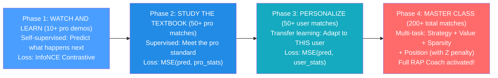

**VL-JEPA Two-Stage Protocol (Concept Alignment):**

When VL-JEPA is active, Phases 1-2 are extended with a **two-stage protocol** that aligns latent representations with the 16 coaching concepts:

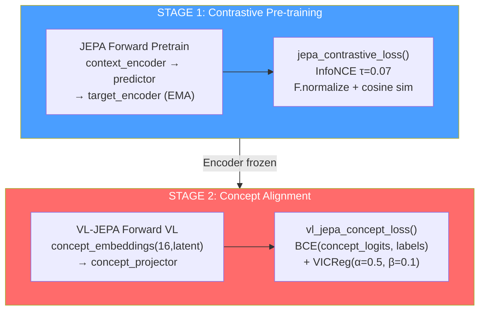

| Stage | What is trained | What is frozen | Loss | Purpose |
| ----- | --------------- | -------------- | ---- | ------- |
| 1 | Context encoder, predictor | Target encoder (EMA) | InfoNCE (τ=0.07) | General latent representations |
| 2 | Concept embeddings, concept projector, concept temperature | Encoder (optional fine-tuning) | BCE + VICReg diversity | Alignment with 16 coaching concepts |

**The 16 Coaching Concepts (taxonomy):**

| Index | Concept | Category | Description |
| ----- | ------- | -------- | ----------- |
| 0 | Positioning Quality | Positioning | Position quality relative to context |
| 1 | Trade Readiness | Positioning | Readiness for trade kill |
| 2 | Rotation Speed | Positioning | Rotation speed between sites |
| 3 | Utility Usage | Utility | Grenade use frequency and quality |
| 4 | Utility Effectiveness | Utility | Effectiveness of utilities used |
| 5 | Decision Quality | Decision | In-game decision quality |
| 6 | Risk Assessment | Decision | Pre-action risk evaluation |
| 7 | Engagement Timing | Engagement | Timing of engagements |
| 8 | Engagement Distance | Engagement | Optimal engagement distance |
| 9 | Crosshair Placement | Engagement | Pre-peek crosshair placement |
| 10 | Recoil Control | Engagement | Recoil control |
| 11 | Economy Management | Decision | Team economy management |
| 12 | Information Gathering | Decision | Information gathering (peek, info utility) |
| 13 | Composure Under Pressure | Psychology | Composure under pressure |
| 14 | Aggression Control | Psychology | Aggression control |
| 15 | Adaptation Speed | Psychology | Speed of adaptation to opponent meta |

> **Analogy for the 16 Concepts:** The 16 coaching concepts are like the **16 subjects of a complete school curriculum**. Three subjects cover **geography** (positioning — where you are). Two cover **chemistry** (utility — how you use your tools). Five cover **strategy** (decision and economy — the choices you make). Four cover **gymnastics** (engagement — physical skills: aim, recoil, timing). Three cover **psychology** (composure, aggression, adaptation). Stage 2 of VL-JEPA teaches the model to "understand" these 16 subjects and give a grade for each in every player action.

**AdamW + CosineAnnealing (JEPA Trainer):**

| Hyperparameter | Value | Purpose |
| -------------- | ----- | ------- |
| Optimizer | AdamW | Weight decay separated from gradients |
| Learning rate | 1e-4 (default) | Initial learning rate |
| Weight decay | 0.01 | L2 regularization |
| Scheduler | CosineAnnealingLR | Cosine LR decay down to 0 |
| EMA decay | 0.996 | Target encoder momentum update |
| Gradient clip | 1.0 | Gradient explosion prevention |

**DriftMonitor (z_threshold=2.5):**

The `DriftMonitor` integrated in the JEPA Trainer monitors **feature drift** during training. If a feature's Z-score exceeds 2.5, it emits a warning indicating possible distribution shift:

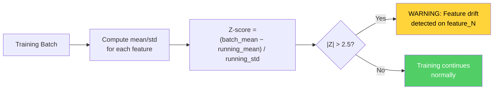

**Retraining trigger:** The Teacher daemon monitors growth in the pro demo count; it triggers retraining when `count ≥ last_count × 1.10`.

> **Analogy:** The retraining trigger is like a **school that updates its curriculum when enough new textbooks arrive**. The Teacher daemon (a background process) constantly checks: "How many pro demos do we have now?". When the count grows 10% or more since the last training, it says: "We have enough new material: it's time to retrain the model so it stays current with the evolving pro meta."

**JEPAPretrainDataset** (`jepa_train.py`):

The JEPA pre-training dataset uses **temporal windows** to create context-target pairs:

| Parameter | Value | Purpose |
| --------- | ----- | ------- |
| `context_len` | 10 ticks | Context window length (input) |
| `target_len` | 10 ticks | Target window length (to predict) |
| Gap | 0-5 ticks (random) | Variable distance between context and target |
| Batch size | 32 | Number of pairs per batch |

> **Dataset Analogy:** The pre-training dataset is like a **speed reading exercise**. The model is shown one page of the book (10 ticks of context) and then asked: "What does the next page say?" (10 target ticks). The variable gap makes the exercise harder — sometimes the next page is immediately after, sometimes they are separated by a few blank pages. This forces the model to learn general patterns, not specific sequences.

---

## 11. Loss function catalog

> **Analogy:** Loss functions are the **test scores** the AI tries to minimize. Every model has its own type of test. A lower score means better performance, the opposite of school grades! Think of each loss function as a specific test question: "How close was your prediction to the correct answer?" (MSE), "Did you pick the correct answer among multiple options?" (InfoNCE/BCE), "Did you use too many resources?" (Sparsity). The table below is like the **complete exam calendar**: every test, for every model, with the exact grading formula.

| Model                     | Loss name                | Formula                                                                                                                         | Purpose                                                              |
| ------------------------- | ------------------------ | ------------------------------------------------------------------------------------------------------------------------------- | -------------------------------------------------------------------- |
| **JEPA**            | InfoNCE Contrastive       | `−log(exp(sim(pred, target)/τ) / Σ exp(sim(pred, neg_i)/τ))`, τ=0.07, `F.normalize` before cosine similarity          | Aligning context predictions with target embeddings                  |
| **JEPA**            | Fine-tuning               | `MSE(coaching_head(Z_ctx), y_true)`                                                                                           | Supervised coaching score                                            |
| **AdvancedCoachNN** | Supervised                | `MSELoss(MoE_output, y_true)`                                                                                                 | Match-level training                                                 |
| **RAP**             | Strategy                  | `MSELoss(advice_probs, target_strat)`                                                                                         | Correct tactical recommendation                                      |
| **RAP**             | Value                     | `0.5 × MSE(V(s), true_advantage)`                                                                                            | Accurate advantage estimation                                        |
| **RAP**             | Sparsity                  | `L1(gate_weights)`                                                                                                            | Expert specialization                                                |
| **RAP**             | Position                  | `MSE(xy) + 2× MSE(z)`                                                                                                        | Optimal positioning with Z-axis penalty                              |
| **WinProb**         | Prediction                | `BCEWithLogitsLoss(pred, outcome)`                                                                                            | Round outcome prediction                                             |
| **NeuralRoleHead**  | KL-Divergence             | `KLDivLoss(log_softmax(pred), target)` with label smoothing ε=0.02                                                            | Role probability distribution match                                  |
| **VL-JEPA**         | Concept Alignment         | `BCE(concept_logits, concept_labels)` + `VICReg(concept_diversity)`                                                           | Visual-language concept grounding                                    |

> **Analogy for key loss functions:** **InfoNCE** is like a multiple-choice test: "Here are 32 possible answers: which is the correct one?" The model gets a higher score for picking the right one AND for being confident about it. **MSE** (Mean Squared Error) is like measuring how far your dart is from the bullseye: closer = lower loss. **BCE** (Binary Cross-Entropy) is like a true/false quiz: "Did your team win? Yes or no?". **Sparsity Loss** is like a teacher saying "Use fewer words in your essay": it encourages the model to activate fewer experts, making it more efficient and interpretable. **Position Loss with 2x Z penalty** is like saying "missing left or right is bad, but falling off a cliff (wrong floor) is twice as bad". **KL-Divergence** is like comparing two rankings: "Does your role ranking match the real one?" — it measures how much the predicted distribution deviates from the target.

**Detail: InfoNCE Contrastive Loss (JEPA)**

InfoNCE is the main loss for JEPA pre-training. Its purpose is to align context predictions with target embeddings while simultaneously pushing away negatives (other samples in the batch):

```
L_InfoNCE = -log( exp(sim(pred, target⁺) / τ) / Σᵢ exp(sim(pred, targetᵢ) / τ) )
```

| Component | Value | Role |
| --------- | ----- | ---- |
| `sim()` | Cosine similarity after `F.normalize` | Similarity measure [-1, +1] |
| `τ` (temperature) | 0.07 | Distribution sharpness — low values = more selective |
| `target⁺` | The correct target embedding for this context | The "positive" — the correct answer |
| `targetᵢ` | All embeddings in the batch | In-batch negatives — the wrong answers |
| Batch size | 32 | Number of negatives = batch_size - 1 = 31 |

> **InfoNCE Analogy:** Imagine you're in a room with 32 people. You're shown a photo (context) and you have to find the right person (positive target) among the 32. Temperature τ=0.07 is like the **sharpness of the glasses**: low values mean very precise glasses — you must be very sure of your choice to get a good score. High values mean blurry glasses — even an approximate choice is fine. JEPA's low τ forces the model to learn very precise representations.

**Detail: VL-JEPA Concept Loss (VICReg Components)**

The VL-JEPA concept alignment loss combines two components:

```
L_concept = BCE(concept_logits, concept_labels) + α·VICReg_diversity
```

Where `VICReg_diversity` is composed of:

| VICReg Term | Formula | Weight | Purpose |
| ----------- | ------- | ------ | ------- |
| **Variance** | `max(0, γ - std(z))` for each dimension | α=0.5 | Prevents representation collapse — each dimension must vary |
| **Covariance** | `Σᵢ≠ⱼ cov(zᵢ, zⱼ)²` | β=0.1 | Decorrelation — each dimension must capture different information |

> **VICReg Analogy:** **Variance** is like a teacher saying "Each of you must have a different opinion — don't all copy the same answer!" (prevents collapse where all concept embeddings become identical). **Covariance** is like saying "Each student must specialize in a different subject — we don't need 16 history experts and zero math experts!" (forces diversity across dimensions). Together, they ensure the 16 concept embeddings are both **distinct from each other** and **individually meaningful**.

**Detail: RAP Multi-Task Loss**

The RAP Coach combines 4 losses into a total weighted loss:

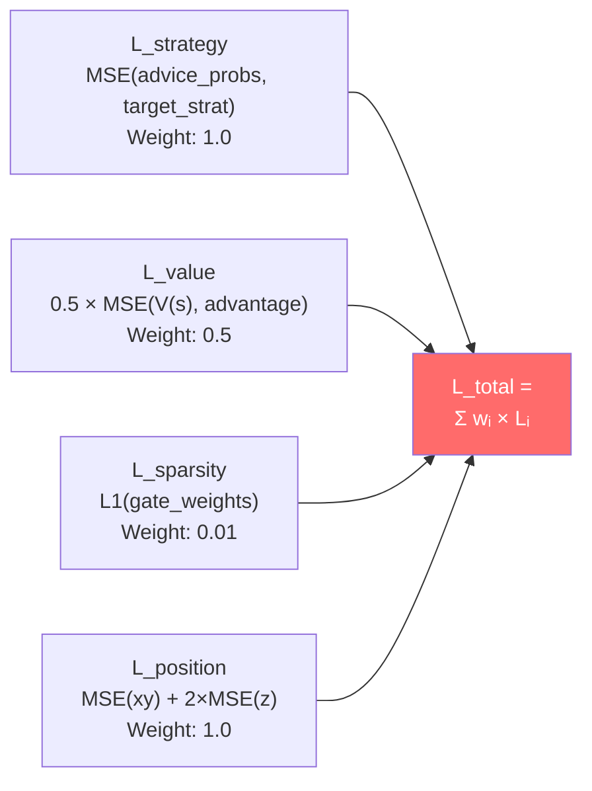

The 2× Z penalty in position loss reflects the fact that in CS2 getting the **floor** wrong (upper vs lower in Nuke/Vertigo) is much worse than getting horizontal position wrong. A 100-unit error on the Z axis (wrong floor) is strategically catastrophic, while the same error on X/Y could be irrelevant.

---

## 12. Complete Program Logic — From Launch to Advice

This chapter documents the **complete logic** of Macena CS2 Analyzer, from the moment the user launches the application to when they receive coaching advice. Unlike the previous chapters that focus on AI subsystems, here it is explained how **every component of the program** works together: the desktop interface, the quad-daemon architecture, the ingestion pipeline, the storage system, tactical playback, observability, and the application lifecycle.

> **Analogy:** If chapters 1-11 describe the **individual organs** of a human body (brain, heart, lungs, liver), this chapter describes the **entire body in action**: how it wakes up in the morning, how it breathes, walks, eats, thinks, and speaks. Understanding the organs is essential, but understanding how they work together is what gives the system life. Imagine Macena CS2 Analyzer as a **small city**: it has a town hall (the main Kivy process), an underground operations center (the Session Engine with its 4 daemons), a municipal archive (the SQLite database), a post office (the ingestion pipeline), a school (the ML training system), a library (the RAG/COPER knowledge system), a hospital (the coaching service), and a public health monitoring system (observability). This chapter walks you through each building and shows how the citizens (the data) move from one place to another.

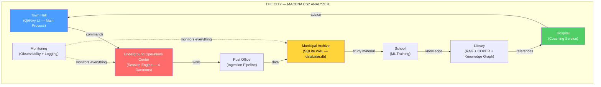

---

### 12.1 Entry Point and Startup Sequence

The system has **two main entry points** (Qt primary, Kivy legacy) and three utility entry points:

| # | Entry Point | Command | Role |
|---|---|---|---|
| 1 | **Qt (primary)** | `python -m Programma_CS2_RENAN.apps.qt_app.app` | PySide6 desktop UI |
| 2 | Kivy (legacy) | `python -m Programma_CS2_RENAN.main` | Kivy/KivyMD desktop UI |
| 3 | Session Engine | `python -m Programma_CS2_RENAN.backend.console` | Headless backend |
| 4 | Headless Validator | `python -m Programma_CS2_RENAN.tools.headless_validator` | CI/CD validation |
| 5 | HLTV Sync | `python -m Programma_CS2_RENAN.tools.hltv_sync` | Pro data scraping |

#### 12.1.1 Qt Entry Point (Primary) — `apps/qt_app/app.py`

**File:** `Programma_CS2_RENAN/apps/qt_app/app.py`

The Qt startup sequence follows a more modern approach based on **QApplication** and **signal/slot** instead of the Kivy event loop:

1. **High-DPI setup** — Enables automatic scaling for high-density displays
2. **QApplication** — Creates the Qt application instance with args handling
3. **Theme and fonts** — Registers the 3 themes (CS2, CSGO, CS1.6) via QSS and the custom fonts
4. **MainWindow** — Builds `QMainWindow` with sidebar + `QStackedWidget` (14 screens)
5. **Signal wiring** — Connects Qt signals between sidebar, screens, and backend
6. **First-run gate** — If `SETUP_COMPLETED=False`, shows the wizard; otherwise the home
7. **Backend console boot** — Launches the Session Engine as a subprocess
8. **Window show** — Shows the window and starts the Qt event loop
9. **CoachState polling** — Qt timer for periodic state updates

> **Analogy:** The Qt startup is like **turning on a modern car with an electronic start/stop button**. A single button (QApplication) starts the sequence: the onboard computer configures the display (High-DPI), loads the dashboard theme (QSS), assembles all the instruments (14 screens in the QStackedWidget), connects the sensors (signal wiring), checks whether it's the first boot (first-run gate), starts the engine (backend console), and finally lights up the dashboard (window show).

#### 12.1.2 Kivy Entry Point (Legacy) — `main.py`

**File:** `Programma_CS2_RENAN/main.py`

When the user launches the application via the legacy entry point, `main.py` orchestrates a strictly ordered **9-phase startup sequence**. Each phase must complete successfully before the next can begin. If a critical phase fails, the application terminates with an explicit message — never silently.

> **Analogy:** The program startup is like the **pre-flight checklist of an airplane**. Before the plane can take off, the pilot (main.py) must complete a series of checks in order: verify the fuselage integrity (RASP audit), set up the instruments (path configuration), check the fuel (database migration), start the engines (Kivy initialization), load the passengers (screen registration), engage the autopilot (daemon launch), and finally take off (show the interface). If one check fails — for example, insufficient fuel (corrupt database) — the flight is canceled, they don't try to take off hoping it goes well.

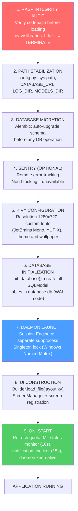

**Critical phase details:**

| Phase | Component | What it does | Failure consequence |
| ----- | --------- | ------------ | ------------------- |
| 1 | `integrity.py` (RASP) | Verifies source file hashes against manifest | Immediate termination — possible tampering |
| 2 | `config.py` | Stabilizes `sys.path`, defines all path constants | Cascading import errors |
| 3 | `db_migrate.py` | Runs pending Alembic migrations | Incompatible schema — crash on DB ops |
| 5 | Kivy `Config` | Sets `KIVY_NO_CONSOLELOG`, registers fonts, loads `.kv` | UI not renderable |
| 6 | `database.py` | `create_all()` on SQLite engine with `check_same_thread=False` | No persistence possible |
| 7 | `lifecycle.py` | Launches subprocess with correct PYTHONPATH, checks mutex | No background automation |

> **Analogy:** Failure consequences are arranged like **domino tiles**: if phase 2 (paths) fails, phases 3-9 will all fall because none of them know where to find the database, models, or logs. If phase 6 (database) fails, phases 7-9 will apparently work but won't be able to save or retrieve anything — like a restaurant that opened its doors but forgot to turn on the stoves.

---

### 12.2 Lifecycle Management (`lifecycle.py`)

**File:** `Programma_CS2_RENAN/core/lifecycle.py`

The `AppLifecycleManager` is a **Singleton** that manages the lifecycle of the entire application: from guaranteeing that only one instance is active, to launching the daemon subprocess, to coordinated shutdown.

> **Analogy:** The Lifecycle Manager is like the **director of a theater**. Before the show, he verifies that no other shows are running in the same room (Single Instance Lock). Then he hires the stage director (Session Engine daemon) who will work behind the scenes. During the show, the director is always present in case of emergency. At the end, the director makes sure everyone leaves the theater in order: first the stage director finishes his work, then the lights go out, then the doors close.

**Main mechanisms:**

| Mechanism | Implementation | Purpose |
| --------- | -------------- | ------- |
| **Single Instance Lock** | Windows Named Mutex / file lock on Linux | Prevents multiple instances (DB corruption) |
| **Daemon Launch** | `subprocess.Popen(session_engine.py)` with PYTHONPATH | Separate process for heavy work |
| **Parent Death Detection** | The daemon monitors EOF on `stdin` | If the main process dies, the daemon shuts down |
| **Graceful Shutdown** | Sends "STOP" via stdin → daemon terminates within 5s | No data loss or zombie tasks |
| **Status Polling** | UI queries `CoachState` every 10s | Daemon state update without direct IPC |
| **Error Recovery** | If daemon dies, error logged + ServiceNotification | User informed, no silent crash |
| **Keep-Alive** | UI checks heartbeat every 15s | If heartbeat > 30s stale → warning "Daemon not responding" |

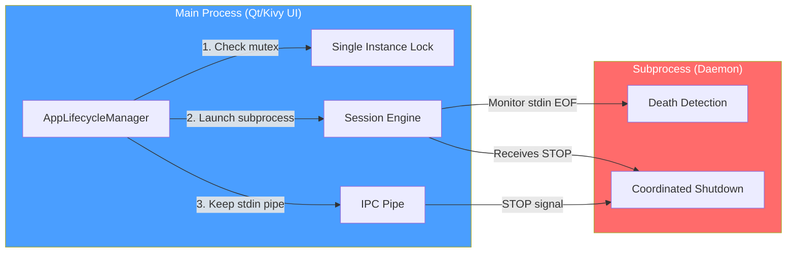

> **Analogy:** The `stdin` pipe is like a **telephone line** between the director and the stage director. As long as the line is connected, the stage director knows the director is still present. If the line suddenly breaks (EOF — the main process crashes), the stage director realizes the show is over and closes everything in an orderly fashion. If the director wants to end normally, they send the "STOP" message through the line and wait for the stage director to confirm they have finished.

---

### 12.3 Configuration System (`config.py`)

**File:** `Programma_CS2_RENAN/core/config.py`

The system uses **three configuration levels**, each with a different level of persistence and security:

> **Analogy:** The three configuration levels are like the **three layers of medieval armor**. The inner layer (hardcoded) is the base armor that never changes — the foundations of the system. The middle layer (JSON) is the customizable chainmail — the user can adjust it as they prefer. The outer layer (Keyring) is the helmet with visor — it protects the most precious secrets (API keys) in an OS vault, inaccessible to prying eyes.

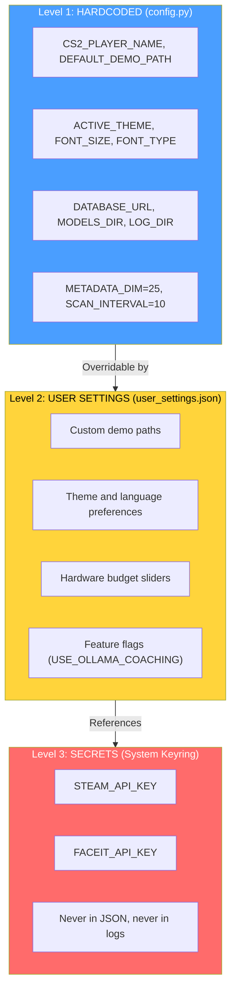

**Critical system constants:**

| Constant | Value | File | Purpose |
| -------- | ----- | ---- | ------- |
| `METADATA_DIM` | 25 | `config.py` | Feature vector dimension — unified contract |
| `SCAN_INTERVAL` | 10 | `config.py` | Scanner scan interval (seconds) |
| `MAX_DEMOS_PER_MONTH` | 10 | `config.py` | Monthly demo upload quota |
| `MAX_TOTAL_DEMOS` | 100 | `config.py` | Lifetime total demo limit |
| `MIN_DEMOS_FOR_COACHING` | 10 | `config.py` | Threshold for full personalized coaching |
| `TRADE_WINDOW_TICKS` | 192 | `trade_kill_detector.py` | Trade kill time window (~3 seconds at 64 tick) |
| `HLTV_BASELINE_KPR` | 0.679 | `demo_parser.py` | HLTV 2.0 baseline for KPR |
| `HLTV_BASELINE_SURVIVAL` | 0.317 | `demo_parser.py` | HLTV 2.0 baseline for survival |
| `FOV_DEGREES` | 90 | `player_knowledge.py` | Simulated player field of view |
| `MEMORY_DECAY_TAU` | 160 | `player_knowledge.py` | Memory decay constant in ticks |
| `CONFIDENCE_ROUNDS_CEILING` | 300 | `correction_engine.py` | Round ceiling for max confidence |
| `SILENCE_THRESHOLD` | 0.2 | `explainability.py` | Threshold below which silence is valid action |
| `MIN_SAMPLES_FOR_VALIDITY` | 10 | `role_thresholds.py` | Minimum samples for a valid role threshold |
| `HALF_LIFE_DAYS` | 90 | `pro_baseline.py` | Temporal decay for pro data |
| `Z_LEVEL_THRESHOLD` | 200 | `connect_map_context.py` | Z threshold for floor classification |

> **Constants Analogy:** Constants are like the **reference vital signs** in medicine. `METADATA_DIM=25` is like saying "normal systolic pressure is 120" — all doctors (ML models) use the same reference. `TRADE_WINDOW_TICKS=192` is like the "golden hour" in trauma medicine: if a teammate is killed and you kill their killer within 3 seconds, it's a trade kill. `SILENCE_THRESHOLD=0.2` is like "primum non nocere" (first, do no harm): if the coach has nothing significant to say, it's better to be silent than to give useless advice.

**Path architecture:**

The system handles paths with particular attention to **Windows/Linux portability**. The heart is `BRAIN_DATA_ROOT`: a user-configurable directory that contains models, logs, and derived data. If it doesn't exist, the system falls back to the project folder.

| Path | Contents | Configurable |
| ---- | -------- | ------------ |
| `DATABASE_URL` | Main monolithic database (`database.db`) | No — always in the project folder |
| `BRAIN_DATA_ROOT` | Root for derived data (models, logs) | Yes — via `user_settings.json` |
| `MODELS_DIR` | Model checkpoints `.pt` | Derived from `BRAIN_DATA_ROOT` |
| `LOG_DIR` | Application log files | Derived from `BRAIN_DATA_ROOT` |
| `MATCH_DATA_PATH` | Per-match database (`match_XXXX.db`) | Derived from `BRAIN_DATA_ROOT` |
| `DEFAULT_DEMO_PATH` | User demo folder | Yes — via UI Settings |
| `PRO_DEMO_PATH` | Pro demo folder | Yes — via UI Settings |

> **Analogy:** `BRAIN_DATA_ROOT` is like the **coach's brain home address**. You can move it to a larger disk (external SSD) simply by changing the address, and everything else — models, logs, match data — will follow automatically. The main database (`database.db`), on the other hand, is like the **municipal registry**: it always stays in the same place for integrity reasons.

---

### 12.4 Session Engine — Quad-Daemon Architecture (`session_engine.py`)

**File:** `Programma_CS2_RENAN/core/session_engine.py`

The Session Engine is the **beating heart** of the system's automation. It lives as a separate subprocess and hosts **4 daemon threads** that work in parallel, each with a well-defined responsibility. This design completely separates the heavy work (demo parsing, ML training) from the user interface, guaranteeing that the Kivy GUI always remains responsive.

> **Analogy:** The Session Engine is like an **underground nuclear power plant** that powers the entire city. It has 4 reactors (daemons), each producing a different type of energy. Reactor 1 (Scanner) is the **radar scanner**: it constantly scans the horizon looking for new demos to process. Reactor 2 (Digester) is the **refinery**: it takes raw demos and transforms them into structured data. Reactor 3 (Teacher) is the **research lab**: it uses refined data to train the coach's brain. Reactor 4 (Pulse) is the **heart monitor**: it emits a beat every 5 seconds to confirm the plant is alive. If the surface city (Kivy GUI) is destroyed by an earthquake (crash), the plant detects the loss of communication and shuts down safely.

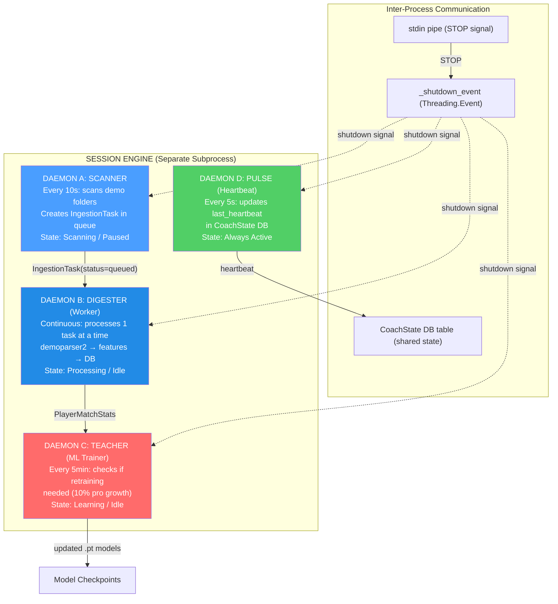

**Lifecycle of each daemon:**

| Daemon | Interval | Work per cycle | Trigger |
| ------ | -------- | -------------- | ------- |
| **Scanner** | 10 seconds | Scans pro and user folders, creates `IngestionTask` for new `.dem` | Always active (if state = Scanning) |
| **Digester** | Continuous | Picks 1 task from queue, performs full parsing | `_work_available_event` (signaled by Scanner) |
| **Teacher** | 300 seconds (5 min) | Checks pro sample growth; if ≥10% → `run_full_cycle()` | `pro_count >= last_count × 1.10` |
| **Pulse** | 5 seconds | Updates `CoachState.last_heartbeat` in the database | Always active |

> **Digester Analogy:** The Digester is like a **tireless dishwasher**: it takes a dirty dish (raw demo) from the pile, washes it carefully (parsing with demoparser2, feature extraction, HLTV 2.0 rating computation, RoundStats enrichment), dries it (normalization), puts it on the right shelf (saves to database), and then takes the next dish. It never takes 2 dishes at a time — one at a time, to avoid mistakes. If the pile is empty, it waits patiently (sleep 2s + `_work_available_event`) until someone brings new dirty dishes.

> **Teacher Analogy:** The Teacher is like a **university professor who updates his courses**. Every 5 minutes he checks: "Have enough new scientific articles (pro demos) arrived?" If the count has grown 10% since the last update, he says: "It's time to rewrite the handouts!" and kicks off a full training cycle. After training, he also runs a meta-shift check: "Has the pro average changed? Has the game meta shifted?" — ensuring the coaching always stays current.

**Shutdown sequence:**

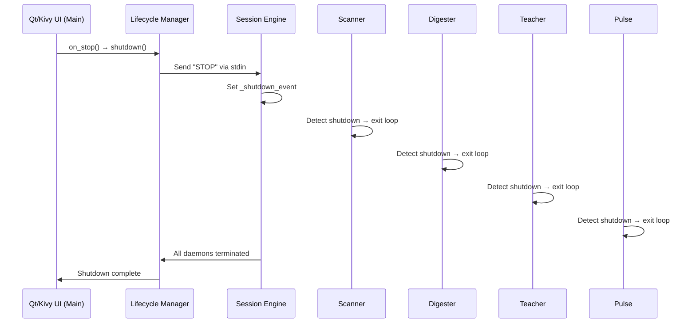

**Daemon implementation details:**

| Daemon | Main Method | Internal Loop | Exit Condition |
| ------ | ----------- | ------------- | -------------- |
| **Scanner** | `_scanner_daemon_loop()` | `while not _shutdown_event.is_set()` → `scan_all_paths()` → `sleep(10)` | `_shutdown_event` set |
| **Digester** | `_digester_daemon_loop()` | `while not _shutdown_event.is_set()` → `_work_available_event.wait(2)` → `process_next_task()` | `_shutdown_event` set |
| **Teacher** | `_teacher_daemon_loop()` | `while not _shutdown_event.is_set()` → `_check_retrain_needed()` → `sleep(300)` | `_shutdown_event` set |
| **Pulse** | `_pulse_daemon_loop()` | `while not _shutdown_event.is_set()` → `state_mgr.heartbeat()` → `sleep(5)` | `_shutdown_event` set |

**Error handling in daemons:**

Each daemon is protected by a global `try/except`. If a daemon crashes:
1. The error is logged with a full traceback
2. The `StateManager` registers the error (`set_error(daemon, message)`)
3. A `ServiceNotification` is created for the user
4. The daemon **is not automatically restarted** (by design: a daemon crash indicates a bug, not a transient error)
5. The other daemons continue to function independently

> **Analogy:** Each daemon is a **worker with their own office and their own door**. If a worker has a medical incident (crash), they close their door and post a "Temporarily unavailable" notice (ServiceNotification). The other workers in the other offices continue working normally. The director (Session Engine) takes note of the incident but does not try to revive the worker — they prefer that a technician (the developer) investigate the cause before putting them back to work.

**Zombie Task Cleanup:** On startup, the Session Engine looks for tasks with `status="processing"` left over from a previous crash and resets them to `status="queued"`, enabling automatic recovery without data loss.

**Automatic Backup:** On Session Engine startup, `BackupManager.should_run_auto_backup()` checks whether a backup is needed and, if so, creates a checkpoint labeled `"startup_auto"`. Backups follow a rotation of 7 daily + 4 weekly copies.

---

### 12.5 Desktop Interface

The desktop interface has two implementations: **Qt/PySide6** (primary) and **Kivy/KivyMD** (legacy). Both follow the **MVVM** pattern (Model-View-ViewModel).

#### 12.5.1 Qt Interface (Primary) — `apps/qt_app/`

**Directory:** `Programma_CS2_RENAN/apps/qt_app/`
**Key files:** `app.py`, `main_window.py`, `core/i18n_bridge.py`, `core/theme_engine.py`, `screens/`

The Qt interface is built with **PySide6 (Qt 6)** and uses an **MVVM pattern with Qt Signals/Slots**. The `MainWindow` (`QMainWindow`) is composed of a **navigation sidebar** and a **`QStackedWidget`** that hosts the 14 screens.

> **Analogy:** The Qt interface is like a **digital dashboard of a modern sports car**. The dashboard (QStackedWidget) has several view modes selectable from the sidebar: the "Trip" view (Home), the "Navigation" view (Tactical Viewer with QPainter), the "Diagnostic" view (Coach), the "Settings" view (Settings). The MVVM pattern with Signals/Slots ensures that every user interaction emits a "signal" that is caught by the appropriate "slot" — like the car's sensors communicating with the onboard computer via the CAN bus.

| Specification | Detail |
|---|---|
| **Framework** | PySide6 (Qt 6 for Python) |
| **Pattern** | MVVM with Qt Signals/Slots |
| **Platforms** | Windows, macOS, Linux |
| **Resolution** | Adaptive, native High-DPI |
| **Themes** | 3: CS2 (orange), CSGO (blue-gray), CS1.6 (green) — QSS + QPalette |
| **i18n** | 3 languages: EN, IT, PT — JSON + `QtLocalizationManager` |
| **Charts** | QPainter for tactical map, native Qt widgets for charts |

**i18n system:** The `QtLocalizationManager` (`core/i18n_bridge.py`) loads per-language JSON files (`en.json`, `it.json`, `pt.json`) and handles runtime language switching via Qt signals. Every UI string is dynamically resolved via a localization key.

**Theme system:** The `ThemeEngine` (`core/theme_engine.py`) applies QSS stylesheets and configures Qt's `QPalette` for each theme:
- **CS2** — Orange palette (#FF6600) with dark background, inspired by the CS2 UI
- **CSGO** — Blue-gray palette (#4A90D9) with cool tones, inspired by CS:GO
- **CS1.6** — Green palette (#33CC33) on black background, inspired by the retro look of CS 1.6

#### 12.5.2 Kivy Interface (Legacy) — `apps/desktop_app/`

**Directory:** `Programma_CS2_RENAN/apps/desktop_app/`
**Key files:** `layout.kv`, `wizard_screen.py`, `player_sidebar.py`, `tactical_viewer_screen.py`, `tactical_viewmodels.py`, `tactical_map.py`, `timeline.py`, `widgets.py`, `help_screen.py`, `ghost_pixel.py`

The legacy interface is built with **Kivy + KivyMD** and follows the **MVVM** pattern (Model-View-ViewModel). The `ScreenManager` handles navigation between screens with `FadeTransition` transitions.

> **Analogy:** The Kivy interface is like a **dashboard of a classic sports car**. The dashboard (ScreenManager) has several view modes you can select: the "Trip" view (Home — general dashboard), the "Navigation" view (Tactical Viewer — 2D map), the "Diagnostic" view (Coach — detailed analysis), the "Settings" view (Settings — customization). Each view has its specialized instruments. The MVVM pattern ensures that the "engine" (ViewModel) and the "display" (View) are separate: if you change the dashboard design, the engine continues to work identically, and vice versa.

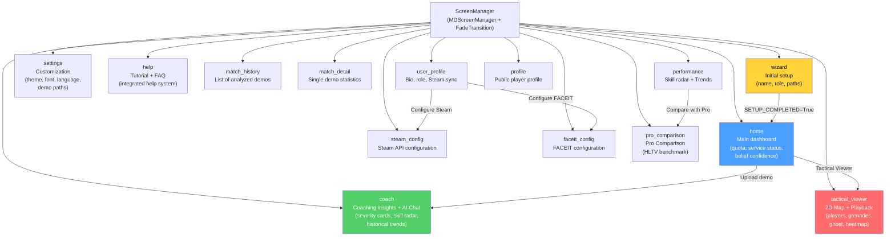

**14 interface screens:**

| Screen | Role | Key components |
| ------ | ---- | -------------- |
| **Wizard** | First-time setup | Player name, role, demo folder paths |
| **Home** | Dashboard | Monthly quota (X/10), service status (green/red), belief confidence (0-1), active tasks, processed matches counter |
| **Coach** | Coaching insights | Color-coded cards by severity, multi-dimensional skill radar, historical trends, AI chat (Ollama/Claude), active tasks |
| **Tactical Viewer** | Tactical playback | 2D map with players/grenades/ghost, timeline with event markers, CT/T player sidebar, speed controls (0.25x→8x) |
| **Settings** | Customization | Theme (CS2/CSGO/CS1.6), font, text size, language, demo paths, wallpaper |
| **Help** | User support | Interactive tutorial, FAQ, troubleshooting |
| **Match History** | Match archive | List of analyzed demos with filters and sorting |
| **Match Detail** | Match detail | Detailed statistics for a single analyzed demo |
| **Performance** | Progress | 5-axis skill radar, trend charts, temporal comparisons |
| **User Profile** | User profile | Bio, preferred role, Steam/FACEIT sync |
| **Profile** | Public profile | Public player profile view |
| **Steam Config** | Steam configuration | Entering and validating Steam API key |
| **Pro Comparison** | Pro comparison | User statistics comparison with HLTV pro players, performance benchmark |
| **FACEIT Config** | FACEIT configuration | Entering and validating FACEIT API key |

> **Home Screen Analogy:** The Home is like the **command deck of a spaceship**. The quota indicator ("5/10 demos this month") is the **fuel gauge**. The service status (green/red) is the **vital systems panel**: green = all systems operational, red = alarm. Belief confidence (0.0-1.0) is the **AI stability level**: 0.0 = the AI knows nothing, 1.0 = the AI is confident in its analyses. The processed matches counter is the **odometer**: how far the system has traveled.

**Custom widgets:**

| Widget | File | Function |
| ------ | ---- | -------- |
| `PlayerSidebar` | `player_sidebar.py` | CT/T list with role icons, health/armor, current weapon, money, and alive/dead status |
| `TacticalMap` | `tactical_map.py` | 2D canvas with multi-layer rendering: map texture → heatmap → players → grenades → ghost (QPainter in Qt, Canvas Kivy in legacy) |
| `Timeline` | `timeline.py` | Horizontal scrubber with tick numbers, color-coded event markers, drag-to-seek, double-click jump |
| `GhostPixel` | `ghost_pixel.py` | Rendering of the semi-transparent ghost circle (optimal position predicted by RAP) |

**Available themes:**

The application supports **3 themes** selectable from the Settings screen, each with a custom color palette and wallpaper:

| Theme | Primary palette | Inspiration |
| ----- | --------------- | ----------- |
| **CS2** (default) | Steel blue + orange | Modern Counter-Strike 2 UI |
| **CSGO** | Military green + yellow | Counter-Strike: Global Offensive |
| **CS 1.6** | Dark brown + lime green | Classic Counter-Strike 1.6 (nostalgia) |

**Coach Screen — Detailed layout:**

The Coach screen is the most complex in the application, with 5 functional areas:

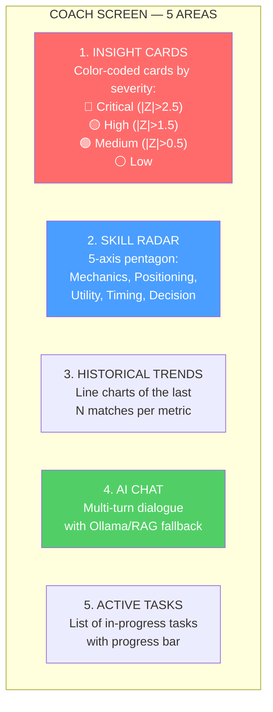

> **Coach Screen Analogy:** The Coach screen is like the **doctor's office after the visit**. The **Insight Cards** are the immediate report: "High blood pressure!" (red), "Cholesterol to monitor" (yellow), "Good physical shape" (green). The **Radar** is the visualization of physical abilities. The **Trends** are the comparison with previous visits. The **AI Chat** is the opportunity to ask the doctor questions. The **Active Tasks** show the exams still in progress.

**MVVM pattern in the Tactical Viewer:**

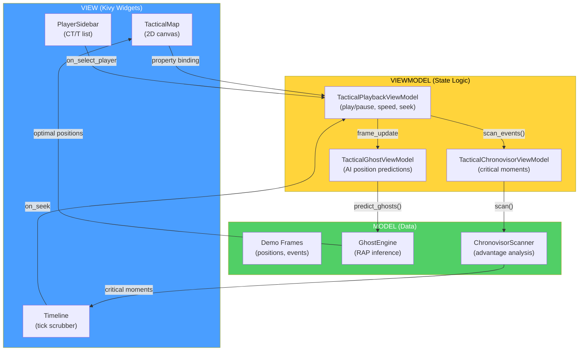

> **MVVM Analogy:** The MVVM pattern is like a **TV newscast**: the **Model** is the reporter in the field who gathers the facts (demo data, AI inference). The **ViewModel** is the editor who organizes the news and decides what's important (playback state, speed, selection). The **View** is the presenter who reads the news to the audience (Kivy on-screen rendering). The reporter doesn't know how the news will be presented. The presenter doesn't know how it was gathered. The editor is the bridge between the two. If you change the presenter (new UI design), the news stays the same.

---

### 12.6 Ingestion Pipeline (`ingestion/`)

**Directory:** `Programma_CS2_RENAN/ingestion/`
**Key files:** `demo_loader.py`, `steam_locator.py`, `integrity.py`, `registry/`, `pipelines/user_ingest.py`, `pipelines/json_tournament_ingestor.py`

The ingestion pipeline is the **complete path** a `.dem` file takes from the filesystem to becoming coaching insights in the database. It is orchestrated by the Scanner daemon (discovery) and the Digester daemon (processing).

> **Analogy:** The ingestion pipeline is like the **journey of a letter through the post office**. (1) The postman (Scanner) collects the letter (.dem file) from the mailbox (demo folder). (2) The sorting office (DemoLoader) opens the envelope and extracts its contents (parsing with demoparser2). (3) The archivist (FeatureExtractor) measures and catalogs every detail (25 features per tick). (4) The historian (RoundStatsBuilder) writes a summary per chapter (per-round statistics). (5) The librarian (data_pipeline) classifies and orders the material (normalization, dataset split). (6) The doctor (CoachingService) examines everything and writes a diagnosis (coaching insights). (7) Finally, everything is archived (database persistence) for future reference.

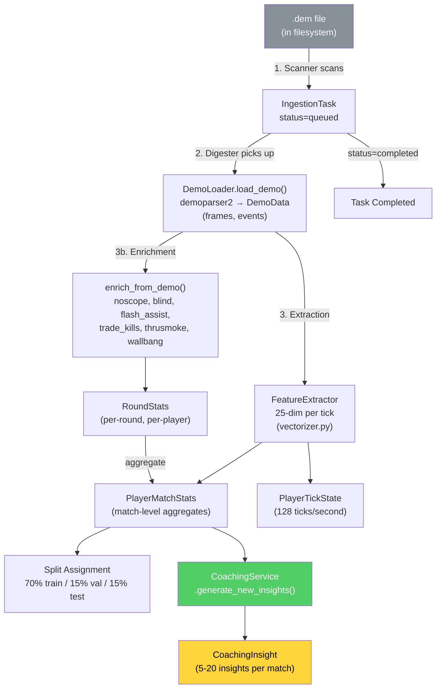

**DemoLoader — The parser at the heart of the pipeline:**

The `DemoLoader` is the wrapper around **demoparser2** (high-performance Rust library) that transforms a binary `.dem` file into Python data structures:

| Parsing Phase | Output | Typical size |
| ------------- | ------ | ------------ |
| 1. Header parsing | Metadata (map, server, duration) | ~100 bytes |
| 2. Frame extraction | List of frames (position, health, weapon per tick) | ~100,000 frames/match |
| 3. Event extraction | List of events (kill, death, bomb_plant, round_start, etc.) | ~500-2,000 events/match |
| 4. Player summary | Aggregated per-player statistics | ~10 records |

**FeatureExtractor** (`backend/processing/feature_engineering/vectorizer.py`):

The FeatureExtractor is the component that transforms raw demo data into **25-dimensional numeric vectors** (`METADATA_DIM=25`) usable by the neural networks. **Important:** these are **tick-level** features (128 Hz), not match-level aggregated statistics. Each individual game frame produces a 25-dim vector that captures the instantaneous state of the player:

| Dim | Feature | Type | Range | Description |
| --- | ------- | ---- | ----- | ----------- |
| 0 | health | Float | [0, 1] | Normalized health |
| 1 | armor | Float | [0, 1] | Normalized armor |
| 2 | has_helmet | Binary | 0/1 | Helmet equipped |
| 3 | has_defuser | Binary | 0/1 | Defuse kit equipped |
| 4 | equipment_value | Float | [0, 1] | Normalized equipment value |
| 5 | is_crouching | Binary | 0/1 | Crouched |
| 6 | is_scoped | Binary | 0/1 | Scope active |
| 7 | is_blinded | Binary | 0/1 | Flashed |
| 8 | enemies_visible | Float | [0, 1] | Visible enemies (normalized, clamped) |
| 9 | pos_x | Float | [-1, 1] | X position (normalized ±pos_xy_extent) |
| 10 | pos_y | Float | [-1, 1] | Y position (normalized ±pos_xy_extent) |
| 11 | pos_z | Float | [0, 1] | Z position (normalized, handles Nuke/Vertigo) |
| 12 | view_x_sin | Float | [-1, 1] | sin(yaw) — cyclic continuity of horizontal angle |
| 13 | view_x_cos | Float | [-1, 1] | cos(yaw) — cyclic continuity of horizontal angle |
| 14 | view_y | Float | [-1, 1] | Normalized pitch (vertical angle) |
| 15 | z_penalty | Float | [0, 1] | Vertical level distinction (floor penalty) |
| 16 | kast_estimate | Float | [0, 1] | KAST estimate (participation ratio) |
| 17 | map_id | Float | [0, 1] | Deterministic map hash |
| 18 | round_phase | Float | {0, 0.33, 0.66, 1} | Economic phase: pistol/eco/force/full_buy |
| 19 | weapon_class | Float | {0–1.0} | Weapon class: 0=knife, 0.2=pistol, 0.4=SMG, 0.6=rifle, 0.8=sniper, 1.0=heavy |
| 20 | time_in_round | Float | [0, 1] | Seconds in round / 115 (clamped) |
| 21 | bomb_planted | Binary | 0/1 | Bomb planted |
| 22 | teammates_alive | Float | [0, 1] | Teammates alive (count / 4) |
| 23 | enemies_alive | Float | [0, 1] | Enemies alive (count / 5) |
| 24 | team_economy | Float | [0, 1] | Team money average / 16000 (clamped) |

**Normalization and bounds:**

Normalization is integrated directly into the FeatureExtractor, with bounds configurable via `HeuristicConfig` (externalized to JSON). The cyclic encoding of view angles (sin/cos for yaw) prevents discontinuities at the 0°/360° boundary. The `z_penalty` automatically distinguishes floors on multi-level maps (Nuke, Vertigo). Weapon class uses an ordinal categorical mapping (6 classes) defined in the `WEAPON_CLASS_MAP` constant (also includes grenades=0.1 and special equipment=0.05).

**Temporal Dataset Split:**

The dataset split follows a strict **chronological ordering** to prevent temporal data leakage:

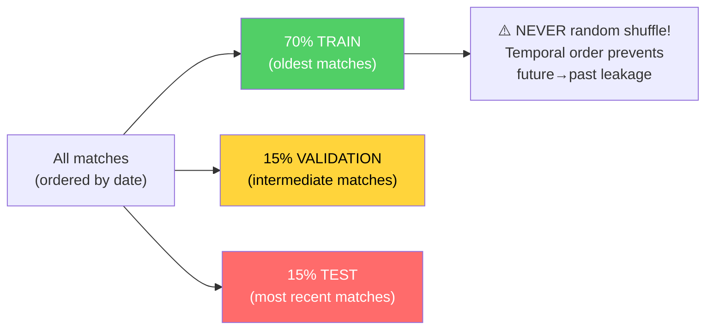

> **Analogy:** The temporal split is like preparing a **fair school exam**. Test questions (15% test) must cover topics taught AFTER the exercises (70% train) and homework (15% val). If the test questions covered topics studied before the exercises, the student (the model) would look better than they really are — a trick, not real knowledge.

> **Feature Vector Analogy:** The 25-dimensional vector is like the **instantaneous reading of 25 sensors** attached to the player at every moment: 5 "body" sensors (health, armor, helmet, defuse kit, equipment value), 3 "postural" sensors (crouched, scoped, flashed), 1 "visual" sensor (visible enemies), 6 "spatial" sensors (X/Y/Z position and view angles sin/cos/pitch), 1 "level" sensor (Z penalty for Nuke/Vertigo), 1 "tactical" sensor (KAST), 3 "contextual" sensors (map, economic phase, weapon class), and 5 "situational" sensors (time in round, bomb planted, teammates/enemies alive, team economy). Unlike match-level aggregated statistics, every tick produces a new vector — 128 readings per second.

**Enrich From Demo — Post-parsing enrichment:**

After base parsing, `enrich_from_demo()` adds advanced metrics computed from events:

| Enriched Metric | Computation | Source |
| --------------- | ----------- | ------ |
| Trade kills | `TradeKillDetector.detect()` with TRADE_WINDOW_TICKS=192 | Kill/death events |
| Flash assists | Count of blinds within time window before a kill | Blind + kill events |
| Noscope kills | Kills with sniper weapon without scope active | Kill event + weapon state |
| Wallbang kills | Kills through penetrable surfaces | Kill event with penetration flag |
| Through-smoke kills | Kills with smoke active in line of fire | Kill event + smoke position |
| Blind kills | Kills while the player is flashed | Kill event + flash state |

**Specific components:**

| Component | File | Role |
| --------- | ---- | ---- |
| **DemoLoader** | `demo_loader.py` | Wraps `demoparser2`, extracts frames and events from the `.dem` file |
| **SteamLocator** | `steam_locator.py` | Automatically locates the CS2 demo folder via Steam registry / libraryfolders.vdf |
| **IntegrityChecker** | `integrity.py` | Verifies that demo files are valid, complete, and not corrupt before parsing |
| **UserIngestPipeline** | `pipelines/user_ingest.py` | Complete pipeline for user demos: parse → enrich → stats → coaching |
| **JsonTournamentIngestor** | `pipelines/json_tournament_ingestor.py` | Imports tournament data from structured JSON files |
| **Registry** | `registry/registry.py` | Tracks all processed demos, prevents duplicates |
| **ResourceManager** | `ingestion/resource_manager.py` | Hardware resource management: CPU/RAM throttling, disk space |
| **JsonTournamentIngestor** | `pipelines/json_tournament_ingestor.py` | Imports tournament data from structured JSON files |
| **RegistryLifecycle** | `registry/lifecycle.py` | Lifecycle management of ingestion records |

**SteamLocator** (`ingestion/steam_locator.py`) — automatic CS2 demo location:

The SteamLocator implements a **cross-platform discovery** algorithm to automatically find the CS2 demo folder:

| Platform | Strategy | Typical path |
| -------- | -------- | ------------ |
| **Windows** | System registry → `libraryfolders.vdf` | `C:\Program Files (x86)\Steam\steamapps\common\Counter-Strike Global Offensive\game\csgo\replays` |
| **Linux** | `~/.steam/steam/` → `libraryfolders.vdf` | `~/.steam/steam/steamapps/common/...` |
| **Fallback** | Prompts user via UI Settings | Custom path |

**IntegrityChecker** (`ingestion/integrity.py`):

Preliminary check of each demo file before expensive parsing:
- **Magic bytes**: `PBDEMS2\0` (CS2 Source 2) or `HL2DEMO\0` (legacy Source 1)
- **Size bounds**: minimum 1KB (not empty), maximum 5GB (not corrupt/excessive)
- **Read test**: attempts to read the first N bytes to verify the file is accessible

> **SteamLocator Analogy:** The SteamLocator is like a **bloodhound that sniffs out the CS2 folder** on your computer. It knows Steam stores its libraries in specific places (Windows registry, `libraryfolders.vdf` on Linux/Mac), and follows the trail to the `csgo/replays` folder where demos are saved. If it can't find it automatically, it asks the user to indicate the path manually — but in most cases, it finds it on its own.

---

### 12.7 Unified Control Console (`backend/control/`)

**File:** `Programma_CS2_RENAN/backend/control/console.py`, `ingest_manager.py`, `db_governor.py`, `ml_controller.py`

The Console is a **Singleton** that serves as a central coordination point for all backend subsystems. It is the "control panel" through which every part of the system can be controlled.

> **Analogy:** The Console is like the **control tower of an airport**. It has 4 screens: one for the radar (ServiceSupervisor — monitors running services), one for the runways (IngestionManager — coordinates demo arrival), one for maintenance (DatabaseGovernor — verifies storage integrity), and one for pilot training (MLController — manages the machine learning lifecycle). The air traffic controller (Console Singleton) coordinates everything from a single station.

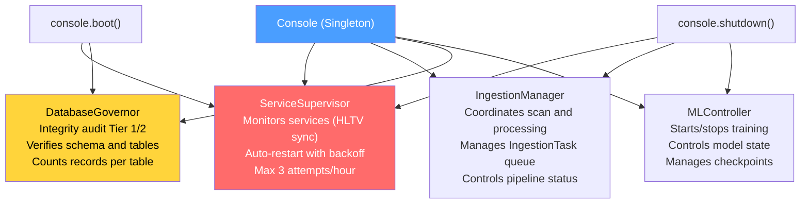

**Console boot sequence:**

1. `ServiceSupervisor` starts the "hunter" service (HLTV sync) as a monitored process
2. `DatabaseGovernor` performs an integrity audit: verifies all tables, counts records, checks schema
3. `MLController` remains on standby — training is handled by the Teacher daemon
4. `IngestionManager` stays idle — active work is handled by the Scanner/Digester daemons

**MLControlContext — Live Training Control:**

The `MLController` uses a control token called `MLControlContext` (`backend/control/ml_controller.py`) that is passed to training cycles to enable **real-time intervention** by the operator. This replaces the previous approach based on `StopIteration` with a more robust thread-safe system.

> **Analogy:** MLControlContext is like the **remote control of a video player**. The operator can press **Pause** (training stops immediately, without data loss), **Play** (training resumes from the exact point where it stopped), **Stop** (training terminates with a controlled `TrainingStopRequested` exception), or adjust the **speed** (throttle: 0.0 = max speed, 1.0 = max delay). The mechanism uses `threading.Event` to avoid busy-wait during pause — the training thread simply sleeps until it receives the resume signal.

```mermaid
flowchart LR
    OP["Operator"] -->|"request_pause()"| CTX["MLControlContext"]
    OP -->|"request_resume()"| CTX
    OP -->|"request_stop()"| CTX
    OP -->|"set_throttle(0.5)"| CTX
    CTX -->|"check_state()<br/>in every batch"| LOOP["Training Loop"]
    LOOP -->|"Pause: Event.wait()"| PAUSE["Training Suspended<br/>(no busy-wait)"]
    LOOP -->|"Stop: raise<br/>TrainingStopRequested"| STOP["Training Terminated<br/>(checkpoint saved)"]
    style CTX fill:#4a9eff,color:#fff
    style PAUSE fill:#ffd43b,color:#000
    style STOP fill:#ff6b6b,color:#fff
```

| Command | Method | Effect |
| ------- | ------ | ------ |
| **Pause** | `request_pause()` | `_resume_event.clear()` → blocks `check_state()` |
| **Resume** | `request_resume()` | `_resume_event.set()` → unblocks training |
| **Stop** | `request_stop()` | Raises `TrainingStopRequested` (custom exception) |
| **Throttle** | `set_throttle(factor)` | Adds `time.sleep(factor)` after each batch |

---

### 12.8 Onboarding and New User Flow

**File:** `Programma_CS2_RENAN/backend/onboarding/new_user_flow.py`

The `OnboardingManager` guides new users through a **3-phase progression** that automatically adapts to the amount of available data.

> **Analogy:** Onboarding is like the **tutorial of an RPG video game**. When you start a new game (no demos loaded), the game guides you step by step: "Welcome, adventurer! Upload your first demo to begin." After 1-2 demos, the system says: "Good start! Upload N more to unlock stable analysis." After 3+ demos, the system announces: "Your coach is ready! Personalized analyses are now active." Each phase gradually unlocks the program's features, preventing the system from displaying unreliable results when it doesn't have enough data.

```mermaid
stateDiagram-v2
    [*] --> AWAITING: 0 demos loaded
    AWAITING --> BUILDING: 1-2 demos loaded
    BUILDING --> READY: 3+ demos loaded

    state AWAITING {
        AW: Message: Welcome! Upload your first demo.
        note right of AW: No analysis available
    }
    state BUILDING {
        BU: Message: Upload N more demos for stable baseline.
        note right of BU: Partial analysis available
    }
    state READY {
        RE: Message: Coach ready! Personalized analysis active.
        note right of RE: All features unlocked
    }
```

**Wizard Screen (First-time Setup):**

On first run (`SETUP_COMPLETED = False`), the user is guided through the Wizard:

1. **Player name** — The name that will appear in analyses
2. **Preferred role** — Entry Fragger, AWPer, Lurker, Support, or IGL
3. **Demo folder paths** — Where the system automatically looks for demos
4. On completion: `SETUP_COMPLETED = True`, redirect to Home

**Quota cache (Task 2.16.1):** The demo count is cached for 60 seconds to avoid repeated DB queries. `invalidate_cache()` is called after every new upload, ensuring the UI always shows the correct count without overloading the database.

**Help System** (`backend/knowledge/help_system.py`):

The integrated help system provides contextual support to the user:

| Feature | Implementation |
| ------- | -------------- |
| **Interactive tutorial** | Step-by-step guides for the main features |
| **Contextual FAQ** | Frequently asked questions filtered by current screen |
| **Troubleshooting** | Decision tree for common problems (Steam path not found, demo not parsed, empty coaching) |
| **Tooltips** | Inline explanations for complex metrics (KAST, HLTV 2.0 Rating, ADR) |

> **Analogy:** The Help System is like having a **librarian assistant** always available. If you're in the "Fiction" section (Tactical Viewer), it helps you with map reading questions. If you're in "Science" (Coach), it explains what the metrics mean. If something doesn't work, it guides you step by step through troubleshooting — like a flow chart "If the faucet doesn't give water → check the valve → check the pipe → call the plumber."

---

### 12.9 Storage Architecture (`backend/storage/`)

**Directory:** `Programma_CS2_RENAN/backend/storage/`
**Key files:** `database.py`, `db_models.py`, `match_data_manager.py`, `storage_manager.py`, `maintenance.py`, `state_manager.py`, `stat_aggregator.py`, `backup.py`

The storage system uses a **three-tier storage** architecture based on SQLite in WAL mode (Write-Ahead Logging), which enables concurrent reads and writes without blocking.

> **Analogy:** The storage architecture is like a **3-level library system**. The **ground floor** (`database.db`, 18 tables) holds the general catalog, all readers' (players') cards, the tactical knowledge base (RAG), the COPER experience bank, the critics' reviews (coaching insights), and the loan register (ingestion tasks) — all in one large filing cabinet always available. The **separate filing cabinet** (`hltv_metadata.db`, 3 tables) contains the pro player profiles and their statistics — separated because it is updated by a different process (HLTV sync) to avoid lock contention. Beyond these, the **per-match databases** (`match_XXXX.db`) contain the full original manuscripts (tick-by-tick match data) — each in a separate box to prevent the main filing cabinet from becoming too heavy. WAL mode is like having a **revolving door**: many people can enter to read at the same time, and someone can write without blocking the entrance.

```mermaid
flowchart TB
    subgraph T12["database.db (Monolith SQLite WAL — 18 tables)"]
        PMS["PlayerMatchStats<br/>(32 fields per player/match)"]
        CS["CoachState<br/>(global system state)"]
        IT["IngestionTask<br/>(work queue)"]
        CI["CoachingInsight<br/>(generated advice)"]
        PP["PlayerProfile<br/>(user profile)"]
        TK["TacticalKnowledge<br/>(RAG base 384-dim)"]
        CE["CoachingExperience<br/>(COPER experience bank)"]
        RS["RoundStats<br/>(per-round statistics)"]
        SN["ServiceNotification<br/>(system alerts)"]
        EXT["Ext_PlayerPlaystyle +<br/>Ext_TeamRoundStats"]
        CALIB_ST["CalibrationSnapshot +<br/>RoleThresholdRecord"]
        MATCH_ST["MatchResult + MapVeto"]
        DL_ST["DataLineage<br/>(append-only provenance)"]
        DQM_ST["DataQualityMetric<br/>(append-only quality metrics)"]
    end
    subgraph T_HLTV["hltv_metadata.db (Pro Data — 3 tables)"]
        PRO["ProPlayer + ProTeam +<br/>ProPlayerStatCard"]
    end
    subgraph T3["match_XXXX.db (Per-Match SQLite)"]
        PTS["PlayerTickState<br/>(~100,000 rows per match)<br/>Position, health, weapon<br/>every 1/128 second"]
    end
    T12 -->|"Reference"| T3
    T_HLTV -->|"Pro baseline for<br/>coaching comparison"| T12

    style T12 fill:#4a9eff,color:#fff
    style T_HLTV fill:#ffd43b,color:#000
    style T3 fill:#868e96,color:#fff
```

**The 21 SQLModel tables:**

| # | Table | Database | Category | Description |
| - | ----- | -------- | -------- | ----------- |
| 1 | `PlayerMatchStats` | database.db | Core | Aggregated per-player/match statistics (32 fields) |
| 2 | `PlayerTickState` | database.db | Core | Per-tick state (128 Hz), also archived in separate per-match DBs |
| 3 | `PlayerProfile` | database.db | User | User profile (name, role, Steam ID, monthly quota) |
| 4 | `RoundStats` | database.db | Core | Per-round isolated statistics (kills, rating, enrichment) |
| 5 | `CoachingInsight` | database.db | Coaching | Advice generated by the coaching service |
| 6 | `CoachingExperience` | database.db | Coaching | COPER experience bank (context, outcome, effectiveness, TrueSkill μ/σ, replay priority — KT-01) |
| 7 | `IngestionTask` | database.db | System | Work queue for the Digester daemon |
| 8 | `CoachState` | database.db | System | Global state (training metrics, heartbeat, status) |
| 9 | `ServiceNotification` | database.db | System | Error/event messages from daemons → UI |
| 10 | `TacticalKnowledge` | database.db | Knowledge | RAG base (384-dim embedding in JSON) |
| 11 | `ProPlayer` | hltv_metadata.db | Pro | Pro player profiles |
| 12 | `ProTeam` | hltv_metadata.db | Pro | Pro team metadata |
| 13 | `ProPlayerStatCard` | hltv_metadata.db | Pro | Seasonal statistics per pro player |
| 14 | `Ext_PlayerPlaystyle` | database.db | External | Playstyle data from CSV (for NeuralRoleHead) |
| 15 | `Ext_TeamRoundStats` | database.db | External | External tournament statistics |
| 16 | `MatchResult` | database.db | Matches | Match outcomes |
| 17 | `MapVeto` | database.db | Matches | Map selection history |
| 18 | `CalibrationSnapshot` | database.db | System | Belief model calibration log (timestamp, samples, outcome) |
| 19 | `RoleThresholdRecord` | database.db | System | Learned thresholds for role classification (persistent across restarts) |
| 20 | `DataLineage` | database.db | Provenance | Append-only data provenance log: entity_type, entity_id, source_demo, pipeline_version, processing_step |
| 21 | `DataQualityMetric` | database.db | Provenance | Append-only quality metrics per run: run_id, run_type, metric_name, metric_value, sample_count |

**Support enums (not tables):**

| Enum | Type | Description |
| ---- | ---- | ----------- |
| `DatasetSplit` | `str, Enum` | Split categories (train/val/test/unassigned) — used as constraint on `PlayerMatchStats.dataset_split` |
| `CoachStatus` | `str, Enum` | Coach states (Paused/Training/Idle/Error) — used as constraint on `CoachState.status` |

**Detailed Storage Components:**

**MatchDataManager** (`backend/storage/match_data_manager.py`) — the largest component of the storage layer:

The MatchDataManager is responsible for managing high-density per-match data (PlayerTickState with ~100,000 rows per match). To prevent the main database from growing uncontrollably, each match has its own separate SQLite database (`match_XXXX.db`).

| Method | Description |
| ------ | ----------- |
| `create_match_db(demo_name)` | Creates a new per-match database with `PlayerTickState` schema |
| `store_tick_data(demo_name, ticks)` | Bulk insert of tick data into the dedicated DB |
| `load_match_frames(demo_name)` | Loads all frames for the Tactical Viewer |
| `get_match_db_path(demo_name)` | Resolves the path of the per-match DB |
| `list_available_matches()` | Lists all matches with DB available |
| `delete_match_data(demo_name)` | Removes the per-match DB and updates the registry |
| `get_match_statistics(demo_name)` | Computes aggregate statistics from tick data |

> **Analogy:** The MatchDataManager is like an **archivist who manages the original manuscript boxes**. Each match is a manuscript too bulky to fit in the general filing cabinet (database.db), so it is kept in a separate box with a label (match_XXXX.db). The archivist knows exactly where every box is, can open it on request, and when the box becomes too old, can move it to cold storage.

**StorageManager** (`backend/storage/storage_manager.py`):

The StorageManager is the **high-level storage coordinator** that manages quotas, uploads, and data lifecycle:

| Responsibility | Implementation |
| -------------- | -------------- |
| **Monthly quota** | `can_user_upload()` → checks `MAX_DEMOS_PER_MONTH=10` and `MAX_TOTAL_DEMOS=100` |
| **Upload flow** | `handle_demo_upload(path)` → validation → copy to working dir → create IngestionTask |
| **Cleanup** | `cleanup_old_data(days)` → removes old match DBs and tasks |
| **Disk space** | `get_storage_usage()` → reports size for each database and directory |

**StateManager** (`backend/storage/state_manager.py`):

The StateManager is a **Singleton** that maintains the system's runtime state and persists it to the database via the `CoachState` table:

| Method | Purpose |
| ------ | ------- |
| `update_status(daemon, text)` | Updates the state of a specific daemon |
| `heartbeat()` | Updates the `last_heartbeat` timestamp |
| `get_state()` | Returns the current state as a `CoachState` object |
| `set_error(daemon, message)` | Registers an error for a daemon with timestamp |
| `update_training_metrics(epoch, loss, val_loss, eta)` | Updates training metrics in real time |
| `get_belief_confidence()` | Returns the belief model's confidence level (0.0-1.0) |

**StatAggregator** (`backend/storage/stat_aggregator.py`):

Computes aggregate statistics from raw per-round data:

| Aggregation | Formula | Use |
| ----------- | ------- | --- |
| `avg_kills` | `mean(RoundStats.kills)` | Dashboard, radar chart |
| `avg_adr` | `mean(RoundStats.damage_dealt / rounds)` | Pro comparison |
| `avg_kast` | `mean(rounds_with_kast / total_rounds)` | HLTV metric |
| `accuracy` | `sum(hits) / sum(shots_fired)` | Mechanical performance |
| `trade_kill_rate` | `trade_kills / team_deaths` | Team play |

**BackupManager** (`backend/storage/backup.py`):

| Feature | Detail |
| ------- | ------ |
| **Daily rotation** | 7 copies — the oldest is overwritten |
| **Weekly rotation** | 4 copies — additional weekly backup |
| **Automatic trigger** | On Session Engine startup via `should_run_auto_backup()` |
| **Manual trigger** | Via Console or UI Settings |
| **Format** | Full copy of the `.db` file (not SQL dump) |
| **Labeling** | `startup_auto`, `manual`, `pre_migration` |

**Maintenance** (`backend/storage/maintenance.py`):

| Operation | Frequency | Purpose |
| --------- | --------- | ------- |
| `vacuum()` | Monthly | Compacts the database, reclaims space from deleted records |
| `analyze()` | After every bulk insert | Updates SQLite query optimizer statistics |
| `wal_checkpoint()` | On startup | Forces merge of WAL into the main database |
| `integrity_check()` | On startup | `PRAGMA integrity_check` — verifies structural consistency |

**DbMigrate** (`backend/storage/db_migrate.py`):

Wrapper around Alembic that automates the execution of migrations:

```mermaid
flowchart LR
    BOOT["main.py (Phase 3)"]
    BOOT --> CHECK["db_migrate.check_pending()"]
    CHECK -->|"Pending migrations"| APPLY["alembic.upgrade('head')"]
    CHECK -->|"Schema up-to-date"| SKIP["No action"]
    APPLY --> VERIFY["Verify schema post-migration"]
    VERIFY -->|"OK"| CONTINUE["Continue startup"]
    VERIFY -->|"Error"| ABORT["TERMINATION<br/>Incompatible schema"]
    style CONTINUE fill:#51cf66,color:#fff
    style ABORT fill:#ff6b6b,color:#fff
```

**Connection Pooling and Concurrency:**

| Parameter | Value | Purpose |
| --------- | ----- | ------- |
| `check_same_thread` | `False` | Enables multi-thread access |
| `timeout` | 30 seconds | Busy timeout for WAL contention |
| `pool_size` | 1 | Single SQLite writer (single-writer safety) |
| `max_overflow` | 4 | Overflow connections for load spikes |
| WAL mode | Enabled | Unlimited concurrent reads |

---

### 12.10 Playback Engine and Tactical Viewer

**File:** `Programma_CS2_RENAN/core/playback.py`, `playback_engine.py`, `apps/desktop_app/tactical_viewer_screen.py`, `tactical_map.py`, `timeline.py`, `player_sidebar.py`

The tactical playback system allows the user to **relive their matches** on an interactive 2D map, with AI overlay (optimal ghost position), event markers (kills, bomb plants), and full playback controls.

> **Analogy:** The Tactical Viewer is like a **professional-grade sports replay system**. Imagine being able to watch your soccer matches from the perspective of an aerial drone, with the ability to slow down, speed up, pause, and with an AI assistant showing you "where you should have been" as a transparent shadow on the field. Additionally, a smart timeline automatically highlights the key moments: "Minute 23:15 — you lost the advantage here" (red marker) or "Minute 34:02 — excellent play!" (green marker). You can click on any marker and the replay jumps directly to that moment.

```mermaid
flowchart TB
    subgraph VIEWER["TACTICAL VIEWER — COMPONENTS"]
        MAP["TacticalMap (QPainter Qt / Canvas Kivy)<br/>2D rendering: players (color circles),<br/>grenades (HE/molotov/smoke/flash overlay),<br/>heatmap (Gaussian heat background),<br/>AI ghost (transparent circle optimal position)"]
        TIMELINE["Timeline (Scrubber)<br/>Scroll bar with tick numbers,<br/>event markers (kills, plants),<br/>drag to seek, double-click to jump"]
        SIDEBAR["PlayerSidebar (CT + T)<br/>Player list per team,<br/>health, armor, weapon, money,<br/>selected player highlighted"]
        CONTROLS["Playback Controls<br/>Play/Pause, speed (0.25x → 8x),<br/>round/segment selector,<br/>ghost toggle on/off"]
    end
    subgraph ENGINE["ENGINES"]
        PBE["PlaybackEngine<br/>Frame rate 60 FPS,<br/>interpolation between 64-tick frames,<br/>variable speed management"]
        GE["GhostEngine<br/>Real-time RAP inference,<br/>optimal_pos delta × 500.0,<br/>fallback (0.0, 0.0) on error"]
        CS["ChronovisorScanner<br/>Temporal advantage analysis,<br/>critical moment detection,<br/>play/error classification"]
    end
    MAP --> PBE
    TIMELINE --> PBE
    SIDEBAR --> PBE
    CONTROLS --> PBE
    PBE --> GE
    PBE --> CS
    GE -->|"ghost positions"| MAP
    CS -->|"event markers"| TIMELINE

    style MAP fill:#4a9eff,color:#fff
    style GE fill:#ff6b6b,color:#fff
    style CS fill:#51cf66,color:#fff
```

**PlaybackEngine — Internal architecture:**

The PlaybackEngine handles frame-by-frame playback with temporal interpolation. In the Qt implementation, the update timer uses `QTimer` instead of `Kivy Clock.schedule_interval`, keeping the same interpolation and buffering logic:

| Feature | Detail |
| ------- | ------ |
| **Frame rate** | 60 FPS (interpolation from demo's native 64-tick) |
| **Variable speed** | 0.25x (slow-mo), 0.5x, 1x (normal), 2x, 4x, 8x (fast-forward) |
| **Interpolation** | Linear between adjacent frames for smooth movement |
| **Buffering** | Pre-loads 120 frames ahead to avoid lag |
| **Seek** | Direct access to any tick via index |
| **Round selection** | Jumps directly to the start of a specific round |

**GhostEngine — Real-time inference:**

The GhostEngine is the component that transforms the RAP Coach's predictions into **ghost positions visible on the map**:

```mermaid
flowchart LR
    FRAME["Current frame<br/>(player positions)"]
    FRAME --> EXTRACT["Extract feature vector<br/>(vectorizer.py, 25-dim)"]
    EXTRACT --> RAP["RAP Coach forward()<br/>→ optimal_position_delta"]
    RAP --> SCALE["Scale delta × 500.0<br/>(CS2 world units)"]
    SCALE --> POS["Ghost position =<br/>current_position + scaled_delta"]
    POS --> RENDER["Rendering semi-transparent<br/>circle on map"]
    RAP -->|"Error/Model missing"| FALLBACK["Fallback: (0.0, 0.0)<br/>No ghost shown"]
    style RAP fill:#ff6b6b,color:#fff
    style RENDER fill:#51cf66,color:#fff
    style FALLBACK fill:#868e96,color:#fff
```

> **GhostEngine Analogy:** The ghost is like an **invisible coach** running on the field next to you. He watches the same match you watch, but he knows the optimal position where you should be. His semi-transparent shadow on the map says: "You would have been safer and more effective here." The ×500.0 factor converts the model's small deltas (numbers between -1 and +1) into real distances on the map (hundreds of world units). If the model isn't loaded, the ghost simply disappears — it doesn't show wrong positions.

**ChronovisorScanner — Critical moment detection:**

The ChronovisorScanner analyzes the entire match and identifies the **decisive moments** based on advantage change:

| Moment type | Condition | Marker color |
| ----------- | --------- | ------------ |
| **Critical error** | Death while in numerical advantage (e.g., 4v3 → 3v3) | 🔴 Red |
| **Excellent play** | Kill while in numerical disadvantage (e.g., 2v3 → 2v2) | 🟢 Green |
| **Bomb plant** | bomb_planted event with timer | 🟡 Yellow |
| **Clutch** | 1vN victory (N ≥ 2) | ⭐ Gold |
| **Eco round win** | Victory with equipment < $2,000 | 🔵 Blue |

Each moment is placed on the Timeline as a clickable marker. Clicking jumps playback directly to that tick.

**Viewer loading flow (One-Click):**

1. The user clicks "Tactical Viewer" from Home
2. If no demo is loaded → `trigger_viewer_picker()` automatically opens the file picker
3. The user selects a `.dem` file
4. A "Dynamic 2D Reconstruction in Progress..." dialog appears
5. A background thread runs `_execute_viewer_parse(path)` → `DemoLoader.load_demo()`
6. On completion: dialog dismissal, loading frames into PlaybackEngine
7. The map is rendered with players at frame 0

---

### 12.11 Spatial Data and Map Management

**File:** `Programma_CS2_RENAN/core/spatial_data.py`, `spatial_engine.py`, `data/map_config.json`

The map management system translates **CS2 world coordinates** (typical values: -2000 to +2000 on X/Y) into **pixel coordinates** on the map texture (0.0 to 1.0 normalized), and vice versa.

> **Analogy:** Map management is like a **GPS system for the CS2 world**. Each map has its "cartographic projection": an origin point (top-left corner), a scale (how many game units per pixel), and, for multi-level maps like Nuke, a **floor separator** (z_cutoff = -495 for Nuke). The GPS knows that if your Z coordinate is above -495, you're on the upper floor, otherwise you're on the lower one. This information is crucial for the GhostEngine and for correct rendering on the tactical map.

```mermaid
flowchart LR
    WORLD["CS2 World Coordinates<br/>(pos_x=-1200, pos_y=800, pos_z=100)"]
    WORLD -->|"MapMetadata.world_to_radar()"| NORM["Normalized Coordinates<br/>(0.35, 0.62)"]
    NORM -->|"× texture size"| PIXEL["Pixel Coordinates<br/>(224px, 397px)"]
    PIXEL -->|"canvas rendering"| MAP["Point on 2D Map"]

    MAP -->|"user click"| PIXEL2["Clicked Pixel"]
    PIXEL2 -->|"MapMetadata.radar_to_world()"| WORLD2["World Coordinates<br/>(for AI query)"]

    style WORLD fill:#ff6b6b,color:#fff
    style NORM fill:#ffd43b,color:#000
    style MAP fill:#51cf66,color:#fff
```

**MapMetadata** (immutable dataclass for each map):

| Field | Example (Dust2) | Purpose |
| ----- | --------------- | ------- |
| `pos_x` | -2476 | X of top-left corner in world units |
| `pos_y` | 3239 | Y of top-left corner in world units |
| `scale` | 4.4 | Game units per texture pixel |
| `z_cutoff` | `None` | Level separator (multi-level maps only) |
| `level` | `"single"` | Type: "single", "upper", "lower" |
| `texture_width` | 1024 | Radar texture width in pixels |
| `texture_height` | 1024 | Radar texture height in pixels |

**MapManager** (`core/map_manager.py`):

The MapManager is the high-level component that coordinates map loading for the interface:

| Method | Purpose |
| ------ | ------- |
| `get_map_metadata(map_name)` | Returns MapMetadata for the requested map |
| `load_radar_texture(map_name)` | Loads PNG texture of the radar map from cache or disk |
| `get_available_maps()` | List of supported maps with metadata |
| `world_to_pixel(pos, map_name)` | Shortcut for world → pixel coordinate conversion |

**Supported multi-level maps:**

| Map | z_cutoff | Levels | Notes |
| --- | -------- | ------ | ----- |
| **Nuke** | -495 | upper / lower | Two plant sites on different floors |
| **Vertigo** | 11700 | upper / lower | Skyscraper with two playable areas |
| All others | `None` | single | Single-level maps |

**SpatialEngine** (`core/spatial_engine.py`):

The SpatialEngine adds **spatial reasoning** capabilities to the base coordinate system:

| Method | Input | Output | Use |
| ------ | ----- | ------ | --- |
| `distance_2d(pos_a, pos_b)` | Two world coordinates | Float (world units) | Engagement distance computation |
| `is_visible(pos_a, pos_b, obstacles)` | Two pos + obstacles | Bool | Line of sight (simplified) |
| `get_zone(pos, map_name)` | Coordinate + map | String (e.g., "A_site") | Tactical zone classification |
| `nearest_cover(pos, map_name)` | Coordinate + map | Cover coordinate | Positional suggestion |

**AssetManager** (`core/asset_manager.py`):

Handles loading of map textures and UI assets:

| Asset | Format | Typical size | Cache |
| ----- | ------ | ------------ | ----- |
| Map texture (radar) | PNG 1024×1024 | ~500KB | Yes (in-memory) |
| Player icons | PNG 32×32 | ~2KB | Yes |
| Fonts (JetBrains Mono, YUPIX) | TTF | ~200KB | Yes (registered in Kivy) |
| Theme wallpapers | PNG 1920×1080 | ~2MB | Lazy load |

> **AssetManager Analogy:** The AssetManager is like the **theater warehouseman**. He knows exactly where all the props (textures, fonts, icons) are kept, loads them on demand, and keeps the most used in his **pocket** (cache) to avoid having to go back to the warehouse every time. If an asset doesn't exist, it returns a generic placeholder — the show must go on.

---

### 12.12 Observability and Logging

**File:** `Programma_CS2_RENAN/observability/logger_setup.py`
**Related files:** `backend/storage/state_manager.py`, `backend/services/telemetry_client.py`

The observability system ensures that every significant event is **traceable, structured, and persistent**. The telemetry client (`telemetry_client.py`) uses **`httpx`** (asynchronous HTTP) for non-blocking sending of metrics and events, avoiding network latency affecting application performance.

> **Analogy:** Observability is like the **security camera system and registers of a building**. Structured logging (`get_logger()`) is the camera that records everything with timestamps and labels ("who did what, where, and when"). The StateManager is the **lobby whiteboard** showing the current status of every floor (daemon): "Floor 1 (Scanner): Scanning. Floor 2 (Digester): Idle. Floor 3 (Teacher): Learning." ServiceNotifications are the **intercom announcements** that inform residents (the user) of important events or errors.

```mermaid
flowchart TB
    subgraph LOG["STRUCTURED LOGGING"]
        GL["get_logger(name)<br/>→ logging.Logger"]
        GL --> FILE["FileHandler<br/>logs/cs2_analyzer.log<br/>(append mode)"]
        GL --> CON["ConsoleHandler<br/>(WARNING+ only)"]
        FILE --> FMT["Format: TIMESTAMP | LEVEL | NAME | MESSAGE"]
    end
    subgraph STATE["STATE MANAGER"]
        SM["StateManager (Singleton)"]
        SM --> US["update_status(daemon, text)"]
        SM --> HB["heartbeat()"]
        SM --> GS["get_state() → CoachState"]
        SM --> SE["set_error(daemon, message)"]
    end
    subgraph NOTIFY["NOTIFICATIONS"]
        SN["ServiceNotification"]
        SN --> UI["Displayed in UI<br/>(badge, toast)"]
    end
    LOG --> STATE
    STATE --> NOTIFY

    style LOG fill:#4a9eff,color:#fff
    style STATE fill:#ffd43b,color:#000
    style NOTIFY fill:#ff6b6b,color:#fff
```

**Daemons monitored by StateManager:**

| Daemon | Field in CoachState | Typical values |
| ------ | ------------------- | -------------- |
| Scanner | `hltv_status` | "Scanning", "Paused", "Error" |
| Digester (worker) | `ingest_status` | "Processing", "Idle", "Error" |
| Teacher (trainer) | `ml_status` | "Learning", "Idle", "Error" |
| Global | `status` | "Paused", "Training", "Idle", "Error" |

**Sentry Integration** (`observability/sentry_setup.py`):

The system includes optional integration with **Sentry** for remote error tracking, with a **double opt-in** approach for privacy:

| Feature | Implementation |
| ------- | -------------- |
| **Double opt-in** | The user must (1) set `SENTRY_DSN` as an environment variable AND (2) activate the flag in settings |
| **PII Scrubbing** | All personal data (player names, Steam IDs, paths) are removed before sending |
| **Breadcrumb sanitization** | Navigation breadcrumbs are cleaned of sensitive information |
| **Non-blocking** | If Sentry is not configured, the system continues normally (Phase 4 of startup) |
| **Enriched context** | Every error includes: app version, daemon state, demo count, operating system |

> **Analogy:** Sentry is like an **optional telemedicine service**. If you enable it (double opt-in), when your body (the application) has a serious malfunction, it automatically sends an anonymized report to the remote doctor (Sentry server). The report doesn't contain your name or address (PII scrubbing) — only the symptoms and circumstances of the incident. If you prefer total privacy, you don't enable the service and everything stays local.

**Logger Setup** (`observability/logger_setup.py`):

The centralized logging system provides structured logs with:

| Feature | Detail |
| ------- | ------ |
| **Format** | `TIMESTAMP | LEVEL | LOGGER_NAME | MESSAGE` |
| **File handler** | `logs/cs2_analyzer.log` (append mode, automatic rotation) |
| **Console handler** | Only `WARNING+` to avoid polluting output |
| **Naming convention** | `get_logger("cs2analyzer.<module>")` — hierarchical namespace |
| **Levels used** | `DEBUG` (development), `INFO` (normal operations), `WARNING` (non-critical anomalies), `ERROR` (failures), `CRITICAL` (termination) |

**Training metrics exposed in CoachState:** `current_epoch`, `total_epochs`, `train_loss`, `val_loss`, `eta_seconds`, `belief_confidence`, `system_load_cpu`, `system_load_mem`.

> **Analogy:** Training metrics are like a **car's instrument panel during a race**: the current epoch is the **odometer** (how far you've come), train_loss is the **fuel consumption** (lower = more efficient), val_loss is the **lap timer** (your time on the test track), and ETA is the **GPS** estimating how far to destination. The user can see all this in real time on the Home screen, updated every 10 seconds.

---

### 12.13 Reporting and Visualization

**File:** `Programma_CS2_RENAN/reporting/visualizer.py`, `report_generator.py`
**Related files:** `backend/processing/heatmap_engine.py`

The reporting system transforms raw data into **understandable visualizations** for the user.

> **Analogy:** The reporting system is like a **graphic designer** who takes dry numbers and transforms them into colorful posters and infographics. The **Visualizer** creates radar charts (pentagons showing your 5 skills vs pros), trend charts (how you're improving over time), and comparison tables. The **HeatmapEngine** creates heat maps (where you stay too much vs where you should be). The **ReportGenerator** assembles everything into a complete PDF document, like a medical report that the "patient" (player) can study carefully.

```mermaid
flowchart TB
    DATA["Data from Database<br/>(PlayerMatchStats,<br/>RoundStats, CoachingInsight)"]
    DATA --> VIS["Visualizer<br/>Skill radar (5 axes),<br/>historical trends (line charts),<br/>pro comparisons (tables)"]
    DATA --> HM["HeatmapEngine<br/>Gaussian heat maps,<br/>differential heatmaps (you vs pro),<br/>hotspot detection"]
    DATA --> RG["ReportGenerator<br/>Complete PDF assembly,<br/>professional formatting,<br/>disk export"]
    VIS --> UI["Displayed in UI<br/>(coach screen, performance)"]
    HM --> TV["TacticalMap Overlay<br/>(tactical viewer)"]
    RG --> PDF["PDF File<br/>(exportable)"]

    style VIS fill:#4a9eff,color:#fff
    style HM fill:#ff6b6b,color:#fff
    style RG fill:#51cf66,color:#fff
```

**HeatmapEngine — Technical details:**

| Feature | Detail |
| ------- | ------ |
| **Thread-safety** | `generate_heatmap_data()` runs in a separate thread (does not block UI) |
| **Texture creation** | Only in the main thread (Kivy OpenGL requirement) |
| **Type** | 2D Gaussian occupancy (parametric blur kernel) |
| **Differential** | Subtracts pro heatmap from user heatmap → red (too much time), blue (too little) |
| **Hotspot** | Identifies position clusters for positional training |

**MatchVisualizer** (`reporting/visualizer.py`) — specialized rendering methods:

The MatchVisualizer extends the reporting capability with 6 high-quality rendering methods (cf. section 12.26 for algorithmic details):

| Method | Input | Output | Description |
| ------ | ----- | ------ | ----------- |
| `render_skill_radar(user, pro)` | Metrics dict | PNG radar chart | 5-axis pentagon with pro baseline overlay |
| `render_trend_chart(history, metric)` | Historical list | PNG line chart | Temporal trend with moving average |
| `render_heatmap(positions, map_name)` | Tick coordinates | PNG heatmap | 2D Gaussian on map texture |
| `render_differential(user_pos, pro_pos)` | Two position sets | PNG diff heatmap | Red (excess) / Blue (deficit) / Green (alignment) |
| `render_critical_moments(events)` | Round events list | PNG timeline | Color markers for kill/death/bomb |
| `render_comparison_table(user, pro)` | Two stats profiles | HTML/PNG table | Percentage delta for each metric |

**ReportGenerator** (`reporting/report_generator.py`):

Assembles all visual elements into a **complete PDF document**:

1. **Header**: Player name, date, demo analyzed
2. **Executive Summary**: Key metrics (KPR, ADR, KAST, Rating)
3. **Radar Chart**: 5-axis comparison with pro baseline
4. **Trend Charts**: Trends of the last N matches
5. **Differential Heatmap**: Where to position better
6. **Critical Moments**: The 5 decisive moments of the match
7. **Coach's Advice**: Top-3 prioritized insights
8. **Footer**: Generated by Macena CS2 Analyzer v.X.X

> **PDF Report Analogy:** The report is like a **complete medical report after a check-up**. The first page has the summary ("patient in good health, cholesterol to improve"). Then come the detailed charts (blood analysis = radar chart, CT scan = heatmap, ECG = trend). Finally, the doctor's recommendations (the coach's advice). The patient can study it carefully at home and bring it to the next appointment.

---

### 12.14 Quota and Limit Management

The system implements a **monthly quota** mechanism to prevent abuse of processing resources and guarantee fair load distribution.

> **Analogy:** The quota system is like a **gym subscription with limited sessions**. Every month you have 10 sessions (demos) available. Every time you upload a demo, the counter decreases. At the beginning of the next month, the counter resets. Additionally, there is a lifetime total limit of 100 demos: like a diary that only has 100 pages. These limitations ensure that the system isn't overloaded by users uploading hundreds of demos at once, and that the database doesn't grow uncontrollably.

| Limit | Value | Enforcement |
| ----- | ----- | ----------- |
| **MAX_DEMOS_PER_MONTH** | 10 | `StorageManager.can_user_upload()` |
| **MAX_TOTAL_DEMOS** | 100 | `StorageManager.can_user_upload()` |
| **MIN_DEMOS_FOR_COACHING** | 10 | Threshold for full personalized coaching |
| **Monthly reset** | Automatic | `PlayerProfile.last_upload_month` vs current month |

```mermaid
flowchart LR
    UPLOAD["User uploads demo"]
    UPLOAD --> CHECK{"can_user_upload()?"}
    CHECK -->|"Quota OK"| PROCESS["Create IngestionTask<br/>monthly_count += 1"]
    CHECK -->|"Quota exhausted"| DENY["Error: Monthly limit<br/>reached (10/10)"]
    CHECK -->|"Total limit"| DENY2["Error: Total limit<br/>reached (100/100)"]
    style PROCESS fill:#51cf66,color:#fff
    style DENY fill:#ff6b6b,color:#fff
    style DENY2 fill:#ff6b6b,color:#fff
```

---

### 12.15 Fault Tolerance and Recovery

The system is designed to **never lose data** and to **recover automatically** from almost all types of failure.

> **Analogy:** Fault tolerance is like a **safety system in a nuclear power plant**: there are multiple protection levels, each independent of the others. If one level fails, the next one activates. (1) **Zombie Task Cleanup** is like the night shift cleaning up forgotten tools: if the previous shift (previous session) left tasks in "processing" state due to a crash, the next shift resets them and restarts them. (2) **Automatic Backup** is like the fireproof safe: even if the entire building burns down, the documents in the safe survive. (3) **Service Supervisor** is like the guard restarting the emergency generators if they shut down. (4) **Connection Pooling** is like having key reserves: if one lock jams, there are 19 more available.

```mermaid
flowchart TB
    subgraph RECOVERY["FAULT TOLERANCE MECHANISMS"]
        ZTC["Zombie Task Cleanup<br/>On startup: 'processing' tasks<br/>→ reset to 'queued'<br/>Automatic recovery without loss"]
        BAK["Automatic Backup<br/>On startup: 'startup_auto' checkpoint<br/>Rotation: 7 daily + 4 weekly<br/>Full database copy"]
        SUP["Service Supervisor<br/>Monitors external services<br/>Auto-restart with exponential backoff<br/>Max 3 attempts/hour"]
        CB["HLTV Circuit Breaker<br/>MAX_FAILURES=10, RESET=3600s<br/>State: CLOSED→OPEN→HALF_OPEN<br/>Prevents cascade failure"]
        POOL["Connection Pooling<br/>20 persistent connections<br/>30s timeout for WAL contention<br/>Automatic health checks"]
        GRACE["Graceful Degradation<br/>Coaching: 4 fallback levels<br/>GhostEngine: (0,0) on error<br/>Every service has a plan B"]
    end

    style ZTC fill:#4a9eff,color:#fff
    style BAK fill:#51cf66,color:#fff
    style SUP fill:#ffd43b,color:#000
    style CB fill:#be4bdb,color:#fff
    style GRACE fill:#ff6b6b,color:#fff
```

**Failure and recovery matrix:**

| Failure scenario | Recovery mechanism | Data loss |
| ---------------- | ------------------ | --------- |
| Application crash during parsing | Zombie Task Cleanup on restart | None — task restarted |
| Database corruption | Restore from most recent automatic backup | Up to 24 hours of data |
| HLTV service unreachable | Circuit Breaker `_CircuitBreaker` (MAX_FAILURES=10, RESET_WINDOW_S=3600): after 10 consecutive failures the circuit opens and blocks requests for 1 hour, then passes to HALF_OPEN for a test. Prevents cascade failure on external APIs. | None — pro data delayed |
| ML model not loadable | Fallback to random weights (GhostEngine) or base coaching | None — degraded quality |
| Insufficient RAM during training | Automatic early stopping, checkpoint saved | None — last valid checkpoint |
| Disk full | Database Governor detects and notifies via ServiceNotification | Prevention — no data written |
| Corrupt/truncated demo | IntegrityChecker rejects before parsing | None — demo ignored with warning |
| Ollama unavailable | LLM fallback to pure RAG, then base coaching | None — degraded narrative quality |
| Steam/FACEIT API timeout | Retry with exponential backoff (max 3 attempts) | None — profile not updated |
| Playwright browser crash | BrowserManager: recreates instance, retries operation | None — HLTV scraping delayed |
| WAL conflict (lock contention) | 30s timeout with automatic retry | None — operation delayed |
| Corrupt ML checkpoint | Fallback to previous checkpoint (versioning) | Partial — loses last training |
| Zero-norm query vector (M-07) | `VectorIndex.search()` returns `None` with warning — RAG pipeline continues without crash | None — empty RAG result |
| Corrupt settings.json file (M-08) | `load_user_settings()` validates structure, falls back to default if non-dict | None — default settings |
| Logger not initialized (C-09) | Early bootstrap uses `print()` before logger init | None — messages on stdout |
| DB handle leak on integrity check (H-02) | `_verify_integrity()` uses `try/finally` + `PRAGMA quick_check` | None — connection always closed |
| Masked batch errors in RAP training (H-03) | Removed `except (KeyError, TypeError): continue` — `train_step()` requires dict with `'loss'` key | None — errors now visible |

**Graceful degradation — The Fallback Chain:**

```mermaid
flowchart TB
    subgraph COACHING_FALLBACK["COACHING: 4 FALLBACK LEVELS"]
        C1["Level 1: COPER<br/>Experience + RAG + Pro ref<br/>(best quality)"]
        C2["Level 2: Hybrid<br/>ML Z-score + RAG<br/>(good quality)"]
        C3["Level 3: Pure RAG<br/>Knowledge base only<br/>(base quality)"]
        C4["Level 4: Template<br/>Generic advice<br/>(minimum quality)"]
    end
    C1 -->|"COPER unavailable"| C2
    C2 -->|"ML not trained"| C3
    C3 -->|"Empty knowledge base"| C4
    style C1 fill:#51cf66,color:#fff
    style C2 fill:#4a9eff,color:#fff
    style C3 fill:#ffd43b,color:#000
    style C4 fill:#ff6b6b,color:#fff
```

```mermaid
flowchart TB
    subgraph GHOST_FALLBACK["GHOST ENGINE: 3 FALLBACK LEVELS"]
        G1["Level 1: RAP Coach<br/>Optimal position prediction<br/>with delta × 500.0"]
        G2["Level 2: Pro Baseline<br/>Average pro position<br/>in the same zone"]
        G3["Level 3: Fallback (0,0)<br/>No ghost position<br/>(feature disabled)"]
    end
    G1 -->|"Model not loaded"| G2
    G2 -->|"Baseline unavailable"| G3
    style G1 fill:#51cf66,color:#fff
    style G2 fill:#ffd43b,color:#000
    style G3 fill:#ff6b6b,color:#fff
```

> **Degradation Analogy:** Graceful degradation is like a **4-level lighting system in case of blackout**. Level 1: main power (full COPER — the best experience). Level 2: backup generator (ML+RAG hybrid — good but not perfect). Level 3: emergency batteries (pure RAG — lights are on but dim). Level 4: handheld torches (generic templates — you see just barely, but don't stay in the dark). The system **never crashes** — it always degrades in a controlled and transparent way.

---

### 12.16 Complete User Journey — 4 Main Flows

This section describes the **4 main flows** a user goes through while using Macena CS2 Analyzer.

#### Flow 1: Demo Upload and Analysis

> **Analogy:** This flow is like **bringing a blood sample to the lab**: you hand it in at reception (upload), the technician prepares it (parsing), the chemist analyzes it (feature extraction), the doctor reads the results (coaching service), and you receive the report (insights in the UI). Everything happens automatically once the sample is delivered.

```mermaid
sequenceDiagram
    participant U as User
    participant UI as Qt/Kivy UI
    participant H as Scanner Daemon
    participant D as Digester Daemon
    participant CS as CoachingService
    participant DB as Database

    U->>UI: Select .dem file
    UI->>DB: Create IngestionTask(status=queued)
    Note over H: Scan cycle every 10s
    H->>DB: Find new task
    H->>D: Signal _work_available
    D->>D: DemoLoader.load_demo()
    D->>D: FeatureExtractor.extract()
    D->>D: enrich_from_demo()
    D->>DB: Save PlayerMatchStats + RoundStats
    D->>CS: generate_new_insights()
    CS->>CS: COPER → Hybrid → RAG → Base
    CS->>DB: Save CoachingInsight (5-20)
    D->>DB: status = completed
    Note over UI: Polling every 10s
    UI->>DB: Read new insights
    UI->>U: Show color-coded coaching cards
```

**Detail: Internal CoachingService Pipeline**

When `generate_new_insights()` is invoked, the CoachingService internally runs:

```mermaid
flowchart TB
    INPUT["PlayerMatchStats<br/>+ RoundStats enriched"]
    INPUT --> Z_SCORE["1. Z-score computation<br/>for each feature vs<br/>pro baseline"]
    Z_SCORE --> CLASSIFY["2. Severity classification<br/>|Z|>2.5 → CRITICAL<br/>|Z|>1.5 → HIGH<br/>|Z|>0.5 → MEDIUM"]
    CLASSIFY --> COPER["3. COPER lookup<br/>Similar past experiences<br/>with positive outcome"]
    COPER --> RAG["4. RAG search<br/>3 most relevant documents<br/>(similarity 384-dim)"]
    RAG --> HYBRID["5. HybridEngine fusion<br/>ML insights + RAG context<br/>+ COPER experience"]
    HYBRID --> CORRECT["6. CorrectionEngine<br/>Top-3 corrections weighted<br/>by importance"]
    CORRECT --> EXPLAIN["7. ExplainabilityGenerator<br/>Template per SkillAxis<br/>(5 coaching axes)"]
    EXPLAIN --> PERSIST["8. Persistence<br/>CoachingInsight in DB<br/>(5-20 per match)"]
    style INPUT fill:#868e96,color:#fff
    style HYBRID fill:#4a9eff,color:#fff
    style PERSIST fill:#51cf66,color:#fff
```

**LessonGenerator** — generation of structured lessons from demo:

| Parameter | Value | Meaning |
| --------- | ----- | ------- |
| `ADR_STRONG` | 75 | ADR ≥ 75 → "Good average damage" |
| `HS_STRONG` | 0.40 | HS% ≥ 40% → "Good headshot accuracy" |
| `KAST_STRONG` | 0.70 | KAST ≥ 70% → "Good round contribution" |
| Output format | Section 1 (Overview) + Section 2 (Strengths) + Section 3 (Areas for improvement) + Section 4 (Pro tip) | Standard lesson structure |

The LessonGenerator operates in dual mode: if Ollama is available, it generates natural language lessons via `LLMService.generate_lesson()`. If not available, it uses structured templates with numeric data inserted into preformed phrases.

#### Flow 2: Tactical Visualization

> **Analogy:** This flow is like **watching a recorded match in slow motion** with an AI commentator. You load the video (demo), the system decodes it, and then you can navigate back and forth, slow down, speed up, and see where the commentator thinks you should have positioned.

```mermaid
sequenceDiagram
    participant U as User
    participant TV as TacticalViewerScreen
    participant PBE as PlaybackEngine
    participant GE as GhostEngine
    participant TM as TacticalMap

    U->>TV: Open Tactical Viewer
    TV->>TV: Automatic file picker
    U->>TV: Select .dem
    TV->>TV: Thread: DemoLoader.load_demo()
    Note over TV: Dialog: 2D Reconstruction...
    TV->>PBE: Load frames
    TV->>TM: Set map + texture
    U->>PBE: Play / Seek / Speed
    loop Every frame (60 FPS)
        PBE->>TM: Update player positions
        PBE->>GE: predict_ghosts(frame)
        GE->>TM: Optimal ghost positions
        TM->>TM: 2D canvas rendering
    end
```

#### Flow 3: Automatic ML Retraining

> **Analogy:** This flow is completely **automatic**, like an airplane's autopilot. The user doesn't have to do anything: the system constantly monitors the amount of available data and, when enough new data is available, automatically retrains the model to keep it updated with the current meta.

```mermaid
sequenceDiagram
    participant T as Teacher Daemon
    participant DB as Database
    participant CM as CoachTrainingManager
    participant FS as Filesystem

    loop Every 5 minutes
        T->>DB: pro_count = COUNT(is_pro=True)
        T->>DB: last_count = CoachState.last_trained_sample_count
        alt pro_count >= last_count × 1.10
            T->>CM: run_full_cycle()
            CM->>CM: Phase 1: JEPA Pre-Training
            CM->>CM: Phase 2: Pro Baseline
            CM->>CM: Phase 3: User Fine-Tuning
            CM->>CM: Phase 4: RAP Optimization
            CM->>FS: Save .pt checkpoint
            CM->>DB: Update CoachState
            T->>T: _check_meta_shift()
        else Not enough new data
            T->>T: Sleep 5 minutes
        end
    end
```

#### Flow 4: AI Chat with the Coach

> **Analogy:** The chat is like having a **private conversation with your coach**. You can ask specific questions ("What should I improve on Dust2?"), and they consult their knowledge base, your statistics, and pro references to give you a personalized answer. If Ollama is installed locally, the response sounds natural and motivating. If not available, the system still uses the RAG knowledge base to provide useful answers.

**CoachingDialogueEngine — Multi-Turn Pipeline:**

The AI dialogue follows a 5-phase pipeline for each user message:

| Phase | Component | Description |
| ----- | --------- | ----------- |
| 1 | **Intent Classification** | Classifies the question: coaching, stats query, comparison, general |
| 2 | **Context Retrieval** | Retrieves the last N matches, recent insights, player profile |
| 3 | **RAG Augmentation** | Searches the knowledge base for the 3 most relevant documents (similarity search 384-dim) |
| 4 | **COPER Augmentation** | If available, adds past coaching experiences with positive outcome |
| 5 | **Response Generation** | Generates response via Ollama (if available) or structured RAG template |

| Parameter | Value | Purpose |
| --------- | ----- | ------- |
| `MAX_CONTEXT_TURNS` | 6 | Maximum number of turns kept in context |
| `MAX_RESPONSE_WORDS` | 100 | Word limit for LLM response |
| `SIMILARITY_THRESHOLD` | 0.5 | Minimum threshold for RAG results |
| Tone | "coaching, encouraging" | System prompt for positive tone |

```mermaid
flowchart TB
    USER["User writes question<br/>in chat panel"]
    USER --> CVM["CoachingChatViewModel<br/>(lazy-loaded on first toggle)"]
    CVM --> CHECK{"Ollama<br/>available?"}
    CHECK -->|"Yes"| OLLAMA["OllamaCoachWriter<br/>Local LLM, <100 words<br/>coaching tone, encouraging"]
    CHECK -->|"No"| RAG["RAG response<br/>Semantic search<br/>in knowledge base"]
    OLLAMA --> STREAM["Streaming response<br/>in chat bubble"]
    RAG --> STATIC["Structured response<br/>with references"]
    STREAM --> UI["Displayed in UI<br/>(user vs AI chat bubbles)"]
    STATIC --> UI

    style OLLAMA fill:#51cf66,color:#fff
    style RAG fill:#ffd43b,color:#000
```

#### Flow 5: Diagnostics and Maintenance

> **Analogy:** This flow is the **periodic car service**. The operator (developer or advanced user) brings the system to the workshop (console or tools) and has a series of checks performed. It's not necessary to do it every day, but it's recommended after updates, after periods of inactivity, or when something seems to go wrong.

```mermaid
sequenceDiagram
    participant OP as Operator
    participant TOOL as Tool Suite
    participant DB as Database
    participant FS as Filesystem

    OP->>TOOL: python tools/headless_validator.py
    TOOL->>TOOL: 23 phases, 319 checks (environment, import, schema, config, ML, observ., ...)
    alt All phases PASS
        TOOL->>OP: Exit code 0 — System healthy ✓
    else At least one phase FAIL
        TOOL->>OP: Exit code 1 — Error detail
        OP->>TOOL: python tools/db_inspector.py
        TOOL->>DB: Inspection of 3 databases
        TOOL->>OP: Tables, records, integrity report
        OP->>TOOL: python goliath.py
        TOOL->>TOOL: 10 diagnostic departments
        TOOL->>OP: Complete report with recommendations
    end
```

**Tool matrix by scenario:**

| Scenario | Recommended tool | Time |
| -------- | ---------------- | ---- |
| Quick check post-deploy | `headless_validator.py` | ~10s |
| Suspicious database | `db_inspector.py` | ~30s |
| Demo not parsed | `demo_inspector.py` | ~5s |
| Training diverges | `Ultimate_ML_Coach_Debugger.py` | ~2min |
| Complete check-up | `Goliath_Hospital.py` | ~3min |
| Deep ML audit | `brain_verify.py` | ~5min |

---

### 12.17 Tool Suite — Validation and Diagnostics (`tools/`)

**Directory:** `tools/` (root) + `Programma_CS2_RENAN/tools/`
**Main files:** `headless_validator.py`, `db_inspector.py`, `demo_inspector.py`, `brain_verify.py` *(planned, not yet implemented)*, `Goliath_Hospital.py`, `Ultimate_ML_Coach_Debugger.py`, `_infra.py`

The tool suite is a **collection of 41 scripts** distributed across two directories (`tools/` root with 29 scripts and `Programma_CS2_RENAN/tools/` with 12 scripts) that form a multi-level validation pyramid. Each tool has a precise purpose and can be executed independently, but together they form a quality assurance system covering every aspect of the project.

> **Analogy:** The tool suite is like the **quality control department of an automobile factory**. Every vehicle (project build) goes through a series of inspection stations, each specialized in an aspect: the **Headless Validator** is the quick test station that verifies the engine starts and the wheels turn (23-phase, 319-check regression gate). The **DB Inspector** is the mechanic who dismantles and checks the engine piece by piece (database inspection). The **Demo Inspector** is the technician who verifies the bodywork (demo file integrity). **Brain Verify** is the neurologist who tests every cognitive function (118 quality rules for intelligence). The **Goliath Hospital** is the complete hospital with 10 specialized departments. No vehicle leaves the factory without passing all checks.

```mermaid
flowchart TB
    subgraph PYRAMID["VALIDATION PYRAMID (from fastest to deepest)"]
        L1["LEVEL 1: Headless Validator<br/>23 phases, 319 checks, ~10 seconds<br/>Mandatory regression gate<br/>Exit code 0 = PASS"]
        L2["LEVEL 2: pytest Suite<br/>94 test files<br/>Unit + Integration + E2E<br/>~2-5 minutes"]
        L3["LEVEL 3: Backend Validator<br/>Verifies imports, schema,<br/>interface consistency<br/>~30 seconds"]
        L4["LEVEL 4: Goliath Hospital<br/>10 diagnostic departments<br/>Deep multi-system audit<br/>~1-3 minutes"]
        L5["LEVEL 5: Brain Verify (planned)<br/>118 intelligence quality rules<br/>16 verification sections<br/>~2-5 minutes"]
    end
    L1 --> L2 --> L3 --> L4 --> L5
    style L1 fill:#51cf66,color:#fff
    style L2 fill:#4a9eff,color:#fff
    style L3 fill:#228be6,color:#fff
    style L4 fill:#ffd43b,color:#000
    style L5 fill:#ff6b6b,color:#fff
```

**Headless Validator** (`tools/headless_validator.py`) — the mandatory regression gate (Dev Rule 9). Executed after **every** development task with 23 phases and 319 checks:

| Phase | Verification | Detail |
| ----- | ------------ | ------ |
| 1 | **Environment** | Python ≥ 3.10, critical dependencies present (torch, kivy, sqlmodel, demoparser2) |
| 2 | **Core Import** | `config.py`, `spatial_data.py`, `lifecycle.py` — the fundamental modules load without errors |
| 3 | **Backend Import** | `nn/`, `processing/`, `storage/`, `services/`, `coaching/` — all backend subsystems importable |
| 4 | **DB Schema** | The 21 SQLModel tables are created correctly, the relationships are valid |
| 5 | **Configuration** | `METADATA_DIM`, paths, constants — consistent and reachable values |
| 6 | **ML Smoke** | Model instantiation (JEPA, RAP, MoE) with random weights — verify dimensions and forward pass |
| 7 | **Observability** | `get_logger()` working, `StateManager` initializable, writable log path |

> **Analogy:** The Headless Validator is the **thermometer** of the project. It doesn't make an in-depth diagnosis, but if the temperature is high (exit code ≠ 0), you immediately know something is wrong. It's the first check to do, fast and non-invasive. If it passes, you can proceed with confidence. If it fails, stop and investigate before moving on.

**Shared Infrastructure** (`tools/_infra.py`):

| Component | Role |
| --------- | ---- |
| `BaseValidator` | Base class for all validators — unified console output, pass/fail/warning count |
| `path_stabilize()` | `sys.path` normalization to avoid inconsistent relative imports |
| `Console` (Rich) | Color output with tables, progress bars, status emoji |
| `Severity` enum | 4 levels: `INFO`, `WARNING`, `ERROR`, `CRITICAL` |

**DB Inspector** (`tools/db_inspector.py`) — deep database inspection:

- Opens `database.db` and `hltv_metadata.db` separately
- For each table: counts records, verifies schema, checks index integrity
- Displays space metrics (file size, WAL pages, fragmentation)
- Detects anomalies: unexpected empty tables, orphan records, out-of-range timestamps
- Output: color Rich table with status for each table

**Demo Inspector** (`tools/demo_inspector.py`) — demo file inspection:

- Verifies magic bytes (`PBDEMS2\0` for CS2, `HL2DEMO\0` for legacy)
- Checks file size (1KB min, 5GB max)
- Extracts header metadata without full parsing
- Detects partial corruption (truncation, damaged header)
- Output: report on demo validity with error details if invalid

**Brain Verify** (`tools/brain_verify.py` + `brain_verification/`, 16 sections) — *(planned, not yet implemented)*:

The intelligence verification system is designed with **16 thematic sections** that will cover **118 rules** of quality:

```mermaid
flowchart TB
    subgraph BRAIN["BRAIN VERIFY — 16 SECTIONS (118 RULES)"]
        S1["§1 Dimensional Contracts<br/>METADATA_DIM, latent_dim,<br/>input shapes"]
        S2["§2 Forward Pass<br/>Smoke test all models<br/>with synthetic input"]
        S3["§3 Loss Functions<br/>Gradient flow, NaN check,<br/>loss monotonicity"]
        S4["§4 Training Pipeline<br/>DataLoader, optimizer,<br/>scheduler config"]
        S5["§5 Feature Engineering<br/>Vectorizer alignment,<br/>normalization bounds"]
        S6["§6 Coaching Pipeline<br/>COPER → Hybrid → RAG<br/>fallback chain"]
        S7["§7 Data Integrity<br/>DB schema, FK constraints,<br/>orphan detection"]
        S8["§8 Concept Alignment<br/>16 coaching concepts,<br/>label correctness"]
        S9["..."]
        S16["§16 Integration<br/>End-to-end path<br/>demo → insight"]
    end
    style S1 fill:#4a9eff,color:#fff
    style S6 fill:#51cf66,color:#fff
    style S8 fill:#ffd43b,color:#000
```

**Goliath Hospital** (`tools/Goliath_Hospital.py`) — multi-department diagnostics:

The "Goliath Hospital" is the **most complete diagnostic system** of the project, organized as a hospital with 10 specialized departments:

| Department | Name | Checks |
| ---------- | ---- | ------ |
| 1 | **Emergency Room (ER)** | Critical imports, immediate crashes, path resolution |
| 2 | **Radiology** | File/directory structure, missing files, permissions |
| 3 | **Pathology** | DB schema, data integrity, anomalous records |
| 4 | **Cardiology** | Session Engine, daemon heartbeat, IPC |
| 5 | **Neurology** | ML models, forward pass, gradient flow |
| 6 | **Oncology** | Dead code, unused imports, circular dependencies |
| 7 | **Pediatrics** | Onboarding, first-user flows, wizard |
| 8 | **Intensive Care (ICU)** | Concurrency, race conditions, WAL contention |
| 9 | **Pharmacy** | Dependencies, versions, compatibility |
| 10 | **Tool Clinic** | Validation of other tools (meta-test) |

> **Analogy:** Goliath Hospital is like a **complete medical check-up**. It doesn't just take your temperature (Headless Validator) — it takes X-rays, blood tests, electrocardiogram, MRI, and calls 10 different specialists to examine every aspect of your health. If a department finds a problem, it flags it with the appropriate severity. The final result is a **complete report** with prioritized recommendations.

**Ultimate ML Coach Debugger** (`tools/Ultimate_ML_Coach_Debugger.py`) — neural belief falsification:

This tool performs a **3-phase audit** on the ML pipeline:

1. **Structural Verification** — Tensor sizes, model architecture, learnable parameters
2. **Behavioral Verification** — Forward pass with real data, gradient flow, loss convergence
3. **Belief Falsification** — Tests whether the model "believes" wrong things: overconfident predictions, systematic biases, degenerate patterns

**Other tools:**

| Tool | File | Purpose |
| ---- | ---- | ------- |
| `backend_validator.py` | `tools/` | Verifies backend import and interface consistency |
| `build_tools.py` | `tools/` | PyInstaller build automation |
| `user_tools.py` | `tools/` | Utilities for the end user (reset, export) |
| `dev_health.py` | `tools/` | Quick development health check |
| `context_gatherer.py` | `tools/` | Gathers context for debug reports |
| `dead_code_detector.py` | `tools/` | Identifies unreferenced dead code |
| `sync_integrity_manifest.py` | `tools/` | Updates `integrity_manifest.json` with SHA-256 hashes |
| `project_snapshot.py` | `tools/` | Complete snapshot of project state |
| `ui_diagnostic.py` | `tools/` | UI-specific diagnostics (Qt/Kivy) |
| `build_pipeline.py` | Root `tools/` | Complete build pipeline |
| `Feature_Audit.py` | Root | Audit of the 25-dim feature vector |
| `Sanitize_Project.py` | Root | Cleanup of temporary files, cache, artifacts |
| `audit_binaries.py` | Root | Verifies integrity of executables and .pt |

---

### 12.18 Test Suite Architecture (`tests/`)

**Directory:** `Programma_CS2_RENAN/tests/`
**Total files:** 94 test files + `conftest.py` + 10 forensics scripts + 15 verification scripts

The test suite is organized according to the **test pyramid principle**: many unit tests (fast, isolated), fewer integration tests (slower, with real dependencies), and few end-to-end tests (complete but costly).

> **Analogy:** The test suite is like the **exam system of a school**. **Unit tests** are daily quizzes: fast, focused on a single topic, easy to grade. **Integration tests** are mid-term exams: they verify that multiple topics work together. **E2E tests** are final exams: they simulate the entire student experience from enrollment to graduation. **Forensics** are special investigations: when something goes wrong, they dig deep to find the root cause.

```mermaid
flowchart TB
    subgraph PYRAMID["TEST PYRAMID (94 FILES)"]
        UNIT["UNIT TESTS (~50 files)<br/>Test single functions/classes<br/>Mock for external I/O<br/>Speed: <1s per test"]
        INTEG["INTEGRATION TESTS (~23 files)<br/>Test complete pipelines<br/>Real SQLite DB (in-memory or temp)<br/>Speed: 1-10s per test"]
        E2E["E2E / SMOKE TESTS (~14 files)<br/>Test complete user flows<br/>All real dependencies<br/>Speed: 10-60s per test"]
    end
    E2E --> INTEG --> UNIT
    style UNIT fill:#51cf66,color:#fff
    style INTEG fill:#ffd43b,color:#000
    style E2E fill:#ff6b6b,color:#fff
```

**Conftest** (`tests/conftest.py`) — shared fixtures:

| Fixture | Scope | Description |
| ------- | ----- | ----------- |
| `test_db` | `function` | In-memory SQLite database with all tables created, auto-cleanup |
| `sample_match_stats` | `function` | `PlayerMatchStats` with realistic data derived from real matches |
| `mock_demo_data` | `function` | Mock `DemoData` with frames and events for parsing tests |
| `tmp_models_dir` | `function` | Temporary directory for `.pt` checkpoints |
| `coaching_service` | `function` | `CoachingService` configured with test DB |

**Automated Suite** (`tests/automated_suite/`):

| Category | File | Coverage |
| -------- | ---- | -------- |
| **Smoke** | `test_smoke_*.py` | Critical imports, model instantiation, DB connection |
| **Unit** | `test_unit_*.py` | Pure functions, calculations, transformations |
| **Functional** | `test_functional_*.py` | Complete pipelines, workflows |
| **E2E** | `test_e2e_*.py` | Demo upload → parsing → coaching → insight |
| **Regression** | `test_regression_*.py` | Specific bug fixes (G-01 label leakage, G-07 Bayesian, etc.) |

**Test per subsystem:**

| Subsystem | Test files | What they test |
| --------- | ---------- | -------------- |
| NN Core | `test_jepa_model.py`, `test_rap_model.py`, `test_advanced_nn.py` | Forward pass, tensor dimensions, gradient flow |
| Coaching | `test_coaching_service.py`, `test_hybrid_engine.py`, `test_correction_engine.py` | Coaching pipeline, insight prioritization, fallback chain |
| Processing | `test_vectorizer.py`, `test_heatmap.py`, `test_feature_eng.py` | Feature extraction, normalization, METADATA_DIM=25 |
| Storage | `test_database.py`, `test_models.py`, `test_backup.py` | CRUD, schema, backup/restore, WAL mode |
| Data Sources | `test_demo_parser.py`, `test_hltv_scraper.py`, `test_steam_api.py` | Parsing, scraping, API timeout/retry |
| Analysis | `test_game_theory.py`, `test_belief.py`, `test_role_engine.py` | Analysis engines, calibration, heuristics |
| Knowledge | `test_rag.py`, `test_experience_bank.py`, `test_knowledge_graph.py` | Retrieval, COPER effectiveness, KG query |
| Ingestion | `test_ingest_pipeline.py`, `test_registry.py` | Complete pipeline, deduplication |

**Forensics** (`tests/forensics/`, 10 scripts):

Forensics scripts are diagnostic tools for post-mortem investigations:

| Script | Purpose |
| ------ | ------- |
| `diagnose_training_failure.py` | Analyzes training logs to identify divergence, NaN, gradient explosion |
| `inspect_model_weights.py` | Weight distribution, layer statistics, dead neurons |
| `replay_ingestion.py` | Re-runs ingestion of a specific demo with verbose logging |
| `trace_coaching_path.py` | Traces the path of an insight from demo to UI |
| `db_consistency_check.py` | Verifies consistency across the 3 databases |

> **Forensics Analogy:** Forensics scripts are like an **airplane's black box**. After an incident (bug, crash, unexpected result), you use them to reconstruct exactly what happened, step by step. They are not executed routinely — only when investigating a specific problem is needed.

**Verification Scripts** (15 files in `tests/` root):

One-shot verification scripts to validate specific aspects of the system:

| Script | Verification |
| ------ | ------------ |
| `verify_feature_pipeline.py` | METADATA_DIM=25 respected in all paths |
| `verify_training_cycle.py` | 4 training phases complete without error |
| `verify_db_schema.py` | 21 tables present with correct schema |
| `verify_coaching_pipeline.py` | Demo → insight end-to-end path |
| `verify_imports.py` | All modules importable without circular errors |
| `verify_rag_index.py` | Knowledge base indexed with correct dimensions (384-dim) |
| `verify_pro_baseline.py` | Pro baseline loaded and valid |
| `verify_hltv_sync.py` | HLTV sync service configured correctly |

**Test strategy by criticality:**

```mermaid
flowchart TB
    subgraph STRATEGY["TEST STRATEGY BY CRITICALITY"]
        CRITICAL["🔴 CRITICAL (mandatory tests)<br/>Model forward pass, DB schema,<br/>25-dim feature pipeline,<br/>Coaching fallback chain"]
        HIGH["🟡 HIGH (recommended tests)<br/>Training convergence, COPER decay,<br/>HLTV circuit breaker,<br/>Resource throttling"]
        MEDIUM["🟢 MEDIUM (useful tests)<br/>UI rendering, Report generation,<br/>Help system, Theme switching"]
        LOW["⚪ LOW (completeness tests)<br/>Rare edge cases, Platform-specific,<br/>Legacy compatibility"]
    end
    CRITICAL --> HIGH --> MEDIUM --> LOW
    style CRITICAL fill:#ff6b6b,color:#fff
    style HIGH fill:#ffd43b,color:#000
    style MEDIUM fill:#51cf66,color:#fff
    style LOW fill:#868e96,color:#fff
```

**Identified coverage gaps:**

The following modules have high complexity (>500 LOC) but limited test coverage:

| Module | LOC | Test coverage | Risk |
| ------ | --- | ------------- | ---- |
| `training_orchestrator.py` | 733 | Low | HIGH — multi-phase orchestration |
| `session_engine.py` | 538 | Medium | MEDIUM — testable only with subprocess |
| `coaching_service.py` | 585 | Medium | MEDIUM — 4 fallback levels |
| `experience_bank.py` | 751 | Low | HIGH — complex COPER logic |
| `tensor_factory.py` | 686 | Low | HIGH — DataLoader/Dataset |
| `coach_manager.py` | 878 | Low | HIGH — global training state |

---

### 12.19 The 12 Phases of Systematic Remediation

The project went through a **12-phase remediation** process that overall resolved **370+ issues** identified during progressive quality audits. Each phase focused on a specific category of problems, from critical bug fixes to architectural restructuring.

> **Analogy:** The 12 remediation phases are like the **progressive restoration of a historic building**. Phase 1 repaired the **foundations** (critical bugs preventing operation). The intermediate phases reinforced the **load-bearing walls** (architecture, security, data). The final phases completed the **finishes** (logging, edge cases, documentation). Each phase produced a detailed report in the `reports/` directory.

```mermaid
flowchart TB
    subgraph PHASES["12 REMEDIATION PHASES (370+ ISSUES)"]
        P1["Phases 1-3<br/>Critical Bugs + Security<br/>~80 fixes"]
        P2["Phases 4-6<br/>Architecture + Data + ML<br/>~100 fixes"]
        P3["Phases 7-9<br/>Resilience + UI + Testing<br/>~90 fixes"]
        P4["Phases 10-12<br/>Observability + Edge Cases<br/>~100 fixes"]
    end
    P1 --> P2 --> P3 --> P4
    style P1 fill:#ff6b6b,color:#fff
    style P2 fill:#ffd43b,color:#000
    style P3 fill:#4a9eff,color:#fff
    style P4 fill:#51cf66,color:#fff
```

**Detail per phase:**

| Phase | Focus | Issues resolved | Key example |
| ----- | ----- | --------------- | ----------- |
| **1** | Import and base structure | ~20 | Circular imports, path resolution, missing `__init__.py` |
| **2** | Security and secrets | ~25 | Hard-coded API keys → env vars/keyring, input validation |
| **3** | Data pipeline and features | ~30 | G-01 label leakage, G-02 normalization bounds, feature alignment |
| **4** | Database and schema | ~30 | WAL mode enforcement, missing indexes, schema migration safety |
| **5** | Dead code and cleanup | ~25 | G-06 elimination of `nn/advanced/`, unused imports, duplicate files |
| **6** | Analysis engines | ~30 | Graceful degradation for all 10 engines, edge case handling |
| **7** | ML pipeline | ~35 | G-07 Bayesian calibration, gradient clipping, checkpoint versioning |
| **8** | Coaching and COPER | ~30 | G-08 experience decay, RAG index validation, fallback chain |
| **9** | UI and UX | ~25 | F8-XX visual feedback, state consistency, error prevention |
| **10** | Resilience and concurrency | ~40 | F5-35 threading.Event, timeout enforcement, circuit breaker |
| **11** | Observability and logging | ~35 | F5-33 structured logging, correlation IDs, Sentry integration |
| **12** | Deep debug and wiring | ~45 | 18 issues: wiring verification, integration testing, edge case audit |

```mermaid
flowchart LR
    subgraph TIMELINE["REMEDIATION TIMELINE"]
        F1["Phases 1-3<br/>FOUNDATIONS<br/>Import, Security,<br/>Data Pipeline"]
        F2["Phases 4-6<br/>STRUCTURE<br/>Database, Cleanup,<br/>Analysis Engines"]
        F3["Phases 7-9<br/>INTELLIGENCE<br/>ML Pipeline,<br/>Coaching, UI"]
        F4["Phases 10-12<br/>RESILIENCE<br/>Concurrency, Logging,<br/>Deep Wiring"]
    end
    F1 -->|"~75 fixes"| F2
    F2 -->|"~85 fixes"| F3
    F3 -->|"~90 fixes"| F4
    F4 -->|"~120 fixes"| DONE["370+ TOTAL"]
    style F1 fill:#ff6b6b,color:#fff
    style F2 fill:#ffd43b,color:#000
    style F3 fill:#4a9eff,color:#fff
    style F4 fill:#51cf66,color:#fff
    style DONE fill:#be4bdb,color:#fff
```

**Directory `reports/`:**

Each remediation phase produced a detailed report saved in the `reports/` directory. Each report includes:
- Numbered list of issues found with code (G-XX or F-XX)
- Problem description with affected files and lines
- Implemented solution with conceptual diff
- Verification: confirmation that the fix did not introduce regressions

**Key fixes by code (G-XX):**

| Code | Phase | Description | Impact |
| ---- | ----- | ----------- | ------ |
| **G-01** | 3 | Label leakage in `ConceptLabeler.label_tick()` — future features leaked into training labels | CRITICAL — invalidated VL-JEPA training |
| **G-02** | 4 | Danger zone in `vectorizer.py` — normalization without bounds check | HIGH — NaN propagation in training |
| **G-06** | 5 | Dead code in `backend/nn/advanced/` — 3 unreferenced files | MEDIUM — confusion and accidental imports |
| **G-07** | 7 | Bayesian death estimator not calibrated — static model without auto-calibration | HIGH — inaccurate predictions |
| **G-08** | 8 | COPER experience bank without decay — stale experiences never removed | MEDIUM — coaching based on outdated data |

**Fixes per feature (F-XX):**

| Code | Area | Description |
| ---- | ---- | ----------- |
| F3-29 | Processing | ResNet resize inconsistent — image dimensions not normalized |
| F5-19 | Services | Matplotlib rendering without error handling — crash on empty stats |
| F5-21 | Storage | Explicit `session.commit()` inside context manager — double commit |
| F5-22 | Security | Hard-coded API keys in source — migrated to env vars + keyring |
| F5-33 | Observability | `print()` debugging — migrated to structured logging |
| F5-35 | Control | `time.sleep()` loop for stop — migrated to `threading.Event` |
| F6-XX | Analysis | Analysis engines without graceful degradation — crash on incomplete input |
| F7-XX | Knowledge | RAG without index validation — inconsistent embedding dimensions |
| F8-XX | UI | Kivy widget without visual feedback — silent actions confuse the user |

---

### 12.20 Pre-commit Hooks and Quality Gates

**File:** `.pre-commit-config.yaml`

The project uses a **pre-commit hooks** system that activates automatically before every commit, preventing non-compliant code from reaching the repository.

> **Analogy:** Pre-commit hooks are like the **metal detectors at an airport entrance**. Before any baggage (code) boards the plane (repository), it must pass through a series of automatic checks. If a check fails, the baggage is rejected and the passenger (developer) must fix the problem before trying again.

**4 Local Hooks (project custom):**

| Hook | Script | Timeout | Description |
| ---- | ------ | ------- | ----------- |
| `headless-validator` | `tools/headless_validator.py` | 20s | 23 phases, 319 checks regression gate — the most important |
| `dead-code-detector` | `tools/dead_code_detector.py` | 15s | Identifies unreferenced imports and functions |
| `integrity-manifest-check` | `tools/sync_integrity_manifest.py` | 10s | Verifies SHA-256 manifest hash consistency |
| `dev-health-quick` | `tools/dev_health.py` | 10s | Quick project health check |

**Standard Hooks (7 from `pre-commit/pre-commit-hooks` + 2 Python):**

| Hook | Source | Description |
| ---- | ------ | ----------- |
| `trailing-whitespace` | `pre-commit/pre-commit-hooks` | Removal of trailing whitespace |
| `end-of-file-fixer` | `pre-commit/pre-commit-hooks` | Required final newline |
| `check-yaml` | `pre-commit/pre-commit-hooks` | YAML syntax validation |
| `check-json` | `pre-commit/pre-commit-hooks` | JSON syntax validation |
| `check-added-large-files` | `pre-commit/pre-commit-hooks` | Blocks files >1MB (prevents accidental `.pt`) |
| `check-merge-conflict` | `pre-commit/pre-commit-hooks` | Detects unresolved merge conflict markers |
| `detect-private-key` | `pre-commit/pre-commit-hooks` | Blocks commits of private keys |
| `black` | `psf/black` | Automatic Python formatting (line length 100, target py3.12) |
| `isort` | `pycqa/isort` | Automatic import sorting (black profile, line length 100) |

```mermaid
flowchart LR
    DEV["Developer: git commit"]
    DEV --> HOOKS["Pre-Commit Hooks<br/>(automatic)"]
    HOOKS --> BF["black + isort<br/>(formatting)"]
    HOOKS --> STD["7 standard hooks<br/>(whitespace, YAML, JSON,<br/>large files, merge conflict,<br/>private key, EOF)"]
    HOOKS --> VALID["headless-validator<br/>(23 phases, 319 checks)"]
    HOOKS --> DEAD["dead-code-detector<br/>(cleanup)"]
    HOOKS --> INTEG["integrity-manifest<br/>(SHA-256 hash)"]
    HOOKS --> HEALTH["dev-health-quick<br/>(health)"]
    BF -->|"PASS"| OK{"All OK?"}
    STD -->|"PASS"| OK
    VALID -->|"PASS"| OK
    DEAD -->|"PASS"| OK
    INTEG -->|"PASS"| OK
    HEALTH -->|"PASS"| OK
    OK -->|"Yes"| COMMIT["Commit Accepted ✓"]
    OK -->|"No"| REJECT["Commit Rejected ✗<br/>Fix required"]
    style COMMIT fill:#51cf66,color:#fff
    style REJECT fill:#ff6b6b,color:#fff
```

---

### 12.21 Build, Packaging, and Deployment

**Key files:** `packaging/windows_installer.iss`, `setup_new_pc.bat`, `export_env.bat`

The project includes a build and packaging system for distributing the desktop application on Windows.

> **Analogy:** The build system is like an **automotive assembly line**. The build process takes all the components (Python sources, ML models, UI assets) and assembles them into a single executable package. `windows_installer.iss` (Inno Setup) is the **bodywork**: it wraps the package in a professional installer with installation wizard, icons, and desktop shortcut. The 3 requirements files are the **bills of materials**: they specify exactly which parts are needed for each type of assembly.

**3 Requirements Files:**

| File | Purpose | Dependencies |
| ---- | ------- | ------------ |
| `requirements.txt` | **Base** — main dependencies for execution | 28 packages (torch, kivy, sqlmodel, demoparser2, playwright, httpx, etc.) |
| `requirements-ci.txt` | **CI/CD** — adds test and analysis tools | pytest, coverage, mypy, black, isort, pre-commit |
| `requirements-lock.txt` | **Lock** — exact versions for reproducible builds | Exact pin of each dependency and sub-dependency |

**Windows Packaging (`packaging/windows_installer.iss`):**

- Inno Setup installer with graphical wizard
- Custom CS2 Analyzer icon
- Desktop and Start menu shortcut
- Estimated size: ~500MB (includes PyTorch and models)
- Target: Windows 10/11 64-bit

**Setup Scripts:**

| Script | Purpose |
| ------ | ------- |
| `setup_new_pc.bat` | Environment setup from scratch: Python, pip, venv, dependencies |
| `export_env.bat` | Export of required environment variables |
| `run_full_training_cycle.py` | Full ML training cycle orchestration |

---

### 12.22 Alembic Migration System

**Directory:** `alembic/` (root) + `Programma_CS2_RENAN/backend/storage/migrations/`

The project uses **two separate Alembic setups** to manage database schema migrations in an organized way.

> **Analogy:** The two Alembic setups are like two **workbooks** for an architect. The main workbook (`alembic/` root) contains the **complete construction plan**: 13 revisions documenting every structural change since the project's beginning. The secondary workbook (`backend/storage/migrations/`) contains the **site notes**: 2 more specific revisions for changes to the storage layer. Each revision is numbered, dated, and reversible — like the versions of a legal document.

**Alembic Root (`alembic/`, 13 versions):**

Contains the main schema migrations, from initial table creation to the most recent changes. Each migration:
- Has a unique hash as identifier
- Contains `upgrade()` (applies change) and `downgrade()` (reverts change)
- Is idempotent — can be reapplied without errors
- Is tested on a production-like schema before deploy

**Backend Migrations (`backend/storage/migrations/`, 2 versions):**

Migrations specific to the storage layer, kept separate for modularity. They handle changes to tables that are the exclusive responsibility of the `backend/storage/` module.

**Automatic execution:** Migrations are executed automatically during phase 3 of the startup sequence (`main.py`), ensuring the schema is always up to date before any DB operation.

---

### 12.23 Main Ingestion Orchestrator (`run_ingestion.py`)

**File:** `Programma_CS2_RENAN/run_ingestion.py`

`run_ingestion.py` is the **orchestrating heart** of the entire ingestion pipeline. It is the largest file dedicated to ingestion and coordinates all phases from demo discovery to persisting results in the database.

> **Analogy:** If the ingestion pipeline (section 12.6) is the path of a letter through the post office, `run_ingestion.py` is the **post office director** in person. He doesn't sort the letters himself — he delegates to the postmen (DemoLoader), the archivists (FeatureExtractor), and the doctors (CoachingService) — but he coordinates the overall flow, decides priorities, handles errors, and keeps the record of everything.

**12+ main functions:**

| Function | Role |
| -------- | ---- |
| `discover_demos()` | Scans configured directories, filters valid `.dem` files |
| `validate_demo_file()` | Checks magic bytes, size, pre-parsing integrity |
| `process_single_demo()` | Complete pipeline for a demo: parse → extract → enrich → persist |
| `batch_process()` | Processes multiple demos in sequence with progress tracking |
| `enrich_round_stats()` | Post-processing: computes trade kills, blind kills, flash assists |
| `compute_hltv_rating()` | Computes HLTV 2.0 rating for each player |
| `assign_dataset_split()` | Assigns 70% train / 15% val / 15% test with temporal split |
| `generate_coaching_insights()` | Invokes CoachingService to generate 5-20 insights |
| `update_ingestion_task()` | Updates task status in DB (queued → processing → completed/failed) |
| `cleanup_failed_tasks()` | Cleans up failed tasks, resets to queued if recoverable |
| `report_progress()` | Structured logging of overall progress |
| `handle_duplicate_detection()` | Verifies via Registry whether the demo has already been processed |

**ResourceManager** (`ingestion/resource_manager.py`):

The ResourceManager manages **hardware resources** during ingestion to avoid system overload:

| Parameter | Default Value | Purpose |
| --------- | ------------- | ------- |
| CPU threshold | 80% | Pauses ingestion if CPU exceeds this threshold |
| RAM threshold | 85% | Pauses ingestion if RAM exceeds this threshold |
| Disk check | Yes | Verifies sufficient disk space before processing |
| Throttle delay | 2s | Delay between consecutive tasks for cooldown |

> **Analogy:** The ResourceManager is like the **thermostat of an industrial oven**. If the temperature (CPU/RAM) rises too much, it automatically slows down production (ingestion) to avoid overheating. When the temperature drops, it resumes full throttle. It doesn't ask the operator for permission — it acts autonomously to protect the system.

---

### 12.24 HLTV Sync Service and Background Daemon

**File:** `Programma_CS2_RENAN/hltv_sync_service.py`
**Related files:** `backend/data_sources/hltv/`, `backend/services/telemetry_client.py`

The HLTV Sync Service is a **background daemon** that automatically synchronizes pro player data from HLTV.org. It operates as a service monitored by the Console's `ServiceSupervisor`.

> **Analogy:** The HLTV Sync Service is like a **sports correspondent** who lives near the stadium (HLTV.org). Every hour he checks match results, downloads player statistics, and sends them to the newsroom (the database). If the stadium closes (HLTV down), the correspondent enters "dormant mode" for 6 hours before trying again. If he is kicked out of the stadium too many times (rate limit), the Circuit Breaker stops him for an hour to avoid a permanent ban.

```mermaid
flowchart TB
    subgraph HLTV_SYNC["HLTV SYNC SERVICE"]
        DAEMON["Background Daemon<br/>(monitored by ServiceSupervisor)"]
        DAEMON --> CB["Circuit Breaker<br/>MAX_FAILURES=10<br/>RESET_WINDOW=3600s"]
        CB --> RL["Rate Limiter<br/>Delay between requests<br/>Respects HLTV ToS"]
        RL --> BM["Browser Manager<br/>Playwright sync<br/>FlareSolverr proxy"]
        BM --> CP["Cache Proxy<br/>Response caching<br/>Configurable TTL"]
    end
    subgraph CYCLE["OPERATING CYCLE"]
        SCAN["HLTV Scan<br/>(every 1 hour)"]
        DORMANT["Dormant Mode<br/>(6 hours on failure)"]
        PID["PID Management<br/>(duplicate instance prevention)"]
    end
    CP -->|"Pro data"| DB["hltv_metadata.db<br/>(ProPlayer, ProTeam,<br/>ProPlayerStatCard)"]
    SCAN --> DAEMON
    DAEMON -->|"failure"| DORMANT
    PID --> DAEMON
    style DAEMON fill:#4a9eff,color:#fff
    style CB fill:#ff6b6b,color:#fff
    style DB fill:#51cf66,color:#fff
```

| Component | File | Role |
| --------- | ---- | ---- |
| **CircuitBreaker** | `circuit_breaker.py` | Protects against cascade failure: CLOSED→OPEN (after 10 fails)→HALF_OPEN (test)→CLOSED |
| **BrowserManager** | `browser_manager.py` | Headless Playwright browser management with FlareSolverr for Cloudflare bypass |
| **CacheProxy** | `cache_proxy.py` | Local cache of HLTV responses to reduce requests |
| **RateLimiter** | `rate_limiter.py` | Configurable delay between requests to respect ToS |

**HLTV Internal Architecture — Collectors and Selectors:**

The `ingestion/hltv/` tree also contains specialized modules for data collection:

| Module | Type | Description |
| ------ | ---- | ----------- |
| `player_collector.py` | Collector | Collects pro player profiles from HLTV pages |
| `team_collector.py` | Collector | Collects rosters and team statistics |
| `match_collector.py` | Collector | Collects match results and demo links |
| `stat_selector.py` | Selector | Extracts specific statistics from parsed HTML pages |
| `demo_selector.py` | Selector | Identifies and downloads demo links from match pages |

**Detailed operating cycle:**

```mermaid
sequenceDiagram
    participant SS as ServiceSupervisor
    participant HS as HLTV Sync Service
    participant CB as Circuit Breaker
    participant BM as Browser Manager
    participant DB as hltv_metadata.db

    SS->>HS: start() (monitored)
    loop Every 1 hour
        HS->>CB: check_state()
        alt Circuit CLOSED
            HS->>BM: launch_browser()
            BM->>BM: Playwright + FlareSolverr
            BM-->>HS: page HTML
            HS->>HS: Parse players, teams, stats
            HS->>DB: Upsert ProPlayer, ProTeam, ProPlayerStatCard
            HS->>CB: record_success()
        else Circuit OPEN
            HS->>HS: Skip — wait for reset (3600s)
        else Circuit HALF_OPEN
            HS->>BM: test_request()
            alt Success
                HS->>CB: record_success() → CLOSED
            else Failure
                HS->>CB: record_failure() → OPEN
            end
        end
    end
    Note over HS: After failure: dormant mode 6h
```

> **HLTV Circuit Breaker Analogy:** The Circuit Breaker is like a **smart electrical fuse**. When the circuit is CLOSED (normal), current flows freely (HLTV requests work). If there are too many short circuits (10 consecutive failures), the fuse trips → OPEN (all requests blocked for 1 hour). After the cooldown period, the fuse switches to HALF_OPEN: it lets a single test request through. If the test succeeds, the fuse closes (CLOSED). If it fails, it reopens (OPEN) for another hour. This mechanism prevents "hammering" of a downed server, which would lead to IP bans or blacklisting.

---

### 12.25 RASP Guard — Runtime Code Integrity

**File:** `Programma_CS2_RENAN/observability/rasp.py`
**Data file:** `data/integrity_manifest.json`

The RASP (Runtime Application Self-Protection) Guard is the **first check** executed on application startup (Phase 1 of the boot sequence). It verifies that no source file has been modified compared to the integrity manifest.

> **Analogy:** The RASP Guard is like a **burglar alarm system with sensors on every door and window**. When the alarm is armed (application start), the system checks that every door (Python file) is in the same position it was left (SHA-256 hash). If someone has forced a window (modified a file), the alarm goes off immediately and the building goes into lockdown (`IntegrityError` → termination). This protects against accidental tampering (corrupt updates) and intentional ones (supply chain attacks).

**RASP Guard Components:**

| Component | Description |
| --------- | ----------- |
| `RASPGuard` | Main class — loads the manifest, verifies hashes, raises exception |
| `integrity_manifest.json` | JSON file with SHA-256 hashes of each critical source file |
| `IntegrityError` | Custom exception — immediate termination with detailed log |
| `sync_integrity_manifest.py` | Tool to update the manifest after legitimate changes |

**Verification flow:**

```mermaid
flowchart LR
    BOOT["main.py start<br/>(Phase 1)"]
    BOOT --> RASP["RASPGuard.verify()"]
    RASP --> LOAD["Load integrity_manifest.json<br/>(file→hash dictionary)"]
    LOAD --> HASH["For each critical file:<br/>compute SHA-256"]
    HASH --> COMPARE{"Hash<br/>matches?"}
    COMPARE -->|"Yes (all)"| OK["Integrity verified ✓<br/>Continue startup"]
    COMPARE -->|"No (some)"| FAIL["IntegrityError ✗<br/>Log: which file, expected vs found hash<br/>IMMEDIATE TERMINATION"]
    style OK fill:#51cf66,color:#fff
    style FAIL fill:#ff6b6b,color:#fff
```

---

### 12.26 MatchVisualizer — Advanced Rendering

**File:** `Programma_CS2_RENAN/reporting/visualizer.py`

The `MatchVisualizer` extends the reporting system (section 12.13) with **6 specialized rendering methods** for generating charts and visualizations.

> **Analogy:** The MatchVisualizer is like a **professional illustrator** who transforms dry numerical data into at-a-glance understandable illustrations. Each method is a different technique: the radar chart is a **spider portrait** of skills, the differential heatmap is a **heat map** showing where you stand too much and where too little, critical moments are **comic panels** highlighting the key scenes of the match.

**6 Rendering methods:**

| Method | Output | Description |
| ------ | ------ | ----------- |
| `render_skill_radar()` | PNG radar chart | 5-axis pentagon (Mechanics, Positioning, Utility, Timing, Decision) with pro overlay |
| `render_trend_chart()` | PNG line chart | Historical trend of key metrics (KPR, ADR, KAST) over N matches |
| `render_heatmap()` | PNG heatmap | 2D Gaussian occupancy on tactical map |
| `render_differential_heatmap()` | PNG diff heatmap | user−pro subtraction: red=too much, blue=too little, green=optimal |
| `render_critical_moments()` | PNG annotated timeline | Timeline with color markers for key moments (kills, deaths, plants) |
| `render_comparison_table()` | PNG/HTML table | user vs pro comparison table with percentage delta for each metric |

**Differential heatmap — algorithm:**

```mermaid
flowchart LR
    USER_POS["User Positions<br/>(from PlayerTickState)"]
    PRO_POS["Pro Positions<br/>(from baseline)"]
    USER_POS --> USER_HM["Gaussian Blur<br/>→ User Heatmap"]
    PRO_POS --> PRO_HM["Gaussian Blur<br/>→ Pro Heatmap"]
    USER_HM --> DIFF["Subtraction<br/>User − Pro"]
    PRO_HM --> DIFF
    DIFF --> RENDER["Colormap:<br/>Red = positional excess<br/>Blue = positional deficit<br/>Green = optimal alignment"]
    style DIFF fill:#ffd43b,color:#000
    style RENDER fill:#4a9eff,color:#fff
```

---

### 12.27 Runtime Data and Configuration Files

The project includes several data files that are read or written during execution. These files are not Python code but are essential for the system to function.

**`data/map_config.json`** — CS2 map configuration:

Contains the coordinate transformation parameters for each supported map (Dust2, Mirage, Inferno, Nuke, Vertigo, Overpass, Ancient, Anubis):

```json
{
  "de_dust2": {
    "pos_x": -2476, "pos_y": 3239, "scale": 4.4,
    "z_cutoff": null, "level": "single"
  },
  "de_nuke": {
    "pos_x": -3453, "pos_y": 2887, "scale": 7.0,
    "z_cutoff": -495, "level": "multi"
  }
}
```

> **Analogy:** `map_config.json` is like an **atlas with cartographic projections**. Each map has its unique projection: origin point, scale, and, for multi-level maps, the altitude that separates the floors. Without this file, the Tactical Viewer wouldn't know where to position players on the 2D map.

**`data/integrity_manifest.json`** — RASP integrity manifest:

Dictionary `{file_path: sha256_hash}` for all critical Python files. Generated/updated by `tools/sync_integrity_manifest.py`. Verified on startup by `RASPGuard` (section 12.25).

**`data/training_progress.json`** — Training progress:

Persists training state between restarts: current epoch, best loss, learning rate, last processed demo. Consulted by the Teacher daemon to resume training from the exact point where it stopped.

**`user_settings.json`** — User settings:

Level 2 configuration file (cf. section 12.3). Saved in the project directory, contains customizable preferences: demo paths, UI theme, language, feature flags.

---

### 12.28 Root-Level Entry Points

Besides `main.py`, the project includes several **executable scripts** at the root level that serve as alternative entry points for specific operations:

| Script | Lines | Purpose | Invocation |
| ------ | ----- | ------- | ---------- |
| `console.py` | ~61KB | Complete interactive TUI console with Rich — command registry, CLI and interactive modes, complete system management | `python console.py` |
| `run_ingestion.py` | 1,057 | Standalone ingestion orchestrator (cf. 12.23) — batch demo processing | `python run_ingestion.py [path]` |
| `goliath.py` | ~200 | Launcher for Goliath Hospital diagnostics (cf. 12.17) | `python goliath.py` |
| `schema.py` | ~100 | Generation and visualization of the current DB schema | `python schema.py` |
| `run_full_training_cycle.py` | ~150 | Standalone 4-phase complete training (JEPA→Pro→User→RAP) | `python run_full_training_cycle.py` |
| `hflayers.py` | ~50 | Utility for Hopfield layers (NCPs integration) | Import only |

**Interactive console** (`console.py`, ~61KB):

The console is the **most powerful entry point** for advanced operators. It offers a Rich-based TUI (Terminal User Interface) with:

- **Command Registry**: System of registered commands with autocompletion
- **CLI Mode**: Single-shot command execution (`console.py status`, `console.py train`)
- **Interactive Mode**: REPL shell with custom prompt and command history
- **Rich Panels**: Dashboard with color tables, progress bars, status tree view

> **Analogy:** The console is like the **terminal of a Linux system administrator**. While the graphical interface (Kivy) is the user-friendly desktop for the end user, the console is the SSH terminal for the advanced operator who wants to control everything manually: start/stop services, inspect the database, launch training, run diagnostics.

```mermaid
flowchart TB
    subgraph ENTRY["PROJECT ENTRY POINTS"]
        MAIN["main.py<br/>Main entry point<br/>→ Full startup with GUI"]
        CONSOLE["console.py<br/>Rich TUI Console<br/>→ Operator control"]
        INGEST["run_ingestion.py<br/>Batch orchestrator<br/>→ Standalone ingestion"]
        TRAIN["run_full_training_cycle.py<br/>4-phase training<br/>→ Standalone training"]
        GOLIATH["goliath.py<br/>Diagnostics<br/>→ Goliath Hospital"]
    end
    MAIN -->|"includes"| SESSION["Session Engine<br/>(subprocess)"]
    CONSOLE -->|"controls"| SESSION
    INGEST -->|"feeds"| DB["Database"]
    TRAIN -->|"produces"| MODELS["Models .pt"]
    style MAIN fill:#4a9eff,color:#fff
    style CONSOLE fill:#ffd43b,color:#000
    style GOLIATH fill:#ff6b6b,color:#fff
```

---

### Architectural Summary

Macena CS2 Analyzer is a **layered and modular** application organized across 5 architectural layers with 3 separate processes.

> **Analogy:** The architecture is like a **5-layer cake**, where each layer has a precise role and communicates only with the layers immediately adjacent to it. The top layer (Presentation) is the frosting: what the user sees and touches. The next layer (Application) is the filling: it combines ingredients from various sources. The central layer (Domain) is the sponge cake: the real substance of the system. The lower layer (Persistence) is the plate: it supports everything and never changes shape. The base layer (Infrastructure) is the table: the silent foundation on which everything rests.

```mermaid
flowchart TB
    subgraph L1["LAYER 1: PRESENTATION"]
        KIVY["Kivy + KivyMD<br/>ScreenManager, Widget, Canvas<br/>KV Layout, Font, Theme"]
        MVVM["MVVM Pattern<br/>ViewModel per screen<br/>Bidirectional property binding"]
    end
    subgraph L2["LAYER 2: APPLICATION"]
        COACHING["Coaching Service<br/>(4 fallback levels)"]
        ONBOARD["Onboarding Manager"]
        VIS["Visualization Service"]
        CHAT["AI Chat (Ollama)"]
    end
    subgraph L3["LAYER 3: DOMAIN"]
        INGEST["Ingestion (Demo → Stats)"]
        ML["ML (JEPA, RAP, MoE)"]
        ANALYSIS["Analysis (10 engines)"]
        KNOWLEDGE["Knowledge (RAG, COPER)"]
    end
    subgraph L4["LAYER 4: PERSISTENCE"]
        SQLITE["SQLite WAL Three-Tier<br/>(database.db + hltv_metadata.db<br/>+ match_XXXX.db)"]
        FILES["Filesystem<br/>(.pt checkpoints, logs, demos)"]
    end
    subgraph L5["LAYER 5: INFRASTRUCTURE"]
        LIFECYCLE["Lifecycle Manager"]
        SESSION["Session Engine (4 Daemons)"]
        CONFIG["Configuration (3 levels)"]
        LOGGING["Observability + Logging"]
    end

    L1 --> L2
    L2 --> L3
    L3 --> L4
    L5 -->|"supports all layers"| L1
    L5 --> L2
    L5 --> L3
    L5 --> L4

    style L1 fill:#4a9eff,color:#fff
    style L2 fill:#228be6,color:#fff
    style L3 fill:#15aabf,color:#fff
    style L4 fill:#ffd43b,color:#000
    style L5 fill:#868e96,color:#fff
```

**Complete technology stack (28 dependencies):**

| Category | Library | Version | Role in the project |
| -------- | ------- | ------- | ------------------- |
| **ML Core** | PyTorch | 2.x | Neural networks (JEPA, RAP, MoE, NeuralRoleHead, WinProb) |
| **ML Ext** | ncps | latest | Liquid Time-Constant Networks (LTC) for RAP memory |
| **ML Ext** | hflayers | latest | Hopfield layers for associative attention |
| **UI** | Kivy | 2.x | Cross-platform UI framework |
| **UI** | KivyMD | 1.x | Material Design widgets |
| **DB** | SQLModel | latest | ORM (Pydantic + SQLAlchemy) |
| **DB** | SQLAlchemy | 2.x | Underlying database engine |
| **DB** | Alembic | 1.x | Schema migrations |
| **HTTP** | requests | 2.x | Steam/FACEIT API (synchronous) |
| **HTTP** | httpx | latest | Telemetry (asynchronous) |
| **Scraping** | playwright | latest | Headless browser for HLTV |
| **Parsing** | demoparser2 | latest | CS2 demo parser (Rust-based, fast) |
| **Data** | pandas | 2.x | Tabular data manipulation |
| **Data** | numpy | 1.x | Numerical computations |
| **Viz** | matplotlib | 3.x | Charts and visualizations |
| **NLP** | sentence-transformers | latest | 384-dim embeddings for RAG |
| **TUI** | rich | latest | Color console, tables, progress bars |
| **Logging** | logging (stdlib) | — | Structured logging |
| **Security** | keyring | latest | Secure management of API keys |
| **Monitoring** | sentry-sdk | latest | Remote error tracking (optional) |
| **Testing** | pytest | latest | Test framework |
| **Formatting** | black | latest | Code formatting |
| **Import** | isort | latest | Import sorting |
| **QA** | pre-commit | latest | Pre-commit hooks |
| **Crypto** | hashlib (stdlib) | — | SHA-256 for RASP manifest |
| **Concurrency** | threading (stdlib) | — | Daemon threads, MLControlContext |
| **IPC** | subprocess (stdlib) | — | Session Engine as subprocess |
| **Config** | json (stdlib) | — | user_settings.json, map_config.json |

> **Stack Analogy:** The technology stack is like the **toolbox of an expert craftsman**. PyTorch is the **CNC lathe** — the most expensive and powerful precision tool. Kivy is the **workbench** — the surface on which everything is assembled. SQLModel is the **organized filing cabinet** — where all projects are kept. Playwright is the **reconnaissance drone** — it goes to gather data in the field (HLTV). Rich is the **finishing paint** — it makes everything more beautiful and readable. Each tool has a precise role, and none is redundant.

**The 3 application processes:**

| Process | Type | Responsibility | Communication |
| ------- | ---- | -------------- | ------------- |
| **Main** | Kivy GUI | User interface, rendering, interaction | DB polling every 10-15s |
| **Daemon** | Subprocess (Session Engine) | Scanner, Digester, Teacher, Pulse | stdin pipe (IPC) + shared DB |
| **Optional Services** | External processes | HLTV sync, local Ollama LLM | HTTP/API + Console supervision |

**Main data flows:**

```mermaid
flowchart LR
    FILE[".dem File"] -->|"Scanner → Queue"| QUEUE["IngestionTask"]
    QUEUE -->|"Digester → Parse"| STATS["PlayerMatchStats"]
    STATS -->|"Teacher → Train"| MODEL["RAP Coach .pt"]
    STATS -->|"CoachingService"| INSIGHT["CoachingInsight"]
    MODEL -->|"GhostEngine"| GHOST["Ghost Position"]
    INSIGHT -->|"UI Polling"| DISPLAY["Displayed to User"]
    GHOST --> DISPLAY

    style FILE fill:#868e96,color:#fff
    style MODEL fill:#ff6b6b,color:#fff
    style INSIGHT fill:#51cf66,color:#fff
    style DISPLAY fill:#4a9eff,color:#fff
```

---

### Remediation Note — Eliminated Code (G-06)

During the 12-phase remediation process (370+ issues resolved overall — cf. section 12.19), the `backend/nn/advanced/` directory was **completely eliminated** because it contained unreferenced dead code:

- **`superposition_net.py`** — An experimental superposition network never integrated into training or inference flow. Active superposition functionality is implemented in `layers/superposition.py` (used by the RAP Strategy layer).
- **`brain_bridge.py`** — An experimental model bridge never called by any module.
- **`feature_engineering.py`** — Duplicate feature engineering; the canonical version resides in `backend/processing/feature_engineering/`.

> **Rationale (G-06):** Keeping dead code creates risks of confusion (which `superposition` is the real one?), increases maintenance surface, and can introduce accidental imports. The elimination was verified through static dependency analysis: no file in the project imported from `backend/nn/advanced/`.

### Shared Utility — `round_utils.py`

**File:** `Programma_CS2_RENAN/backend/knowledge/round_utils.py`

The function `infer_round_phase(equipment_value)` is a **shared utility** used by both the coaching service and the knowledge system to classify the economic phase of a round. It resides in `backend/knowledge/` and is imported by modules in `services/` and `processing/`.

| Equipment value | Returned phase |
| --------------- | -------------- |
| < $1,500        | `"pistol"`    |
| $1,500 – $2,999 | `"eco"`       |
| $3,000 – $3,999 | `"force"`     |
| ≥ $4,000        | `"full_buy"`  |

> **Analogy:** `round_utils.py` is like a **shared dictionary** consulted by multiple departments. Instead of having each office define its own rules for classifying "eco" vs "force buy", they all consult the same dictionary, ensuring consistency across coaching, analysis, and knowledge base.

---

### Architectural Strengths

1. **25-dimensional unified feature contract** — `METADATA_DIM = 25` enforces system-wide training/inference parity.
2. **3-level maturity gating** — Prevents premature model deployment with insufficient data.
3. **4-level coaching fallback** — COPER → Hybrid → RAG → Base guarantees insights are always delivered.
4. **Multi-model diversity** — JEPA, VL-JEPA, LSTM+MoE, RAP, and NeuralRoleHead contribute complementary inductive biases.
5. **Temporal split** — Prevents data leakage by ensuring chronological ordering.
6. **COPER feedback loop** — EMA-based effectiveness monitoring with decay of stale experience.
7. **Phase 6 analysis suite** — 10 analysis engines (role, win probability, game tree, belief, deception, momentum, entropy, blind spots, utility and economy, engagement distance).
8. **Threshold persistence** — Role thresholds survive restarts via the DB table `RoleThresholdRecord`.
9. **Configurable heuristics** — `HeuristicConfig` externalizes normalization bounds to JSON.
10. **LLM polishing** — Optional Ollama integration for natural language coaching narratives.
11. **Training Observatory** — 4-level introspection (Callback, TensorBoard, Maturity State Machine, Embedding Projector) with zero impact when disabled and callbacks isolated from errors.
12. **Neural Role Consensus** — Dual heuristic + NeuralRoleHead MLP classification with cold-start protection, guaranteeing reliable role assignment even with partial data.
13. **Per-Round Statistical Isolation** — The `RoundStats` model prevents contamination across rounds, enabling granular round-level coaching and per-round HLTV 2.0 evaluations.
14. **Quad-Daemon Architecture** — Complete separation between GUI and heavy work, with coordinated shutdown and automatic zombie task cleanup.
15. **Pervasive graceful degradation** — Every component has a fallback plan: the system never crashes, it always degrades in a controlled way.
16. **Three-Tier Storage Architecture** — Separation of `database.db` (core + knowledge, 18 tables), `hltv_metadata.db` (pro data, 3 tables), and `match_data/{id}.db` (per-match telemetry) to eliminate WAL contention and prevent uncontrolled monolith growth.
17. **Live Bayesian Calibration (G-07)** — The death estimator self-calibrates with `extract_death_events_from_db()` → `auto_calibrate()`, transforming from a static model into an adaptive system.
18. **Live Training Control (MLControlContext)** — Real-time pause/resume/stop/throttle of training via `threading.Event`, with custom exception `TrainingStopRequested` instead of `StopIteration`.
19. **Resilient Circuit Breaker** — `_CircuitBreaker` for external APIs (HLTV) with MAX_FAILURES=10, RESET_WINDOW_S=3600, prevents cascade failure with CLOSED→OPEN→HALF_OPEN pattern.
20. **5-Level Validation Pyramid** — Headless Validator → pytest → Backend Validator → Goliath Hospital → Brain Verify: each level progressively deeper, from quick smoke test (10s) to complete audit of 118 rules.
21. **RASP Guard** — Runtime Application Self-Protection with SHA-256 manifest: verifies source code integrity on startup, prevents accidental and intentional tampering.
22. **13-Hook Pre-commit Gate** — 4 custom hooks + 7 standard + 2 Python prevent non-compliant code from reaching the repository. Formatting, validation, dead code, integrity, merge conflict, and private key verified automatically.
23. **Hardware-Aware ResourceManager** — Automatic CPU/RAM throttling during ingestion: the system autonomously slows down if hardware resources are under pressure, without human intervention.
24. **Test Forensics** — 10 post-mortem investigation scripts to diagnose training failure, weight anomalies, coaching path traces, and DB consistency — the system's "black box".

```mermaid
flowchart TB
    subgraph PILLARS["ARCHITECTURAL STRENGTHS — THE 24 PILLARS"]
        P1["1. Unified 25-dim contract - Everyone speaks the same language"]
        P2["2. 3-level maturity gate - No premature release"]
        P3["3. 4-level coaching fallback - Never empty-handed"]
        P4["4. Multi-model diversity - 5 brains > 1 brain"]
        P5["5. Temporal split - No time-travel cheating"]
        P6["6. COPER feedback loop - Learns from its own advice"]
        P7["7. Phase 6 Analysis (10 eng.) - 10 specialized detectives"]
        P8["8. Threshold persistence - Survives restarts"]
        P9["9. Configurable heuristics - JSON override"]
        P10["10. LLM polish (Ollama) - Advice sounds natural"]
        P11["11. Training Observatory - Report card for the brain"]
        P12["12. Neural Role Consensus - Two teachers compare notes"]
        P13["13. Per-Round isolation - Evaluates every question, not just the test"]
        P14["14. Quad-Daemon architecture - Responsive GUI, heavy work in background"]
        P15["15. Graceful degradation - The system never crashes"]
        P16["16. Three-Tier Storage - No contention between write and read"]
        P17["17. Live Bayesian calibration - Self-calibrates with the data"]
        P18["18. Live Training control - Pause/Stop without loss"]
        P19["19. Circuit Breaker - External API resilience"]
        P20["20. 5-level Validation Pyramid - From quick test to deep audit"]
        P21["21. RASP Guard SHA-256 - Runtime integrity guaranteed"]
        P22["22. 13-hook Pre-commit - Zero non-compliant code"]
        P23["23. HW-aware ResourceManager - Auto-throttling of resources"]
        P24["24. 10 Forensics scripts - Post-mortem black box"]
    end
```

---

**End of document — Complete guide to Macena CS2 Analyzer**

Total `.py` files in the project: **~406** (in `Programma_CS2_RENAN/`, ~480 project-wide)
Total verified Python lines of code: **≈ 102,000+**
AI subsystems covered: **8** (NN Core, VL-JEPA, RAP Coach, Coaching Services, Coaching Engines, Knowledge, Analysis, Processing + Training Observatory)
Program subsystems covered: **18** (Startup, Lifecycle, Configuration, Session Engine, Desktop UI, Ingestion, Storage, Observability, Control Console, RASP Guard, HLTV Sync, Ingestion Orchestrator, ResourceManager, Tools Suite, Test Suite, Pre-commit, Build/Packaging, Alembic Migrations)
Documented models: **6** (AdvancedCoachNN/TeacherRefinementNN, JEPA, VL-JEPA, RAPCoachModel, NeuralRoleHead, WinProbabilityNN)
Documented analysis engines: **10** (Role, WinProb, GameTree, Belief, Deception, Momentum, Entropy, Blind Spots, Utility and Economy, Engagement Distance)
Documented coaching engines: **7** (HybridEngine, CorrectionEngine, ExplainabilityGenerator, NNRefinement, ProBridge, TokenResolver, LongitudinalEngine)
Additional services documented: **7** (CoachingDialogue, LessonGenerator, LLMService, VisualizationService, ProfileService, AnalysisService, TelemetryClient)
Database tables documented: **21** (distributed across three-tier storage architecture: `database.db`, `hltv_metadata.db`, `match_data/{id}.db`)
UI screens documented: **14** (Wizard, Home, Coach, Tactical Viewer, Settings, Help, Match History, Match Detail, Performance, User Profile, Profile, Pro Comparison, Steam Config, FACEIT Config) — Qt/PySide6 (primary) + Kivy/KivyMD (legacy)
Documented daemons: **4** (Scanner, Digester, Teacher, Pulse)
Documented validation tools: **41** (Headless Validator, Brain Verify, Goliath Hospital, DB Inspector, Demo Inspector, ML Coach Debugger, Backend Validator, Dead Code Detector, Dev Health, Feature Audit, etc.)
Documented test files: **94** (+ conftest.py, 10 forensics, 15 verification scripts)
Headless validator phases: **23** (319 automated checks)
Documented pre-commit hooks: **13** (4 custom local + 7 standard + 2 Python)
Architectural pillars: **24** (including Three-Tier Storage, Live Bayesian Calibration, Live Training Control, Circuit Breaker, Validation Pyramid, RASP Guard, Pre-commit Gate, HW-aware ResourceManager, Forensics)
Issues resolved through remediation: **368** (in 12 systematic phases)
Documented remediation phases: **12** (with G-XX and F-XX codes)

---

### Cross-Part Interconnection Map

The three parts of the documentation form an interconnected system. This map shows the main dependencies between sections:

```mermaid
flowchart TB
    subgraph PART1A["PART 1A — The Brain"]
        P1_NN["NN Core Subsystem<br/>(JEPA, MoE, LSTM)"]
        P1_VL["VL-JEPA Architecture<br/>(16 concepts, 2-stage)"]
    end
    subgraph PART1B["PART 1B — Senses and Specialist"]
        P1_RAP["RAP Coach<br/>(strategy, value, position)"]
        P1_DS["Data Sources<br/>(HLTV, Steam, FACEIT, Demo)"]
    end
    subgraph PART2["PART 2 — Coaching & Services"]
        P2_CE["Coaching Engines<br/>(Hybrid, Correction, Explain)"]
        P2_SV["Additional Services<br/>(LLM, Dialogue, Lesson)"]
        P2_AN["Analysis Engines<br/>(10 engines)"]
        P2_KN["Knowledge<br/>(RAG, COPER, KG)"]
        P2_PR["Processing<br/>(Feature Eng, Validation)"]
        P2_CT["Control Module<br/>(Console, Governor, ML)"]
    end
    subgraph PART3["PART 3 — Complete Program"]
        P3_DB["Database<br/>(21 tables, three-tier)"]
        P3_TR["Training Regime<br/>(4 phases, VL-JEPA 2-stage)"]
        P3_UI["Desktop UI<br/>(14 screens, MVVM)"]
        P3_SE["Session Engine<br/>(4 daemons)"]
        P3_TL["Tools Suite<br/>(41 tools)"]
        P3_TS["Test Suite<br/>(94 files)"]
    end

    P1_NN -->|"Models used by"| P2_CE
    P1_VL -->|"Concepts used by"| P2_AN
    P1_RAP -->|"Ghost predictions"| P3_UI
    P1_DS -->|"Raw data for"| P2_PR
    P2_CE -->|"Insights displayed in"| P3_UI
    P2_SV -->|"Lessons saved to"| P3_DB
    P2_AN -->|"Results for"| P2_CE
    P2_KN -->|"RAG feeds"| P2_CE
    P2_PR -->|"Feature vector for"| P1_NN
    P2_CT -->|"Controls"| P3_SE
    P3_DB -->|"Schema validated by"| P3_TL
    P3_TR -->|"Produces models for"| P1_NN
    P3_SE -->|"Feeds"| P3_DB
    P3_TL -->|"Verifies"| P3_TS

    style PART1 fill:#4a9eff,color:#fff
    style PART2 fill:#ffd43b,color:#000
    style PART3 fill:#51cf66,color:#fff
```

**Key cross-references:**

| From (Part) | To (Part) | Connection |
| ----------- | --------- | ---------- |
| Part 1 §VL-JEPA | Part 3 §10 (Training) | The two-stage protocol described in Part 1 is implemented by the training regime in Part 3 |
| Part 1 §Data Sources | Part 3 §12.6 (Ingestion) | Data sources feed the ingestion pipeline |
| Part 2 §Coaching Engines | Part 3 §12.16 Flow 1 | Coaching engines generate the insights displayed in the UI |
| Part 2 §Control Module | Part 3 §12.4 (Session Engine) | The control module manages the 4 daemons |
| Part 2 §Processing | Part 1 §NN Core | The vectorizer produces the METADATA_DIM=25 consumed by the models |
| Part 3 §9 (Database) | Part 2 §Knowledge | The RAG/COPER tables are used by the knowledge system |
| Part 3 §11 (Loss) | Part 1 §VL-JEPA | The documented loss functions implement VL-JEPA training |
| Part 3 §12.17 (Tools) | Part 3 §12.18 (Tests) | The validation pyramid includes both tools and test suite |

---

### Technical Glossary

| Term | Definition |
| ---- | ---------- |
| **ADR** | Average Damage per Round — average damage dealt per round |
| **BCE** | Binary Cross-Entropy — loss for binary classification |
| **COPER** | Coaching through Past Experiences and References — coaching based on past experiences |
| **EMA** | Exponential Moving Average — exponential moving average used for JEPA target encoder |
| **HLTV 2.0** | HLTV.org rating system based on KPR, survival, impact, damage |
| **InfoNCE** | Noise Contrastive Estimation — contrastive loss to align representations |
| **JEPA** | Joint-Embedding Predictive Architecture — architecture that predicts target embeddings from context |
| **KAST** | Kill/Assist/Survive/Trade — percentage of rounds with positive contribution |
| **KG** | Knowledge Graph — knowledge graph with entities and relationships |
| **KPR** | Kills Per Round — average kills per round |
| **LTC** | Liquid Time-Constant — neural networks with learned time constants |
| **METADATA_DIM** | Dimension of the unified feature vector (25 in the project) |
| **MoE** | Mixture of Experts — network with specialized experts and gating |
| **MVVM** | Model-View-ViewModel — architectural pattern for UI/logic separation |
| **RAG** | Retrieval-Augmented Generation — generation enriched by retrieval |
| **RAP** | Reasoning Action Planning — model for strategic coaching |
| **RASP** | Runtime Application Self-Protection — runtime application protection |
| **TUI** | Terminal User Interface — user interface in the terminal |
| **VICReg** | Variance-Invariance-Covariance Regularization — regularization for embedding diversity |
| **VL-JEPA** | Vision-Language JEPA — extension with linguistic concepts |
| **WAL** | Write-Ahead Logging — SQLite mode for concurrent reads/writes |
| **Z-score** | Number of standard deviations from the mean — measures how far a value is from the norm |

---

**Author:** Renan Augusto Macena
