# Ultimate CS2 Coach — Parte 3: Programa, UI, Ferramentas e Build

> **Topicos:** Schema completo do banco de dados (three-tier storage, SQLite WAL, SQLModel ORM), Regime de treinamento e limites de maturidade (CALIBRATING/LEARNING/MATURE), Catalogo das funcoes de perda, Logica Completa do Programa (do lancamento ao conselho): Session Engine, Digester, Teacher, Hunter, Pulse; Interface desktop Qt/PySide6 (13 telas, ViewModels, Qt Signals); Pipeline de ingestao (demo e pro); Console de controle unificada; Onboarding de novo usuario; Arquitetura de storage; Motor de playback e viewer tatico; Dados espaciais e mapas; Observabilidade e logging; Reporting; Quotas e limites; Tolerancia a falhas; Jornada completa do usuario (4 fluxos); Suite de ferramentas (validacao e diagnostico); Test suite; Pre-commit hooks; Build, packaging, deployment; Migracoes Alembic; HLTV sync service; RASP Guard; MatchVisualizer; Arquivos de configuracao runtime; Entry point root-level; Glossario.
>
> **Autor:** Renan Augusto Macena

---

> Este documento e a continuacao da **Parte 2** — *Servicos, Analise e Banco de Dados*, que cobre os servicos de coaching, os motores de analise, o conhecimento e o Banco de Dados. A Parte 3 desce ao nivel de programa: como o sistema inteiro se inicializa, como os daemons se orquestram, como a interface desktop torna visivel o coaching, como o codigo e testado, validado e implantado.

---

## Indice

**Parte 3 — Programa, UI, Ferramentas e Build (este documento)**

9. [Schema do banco de dados e ciclo de vida dos dados](#9-schema-do-banco-de-dados-e-ciclo-de-vida-dos-dados)
10. [Regime de treinamento e limites de maturidade](#10-regime-de-treinamento-e-limites-de-maturidade)
11. [Catalogo das funcoes de perda](#11-catalogo-das-funcoes-de-perda)
12. [Logica Completa do Programa — Do Lancamento ao Conselho](#12-logica-completa-do-programa--do-lancamento-ao-conselho)
    - 12.1 Inicializacao da aplicacao e bootstrap
    - 12.2 Session Engine e Quad-Daemon
    - 12.3 Daemon Digester e pipeline de ingestao
    - 12.4 Daemon Teacher e training orchestrator
    - 12.5 Interface Desktop (Qt/PySide6, 13 telas, ViewModels)
    - 12.6 Pipeline de Ingestao (`ingestion/`)
    - 12.7 Console de Controle Unificada (`backend/control/`)
    - 12.8 Onboarding e Fluxo de Novo Usuario
    - 12.9 Arquitetura de Storage (`backend/storage/`)
    - 12.10 Motor de Playback e Viewer Tatico
    - 12.11 Dados Espaciais e Gestao de Mapas
    - 12.12 Observabilidade e Logging
    - 12.13 Reporting e Visualizacao
    - 12.14 Gestao de Quotas e Limites
    - 12.15 Tolerancia a Falhas e Recuperacao
    - 12.16 Jornada Completa do Usuario — 4 Fluxos Principais
    - 12.17 Suite de Ferramentas — Validacao e Diagnostico (`tools/`)
    - 12.18 Arquitetura da Test Suite (`tests/`)
    - 12.19 As 12 Fases de Remediacao Sistematica
    - 12.20 Pre-commit Hooks e Quality Gates
    - 12.21 Build, Packaging e Deployment
    - 12.22 Sistema de Migracoes Alembic
    - 12.23 Orquestrador de Ingestao Principal (`run_ingestion.py`)
    - 12.24 HLTV Sync Service e Background Daemon
    - 12.25 RASP Guard — Integridade Runtime do Codigo
    - 12.26 MatchVisualizer — Rendering Avancado
    - 12.27 Arquivos de Dados e Configuracao Runtime
    - 12.28 Entry Point Root-Level
- [Resumo Arquitetural](#resumo-arquitetural)
- [Mapa das Interconexoes entre as 3 Partes](#mapa-das-interconexoes-entre-as-3-partes)
- [Glossario Tecnico](#glossario-tecnico)

---

<!-- MARKER_1 -->

## 9. Schema do banco de dados e ciclo de vida dos dados

O projeto usa **SQLModel** (Pydantic + SQLAlchemy) com SQLite (modo WAL) e uma **arquitetura three-tier storage** especializada. No total **24 tabelas SQLModel** (`backend/storage/db_models.py`: 21 tabelas monolite+HLTV; `backend/storage/match_data_manager.py`: 3 tabelas por-match) distribuidas em 3 tiers de storage:

1. **`database.db`** — Banco de dados monolite principal da aplicacao (**18 tabelas**, listadas explicitamente em `database.py:_MONOLITH_TABLES` linhas 54-73). Contem todas as tabelas core: estatisticas de jogadores (`PlayerMatchStats`), estado do coach (`CoachState`), tasks de ingestao (`IngestionTask`), insights de coaching (`CoachingInsight`), perfis de usuario (`PlayerProfile`), notificacoes de sistema (`ServiceNotification`), base RAG (`TacticalKnowledge`), banco de experiencias COPER (`CoachingExperience`), resultados de partidas (`MatchResult`, `MapVeto`), calibracoes (`CalibrationSnapshot`), limites de papel (`RoleThresholdRecord`), rastreamento de proveniencia (`DataLineage`, `DataQualityMetric`), e tabelas estendidas para round team (`Ext_TeamRoundStats`) e estilo de jogo (`Ext_PlayerPlaystyle`), alem de `RoundStats` e `PlayerTickState` arquival.
2. **`hltv_metadata.db`** — Banco de dados dos metadados profissionais (**3 tabelas**, `database.py:_HLTV_TABLES` linhas 78-82): perfis dos jogadores pro (`ProPlayer`, `ProTeam`) e cartoes estatisticos (`ProPlayerStatCard`). Separado do monolite porque e escrito por um processo separado (HLTV sync service) para eliminar a contencao WAL com os daemons do session engine.
3. **`match_data/{id}.db`** — Banco de dados por-match de telemetria (**3 tabelas**, definidas em `match_data_manager.py`: `MatchTickState`:110, `MatchEventState`:190, `MatchMetadata`:242). Cada partida tem seu proprio arquivo SQLite dedicado contendo os dados tick-a-tick (~100.000 linhas por partida). Gerenciado por `MatchDataManager`. Essa separacao resolve o problema do "Telemetry Cliff" — evita que o banco de dados monolite cresca indefinidamente com dados de alta frequencia.

Essa separacao em tres niveis garante que as operacoes de escrita intensivas do session engine (ingestao demo, treinamento ML → `database.db`) nao disputem locks WAL com o scraping HLTV em processo separado (`hltv_metadata.db`), e que a telemetria de alta frequencia por-match nao sobrecarregue o monolite (`match_data/{id}.db`).

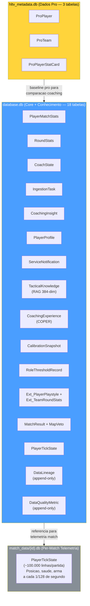

> **Analogia:** O banco de dados e o **arquivo** do sistema: cada informacao tem uma gaveta e uma pasta especificas. A arquitetura three-tier storage e como ter **tres arquivos especializados**: o arquivo principal (dados do jogo, conhecimentos taticos, experiencias de coaching — tudo em um unico grande arquivario WAL), o arquivario dos profissionais (dados HLTV, atualizado por um processo separado para evitar contencao), e os **dossies por-partida** (telemetria tick-a-tick, cada um em um arquivo separado para evitar que o arquivo principal fique pesado demais). Separando-os, o processo principal pode escrever e ler do arquivo geral enquanto o servico HLTV atualiza o arquivario dos pros e os dados de telemetria ficam isolados por partida, sem travarem uns aos outros. SQLite em modo WAL permite que varios programas leiam cada arquivo simultaneamente. SQLModel combina Pydantic (para validacao de dados: "garanta que o campo idade seja realmente um numero") com SQLAlchemy (para operacoes no banco: "salve isso na tabela certa"). As 21 tabelas sao organizadas como o arquivo escolar: perfis dos alunos, notas dos testes, anotacoes de aula, avaliacoes dos professores e livros da biblioteca.

```mermaid
erDiagram
    PlayerMatchStats ||--o{ RoundStats : "demo_name"
    PlayerMatchStats ||--o{ PlayerTickState : "demo_name, player_name"
    PlayerMatchStats ||--o{ CoachingInsight : "player_name, demo_name"
    PlayerMatchStats }o--o| ProPlayer : "pro_player_id → hltv_id"
    ProPlayer }o--|| ProTeam : "team_id → hltv_id"
    ProPlayer ||--o{ ProPlayerStatCard : "player_id → hltv_id"
    MatchResult ||--o{ MapVeto : "match_id"
    MatchResult ||--o{ PlayerTickState : "match_id"
    CoachingExperience }o--o| MatchResult : "pro_match_id → match_id"

    PlayerMatchStats {
        int id PK
        string player_name "indexed"
        string demo_name "unique per player"
        float rating "0.0 - 5.0"
        string dataset_split "train/val/test"
        int pro_player_id FK
        bool is_pro
    }
    RoundStats {
        int id PK
        string demo_name "indexed"
        int round_number "indexed"
        string player_name "indexed"
        int kills
        float round_rating
    }
    PlayerTickState {
        int id PK
        int match_id FK
        int tick "128 Hz"
        string demo_name "indexed"
        string player_name "indexed"
        float pos_x
        float pos_y
    }
    CoachingInsight {
        int id PK
        string player_name "indexed"
        string demo_name "indexed"
        string title
        string severity
        string focus_area
    }
    CoachingExperience {
        int id PK
        string context_hash "indexed"
        string map_name "indexed"
        string action_taken
        string outcome "indexed"
        string embedding "384-dim JSON"
        int pro_match_id FK
        float mu_skill "TrueSkill mu posterior (KT-01)"
        float sigma_skill "TrueSkill sigma uncertainty (KT-01)"
        int times_retrieved "replay priority counter (KT-01)"
        int times_validated "user confirmation count (KT-01)"
    }
    TacticalKnowledge {
        int id PK
        string title "indexed"
        string category "indexed"
        string embedding "384-dim JSON"
        int usage_count
    }
    ProPlayer {
        int id PK
        int hltv_id "unique indexed"
        string nickname "indexed"
        int team_id FK
    }
    ProTeam {
        int id PK
        int hltv_id "unique indexed"
        string name "indexed"
        int world_rank
    }
    ProPlayerStatCard {
        int id PK
        int player_id FK
        float rating_2_0
        float adr
        string time_span
    }
    MatchResult {
        int match_id PK
        string event_name "indexed"
        int team_a_id
        int winner_id
    }
    MapVeto {
        int id PK
        int match_id FK
        string map_name
        string action
    }
    PlayerProfile {
        int id PK
        string player_name "unique indexed"
        string role
        string bio
    }
    CoachState {
        int id PK
        string status "Paused/Training/Idle/Error"
        float belief_confidence
        string detail
    }
    ServiceNotification {
        int id PK
        string daemon "indexed"
        string severity
        string message
    }
    IngestionTask {
        int id PK
        string demo_path "unique indexed"
        string status "queued/processing/completed/failed"
        int retry_count
    }
    Ext_PlayerPlaystyle {
        int id PK
        string player_name "indexed"
        string assigned_role
        float rating_impact
    }
    Ext_TeamRoundStats {
        int id PK
        int match_id "indexed"
        string team_name "indexed"
        string map_name
    }
    CalibrationSnapshot {
        int id PK
        string calibration_type "indexed"
        string parameters_json
        int sample_count
    }
    RoleThresholdRecord {
        int id PK
        string stat_name "unique indexed"
        float value
        int sample_count
    }
    DataLineage {
        int id PK
        string entity_type "indexed"
        int entity_id "indexed"
        string source_demo
        string pipeline_version
        string processing_step
    }
    DataQualityMetric {
        int id PK
        string run_id "indexed"
        string run_type "indexed"
        string metric_name
        float metric_value
        int sample_count
    }
```

> **Explicacao do diagrama ER:** Cada caixa representa um **tipo de registro** no banco de dados. `PlayerMatchStats` e como um **boletim** para cada jogador em cada partida (quantas mortes, quantas vezes morreu, sua avaliacao, etc). `PlayerTickState` e como um **diario frame a frame**: 128 entradas por segundo que registram exatamente onde o jogador estava, quao saudavel estava, em que direcao estava olhando. `RoundStats` e a **decomposicao por questao**: avaliacoes individuais para cada round (kills, deaths, damage, noscope kills, flash assists, round rating), permitindo analises detalhadas. `CoachingExperience` e o **diario** do treinador: cada momento de treinamento, se os conselhos funcionaram e o quanto foram eficazes. `CoachingInsight` e o **conselho efetivo** fornecido ao jogador. `TacticalKnowledge` e o **livro didatico**: sugestoes e estrategias que o treinador pode consultar. `RoleThresholdRecord` e a **rubrica de avaliacao**, ou seja, os limites aprendidos para classificar os papeis dos jogadores. `CalibrationSnapshot` e o **registro de controle do instrumento**, que registra quando o modelo de crenca foi recalibrado e com quantas amostras. `Ext_PlayerPlaystyle` e o **relatorio de scouting externo**, ou seja, as metricas do estilo de jogo obtidas dos dados CSV usados para treinar NeuralRoleHead. `ServiceNotification` e o **sistema de interfone**, ou seja, as mensagens de erro e evento provenientes dos daemons em background mostradas na interface do usuario. As linhas entre as tabelas mostram os relacionamentos: cada registro de partida esta vinculado ao perfil de um jogador, as experiencias de treinamento estao vinculadas a partidas especificas e RoundStats esta vinculado a PlayerMatchStats via demo_name. `DataLineage` e o **registro de proveniencia**: rastreia qual demo originou cada entidade e atraves de qual step do pipeline foi processada (append-only, para audit trail completo). `DataQualityMetric` e o **painel de metricas de qualidade**: registra valores numericos de qualidade para cada execucao do pipeline (ex. percentual de amostras descartadas, taxa de fallback zero-tensor), permitindo o monitoramento da saude do sistema ao longo do tempo.

**Ciclo de vida dos dados:**

| Fase                                | Tabelas escritas                                                                  | Volume                                 |
| ----------------------------------- | --------------------------------------------------------------------------------- | -------------------------------------- |
| Insercao demo                       | `PlayerMatchStats`, `PlayerTickState`, `MatchMetadata`                      | ~100.000 tick/partida                  |
| Enriquecimento round                | `RoundStats` (isolamento por round, por jogador)                                | ~30 linhas/partida (round x jogadores) |
| Scan HLTV                           | `ProPlayer`, `ProTeam`, `ProPlayerStatCard`                                 | ~500 jogadores                         |
| Importacao CSV                      | Tabelas externas via `csv_migrator.py`                                          | ~10.000 linhas                         |
| Dados de estilo de jogo             | `Ext_PlayerPlaystyle` (de CSV para NeuralRoleHead)                              | ~300+ jogadores                        |
| Engenharia de features              | `PlayerMatchStats.dataset_split` atualizado                                     | In-place                               |
| Populacao RAG                       | `TacticalKnowledge`                                                             | ~200 artigos                           |
| Extracao de experiencia             | `CoachingExperience`                                                            | ~1.000 por partida                     |
| Output de coaching                  | `CoachingInsight`                                                               | ~5-20 por partida                      |
| Aprendizado de limites de papel     | `RoleThresholdRecord`                                                           | 9 limites                              |
| Calibracao de crencas               | `CalibrationSnapshot` (apos retreinamento)                                      | 1 por cada calibracao executada        |
| Telemetria de sistema               | `CoachState`, `ServiceNotification`, `IngestionTask`                        | Continuo                               |
| Rastreamento de proveniencia        | `DataLineage` (append-only por cada entidade processada)                        | ~N linhas por demo ingerida            |
| Metricas de qualidade pipeline      | `DataQualityMetric` (append-only por cada execucao pipeline)                    | ~5-10 metricas por run                 |
| Backup                              | Automatizado via `BackupManager` (7 rotacoes diarias + 4 semanais)              | Copia completa do banco                |

**Indices e otimizacao de query:**

As tabelas mais consultadas tem indices estrategicos para garantir queries rapidas:

| Tabela | Indice | Colunas | Tipo de query otimizada |
| ------ | ------ | ------- | ----------------------- |
| `PlayerMatchStats` | `idx_pms_player` | `player_name` | Busca por jogador |
| `PlayerMatchStats` | `idx_pms_demo` | `demo_name` | Busca por partida |
| `PlayerMatchStats` | `idx_pms_processed` | `processed_at` | Ordenacao cronologica |
| `RoundStats` | `idx_rs_demo_round` | `demo_name, round_number` | Busca por round especifico |
| `IngestionTask` | `idx_it_status` | `status` | Fila de trabalho (status=queued) |
| `CoachingInsight` | `idx_ci_player` | `player_name` | Insight por jogador |
| `TacticalKnowledge` | `idx_tk_category` | `category` | Busca RAG por categoria |
| `ProPlayer` | `idx_pp_name` | `nickname` | Busca pro por nome |
| `DataLineage` | `idx_dl_entity` | `entity_type, entity_id` | Rastreamento proveniencia por entidade |
| `DataQualityMetric` | `idx_dqm_run` | `run_id, run_type` | Metricas qualidade por execucao |

**Restricoes de integridade:**

| Restricao | Tabelas | Enforcement |
| --------- | ------- | ----------- |
| `player_name` NOT NULL | PlayerMatchStats, RoundStats | Nivel de schema |
| `demo_name` UNIQUE por player | PlayerMatchStats | Previne duplicatas |
| `status` CHECK IN ('queued', 'processing', 'completed', 'failed') | IngestionTask | Enum enforcement |
| `dataset_split` CHECK IN ('train', 'val', 'test') | PlayerMatchStats | Split validity |
| Foreign key demo_name | RoundStats → PlayerMatchStats | Relacao round-partida |

**Detalhe de tabelas-chave:**

**`PlayerMatchStats`** (32 campos) — a tabela mais consultada do sistema:

A tabela PlayerMatchStats contem todas as estatisticas agregadas por jogador por partida. E o "boletim" de cada partida analisada:

| Campo | Tipo | Descricao |
| ----- | ---- | --------- |
| `id` | Integer PK | Identificador unico |
| `player_name` | String | Nome do jogador (indexed) |
| `demo_name` | String | Nome do arquivo demo (unique por player) |
| `kills`, `deaths`, `assists` | Integer | KDA base |
| `adr` | Float | Average Damage per Round |
| `kast` | Float | Kill/Assist/Survive/Trade % |
| `headshot_percentage` | Float | HS% |
| `hltv_rating` | Float | Rating HLTV 2.0 calculado |
| `dataset_split` | String | "train" / "val" / "test" |
| `is_pro` | Boolean | Flag jogador profissional |
| `processed_at` | DateTime | Timestamp de processamento |
| `map_name` | String | Mapa jogado |
| ... | ... | 20+ campos adicionais para features avancadas |

**`TacticalKnowledge`** — a base RAG:

| Campo | Tipo | Descricao |
| ----- | ---- | --------- |
| `id` | Integer PK | Identificador |
| `title` | String | Titulo do documento (indexed) |
| `description` | String | Descricao do conteudo tatico |
| `category` | String | "positioning" / "economy" / "utility" / "aim" (indexed) |
| `map_name` | String | Mapa especifico (indexed, opcional) |
| `situation` | String | Contexto situacional: "T-side pistol round", "CT retake A site" |
| `pro_example` | String | Referencia a demo pro (opcional) |
| `embedding` | String | Vetor 384-dim JSON (sentence-transformers) |
| `created_at` | DateTime | Timestamp de criacao |
| `usage_count` | Integer | Contador de uso |

A busca semantica RAG funciona calculando a **cosine similarity** entre o embedding da query do usuario e os embeddings precomputados de cada documento. Os top-3 resultados com similarity > 0.5 sao usados para enriquecer o contexto de coaching. O campo `situation` permite o filtro contextual (ex. "T-side pistol round") antes da busca semantica.

**`CoachingExperience`** — o banco COPER (22+ campos):

| Campo | Tipo | Descricao |
| ----- | ---- | --------- |
| `id` | Integer PK | Identificador |
| `context_hash` | String | Hash do estado de jogo para lookup rapido (indexed) |
| `map_name` | String | Mapa (indexed) |
| `round_phase` | String | "pistol" / "eco" / "full_buy" / "force" |
| `side` | String | "T" / "CT" |
| `position_area` | String | "A-site" / "Mid" / etc. (indexed, opcional) |
| `game_state_json` | String | Snapshot completo do tick (max 16KB, validado com `field_validator`) |
| `action_taken` | String | "pushed" / "held_angle" / "rotated" / "used_utility" / etc. |
| `outcome` | String | "kill" / "death" / "trade" / "objective" / "survived" (indexed) |
| `delta_win_prob` | Float | Variacao da probabilidade de vitoria desta acao |
| `confidence` | Float | Confiabilidade/generalizabilidade 0.0-1.0 |
| `usage_count` | Integer | Quantas vezes recuperada para coaching |
| `pro_match_id` | Integer FK | Referencia a MatchResult (ON DELETE SET NULL) |
| `pro_player_name` | String | Nome jogador pro de referencia (indexed, opcional) |
| `embedding` | String | Vetor 384-dim JSON para busca semantica (opcional) |
| `source_demo` | String | Demo de origem (opcional) |
| `created_at` | DateTime | Timestamp de criacao |
| `outcome_validated` | Boolean | Se o resultado foi validado |
| `effectiveness_score` | Float | Score -1.0 a 1.0 |
| `follow_up_match_id` | Integer | Partida de follow-up para tracking |
| `times_advice_given` | Integer | Quantas vezes o conselho foi dado |
| `times_advice_followed` | Integer | Quantas vezes o conselho foi seguido |
| `last_feedback_at` | DateTime | Ultimo feedback recebido |
| `mu_skill` | Float | TrueSkill mu posterior — estimativa da qualidade da experiencia (KT-01) |
| `sigma_skill` | Float | TrueSkill sigma uncertainty — incerteza sobre a qualidade (KT-01) |
| `times_retrieved` | Integer | Contador replay priority — quantas vezes recuperada (KT-01) |
| `times_validated` | Integer | Contador de confirmacoes do usuario — quantas vezes validada (KT-01) |

O sistema COPER usa essas experiencias para **aprender com seus proprios conselhos**: o campo `context_hash` permite o lookup rapido de situacoes similares, `outcome` e `delta_win_prob` medem a eficacia da acao, e o ciclo de feedback (`outcome_validated`, `times_advice_given/followed`, `effectiveness_score`) permite ao sistema priorizar conselhos que historicamente produziram resultados positivos. O campo `game_state_json` e limitado a 16KB para prevenir crescimento descontrolado do banco. Os campos TrueSkill `mu_skill`/`sigma_skill` (KT-01) fornecem uma estimativa bayesiana da qualidade da experiencia, usada para a priorizacao do replay: `confidence_score = mu_skill - kappa x sigma_skill`. O contador `times_retrieved` implementa a replay priority, enquanto `times_validated` rastreia as confirmacoes do usuario para o CRUD semantico.

> **Analogia:** O ciclo de vida dos dados mostra **como as informacoes fluem atraves do sistema ao longo do tempo**, como o rastreamento de um pacote da fabrica ate a entrega. Primeiro chegam as gravacoes das partidas (100.000 pontos de dados por partida!). Depois as estatisticas dos jogadores profissionais sao extraidas do HLTV (como baixar um almanaque esportivo). Sao importados arquivos CSV externos (como obter dados historicos). A IA processa tudo, gera conselhos para os treinadores, aprende os limites de papel e registra constantemente o estado de saude do sistema. Os backups sao executados automaticamente: 7 copias diarias e 4 copias semanais, como se voce salvasse suas tarefas tanto no computador quanto em um drive USB, por precaucao.

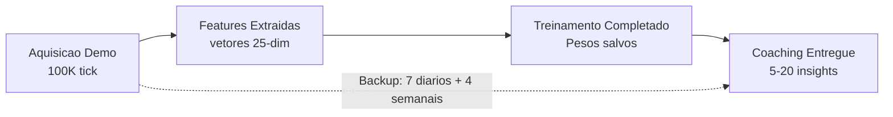

## 10. Regime de treinamento e limites de maturidade

> **Analogia:** O regime de treinamento e o **curriculo escolar completo**, do jardim de infancia ao diploma. Um aluno (o modelo de inteligencia artificial) comeca com zero conhecimento e aprende gradualmente atraves de 4 fases, desbloqueando cursos mais avancados conforme se prova a altura. Os limites de maturidade sao como os **requisitos de avaliacao**: voce nao pode fazer o exame de Fisica AP (Otimizacao RAP) ate ter passado em Matematica basica (Pre-Treinamento JEPA), Algebra (Baseline Pro) e Pre-Calculo (Fine-Tuning Usuario). Cada limite verifica: "Voce estudou demos suficientes para estar pronto para o proximo nivel?"

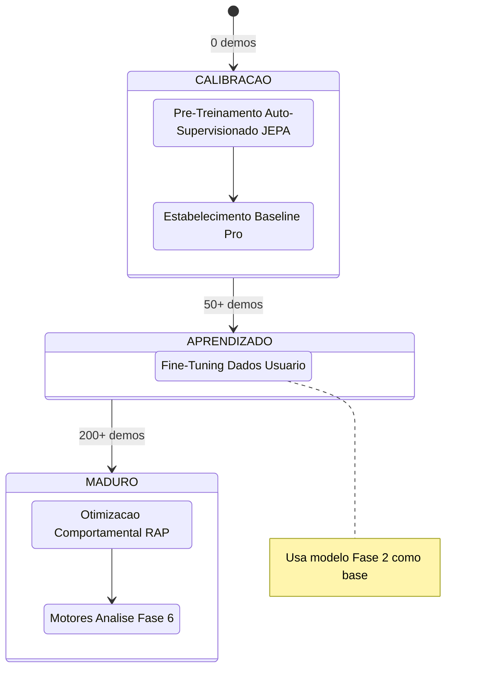

**Requisitos de dados por fase:**

| Fase                       | Dados minimos             | Tipo de treinamento            | Perda primaria                            |
| -------------------------- | ------------------------- | ------------------------------ | ----------------------------------------- |
| 1\. Pre-treinamento JEPA   | 10 demos pro              | Auto-supervisionado (InfoNCE)  | Contrastivo com negativos em batch        |
| 2\. Baseline pro           | 50 partidas pro           | Supervisionado                 | MSE(pred, pro_stats)                      |
| 3\. Otimizacao usuario     | 50 partidas usuario       | Supervisionado (transferencia) | MSE(pred, user_stats)                     |
| 4\. Otimizacao RAP         | 200 partidas totais       | Multi-task                     | Estrategia + Valor + Sparsidade + Posicao |

> **Analogia:** A fase 1 e como **assistir programas de culinaria**: o modelo aprende os padroes apenas observando (auto-supervisionado, sem necessidade de labels). A fase 2 e como **uma escola de culinaria com um livro didatico**: "Aqui esta como um profissional faz a massa" (supervisionado com dados profissionais). A fase 3 e como **cozinhar para sua familia**: "Sua familia prefere o picante, entao adaptamos a receita" (fine-tuning com dados do usuario). A fase 4 e um **treinamento de chef experiente**: aprender a balancear simultaneamente sabor, apresentacao, tempo e nutricao (multi-task: estrategia + valor + parcimonia + posicao). Voce precisa de pelo menos 10 programas de culinaria para comecar, 50 receitas para aprender e 200 pratos no total preparados antes de se formar.

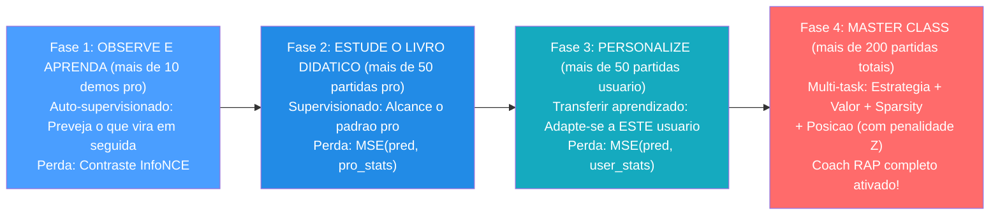

**Protocolo VL-JEPA Two-Stage (Alinhamento de Conceitos):**

Quando o VL-JEPA esta ativo, as Fases 1-2 sao estendidas com um **protocolo two-stage** que alinha as representacoes latentes aos 16 coaching concepts:

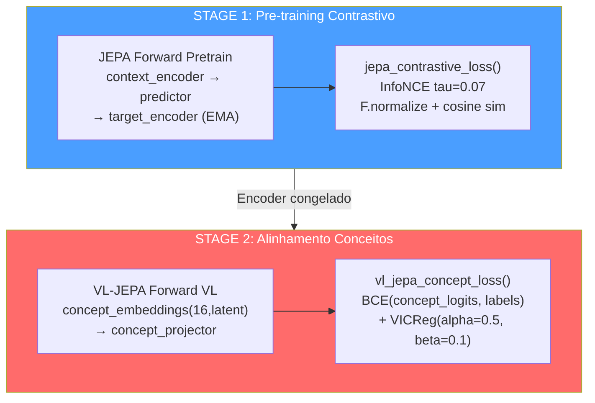

| Stage | O que se treina | O que esta congelado | Loss | Proposito |
| ----- | --------------- | -------------------- | ---- | --------- |
| 1 | Context encoder, predictor | Target encoder (EMA) | InfoNCE (tau=0.07) | Representacoes latentes gerais |
| 2 | Concept embeddings, concept projector, concept temperature | Encoder (opcional fine-tuning) | BCE + VICReg diversity | Alinhamento aos 16 coaching concepts |

**Os 16 Coaching Concepts (taxonomia):**

| Indice | Conceito | Categoria | Descricao |
| ------ | -------- | --------- | --------- |
| 0 | Positioning Quality | Posicionamento | Qualidade da posicao em relacao ao contexto |
| 1 | Trade Readiness | Posicionamento | Prontidao para o trade kill |
| 2 | Rotation Speed | Posicionamento | Velocidade de rotacao entre sites |
| 3 | Utility Usage | Utility | Frequencia e qualidade do uso de granadas |
| 4 | Utility Effectiveness | Utility | Eficacia das utilities usadas |
| 5 | Decision Quality | Decisao | Qualidade das decisoes in-game |
| 6 | Risk Assessment | Decisao | Avaliacao de risco pre-acao |
| 7 | Engagement Timing | Engajamento | Timing dos engajamentos |
| 8 | Engagement Distance | Engajamento | Distancia otima de engajamento |
| 9 | Crosshair Placement | Engajamento | Posicionamento de mira pre-peek |
| 10 | Recoil Control | Engajamento | Controle do recoil |
| 11 | Economy Management | Decisao | Gestao da economia do time |
| 12 | Information Gathering | Decisao | Coleta de informacoes (peek, utility info) |
| 13 | Composure Under Pressure | Psicologia | Compostura sob pressao |
| 14 | Aggression Control | Psicologia | Controle da agressividade |
| 15 | Adaptation Speed | Psicologia | Velocidade de adaptacao ao meta adversario |

> **Analogia dos 16 Conceitos:** Os 16 coaching concepts sao como as **16 materias de um curriculo escolar completo**. Tres materias sao sobre **geografia** (posicionamento — onde voce esta). Duas sao sobre **quimica** (utility — como voce usa seus instrumentos). Cinco sao sobre **estrategia** (decisao e economia — as escolhas que voce faz). Quatro sao sobre **ginastica** (engajamento — as habilidades fisicas: mira, recoil, timing). Tres sao sobre **psicologia** (compostura, agressividade, adaptacao). O Stage 2 do VL-JEPA ensina ao modelo a "entender" essas 16 materias e a dar uma nota a cada uma para cada acao do jogador.

**AdamW + CosineAnnealing (JEPA Trainer):**

| Hiperparametro | Valor | Proposito |
| -------------- | ----- | --------- |
| Optimizer | AdamW | Weight decay separado dos gradientes |
| Learning rate | 1e-4 (default) | Taxa de aprendizado inicial |
| Weight decay | 0.01 | Regularizacao L2 |
| Scheduler | CosineAnnealingLR | Decaimento cosseno do LR ate 0 |
| EMA decay | 0.996 | Target encoder momentum update |
| Gradient clip | 1.0 | Prevencao de gradient explosion |

**DriftMonitor (z_threshold=2.5):**

O `DriftMonitor` integrado no JEPA Trainer monitora o **drift das features** durante o training. Se o Z-score de uma feature superar 2.5, emite um warning que indica possivel distribuicao shifting:

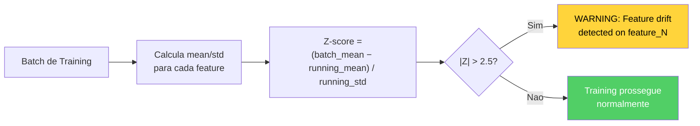

**Trigger de retreinamento:** O daemon Teacher monitora o crescimento do numero de demos profissionais; ativa o retreinamento quando `count >= last_count x 1,10`.

> **Analogia:** O trigger de retreinamento e como uma **escola que atualiza seu curriculo quando chegam livros didaticos novos suficientes**. O daemon Teacher (um processo em background) verifica constantemente: "Quantas demos profissionais temos agora?". Quando o numero cresce 10% ou mais desde o ultimo treinamento, diz: "Temos material novo suficiente: e hora de requalificar o modelo para que ele permaneca a par da evolucao do meta profissional."

**JEPAPretrainDataset** (`jepa_train.py`):

O dataset de pre-training JEPA usa **janelas temporais** para criar pares contexto-target:

| Parametro | Valor | Proposito |
| --------- | ----- | --------- |
| `context_len` | 10 ticks | Tamanho janela de contexto (input) |
| `target_len` | 10 ticks | Tamanho janela target (a prever) |
| Gap | 0-5 ticks (random) | Distancia variavel entre contexto e target |
| Batch size | 32 | Numero de pares por batch |

> **Analogia do Dataset:** O dataset de pre-training e como um **exercicio de leitura rapida**. Ao modelo e mostrada uma pagina do livro (10 ticks de contexto) e entao e perguntado: "O que esta escrito na proxima pagina?" (10 ticks target). O gap variavel torna o exercicio mais dificil — as vezes a proxima pagina vem logo em seguida, as vezes sao separadas por algumas paginas em branco. Isso forca o modelo a aprender padroes gerais, nao sequencias especificas.

---

## 11. Catalogo das funcoes de perda

> **Analogia:** As funcoes de perda sao os **pontuacoes dos testes** que a IA tenta minimizar. Cada modelo tem seu proprio tipo de teste. Uma pontuacao mais baixa significa um desempenho melhor, o oposto das notas escolares! Pense em cada funcao de perda como uma questao especifica do teste: "Quao proxima sua previsao estava da resposta correta?" (MSE), "Voce escolheu a resposta correta entre varias opcoes?" (InfoNCE/BCE), "Voce usou muitos recursos?" (Sparsidade). A tabela a seguir e similar ao **calendario completo do exame**: cada teste, para cada modelo, com a formula de avaliacao exata.

| Modelo                   | Nome da perda             | Formula                                                                                                                         | Proposito                                                                |
| ------------------------ | ------------------------- | ------------------------------------------------------------------------------------------------------------------------------- | ------------------------------------------------------------------------ |
| **JEPA**            | InfoNCE Contrastive       | `-log(exp(sim(pred, target)/tau) / Sigma exp(sim(pred, neg_i)/tau))`, tau=0.07, `F.normalize` antes da similaridade cosseno | Alinhamento das previsoes de contexto com os embeddings do target |
| **JEPA**            | Otimizacao                | `MSE(coaching_head(Z_ctx), y_true)`                                                                                           | Pontuacao de coaching supervisionado                                   |
| **AdvancedCoachNN** | Supervisionado            | `MSELoss(MoE_output, y_true)`                                                                                                 | Treinamento a nivel de partida                                         |
| **RAP**             | Estrategia                | `MSELoss(advice_probs, target_strat)`                                                                                         | Recomendacao tatica correta                                            |
| **RAP**             | Valor                     | `0,5 x MSE(V(s), true_advantage)`                                                                                            | Estimativa precisa da vantagem                                         |
| **RAP**             | Sparsidade                | `L1(gate_weights)`                                                                                                            | Especializacao de especialistas                                        |
| **RAP**             | Posicao                   | `MSE(xy) + 2x MSE(z)`                                                                                                        | Posicionamento otimo com penalidade no eixo Z                          |
| **WinProb**         | Previsao                  | `BCEWithLogitsLoss(pred, resultado)`                                                                                          | Previsao do resultado do round                                         |
| **NeuralRoleHead**  | KL-Divergence             | `KLDivLoss(log_softmax(pred), target)` com smoothing de labels epsilon=0,02                                                  | Correspondencia da distribuicao de probabilidade do papel              |
| **VL-JEPA**         | Alinhamento de conceitos  | `BCE(concept_logits, concept_labels)` + `VICReg(concept_diversity)`                                                         | Fundamentos do conceito de linguagem visual                            |

> **Analogia para as funcoes de perda das chaves:** **InfoNCE** e como um teste de multipla escolha: "Aqui estao 32 respostas possiveis: qual e a correta?" O modelo obtem uma pontuacao mais alta por escolher a certa E por ter certeza disso. A **MSE** (Erro Quadratico Medio) e como medir a distancia do seu dardo do centro do alvo: mais perto = menor perda. A **BCE** (Entropia Cruzada Binaria) e como um quiz verdadeiro/falso: "Seu time venceu? Sim ou nao?". A **Perda de Sparsidade** e como um professor que diz "Use menos palavras na sua redacao": encoraja o modelo a ativar menos especialistas, tornando-o mais eficiente e interpretavel. A **Perda de Posicao com penalidade Z 2x** e como dizer "errar para a esquerda ou para a direita e grave, mas cair de um precipicio (do andar errado) e duas vezes pior". A **KL-Divergence** e como comparar dois rankings: "Sua classificacao de papeis corresponde a real?" — mede o quanto a distribuicao prevista se desvia da target.

**Detalhe: InfoNCE Contrastive Loss (JEPA)**

O InfoNCE e a loss principal do pre-training JEPA. Seu proposito e alinhar as predicoes do contexto com os embeddings do target, rejeitando simultaneamente os negativos (outras amostras no batch):

```
L_InfoNCE = -log( exp(sim(pred, target+) / tau) / Sigma_i exp(sim(pred, target_i) / tau) )
```

| Componente | Valor | Papel |
| ---------- | ----- | ----- |
| `sim()` | Cosine similarity apos `F.normalize` | Medida de similaridade [-1, +1] |
| `tau` (temperature) | 0.07 | Sharpness da distribuicao — valores baixos = mais seletivos |
| `target+` | O embedding target correto para este contexto | O "positivo" — a resposta correta |
| `target_i` | Todos os embeddings no batch | Negativos in-batch — as respostas erradas |
| Batch size | 32 | Numero de negativos = batch_size - 1 = 31 |

> **Analogia InfoNCE:** Imagine estar em uma sala com 32 pessoas. E mostrada uma foto (contexto) e voce deve encontrar a pessoa certa (target positivo) entre as 32. A temperatura tau=0.07 e como a **nitidez dos oculos**: valores baixos significam oculos muito precisos — voce precisa ter muita certeza da sua escolha para obter uma boa pontuacao. Valores altos significam oculos embacados — ate uma escolha aproximada e ok. O tau baixo do JEPA forca o modelo a aprender representacoes muito precisas.

**Detalhe: VL-JEPA Concept Loss (VICReg Components)**

A loss de alinhamento de conceitos do VL-JEPA combina dois componentes:

```
L_concept = BCE(concept_logits, concept_labels) + alpha*VICReg_diversity
```

Onde `VICReg_diversity` e composto por:

| Termo VICReg | Formula | Peso | Proposito |
| ------------ | ------- | ---- | --------- |
| **Variance** | `max(0, gamma - std(z))` para cada dimensao | alpha=0.5 | Previne o colapso das representacoes — cada dimensao deve variar |
| **Covariance** | `Sigma_i!=j cov(z_i, z_j)^2` | beta=0.1 | Decorrelacao — cada dimensao deve capturar informacoes diferentes |

> **Analogia VICReg:** A **Variance** e como um professor que diz "Cada um de voces deve ter uma opiniao diferente — nao copiem todos a mesma resposta!" (previne o colapso onde todos os concept embeddings se tornam identicos). A **Covariance** e como dizer "Cada aluno deve se especializar em uma materia diferente — nao precisamos de 16 especialistas em historia e zero em matematica!" (forca diversidade entre as dimensoes). Juntas, garantem que os 16 concept embeddings sejam **diversos entre si** e **significativos individualmente**.

**Detalhe: RAP Multi-Task Loss**

O RAP Coach combina 4 losses em uma loss total ponderada:

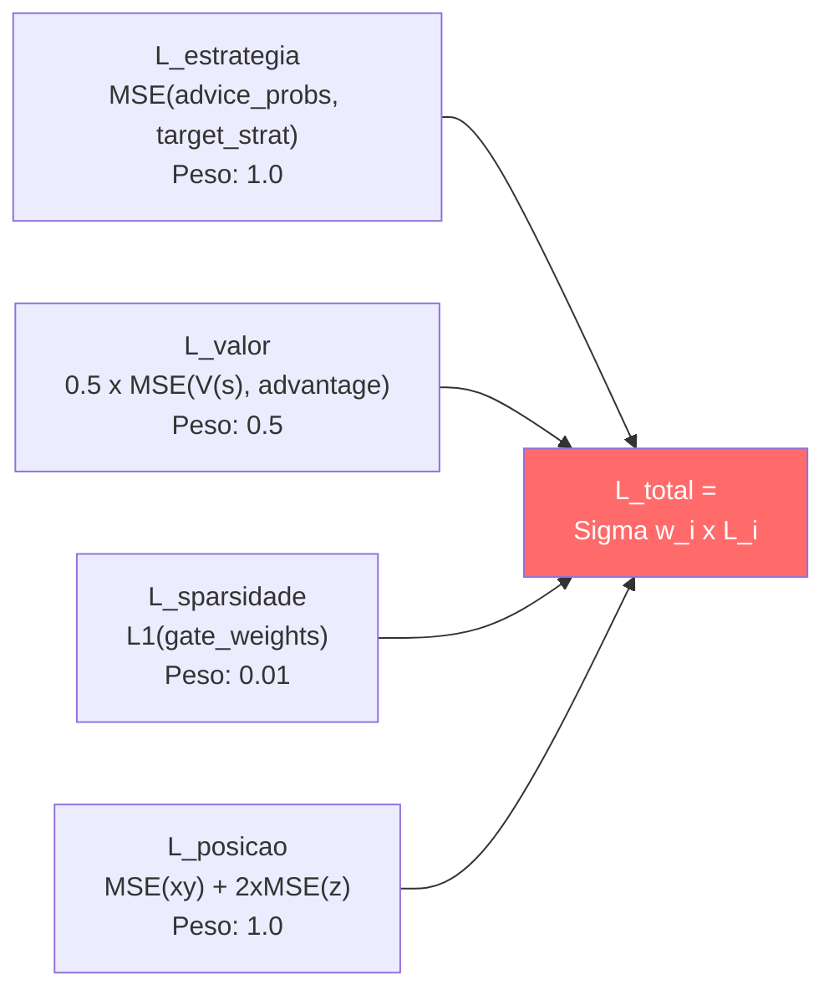

A penalidade Z 2x na loss de posicao reflete o fato de que em CS2 errar o **andar** (em cima vs embaixo em Nuke/Vertigo) e muito mais grave do que errar a posicao horizontal. Um erro de 100 unidades no eixo Z (andar errado) e estrategicamente catastrofico, enquanto o mesmo erro em X/Y pode ser irrelevante.

---

## 12. Logica Completa do Programa — Do Lancamento ao Conselho

Este capitulo documenta a **logica completa** do Macena CS2 Analyzer, desde o momento em que o usuario lanca a aplicacao ate quando recebe os conselhos de coaching. Ao contrario dos capitulos anteriores que se concentram nos subsistemas AI, aqui e explicado como **cada componente do programa** trabalha em conjunto: a interface desktop, a arquitetura quad-daemon, a pipeline de ingestao, o sistema de storage, o playback tatico, a observabilidade e o ciclo de vida da aplicacao.

> **Analogia:** Se os capitulos 1-11 descrevem os **orgaos individuais** de um corpo humano (cerebro, coracao, pulmoes, figado), este capitulo descreve o **corpo inteiro em acao**: como acorda pela manha, como respira, caminha, come, pensa e fala. Entender os orgaos e essencial, mas entender como trabalham juntos e o que da vida ao sistema. Imagine o Macena CS2 Analyzer como uma **pequena cidade**: tem uma prefeitura (o processo principal Kivy), uma central operacional subterranea (o Session Engine com seus 4 daemons), um arquivo municipal (o banco de dados SQLite), um correios (a pipeline de ingestao), uma escola (o sistema de treinamento ML), uma biblioteca (o sistema de conhecimento RAG/COPER), um hospital (o servico de coaching) e um sistema de monitoramento de saude publica (a observabilidade). Este capitulo os guia atraves de cada edificio e mostra como os cidadaos (os dados) se movem de um lugar para outro.

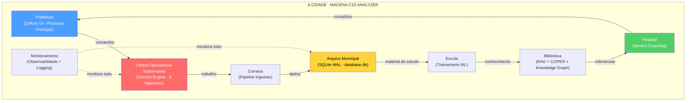

---

### 12.1 Ponto de Entrada e Sequencia de Inicializacao

O sistema dispoe de **dois entry points principais** (Qt primario, Kivy legacy) e tres entry points de utilidade:

| # | Entry Point | Comando | Papel |
|---|---|---|---|
| 1 | **Qt (primario)** | `python -m Programma_CS2_RENAN.apps.qt_app.app` | UI desktop PySide6 |
| 2 | Kivy (legacy) | `python -m Programma_CS2_RENAN.main` | UI desktop Kivy/KivyMD |
| 3 | Session Engine | `python -m Programma_CS2_RENAN.backend.console` | Backend headless |
| 4 | Headless Validator | `python -m Programma_CS2_RENAN.tools.headless_validator` | Validacao CI/CD |
| 5 | HLTV Sync | `python -m Programma_CS2_RENAN.tools.hltv_sync` | Scraping dados pro |

#### 12.1.1 Entry Point Qt (Primario) — `apps/qt_app/app.py`

**Arquivo:** `Programma_CS2_RENAN/apps/qt_app/app.py`

A sequencia de inicializacao Qt segue uma abordagem mais moderna baseada em **QApplication** e **signal/slot** em vez do loop de eventos Kivy:

1. **High-DPI setup** — Habilita scaling automatico para displays de alta densidade
2. **QApplication** — Cria a instancia aplicacao Qt com gestao de args
3. **Tema e font** — Registra os 3 temas (CS2, CSGO, CS1.6) via QSS e as fontes personalizadas
4. **MainWindow** — Constroi `QMainWindow` com sidebar + `QStackedWidget` (14 telas)
5. **Signal wiring** — Conecta os sinais Qt entre sidebar, telas e backend
6. **First-run gate** — Se `SETUP_COMPLETED=False`, mostra o wizard; caso contrario a home
7. **Backend console boot** — Lanca o Session Engine como subprocess
8. **Window show** — Mostra a janela e inicia o loop de eventos Qt
9. **CoachState polling** — Timer Qt para atualizacao periodica do estado

> **Analogia:** A inicializacao Qt e como o **acionamento de um carro moderno com start/stop eletronico**. Um unico botao (QApplication) inicia a sequencia: o computador de bordo configura o display (High-DPI), carrega o tema do painel (QSS), monta todos os instrumentos (14 telas no QStackedWidget), conecta os sensores (signal wiring), verifica se e a primeira inicializacao (first-run gate), liga o motor (backend console) e finalmente ilumina o painel (window show).

#### 12.1.2 Entry Point Kivy (Legacy) — `main.py`

**Arquivo:** `Programma_CS2_RENAN/main.py`

Quando o usuario lanca a aplicacao atraves do entry point legacy, `main.py` orquestra uma **sequencia de inicializacao de 9 fases** rigorosamente ordenada. Cada fase deve completar com sucesso antes que a proxima possa comecar. Se uma fase critica falhar, a aplicacao termina com uma mensagem explicita — nunca silenciosamente.

> **Analogia:** A inicializacao do programa e como a **checklist pre-voo de um aviao**. Antes que o aviao possa decolar, o piloto (main.py) deve completar uma serie de verificacoes em ordem: verificar a integridade da fuselagem (audit RASP), configurar os instrumentos (configuracao de paths), verificar o combustivel (migracao do banco), ligar os motores (inicializacao Kivy), embarcar os passageiros (registro das telas), ativar o piloto automatico (lancamento daemons) e finalmente decolar (mostrar a interface). Se uma verificacao falhar — por exemplo o combustivel e insuficiente (banco corrompido) — o voo e cancelado, nao tenta decolar esperando que de certo.

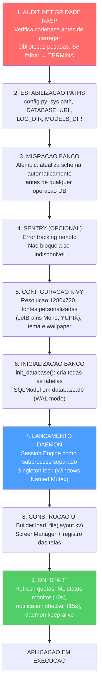

**Detalhes das fases criticas:**

| Fase | Componente | O que faz | Consequencia da falha |
| ---- | ---------- | --------- | --------------------- |
| 1 | `integrity.py` (RASP) | Verifica hash dos arquivos fonte contra o manifesto | Terminacao imediata — possivel adulteracao |
| 2 | `config.py` | Estabiliza `sys.path`, define todas as constantes de path | Erros de importacao em cascata |
| 3 | `db_migrate.py` | Executa migracoes Alembic pendentes | Schema incompativel — crash em operacoes DB |
| 5 | Kivy `Config` | Configura `KIVY_NO_CONSOLELOG`, registra fontes, carrega `.kv` | UI nao renderizavel |
| 6 | `database.py` | `create_all()` em engine SQLite com `check_same_thread=False` | Nenhuma persistencia possivel |
| 7 | `lifecycle.py` | Lanca subprocess com PYTHONPATH correto, verifica mutex | Nenhuma automacao em background |

> **Analogia:** As consequencias da falha sao dispostas como **pecas de domino**: se a fase 2 (paths) falhar, as fases 3-9 cairao todas porque nenhuma sabe onde encontrar o banco, os modelos ou os logs. Se a fase 6 (banco) falhar, as fases 7-9 funcionarao aparentemente, mas nao poderao salvar nem recuperar nada — como um restaurante que abriu as portas mas esqueceu de ligar os fogoes.

---

### 12.2 Gestao do Ciclo de Vida (`lifecycle.py`)

**Arquivo:** `Programma_CS2_RENAN/core/lifecycle.py`

O `AppLifecycleManager` e um **Singleton** que gerencia o ciclo de vida da aplicacao inteira: desde a garantia de que exista uma unica instancia ativa, ao lancamento do subprocess daemon, ate o shutdown coordenado.

> **Analogia:** O Lifecycle Manager e como o **diretor de um teatro**. Antes do espetaculo, verifica que nao haja outros espetaculos em andamento na mesma sala (Single Instance Lock). Entao contrata o diretor (Session Engine daemon) que trabalhara nos bastidores. Durante o espetaculo, o diretor esta sempre presente em caso de emergencia. No final, o diretor garante que todos saiam do teatro em ordem: primeiro o diretor de cena termina seu trabalho, depois as luzes se apagam, depois as portas se fecham.

**Mecanismos principais:**

| Mecanismo | Implementacao | Proposito |
| --------- | ------------- | --------- |
| **Single Instance Lock** | Windows Named Mutex / file lock em Linux | Impede instancias multiplas (corrupcao DB) |
| **Lancamento Daemon** | `subprocess.Popen(session_engine.py)` com PYTHONPATH | Processo separado para trabalho pesado |
| **Deteccao Morte do Pai** | O daemon monitora EOF em `stdin` | Se o processo principal morre, o daemon para |
| **Shutdown Graceful** | Envio "STOP" via stdin → daemon termina em 5s | Nenhuma perda de dados ou tasks zumbis |
| **Status Polling** | UI consulta `CoachState` a cada 10s | Atualizacao status daemon sem IPC direto |
| **Error Recovery** | Se daemon morre, erro registrado + ServiceNotification | Usuario informado, nenhum crash silencioso |
| **Keep-Alive** | UI verifica heartbeat a cada 15s | Se heartbeat > 30s stale → warning "Daemon nao responde" |

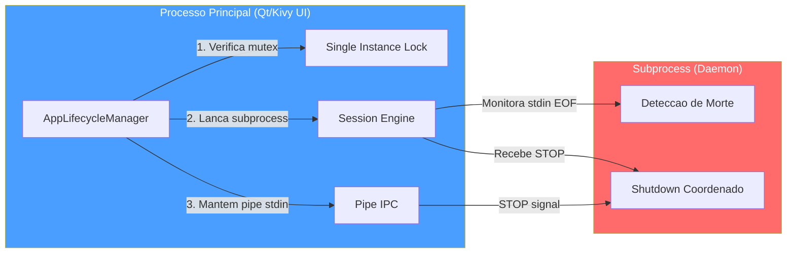

> **Analogia:** O pipe `stdin` e como um **fio de telefone** entre o diretor e o diretor de cena. Enquanto o fio estiver conectado, o diretor de cena sabe que o diretor ainda esta presente. Se o fio se rompe subitamente (EOF — o processo principal crasha), o diretor de cena entende que o espetaculo acabou e fecha tudo de forma ordenada. Se o diretor quer terminar normalmente, envia a mensagem "STOP" atraves do fio e espera que o diretor de cena confirme que terminou.

---

### 12.3 Sistema de Configuracao (`config.py`)

**Arquivo:** `Programma_CS2_RENAN/core/config.py`

O sistema utiliza **tres niveis de configuracao**, cada um com um diferente nivel de persistencia e seguranca:

> **Analogia:** Os tres niveis de configuracao sao como as **tres camadas de uma armadura medieval**. A camada interna (hardcoded) e a armadura base que nunca muda — os fundamentos do sistema. A camada intermediaria (JSON) e a cota de malha personalizavel — o usuario pode ajusta-la como preferir. A camada externa (Keyring) e o elmo com visiera — protege os segredos mais preciosos (chaves API) em um cofre do sistema operacional, inacessivel a olhos curiosos.

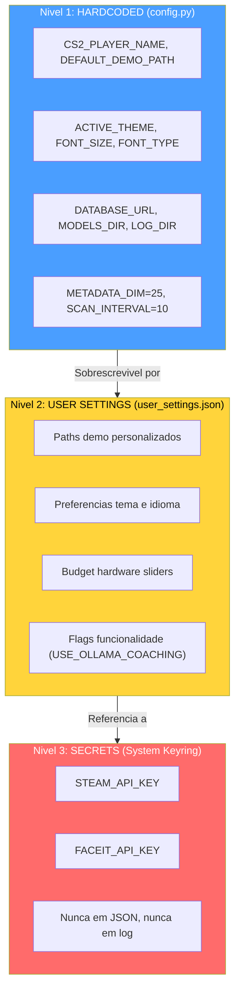

**Constantes criticas do sistema:**

| Constante | Valor | Arquivo | Proposito |
| --------- | ----- | ------- | --------- |
| `METADATA_DIM` | 25 | `config.py` | Dimensao do feature vector — contrato unificado |
| `SCAN_INTERVAL` | 10 | `config.py` | Intervalo scan Scanner (segundos) |
| `MAX_DEMOS_PER_MONTH` | 10 | `config.py` | Quota mensal upload demo |
| `MAX_TOTAL_DEMOS` | 100 | `config.py` | Limite total de demos por vida |
| `MIN_DEMOS_FOR_COACHING` | 10 | `config.py` | Limite para coaching personalizado completo |
| `TRADE_WINDOW_TICKS` | 192 | `trade_kill_detector.py` | Janela temporal trade kill (~3 segundos a 64 ticks) |
| `HLTV_BASELINE_KPR` | 0.679 | `demo_parser.py` | Baseline HLTV 2.0 para KPR |
| `HLTV_BASELINE_SURVIVAL` | 0.317 | `demo_parser.py` | Baseline HLTV 2.0 para survival |
| `FOV_DEGREES` | 90 | `player_knowledge.py` | Campo de visao simulado do jogador |
| `MEMORY_DECAY_TAU` | 160 | `player_knowledge.py` | Constante de decaimento memoria tick |
| `CONFIDENCE_ROUNDS_CEILING` | 300 | `correction_engine.py` | Teto de rounds para confianca maxima |
| `SILENCE_THRESHOLD` | 0.2 | `explainability.py` | Limite abaixo do qual o silencio e acao valida |
| `MIN_SAMPLES_FOR_VALIDITY` | 10 | `role_thresholds.py` | Amostras minimas para limite papel valido |
| `HALF_LIFE_DAYS` | 90 | `pro_baseline.py` | Decaimento temporal dados pro |
| `Z_LEVEL_THRESHOLD` | 200 | `connect_map_context.py` | Limite Z para classificacao de andar |

> **Analogia das Constantes:** As constantes sao como os **parametros vitais de referencia** em medicina. `METADATA_DIM=25` e como dizer "a pressao sistolica normal e 120" — todos os medicos (modelos ML) usam a mesma referencia. `TRADE_WINDOW_TICKS=192` e como a "golden hour" em traumatologia: se um companheiro e morto e voce mata o assassino dele dentro de 3 segundos, e um trade kill. `SILENCE_THRESHOLD=0.2` e como o "primum non nocere" (primeiro, nao ferir): se o coach nao tem nada significativo a dizer, e melhor ficar em silencio do que dar conselhos inuteis.

**Arquitetura de paths:**

O sistema gerencia paths com uma atencao especial a **portabilidade Windows/Linux**. O coracao e `BRAIN_DATA_ROOT`: um diretorio configuravel pelo usuario que contem modelos, logs e dados derivados. Se nao existe, o sistema recai na pasta do projeto.

| Path | Conteudo | Configuravel |
| ---- | -------- | ------------ |
| `DATABASE_URL` | Banco monolite principal (`database.db`) | Nao — sempre na pasta do projeto |
| `BRAIN_DATA_ROOT` | Raiz para dados derivados (modelos, logs) | Sim — via `user_settings.json` |
| `MODELS_DIR` | Checkpoints dos modelos `.pt` | Derivado de `BRAIN_DATA_ROOT` |
| `LOG_DIR` | Arquivos de log da aplicacao | Derivado de `BRAIN_DATA_ROOT` |
| `MATCH_DATA_PATH` | Bancos por-match (`match_XXXX.db`) | Derivado de `BRAIN_DATA_ROOT` |
| `DEFAULT_DEMO_PATH` | Pasta demo do usuario | Sim — via UI Settings |
| `PRO_DEMO_PATH` | Pasta demos profissionais | Sim — via UI Settings |

> **Analogia:** `BRAIN_DATA_ROOT` e como o **endereco de casa do cerebro** do treinador. Voce pode move-lo para um disco maior (SSD externo) simplesmente mudando o endereco, e tudo o resto — modelos, logs, dados das partidas — seguira automaticamente. O banco principal (`database.db`), por outro lado, e como o **registro municipal**: fica sempre no mesmo lugar por razoes de integridade.

---

### 12.4 Motor de Sessao — Arquitetura Quad-Daemon (`session_engine.py`)

**Arquivo:** `Programma_CS2_RENAN/core/session_engine.py`

O Session Engine e o **coracao pulsante** da automacao do sistema. Vive como subprocess separado e hospeda **4 daemon threads** que trabalham em paralelo, cada um com uma responsabilidade bem definida. Esse design separa completamente o trabalho pesado (parsing demo, treinamento ML) da interface do usuario, garantindo que a GUI Kivy permaneca sempre responsiva.

> **Analogia:** O Session Engine e como uma **central nuclear subterranea** que alimenta a cidade inteira. Tem 4 reatores (daemons), cada um que produz um tipo diferente de energia. O Reator 1 (Scanner) e o **scanner de radar**: escaneia constantemente o horizonte procurando novas demos para processar. O Reator 2 (Digester) e a **refinaria**: pega as demos brutas e as transforma em dados estruturados. O Reator 3 (Teacher) e o **laboratorio de pesquisa**: usa os dados refinados para treinar o cerebro do treinador. O Reator 4 (Pulse) e o **sistema de monitoramento cardiaco**: emite uma batida a cada 5 segundos para confirmar que a central esta viva. Se a cidade na superficie (GUI Kivy) e destruida por um terremoto (crash), a central detecta a perda de comunicacao e se desliga com seguranca.

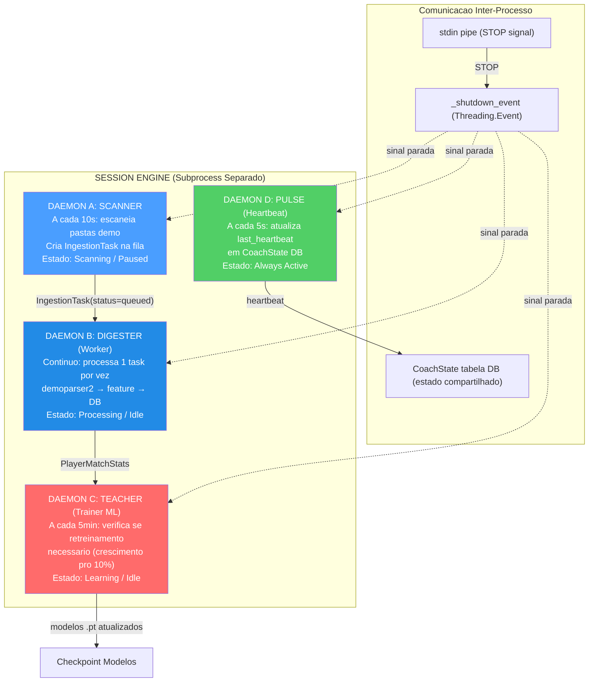

**Ciclo de vida de cada daemon:**

| Daemon | Intervalo | Trabalho por ciclo | Trigger |
| ------ | --------- | ------------------ | ------- |
| **Scanner** | 10 segundos | Escaneia pastas pro e usuario, cria `IngestionTask` para novos `.dem` | Sempre ativo (se estado = Scanning) |
| **Digester** | Continuo | Pega 1 task da fila, executa parsing completo | `_work_available_event` (sinalizado por Scanner) |
| **Teacher** | 300 segundos (5 min) | Verifica crescimento sample pro; se >=10% → `run_full_cycle()` | `pro_count >= last_count x 1.10` |
| **Pulse** | 5 segundos | Atualiza `CoachState.last_heartbeat` no banco | Sempre ativo |

> **Analogia do Digester:** O Digester e como uma **lava-louca incansavel**: pega um prato sujo (demo bruta) da pilha, lava cuidadosamente (parsing com demoparser2, extracao feature, calculo rating HLTV 2.0, enriquecimento RoundStats), seca (normalizacao), coloca na prateleira certa (salva no banco) e entao pega o proximo prato. Nunca pega 2 pratos de uma vez — um de cada vez, para evitar erros. Se a pilha esta vazia, espera pacientemente (sleep 2s + `_work_available_event`) ate que alguem traga novos pratos sujos.

> **Analogia do Teacher:** O Teacher e como um **professor universitario que atualiza seus cursos**. A cada 5 minutos verifica: "Chegaram artigos cientificos novos suficientes (demos pro)?" Se o numero cresceu 10% desde a ultima atualizacao, diz: "E hora de reescrever as apostilas!" e lanca um ciclo completo de treinamento. Apos o treinamento, tambem executa uma verificacao meta-shift: "A media dos profissionais mudou? O meta do jogo se deslocou?" — garantindo que o coaching permaneca sempre atual.

**Sequencia de shutdown:**

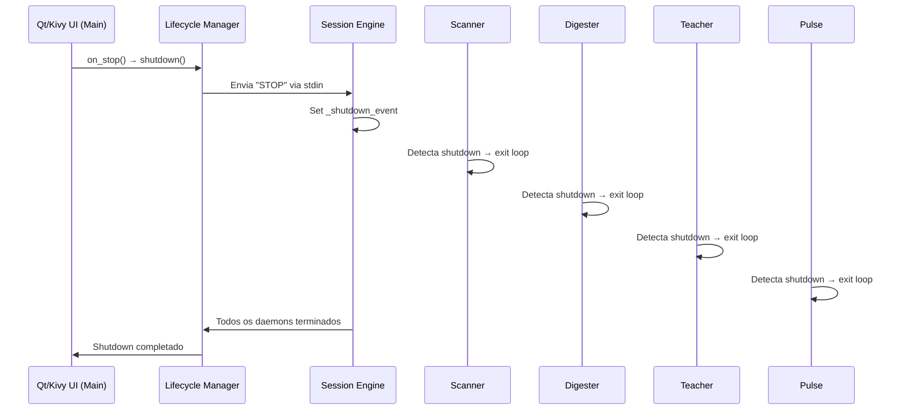

**Detalhes de implementacao dos daemons:**

| Daemon | Metodo Principal | Loop Interno | Condicao de Saida |
| ------ | ---------------- | ------------ | ----------------- |
| **Scanner** | `_scanner_daemon_loop()` | `while not _shutdown_event.is_set()` → `scan_all_paths()` → `sleep(10)` | `_shutdown_event` set |
| **Digester** | `_digester_daemon_loop()` | `while not _shutdown_event.is_set()` → `_work_available_event.wait(2)` → `process_next_task()` | `_shutdown_event` set |
| **Teacher** | `_teacher_daemon_loop()` | `while not _shutdown_event.is_set()` → `_check_retrain_needed()` → `sleep(300)` | `_shutdown_event` set |
| **Pulse** | `_pulse_daemon_loop()` | `while not _shutdown_event.is_set()` → `state_mgr.heartbeat()` → `sleep(5)` | `_shutdown_event` set |

**Gestao de erros nos daemons:**

Cada daemon e protegido por um `try/except` global. Se um daemon crasha:
1. O erro e logado com traceback completo
2. O `StateManager` registra o erro (`set_error(daemon, message)`)
3. Uma `ServiceNotification` e criada para o usuario
4. O daemon **nao e reiniciado automaticamente** (por design: crash de um daemon indica um bug, nao um erro transitorio)
5. Os outros daemons continuam a funcionar independentemente

> **Analogia:** Cada daemon e um **trabalhador com seu proprio escritorio e sua propria porta**. Se um trabalhador tem um mal-estar (crash), fecha sua porta e coloca um aviso "Temporariamente indisponivel" (ServiceNotification). Os outros trabalhadores nos outros escritorios continuam a trabalhar normalmente. O diretor (Session Engine) toma nota do incidente mas nao tenta reanimar o trabalhador — prefere que um tecnico (o desenvolvedor) investigue a causa antes de faze-lo voltar ao trabalho.

**Zombie Task Cleanup:** Na inicializacao, o Session Engine procura tasks com `status="processing"` restantes de um crash anterior e os reseta para `status="queued"`, permitindo o restauro automatico sem perda de dados.

**Backup Automatico:** Na inicializacao do Session Engine, `BackupManager.should_run_auto_backup()` verifica se um backup e necessario e, em caso afirmativo, cria um checkpoint com label `"startup_auto"`. O backup segue uma rotacao de 7 copias diarias + 4 semanais.

---

### 12.5 Interface Desktop

A interface desktop tem duas implementacoes: **Qt/PySide6** (primaria) e **Kivy/KivyMD** (legacy). Ambas seguem o pattern **MVVM** (Model-View-ViewModel).

#### 12.5.1 Interface Qt (Primaria) — `apps/qt_app/`

**Diretorio:** `Programma_CS2_RENAN/apps/qt_app/`
**Arquivos-chave:** `app.py`, `main_window.py`, `core/i18n_bridge.py`, `core/theme_engine.py`, `screens/`

A interface Qt e construida com **PySide6 (Qt 6)** e utiliza um pattern **MVVM com Qt Signals/Slots**. A `MainWindow` (`QMainWindow`) e composta por uma **sidebar de navegacao** e um **`QStackedWidget`** que hospeda as 14 telas.

> **Analogia:** A interface Qt e como um **painel digital de um carro esportivo moderno**. O painel (QStackedWidget) tem diferentes modos de visualizacao selecionaveis pela barra lateral: a vista "Viagem" (Home), a vista "Navegacao" (Tactical Viewer com QPainter), a vista "Diagnostico" (Coach), a vista "Configuracoes" (Settings). O pattern MVVM com Signals/Slots garante que cada interacao do usuario emita um "sinal" que e capturado pelo "slot" apropriado — como os sensores do carro que se comunicam com o computador de bordo via barramento CAN.

| Especificacao | Detalhe |
|---|---|
| **Framework** | PySide6 (Qt 6 para Python) |
| **Pattern** | MVVM com Qt Signals/Slots |
| **Plataformas** | Windows, macOS, Linux |
| **Resolucao** | Adaptativa, High-DPI nativo |
| **Temas** | 3: CS2 (laranja), CSGO (azul-cinza), CS1.6 (verde) — QSS + QPalette |
| **i18n** | 3 idiomas: EN, IT, PT — JSON + `QtLocalizationManager` |
| **Graficos** | QPainter para mapa tatico, widgets nativos Qt para chart |

**Sistema i18n:** O `QtLocalizationManager` (`core/i18n_bridge.py`) carrega arquivos JSON por idioma (`en.json`, `it.json`, `pt.json`) e gerencia a troca de idioma em runtime via sinais Qt. Cada string UI e resolvida dinamicamente via chave de localizacao.

**Sistema de temas:** O `ThemeEngine` (`core/theme_engine.py`) aplica stylesheets QSS e configura a `QPalette` Qt para cada tema:
- **CS2** — Palette laranja (#FF6600) com fundo escuro, inspirada na UI do CS2
- **CSGO** — Palette azul-cinza (#4A90D9) com tons frios, inspirada no CS:GO
- **CS1.6** — Palette verde (#33CC33) sobre fundo preto, inspirada no look retro do CS 1.6

#### 12.5.2 Interface Kivy (Legacy) — `apps/desktop_app/`

**Diretorio:** `Programma_CS2_RENAN/apps/desktop_app/`
**Arquivos-chave:** `layout.kv`, `wizard_screen.py`, `player_sidebar.py`, `tactical_viewer_screen.py`, `tactical_viewmodels.py`, `tactical_map.py`, `timeline.py`, `widgets.py`, `help_screen.py`, `ghost_pixel.py`

A interface legacy e construida com **Kivy + KivyMD** e segue o pattern **MVVM** (Model-View-ViewModel). O `ScreenManager` gerencia a navegacao entre as telas com transicoes `FadeTransition`.

> **Analogia:** A interface Kivy e como um **painel de um carro esportivo classico**. O painel (ScreenManager) tem diferentes modos de visualizacao que voce pode selecionar: a vista "Viagem" (Home — dashboard geral), a vista "Navegacao" (Tactical Viewer — mapa 2D), a vista "Diagnostico" (Coach — analise detalhada), a vista "Configuracoes" (Settings — personalizacao). Cada vista tem seus indicadores especializados. O pattern MVVM garante que o "motor" (ViewModel) e o "display" (View) sejam separados: se voce mudar o design do painel, o motor continua a funcionar identicamente, e vice-versa.

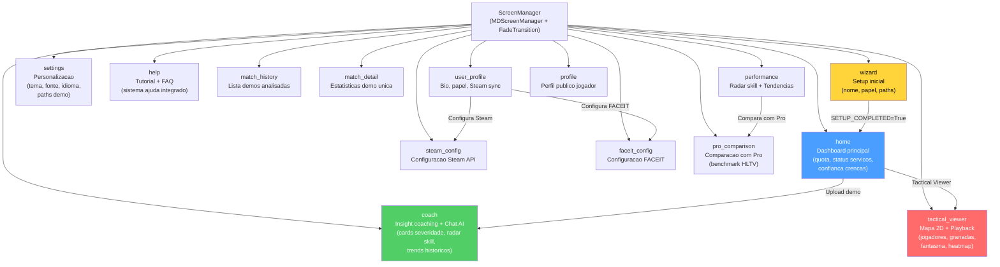

**14 telas da interface:**

| Tela | Papel | Componentes-chave |
| ---- | ----- | ----------------- |
| **Wizard** | Primeira configuracao | Nome jogador, papel, paths pastas demo |
| **Home** | Dashboard | Quota mensal (X/10), status servicos (verde/vermelho), confianca crencas (0-1), tasks ativos, contador partidas processadas |
| **Coach** | Insight coaching | Cards coloridos por severidade, radar skill multi-dimensional, trends historicos, chat AI (Ollama/Claude), tasks ativos |
| **Tactical Viewer** | Reproducao tatica | Mapa 2D com jogadores/granadas/fantasma, timeline com marcadores de eventos, sidebar jogadores CT/T, controles de velocidade (0.25x→8x) |
| **Settings** | Personalizacao | Tema (CS2/CSGO/CS1.6), fonte, tamanho texto, idioma, paths demo, wallpaper |
| **Help** | Suporte usuario | Tutorial interativo, FAQ, troubleshooting |
| **Match History** | Historico partidas | Lista demos analisadas com filtros e ordenacao |
| **Match Detail** | Detalhe partida | Estatisticas detalhadas para uma unica demo analisada |
| **Performance** | Progressos | Radar skill de 5 eixos, graficos de tendencia, comparacoes temporais |
| **User Profile** | Perfil usuario | Bio, papel preferido, sincronizacao Steam/FACEIT |
| **Profile** | Perfil publico | Visualizacao perfil publico do jogador |
| **Steam Config** | Configuracao Steam | Insercao e validacao API key Steam |
| **Pro Comparison** | Comparacao pro | Comparacao estatisticas usuario com jogadores profissionais HLTV, benchmark prestacional |
| **FACEIT Config** | Configuracao FACEIT | Insercao e validacao API key FACEIT |

> **Analogia da Home Screen:** A Home e como a **cabine de comando de uma nave espacial**. O indicador de quota ("5/10 demos este mes") e o **medidor de combustivel**. O status do servico (verde/vermelho) e o **painel dos sistemas vitais**: verde = todos os sistemas operacionais, vermelho = alarme. A confianca das crencas (0.0-1.0) e o **nivel de estabilidade da IA**: 0.0 = a IA nao sabe nada, 1.0 = a IA esta segura de suas analises. O contador das partidas processadas e o **odometro**: quanto caminho o sistema percorreu.

**Widgets personalizados:**

| Widget | Arquivo | Funcao |
| ------ | ------- | ------ |
| `PlayerSidebar` | `player_sidebar.py` | Lista CT/T com icones de papel, saude/armadura, arma atual, dinheiro, e estado vivo/morto |
| `TacticalMap` | `tactical_map.py` | Canvas 2D com rendering multi-nivel: textura mapa → heatmap → jogadores → granadas → fantasma (QPainter em Qt, Canvas Kivy em legacy) |
| `Timeline` | `timeline.py` | Scrubber horizontal com tick numbers, marcadores de eventos coloridos, drag-to-seek, double-click jump |
| `GhostPixel` | `ghost_pixel.py` | Rendering do circulo fantasma semi-transparente (posicao otima predita por RAP) |

**Temas disponiveis:**

A aplicacao suporta **3 temas** selecionaveis da tela Settings, cada um com uma palette de cores e wallpaper personalizados:

| Tema | Palette primaria | Inspiracao |
| ---- | ---------------- | ---------- |
| **CS2** (default) | Azul aco + laranja | Counter-Strike 2 UI moderna |
| **CSGO** | Verde militar + amarelo | Counter-Strike: Global Offensive |
| **CS 1.6** | Marrom escuro + verde lima | Counter-Strike 1.6 classico (nostalgia) |

**Coach Screen — Layout detalhado:**

A tela Coach e a mais complexa da aplicacao, com 5 areas funcionais:

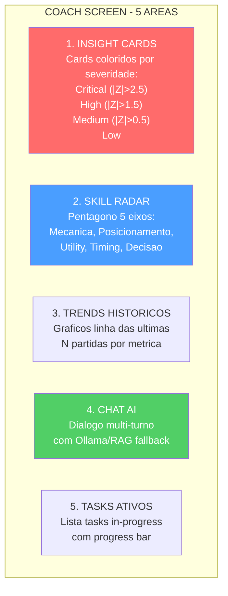

> **Analogia do Coach Screen:** A tela Coach e como o **consultorio do medico apos a consulta**. Os **Insight Cards** sao o laudo imediato: "Pressao alta!" (vermelho), "Colesterol para monitorar" (amarelo), "Boa forma fisica" (verde). O **Radar** e a visualizacao das capacidades fisicas. Os **Trends** sao a comparacao com as consultas anteriores. O **Chat AI** e a possibilidade de fazer perguntas ao medico. Os **Tasks Ativos** mostram os exames ainda em andamento.

**Pattern MVVM no Tactical Viewer:**

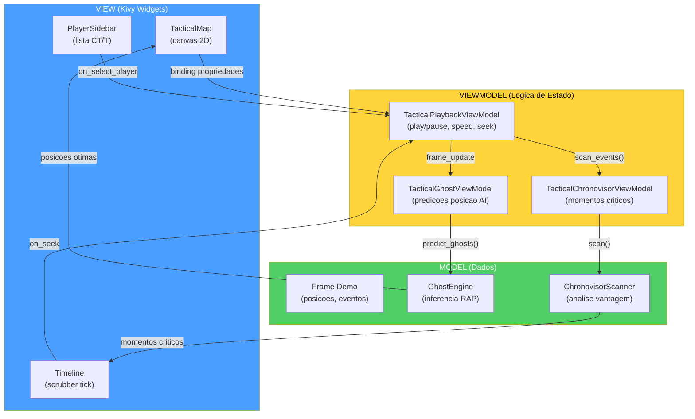

> **Analogia MVVM:** O pattern MVVM e como um **telejornal**: o **Modelo** e o jornalista em campo que coleta os fatos (dados demo, inferencia AI). O **ViewModel** e o editor que organiza as noticias e decide o que e importante (estado de reproducao, velocidade, selecao). A **View** e o apresentador que le as noticias ao publico (rendering na tela Kivy). O jornalista nao sabe como a noticia e apresentada. O apresentador nao sabe como foi coletada. O editor e a ponte entre os dois. Se voce muda o apresentador (novo design UI), a noticia permanece a mesma.

---

### 12.6 Pipeline de Ingestao (`ingestion/`)

**Diretorio:** `Programma_CS2_RENAN/ingestion/`
**Arquivos-chave:** `demo_loader.py`, `steam_locator.py`, `integrity.py`, `registry/`, `pipelines/user_ingest.py`, `pipelines/json_tournament_ingestor.py`

A pipeline de ingestao e o **caminho completo** que um arquivo `.dem` percorre do filesystem ate se tornar insight de coaching no banco. E orquestrada pelo daemon Scanner (descoberta) e pelo daemon Digester (processamento).

> **Analogia:** A pipeline de ingestao e como o **caminho de uma carta atraves dos correios**. (1) O carteiro (Scanner) coleta a carta (arquivo .dem) da caixa postal (pasta demo). (2) O escritorio de triagem (DemoLoader) abre o envelope e extrai o conteudo (parsing com demoparser2). (3) O arquivista (FeatureExtractor) mede e cataloga cada detalhe (25 features por tick). (4) O historiador (RoundStatsBuilder) escreve um resumo por capitulo (estatisticas por round). (5) O bibliotecario (data_pipeline) classifica e organiza o material (normalizacao, split dataset). (6) O medico (CoachingService) examina tudo e escreve um diagnostico (insights de coaching). (7) Por fim, tudo e arquivado (persistencia em banco) para consulta futura.

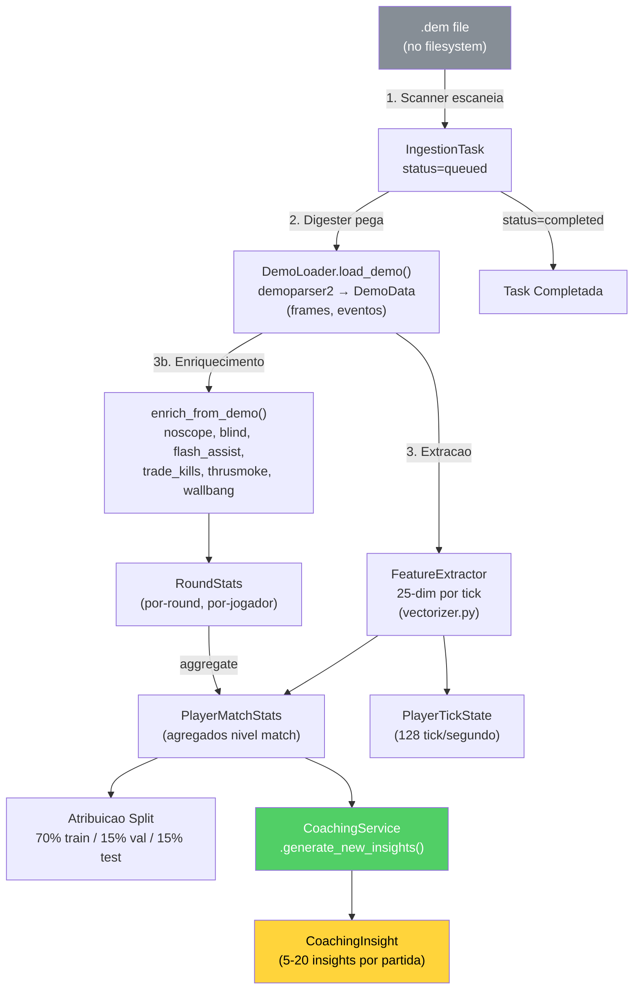

**DemoLoader — O parser do coracao da pipeline:**

O `DemoLoader` e o wrapper em torno do **demoparser2** (biblioteca Rust de alto desempenho) que transforma um arquivo `.dem` binario em estruturas de dados Python:

| Fase de Parsing | Output | Tamanho tipico |
| --------------- | ------ | -------------- |
| 1. Header parsing | Metadata (map, server, duration) | ~100 bytes |
| 2. Frame extraction | Lista de frames (posicao, saude, arma por cada tick) | ~100.000 frames/partida |
| 3. Event extraction | Lista de eventos (kill, death, bomb_plant, round_start, etc.) | ~500-2.000 eventos/partida |
| 4. Player summary | Estatisticas agregadas por jogador | ~10 registros |

**FeatureExtractor** (`backend/processing/feature_engineering/vectorizer.py`):

O FeatureExtractor e o componente que transforma os dados brutos do demo em **vetores numericos de 25 dimensoes** (`METADATA_DIM=25`) utilizaveis pelas redes neurais. **Importante:** estas sao features **a nivel de tick** (128 Hz), nao estatisticas agregadas a nivel de partida. Cada frame individual do jogo produz um vetor 25-dim que captura o estado instantaneo do jogador:

| Dim | Feature | Tipo | Range | Descricao |
| --- | ------- | ---- | ----- | --------- |
| 0 | health | Float | [0, 1] | Saude normalizada |
| 1 | armor | Float | [0, 1] | Armadura normalizada |
| 2 | has_helmet | Binary | 0/1 | Capacete equipado |
| 3 | has_defuser | Binary | 0/1 | Kit defuse equipado |
| 4 | equipment_value | Float | [0, 1] | Valor equipamento normalizado |
| 5 | is_crouching | Binary | 0/1 | Agachado |
| 6 | is_scoped | Binary | 0/1 | Scope ativo |
| 7 | is_blinded | Binary | 0/1 | Cego por flash |
| 8 | enemies_visible | Float | [0, 1] | Inimigos visiveis (normalizado, clamped) |
| 9 | pos_x | Float | [-1, 1] | Posicao X (normalizada +/-pos_xy_extent) |
| 10 | pos_y | Float | [-1, 1] | Posicao Y (normalizada +/-pos_xy_extent) |
| 11 | pos_z | Float | [0, 1] | Posicao Z (normalizada, trata Nuke/Vertigo) |
| 12 | view_x_sin | Float | [-1, 1] | sin(yaw) — continuidade ciclica angulo horizontal |
| 13 | view_x_cos | Float | [-1, 1] | cos(yaw) — continuidade ciclica angulo horizontal |
| 14 | view_y | Float | [-1, 1] | Pitch normalizado (angulo vertical) |
| 15 | z_penalty | Float | [0, 1] | Distincao nivel vertical (penalidade andar) |
| 16 | kast_estimate | Float | [0, 1] | Estimativa KAST (taxa participacao) |
| 17 | map_id | Float | [0, 1] | Hash deterministico do mapa |
| 18 | round_phase | Float | {0, 0.33, 0.66, 1} | Fase economica: pistol/eco/force/full_buy |
| 19 | weapon_class | Float | {0-1.0} | Classe arma: 0=faca, 0.2=pistola, 0.4=SMG, 0.6=rifle, 0.8=sniper, 1.0=pesada |
| 20 | time_in_round | Float | [0, 1] | Segundos no round / 115 (clamped) |
| 21 | bomb_planted | Binary | 0/1 | Bomba plantada |
| 22 | teammates_alive | Float | [0, 1] | Companheiros vivos (count / 4) |
| 23 | enemies_alive | Float | [0, 1] | Inimigos vivos (count / 5) |
| 24 | team_economy | Float | [0, 1] | Media dinheiro time / 16000 (clamped) |

**Normalizacao e bounds:**

A normalizacao e integrada diretamente no FeatureExtractor, com bounds configuraveis via `HeuristicConfig` (externalizada em JSON). A codificacao ciclica dos angulos de vista (sin/cos para o yaw) previne descontinuidades nas bordas 0/360. O `z_penalty` distingue automaticamente os andares em mapas multi-nivel (Nuke, Vertigo). A classe arma utiliza um mapeamento categorico ordinal (6 classes) definido na constante `WEAPON_CLASS_MAP` (inclui tambem granadas=0.1 e equipamento especial=0.05).

**Dataset Split Temporal:**

A subdivisao do dataset segue uma **ordenacao cronologica** rigorosa para prevenir o data leakage temporal:

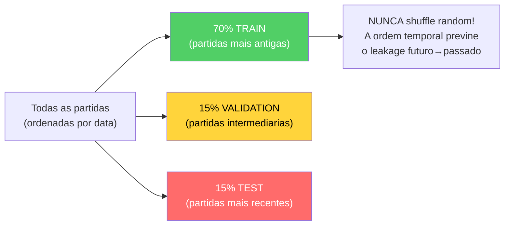

> **Analogia:** A divisao temporal e como preparar um **exame escolar justo**. As questoes do teste (15% test) devem tratar de topicos ensinados DEPOIS dos exercicios (70% train) e das tarefas de casa (15% val). Se as questoes do teste tratassem de topicos estudados antes dos exercicios, o aluno (o modelo) pareceria mais habil do que realmente e — um truque, nao conhecimento verdadeiro.

> **Analogia do Feature Vector:** O vetor de 25 dimensoes e como a **leitura instantanea de 25 sensores** conectados ao jogador a cada momento: 5 sensores "corporais" (saude, armadura, capacete, defuse kit, valor equipamento), 3 sensores "posturais" (agachado, com scope, cego), 1 sensor "visual" (inimigos visiveis), 6 sensores "espaciais" (posicao X/Y/Z e angulos de vista sin/cos/pitch), 1 sensor "andar" (penalidade Z para Nuke/Vertigo), 1 sensor "tatico" (KAST), 3 sensores "contextuais" (mapa, fase economica, classe arma), e 5 sensores "situacionais" (tempo no round, bomba plantada, companheiros/inimigos vivos, economia do time). Diferentemente das estatisticas agregadas a nivel de partida, cada tick produz um novo vetor — 128 leituras por segundo.

**Enrich From Demo — Enriquecimento pos-parsing:**

Apos o parsing base, `enrich_from_demo()` adiciona metricas avancadas calculadas dos eventos:

| Metrica enriquecida | Calculo | Fonte |
| ------------------- | ------- | ----- |
| Trade kills | `TradeKillDetector.detect()` com TRADE_WINDOW_TICKS=192 | Eventos kill/death |
| Flash assists | Contagem blind dentro de janela temporal antes de um kill | Eventos blind + kill |
| Noscope kills | Kill com arma sniper sem scope ativo | Evento kill + weapon state |
| Wallbang kills | Kill atraves de superficies penetraveis | Evento kill com flag penetration |
| Through-smoke kills | Kill com fumo ativo na linha de tiro | Evento kill + smoke position |
| Blind kills | Kill enquanto o jogador esta flashado | Evento kill + flash state |

**Componentes especificos:**

| Componente | Arquivo | Papel |
| ---------- | ------- | ----- |
| **DemoLoader** | `demo_loader.py` | Wrappa `demoparser2`, extrai frames e eventos do arquivo `.dem` |
| **SteamLocator** | `steam_locator.py` | Localiza automaticamente a pasta demo do CS2 via registro Steam / libraryfolders.vdf |
| **IntegrityChecker** | `integrity.py` | Verifica que os arquivos demo sejam validos, completos e nao corrompidos antes do parsing |
| **UserIngestPipeline** | `pipelines/user_ingest.py` | Pipeline completa para demo usuario: parse → enrich → stats → coaching |
| **JsonTournamentIngestor** | `pipelines/json_tournament_ingestor.py` | Importa dados de torneio de arquivos JSON estruturados |
| **Registry** | `registry/registry.py` | Rastreia todas as demos processadas, previne duplicatas |
| **ResourceManager** | `ingestion/resource_manager.py` | Gestao de recursos hardware: CPU/RAM throttling, espaco disco |
| **JsonTournamentIngestor** | `pipelines/json_tournament_ingestor.py` | Importa dados de torneio de arquivos JSON estruturados |
| **RegistryLifecycle** | `registry/lifecycle.py` | Gestao ciclo de vida dos registros de ingestao |

**SteamLocator** (`ingestion/steam_locator.py`) — localizacao automatica demo CS2:

O SteamLocator implementa um algoritmo de **discovery cross-platform** para encontrar automaticamente a pasta das demos do CS2:

| Plataforma | Estrategia | Path tipico |
| ---------- | ---------- | ----------- |
| **Windows** | Registro do sistema → `libraryfolders.vdf` | `C:\Program Files (x86)\Steam\steamapps\common\Counter-Strike Global Offensive\game\csgo\replays` |
| **Linux** | `~/.steam/steam/` → `libraryfolders.vdf` | `~/.steam/steam/steamapps/common/...` |
| **Fallback** | Pergunta ao usuario via UI Settings | Path personalizado |

**IntegrityChecker** (`ingestion/integrity.py`):

Verificacao preliminar de cada arquivo demo antes do parsing custoso:
- **Magic bytes**: `PBDEMS2\0` (CS2 Source 2) ou `HL2DEMO\0` (legacy Source 1)
- **Size bounds**: minimo 1KB (nao vazio), maximo 5GB (nao corrompido/excessivo)
- **Read test**: tenta ler os primeiros N bytes para verificar que o arquivo seja acessivel

> **Analogia do SteamLocator:** O SteamLocator e como um **cao de caca que farreja a pasta do CS2** no seu computador. Sabe que a Steam armazena suas bibliotecas em lugares especificos (registro Windows, `libraryfolders.vdf` em Linux/Mac), e segue os rastros ate a pasta `csgo/replays` onde as demos sao salvas. Se nao consegue encontra-la automaticamente, pede ao usuario que indique o caminho manualmente — mas na maioria dos casos, encontra sozinho.

---

### 12.7 Console de Controle Unificada (`backend/control/`)

**Arquivo:** `Programma_CS2_RENAN/backend/control/console.py`, `ingest_manager.py`, `db_governor.py`, `ml_controller.py`

A Console e um **Singleton** que atua como ponto de coordenacao central para todos os subsistemas backend. E o "quadro de comando" atraves do qual cada parte do sistema pode ser controlada.

> **Analogia:** A Console e como a **torre de controle de um aeroporto**. Tem 4 telas: uma para o radar (ServiceSupervisor — monitora os servicos em execucao), uma para as pistas (IngestionManager — coordena a chegada das demos), uma para a manutencao (DatabaseGovernor — verifica a integridade do storage) e uma para o treinamento dos pilotos (MLController — gerencia o ciclo de vida do aprendizado automatico). O controlador de trafego aereo (Console Singleton) coordena tudo de um unico posto.

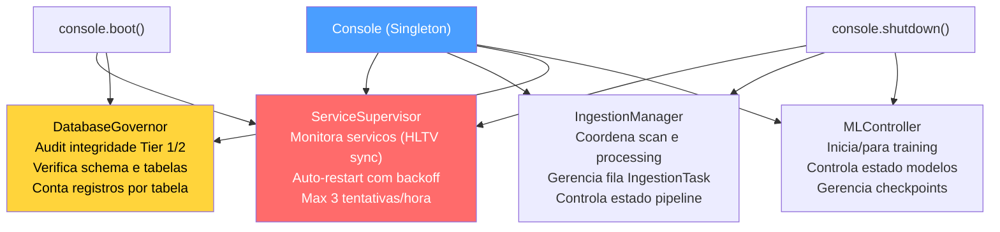

**Sequencia de boot da Console:**

1. `ServiceSupervisor` inicia o servico "hunter" (HLTV sync) como processo monitorado
2. `DatabaseGovernor` executa um audit de integridade: verifica todas as tabelas, conta registros, controla schema
3. `MLController` permanece em estado de espera — o training e gerenciado pelo daemon Teacher
4. `IngestionManager` permanece idle — o trabalho ativo e gerenciado pelos daemons Scanner/Digester

**MLControlContext — Controle Live do Treinamento:**

O `MLController` utiliza um token de controle chamado `MLControlContext` (`backend/control/ml_controller.py`) que e passado aos ciclos de treinamento para permitir **intervencao em tempo real** pelo operador. Isso substitui a abordagem anterior baseada em `StopIteration` por um sistema thread-safe mais robusto.

> **Analogia:** MLControlContext e como o **controle remoto de um player de video**. O operador pode pressionar **Pausa** (o training para imediatamente, sem perda de dados), **Play** (o training retoma do ponto exato onde havia parado), **Stop** (o training termina com uma excecao controlada `TrainingStopRequested`) ou ajustar a **velocidade** (throttle: 0.0 = velocidade maxima, 1.0 = atraso maximo). O mecanismo usa `threading.Event` para evitar busy-wait durante a pausa — o thread de training simplesmente dorme ate receber o sinal de retomada.

```mermaid
flowchart LR
    OP["Operador"] -->|"request_pause()"| CTX["MLControlContext"]
    OP -->|"request_resume()"| CTX
    OP -->|"request_stop()"| CTX
    OP -->|"set_throttle(0.5)"| CTX
    CTX -->|"check_state()<br/>em cada batch"| LOOP["Ciclo Training"]
    LOOP -->|"Pausa: Event.wait()"| PAUSE["Training Suspenso<br/>(nenhum busy-wait)"]
    LOOP -->|"Stop: raise<br/>TrainingStopRequested"| STOP["Training Terminado<br/>(checkpoint salvo)"]
    style CTX fill:#4a9eff,color:#fff
    style PAUSE fill:#ffd43b,color:#000
    style STOP fill:#ff6b6b,color:#fff
```

| Comando | Metodo | Efeito |
| ------- | ------ | ------ |
| **Pausa** | `request_pause()` | `_resume_event.clear()` → bloqueia `check_state()` |
| **Retomar** | `request_resume()` | `_resume_event.set()` → desbloqueia o training |
| **Stop** | `request_stop()` | Lanca `TrainingStopRequested` (excecao custom) |
| **Throttle** | `set_throttle(factor)` | Adiciona `time.sleep(factor)` apos cada batch |

---

### 12.8 Onboarding e Fluxo de Novo Usuario

**Arquivo:** `Programma_CS2_RENAN/backend/onboarding/new_user_flow.py`

O `OnboardingManager` guia os novos usuarios atraves de uma **progressao de 3 fases** que se adapta automaticamente a quantidade de dados disponiveis.

> **Analogia:** O onboarding e como o **tutorial de um videogame RPG**. Quando voce comeca um novo jogo (nenhuma demo carregada), o jogo o guia passo a passo: "Bem-vindo, aventureiro! Carregue sua primeira demo para comecar." Apos 1-2 demos, o sistema diz: "Bom comeco! Carregue mais N demos para desbloquear a analise estavel." Apos 3+ demos, o sistema anuncia: "Seu coach esta pronto! As analises personalizadas agora estao ativas." Cada fase desbloqueia gradualmente as funcionalidades do programa, impedindo que o sistema mostre resultados nao confiaveis quando nao tem dados suficientes.

```mermaid
stateDiagram-v2
    [*] --> AWAITING: 0 demos carregadas
    AWAITING --> BUILDING: 1-2 demos carregadas
    BUILDING --> READY: 3+ demos carregadas

    state AWAITING {
        AW: Mensagem: Bem-vindo! Carregue sua primeira demo.
        note right of AW: Nenhuma analise disponivel
    }
    state BUILDING {
        BU: Mensagem: Carregue N demos a mais para baseline estavel.
        note right of BU: Analise parcial disponivel
    }
    state READY {
        RE: Mensagem: Coach pronto! Analise personalizada ativa.
        note right of RE: Todas as funcionalidades desbloqueadas
    }
```

**Wizard Screen (Primeira Configuracao):**

Na primeira execucao (`SETUP_COMPLETED = False`), o usuario e guiado atraves do Wizard:

1. **Nome jogador** — O nome que aparecera nas analises
2. **Papel preferido** — Entry Fragger, AWPer, Lurker, Support ou IGL
3. **Paths pastas demo** — Onde o sistema procura automaticamente as demos
4. Ao completar: `SETUP_COMPLETED = True`, redirect para a Home

**Cache das quotas (Task 2.16.1):** A contagem de demos e cacheada por 60 segundos para evitar queries DB repetidas. `invalidate_cache()` e chamado apos cada novo upload, garantindo que a UI sempre mostre a contagem correta sem sobrecarregar o banco.

**Help System** (`backend/knowledge/help_system.py`):

O sistema de ajuda integrado fornece suporte contextual ao usuario:

| Funcionalidade | Implementacao |
| -------------- | ------------- |
| **Tutorial interativo** | Guias step-by-step para as funcionalidades principais |
| **FAQ contextuais** | Perguntas frequentes filtradas por tela atual |
| **Troubleshooting** | Arvore decisoria para problemas comuns (Steam path nao encontrado, demo nao parsed, coaching vazio) |
| **Tooltips** | Explicacoes inline para metricas complexas (KAST, HLTV 2.0 Rating, ADR) |

> **Analogia:** O Help System e como ter um **assistente bibliotecario** sempre disponivel. Se voce esta na secao "Narrativa" (Tactical Viewer), ele te ajuda com as duvidas sobre a leitura dos mapas. Se voce esta em "Ciencias" (Coach), ele te explica o que significam as metricas. Se algo nao funciona, ele te guia passo a passo na resolucao do problema — como um fluxograma "Se a torneira nao da agua → verifique a valvula → verifique o cano → chame o encanador."

---

### 12.9 Arquitetura de Storage (`backend/storage/`)

**Diretorio:** `Programma_CS2_RENAN/backend/storage/`
**Arquivos-chave:** `database.py`, `db_models.py`, `match_data_manager.py`, `storage_manager.py`, `maintenance.py`, `state_manager.py`, `stat_aggregator.py`, `backup.py`

O sistema de storage utiliza uma arquitetura **three-tier storage** baseada em SQLite em modo WAL (Write-Ahead Logging), que permite leituras e escritas concorrentes sem bloqueios.

> **Analogia:** A arquitetura de storage e como um **sistema bibliotecario de 3 niveis**. O **terreo** (`database.db`, 18 tabelas) contem o catalogo geral, os cartoes de todos os leitores (jogadores), a base de conhecimento tatica (RAG), o banco de experiencias COPER, as resenhas dos criticos (insights de coaching) e o registro de emprestimos (tasks de ingestao) — tudo em um unico grande arquivario sempre disponivel. O **arquivario separado** (`hltv_metadata.db`, 3 tabelas) contem os perfis dos jogadores profissionais e suas estatisticas — separado porque e atualizado por um processo diferente (HLTV sync) para evitar contencao de locks. Alem desses, os **bancos por-match** (`match_XXXX.db`) contem os manuscritos originais completos (dados tick-a-tick das partidas) — cada um em uma caixa separada para evitar que o arquivario principal fique pesado demais. O modo WAL e como ter uma **porta giratoria**: muitas pessoas podem entrar para ler simultaneamente, e alguem pode escrever sem bloquear a entrada.

```mermaid
flowchart TB
    subgraph T12["database.db (Monolite SQLite WAL — 18 tabelas)"]
        PMS["PlayerMatchStats<br/>(32 campos por jogador/partida)"]
        CS["CoachState<br/>(estado global do sistema)"]
        IT["IngestionTask<br/>(fila de trabalho)"]
        CI["CoachingInsight<br/>(conselhos gerados)"]
        PP["PlayerProfile<br/>(perfil usuario)"]
        TK["TacticalKnowledge<br/>(base RAG 384-dim)"]
        CE["CoachingExperience<br/>(banco experiencia COPER)"]
        RS["RoundStats<br/>(estatisticas por-round)"]
        SN["ServiceNotification<br/>(alert de sistema)"]
        EXT["Ext_PlayerPlaystyle +<br/>Ext_TeamRoundStats"]
        CALIB_ST["CalibrationSnapshot +<br/>RoleThresholdRecord"]
        MATCH_ST["MatchResult + MapVeto"]
        DL_ST["DataLineage<br/>(proveniencia append-only)"]
        DQM_ST["DataQualityMetric<br/>(metricas qualidade append-only)"]
    end
    subgraph T_HLTV["hltv_metadata.db (Dados Pro — 3 tabelas)"]
        PRO["ProPlayer + ProTeam +<br/>ProPlayerStatCard"]
    end
    subgraph T3["match_XXXX.db (Per-Match SQLite)"]
        PTS["PlayerTickState<br/>(~100.000 linhas por partida)<br/>Posicao, saude, arma<br/>a cada 1/128 de segundo"]
    end
    T12 -->|"Referencia"| T3
    T_HLTV -->|"Baseline pro para<br/>comparacao coaching"| T12

    style T12 fill:#4a9eff,color:#fff
    style T_HLTV fill:#ffd43b,color:#000
    style T3 fill:#868e96,color:#fff
```

**As 21 tabelas SQLModel:**

| # | Tabela | Banco | Categoria | Descricao |
| - | ------ | ----- | --------- | --------- |
| 1 | `PlayerMatchStats` | database.db | Core | Estatisticas agregadas por jogador/partida (32 campos) |
| 2 | `PlayerTickState` | database.db | Core | Estado por-tick (128 Hz), tambem arquivado em DBs por-match separados |
| 3 | `PlayerProfile` | database.db | Usuario | Perfil usuario (nome, papel, Steam ID, quota mensal) |
| 4 | `RoundStats` | database.db | Core | Estatisticas isoladas por round (kills, rating, enriquecimento) |
| 5 | `CoachingInsight` | database.db | Coaching | Conselhos gerados pelo servico de coaching |
| 6 | `CoachingExperience` | database.db | Coaching | Banco de experiencias COPER (contexto, outcome, eficacia, TrueSkill mu/sigma, replay priority — KT-01) |
| 7 | `IngestionTask` | database.db | Sistema | Fila de trabalho para o daemon Digester |
| 8 | `CoachState` | database.db | Sistema | Estado global (training metrics, heartbeat, status) |
| 9 | `ServiceNotification` | database.db | Sistema | Mensagens de erro/evento dos daemons → UI |
| 10 | `TacticalKnowledge` | database.db | Conhecimento | Base RAG (embedding 384-dim em JSON) |
| 11 | `ProPlayer` | hltv_metadata.db | Pro | Perfis jogadores profissionais |
| 12 | `ProTeam` | hltv_metadata.db | Pro | Metadata times profissionais |
| 13 | `ProPlayerStatCard` | hltv_metadata.db | Pro | Estatisticas sazonais por jogador pro |
| 14 | `Ext_PlayerPlaystyle` | database.db | Externo | Dados estilo de jogo de CSV (para NeuralRoleHead) |
| 15 | `Ext_TeamRoundStats` | database.db | Externo | Estatisticas torneio externas |
| 16 | `MatchResult` | database.db | Partidas | Resultados das partidas |
| 17 | `MapVeto` | database.db | Partidas | Historico selecao de mapas |
| 18 | `CalibrationSnapshot` | database.db | Sistema | Registro de calibracao do modelo de crenca (timestamp, amostras, resultado) |
| 19 | `RoleThresholdRecord` | database.db | Sistema | Limites aprendidos para a classificacao dos papeis (persistidos entre reinicios) |
| 20 | `DataLineage` | database.db | Proveniencia | Registro append-only de proveniencia de dados: entity_type, entity_id, source_demo, pipeline_version, processing_step |
| 21 | `DataQualityMetric` | database.db | Proveniencia | Metricas qualidade append-only por run: run_id, run_type, metric_name, metric_value, sample_count |

**Enum de suporte (nao tabelas):**

| Enum | Tipo | Descricao |
| ---- | ---- | --------- |
| `DatasetSplit` | `str, Enum` | Categorias split (train/val/test/unassigned) — usado como constraint em `PlayerMatchStats.dataset_split` |
| `CoachStatus` | `str, Enum` | Estados do coach (Paused/Training/Idle/Error) — usado como constraint em `CoachState.status` |

**Componentes de Storage detalhados:**

**MatchDataManager** (`backend/storage/match_data_manager.py`) — o componente maior do storage layer:

O MatchDataManager e responsavel pela gestao dos dados por-partida de alta densidade (PlayerTickState com ~100.000 linhas por partida). Para evitar que o banco principal cresca de forma descontrolada, cada partida tem seu proprio banco SQLite separado (`match_XXXX.db`).

| Metodo | Descricao |
| ------ | --------- |
| `create_match_db(demo_name)` | Cria um novo banco por-match com schema `PlayerTickState` |
| `store_tick_data(demo_name, ticks)` | Bulk insert de tick data no DB dedicado |
| `load_match_frames(demo_name)` | Carrega todos os frames para o Tactical Viewer |
| `get_match_db_path(demo_name)` | Resolve o path do DB por-match |
| `list_available_matches()` | Lista todos os matches com DB disponiveis |
| `delete_match_data(demo_name)` | Remove o DB por-match e atualiza o registro |
| `get_match_statistics(demo_name)` | Calcula estatisticas agregadas do tick data |

> **Analogia:** O MatchDataManager e como um **arquivista que gerencia as caixas dos manuscritos originais**. Cada partida e um manuscrito volumoso demais para caber no arquivario geral (database.db), entao e conservada em uma caixa separada com uma etiqueta (match_XXXX.db). O arquivista sabe exatamente onde esta cada caixa, pode abri-la sob demanda e, quando a caixa fica muito velha, pode move-la para o arquivo frio.

**StorageManager** (`backend/storage/storage_manager.py`):

O StorageManager e o **coordenador de alto nivel** do storage que gerencia quotas, uploads e ciclo de vida dos dados:

| Responsabilidade | Implementacao |
| ---------------- | ------------- |
| **Quota mensal** | `can_user_upload()` → verifica `MAX_DEMOS_PER_MONTH=10` e `MAX_TOTAL_DEMOS=100` |
| **Upload flow** | `handle_demo_upload(path)` → validacao → copia em working dir → cria IngestionTask |
| **Limpeza** | `cleanup_old_data(days)` → remove match DB e tasks antigos |
| **Espaco disco** | `get_storage_usage()` → report dimensoes para cada banco e diretorio |

**StateManager** (`backend/storage/state_manager.py`):

O StateManager e um **Singleton** que mantem o estado runtime do sistema e o persiste no banco via a tabela `CoachState`:

| Metodo | Proposito |
| ------ | --------- |
| `update_status(daemon, text)` | Atualiza o estado de um daemon especifico |
| `heartbeat()` | Atualiza o timestamp `last_heartbeat` |
| `get_state()` | Retorna o estado atual como objeto `CoachState` |
| `set_error(daemon, message)` | Registra um erro para um daemon com timestamp |
| `update_training_metrics(epoch, loss, val_loss, eta)` | Atualiza as metricas de training em tempo real |
| `get_belief_confidence()` | Retorna o nivel de confianca do modelo de crenca (0.0-1.0) |

**StatAggregator** (`backend/storage/stat_aggregator.py`):

Calcula estatisticas agregadas a partir dos dados brutos por-round:

| Agregacao | Formula | Uso |
| --------- | ------- | --- |
| `avg_kills` | `mean(RoundStats.kills)` | Dashboard, radar chart |
| `avg_adr` | `mean(RoundStats.damage_dealt / rounds)` | Comparacao pro |
| `avg_kast` | `mean(rounds_with_kast / total_rounds)` | Metrica HLTV |
| `accuracy` | `sum(hits) / sum(shots_fired)` | Performance mecanica |
| `trade_kill_rate` | `trade_kills / team_deaths` | Trabalho de equipe |

**BackupManager** (`backend/storage/backup.py`):

| Caracteristica | Detalhe |
| -------------- | ------- |
| **Rotacao diaria** | 7 copias — a mais antiga e sobrescrita |
| **Rotacao semanal** | 4 copias — backup semanal adicional |
| **Trigger automatico** | Na inicializacao do Session Engine via `should_run_auto_backup()` |
| **Trigger manual** | Via Console ou UI Settings |
| **Formato** | Copia completa do arquivo `.db` (nao dump SQL) |
| **Etiquetagem** | `startup_auto`, `manual`, `pre_migration` |

**Maintenance** (`backend/storage/maintenance.py`):

| Operacao | Frequencia | Proposito |
| -------- | ---------- | --------- |
| `vacuum()` | Mensal | Compacta o banco, recupera espaco de registros deletados |
| `analyze()` | Apos cada bulk insert | Atualiza as estatisticas do otimizador query SQLite |
| `wal_checkpoint()` | Na inicializacao | Forca o merge do WAL no banco principal |
| `integrity_check()` | Na inicializacao | `PRAGMA integrity_check` — verifica coerencia estrutural |

**DbMigrate** (`backend/storage/db_migrate.py`):

Wrapper em torno do Alembic que automatiza a execucao das migracoes:

```mermaid
flowchart LR
    BOOT["main.py (Fase 3)"]
    BOOT --> CHECK["db_migrate.check_pending()"]
    CHECK -->|"Migracoes pendentes"| APPLY["alembic.upgrade('head')"]
    CHECK -->|"Schema atualizado"| SKIP["Nenhuma acao"]
    APPLY --> VERIFY["Verifica schema pos-migracao"]
    VERIFY -->|"OK"| CONTINUE["Continua inicializacao"]
    VERIFY -->|"Erro"| ABORT["TERMINACAO<br/>Schema incompativel"]
    style CONTINUE fill:#51cf66,color:#fff
    style ABORT fill:#ff6b6b,color:#fff
```

**Connection Pooling e Concorrencia:**

| Parametro | Valor | Proposito |
| --------- | ----- | --------- |
| `check_same_thread` | `False` | Permite acesso multi-thread |
| `timeout` | 30 segundos | Busy timeout para contencao WAL |
| `pool_size` | 1 | Unico escritor SQLite (seguranca single-writer) |
| `max_overflow` | 4 | Conexoes overflow para picos de carga |
| WAL mode | Habilitado | Leituras concorrentes ilimitadas |

---

### 12.10 Motor de Playback e Viewer Tatico

**Arquivos:** `Programma_CS2_RENAN/core/playback.py`, `playback_engine.py`, `apps/desktop_app/tactical_viewer_screen.py`, `tactical_map.py`, `timeline.py`, `player_sidebar.py`

O sistema de playback tatico permite ao usuario **reviver as proprias partidas** em um mapa 2D interativo, com overlay AI (posicao fantasma otima), marcadores de eventos (kills, plantagens de bomba) e controles de reproducao completos.

> **Analogia:** O Tactical Viewer e como um **sistema de replay esportivo de nivel profissional**. Imagine poder assistir as suas partidas de futebol da perspectiva de um drone aereo, com a possibilidade de desacelerar, acelerar, pausar, e com um assistente AI que te mostra "onde voce deveria ter estado" como uma sombra transparente no campo. Alem disso, uma timeline inteligente destaca automaticamente os momentos-chave: "Minuto 23:15 — voce perdeu a vantagem aqui" (marcador vermelho) ou "Minuto 34:02 — jogada excelente!" (marcador verde). Voce pode clicar em qualquer marcador e o replay pula diretamente para aquele momento.

```mermaid
flowchart TB
    subgraph VIEWER["TACTICAL VIEWER - COMPONENTES"]
        MAP["TacticalMap (QPainter Qt / Canvas Kivy)<br/>Rendering 2D: jogadores (circulos coloridos),<br/>granadas (overlay HE/molotov/fumo/flash),<br/>heatmap (fundo calor gaussiano),<br/>fantasma AI (circulo transparente posicao otima)"]
        TIMELINE["Timeline (Scrubber)<br/>Barra de rolagem com tick numbers,<br/>marcadores eventos (kills, plantagens),<br/>drag para buscar, double-click para pular"]
        SIDEBAR["PlayerSidebar (CT + T)<br/>Lista jogadores por time,<br/>saude, armadura, arma, dinheiro,<br/>jogador selecionado destacado"]
        CONTROLS["Controles Playback<br/>Play/Pause, velocidade (0.25x → 8x),<br/>seletor round/segmento,<br/>toggle fantasma on/off"]
    end
    subgraph ENGINE["MOTORES"]
        PBE["PlaybackEngine<br/>Frame rate 60 FPS,<br/>interpolacao entre frames 64-tick,<br/>gestao velocidade variavel"]
        GE["GhostEngine<br/>Inferencia RAP em tempo real,<br/>optimal_pos delta x 500.0,<br/>fallback (0.0, 0.0) se erro"]
        CS["ChronovisorScanner<br/>Analise vantagem temporal,<br/>deteccao momentos criticos,<br/>classificacao jogada/erro"]
    end
    MAP --> PBE
    TIMELINE --> PBE
    SIDEBAR --> PBE
    CONTROLS --> PBE
    PBE --> GE
    PBE --> CS
    GE -->|"posicoes fantasma"| MAP
    CS -->|"marcadores eventos"| TIMELINE

    style MAP fill:#4a9eff,color:#fff
    style GE fill:#ff6b6b,color:#fff
    style CS fill:#51cf66,color:#fff
```

**PlaybackEngine — Arquitetura interna:**

O PlaybackEngine gerencia a reproducao frame-by-frame com interpolacao temporal. Na implementacao Qt, o timer de atualizacao utiliza `QTimer` em vez de `Kivy Clock.schedule_interval`, mantendo a mesma logica de interpolacao e buffering:

| Caracteristica | Detalhe |
| -------------- | ------- |
| **Frame rate** | 60 FPS (interpolacao de 64-tick nativo do demo) |
| **Velocidade variavel** | 0.25x (slow-mo), 0.5x, 1x (normal), 2x, 4x, 8x (fast-forward) |
| **Interpolacao** | Linear entre frames adjacentes para movimentos fluidos |
| **Buffering** | Pre-carrega 120 frames antecipadamente para evitar lag |
| **Seek** | Acesso direto a qualquer tick via indice |
| **Round selection** | Pula diretamente ao inicio de um round especifico |

**GhostEngine — Inferencia em tempo real:**

O GhostEngine e o componente que transforma as predicoes do RAP Coach em **posicoes fantasma visiveis no mapa**:

```mermaid
flowchart LR
    FRAME["Frame atual<br/>(posicoes jogadores)"]
    FRAME --> EXTRACT["Extrai feature vector<br/>(vectorizer.py, 25-dim)"]
    EXTRACT --> RAP["RAP Coach forward()<br/>→ optimal_position_delta"]
    RAP --> SCALE["Escala delta x 500.0<br/>(unidades mundo CS2)"]
    SCALE --> POS["Posicao fantasma =<br/>posicao_atual + delta_escalado"]
    POS --> RENDER["Rendering circulo<br/>semi-transparente no mapa"]
    RAP -->|"Erro/Modelo ausente"| FALLBACK["Fallback: (0.0, 0.0)<br/>Nenhum fantasma mostrado"]

    style RAP fill:#ff6b6b,color:#fff
    style RENDER fill:#51cf66,color:#fff
    style FALLBACK fill:#868e96,color:#fff
```

> **Analogia do GhostEngine:** O fantasma e como um **treinador invisivel** que corre no campo ao seu lado. Assiste a mesma partida que voce, mas conhece a posicao otima onde voce deveria estar. Sua sombra semi-transparente no mapa diz: "Voce teria estado mais seguro e mais eficaz aqui." O fator x500.0 converte os pequenos deltas do modelo (numeros entre -1 e +1) em distancias reais no mapa (centenas de unidades mundo). Se o modelo nao esta carregado, o fantasma simplesmente desaparece — nao mostra posicoes erradas.

**ChronovisorScanner — Deteccao de momentos criticos:**

O ChronovisorScanner analisa a partida inteira e identifica os **momentos decisivos** baseando-se na mudanca de vantagem:

| Tipo momento | Condicao | Cor marcador |
| ------------ | -------- | ------------ |
| **Erro critico** | Morte em vantagem numerica (ex. 4v3 → 3v3) | Vermelho |
| **Jogada excelente** | Kill em desvantagem numerica (ex. 2v3 → 2v2) | Verde |
| **Plantagem bomba** | Evento bomb_planted com timer | Amarelo |
| **Clutch** | Vitoria 1vN (N >= 2) | Ouro |
| **Eco round win** | Vitoria com equipamento < $2.000 | Azul |

Cada momento e posicionado na Timeline como um marcador clicavel. O clique pula o playback diretamente para aquele tick.

**Fluxo de carregamento do viewer (One-Click):**

1. O usuario clica "Tactical Viewer" da Home
2. Se nenhuma demo esta carregada → `trigger_viewer_picker()` abre o file picker automaticamente
3. O usuario seleciona um arquivo `.dem`
4. Aparece um dialogo "Reconstrucao Dinamica 2D em Andamento..."
5. Uma thread em background executa `_execute_viewer_parse(path)` → `DemoLoader.load_demo()`
6. Ao completar: dismissao do dialogo, carregamento frames no PlaybackEngine
7. O mapa e renderizado com os jogadores no frame 0

---

### 12.11 Dados Espaciais e Gestao de Mapas

**Arquivos:** `Programma_CS2_RENAN/core/spatial_data.py`, `spatial_engine.py`, `data/map_config.json`

O sistema de gestao de mapas traduz as **coordenadas mundo do CS2** (valores tipicos: -2000 a +2000 em X/Y) em **coordenadas pixel** na textura do mapa (0.0 a 1.0 normalizado), e vice-versa.

> **Analogia:** A gestao de mapas e como um **sistema GPS para o mundo do CS2**. Cada mapa tem sua "projecao cartografica": um ponto de origem (canto superior esquerdo), uma escala (quantas unidades de jogo por pixel) e, para mapas multi-nivel como Nuke, um **separador de andares** (z_cutoff = -495 para Nuke). O GPS sabe que se sua coordenada Z esta acima de -495, voce esta no andar superior, caso contrario no andar inferior. Essa informacao e crucial para o GhostEngine e para o rendering correto no mapa tatico.

```mermaid
flowchart LR
    WORLD["Coordenadas Mundo CS2<br/>(pos_x=-1200, pos_y=800, pos_z=100)"]
    WORLD -->|"MapMetadata.world_to_radar()"| NORM["Coordenadas Normalizadas<br/>(0.35, 0.62)"]
    NORM -->|"x dimensao textura"| PIXEL["Coordenadas Pixel<br/>(224px, 397px)"]
    PIXEL -->|"rendering no canvas"| MAP["Ponto no Mapa 2D"]

    MAP -->|"clique usuario"| PIXEL2["Pixel Clicado"]
    PIXEL2 -->|"MapMetadata.radar_to_world()"| WORLD2["Coordenadas Mundo<br/>(para query AI)"]

    style WORLD fill:#ff6b6b,color:#fff
    style NORM fill:#ffd43b,color:#000
    style MAP fill:#51cf66,color:#fff
```

**MapMetadata** (dataclass imutavel para cada mapa):

| Campo | Exemplo (Dust2) | Proposito |
| ----- | --------------- | --------- |
| `pos_x` | -2476 | X do canto superior esquerdo em unidades mundo |
| `pos_y` | 3239 | Y do canto superior esquerdo em unidades mundo |
| `scale` | 4.4 | Unidades de jogo por pixel da textura |
| `z_cutoff` | `None` | Separador de nivel (apenas mapas multi-nivel) |
| `level` | `"single"` | Tipo: "single", "upper", "lower" |
| `texture_width` | 1024 | Largura textura radar em pixel |
| `texture_height` | 1024 | Altura textura radar em pixel |

**MapManager** (`core/map_manager.py`):

O MapManager e o componente de alto nivel que coordena o carregamento dos mapas para a interface:

| Metodo | Proposito |
| ------ | --------- |
| `get_map_metadata(map_name)` | Retorna MapMetadata para o mapa requisitado |
| `load_radar_texture(map_name)` | Carrega textura PNG do mapa radar do cache ou disco |
| `get_available_maps()` | Lista dos mapas suportados com metadata |
| `world_to_pixel(pos, map_name)` | Shortcut para conversao coordenadas mundo → pixel |

**Mapas multi-nivel suportados:**

| Mapa | z_cutoff | Niveis | Notas |
| ---- | -------- | ------ | ----- |
| **Nuke** | -495 | upper / lower | Dois plant sites em andares diferentes |
| **Vertigo** | 11700 | upper / lower | Arranha-ceu com duas areas jogaveis |
| Todos os outros | `None` | single | Mapas de nivel unico |

**SpatialEngine** (`core/spatial_engine.py`):

O SpatialEngine adiciona capacidades de **raciocinio espacial** ao sistema de coordenadas base:

| Metodo | Input | Output | Uso |
| ------ | ----- | ------ | --- |
| `distance_2d(pos_a, pos_b)` | Duas coordenadas mundo | Float (unidades mundo) | Calculo distancia de engajamento |
| `is_visible(pos_a, pos_b, obstacles)` | Duas pos + obstaculos | Bool | Linha de visao (simplificada) |
| `get_zone(pos, map_name)` | Coordenada + mapa | String (ex. "A_site") | Classificacao zona tatica |
| `nearest_cover(pos, map_name)` | Coordenada + mapa | Coordenada cobertura | Sugestao posicional |

**AssetManager** (`core/asset_manager.py`):

Gerencia o carregamento das texturas dos mapas e dos assets UI:

| Asset | Formato | Tamanho tipico | Cache |
| ----- | ------- | -------------- | ----- |
| Textura mapa (radar) | PNG 1024x1024 | ~500KB | Sim (in-memory) |
| Icones jogador | PNG 32x32 | ~2KB | Sim |
| Fontes (JetBrains Mono, YUPIX) | TTF | ~200KB | Sim (registradas no Kivy) |
| Wallpapers temas | PNG 1920x1080 | ~2MB | Lazy load |

> **Analogia do AssetManager:** O AssetManager e como o **almoxarife do teatro**. Sabe exatamente onde estao armazenados todos os objetos de cena (texturas, fontes, icones), os carrega sob demanda, e mantem os mais usados no **bolso** (cache) para nao ter que voltar ao almoxarifado toda vez. Se um objeto nao existe, retorna um placeholder generico — o show deve continuar.

---

### 12.12 Observabilidade e Logging

**Arquivo:** `Programma_CS2_RENAN/observability/logger_setup.py`
**Arquivos relacionados:** `backend/storage/state_manager.py`, `backend/services/telemetry_client.py`

O sistema de observabilidade garante que cada evento significativo seja **rastreavel, estruturado e persistente**. O client de telemetria (`telemetry_client.py`) utiliza **`httpx`** (HTTP assincrono) para o envio nao-bloqueante de metricas e eventos, evitando que latencias de rede afetem o desempenho da aplicacao.

> **Analogia:** A observabilidade e como o **sistema de cameras de seguranca e registros de um edificio**. O logging estruturado (`get_logger()`) e a camera que registra tudo com timestamp e etiquetas ("quem fez o que, onde e quando"). O StateManager e o **quadro no saguao** que mostra o estado atual de cada andar (daemon): "Andar 1 (Scanner): Scanning. Andar 2 (Digester): Idle. Andar 3 (Teacher): Learning." As ServiceNotification sao os **anuncios do interfone** que informam os residentes (o usuario) de eventos importantes ou erros.

```mermaid
flowchart TB
    subgraph LOG["LOGGING ESTRUTURADO"]
        GL["get_logger(name)<br/>→ logging.Logger"]
        GL --> FILE["FileHandler<br/>logs/cs2_analyzer.log<br/>(append mode)"]
        GL --> CON["ConsoleHandler<br/>(somente WARNING+)"]
        FILE --> FMT["Formato: TIMESTAMP | LEVEL | NAME | MESSAGE"]
    end
    subgraph STATE["STATE MANAGER"]
        SM["StateManager (Singleton)"]
        SM --> US["update_status(daemon, text)"]
        SM --> HB["heartbeat()"]
        SM --> GS["get_state() → CoachState"]
        SM --> SE["set_error(daemon, message)"]
    end
    subgraph NOTIFY["NOTIFICACOES"]
        SN["ServiceNotification"]
        SN --> UI["Mostradas na UI<br/>(badge, toast)"]
    end
    LOG --> STATE
    STATE --> NOTIFY

    style LOG fill:#4a9eff,color:#fff
    style STATE fill:#ffd43b,color:#000
    style NOTIFY fill:#ff6b6b,color:#fff
```

**Daemons monitorados pelo StateManager:**

| Daemon | Campo em CoachState | Valores tipicos |
| ------ | ------------------- | --------------- |
| Scanner | `hltv_status` | "Scanning", "Paused", "Error" |
| Digester (worker) | `ingest_status` | "Processing", "Idle", "Error" |
| Teacher (trainer) | `ml_status` | "Learning", "Idle", "Error" |
| Global | `status` | "Paused", "Training", "Idle", "Error" |

**Sentry Integration** (`observability/sentry_setup.py`):

O sistema inclui integracao opcional com **Sentry** para error tracking remoto, com uma abordagem **double opt-in** para a privacidade:

| Caracteristica | Implementacao |
| -------------- | ------------- |
| **Double opt-in** | O usuario deve (1) configurar `SENTRY_DSN` como variavel de ambiente E (2) ativar o flag nas configuracoes |
| **PII Scrubbing** | Todos os dados pessoais (nomes jogadores, Steam ID, paths) sao removidos antes do envio |
| **Breadcrumb sanitization** | Os breadcrumbs de navegacao sao limpos de informacoes sensiveis |
| **Nao bloqueante** | Se Sentry nao esta configurado, o sistema prossegue normalmente (Fase 4 da inicializacao) |
| **Contexto enriquecido** | Cada erro inclui: versao app, estado daemon, contagem demo, sistema operacional |

> **Analogia:** Sentry e como um **servico de telemedicina opcional**. Se voce o ativa (double opt-in), quando seu corpo (a aplicacao) tem um mau funcionamento grave, envia automaticamente um laudo anonimizado ao medico remoto (servidor Sentry). O laudo nao contem seu nome nem seu endereco (PII scrubbing) — apenas os sintomas e as circunstancias do incidente. Se voce prefere privacidade total, nao ativa o servico e tudo fica local.

**Logger Setup** (`observability/logger_setup.py`):

O sistema de logging centralizado fornece logs estruturados com:

| Caracteristica | Detalhe |
| -------------- | ------- |
| **Formato** | `TIMESTAMP | LEVEL | LOGGER_NAME | MESSAGE` |
| **File handler** | `logs/cs2_analyzer.log` (append mode, rotacao automatica) |
| **Console handler** | Somente `WARNING+` para nao poluir o output |
| **Naming convention** | `get_logger("cs2analyzer.<module>")` — namespace hierarquico |
| **Niveis usados** | `DEBUG` (desenvolvimento), `INFO` (operacoes normais), `WARNING` (anomalias nao criticas), `ERROR` (falhas), `CRITICAL` (terminacao) |

**Metricas de training expostas em CoachState:** `current_epoch`, `total_epochs`, `train_loss`, `val_loss`, `eta_seconds`, `belief_confidence`, `system_load_cpu`, `system_load_mem`.

> **Analogia:** As metricas de training sao como o **painel de instrumentos de um carro durante uma corrida**: a epoca atual e o **odometro** (em que ponto voce esta), a train_loss e o **consumo de combustivel** (mais baixo = mais eficiente), a val_loss e o **cronometro de volta** (seu tempo na pista de teste), e o ETA e o **GPS** que estima quanto falta ate o destino. O usuario pode ver tudo isso em tempo real na Home screen, atualizado a cada 10 segundos.

---

### 12.13 Reporting e Visualizacao

**Arquivos:** `Programma_CS2_RENAN/reporting/visualizer.py`, `report_generator.py`
**Arquivos relacionados:** `backend/processing/heatmap_engine.py`

O sistema de reporting transforma os dados brutos em **visualizacoes compreensiveis** para o usuario.

> **Analogia:** O sistema de reporting e como um **designer grafico** que pega numeros aridos e os transforma em posteres coloridos e infograficos. O **Visualizer** cria graficos radar (pentagonos que mostram suas 5 habilidades em comparacao com os pros), graficos de tendencia (como voce esta melhorando ao longo do tempo) e tabelas de comparacao. O **HeatmapEngine** cria mapas de calor (onde voce esta demais vs. onde deveria estar). O **ReportGenerator** monta tudo em um documento PDF completo, como um laudo medico que o "paciente" (jogador) pode estudar com calma.

```mermaid
flowchart TB
    DATA["Dados do Banco<br/>(PlayerMatchStats,<br/>RoundStats, CoachingInsight)"]
    DATA --> VIS["Visualizer<br/>Radar skill (5 eixos),<br/>trends historicos (graficos linha),<br/>comparacoes pro (tabelas)"]
    DATA --> HM["HeatmapEngine<br/>Mapas de calor gaussianos,<br/>heatmaps diferenciais (voce vs pro),<br/>deteccao hotspot"]
    DATA --> RG["ReportGenerator<br/>Montagem PDF completa,<br/>formatacao profissional,<br/>exportacao para disco"]
    VIS --> UI["Mostrados na UI<br/>(coach screen, performance)"]
    HM --> TV["Overlay em TacticalMap<br/>(viewer tatico)"]
    RG --> PDF["Arquivo PDF<br/>(exportavel)"]

    style VIS fill:#4a9eff,color:#fff
    style HM fill:#ff6b6b,color:#fff
    style RG fill:#51cf66,color:#fff
```

**HeatmapEngine — Detalhes tecnicos:**

| Caracteristica | Detalhe |
| -------------- | ------- |
| **Thread-safety** | `generate_heatmap_data()` roda em thread separada (nao bloqueia UI) |
| **Texture creation** | Apenas no thread principal (requisito OpenGL Kivy) |
| **Tipo** | Ocupacao gaussiana 2D (blur kernel parametrico) |
| **Diferencial** | Subtrai heatmap pro de heatmap usuario → vermelho (tempo demais), azul (pouco tempo) |
| **Hotspot** | Identifica clusters de posicao para training posicional |

**MatchVisualizer** (`reporting/visualizer.py`) — metodos de rendering especializados:

O MatchVisualizer estende a capacidade de reporting com 6 metodos de rendering de alta qualidade (cf. secao 12.26 para os detalhes algoritmicos):

| Metodo | Input | Output | Descricao |
| ------ | ----- | ------ | --------- |
| `render_skill_radar(user, pro)` | Dict metricas | PNG radar chart | Pentagono 5 eixos com overlay pro baseline |
| `render_trend_chart(history, metric)` | Lista historica | PNG line chart | Andamento temporal com media movel |
| `render_heatmap(positions, map_name)` | Coordenadas tick | PNG heatmap | Gaussiana 2D em textura mapa |
| `render_differential(user_pos, pro_pos)` | Dois sets posicoes | PNG heatmap diff | Vermelho (excesso) / Azul (deficit) / Verde (alinhamento) |
| `render_critical_moments(events)` | Lista eventos round | PNG timeline | Marcadores coloridos para kill/death/bomb |
| `render_comparison_table(user, pro)` | Dois perfis stats | HTML/PNG tabela | Delta percentual para cada metrica |

**ReportGenerator** (`reporting/report_generator.py`):

Monta todos os elementos visuais em um **documento PDF completo**:

1. **Header**: Nome jogador, data, demo analisada
2. **Executive Summary**: Metricas chave (KPR, ADR, KAST, Rating)
3. **Radar Chart**: Comparacao 5 eixos com pro baseline
4. **Trend Charts**: Tendencias das ultimas N partidas
5. **Heatmap Diferencial**: Onde se posicionar melhor
6. **Momentos Criticos**: Os 5 momentos decisivos da partida
7. **Conselhos do Coach**: Top-3 insights priorizados
8. **Footer**: Gerado por Macena CS2 Analyzer v.X.X

> **Analogia do Report PDF:** O report e como um **laudo medico completo apos um check-up**. A primeira pagina tem o resumo ("paciente em boa saude, melhorar colesterol"). Depois vem os graficos detalhados (analise de sangue = radar chart, TAC = heatmap, ECG = trend). Por fim as recomendacoes do medico (os conselhos do coach). O paciente pode estuda-lo com calma em casa e leva-lo a proxima consulta.

---

### 12.14 Gestao de Quotas e Limites

O sistema implementa um mecanismo de **quota mensal** para prevenir o abuso dos recursos de processamento e garantir uma distribuicao justa da carga.

> **Analogia:** O sistema de quotas e como uma **assinatura de academia com sessoes limitadas**. Cada mes voce tem 10 sessoes (demos) disponiveis. Cada vez que voce carrega uma demo, o contador diminui. No inicio do mes seguinte, o contador e resetado. Alem disso, ha um limite total a vida de 100 demos: como um diario que tem apenas 100 paginas. Essas limitacoes garantem que o sistema nao seja sobrecarregado por usuarios que carregam centenas de demos de uma vez, e que o banco nao cresca de forma descontrolada.

| Limite | Valor | Enforcement |
| ------ | ----- | ----------- |
| **MAX_DEMOS_PER_MONTH** | 10 | `StorageManager.can_user_upload()` |
| **MAX_TOTAL_DEMOS** | 100 | `StorageManager.can_user_upload()` |
| **MIN_DEMOS_FOR_COACHING** | 10 | Limite para coaching personalizado completo |
| **Reset mensal** | Automatico | `PlayerProfile.last_upload_month` vs. mes atual |

```mermaid
flowchart LR
    UPLOAD["Usuario carrega demo"]
    UPLOAD --> CHECK{"can_user_upload()?"}
    CHECK -->|"Quota OK"| PROCESS["Cria IngestionTask<br/>monthly_count += 1"]
    CHECK -->|"Quota esgotada"| DENY["Erro: Limite mensal<br/>atingido (10/10)"]
    CHECK -->|"Limite total"| DENY2["Erro: Limite total<br/>atingido (100/100)"]
    style PROCESS fill:#51cf66,color:#fff
    style DENY fill:#ff6b6b,color:#fff
    style DENY2 fill:#ff6b6b,color:#fff
```

---

### 12.15 Tolerancia a Falhas e Recuperacao

O sistema e projetado para **nunca perder dados** e **se recuperar automaticamente** de quase todos os tipos de falha.

> **Analogia:** A tolerancia a falhas e como um **sistema de seguranca em uma central nuclear**: ha multiplos niveis de protecao, cada um independente dos outros. Se um nivel falha, o proximo se ativa. (1) O **Zombie Task Cleanup** e como o turno da noite que limpa os instrumentos esquecidos: se o turno anterior (sessao anterior) deixou tasks em estado "processing" por causa de um crash, o turno seguinte os reseta e os recomeca. (2) O **Backup Automatico** e como o cofre a prova de fogo: mesmo se o edificio inteiro queima, os documentos no cofre sobrevivem. (3) O **Service Supervisor** e como o guardiao que reinicia os geradores de emergencia se eles se apagam. (4) O **Connection Pooling** e como ter reservas de chaves: se uma fechadura trava, ha outras 19 disponiveis.

```mermaid
flowchart TB
    subgraph RECOVERY["MECANISMOS DE TOLERANCIA A FALHAS"]
        ZTC["Zombie Task Cleanup<br/>Na inicializacao: tasks 'processing'<br/>→ reset para 'queued'<br/>Restauro automatico sem perda"]
        BAK["Backup Automatico<br/>Na inicializacao: checkpoint 'startup_auto'<br/>Rotacao: 7 diarias + 4 semanais<br/>Copia completa banco"]
        SUP["Service Supervisor<br/>Monitora servicos externos<br/>Auto-restart com backoff exponencial<br/>Max 3 tentativas/hora"]
        CB["Circuit Breaker HLTV<br/>MAX_FAILURES=10, RESET=3600s<br/>Estado: CLOSED→OPEN→HALF_OPEN<br/>Previne cascade failure"]
        POOL["Connection Pooling<br/>20 conexoes persistentes<br/>Timeout 30s para contencao WAL<br/>Health checks automaticos"]
        GRACE["Degradacao Gradual<br/>Coaching: 4 niveis fallback<br/>GhostEngine: (0,0) se erro<br/>Cada servico tem um plano B"]
    end

    style ZTC fill:#4a9eff,color:#fff
    style BAK fill:#51cf66,color:#fff
    style SUP fill:#ffd43b,color:#000
    style CB fill:#be4bdb,color:#fff
    style GRACE fill:#ff6b6b,color:#fff
```

**Matriz de falha e recuperacao:**

| Cenario de falha | Mecanismo de recuperacao | Perda de dados |
| ---------------- | ------------------------ | -------------- |
| Crash da aplicacao durante parsing | Zombie Task Cleanup no reinicio | Nenhuma — task recomecada |
| Corrupcao banco | Restore de backup automatico mais recente | Maximo 24 horas de dados |
| Servico HLTV nao alcancavel | Circuit Breaker `_CircuitBreaker` (MAX_FAILURES=10, RESET_WINDOW_S=3600): apos 10 falhas consecutivas o circuito se abre e bloqueia as requisicoes por 1 hora, depois passa para HALF_OPEN para um teste. Previne cascade failure em APIs externas. | Nenhuma — dados pro atrasados |
| Modelo ML nao carregavel | Fallback para pesos aleatorios (GhostEngine) ou coaching base | Nenhuma — qualidade degradada |
| RAM insuficiente durante training | Early stopping automatico, checkpoint salvo | Nenhuma — ultimo checkpoint valido |
| Disco cheio | Database Governor detecta e notifica via ServiceNotification | Prevencao — nenhum dado escrito |
| Demo corrompida/truncada | IntegrityChecker rejeita antes do parsing | Nenhuma — demo ignorada com warning |
| Ollama nao disponivel | LLM fallback para RAG puro, depois coaching base | Nenhuma — qualidade narrativa degradada |
| API Steam/FACEIT timeout | Retry com backoff exponencial (max 3 tentativas) | Nenhuma — perfil nao atualizado |
| Browser Playwright crash | BrowserManager: recria instancia, retry operacao | Nenhuma — scraping HLTV atrasado |
| Conflito WAL (lock contention) | Timeout 30s com retry automatico | Nenhuma — operacao atrasada |
| Checkpoint ML corrompido | Fallback para checkpoint anterior (versionamento) | Parcial — perde ultimo training |
| Vetor query norma-zero (M-07) | `VectorIndex.search()` retorna `None` com warning — pipeline RAG continua sem crash | Nenhuma — resultado RAG vazio |
| Arquivo settings.json corrompido (M-08) | `load_user_settings()` valida estrutura, fallback para default se nao-dict | Nenhuma — configuracoes padrao |
| Logger nao inicializado (C-09) | Bootstrap antecipado usa `print()` antes da init do logger | Nenhuma — mensagens em stdout |
| DB handle leak em integrity check (H-02) | `_verify_integrity()` usa `try/finally` + `PRAGMA quick_check` | Nenhuma — conexao sempre fechada |
| Erros batch mascarados em RAP training (H-03) | Removido `except (KeyError, TypeError): continue` — `train_step()` requer dict com key `'loss'` | Nenhuma — erros agora visiveis |

**Degradacao gradual — A Cadeia de Fallback:**

```mermaid
flowchart TB
    subgraph COACHING_FALLBACK["COACHING: 4 NIVEIS FALLBACK"]
        C1["Nivel 1: COPER<br/>Experiencia + RAG + Pro ref<br/>(melhor qualidade)"]
        C2["Nivel 2: Hibrido<br/>ML Z-score + RAG<br/>(boa qualidade)"]
        C3["Nivel 3: RAG Puro<br/>Apenas knowledge base<br/>(qualidade base)"]
        C4["Nivel 4: Template<br/>Conselhos genericos<br/>(qualidade minima)"]
    end
    C1 -->|"COPER nao disponivel"| C2
    C2 -->|"ML nao treinado"| C3
    C3 -->|"Knowledge base vazia"| C4
    style C1 fill:#51cf66,color:#fff
    style C2 fill:#4a9eff,color:#fff
    style C3 fill:#ffd43b,color:#000
    style C4 fill:#ff6b6b,color:#fff
```

```mermaid
flowchart TB
    subgraph GHOST_FALLBACK["GHOST ENGINE: 3 NIVEIS FALLBACK"]
        G1["Nivel 1: RAP Coach<br/>Predicao posicao otima<br/>com delta x 500.0"]
        G2["Nivel 2: Baseline Pro<br/>Posicao media dos pros<br/>na mesma zona"]
        G3["Nivel 3: Fallback (0,0)<br/>Nenhuma posicao fantasma<br/>(funcionalidade desabilitada)"]
    end
    G1 -->|"Modelo nao carregado"| G2
    G2 -->|"Baseline nao disponivel"| G3
    style G1 fill:#51cf66,color:#fff
    style G2 fill:#ffd43b,color:#000
    style G3 fill:#ff6b6b,color:#fff
```

> **Analogia da Degradacao:** A degradacao gradual e como um **sistema de iluminacao de 4 niveis em caso de blackout**. Nivel 1: corrente principal (COPER completo — a melhor experiencia). Nivel 2: gerador de backup (ML+RAG hibrido — bom mas nao perfeito). Nivel 3: baterias de emergencia (RAG puro — as luzes estao acesas mas fracas). Nivel 4: lanternas de mao (templates genericos — voce mal enxerga, mas nao fica no escuro). O sistema **nunca crasha** — sempre degrada de forma controlada e transparente.

---

### 12.16 Jornada Completa do Usuario — 4 Fluxos Principais

Esta secao descreve os **4 fluxos principais** que um usuario percorre durante o uso do Macena CS2 Analyzer.

#### Fluxo 1: Upload e Analise de uma Demo

> **Analogia:** Este fluxo e como **levar uma amostra de sangue ao laboratorio**: voce entrega no balcao de aceitacao (upload), o tecnico a prepara (parsing), o quimico a analisa (feature extraction), o medico le os resultados (coaching service) e voce recebe o laudo (insights na UI). Tudo acontece de forma automatica uma vez entregue a amostra.

```mermaid
sequenceDiagram
    participant U as Usuario
    participant UI as Qt/Kivy UI
    participant H as Scanner Daemon
    participant D as Digester Daemon
    participant CS as CoachingService
    participant DB as Banco

    U->>UI: Seleciona arquivo .dem
    UI->>DB: Cria IngestionTask(status=queued)
    Note over H: Ciclo scan a cada 10s
    H->>DB: Encontra novo task
    H->>D: Sinaliza _work_available
    D->>D: DemoLoader.load_demo()
    D->>D: FeatureExtractor.extract()
    D->>D: enrich_from_demo()
    D->>DB: Salva PlayerMatchStats + RoundStats
    D->>CS: generate_new_insights()
    CS->>CS: COPER → Hibrido → RAG → Base
    CS->>DB: Salva CoachingInsight (5-20)
    D->>DB: status = completed
    Note over UI: Polling a cada 10s
    UI->>DB: Le novos insights
    UI->>U: Mostra cards coaching coloridos
```

**Detalhe: Pipeline CoachingService interna**

Quando `generate_new_insights()` e invocado, o CoachingService executa internamente:

```mermaid
flowchart TB
    INPUT["PlayerMatchStats<br/>+ RoundStats enriched"]
    INPUT --> Z_SCORE["1. Calculo Z-score<br/>para cada feature vs<br/>baseline pro"]
    Z_SCORE --> CLASSIFY["2. Classificacao severidade<br/>|Z|>2.5 → CRITICAL<br/>|Z|>1.5 → HIGH<br/>|Z|>0.5 → MEDIUM"]
    CLASSIFY --> COPER["3. Lookup COPER<br/>Experiencias passadas similares<br/>com outcome positivo"]
    COPER --> RAG["4. Busca RAG<br/>3 documentos mais relevantes<br/>(similarity 384-dim)"]
    RAG --> HYBRID["5. Fusao HybridEngine<br/>ML insights + RAG context<br/>+ COPER experience"]
    HYBRID --> CORRECT["6. CorrectionEngine<br/>Top-3 correcoes ponderadas<br/>por importancia"]
    CORRECT --> EXPLAIN["7. ExplainabilityGenerator<br/>Template para SkillAxis<br/>(5 eixos coaching)"]
    EXPLAIN --> PERSIST["8. Persistencia<br/>CoachingInsight no DB<br/>(5-20 por partida)"]
    style INPUT fill:#868e96,color:#fff
    style HYBRID fill:#4a9eff,color:#fff
    style PERSIST fill:#51cf66,color:#fff
```

**LessonGenerator** — geracao de licoes estruturadas de demo:

| Parametro | Valor | Significado |
| --------- | ----- | ----------- |
| `ADR_STRONG` | 75 | ADR >= 75 → "Bom dano medio" |
| `HS_STRONG` | 0.40 | HS% >= 40% → "Boa precisao na cabeca" |
| `KAST_STRONG` | 0.70 | KAST >= 70% → "Boa contribuicao ao round" |
| Formato output | Secao 1 (Overview) + Secao 2 (Pontos fortes) + Secao 3 (Areas de melhoria) + Secao 4 (Pro tip) | Estrutura licao padrao |

O LessonGenerator opera em modo duplo: se Ollama esta disponivel, gera licoes em linguagem natural via `LLMService.generate_lesson()`. Se nao esta disponivel, usa templates estruturados com os dados numericos inseridos em frases preformadas.

#### Fluxo 2: Visualizacao Tatica

> **Analogia:** Este fluxo e como **assistir a uma partida gravada na moviola** com um comentarista AI. Voce carrega o video (demo), o sistema o decodifica, e entao voce pode navegar para frente e para tras, desacelerar, acelerar, e ver onde o comentarista acha que voce deveria ter se posicionado.

```mermaid
sequenceDiagram
    participant U as Usuario
    participant TV as TacticalViewerScreen
    participant PBE as PlaybackEngine
    participant GE as GhostEngine
    participant TM as TacticalMap

    U->>TV: Abre Tactical Viewer
    TV->>TV: File picker automatico
    U->>TV: Seleciona .dem
    TV->>TV: Thread: DemoLoader.load_demo()
    Note over TV: Dialog: Reconstrucao 2D...
    TV->>PBE: Carrega frames
    TV->>TM: Define mapa + textura
    U->>PBE: Play / Seek / Velocidade
    loop Cada frame (60 FPS)
        PBE->>TM: Atualiza posicoes jogadores
        PBE->>GE: predict_ghosts(frame)
        GE->>TM: Posicoes fantasma otimas
        TM->>TM: Rendering canvas 2D
    end
```

#### Fluxo 3: Retreinamento ML Automatico

> **Analogia:** Este fluxo e completamente **automatico**, como o piloto automatico de um aviao. O usuario nao precisa fazer nada: o sistema monitora constantemente a quantidade de dados disponiveis e, quando ha novos suficientes, retreina automaticamente o modelo para mante-lo atualizado com o meta atual.

```mermaid
sequenceDiagram
    participant T as Teacher Daemon
    participant DB as Banco
    participant CM as CoachTrainingManager
    participant FS as Filesystem

    loop A cada 5 minutos
        T->>DB: pro_count = COUNT(is_pro=True)
        T->>DB: last_count = CoachState.last_trained_sample_count
        alt pro_count >= last_count x 1.10
            T->>CM: run_full_cycle()
            CM->>CM: Fase 1: JEPA Pre-Training
            CM->>CM: Fase 2: Pro Baseline
            CM->>CM: Fase 3: User Fine-Tuning
            CM->>CM: Fase 4: RAP Optimization
            CM->>FS: Salva checkpoint .pt
            CM->>DB: Atualiza CoachState
            T->>T: _check_meta_shift()
        else Nao ha dados novos suficientes
            T->>T: Sleep 5 minutos
        end
    end
```

#### Fluxo 4: Chat AI com o Coach

> **Analogia:** O chat e como ter uma **conversa privada com seu treinador**. Voce pode fazer perguntas especificas ("O que devo melhorar em Dust2?"), e ele consulta sua base de conhecimento, suas estatisticas e as referencias pro para dar uma resposta personalizada. Se Ollama esta instalado localmente, a resposta soa natural e motivadora. Se nao esta disponivel, o sistema usa mesmo assim a base de conhecimento RAG para fornecer respostas uteis.

**CoachingDialogueEngine — Pipeline Multi-Turno:**

O dialogo AI segue uma pipeline de 5 fases para cada mensagem do usuario:

| Fase | Componente | Descricao |
| ---- | ---------- | --------- |
| 1 | **Intent Classification** | Classifica a pergunta: coaching, stats query, comparison, general |
| 2 | **Context Retrieval** | Recupera as ultimas N partidas, insights recentes, perfil jogador |
| 3 | **RAG Augmentation** | Busca na knowledge base os 3 documentos mais relevantes (similarity search 384-dim) |
| 4 | **COPER Augmentation** | Se disponivel, adiciona experiencias de coaching passadas com outcome positivo |
| 5 | **Response Generation** | Gera resposta via Ollama (se disponivel) ou template RAG estruturado |

| Parametro | Valor | Proposito |
| --------- | ----- | --------- |
| `MAX_CONTEXT_TURNS` | 6 | Numero maximo de turnos mantidos no contexto |
| `MAX_RESPONSE_WORDS` | 100 | Limite de palavras para resposta LLM |
| `SIMILARITY_THRESHOLD` | 0.5 | Limite minimo para resultados RAG |
| Tone | "coaching, encouraging" | Prompt system para tom positivo |

```mermaid
flowchart TB
    USER["Usuario escreve pergunta<br/>no chat panel"]
    USER --> CVM["CoachingChatViewModel<br/>(lazy-loaded no primeiro toggle)"]
    CVM --> CHECK{"Ollama<br/>disponivel?"}
    CHECK -->|"Sim"| OLLAMA["OllamaCoachWriter<br/>LLM local, <100 palavras<br/>tom coaching, encorajador"]
    CHECK -->|"Nao"| RAG["Resposta RAG<br/>Busca semantica<br/>na base conhecimento"]
    OLLAMA --> STREAM["Resposta streaming<br/>no chat bubble"]
    RAG --> STATIC["Resposta estruturada<br/>com referencias"]
    STREAM --> UI["Mostrada na UI<br/>(bolhas chat usuario vs AI)"]
    STATIC --> UI

    style OLLAMA fill:#51cf66,color:#fff
    style RAG fill:#ffd43b,color:#000
```

#### Fluxo 5: Diagnostico e Manutencao

> **Analogia:** Este fluxo e a **revisao periodica do carro**. O operador (desenvolvedor ou usuario experiente) leva o sistema a oficina (console ou tools) e executa uma serie de verificacoes. Nao e necessario faze-lo todos os dias, mas e recomendado apos atualizacoes, apos periodos de inatividade, ou quando algo parece estar errado.

```mermaid
sequenceDiagram
    participant OP as Operador
    participant TOOL as Tool Suite
    participant DB as Banco
    participant FS as Filesystem

    OP->>TOOL: python tools/headless_validator.py
    TOOL->>TOOL: 23 fases, 319 verificacoes (ambiente, import, schema, config, ML, observ., ...)
    alt Todas as fases PASS
        TOOL->>OP: Exit code 0 — Sistema saudavel
    else Pelo menos uma fase FAIL
        TOOL->>OP: Exit code 1 — Detalhe do erro
        OP->>TOOL: python tools/db_inspector.py
        TOOL->>DB: Inspecao 3 bancos
        TOOL->>OP: Relatorio tabelas, registros, integridade
        OP->>TOOL: python goliath.py
        TOOL->>TOOL: 10 departamentos diagnosticos
        TOOL->>OP: Relatorio completo com recomendacoes
    end
```

**Matriz ferramentas por cenario:**

| Cenario | Ferramenta recomendada | Tempo |
| ------- | ---------------------- | ----- |
| Quick check pos-deploy | `headless_validator.py` | ~10s |
| Banco suspeito | `db_inspector.py` | ~30s |
| Demo nao parsed | `demo_inspector.py` | ~5s |
| Training diverge | `Ultimate_ML_Coach_Debugger.py` | ~2min |
| Check-up completo | `Goliath_Hospital.py` | ~3min |
| Audit ML profundo | `brain_verify.py` | ~5min |

---

### 12.17 Suite de Ferramentas — Validacao e Diagnostico (`tools/`)

**Diretorio:** `tools/` (root) + `Programma_CS2_RENAN/tools/`
**Arquivos principais:** `headless_validator.py`, `db_inspector.py`, `demo_inspector.py`, `brain_verify.py` *(planejado, ainda nao implementado)*, `Goliath_Hospital.py`, `Ultimate_ML_Coach_Debugger.py`, `_infra.py`

A suite de ferramentas e uma **colecao de 41 scripts** distribuidos em duas diretorias (`tools/` root com 29 scripts e `Programma_CS2_RENAN/tools/` com 12 scripts) que formam uma piramide de validacao multi-nivel. Cada ferramenta tem um proposito preciso e pode ser executada independentemente, mas juntas formam um sistema de garantia de qualidade que cobre cada aspecto do projeto.

> **Analogia:** A suite de ferramentas e como o **departamento de controle de qualidade de uma fabrica automobilistica**. Cada veiculo (build do projeto) atravessa uma serie de estacoes de inspecao, cada uma especializada em um aspecto: o **Headless Validator** e a estacao de colaudo rapido que verifica que o motor liga e as rodas giram (regression gate em 23 fases, 319 verificacoes). O **DB Inspector** e o mecanico que desmonta e controla o motor peca por peca (inspecao banco). O **Demo Inspector** e o tecnico que verifica a carroceria (integridade arquivo demo). O **Brain Verify** e o neurologista que testa cada funcao cognitiva (118 regras de qualidade da inteligencia). O **Goliath Hospital** e o hospital completo com 10 departamentos especializados. Nenhum veiculo sai da fabrica sem ter passado por todos os controles.

```mermaid
flowchart TB
    subgraph PYRAMID["PIRAMIDE DE VALIDACAO (do mais rapido ao mais profundo)"]
        L1["NIVEL 1: Headless Validator<br/>23 fases, 319 verificacoes, ~10 segundos<br/>Gate de regressao obrigatorio<br/>Exit code 0 = PASS"]
        L2["NIVEL 2: pytest Suite<br/>94 arquivos de teste<br/>Unit + Integration + E2E<br/>~2-5 minutos"]
        L3["NIVEL 3: Backend Validator<br/>Verifica import, schema,<br/>coerencia interfaces<br/>~30 segundos"]
        L4["NIVEL 4: Goliath Hospital<br/>10 departamentos diagnosticos<br/>Audit profundo multi-sistema<br/>~1-3 minutos"]
        L5["NIVEL 5: Brain Verify (planejado)<br/>118 regras qualidade intelligence<br/>16 secoes de verificacao<br/>~2-5 minutos"]
    end
    L1 --> L2 --> L3 --> L4 --> L5
    style L1 fill:#51cf66,color:#fff
    style L2 fill:#4a9eff,color:#fff
    style L3 fill:#228be6,color:#fff
    style L4 fill:#ffd43b,color:#000
    style L5 fill:#ff6b6b,color:#fff
```

**Headless Validator** (`tools/headless_validator.py`) — o gate de regressao obrigatorio (Dev Rule 9). Executado apos **cada** task de desenvolvimento com 23 fases e 319 verificacoes:

| Fase | Verificacao | Detalhe |
| ---- | ----------- | ------- |
| 1 | **Ambiente** | Python >= 3.10, dependencias criticas presentes (torch, kivy, sqlmodel, demoparser2) |
| 2 | **Import Core** | `config.py`, `spatial_data.py`, `lifecycle.py` — os modulos fundamentais se carregam sem erros |
| 3 | **Import Backend** | `nn/`, `processing/`, `storage/`, `services/`, `coaching/` — todos os subsistemas backend importaveis |
| 4 | **Schema DB** | As 21 tabelas SQLModel se criam corretamente, as relacoes sao validas |
| 5 | **Configuracao** | `METADATA_DIM`, paths, constantes — valores coerentes e alcancaveis |
| 6 | **ML Smoke** | Instanciacao modelos (JEPA, RAP, MoE) com pesos aleatorios — verificam dimensoes e forward pass |
| 7 | **Observabilidade** | `get_logger()` funcional, `StateManager` inicializavel, log path escrivel |

> **Analogia:** O Headless Validator e o **termometro** do projeto. Nao faz um diagnostico aprofundado, mas se a temperatura esta alta (exit code != 0), voce sabe imediatamente que algo nao vai bem. E a primeira verificacao a ser feita, rapida e nao invasiva. Se passa, voce pode prosseguir com confianca. Se falha, pare e investigue antes de seguir adiante.

**Infraestrutura Compartilhada** (`tools/_infra.py`):

| Componente | Papel |
| ---------- | ----- |
| `BaseValidator` | Classe base para todos os validadores — output console unificado, contagem pass/fail/warning |
| `path_stabilize()` | Normalizacao `sys.path` para evitar imports relativos inconsistentes |
| `Console` (Rich) | Output colorido com tabelas, progress bar, emoji de estado |
| `Severity` enum | 4 niveis: `INFO`, `WARNING`, `ERROR`, `CRITICAL` |

**DB Inspector** (`tools/db_inspector.py`) — inspecao profunda do banco:

- Abre `database.db` e `hltv_metadata.db` separadamente
- Para cada tabela: conta registros, verifica schema, controla integridade indices
- Mostra metricas de espaco (tamanho arquivo, paginas WAL, fragmentacao)
- Detecta anomalias: tabelas vazias inesperadas, registros orfaos, timestamps fora do range
- Output: tabela Rich colorida com estado para cada tabela

**Demo Inspector** (`tools/demo_inspector.py`) — inspecao arquivo demo:

- Verifica magic bytes (`PBDEMS2\0` para CS2, `HL2DEMO\0` para legacy)
- Controla tamanho arquivo (1KB min, 5GB max)
- Extrai metadata header sem parsing completo
- Detecta corrupcao parcial (truncamento, header danificado)
- Output: relatorio sobre validade da demo com detalhes erro se invalida

**Brain Verify** (`tools/brain_verify.py` + `brain_verification/`, 16 secoes) — *(planejado, ainda nao implementado)*:

O sistema de verificacao da inteligencia e projetado com **16 secoes tematicas** que cobrirao **118 regras** de qualidade:

```mermaid
flowchart TB
    subgraph BRAIN["BRAIN VERIFY — 16 SECOES (118 REGRAS)"]
        S1["Secao 1 Dimensional Contracts<br/>METADATA_DIM, latent_dim,<br/>input shapes"]
        S2["Secao 2 Forward Pass<br/>Smoke test todos os modelos<br/>com input sintetico"]
        S3["Secao 3 Loss Functions<br/>Gradient flow, NaN check,<br/>loss monotonicity"]
        S4["Secao 4 Training Pipeline<br/>DataLoader, optimizer,<br/>scheduler config"]
        S5["Secao 5 Feature Engineering<br/>Vectorizer alignment,<br/>normalization bounds"]
        S6["Secao 6 Coaching Pipeline<br/>COPER → Hybrid → RAG<br/>fallback chain"]
        S7["Secao 7 Data Integrity<br/>DB schema, FK constraints,<br/>orphan detection"]
        S8["Secao 8 Concept Alignment<br/>16 coaching concepts,<br/>label correctness"]
        S9["..."]
        S16["Secao 16 Integration<br/>End-to-end path<br/>demo → insight"]
    end
    style S1 fill:#4a9eff,color:#fff
    style S6 fill:#51cf66,color:#fff
    style S8 fill:#ffd43b,color:#000
```

**Goliath Hospital** (`tools/Goliath_Hospital.py`) — diagnostico multi-departamento:

O "Goliath Hospital" e o **sistema de diagnostico mais completo** do projeto, organizado como um hospital com 10 departamentos especializados:

| Departamento | Nome | Verificacoes |
| ------------ | ---- | ------------ |
| 1 | **Pronto Socorro (ER)** | Import criticos, crashes imediatos, path resolution |
| 2 | **Radiologia** | Estrutura arquivo/diretorio, arquivos ausentes, permission |
| 3 | **Patologia** | Schema DB, integridade dados, registros anomalos |
| 4 | **Cardiologia** | Session Engine, daemon heartbeat, IPC |
| 5 | **Neurologia** | ML models, forward pass, gradient flow |
| 6 | **Oncologia** | Dead code, import nao utilizados, dependencias circulares |
| 7 | **Pediatria** | Onboarding, fluxos primeiro usuario, wizard |
| 8 | **Terapia Intensiva (ICU)** | Concorrencia, race condition, WAL contention |
| 9 | **Farmacia** | Dependencias, versoes, compatibilidade |
| 10 | **Clinica dos Instrumentos** | Validacao dos outros instrumentos (meta-teste) |

> **Analogia:** Goliath Hospital e como um **check-up medico completo**. Nao te faz apenas o termometro (Headless Validator) — te faz raios-X, analise de sangue, eletrocardiograma, ressonancia magnetica, e chama 10 especialistas diferentes para examinar cada aspecto da sua saude. Se um departamento encontra um problema, o sinaliza com a severidade apropriada. O resultado final e um **laudo completo** com recomendacoes priorizadas.

**Ultimate ML Coach Debugger** (`tools/Ultimate_ML_Coach_Debugger.py`) — falsificacao das crencas neurais:

Esta ferramenta executa um audit em **3 fases** na pipeline ML:

1. **Verificacao Estrutural** — Dimensoes tensor, arquitetura modelos, parametros learnable
2. **Verificacao Comportamental** — Forward pass com dados reais, gradient flow, loss convergence
3. **Falsificacao Crencas** — Testa se o modelo "acredita" em coisas erradas: predicoes overconfident, bias sistematicos, patterns degenerados

**Outros instrumentos:**

| Instrumento | Arquivo | Proposito |
| ----------- | ------- | --------- |
| `backend_validator.py` | `tools/` | Verifica coerencia import e interfaces backend |
| `build_tools.py` | `tools/` | Automacao build PyInstaller |
| `user_tools.py` | `tools/` | Utilidades para o usuario final (reset, export) |
| `dev_health.py` | `tools/` | Quick check saude desenvolvimento |
| `context_gatherer.py` | `tools/` | Coleta contexto para debug report |
| `dead_code_detector.py` | `tools/` | Identifica codigo morto nao referenciado |
| `sync_integrity_manifest.py` | `tools/` | Atualiza `integrity_manifest.json` com hash SHA-256 |
| `project_snapshot.py` | `tools/` | Snapshot completo do estado do projeto |
| `ui_diagnostic.py` | `tools/` | Diagnostico especifico UI (Qt/Kivy) |
| `build_pipeline.py` | Root `tools/` | Pipeline de build completa |
| `Feature_Audit.py` | Root | Audit do feature vector 25-dim |
| `Sanitize_Project.py` | Root | Limpeza arquivos temporarios, cache, artifacts |
| `audit_binaries.py` | Root | Verifica integridade executaveis e .pt |

---

### 12.18 Arquitetura da Test Suite (`tests/`)

**Diretorio:** `Programma_CS2_RENAN/tests/`
**Arquivos totais:** 94 arquivos de teste + `conftest.py` + 10 scripts forensics + 15 scripts de verificacao

A test suite e organizada segundo o **principio da piramide dos testes**: muitos unit tests (rapidos, isolados), menos integration tests (mais lentos, com dependencias reais), e poucos end-to-end tests (completos mas custosos).

> **Analogia:** A test suite e como o **sistema de exames de uma escola**. Os **unit tests** sao os quizzes diarios: rapidos, focados em um unico topico, faceis de corrigir. Os **integration tests** sao os exames de meio de trimestre: verificam que varios topicos funcionem juntos. Os **e2e tests** sao os exames finais: simulam a experiencia inteira do aluno desde a matricula ate o diploma. Os **forensics** sao as investigacoes especiais: quando algo da errado, escavam a fundo para encontrar a causa raiz.

```mermaid
flowchart TB
    subgraph PYRAMID["PIRAMIDE DOS TESTES (94 ARQUIVOS)"]
        UNIT["UNIT TESTS (~50 arquivos)<br/>Testam funcoes/classes individuais<br/>Mock para I/O externo<br/>Velocidade: <1s por teste"]
        INTEG["INTEGRATION TESTS (~23 arquivos)<br/>Testam pipelines completas<br/>DB SQLite real (in-memory ou temp)<br/>Velocidade: 1-10s por teste"]
        E2E["E2E / SMOKE TESTS (~14 arquivos)<br/>Testam fluxos usuario completos<br/>Todas as dependencias reais<br/>Velocidade: 10-60s por teste"]
    end
    E2E --> INTEG --> UNIT
    style UNIT fill:#51cf66,color:#fff
    style INTEG fill:#ffd43b,color:#000
    style E2E fill:#ff6b6b,color:#fff
```

**Conftest** (`tests/conftest.py`) — fixtures compartilhadas:

| Fixture | Scope | Descricao |
| ------- | ----- | --------- |
| `test_db` | `function` | Banco SQLite in-memory com todas as tabelas criadas, auto-cleanup |
| `sample_match_stats` | `function` | `PlayerMatchStats` com dados realisticos derivados de partidas reais |
| `mock_demo_data` | `function` | `DemoData` mock com frames e eventos para testes de parsing |
| `tmp_models_dir` | `function` | Diretorio temporario para checkpoints `.pt` |
| `coaching_service` | `function` | `CoachingService` configurado com DB de teste |

**Automated Suite** (`tests/automated_suite/`):

| Categoria | Arquivo | Cobertura |
| --------- | ------- | --------- |
| **Smoke** | `test_smoke_*.py` | Imports criticos, instanciacao modelos, DB connection |
| **Unit** | `test_unit_*.py` | Funcoes puras, calculos, transformacoes |
| **Functional** | `test_functional_*.py` | Pipelines completas, fluxos de trabalho |
| **E2E** | `test_e2e_*.py` | Demo upload → parsing → coaching → insight |
| **Regression** | `test_regression_*.py` | Bug fixes especificos (G-01 label leakage, G-07 Bayesian, etc.) |

**Testes por subsistema:**

| Subsistema | Arquivos de teste | O que testam |
| ---------- | ----------------- | ------------ |
| NN Core | `test_jepa_model.py`, `test_rap_model.py`, `test_advanced_nn.py` | Forward pass, dimensoes tensor, gradient flow |
| Coaching | `test_coaching_service.py`, `test_hybrid_engine.py`, `test_correction_engine.py` | Pipeline coaching, priorizacao insights, fallback chain |
| Processing | `test_vectorizer.py`, `test_heatmap.py`, `test_feature_eng.py` | Feature extraction, normalizacao, METADATA_DIM=25 |
| Storage | `test_database.py`, `test_models.py`, `test_backup.py` | CRUD, schema, backup/restore, WAL mode |
| Data Sources | `test_demo_parser.py`, `test_hltv_scraper.py`, `test_steam_api.py` | Parsing, scraping, API timeout/retry |
| Analysis | `test_game_theory.py`, `test_belief.py`, `test_role_engine.py` | Motores analise, calibracao, heuristica |
| Knowledge | `test_rag.py`, `test_experience_bank.py`, `test_knowledge_graph.py` | Retrieval, COPER eficacia, KG query |
| Ingestion | `test_ingest_pipeline.py`, `test_registry.py` | Pipeline completa, deduplicacao |

**Forensics** (`tests/forensics/`, 10 scripts):

Os scripts forensics sao instrumentos diagnosticos para investigacoes post-mortem:

| Script | Proposito |
| ------ | --------- |
| `diagnose_training_failure.py` | Analisa logs de training para identificar divergencia, NaN, gradient explosion |
| `inspect_model_weights.py` | Distribuicao pesos, layer statistics, dead neurons |
| `replay_ingestion.py` | Re-executa ingestao de uma demo especifica com logging verboso |
| `trace_coaching_path.py` | Rastreia o caminho de um insight da demo ate a UI |
| `db_consistency_check.py` | Verifica coerencia entre os 3 bancos |

> **Analogia Forensics:** Os scripts forensics sao como a **caixa preta de um aviao**. Apos um incidente (bug, crash, resultado inesperado), voce os usa para reconstruir exatamente o que aconteceu, passo a passo. Nao sao executados por rotina — apenas quando e necessario investigar um problema especifico.

**Verification Scripts** (15 arquivos na root `tests/`):

Scripts de verificacao one-shot para validar aspectos especificos do sistema:

| Script | Verifica |
| ------ | -------- |
| `verify_feature_pipeline.py` | METADATA_DIM=25 respeitado em todos os paths |
| `verify_training_cycle.py` | 4 fases training completam sem erro |
| `verify_db_schema.py` | 21 tabelas presentes com schema correto |
| `verify_coaching_pipeline.py` | Demo → insight path end-to-end |
| `verify_imports.py` | Todos os modulos importaveis sem erros circulares |
| `verify_rag_index.py` | Knowledge base indexada com dimensoes corretas (384-dim) |
| `verify_pro_baseline.py` | Baselines pro carregadas e validas |
| `verify_hltv_sync.py` | HLTV sync service configurado corretamente |

**Estrategia de teste por criticidade:**

```mermaid
flowchart TB
    subgraph STRATEGY["ESTRATEGIA DE TESTE POR CRITICIDADE"]
        CRITICAL["CRITICOS (testes obrigatorios)<br/>Forward pass modelos, Schema DB,<br/>Feature pipeline 25-dim,<br/>Coaching fallback chain"]
        HIGH["ALTOS (testes recomendados)<br/>Training convergencia, COPER decay,<br/>HLTV circuit breaker,<br/>Resource throttling"]
        MEDIUM["MEDIOS (testes uteis)<br/>UI rendering, Report generation,<br/>Help system, Theme switching"]
        LOW["BAIXOS (testes de completude)<br/>Edge cases raros, Platform-specific,<br/>Legacy compatibility"]
    end
    CRITICAL --> HIGH --> MEDIUM --> LOW
    style CRITICAL fill:#ff6b6b,color:#fff
    style HIGH fill:#ffd43b,color:#000
    style MEDIUM fill:#51cf66,color:#fff
    style LOW fill:#868e96,color:#fff
```

**Gaps de cobertura identificados:**

Os seguintes modulos tem alta complexidade (>500 LOC) mas cobertura de teste limitada:

| Modulo | LOC | Cobertura teste | Risco |
| ------ | --- | --------------- | ----- |
| `training_orchestrator.py` | 733 | Baixa | ALTO — orquestracao multi-fase |
| `session_engine.py` | 538 | Media | MEDIO — testavel somente com subprocess |
| `coaching_service.py` | 585 | Media | MEDIO — 4 niveis fallback |
| `experience_bank.py` | 751 | Baixa | ALTO — logica COPER complexa |
| `tensor_factory.py` | 686 | Baixa | ALTO — DataLoader/Dataset |
| `coach_manager.py` | 878 | Baixa | ALTO — estado global training |

---

### 12.19 As 12 Fases de Remediacao Sistematica

O projeto atravessou um processo de **remediacao em 12 fases** que resolveu no total **370+ problemas** identificados durante audits de qualidade progressivos. Cada fase se concentrou em uma categoria especifica de problemas, da correcao de bugs criticos a reestruturacao arquitetural.

> **Analogia:** As 12 fases de remediacao sao como a **restauracao progressiva de um edificio historico**. A Fase 1 consertou as **fundacoes** (bugs criticos que impediam o funcionamento). As fases intermediarias reforcaram os **muros portantes** (arquitetura, seguranca, dados). As fases finais completaram os **acabamentos** (logging, edge cases, documentacao). Cada fase produziu um relatorio detalhado na diretoria `reports/`.

```mermaid
flowchart TB
    subgraph PHASES["12 FASES DE REMEDIACAO (370+ PROBLEMAS)"]
        P1["Fases 1-3<br/>Bugs Criticos + Seguranca<br/>~80 fixes"]
        P2["Fases 4-6<br/>Arquitetura + Dados + ML<br/>~100 fixes"]
        P3["Fases 7-9<br/>Resiliencia + UI + Testing<br/>~90 fixes"]
        P4["Fases 10-12<br/>Observabilidade + Edge Cases<br/>~100 fixes"]
    end
    P1 --> P2 --> P3 --> P4
    style P1 fill:#ff6b6b,color:#fff
    style P2 fill:#ffd43b,color:#000
    style P3 fill:#4a9eff,color:#fff
    style P4 fill:#51cf66,color:#fff
```

**Detalhe por fase:**

| Fase | Foco | Problemas resolvidos | Exemplo chave |
| ---- | ---- | -------------------- | ------------- |
| **1** | Import e estrutura base | ~20 | Circular imports, path resolution, missing `__init__.py` |
| **2** | Seguranca e secrets | ~25 | API keys hard-coded → env vars/keyring, input validation |
| **3** | Data pipeline e features | ~30 | G-01 label leakage, G-02 normalizacao bounds, feature alignment |
| **4** | Banco e schema | ~30 | WAL mode enforcement, missing indices, schema migration safety |
| **5** | Dead code e cleanup | ~25 | G-06 eliminacao `nn/advanced/`, imports nao usados, arquivos duplicados |
| **6** | Analysis engines | ~30 | Graceful degradation para todos os 10 motores, edge case handling |
| **7** | ML pipeline | ~35 | G-07 Bayesian calibration, gradient clipping, checkpoint versioning |
| **8** | Coaching e COPER | ~30 | G-08 experience decay, RAG index validation, fallback chain |
| **9** | UI e UX | ~25 | F8-XX feedback visual, state consistency, error prevention |
| **10** | Resiliencia e concorrencia | ~40 | F5-35 threading.Event, timeout enforcement, circuit breaker |
| **11** | Observabilidade e logging | ~35 | F5-33 structured logging, correlation IDs, Sentry integration |
| **12** | Deep debug e wiring | ~45 | 18 issues: wiring verification, integration testing, edge case audit |

```mermaid
flowchart LR
    subgraph TIMELINE["TIMELINE REMEDIACAO"]
        F1["Fases 1-3<br/>FUNDACOES<br/>Import, Security,<br/>Data Pipeline"]
        F2["Fases 4-6<br/>ESTRUTURA<br/>Banco, Cleanup,<br/>Analysis Engines"]
        F3["Fases 7-9<br/>INTELLIGENCE<br/>ML Pipeline,<br/>Coaching, UI"]
        F4["Fases 10-12<br/>RESILIENCIA<br/>Concurrency, Logging,<br/>Deep Wiring"]
    end
    F1 -->|"~75 fixes"| F2
    F2 -->|"~85 fixes"| F3
    F3 -->|"~90 fixes"| F4
    F4 -->|"~120 fixes"| DONE["370+ TOTAIS"]
    style F1 fill:#ff6b6b,color:#fff
    style F2 fill:#ffd43b,color:#000
    style F3 fill:#4a9eff,color:#fff
    style F4 fill:#51cf66,color:#fff
    style DONE fill:#be4bdb,color:#fff
```

**Diretorio `reports/`:**

Cada fase de remediacao produziu um relatorio detalhado salvo na diretoria `reports/`. Cada relatorio inclui:
- Lista numerada dos problemas encontrados com codigo (G-XX ou F-XX)
- Descricao do problema com arquivo e linhas afetadas
- Solucao implementada com diff conceitual
- Verificacao: confirma que o fix nao introduziu regressoes

**Correcoes chave por codigo (G-XX):**

| Codigo | Fase | Descricao | Impacto |
| ------ | ---- | --------- | ------- |
| **G-01** | 3 | Label leakage em `ConceptLabeler.label_tick()` — features futuras vazadas nas labels de training | CRITICO — invalidava o treinamento VL-JEPA |
| **G-02** | 4 | Danger zone em `vectorizer.py` — normalizacao sem bounds check | ALTO — NaN propagation em training |
| **G-06** | 5 | Dead code em `backend/nn/advanced/` — 3 arquivos nao referenciados | MEDIO — confusao e imports acidentais |
| **G-07** | 7 | Bayesian death estimator nao calibrado — modelo estatico sem auto-calibration | ALTO — predicoes imprecisas |
| **G-08** | 8 | COPER experience bank sem decay — experiencias obsoletas nunca removidas | MEDIO — coaching baseado em dados envelhecidos |

**Correcoes por feature (F-XX):**

| Codigo | Area | Descricao |
| ------ | ---- | --------- |
| F3-29 | Processing | ResNet resize inconsistente — dimensoes imagem nao normalizadas |
| F5-19 | Services | Matplotlib rendering sem error handling — crash em stats vazias |
| F5-21 | Storage | `session.commit()` explicito dentro de context manager — commit duplo |
| F5-22 | Security | API keys hard-coded em source — migrate para env vars + keyring |
| F5-33 | Observability | `print()` debugging — migrado para structured logging |
| F5-35 | Control | `time.sleep()` loop para stop — migrado para `threading.Event` |
| F6-XX | Analysis | Motores analise sem graceful degradation — crash em inputs incompletos |
| F7-XX | Knowledge | RAG sem index validation — embedding dimensoes incoerentes |
| F8-XX | UI | Widgets Kivy sem feedback visual — acoes silenciosas confundem o usuario |

---

### 12.20 Pre-commit Hooks e Quality Gates

**Arquivo:** `.pre-commit-config.yaml`

O projeto utiliza um sistema de **pre-commit hooks** que se ativam automaticamente antes de cada commit, impedindo que codigo nao conforme chegue ao repositorio.

> **Analogia:** Os pre-commit hooks sao como os **detectores de metal na entrada de um aeroporto**. Antes que qualquer bagagem (codigo) embarque no aviao (repositorio), deve passar por uma serie de verificacoes automaticas. Se uma verificacao falha, a bagagem e rejeitada e o passageiro (desenvolvedor) deve resolver o problema antes de tentar novamente.

**4 Hooks Locais (custom do projeto):**

| Hook | Script | Timeout | Descricao |
| ---- | ------ | ------- | --------- |
| `headless-validator` | `tools/headless_validator.py` | 20s | 23 fases, 319 verificacoes regression gate — o mais importante |
| `dead-code-detector` | `tools/dead_code_detector.py` | 15s | Identifica imports e funcoes nao referenciados |
| `integrity-manifest-check` | `tools/sync_integrity_manifest.py` | 10s | Verifica coerencia hash SHA-256 do manifesto |
| `dev-health-quick` | `tools/dev_health.py` | 10s | Quick check saude projeto |

**Hooks Padrao (7 de `pre-commit/pre-commit-hooks` + 2 Python):**

| Hook | Fonte | Descricao |
| ---- | ----- | --------- |
| `trailing-whitespace` | `pre-commit/pre-commit-hooks` | Remocao espacos em branco finais |
| `end-of-file-fixer` | `pre-commit/pre-commit-hooks` | Newline final obrigatorio |
| `check-yaml` | `pre-commit/pre-commit-hooks` | Validacao sintaxe YAML |
| `check-json` | `pre-commit/pre-commit-hooks` | Validacao sintaxe JSON |
| `check-added-large-files` | `pre-commit/pre-commit-hooks` | Bloqueia arquivos >1MB (previne `.pt` acidentais) |
| `check-merge-conflict` | `pre-commit/pre-commit-hooks` | Detecta marcadores de merge conflict nao resolvidos |
| `detect-private-key` | `pre-commit/pre-commit-hooks` | Bloqueia commit de chaves privadas |
| `black` | `psf/black` | Formatacao automatica Python (line length 100, target py3.12) |
| `isort` | `pycqa/isort` | Ordenacao automatica imports (profile black, line length 100) |

```mermaid
flowchart LR
    DEV["Developer: git commit"]
    DEV --> HOOKS["Pre-Commit Hooks<br/>(automaticos)"]
    HOOKS --> BF["black + isort<br/>(formatacao)"]
    HOOKS --> STD["7 hooks padrao<br/>(whitespace, YAML, JSON,<br/>large files, merge conflict,<br/>private key, EOF)"]
    HOOKS --> VALID["headless-validator<br/>(23 fases, 319 verificacoes)"]
    HOOKS --> DEAD["dead-code-detector<br/>(limpeza)"]
    HOOKS --> INTEG["integrity-manifest<br/>(hash SHA-256)"]
    HOOKS --> HEALTH["dev-health-quick<br/>(saude)"]
    BF -->|"PASS"| OK{"Todos OK?"}
    STD -->|"PASS"| OK
    VALID -->|"PASS"| OK
    DEAD -->|"PASS"| OK
    INTEG -->|"PASS"| OK
    HEALTH -->|"PASS"| OK
    OK -->|"Sim"| COMMIT["Commit Aceito"]
    OK -->|"Nao"| REJECT["Commit Rejeitado<br/>Fix necessario"]
    style COMMIT fill:#51cf66,color:#fff
    style REJECT fill:#ff6b6b,color:#fff
```

---

### 12.21 Build, Packaging e Deployment

**Arquivos chave:** `packaging/windows_installer.iss`, `setup_new_pc.bat`, `export_env.bat`

O projeto inclui um sistema de build e packaging para a distribuicao da aplicacao desktop em Windows.

> **Analogia:** O sistema de build e como uma **linha de montagem automobilistica**. O processo de build pega todos os componentes (fontes Python, modelos ML, assets UI) e os monta em um unico pacote executavel. `windows_installer.iss` (Inno Setup) e a **carroceria**: envolve o pacote em um installer profissional com wizard de instalacao, icones e atalho no desktop. Os 3 arquivos requirements sao as **listas de materiais**: especificam exatamente quais pecas sao necessarias para cada tipo de montagem.

**3 Arquivos Requirements:**

| Arquivo | Proposito | Dependencias |
| ------- | --------- | ------------ |
| `requirements.txt` | **Base** — dependencias principais para execucao | 28 pacotes (torch, kivy, sqlmodel, demoparser2, playwright, httpx, etc.) |
| `requirements-ci.txt` | **CI/CD** — adiciona ferramentas de teste e analise | pytest, coverage, mypy, black, isort, pre-commit |
| `requirements-lock.txt` | **Lock** — versoes exatas para builds reproduciveis | Pin exato de cada dependencia e sub-dependencia |

**Packaging Windows (`packaging/windows_installer.iss`):**

- Installer Inno Setup com wizard grafico
- Icone personalizado CS2 Analyzer
- Atalho no desktop e no menu Start
- Tamanho estimado: ~500MB (inclui PyTorch e modelos)
- Target: Windows 10/11 64-bit

**Scripts de Setup:**

| Script | Proposito |
| ------ | --------- |
| `setup_new_pc.bat` | Configuracao de ambiente do zero: Python, pip, venv, dependencias |
| `export_env.bat` | Exportacao de variaveis de ambiente necessarias |
| `run_full_training_cycle.py` | Orquestracao ciclo completo de treinamento ML |

---

### 12.22 Sistema de Migracoes Alembic

**Diretorio:** `alembic/` (root) + `Programma_CS2_RENAN/backend/storage/migrations/`

O projeto utiliza **dois setups Alembic separados** para gerenciar as migracoes do schema do banco de forma organizada.

> **Analogia:** Os dois setups Alembic sao como dois **cadernos de trabalho** para um arquiteto. O caderno principal (`alembic/` root) contem o **plano de construcao completo**: 13 revisoes que documentam cada modificacao estrutural desde o inicio do projeto. O caderno secundario (`backend/storage/migrations/`) contem as **anotacoes de obra**: 2 revisoes mais especificas para modificacoes na storage layer. Cada revisao e numerada, datada e reversivel — como as versoes de um documento legal.

**Alembic Root (`alembic/`, 13 versoes):**

Contem as migracoes principais do schema, desde a criacao inicial das tabelas ate as modificacoes mais recentes. Cada migracao:
- Tem um hash unico como identificador
- Contem `upgrade()` (aplica modificacao) e `downgrade()` (desfaz modificacao)
- E idempotente — pode ser reaplicada sem erros
- E testada em schema production-like antes do deploy

**Backend Migrations (`backend/storage/migrations/`, 2 versoes):**

Migracoes especificas para a storage layer, separadas por modularidade. Gerenciam modificacoes em tabelas que sao responsabilidade exclusiva do modulo `backend/storage/`.

**Execucao automatica:** As migracoes sao executadas automaticamente durante a fase 3 da sequencia de inicializacao (`main.py`), garantindo que o schema esteja sempre atualizado antes de qualquer operacao DB.

---

### 12.23 Orquestrador de Ingestao Principal (`run_ingestion.py`)

**Arquivo:** `Programma_CS2_RENAN/run_ingestion.py`

O `run_ingestion.py` e o **coracao orquestrador** da pipeline de ingestao inteira. E o arquivo maior dedicado a ingestao e coordena todas as fases da descoberta das demos a persistencia dos resultados no banco.

> **Analogia:** Se a pipeline de ingestao (secao 12.6) e o caminho de uma carta atraves do correio, `run_ingestion.py` e o **diretor do correio** em pessoa. Nao tria ele mesmo as cartas — delega aos carteiros (DemoLoader), aos arquivistas (FeatureExtractor) e aos medicos (CoachingService) — mas coordena o fluxo geral, decide as prioridades, gerencia os erros e mantem o registro de tudo.

**12+ funcoes principais:**

| Funcao | Papel |
| ------ | ----- |
| `discover_demos()` | Escaneia diretorias configuradas, filtra arquivos `.dem` validos |
| `validate_demo_file()` | Controla magic bytes, tamanho, integridade pre-parsing |
| `process_single_demo()` | Pipeline completa para uma demo: parse → extract → enrich → persist |
| `batch_process()` | Processa varias demos em sequencia com progress tracking |
| `enrich_round_stats()` | Pos-processamento: calcula trade kills, blind kills, flash assists |
| `compute_hltv_rating()` | Calcula HLTV 2.0 rating para cada jogador |
| `assign_dataset_split()` | Atribui 70% train / 15% val / 15% test com split temporal |
| `generate_coaching_insights()` | Invoca CoachingService para gerar 5-20 insights |
| `update_ingestion_task()` | Atualiza estado task no DB (queued → processing → completed/failed) |
| `cleanup_failed_tasks()` | Limpa tasks falhados, reseta para queued se recuperavel |
| `report_progress()` | Logging estruturado do progresso geral |
| `handle_duplicate_detection()` | Verifica via Registry se a demo ja foi processada |

**ResourceManager** (`ingestion/resource_manager.py`):

O ResourceManager gerencia os **recursos de hardware** durante a ingestao para evitar a sobrecarga do sistema:

| Parametro | Valor Default | Proposito |
| --------- | ------------- | --------- |
| CPU threshold | 80% | Pausa ingestao se CPU supera esse limite |
| RAM threshold | 85% | Pausa ingestao se RAM supera esse limite |
| Disk check | Sim | Verifica espaco disco suficiente antes do processing |
| Throttle delay | 2s | Delay entre tasks consecutivos para resfriamento |

> **Analogia:** O ResourceManager e como o **termostato de um forno industrial**. Se a temperatura (CPU/RAM) sobe demais, desacelera automaticamente a producao (ingestao) para evitar superaquecimento. Quando a temperatura desce, retoma em regime pleno. Nao pede permissao ao operador — age autonomamente para proteger o sistema.

---

### 12.24 HLTV Sync Service e Background Daemon

**Arquivo:** `Programma_CS2_RENAN/hltv_sync_service.py`
**Arquivos relacionados:** `backend/data_sources/hltv/`, `backend/services/telemetry_client.py`

O HLTV Sync Service e um **daemon em background** que sincroniza automaticamente os dados dos jogadores profissionais de HLTV.org. Opera como um servico monitorado pelo `ServiceSupervisor` da Console.

> **Analogia:** O HLTV Sync Service e como um **correspondente esportivo** que vive perto do estadio (HLTV.org). A cada hora verifica os resultados das partidas, baixa as estatisticas dos jogadores e as envia a redacao (o banco). Se o estadio fecha (HLTV down), o correspondente entra em "modo dormente" por 6 horas antes de tentar novamente. Se e expulso do estadio muitas vezes (rate limit), o Circuit Breaker o para por uma hora para evitar o ban permanente.

```mermaid
flowchart TB
    subgraph HLTV_SYNC["HLTV SYNC SERVICE"]
        DAEMON["Background Daemon<br/>(monitorado por ServiceSupervisor)"]
        DAEMON --> CB["Circuit Breaker<br/>MAX_FAILURES=10<br/>RESET_WINDOW=3600s"]
        CB --> RL["Rate Limiter<br/>Delay entre requisicoes<br/>Respeito ToS HLTV"]
        RL --> BM["Browser Manager<br/>Playwright sync<br/>FlareSolverr proxy"]
        BM --> CP["Cache Proxy<br/>Cache respostas<br/>TTL configuravel"]
    end
    subgraph CYCLE["CICLO OPERATIVO"]
        SCAN["Scan HLTV<br/>(a cada 1 hora)"]
        DORMANT["Modo Dormente<br/>(6 horas se falha)"]
        PID["PID Management<br/>(prevencao instancias duplicadas)"]
    end
    CP -->|"Dados pro"| DB["hltv_metadata.db<br/>(ProPlayer, ProTeam,<br/>ProPlayerStatCard)"]
    SCAN --> DAEMON
    DAEMON -->|"falha"| DORMANT
    PID --> DAEMON
    style DAEMON fill:#4a9eff,color:#fff
    style CB fill:#ff6b6b,color:#fff
    style DB fill:#51cf66,color:#fff
```

| Componente | Arquivo | Papel |
| ---------- | ------- | ----- |
| **CircuitBreaker** | `circuit_breaker.py` | Protege de cascade failure: CLOSED→OPEN (apos 10 fails)→HALF_OPEN (test)→CLOSED |
| **BrowserManager** | `browser_manager.py` | Gestao browser Playwright headless com FlareSolverr para Cloudflare bypass |
| **CacheProxy** | `cache_proxy.py` | Cache local das respostas HLTV para reduzir requisicoes |
| **RateLimiter** | `rate_limiter.py` | Delay configuravel entre requisicoes para respeitar os ToS |

**Arquitetura HLTV Interna — Collectors e Selectors:**

A arvore `ingestion/hltv/` tambem contem modulos especializados para a coleta de dados:

| Modulo | Tipo | Descricao |
| ------ | ---- | --------- |
| `player_collector.py` | Collector | Coleta perfis de jogadores pro de paginas HLTV |
| `team_collector.py` | Collector | Coleta roster e estatisticas times |
| `match_collector.py` | Collector | Coleta resultados partidas e links demo |
| `stat_selector.py` | Selector | Extrai estatisticas especificas das paginas HTML parseadas |
| `demo_selector.py` | Selector | Identifica e baixa links demo das paginas match |

**Ciclo operativo detalhado:**

```mermaid
sequenceDiagram
    participant SS as ServiceSupervisor
    participant HS as HLTV Sync Service
    participant CB as Circuit Breaker
    participant BM as Browser Manager
    participant DB as hltv_metadata.db

    SS->>HS: start() (monitorado)
    loop A cada 1 hora
        HS->>CB: check_state()
        alt Circuit CLOSED
            HS->>BM: launch_browser()
            BM->>BM: Playwright + FlareSolverr
            BM-->>HS: page HTML
            HS->>HS: Parse players, teams, stats
            HS->>DB: Upsert ProPlayer, ProTeam, ProPlayerStatCard
            HS->>CB: record_success()
        else Circuit OPEN
            HS->>HS: Skip — wait for reset (3600s)
        else Circuit HALF_OPEN
            HS->>BM: test_request()
            alt Success
                HS->>CB: record_success() → CLOSED
            else Failure
                HS->>CB: record_failure() → OPEN
            end
        end
    end
    Note over HS: Apos falha: modo dormente 6h
```

> **Analogia do Circuit Breaker HLTV:** O Circuit Breaker e como um **fusivel eletrico inteligente**. Quando o circuito esta CLOSED (normal), a corrente flui livremente (as requisicoes HLTV funcionam). Se ha curtos-circuitos demais (10 falhas consecutivas), o fusivel queima → OPEN (todas as requisicoes bloqueadas por 1 hora). Apos o periodo de cooldown, o fusivel passa para HALF_OPEN: deixa passar uma unica requisicao de teste. Se o teste tem sucesso, o fusivel se fecha novamente (CLOSED). Se falha, reabre (OPEN) por mais uma hora. Esse mecanismo previne o "martelamento" de um server down, o que levaria a ban de IP ou blacklisting.

---

### 12.25 RASP Guard — Integridade Runtime do Codigo

**Arquivo:** `Programma_CS2_RENAN/observability/rasp.py`
**Arquivo de dados:** `data/integrity_manifest.json`

O RASP (Runtime Application Self-Protection) Guard e a **primeira verificacao** executada na inicializacao da aplicacao (Fase 1 da sequencia de boot). Verifica que nenhum arquivo fonte tenha sido modificado em relacao ao manifesto de integridade.

> **Analogia:** O RASP Guard e como um **sistema anti-furto com sensores em cada porta e janela**. Ao acionar o alarme (inicializacao da app), o sistema controla que cada porta (arquivo Python) esteja na mesma posicao em que foi deixada (hash SHA-256). Se alguem forcou uma janela (modificou um arquivo), o alarme toca imediatamente e o edificio vai para lockdown (`IntegrityError` → terminacao). Isso protege contra manipulacoes acidentais (atualizacoes corrompidas) e intencionais (ataques supply chain).

**Componentes do RASP Guard:**

| Componente | Descricao |
| ---------- | --------- |
| `RASPGuard` | Classe principal — carrega o manifesto, verifica hash, levanta excecao |
| `integrity_manifest.json` | Arquivo JSON com hash SHA-256 de cada arquivo fonte critico |
| `IntegrityError` | Excecao custom — terminacao imediata com log detalhado |
| `sync_integrity_manifest.py` | Ferramenta para atualizar o manifesto apos modificacoes legitimas |

**Fluxo de verificacao:**

```mermaid
flowchart LR
    BOOT["main.py inicializacao<br/>(Fase 1)"]
    BOOT --> RASP["RASPGuard.verify()"]
    RASP --> LOAD["Carrega integrity_manifest.json<br/>(dicionario arquivo→hash)"]
    LOAD --> HASH["Para cada arquivo critico:<br/>calcula SHA-256"]
    HASH --> COMPARE{"Hash<br/>corresponde?"}
    COMPARE -->|"Sim (todos)"| OK["Integridade verificada<br/>Continua inicializacao"]
    COMPARE -->|"Nao (algum)"| FAIL["IntegrityError<br/>Log: qual arquivo, hash esperado vs encontrado<br/>TERMINACAO IMEDIATA"]
    style OK fill:#51cf66,color:#fff
    style FAIL fill:#ff6b6b,color:#fff
```

---

### 12.26 MatchVisualizer — Rendering Avancado

**Arquivo:** `Programma_CS2_RENAN/reporting/visualizer.py`

O `MatchVisualizer` estende o sistema de reporting (secao 12.13) com **6 metodos de rendering** especializados para a geracao de graficos e visualizacoes.

> **Analogia:** O MatchVisualizer e como um **ilustrador profissional** que transforma dados numericos aridos em ilustracoes compreensiveis a primeira vista. Cada metodo e uma tecnica diferente: o radar chart e um **retrato em aranha** das habilidades, a heatmap diferencial e um **mapa do calor** que mostra onde voce esta demais e onde pouco, os momentos criticos sao **baloes de quadrinho** que destacam as cenas-chave da partida.

**6 Metodos de rendering:**

| Metodo | Output | Descricao |
| ------ | ------ | --------- |
| `render_skill_radar()` | Radar chart PNG | Pentagono de 5 eixos (Mecanica, Posicionamento, Utility, Timing, Decisao) com overlay pro |
| `render_trend_chart()` | Line chart PNG | Tendencia historica de metricas-chave (KPR, ADR, KAST) em N partidas |
| `render_heatmap()` | Heatmap PNG | Ocupacao gaussiana 2D no mapa tatico |
| `render_differential_heatmap()` | Heatmap diff PNG | Subtracao user-pro: vermelho=demais, azul=pouco, verde=otimo |
| `render_critical_moments()` | Annotated timeline PNG | Timeline com marcadores coloridos para momentos-chave (kills, deaths, plantagens) |
| `render_comparison_table()` | Table PNG/HTML | Tabela comparacao user vs pro com delta percentual para cada metrica |

**Heatmap diferencial — algoritmo:**

```mermaid
flowchart LR
    USER_POS["Posicoes Usuario<br/>(de PlayerTickState)"]
    PRO_POS["Posicoes Pro<br/>(de baseline)"]
    USER_POS --> USER_HM["Gaussian Blur<br/>→ Heatmap Usuario"]
    PRO_POS --> PRO_HM["Gaussian Blur<br/>→ Heatmap Pro"]
    USER_HM --> DIFF["Subtracao<br/>User − Pro"]
    PRO_HM --> DIFF
    DIFF --> RENDER["Colormap:<br/>Vermelho = excesso posicional<br/>Azul = deficit posicional<br/>Verde = alinhamento otimo"]
    style DIFF fill:#ffd43b,color:#000
    style RENDER fill:#4a9eff,color:#fff
```

---

### 12.27 Arquivos de Dados e Configuracao Runtime

O projeto inclui varios arquivos de dados que sao lidos ou escritos durante a execucao. Esses arquivos nao sao codigo Python mas sao essenciais para o funcionamento do sistema.

**`data/map_config.json`** — Configuracao dos mapas CS2:

Contem os parametros de transformacao de coordenadas para cada mapa suportado (Dust2, Mirage, Inferno, Nuke, Vertigo, Overpass, Ancient, Anubis):

```json
{
  "de_dust2": {
    "pos_x": -2476, "pos_y": 3239, "scale": 4.4,
    "z_cutoff": null, "level": "single"
  },
  "de_nuke": {
    "pos_x": -3453, "pos_y": 2887, "scale": 7.0,
    "z_cutoff": -495, "level": "multi"
  }
}
```

> **Analogia:** `map_config.json` e como um **atlas com as projecoes cartograficas**. Cada mapa tem sua projecao unica: ponto de origem, escala e, para os mapas multi-nivel, a altitude que separa os andares. Sem esse arquivo, o Tactical Viewer nao saberia onde posicionar os jogadores no mapa 2D.

**`data/integrity_manifest.json`** — Manifesto de integridade RASP:

Dicionario `{caminho_arquivo: hash_sha256}` para todos os arquivos Python criticos. Gerado/atualizado por `tools/sync_integrity_manifest.py`. Verificado na inicializacao por `RASPGuard` (secao 12.25).

**`data/training_progress.json`** — Progresso de treinamento:

Persiste o estado do training entre reinicios: epoca atual, melhor loss, learning rate, ultima demo processada. Consultado pelo Teacher daemon para retomar o training do ponto exato em que parou.

**`user_settings.json`** — Configuracoes do usuario:

Arquivo de configuracao nivel 2 (cf. secao 12.3). Salvo na diretoria do projeto, contem preferencias personalizaveis: paths demo, tema UI, idioma, flags funcionalidade.

---

### 12.28 Entry Point Root-Level

Alem de `main.py`, o projeto inclui varios **scripts executaveis** em nivel root que servem como pontos de entrada alternativos para operacoes especificas:

| Script | Linhas | Proposito | Invocacao |
| ------ | ------ | --------- | --------- |
| `console.py` | ~61KB | Console interativo TUI completo com Rich — registro de comandos, modo CLI e interativo, gestao completa do sistema | `python console.py` |
| `run_ingestion.py` | 1.057 | Orquestrador ingestao standalone (cf. 12.23) — processamento batch demo | `python run_ingestion.py [path]` |
| `goliath.py` | ~200 | Launcher para Goliath Hospital diagnostics (cf. 12.17) | `python goliath.py` |
| `schema.py` | ~100 | Geracao e visualizacao do schema DB atual | `python schema.py` |
| `run_full_training_cycle.py` | ~150 | Treinamento completo de 4 fases (JEPA→Pro→User→RAP) standalone | `python run_full_training_cycle.py` |
| `hflayers.py` | ~50 | Utilidade para Hopfield layers (NCPs integration) | Import only |

**Console interativo** (`console.py`, ~61KB):

O console e o **ponto de entrada mais potente** para operadores experientes. Oferece uma TUI (Terminal User Interface) baseada em Rich com:

- **Registro de comandos**: Sistema registrado de comandos com autocompletamento
- **Modo CLI**: Execucao single-shot de comandos (`console.py status`, `console.py train`)
- **Modo Interativo**: Shell REPL com prompt personalizado e historico de comandos
- **Paineis Rich**: Dashboard com tabelas coloridas, progress bar, tree view do estado

> **Analogia:** O console e como o **terminal de um administrador de sistema Linux**. Enquanto a interface grafica (Kivy) e o desktop user-friendly para o usuario final, o console e o terminal SSH para o operador experiente que quer controlar tudo manualmente: iniciar/parar servicos, inspecionar o banco, lancar treinamento, executar diagnosticos.

```mermaid
flowchart TB
    subgraph ENTRY["ENTRY POINTS DO PROJETO"]
        MAIN["main.py<br/>Entry point principal<br/>→ Inicializacao completa com GUI"]
        CONSOLE["console.py<br/>Console TUI Rich<br/>→ Controle operador"]
        INGEST["run_ingestion.py<br/>Orquestrador batch<br/>→ Ingestao standalone"]
        TRAIN["run_full_training_cycle.py<br/>Training 4 fases<br/>→ Treinamento standalone"]
        GOLIATH["goliath.py<br/>Diagnostico<br/>→ Goliath Hospital"]
    end
    MAIN -->|"inclui"| SESSION["Session Engine<br/>(subprocess)"]
    CONSOLE -->|"controla"| SESSION
    INGEST -->|"alimenta"| DB["Banco"]
    TRAIN -->|"produz"| MODELS["Modelos .pt"]
    style MAIN fill:#4a9eff,color:#fff
    style CONSOLE fill:#ffd43b,color:#000
    style GOLIATH fill:#ff6b6b,color:#fff
```

---

### Resumo Arquitetural

Macena CS2 Analyzer e uma aplicacao **estratificada e modular** organizada em 5 niveis arquiteturais com 3 processos separados.

> **Analogia:** A arquitetura e como um **bolo de 5 camadas**, onde cada camada tem um papel preciso e se comunica apenas com as camadas imediatamente adjacentes. A camada superior (Apresentacao) e a cobertura: o que o usuario ve e toca. A camada seguinte (Aplicacao) e o recheio: combina ingredientes de varias fontes. A camada central (Dominio) e o pao-de-lo: a substancia real do sistema. A camada inferior (Persistencia) e o prato: sustenta tudo e nunca muda de forma. A camada base (Infraestrutura) e a mesa: o fundamento silencioso sobre o qual tudo se apoia.

```mermaid
flowchart TB
    subgraph L1["NIVEL 1: APRESENTACAO"]
        KIVY["Kivy + KivyMD<br/>ScreenManager, Widgets, Canvas<br/>Layout KV, Font, Tema"]
        MVVM["Pattern MVVM<br/>ViewModel para cada tela<br/>Binding propriedades bidirecional"]
    end
    subgraph L2["NIVEL 2: APLICACAO"]
        COACHING["Servico Coaching<br/>(4 niveis fallback)"]
        ONBOARD["Onboarding Manager"]
        VIS["Servico Visualizacao"]
        CHAT["Chat AI (Ollama)"]
    end
    subgraph L3["NIVEL 3: DOMINIO"]
        INGEST["Ingestao (Demo → Stats)"]
        ML["ML (JEPA, RAP, MoE)"]
        ANALYSIS["Analise (10 motores)"]
        KNOWLEDGE["Conhecimento (RAG, COPER)"]
    end
    subgraph L4["NIVEL 4: PERSISTENCIA"]
        SQLITE["SQLite WAL Three-Tier<br/>(database.db + hltv_metadata.db<br/>+ match_XXXX.db)"]
        FILES["Filesystem<br/>(checkpoints .pt, logs, demos)"]
    end
    subgraph L5["NIVEL 5: INFRAESTRUTURA"]
        LIFECYCLE["Lifecycle Manager"]
        SESSION["Session Engine (4 Daemons)"]
        CONFIG["Configuracao (3 niveis)"]
        LOGGING["Observabilidade + Logging"]
    end

    L1 --> L2
    L2 --> L3
    L3 --> L4
    L5 -->|"suporta todos os niveis"| L1
    L5 --> L2
    L5 --> L3
    L5 --> L4

    style L1 fill:#4a9eff,color:#fff
    style L2 fill:#228be6,color:#fff
    style L3 fill:#15aabf,color:#fff
    style L4 fill:#ffd43b,color:#000
    style L5 fill:#868e96,color:#fff
```

**Stack tecnologico completo (28 dependencias):**

| Categoria | Biblioteca | Versao | Papel no projeto |
| --------- | ---------- | ------ | ---------------- |
| **ML Core** | PyTorch | 2.x | Redes neurais (JEPA, RAP, MoE, NeuralRoleHead, WinProb) |
| **ML Ext** | ncps | latest | Liquid Time-Constant Networks (LTC) para memoria RAP |
| **ML Ext** | hflayers | latest | Hopfield layers para atencao associativa |
| **UI** | Kivy | 2.x | Framework UI cross-platform |
| **UI** | KivyMD | 1.x | Material Design widgets |
| **DB** | SQLModel | latest | ORM (Pydantic + SQLAlchemy) |
| **DB** | SQLAlchemy | 2.x | Engine banco subjacente |
| **DB** | Alembic | 1.x | Migracoes schema |
| **HTTP** | requests | 2.x | API Steam/FACEIT (sincrono) |
| **HTTP** | httpx | latest | Telemetria (assincrono) |
| **Scraping** | playwright | latest | Browser headless para HLTV |
| **Parsing** | demoparser2 | latest | Parser demo CS2 (Rust-based, rapido) |
| **Data** | pandas | 2.x | Manipulacao dados tabelares |
| **Data** | numpy | 1.x | Calculos numericos |
| **Viz** | matplotlib | 3.x | Graficos e visualizacoes |
| **NLP** | sentence-transformers | latest | Embedding 384-dim para RAG |
| **TUI** | rich | latest | Console colorida, tabelas, progress bar |
| **Logging** | logging (stdlib) | — | Logging estruturado |
| **Security** | keyring | latest | Gestao segura de API keys |
| **Monitoring** | sentry-sdk | latest | Error tracking remoto (opcional) |
| **Testing** | pytest | latest | Framework test |
| **Formatting** | black | latest | Formatacao codigo |
| **Import** | isort | latest | Ordenacao imports |
| **QA** | pre-commit | latest | Hooks pre-commit |
| **Crypto** | hashlib (stdlib) | — | SHA-256 para RASP manifesto |
| **Concurrency** | threading (stdlib) | — | Daemon thread, MLControlContext |
| **IPC** | subprocess (stdlib) | — | Session Engine como subprocess |
| **Config** | json (stdlib) | — | user_settings.json, map_config.json |

> **Analogia do Stack:** O stack tecnologico e como a **caixa de ferramentas de um artesao experiente**. PyTorch e o **torno CNC** — o instrumento de precisao mais caro e potente. Kivy e a **bancada de trabalho** — a superficie na qual tudo e montado. SQLModel e o **arquivario organizado** — onde todos os projetos sao guardados. Playwright e o **drone de reconhecimento** — vai coletar dados no campo (HLTV). Rich e a **tinta de acabamento** — torna tudo mais bonito e legivel. Cada ferramenta tem um papel preciso, e nenhuma e redundante.

**Os 3 processos da aplicacao:**

| Processo | Tipo | Responsabilidades | Comunicacao |
| -------- | ---- | ----------------- | ----------- |
| **Main** | Kivy GUI | Interface usuario, rendering, interacao | Polling DB a cada 10-15s |
| **Daemon** | Subprocess (Session Engine) | Scanner, Digester, Teacher, Pulse | stdin pipe (IPC) + DB compartilhado |
| **Servicos Opcionais** | Processos externos | HLTV sync, Ollama LLM local | HTTP/API + supervisao Console |

**Fluxos de dados principais:**

```mermaid
flowchart LR
    FILE[".dem File"] -->|"Scanner → Queue"| QUEUE["IngestionTask"]
    QUEUE -->|"Digester → Parse"| STATS["PlayerMatchStats"]
    STATS -->|"Teacher → Train"| MODEL["RAP Coach .pt"]
    STATS -->|"CoachingService"| INSIGHT["CoachingInsight"]
    MODEL -->|"GhostEngine"| GHOST["Posicao Fantasma"]
    INSIGHT -->|"UI Polling"| DISPLAY["Mostrado ao Usuario"]
    GHOST --> DISPLAY

    style FILE fill:#868e96,color:#fff
    style MODEL fill:#ff6b6b,color:#fff
    style INSIGHT fill:#51cf66,color:#fff
    style DISPLAY fill:#4a9eff,color:#fff
```

---

### Nota sobre a Remediacao — Codigo Eliminado (G-06)

Durante o processo de remediacao em 12 fases (370+ problemas resolvidos no total — cf. secao 12.19), a diretoria `backend/nn/advanced/` foi **completamente eliminada** pois continha codigo morto nao referenciado:

- **`superposition_net.py`** — Uma rede de superposicao experimental nunca integrada ao fluxo de treinamento ou inferencia. A funcionalidade de superposicao ativa e implementada em `layers/superposition.py` (usada pela camada Estrategia RAP).
- **`brain_bridge.py`** — Uma ponte entre modelos experimental nunca chamada por nenhum modulo.
- **`feature_engineering.py`** — Feature engineering duplicada; a versao canonica reside em `backend/processing/feature_engineering/`.

> **Motivacao (G-06):** Manter codigo morto cria riscos de confusao (qual `superposition` e o verdadeiro?), aumenta a superficie de manutencao e pode introduzir imports acidentais. A eliminacao foi verificada via analise estatica das dependencias: nenhum arquivo do projeto importava de `backend/nn/advanced/`.

### Utilidades Compartilhadas — `round_utils.py`

**Arquivo:** `Programma_CS2_RENAN/backend/knowledge/round_utils.py`

A funcao `infer_round_phase(equipment_value)` e uma **utilidade compartilhada** usada tanto pelo servico de coaching quanto pelo sistema de conhecimento para classificar a fase economica de um round. Reside em `backend/knowledge/` e e importada de modulos em `services/` e `processing/`.

| Valor equipamento | Fase retornada |
| ----------------- | -------------- |
| < $1.500          | `"pistol"`    |
| $1.500 – $2.999  | `"eco"`       |
| $3.000 – $3.999  | `"force"`     |
| >= $4.000         | `"full_buy"`  |

> **Analogia:** `round_utils.py` e como um **dicionario compartilhado** consultado por varios departamentos. Em vez de cada escritorio definir suas proprias regras para classificar "eco" vs "force buy", todos consultam o mesmo dicionario, garantindo coerencia entre coaching, analise e knowledge base.

---

### Pontos Fortes da Arquitetura

1. **Contrato de funcionalidade unificado a 25 dimensoes** — `METADATA_DIM = 25` impoe a paridade de treinamento/inferencia ao nivel de sistema.
2. **Gating de maturidade em 3 niveis** — Previne a implementacao prematura do modelo com dados insuficientes.
3. **Fallback de coaching em 4 niveis** — COPER → Hibrido → RAG → Base garante sempre a entrega de insights.
4. **Diversidade multi-modelo** — JEPA, VL-JEPA, LSTM+MoE, RAP e NeuralRoleHead contribuem com biases indutivos complementares.
5. **Subdivisao temporal** — Previne a perda de dados garantindo a ordenacao cronologica.
6. **Ciclo de feedback COPER** — Monitoramento da eficacia baseado em EMA com decaimento da experiencia obsoleta.
7. **Suite de analise de Fase 6** — 10 motores de analise (papel, probabilidade de vitoria, arvore de jogo, conviccao, engano, momentum, entropia, pontos cegos, utility e economia, distancia de engajamento).
8. **Persistencia do limite** — Os limites de papel sobrevivem aos reinicios atraves da tabela DB `RoleThresholdRecord`.
9. **Heuristica configuravel** — `HeuristicConfig` externaliza os limites de normalizacao em JSON.
10. **Polishing LLM** — Integracao opcional com Ollama para narrativas de coaching em linguagem natural.
11. **Training Observatory** — Introspeccao em 4 niveis (Callback, TensorBoard, Maturity State Machine, Embedding Projector) com impacto zero quando desabilitada e callbacks isoladas dos erros.
12. **Neural Role Consensus** — Dupla classificacao heuristica + NeuralRoleHead MLP com protecao cold-start, que garante uma atribuicao de papeis confiavel mesmo com dados parciais.
13. **Per-Round Statistical Isolation** — O modelo `RoundStats` impede a contaminacao entre rounds, permitindo um coaching granular a nivel de round e avaliacoes HLTV 2.0 por round.
14. **Arquitetura Quad-Daemon** — Separacao completa entre GUI e trabalho pesado, com shutdown coordenado e zombie task cleanup automatico.
15. **Degradacao gradual pervasiva** — Cada componente tem um plano de fallback: o sistema nunca crasha, sempre degrada de forma controlada.
16. **Arquitetura Three-Tier Storage** — Separacao de `database.db` (core + conhecimento, 18 tabelas), `hltv_metadata.db` (dados pro, 3 tabelas) e `match_data/{id}.db` (telemetria por-match) para eliminar a contencao WAL e prevenir o crescimento descontrolado do monolite.
17. **Calibracao Bayesiana Live (G-07)** — O estimador de death se auto-calibra com `extract_death_events_from_db()` → `auto_calibrate()`, transformando-se de modelo estatico em sistema adaptativo.
18. **Controle Live Treinamento (MLControlContext)** — Pause/resume/stop/throttle em tempo real do training via `threading.Event`, com excecao custom `TrainingStopRequested` no lugar de `StopIteration`.
19. **Circuit Breaker Resiliente** — `_CircuitBreaker` para APIs externas (HLTV) com MAX_FAILURES=10, RESET_WINDOW_S=3600, previne cascade failure com pattern CLOSED→OPEN→HALF_OPEN.
20. **Piramide de Validacao em 5 Niveis** — Headless Validator → pytest → Backend Validator → Goliath Hospital → Brain Verify: cada nivel progressivamente mais profundo, do quick smoke test (10s) ao audit completo de 118 regras.
21. **RASP Guard** — Runtime Application Self-Protection com manifesto SHA-256: verifica integridade do codigo fonte na inicializacao, previne manipulacoes acidentais e intencionais.
22. **Pre-commit Gate de 13 Hooks** — 4 hooks custom + 7 padroes + 2 Python impedem que codigo nao conforme chegue ao repositorio. Formatacao, validacao, dead code, integridade, merge conflict e private key verificados automaticamente.
23. **ResourceManager Hardware-Aware** — Throttling automatico CPU/RAM durante ingestao: o sistema desacelera autonomamente se os recursos de hardware estao sob pressao, sem intervencao humana.
24. **Test Forensics** — 10 scripts de investigacao post-mortem para diagnosticar training failure, weight anomalies, coaching path traces e DB consistency — a "caixa preta" do sistema.

```mermaid
flowchart TB
    subgraph PILLARS["PONTOS FORTES ARQUITETURAIS - OS 24 PILARES"]
        P1["1. Contrato unificado 25-dim - Todos falam a mesma lingua"]
        P2["2. Gate maturidade 3 niveis - Nenhum release prematuro"]
        P3["3. Fallback coaching 4 niveis - Nunca de maos vazias"]
        P4["4. Diversidade multi-modelo - 5 cerebros > 1 cerebro"]
        P5["5. Divisao temporal - Nenhum truque viagens no tempo"]
        P6["6. Loop feedback COPER - Aprende com seus proprios conselhos"]
        P7["7. Analise Fase 6 (10 mot.) - 10 detetives especializados"]
        P8["8. Persistencia limites - Sobrevive aos reinicios"]
        P9["9. Heuristicas configuraveis - Override via JSON"]
        P10["10. Refinamento LLM (Ollama) - Conselhos soam naturais"]
        P11["11. Observatorio Treinamento - Boletim para o cerebro"]
        P12["12. Consenso Neural Papeis - Dois professores comparam notas"]
        P13["13. Isolamento Per-Round - Avalia cada questao, nao apenas o teste"]
        P14["14. Arquitetura Quad-Daemon - GUI responsiva, trabalho pesado em background"]
        P15["15. Degradacao Gradual - O sistema nunca crasha"]
        P16["16. Three-Tier Storage - Nenhuma contencao entre escrita e leitura"]
        P17["17. Calibracao Bayesiana Live - Auto-calibra com os dados"]
        P18["18. Controle Live Training - Pausa/Stop sem perda"]
        P19["19. Circuit Breaker - Resiliencia APIs externas"]
        P20["20. Piramide Validacao 5 niveis - Do quick test ao deep audit"]
        P21["21. RASP Guard SHA-256 - Integridade runtime garantida"]
        P22["22. Pre-commit 13 hooks - Zero codigo nao conforme"]
        P23["23. ResourceManager HW-aware - Auto-throttling recursos"]
        P24["24. Forensics 10 scripts - Caixa preta post-mortem"]
    end
```

---

**Fim do documento — Guia completo do Macena CS2 Analyzer**

Total arquivos `.py` no projeto: **~406** (em `Programma_CS2_RENAN/`, ~480 project-wide)
Total linhas de codigo Python verificadas: **~ 102.000+**
Subsistemas AI cobertos: **8** (NN Core, VL-JEPA, RAP Coach, Servicos de Coaching, Motores de Coaching, Conhecimento, Analise, Processamento + Observatorio Treinamento)
Subsistemas programa cobertos: **18** (Inicializacao, Lifecycle, Configuracao, Session Engine, UI Desktop, Ingestao, Storage, Observabilidade, Console de Controle, RASP Guard, HLTV Sync, Orquestrador Ingestao, ResourceManager, Tools Suite, Test Suite, Pre-commit, Build/Packaging, Migracoes Alembic)
Modelos documentados: **6** (AdvancedCoachNN/TeacherRefinementNN, JEPA, VL-JEPA, RAPCoachModel, NeuralRoleHead, WinProbabilityNN)
Motores de analise documentados: **10** (Papel, WinProb, GameTree, Crenca, Engano, Momentum, Entropia, Pontos Cegos, Utility e Economia, Distancia de Engajamento)
Motores de coaching documentados: **7** (HybridEngine, CorrectionEngine, ExplainabilityGenerator, NNRefinement, ProBridge, TokenResolver, LongitudinalEngine)
Servicos adicionais documentados: **7** (CoachingDialogue, LessonGenerator, LLMService, VisualizationService, ProfileService, AnalysisService, TelemetryClient)
Tabelas do banco documentadas: **21** (distribuidas em arquitetura three-tier storage: `database.db`, `hltv_metadata.db`, `match_data/{id}.db`)
Telas UI documentadas: **14** (Wizard, Home, Coach, Tactical Viewer, Settings, Help, Match History, Match Detail, Performance, User Profile, Profile, Pro Comparison, Steam Config, FACEIT Config) — Qt/PySide6 (primario) + Kivy/KivyMD (legacy)
Daemons documentados: **4** (Scanner, Digester, Teacher, Pulse)
Ferramentas de validacao documentadas: **41** (Headless Validator, Brain Verify, Goliath Hospital, DB Inspector, Demo Inspector, ML Coach Debugger, Backend Validator, Dead Code Detector, Dev Health, Feature Audit, etc.)
Arquivos de teste documentados: **94** (+ conftest.py, 10 forensics, 15 verification scripts)
Fases headless validator: **23** (319 verificacoes automatizadas)
Pre-commit hooks documentados: **13** (4 locais custom + 7 padrao + 2 Python)
Pilares arquiteturais: **24** (incluidos Three-Tier Storage, Calibracao Bayesiana Live, Controle Live Training, Circuit Breaker, Piramide Validacao, RASP Guard, Pre-commit Gate, ResourceManager HW-aware, Forensics)
Problemas resolvidos via remediacao: **368** (em 12 fases sistematicas)
Fases de remediacao documentadas: **12** (com codigos G-XX e F-XX)

---

### Mapa das Interconexoes entre as 3 Partes

As tres partes da documentacao formam um sistema interconectado. Este mapa mostra as principais dependencias entre as secoes:

```mermaid
flowchart TB
    subgraph PART1A["PARTE 1A — O Cerebro"]
        P1_NN["Subsistema NN Core<br/>(JEPA, MoE, LSTM)"]
        P1_VL["VL-JEPA Architecture<br/>(16 concepts, 2-stage)"]
    end
    subgraph PART1B["PARTE 1B — Sentidos e Especialista"]
        P1_RAP["RAP Coach<br/>(estrategia, valor, posicao)"]
        P1_DS["Data Sources<br/>(HLTV, Steam, FACEIT, Demo)"]
    end
    subgraph PART2["PARTE 2 — Coaching e Servicos"]
        P2_CE["Coaching Engines<br/>(Hybrid, Correction, Explain)"]
        P2_SV["Additional Services<br/>(LLM, Dialogue, Lesson)"]
        P2_AN["Analysis Engines<br/>(10 motores)"]
        P2_KN["Knowledge<br/>(RAG, COPER, KG)"]
        P2_PR["Processing<br/>(Feature Eng, Validation)"]
        P2_CT["Control Module<br/>(Console, Governor, ML)"]
    end
    subgraph PART3["PARTE 3 — Programa Completo"]
        P3_DB["Banco<br/>(21 tabelas, three-tier)"]
        P3_TR["Training Regime<br/>(4 fases, VL-JEPA 2-stage)"]
        P3_UI["Desktop UI<br/>(14 telas, MVVM)"]
        P3_SE["Session Engine<br/>(4 daemons)"]
        P3_TL["Tools Suite<br/>(41 ferramentas)"]
        P3_TS["Test Suite<br/>(94 arquivos)"]
    end

    P1_NN -->|"Modelos usados por"| P2_CE
    P1_VL -->|"Concepts usados por"| P2_AN
    P1_RAP -->|"Ghost predictions"| P3_UI
    P1_DS -->|"Dados brutos para"| P2_PR
    P2_CE -->|"Insights mostrados em"| P3_UI
    P2_SV -->|"Licoes salvas em"| P3_DB
    P2_AN -->|"Resultados para"| P2_CE
    P2_KN -->|"RAG alimenta"| P2_CE
    P2_PR -->|"Feature vector para"| P1_NN
    P2_CT -->|"Controla"| P3_SE
    P3_DB -->|"Schema validado por"| P3_TL
    P3_TR -->|"Produz modelos para"| P1_NN
    P3_SE -->|"Alimenta"| P3_DB
    P3_TL -->|"Verifica"| P3_TS

    style PART1A fill:#4a9eff,color:#fff
    style PART2 fill:#ffd43b,color:#000
    style PART3 fill:#51cf66,color:#fff
```

**Referencias cruzadas chave:**

| De (Parte) | Para (Parte) | Ligacao |
| ---------- | ------------ | ------- |
| Parte 1 Secao VL-JEPA | Parte 3 Secao 10 (Training) | O protocolo two-stage descrito na Parte 1 e implementado pelo training regime na Parte 3 |
| Parte 1 Secao Data Sources | Parte 3 Secao 12.6 (Ingestion) | As fontes de dados alimentam a pipeline de ingestao |
| Parte 2 Secao Coaching Engines | Parte 3 Secao 12.16 Fluxo 1 | Os motores de coaching geram os insights mostrados na UI |
| Parte 2 Secao Control Module | Parte 3 Secao 12.4 (Session Engine) | O modulo de controle gerencia os 4 daemons |
| Parte 2 Secao Processing | Parte 1 Secao NN Core | O vectorizer produz o METADATA_DIM=25 consumido pelos modelos |
| Parte 3 Secao 9 (Banco) | Parte 2 Secao Knowledge | As tabelas RAG/COPER sao usadas pelo sistema de conhecimento |
| Parte 3 Secao 11 (Loss) | Parte 1 Secao VL-JEPA | As loss functions documentadas implementam o treinamento VL-JEPA |
| Parte 3 Secao 12.17 (Tools) | Parte 3 Secao 12.18 (Tests) | A piramide de validacao inclui tanto tools quanto test suite |

---

### Glossario Tecnico

| Termo | Definicao |
| ----- | --------- |
| **ADR** | Average Damage per Round — dano medio causado por round |
| **BCE** | Binary Cross-Entropy — loss para classificacao binaria |
| **COPER** | Coaching through Past Experiences and References — coaching baseado em experiencias passadas |
| **EMA** | Exponential Moving Average — media movel exponencial usada para target encoder JEPA |
| **HLTV 2.0** | Sistema de rating do HLTV.org baseado em KPR, survival, impact, damage |
| **InfoNCE** | Noise Contrastive Estimation — loss contrastiva para alinhar representacoes |
| **JEPA** | Joint-Embedding Predictive Architecture — arquitetura que preve embeddings target de contexto |
| **KAST** | Kill/Assist/Survive/Trade — percentual de rounds com contribuicao positiva |
| **KG** | Knowledge Graph — grafo de conhecimento com entidades e relacoes |
| **KPR** | Kills Per Round — kills medios por round |
| **LTC** | Liquid Time-Constant — redes neurais com constantes temporais aprendidas |
| **METADATA_DIM** | Dimensao do feature vector unificado (25 no projeto) |
| **MoE** | Mixture of Experts — rede com especialistas especializados e gating |
| **MVVM** | Model-View-ViewModel — pattern arquitetural para separacao UI/logica |
| **RAG** | Retrieval-Augmented Generation — geracao enriquecida por retrieval |
| **RAP** | Reasoning Action Planning — modelo para coaching estrategico |
| **RASP** | Runtime Application Self-Protection — protecao runtime da aplicacao |
| **TUI** | Terminal User Interface — interface de usuario no terminal |
| **VICReg** | Variance-Invariance-Covariance Regularization — regularizacao para diversidade de embedding |
| **VL-JEPA** | Vision-Language JEPA — extensao com conceitos linguisticos |
| **WAL** | Write-Ahead Logging — modo SQLite para leituras/escritas concorrentes |
| **Z-score** | Numero de desvios-padrao da media — mede o quanto um valor esta longe da norma |

---

**Autor:** Renan Augusto Macena
