# Ultimate CS2 Coach — Parte 3: Programma, UI, Tools e Build

> **Argomenti:** Schema completo del database (three-tier storage, SQLite WAL, SQLModel ORM), Regime di formazione e limiti di maturità (CALIBRATING/LEARNING/MATURE), Catalogo delle funzioni di perdita, Logica Completa del Programma (dal lancio al consiglio): Session Engine, Digester, Teacher, Hunter, Pulse; Interfaccia desktop Qt/PySide6 (15 schermate, ViewModels, Qt Signals); Pipeline di ingestione (demo e pro); Console di controllo unificata; Onboarding nuovo utente; Architettura di storage; Motore di playback e viewer tattico; Dati spaziali e mappe; Osservabilità e logging; Reporting; Quote e limiti; Tolleranza ai guasti; Viaggio completo dell'utente (4 flussi); Suite di strumenti (validazione e diagnostica); Test suite; Pre-commit hooks; Build, packaging, deployment; Migrazioni Alembic; HLTV sync service; RASP Guard; MatchVisualizer; File di configurazione runtime; Entry point root-level; Glossario.
>
> **Autore:** Renan Augusto Macena

---

> Questo documento è la continuazione della **Parte 2** — *Servizi, Analisi e Database*, che copre i servizi di coaching, i motori di analisi, la conoscenza e il Database. La Parte 3 scende al livello di programma: come l'intero sistema si avvia, come i daemon si orchestrano, come l'interfaccia desktop rende visibile il coaching, come il codice è testato, validato e deployato.

---

## Indice

**Parte 3 — Programma, UI, Tools e Build (questo documento)**

9. [Schema del database e ciclo di vita dei dati](#9-schema-del-database-e-ciclo-di-vita-dei-dati)
10. [Regime di formazione e limiti di maturità](#10-regime-di-formazione-e-limiti-di-maturità)
11. [Catalogo delle funzioni di perdita](#11-catalogo-delle-funzioni-di-perdita)
12. [Logica Completa del Programma — Dal Lancio al Consiglio](#12-logica-completa-del-programma--dal-lancio-al-consiglio)
    - 12.1 Avvio applicazione e bootstrap
    - 12.2 Session Engine e Quad-Daemon
    - 12.3 Daemon Digester e pipeline di ingestione
    - 12.4 Daemon Teacher e training orchestrator
    - 12.5 Interfaccia Desktop (Qt/PySide6, 15 schermate, ViewModels)
    - 12.6 Pipeline di Ingestione (`ingestion/`)
    - 12.7 Console di Controllo Unificata (`backend/control/`)
    - 12.8 Onboarding e Flusso Nuovo Utente
    - 12.9 Architettura di Storage (`backend/storage/`)
    - 12.10 Motore di Playback e Viewer Tattico
    - 12.11 Dati Spaziali e Gestione Mappe
    - 12.12 Osservabilità e Logging
    - 12.13 Reporting e Visualizzazione
    - 12.14 Gestione Quote e Limiti
    - 12.15 Tolleranza ai Guasti e Recupero
    - 12.16 Viaggio Completo dell'Utente — 4 Flussi Principali
    - 12.17 Suite di Strumenti — Validazione e Diagnostica (`tools/`)
    - 12.18 Architettura della Test Suite (`tests/`)
    - 12.19 Le Fasi di Rimediazione Sistematica
      - 12.19.1 La campagna di audit integrale (agosto 2026)
    - 12.20 Pre-commit Hooks e Quality Gates
    - 12.21 Build, Packaging e Deployment
    - 12.22 Sistema Migrazioni Alembic
    - 12.23 Orchestratore Ingestione Principale (`run_ingestion.py`)
    - 12.24 HLTV Sync Service e Background Daemon
    - 12.25 RASP Guard — Integrità Runtime del Codice
    - 12.26 MatchVisualizer — Rendering Avanzato
    - 12.27 File di Dati e Configurazione Runtime
    - 12.28 Entry Point Root-Level
- [Riepilogo Architetturale](#riepilogo-architetturale)
- [Mappa delle Interconnessioni tra le 3 Parti](#mappa-delle-interconnessioni-tra-le-3-parti)
- [Glossario Tecnico](#glossario-tecnico)

---

## 9. Schema del database e ciclo di vita dei dati

Il progetto utilizza **SQLModel** (Pydantic + SQLAlchemy) con SQLite (modalità WAL) e un'**architettura three-tier storage** specializzata. In totale **28 tabelle SQLModel** (`backend/storage/db_models.py`: 25 classi `table=True`; `backend/storage/match_data_manager.py`: 3 tabelle per-match) distribuite su 3 tier di storage:

1. **`database.db`** — Database monolite principale dell'applicazione (**18 tabelle**, elencate esplicitamente in `database.py:_MONOLITH_TABLES`). Contiene tutte le tabelle core: statistiche giocatori (`PlayerMatchStats`), stato del coach (`CoachState`), task di ingestione (`IngestionTask`), insight di coaching (`CoachingInsight`), profili utente (`PlayerProfile`), notifiche di sistema (`ServiceNotification`), base RAG (`TacticalKnowledge`), banca esperienze COPER (`CoachingExperience`), risultati partite (`MatchResult`, `MapVeto`), calibrazioni (`CalibrationSnapshot`), soglie di ruolo (`RoleThresholdRecord`), tracciamento provenienza (`DataLineage`, `DataQualityMetric`), e tabelle estese per round team (`Ext_TeamRoundStats`) e stile di gioco (`Ext_PlayerPlaystyle`), oltre a `RoundStats` e `PlayerTickState` archiviale.
2. **`hltv_metadata.db`** — Database dei metadati professionali (**7 tabelle**, `database.py:_HLTV_TABLES`): profili dei giocatori pro (`ProPlayer`, `ProTeam`), schede statistiche (`ProPlayerStatCard`) e tabelle estese (`ProEvent`, `ProTournament`, `ProHead2Head`, `ProMapRecord`). Separato dal monolite perché viene scritto da un processo separato (HLTV sync service) per eliminare la contesa WAL con i daemon del session engine.
3. **`match_data/{id}.db`** — Database per-match di telemetria (**3 tabelle**, definite in `match_data_manager.py`: `MatchTickState`, `MatchEventState`, `MatchMetadata`). Ogni partita ha il proprio file SQLite dedicato (`match_{id}.db`) contenente i dati tick-per-tick. Gestito da `MatchDataManager` (cache LRU di engine, creazione a runtime della directory `match_data/`). Questa separazione risolve il problema dello "Telemetry Cliff" — evita che il database monolite cresca indefinitamente con dati ad alta frequenza.

Questa separazione a tre livelli garantisce che le operazioni di scrittura intensive del session engine (ingestione demo, addestramento ML → `database.db`) non contendano lock WAL con lo scraping HLTV in processo separato (`hltv_metadata.db`), e che la telemetria ad alta frequenza per-match non appesantisca il monolite (`match_data/{id}.db`).

```mermaid
flowchart TB
    subgraph DB1["database.db (Core + Conoscenza — 18 tabelle)"]
        PMS_DB["PlayerMatchStats"]
        RS_DB["RoundStats"]
        CS_DB["CoachState"]
        IT_DB["IngestionTask"]
        CI_DB["CoachingInsight"]
        PP_DB["PlayerProfile"]
        SN_DB["ServiceNotification"]
        TK_DB["TacticalKnowledge<br/>(RAG 384-dim)"]
        CE_DB["CoachingExperience<br/>(COPER)"]
        CALIB["CalibrationSnapshot"]
        ROLE_TH["RoleThresholdRecord"]
        EXT_DB["Ext_PlayerPlaystyle +<br/>Ext_TeamRoundStats"]
        MATCH_DB["MatchResult + MapVeto"]
        PTS_DB["PlayerTickState"]
        DL_DB["DataLineage<br/>(append-only)"]
        DQM_DB["DataQualityMetric<br/>(append-only)"]
    end
    subgraph DB2["hltv_metadata.db (Dati Pro — 7 tabelle)"]
        PRO_DB["ProPlayer"]
        TEAM_DB["ProTeam"]
        STAT_DB["ProPlayerStatCard"]
        EXT_HLTV["ProEvent · ProTournament<br/>ProHead2Head · ProMapRecord"]
    end
    subgraph DB3["match_data/{id}.db (Per-Match Telemetria)"]
        PTS_MATCH["PlayerTickState<br/>(~100.000 righe/partita)<br/>Posizione, salute, arma<br/>ogni 1/128 di secondo"]
    end
    DB2 -->|"baseline pro per<br/>confronto coaching"| DB1
    DB1 -->|"riferimento per<br/>telemetria match"| DB3
    style DB1 fill:#4a9eff,color:#fff
    style DB2 fill:#ffd43b,color:#000
    style DB3 fill:#868e96,color:#fff
```

```mermaid
erDiagram
    PlayerMatchStats ||--o{ RoundStats : "demo_name"
    PlayerMatchStats ||--o{ PlayerTickState : "demo_name, player_name"
    PlayerMatchStats ||--o{ CoachingInsight : "player_name, demo_name"
    PlayerMatchStats }o--o| ProPlayer : "pro_player_id → hltv_id"
    ProPlayer }o--|| ProTeam : "team_id → hltv_id"
    ProPlayer ||--o{ ProPlayerStatCard : "player_id → hltv_id"
    MatchResult ||--o{ MapVeto : "match_id"
    MatchResult ||--o{ PlayerTickState : "match_id"
    CoachingExperience }o--o| MatchResult : "pro_match_id → match_id"

    PlayerMatchStats {
        int id PK
        string player_name "indexed"
        string demo_name "unique per player"
        float rating "0.0 - 5.0"
        string dataset_split "train/val/test"
        int pro_player_id FK
        bool is_pro
    }
    RoundStats {
        int id PK
        string demo_name "indexed"
        int round_number "indexed"
        string player_name "indexed"
        int kills
        float round_rating
    }
    PlayerTickState {
        int id PK
        int match_id FK
        int tick "128 Hz"
        string demo_name "indexed"
        string player_name "indexed"
        float pos_x
        float pos_y
    }
    CoachingInsight {
        int id PK
        string player_name "indexed"
        string demo_name "indexed"
        string title
        string severity
        string focus_area
    }
    CoachingExperience {
        int id PK
        string context_hash "indexed"
        string map_name "indexed"
        string action_taken
        string outcome "indexed"
        string embedding "384-dim JSON"
        int pro_match_id FK
        float mu_skill "TrueSkill mu posterior (KT-01)"
        float sigma_skill "TrueSkill sigma uncertainty (KT-01)"
        int times_retrieved "replay priority counter (KT-01)"
        int times_validated "user confirmation count (KT-01)"
    }
    TacticalKnowledge {
        int id PK
        string title "indexed"
        string category "indexed"
        string embedding "384-dim JSON"
        int usage_count
    }
    ProPlayer {
        int id PK
        int hltv_id "unique indexed"
        string nickname "indexed"
        int team_id FK
    }
    ProTeam {
        int id PK
        int hltv_id "unique indexed"
        string name "indexed"
        int world_rank
    }
    ProPlayerStatCard {
        int id PK
        int player_id FK
        float rating_2_0
        float adr
        string time_span
    }
    MatchResult {
        int match_id PK
        string event_name "indexed"
        int team_a_id
        int winner_id
    }
    MapVeto {
        int id PK
        int match_id FK
        string map_name
        string action
    }
    PlayerProfile {
        int id PK
        string player_name "unique indexed"
        string role
        string bio
    }
    CoachState {
        int id PK
        string status "Paused/Training/Idle/Error"
        float belief_confidence
        string detail
    }
    ServiceNotification {
        int id PK
        string daemon "indexed"
        string severity
        string message
    }
    IngestionTask {
        int id PK
        string demo_path "unique indexed"
        string status "queued/processing/completed/failed"
        int retry_count
    }
    Ext_PlayerPlaystyle {
        int id PK
        string player_name "indexed"
        string assigned_role
        float rating_impact
    }
    Ext_TeamRoundStats {
        int id PK
        int match_id "indexed"
        string team_name "indexed"
        string map_name
    }
    CalibrationSnapshot {
        int id PK
        string calibration_type "indexed"
        string parameters_json
        int sample_count
    }
    RoleThresholdRecord {
        int id PK
        string stat_name "unique indexed"
        float value
        int sample_count
    }
    DataLineage {
        int id PK
        string entity_type "indexed"
        int entity_id "indexed"
        string source_demo
        string pipeline_version
        string processing_step
    }
    DataQualityMetric {
        int id PK
        string run_id "indexed"
        string run_type "indexed"
        string metric_name
        float metric_value
        int sample_count
    }
```

> **Descrizione tabelle:** `PlayerMatchStats` — statistiche aggregate per giocatore per partita (uccisioni, morti, ADR, rating HLTV 2.0, 25 feature normalizzate). `PlayerTickState` — telemetria tick-by-tick a 64/128 Hz: posizione (x,y,z), salute, armatura, angolo di visuale, arma corrente, economia, stato per ogni giocatore in ogni tick. `RoundStats` — statistiche isolate per-round: uccisioni, morti, danni, uccisioni noscope, assist flash, rating del round, utili per coaching granulare. `CoachingExperience` — record COPER: contesto del momento di coaching, consiglio dato, esito (positivo/negativo/neutro), efficacia numerica, embedding 384-dim per ricerca semantica. `CoachingInsight` — insight di coaching generati dal sistema e mostrati all'utente nell'UI. `TacticalKnowledge` — knowledge base RAG: strategie, posizionamenti, uso utility, indicizzati con embedding Sentence-BERT 384-dim, versione v3, 14 categorie. `RoleThresholdRecord` — soglie apprese per la classificazione dei 10 ruoli tattici, persistite tra riavvii. `CalibrationSnapshot` — timestamp e conteggio campioni di ogni auto-calibrazione del Bayesian death estimator. `Ext_PlayerPlaystyle` — metriche di stile di gioco da CSV esterni, usate per training di NeuralRoleHead. `ServiceNotification` — messaggi di errore/evento dai daemon in background, mostrati nell'UI tramite polling. `DataLineage` — audit trail append-only: traccia quale demo ha originato ogni entità e attraverso quale step del pipeline è passata. `DataQualityMetric` — metriche quantitative di qualità per esecuzione del pipeline (percentuale campioni scartati, tasso fallback zero-tensor).

**Ciclo di vita dei dati:**

| Fase                                | Tabelle scritte                                                                   | Volume                                 |
| ----------------------------------- | --------------------------------------------------------------------------------- | -------------------------------------- |
| Inserimento demo                    | `PlayerMatchStats`, `PlayerTickState`, `MatchMetadata`                      | ~100.000 tick/partita                  |
| Arricchimento round                 | `RoundStats` (isolamento per round, per giocatore)                              | ~30 righe/partita (round × giocatori) |
| Scansione HLTV                      | `ProPlayer`, `ProTeam`, `ProPlayerStatCard`                                 | ~500 giocatori                         |
| Importazione CSV                    | Tabelle esterne tramite `csv_migrator.py`                                       | ~10.000 righe                          |
| Dati sullo stile di gioco           | `Ext_PlayerPlaystyle` (da CSV per NeuralRoleHead)                               | ~300+ giocatori                        |
| Progettazione delle feature         | `PlayerMatchStats.dataset_split` aggiornato                                     | Sul posto                              |
| Popolazione RAG                     | `TacticalKnowledge`                                                             | ~200 articoli                          |
| Estrazione dell'esperienza          | `CoachingExperience`                                                            | ~1.000 per partita                     |
| Output di coaching                  | `CoachingInsight`                                                               | ~5-20 per partita                      |
| Apprendimento delle soglie di ruolo | `RoleThresholdRecord`                                                           | 9 soglie                               |
| Calibrazione delle convinzioni      | `CalibrationSnapshot` (dopo il riaddestramento)                                 | 1 per ogni calibrazione eseguita       |
| Telemetria di sistema               | `CoachState`, `ServiceNotification`, `IngestionTask`                        | Continuo                               |
| Tracciamento provenienza            | `DataLineage` (append-only per ogni entità processata)                          | ~N righe per demo ingerita             |
| Metriche qualità pipeline           | `DataQualityMetric` (append-only per ogni esecuzione pipeline)                  | ~5-10 metriche per run                 |
| Backup                              | Automatizzato tramite `BackupManager` (7 rotazioni giornaliere + 4 settimanali) | Copia completa del database            |

**Indici e ottimizzazione query:**

Le tabelle più interrogate hanno indici strategici per garantire query veloci:

| Tabella | Indice | Colonne | Tipo di query ottimizzata |
| ------- | ------ | ------- | ------------------------- |
| `PlayerMatchStats` | `idx_pms_player` | `player_name` | Ricerca per giocatore |
| `PlayerMatchStats` | `idx_pms_demo` | `demo_name` | Ricerca per partita |
| `PlayerMatchStats` | `idx_pms_processed` | `processed_at` | Ordinamento cronologico |
| `RoundStats` | `idx_rs_demo_round` | `demo_name, round_number` | Ricerca per round specifico |
| `IngestionTask` | `idx_it_status` | `status` | Coda di lavoro (status=queued) |
| `CoachingInsight` | `idx_ci_player` | `player_name` | Insight per giocatore |
| `TacticalKnowledge` | `idx_tk_category` | `category` | Ricerca RAG per categoria |
| `ProPlayer` | `idx_pp_name` | `nickname` | Ricerca pro per nome |
| `DataLineage` | `idx_dl_entity` | `entity_type, entity_id` | Tracciamento provenienza per entità |
| `DataQualityMetric` | `idx_dqm_run` | `run_id, run_type` | Metriche qualità per esecuzione |

**Vincoli di integrità:**

| Vincolo | Tabelle | Enforcement |
| ------- | ------- | ----------- |
| `player_name` NOT NULL | PlayerMatchStats, RoundStats | A livello di schema |
| `demo_name` UNIQUE per player | PlayerMatchStats | Previene duplicati |
| `status` CHECK IN ('queued', 'processing', 'completed', 'failed') | IngestionTask | Enum enforcement |
| `dataset_split` CHECK IN ('train', 'val', 'test') | PlayerMatchStats | Split validity |
| Foreign key demo_name | RoundStats → PlayerMatchStats | Relazione round-partita |

**Dettaglio tabelle chiave:**

**`PlayerMatchStats`** (32 campi) — la tabella più interrogata del sistema:

La tabella PlayerMatchStats contiene tutte le statistiche aggregate per giocatore per partita. È la "pagella" di ogni partita analizzata:

| Campo | Tipo | Descrizione |
| ----- | ---- | ----------- |
| `id` | Integer PK | Identificatore univoco |
| `player_name` | String | Nome del giocatore (indexed) |
| `demo_name` | String | Nome del file demo (unique per player) |
| `kills`, `deaths`, `assists` | Integer | KDA base |
| `adr` | Float | Average Damage per Round |
| `kast` | Float | Kill/Assist/Survive/Trade % |
| `headshot_percentage` | Float | HS% |
| `hltv_rating` | Float | Rating HLTV 2.0 calcolato |
| `dataset_split` | String | "train" / "val" / "test" |
| `is_pro` | Boolean | Flag giocatore professionista |
| `processed_at` | DateTime | Timestamp di elaborazione |
| `map_name` | String | Mappa giocata |
| ... | ... | 20+ campi aggiuntivi per feature avanzate |

**`TacticalKnowledge`** — la base RAG:

| Campo | Tipo | Descrizione |
| ----- | ---- | ----------- |
| `id` | Integer PK | Identificatore |
| `title` | String | Titolo del documento (indexed) |
| `description` | String | Descrizione del contenuto tattico |
| `category` | String | "positioning" / "economy" / "utility" / "aim" (indexed) |
| `map_name` | String | Mappa specifica (indexed, opzionale) |
| `situation` | String | Contesto situazionale: "T-side pistol round", "CT retake A site" |
| `pro_example` | String | Riferimento a demo pro (opzionale) |
| `embedding` | String | Vettore 384-dim JSON (sentence-transformers) |
| `created_at` | DateTime | Timestamp di creazione |
| `usage_count` | Integer | Contatore utilizzo |

La ricerca semantica RAG funziona calcolando la **cosine similarity** tra l'embedding della query utente e gli embedding precomputati di ogni documento. I top-3 risultati con similarity > 0.5 vengono usati per arricchire il contesto di coaching. Il campo `situation` consente il filtraggio contestuale (es. "T-side pistol round") prima della ricerca semantica.

**`CoachingExperience`** — la banca COPER (22+ campi):

| Campo | Tipo | Descrizione |
| ----- | ---- | ----------- |
| `id` | Integer PK | Identificatore |
| `context_hash` | String | Hash dello stato di gioco per lookup rapido (indexed) |
| `map_name` | String | Mappa (indexed) |
| `round_phase` | String | "pistol" / "eco" / "full_buy" / "force" |
| `side` | String | "T" / "CT" |
| `position_area` | String | "A-site" / "Mid" / etc. (indexed, opzionale) |
| `game_state_json` | String | Snapshot completo del tick (max 16KB, validato con `field_validator`) |
| `action_taken` | String | "pushed" / "held_angle" / "rotated" / "used_utility" / etc. |
| `outcome` | String | "kill" / "death" / "trade" / "objective" / "survived" (indexed) |
| `delta_win_prob` | Float | Variazione della probabilità di vittoria da questa azione |
| `confidence` | Float | Affidabilità/generalizzabilità 0.0-1.0 |
| `usage_count` | Integer | Quante volte recuperata per coaching |
| `pro_match_id` | Integer FK | Riferimento a MatchResult (ON DELETE SET NULL) |
| `pro_player_name` | String | Nome giocatore pro di riferimento (indexed, opzionale) |
| `embedding` | String | Vettore 384-dim JSON per ricerca semantica (opzionale) |
| `source_demo` | String | Demo di origine (opzionale) |
| `created_at` | DateTime | Timestamp di creazione |
| `outcome_validated` | Boolean | Se l'esito è stato validato |
| `effectiveness_score` | Float | Score -1.0 a 1.0 |
| `follow_up_match_id` | Integer | Partita di follow-up per tracking |
| `times_advice_given` | Integer | Quante volte il consiglio è stato dato |
| `times_advice_followed` | Integer | Quante volte il consiglio è stato seguito |
| `last_feedback_at` | DateTime | Ultimo feedback ricevuto |
| `mu_skill` | Float | TrueSkill μ posterior — stima della qualità dell'esperienza (KT-01) |
| `sigma_skill` | Float | TrueSkill σ uncertainty — incertezza sulla qualità (KT-01) |
| `times_retrieved` | Integer | Contatore replay priority — quante volte recuperata (KT-01) |
| `times_validated` | Integer | Contatore conferme utente — quante volte validata (KT-01) |

Il sistema COPER utilizza queste esperienze per **imparare dai propri consigli**: il campo `context_hash` consente il lookup rapido di situazioni simili, `outcome` e `delta_win_prob` misurano l'efficacia dell'azione, e il ciclo di feedback (`outcome_validated`, `times_advice_given/followed`, `effectiveness_score`) consente al sistema di prioritizzare consigli che hanno storicamente prodotto risultati positivi. Il campo `game_state_json` è limitato a 16KB per prevenire crescita incontrollata del database. I campi TrueSkill `mu_skill`/`sigma_skill` (KT-01) forniscono una stima bayesiana della qualità dell'esperienza, usata per la prioritizzazione del replay: `confidence_score = mu_skill - κ × sigma_skill`. Il contatore `times_retrieved` implementa la replay priority, mentre `times_validated` traccia le conferme utente per il CRUD semantico.

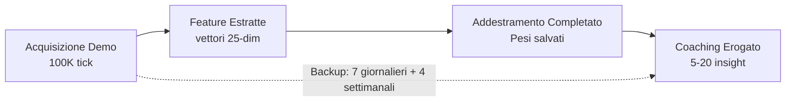

## 10. Regime di formazione e limiti di maturità

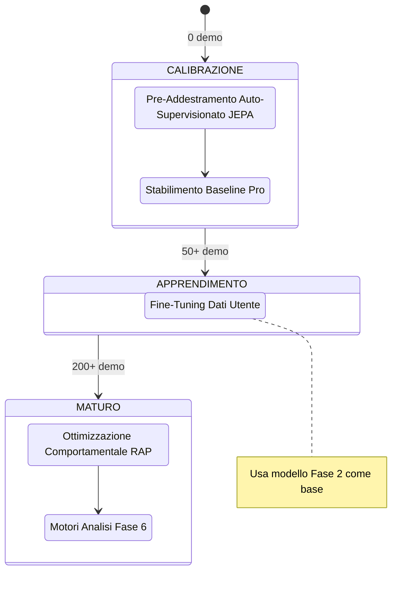

**Requisiti dati per fase:**

| Fase                       | Dati minimi               | Tipo di addestramento          | Perdita primaria                           |
| -------------------------- | ------------------------- | ------------------------------ | ------------------------------------------ |
| 1\. Pre-addestramento JEPA | 10 demo pro               | Auto-supervisionato (InfoNCE)  | Contrastivo con negativi in batch          |
| 2\. Baseline pro           | 50 corrispondenze pro     | Supervisionato                 | MSE(pred, pro_stats)                       |
| 3\. Ottimizzazione utente  | 50 corrispondenze utente  | Supervisionato (trasferimento) | MSE(pred, user_stats)                      |
| 4\. Ottimizzazione RAP     | 200 corrispondenze totali | Multi-task                     | Strategia + Valore + Sparsità + Posizione |

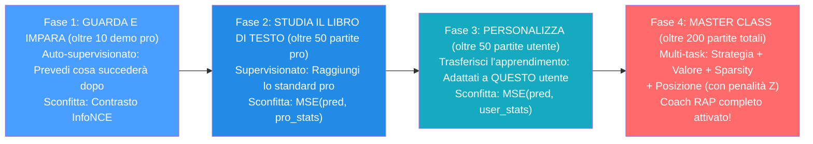

**Protocollo VL-JEPA Two-Stage (Allineamento Concetti):**

Quando il VL-JEPA è attivo, le Fasi 1-2 vengono estese con un **protocollo two-stage** che allinea le rappresentazioni latenti ai 16 coaching concepts:

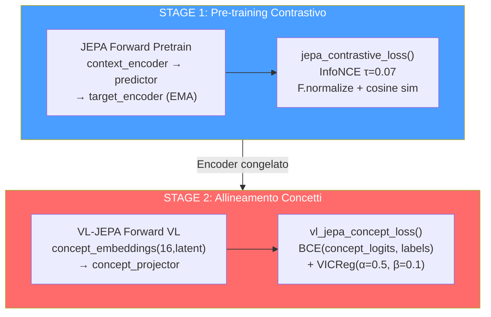

| Stage | Cosa si addestra | Cosa è congelato | Loss | Scopo |
| ----- | --------------- | ---------------- | ---- | ----- |
| 1 | Context encoder, predictor | Target encoder (EMA) | InfoNCE (τ=0.07) | Rappresentazioni latenti generali |
| 2 | Concept embeddings, concept projector, concept temperature | Encoder (opzionale fine-tuning) | BCE + VICReg diversity | Allineamento ai 16 coaching concepts |

**I 16 Coaching Concepts (tassonomia — da `COACHING_CONCEPTS` in `jepa_model.py`):**

| Indice | Concetto | Dimensione | Descrizione |
| ------ | -------- | --------- | ----------- |
| 0 | positioning_aggressive | Posizionamento | Combattimenti ravvicinati, push degli angoli |
| 1 | positioning_passive | Posizionamento | Angoli lunghi, evita il contatto |
| 2 | positioning_exposed | Posizionamento | Posizione vulnerabile, alta probabilità di morte |
| 3 | utility_effective | Utility | Utilità con impatto significativo |
| 4 | utility_wasteful | Utility | Utilità inutilizzata o a basso impatto |
| 5 | economy_efficient | Decisione | Equipaggiamento allineato al tipo di round |
| 6 | economy_wasteful | Decisione | Force-buy sfavorevoli o morte con gear costoso |
| 7 | engagement_favorable | Ingaggio | Combattimenti con vantaggio HP/posizione/numeri |
| 8 | engagement_unfavorable | Ingaggio | Combattimenti in svantaggio numerico/HP |
| 9 | trade_responsive | Ingaggio | Trade kill rapidi, buon coordinamento |
| 10 | trade_isolated | Ingaggio | Morte senza trade, troppo isolato |
| 11 | rotation_fast | Decisione | Rotazione posizionale rapida dopo info |
| 12 | information_gathered | Decisione | Buona raccolta intel, nemici individuati |
| 13 | momentum_leveraged | Psicologia | Capitalizza hot streak con giocate sicure |
| 14 | clutch_composed | Psicologia | Decisioni calme in situazioni 1vN |
| 15 | aggression_calibrated | Psicologia | Aggressività appropriata alla situazione |

**AdamW + CosineAnnealing (JEPA Trainer):**

| Iperparametro | Valore | Scopo |
| ------------- | ------ | ----- |
| Optimizer | AdamW | Weight decay separato dai gradienti |
| Learning rate | 1e-4 (default; layer concept a lr×0.05) | Tasso di apprendimento iniziale |
| Weight decay | 0.01 | Regolarizzazione L2 |
| Scheduler | SequentialLR: warmup lineare (5%) → CosineAnnealingLR | Warmup + decadimento coseno del LR |
| EMA decay | 0.996 base, schedulazione coseno → 1.0 | Target encoder momentum update |
| Gradient clip | 1.0 | Prevenzione gradient explosion |
| AMP + accumulo | GradScaler (CUDA) + 4 step di accumulo | Efficienza su GPU con poca VRAM |

**DriftMonitor (z_threshold=2.5):**

Il `DriftMonitor` integrato nel JEPA Trainer monitora il **drift delle feature** durante il training. Se lo Z-score di una feature supera 2.5, emette un warning che indica possibile distribuzione shifting:

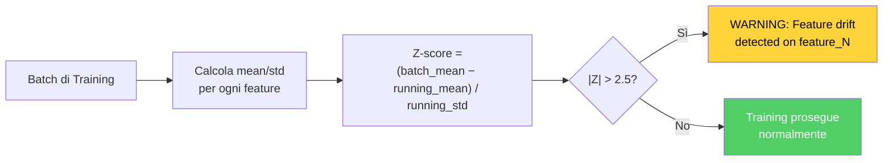

**Trigger di riaddestramento:** Il demone Teacher monitora la crescita del numero di demo professionali; attiva il riaddestramento quando `count ≥ last_count × 1,10`.

**JEPAPretrainDataset** (`jepa_train.py`):

Il dataset di pre-training JEPA utilizza **finestre temporali** per creare coppie contesto-target:

| Parametro | Valore | Scopo |
| --------- | ------ | ----- |
| `context_len` | 10 tick | Lunghezza finestra di contesto (input) |
| `target_len` | 10 tick | Lunghezza finestra target (da predire) |
| `seed` | 42 | RNG dedicato per finestre riproducibili |
| Batch size (pretrain standalone) | 16 | Numero di coppie per batch |
| Vincoli sequenza | min 20 / max 500 tick | `_MIN_TICKS_FOR_SEQUENCE` / `_MAX_TICKS_PER_SEQUENCE` |

---

## 11. Catalogo delle funzioni di perdita

| Modello                   | Nome della perdita        | Formula                                                                                                                         | Scopo                                                                  |
| ------------------------- | ------------------------- | ------------------------------------------------------------------------------------------------------------------------------- | ---------------------------------------------------------------------- |
| **JEPA**            | InfoNCE Contrastive       | `−log(exp(sim(pred, target)/τ) / Σ exp(sim(pred, neg_i)/τ))`, τ=0.07, `F.normalize` prima della similarità del coseno | Allineamento delle previsioni di contesto con gli embedding del target |
| **JEPA**            | Ottimizzazione            | `MSE(coaching_head(Z_ctx), y_true)`                                                                                           | Punteggio di coaching supervisionato                                   |
| **AdvancedCoachNN** | Supervisionato            | `MSELoss(MoE_output, y_true)`                                                                                                 | Allenamento a livello di partita                                       |
| **RAP**             | Strategia                 | `MSELoss(advice_probs, target_strat)`                                                                                         | Raccomandazione tattica corretta                                       |
| **RAP**             | Valore                    | `0,5 × MSE(V(s), true_advantage)`                                                                                            | Stima accurata del vantaggio                                           |
| **RAP**             | Sparsità                 | `Entropia(gate_probs) × context_gate_l1_weight (1e-4)`                                                                                                            | Specializzazione esperta (routing deciso)                                               |
| **RAP**             | Posizione                 | `MSE(xy) + 2× MSE(z)`                                                                                                        | Posizionamento ottimale con penalità sull'asse Z                      |
| **WinProb**         | Previsione                | `BCELoss(pred, risultato)` (l'output è già passato per Sigmoid)                                                                                          | Previsione dell'esito del round                                        |
| **NeuralRoleHead**  | KL-Divergence             | `KLDivLoss(log_softmax(pred), target)` con smoothing delle etichette ε=0,02                                                  | Corrispondenza della distribuzione di probabilità del ruolo           |
| **VL-JEPA**         | Allineamento dei concetti | `BCE(concept_logits, concept_labels)` + `VICReg(concept_diversity)`                                                         | Fondamenti del concetto di linguaggio visivo                           |

**Dettaglio: InfoNCE Contrastive Loss (JEPA)**

L'InfoNCE è la loss principale del pre-training JEPA. Il suo scopo è allineare le predizioni del contesto con gli embedding del target, respingendo contemporaneamente i negativi (altri campioni nel batch):

```
L_InfoNCE = -log( exp(sim(pred, target⁺) / τ) / Σᵢ exp(sim(pred, targetᵢ) / τ) )
```

| Componente | Valore | Ruolo |
| ---------- | ------ | ----- |
| `sim()` | Cosine similarity dopo `F.normalize` | Misura di similarità [-1, +1] |
| `τ` (temperature) | 0.07 | Sharpness della distribuzione — valori bassi = più selettivi |
| `target⁺` | L'embedding target corretto per questo contesto | Il "positivo" — la risposta corretta |
| `targetᵢ` | Tutti gli embedding nel batch | Negativi in-batch — le risposte sbagliate |
| Batch size | 32 | Numero di negativi = batch_size - 1 = 31 |

**Dettaglio: VL-JEPA Concept Loss (VICReg Components)**

La loss di allineamento concetti del VL-JEPA combina due componenti:

```
L_concept = BCE(concept_logits, concept_labels) + α·VICReg_diversity
```

Nel dettaglio implementativo:

| Termine | Formula | Peso | Scopo |
| -------------- | ------- | ---- | ----- |
| **Concept alignment** | `BCE_with_logits(concept_logits, labels)` | α=0.5 | Allinea gli embedding ai concetti corretti |
| **Diversity** | `−std(L2_norm(concept_embeddings), dim=0).mean()` | β=0.1 | Previene il collasso — le embedding di concetto devono restare distinte |

Una regolarizzazione VICReg completa (`vicreg_regularization`, λ_var=25.0, λ_cov=1.0) è disponibile separatamente e viene aggiunta con peso 0.01 alla loss InfoNCE nel trainer.

**Dettaglio: RAP Multi-Task Loss**

Il RAP Coach combina 4 loss in una loss totale pesata:

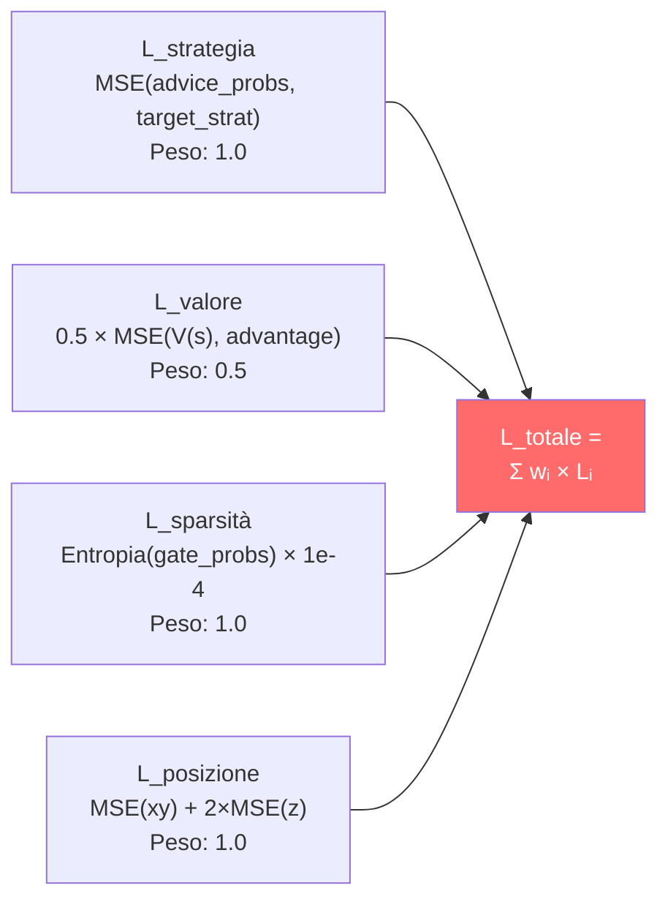

La penalità Z 2× nella loss di posizione riflette il fatto che in CS2 sbagliare il **piano** (sopra vs sotto in Nuke/Vertigo) è molto più grave che sbagliare la posizione orizzontale. Un errore di 100 unità sull'asse Z (piano sbagliato) è strategicamente catastrofico, mentre lo stesso errore su X/Y potrebbe essere irrilevante.

---

## 12. Logica Completa del Programma — Dal Lancio al Consiglio

Questo capitolo documenta la **logica completa** di Macena CS2 Analyzer, dal momento in cui l'utente lancia l'applicazione fino a quando riceve i consigli di coaching. A differenza dei capitoli precedenti che si concentrano sui sottosistemi AI, qui viene spiegato come **ogni componente del programma** lavora insieme: l'interfaccia desktop, l'architettura quad-daemon, la pipeline di ingestione, il sistema di storage, il playback tattico, l'osservabilità e il ciclo di vita dell'applicazione.

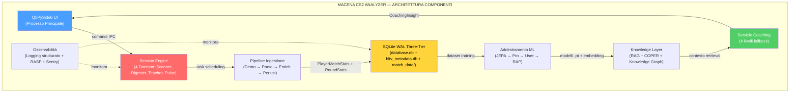

---

### 12.1 Punto di Ingresso e Sequenza di Avvio

Il sistema dispone di **un entry point principale** (Qt) e tre entry point di utilità:

| # | Entry Point | Comando | Ruolo |
|---|---|---|---|
| 1 | **Qt (primario)** | `python -m Programma_CS2_RENAN.apps.qt_app.app` (via `launch.sh`) | UI desktop PySide6 |
| 2 | Console operatore | `python console.py` (root, TUI Rich + CLI) | Controllo di sistema |
| 3 | Headless Validator | `python tools/headless_validator.py` (root) | Validazione CI/CD |
| 4 | HLTV Sync | `python -m Programma_CS2_RENAN.hltv_sync_service` | Scraping dati pro |

#### 12.1.1 Entry Point Qt (Primario) — `apps/qt_app/app.py`

**File:** `Programma_CS2_RENAN/apps/qt_app/app.py`

La sequenza di avvio Qt è basata su **QApplication** e **signal/slot**:

1. **High-DPI setup** — Abilita scaling automatico per display ad alta densità
2. **QApplication** — Crea l'istanza applicazione Qt con gestione args
3. **Tema e font** — Registra i 3 temi (CS2, CSGO, CS1.6) via QSS e i font personalizzati
4. **MainWindow** — Costruisce `QMainWindow` con sidebar + `QStackedWidget` (15 schermate)
5. **Signal wiring** — Connette i segnali Qt tra sidebar, schermate e backend
6. **First-run gate** — Se `SETUP_COMPLETED=False`, mostra il wizard; altrimenti la home
7. **Backend console boot** — Lancia il Session Engine come subprocess
8. **Window show** — Mostra la finestra e avvia il loop eventi Qt
9. **CoachState polling** — Timer Qt per aggiornamento periodico dello stato

---

### 12.2 Gestione del Ciclo di Vita (`lifecycle.py`)

**File:** `Programma_CS2_RENAN/core/lifecycle.py`

L'`AppLifecycleManager` è un **Singleton** che gestisce il ciclo di vita dell'intera applicazione: dalla garanzia che esista una sola istanza attiva, al lancio del subprocess daemon, fino allo shutdown coordinato.

**Meccanismi principali:**

| Meccanismo | Implementazione | Scopo |
| ---------- | --------------- | ----- |
| **Single Instance Lock** | Windows Named Mutex / file lock su Linux | Impedisce istanze multiple (corruzione DB) |
| **Lancio Daemon** | `subprocess.Popen(session_engine.py)` con PYTHONPATH | Processo separato per lavoro pesante |
| **Rilevamento Morte Genitore** | Il daemon monitora EOF su `stdin` | Se il processo principale muore, il daemon si arresta |
| **Shutdown Graceful** | Invio "STOP" via stdin → daemon termina entro 5s | Nessuna perdita di dati o task zombie |
| **Status Polling** | UI interroga `CoachState` ogni 10s | Aggiornamento stato daemon senza IPC diretto |
| **Error Recovery** | Se daemon muore, errore registrato + ServiceNotification | Utente informato, nessun crash silenzioso |
| **Keep-Alive** | UI verifica heartbeat ogni 15s | Se heartbeat > 30s stale → warning "Daemon non risponde" |

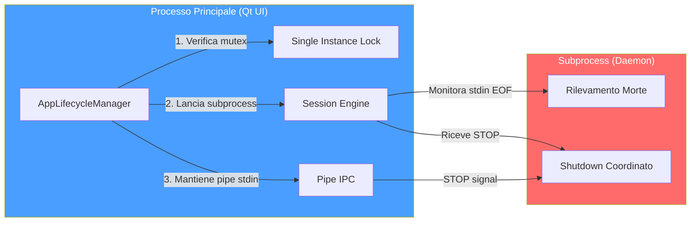

---

### 12.3 Sistema di Configurazione (`config.py`)

**File:** `Programma_CS2_RENAN/core/config.py`

Il sistema utilizza **quattro livelli di configurazione**, ciascuno con un diverso livello di persistenza e sicurezza:

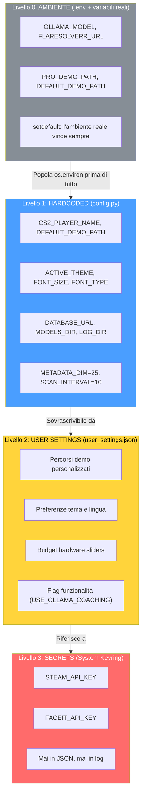

**Il livello 0 e la lezione che porta con sé.** Fino all'agosto 2026 il file `.env` era una superficie di configurazione **documentata ma mai letta**: nessuna dipendenza lo interpretava e nessuno script lo caricava, quindi ogni override descritto nella documentazione era un'istruzione che non faceva niente — falliva in silenzio, che è il modo peggiore di fallire. Oggi `_load_dotenv_file()` in `core/config.py` lo analizza con la sola libreria standard, al momento dell'import del modulo, e lo fa con tre cautele deliberate:

- scrive con `os.environ.setdefault`, quindi **una variabile d'ambiente reale vince sempre** sul file — chi lancia il programma dentro un container o un job CI non viene scavalcato da un file sul disco;
- scarta le chiavi che non siano alfanumeriche più underscore, così una riga malformata non inietta nulla di strano nell'ambiente del processo;
- **non logga mai i valori**, perché `.env` può contenere chiavi API.

Se il file non esiste non succede nulla; se non è leggibile si ottiene un avviso, non un errore fatale. Sopra questo livello, quattro chiavi di percorso (`PRO_DEMO_PATH`, `DEFAULT_DEMO_PATH`, `BRAIN_DATA_ROOT`, `CUSTOM_STORAGE_PATH`) possono essere riscritte dall'ambiente anche quando `user_settings.json` contiene già un valore, e tre segreti (`STEAM_API_KEY`, `FACEIT_API_KEY`, `STORAGE_API_KEY`) arrivano dal portachiavi di sistema. `set_secret()` **restituisce `False` invece di sollevare un'eccezione** quando il portachiavi non è disponibile: su una macchina Linux senza backend installato, salvare le impostazioni non deve far cadere l'applicazione.

**Costanti critiche del sistema:**

| Costante | Valore | File | Scopo |
| -------- | ------ | ---- | ----- |
| `METADATA_DIM` | 25 | `config.py` | Dimensione del feature vector — contratto unificato |
| `SCAN_INTERVAL` | 10 | `config.py` | Intervallo scansione Scanner (secondi) |
| `MAX_DEMOS_PER_MONTH` | 10 | `config.py` | Quota mensile upload demo |
| `MAX_TOTAL_DEMOS` | 100 | `config.py` | Limite totale demo a vita |
| `MIN_DEMOS_FOR_COACHING` | 10 | `config.py` | Soglia per coaching personalizzato completo |
| `TRADE_WINDOW_S` | 3.0 | `trade_kill_detector.py` | Finestra temporale trade kill in secondi (tick-rate aware: 192 tick a 64/s, 384 a 128/s) |
| `BASELINE_KPR` | 0.679 | `feature_engineering/rating.py` | Baseline HLTV 2.0 per KPR |
| `BASELINE_DPR_COMPLEMENT` | 0.317 | `feature_engineering/rating.py` | Baseline HLTV 2.0 per sopravvivenza |
| `FOV_DEGREES` | 90 | `core/constants.py` | Campo visivo simulato del giocatore |
| `MEMORY_DECAY_TAU_S` | 2.5s | `core/constants.py` | Emivita memoria nemici (× tick_rate) |
| `CONFIDENCE_ROUNDS_CEILING` | 300 | `correction_engine.py` | Tetto round per confidenza massima |
| `SILENCE_THRESHOLD` | 0.2 | `explainability.py` | Soglia sotto la quale il silenzio è azione valida |
| `MIN_SAMPLES_FOR_VALIDITY` | 30 | `role_thresholds.py` | Campioni minimi per soglia ruolo valida |
| `HALF_LIFE_DAYS` | 90 | `pro_baseline.py` | Decadimento temporale dati pro |
| `Z_LEVEL_THRESHOLD` | 200 | `connect_map_context.py` | Soglia Z per classificazione piano |

**Architettura dei percorsi:**

Il sistema gestisce percorsi con un'attenzione particolare alla **portabilità Windows/Linux**. Il cuore è `BRAIN_DATA_ROOT`: una directory configurabile dall'utente che contiene modelli, log e dati derivati. Se non esiste, il sistema ricade sulla cartella del progetto.

| Percorso | Contenuto | Configurabile |
| -------- | --------- | ------------- |
| `DATABASE_URL` | Database monolite principale (`database.db`) | No — sempre nella cartella del progetto |
| `BRAIN_DATA_ROOT` | Radice per dati derivati (modelli, log) | Sì — via `user_settings.json` |
| `MODELS_DIR` | Checkpoint dei modelli `.pt` | Derivato da `BRAIN_DATA_ROOT` |
| `LOG_DIR` | File di log dell'applicazione | Derivato da `BRAIN_DATA_ROOT` |
| `MATCH_DATA_PATH` | Database per-match (`match_XXXX.db`) | Derivato da `BRAIN_DATA_ROOT` |
| `DEFAULT_DEMO_PATH` | Cartella demo dell'utente | Sì — via UI Settings |
| `PRO_DEMO_PATH` | Cartella demo professionali | Sì — via UI Settings |

---

### 12.4 Motore di Sessione — Architettura Quad-Daemon (`session_engine.py`)

**File:** `Programma_CS2_RENAN/core/session_engine.py`

Il Session Engine è il **cuore pulsante** dell'automazione del sistema. Vive come subprocess separato e ospita **4 daemon thread** che lavorano in parallelo, ciascuno con una responsabilità ben definita. Questo design separa completamente il lavoro pesante (parsing demo, addestramento ML) dall'interfaccia utente, garantendo che la GUI Qt rimanga sempre reattiva.

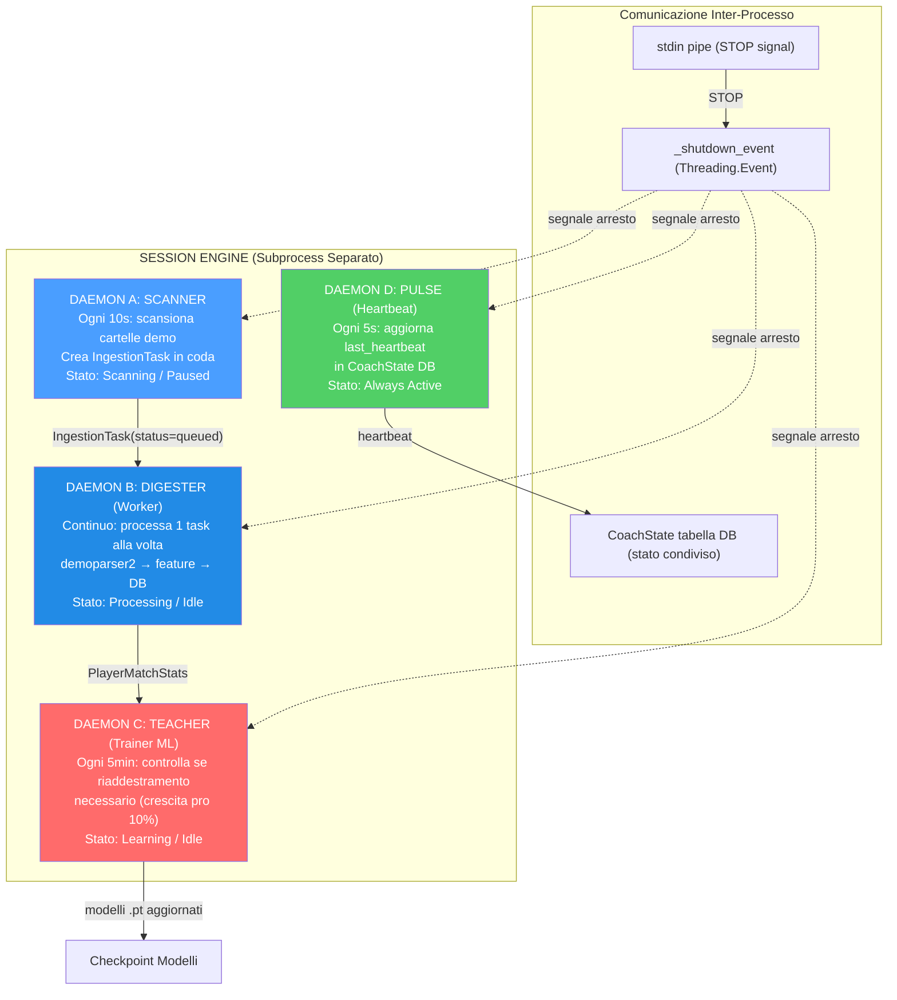

**Ciclo di vita di ogni daemon:**

| Daemon | Intervallo | Lavoro per ciclo | Trigger |
| ------ | ---------- | ---------------- | ------- |
| **Scanner** | 10 secondi | Scansiona cartelle pro e utente, crea `IngestionTask` per nuovi `.dem` | Sempre attivo (se stato = Scanning) |
| **Digester** | Continuo | Preleva 1 task dalla coda, esegue parsing completo | `_work_available_event` (segnalato da Scanner) |
| **Teacher** | 300 secondi (5 min) | Controlla crescita sample pro; se ≥10% → `run_full_cycle()` | `pro_count >= last_count × 1.10` |
| **Pulse** | 5 secondi | Aggiorna `CoachState.last_heartbeat` nel database | Sempre attivo |

**Sequenza di shutdown:**

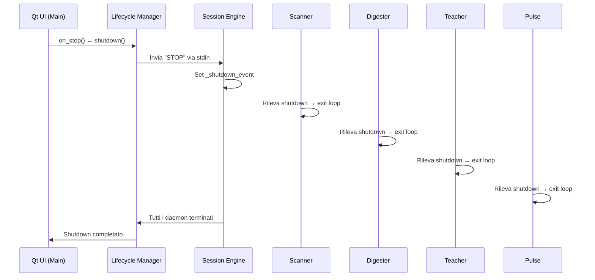

**Dettagli implementativi dei daemon:**

| Daemon | Metodo Principale | Loop Interno | Condizione di Uscita |
| ------ | ----------------- | ------------ | -------------------- |
| **Scanner** | `_scanner_daemon_loop()` | `while not _shutdown_event.is_set()` → `scan_all_paths()` → `sleep(10)` | `_shutdown_event` set |
| **Digester** | `_digester_daemon_loop()` | `while not _shutdown_event.is_set()` → `_work_available_event.wait(2)` → `process_next_task()` | `_shutdown_event` set |
| **Teacher** | `_teacher_daemon_loop()` | `while not _shutdown_event.is_set()` → `_check_retrain_needed()` → `sleep(300)` | `_shutdown_event` set |
| **Pulse** | `_pulse_daemon_loop()` | `while not _shutdown_event.is_set()` → `state_mgr.heartbeat()` → `sleep(5)` | `_shutdown_event` set |

**Gestione errori nei daemon:**

Ogni daemon è protetto da un `try/except` globale. Se un daemon crasha:
1. L'errore viene loggato con traceback completo
2. Lo `StateManager` registra l'errore (`set_error(daemon, message)`)
3. Una `ServiceNotification` viene creata per l'utente
4. Un **watchdog** del Session Engine controlla ogni 30 secondi i thread daemon e **riavvia automaticamente** quelli morti
5. Gli altri daemon continuano a funzionare indipendentemente

**Zombie Task Cleanup:** All'avvio, il Session Engine cerca task con `status="processing"` rimasti da un crash precedente e li resetta a `status="queued"`, consentendo il ripristino automatico senza perdita di dati.

**Backup Automatico:** All'avvio del Session Engine, `BackupManager.should_run_auto_backup()` verifica se è necessario un backup e, in caso affermativo, crea un checkpoint con etichetta `"startup_auto"`. Il backup segue una rotazione di 7 copie giornaliere + 4 settimanali.

---

### 12.5 Interfaccia Desktop

L'interfaccia desktop è costruita con **Qt/PySide6** seguendo il pattern **MVVM** (Model-View-ViewModel).

#### 12.5.1 Interfaccia Qt — `apps/qt_app/`

**Directory:** `Programma_CS2_RENAN/apps/qt_app/`
**File chiave:** `app.py`, `main_window.py`, `core/i18n_bridge.py`, `core/theme_engine.py`, `screens/`

L'interfaccia Qt è costruita con **PySide6 (Qt 6)** e utilizza un pattern **MVVM con Qt Signals/Slots**. La `MainWindow` (`QMainWindow`) è composta da una **sidebar di navigazione** e un **`QStackedWidget`** che ospita le 15 schermate.

| Specifica | Dettaglio |
|---|---|
| **Framework** | PySide6 (Qt 6 per Python) |
| **Pattern** | MVVM con Qt Signals/Slots |
| **Piattaforme** | Windows, macOS, Linux |
| **Risoluzione** | Adattiva, High-DPI nativo |
| **Temi** | 3: CS2 (arancione), CSGO (blu-grigio), CS1.6 (verde) — un unico template QSS parametrizzato da design token |
| **i18n** | 3 lingue: EN, IT, PT — JSON + `QtLocalizationManager`, 572 chiavi per lingua |
| **Grafici** | QPainter puro ovunque: mappa tattica e tutti i widget grafici |

**Sistema i18n:** Il `QtLocalizationManager` (`core/i18n_bridge.py`) carica file JSON per lingua (`en.json`, `it.json`, `pt.json`) e gestisce il cambio lingua a runtime tramite segnali Qt. Ogni stringa UI viene risolta dinamicamente tramite chiave di localizzazione.

**Sistema temi:** dall'agosto 2026 i tre temi non sono più tre fogli di stile. La cartella `apps/qt_app/themes/` contiene **un solo file**, `base.qss.template`, e il colore arriva da una pipeline in tre stadi:

1. `design/tokens/design-tokens.json` è la fonte di verità dei colori. `tools/gen_design_tokens.py` lo compila in `core/design_tokens.py`, un modulo **generato** — da non modificare a mano — che espone tre istanze congelate di `DesignTokens`: `CS2_TOKENS`, `CSGO_TOKENS`, `CS16_TOKENS`.
2. `core/qss_generator.py` esegue `Template(base.qss.template).safe_substitute(asdict(tokens))` e tiene in cache un foglio di stile già reso per ciascun nome di tema.
3. `core/theme_engine.py` applica quel QSS e poi costruisce la `QPalette` **dalla stessa istanza di token**, così foglio di stile e palette non possono più divergere.

Il guadagno pratico è che aggiungere un tema significa aggiungere un blocco di token, non riscrivere un foglio di stile da centinaia di righe; e un colore corretto in un punto si propaga insieme a QSS, `QPalette` e `rating_color()`.

| Tema | Accento | Superficie di base | Ispirazione |
|---|---|---|---|
| **CS2** (default) | `#FF6A00` arancione | `#0B1628` blu notte | UI moderna di Counter-Strike 2 |
| **CSGO** | `#617D8C` blu-grigio | `#1A1C21` grigio quasi nero | Counter-Strike: Global Offensive |
| **CS1.6** | `#4DB04F` verde | `#121A12` verde-nero | Counter-Strike 1.6 classico |

**Il relay di tema.** Un `ThemeEngine` vive quanto un avvio dell'applicazione. I widget che si ricoloravano da soli non avevano quindi un oggetto stabile a cui iscriversi, e dopo un cambio tema restavano del colore vecchio. La soluzione è un **relay a livello di modulo**, `get_theme_relay()`: i widget con stile applicato per istanza — chip di filtro e di stato, card del roster, banner — si iscrivono al relay, che sopravvive ai singoli motori, e Qt scollega da solo i destinatari distrutti.

**Web Views** (`apps/qt_app/web/`):

L'interfaccia Qt include **3 web app React** (React 18 + TypeScript + Vite, workspace pnpm) renderizzate in `QWebEngineView`:

| Web View | Directory | Descrizione |
|---|---|---|
| **Coach Chat** | `web/coach-chat/` | Interfaccia chat con il coach AI — formattazione rich text |
| **Match Detail** | `web/match-detail/` | Visualizzazione dettagliata di una partita con timeline e statistiche per round |
| **Tactical Viewer** | `web/tactical-viewer/` | Viewer tattico a layer (`MapCanvas`, `PlayerLayer`, `GhostLayer`, `HeatmapLayer`, `TrailsLayer`, `RoundTimeline`, `ControlBar`) |

La comunicazione bidirezionale tra il backend Python e le web app passa per `QWebChannel` (`web/shared/qwebchannel.ts` + `bridge.ts` per app), esponendo metodi Python come API JavaScript. Questa architettura ibrida permette di utilizzare librerie di visualizzazione web mantenendo la logica di business nel backend Python.

**15 schermate dell'interfaccia:**

| Schermata | Ruolo | Componenti chiave |
| --------- | ----- | ----------------- |
| **Wizard** | Prima configurazione | Nome giocatore, ruolo, percorsi cartelle demo |
| **Home** | Dashboard | Quota mensile (X/10), stato servizi (verde/rosso), fiducia credenze (0-1), task attivi, contatore partite processate |
| **Coach** | Insight coaching | Card colorate per severità, radar skill multi-dimensionale, trend storici, chat AI (Ollama/Claude), task attivi |
| **Tactical Viewer** | Riproduzione tattica | Mappa 2D con giocatori/granate/fantasma, timeline con marcatori eventi, sidebar giocatori CT/T, controlli velocità (0.25x→8x) |
| **Settings** | Personalizzazione | Tema (CS2/CSGO/CS1.6), font, dimensione testo, lingua, percorsi demo, wallpaper |
| **Help** | Supporto utente | Tutorial interattivo, FAQ, troubleshooting |
| **Match History** | Storico partite | Lista demo analizzate con filtri e ordinamento |
| **Match Detail** | Dettaglio partita | Statistiche dettagliate per una singola demo analizzata |
| **Performance** | Progressi | Radar skill a 5 assi, grafici di tendenza, confronti temporali |
| **User Profile** | Profilo utente | Bio, ruolo preferito, sincronizzazione Steam/FACEIT |
| **Profile** | Profilo pubblico | Visualizzazione profilo pubblico del giocatore |
| **Steam Config** | Configurazione Steam | Inserimento e validazione API key Steam |
| **Pro Comparison** | Confronto pro | Confronto statistiche utente con giocatori professionisti HLTV, benchmark prestazionale |
| **Pro Player Detail** | Dettaglio giocatore pro | Profilo individuale del giocatore professionista HLTV con statistiche complete della carriera |
| **FACEIT Config** | Configurazione FACEIT | Inserimento e validazione API key FACEIT |

**Widget personalizzati:**

| Widget | File | Funzione |
| ------ | ---- | -------- |
| `PlayerSidebar` | `tactical/player_sidebar.py` | Lista CT/T con icone ruolo, salute/armatura, arma corrente, denaro e stato vivo/morto (`_PlayerItem`, `_StatBar`) |
| `TacticalMapWidget` | `tactical/map_widget.py` | Canvas 2D con rendering multilivello: texture mappa → zone → heatmap → giocatori → granate → fantasma (QPainter) |
| `TimelineWidget` | `tactical/timeline_widget.py` | Scrubber orizzontale con numeri di tick, glifi evento (stella, rombo), drag-to-seek e salto al doppio clic |
| `with_alpha` | `tactical/_paint_utils.py` | Helper condiviso di disegno: applica un canale alfa a un `QColor` senza duplicare la logica in ogni widget |

**Widget grafici (`widgets/charts/`):**

QtCharts è stato **ritirato** per una ragione di licenza, non di gusto: è distribuito sotto GPLv3, incompatibile con la distribuzione di questo progetto. I grafici sono stati riscritti in QPainter puro conservando l'API pubblica, così le schermate che li usavano non hanno dovuto cambiare. Un test di gate (`tests/test_charts.py`, classe `TestQtChartsRetired`) fallisce se un solo riferimento a `QtCharts` o `QChart` rientra nel codice.

Tutti leggono i token dentro `paintEvent`, quindi si ridisegnano del colore giusto dopo un cambio tema.

| Widget | File | Funzione |
| ------ | ---- | -------- |
| `RadarChart` | `radar_chart.py` | Radar delle abilità a N assi (N ≥ 3), griglia a poligoni concentrici, una figura piena per serie — usato per sovrapporre utente e professionista |
| `RatingSparkline` | `rating_sparkline.py` | Andamento del rating con linee di riferimento HLTV tratteggiate a 0,90 / 1,00 / 1,10 e didascalie a bordo destro |
| `UtilityBarChart` | `utility_bar_chart.py` | Barre raggruppate utente-vs-pro (`set_rows`) oppure una barra per riga con scala a tacche (`set_single`) |
| `EconomyChart` | `economy_chart.py` | Valore di equipaggiamento per round, barre colorate dal lato di quel round; `set_half_marker()` traccia il cambio di metà |
| `MomentumChart` | `momentum_chart.py` | Barre dello scarto uccisioni-morti per round, normalizzate sullo scarto massimo |
| `MiniSparkline` | `mini_sparkline.py` | Forma di tendenza minima, senza assi né cornice, per stare dentro una card |

**Libreria di componenti (`widgets/components/`):**

26 componenti riusabili costruiti sull'atlante di design. I più caratterizzanti: `MapTile` (riquadro per mappa con barra di avanzamento e etichetta di accessibilità), `DeltaChip` (scarto rispetto a un riferimento — *il confronto è l'informazione*), `ProBadge`, `MetricBarRow`, `DbRecordCard`, `TipBox`, `NumberedStep`, `DriversList`, `MonoFooter` (riga di provenienza del dato: da quale tabella e da quale colonna arriva il numero mostrato).

Il pannello di chat del coach (`widgets/coaching/chat_panel.py`) è deliberatamente **agnostico rispetto al ViewModel**: non parla mai direttamente con un VM, è una schermata a cablarlo (`panel.message_submitted → vm.send_message`, `vm.messages_changed → panel.add_message`). Così lo stesso pannello può servire contesti diversi senza sapere nulla di chi lo alimenta.

**Coach Screen — Layout dettagliato:**

La schermata Coach è la più complessa dell'applicazione, con 5 aree funzionali:

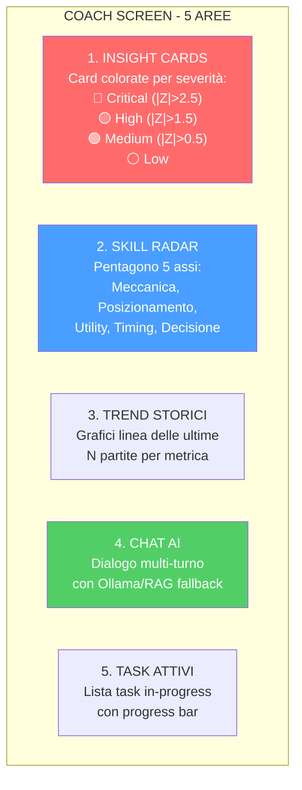

**Pattern MVVM nel Tactical Viewer:**

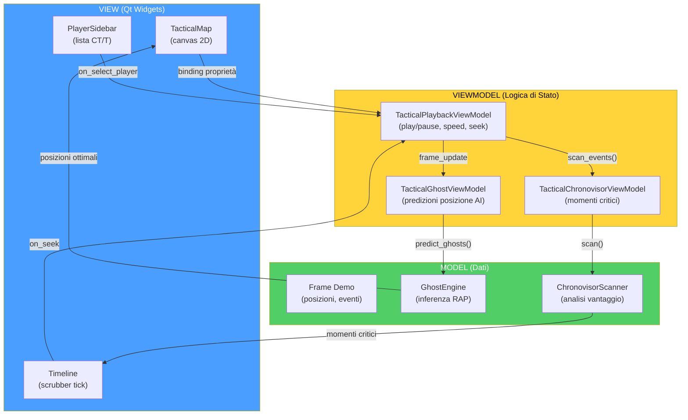

---

### 12.6 Pipeline di Ingestione (`ingestion/`)

**Directory:** `Programma_CS2_RENAN/ingestion/`
**File chiave:** `demo_loader.py`, `steam_locator.py`, `integrity.py`, `registry/`, `pipelines/user_ingest.py`, `pipelines/json_tournament_ingestor.py`

La pipeline di ingestione è il **percorso completo** che un file `.dem` compie dal filesystem fino a diventare insight di coaching nel database. È orchestrata dal daemon Scanner (scoperta) e dal daemon Digester (elaborazione).

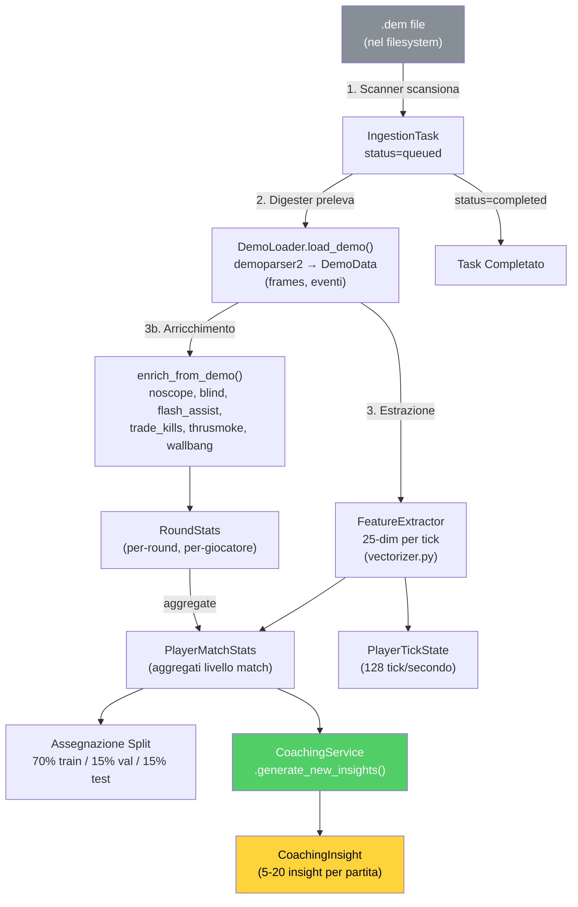

**Chi prende in carico il task, e perché uno solo.**

Il passo 2 del diagramma — *"il Digester preleva"* — nasconde un problema di concorrenza che è costato dati duplicati. Le superfici che possono avviare un'ingestione sono **sei**: la schermata Home, le impostazioni, il comando di ingest della console, `batch_ingest`, `ingest_pro_demos` e `run_worker`. Il percorso vecchio faceva una `SELECT` della coda e poi scriveva `status='processing'` senza condizioni: due runner avviati a poca distanza leggevano la **stessa fotografia** della coda, entrambi la ritenevano propria, e la stessa demo veniva analizzata due volte scrivendo statistiche duplicate.

La correzione è una sola istruzione SQL, e la sua forza sta nella clausola `WHERE`:

```python
_sa_update(IngestionTask)
    .where(IngestionTask.id == task_id, IngestionTask.status == "queued")
    .values(status="processing", updated_at=...)
# rowcount == 1 → il task è nostro;  rowcount == 0 → l'ha preso un altro
```

L'`UPDATE ... WHERE status='queued'` è atomico a livello di database: **esattamente un runner vince ogni task**, gli altri leggono `rowcount == 0` e passano oltre in silenzio. Non serve un lock applicativo, non serve coordinamento fra processi — la condizione di corsa viene eliminata invece che gestita, che è sempre la soluzione preferibile. Un test dedicato (`test_ingestion_atomic_claim.py`) verifica sia il claim esclusivo sia il fatto che un task già reclamato venga saltato.

Alla chiusura del cerchio ci pensa `run_worker.py`: se un task viene reclamato ma poi scartato, `_release_claim()` lo riporta a `queued` invece di lasciarlo bloccato in `processing` per sempre.

**DemoLoader — Il parser del cuore della pipeline:**

Il `DemoLoader` è il wrapper attorno a **demoparser2** (libreria Rust ad alte prestazioni) che trasforma un file `.dem` binario in strutture dati Python:

| Fase di Parsing | Output | Dimensione tipica |
| --------------- | ------ | ----------------- |
| 1. Header parsing | Metadata (map, server, duration) | ~100 bytes |
| 2. Frame extraction | Lista di frame (posizione, salute, arma per ogni tick) | ~100.000 frame/partita |
| 3. Event extraction | Lista eventi (kill, death, bomb_plant, round_start, etc.) | ~500-2.000 eventi/partita |
| 4. Player summary | Statistiche aggregate per giocatore | ~10 record |

**FeatureExtractor** (`backend/processing/feature_engineering/vectorizer.py`):

Il FeatureExtractor è il componente che trasforma i dati grezzi del demo in **vettori numerici a 25 dimensioni** (`METADATA_DIM=25`) utilizzabili dalle reti neurali. **Importante:** queste sono feature **a livello di tick** (128 Hz), non statistiche aggregate a livello di partita. Ogni singolo frame di gioco produce un vettore 25-dim che cattura lo stato istantaneo del giocatore:

| Dim | Feature | Tipo | Range | Descrizione |
| --- | ------- | ---- | ----- | ----------- |
| 0 | health | Float | [0, 1] | Salute normalizzata |
| 1 | armor | Float | [0, 1] | Armatura normalizzata |
| 2 | has_helmet | Binary | 0/1 | Casco equipaggiato |
| 3 | has_defuser | Binary | 0/1 | Kit defuse equipaggiato |
| 4 | equipment_value | Float | [0, 1] | Valore equipaggiamento normalizzato |
| 5 | is_crouching | Binary | 0/1 | Accucciato |
| 6 | is_scoped | Binary | 0/1 | Mirino attivo (scope) |
| 7 | is_blinded | Binary | 0/1 | Accecato da flash |
| 8 | enemies_visible | Float | [0, 1] | Nemici visibili (normalizzato, clamped) |
| 9 | pos_x | Float | [-1, 1] | Posizione X (normalizzata ±pos_xy_extent) |
| 10 | pos_y | Float | [-1, 1] | Posizione Y (normalizzata ±pos_xy_extent) |
| 11 | pos_z | Float | [0, 1] | Posizione Z (normalizzata, gestisce Nuke/Vertigo) |
| 12 | view_x_sin | Float | [-1, 1] | sin(yaw) — continuità ciclica angolo orizzontale |
| 13 | view_x_cos | Float | [-1, 1] | cos(yaw) — continuità ciclica angolo orizzontale |
| 14 | view_y | Float | [-1, 1] | Pitch normalizzato (angolo verticale) |
| 15 | z_penalty | Float | [0, 1] | Distinzione livello verticale (penalità piano) |
| 16 | kast_estimate | Float | [0, 1] | Stima KAST (rapporto partecipazione) |
| 17 | map_id | Float | [0, 1] | Hash deterministico della mappa |
| 18 | round_phase | Float | {0, 0.33, 0.66, 1} | Fase economica: pistol/eco/force/full_buy |
| 19 | weapon_class | Float | {0–1.0} | Classe arma: 0=coltello, 0.2=pistola, 0.4=SMG, 0.6=fucile, 0.8=sniper, 1.0=pesante |
| 20 | time_in_round | Float | [0, 1] | Secondi nel round / 115 (clamped) |
| 21 | bomb_planted | Binary | 0/1 | Bomba piazzata |
| 22 | teammates_alive | Float | [0, 1] | Compagni vivi (count / 4) |
| 23 | enemies_alive | Float | [0, 1] | Nemici vivi (count / 5) |
| 24 | team_economy | Float | [0, 1] | Media soldi squadra / 16000 (clamped) |

**Normalizzazione e bounds:**

La normalizzazione è integrata direttamente nel FeatureExtractor, con bounds configurabili tramite `HeuristicConfig` (esternalizzata in JSON). La codifica ciclica degli angoli di vista (sin/cos per lo yaw) previene discontinuità ai bordi 0°/360°. Il `z_penalty` distingue automaticamente i piani in mappe multilivello (Nuke, Vertigo). La classe arma utilizza una mappatura categorica ordinale (6 classi) definita nella costante `WEAPON_CLASS_MAP` (include anche granate=0.1 e equipaggiamento speciale=0.05).

**Dataset Split Temporale:**

La suddivisione del dataset segue un rigido **ordinamento cronologico** per prevenire il data leakage temporale:

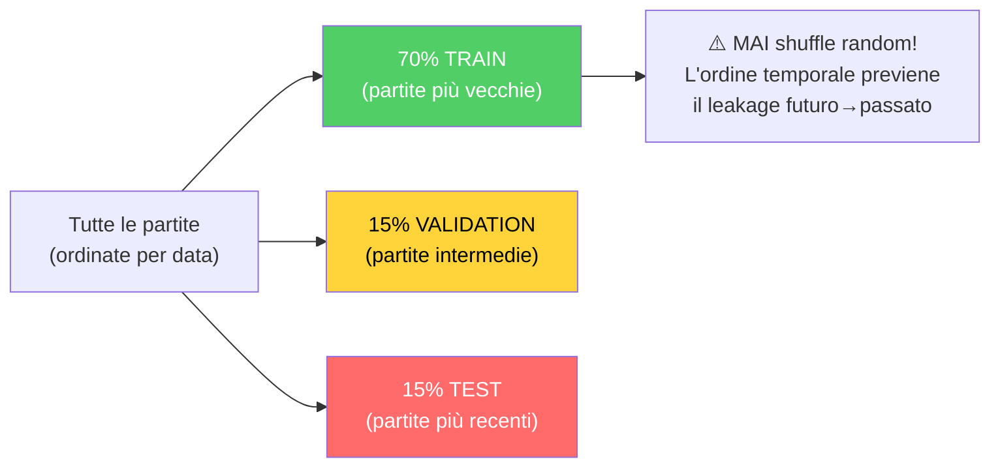

**Enrich From Demo — Arricchimento post-parsing:**

Dopo il parsing base, `enrich_from_demo()` aggiunge metriche avanzate calcolate dagli eventi:

| Metrica arricchita | Calcolo | Fonte |
| ------------------ | ------- | ----- |
| Trade kills | `TradeKillDetector.detect()` con TRADE_WINDOW_TICKS=192 | Eventi kill/death |
| Flash assists | Conteggio blind entro finestra temporale prima di un kill | Eventi blind + kill |
| Noscope kills | Kill con arma sniper senza scope attivo | Evento kill + weapon state |
| Wallbang kills | Kill attraverso superfici penetrabili | Evento kill con flag penetration |
| Through-smoke kills | Kill con fumo attivo nella linea di tiro | Evento kill + smoke position |
| Blind kills | Kill mentre il giocatore è flashato | Evento kill + flash state |

**Componenti specifici:**

| Componente | File | Ruolo |
| ---------- | ---- | ----- |
| **DemoLoader** | `demo_loader.py` | Wrappa `demoparser2`, estrae frame e eventi dal file `.dem` |
| **SteamLocator** | `steam_locator.py` | Localizza automaticamente la cartella demo di CS2 via registro Steam / libraryfolders.vdf |
| **IntegrityChecker** | `integrity.py` | Verifica che i file demo siano validi, completi e non corrotti prima del parsing |
| **UserIngestPipeline** | `pipelines/user_ingest.py` | Pipeline completa per demo utente: parse → enrich → stats → coaching |
| **JsonTournamentIngestor** | `pipelines/json_tournament_ingestor.py` | Importa dati torneo da file JSON strutturati |
| **Registry** | `registry/registry.py` | `DemoRegistry`: traccia tutte le demo processate, previene duplicati |
| **ResourceManager** | `backend/ingestion/resource_manager.py` | Gestione risorse hardware: CPU/RAM throttling, spazio disco |
| **RegistryLifecycle** | `registry/lifecycle.py` | `DemoLifecycleManager`: cleanup demo vecchie (default 30 giorni) |

**SteamLocator** (`ingestion/steam_locator.py`) — localizzazione automatica demo CS2:

Il SteamLocator implementa un algoritmo di **discovery cross-platform** per trovare automaticamente la cartella delle demo di CS2:

| Piattaforma | Strategia | Percorso tipico |
| ----------- | --------- | --------------- |
| **Windows** | Registro di sistema → `libraryfolders.vdf` | `C:\Program Files (x86)\Steam\steamapps\common\Counter-Strike Global Offensive\game\csgo\replays` |
| **Linux** | `~/.steam/steam/` → `libraryfolders.vdf` | `~/.steam/steam/steamapps/common/...` |
| **Fallback** | Chiede all'utente via UI Settings | Percorso personalizzato |

**IntegrityChecker** (`ingestion/integrity.py`):

Verifica preliminare di ogni file demo prima del parsing costoso:
- **Hash**: `compute_sha256()` per identità e deduplicazione
- **Size bounds**: minimo 50KB, massimo 900MB (`validate_dem_file`)
- **Read test**: verifica che il file sia leggibile prima del parsing

(Livelli di validazione paralleli: `demo_format_adapter.py` usa bounds 10MB–5GB con magic bytes `PBDEMS2\0`/`HL2DEMO\0`; `validation/dem_validator.py` usa 100KB–800MB.)

---

### 12.7 Console di Controllo Unificata (`backend/control/`)

**File:** `Programma_CS2_RENAN/backend/control/console.py`, `ingest_manager.py`, `db_governor.py`, `ml_controller.py`

La Console è un **Singleton** che funge da punto di coordinamento centrale per tutti i sottosistemi backend. È il "quadro di comando" attraverso cui ogni parte del sistema può essere controllata.

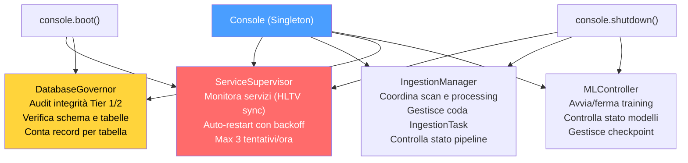

**Sequenza di boot della Console:**

1. `ServiceSupervisor` avvia il servizio "hunter" (HLTV sync) come processo monitorato
2. `DatabaseGovernor` esegue un audit di integrità: verifica tutte le tabelle, conta record, controlla schema
3. `MLController` resta in stato di attesa — il training è gestito dal daemon Teacher
4. `IngestionManager` resta idle — il lavoro attivo è gestito dai daemon Scanner/Digester

**MLControlContext — Controllo Live dell'Addestramento:**

L'`MLController` utilizza un token di controllo chiamato `MLControlContext` (`backend/control/ml_controller.py`) che viene passato ai cicli di addestramento per consentire **intervento in tempo reale** da parte dell'operatore. Questo sostituisce l'approccio precedente basato su `StopIteration` con un sistema thread-safe più robusto.

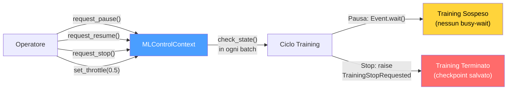

| Comando | Metodo | Effetto |
| ------- | ------ | ------- |
| **Pausa** | `request_pause()` | `_resume_event.clear()` → blocca `check_state()` |
| **Riprendi** | `request_resume()` | `_resume_event.set()` → sblocca il training |
| **Stop** | `request_stop()` | Lancia `TrainingStopRequested` (eccezione custom) |
| **Throttle** | `set_throttle(factor)` | Aggiunge `time.sleep(factor)` dopo ogni batch |

---

### 12.8 Onboarding e Flusso Nuovo Utente

**File:** `Programma_CS2_RENAN/backend/onboarding/new_user_flow.py`

L'`OnboardingManager` guida i nuovi utenti attraverso una **progressione a 3 fasi** che si adatta automaticamente alla quantità di dati disponibili.

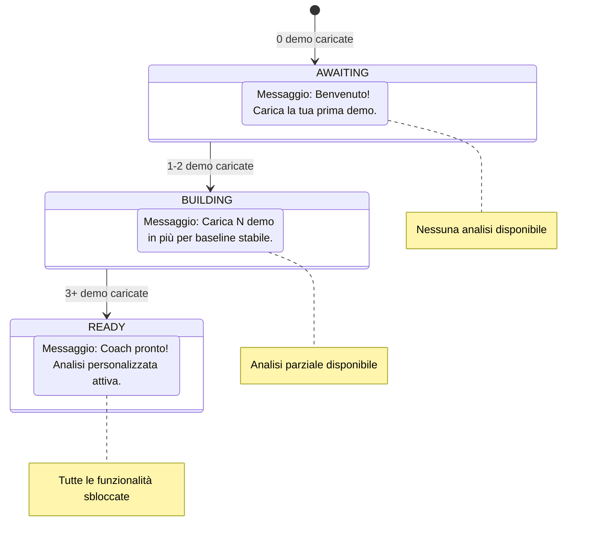

**Wizard Screen (Prima Configurazione):**

Alla prima esecuzione (`SETUP_COMPLETED = False`), l'utente viene guidato attraverso il Wizard:

1. **Nome giocatore** — Il nome che apparirà nelle analisi
2. **Ruolo preferito** — Entry Fragger, AWPer, Lurker, Support o IGL
3. **Percorsi cartelle demo** — Dove il sistema cerca automaticamente le demo
4. Al completamento: `SETUP_COMPLETED = True`, redirect alla Home

**Cache delle quote (Task 2.16.1):** Il conteggio demo è cachato per 60 secondi per evitare query DB ripetute. `invalidate_cache()` viene chiamato dopo ogni nuovo upload, garantendo che la UI mostri sempre il conteggio corretto senza sovraccaricare il database.

**Help System** (`backend/knowledge/help_system.py`):

Il sistema di aiuto integrato fornisce supporto contestuale all'utente:

| Funzionalità | Implementazione |
| ------------ | --------------- |
| **Tutorial interattivo** | Guide step-by-step per le funzionalità principali |
| **FAQ contestuali** | Domande frequenti filtrate per schermata corrente |
| **Troubleshooting** | Albero decisionale per problemi comuni (Steam path non trovato, demo non parsata, coaching vuoto) |
| **Tooltips** | Spiegazioni inline per metriche complesse (KAST, HLTV 2.0 Rating, ADR) |

---

### 12.9 Architettura di Storage (`backend/storage/`)

**Directory:** `Programma_CS2_RENAN/backend/storage/`
**File chiave:** `database.py`, `db_models.py`, `match_data_manager.py`, `storage_manager.py`, `maintenance.py`, `state_manager.py`, `stat_aggregator.py`, `backup_manager.py`, `db_backup.py`, `db_migrate.py`, `remote_file_server.py`

Il sistema di storage utilizza un'architettura **three-tier storage** basata su SQLite in modalità WAL (Write-Ahead Logging), che consente letture e scritture concorrenti senza blocchi.

```mermaid
flowchart TB
    subgraph T12["database.db (Monolite SQLite WAL — 18 tabelle)"]
        PMS["PlayerMatchStats<br/>(32 campi per giocatore/partita)"]
        CS["CoachState<br/>(stato globale del sistema)"]
        IT["IngestionTask<br/>(coda di lavoro)"]
        CI["CoachingInsight<br/>(consigli generati)"]
        PP["PlayerProfile<br/>(profilo utente)"]
        TK["TacticalKnowledge<br/>(base RAG 384-dim)"]
        CE["CoachingExperience<br/>(banca esperienza COPER)"]
        RS["RoundStats<br/>(statistiche per-round)"]
        SN["ServiceNotification<br/>(alert di sistema)"]
        EXT["Ext_PlayerPlaystyle +<br/>Ext_TeamRoundStats"]
        CALIB_ST["CalibrationSnapshot +<br/>RoleThresholdRecord"]
        MATCH_ST["MatchResult + MapVeto"]
        DL_ST["DataLineage<br/>(provenienza append-only)"]
        DQM_ST["DataQualityMetric<br/>(metriche qualità append-only)"]
    end
    subgraph T_HLTV["hltv_metadata.db (Dati Pro — 7 tabelle)"]
        PRO["ProPlayer + ProTeam + ProPlayerStatCard<br/>+ ProEvent + ProTournament<br/>+ ProHead2Head + ProMapRecord"]
    end
    subgraph T3["match_XXXX.db (Per-Match SQLite)"]
        PTS["PlayerTickState<br/>(~100.000 righe per partita)<br/>Posizione, salute, arma<br/>ogni 1/128 di secondo"]
    end
    T12 -->|"Riferimento"| T3
    T_HLTV -->|"Baseline pro per<br/>confronto coaching"| T12

    style T12 fill:#4a9eff,color:#fff
    style T_HLTV fill:#ffd43b,color:#000
    style T3 fill:#868e96,color:#fff
```

**Le 25 tabelle SQLModel di `db_models.py`** (+ 3 per-match in `match_data_manager.py` = 28 totali):

| # | Tabella | Database | Categoria | Descrizione |
| - | ------- | -------- | --------- | ----------- |
| 1 | `PlayerMatchStats` | database.db | Core | Statistiche aggregate per giocatore/partita |
| 2 | `PlayerTickState` | database.db | Core | Stato per-tick, anche archiviato in DB per-match separati |
| 3 | `PlayerProfile` | database.db | Utente | Profilo utente (nome, ruolo, Steam ID, quota mensile) |
| 4 | `RoundStats` | database.db | Core | Statistiche isolate per round (uccisioni, valutazione, arricchimento) |
| 5 | `CoachingInsight` | database.db | Coaching | Consigli generati dal servizio di coaching |
| 6 | `CoachingExperience` | database.db | Coaching | Banca esperienze COPER (contesto, esito, efficacia, TrueSkill μ/σ, replay priority — KT-01) |
| 7 | `IngestionTask` | database.db | Sistema | Coda di lavoro per il daemon Digester |
| 8 | `CoachState` | database.db | Sistema | Stato globale (training metrics, heartbeat, status) |
| 9 | `ServiceNotification` | database.db | Sistema | Messaggi di errore/evento dei daemon → UI |
| 10 | `TacticalKnowledge` | database.db | Conoscenza | Base RAG (embedding 384-dim in JSON) |
| 11 | `ProPlayer` | hltv_metadata.db | Pro | Profili giocatori professionisti |
| 12 | `ProTeam` | hltv_metadata.db | Pro | Metadata squadre professionali |
| 13 | `ProPlayerStatCard` | hltv_metadata.db | Pro | Statistiche stagionali per giocatore pro |
| 14 | `ProEvent` | hltv_metadata.db | Pro | Eventi/competizioni HLTV |
| 15 | `ProTournament` | hltv_metadata.db | Pro | Tornei HLTV |
| 16 | `ProHead2Head` | hltv_metadata.db | Pro | Scontri diretti tra giocatori |
| 17 | `ProMapRecord` | hltv_metadata.db | Pro | Record per mappa |
| 18 | `Ext_PlayerPlaystyle` | database.db | Esterno | Dati stile di gioco da CSV (per NeuralRoleHead) |
| 19 | `Ext_TeamRoundStats` | database.db | Esterno | Statistiche torneo esterne |
| 20 | `MatchResult` | database.db | Partite | Esiti delle partite |
| 21 | `MapVeto` | database.db | Partite | Storico selezione mappe |
| 22 | `CalibrationSnapshot` | database.db | Sistema | Registro di calibrazione del modello di credenza (timestamp, campioni, risultato) |
| 23 | `RoleThresholdRecord` | database.db | Sistema | Soglie apprese per la classificazione dei ruoli (persistite tra i riavvii) |
| 24 | `DataLineage` | database.db | Provenienza | Registro append-only di provenienza dati: entity_type, entity_id, source_demo, pipeline_version, processing_step |
| 25 | `DataQualityMetric` | database.db | Provenienza | Metriche qualità append-only per run: run_id, run_type, metric_name, metric_value, sample_count |

**Enum di supporto (non tabelle):**

| Enum | Tipo | Descrizione |
| ---- | ---- | ----------- |
| `DatasetSplit` | `str, Enum` | Categorie split (train/val/test/unassigned) — usato come constraint su `PlayerMatchStats.dataset_split` |
| `CoachStatus` | `str, Enum` | Stati del coach (Paused/Training/Idle/Error) — usato come constraint su `CoachState.status` |

**Componenti di Storage dettagliati:**

**MatchDataManager** (`backend/storage/match_data_manager.py`) — il componente più grande dello storage layer:

Il MatchDataManager è responsabile della gestione dei dati per-partita ad alta densità (PlayerTickState con ~100.000 righe per partita). Per evitare che il database principale cresca in modo incontrollato, ogni partita ha il proprio database SQLite separato (`match_XXXX.db`).

| Metodo | Descrizione |
| ------ | ----------- |
| `get_match_session(match_id)` | Context manager transazionale sul DB per-match (engine da cache LRU) |
| `store_tick_batch(match_id, ticks)` | Bulk insert di `MatchTickState` nel DB dedicato |
| `store_event_batch(match_id, events)` | Bulk insert di `MatchEventState` |
| `store_metadata(match_id, metadata)` | Upsert dei metadati match |
| `list_available_matches()` | Elenca tutti i match con DB disponibili |
| `delete_match(match_id)` | Rimuove il DB per-match |

**Nota WR-14:** il manager verifica il device-ID del volume per rilevare la disconnessione del drive esterno dei per-match DB.

**StorageManager** (`backend/storage/storage_manager.py`):

Il StorageManager è il **coordinatore di alto livello** dello storage che gestisce quote, upload e ciclo di vita dei dati:

| Responsabilità | Implementazione |
| -------------- | --------------- |
| **Quota mensile** | `can_user_upload()` → verifica `MAX_DEMOS_PER_MONTH=10` e `MAX_TOTAL_DEMOS=100` |
| **Upload flow** | `handle_demo_upload(path)` → validazione → copia in working dir → crea IngestionTask |
| **Pulizia** | `cleanup_old_data(days)` → rimuove match DB e task vecchi |
| **Spazio disco** | `get_storage_usage()` → report dimensioni per ogni database e directory |

**StateManager** (`backend/storage/state_manager.py`):

Il StateManager è un **Singleton** che mantiene lo stato runtime del sistema e lo persiste nel database tramite la tabella `CoachState`:

| Metodo | Scopo |
| ------ | ----- |
| `update_status(daemon, text)` | Aggiorna lo stato di un daemon specifico |
| `heartbeat()` | Aggiorna il timestamp `last_heartbeat` |
| `get_state()` | Restituisce lo stato corrente come oggetto `CoachState` |
| `set_error(daemon, message)` | Registra un errore per un daemon con timestamp |
| `update_training_metrics(epoch, loss, val_loss, eta)` | Aggiorna le metriche di training in tempo reale |
| `get_belief_confidence()` | Restituisce il livello di fiducia del modello di credenza (0.0-1.0) |

**StatAggregator** (`backend/storage/stat_aggregator.py`):

Calcola statistiche aggregate a partire dai dati grezzi per-round:

| Aggregazione | Formula | Uso |
| ------------ | ------- | --- |
| `avg_kills` | `mean(RoundStats.kills)` | Dashboard, radar chart |
| `avg_adr` | `mean(RoundStats.damage_dealt / rounds)` | Confronto pro |
| `avg_kast` | `mean(rounds_with_kast / total_rounds)` | Metrica HLTV |
| `accuracy` | `sum(hits) / sum(shots_fired)` | Performance meccanica |
| `trade_kill_rate` | `trade_kills / team_deaths` | Lavoro di squadra |

**BackupManager** (`backend/storage/backup_manager.py`):

| Caratteristica | Dettaglio |
| -------------- | --------- |
| **Meccanismo** | Hot backup via **SQLite Online Backup API** (`sqlite3.Connection.backup()`, scelta al posto di `VACUUM INTO` per evitare interpolazione del path in SQL; sicura in WAL-mode) |
| **Verifica** | `PRAGMA quick_check` sulla copia (`_verify_integrity`, try/finally H-02) |
| **Trigger automatico** | All'avvio del Session Engine via `should_run_auto_backup()` |
| **Trigger manuale** | Via Console o UI Settings |
| **Rotazione** | `_prune_backups()`; il modulo complementare `db_backup.py` (`backup_monolith`, `backup_match_data`, `rotate_backups` keep_count=5, `restore_backup`) |
| **Etichettatura** | Es. `startup_auto`, `manual` |

**Maintenance** (`backend/storage/maintenance.py`):

| Operazione | Frequenza | Scopo |
| ---------- | --------- | ----- |
| `vacuum()` | Mensile | Compatta il database, recupera spazio da record eliminati |
| `analyze()` | Dopo ogni bulk insert | Aggiorna le statistiche dell'ottimizzatore query SQLite |
| `wal_checkpoint()` | All'avvio | Forza il merge del WAL nel database principale |
| `integrity_check()` | All'avvio | `PRAGMA integrity_check` — verifica coerenza strutturale |

**DbMigrate** (`backend/storage/db_migrate.py`):

Wrapper attorno ad Alembic che automatizza l'esecuzione delle migrazioni:

```mermaid
flowchart LR
    BOOT["Avvio applicazione (Fase 3)"]
    BOOT --> CHECK["db_migrate.ensure_database_current()"]
    CHECK -->|"Migrazioni pendenti"| APPLY["alembic.upgrade('head')"]
    CHECK -->|"Schema aggiornato"| SKIP["Nessuna azione"]
    APPLY --> VERIFY["Verifica schema post-migrazione"]
    VERIFY -->|"OK"| CONTINUE["Continua avvio"]
    VERIFY -->|"Errore"| ABORT["TERMINAZIONE<br/>Schema incompatibile"]
    style CONTINUE fill:#51cf66,color:#fff
    style ABORT fill:#ff6b6b,color:#fff
```

**Connection Pooling e Concorrenza:**

| Parametro | Valore | Scopo |
| --------- | ------ | ----- |
| `check_same_thread` | `False` | Consente accesso multi-thread |
| `timeout` | 30 secondi | Busy timeout per contesa WAL |
| `pool_size` | 1 | Singolo scrittore SQLite (sicurezza single-writer) |
| `max_overflow` | 4 | Connessioni overflow per picchi di carico |
| WAL mode | Abilitato | Letture concorrenti illimitate |

---

### 12.10 Motore di Playback e Viewer Tattico

**File:** `Programma_CS2_RENAN/core/playback_engine.py`, `apps/qt_app/screens/tactical_viewer_screen.py`, `apps/qt_app/widgets/tactical/map_widget.py`, `timeline_widget.py`, `player_sidebar.py`

Il sistema di playback tattico consente all'utente di **rivivere le proprie partite** su una mappa 2D interattiva, con overlay AI (posizione fantasma ottimale), marcatori eventi (uccisioni, piazzamenti bomba) e controlli di riproduzione completi.

```mermaid
flowchart TB
    subgraph VIEWER["TACTICAL VIEWER - COMPONENTI"]
        MAP["TacticalMap (QPainter)<br/>Rendering 2D: giocatori (cerchi colorati),<br/>granate (overlay HE/molotov/fumo/flash),<br/>heatmap (sfondo calore gaussiano),<br/>fantasma AI (cerchio trasparente posizione ottimale)"]
        TIMELINE["Timeline (Scrubber)<br/>Barra di scorrimento con tick numbers,<br/>marcatori eventi (uccisioni, piazzamenti),<br/>drag per cercare, double-click per saltare"]
        SIDEBAR["PlayerSidebar (CT + T)<br/>Lista giocatori per squadra,<br/>salute, armatura, arma, denaro,<br/>giocatore selezionato evidenziato"]
        CONTROLS["Controlli Playback<br/>Play/Pause, velocità (0.25x → 8x),<br/>selettore round/segmento,<br/>toggle fantasma on/off"]
    end
    subgraph ENGINE["MOTORI"]
        PBE["PlaybackEngine<br/>Frame rate 60 FPS,<br/>interpolazione tra frame 64-tick,<br/>gestione velocità variabile"]
        GE["GhostEngine<br/>Inferenza RAP in tempo reale,<br/>optimal_pos delta × 500.0,<br/>fallback (0.0, 0.0) se errore"]
        CS["ChronovisorScanner<br/>Analisi vantaggio temporale,<br/>rilevamento momenti critici,<br/>classificazione giocata/errore"]
    end
    MAP --> PBE
    TIMELINE --> PBE
    SIDEBAR --> PBE
    CONTROLS --> PBE
    PBE --> GE
    PBE --> CS
    GE -->|"posizioni fantasma"| MAP
    CS -->|"marcatori eventi"| TIMELINE

    style MAP fill:#4a9eff,color:#fff
    style GE fill:#ff6b6b,color:#fff
    style CS fill:#51cf66,color:#fff
```

**PlaybackEngine — Architettura interna:**

Il PlaybackEngine gestisce la riproduzione frame-by-frame con interpolazione temporale. Il timer di aggiornamento utilizza `QTimer`, mantenendo la stessa logica di interpolazione e buffering:

| Caratteristica | Dettaglio |
| -------------- | --------- |
| **Frame rate** | 60 FPS (interpolazione da 64-tick nativo del demo) |
| **Velocità variabile** | 0.25x (slow-mo), 0.5x, 1x (normale), 2x, 4x, 8x (fast-forward) |
| **Interpolazione** | Lineare tra frame adiacenti per movimenti fluidi |
| **Buffering** | Pre-carica 120 frame in anticipo per evitare lag |
| **Seek** | Accesso diretto a qualsiasi tick via indice |
| **Round selection** | Salta direttamente all'inizio di un round specifico |

**GhostEngine — Inferenza in tempo reale:**

Il GhostEngine è il componente che trasforma le predizioni del RAP Coach in **posizioni fantasma visibili sulla mappa**:

```mermaid
flowchart LR
    FRAME["Frame corrente<br/>(posizioni giocatori)"]
    FRAME --> EXTRACT["Estrai feature vector<br/>(vectorizer.py, 25-dim)"]
    EXTRACT --> RAP["RAP Coach forward()<br/>→ optimal_position_delta"]
    RAP --> SCALE["Scala delta × 500.0<br/>(unità mondo CS2)"]
    SCALE --> POS["Posizione fantasma =<br/>posizione_corrente + delta_scalato"]
    POS --> RENDER["Rendering cerchio<br/>semi-trasparente su mappa"]
    RAP -->|"Errore/Modello assente"| FALLBACK["Fallback: (0.0, 0.0)<br/>Nessun fantasma mostrato"]
    style RAP fill:#ff6b6b,color:#fff
    style RENDER fill:#51cf66,color:#fff
    style FALLBACK fill:#868e96,color:#fff
```

**ChronovisorScanner — Rilevamento momenti critici:**

Il ChronovisorScanner analizza l'intera partita e identifica i **momenti decisivi** basandosi sul cambio di vantaggio:

| Tipo momento | Condizione | Colore marcatore |
| ------------ | ---------- | --------------- |
| **Errore critico** | Morte in vantaggio numerico (es. 4v3 → 3v3) | 🔴 Rosso |
| **Giocata eccellente** | Uccisione in svantaggio numerico (es. 2v3 → 2v2) | 🟢 Verde |
| **Piazzamento bomba** | Evento bomb_planted con timer | 🟡 Giallo |
| **Clutch** | Vittoria 1vN (N ≥ 2) | ⭐ Oro |
| **Eco round win** | Vittoria con equipaggiamento < $2.000 | 🔵 Blu |

Ogni momento viene posizionato sulla Timeline come un marcatore cliccabile. Il click salta il playback direttamente a quel tick.

**Flusso di caricamento del viewer (One-Click):**

1. L'utente clicca "Tactical Viewer" dalla Home
2. Se nessuna demo è caricata → `trigger_viewer_picker()` apre il file picker automaticamente
3. L'utente seleziona un file `.dem`
4. Appare un dialogo "Ricostruzione Dinamica 2D in Corso..."
5. Un thread in background esegue `_execute_viewer_parse(path)` → `DemoLoader.load_demo()`
6. Al completamento: dismissione dialogo, caricamento frame in PlaybackEngine
7. La mappa viene renderizzata con i giocatori al frame 0

---

### 12.11 Dati Spaziali e Gestione Mappe

**File:** `Programma_CS2_RENAN/core/spatial_data.py`, `spatial_engine.py`, `data/map_config.json`

Il sistema di gestione mappe traduce le **coordinate mondo di CS2** (valori tipici: -2000 a +2000 su X/Y) in **coordinate pixel** sulla texture della mappa (0.0 a 1.0 normalizzato), e viceversa.

**Prima della geometria, l'identità: quali mappe esistono.** Un censimento dell'agosto 2026 ha trovato **dodici** elenchi di mappe note dichiarati in punti diversi del progetto, con contenuti divergenti: chi ne conosceva undici, chi nove, chi otto. La conseguenza non era teorica — la stessa demo poteva essere riconosciuta da uno strumento e ignorata da un altro, a seconda di quale elenco quel modulo si portava dietro.

`core/known_maps.py` è oggi l'autorità unica: `KNOWN_MAP_NAMES` (i nomi nudi), `KNOWN_MAP_IDS` (gli stessi con il prefisso `de_`), l'espressione regolare per riconoscere una mappa dentro un nome di file, e i tre helper `bare_name()`, `is_known_map()`, `sniff_map_from_text()`. L'insieme è deliberatamente un **soprainsieme** di tutti e dodici gli elenchi trovati: meglio riconoscere una mappa che non è nella rotazione competitiva che ignorarne una che c'è.

Va detto con precisione fin dove arriva, perché una SSOT dichiarata più ampia di quello che è vale meno di nessuna SSOT. **Sette consumatori** sono stati convertiti e sono presidiati dal test `test_known_maps_ssot.py`, che vieta di ridichiarare il trio mirage/inferno/nuke e verifica che ciascuno importi ancora il modulo:

`apps/qt_app/core/match_utils.py` · `apps/qt_app/screens/coach_screen.py` · `tools/d3_recover_shard_metadata.py` · `tools/mine_coaching_experience.py` · `tools/mine_shard_strategies.py` · `tools/populate_match_results.py` · `tools/rebuild_monolith.py`

Restano fuori quattro elenchi locali — in `coaching_dialogue.py`, `reporting/analytics.py`, `knowledge/pro_demo_miner.py` e in `Goliath_Hospital.py` — e due di questi sono esclusioni **volute**: `REQUIRED_MAPS` di Goliath verifica la presenza di file di asset, non l'identità di una mappa, e il registro spaziale porta geometrie radar calibrate a mano che non hanno senso fuori dal loro contesto. Gli altri due sono debito residuo, non progetto.

```mermaid
flowchart LR
    WORLD["Coordinate Mondo CS2<br/>(pos_x=-1200, pos_y=800, pos_z=100)"]
    WORLD -->|"MapMetadata.world_to_radar()"| NORM["Coordinate Normalizzate<br/>(0.35, 0.62)"]
    NORM -->|"× dimensione texture"| PIXEL["Coordinate Pixel<br/>(224px, 397px)"]
    PIXEL -->|"rendering su canvas"| MAP["Punto sulla Mappa 2D"]

    MAP -->|"click utente"| PIXEL2["Pixel Cliccato"]
    PIXEL2 -->|"MapMetadata.radar_to_world()"| WORLD2["Coordinate Mondo<br/>(per query AI)"]

    style WORLD fill:#ff6b6b,color:#fff
    style NORM fill:#ffd43b,color:#000
    style MAP fill:#51cf66,color:#fff
```

**MapMetadata** (dataclass immutabile per ogni mappa):

| Campo | Esempio (Dust2) | Scopo |
| ----- | ---------------- | ----- |
| `pos_x` | -2476 | X dell'angolo in alto a sinistra in unità mondo |
| `pos_y` | 3239 | Y dell'angolo in alto a sinistra in unità mondo |
| `scale` | 4.4 | Unità di gioco per pixel della texture |
| `z_cutoff` | `None` | Separatore di livello (solo mappe multilivello) |
| `level` | `"single"` | Tipo: "single", "upper", "lower" |
| `texture_width` | 1024 | Larghezza texture radar in pixel |
| `texture_height` | 1024 | Altezza texture radar in pixel |

**MapManager** (`core/map_manager.py`):

Il MapManager è il componente di alto livello che coordina il caricamento delle mappe per l'interfaccia:

| Metodo | Scopo |
| ------ | ----- |
| `get_map_metadata(map_name)` | Restituisce MapMetadata per la mappa richiesta |
| `load_radar_texture(map_name)` | Carica texture PNG della mappa radar da cache o disco |
| `get_available_maps()` | Lista delle mappe supportate con metadata |
| `world_to_pixel(pos, map_name)` | Shortcut per conversione coordinate mondo → pixel |

**Mappe multilivello supportate:**

| Mappa | z_cutoff | Livelli | Note |
| ----- | -------- | ------- | ---- |
| **Nuke** | -495 | upper / lower | Due plant site su piani diversi |
| **Vertigo** | 11700 | upper / lower | Grattacielo con due aree giocabili |
| Tutte le altre | `None` | single | Mappe a livello singolo |

**SpatialEngine** (`core/spatial_engine.py`):

Il SpatialEngine aggiunge capacità di **ragionamento spaziale** al sistema di coordinate base:

| Metodo | Input | Output | Uso |
| ------ | ----- | ------ | --- |
| `distance_2d(pos_a, pos_b)` | Due coordinate mondo | Float (unità mondo) | Calcolo distanza di ingaggio |
| `is_visible(pos_a, pos_b, obstacles)` | Due pos + ostacoli | Bool | Linea di vista (semplificata) |
| `get_zone(pos, map_name)` | Coordinata + mappa | Stringa (es. "A_site") | Classificazione zona tattica |
| `nearest_cover(pos, map_name)` | Coordinata + mappa | Coordinata copertura | Suggerimento posizionale |

**AssetManager** (`core/asset_manager.py`):

Gestisce il caricamento delle texture delle mappe e degli asset UI:

| Asset | Formato | Dimensione tipica | Cache |
| ----- | ------- | ----------------- | ----- |
| Texture mappa (radar) | PNG 1024×1024 | ~500KB | Sì (in-memory) |
| Icone giocatore | PNG 32×32 | ~2KB | Sì |
| Font (JetBrains Mono, YUPIX) | TTF | ~200KB | Sì (registrate via Qt) |
| Wallpaper temi | PNG 1920×1080 | ~2MB | Lazy load |

---

### 12.12 Osservabilità e Logging

**File:** `Programma_CS2_RENAN/observability/logger_setup.py`
**File correlati:** `backend/storage/state_manager.py`, `backend/services/telemetry_client.py`

Il sistema di osservabilità garantisce che ogni evento significativo sia **tracciabile, strutturato e persistente**. Il client di telemetria (`telemetry_client.py`) utilizza **`httpx`** (HTTP asincrono) per l'invio non bloccante di metriche e eventi, evitando che latenze di rete influiscano sulle prestazioni dell'applicazione.

```mermaid
flowchart TB
    subgraph LOG["LOGGING STRUTTURATO"]
        GL["get_logger(name)<br/>→ logging.Logger"]
        GL --> FILE["FileHandler<br/>logs/cs2_analyzer.log<br/>(append mode)"]
        GL --> CON["ConsoleHandler<br/>(solo WARNING+)"]
        FILE --> FMT["Formato: TIMESTAMP | LEVEL | NAME | MESSAGE"]
    end
    subgraph STATE["STATE MANAGER"]
        SM["StateManager (Singleton)"]
        SM --> US["update_status(daemon, text)"]
        SM --> HB["heartbeat()"]
        SM --> GS["get_state() → CoachState"]
        SM --> SE["set_error(daemon, message)"]
    end
    subgraph NOTIFY["NOTIFICHE"]
        SN["ServiceNotification"]
        SN --> UI["Mostrate nell'UI<br/>(badge, toast)"]
    end
    LOG --> STATE
    STATE --> NOTIFY

    style LOG fill:#4a9eff,color:#fff
    style STATE fill:#ffd43b,color:#000
    style NOTIFY fill:#ff6b6b,color:#fff
```

**Daemon monitorati dallo StateManager:**

| Daemon | Campo in CoachState | Valori tipici |
| ------ | ------------------- | ------------- |
| Scanner | `hltv_status` | "Scanning", "Paused", "Error" |
| Digester (worker) | `ingest_status` | "Processing", "Idle", "Error" |
| Teacher (trainer) | `ml_status` | "Learning", "Idle", "Error" |
| Globale | `status` | "Paused", "Training", "Idle", "Error" |

**Sentry Integration** (`observability/sentry_setup.py`):

Il sistema include integrazione opzionale con **Sentry** per error tracking remoto, con un approccio **double opt-in** per la privacy:

| Caratteristica | Implementazione |
| -------------- | --------------- |
| **Double opt-in** | L'utente deve (1) impostare `SENTRY_DSN` come variabile d'ambiente E (2) attivare il flag nelle impostazioni |
| **PII Scrubbing** | Tutti i dati personali (nomi giocatori, Steam ID, percorsi) vengono rimossi prima dell'invio |
| **Breadcrumb sanitization** | I breadcrumb di navigazione vengono puliti da informazioni sensibili |
| **Non bloccante** | Se Sentry non è configurato, il sistema prosegue normalmente (Fase 4 dell'avvio) |
| **Contesto arricchito** | Ogni errore include: versione app, stato daemon, conteggio demo, sistema operativo |

**Logger Setup** (`observability/logger_setup.py`):

Il sistema di logging centralizzato fornisce log strutturati con:

| Caratteristica | Dettaglio |
| -------------- | --------- |
| **Formato** | `TIMESTAMP | LEVEL | LOGGER_NAME | MESSAGE` |
| **File handler** | `logs/cs2_analyzer.log` (append mode, rotazione automatica) |
| **Console handler** | Solo `WARNING+` per non inquinare l'output |
| **Naming convention** | `get_logger("cs2analyzer.<module>")` — namespace gerarchico |
| **Livelli usati** | `DEBUG` (sviluppo), `INFO` (operazioni normali), `WARNING` (anomalie non critiche), `ERROR` (fallimenti), `CRITICAL` (terminazione) |

**Metriche di training esposte in CoachState:** `current_epoch`, `total_epochs`, `train_loss`, `val_loss`, `eta_seconds`, `belief_confidence`, `system_load_cpu`, `system_load_mem`.

**Registro Centralizzato dei Codici Errore** (`observability/error_codes.py`):

Il sistema implementa un registro formale di **24 codici errore** classificati per severità e modulo. Ogni codice è definito come `ErrorCodeDef(NamedTuple)` con: `code`, `severity`, `module`, `description`, `remediation`.

| Prefisso | Modulo | Esempio | Severità tipica |
|---|---|---|---|
| `LS` | Logger Setup | LS-01: RotatingFileHandler non disponibile | MEDIUM |
| `RP` | RASP Guard | RP-01: CS2_MANIFEST_KEY non impostato | HIGH |
| `DA` | Data Access | DA-01-03: JSON malformato da DB | LOW |
| `P` | Pipeline | P7-01/P7-02: Errori pipeline critica | HIGH |
| `F` | Feature/Fix | F6-SE: Errore session engine | HIGH |
| `SE` | Session Engine | SE-05: Errore critico sessione | HIGH |
| `IM` | Ingestion | IM-03: Errore ingestione | MEDIUM |
| `NN` | Neural Network | NN-02: Errore rete neurale | MEDIUM |
| `CO` | Console Control | CO-01/CO-03: Errori controllo critici | HIGH |
| `R1` | Release/Manifest | R1-12: Errore manifest rilascio | HIGH |

**Severità** (`Severity(Enum)`): `LOW`, `MEDIUM`, `HIGH`, `CRITICAL`.

**Utilità:**
- `log_with_code(error_code, message) → str` — Prefixa il messaggio con il codice formale (es. `[LS-01] message`)
- `get_all_codes() → list[dict]` — Tutti i codici come lista di dizionari per accesso programmatico

**Gerarchia Eccezioni** (`observability/exceptions.py`): Classe base `CS2AnalyzerError(Exception)` con sottoclassi: `ConfigurationError`, `DatabaseError`, `IngestionError`, `TrainingError`, `IntegrationError`, `UIError`. Ogni eccezione può portare un `error_code: ErrorCode | None` per correlazione con il registro.

---

### 12.13 Reporting e Visualizzazione

**File:** `Programma_CS2_RENAN/reporting/visualizer.py`, `report_generator.py`
**File correlati:** `backend/processing/heatmap_engine.py`

Il sistema di reporting trasforma i dati grezzi in **visualizzazioni comprensibili** per l'utente.

```mermaid
flowchart TB
    DATA["Dati da Database<br/>(PlayerMatchStats,<br/>RoundStats, CoachingInsight)"]
    DATA --> VIS["Visualizer<br/>Radar skill (5 assi),<br/>trend storici (grafici linea),<br/>confronti pro (tabelle)"]
    DATA --> HM["HeatmapEngine<br/>Mappe di calore gaussiane,<br/>heatmap differenziali (tu vs pro),<br/>rilevamento hotspot"]
    DATA --> RG["ReportGenerator<br/>Assemblaggio PDF completo,<br/>formattazione professionale,<br/>esportazione su disco"]
    VIS --> UI["Mostrati nell'UI<br/>(coach screen, performance)"]
    HM --> TV["Overlay su TacticalMap<br/>(viewer tattico)"]
    RG --> PDF["File PDF<br/>(esportabile)"]

    style VIS fill:#4a9eff,color:#fff
    style HM fill:#ff6b6b,color:#fff
    style RG fill:#51cf66,color:#fff
```

**HeatmapEngine — Dettagli tecnici:**

| Caratteristica | Dettaglio |
| -------------- | --------- |
| **Thread-safety** | `generate_heatmap_data()` gira in thread separato (non blocca UI) |
| **Texture creation** | Solo nel thread principale (requisito del thread Qt) |
| **Tipo** | Occupazione gaussiana 2D (blur kernel parametrico) |
| **Differenziale** | Sottrae heatmap pro da heatmap utente → rosso (troppo tempo), blu (troppo poco) |
| **Hotspot** | Identifica cluster di posizione per training posizionale |

**MatchVisualizer** (`reporting/visualizer.py`) — metodi di rendering specializzati:

Il MatchVisualizer estende la capacità di reporting con 6 metodi di rendering ad alta qualità (cfr. sezione 12.26 per i dettagli algoritmici):

| Metodo | Input | Output | Descrizione |
| ------ | ----- | ------ | ----------- |
| `render_skill_radar(user, pro)` | Dict metriche | PNG radar chart | Pentagono 5 assi con overlay pro baseline |
| `render_trend_chart(history, metric)` | Lista storica | PNG line chart | Andamento temporale con media mobile |
| `render_heatmap(positions, map_name)` | Coordinate tick | PNG heatmap | Gaussiana 2D su texture mappa |
| `render_differential(user_pos, pro_pos)` | Due set posizioni | PNG heatmap diff | Rosso (eccesso) / Blu (deficit) / Verde (allineamento) |
| `render_critical_moments(events)` | Lista eventi round | PNG timeline | Marcatori colorati per kill/death/bomb |
| `render_comparison_table(user, pro)` | Due profili stats | HTML/PNG tabella | Delta percentuale per ogni metrica |

**ReportGenerator** (`reporting/report_generator.py`):

Assembla tutti gli elementi visuali in un **documento PDF completo**:

1. **Header**: Nome giocatore, data, demo analizzata
2. **Executive Summary**: Metriche chiave (KPR, ADR, KAST, Rating)
3. **Radar Chart**: Confronto 5 assi con pro baseline
4. **Trend Charts**: Tendenze delle ultime N partite
5. **Heatmap Differenziale**: Dove posizionarsi meglio
6. **Momenti Critici**: I 5 momenti decisivi della partita
7. **Consigli del Coach**: Top-3 insight prioritizzati
8. **Footer**: Generato da Macena CS2 Analyzer v.X.X

---

### 12.14 Gestione Quote e Limiti

Il sistema implementa un meccanismo di **quota mensile** per prevenire l'abuso delle risorse di elaborazione e garantire una distribuzione equa del carico.

| Limite | Valore | Enforcement |
| ------ | ------ | ----------- |
| **MAX_DEMOS_PER_MONTH** | 10 | `StorageManager.can_user_upload()` |
| **MAX_TOTAL_DEMOS** | 100 | `StorageManager.can_user_upload()` |
| **MIN_DEMOS_FOR_COACHING** | 10 | Soglia per coaching personalizzato completo |
| **Reset mensile** | Automatico | `PlayerProfile.last_upload_month` vs. mese corrente |

```mermaid
flowchart LR
    UPLOAD["Utente carica demo"]
    UPLOAD --> CHECK{"can_user_upload()?"}
    CHECK -->|"Quota OK"| PROCESS["Crea IngestionTask<br/>monthly_count += 1"]
    CHECK -->|"Quota esaurita"| DENY["Errore: Limite mensile<br/>raggiunto (10/10)"]
    CHECK -->|"Limite totale"| DENY2["Errore: Limite totale<br/>raggiunto (100/100)"]
    style PROCESS fill:#51cf66,color:#fff
    style DENY fill:#ff6b6b,color:#fff
    style DENY2 fill:#ff6b6b,color:#fff
```

---

### 12.15 Tolleranza ai Guasti e Recupero

Il sistema è progettato per **non perdere mai dati** e **riprendersi automaticamente** da quasi tutti i tipi di fallimento.

```mermaid
flowchart TB
    subgraph RECOVERY["MECCANISMI DI TOLLERANZA AI GUASTI"]
        ZTC["Zombie Task Cleanup<br/>All'avvio: task 'processing'<br/>→ reset a 'queued'<br/>Ripristino automatico senza perdita"]
        BAK["Backup Automatico<br/>All'avvio: checkpoint 'startup_auto'<br/>Rotazione: 7 giornalieri + 4 settimanali<br/>Copia completa database"]
        SUP["Service Supervisor<br/>Monitora servizi esterni<br/>Auto-restart, max 3 tentativi/ora<br/>delay 5s tra i tentativi"]
        CB["Resilienza HLTV<br/>Backoff adattivo sui fallimenti<br/>+ modalità dormiente 6h<br/>se HLTV irraggiungibile"]
        POOL["Connection Pooling<br/>pool_size=1 + max_overflow=4<br/>Timeout 30s per contesa WAL<br/>PRAGMA per-connessione"]
        GRACE["Degradazione Graduale<br/>Coaching: 4 livelli fallback<br/>GhostEngine: (0,0) se errore<br/>Ogni servizio ha un piano B"]
    end

    style ZTC fill:#4a9eff,color:#fff
    style BAK fill:#51cf66,color:#fff
    style SUP fill:#ffd43b,color:#000
    style CB fill:#be4bdb,color:#fff
    style GRACE fill:#ff6b6b,color:#fff
```

**Matrice di fallimento e recupero:**

| Scenario di fallimento | Meccanismo di recupero | Perdita di dati |
| ---------------------- | ---------------------- | --------------- |
| Crash dell'applicazione durante parsing | Zombie Task Cleanup al riavvio | Nessuna — task ricominciato |
| Corruzione database | Restore da backup automatico più recente | Massimo 24 ore di dati |
| Servizio HLTV non raggiungibile | Backoff adattivo del fetcher (delay cresce con i fallimenti consecutivi) + **modalità dormiente di 6 ore** del sync service quando HLTV è irraggiungibile. Previene cascade failure su API esterne. | Nessuna — dati pro ritardati |
| Modello ML non caricabile | Fallback a pesi casuali (GhostEngine) o coaching base | Nessuna — qualità degradata |
| RAM insufficiente durante training | Early stopping automatico, checkpoint salvato | Nessuna — ultimo checkpoint valido |
| Disco pieno | Database Governor rileva e notifica via ServiceNotification | Prevenzione — nessun dato scritto |
| Demo corrotta/troncata | IntegrityChecker rifiuta prima del parsing | Nessuna — demo ignorata con warning |
| Ollama non disponibile | LLM fallback a RAG puro, poi coaching base | Nessuna — qualità narrativa degradata |
| API Steam/FACEIT timeout | Retry con backoff esponenziale (max 3 tentativi) | Nessuna — profilo non aggiornato |
| Container FlareSolverr non attivo | `DockerManager.ensure_flaresolverr()`: docker start → docker compose up, health poll 45s | Nessuna — scraping HLTV ritardato |
| Conflitto WAL (lock contention) | Timeout 30s con retry automatico | Nessuna — operazione ritardata |
| Checkpoint ML corrotto | Fallback a checkpoint precedente (versionamento) | Parziale — perde ultimo training |
| Vettore query norma-zero (M-07) | `VectorIndex.search()` ritorna `None` con warning — pipeline RAG continua senza crash | Nessuna — risultato RAG vuoto |
| File settings.json corrotto (M-08) | `load_user_settings()` valida struttura, fallback a default se non-dict | Nessuna — impostazioni predefinite |
| Logger non inizializzato (C-09) | Bootstrap anticipato usa `print()` prima dell'init del logger | Nessuna — messaggi su stdout |
| DB handle leak su integrity check (H-02) | `_verify_integrity()` usa `try/finally` + `PRAGMA quick_check` | Nessuna — connessione sempre chiusa |
| Errori batch mascherati in RAP training (H-03) | Rimosso `except (KeyError, TypeError): continue` — `train_step()` richiede dict con key `'loss'` | Nessuna — errori ora visibili |

**Degradazione graduale — La Catena di Fallback:**

```mermaid
flowchart TB
    subgraph COACHING_FALLBACK["COACHING: 4 LIVELLI FALLBACK"]
        C1["Livello 1: COPER<br/>Esperienza + RAG + Pro ref<br/>(migliore qualità)"]
        C2["Livello 2: Ibrido<br/>ML Z-score + RAG<br/>(buona qualità)"]
        C3["Livello 3: RAG Puro<br/>Solo knowledge base<br/>(qualità base)"]
        C4["Livello 4: Template<br/>Consigli generici<br/>(qualità minima)"]
    end
    C1 -->|"COPER non disponibile"| C2
    C2 -->|"ML non addestrato"| C3
    C3 -->|"Knowledge base vuota"| C4
    style C1 fill:#51cf66,color:#fff
    style C2 fill:#4a9eff,color:#fff
    style C3 fill:#ffd43b,color:#000
    style C4 fill:#ff6b6b,color:#fff
```

```mermaid
flowchart TB
    subgraph GHOST_FALLBACK["GHOST ENGINE: 3 LIVELLI FALLBACK"]
        G1["Livello 1: RAP Coach<br/>Predizione posizione ottimale<br/>con delta × 500.0"]
        G2["Livello 2: Baseline Pro<br/>Posizione media dei pro<br/>nella stessa zona"]
        G3["Livello 3: Fallback (0,0)<br/>Nessuna posizione fantasma<br/>(funzionalità disabilitata)"]
    end
    G1 -->|"Modello non caricato"| G2
    G2 -->|"Baseline non disponibile"| G3
    style G1 fill:#51cf66,color:#fff
    style G2 fill:#ffd43b,color:#000
    style G3 fill:#ff6b6b,color:#fff
```

---

### 12.16 Viaggio Completo dell'Utente — 4 Flussi Principali

Questa sezione descrive i **4 flussi principali** che un utente attraversa durante l'uso di Macena CS2 Analyzer.

#### Flusso 1: Upload e Analisi di una Demo

```mermaid
sequenceDiagram
    participant U as Utente
    participant UI as Qt UI
    participant H as Scanner Daemon
    participant D as Digester Daemon
    participant CS as CoachingService
    participant DB as Database

    U->>UI: Seleziona file .dem
    UI->>DB: Crea IngestionTask(status=queued)
    Note over H: Ciclo scan ogni 10s
    H->>DB: Trova nuovo task
    H->>D: Segnala _work_available
    D->>D: DemoLoader.load_demo()
    D->>D: FeatureExtractor.extract()
    D->>D: enrich_from_demo()
    D->>DB: Salva PlayerMatchStats + RoundStats
    D->>CS: generate_new_insights()
    CS->>CS: COPER → Ibrido → RAG → Base
    CS->>DB: Salva CoachingInsight (5-20)
    D->>DB: status = completed
    Note over UI: Polling ogni 10s
    UI->>DB: Leggi nuovi insight
    UI->>U: Mostra card coaching colorate
```

**Dettaglio: Pipeline CoachingService interna**

Quando `generate_new_insights()` viene invocato, il CoachingService esegue internamente:

```mermaid
flowchart TB
    INPUT["PlayerMatchStats<br/>+ RoundStats enriched"]
    INPUT --> Z_SCORE["1. Calcolo Z-score<br/>per ogni feature vs<br/>baseline pro"]
    Z_SCORE --> CLASSIFY["2. Classificazione severità<br/>|Z|>2.5 → CRITICAL<br/>|Z|>1.5 → HIGH<br/>|Z|>0.5 → MEDIUM"]
    CLASSIFY --> COPER["3. Lookup COPER<br/>Esperienze passate simili<br/>con outcome positivo"]
    COPER --> RAG["4. Ricerca RAG<br/>3 documenti più rilevanti<br/>(similarity 384-dim)"]
    RAG --> HYBRID["5. Fusione HybridEngine<br/>ML insights + RAG context<br/>+ COPER experience"]
    HYBRID --> CORRECT["6. CorrectionEngine<br/>Top-3 correzioni pesate<br/>per importanza"]
    CORRECT --> EXPLAIN["7. ExplainabilityGenerator<br/>Template per SkillAxis<br/>(5 assi coaching)"]
    EXPLAIN --> PERSIST["8. Persistenza<br/>CoachingInsight nel DB<br/>(5-20 per partita)"]
    style INPUT fill:#868e96,color:#fff
    style HYBRID fill:#4a9eff,color:#fff
    style PERSIST fill:#51cf66,color:#fff
```

**LessonGenerator** — generazione lezioni strutturate da demo:

| Parametro | Valore | Significato |
| --------- | ------ | ----------- |
| `ADR_STRONG` | 75 | ADR ≥ 75 → "Buon danno medio" |
| `HS_STRONG` | 0.40 | HS% ≥ 40% → "Buona precisione al testa" |
| `KAST_STRONG` | 0.70 | KAST ≥ 70% → "Buona contribuzione al round" |
| Formato output | Sezione 1 (Overview) + Sezione 2 (Punti di forza) + Sezione 3 (Aree di miglioramento) + Sezione 4 (Pro tip) | Struttura lezione standard |

Il LessonGenerator opera in modalità doppia: se Ollama è disponibile, genera lezioni in linguaggio naturale via `LLMService.generate_lesson()`. Se non è disponibile, usa template strutturati con i dati numerici inseriti in frasi preformate.

#### Flusso 2: Visualizzazione Tattica

```mermaid
sequenceDiagram
    participant U as Utente
    participant TV as TacticalViewerScreen
    participant PBE as PlaybackEngine
    participant GE as GhostEngine
    participant TM as TacticalMap

    U->>TV: Apri Tactical Viewer
    TV->>TV: File picker automatico
    U->>TV: Seleziona .dem
    TV->>TV: Thread: DemoLoader.load_demo()
    Note over TV: Dialog: Ricostruzione 2D...
    TV->>PBE: Carica frame
    TV->>TM: Imposta mappa + texture
    U->>PBE: Play / Seek / Velocità
    loop Ogni frame (60 FPS)
        PBE->>TM: Aggiorna posizioni giocatori
        PBE->>GE: predict_ghosts(frame)
        GE->>TM: Posizioni fantasma ottimali
        TM->>TM: Rendering canvas 2D
    end
```

#### Flusso 3: Riaddestramento ML Automatico

```mermaid
sequenceDiagram
    participant T as Teacher Daemon
    participant DB as Database
    participant CM as CoachTrainingManager
    participant FS as Filesystem

    loop Ogni 5 minuti
        T->>DB: pro_count = COUNT(is_pro=True)
        T->>DB: last_count = CoachState.last_trained_sample_count
        alt pro_count >= last_count × 1.10
            T->>CM: run_full_cycle()
            CM->>CM: Fase 1: JEPA Pre-Training
            CM->>CM: Fase 2: Pro Baseline
            CM->>CM: Fase 3: User Fine-Tuning
            CM->>CM: Fase 4: RAP Optimization
            CM->>FS: Salva checkpoint .pt
            CM->>DB: Aggiorna CoachState
            T->>T: _check_meta_shift()
        else Non abbastanza dati nuovi
            T->>T: Sleep 5 minuti
        end
    end
```

#### Flusso 4: Chat AI con il Coach

**CoachingDialogueEngine — Pipeline Multi-Turno:**

Il dialogo AI segue una pipeline a 5 fasi per ogni messaggio dell'utente:

| Fase | Componente | Descrizione |
| ---- | ---------- | ----------- |
| 1 | **Intent Classification** | Classifica la domanda: coaching, stats query, comparison, general |
| 2 | **Context Retrieval** | Recupera le ultime N partite, insight recenti, profilo giocatore |
| 3 | **RAG Augmentation** | Cerca nella knowledge base i 3 documenti più rilevanti (similarity search 384-dim) |
| 4 | **COPER Augmentation** | Se disponibile, aggiunge esperienze di coaching passate con outcome positivo |
| 5 | **Response Generation** | Genera risposta via Ollama (se disponibile) o template RAG strutturato |

| Parametro | Valore | Scopo |
| --------- | ------ | ----- |
| `MAX_CONTEXT_TURNS` | 6 | Numero massimo di turni mantenuti nel contesto |
| `MAX_RESPONSE_WORDS` | 100 | Limite parole per risposta LLM |
| `SIMILARITY_THRESHOLD` | 0.5 | Soglia minima per risultati RAG |
| Tone | "coaching, encouraging" | Prompt system per tono positivo |

```mermaid
flowchart TB
    USER["Utente scrive domanda<br/>nella chat panel"]
    USER --> CVM["CoachingChatViewModel<br/>(lazy-loaded al primo toggle)"]
    CVM --> CHECK{"Ollama<br/>disponibile?"}
    CHECK -->|"Sì"| OLLAMA["OllamaCoachWriter<br/>LLM locale, <100 parole<br/>tono coaching, incoraggiante"]
    CHECK -->|"No"| RAG["Risposta RAG<br/>Ricerca semantica<br/>nella base conoscenza"]
    OLLAMA --> STREAM["Risposta streaming<br/>nella chat bubble"]
    RAG --> STATIC["Risposta strutturata<br/>con riferimenti"]
    STREAM --> UI["Mostrata nell'UI<br/>(bolle chat utente vs AI)"]
    STATIC --> UI

    style OLLAMA fill:#51cf66,color:#fff
    style RAG fill:#ffd43b,color:#000
```

#### Flusso 5: Diagnostica e Manutenzione

```mermaid
sequenceDiagram
    participant OP as Operatore
    participant TOOL as Tool Suite
    participant DB as Database
    participant FS as Filesystem

    OP->>TOOL: python tools/headless_validator.py
    TOOL->>TOOL: 39 fasi di controllo (ambiente, import, schema, config, ML, security, GPU, ...)
    alt Tutte le fasi PASS
        TOOL->>OP: Exit code 0 — Sistema sano ✓
    else Almeno una fase FAIL
        TOOL->>OP: Exit code 1 — Dettaglio errore
        OP->>TOOL: python tools/db_inspector.py
        TOOL->>DB: Ispezione 3 database
        TOOL->>OP: Report tabelle, record, integrità
        OP->>TOOL: python goliath.py
        TOOL->>TOOL: 10 reparti diagnostici
        TOOL->>OP: Report completo con raccomandazioni
    end
```

**Matrice strumenti per scenario:**

| Scenario | Strumento consigliato | Tempo |
| -------- | -------------------- | ----- |
| Quick check post-deploy | `headless_validator.py` | ~10s |
| Database sospetto | `db_inspector.py` | ~30s |
| Demo non parsata | `demo_inspector.py` | ~5s |
| Training diverge | `Ultimate_ML_Coach_Debugger.py` | ~2min |
| Check-up completo | `Goliath_Hospital.py` | ~3min |
| Audit ML profondo | `brain_verify.py` *(pianificato, non implementato)* | ~5min |

---

### 12.17 Suite di Strumenti — Validazione e Diagnostica (`tools/`)

**Directory:** `tools/` (root) + `Programma_CS2_RENAN/tools/`
**File principali:** `headless_validator.py`, `db_inspector.py`, `demo_inspector.py`, `brain_verify.py` *(pianificato, non ancora implementato)*, `Goliath_Hospital.py`, `Ultimate_ML_Coach_Debugger.py`, `_infra.py`

La suite di strumenti è una **raccolta di 67 script** distribuiti su due directory (`tools/` root con 49 script e `Programma_CS2_RENAN/tools/` con 18 script) che formano una piramide di validazione multi-livello. Ogni strumento ha uno scopo preciso e può essere eseguito indipendentemente, ma insieme formano un sistema di garanzia della qualità che copre ogni aspetto del progetto.

```mermaid
flowchart TB
    subgraph PYRAMID["PIRAMIDE DI VALIDAZIONE (dal più veloce al più profondo)"]
        L1["LIVELLO 1: Headless Validator<br/>39 fasi di controllo, ~10 secondi<br/>Gate di regressione obbligatorio<br/>Exit code 0 = PASS"]
        L2["LIVELLO 2: pytest Suite<br/>167 file di test<br/>Unit + Integration + E2E<br/>~2-5 minuti"]
        L3["LIVELLO 3: Backend Validator<br/>Verifica import, schema,<br/>coerenza interfacce<br/>~30 secondi"]
        L4["LIVELLO 4: Goliath Hospital<br/>10 reparti diagnostici<br/>Audit profondo multisistema<br/>~1-3 minuti"]
        L5["LIVELLO 5: Brain Verify (pianificato)<br/>118 regole qualità intelligence<br/>16 sezioni di verifica<br/>~2-5 minuti"]
    end
    L1 --> L2 --> L3 --> L4 --> L5
    style L1 fill:#51cf66,color:#fff
    style L2 fill:#4a9eff,color:#fff
    style L3 fill:#228be6,color:#fff
    style L4 fill:#ffd43b,color:#000
    style L5 fill:#ff6b6b,color:#fff
```

**Headless Validator** (`tools/headless_validator.py`, ~2.900 righe) — il gate di regressione obbligatorio. Eseguito dopo **ogni** task di sviluppo con **39 fasi tematiche di controllo** (funzioni `check()`/`warn()` con severità). Fasi principali:

| Gruppo di fasi | Verifica |
| ---- | -------- |
| Ambiente / Deps / GPU / Platform | Python e dipendenze critiche presenti (torch, pyside6, sqlmodel, demoparser2), device CUDA |
| Core / NewImport / Structure | I moduli fondamentali (`config.py`, `spatial_data.py`, `lifecycle.py`) si caricano senza errori |
| NN / ML / ML-Deep / RAP / Training | Istanziazione modelli con pesi casuali — dimensioni e forward pass |
| DB / DB-Deep / Schema / Storage | Le tabelle SQLModel (25 + 3 per-match) si creano correttamente |
| Config / Config-Deep / Features / Processing | `METADATA_DIM`, percorsi, costanti coerenti |
| Coaching / Knowledge / Services / Analysis / Belief / Baseline | Contratti dei sottosistemi di coaching e analisi |
| Ingestion / DataSrc / Adapter / Integrity / Security | Pipeline di ingestione, validazione demo, sicurezza |
| UI / Qt-Import / Design-Tokens / Reporting / Quality / Quality-Adv | Interfaccia, token di design, qualità |

**Infrastruttura Condivisa** (`tools/_infra.py`):

| Componente | Ruolo |
| ---------- | ----- |
| `BaseValidator` | Classe base per tutti i validatori — output console unificato, conteggio pass/fail/warning |
| `path_stabilize()` | Normalizzazione `sys.path` per evitare import relativi inconsistenti |
| `Console` (Rich) | Output colorato con tabelle, progress bar, emoji di stato |
| `Severity` enum | 4 livelli: `INFO`, `WARNING`, `ERROR`, `CRITICAL` |

**DB Inspector** (`tools/db_inspector.py`) — ispezione profonda del database:

- Apre `database.db` e `hltv_metadata.db` separatamente
- Per ogni tabella: conta record, verifica schema, controlla integrità indici
- Mostra metriche di spazio (dimensione file, pagine WAL, frammentazione)
- Rileva anomalie: tabelle vuote inattese, record orfani, timestamp fuori range
- Output: tabella Rich colorata con stato per ogni tabella

**Demo Inspector** (`tools/demo_inspector.py`) — ispezione file demo:

- Verifica magic bytes (`PBDEMS2\0` per CS2, `HL2DEMO\0` per legacy)
- Controlla dimensione file (1KB min, 5GB max)
- Estrae metadata header senza parsing completo
- Rileva corruzione parziale (troncamento, header danneggiato)
- Output: report sulla validità della demo con dettagli errore se invalida

**Brain Verify** (`tools/brain_verify.py` + `brain_verification/`, 16 sezioni) — *(pianificato, non ancora implementato)*:

Il sistema di verifica dell'intelligenza è progettato con **16 sezioni tematiche** che copriranno **118 regole** di qualità:

```mermaid
flowchart TB
    subgraph BRAIN["BRAIN VERIFY — 16 SEZIONI (118 REGOLE)"]
        S1["§1 Dimensional Contracts<br/>METADATA_DIM, latent_dim,<br/>input shapes"]
        S2["§2 Forward Pass<br/>Smoke test tutti i modelli<br/>con input sintetico"]
        S3["§3 Loss Functions<br/>Gradient flow, NaN check,<br/>loss monotonicity"]
        S4["§4 Training Pipeline<br/>DataLoader, optimizer,<br/>scheduler config"]
        S5["§5 Feature Engineering<br/>Vectorizer alignment,<br/>normalization bounds"]
        S6["§6 Coaching Pipeline<br/>COPER → Hybrid → RAG<br/>fallback chain"]
        S7["§7 Data Integrity<br/>DB schema, FK constraints,<br/>orphan detection"]
        S8["§8 Concept Alignment<br/>16 coaching concepts,<br/>label correctness"]
        S9["..."]
        S16["§16 Integration<br/>End-to-end path<br/>demo → insight"]
    end
    style S1 fill:#4a9eff,color:#fff
    style S6 fill:#51cf66,color:#fff
    style S8 fill:#ffd43b,color:#000
```

**Goliath Hospital** (`tools/Goliath_Hospital.py`) — diagnostica multi-dipartimento:

Il "Goliath Hospital" (`Programma_CS2_RENAN/tools/Goliath_Hospital.py`, invocabile anche via `python goliath.py doctor`) è il **sistema di diagnostica più completo** del progetto, organizzato come un ospedale con 11 reparti specializzati:

| Reparto | Nome | Controlli |
| ------- | ---- | --------- |
| 1 | **Pronto Soccorso (ER)** | Sintassi, pattern proibiti, namespace |
| 2 | **Radiologia** | Asset, struttura file/directory |
| 3 | **Patologia** | Qualità dati, rilevamento dati mock |
| 4 | **Cardiologia** | Moduli core, DB, config, motori di analisi |
| 5 | **Neurologia** | ML/AI, forward pass |
| 6 | **Oncologia** | Debito tecnico |
| 7 | **Pediatria** | File modificati di recente |
| 8 | **Terapia Intensiva (ICU)** | Integrazione, import |
| 9 | **Farmacia** | Dipendenze, versioni, compatibilità |
| 10 | **Clinica degli Strumenti** | Validazione degli altri strumenti (meta-test) |
| 11 | **Endocrinologia** | Entry point, migrazioni, validazione JSON |

**Ultimate ML Coach Debugger** (`tools/Ultimate_ML_Coach_Debugger.py`) — falsificazione delle credenze neurali:

Questo strumento esegue un audit a **3 fasi** sulla pipeline ML:

1. **Verifica Strutturale** — Dimensioni tensor, architettura modelli, parametri learnable
2. **Verifica Comportamentale** — Forward pass con dati reali, gradient flow, loss convergence
3. **Falsificazione Credenze** — Testa se il modello "crede" cose sbagliate: predizioni overconfident, bias sistematici, pattern degeneri

**Altri strumenti:**

| Strumento | File | Scopo |
| --------- | ---- | ----- |
| `backend_validator.py` | `tools/` | Verifica coerenza import e interfacce backend |
| `build_tools.py` | `tools/` | Automazione build PyInstaller |
| `user_tools.py` | `tools/` | Utilità per l'utente finale (reset, export) |
| `dev_health.py` | `tools/` | Quick check salute sviluppo |
| `context_gatherer.py` | `tools/` | Raccoglie contesto per debug report |
| `dead_code_detector.py` | `tools/` | Identifica codice morto non referenziato |
| `sync_integrity_manifest.py` | `tools/` | Aggiorna `integrity_manifest.json` con hash SHA-256 |
| `project_snapshot.py` | `tools/` | Snapshot completo dello stato del progetto |
| `ui_diagnostic.py` | `tools/` | Diagnostica specifica UI (Qt) |
| `build_pipeline.py` | Root `tools/` | Pipeline di build completa |
| `Feature_Audit.py` | Root | Audit del feature vector 25-dim |
| `Sanitize_Project.py` | Root | Pulizia file temporanei, cache, artifacts |
| `audit_binaries.py` | Root | Verifica integrità eseguibili e .pt |

---

### 12.18 Architettura della Test Suite (`tests/`)

**Directory:** `Programma_CS2_RENAN/tests/` (157 file `test_*.py`: 152 nella suite piatta + 5 in `automated_suite/`, più `conftest.py`) e `tests/` root (8 file `test_*.py`, 6 script `verify_*.py` e la cartella `forensics/` con 10 script diagnostici, 2 dei quali `test_*.py`) — **167 file di test in totale**

La test suite è organizzata secondo il **principio della piramide dei test**: molti unit test (veloci, isolati), meno integration test (più lenti, con dipendenze reali), e pochi end-to-end test (completi ma costosi).

```mermaid
flowchart TB
    subgraph PYRAMID["PIRAMIDE DEI TEST (167 FILE)"]
        UNIT["UNIT TEST<br/>Testano singole funzioni/classi<br/>Mock per I/O esterno<br/>Velocità: <1s per test"]
        INTEG["INTEGRATION TEST<br/>Testano pipeline complete<br/>DB SQLite reale (in-memory o temp)<br/>Velocità: 1-10s per test"]
        E2E["E2E / SMOKE TEST<br/>Testano flussi utente completi<br/>Tutte le dipendenze reali<br/>Velocità: 10-60s per test"]
    end
    E2E --> INTEG --> UNIT
    style UNIT fill:#51cf66,color:#fff
    style INTEG fill:#ffd43b,color:#000
    style E2E fill:#ff6b6b,color:#fff
```

**Conftest** (`tests/conftest.py`) — fixture condivise:

| Fixture | Scope | Descrizione |
| ------- | ----- | ----------- |
| `test_db` | `function` | Database SQLite in-memory con tutte le tabelle create, auto-cleanup |
| `sample_match_stats` | `function` | `PlayerMatchStats` con dati realistici derivati da partite reali |
| `mock_demo_data` | `function` | `DemoData` mock con frame e eventi per test di parsing |
| `tmp_models_dir` | `function` | Directory temporanea per checkpoint `.pt` |
| `coaching_service` | `function` | `CoachingService` configurato con DB di test |

**Automated Suite** (`tests/automated_suite/`):

| Categoria | File | Copertura |
| --------- | ---- | --------- |
| **Smoke** | `test_smoke_*.py` | Import critici, istanziazione modelli, DB connection |
| **Unit** | `test_unit_*.py` | Funzioni pure, calcoli, trasformazioni |
| **Functional** | `test_functional_*.py` | Pipeline complete, flussi di lavoro |
| **E2E** | `test_e2e_*.py` | Demo upload → parsing → coaching → insight |
| **Regression** | `test_regression_*.py` | Bug fix specifici (G-01 label leakage, G-07 Bayesian, etc.) |

**Test per sottosistema:**

| Sottosistema | File di test | Cosa testano |
| ------------ | ------------ | ------------ |
| NN Core | `test_jepa_model.py`, `test_rap_model.py`, `test_advanced_nn.py` | Forward pass, dimensioni tensor, gradient flow |
| Coaching | `test_coaching_service.py`, `test_hybrid_engine.py`, `test_correction_engine.py` | Pipeline coaching, prioritizzazione insight, fallback chain |
| Processing | `test_vectorizer.py`, `test_heatmap.py`, `test_feature_eng.py` | Feature extraction, normalizzazione, METADATA_DIM=25 |
| Storage | `test_database.py`, `test_models.py`, `test_backup.py` | CRUD, schema, backup/restore, WAL mode |
| Data Sources | `test_demo_parser.py`, `test_hltv_scraper.py`, `test_steam_api.py` | Parsing, scraping, API timeout/retry |
| Analysis | `test_game_theory.py`, `test_belief.py`, `test_role_engine.py` | Motori analisi, calibrazione, euristica |
| Knowledge | `test_rag.py`, `test_experience_bank.py`, `test_knowledge_graph.py` | Retrieval, COPER efficacia, KG query |
| Ingestion | `test_ingest_pipeline.py`, `test_registry.py` | Pipeline completa, deduplicazione |

**Forensics** (`tests/forensics/` nella root, 10 script):

Gli script forensics sono strumenti diagnostici per indagini post-mortem: `check_db_status.py`, `check_failed_tasks.py`, `debug_env.py`, `debug_nade_cols.py`, `debug_parser_fields.py`, `probe_missing_tables.py`, `test_forensic_parser.py`, `test_skill_logic.py`, `verify_map_dimensions.py`, `verify_spatial_integrity.py`.

**Verification Scripts** (6 file `verify_*.py` nella root `tests/`):

Script di verifica one-shot per validare specifici aspetti del sistema (coerenza spaziale, pipeline dati, integrità), affiancati dai test root `test_d3_rederive.py`, `test_eval_harness.py`, `test_lock_files.py`, `test_rescrape_placeholder_pros.py`, `test_sync_pro_players.py`.

**Strategia di test per criticità:**

```mermaid
flowchart TB
    subgraph STRATEGY["STRATEGIA DI TEST PER CRITICITÀ"]
        CRITICAL["🔴 CRITICI (test obbligatori)<br/>Forward pass modelli, Schema DB,<br/>Feature pipeline 25-dim,<br/>Coaching fallback chain"]
        HIGH["🟡 ALTI (test consigliati)<br/>Training convergenza, COPER decay,<br/>HLTV circuit breaker,<br/>Resource throttling"]
        MEDIUM["🟢 MEDI (test utili)<br/>UI rendering, Report generation,<br/>Help system, Theme switching"]
        LOW["⚪ BASSI (test di completezza)<br/>Edge case rari, Platform-specific,<br/>Legacy compatibility"]
    end
    CRITICAL --> HIGH --> MEDIUM --> LOW
    style CRITICAL fill:#ff6b6b,color:#fff
    style HIGH fill:#ffd43b,color:#000
    style MEDIUM fill:#51cf66,color:#fff
    style LOW fill:#868e96,color:#fff
```

**Gap di copertura identificati:**

I seguenti moduli hanno alta complessità (>500 LOC) ma copertura test limitata:

| Modulo | LOC | Copertura test | Rischio |
| ------ | --- | -------------- | ------- |
| `training_orchestrator.py` | 733 | Bassa | ALTO — orchestrazione multi-fase |
| `session_engine.py` | 538 | Media | MEDIO — testabile solo con subprocess |
| `coaching_service.py` | 585 | Media | MEDIO — 4 livelli fallback |
| `experience_bank.py` | 751 | Bassa | ALTO — logica COPER complessa |
| `tensor_factory.py` | 686 | Bassa | ALTO — DataLoader/Dataset |
| `coach_manager.py` | 878 | Bassa | ALTO — stato globale training |

---

### 12.19 Le Fasi di Rimediazione Sistematica

Il progetto ha attraversato un processo di **rimediazione sistematica**: 12 fasi iniziali (**370+ problemi** risolti, dettagliate sotto), completate da una 13ª fase e da due ondate successive che hanno portato il totale a **610+ problemi risolti** (cfr. Riepilogo esecutivo in Parte 1A). Ogni fase si è concentrata su una categoria specifica di problemi, dalla correzione di bug critici alla ristrutturazione architetturale. A queste si aggiunge la campagna di audit dell'agosto 2026, che ha cambiato metodo — leggere tutto prima di decidere cosa sia un problema — ed è descritta in §12.19.1.

```mermaid
flowchart TB
    subgraph PHASES["12 FASI DI RIMEDIAZIONE (370+ PROBLEMI)"]
        P1["Fase 1-3<br/>Bug Critici + Sicurezza<br/>~80 fix"]
        P2["Fase 4-6<br/>Architettura + Dati + ML<br/>~100 fix"]
        P3["Fase 7-9<br/>Resilienza + UI + Testing<br/>~90 fix"]
        P4["Fase 10-12<br/>Osservabilità + Edge Cases<br/>~100 fix"]
    end
    P1 --> P2 --> P3 --> P4
    style P1 fill:#ff6b6b,color:#fff
    style P2 fill:#ffd43b,color:#000
    style P3 fill:#4a9eff,color:#fff
    style P4 fill:#51cf66,color:#fff
```

**Dettaglio per fase:**

| Fase | Focus | Problemi risolti | Esempio chiave |
| ---- | ----- | --------------- | -------------- |
| **1** | Import e struttura base | ~20 | Circular imports, path resolution, missing `__init__.py` |
| **2** | Sicurezza e secrets | ~25 | API keys hard-coded → env vars/keyring, input validation |
| **3** | Data pipeline e feature | ~30 | G-01 label leakage, G-02 normalizzazione bounds, feature alignment |
| **4** | Database e schema | ~30 | WAL mode enforcement, missing indici, schema migration safety |
| **5** | Dead code e cleanup | ~25 | G-06 eliminazione `nn/advanced/`, import inutilizzati, file duplicati |
| **6** | Analysis engines | ~30 | Graceful degradation per tutti gli 11 motori, edge case handling |
| **7** | ML pipeline | ~35 | G-07 Bayesian calibration, gradient clipping, checkpoint versioning |
| **8** | Coaching e COPER | ~30 | G-08 experience decay, RAG index validation, fallback chain |
| **9** | UI e UX | ~25 | F8-XX feedback visivo, state consistency, error prevention |
| **10** | Resilienza e concorrenza | ~40 | F5-35 threading.Event, timeout enforcement, circuit breaker |
| **11** | Osservabilità e logging | ~35 | F5-33 structured logging, correlation IDs, Sentry integration |
| **12** | Deep debug e wiring | ~45 | 18 issues: wiring verification, integration testing, edge case audit |

```mermaid
flowchart LR
    subgraph TIMELINE["TIMELINE RIMEDIAZIONE"]
        F1["Fasi 1-3<br/>FONDAMENTA<br/>Import, Security,<br/>Data Pipeline"]
        F2["Fasi 4-6<br/>STRUTTURA<br/>Database, Cleanup,<br/>Analysis Engines"]
        F3["Fasi 7-9<br/>INTELLIGENCE<br/>ML Pipeline,<br/>Coaching, UI"]
        F4["Fasi 10-12<br/>RESILIENZA<br/>Concurrency, Logging,<br/>Deep Wiring"]
    end
    F1 -->|"~75 fix"| F2
    F2 -->|"~85 fix"| F3
    F3 -->|"~90 fix"| F4
    F4 -->|"~120 fix"| DONE["370+ TOTALI"]
    style F1 fill:#ff6b6b,color:#fff
    style F2 fill:#ffd43b,color:#000
    style F3 fill:#4a9eff,color:#fff
    style F4 fill:#51cf66,color:#fff
    style DONE fill:#be4bdb,color:#fff
```

**Directory `reports/`:**

Ogni fase di rimediazione ha prodotto un report dettagliato salvato nella directory `reports/`. Ogni report include:
- Lista numerata dei problemi trovati con codice (G-XX o F-XX)
- Descrizione del problema con file e righe interessate
- Soluzione implementata con diff concettuale
- Verifica: conferma che il fix non ha introdotto regressioni

**Correzioni chiave per codice (G-XX):**

| Codice | Fase | Descrizione | Impatto |
| ------ | ---- | ----------- | ------- |
| **G-01** | 3 | Label leakage in `ConceptLabeler.label_tick()` — feature future leaked nei label di training | CRITICO — invalidava l'addestramento VL-JEPA |
| **G-02** | 4 | Danger zone in `vectorizer.py` — normalizzazione senza bounds check | ALTO — NaN propagation in training |
| **G-06** | 5 | Dead code in `backend/nn/advanced/` — 3 file non referenziati | MEDIO — confusione e import accidentali |
| **G-07** | 7 | Bayesian death estimator non calibrato — modello statico senza auto-calibration | ALTO — predizioni inaccurate |
| **G-08** | 8 | COPER experience bank senza decay — esperienze obsolete mai rimosse | MEDIO — coaching basato su dati stantii |

**Correzioni per feature (F-XX):**

| Codice | Area | Descrizione |
| ------ | ---- | ----------- |
| F3-29 | Processing | ResNet resize inconsistente — dimensioni immagine non normalizzate |
| F5-19 | Services | Matplotlib rendering senza error handling — crash su stats vuote |
| F5-21 | Storage | `session.commit()` esplicito dentro context manager — doppio commit |
| F5-22 | Security | API keys hard-coded in source — migrate a env vars + keyring |
| F5-33 | Observability | `print()` debugging — migrato a structured logging |
| F5-35 | Control | `time.sleep()` loop per stop — migrato a `threading.Event` |
| F6-XX | Analysis | Motori analisi senza graceful degradation — crash su input incompleti |
| F7-XX | Knowledge | RAG senza index validation — embedding dimensioni incoerenti |
| F8-XX | UI | Widget Qt senza feedback visivo — azioni silenti confondono l'utente |

#### 12.19.1 La campagna di audit integrale (agosto 2026)

Le ondate precedenti partivano da un sintomo: qualcosa si rompeva, si cercava la causa, si correggeva. La campagna dell'agosto 2026 ha invertito il metodo — ha letto **tutti** i file del repository, in due passaggi, prima di decidere cosa fosse un problema.

Il primo passaggio è stato per file: 618 file letti in 76 lotti, ciascuno con il proprio dossier in `docs/audit/dossiers/`. Il secondo è stato trasversale, per lente: dieci contratti che tagliano il codice di traverso invece che per cartella — tick e tensori, sicurezza dei thread Qt, ciclo di vita delle sessioni DB, gestione degli errori, risorse, configurazione e percorsi, internazionalizzazione, correttezza numerica e ML, sicurezza, codice morto (`docs/audit/CONTRACTS.md`).

Ne sono usciti **44 finding**: nessun P0, 12 P1 (correttezza, threading o risorse sotto uso reale), 32 P2 (deriva di contratto e codice morto). Trentuno sono stati corretti, **ciascuno con il proprio test di regressione nello stesso commit**; tredici sono stati differiti, ognuno con la condizione bloccante scritta per esteso — dati di riferimento assenti, verità visiva mancante, o una domanda di ricerca che non si risolve con una patch.

La parte che sopravvive alla campagna non sono però le 31 correzioni: sono i **test di dottrina**, che non verificano un comportamento ma vietano il ritorno di un'intera classe di errore.

| Invariante | Test | Come morde |
| ---------- | ---- | ---------- |
| Nessun accesso al DB dal thread della GUI | `test_screens_no_gui_thread_db.py` | Ispeziona il sorgente delle schermate: la funzione che tocca il DB deve essere una `staticmethod` eseguita da un `Worker` |
| Nessun tick rate scritto a mano | `test_tick_rate_ssot.py` | Scansione **AST** (immune a commenti e docstring) con un test-esca che fallisce se lo scanner smette di mordere |
| Nessuna lista di mappe ridichiarata | `test_known_maps_ssot.py` | Vieta il trio mirage/inferno/nuke nei consumatori convertiti e verifica che importino la SSOT |
| Una sola configurazione pytest | `test_single_pytest_config.py` | Verifica l'assenza del file ombra e conferma con un sottoprocesso quale configurazione viene risolta |
| Ogni tool mutante è protetto | `test_verify_all_safe_gate.py` | Censimento: nessuno strumento distruttivo può essere invocato nudo |
| Ogni token citato esiste davvero | `test_design_token_references.py` | Confronta ogni `tokens.<nome>` nel codice Qt con i campi reali della dataclass |
| I chip si ricolorano al cambio tema | `test_theme_live_restyle.py` | Passa dal relay di modulo |
| Il timeout di parsing è reale | `test_parse_timeout_real.py` | Con un worker appeso 30 s, il chiamante deve tornare in meno di 5 |
| Un solo runner reclama ogni demo | `test_ingestion_atomic_claim.py` | Claim esclusivo e task già reclamato che viene saltato |
| Il classificatore rifiuta dizionari senza vocabolario | `test_role_vocabulary_guard.py` | Vedi Parte 2, motori di analisi |
| Zero import di QtCharts | `test_charts.py` | Gate di licenza |

Nella stessa campagna la soglia minima di copertura è salita da 33% a **50%** (`pyproject.toml`), è entrato `ruff` con un insieme di regole di partenza, ed è stato aggiunto un gate `pip check` sulle dipendenze.

> Le cifre del cancello di test riportate dalla campagna — 2.574 test verdi, zero falliti, zero errori — sono quelle registrate in `docs/audit/FINAL_REPORT.md` al 14 agosto 2026. Ciò che è verificabile leggendo il repository, senza eseguire nulla, è la sua dimensione: **167 file di test** e **2.470 funzioni `test_`**.

---

### 12.20 Pre-commit Hooks e Quality Gates

**File:** `.pre-commit-config.yaml`

Il progetto utilizza un sistema di **pre-commit hooks** che si attivano automaticamente prima di ogni commit, impedendo che codice non conforme raggiunga il repository.

**4 Hook Locali (custom del progetto):**

| Hook | Script | Timeout | Descrizione |
| ---- | ------ | ------- | ----------- |
| `headless-validator` | `tools/headless_validator.py` | 20s | 39 fasi di controllo, regression gate — il più importante |
| `dead-code-detector` | `tools/dead_code_detector.py` | 15s | Identifica import e funzioni non referenziati |
| `integrity-manifest-check` | `tools/sync_integrity_manifest.py` | 10s | Verifica coerenza hash SHA-256 del manifesto |
| `dev-health-quick` | `tools/dev_health.py` | 10s | Quick check salute progetto |

**Hook Standard (7 da `pre-commit/pre-commit-hooks` + 2 Python):**

| Hook | Sorgente | Descrizione |
| ---- | -------- | ----------- |
| `trailing-whitespace` | `pre-commit/pre-commit-hooks` | Rimozione spazi bianchi finali |
| `end-of-file-fixer` | `pre-commit/pre-commit-hooks` | Newline finale obbligatorio |
| `check-yaml` | `pre-commit/pre-commit-hooks` | Validazione sintassi YAML |
| `check-json` | `pre-commit/pre-commit-hooks` | Validazione sintassi JSON |
| `check-added-large-files` | `pre-commit/pre-commit-hooks` | Blocca file >1MB (previene `.pt` accidentali) |
| `check-merge-conflict` | `pre-commit/pre-commit-hooks` | Rileva marcatori di conflitto merge non risolti |
| `detect-private-key` | `pre-commit/pre-commit-hooks` | Blocca commit di chiavi private |
| `black` | `psf/black` | Formattazione automatica Python (line length 100, target py3.12) |
| `isort` | `pycqa/isort` | Ordinamento automatico import (profilo black, line length 100) |

```mermaid
flowchart LR
    DEV["Developer: git commit"]
    DEV --> HOOKS["Pre-Commit Hooks<br/>(automatici)"]
    HOOKS --> BF["black + isort<br/>(formattazione)"]
    HOOKS --> STD["7 hook standard<br/>(whitespace, YAML, JSON,<br/>large files, merge conflict,<br/>private key, EOF)"]
    HOOKS --> VALID["headless-validator<br/>(39 fasi di controllo)"]
    HOOKS --> DEAD["dead-code-detector<br/>(pulizia)"]
    HOOKS --> INTEG["integrity-manifest<br/>(hash SHA-256)"]
    HOOKS --> HEALTH["dev-health-quick<br/>(salute)"]
    BF -->|"PASS"| OK{"Tutti OK?"}
    STD -->|"PASS"| OK
    VALID -->|"PASS"| OK
    DEAD -->|"PASS"| OK
    INTEG -->|"PASS"| OK
    HEALTH -->|"PASS"| OK
    OK -->|"Sì"| COMMIT["Commit Accettato ✓"]
    OK -->|"No"| REJECT["Commit Rifiutato ✗<br/>Fix necessario"]
    style COMMIT fill:#51cf66,color:#fff
    style REJECT fill:#ff6b6b,color:#fff
```

---

### 12.21 Build, Packaging e Deployment

**File chiave:** `packaging/windows_installer.iss`, `setup_new_pc.bat`, `export_env.bat`

Il progetto include un sistema di build e packaging per la distribuzione dell'applicazione desktop su Windows.

**3 File Requirements:**

| File | Scopo | Dipendenze |
| ---- | ----- | ---------- |
| `requirements.txt` | **Base** — dipendenze principali per l'esecuzione, pin esatti (DEP-1; torch con range pin per varianti piattaforma) | 26 pacchetti (torch, pyside6, sqlmodel, demoparser2, playwright, fastapi, uvicorn, httpx, etc.) |
| `requirements-ci.txt` | **CI/CD** — aggiunge strumenti di test e analisi | pytest, coverage, mypy, black, isort, pre-commit |
| `requirements-lock.txt` | **Lock** — versioni esatte per build riproducibili | Pin esatto di ogni dipendenza e sotto-dipendenza |

**Packaging Windows (`packaging/windows_installer.iss`):**

- Installer Inno Setup con wizard grafico
- Icona personalizzata CS2 Analyzer
- Collegamento sul desktop e nel menu Start
- Dimensione stimata: ~500MB (include PyTorch e modelli)
- Target: Windows 10/11 64-bit

**Script di Setup:**

| Script | Scopo |
| ------ | ----- |
| `setup_new_pc.bat` | Configurazione ambiente da zero: Python, pip, venv, dipendenze |
| `export_env.bat` | Esportazione variabili d'ambiente necessarie |
| `run_full_training_cycle.py` | Orchestrazione ciclo completo di addestramento ML |

---

### 12.22 Sistema Migrazioni Alembic

**Directory:** `alembic/` (root) + `Programma_CS2_RENAN/backend/storage/migrations/`

Il progetto utilizza **due setup Alembic separati** per gestire le migrazioni dello schema del database in modo organizzato.

**Alembic Root (`alembic/versions/`, 18 versioni — catena lineare da `add_missing_profile_fields` a `drop_connect_state_from_ext_playerplaystyle`):**

Contiene le migrazioni principali dello schema, dalla creazione iniziale delle tabelle alle modifiche più recenti. Ogni migrazione:
- Ha un hash univoco come identificatore
- Contiene `upgrade()` (applica modifica) e `downgrade()` (annulla modifica)
- È idempotente — può essere ri-applicata senza errori
- È testata su schema production-like prima del deploy

**Scaffolding secondario (`Programma_CS2_RENAN/migrations/`):**

Contiene solo lo scaffolding Alembic (`env.py`, `script.py.mako`) senza directory `versions/` — le migrazioni reali vivono tutte in `alembic/versions/` alla root.

**Esecuzione automatica:** `backend/storage/db_migrate.py::ensure_database_current()` viene chiamata all'avvio dell'applicazione: confronta `current_rev` vs `head_rev` e, se differiscono, esegue `alembic.command.upgrade(cfg, "head")`, garantendo che lo schema sia sempre aggiornato prima di qualsiasi operazione DB.

---

### 12.23 Orchestratore Ingestione Principale (`run_ingestion.py`)

**File:** `Programma_CS2_RENAN/run_ingestion.py`

L'`run_ingestion.py` è il **cuore orchestratore** dell'intera pipeline di ingestione. È il file più grande dedicato all'ingestione e coordina tutte le fasi dal discovery delle demo alla persistenza dei risultati nel database.

**Funzioni principali (verificate nel codice):**

| Funzione | Ruolo |
| -------- | ----- |
| `_check_duplicate_demo()` | Deduplicazione **SHA-256** su 3 archivi: IngestionTask (path esatto), PlayerMatchStats (per stem), esistenza DB per-match con `match_id = sha256(stem) % 2⁶³−1` (DA-03) |
| `_ingest_single_demo()` | Pipeline completa per una demo: parse aggregato → `persist_round_stats_and_enrichment()` → salvataggio stats |
| `_save_player_stats()` | Persiste `PlayerMatchStats` con sanitizzazione NaN/Inf (`_sanitize_value`) |
| `_save_sequential_data()` | Estrazione tick chunked: `BATCH_SIZE = 10000` se `HP_MODE=1`, altrimenti `2000`; dual-write su DB per-match + monolite |
| `enrich_tick_data()` | (da `backend/processing/tick_enrichment.py`) calcola le feature cross-player 20-24 per tick |
| `_EventExtractor` / `_extract_and_store_events()` | Estrae weapon_fire/hurt/death/granate/bomba → `MatchEventState` nel DB per-match |
| `_build_match_tick_dataframe()` | DataFrame tick per tutti i giocatori (POV completo) |
| `_finalize_match_record()` | Chiusura del record match e metadati |
| `run_ml_pipeline()` / `_save_insights()` | Follow-on ML e persistenza `CoachingInsight` |

Il driver batch parallelo è il root `batch_ingest.py` (`ingest_one_demo` delega a `run_ingestion._ingest_single_demo`; discovery ricorsiva `rglob("*.dem")` con esclusione symlink; `--no-train` via `ingest.sh`). Il worker `run_worker.py` fa claim atomico dei task (`status=processing` nella stessa transazione) e recupera i task stale (`_recover_stale_tasks`).

**ResourceManager** (`ingestion/resource_manager.py`):

Il ResourceManager gestisce le **risorse hardware** durante l'ingestione per evitare il sovraccarico del sistema:

| Parametro | Valore Default | Scopo |
| --------- | -------------- | ----- |
| CPU threshold | 80% | Pausa ingestione se CPU supera questa soglia |
| RAM threshold | 85% | Pausa ingestione se RAM supera questa soglia |
| Disk check | Sì | Verifica spazio disco sufficiente prima del processing |
| Throttle delay | 2s | Delay tra task consecutivi per raffreddamento |

---

### 12.24 HLTV Sync Service e Background Daemon

**File:** `Programma_CS2_RENAN/hltv_sync_service.py`
**File correlati:** `backend/data_sources/hltv/`, `backend/services/telemetry_client.py`

L'HLTV Sync Service è un **daemon in background** che sincronizza automaticamente i dati dei giocatori professionisti da HLTV.org. Opera come un servizio monitorato dal `ServiceSupervisor` della Console.

```mermaid
flowchart TB
    subgraph HLTV_SYNC["HLTV SYNC SERVICE"]
        DAEMON["Background Daemon<br/>(processo separato, monitorato<br/>da ServiceSupervisor come 'hunter')"]
        DAEMON --> FS["ensure_flaresolverr()<br/>container Docker FlareSolverr"]
        FS --> FETCH["HLTVStatFetcher<br/>robots.txt preflight,<br/>delay 2-7s + backoff adattivo"]
    end
    subgraph CYCLE["CICLO OPERATIVO"]
        FULL["Refresh completo<br/>(ogni 7 giorni)"]
        INCR["Refresh incrementale top-30<br/>(ogni 24 ore)"]
        REST["Riposo tra i cicli<br/>(1 ora)"]
        DORMANT["Modalità Dormiente<br/>(6 ore se HLTV irraggiungibile)"]
        PID["PID file + stop-signal file<br/>(prevenzione istanze duplicate)"]
    end
    FETCH -->|"Dati pro (solo statistiche testuali,<br/>MAI download di demo)"| DB["hltv_metadata.db<br/>(ProPlayer, ProTeam,<br/>ProPlayerStatCard + tabelle estese)"]
    FULL --> DAEMON
    INCR --> DAEMON
    DAEMON -->|"fallimento"| DORMANT
    PID --> DAEMON
    style DAEMON fill:#4a9eff,color:#fff
    style FS fill:#ffd43b,color:#000
    style DB fill:#51cf66,color:#fff
```

**Politica di refresh:** sincronizzazione **completa ogni 7 giorni**, **incrementale dei top-30 ogni 24 ore**, riposo di 1 ora tra i cicli, **modalità dormiente di 6 ore** quando HLTV non è raggiungibile. Il servizio scrive esclusivamente **statistiche testuali** (Rating 2.0, K/D, ADR, KAST, HS%) — non scarica mai file demo. Gira come processo detached (`subprocess.Popen`) con **PID file** e **stop-signal file** (`start_detached` / `stop_service`), separato dal session engine per evitare contesa WAL sul monolite.

---

### 12.25 RASP Guard — Integrità Runtime del Codice

**File:** `Programma_CS2_RENAN/observability/rasp.py`
**File dati:** `data/integrity_manifest.json`

Il RASP (Runtime Application Self-Protection) Guard è il **primo controllo** eseguito all'avvio dell'applicazione (Fase 1 della sequenza di boot). Verifica che nessun file sorgente sia stato modificato rispetto al manifesto di integrità.

**Componenti del RASP Guard:**

| Componente | Descrizione |
| ---------- | ----------- |
| `RASPGuard` | Classe principale — carica il manifesto, verifica hash, solleva eccezione |
| `integrity_manifest.json` | File JSON con hash SHA-256 di ogni file sorgente critico |
| `IntegrityError` | Eccezione custom — terminazione immediata con log dettagliato |
| `sync_integrity_manifest.py` | Tool per aggiornare il manifesto dopo modifiche legittime |

**Flusso di verifica:**

```mermaid
flowchart LR
    BOOT["Avvio applicazione<br/>(Fase 1)"]
    BOOT --> RASP["RASPGuard.verify()"]
    RASP --> LOAD["Carica integrity_manifest.json<br/>(dizionario file→hash)"]
    LOAD --> HASH["Per ogni file critico:<br/>calcola SHA-256"]
    HASH --> COMPARE{"Hash<br/>corrisponde?"}
    COMPARE -->|"Sì (tutti)"| OK["Integrità verificata ✓<br/>Continua avvio"]
    COMPARE -->|"No (qualcuno)"| FAIL["IntegrityError ✗<br/>Log: quale file, hash atteso vs trovato<br/>TERMINAZIONE IMMEDIATA"]
    style OK fill:#51cf66,color:#fff
    style FAIL fill:#ff6b6b,color:#fff
```

---

### 12.26 MatchVisualizer — Rendering Avanzato

**File:** `Programma_CS2_RENAN/reporting/visualizer.py`

Il `MatchVisualizer` estende il sistema di reporting (sezione 12.13) con **6 metodi di rendering** specializzati per la generazione di grafici e visualizzazioni.

**6 Metodi di rendering:**

| Metodo | Output | Descrizione |
| ------ | ------ | ----------- |
| `render_skill_radar()` | Radar chart PNG | Pentagono a 5 assi (Meccanica, Posizionamento, Utility, Timing, Decisione) con overlay pro |
| `render_trend_chart()` | Line chart PNG | Tendenza storica di metriche chiave (KPR, ADR, KAST) su N partite |
| `render_heatmap()` | Heatmap PNG | Occupazione gaussiana 2D sulla mappa tattica |
| `render_differential_heatmap()` | Heatmap diff PNG | Sottrazione user−pro: rosso=troppo, blu=troppo poco, verde=ottimale |
| `render_critical_moments()` | Annotated timeline PNG | Timeline con marcatori colorati per momenti chiave (uccisioni, morti, piazzamenti) |
| `render_comparison_table()` | Table PNG/HTML | Tabella confronto user vs pro con delta percentuale per ogni metrica |

**Heatmap differenziale — algoritmo:**

```mermaid
flowchart LR
    USER_POS["Posizioni Utente<br/>(da PlayerTickState)"]
    PRO_POS["Posizioni Pro<br/>(da baseline)"]
    USER_POS --> USER_HM["Gaussian Blur<br/>→ Heatmap Utente"]
    PRO_POS --> PRO_HM["Gaussian Blur<br/>→ Heatmap Pro"]
    USER_HM --> DIFF["Sottrazione<br/>User − Pro"]
    PRO_HM --> DIFF
    DIFF --> RENDER["Colormap:<br/>Rosso = eccesso posizionale<br/>Blu = deficit posizionale<br/>Verde = allineamento ottimale"]
    style DIFF fill:#ffd43b,color:#000
    style RENDER fill:#4a9eff,color:#fff
```

---

### 12.27 File di Dati e Configurazione Runtime

Il progetto include diversi file di dati che vengono letti o scritti durante l'esecuzione. Questi file non sono codice Python ma sono essenziali per il funzionamento del sistema.

**`data/map_config.json`** — Configurazione delle mappe CS2:

Contiene i parametri di trasformazione coordinate per ogni mappa supportata (Dust2, Mirage, Inferno, Nuke, Vertigo, Overpass, Ancient, Anubis):

```json
{
  "de_dust2": {
    "pos_x": -2476, "pos_y": 3239, "scale": 4.4,
    "z_cutoff": null, "level": "single"
  },
  "de_nuke": {
    "pos_x": -3453, "pos_y": 2887, "scale": 7.0,
    "z_cutoff": -495, "level": "multi"
  }
}
```

**`data/integrity_manifest.json`** — Manifesto di integrità RASP:

Dizionario `{percorso_file: hash_sha256}` per tutti i file Python critici. Generato/aggiornato da `tools/sync_integrity_manifest.py`. Verificato all'avvio da `RASPGuard` (sezione 12.25).

**`data/training_progress.json`** — Progresso di addestramento:

Persistisce lo stato del training tra i riavvii: epoca corrente, miglior loss, learning rate, ultima demo processata. Consultato dal Teacher daemon per riprendere il training dal punto esatto in cui si era fermato.

**`user_settings.json`** — Impostazioni utente:

File di configurazione livello 2 (cfr. sezione 12.3). Salvato nella directory del progetto, contiene preferenze personalizzabili: percorsi demo, tema UI, lingua, flag funzionalità.

---

### 12.28 Entry Point Root-Level

Il progetto include diversi **script eseguibili** a livello root (più gli entry point del pacchetto) che servono come punti di ingresso per operazioni specifiche:

| Script | Posizione | Scopo | Invocazione |
| ------ | ----- | ----- | ----------- |
| `console.py` | root | "MACENA UNIFIED CONSOLE v3.0": TUI Rich + CLI argparse, CommandRegistry con 10 categorie (ml, ingest, build, test, sys, set, svc, maint, tool, help) | `python console.py` |
| `run_ingestion.py` | `Programma_CS2_RENAN/` | Orchestratore ingestione standalone (cfr. 12.23) | `python -m Programma_CS2_RENAN.run_ingestion` |
| `batch_ingest.py` | root | Driver batch parallelo di ingestione (delega a `run_ingestion`) | `python batch_ingest.py` / `./ingest.sh` |
| `goliath.py` | root | "MACENA GOLIATH": orchestratore Rich con subcomandi `build`, `sanitize`, `integrity`, `audit`, `db`, `doctor` (Goliath Hospital), `baseline` | `python goliath.py <subcomando>` |
| `schema.py` | root | `SchemaSuite`: CLI sqlite3 **raw** (non ORM) di ispezione/migrazione del DB — subcomandi `inspect`, `migrate`, `import`, `fix`, `reset` | `python schema.py <subcomando>` |
| `run_full_training_cycle.py` | root | Addestramento completo standalone (JEPA→Pro→User→RAP→RoleHead) con flag CLI (cfr. Parte 1A) | `python run_full_training_cycle.py` |
| `run_worker.py` | `Programma_CS2_RENAN/` | Worker di ingestione con claim atomico dei task e recupero stale | `python -m Programma_CS2_RENAN.run_worker` |

**Console operatore** (`console.py` root, ≈66KB):

La console è il **punto di ingresso più potente** per gli operatori esperti. Offre una TUI (Terminal User Interface) basata su Rich con:

- **CommandRegistry**: Sistema registrato di comandi in 10 categorie
- **Modalità CLI**: Esecuzione single-shot di comandi (`run_cli_mode`)
- **Modalità TUI**: Dashboard interattiva (`run_tui_mode`) con `TUIRenderer` e `StatusPoller`
- **Guardia venv**: verifica l'ambiente virtuale all'avvio

```mermaid
flowchart TB
    subgraph ENTRY["ENTRY POINTS DEL PROGETTO"]
        QT["apps/qt_app/app.py<br/>Entry point principale<br/>→ Avvio completo con GUI"]
        CONSOLE["console.py<br/>Console TUI Rich<br/>→ Controllo operatore"]
        INGEST["run_ingestion.py + batch_ingest.py<br/>Orchestratore batch<br/>→ Ingestione standalone"]
        TRAIN["run_full_training_cycle.py<br/>Training multi-fase<br/>→ Addestramento standalone"]
        GOLIATH["goliath.py<br/>Diagnostica<br/>→ Goliath Hospital (doctor)"]
    end
    QT -->|"lancia"| SESSION["Session Engine<br/>(subprocess)"]
    CONSOLE -->|"controlla"| SESSION
    INGEST -->|"alimenta"| DB["Database"]
    TRAIN -->|"produce"| MODELS["Modelli .pt"]
    style QT fill:#4a9eff,color:#fff
    style CONSOLE fill:#ffd43b,color:#000
    style GOLIATH fill:#ff6b6b,color:#fff
```

---

### Riepilogo Architetturale

Macena CS2 Analyzer è un'applicazione **stratificata e modulare** organizzata su 5 livelli architetturali con 3 processi separati.

```mermaid
flowchart TB
    subgraph L1["LIVELLO 1: PRESENTAZIONE"]
        QT["Qt/PySide6<br/>QMainWindow, QStackedWidget<br/>Temi QSS, i18n, QPainter"]
        MVVM["Pattern MVVM<br/>ViewModel per ogni schermata<br/>Binding proprietà bidirezionale"]
    end
    subgraph L2["LIVELLO 2: APPLICAZIONE"]
        COACHING["Servizio Coaching<br/>(4 livelli fallback)"]
        ONBOARD["Onboarding Manager"]
        VIS["Servizio Visualizzazione"]
        CHAT["Chat AI (Ollama)"]
    end
    subgraph L3["LIVELLO 3: DOMINIO"]
        INGEST["Ingestione (Demo → Stats)"]
        ML["ML (JEPA, RAP, MoE)"]
        ANALYSIS["Analisi (11 motori)"]
        KNOWLEDGE["Conoscenza (RAG, COPER)"]
    end
    subgraph L4["LIVELLO 4: PERSISTENZA"]
        SQLITE["SQLite WAL Three-Tier<br/>(database.db + hltv_metadata.db<br/>+ match_XXXX.db)"]
        FILES["Filesystem<br/>(checkpoint .pt, log, demo)"]
    end
    subgraph L5["LIVELLO 5: INFRASTRUTTURA"]
        LIFECYCLE["Lifecycle Manager"]
        SESSION["Session Engine (4 Daemon)"]
        CONFIG["Configurazione (3 livelli)"]
        LOGGING["Osservabilità + Logging"]
    end

    L1 --> L2
    L2 --> L3
    L3 --> L4
    L5 -->|"supporta tutti i livelli"| L1
    L5 --> L2
    L5 --> L3
    L5 --> L4

    style L1 fill:#4a9eff,color:#fff
    style L2 fill:#228be6,color:#fff
    style L3 fill:#15aabf,color:#fff
    style L4 fill:#ffd43b,color:#000
    style L5 fill:#868e96,color:#fff
```

**Stack tecnologico (26 dipendenze pinnate in `requirements.txt`):**

| Categoria | Libreria | Versione | Ruolo nel progetto |
| --------- | -------- | -------- | ------------------ |
| **ML Core** | PyTorch | 2.x | Reti neurali (JEPA, RAP, MoE, NeuralRoleHead, WinProb) |
| **ML Ext** | ncps | latest | Liquid Time-Constant Networks (LTC) per memoria RAP |
| **ML Ext** | hflayers | latest | Hopfield layers per attenzione associativa |
| **UI** | PySide6 | 6.x | Binding Qt 6 per Python — framework UI desktop primario |
| **DB** | SQLModel | latest | ORM (Pydantic + SQLAlchemy) |
| **DB** | SQLAlchemy | 2.x | Engine database sottostante |
| **DB** | Alembic | 1.x | Migrazioni schema |
| **HTTP** | requests | 2.x | API Steam/FACEIT (sincrono) |
| **HTTP** | httpx | latest | Telemetria (asincrono) |
| **Scraping** | playwright | 1.58.0 | Browser headless (dipendenza disponibile; lo scraping HLTV passa per FlareSolverr) |
| **Parsing** | demoparser2 | latest | Parser demo CS2 (Rust-based, veloce) |
| **Data** | pandas | 2.x | Manipolazione dati tabellari |
| **Data** | numpy | 1.x | Calcoli numerici |
| **Viz** | matplotlib | 3.x | Grafici e visualizzazioni |
| **NLP** | sentence-transformers | latest | Embedding 384-dim per RAG |
| **TUI** | rich | latest | Console colorata, tabelle, progress bar |
| **Logging** | logging (stdlib) | — | Logging strutturato |
| **Security** | keyring | latest | Gestione sicura API keys |
| **Monitoring** | sentry-sdk | latest | Error tracking remoto (opzionale) |
| **Testing** | pytest | latest | Framework test |
| **Formatting** | black | latest | Formattazione codice |
| **Import** | isort | latest | Ordinamento import |
| **QA** | pre-commit | latest | Hook pre-commit |
| **Crypto** | hashlib (stdlib) | — | SHA-256 per RASP manifesto |
| **Concurrency** | threading (stdlib) | — | Daemon thread, MLControlContext |
| **IPC** | subprocess (stdlib) | — | Session Engine come subprocess |
| **Config** | json (stdlib) | — | user_settings.json, map_config.json |

**I 3 processi dell'applicazione:**

| Processo | Tipo | Responsabilità | Comunicazione |
| -------- | ---- | -------------- | ------------- |
| **Main** | Qt GUI | Interfaccia utente, rendering, interazione | Polling DB ogni 10-15s |
| **Daemon** | Subprocess (Session Engine) | Scanner, Digester, Teacher, Pulse | stdin pipe (IPC) + DB condiviso |
| **Servizi Opzionali** | Processi esterni | HLTV sync, Ollama LLM locale | HTTP/API + supervisione Console |

**Flussi dati principali:**

```mermaid
flowchart LR
    FILE[".dem File"] -->|"Scanner → Queue"| QUEUE["IngestionTask"]
    QUEUE -->|"Digester → Parse"| STATS["PlayerMatchStats"]
    STATS -->|"Teacher → Train"| MODEL["RAP Coach .pt"]
    STATS -->|"CoachingService"| INSIGHT["CoachingInsight"]
    MODEL -->|"GhostEngine"| GHOST["Posizione Fantasma"]
    INSIGHT -->|"UI Polling"| DISPLAY["Mostrato all'Utente"]
    GHOST --> DISPLAY

    style FILE fill:#868e96,color:#fff
    style MODEL fill:#ff6b6b,color:#fff
    style INSIGHT fill:#51cf66,color:#fff
    style DISPLAY fill:#4a9eff,color:#fff
```

---

### Nota sulla Rimediazione — Codice Eliminato (G-06)

Durante il processo di rimediazione (cfr. sezione 12.19), il contenuto della directory `backend/nn/advanced/` è stato **eliminato** in quanto codice morto non referenziato (oggi la directory contiene solo un `__init__.py` segnaposto):

- **`superposition_net.py`** — Una rete di sovrapposizione sperimentale mai integrata nel flusso di addestramento o inferenza. La funzionalità di sovrapposizione attiva è implementata in `layers/superposition.py` (utilizzata dal livello Strategia RAP).
- **`brain_bridge.py`** — Un ponte tra modelli sperimentale mai chiamato da nessun modulo.
- **`feature_engineering.py`** — Feature engineering duplicato; la versione canonica risiede in `backend/processing/feature_engineering/`.

> **Motivazione (G-06):** Mantenere codice morto crea rischi di confusione (quale `superposition` è quello vero?), aumenta la superficie di manutenzione e può introdurre import accidentali. L'eliminazione è stata verificata tramite analisi statica delle dipendenze: nessun file nel progetto importava da `backend/nn/advanced/`.

### Utilità Condivise — `round_utils.py`

**File:** `Programma_CS2_RENAN/backend/knowledge/round_utils.py`

La funzione `infer_round_phase(equipment_value)` è un'**utilità condivisa** utilizzata sia dal servizio di coaching che dal sistema di conoscenza per classificare la fase economica di un round. Risiede in `backend/knowledge/` ed è importata da moduli in `services/` e `processing/`.

| Valore equipaggiamento | Fase restituita |
| ---------------------- | --------------- |
| < $1.500               | `"pistol"`    |
| $1.500 – $2.999       | `"eco"`       |
| $3.000 – $3.999       | `"force"`     |
| ≥ $4.000               | `"full_buy"`  |

### Utilità Core — Lock Files e Platform

**Lock Files** (`core/lock_files.py`):

Sistema di lock file per la concorrenza tra processi D-track / HLTV-track. Utilizza una directory `.locks/` locale al repository (sopravvive alle sessioni, non ai riavvii).

| Componente | Descrizione |
|---|---|
| **Formato lock file** | `<pid> <iso_timestamp>` — identifica il processo proprietario |
| **Lock stale** | Recuperati automaticamente se il PID proprietario è morto (`os.kill(pid, 0)`) |
| **`LockConflict(RuntimeError)`** | Sollevata quando il lock è detenuto da un processo vivo |
| **`acquire(name) → Path`** | Crea lock, controlla conflitti, recupera stale, scrive PID + timestamp |
| **`release(name)`** | Rimuove lock file. Idempotente |
| **`lock(name)` (context manager)** | Acquire all'ingresso, release all'uscita |
| **Signal handlers** | `install_signal_handlers()` registra handler SIGTERM/SIGINT che rilasciano tutti i lock prima della terminazione |
| **`_held_locks: Set[str]`** | Stato module-level che traccia i lock attualmente detenuti |

---

### Punti di Forza dell'Architettura

1. **Contratto di funzionalità unificato a 25 dimensioni** — `METADATA_DIM = 25` impone la parità di addestramento/inferenza a livello di sistema.
2. **Gating di maturità a 3 livelli** — Previene l'implementazione prematura del modello con dati insufficienti.
3. **Fallback di coaching a 4 livelli** — COPER → Ibrido → RAG → Base garantisce sempre la fornitura di insight.
4. **Diversità multi-modello** — JEPA, VL-JEPA, LSTM+MoE, RAP e NeuralRoleHead contribuiscono a bias induttivi complementari.
5. **Suddivisione temporale** — Previene la perdita di dati garantendo l'ordinamento cronologico.
6. **Ciclo di feedback COPER** — Monitoraggio dell'efficacia basato su EMA con decadimento dell'esperienza obsoleta.
7. **Suite di analisi di Fase 6** — 11 motori di analisi (ruolo, probabilità di vittoria, albero di gioco, convinzione, inganno, momentum, entropia, punti ciechi, utilità ed economia, distanza di ingaggio, qualità movimento).
8. **Persistenza della soglia** — Le soglie di ruolo sopravvivono ai riavvii tramite la tabella DB `RoleThresholdRecord`.
9. **Euristica configurabile** — `HeuristicConfig` esternalizza i limiti di normalizzazione in JSON.
10. **Polishing LLM** — Integrazione opzionale con Ollama per narrazioni di coaching in linguaggio naturale.
11. **Training Observatory** — Introspezione a 4 livelli (Callback, TensorBoard, Maturity State Machine, Embedding Projector) con impatto zero quando disabilitato e callback isolate dagli errori.
12. **Neural Role Consensus** — Doppia classificazione euristica + NeuralRoleHead MLP con protezione cold-start, che garantisce un'assegnazione dei ruoli affidabile anche con dati parziali.
13. **Per-Round Statistical Isolation** — Il modello `RoundStats` impedisce la contaminazione tra round, consentendo un coaching granulare a livello di round e valutazioni HLTV 2.0 per round.
14. **Architettura Quad-Daemon** — Separazione completa tra GUI e lavoro pesante, con shutdown coordinato e zombie task cleanup automatico.
15. **Degradazione graduale pervasiva** — Ogni componente ha un piano di fallback: il sistema non crasha mai, degrada sempre in modo controllato.
16. **Architettura Three-Tier Storage** — Separazione di `database.db` (core + conoscenza, 18 tabelle), `hltv_metadata.db` (dati pro, 3 tabelle) e `match_data/{id}.db` (telemetria per-match) per eliminare la contesa WAL e prevenire la crescita incontrollata del monolite.
17. **Calibrazione Bayesiana Live (G-07)** — Lo stimatore di morte si auto-calibra con `extract_death_events_from_db()` → `auto_calibrate()`, trasformandosi da modello statico a sistema adattivo.
18. **Controllo Live Addestramento (MLControlContext)** — Pause/resume/stop/throttle in tempo reale del training via `threading.Event`, con eccezione custom `TrainingStopRequested` al posto di `StopIteration`.
19. **Resilienza HLTV Adattiva** — backoff adattivo del fetcher sui fallimenti consecutivi + modalità dormiente di 6 ore del sync service quando HLTV è irraggiungibile: previene cascade failure sulle API esterne.
20. **Piramide di Validazione a 5 Livelli** — Headless Validator → pytest → Backend Validator → Goliath Hospital → Brain Verify: ogni livello progressivamente più profondo, dal quick smoke test (10s) all'audit completo di 118 regole.
21. **RASP Guard** — Runtime Application Self-Protection con manifesto SHA-256: verifica integrità del codice sorgente all'avvio, previene manomissioni accidentali e intenzionali.
22. **Pre-commit Gate a 13 Hook** — 4 hook custom + 7 standard + 2 Python impediscono che codice non conforme raggiunga il repository. Formattazione, validazione, dead code, integrità, merge conflict e private key verificati automaticamente.
23. **ResourceManager Hardware-Aware** — Throttling automatico CPU/RAM durante ingestione: il sistema rallenta autonomamente se le risorse hardware sono sotto pressione, senza intervento umano.
24. **Test Forensics** — 10 script di indagine post-mortem per diagnosticare training failure, weight anomalies, coaching path traces e DB consistency — la "scatola nera" del sistema.

```mermaid
flowchart TB
    subgraph PILLARS["PUNTI DI FORZA ARCHITETTURALI - I 24 PILASTRI"]
        P1["1. Contratto unificato 25-dim - Tutti parlano la stessa lingua"]
        P2["2. Gate maturità 3 livelli - Nessun rilascio prematuro"]
        P3["3. Fallback coaching 4 livelli - Mai a mani vuote"]
        P4["4. Diversità multi-modello - 5 cervelli > 1 cervello"]
        P5["5. Divisione temporale - Nessun imbroglio viaggi nel tempo"]
        P6["6. Loop feedback COPER - Impara dai propri consigli"]
        P7["7. Analisi Fase 6 (11 mot.) - 11 detective specializzati"]
        P8["8. Persistenza soglie - Sopravvive ai riavvii"]
        P9["9. Euristiche configurabili - Override via JSON"]
        P10["10. Rifinitura LLM (Ollama) - Consigli suonano naturali"]
        P11["11. Osservatorio Addestramento - Pagella per il cervello"]
        P12["12. Consenso Neurale Ruoli - Due insegnanti confrontano note"]
        P13["13. Isolamento Per-Round - Valuta ogni domanda, non solo il test"]
        P14["14. Architettura Quad-Daemon - GUI reattiva, lavoro pesante in background"]
        P15["15. Degradazione Graduale - Il sistema non crasha mai"]
        P16["16. Three-Tier Storage - Nessuna contesa tra scrittura e lettura"]
        P17["17. Calibrazione Bayesiana Live - Si auto-calibra con i dati"]
        P18["18. Controllo Live Training - Pausa/Stop senza perdita"]
        P19["19. Resilienza HLTV - Backoff adattivo + dormienza"]
        P20["20. Piramide Validazione 5 livelli - Dal quick test al deep audit"]
        P21["21. RASP Guard SHA-256 - Integrità runtime garantita"]
        P22["22. Pre-commit 13 hook - Zero codice non conforme"]
        P23["23. ResourceManager HW-aware - Auto-throttling risorse"]
        P24["24. Forensics 10 script - Scatola nera post-mortem"]
    end
```

---

**Fine documento — Guida completa di Macena CS2 Analyzer**

Totale file `.py` nel progetto: **493** (in `Programma_CS2_RENAN/`)
Totale righe di codice Python: **≈ 126.400**
Sottosistemi AI coperti: **8** (NN Core, VL-JEPA, RAP Coach, Servizi di Coaching, Motori di Coaching, Conoscenza, Analisi, Elaborazione + Osservatorio Addestramento)
Sottosistemi programma coperti: **18** (Avvio, Lifecycle, Configurazione, Session Engine, UI Desktop, Ingestione, Storage, Osservabilità, Console di Controllo, RASP Guard, HLTV Sync, Orchestratore Ingestione, ResourceManager, Tools Suite, Test Suite, Pre-commit, Build/Packaging, Migrazioni Alembic)
Modelli documentati: **6** (AdvancedCoachNN/TeacherRefinementNN, JEPA, VL-JEPA, RAPCoachModel, NeuralRoleHead, WinProbabilityNN)
Motori di analisi documentati: **11** (Ruolo, WinProb, GameTree, Credenza, Inganno, Momentum, Entropia, Punti Ciechi, Utilità ed Economia, Distanza di Ingaggio, Qualità Movimento)
Motori di coaching documentati: **8** (HybridEngine, CorrectionEngine, ExplainabilityGenerator, NNRefinement, ProBridge, TokenResolver, LongitudinalEngine, JEPAInsightAdapter)
Servizi aggiuntivi documentati: **8** (CoachingDialogue, LessonGenerator, LLMService, VisualizationService, ProfileService, AnalysisService, TelemetryClient, PlayerLookupService)
Tabelle di database documentate: **28** (18 monolite + 7 HLTV + 3 per-match, su architettura three-tier storage: `database.db`, `hltv_metadata.db`, `match_data/{id}.db`)
Schermate UI documentate: **15** (Wizard, Home, Coach, Tactical Viewer, Settings, Help, Match History, Match Detail, Performance, User Profile, Profile, Pro Comparison, Pro Player Detail, Steam Config, FACEIT Config) — Qt/PySide6
Daemon documentati: **4** (Scanner, Digester, Teacher, Pulse)
Strumenti di validazione documentati: **71** (53 root + 18 nel pacchetto: Headless Validator, Goliath Hospital, DB Inspector, Demo Inspector, ML Coach Debugger, Backend Validator, Dead Code Detector, Dev Health, Feature Audit, etc.)
File di test documentati: **130** in `Programma_CS2_RENAN/tests/` (+ conftest.py; nella root: 7 test, 6 verify script, 10 file forensics)
Fasi headless validator: **39** fasi tematiche di controllo
Pre-commit hooks documentati: **13** (4 locali custom + 7 standard + 2 Python)
Pilastri architetturali: **24** (inclusi Three-Tier Storage, Calibrazione Bayesiana Live, Controllo Live Training, Resilienza HLTV, Piramide Validazione, RASP Guard, Pre-commit Gate, ResourceManager HW-aware, Forensics)
Problemi risolti tramite rimediazione: **610+** (12 fasi iniziali con codici G-XX e F-XX + ondate successive)

---

### Mappa delle Interconnessioni tra le 3 Parti

Le tre parti della documentazione formano un sistema interconnesso. Questa mappa mostra le principali dipendenze tra le sezioni:

```mermaid
flowchart TB
    subgraph PART1A["PARTE 1A — Il Cervello"]
        P1_NN["Sottosistema NN Core<br/>(JEPA, MoE, LSTM)"]
        P1_VL["VL-JEPA Architecture<br/>(16 concepts, 2-stage)"]
    end
    subgraph PART1B["PARTE 1B — Sensi e Specialista"]
        P1_RAP["RAP Coach<br/>(strategia, valore, posizione)"]
        P1_DS["Data Sources<br/>(HLTV, Steam, FACEIT, Demo)"]
    end
    subgraph PART2["PARTE 2 — Coaching & Servizi"]
        P2_CE["Coaching Engines<br/>(Hybrid, Correction, Explain)"]
        P2_SV["Additional Services<br/>(LLM, Dialogue, Lesson)"]
        P2_AN["Analysis Engines<br/>(11 motori)"]
        P2_KN["Knowledge<br/>(RAG, COPER, KG)"]
        P2_PR["Processing<br/>(Feature Eng, Validation)"]
        P2_CT["Control Module<br/>(Console, Governor, ML)"]
    end
    subgraph PART3["PARTE 3 — Programma Completo"]
        P3_DB["Database<br/>(28 tabelle, three-tier)"]
        P3_TR["Training Regime<br/>(4 fasi, VL-JEPA 2-stage)"]
        P3_UI["Desktop UI<br/>(15 schermate, MVVM)"]
        P3_SE["Session Engine<br/>(4 daemon)"]
        P3_TL["Tools Suite<br/>(67 strumenti)"]
        P3_TS["Test Suite<br/>(167 file)"]
    end

    P1_NN -->|"Modelli usati da"| P2_CE
    P1_VL -->|"Concepts usati da"| P2_AN
    P1_RAP -->|"Ghost predictions"| P3_UI
    P1_DS -->|"Dati grezzi per"| P2_PR
    P2_CE -->|"Insight mostrati in"| P3_UI
    P2_SV -->|"Lezioni salvate in"| P3_DB
    P2_AN -->|"Risultati per"| P2_CE
    P2_KN -->|"RAG alimenta"| P2_CE
    P2_PR -->|"Feature vector per"| P1_NN
    P2_CT -->|"Controlla"| P3_SE
    P3_DB -->|"Schema validato da"| P3_TL
    P3_TR -->|"Produce modelli per"| P1_NN
    P3_SE -->|"Alimenta"| P3_DB
    P3_TL -->|"Verifica"| P3_TS

    style PART1 fill:#4a9eff,color:#fff
    style PART2 fill:#ffd43b,color:#000
    style PART3 fill:#51cf66,color:#fff
```

**Riferimenti incrociati chiave:**

| Da (Parte) | A (Parte) | Collegamento |
| ---------- | --------- | ------------ |
| Part 1 §VL-JEPA | Part 3 §10 (Training) | Il protocollo two-stage descritto in Part 1 è implementato dal training regime in Part 3 |
| Part 1 §Data Sources | Part 3 §12.6 (Ingestion) | Le sorgenti dati alimentano la pipeline di ingestione |
| Part 2 §Coaching Engines | Part 3 §12.16 Flusso 1 | I motori di coaching generano gli insight mostrati nell'UI |
| Part 2 §Control Module | Part 3 §12.4 (Session Engine) | Il modulo di controllo gestisce i 4 daemon |
| Part 2 §Processing | Part 1 §NN Core | Il vectorizer produce il METADATA_DIM=25 consumato dai modelli |
| Part 3 §9 (Database) | Part 2 §Knowledge | Le tabelle RAG/COPER sono usate dal sistema di conoscenza |
| Part 3 §11 (Loss) | Part 1 §VL-JEPA | Le loss functions documentate implementano l'addestramento VL-JEPA |
| Part 3 §12.17 (Tools) | Part 3 §12.18 (Tests) | La piramide di validazione include sia tools che test suite |

---

### Glossario Tecnico

| Termine | Definizione |
| ------- | ----------- |
| **ADR** | Average Damage per Round — danno medio inflitto per round |
| **BCE** | Binary Cross-Entropy — loss per classificazione binaria |
| **COPER** | Coaching through Past Experiences and References — coaching basato su esperienze passate |
| **EMA** | Exponential Moving Average — media mobile esponenziale usata per target encoder JEPA |
| **HLTV 2.0** | Sistema di rating di HLTV.org basato su KPR, survival, impact, damage |
| **InfoNCE** | Noise Contrastive Estimation — loss contrastiva per allineare rappresentazioni |
| **JEPA** | Joint-Embedding Predictive Architecture — architettura che predice embedding target da contesto |
| **KAST** | Kill/Assist/Survive/Trade — percentuale di round con contributo positivo |
| **KG** | Knowledge Graph — grafo di conoscenza con entità e relazioni |
| **KPR** | Kills Per Round — uccisioni medie per round |
| **LTC** | Liquid Time-Constant — reti neurali con costanti temporali apprese |
| **METADATA_DIM** | Dimensione del feature vector unificato (25 nel progetto) |
| **MoE** | Mixture of Experts — rete con esperti specializzati e gating |
| **MVVM** | Model-View-ViewModel — pattern architetturale per separazione UI/logica |
| **RAG** | Retrieval-Augmented Generation — generazione arricchita da retrieval |
| **RAP** | Reasoning Action Planning — modello per coaching strategico |
| **RASP** | Runtime Application Self-Protection — protezione runtime dell'applicazione |
| **TUI** | Terminal User Interface — interfaccia utente nel terminale |
| **VICReg** | Variance-Invariance-Covariance Regularization — regolarizzazione per diversità embedding |
| **VL-JEPA** | Vision-Language JEPA — estensione con concetti linguistici |
| **WAL** | Write-Ahead Logging — modalità SQLite per letture/scritture concorrenti |
| **Z-score** | Numero di deviazioni standard dalla media — misura quanto un valore è lontano dalla norma |

---

**Autore:** Renan Augusto Macena
