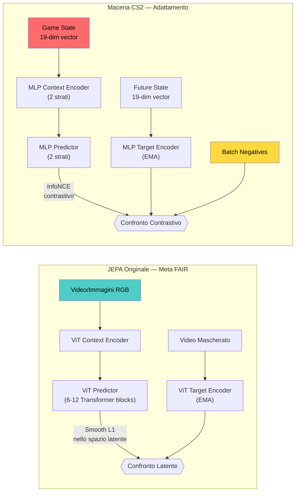
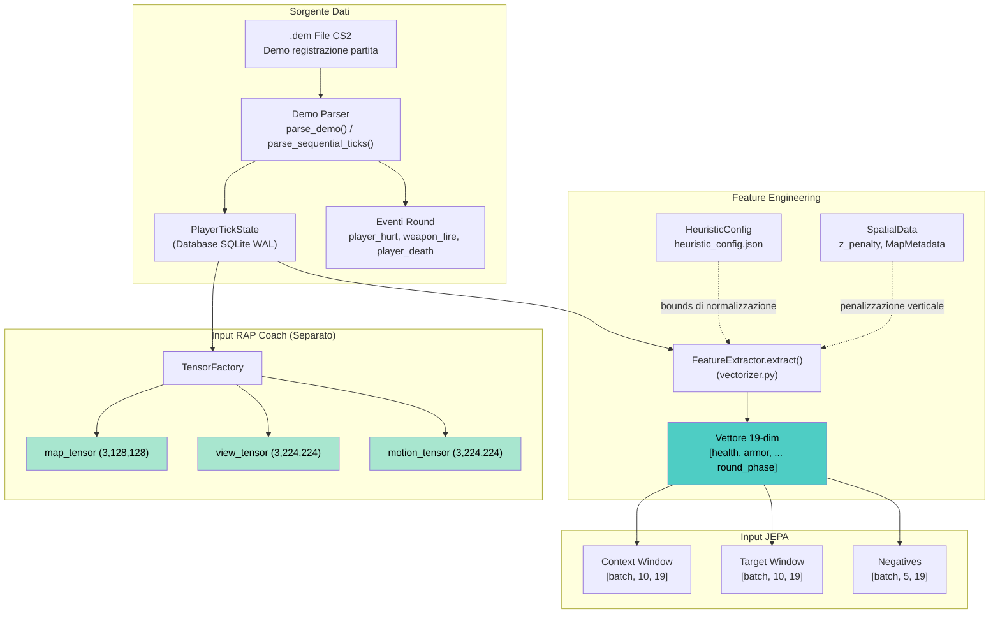
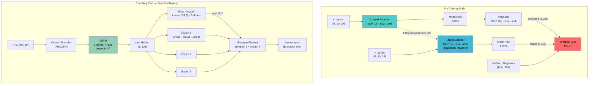
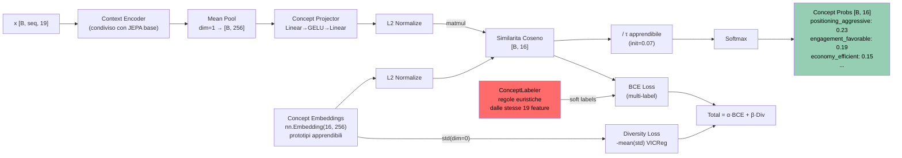
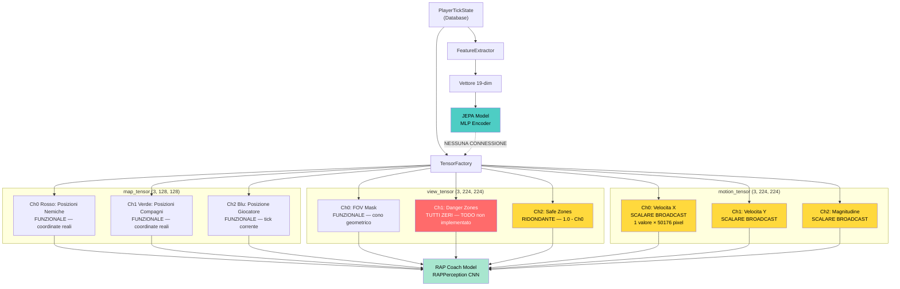
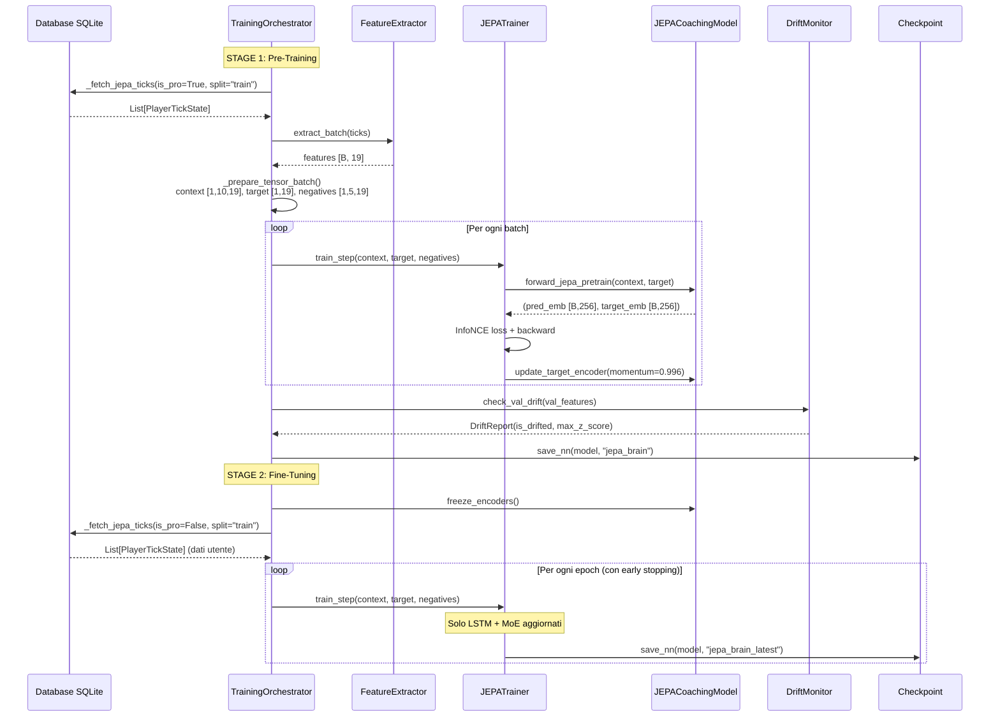
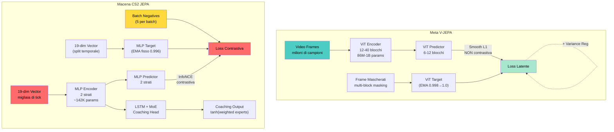
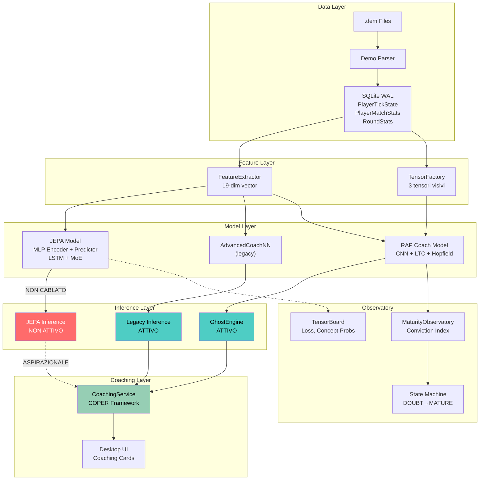

# JEPA nel Macena CS2 Analyzer — Anatomia Completa

> **Documento di Analisi Architetturale**
> Versione: 1.0 | Data: 2026-02-21
> Autore: Claude Code (Analisi Automatizzata del Codebase)
> File sorgente principali: `jepa_model.py`, `jepa_trainer.py`, `jepa_train.py`, `tensor_factory.py`, `vectorizer.py`, `training_orchestrator.py`

---

## Indice

1. [Introduzione e Contesto Scientifico](#1-introduzione-e-contesto-scientifico)
2. [Dalla Visione alle Statistiche di Gioco — La Trasformazione Fondamentale](#2-dalla-visione-alle-statistiche-di-gioco--la-trasformazione-fondamentale)
3. [Architettura del Modello JEPA — Anatomia Completa](#3-architettura-del-modello-jepa--anatomia-completa)
4. [VL-JEPA — Allineamento Concettuale del Coaching](#4-vl-jepa--allineamento-concettuale-del-coaching)
5. [TensorFactory — La Ricostruzione Visiva dal Game State](#5-tensorfactory--la-ricostruzione-visiva-dal-game-state)
6. [Pipeline di Training — Dal Database al Gradiente](#6-pipeline-di-training--dal-database-al-gradiente)
7. [Sistema di Inferenza e Selective Decoding](#7-sistema-di-inferenza-e-selective-decoding)
8. [Coach Introspection Observatory](#8-coach-introspection-observatory)
9. [Confronto Architetturale — Macena vs JEPA Originale](#9-confronto-architetturale--macena-vs-jepa-originale)
10. [Valutazione Critica — Cosa Funziona, Cosa No, Cosa è Aspirazionale](#10-valutazione-critica--cosa-funziona-cosa-no-cosa-è-aspirazionale)

---

## 1. Introduzione e Contesto Scientifico

### 1.1 La Visione di Yann LeCun

Nel giugno 2022, Yann LeCun pubblica *"A Path Towards Autonomous Machine Intelligence"*, un position paper che delinea un'architettura cognitiva per sistemi intelligenti autonomi. Al centro di questa architettura si trova la **JEPA — Joint-Embedding Predictive Architecture**, un paradigma di apprendimento auto-supervisionato radicalmente diverso dai modelli generativi (come GPT o diffusion models).

Il principio fondamentale della JEPA è concettualmente semplice ma profondamente significativo: **prevedere nello spazio latente, non nello spazio delle osservazioni**. Mentre un modello generativo cerca di ricostruire pixel per pixel un'immagine mascherata (come fa MAE — Masked Autoencoder), la JEPA proietta sia l'input che il target in uno spazio latente compresso e cerca di prevedere la *rappresentazione* del target, non la sua forma grezza. Questo evita il problema della "ricostruzione pixel-perfetta" che forza i modelli generativi a dedicare capacità computazionale a dettagli irrilevanti (texture, illuminazione, artefatti) anziché concentrarsi sulla struttura semantica dell'input.

Meta FAIR ha implementato questo principio in due sistemi concreti: **I-JEPA** (Image JEPA, presentato a CVPR 2023) per immagini statiche, e **V-JEPA** (Video JEPA, 2024) per sequenze video. Entrambi utilizzano Vision Transformer (ViT) come backbone encoder, mascheramento spaziale-temporale a blocchi multipli, loss Smooth L1 nello spazio latente (senza coppie negative), e un target encoder aggiornato tramite Exponential Moving Average (EMA) per stabilizzare l'apprendimento ed evitare il collasso.

### 1.2 Perché JEPA per Counter-Strike 2?

Il Macena CS2 Analyzer adotta la JEPA con una motivazione specifica: uno stato di gioco CS2 è, in essenza, un "video parzialmente osservabile". Il giocatore vede solo ciò che il suo FOV (Field of View) gli permette; il resto della mappa — posizioni nemiche, movimenti dei compagni, informazioni economiche — è occultato. Il compito del coach AI è predire ciò che il giocatore *non vede* (posizioni nemiche probabili, rotazioni avversarie, vulnerabilità tattiche) a partire da ciò che *può osservare* (la propria posizione, salute, equipaggiamento, nemici nel campo visivo).

Questa è esattamente l'intuizione JEPA: data una rappresentazione parziale (context), prevedere la rappresentazione completa (target) in uno spazio latente dove l'informazione irrilevante è stata scartata.

### 1.3 Cosa Copre Questo Documento

Questo documento è un'analisi tecnica esaustiva e onesta dell'implementazione JEPA nel progetto Macena. Copre l'architettura completa, il flusso dati dal file `.dem` al gradiente, l'estensione VL-JEPA per l'allineamento concettuale, il sistema di tensori visivi, e un confronto rigoroso con la JEPA originale di Meta. Dove l'implementazione diverge dall'originale o contiene limitazioni note, queste vengono documentate senza ambiguità.



---

## 2. Dalla Visione alle Statistiche di Gioco — La Trasformazione Fondamentale

### 2.1 La Domanda Centrale

La domanda più importante di questo documento è: **come si trasforma un'architettura progettata per comprendere immagini e video in un sistema che comprende statistiche di gioco?**

La risposta è tanto diretta quanto significativa: **la JEPA nel Macena non processa visione**. Non riceve immagini, non utilizza Vision Transformer, non esegue mascheramento spaziale. Opera interamente su un vettore numerico di 19 dimensioni estratto dallo stato discreto del gioco. Ciò che viene preservato dalla JEPA originale è il *principio architetturale* — prevedere rappresentazioni future nello spazio latente — non l'implementazione specifica per il dominio visivo.

### 2.2 Il FeatureExtractor: Il Ponte tra Gioco e Modello

Il componente che traduce lo stato di gioco in input per la JEPA è il `FeatureExtractor`, definito in `backend/processing/feature_engineering/vectorizer.py`. Questo è il **Single Source of Truth** del progetto: lo stesso estrattore viene usato sia per il training che per l'inferenza, garantendo coerenza end-to-end.

Il vettore prodotto ha esattamente 19 dimensioni (`METADATA_DIM = 19`), ciascuna normalizzata in un intervallo compatibile con reti neurali:

| Indice | Feature | Normalizzazione | Significato Tattico |
|--------|---------|-----------------|---------------------|
| 0 | `health` | /100.0 | Sopravvivenza, capacità di combattimento |
| 1 | `armor` | /100.0 | Resistenza al danno, efficacia dell'equipaggiamento |
| 2 | `has_helmet` | binary (0/1) | Protezione headshot (critico per round eco) |
| 3 | `has_defuser` | binary (0/1) | Capacità di disinnescare bomba (solo CT) |
| 4 | `equipment_value` | /10000.0 | Investimento economico, tipo di round |
| 5 | `is_crouching` | binary (0/1) | Postura difensiva, riduzione spread |
| 6 | `is_scoped` | binary (0/1) | Zoom AWP/Scout, stile di gioco |
| 7 | `is_blinded` | binary (0/1) | Accecamento da flashbang |
| 8 | `enemies_visible` | /5.0 (clamped) | Consapevolezza tattica, esposizione |
| 9 | `pos_x` | /4096.0 | Posizione mondiale asse X |
| 10 | `pos_y` | /4096.0 | Posizione mondiale asse Y |
| 11 | `pos_z` | /1024.0 | Posizione verticale (livelli Nuke/Vertigo) |
| 12 | `view_yaw_sin` | sin(yaw_rad) | Direzione di vista — codifica ciclica seno |
| 13 | `view_yaw_cos` | cos(yaw_rad) | Direzione di vista — codifica ciclica coseno |
| 14 | `view_pitch` | /90.0 | Inclinazione verticale della vista |
| 15 | `z_penalty` | 0.0–1.0 | Penalizzazione per mappe multi-livello |
| 16 | `kast_estimate` | 0.0–1.0 | Stima Kill/Assist/Survive/Trade |
| 17 | `map_id` | hash(name) % 10000 / 10000 | Identificatore mappa normalizzato |
| 18 | `round_phase` | 0.0=pistol, 0.33=eco, 0.66=force, 1.0=full | Fase economica del round |

La codifica ciclica (seno/coseno) per lo yaw ai feature 12-13 è un dettaglio ingegneristico significativo: evita la discontinuità a 0°/360° che affliggerebbe una normalizzazione lineare diretta. Analogamente, la `z_penalty` (feature 15) è calcolata da `compute_z_penalty()` in `core/spatial_data.py` e si attiva solo per mappe a livelli multipli (Nuke con Z-cutoff=-495, Vertigo con Z-cutoff=11700), fornendo al modello un segnale di contesto spaziale verticale.

### 2.3 Cosa Si Perde e Cosa Si Preserva

Il passaggio da Vision Transformer su video a MLP su vettore 19-dim comporta perdite e guadagni specifici:

**Cosa si perde:**
- **Relazioni spaziali**: un ViT cattura correlazioni tra patch spaziali tramite self-attention. Un MLP su 19 feature tratta ogni feature come indipendente — non esiste un meccanismo per apprendere che "posizione X + nemico visibile in direzione Y implica rischio di tipo Z".
- **Multi-scale features**: i ViT producono feature a scale diverse (attenzione locale e globale). Il MLP ha una sola "scala" di percezione.
- **Mascheramento spaziale**: la JEPA originale maschera regioni dell'input per forzare il modello a predirle — questo è il cuore dell'apprendimento auto-supervisionato. Il Macena non implementa alcun mascheramento; separa semplicemente context e target temporalmente.

**Cosa si preserva:**
- **Predizione temporale in spazio latente**: il principio cardine della JEPA (prevedere rappresentazioni future, non osservazioni grezze) è implementato fedelmente.
- **Target encoder EMA**: il meccanismo di aggiornamento Exponential Moving Average (momentum=0.996) è identico all'originale.
- **Separazione pre-training/fine-tuning**: il protocollo a due stadi (pre-train auto-supervisionato → freeze encoder → fine-tune supervisionato) rispecchia l'uso standard della JEPA.



---

## 3. Architettura del Modello JEPA — Anatomia Completa

### 3.1 JEPAEncoder (`jepa_model.py:22-55`)

L'encoder è il componente che proietta l'input dallo spazio delle feature (19-dim) allo spazio latente (256-dim). La sua architettura è un MLP a due strati con normalizzazione e regolarizzazione:

```
Input [batch, seq_len, 19]
    → Linear(19 → 512)
    → LayerNorm(512)
    → GELU
    → Dropout(0.1)
    → Linear(512 → 256)
    → LayerNorm(256)
Output [batch, seq_len, 256]
```

**Analisi dei parametri**: il primo strato `Linear(19, 512)` ha 19×512 + 512 = 10.240 parametri. Il secondo `Linear(512, 256)` ne ha 512×256 + 256 = 131.328. Con LayerNorm (512 + 256 parametri ciascuno per gamma/beta), il totale dell'encoder è circa **142.592 parametri** — ordini di grandezza inferiore a un ViT-Base (86 milioni).

La scelta architetturale è deliberata: con soli 19 feature in input, un ViT sarebbe enormemente sovra-parametrizzato. La bottleneck expansion (19 → 512 → 256) permette una proiezione non-lineare con sufficiente capacità rappresentativa per il dominio tattico.

Il docstring dichiara "Vision Transformer-style encoder" — questo è **aspirazionale**, non fattuale. L'architettura è un MLP standard. Il termine "ViT-style" si riferisce probabilmente alla funzione concettuale (codificare input in rappresentazioni latenti) piuttosto che all'architettura specifica.

Nel modello esistono **due istanze** di `JEPAEncoder`:
- `context_encoder`: riceve l'input context, i suoi pesi vengono aggiornati direttamente dal gradiente.
- `target_encoder`: riceve l'input target, i suoi pesi vengono aggiornati solo tramite EMA dal context encoder. Non riceve mai gradiente diretto.

### 3.2 JEPAPredictor (`jepa_model.py:57-86`)

Il predictor è il cuore dell'architettura JEPA: dato l'embedding del context, predice l'embedding del target **nello spazio latente**:

```
Input [batch, 256]
    → Linear(256 → 512)
    → LayerNorm(512)
    → GELU
    → Dropout(0.1)
    → Linear(512 → 256)
Output [batch, 256]
```

Il pattern è una **bottleneck expansion** (256 → 512 → 256): espande la rappresentazione per aumentare la capacità di trasformazione non-lineare, poi la ri-comprime alla dimensionalità target. Nella JEPA originale di Meta, il predictor è un Transformer a 6-12 blocchi con capacità molto superiore di modellare dipendenze complesse. L'MLP a 2 strati del Macena è sufficiente per le 19 feature del dominio CS2, ma potrebbe diventare un collo di bottiglia se l'input fosse più ricco.

### 3.3 JEPACoachingModel — Il Modello Composito (`jepa_model.py:88-349`)

Il `JEPACoachingModel` è un modello ibrido che combina il pre-training auto-supervisionato JEPA con un coaching head supervisionato. I suoi componenti sono:

**Layer JEPA (Pre-training):**
- 2x `JEPAEncoder` (context + target, parametri condivisi via EMA)
- 1x `JEPAPredictor`

**Layer Coaching (Fine-tuning):**
- `LSTM`: 2 strati, 128 unità hidden, dropout 0.2, batch_first=True
- `experts`: ModuleList di 3 reti esperte, ciascuna `Linear(128,128) → ReLU → Linear(128, output_dim)`
- `gate`: `Linear(128, 3) → Softmax` — produce pesi di gating per il Mixture of Experts

**Attivazione finale**: `tanh(output)` — vincola l'output in [-1, 1].

Il modello espone **quattro percorsi forward** distinti:

1. **`forward_jepa_pretrain(x_context, x_target)`** — Pre-training auto-supervisionato:
   - Codifica context e target con i rispettivi encoder
   - Average pool su dimensione sequenza: `s_context.mean(dim=1)` → [batch, 256]
   - Predice l'embedding target dal context pooled
   - Restituisce `(predicted_embedding, target_embedding)` per il calcolo della loss

2. **`forward_coaching(x, role_id=None)`** — Inferenza coaching post pre-training:
   - Codifica l'input con il context encoder (frozen se `is_pretrained=True`)
   - Passa gli embedding attraverso l'LSTM (2 strati)
   - Estrae l'ultimo hidden state
   - Calcola i pesi di gating tramite il gate network
   - Applica role bias se specificato: `(gate_weights + one_hot_role) / 2.0`
   - Calcola l'output di ciascun esperto
   - Combina con media pesata: `sum(expert_outputs * gate_weights)`
   - Applica `tanh`

3. **`forward_selective(x, prev_embedding, threshold=0.05)`** — Selective Decoding (dettagliato in Sezione 7)

4. **`forward(x, role_id=None)`** — Delega direttamente a `forward_coaching`

### 3.4 EMA Target Encoder Update (`jepa_model.py:337-348`)

L'aggiornamento EMA è il meccanismo che mantiene il target encoder come una versione "lentamente aggiornata" del context encoder:

```python
param_k.data = param_k.data * momentum + param_q.data * (1. - momentum)
```

Con `momentum=0.996`, il target encoder mantiene il 99.6% dei propri pesi e adotta solo lo 0.4% dei nuovi pesi dal context encoder ad ogni step. Questo fornisce target stabili e consistenti durante il training, prevenendo il collasso della rappresentazione (dove entrambi gli encoder convergono verso una soluzione triviale come output costante).

Nella JEPA originale di Meta, il momentum segue uno schedule crescente (0.998 → 1.0 durante il training), permettendo aggiornamenti più aggressivi all'inizio e quasi nessuno alla fine. Nel Macena, il momentum è fisso a 0.996.

### 3.5 InfoNCE Contrastive Loss (`jepa_model.py:351-390`)

La funzione di loss è una divergenza significativa dall'originale. Mentre la JEPA di Meta utilizza Smooth L1 nello spazio latente (una loss **non-contrastiva**), il Macena impiega **InfoNCE** (Noise-Contrastive Estimation), una loss **contrastiva** che richiede campioni negativi:

**Formulazione matematica:**

$$\mathcal{L} = -\log \frac{\exp(\text{sim}(\mathbf{z}_{\text{pred}}, \mathbf{z}_{\text{target}}) / \tau)}{\exp(\text{sim}(\mathbf{z}_{\text{pred}}, \mathbf{z}_{\text{target}}) / \tau) + \sum_{j=1}^{N} \exp(\text{sim}(\mathbf{z}_{\text{pred}}, \mathbf{z}_{j}^{-}) / \tau)}$$

dove $\text{sim}$ è la similarità coseno, $\tau=0.07$ è la temperatura, e $\mathbf{z}_j^{-}$ sono i campioni negativi.

**Implementazione:**
1. Normalizzazione L2 di pred, target, e negatives
2. Similarità positiva: `(pred * target).sum(dim=-1) / temperature`
3. Similarità negative: `bmm(negatives, pred.unsqueeze(-1)).squeeze(-1) / temperature`
4. Concatenazione di logits positivi e negativi
5. Cross-entropy con label=0 (il positivo è sempre in posizione 0)

**Implicazione della scelta contrastiva**: la JEPA originale evita deliberatamente le coppie negative perché la loss L1/L2 nello spazio latente, combinata con EMA e regolarizzazione della varianza, è sufficiente per prevenire il collasso. L'uso di InfoNCE nel Macena introduce un requisito aggiuntivo (generazione di negatives) e cambia la dinamica dell'apprendimento: il modello deve non solo avvicinarsi al target positivo, ma anche allontanarsi esplicitamente dai negativi.



---

## 4. VL-JEPA — Allineamento Concettuale del Coaching

### 4.1 L'Estensione Vision-Language

Il `VLJEPACoachingModel` (`jepa_model.py:617-757`) estende il `JEPACoachingModel` con un **concept alignment head** che mappa gli embedding latenti a concetti di coaching interpretabili. Il termine "VL-JEPA" (Vision-Language) è ispirato all'omonimo lavoro di Meta FAIR che allinea rappresentazioni visive e linguistiche — nel Macena, "Language" si riferisce ai concetti tattici del coaching, non a testo naturale.

**Componenti aggiuntivi:**
- `concept_embeddings`: `nn.Embedding(16, 256)` — 16 prototipi di concetto, ciascuno un vettore 256-dim apprendibile
- `concept_projector`: `Linear(256,256) → GELU → Linear(256,256)` — proietta l'output dell'encoder in uno spazio allineato ai concetti
- `concept_temperature`: `nn.Parameter(tensor(0.07))` — temperatura apprendibile per scalare le similarità

### 4.2 I 16 Concetti di Coaching

L'architettura definisce 16 concetti di coaching organizzati in 5 dimensioni tattiche:

**Posizionamento (indici 0-2):**
- `positioning_aggressive` — Il giocatore prende duelli ravvicinati e pusha gli angoli
- `positioning_passive` — Il giocatore tiene angoli lunghi ed evita il contatto
- `positioning_exposed` — Il giocatore è in una posizione vulnerabile ad alta probabilità di morte

**Utility (indici 3-4):**
- `utility_effective` — L'uso delle utility crea vantaggi significativi di informazione o area denial
- `utility_wasteful` — Le utility sono inutilizzate alla morte o deployate con basso impatto

**Decisione (indici 5-6, 11-12):**
- `economy_efficient` — Il valore dell'equipaggiamento è allineato alle aspettative del tipo di round
- `economy_wasteful` — Force-buy in round sfavorevoli o morte con equipaggiamento costoso
- `rotation_fast` — Rotazione posizionale rapida dopo aver ricevuto informazioni
- `information_gathered` — Buona raccolta di intel, molteplici nemici avvistati

**Engagement (indici 7-10):**
- `engagement_favorable` — Duelli presi con vantaggio di HP, posizione o numeri
- `engagement_unfavorable` — Duelli presi in inferiorità numerica, con poca vita o mal posizionati
- `trade_responsive` — Trading rapido delle morti dei compagni, buona coordinazione
- `trade_isolated` — Morte senza trade, gioco troppo isolato dai compagni

**Psicologia (indici 13-15):**
- `momentum_leveraged` — Capitalizzazione degli hot streak con giocate aggressive
- `clutch_composed` — Decision-making calmo in situazioni clutch 1vN
- `aggression_calibrated` — Il livello di aggressività è appropriato alla situazione

### 4.3 Il Forward Path VL-JEPA (`forward_vl`)

Il percorso forward della VL-JEPA aggiunge il calcolo dei concetti al percorso coaching standard:

1. **Encoding**: l'input viene codificato dal context encoder (frozen o no)
2. **Pooling**: average pool sulla dimensione sequenza → [batch, 256]
3. **Proiezione**: il `concept_projector` trasforma l'embedding in uno spazio allineato ai concetti
4. **Normalizzazione**: L2 normalize sia l'embedding proiettato che i prototipi dei concetti
5. **Similarità coseno**: `torch.mm(projected, concept_embs_norm.t())` → [batch, 16]
6. **Scaling**: divisione per la temperatura apprendibile (clamped a min=0.01)
7. **Softmax**: produce probabilità di concetto [batch, 16] che sommano a 1
8. **Coaching output**: passa in parallelo attraverso il percorso coaching standard
9. **Decodifica top-k**: estrae i top 3 concetti con le probabilità più alte

Il metodo `get_concept_activations(x)` offre un percorso leggero che esegue solo i passi 1-7, senza attivare LSTM e MoE, per un'analisi rapida dei concetti.

### 4.4 Il Problema del Label Leakage nel ConceptLabeler [ ] NOT FIXED

Il `ConceptLabeler` (`jepa_model.py:459-614`) genera etichette soft per i 16 concetti utilizzando **regole euristiche applicate alle stesse 19 feature** che il modello codifica. Questo è un problema di **label leakage** esplicitamente documentato nel codice:

```python
# WARNING (jepa_trainer.py:191-200):
# ConceptLabeler derives labels from the SAME input features the model encodes.
# Model can learn shallow heuristic patterns instead of genuine semantic concepts.
# TODO: Replace with external ground truth or self-supervised discovery.
```

**Stato:** Il problema persiste nel codice (verificato il 2026-02-21). La classe `ConceptLabeler` contiene ancora regole hardcoded come `if crouching <= 0.5 and scoped <= 0.5...`. Non è stata implementata alcuna fonte di ground truth esterna.

**Esempio concreto di euristica**: per il concetto `positioning_aggressive` (indice 0), la regola è:
```python
if not crouching > 0.5 and not scoped > 0.5 and enemies_vis > 0.4:
    labels[0] = min(0.5 + enemies_vis, 1.0)
```

Il modello riceve come input le feature `is_crouching`, `is_scoped`, e `enemies_visible`, e deve predire un'etichetta che è direttamente derivata da quelle stesse feature. Il risultato è che il concept alignment head può imparare una **copia perfetta delle regole euristiche** senza sviluppare alcuna comprensione semantica genuina.

### 4.5 Concept Alignment Loss

La loss per la VL-JEPA combina tre componenti:

1. **Concept Loss** — Binary Cross-Entropy multi-label: ogni concetto è indipendente, il modello deve predire l'attivazione di ciascuno
2. **Diversity Loss** — Ispirata a VICReg: penalizza la bassa varianza degli embedding dei concetti lungo le dimensioni del latent space. Previene il collasso dove tutti i 16 prototipi convergono allo stesso vettore
3. **Total**: `total = α × concept_loss + β × diversity_loss` (α=0.5, β=0.1 di default)

La loss totale del training VL-JEPA è: `infonce_loss + concept_total`



---

## 5. TensorFactory — La Ricostruzione Visiva dal Game State

### 5.1 La Domanda sulla Visione 3D

L'utente chiede: *"È possibile che il sistema ricostruisca lo scenario, anche a bassa fedeltà, e che la JEPA possa apprendere da una prospettiva 3D ricostruita?"*

La risposta richiede una distinzione critica: il `TensorFactory` (`backend/processing/tensor_factory.py`) **costruisce effettivamente** rappresentazioni visive pseudo-3D dallo stato di gioco, ma queste rappresentazioni alimentano il **RAP Coach Model**, non la JEPA. La JEPA e il TensorFactory sono sistemi paralleli che condividono la stessa sorgente dati (PlayerTickState) ma non si intersecano mai.

### 5.2 I Tre Tipi di Tensore

Il TensorFactory produce tre tensori per ciascun tick di gioco:

**map_tensor (3, 128, 128) — Mappa Tattica Top-Down:**
- **Canale 0 (Rosso)**: Densità posizioni nemiche — le coordinate mondiali dei nemici vengono proiettate su una griglia 128×128 usando `_world_to_grid()` con i metadati della mappa (scala, offset). Un filtro gaussiano (σ=3.0) sfuma le posizioni in heatmap. Questo canale è **funzionale e reale**: utilizza le coordinate effettive dal database.
- **Canale 1 (Verde)**: Densità posizioni compagni di squadra — stesso meccanismo, differenziazione basata sulla variabile `team`.
- **Canale 2 (Blu)**: Posizione del giocatore + obiettivi — il tick corrente (ultimo della sequenza) viene marcato con intensità 1.0.

**view_tensor (3, 224, 224) — Approssimazione della Visione in Prima Persona:**
- **Canale 0 (FOV)**: Maschera del campo visivo. Un cono viene generato a partire dalla posizione del giocatore, nella direzione dello yaw, con ampiezza configurabile (default 90°) e distanza massima (default 2000 unità). L'implementazione usa `np.arctan2` per calcolare l'angolo tra il giocatore e ogni pixel della griglia, applicando poi la condizione `angle_diff ≤ half_fov AND distance ≤ view_dist`. Questo canale è **geometricamente corretto**.
- **Canale 1 (Danger Zones)**: **PLACEHOLDER — TUTTI ZERI**. Il codice contiene un TODO esplicito (`tensor_factory.py:173-177`): dovrebbe essere popolato con le proiezioni delle linee di vista nemiche, ma l'implementazione non è mai stata completata. Questo canale non contribuisce alcun segnale al modello.
- **Canale 2 (Safe Zones)**: `1.0 - FOV - danger = 1.0 - FOV - 0.0 = 1.0 - FOV`. È l'inverso esatto del Canale 0, quindi **ridondante** — non fornisce informazione aggiuntiva finché il Canale 1 resta a zero.

**motion_tensor (3, 224, 224) — Codifica del Movimento:**
- **Canale 0**: Velocità X normalizzata (dx / max_speed, max_speed=250)
- **Canale 1**: Velocità Y normalizzata
- **Canale 2**: Magnitudine del movimento normalizzata

**Problema critico**: i tre valori scalari vengono replicati uniformemente su tutta la griglia 224×224 con `np.full((resolution, resolution), norm_dx)`. Ogni canale è un singolo valore ripetuto 50.176 volte. In termini informativi, il motion_tensor trasporta **3 scalari** usando **150.528 float32** — un rapporto informazione/dimensionalità di ~0.002%.

### 5.3 La Risposta alla Domanda sulla Visione 3D

Per riassumere con chiarezza:

- **La JEPA NON riceve i tensori visivi**. Riceve solo il vettore 19-dim dal FeatureExtractor. Non ha alcuna capacità di elaborare immagini o rappresentazioni spaziali 2D/3D.

- **Il RAP Coach Model riceve i tensori visivi** tramite la sua pipeline `RAPPerception` (CNN con budget di 70 strati convoluzionali). Il RAP Coach è l'unico modello nel sistema con capacità di elaborazione visiva.

- **Il map_tensor è una rappresentazione 2D fedele** delle posizioni reali dei giocatori, proiettata dall'alto. Non è una ricostruzione 3D, ma una "radar view" accurata.

- **Il view_tensor è una ricostruzione parziale del FOV** — geometricamente corretta per ciò che il giocatore *potrebbe* vedere, ma incapace di modellare ciò che è *pericoloso* (Canale 1 a zero).

- **Il motion_tensor è un scalare broadcast** — informazione minima spacchettata in un tensore enorme.

- **Per far sì che la JEPA possa apprendere da visione ricostruita**, sarebbe necessario: (a) sostituire gli encoder MLP con encoder convoluzionali o ViT, (b) concatenare i tensori visivi con le feature numeriche, (c) implementare un mascheramento spaziale coerente. Questa è un'evoluzione architetturale possibile ma attualmente non implementata.



---

## 6. Pipeline di Training — Dal Database al Gradiente

### 6.1 Due Entry Point di Training

Il sistema offre due modalità di esecuzione del training JEPA:

**Entry Point 1 — `jepa_train.py` (Standalone):**
Script autonomo eseguibile via `python -m Programma_CS2_RENAN.backend.nn.jepa_train --mode pretrain|finetune`. Contiene un dataset dedicato (`JEPAPretrainDataset`) e funzioni indipendenti per pre-training e fine-tuning. Il dataset carica le sequenze di demo professionali dal database, le organizza in finestre context/target di lunghezza 10, e le serve tramite PyTorch DataLoader.

**Entry Point 2 — `training_orchestrator.py` (Integrato):**
L'orchestratore unificato è invocato dal Session Engine (Teacher Daemon) durante il ciclo di vita dell'applicazione. Gestisce il loop di training completo con early stopping, checkpointing, validation, e scheduling.

### 6.2 Preparazione dei Dati (`_prepare_tensor_batch`)

La funzione `_prepare_tensor_batch()` in `training_orchestrator.py:217-261` è il punto dove i dati grezzi del database vengono convertiti in tensori per la JEPA. Il flusso è:

1. **Estrazione feature**: `FeatureExtractor.extract_batch(raw_items)` → `[B, 19]`
2. **Context window**: i primi 10 item della batch, con padding zero se insufficienti → `[1, 10, 19]`
3. **Target**: l'ultimo item della batch (mean pooled) → `[1, 19]`
4. **Negatives**: 5 campioni casuali dalla batch → `[1, 5, 19]`
5. **Gate minimo**: se la batch ha meno di 5 item, viene scartata (impossibile generare negatives contrastivi sufficienti)

**Nota critica sulla qualità dei dati**: in `jepa_train.py:110-112`, le sequenze di demo professionali vengono caricate come vettori di 12 feature match-level (non 19 tick-level) e replicati 20 volte con `np.tile(features, (20, 1))` per creare "pseudo-sequenze". Questo produce dati temporali **artificialmente costanti** — tutti i 20 "round" di una sequenza sono identici. Questa è una limitazione significativa per un modello che dovrebbe apprendere dinamiche temporali.

### 6.3 Il JEPATrainer (`jepa_trainer.py`)

Il trainer gestisce il ciclo di apprendimento con i seguenti componenti:

**Optimizer**: AdamW con weight_decay=1e-4, lr=1e-4
**Scheduler**: CosineAnnealingLR con T_max=100
**Drift Monitor**: Z-score based con threshold=2.5, finestra di 5 report

Il `train_step()` esegue in sequenza:
1. Forward pass JEPA pre-training
2. Calcolo InfoNCE loss
3. Backward pass
4. Optimizer step
5. Scheduler step
6. EMA update del target encoder

Il metodo `check_val_drift()` monitora la distribuzione delle feature del set di validazione rispetto a statistiche di riferimento. Se il DriftMonitor rileva un Z-score superiore alla soglia in 3 dei 5 report più recenti, viene attivato il flag `_needs_full_retrain`, che innesca un retraining completo alla prossima invocazione di `retrain_if_needed()`.

### 6.4 Protocollo Two-Stage

Il training segue un protocollo a due stadi rigoroso:

**Stage 1 — Pre-Training Auto-Supervisionato (su demo professionali):**
- I dati provengono da `PlayerMatchStats` con `is_pro=True`
- L'optimizer aggiorna solo i componenti JEPA: context_encoder, target_encoder, predictor
- La loss è InfoNCE contrastiva
- Il target encoder riceve aggiornamenti solo via EMA, mai via gradiente diretto
- Durata: configurabile (default 50 epoch nello script standalone)

**Stage 2 — Fine-Tuning Supervisionato (su dati utente):**
- `model.freeze_encoders()` blocca i pesi degli encoder
- L'optimizer aggiorna solo LSTM, experts, e gate
- La loss è MSELoss tra predizioni coaching e label target
- Learning rate più alto (1e-3 vs 1e-4 del pre-training)
- Durata: configurabile (default 30 epoch)



---

## 7. Sistema di Inferenza e Selective Decoding

### 7.1 Selective Decoding — L'Ottimizzazione VL-JEPA (`forward_selective`)

Il metodo `forward_selective()` (`jepa_model.py:231-304`) implementa un'ottimizzazione ispirata al paper VL-JEPA di Meta: **la decodifica avviene solo quando lo stato cambia significativamente**.

Il meccanismo funziona come segue:

1. **Encoding leggero**: l'input viene codificato dal context encoder (operazione rapida, ~142K parametri)
2. **Confronto con lo stato precedente**: se è disponibile un embedding precedente (`prev_embedding`), viene calcolata la distanza coseno tra l'embedding corrente e quello precedente:
   ```python
   similarity = F.cosine_similarity(curr_pooled, prev_pooled, dim=-1)
   distance = 1.0 - similarity  # Distanza: 0.0 = identico, 2.0 = opposto
   ```
3. **Decisione**: se `distance.mean() < threshold` (default 0.05), la decodifica pesante (LSTM + MoE) viene **saltata** e il metodo restituisce `(None, current_embedding, False)`
4. **Decodifica completa**: se la distanza supera la soglia, viene eseguito il percorso completo coaching (LSTM → MoE → tanh) e restituito `(prediction, current_embedding, True)`

**Implicazione pratica**: in scenari di gioco dove lo stato cambia lentamente (giocatore che tiene un angolo, attesa del round), il Selective Decoding evita il 70-90% delle computazioni costose. Per stati rapidamente variabili (ingaggio attivo, rotazione, clutch), ogni tick viene decodificato.

**Nota critica**: con un modello così leggero (MLP + LSTM da ~300K parametri totali), il guadagno computazionale del Selective Decoding è trascurabile in termini assoluti. In un ViT con centinaia di milioni di parametri, la differenza sarebbe sostanziale. Qui, l'implementazione è corretta ma il beneficio pratico è minimo.

### 7.2 Gap di Integrazione nell'Inferenza

Attualmente esiste una disconnessione tra la JEPA e il sistema di coaching:

- **GhostEngine** (`backend/nn/inference/ghost_engine.py`): è il motore di inferenza principale dell'applicazione, ma carica e utilizza il **RAP Coach Model**, non la JEPA.
- **CoachingService** (`backend/services/coaching_service.py`): genera insight di coaching tramite il framework COPER (Experience Bank + RAG + Pro References), ma non invoca direttamente il modello JEPA.
- **HybridEngine** (`backend/coaching/hybrid_engine.py`): supporta lo switch tra JEPA e AdvancedCoachNN tramite la config `USE_JEPA_MODEL`, ma il percorso JEPA non è cablato al servizio di coaching end-to-end.

Il modello JEPA è descritto nel suo docstring come *"an ADDITIVE feature that coexists with the existing AdvancedCoachNN"* — confermando il suo stato di componente parallelo, non sostitutivo.

Per completare l'integrazione, sarebbe necessario:
1. Creare un `JEPAGhostEngine` dedicato (o estendere GhostEngine con un branch JEPA)
2. Cablare l'output della JEPA al CoachingService come sorgente di insight aggiuntiva
3. Definire come le predizioni JEPA (output dim = output_dim, tipicamente 19) vengono tradotte in consigli tattici interpretabili

---

## 8. Coach Introspection Observatory

### 8.1 Il Sistema di Monitoraggio a 4 Livelli

Il progetto implementa un sistema di osservabilità del training articolato su quattro livelli:

**Livello 1 — TrainingCallback ABC** (`backend/nn/training_callbacks.py`):
Un'architettura a plugin con `TrainingCallback` come classe base astratta e `CallbackRegistry` come gestore. I metodi hook disponibili sono: `on_train_start`, `on_epoch_start`, `on_batch_end`, `on_epoch_end`, `on_train_end`. Ogni callback è isolato: un errore in un callback viene catturato e loggato senza interrompere il training.

**Livello 2 — TensorBoardCallback** (`backend/nn/tensorboard_callback.py`):
Registra segnali sul TensorBoard di PyTorch:
- **Scalari**: loss InfoNCE, concept loss, diversity loss, learning rate, validation loss
- **Istogrammi**: distribuzione dei parametri, gradienti, norme degli embedding dei concetti
- **Layout personalizzato**: pannelli organizzati per categoria (Loss, Gate Stats, Concept Alignment)

**Livello 3 — MaturityObservatory** (`backend/nn/maturity_observatory.py`):
Calcola 5 segnali di maturità del modello:
- `belief_entropy`: entropia di Shannon del vettore di belief a 64 dimensioni (dal RAP Coach)
- `gate_specialization`: 1 - media delle attivazioni del gate (quanto gli esperti si stanno differenziando)
- `concept_focus`: 1 - entropia delle probabilità dei concetti (dal VL-JEPA)
- `value_accuracy`: 1 - (val_loss / initial_val_loss) (miglioramento della funzione valore)
- `role_stability`: 1 - std(conviction negli epoch recenti) (consistenza della conviction)

Questi 5 segnali vengono combinati in un **conviction_index** pesato:
```
conviction = 0.25×(1-belief_entropy) + 0.25×gate_spec + 0.20×concept_focus
           + 0.20×value_accuracy + 0.10×role_stability
```

Il conviction_index alimenta una **macchina a stati**:
- **DOUBT**: conviction < 0.3, in diminuzione
- **CRISIS**: calo > 20% dal massimo rolling in 5 epoch
- **LEARNING**: conviction 0.3-0.6, in aumento
- **CONVICTION**: conviction > 0.6, stabile (std < 0.05 su 10 epoch)
- **MATURE**: conviction > 0.75, 20+ epoch stabili, value_acc > 0.7, gate_spec > 0.5

**Livello 4 — EmbeddingProjector** (`backend/nn/embedding_projector.py`):
Produce proiezioni 2D/3D degli embedding per visualizzazione:
- **UMAP** (se installato): proiezioni 2D dei vettori di belief e degli embedding dei concetti
- **TensorBoard Embedding Projector**: visualizzazione interattiva 3D con PCA/t-SNE

### 8.2 Integrazione JEPA con l'Observatory

L'Observatory è stato progettato primariamente per il RAP Coach Model (che ha belief vectors, gate stats, e un output valore esplicito). La JEPA ha integrazione parziale:
- Il trainer JEPA può registrare callbacks per la loss
- Il VL-JEPA fornisce `concept_probs` per il calcolo di `concept_focus`
- Il `gate_specialization` è calcolabile anche per la JEPA (che ha il suo gate MoE)
- Manca `belief_entropy` e `value_accuracy` diretti (specifici del RAP Coach)

Il sistema è lanciabile tramite:
```bash
python run_full_training_cycle.py --tb-logdir runs/ --umap-interval 5
tensorboard --logdir runs/
```

---

## 9. Confronto Architetturale — Macena vs JEPA Originale

### 9.1 Tabella Comparativa Sistematica

| Aspetto | V-JEPA Originale (Meta FAIR) | Macena CS2 JEPA | Impatto della Divergenza |
|---------|------|------|------|
| **Input** | Frame video RGB (H×W×3) | Vettore numerico 19-dim | Perdita totale dell'informazione spaziale/visiva |
| **Encoder** | Vision Transformer (12-40 blocchi, 86M-1B params) | MLP a 2 strati (~142K params) | Capacità rappresentativa ridotta di ~600x |
| **Masking** | Multi-block spaziale-temporale (tubelet masking) | Nessuno (split temporale context/target) | Il modello non apprende a "riempire lacune" |
| **Loss** | Smooth L1 nello spazio latente (non-contrastiva) | InfoNCE contrastiva con batch negatives | Diversa dinamica di apprendimento, requisito di negatives |
| **Target Encoder** | EMA con schedule crescente (0.998→1.0) | EMA fisso (momentum=0.996) | Meno adattabilità durante fasi diverse del training |
| **Predictor** | ViT a 6-12 blocchi (narrow) | MLP a 2 strati (256→512→256) | Capacità molto ridotta per pattern complessi |
| **Regolarizzazione varianza** | `F.relu(1 - pstd_z)` esplicita | Nessuna (solo diversity loss per VL-JEPA) | Rischio di collasso senza negatives contrastivi |
| **Downstream** | Linear probing / Attentive Pooler | LSTM + MoE + Role Bias + tanh | Architettura downstream più ricca |
| **Concetti/Language** | VL-JEPA: allineamento video-testo | 16 concetti coaching + ConceptLabeler euristico | Label leakage: stesse feature come input e label |
| **Dati di training** | VideoMix2M (~2M video, miliardi di frame) | Demo CS2 (migliaia di tick per partita) | Dati ~1000x inferiori, rischio overfitting |
| **Batch size** | 3072 (128 GPU) | ~16-32 (1 GPU GTX 1650) | Stabilità del training molto ridotta |
| **GPU richiesta** | Cluster A100/H100 | Singola GTX 1650 (4GB VRAM) | Impone architettura leggera |

### 9.2 Divergenze Filosofiche

La JEPA originale di LeCun è intrinsecamente **non-contrastiva**: evita deliberatamente le coppie negative perché la combinazione di EMA target encoder + regolarizzazione della varianza + loss L1/L2 è sufficiente per prevenire il collasso. Questo è un punto centrale del paper: i modelli contrastivi (come SimCLR, MoCo) funzionano bene ma sono "ineleganti" nel loro requisito di campioni negativi.

Il Macena adotta InfoNCE (contrastiva), probabilmente per una ragione pratica: con un MLP leggero e batch size piccole, il rischio di collasso (tutti gli output convergono allo stesso vettore) è elevato. InfoNCE fornisce un segnale di training più forte e diretto, al costo di richiedere la generazione di negatives.

### 9.3 Cosa Preserva il Principio JEPA

Nonostante le divergenze implementative, il Macena preserva il **principio architetturale fondamentale** della JEPA:

1. **Predizione nello spazio latente**: il predictor opera su embedding 256-dim, non sulle 19 feature grezze
2. **Target encoder EMA**: i target sono prodotti da una versione lentamente aggiornata dell'encoder, non calcolati online
3. **Separazione pre-training/fine-tuning**: la rappresentazione appresa auto-supervisionata viene riutilizzata come base per il task supervisionato
4. **Asimmetria encoder-predictor**: il predictor è intenzionalmente più stretto dell'encoder (previene il collasso)

Questi principi rendono l'architettura legittimamente "JEPA-inspired", anche se l'implementazione è molto distante dall'originale.



---

## 10. Valutazione Critica — Cosa Funziona, Cosa No, Cosa è Aspirazionale

### 10.1 Cosa Funziona (Confermato Funzionale)

**FeatureExtractor — Single Source of Truth:**
Il vettore 19-dim è deterministico, ben normalizzato, configurabile tramite HeuristicConfig, e condiviso coerentemente tra training e inferenza. La codifica ciclica dello yaw e la z_penalty per mappe multi-livello dimostrano attenzione ai dettagli del dominio.

**EMA Target Encoder Update:**
L'implementazione è matematicamente corretta, segue lo standard BYOL/JEPA, ed è invocata correttamente ad ogni step di training. La formula `param_k = momentum × param_k + (1-momentum) × param_q` è identica all'originale.

**InfoNCE Contrastive Loss:**
L'implementazione è corretta: normalizzazione L2 degli embedding, similarità coseno con temperatura, cross-entropy con il positivo come classe 0. I negatives sono generati in-batch (non richiede un memory bank o momentum encoder separato).

**Protocollo Two-Stage:**
La separazione pre-training/fine-tuning è ben strutturata: `freeze_encoders()` congela correttamente i parametri, l'optimizer del fine-tuning include solo LSTM/experts/gate, e le due fasi hanno learning rate distinti (1e-4 vs 1e-3).

**ModelFactory Integration:**
La JEPA è un "cittadino di prima classe" nel sistema dei modelli: `ModelFactory.get_model("jepa")` e `ModelFactory.get_model("vl-jepa")` producono istanze correttamente configurate con METADATA_DIM come input_dim.

**Drift Monitoring:**
Il DriftMonitor basato su Z-score è un meccanismo intelligente per rilevare la degradazione del modello nel tempo. La combinazione con il retrain automatico (dopo 3/5 drift report sopra soglia) è un pattern production-ready.

**Selective Decoding:**
L'implementazione è corretta e concettualmente solida. La decisione basata su distanza coseno è efficiente (O(n) dove n = latent_dim) e il bypass del decoder pesante è logicamente pulito.

**Test Coverage:**
32 test nel file `test_jepa_model.py` coprono tutti i forward path, le dimensioni degli output, la convergenza della loss, il freeze/unfreeze, il save/load dei checkpoint, e la migrazione da JEPA a VL-JEPA. I test sono tutti funzionali (no mocking di componenti interni).

### 10.2 Cosa Non Funziona (Problemi Noti)

**ConceptLabeler Label Leakage:**
Il problema più significativo dell'architettura VL-JEPA. Il modello vede le feature [0-18] come input, e il ConceptLabeler produce etichette basate su quelle stesse feature. Ad esempio, per `positioning_exposed`, la regola è `if hp < 0.4 and enemies_vis > 0.2` — dove `hp` è la feature 0 e `enemies_vis` è la feature 8. Il modello ha accesso diretto a queste feature nel suo input e può imparare a replicare le regole euristiche con un mapping quasi-lineare, senza sviluppare alcuna comprensione semantica. Il problema è riconosciuto nel codice con un warning esplicito e un TODO per la sostituzione con ground truth esterno.

**Danger Zone Channel Placeholder:**
Il Canale 1 del view_tensor è permanentemente a zero. Questo è documentato con un TODO in `tensor_factory.py:173-177`. L'implementazione richiederebbe la proiezione delle posizioni nemiche note nel frame di riferimento del giocatore per calcolare le "sightline" — un problema geometrico risolvibile ma non banale.

**Pseudo-Sequenze in `jepa_train.py`:**
La funzione `load_pro_demo_sequences()` crea sequenze artificiali con `np.tile(features, (20, 1))`, replicando un singolo vettore di feature match-level 20 volte. Queste "sequenze" non hanno variazione temporale — tutti i 20 tick sono identici. Il modello non può apprendere dinamiche temporali da dati costanti. L'orchestratore usa dati tick-level reali (`_fetch_jepa_ticks`), ma lo script standalone ha questo gap.

**Disconnect JEPA → Coaching:**
Non esiste un percorso cablato dal modello JEPA al CoachingService. Il GhostEngine carica il RAP Coach, non la JEPA. L'HybridEngine supporta lo switch ma non è integrato nel servizio. La JEPA produce predizioni ma queste non raggiungono mai l'utente finale.

**Motion Tensor Informazione vs. Dimensionalità:**
Tre valori scalari (dx, dy, magnitude) vengono inflati in un tensore (3, 224, 224) = 150.528 valori. Rapporto informazione/dimensionalità: 0.002%. Questo non è solo inefficiente — è potenzialmente fuorviante per il modello CNN che riceve il tensore, perché non c'è struttura spaziale da apprendere.

### 10.3 Cosa è Aspirazionale (Design Intent vs. Realtà)

**"Vision Transformer-style Encoder":**
Il docstring di JEPAEncoder afferma uno stile ViT, ma l'implementazione è un MLP standard. La descrizione riflette l'intenzione progettuale (funzionare come un encoder di rappresentazioni latenti, analogamente a un ViT) piuttosto che l'architettura effettiva.

**VL-JEPA Concept Grounding:**
L'obiettivo è realizzare un allineamento tipo CLIP tra rappresentazioni tattiche e concetti di coaching. Con il label leakage attuale, il sistema impara a replicare euristiche anziché sviluppare grounding semantico genuino. Il concetto è valido, ma richiede una sorgente di label indipendente (ad esempio: annotazioni manuali di analisti professionisti, o clustering non supervisionato dei latent space).

**Selective Decoding su Modello Leggero:**
L'ottimizzazione Selective Decoding è progettata per modelli con centinaia di milioni di parametri dove il decoder è computazionalmente costoso. Con un LSTM da ~100K parametri e un MoE da ~100K parametri, il risparmio computazionale è dell'ordine dei microsecondi per tick — impercettibile.

**TensorFactory come "Vision Bridge":**
Il docstring della TensorFactory dichiara di "risolvere la crisi del Blind Brain" fornendo "rappresentazioni visive reali". In pratica, il map_tensor è l'unico canale completamente funzionale. Il view_tensor ha 1/3 dei canali a zero. Il motion_tensor è un scalare broadcast. E nessuno di questi tensori raggiunge la JEPA.

### 10.4 Roadmap per Colmare il Gap

Per evoluzione futura, le azioni che porterebbero il maggiore impatto sono, in ordine di priorità:

1. **Eliminare il label leakage**: sostituire il ConceptLabeler con etichette derivate da sorgenti esterne — annotazioni di analisti professionisti, database di strategie community (come quelli di HLTV), o discovery non supervisionata (clustering nello spazio latente del modello stesso)

2. **Implementare il danger channel**: proiettare le posizioni nemiche nel campo visivo del giocatore usando raycast 2D (sufficiente per il contesto radar/top-down del CS2) per popolare il Canale 1 del view_tensor

3. **Creare JEPAGhostEngine**: un motore di inferenza dedicato che carica il modello JEPA, esegue `forward_coaching()` o `forward_selective()`, e traduce l'output in insight interpretabili per il CoachingService

4. **Architettura ibrida vision+features**: alimentare la JEPA sia con il vettore 19-dim che con i tensori visivi del TensorFactory, usando encoder multimodali (CNN per i tensori + MLP per le feature, concatenazione nello spazio latente)

5. **Sostituire le pseudo-sequenze**: in `jepa_train.py`, caricare dati tick-level reali dal database (come fa già l'orchestratore) anziché replicare feature match-level con `np.tile`

6. **Valutare loss non-contrastiva**: considerare il passaggio da InfoNCE a un regime non-contrastivo (VICReg, Barlow Twins, o JEPA-style L1 + variance regularization) per allinearsi più fedelmente alla filosofia JEPA originale



---

## Appendice A — Mappa dei File Sorgente

| File | Linee | Componenti Principali |
|------|-------|----------------------|
| `backend/nn/jepa_model.py` | 846 | JEPAEncoder, JEPAPredictor, JEPACoachingModel, VLJEPACoachingModel, ConceptLabeler, InfoNCE loss, VL-JEPA concept loss, CoachingConcept dataclass |
| `backend/nn/jepa_trainer.py` | 231 | JEPATrainer, train_step, train_step_vl, check_val_drift, retrain_if_needed |
| `backend/nn/jepa_train.py` | 308 | JEPAPretrainDataset, load_pro_demo_sequences, train_jepa_pretrain, train_jepa_finetune, save/load_jepa_model |
| `backend/nn/training_orchestrator.py` | 315 | TrainingOrchestrator, _fetch_batches, _run_epoch, _prepare_tensor_batch |
| `backend/nn/factory.py` | 91 | ModelFactory.get_model() — supporta "jepa", "vl-jepa", "rap", "default", "role_head" |
| `backend/nn/config.py` | 55 | get_device(), BATCH_SIZE, INPUT_DIM, OUTPUT_DIM, LEARNING_RATE, EPOCHS |
| `backend/processing/tensor_factory.py` | 340 | TensorFactory, TensorConfig, generate_map/view/motion_tensor |
| `backend/processing/feature_engineering/vectorizer.py` | ~200 | FeatureExtractor, METADATA_DIM=19, extract(), extract_batch() |
| `backend/processing/cv_framebuffer.py` | 182 | FrameBuffer (ring buffer thread-safe per HUD extraction) |
| `backend/nn/maturity_observatory.py` | ~300 | MaturityObservatory, 5 segnali, conviction_index, state machine |
| `backend/nn/embedding_projector.py` | ~200 | EmbeddingProjector, UMAP 2D, TensorBoard embedding |
| `backend/nn/training_callbacks.py` | ~150 | TrainingCallback ABC, CallbackRegistry |
| `backend/nn/tensorboard_callback.py` | ~250 | TensorBoardCallback, scalari, istogrammi, layout personalizzato |
| `tests/test_jepa_model.py` | ~400 | 32 test: componenti, integrazione, VL-JEPA, concept labeler, checkpoint migration |

## Appendice B — Glossario

| Termine | Significato |
|---------|-------------|
| **JEPA** | Joint-Embedding Predictive Architecture — paradigma di apprendimento auto-supervisionato (LeCun, 2022) |
| **V-JEPA** | Video JEPA — implementazione di Meta FAIR per video understanding (2024) |
| **VL-JEPA** | Vision-Language JEPA — estensione con allineamento multimodale |
| **I-JEPA** | Image JEPA — implementazione per immagini statiche (CVPR 2023) |
| **EMA** | Exponential Moving Average — aggiornamento lento del target encoder |
| **InfoNCE** | Noise-Contrastive Estimation — loss contrastiva con campioni negativi |
| **MoE** | Mixture of Experts — ensemble pesato di reti esperte specializzate |
| **ViT** | Vision Transformer — encoder basato su architettura Transformer per input visivi |
| **VICReg** | Variance-Invariance-Covariance Regularization — tecnica per prevenire collasso degli embedding |
| **FOV** | Field of View — campo visivo del giocatore in gradi |
| **KAST** | Kill/Assist/Survive/Trade — metrica CS2 di partecipazione al round |
| **HLTV 2.0** | Sistema di rating professionale CS2 (approssimato nel progetto) |
| **RAP** | Reasoning, Attention, Planning — modello di coaching con percezione CNN |
| **LTC** | Liquid Time-Constant — rete neurale ricorrente a costante temporale variabile |
| **Hopfield** | Rete di Hopfield — memoria associativa utilizzata nel RAP Coach per temporal binding |
| **WAL** | Write-Ahead Logging — modalità SQLite per accesso concorrente |
| **COPER** | Framework di coaching: Context + Observation + Pattern + Experience + Reference |

---

> **Nota finale**: Questo documento riflette lo stato del codebase al 2026-02-21. L'architettura JEPA nel Macena CS2 Analyzer è un'adattazione legittima e funzionante del principio JEPA di LeCun, ottimizzata per le limitazioni hardware (singola GTX 1650) e il dominio applicativo (analisi tattica di gioco). Le divergenze dall'originale sono documentate onestamente — alcune sono scelte ingegneristiche razionali (MLP vs ViT per 19 feature), altre sono limitazioni note con percorsi di miglioramento identificati (label leakage, danger channel, pseudo-sequenze). Il sistema è strutturalmente pronto per evoluzioni future verso una JEPA più fedele all'originale, qualora le risorse e i dati lo permettessero.
